# Diagram: web/portal/src/pages/reports/bi-dashboard/components/ReportsFilter.modal.container.js


> Auto-generated by Obscura crawlers

## Diagram 1

```mermaid
classDiagram
class ReportsFilterModal {
  +solutionId
  +shipmentSearchFilters
  +finishedVehicleSearchFilters
  +containerTrackingSearchFilters
  +isSaving
  +isUpdating
  +locations
  +ShipmentFilterSectionContainer
  +FinishedVehicleFilterSectionContainer
  +ContainerTrackingFilterSectionContainer
  +setShipmentSearchFilter()
  +clearShipmentSearchFilters()
  +setFinishedVehicleSearchFilter()
  +clearFinishedVehicleSearchFilters()
  +setContainerTrackingSearchFilter()
  +clearContainerTrackingSearchFilters()
  +fetchDomainDataFIN()
  +fetchDomainDataCT()
  +fetchReports()
  +saveFilteredReport()
  +updateFilteredReport()
  +fetchLocationDetails()
  +searchCoreReports()
  +searchSharedReports()
  +searchMineReports()
}

class ReduxConnect {
  +mapStateToProps(state)
  +mapDispatchToProps(dispatch)
}

class ReportsState {
  <<module>>
  +selectors.getIsSaving(state)
  +selectors.getIsEditing(state)
  +actionCreators.fetchReports()
  +actionCreators.saveFilteredReport(reportId,payload)
  +actionCreators.updateFilteredReport(reportId,filterSetId,payload)
}

class ShipmentsSearchBarState {
  <<module>>
  +selectors.getSearchFilters(state)
  +actionCreators.setSearchFilter(key,value)
  +actionCreators.clearSearchFilters()
}

class FinishedVehicleSearchBarState {
  <<module>>
  +selectors.getSearchFilters(state)
  +actionCreators.setSearchFilter(key,value)
  +actionCreators.clearSearchFilters()
}

class ContainerTrackingSearchBarState {
  <<module>>
  +selectors.getSearchFilters(state)
  +actionCreators.setSearchFilter(key,value)
  +actionCreators.clearSearchFilters()
}

class ReportsSharedSearchBarState {
  <<module>>
  +actionCreators.searchEntities(solutionId)
}

class ReportsCoreSearchBarState {
  <<module>>
  +actionCreators.searchEntities(solutionId)
}

class ReportsMineSearchBarState {
  <<module>>
  +actionCreators.searchEntities(solutionId)
}

class finVehicleDomainData {
  <<module>>
  +actionCreators.fetchDomainData(solutionId)
}

class ContainerTrackingDomainData {
  <<module>>
  +actionCreators.fetchDomainData()
}

class LocationsModule {
  +getLocations(state)
  +fetchLocationDetails(locationId)
}

ReportsFilterModal --> ReduxConnect : connected via connect(...)
ReduxConnect --> ReportsState : uses selectors / actionCreators
ReduxConnect --> ShipmentsSearchBarState : uses selectors / actionCreators
ReduxConnect --> FinishedVehicleSearchBarState : uses selectors / actionCreators
ReduxConnect --> ContainerTrackingSearchBarState : uses selectors / actionCreators
ReduxConnect --> ReportsSharedSearchBarState : uses actionCreators.searchEntities
ReduxConnect --> ReportsCoreSearchBarState : uses actionCreators.searchEntities
ReduxConnect --> ReportsMineSearchBarState : uses actionCreators.searchEntities
ReduxConnect --> finVehicleDomainData : dispatch(fetchDomainDataFIN)
ReduxConnect --> ContainerTrackingDomainData : dispatch(fetchDomainDataCT)
ReduxConnect --> LocationsModule : getLocations / fetchLocationDetails
```



### SVG

<svg id="container" width="4767.859375" xmlns="http://www.w3.org/2000/svg" class="classDiagram" height="1280" viewBox="0 0 4767.859375 1280" role="graphics-document document" aria-roledescription="class"><style>#container{font-family:"trebuchet ms",verdana,arial,sans-serif;font-size:16px;fill:#333;}@keyframes edge-animation-frame{from{stroke-dashoffset:0;}}@keyframes dash{to{stroke-dashoffset:0;}}#container .edge-animation-slow{stroke-dasharray:9,5!important;stroke-dashoffset:900;animation:dash 50s linear infinite;stroke-linecap:round;}#container .edge-animation-fast{stroke-dasharray:9,5!important;stroke-dashoffset:900;animation:dash 20s linear infinite;stroke-linecap:round;}#container .error-icon{fill:#552222;}#container .error-text{fill:#552222;stroke:#552222;}#container .edge-thickness-normal{stroke-width:1px;}#container .edge-thickness-thick{stroke-width:3.5px;}#container .edge-pattern-solid{stroke-dasharray:0;}#container .edge-thickness-invisible{stroke-width:0;fill:none;}#container .edge-pattern-dashed{stroke-dasharray:3;}#container .edge-pattern-dotted{stroke-dasharray:2;}#container .marker{fill:#333333;stroke:#333333;}#container .marker.cross{stroke:#333333;}#container svg{font-family:"trebuchet ms",verdana,arial,sans-serif;font-size:16px;}#container p{margin:0;}#container g.classGroup text{fill:#9370DB;stroke:none;font-family:"trebuchet ms",verdana,arial,sans-serif;font-size:10px;}#container g.classGroup text .title{font-weight:bolder;}#container .nodeLabel,#container .edgeLabel{color:#131300;}#container .edgeLabel .label rect{fill:#ECECFF;}#container .label text{fill:#131300;}#container .labelBkg{background:#ECECFF;}#container .edgeLabel .label span{background:#ECECFF;}#container .classTitle{font-weight:bolder;}#container .node rect,#container .node circle,#container .node ellipse,#container .node polygon,#container .node path{fill:#ECECFF;stroke:#9370DB;stroke-width:1px;}#container .divider{stroke:#9370DB;stroke-width:1;}#container g.clickable{cursor:pointer;}#container g.classGroup rect{fill:#ECECFF;stroke:#9370DB;}#container g.classGroup line{stroke:#9370DB;stroke-width:1;}#container .classLabel .box{stroke:none;stroke-width:0;fill:#ECECFF;opacity:0.5;}#container .classLabel .label{fill:#9370DB;font-size:10px;}#container .relation{stroke:#333333;stroke-width:1;fill:none;}#container .dashed-line{stroke-dasharray:3;}#container .dotted-line{stroke-dasharray:1 2;}#container #compositionStart,#container .composition{fill:#333333!important;stroke:#333333!important;stroke-width:1;}#container #compositionEnd,#container .composition{fill:#333333!important;stroke:#333333!important;stroke-width:1;}#container #dependencyStart,#container .dependency{fill:#333333!important;stroke:#333333!important;stroke-width:1;}#container #dependencyStart,#container .dependency{fill:#333333!important;stroke:#333333!important;stroke-width:1;}#container #extensionStart,#container .extension{fill:transparent!important;stroke:#333333!important;stroke-width:1;}#container #extensionEnd,#container .extension{fill:transparent!important;stroke:#333333!important;stroke-width:1;}#container #aggregationStart,#container .aggregation{fill:transparent!important;stroke:#333333!important;stroke-width:1;}#container #aggregationEnd,#container .aggregation{fill:transparent!important;stroke:#333333!important;stroke-width:1;}#container #lollipopStart,#container .lollipop{fill:#ECECFF!important;stroke:#333333!important;stroke-width:1;}#container #lollipopEnd,#container .lollipop{fill:#ECECFF!important;stroke:#333333!important;stroke-width:1;}#container .edgeTerminals{font-size:11px;line-height:initial;}#container .classTitleText{text-anchor:middle;font-size:18px;fill:#333;}#container .label-icon{display:inline-block;height:1em;overflow:visible;vertical-align:-0.125em;}#container .node .label-icon path{fill:currentColor;stroke:revert;stroke-width:revert;}#container :root{--mermaid-font-family:"trebuchet ms",verdana,arial,sans-serif;}</style><g><defs><marker id="container_class-aggregationStart" class="marker aggregation class" refX="18" refY="7" markerWidth="190" markerHeight="240" orient="auto"><path d="M 18,7 L9,13 L1,7 L9,1 Z"></path></marker></defs><defs><marker id="container_class-aggregationEnd" class="marker aggregation class" refX="1" refY="7" markerWidth="20" markerHeight="28" orient="auto"><path d="M 18,7 L9,13 L1,7 L9,1 Z"></path></marker></defs><defs><marker id="container_class-extensionStart" class="marker extension class" refX="18" refY="7" markerWidth="190" markerHeight="240" orient="auto"><path d="M 1,7 L18,13 V 1 Z"></path></marker></defs><defs><marker id="container_class-extensionEnd" class="marker extension class" refX="1" refY="7" markerWidth="20" markerHeight="28" orient="auto"><path d="M 1,1 V 13 L18,7 Z"></path></marker></defs><defs><marker id="container_class-compositionStart" class="marker composition class" refX="18" refY="7" markerWidth="190" markerHeight="240" orient="auto"><path d="M 18,7 L9,13 L1,7 L9,1 Z"></path></marker></defs><defs><marker id="container_class-compositionEnd" class="marker composition class" refX="1" refY="7" markerWidth="20" markerHeight="28" orient="auto"><path d="M 18,7 L9,13 L1,7 L9,1 Z"></path></marker></defs><defs><marker id="container_class-dependencyStart" class="marker dependency class" refX="6" refY="7" markerWidth="190" markerHeight="240" orient="auto"><path d="M 5,7 L9,13 L1,7 L9,1 Z"></path></marker></defs><defs><marker id="container_class-dependencyEnd" class="marker dependency class" refX="13" refY="7" markerWidth="20" markerHeight="28" orient="auto"><path d="M 18,7 L9,13 L14,7 L9,1 Z"></path></marker></defs><defs><marker id="container_class-lollipopStart" class="marker lollipop class" refX="13" refY="7" markerWidth="190" markerHeight="240" orient="auto"><circle stroke="black" fill="transparent" cx="7" cy="7" r="6"></circle></marker></defs><defs><marker id="container_class-lollipopEnd" class="marker lollipop class" refX="1" refY="7" markerWidth="190" markerHeight="240" orient="auto"><circle stroke="black" fill="transparent" cx="7" cy="7" r="6"></circle></marker></defs><g class="root"><g class="clusters"></g><g class="edgePaths"><path d="M2526.949,704L2526.949,710.167C2526.949,716.333,2526.949,728.667,2526.949,740C2526.949,751.333,2526.949,761.667,2526.949,766.833L2526.949,772" id="id_ReportsFilterModal_ReduxConnect_1" class="edge-thickness-normal edge-pattern-solid relation" style=";;;" data-edge="true" data-et="edge" data-id="id_ReportsFilterModal_ReduxConnect_1" data-points="W3sieCI6MjUyNi45NDkyMTg3NSwieSI6NzA0fSx7IngiOjI1MjYuOTQ5MjE4NzUsInkiOjc0MX0seyJ4IjoyNTI2Ljk0OTIxODc1LCJ5Ijo3Nzh9XQ==" marker-end="url(#container_class-dependencyEnd)"></path><path d="M2372.223,861.552L2024.09,880.793C1675.958,900.035,979.694,938.517,631.562,964.925C283.43,991.333,283.43,1005.667,283.43,1012.833L283.43,1020" id="id_ReduxConnect_ReportsState_2" class="edge-thickness-normal edge-pattern-solid relation" style=";;;" data-edge="true" data-et="edge" data-id="id_ReduxConnect_ReportsState_2" data-points="W3sieCI6MjM3Mi4yMjI2NTYyNSwieSI6ODYxLjU1MTc4MzY5NjQ0NTF9LHsieCI6MjgzLjQyOTY4NzUsInkiOjk3N30seyJ4IjoyODMuNDI5Njg3NSwieSI6MTAyNn1d" marker-end="url(#container_class-dependencyEnd)"></path><path d="M2372.223,864.234L2113.37,883.028C1854.517,901.823,1336.811,939.411,1077.958,969.372C819.105,999.333,819.105,1021.667,819.105,1032.833L819.105,1044" id="id_ReduxConnect_ShipmentsSearchBarState_3" class="edge-thickness-normal edge-pattern-solid relation" style=";;;" data-edge="true" data-et="edge" data-id="id_ReduxConnect_ShipmentsSearchBarState_3" data-points="W3sieCI6MjM3Mi4yMjI2NTYyNSwieSI6ODY0LjIzNDEwMzY3NjA1MzV9LHsieCI6ODE5LjEwNTQ2ODc1LCJ5Ijo5Nzd9LHsieCI6ODE5LjEwNTQ2ODc1LCJ5IjoxMDUwfV0=" marker-end="url(#container_class-dependencyEnd)"></path><path d="M2372.223,868.618L2193.264,886.681C2014.306,904.745,1656.389,940.873,1477.431,970.103C1298.473,999.333,1298.473,1021.667,1298.473,1032.833L1298.473,1044" id="id_ReduxConnect_FinishedVehicleSearchBarState_4" class="edge-thickness-normal edge-pattern-solid relation" style=";;;" data-edge="true" data-et="edge" data-id="id_ReduxConnect_FinishedVehicleSearchBarState_4" data-points="W3sieCI6MjM3Mi4yMjI2NTYyNSwieSI6ODY4LjYxNzc5Mzg4ODUxNzl9LHsieCI6MTI5OC40NzI2NTYyNSwieSI6OTc3fSx7IngiOjEyOTguNDcyNjU2MjUsInkiOjEwNTB9XQ==" marker-end="url(#container_class-dependencyEnd)"></path><path d="M2372.223,879.092L2275.455,895.41C2178.688,911.728,1985.152,944.364,1888.385,971.849C1791.617,999.333,1791.617,1021.667,1791.617,1032.833L1791.617,1044" id="id_ReduxConnect_ContainerTrackingSearchBarState_5" class="edge-thickness-normal edge-pattern-solid relation" style=";;;" data-edge="true" data-et="edge" data-id="id_ReduxConnect_ContainerTrackingSearchBarState_5" data-points="W3sieCI6MjM3Mi4yMjI2NTYyNSwieSI6ODc5LjA5MTc0MjE0NDU0NTd9LHsieCI6MTc5MS42MTcxODc1LCJ5Ijo5Nzd9LHsieCI6MTc5MS42MTcxODc1LCJ5IjoxMDUwfV0=" marker-end="url(#container_class-dependencyEnd)"></path><path d="M2380.581,928L2364.643,936.167C2348.705,944.333,2316.829,960.667,2300.891,984C2284.953,1007.333,2284.953,1037.667,2284.953,1052.833L2284.953,1068" id="id_ReduxConnect_ReportsSharedSearchBarState_6" class="edge-thickness-normal edge-pattern-solid relation" style=";;;" data-edge="true" data-et="edge" data-id="id_ReduxConnect_ReportsSharedSearchBarState_6" data-points="W3sieCI6MjM4MC41ODA2MTM2NTkyNzQsInkiOjkyOH0seyJ4IjoyMjg0Ljk1MzEyNSwieSI6OTc3fSx7IngiOjIyODQuOTUzMTI1LCJ5IjoxMDc0fV0=" marker-end="url(#container_class-dependencyEnd)"></path><path d="M2673.318,928L2689.256,936.167C2705.194,944.333,2737.069,960.667,2753.007,984C2768.945,1007.333,2768.945,1037.667,2768.945,1052.833L2768.945,1068" id="id_ReduxConnect_ReportsCoreSearchBarState_7" class="edge-thickness-normal edge-pattern-solid relation" style=";;;" data-edge="true" data-et="edge" data-id="id_ReduxConnect_ReportsCoreSearchBarState_7" data-points="W3sieCI6MjY3My4zMTc4MjM4NDA3MjYsInkiOjkyOH0seyJ4IjoyNzY4Ljk0NTMxMjUsInkiOjk3N30seyJ4IjoyNzY4Ljk0NTMxMjUsInkiOjEwNzR9XQ==" marker-end="url(#container_class-dependencyEnd)"></path><path d="M2681.676,879.577L2776.204,895.815C2870.732,912.052,3059.788,944.526,3154.316,975.93C3248.844,1007.333,3248.844,1037.667,3248.844,1052.833L3248.844,1068" id="id_ReduxConnect_ReportsMineSearchBarState_8" class="edge-thickness-normal edge-pattern-solid relation" style=";;;" data-edge="true" data-et="edge" data-id="id_ReduxConnect_ReportsMineSearchBarState_8" data-points="W3sieCI6MjY4MS42NzU3ODEyNSwieSI6ODc5LjU3NzQxOTQ0MjExNDd9LHsieCI6MzI0OC44NDM3NSwieSI6OTc3fSx7IngiOjMyNDguODQzNzUsInkiOjEwNzR9XQ==" marker-end="url(#container_class-dependencyEnd)"></path><path d="M2681.676,868.952L2856.345,886.96C3031.014,904.968,3380.353,940.984,3555.022,974.159C3729.691,1007.333,3729.691,1037.667,3729.691,1052.833L3729.691,1068" id="id_ReduxConnect_finVehicleDomainData_9" class="edge-thickness-normal edge-pattern-solid relation" style=";;;" data-edge="true" data-et="edge" data-id="id_ReduxConnect_finVehicleDomainData_9" data-points="W3sieCI6MjY4MS42NzU3ODEyNSwieSI6ODY4Ljk1MTk1ODc0MDExODZ9LHsieCI6MzcyOS42OTE0MDYyNSwieSI6OTc3fSx7IngiOjM3MjkuNjkxNDA2MjUsInkiOjEwNzR9XQ==" marker-end="url(#container_class-dependencyEnd)"></path><path d="M2681.676,864.541L2932.952,883.284C3184.228,902.028,3686.78,939.514,3938.056,973.424C4189.332,1007.333,4189.332,1037.667,4189.332,1052.833L4189.332,1068" id="id_ReduxConnect_ContainerTrackingDomainData_10" class="edge-thickness-normal edge-pattern-solid relation" style=";;;" data-edge="true" data-et="edge" data-id="id_ReduxConnect_ContainerTrackingDomainData_10" data-points="W3sieCI6MjY4MS42NzU3ODEyNSwieSI6ODY0LjU0MTMyMTA1MTc2NTl9LHsieCI6NDE4OS4zMzIwMzEyNSwieSI6OTc3fSx7IngiOjQxODkuMzMyMDMxMjUsInkiOjEwNzR9XQ==" marker-end="url(#container_class-dependencyEnd)"></path><path d="M2681.676,862.27L3000.83,881.392C3319.984,900.513,3958.293,938.757,4277.447,973.045C4596.602,1007.333,4596.602,1037.667,4596.602,1052.833L4596.602,1068" id="id_ReduxConnect_LocationsModule_11" class="edge-thickness-normal edge-pattern-solid relation" style=";;;" data-edge="true" data-et="edge" data-id="id_ReduxConnect_LocationsModule_11" data-points="W3sieCI6MjY4MS42NzU3ODEyNSwieSI6ODYyLjI3MDIwMTI1Mjg1MjN9LHsieCI6NDU5Ni42MDE1NjI1LCJ5Ijo5Nzd9LHsieCI6NDU5Ni42MDE1NjI1LCJ5IjoxMDc0fV0=" marker-end="url(#container_class-dependencyEnd)"></path></g><g class="edgeLabels"><g class="edgeLabel" transform="translate(2526.94921875, 741)"><g class="label" data-id="id_ReportsFilterModal_ReduxConnect_1" transform="translate(-92.3203125, -12)"><foreignObject width="184.640625" height="24"><div xmlns="http://www.w3.org/1999/xhtml" class="labelBkg" style="display: table-cell; white-space: nowrap; line-height: 1.5; max-width: 200px; text-align: center;"><span class="edgeLabel"><p>connected via connect(...)</p></span></div></foreignObject></g></g><g class="edgeLabel" transform="translate(283.4296875, 977)"><g class="label" data-id="id_ReduxConnect_ReportsState_2" transform="translate(-100, -24)"><foreignObject width="200" height="48"><div xmlns="http://www.w3.org/1999/xhtml" class="labelBkg" style="display: table; white-space: break-spaces; line-height: 1.5; max-width: 200px; text-align: center; width: 200px;"><span class="edgeLabel"><p>uses selectors / actionCreators</p></span></div></foreignObject></g></g><g class="edgeLabel" transform="translate(819.10546875, 977)"><g class="label" data-id="id_ReduxConnect_ShipmentsSearchBarState_3" transform="translate(-100, -24)"><foreignObject width="200" height="48"><div xmlns="http://www.w3.org/1999/xhtml" class="labelBkg" style="display: table; white-space: break-spaces; line-height: 1.5; max-width: 200px; text-align: center; width: 200px;"><span class="edgeLabel"><p>uses selectors / actionCreators</p></span></div></foreignObject></g></g><g class="edgeLabel" transform="translate(1298.47265625, 977)"><g class="label" data-id="id_ReduxConnect_FinishedVehicleSearchBarState_4" transform="translate(-100, -24)"><foreignObject width="200" height="48"><div xmlns="http://www.w3.org/1999/xhtml" class="labelBkg" style="display: table; white-space: break-spaces; line-height: 1.5; max-width: 200px; text-align: center; width: 200px;"><span class="edgeLabel"><p>uses selectors / actionCreators</p></span></div></foreignObject></g></g><g class="edgeLabel" transform="translate(1791.6171875, 977)"><g class="label" data-id="id_ReduxConnect_ContainerTrackingSearchBarState_5" transform="translate(-100, -24)"><foreignObject width="200" height="48"><div xmlns="http://www.w3.org/1999/xhtml" class="labelBkg" style="display: table; white-space: break-spaces; line-height: 1.5; max-width: 200px; text-align: center; width: 200px;"><span class="edgeLabel"><p>uses selectors / actionCreators</p></span></div></foreignObject></g></g><g class="edgeLabel" transform="translate(2284.953125, 977)"><g class="label" data-id="id_ReduxConnect_ReportsSharedSearchBarState_6" transform="translate(-105.6171875, -24)"><foreignObject width="211.234375" height="48"><div xmlns="http://www.w3.org/1999/xhtml" class="labelBkg" style="display: table; white-space: break-spaces; line-height: 1.5; max-width: 200px; text-align: center; width: 200px;"><span class="edgeLabel"><p>uses actionCreators.searchEntities</p></span></div></foreignObject></g></g><g class="edgeLabel" transform="translate(2768.9453125, 977)"><g class="label" data-id="id_ReduxConnect_ReportsCoreSearchBarState_7" transform="translate(-105.6171875, -24)"><foreignObject width="211.234375" height="48"><div xmlns="http://www.w3.org/1999/xhtml" class="labelBkg" style="display: table; white-space: break-spaces; line-height: 1.5; max-width: 200px; text-align: center; width: 200px;"><span class="edgeLabel"><p>uses actionCreators.searchEntities</p></span></div></foreignObject></g></g><g class="edgeLabel" transform="translate(3248.84375, 977)"><g class="label" data-id="id_ReduxConnect_ReportsMineSearchBarState_8" transform="translate(-105.6171875, -24)"><foreignObject width="211.234375" height="48"><div xmlns="http://www.w3.org/1999/xhtml" class="labelBkg" style="display: table; white-space: break-spaces; line-height: 1.5; max-width: 200px; text-align: center; width: 200px;"><span class="edgeLabel"><p>uses actionCreators.searchEntities</p></span></div></foreignObject></g></g><g class="edgeLabel" transform="translate(3729.69140625, 977)"><g class="label" data-id="id_ReduxConnect_finVehicleDomainData_9" transform="translate(-110.84375, -12)"><foreignObject width="221.6875" height="24"><div xmlns="http://www.w3.org/1999/xhtml" class="labelBkg" style="display: table; white-space: break-spaces; line-height: 1.5; max-width: 200px; text-align: center; width: 200px;"><span class="edgeLabel"><p>dispatch(fetchDomainDataFIN)</p></span></div></foreignObject></g></g><g class="edgeLabel" transform="translate(4189.33203125, 977)"><g class="label" data-id="id_ReduxConnect_ContainerTrackingDomainData_10" transform="translate(-107.625, -12)"><foreignObject width="215.25" height="24"><div xmlns="http://www.w3.org/1999/xhtml" class="labelBkg" style="display: table; white-space: break-spaces; line-height: 1.5; max-width: 200px; text-align: center; width: 200px;"><span class="edgeLabel"><p>dispatch(fetchDomainDataCT)</p></span></div></foreignObject></g></g><g class="edgeLabel" transform="translate(4596.6015625, 977)"><g class="label" data-id="id_ReduxConnect_LocationsModule_11" transform="translate(-100, -24)"><foreignObject width="200" height="48"><div xmlns="http://www.w3.org/1999/xhtml" class="labelBkg" style="display: table; white-space: break-spaces; line-height: 1.5; max-width: 200px; text-align: center; width: 200px;"><span class="edgeLabel"><p>getLocations / fetchLocationDetails</p></span></div></foreignObject></g></g></g><g class="nodes"><g class="node default" id="classId-ReportsFilterModal-0" transform="translate(2526.94921875, 356)"><g class="basic label-container"><path d="M-197.17578125 -348 L197.17578125 -348 L197.17578125 348 L-197.17578125 348" stroke="none" stroke-width="0" fill="#ECECFF" style=""></path><path d="M-197.17578125 -348 C-109.90147844416055 -348, -22.62717563832109 -348, 197.17578125 -348 M-197.17578125 -348 C-99.40342652952548 -348, -1.631071809050951 -348, 197.17578125 -348 M197.17578125 -348 C197.17578125 -134.35997210611467, 197.17578125 79.28005578777066, 197.17578125 348 M197.17578125 -348 C197.17578125 -154.43466865677541, 197.17578125 39.13066268644917, 197.17578125 348 M197.17578125 348 C117.37322350695449 348, 37.57066576390898 348, -197.17578125 348 M197.17578125 348 C97.09188173612205 348, -2.9920177777559047 348, -197.17578125 348 M-197.17578125 348 C-197.17578125 79.85208633106527, -197.17578125 -188.29582733786947, -197.17578125 -348 M-197.17578125 348 C-197.17578125 83.15864048216235, -197.17578125 -181.6827190356753, -197.17578125 -348" stroke="#9370DB" stroke-width="1.3" fill="none" stroke-dasharray="0 0" style=""></path></g><g class="annotation-group text" transform="translate(0, -324)"></g><g class="label-group text" transform="translate(-70.1484375, -324)"><g class="label" style="font-weight: bolder" transform="translate(0,-12)"><foreignObject width="140.296875" height="24"><div xmlns="http://www.w3.org/1999/xhtml" style="display: table-cell; white-space: nowrap; line-height: 1.5; max-width: 188px; text-align: center;"><span class="nodeLabel markdown-node-label" style=""><p>ReportsFilterModal</p></span></div></foreignObject></g></g><g class="members-group text" transform="translate(-185.17578125, -276)"><g class="label" style="" transform="translate(0,-12)"><foreignObject width="82.109375" height="24"><div xmlns="http://www.w3.org/1999/xhtml" style="display: table-cell; white-space: nowrap; line-height: 1.5; max-width: 139px; text-align: center;"><span class="nodeLabel markdown-node-label" style=""><p>+solutionId</p></span></div></foreignObject></g><g class="label" style="" transform="translate(0,12)"><foreignObject width="169.296875" height="24"><div xmlns="http://www.w3.org/1999/xhtml" style="display: table-cell; white-space: nowrap; line-height: 1.5; max-width: 227px; text-align: center;"><span class="nodeLabel markdown-node-label" style=""><p>+shipmentSearchFilters</p></span></div></foreignObject></g><g class="label" style="" transform="translate(0,36)"><foreignObject width="210.921875" height="24"><div xmlns="http://www.w3.org/1999/xhtml" style="display: table-cell; white-space: nowrap; line-height: 1.5; max-width: 268px; text-align: center;"><span class="nodeLabel markdown-node-label" style=""><p>+finishedVehicleSearchFilters</p></span></div></foreignObject></g><g class="label" style="" transform="translate(0,60)"><foreignObject width="230.21875" height="24"><div xmlns="http://www.w3.org/1999/xhtml" style="display: table-cell; white-space: nowrap; line-height: 1.5; max-width: 288px; text-align: center;"><span class="nodeLabel markdown-node-label" style=""><p>+containerTrackingSearchFilters</p></span></div></foreignObject></g><g class="label" style="" transform="translate(0,84)"><foreignObject width="67.234375" height="24"><div xmlns="http://www.w3.org/1999/xhtml" style="display: table-cell; white-space: nowrap; line-height: 1.5; max-width: 125px; text-align: center;"><span class="nodeLabel markdown-node-label" style=""><p>+isSaving</p></span></div></foreignObject></g><g class="label" style="" transform="translate(0,108)"><foreignObject width="86.328125" height="24"><div xmlns="http://www.w3.org/1999/xhtml" style="display: table-cell; white-space: nowrap; line-height: 1.5; max-width: 144px; text-align: center;"><span class="nodeLabel markdown-node-label" style=""><p>+isUpdating</p></span></div></foreignObject></g><g class="label" style="" transform="translate(0,132)"><foreignObject width="74.609375" height="24"><div xmlns="http://www.w3.org/1999/xhtml" style="display: table-cell; white-space: nowrap; line-height: 1.5; max-width: 132px; text-align: center;"><span class="nodeLabel markdown-node-label" style=""><p>+locations</p></span></div></foreignObject></g><g class="label" style="" transform="translate(0,156)"><foreignObject width="238.578125" height="24"><div xmlns="http://www.w3.org/1999/xhtml" style="display: table-cell; white-space: nowrap; line-height: 1.5; max-width: 297px; text-align: center;"><span class="nodeLabel markdown-node-label" style=""><p>+ShipmentFilterSectionContainer</p></span></div></foreignObject></g><g class="label" style="" transform="translate(0,180)"><foreignObject width="282.4375" height="24"><div xmlns="http://www.w3.org/1999/xhtml" style="display: table-cell; white-space: nowrap; line-height: 1.5; max-width: 341px; text-align: center;"><span class="nodeLabel markdown-node-label" style=""><p>+FinishedVehicleFilterSectionContainer</p></span></div></foreignObject></g><g class="label" style="" transform="translate(0,204)"><foreignObject width="300.203125" height="24"><div xmlns="http://www.w3.org/1999/xhtml" style="display: table-cell; white-space: nowrap; line-height: 1.5; max-width: 358px; text-align: center;"><span class="nodeLabel markdown-node-label" style=""><p>+ContainerTrackingFilterSectionContainer</p></span></div></foreignObject></g></g><g class="methods-group text" transform="translate(-185.17578125, -12)"><g class="label" style="" transform="translate(0,-12)"><foreignObject width="195.65625" height="24"><div xmlns="http://www.w3.org/1999/xhtml" style="display: table-cell; white-space: nowrap; line-height: 1.5; max-width: 253px; text-align: center;"><span class="nodeLabel markdown-node-label" style=""><p>+setShipmentSearchFilter()</p></span></div></foreignObject></g><g class="label" style="" transform="translate(0,12)"><foreignObject width="216.609375" height="24"><div xmlns="http://www.w3.org/1999/xhtml" style="display: table-cell; white-space: nowrap; line-height: 1.5; max-width: 274px; text-align: center;"><span class="nodeLabel markdown-node-label" style=""><p>+clearShipmentSearchFilters()</p></span></div></foreignObject></g><g class="label" style="" transform="translate(0,36)"><foreignObject width="238.875" height="24"><div xmlns="http://www.w3.org/1999/xhtml" style="display: table-cell; white-space: nowrap; line-height: 1.5; max-width: 296px; text-align: center;"><span class="nodeLabel markdown-node-label" style=""><p>+setFinishedVehicleSearchFilter()</p></span></div></foreignObject></g><g class="label" style="" transform="translate(0,60)"><foreignObject width="259.828125" height="24"><div xmlns="http://www.w3.org/1999/xhtml" style="display: table-cell; white-space: nowrap; line-height: 1.5; max-width: 317px; text-align: center;"><span class="nodeLabel markdown-node-label" style=""><p>+clearFinishedVehicleSearchFilters()</p></span></div></foreignObject></g><g class="label" style="" transform="translate(0,84)"><foreignObject width="256.625" height="24"><div xmlns="http://www.w3.org/1999/xhtml" style="display: table-cell; white-space: nowrap; line-height: 1.5; max-width: 314px; text-align: center;"><span class="nodeLabel markdown-node-label" style=""><p>+setContainerTrackingSearchFilter()</p></span></div></foreignObject></g><g class="label" style="" transform="translate(0,108)"><foreignObject width="277.59375" height="24"><div xmlns="http://www.w3.org/1999/xhtml" style="display: table-cell; white-space: nowrap; line-height: 1.5; max-width: 335px; text-align: center;"><span class="nodeLabel markdown-node-label" style=""><p>+clearContainerTrackingSearchFilters()</p></span></div></foreignObject></g><g class="label" style="" transform="translate(0,132)"><foreignObject width="167.265625" height="24"><div xmlns="http://www.w3.org/1999/xhtml" style="display: table-cell; white-space: nowrap; line-height: 1.5; max-width: 225px; text-align: center;"><span class="nodeLabel markdown-node-label" style=""><p>+fetchDomainDataFIN()</p></span></div></foreignObject></g><g class="label" style="" transform="translate(0,156)"><foreignObject width="160.84375" height="24"><div xmlns="http://www.w3.org/1999/xhtml" style="display: table-cell; white-space: nowrap; line-height: 1.5; max-width: 218px; text-align: center;"><span class="nodeLabel markdown-node-label" style=""><p>+fetchDomainDataCT()</p></span></div></foreignObject></g><g class="label" style="" transform="translate(0,180)"><foreignObject width="111.03125" height="24"><div xmlns="http://www.w3.org/1999/xhtml" style="display: table-cell; white-space: nowrap; line-height: 1.5; max-width: 168px; text-align: center;"><span class="nodeLabel markdown-node-label" style=""><p>+fetchReports()</p></span></div></foreignObject></g><g class="label" style="" transform="translate(0,204)"><foreignObject width="154.359375" height="24"><div xmlns="http://www.w3.org/1999/xhtml" style="display: table-cell; white-space: nowrap; line-height: 1.5; max-width: 212px; text-align: center;"><span class="nodeLabel markdown-node-label" style=""><p>+saveFilteredReport()</p></span></div></foreignObject></g><g class="label" style="" transform="translate(0,228)"><foreignObject width="173.40625" height="24"><div xmlns="http://www.w3.org/1999/xhtml" style="display: table-cell; white-space: nowrap; line-height: 1.5; max-width: 231px; text-align: center;"><span class="nodeLabel markdown-node-label" style=""><p>+updateFilteredReport()</p></span></div></foreignObject></g><g class="label" style="" transform="translate(0,252)"><foreignObject width="166.78125" height="24"><div xmlns="http://www.w3.org/1999/xhtml" style="display: table-cell; white-space: nowrap; line-height: 1.5; max-width: 224px; text-align: center;"><span class="nodeLabel markdown-node-label" style=""><p>+fetchLocationDetails()</p></span></div></foreignObject></g><g class="label" style="" transform="translate(0,276)"><foreignObject width="154.640625" height="24"><div xmlns="http://www.w3.org/1999/xhtml" style="display: table-cell; white-space: nowrap; line-height: 1.5; max-width: 212px; text-align: center;"><span class="nodeLabel markdown-node-label" style=""><p>+searchCoreReports()</p></span></div></foreignObject></g><g class="label" style="" transform="translate(0,300)"><foreignObject width="173.03125" height="24"><div xmlns="http://www.w3.org/1999/xhtml" style="display: table-cell; white-space: nowrap; line-height: 1.5; max-width: 230px; text-align: center;"><span class="nodeLabel markdown-node-label" style=""><p>+searchSharedReports()</p></span></div></foreignObject></g><g class="label" style="" transform="translate(0,324)"><foreignObject width="157.296875" height="24"><div xmlns="http://www.w3.org/1999/xhtml" style="display: table-cell; white-space: nowrap; line-height: 1.5; max-width: 215px; text-align: center;"><span class="nodeLabel markdown-node-label" style=""><p>+searchMineReports()</p></span></div></foreignObject></g></g><g class="divider" style=""><path d="M-197.17578125 -300 C-107.83906943992052 -300, -18.502357629841043 -300, 197.17578125 -300 M-197.17578125 -300 C-116.34788010131076 -300, -35.51997895262153 -300, 197.17578125 -300" stroke="#9370DB" stroke-width="1.3" fill="none" stroke-dasharray="0 0" style=""></path></g><g class="divider" style=""><path d="M-197.17578125 -36 C-105.31742278064893 -36, -13.459064311297851 -36, 197.17578125 -36 M-197.17578125 -36 C-77.06044286893415 -36, 43.05489551213171 -36, 197.17578125 -36" stroke="#9370DB" stroke-width="1.3" fill="none" stroke-dasharray="0 0" style=""></path></g></g><g class="node default" id="classId-ReduxConnect-1" transform="translate(2526.94921875, 853)"><g class="basic label-container"><path d="M-154.7265625 -75 L154.7265625 -75 L154.7265625 75 L-154.7265625 75" stroke="none" stroke-width="0" fill="#ECECFF" style=""></path><path d="M-154.7265625 -75 C-54.45753373646126 -75, 45.811495027077484 -75, 154.7265625 -75 M-154.7265625 -75 C-74.86131066681853 -75, 5.003941166362949 -75, 154.7265625 -75 M154.7265625 -75 C154.7265625 -36.79546916063256, 154.7265625 1.4090616787348864, 154.7265625 75 M154.7265625 -75 C154.7265625 -28.767834606581708, 154.7265625 17.464330786836584, 154.7265625 75 M154.7265625 75 C80.05934435602813 75, 5.392126212056269 75, -154.7265625 75 M154.7265625 75 C39.844195997956234 75, -75.03817050408753 75, -154.7265625 75 M-154.7265625 75 C-154.7265625 35.40338679217044, -154.7265625 -4.193226415659126, -154.7265625 -75 M-154.7265625 75 C-154.7265625 16.113769774239636, -154.7265625 -42.77246045152073, -154.7265625 -75" stroke="#9370DB" stroke-width="1.3" fill="none" stroke-dasharray="0 0" style=""></path></g><g class="annotation-group text" transform="translate(0, -51)"></g><g class="label-group text" transform="translate(-52.390625, -51)"><g class="label" style="font-weight: bolder" transform="translate(0,-12)"><foreignObject width="104.78125" height="24"><div xmlns="http://www.w3.org/1999/xhtml" style="display: table-cell; white-space: nowrap; line-height: 1.5; max-width: 154px; text-align: center;"><span class="nodeLabel markdown-node-label" style=""><p>ReduxConnect</p></span></div></foreignObject></g></g><g class="members-group text" transform="translate(-142.7265625, -3)"></g><g class="methods-group text" transform="translate(-142.7265625, 27)"><g class="label" style="" transform="translate(0,-12)"><foreignObject width="181.453125" height="24"><div xmlns="http://www.w3.org/1999/xhtml" style="display: table-cell; white-space: nowrap; line-height: 1.5; max-width: 239px; text-align: center;"><span class="nodeLabel markdown-node-label" style=""><p>+mapStateToProps(state)</p></span></div></foreignObject></g><g class="label" style="" transform="translate(0,12)"><foreignObject width="233.0625" height="24"><div xmlns="http://www.w3.org/1999/xhtml" style="display: table-cell; white-space: nowrap; line-height: 1.5; max-width: 290px; text-align: center;"><span class="nodeLabel markdown-node-label" style=""><p>+mapDispatchToProps(dispatch)</p></span></div></foreignObject></g></g><g class="divider" style=""><path d="M-154.7265625 -27 C-47.35239527594945 -27, 60.021771948101104 -27, 154.7265625 -27 M-154.7265625 -27 C-78.41586375137467 -27, -2.105165002749345 -27, 154.7265625 -27" stroke="#9370DB" stroke-width="1.3" fill="none" stroke-dasharray="0 0" style=""></path></g><g class="divider" style=""><path d="M-154.7265625 -3 C-32.16328561436494 -3, 90.39999127127012 -3, 154.7265625 -3 M-154.7265625 -3 C-75.14908808565907 -3, 4.428386328681853 -3, 154.7265625 -3" stroke="#9370DB" stroke-width="1.3" fill="none" stroke-dasharray="0 0" style=""></path></g></g><g class="node default" id="classId-ReportsState-2" transform="translate(283.4296875, 1149)"><g class="basic label-container"><path d="M-275.4296875 -123 L275.4296875 -123 L275.4296875 123 L-275.4296875 123" stroke="none" stroke-width="0" fill="#ECECFF" style=""></path><path d="M-275.4296875 -123 C-82.39765490097042 -123, 110.63437769805915 -123, 275.4296875 -123 M-275.4296875 -123 C-144.45966029268368 -123, -13.489633085367359 -123, 275.4296875 -123 M275.4296875 -123 C275.4296875 -62.03547022145617, 275.4296875 -1.0709404429123452, 275.4296875 123 M275.4296875 -123 C275.4296875 -25.09699322928445, 275.4296875 72.8060135414311, 275.4296875 123 M275.4296875 123 C58.562563286684366 123, -158.30456092663127 123, -275.4296875 123 M275.4296875 123 C129.06170019141413 123, -17.306287117171735 123, -275.4296875 123 M-275.4296875 123 C-275.4296875 59.403081203519285, -275.4296875 -4.1938375929614296, -275.4296875 -123 M-275.4296875 123 C-275.4296875 53.878881860118256, -275.4296875 -15.242236279763489, -275.4296875 -123" stroke="#9370DB" stroke-width="1.3" fill="none" stroke-dasharray="0 0" style=""></path></g><g class="annotation-group text" transform="translate(-36.6015625, -99)"><g class="label" style="" transform="translate(0,-12)"><foreignObject width="73.203125" height="24"><div xmlns="http://www.w3.org/1999/xhtml" style="display: table-cell; white-space: nowrap; line-height: 1.5; max-width: 123px; text-align: center;"><span class="nodeLabel markdown-node-label" style=""><p>«module»</p></span></div></foreignObject></g></g><g class="label-group text" transform="translate(-48.15625, -75)"><g class="label" style="font-weight: bolder" transform="translate(0,-12)"><foreignObject width="96.3125" height="24"><div xmlns="http://www.w3.org/1999/xhtml" style="display: table-cell; white-space: nowrap; line-height: 1.5; max-width: 144px; text-align: center;"><span class="nodeLabel markdown-node-label" style=""><p>ReportsState</p></span></div></foreignObject></g></g><g class="members-group text" transform="translate(-263.4296875, -27)"></g><g class="methods-group text" transform="translate(-263.4296875, 3)"><g class="label" style="" transform="translate(0,-12)"><foreignObject width="205.609375" height="24"><div xmlns="http://www.w3.org/1999/xhtml" style="display: table-cell; white-space: nowrap; line-height: 1.5; max-width: 263px; text-align: center;"><span class="nodeLabel markdown-node-label" style=""><p>+selectors.getIsSaving(state)</p></span></div></foreignObject></g><g class="label" style="" transform="translate(0,12)"><foreignObject width="208.640625" height="24"><div xmlns="http://www.w3.org/1999/xhtml" style="display: table-cell; white-space: nowrap; line-height: 1.5; max-width: 266px; text-align: center;"><span class="nodeLabel markdown-node-label" style=""><p>+selectors.getIsEditing(state)</p></span></div></foreignObject></g><g class="label" style="" transform="translate(0,36)"><foreignObject width="219.96875" height="24"><div xmlns="http://www.w3.org/1999/xhtml" style="display: table-cell; white-space: nowrap; line-height: 1.5; max-width: 277px; text-align: center;"><span class="nodeLabel markdown-node-label" style=""><p>+actionCreators.fetchReports()</p></span></div></foreignObject></g><g class="label" style="" transform="translate(0,60)"><foreignObject width="384.4375" height="24"><div xmlns="http://www.w3.org/1999/xhtml" style="display: table-cell; white-space: nowrap; line-height: 1.5; max-width: 442px; text-align: center;"><span class="nodeLabel markdown-node-label" style=""><p>+actionCreators.saveFilteredReport(reportId,payload)</p></span></div></foreignObject></g><g class="label" style="" transform="translate(0,84)"><foreignObject width="478.703125" height="24"><div xmlns="http://www.w3.org/1999/xhtml" style="display: table-cell; white-space: nowrap; line-height: 1.5; max-width: 536px; text-align: center;"><span class="nodeLabel markdown-node-label" style=""><p>+actionCreators.updateFilteredReport(reportId,filterSetId,payload)</p></span></div></foreignObject></g></g><g class="divider" style=""><path d="M-275.4296875 -51 C-155.27099705815044 -51, -35.112306616300856 -51, 275.4296875 -51 M-275.4296875 -51 C-85.34956485860076 -51, 104.73055778279848 -51, 275.4296875 -51" stroke="#9370DB" stroke-width="1.3" fill="none" stroke-dasharray="0 0" style=""></path></g><g class="divider" style=""><path d="M-275.4296875 -27 C-149.39436651056678 -27, -23.359045521133538 -27, 275.4296875 -27 M-275.4296875 -27 C-91.90447404598842 -27, 91.62073940802316 -27, 275.4296875 -27" stroke="#9370DB" stroke-width="1.3" fill="none" stroke-dasharray="0 0" style=""></path></g></g><g class="node default" id="classId-ShipmentsSearchBarState-3" transform="translate(819.10546875, 1149)"><g class="basic label-container"><path d="M-210.24609375 -99 L210.24609375 -99 L210.24609375 99 L-210.24609375 99" stroke="none" stroke-width="0" fill="#ECECFF" style=""></path><path d="M-210.24609375 -99 C-58.350945235801134 -99, 93.54420327839773 -99, 210.24609375 -99 M-210.24609375 -99 C-65.22151070238823 -99, 79.80307234522354 -99, 210.24609375 -99 M210.24609375 -99 C210.24609375 -46.3992875405365, 210.24609375 6.201424918927003, 210.24609375 99 M210.24609375 -99 C210.24609375 -31.301805999763303, 210.24609375 36.396388000473394, 210.24609375 99 M210.24609375 99 C116.19171780315342 99, 22.137341856306847 99, -210.24609375 99 M210.24609375 99 C101.75724799070284 99, -6.731597768594327 99, -210.24609375 99 M-210.24609375 99 C-210.24609375 21.55227826521788, -210.24609375 -55.89544346956424, -210.24609375 -99 M-210.24609375 99 C-210.24609375 24.28526497335106, -210.24609375 -50.42947005329788, -210.24609375 -99" stroke="#9370DB" stroke-width="1.3" fill="none" stroke-dasharray="0 0" style=""></path></g><g class="annotation-group text" transform="translate(-36.6015625, -75)"><g class="label" style="" transform="translate(0,-12)"><foreignObject width="73.203125" height="24"><div xmlns="http://www.w3.org/1999/xhtml" style="display: table-cell; white-space: nowrap; line-height: 1.5; max-width: 123px; text-align: center;"><span class="nodeLabel markdown-node-label" style=""><p>«module»</p></span></div></foreignObject></g></g><g class="label-group text" transform="translate(-95.5234375, -51)"><g class="label" style="font-weight: bolder" transform="translate(0,-12)"><foreignObject width="191.046875" height="24"><div xmlns="http://www.w3.org/1999/xhtml" style="display: table-cell; white-space: nowrap; line-height: 1.5; max-width: 238px; text-align: center;"><span class="nodeLabel markdown-node-label" style=""><p>ShipmentsSearchBarState</p></span></div></foreignObject></g></g><g class="members-group text" transform="translate(-198.24609375, -3)"></g><g class="methods-group text" transform="translate(-198.24609375, 27)"><g class="label" style="" transform="translate(0,-12)"><foreignObject width="239.015625" height="24"><div xmlns="http://www.w3.org/1999/xhtml" style="display: table-cell; white-space: nowrap; line-height: 1.5; max-width: 296px; text-align: center;"><span class="nodeLabel markdown-node-label" style=""><p>+selectors.getSearchFilters(state)</p></span></div></foreignObject></g><g class="label" style="" transform="translate(0,12)"><foreignObject width="300.96875" height="24"><div xmlns="http://www.w3.org/1999/xhtml" style="display: table-cell; white-space: nowrap; line-height: 1.5; max-width: 358px; text-align: center;"><span class="nodeLabel markdown-node-label" style=""><p>+actionCreators.setSearchFilter(key,value)</p></span></div></foreignObject></g><g class="label" style="" transform="translate(0,36)"><foreignObject width="255.6875" height="24"><div xmlns="http://www.w3.org/1999/xhtml" style="display: table-cell; white-space: nowrap; line-height: 1.5; max-width: 313px; text-align: center;"><span class="nodeLabel markdown-node-label" style=""><p>+actionCreators.clearSearchFilters()</p></span></div></foreignObject></g></g><g class="divider" style=""><path d="M-210.24609375 -27 C-124.4518440552374 -27, -38.6575943604748 -27, 210.24609375 -27 M-210.24609375 -27 C-53.03529824018179 -27, 104.17549726963642 -27, 210.24609375 -27" stroke="#9370DB" stroke-width="1.3" fill="none" stroke-dasharray="0 0" style=""></path></g><g class="divider" style=""><path d="M-210.24609375 -3 C-70.34089445820743 -3, 69.56430483358514 -3, 210.24609375 -3 M-210.24609375 -3 C-45.77450315743863 -3, 118.69708743512274 -3, 210.24609375 -3" stroke="#9370DB" stroke-width="1.3" fill="none" stroke-dasharray="0 0" style=""></path></g></g><g class="node default" id="classId-FinishedVehicleSearchBarState-4" transform="translate(1298.47265625, 1149)"><g class="basic label-container"><path d="M-219.12109375 -99 L219.12109375 -99 L219.12109375 99 L-219.12109375 99" stroke="none" stroke-width="0" fill="#ECECFF" style=""></path><path d="M-219.12109375 -99 C-102.35138296698436 -99, 14.41832781603128 -99, 219.12109375 -99 M-219.12109375 -99 C-124.88088629392607 -99, -30.640678837852136 -99, 219.12109375 -99 M219.12109375 -99 C219.12109375 -28.16798783905388, 219.12109375 42.66402432189224, 219.12109375 99 M219.12109375 -99 C219.12109375 -48.68675432348667, 219.12109375 1.6264913530266654, 219.12109375 99 M219.12109375 99 C113.13599737084365 99, 7.150900991687308 99, -219.12109375 99 M219.12109375 99 C55.6042288437356 99, -107.9126360625288 99, -219.12109375 99 M-219.12109375 99 C-219.12109375 48.22917610476766, -219.12109375 -2.5416477904646797, -219.12109375 -99 M-219.12109375 99 C-219.12109375 39.89905897983878, -219.12109375 -19.201882040322445, -219.12109375 -99" stroke="#9370DB" stroke-width="1.3" fill="none" stroke-dasharray="0 0" style=""></path></g><g class="annotation-group text" transform="translate(-36.6015625, -75)"><g class="label" style="" transform="translate(0,-12)"><foreignObject width="73.203125" height="24"><div xmlns="http://www.w3.org/1999/xhtml" style="display: table-cell; white-space: nowrap; line-height: 1.5; max-width: 123px; text-align: center;"><span class="nodeLabel markdown-node-label" style=""><p>«module»</p></span></div></foreignObject></g></g><g class="label-group text" transform="translate(-113.2734375, -51)"><g class="label" style="font-weight: bolder" transform="translate(0,-12)"><foreignObject width="226.546875" height="24"><div xmlns="http://www.w3.org/1999/xhtml" style="display: table-cell; white-space: nowrap; line-height: 1.5; max-width: 274px; text-align: center;"><span class="nodeLabel markdown-node-label" style=""><p>FinishedVehicleSearchBarState</p></span></div></foreignObject></g></g><g class="members-group text" transform="translate(-207.12109375, -3)"></g><g class="methods-group text" transform="translate(-207.12109375, 27)"><g class="label" style="" transform="translate(0,-12)"><foreignObject width="239.015625" height="24"><div xmlns="http://www.w3.org/1999/xhtml" style="display: table-cell; white-space: nowrap; line-height: 1.5; max-width: 296px; text-align: center;"><span class="nodeLabel markdown-node-label" style=""><p>+selectors.getSearchFilters(state)</p></span></div></foreignObject></g><g class="label" style="" transform="translate(0,12)"><foreignObject width="300.96875" height="24"><div xmlns="http://www.w3.org/1999/xhtml" style="display: table-cell; white-space: nowrap; line-height: 1.5; max-width: 358px; text-align: center;"><span class="nodeLabel markdown-node-label" style=""><p>+actionCreators.setSearchFilter(key,value)</p></span></div></foreignObject></g><g class="label" style="" transform="translate(0,36)"><foreignObject width="255.6875" height="24"><div xmlns="http://www.w3.org/1999/xhtml" style="display: table-cell; white-space: nowrap; line-height: 1.5; max-width: 313px; text-align: center;"><span class="nodeLabel markdown-node-label" style=""><p>+actionCreators.clearSearchFilters()</p></span></div></foreignObject></g></g><g class="divider" style=""><path d="M-219.12109375 -27 C-126.34257387041015 -27, -33.5640539908203 -27, 219.12109375 -27 M-219.12109375 -27 C-124.15373369864982 -27, -29.186373647299632 -27, 219.12109375 -27" stroke="#9370DB" stroke-width="1.3" fill="none" stroke-dasharray="0 0" style=""></path></g><g class="divider" style=""><path d="M-219.12109375 -3 C-58.140301384348874 -3, 102.84049098130225 -3, 219.12109375 -3 M-219.12109375 -3 C-124.46596511390564 -3, -29.81083647781128 -3, 219.12109375 -3" stroke="#9370DB" stroke-width="1.3" fill="none" stroke-dasharray="0 0" style=""></path></g></g><g class="node default" id="classId-ContainerTrackingSearchBarState-5" transform="translate(1791.6171875, 1149)"><g class="basic label-container"><path d="M-224.0234375 -99 L224.0234375 -99 L224.0234375 99 L-224.0234375 99" stroke="none" stroke-width="0" fill="#ECECFF" style=""></path><path d="M-224.0234375 -99 C-88.86427003588517 -99, 46.29489742822966 -99, 224.0234375 -99 M-224.0234375 -99 C-87.17075746493921 -99, 49.68192257012157 -99, 224.0234375 -99 M224.0234375 -99 C224.0234375 -42.607158934848705, 224.0234375 13.78568213030259, 224.0234375 99 M224.0234375 -99 C224.0234375 -56.939929702210364, 224.0234375 -14.879859404420728, 224.0234375 99 M224.0234375 99 C86.34248679213667 99, -51.33846391572666 99, -224.0234375 99 M224.0234375 99 C103.76789626010977 99, -16.48764497978047 99, -224.0234375 99 M-224.0234375 99 C-224.0234375 40.013508216475266, -224.0234375 -18.972983567049468, -224.0234375 -99 M-224.0234375 99 C-224.0234375 23.403140316794378, -224.0234375 -52.193719366411244, -224.0234375 -99" stroke="#9370DB" stroke-width="1.3" fill="none" stroke-dasharray="0 0" style=""></path></g><g class="annotation-group text" transform="translate(-36.6015625, -75)"><g class="label" style="" transform="translate(0,-12)"><foreignObject width="73.203125" height="24"><div xmlns="http://www.w3.org/1999/xhtml" style="display: table-cell; white-space: nowrap; line-height: 1.5; max-width: 123px; text-align: center;"><span class="nodeLabel markdown-node-label" style=""><p>«module»</p></span></div></foreignObject></g></g><g class="label-group text" transform="translate(-123.078125, -51)"><g class="label" style="font-weight: bolder" transform="translate(0,-12)"><foreignObject width="246.15625" height="24"><div xmlns="http://www.w3.org/1999/xhtml" style="display: table-cell; white-space: nowrap; line-height: 1.5; max-width: 291px; text-align: center;"><span class="nodeLabel markdown-node-label" style=""><p>ContainerTrackingSearchBarState</p></span></div></foreignObject></g></g><g class="members-group text" transform="translate(-212.0234375, -3)"></g><g class="methods-group text" transform="translate(-212.0234375, 27)"><g class="label" style="" transform="translate(0,-12)"><foreignObject width="239.015625" height="24"><div xmlns="http://www.w3.org/1999/xhtml" style="display: table-cell; white-space: nowrap; line-height: 1.5; max-width: 296px; text-align: center;"><span class="nodeLabel markdown-node-label" style=""><p>+selectors.getSearchFilters(state)</p></span></div></foreignObject></g><g class="label" style="" transform="translate(0,12)"><foreignObject width="300.96875" height="24"><div xmlns="http://www.w3.org/1999/xhtml" style="display: table-cell; white-space: nowrap; line-height: 1.5; max-width: 358px; text-align: center;"><span class="nodeLabel markdown-node-label" style=""><p>+actionCreators.setSearchFilter(key,value)</p></span></div></foreignObject></g><g class="label" style="" transform="translate(0,36)"><foreignObject width="255.6875" height="24"><div xmlns="http://www.w3.org/1999/xhtml" style="display: table-cell; white-space: nowrap; line-height: 1.5; max-width: 313px; text-align: center;"><span class="nodeLabel markdown-node-label" style=""><p>+actionCreators.clearSearchFilters()</p></span></div></foreignObject></g></g><g class="divider" style=""><path d="M-224.0234375 -27 C-126.76083431036538 -27, -29.498231120730765 -27, 224.0234375 -27 M-224.0234375 -27 C-48.593282889389485 -27, 126.83687172122103 -27, 224.0234375 -27" stroke="#9370DB" stroke-width="1.3" fill="none" stroke-dasharray="0 0" style=""></path></g><g class="divider" style=""><path d="M-224.0234375 -3 C-104.08449479288629 -3, 15.854447914227421 -3, 224.0234375 -3 M-224.0234375 -3 C-63.45500302375706 -3, 97.11343145248588 -3, 224.0234375 -3" stroke="#9370DB" stroke-width="1.3" fill="none" stroke-dasharray="0 0" style=""></path></g></g><g class="node default" id="classId-ReportsSharedSearchBarState-6" transform="translate(2284.953125, 1149)"><g class="basic label-container"><path d="M-219.3125 -75 L219.3125 -75 L219.3125 75 L-219.3125 75" stroke="none" stroke-width="0" fill="#ECECFF" style=""></path><path d="M-219.3125 -75 C-109.57184761238763 -75, 0.1688047752247428 -75, 219.3125 -75 M-219.3125 -75 C-107.61531858096095 -75, 4.081862838078109 -75, 219.3125 -75 M219.3125 -75 C219.3125 -29.754403707624554, 219.3125 15.491192584750891, 219.3125 75 M219.3125 -75 C219.3125 -16.42640903406619, 219.3125 42.14718193186762, 219.3125 75 M219.3125 75 C46.47522861897619 75, -126.36204276204762 75, -219.3125 75 M219.3125 75 C56.43252098269676 75, -106.44745803460648 75, -219.3125 75 M-219.3125 75 C-219.3125 38.517476165705226, -219.3125 2.0349523314104516, -219.3125 -75 M-219.3125 75 C-219.3125 25.209939769426526, -219.3125 -24.580120461146947, -219.3125 -75" stroke="#9370DB" stroke-width="1.3" fill="none" stroke-dasharray="0 0" style=""></path></g><g class="annotation-group text" transform="translate(-36.6015625, -51)"><g class="label" style="" transform="translate(0,-12)"><foreignObject width="73.203125" height="24"><div xmlns="http://www.w3.org/1999/xhtml" style="display: table-cell; white-space: nowrap; line-height: 1.5; max-width: 123px; text-align: center;"><span class="nodeLabel markdown-node-label" style=""><p>«module»</p></span></div></foreignObject></g></g><g class="label-group text" transform="translate(-111.15625, -27)"><g class="label" style="font-weight: bolder" transform="translate(0,-12)"><foreignObject width="222.3125" height="24"><div xmlns="http://www.w3.org/1999/xhtml" style="display: table-cell; white-space: nowrap; line-height: 1.5; max-width: 268px; text-align: center;"><span class="nodeLabel markdown-node-label" style=""><p>ReportsSharedSearchBarState</p></span></div></foreignObject></g></g><g class="members-group text" transform="translate(-207.3125, 21)"></g><g class="methods-group text" transform="translate(-207.3125, 51)"><g class="label" style="" transform="translate(0,-12)"><foreignObject width="303.46875" height="24"><div xmlns="http://www.w3.org/1999/xhtml" style="display: table-cell; white-space: nowrap; line-height: 1.5; max-width: 361px; text-align: center;"><span class="nodeLabel markdown-node-label" style=""><p>+actionCreators.searchEntities(solutionId)</p></span></div></foreignObject></g></g><g class="divider" style=""><path d="M-219.3125 -3 C-79.1466737421355 -3, 61.01915251572899 -3, 219.3125 -3 M-219.3125 -3 C-74.47952694293326 -3, 70.35344611413348 -3, 219.3125 -3" stroke="#9370DB" stroke-width="1.3" fill="none" stroke-dasharray="0 0" style=""></path></g><g class="divider" style=""><path d="M-219.3125 21 C-93.45286933736826 21, 32.40676132526349 21, 219.3125 21 M-219.3125 21 C-87.10429357931028 21, 45.10391284137944 21, 219.3125 21" stroke="#9370DB" stroke-width="1.3" fill="none" stroke-dasharray="0 0" style=""></path></g></g><g class="node default" id="classId-ReportsCoreSearchBarState-7" transform="translate(2768.9453125, 1149)"><g class="basic label-container"><path d="M-214.6796875 -75 L214.6796875 -75 L214.6796875 75 L-214.6796875 75" stroke="none" stroke-width="0" fill="#ECECFF" style=""></path><path d="M-214.6796875 -75 C-108.43431038309735 -75, -2.1889332661947094 -75, 214.6796875 -75 M-214.6796875 -75 C-118.80947684673141 -75, -22.939266193462828 -75, 214.6796875 -75 M214.6796875 -75 C214.6796875 -39.97840600828268, 214.6796875 -4.956812016565365, 214.6796875 75 M214.6796875 -75 C214.6796875 -20.757492984657098, 214.6796875 33.485014030685804, 214.6796875 75 M214.6796875 75 C115.13127713968788 75, 15.582866779375763 75, -214.6796875 75 M214.6796875 75 C108.78299937269915 75, 2.8863112453983035 75, -214.6796875 75 M-214.6796875 75 C-214.6796875 41.54313032733742, -214.6796875 8.086260654674845, -214.6796875 -75 M-214.6796875 75 C-214.6796875 26.426493516203465, -214.6796875 -22.14701296759307, -214.6796875 -75" stroke="#9370DB" stroke-width="1.3" fill="none" stroke-dasharray="0 0" style=""></path></g><g class="annotation-group text" transform="translate(-36.6015625, -51)"><g class="label" style="" transform="translate(0,-12)"><foreignObject width="73.203125" height="24"><div xmlns="http://www.w3.org/1999/xhtml" style="display: table-cell; white-space: nowrap; line-height: 1.5; max-width: 123px; text-align: center;"><span class="nodeLabel markdown-node-label" style=""><p>«module»</p></span></div></foreignObject></g></g><g class="label-group text" transform="translate(-101.890625, -27)"><g class="label" style="font-weight: bolder" transform="translate(0,-12)"><foreignObject width="203.78125" height="24"><div xmlns="http://www.w3.org/1999/xhtml" style="display: table-cell; white-space: nowrap; line-height: 1.5; max-width: 250px; text-align: center;"><span class="nodeLabel markdown-node-label" style=""><p>ReportsCoreSearchBarState</p></span></div></foreignObject></g></g><g class="members-group text" transform="translate(-202.6796875, 21)"></g><g class="methods-group text" transform="translate(-202.6796875, 51)"><g class="label" style="" transform="translate(0,-12)"><foreignObject width="303.46875" height="24"><div xmlns="http://www.w3.org/1999/xhtml" style="display: table-cell; white-space: nowrap; line-height: 1.5; max-width: 361px; text-align: center;"><span class="nodeLabel markdown-node-label" style=""><p>+actionCreators.searchEntities(solutionId)</p></span></div></foreignObject></g></g><g class="divider" style=""><path d="M-214.6796875 -3 C-47.79883736298606 -3, 119.08201277402787 -3, 214.6796875 -3 M-214.6796875 -3 C-72.51750796931827 -3, 69.64467156136345 -3, 214.6796875 -3" stroke="#9370DB" stroke-width="1.3" fill="none" stroke-dasharray="0 0" style=""></path></g><g class="divider" style=""><path d="M-214.6796875 21 C-111.17979364731119 21, -7.679899794622372 21, 214.6796875 21 M-214.6796875 21 C-66.22960573563495 21, 82.2204760287301 21, 214.6796875 21" stroke="#9370DB" stroke-width="1.3" fill="none" stroke-dasharray="0 0" style=""></path></g></g><g class="node default" id="classId-ReportsMineSearchBarState-8" transform="translate(3248.84375, 1149)"><g class="basic label-container"><path d="M-215.21875 -75 L215.21875 -75 L215.21875 75 L-215.21875 75" stroke="none" stroke-width="0" fill="#ECECFF" style=""></path><path d="M-215.21875 -75 C-126.01944922381192 -75, -36.820148447623836 -75, 215.21875 -75 M-215.21875 -75 C-52.75096539070975 -75, 109.7168192185805 -75, 215.21875 -75 M215.21875 -75 C215.21875 -20.44841600947798, 215.21875 34.10316798104404, 215.21875 75 M215.21875 -75 C215.21875 -44.588618235995824, 215.21875 -14.177236471991641, 215.21875 75 M215.21875 75 C81.6312777539932 75, -51.956194492013594 75, -215.21875 75 M215.21875 75 C120.57000031056671 75, 25.921250621133424 75, -215.21875 75 M-215.21875 75 C-215.21875 34.56762176076939, -215.21875 -5.864756478461217, -215.21875 -75 M-215.21875 75 C-215.21875 31.901538823795555, -215.21875 -11.19692235240889, -215.21875 -75" stroke="#9370DB" stroke-width="1.3" fill="none" stroke-dasharray="0 0" style=""></path></g><g class="annotation-group text" transform="translate(-36.6015625, -51)"><g class="label" style="" transform="translate(0,-12)"><foreignObject width="73.203125" height="24"><div xmlns="http://www.w3.org/1999/xhtml" style="display: table-cell; white-space: nowrap; line-height: 1.5; max-width: 123px; text-align: center;"><span class="nodeLabel markdown-node-label" style=""><p>«module»</p></span></div></foreignObject></g></g><g class="label-group text" transform="translate(-102.96875, -27)"><g class="label" style="font-weight: bolder" transform="translate(0,-12)"><foreignObject width="205.9375" height="24"><div xmlns="http://www.w3.org/1999/xhtml" style="display: table-cell; white-space: nowrap; line-height: 1.5; max-width: 252px; text-align: center;"><span class="nodeLabel markdown-node-label" style=""><p>ReportsMineSearchBarState</p></span></div></foreignObject></g></g><g class="members-group text" transform="translate(-203.21875, 21)"></g><g class="methods-group text" transform="translate(-203.21875, 51)"><g class="label" style="" transform="translate(0,-12)"><foreignObject width="303.46875" height="24"><div xmlns="http://www.w3.org/1999/xhtml" style="display: table-cell; white-space: nowrap; line-height: 1.5; max-width: 361px; text-align: center;"><span class="nodeLabel markdown-node-label" style=""><p>+actionCreators.searchEntities(solutionId)</p></span></div></foreignObject></g></g><g class="divider" style=""><path d="M-215.21875 -3 C-66.00438220027414 -3, 83.20998559945173 -3, 215.21875 -3 M-215.21875 -3 C-83.98837921433886 -3, 47.241991571322274 -3, 215.21875 -3" stroke="#9370DB" stroke-width="1.3" fill="none" stroke-dasharray="0 0" style=""></path></g><g class="divider" style=""><path d="M-215.21875 21 C-53.11694903195274 21, 108.98485193609451 21, 215.21875 21 M-215.21875 21 C-48.17073564710276 21, 118.87727870579448 21, 215.21875 21" stroke="#9370DB" stroke-width="1.3" fill="none" stroke-dasharray="0 0" style=""></path></g></g><g class="node default" id="classId-finVehicleDomainData-9" transform="translate(3729.69140625, 1149)"><g class="basic label-container"><path d="M-215.62890625 -75 L215.62890625 -75 L215.62890625 75 L-215.62890625 75" stroke="none" stroke-width="0" fill="#ECECFF" style=""></path><path d="M-215.62890625 -75 C-105.18456178919057 -75, 5.259782671618865 -75, 215.62890625 -75 M-215.62890625 -75 C-115.9143465044784 -75, -16.199786758956805 -75, 215.62890625 -75 M215.62890625 -75 C215.62890625 -33.486215728944174, 215.62890625 8.027568542111652, 215.62890625 75 M215.62890625 -75 C215.62890625 -16.624463697177248, 215.62890625 41.751072605645504, 215.62890625 75 M215.62890625 75 C75.57369054634512 75, -64.48152515730976 75, -215.62890625 75 M215.62890625 75 C124.81221645588433 75, 33.99552666176865 75, -215.62890625 75 M-215.62890625 75 C-215.62890625 42.367735702380976, -215.62890625 9.735471404761952, -215.62890625 -75 M-215.62890625 75 C-215.62890625 23.13529865874029, -215.62890625 -28.72940268251942, -215.62890625 -75" stroke="#9370DB" stroke-width="1.3" fill="none" stroke-dasharray="0 0" style=""></path></g><g class="annotation-group text" transform="translate(-36.6015625, -51)"><g class="label" style="" transform="translate(0,-12)"><foreignObject width="73.203125" height="24"><div xmlns="http://www.w3.org/1999/xhtml" style="display: table-cell; white-space: nowrap; line-height: 1.5; max-width: 123px; text-align: center;"><span class="nodeLabel markdown-node-label" style=""><p>«module»</p></span></div></foreignObject></g></g><g class="label-group text" transform="translate(-80.4296875, -27)"><g class="label" style="font-weight: bolder" transform="translate(0,-12)"><foreignObject width="160.859375" height="24"><div xmlns="http://www.w3.org/1999/xhtml" style="display: table-cell; white-space: nowrap; line-height: 1.5; max-width: 210px; text-align: center;"><span class="nodeLabel markdown-node-label" style=""><p>finVehicleDomainData</p></span></div></foreignObject></g></g><g class="members-group text" transform="translate(-203.62890625, 21)"></g><g class="methods-group text" transform="translate(-203.62890625, 51)"><g class="label" style="" transform="translate(0,-12)"><foreignObject width="326.828125" height="24"><div xmlns="http://www.w3.org/1999/xhtml" style="display: table-cell; white-space: nowrap; line-height: 1.5; max-width: 384px; text-align: center;"><span class="nodeLabel markdown-node-label" style=""><p>+actionCreators.fetchDomainData(solutionId)</p></span></div></foreignObject></g></g><g class="divider" style=""><path d="M-215.62890625 -3 C-126.97844444279318 -3, -38.32798263558635 -3, 215.62890625 -3 M-215.62890625 -3 C-94.18511026896746 -3, 27.258685712065073 -3, 215.62890625 -3" stroke="#9370DB" stroke-width="1.3" fill="none" stroke-dasharray="0 0" style=""></path></g><g class="divider" style=""><path d="M-215.62890625 21 C-49.13559816185182 21, 117.35770992629637 21, 215.62890625 21 M-215.62890625 21 C-89.69272100417223 21, 36.243464241655545 21, 215.62890625 21" stroke="#9370DB" stroke-width="1.3" fill="none" stroke-dasharray="0 0" style=""></path></g></g><g class="node default" id="classId-ContainerTrackingDomainData-10" transform="translate(4189.33203125, 1149)"><g class="basic label-container"><path d="M-194.01171875 -75 L194.01171875 -75 L194.01171875 75 L-194.01171875 75" stroke="none" stroke-width="0" fill="#ECECFF" style=""></path><path d="M-194.01171875 -75 C-98.5120301968115 -75, -3.012341643622989 -75, 194.01171875 -75 M-194.01171875 -75 C-40.84851762716343 -75, 112.31468349567314 -75, 194.01171875 -75 M194.01171875 -75 C194.01171875 -36.01641269635428, 194.01171875 2.9671746072914402, 194.01171875 75 M194.01171875 -75 C194.01171875 -23.320599379174986, 194.01171875 28.358801241650028, 194.01171875 75 M194.01171875 75 C50.9528395943054 75, -92.1060395613892 75, -194.01171875 75 M194.01171875 75 C104.23990719472893 75, 14.468095639457857 75, -194.01171875 75 M-194.01171875 75 C-194.01171875 17.258853619044068, -194.01171875 -40.482292761911864, -194.01171875 -75 M-194.01171875 75 C-194.01171875 21.192272470168824, -194.01171875 -32.61545505966235, -194.01171875 -75" stroke="#9370DB" stroke-width="1.3" fill="none" stroke-dasharray="0 0" style=""></path></g><g class="annotation-group text" transform="translate(-36.6015625, -51)"><g class="label" style="" transform="translate(0,-12)"><foreignObject width="73.203125" height="24"><div xmlns="http://www.w3.org/1999/xhtml" style="display: table-cell; white-space: nowrap; line-height: 1.5; max-width: 123px; text-align: center;"><span class="nodeLabel markdown-node-label" style=""><p>«module»</p></span></div></foreignObject></g></g><g class="label-group text" transform="translate(-111.3046875, -27)"><g class="label" style="font-weight: bolder" transform="translate(0,-12)"><foreignObject width="222.609375" height="24"><div xmlns="http://www.w3.org/1999/xhtml" style="display: table-cell; white-space: nowrap; line-height: 1.5; max-width: 270px; text-align: center;"><span class="nodeLabel markdown-node-label" style=""><p>ContainerTrackingDomainData</p></span></div></foreignObject></g></g><g class="members-group text" transform="translate(-182.01171875, 21)"></g><g class="methods-group text" transform="translate(-182.01171875, 51)"><g class="label" style="" transform="translate(0,-12)"><foreignObject width="252.71875" height="24"><div xmlns="http://www.w3.org/1999/xhtml" style="display: table-cell; white-space: nowrap; line-height: 1.5; max-width: 310px; text-align: center;"><span class="nodeLabel markdown-node-label" style=""><p>+actionCreators.fetchDomainData()</p></span></div></foreignObject></g></g><g class="divider" style=""><path d="M-194.01171875 -3 C-76.47644063611621 -3, 41.05883747776758 -3, 194.01171875 -3 M-194.01171875 -3 C-78.03364205385543 -3, 37.94443464228914 -3, 194.01171875 -3" stroke="#9370DB" stroke-width="1.3" fill="none" stroke-dasharray="0 0" style=""></path></g><g class="divider" style=""><path d="M-194.01171875 21 C-91.92239845970535 21, 10.166921830589303 21, 194.01171875 21 M-194.01171875 21 C-88.83632545162159 21, 16.33906784675682 21, 194.01171875 21" stroke="#9370DB" stroke-width="1.3" fill="none" stroke-dasharray="0 0" style=""></path></g></g><g class="node default" id="classId-LocationsModule-11" transform="translate(4596.6015625, 1149)"><g class="basic label-container"><path d="M-163.2578125 -75 L163.2578125 -75 L163.2578125 75 L-163.2578125 75" stroke="none" stroke-width="0" fill="#ECECFF" style=""></path><path d="M-163.2578125 -75 C-60.4371727301116 -75, 42.383467039776804 -75, 163.2578125 -75 M-163.2578125 -75 C-54.420474681198115 -75, 54.41686313760377 -75, 163.2578125 -75 M163.2578125 -75 C163.2578125 -17.10697621839949, 163.2578125 40.78604756320102, 163.2578125 75 M163.2578125 -75 C163.2578125 -20.168050812052343, 163.2578125 34.663898375895315, 163.2578125 75 M163.2578125 75 C43.465991419616245 75, -76.32582966076751 75, -163.2578125 75 M163.2578125 75 C88.70155893828729 75, 14.145305376574584 75, -163.2578125 75 M-163.2578125 75 C-163.2578125 26.026009453300922, -163.2578125 -22.947981093398155, -163.2578125 -75 M-163.2578125 75 C-163.2578125 23.056350713970104, -163.2578125 -28.88729857205979, -163.2578125 -75" stroke="#9370DB" stroke-width="1.3" fill="none" stroke-dasharray="0 0" style=""></path></g><g class="annotation-group text" transform="translate(0, -51)"></g><g class="label-group text" transform="translate(-62.296875, -51)"><g class="label" style="font-weight: bolder" transform="translate(0,-12)"><foreignObject width="124.59375" height="24"><div xmlns="http://www.w3.org/1999/xhtml" style="display: table-cell; white-space: nowrap; line-height: 1.5; max-width: 174px; text-align: center;"><span class="nodeLabel markdown-node-label" style=""><p>LocationsModule</p></span></div></foreignObject></g></g><g class="members-group text" transform="translate(-151.2578125, -3)"></g><g class="methods-group text" transform="translate(-151.2578125, 27)"><g class="label" style="" transform="translate(0,-12)"><foreignObject width="146.59375" height="24"><div xmlns="http://www.w3.org/1999/xhtml" style="display: table-cell; white-space: nowrap; line-height: 1.5; max-width: 204px; text-align: center;"><span class="nodeLabel markdown-node-label" style=""><p>+getLocations(state)</p></span></div></foreignObject></g><g class="label" style="" transform="translate(0,12)"><foreignObject width="240.21875" height="24"><div xmlns="http://www.w3.org/1999/xhtml" style="display: table-cell; white-space: nowrap; line-height: 1.5; max-width: 298px; text-align: center;"><span class="nodeLabel markdown-node-label" style=""><p>+fetchLocationDetails(locationId)</p></span></div></foreignObject></g></g><g class="divider" style=""><path d="M-163.2578125 -27 C-95.87633618311577 -27, -28.494859866231536 -27, 163.2578125 -27 M-163.2578125 -27 C-55.557890334007325 -27, 52.14203183198535 -27, 163.2578125 -27" stroke="#9370DB" stroke-width="1.3" fill="none" stroke-dasharray="0 0" style=""></path></g><g class="divider" style=""><path d="M-163.2578125 -3 C-72.16909877169336 -3, 18.919614956613287 -3, 163.2578125 -3 M-163.2578125 -3 C-47.73122022598798 -3, 67.79537204802403 -3, 163.2578125 -3" stroke="#9370DB" stroke-width="1.3" fill="none" stroke-dasharray="0 0" style=""></path></g></g></g></g></g></svg>

## Diagram 2

```mermaid
flowchart LR
  subgraph StateMapping
    A[getSolutionId(state)] -->|solutionId| RFM[ReportsFilterModal.props.solutionId]
    B[ShipmentsSearchBarState.selectors.getSearchFilters(state)] -->|shipmentSearchFilters| RFM
    C[FinishedVehicleSearchBarState.selectors.getSearchFilters(state)] -->|finishedVehicleSearchFilters| RFM
    D[ContainerTrackingSearchBarState.selectors.getSearchFilters(state)] -->|containerTrackingSearchFilters| RFM
    E[ReportsState.selectors.getIsSaving(state)] -->|isSaving| RFM
    F[ReportsState.selectors.getIsEditing(state)] -->|isUpdating| RFM
    G[getLocations(state)] -->|locations| RFM
  end

  subgraph DispatchMapping
    click1[ShipmentsSearchBarState.actionCreators.setSearchFilter] -->|dispatch| RFM
    click2[ShipmentsSearchBarState.actionCreators.clearSearchFilters] -->|dispatch| RFM
    click3[FinishedVehicleSearchBarState.actionCreators.setSearchFilter] -->|dispatch| RFM
    click4[FinishedVehicleSearchBarState.actionCreators.clearSearchFilters] -->|dispatch| RFM
    click5[ContainerTrackingSearchBarState.actionCreators.setSearchFilter] -->|dispatch| RFM
    click6[ContainerTrackingSearchBarState.actionCreators.clearSearchFilters] -->|dispatch| RFM
    click7[finVehicleDomainData.actionCreators.fetchDomainData(solutionId)] -->|dispatch| RFM
    click8[ContainerTrackingDomainData.actionCreators.fetchDomainData()] -->|dispatch| RFM
    click9[ReportsState.actionCreators.fetchReports()] -->|dispatch| RFM
    click10[ReportsState.actionCreators.saveFilteredReport] -->|dispatch| RFM
    click11[ReportsState.actionCreators.updateFilteredReport] -->|dispatch| RFM
    click12[fetchLocationDetails(locationId)] -->|dispatch| RFM
    click13[ReportsCoreSearchBarState.actionCreators.searchEntities] -->|dispatch(searchCoreEntities)| RFM
    click14[ReportsSharedSearchBarState.actionCreators.searchEntities] -->|dispatch(searchSharedEntities)| RFM
    click15[ReportsMineSearchBarState.actionCreators.searchEntities] -->|dispatch(searchMineEntities)| RFM
  end

  RFM[ReportsFilterModal]:::component
  classDef component fill:#f9f,stroke:#333,stroke-width:1px;
```

> SVG rendering failed for this diagram.
