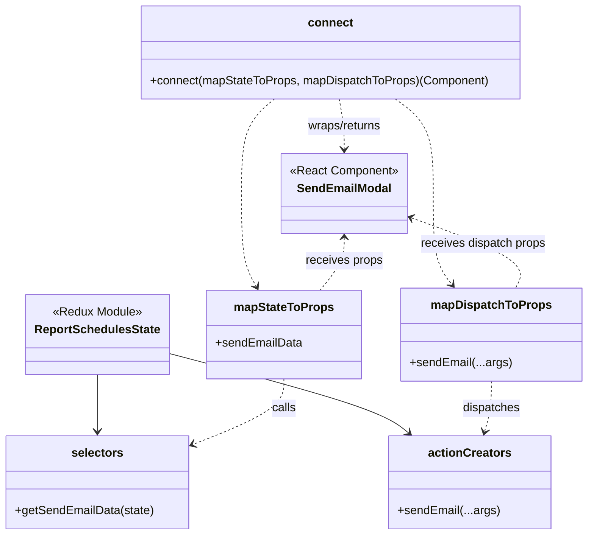

# Diagram: web/portal/src/pages/reports/bi-dashboard/components/SendEmail.modal.container.js

> Auto-generated by Obscura crawlers

## Mermaid

### SVG

<svg id="container" width="777.2578125" xmlns="http://www.w3.org/2000/svg" class="classDiagram" height="724" viewBox="0 0 777.2578125 724" role="graphics-document document" aria-roledescription="class"><g><defs><marker id="container_class-aggregationStart" class="marker aggregation class" refX="18" refY="7" markerWidth="190" markerHeight="240" orient="auto"><path d="M 18,7 L9,13 L1,7 L9,1 Z"></path></marker></defs><defs><marker id="container_class-aggregationEnd" class="marker aggregation class" refX="1" refY="7" markerWidth="20" markerHeight="28" orient="auto"><path d="M 18,7 L9,13 L1,7 L9,1 Z"></path></marker></defs><defs><marker id="container_class-extensionStart" class="marker extension class" refX="18" refY="7" markerWidth="190" markerHeight="240" orient="auto"><path d="M 1,7 L18,13 V 1 Z"></path></marker></defs><defs><marker id="container_class-extensionEnd" class="marker extension class" refX="1" refY="7" markerWidth="20" markerHeight="28" orient="auto"><path d="M 1,1 V 13 L18,7 Z"></path></marker></defs><defs><marker id="container_class-compositionStart" class="marker composition class" refX="18" refY="7" markerWidth="190" markerHeight="240" orient="auto"><path d="M 18,7 L9,13 L1,7 L9,1 Z"></path></marker></defs><defs><marker id="container_class-compositionEnd" class="marker composition class" refX="1" refY="7" markerWidth="20" markerHeight="28" orient="auto"><path d="M 18,7 L9,13 L1,7 L9,1 Z"></path></marker></defs><defs><marker id="container_class-dependencyStart" class="marker dependency class" refX="6" refY="7" markerWidth="190" markerHeight="240" orient="auto"><path d="M 5,7 L9,13 L1,7 L9,1 Z"></path></marker></defs><defs><marker id="container_class-dependencyEnd" class="marker dependency class" refX="13" refY="7" markerWidth="20" markerHeight="28" orient="auto"><path d="M 18,7 L9,13 L14,7 L9,1 Z"></path></marker></defs><defs><marker id="container_class-lollipopStart" class="marker lollipop class" refX="13" refY="7" markerWidth="190" markerHeight="240" orient="auto"><circle stroke="black" fill="transparent" cx="7" cy="7" r="6"></circle></marker></defs><defs><marker id="container_class-lollipopEnd" class="marker lollipop class" refX="1" refY="7" markerWidth="190" markerHeight="240" orient="auto"><circle stroke="black" fill="transparent" cx="7" cy="7" r="6"></circle></marker></defs><g class="root"><g class="clusters"></g><g class="edgePaths"><path d="M130.043,507L130.043,514.667C130.043,522.333,130.043,537.667,130.043,550.5C130.043,563.333,130.043,573.667,130.043,578.833L130.043,584" id="id_ReportSchedulesState_selectors_1" class="edge-thickness-normal edge-pattern-solid relation" style=";;;" data-edge="true" data-et="edge" data-id="id_ReportSchedulesState_selectors_1" data-points="W3sieCI6MTMwLjA0Mjk2ODc1LCJ5Ijo1MDd9LHsieCI6MTMwLjA0Mjk2ODc1LCJ5Ijo1NTN9LHsieCI6MTMwLjA0Mjk2ODc1LCJ5Ijo1OTB9XQ==" marker-end="url(#container_class-dependencyEnd)"></path><path d="M223.77,478.311L269.865,490.759C315.961,503.207,408.152,528.104,460.942,546.082C513.731,564.06,527.118,575.119,533.812,580.649L540.505,586.179" id="id_ReportSchedulesState_actionCreators_2" class="edge-thickness-normal edge-pattern-solid relation" style=";;;" data-edge="true" data-et="edge" data-id="id_ReportSchedulesState_actionCreators_2" data-points="W3sieCI6MjIzLjc2OTUzMTI1LCJ5Ijo0NzguMzEwOTI3NTYwOTk4OH0seyJ4Ijo1MDAuMzQzNzUsInkiOjU1M30seyJ4Ijo1NDUuMTMxMDkzNzUsInkiOjU5MH1d" marker-end="url(#container_class-dependencyEnd)"></path><path d="M376.305,513L376.305,519.667C376.305,526.333,376.305,539.667,356.528,554.364C336.751,569.061,297.198,585.123,277.422,593.154L257.645,601.184" id="id_mapStateToProps_selectors_3" class="edge-thickness-normal edge-pattern-dashed relation" style=";;;" data-edge="true" data-et="edge" data-id="id_mapStateToProps_selectors_3" data-points="W3sieCI6Mzc2LjMwNDY4NzUsInkiOjUxM30seyJ4IjozNzYuMzA0Njg3NSwieSI6NTUzfSx7IngiOjI1Mi4wODU5Mzc1LCJ5Ijo2MDMuNDQxNzYxOTcxOTg3NH1d" marker-end="url(#container_class-dependencyEnd)"></path><path d="M650.98,516L650.98,522.167C650.98,528.333,650.98,540.667,649.439,552.041C647.899,563.416,644.817,573.831,643.276,579.039L641.735,584.247" id="id_mapDispatchToProps_actionCreators_4" class="edge-thickness-normal edge-pattern-dashed relation" style=";;;" data-edge="true" data-et="edge" data-id="id_mapDispatchToProps_actionCreators_4" data-points="W3sieCI6NjUwLjk4MDQ2ODc1LCJ5Ijo1MTZ9LHsieCI6NjUwLjk4MDQ2ODc1LCJ5Ijo1NTN9LHsieCI6NjQwLjAzMjIyNjU2MjUsInkiOjU5MH1d" marker-end="url(#container_class-dependencyEnd)"></path><path d="M364.541,134L357.128,140.167C349.715,146.333,334.889,158.667,327.476,180C320.063,201.333,320.063,231.667,320.063,262C320.063,292.333,320.063,322.667,323.322,343.628C326.581,364.59,333.1,376.18,336.359,381.975L339.618,387.77" id="id_connect_mapStateToProps_5" class="edge-thickness-normal edge-pattern-dashed relation" style=";;;" data-edge="true" data-et="edge" data-id="id_connect_mapStateToProps_5" data-points="W3sieCI6MzY0LjU0MDU0Njg3NSwieSI6MTM0fSx7IngiOjMyMC4wNjI1LCJ5IjoxNzF9LHsieCI6MzIwLjA2MjUsInkiOjI2Mn0seyJ4IjozMjAuMDYyNSwieSI6MzUzfSx7IngiOjM0Mi41NTkzNzUsInkiOjM5M31d" marker-end="url(#container_class-dependencyEnd)"></path><path d="M525.579,134L533.929,140.167C542.279,146.333,558.98,158.667,567.33,180C575.68,201.333,575.68,231.667,575.68,262C575.68,292.333,575.68,322.667,579.722,343.201C583.764,363.736,591.848,374.471,595.89,379.839L599.932,385.207" id="id_connect_mapDispatchToProps_6" class="edge-thickness-normal edge-pattern-dashed relation" style=";;;" data-edge="true" data-et="edge" data-id="id_connect_mapDispatchToProps_6" data-points="W3sieCI6NTI1LjU3OTM3NSwieSI6MTM0fSx7IngiOjU3NS42Nzk2ODc1LCJ5IjoxNzF9LHsieCI6NTc1LjY3OTY4NzUsInkiOjI2Mn0seyJ4Ijo1NzUuNjc5Njg3NSwieSI6MzUzfSx7IngiOjYwMy41NDA5NzY1NjI1LCJ5IjozOTB9XQ==" marker-end="url(#container_class-dependencyEnd)"></path><path d="M449.846,134L450.784,140.167C451.721,146.333,453.595,158.667,454.532,170C455.469,181.333,455.469,191.667,455.469,196.833L455.469,202" id="id_connect_SendEmailModal_7" class="edge-thickness-normal edge-pattern-dashed relation" style=";;;" data-edge="true" data-et="edge" data-id="id_connect_SendEmailModal_7" data-points="W3sieCI6NDQ5Ljg0NjQ4NDM3NSwieSI6MTM0fSx7IngiOjQ1NS40Njg3NSwieSI6MTcxfSx7IngiOjQ1NS40Njg3NSwieSI6MjA4fV0=" marker-end="url(#container_class-dependencyEnd)"></path><path d="M455.469,322L455.469,327.167C455.469,332.333,455.469,342.667,450.191,354.5C444.914,366.333,434.358,379.667,429.081,386.333L423.803,393" id="id_SendEmailModal_mapStateToProps_8" class="edge-thickness-normal edge-pattern-dashed relation" style=";;;" data-edge="true" data-et="edge" data-id="id_SendEmailModal_mapStateToProps_8" data-points="W3sieCI6NDU1LjQ2ODc1LCJ5IjozMTZ9LHsieCI6NDU1LjQ2ODc1LCJ5IjozNTN9LHsieCI6NDIzLjgwMzEyNSwieSI6MzkzfV0=" marker-start="url(#container_class-dependencyStart)"></path><path d="M546.313,295.294L572.555,304.912C598.797,314.529,651.282,333.765,674.268,349.549C697.255,365.333,690.745,377.667,687.49,383.833L684.235,390" id="id_SendEmailModal_mapDispatchToProps_9" class="edge-thickness-normal edge-pattern-dashed relation" style=";;;" data-edge="true" data-et="edge" data-id="id_SendEmailModal_mapDispatchToProps_9" data-points="W3sieCI6NTQwLjY3OTY4NzUsInkiOjI5My4yMjk1MzI0Mzk3NDU3NX0seyJ4Ijo3MDMuNzY1NjI1LCJ5IjozNTN9LHsieCI6Njg0LjIzNTExNzE4NzUsInkiOjM5MH1d" marker-start="url(#container_class-dependencyStart)"></path></g><g class="edgeLabels"><g class="edgeLabel"><g class="label" data-id="id_ReportSchedulesState_selectors_1" transform="translate(0, 0)"><foreignObject width="0" height="0">

</foreignObject></g></g><g class="edgeLabel"><g class="label" data-id="id_ReportSchedulesState_actionCreators_2" transform="translate(0, 0)"><foreignObject width="0" height="0">

</foreignObject></g></g><g class="edgeLabel" transform="translate(376.3046875, 553)"><g class="label" data-id="id_mapStateToProps_selectors_3" transform="translate(-16.4453125, -12)"><foreignObject width="32.890625" height="24">

calls

</foreignObject></g></g><g class="edgeLabel" transform="translate(650.98046875, 553)"><g class="label" data-id="id_mapDispatchToProps_actionCreators_4" transform="translate(-39.1796875, -12)"><foreignObject width="78.359375" height="24">

dispatches

</foreignObject></g></g><g class="edgeLabel"><g class="label" data-id="id_connect_mapStateToProps_5" transform="translate(0, 0)"><foreignObject width="0" height="0">

</foreignObject></g></g><g class="edgeLabel"><g class="label" data-id="id_connect_mapDispatchToProps_6" transform="translate(0, 0)"><foreignObject width="0" height="0">

</foreignObject></g></g><g class="edgeLabel" transform="translate(455.46875, 171)"><g class="label" data-id="id_connect_SendEmailModal_7" transform="translate(-51.5703125, -12)"><foreignObject width="103.140625" height="24">

wraps/returns

</foreignObject></g></g><g class="edgeLabel" transform="translate(455.46875, 353)"><g class="label" data-id="id_SendEmailModal_mapStateToProps_8" transform="translate(-52.375, -12)"><foreignObject width="104.75" height="24">

receives props

</foreignObject></g></g><g class="edgeLabel" transform="translate(641.86421, 330.31333)"><g class="label" data-id="id_SendEmailModal_mapDispatchToProps_9" transform="translate(-85.5703125, -12)"><foreignObject width="171.140625" height="24">

receives dispatch props

</foreignObject></g></g></g><g class="nodes"><g class="node default" id="classId-SendEmailModal-0" transform="translate(455.46875, 262)"><g class="basic label-container"><path d="M-85.2109375 -54 L85.2109375 -54 L85.2109375 54 L-85.2109375 54" stroke="none" stroke-width="0" fill="#ECECFF" style=""></path><path d="M-85.2109375 -54 C-18.01928851602524 -54, 49.17236046794952 -54, 85.2109375 -54 M-85.2109375 -54 C-43.411304969273516 -54, -1.611672438547032 -54, 85.2109375 -54 M85.2109375 -54 C85.2109375 -13.45606774541011, 85.2109375 27.08786450917978, 85.2109375 54 M85.2109375 -54 C85.2109375 -15.073165423004852, 85.2109375 23.853669153990296, 85.2109375 54 M85.2109375 54 C24.004775098295013 54, -37.20138730340997 54, -85.2109375 54 M85.2109375 54 C50.937597063061666 54, 16.664256626123333 54, -85.2109375 54 M-85.2109375 54 C-85.2109375 26.398655143973436, -85.2109375 -1.2026897120531288, -85.2109375 -54 M-85.2109375 54 C-85.2109375 28.7321983287105, -85.2109375 3.4643966574209983, -85.2109375 -54" stroke="#9370DB" stroke-width="1.3" fill="none" stroke-dasharray="0 0" style=""></path></g><g class="annotation-group text" transform="translate(-73.2109375, -30)"><g class="label" style="" transform="translate(0,-12)"><foreignObject width="146.421875" height="24">

«React Component»

</foreignObject></g></g><g class="label-group text" transform="translate(-60.7578125, -6)"><g class="label" style="font-weight: bolder" transform="translate(0,-12)"><foreignObject width="121.515625" height="24">

SendEmailModal

</foreignObject></g></g><g class="members-group text" transform="translate(-73.2109375, 42)"></g><g class="methods-group text" transform="translate(-73.2109375, 72)"></g><g class="divider" style=""><path d="M-85.2109375 18 C-18.835207213020823 18, 47.540523073958354 18, 85.2109375 18 M-85.2109375 18 C-41.91824913883751 18, 1.3744392223249804 18, 85.2109375 18" stroke="#9370DB" stroke-width="1.3" fill="none" stroke-dasharray="0 0" style=""></path></g><g class="divider" style=""><path d="M-85.2109375 36 C-44.014408660057825 36, -2.8178798201156496 36, 85.2109375 36 M-85.2109375 36 C-38.994949837335675 36, 7.221037825328651 36, 85.2109375 36" stroke="#9370DB" stroke-width="1.3" fill="none" stroke-dasharray="0 0" style=""></path></g></g><g class="node default" id="classId-ReportSchedulesState-1" transform="translate(130.04296875, 453)"><g class="basic label-container"><path d="M-93.7265625 -54 L93.7265625 -54 L93.7265625 54 L-93.7265625 54" stroke="none" stroke-width="0" fill="#ECECFF" style=""></path><path d="M-93.7265625 -54 C-29.15064752110979 -54, 35.42526745778042 -54, 93.7265625 -54 M-93.7265625 -54 C-26.04844145885758 -54, 41.62967958228484 -54, 93.7265625 -54 M93.7265625 -54 C93.7265625 -15.998735423138044, 93.7265625 22.002529153723913, 93.7265625 54 M93.7265625 -54 C93.7265625 -19.254849334432983, 93.7265625 15.490301331134035, 93.7265625 54 M93.7265625 54 C24.052667353124633 54, -45.621227793750734 54, -93.7265625 54 M93.7265625 54 C50.08543166587098 54, 6.4443008317419554 54, -93.7265625 54 M-93.7265625 54 C-93.7265625 19.620710216748996, -93.7265625 -14.758579566502007, -93.7265625 -54 M-93.7265625 54 C-93.7265625 20.26265463139375, -93.7265625 -13.474690737212498, -93.7265625 -54" stroke="#9370DB" stroke-width="1.3" fill="none" stroke-dasharray="0 0" style=""></path></g><g class="annotation-group text" transform="translate(-60.4921875, -30)"><g class="label" style="" transform="translate(0,-12)"><foreignObject width="120.984375" height="24">

«Redux Module»

</foreignObject></g></g><g class="label-group text" transform="translate(-81.7265625, -6)"><g class="label" style="font-weight: bolder" transform="translate(0,-12)"><foreignObject width="163.453125" height="24">

ReportSchedulesState

</foreignObject></g></g><g class="members-group text" transform="translate(-81.7265625, 42)"></g><g class="methods-group text" transform="translate(-81.7265625, 72)"></g><g class="divider" style=""><path d="M-93.7265625 18 C-35.33366421788468 18, 23.059234064230637 18, 93.7265625 18 M-93.7265625 18 C-39.3783670865984 18, 14.969828326803196 18, 93.7265625 18" stroke="#9370DB" stroke-width="1.3" fill="none" stroke-dasharray="0 0" style=""></path></g><g class="divider" style=""><path d="M-93.7265625 36 C-29.02103026163772 36, 35.68450197672456 36, 93.7265625 36 M-93.7265625 36 C-53.39964057355472 36, -13.07271864710944 36, 93.7265625 36" stroke="#9370DB" stroke-width="1.3" fill="none" stroke-dasharray="0 0" style=""></path></g></g><g class="node default" id="classId-selectors-2" transform="translate(130.04296875, 653)"><g class="basic label-container"><path d="M-122.04296875 -63 L122.04296875 -63 L122.04296875 63 L-122.04296875 63" stroke="none" stroke-width="0" fill="#ECECFF" style=""></path><path d="M-122.04296875 -63 C-30.677045957929707 -63, 60.688876834140586 -63, 122.04296875 -63 M-122.04296875 -63 C-42.355115690274744 -63, 37.33273736945051 -63, 122.04296875 -63 M122.04296875 -63 C122.04296875 -27.16316930332762, 122.04296875 8.673661393344759, 122.04296875 63 M122.04296875 -63 C122.04296875 -19.037830098100585, 122.04296875 24.92433980379883, 122.04296875 63 M122.04296875 63 C29.245572402414723 63, -63.551823945170554 63, -122.04296875 63 M122.04296875 63 C29.881498067843182 63, -62.279972614313635 63, -122.04296875 63 M-122.04296875 63 C-122.04296875 24.316750733458385, -122.04296875 -14.36649853308323, -122.04296875 -63 M-122.04296875 63 C-122.04296875 13.345609418765342, -122.04296875 -36.308781162469316, -122.04296875 -63" stroke="#9370DB" stroke-width="1.3" fill="none" stroke-dasharray="0 0" style=""></path></g><g class="annotation-group text" transform="translate(0, -39)"></g><g class="label-group text" transform="translate(-33.4609375, -39)"><g class="label" style="font-weight: bolder" transform="translate(0,-12)"><foreignObject width="66.921875" height="24">

selectors

</foreignObject></g></g><g class="members-group text" transform="translate(-110.04296875, 9)"></g><g class="methods-group text" transform="translate(-110.04296875, 39)"><g class="label" style="" transform="translate(0,-12)"><foreignObject width="186.625" height="24">

+getSendEmailData(state)

</foreignObject></g></g><g class="divider" style=""><path d="M-122.04296875 -15 C-42.58571659055448 -15, 36.871535568891034 -15, 122.04296875 -15 M-122.04296875 -15 C-56.9972165133742 -15, 8.048535723251604 -15, 122.04296875 -15" stroke="#9370DB" stroke-width="1.3" fill="none" stroke-dasharray="0 0" style=""></path></g><g class="divider" style=""><path d="M-122.04296875 9 C-26.370352335004625 9, 69.30226407999075 9, 122.04296875 9 M-122.04296875 9 C-60.242685134614945 9, 1.5575984807701104 9, 122.04296875 9" stroke="#9370DB" stroke-width="1.3" fill="none" stroke-dasharray="0 0" style=""></path></g></g><g class="node default" id="classId-actionCreators-3" transform="translate(621.390625, 653)"><g class="basic label-container"><path d="M-106.49609375 -63 L106.49609375 -63 L106.49609375 63 L-106.49609375 63" stroke="none" stroke-width="0" fill="#ECECFF" style=""></path><path d="M-106.49609375 -63 C-63.53421976716709 -63, -20.572345784334175 -63, 106.49609375 -63 M-106.49609375 -63 C-39.005090154529356 -63, 28.48591344094129 -63, 106.49609375 -63 M106.49609375 -63 C106.49609375 -29.70181805677933, 106.49609375 3.5963638864413383, 106.49609375 63 M106.49609375 -63 C106.49609375 -30.46661252812568, 106.49609375 2.0667749437486407, 106.49609375 63 M106.49609375 63 C45.276450946278224 63, -15.943191857443551 63, -106.49609375 63 M106.49609375 63 C24.631967247808063 63, -57.23215925438387 63, -106.49609375 63 M-106.49609375 63 C-106.49609375 12.769149161209278, -106.49609375 -37.461701677581445, -106.49609375 -63 M-106.49609375 63 C-106.49609375 22.50550061455627, -106.49609375 -17.988998770887463, -106.49609375 -63" stroke="#9370DB" stroke-width="1.3" fill="none" stroke-dasharray="0 0" style=""></path></g><g class="annotation-group text" transform="translate(0, -39)"></g><g class="label-group text" transform="translate(-53.6328125, -39)"><g class="label" style="font-weight: bolder" transform="translate(0,-12)"><foreignObject width="107.265625" height="24">

actionCreators

</foreignObject></g></g><g class="members-group text" transform="translate(-94.49609375, 9)"></g><g class="methods-group text" transform="translate(-94.49609375, 39)"><g class="label" style="" transform="translate(0,-12)"><foreignObject width="135.359375" height="24">

+sendEmail(...args)

</foreignObject></g></g><g class="divider" style=""><path d="M-106.49609375 -15 C-44.612361317625755 -15, 17.27137111474849 -15, 106.49609375 -15 M-106.49609375 -15 C-43.80775131917132 -15, 18.880591111657367 -15, 106.49609375 -15" stroke="#9370DB" stroke-width="1.3" fill="none" stroke-dasharray="0 0" style=""></path></g><g class="divider" style=""><path d="M-106.49609375 9 C-48.25517169628622 9, 9.985750357427563 9, 106.49609375 9 M-106.49609375 9 C-23.615856202276788 9, 59.264381345446424 9, 106.49609375 9" stroke="#9370DB" stroke-width="1.3" fill="none" stroke-dasharray="0 0" style=""></path></g></g><g class="node default" id="classId-mapStateToProps-4" transform="translate(376.3046875, 453)"><g class="basic label-container"><path d="M-102.53515625 -60 L102.53515625 -60 L102.53515625 60 L-102.53515625 60" stroke="none" stroke-width="0" fill="#ECECFF" style=""></path><path d="M-102.53515625 -60 C-52.417710561254566 -60, -2.300264872509132 -60, 102.53515625 -60 M-102.53515625 -60 C-42.91793106130028 -60, 16.69929412739944 -60, 102.53515625 -60 M102.53515625 -60 C102.53515625 -28.04379479197103, 102.53515625 3.912410416057938, 102.53515625 60 M102.53515625 -60 C102.53515625 -20.81779715691443, 102.53515625 18.36440568617114, 102.53515625 60 M102.53515625 60 C37.03215442869627 60, -28.470847392607453 60, -102.53515625 60 M102.53515625 60 C46.71488534794711 60, -9.10538555410578 60, -102.53515625 60 M-102.53515625 60 C-102.53515625 14.051335317057912, -102.53515625 -31.897329365884175, -102.53515625 -60 M-102.53515625 60 C-102.53515625 15.804420551627494, -102.53515625 -28.39115889674501, -102.53515625 -60" stroke="#9370DB" stroke-width="1.3" fill="none" stroke-dasharray="0 0" style=""></path></g><g class="annotation-group text" transform="translate(0, -36)"></g><g class="label-group text" transform="translate(-64.7109375, -36)"><g class="label" style="font-weight: bolder" transform="translate(0,-12)"><foreignObject width="129.421875" height="24">

mapStateToProps

</foreignObject></g></g><g class="members-group text" transform="translate(-90.53515625, 12)"><g class="label" style="" transform="translate(0,-12)"><foreignObject width="116.359375" height="24">

+sendEmailData

</foreignObject></g></g><g class="methods-group text" transform="translate(-90.53515625, 60)"></g><g class="divider" style=""><path d="M-102.53515625 -12 C-48.3289750788843 -12, 5.877206092231404 -12, 102.53515625 -12 M-102.53515625 -12 C-43.39623536500165 -12, 15.742685519996698 -12, 102.53515625 -12" stroke="#9370DB" stroke-width="1.3" fill="none" stroke-dasharray="0 0" style=""></path></g><g class="divider" style=""><path d="M-102.53515625 36 C-41.788885348144035 36, 18.95738555371193 36, 102.53515625 36 M-102.53515625 36 C-48.99926765172788 36, 4.536620946544247 36, 102.53515625 36" stroke="#9370DB" stroke-width="1.3" fill="none" stroke-dasharray="0 0" style=""></path></g></g><g class="node default" id="classId-mapDispatchToProps-5" transform="translate(650.98046875, 453)"><g class="basic label-container"><path d="M-118.27734375 -63 L118.27734375 -63 L118.27734375 63 L-118.27734375 63" stroke="none" stroke-width="0" fill="#ECECFF" style=""></path><path d="M-118.27734375 -63 C-56.6921113891819 -63, 4.893120971636193 -63, 118.27734375 -63 M-118.27734375 -63 C-69.50152786428521 -63, -20.72571197857043 -63, 118.27734375 -63 M118.27734375 -63 C118.27734375 -17.82186835581812, 118.27734375 27.356263288363763, 118.27734375 63 M118.27734375 -63 C118.27734375 -18.580911103116513, 118.27734375 25.838177793766974, 118.27734375 63 M118.27734375 63 C52.60881996190315 63, -13.059703826193697 63, -118.27734375 63 M118.27734375 63 C60.31656753755331 63, 2.3557913251066225 63, -118.27734375 63 M-118.27734375 63 C-118.27734375 36.94334476277682, -118.27734375 10.886689525553635, -118.27734375 -63 M-118.27734375 63 C-118.27734375 29.57058873995142, -118.27734375 -3.8588225200971635, -118.27734375 -63" stroke="#9370DB" stroke-width="1.3" fill="none" stroke-dasharray="0 0" style=""></path></g><g class="annotation-group text" transform="translate(0, -39)"></g><g class="label-group text" transform="translate(-77.1953125, -39)"><g class="label" style="font-weight: bolder" transform="translate(0,-12)"><foreignObject width="154.390625" height="24">

mapDispatchToProps

</foreignObject></g></g><g class="members-group text" transform="translate(-106.27734375, 9)"></g><g class="methods-group text" transform="translate(-106.27734375, 39)"><g class="label" style="" transform="translate(0,-12)"><foreignObject width="135.359375" height="24">

+sendEmail(...args)

</foreignObject></g></g><g class="divider" style=""><path d="M-118.27734375 -15 C-58.764079848963306 -15, 0.7491840520733888 -15, 118.27734375 -15 M-118.27734375 -15 C-51.17868002770335 -15, 15.919983694593299 -15, 118.27734375 -15" stroke="#9370DB" stroke-width="1.3" fill="none" stroke-dasharray="0 0" style=""></path></g><g class="divider" style=""><path d="M-118.27734375 9 C-37.3105709245538 9, 43.6562019008924 9, 118.27734375 9 M-118.27734375 9 C-25.28583300832841 9, 67.70567773334318 9, 118.27734375 9" stroke="#9370DB" stroke-width="1.3" fill="none" stroke-dasharray="0 0" style=""></path></g></g><g class="node default" id="classId-connect-6" transform="translate(440.2734375, 71)"><g class="basic label-container"><path d="M-255.30859375 -63 L255.30859375 -63 L255.30859375 63 L-255.30859375 63" stroke="none" stroke-width="0" fill="#ECECFF" style=""></path><path d="M-255.30859375 -63 C-53.079725254418236 -63, 149.14914324116353 -63, 255.30859375 -63 M-255.30859375 -63 C-74.32114318649826 -63, 106.66630737700348 -63, 255.30859375 -63 M255.30859375 -63 C255.30859375 -21.01363436106965, 255.30859375 20.972731277860703, 255.30859375 63 M255.30859375 -63 C255.30859375 -21.5084201817415, 255.30859375 19.983159636517, 255.30859375 63 M255.30859375 63 C53.19255785914552 63, -148.92347803170895 63, -255.30859375 63 M255.30859375 63 C80.36206357348217 63, -94.58446660303565 63, -255.30859375 63 M-255.30859375 63 C-255.30859375 30.347079482295925, -255.30859375 -2.30584103540815, -255.30859375 -63 M-255.30859375 63 C-255.30859375 20.71827345928329, -255.30859375 -21.563453081433423, -255.30859375 -63" stroke="#9370DB" stroke-width="1.3" fill="none" stroke-dasharray="0 0" style=""></path></g><g class="annotation-group text" transform="translate(0, -39)"></g><g class="label-group text" transform="translate(-28.9140625, -39)"><g class="label" style="font-weight: bolder" transform="translate(0,-12)"><foreignObject width="57.828125" height="24">

connect

</foreignObject></g></g><g class="members-group text" transform="translate(-243.30859375, 9)"></g><g class="methods-group text" transform="translate(-243.30859375, 39)"><g class="label" style="" transform="translate(0,-12)"><foreignObject width="457.703125" height="24">

+connect(mapStateToProps, mapDispatchToProps)(Component)

</foreignObject></g></g><g class="divider" style=""><path d="M-255.30859375 -15 C-146.4508858640317 -15, -37.59317797806338 -15, 255.30859375 -15 M-255.30859375 -15 C-124.15563817615015 -15, 6.997317397699703 -15, 255.30859375 -15" stroke="#9370DB" stroke-width="1.3" fill="none" stroke-dasharray="0 0" style=""></path></g><g class="divider" style=""><path d="M-255.30859375 9 C-86.16792395327863 9, 82.97274584344274 9, 255.30859375 9 M-255.30859375 9 C-139.20093107273954 9, -23.0932683954791 9, 255.30859375 9" stroke="#9370DB" stroke-width="1.3" fill="none" stroke-dasharray="0 0" style=""></path></g></g></g></g></g></svg>
