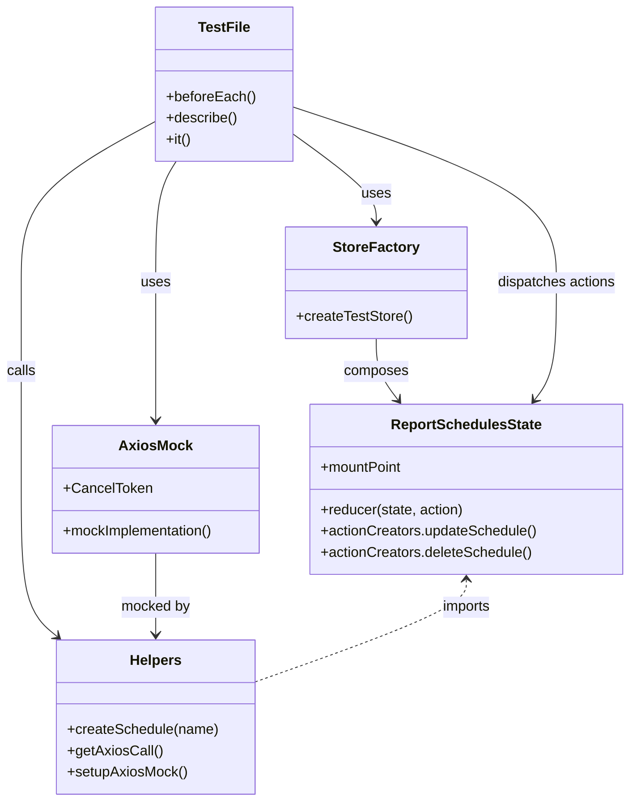

# Diagram: web/portal/src/pages/reports/bi-dashboard/components/__tests__/EmailScheduleModal.test.js


> Auto-generated by Obscura crawlers

## Diagram 1

```mermaid
flowchart TD
  A[Test Suite: EmailSchedule Integration Tests] --> B[beforeEach setup]
  B --> C[createTestStore()]
  B --> D[jest.clearAllMocks()]
  B --> E[setupAxiosMock()]
  A --> F[Update Schedule with Slashes]
  F --> F1[createSchedule("Department/Team/Report")]
  F1 --> F2[store.dispatch(updateSchedule(TEST_REPORT, schedule, updateData))]
  F2 --> F3[axios patch call]
  A --> G[Delete Schedule with Slashes]
  G --> G1[createSchedule("Old/Deprecated/Reports")]
  G1 --> G2[store.dispatch(deleteSchedule(TEST_REPORT, schedule))]
  G2 --> G3[axios delete call]
  A --> H[Redux State Management with Slashes]
  H --> H1[createSchedule("Path/To/Schedule")]
  H1 --> H2[uuidv4() -> filterSetId]
  H2 --> H3[store.dispatch(updateSchedule({reportId, filterSet}, schedule, updateData))]
  H3 --> H4[axios call contains /{filterSetId}/schedule/...]
  A --> I[URL Construction Edge Cases]
  I --> I1["/StartingSlash" => %2FStartingSlash]
  I --> I2["EndingSlash/" => EndingSlash%2F]
  I --> I3["///" => %2F%2F%2F]
```

> SVG rendering failed for this diagram.

## Diagram 2



### SVG

<svg id="container" width="710.48046875" xmlns="http://www.w3.org/2000/svg" class="classDiagram" height="904" viewBox="0 0 710.48046875 904" role="graphics-document document" aria-roledescription="class"><style>#container{font-family:"trebuchet ms",verdana,arial,sans-serif;font-size:16px;fill:#333;}@keyframes edge-animation-frame{from{stroke-dashoffset:0;}}@keyframes dash{to{stroke-dashoffset:0;}}#container .edge-animation-slow{stroke-dasharray:9,5!important;stroke-dashoffset:900;animation:dash 50s linear infinite;stroke-linecap:round;}#container .edge-animation-fast{stroke-dasharray:9,5!important;stroke-dashoffset:900;animation:dash 20s linear infinite;stroke-linecap:round;}#container .error-icon{fill:#552222;}#container .error-text{fill:#552222;stroke:#552222;}#container .edge-thickness-normal{stroke-width:1px;}#container .edge-thickness-thick{stroke-width:3.5px;}#container .edge-pattern-solid{stroke-dasharray:0;}#container .edge-thickness-invisible{stroke-width:0;fill:none;}#container .edge-pattern-dashed{stroke-dasharray:3;}#container .edge-pattern-dotted{stroke-dasharray:2;}#container .marker{fill:#333333;stroke:#333333;}#container .marker.cross{stroke:#333333;}#container svg{font-family:"trebuchet ms",verdana,arial,sans-serif;font-size:16px;}#container p{margin:0;}#container g.classGroup text{fill:#9370DB;stroke:none;font-family:"trebuchet ms",verdana,arial,sans-serif;font-size:10px;}#container g.classGroup text .title{font-weight:bolder;}#container .nodeLabel,#container .edgeLabel{color:#131300;}#container .edgeLabel .label rect{fill:#ECECFF;}#container .label text{fill:#131300;}#container .labelBkg{background:#ECECFF;}#container .edgeLabel .label span{background:#ECECFF;}#container .classTitle{font-weight:bolder;}#container .node rect,#container .node circle,#container .node ellipse,#container .node polygon,#container .node path{fill:#ECECFF;stroke:#9370DB;stroke-width:1px;}#container .divider{stroke:#9370DB;stroke-width:1;}#container g.clickable{cursor:pointer;}#container g.classGroup rect{fill:#ECECFF;stroke:#9370DB;}#container g.classGroup line{stroke:#9370DB;stroke-width:1;}#container .classLabel .box{stroke:none;stroke-width:0;fill:#ECECFF;opacity:0.5;}#container .classLabel .label{fill:#9370DB;font-size:10px;}#container .relation{stroke:#333333;stroke-width:1;fill:none;}#container .dashed-line{stroke-dasharray:3;}#container .dotted-line{stroke-dasharray:1 2;}#container #compositionStart,#container .composition{fill:#333333!important;stroke:#333333!important;stroke-width:1;}#container #compositionEnd,#container .composition{fill:#333333!important;stroke:#333333!important;stroke-width:1;}#container #dependencyStart,#container .dependency{fill:#333333!important;stroke:#333333!important;stroke-width:1;}#container #dependencyStart,#container .dependency{fill:#333333!important;stroke:#333333!important;stroke-width:1;}#container #extensionStart,#container .extension{fill:transparent!important;stroke:#333333!important;stroke-width:1;}#container #extensionEnd,#container .extension{fill:transparent!important;stroke:#333333!important;stroke-width:1;}#container #aggregationStart,#container .aggregation{fill:transparent!important;stroke:#333333!important;stroke-width:1;}#container #aggregationEnd,#container .aggregation{fill:transparent!important;stroke:#333333!important;stroke-width:1;}#container #lollipopStart,#container .lollipop{fill:#ECECFF!important;stroke:#333333!important;stroke-width:1;}#container #lollipopEnd,#container .lollipop{fill:#ECECFF!important;stroke:#333333!important;stroke-width:1;}#container .edgeTerminals{font-size:11px;line-height:initial;}#container .classTitleText{text-anchor:middle;font-size:18px;fill:#333;}#container .label-icon{display:inline-block;height:1em;overflow:visible;vertical-align:-0.125em;}#container .node .label-icon path{fill:currentColor;stroke:revert;stroke-width:revert;}#container :root{--mermaid-font-family:"trebuchet ms",verdana,arial,sans-serif;}</style><g><defs><marker id="container_class-aggregationStart" class="marker aggregation class" refX="18" refY="7" markerWidth="190" markerHeight="240" orient="auto"><path d="M 18,7 L9,13 L1,7 L9,1 Z"></path></marker></defs><defs><marker id="container_class-aggregationEnd" class="marker aggregation class" refX="1" refY="7" markerWidth="20" markerHeight="28" orient="auto"><path d="M 18,7 L9,13 L1,7 L9,1 Z"></path></marker></defs><defs><marker id="container_class-extensionStart" class="marker extension class" refX="18" refY="7" markerWidth="190" markerHeight="240" orient="auto"><path d="M 1,7 L18,13 V 1 Z"></path></marker></defs><defs><marker id="container_class-extensionEnd" class="marker extension class" refX="1" refY="7" markerWidth="20" markerHeight="28" orient="auto"><path d="M 1,1 V 13 L18,7 Z"></path></marker></defs><defs><marker id="container_class-compositionStart" class="marker composition class" refX="18" refY="7" markerWidth="190" markerHeight="240" orient="auto"><path d="M 18,7 L9,13 L1,7 L9,1 Z"></path></marker></defs><defs><marker id="container_class-compositionEnd" class="marker composition class" refX="1" refY="7" markerWidth="20" markerHeight="28" orient="auto"><path d="M 18,7 L9,13 L1,7 L9,1 Z"></path></marker></defs><defs><marker id="container_class-dependencyStart" class="marker dependency class" refX="6" refY="7" markerWidth="190" markerHeight="240" orient="auto"><path d="M 5,7 L9,13 L1,7 L9,1 Z"></path></marker></defs><defs><marker id="container_class-dependencyEnd" class="marker dependency class" refX="13" refY="7" markerWidth="20" markerHeight="28" orient="auto"><path d="M 18,7 L9,13 L14,7 L9,1 Z"></path></marker></defs><defs><marker id="container_class-lollipopStart" class="marker lollipop class" refX="13" refY="7" markerWidth="190" markerHeight="240" orient="auto"><circle stroke="black" fill="transparent" cx="7" cy="7" r="6"></circle></marker></defs><defs><marker id="container_class-lollipopEnd" class="marker lollipop class" refX="1" refY="7" markerWidth="190" markerHeight="240" orient="auto"><circle stroke="black" fill="transparent" cx="7" cy="7" r="6"></circle></marker></defs><g class="root"><g class="clusters"></g><g class="edgePaths"><path d="M200.366,182L196.59,188.167C192.813,194.333,185.26,206.667,181.484,229.5C177.707,252.333,177.707,285.667,177.707,319C177.707,352.333,177.707,385.667,177.707,411.5C177.707,437.333,177.707,455.667,177.707,464.833L177.707,474" id="id_TestFile_AxiosMock_1" class="edge-thickness-normal edge-pattern-solid relation" style=";;;" data-edge="true" data-et="edge" data-id="id_TestFile_AxiosMock_1" data-points="W3sieCI6MjAwLjM2NjM4NDE5ODU4ODcyLCJ5IjoxODJ9LHsieCI6MTc3LjcwNzAzMTI1LCJ5IjoyMTl9LHsieCI6MTc3LjcwNzAzMTI1LCJ5IjozMTl9LHsieCI6MTc3LjcwNzAzMTI1LCJ5Ijo0MTl9LHsieCI6MTc3LjcwNzAzMTI1LCJ5Ijo0ODB9XQ==" marker-end="url(#container_class-dependencyEnd)"></path><path d="M329.428,149.681L345.439,161.235C361.45,172.788,393.472,195.894,409.483,212.614C425.494,229.333,425.494,239.667,425.494,244.833L425.494,250" id="id_TestFile_StoreFactory_2" class="edge-thickness-normal edge-pattern-solid relation" style=";;;" data-edge="true" data-et="edge" data-id="id_TestFile_StoreFactory_2" data-points="W3sieCI6MzI5LjQyNzczNDM3NSwieSI6MTQ5LjY4MTQyNjU5MDU5Mzk2fSx7IngiOjQyNS40OTQxNDA2MjUsInkiOjIxOX0seyJ4Ijo0MjUuNDk0MTQwNjI1LCJ5IjoyNTZ9XQ==" marker-end="url(#container_class-dependencyEnd)"></path><path d="M425.494,382L425.494,388.167C425.494,394.333,425.494,406.667,429.596,418.205C433.698,429.744,441.901,440.487,446.003,445.859L450.104,451.231" id="id_StoreFactory_ReportSchedulesState_3" class="edge-thickness-normal edge-pattern-solid relation" style=";;;" data-edge="true" data-et="edge" data-id="id_StoreFactory_ReportSchedulesState_3" data-points="W3sieCI6NDI1LjQ5NDE0MDYyNSwieSI6MzgyfSx7IngiOjQyNS40OTQxNDA2MjUsInkiOjQxOX0seyJ4Ijo0NTMuNzQ1NjUzMTk1NDg4NywieSI6NDU2fV0=" marker-end="url(#container_class-dependencyEnd)"></path><path d="M329.428,120.061L379.29,136.551C429.152,153.041,528.876,186.02,578.738,219.177C628.6,252.333,628.6,285.667,628.6,319C628.6,352.333,628.6,385.667,624.498,407.705C620.396,429.744,612.193,440.487,608.091,445.859L603.989,451.231" id="id_TestFile_ReportSchedulesState_4" class="edge-thickness-normal edge-pattern-solid relation" style=";;;" data-edge="true" data-et="edge" data-id="id_TestFile_ReportSchedulesState_4" data-points="W3sieCI6MzI5LjQyNzczNDM3NSwieSI6MTIwLjA2MTQ2NjAxNjU4NTR9LHsieCI6NjI4LjU5OTYwOTM3NSwieSI6MjE5fSx7IngiOjYyOC41OTk2MDkzNzUsInkiOjMxOX0seyJ4Ijo2MjguNTk5NjA5Mzc1LCJ5Ijo0MTl9LHsieCI6NjAwLjM0ODA5NjgwNDUxMTIsInkiOjQ1Nn1d" marker-end="url(#container_class-dependencyEnd)"></path><path d="M177.865,135.998L152.295,149.832C126.725,163.666,75.585,191.333,50.015,221.833C24.445,252.333,24.445,285.667,24.445,319C24.445,352.333,24.445,385.667,24.445,424.5C24.445,463.333,24.445,507.667,24.445,552C24.445,596.333,24.445,640.667,31.29,668.371C38.134,696.075,51.823,707.151,58.668,712.688L65.512,718.226" id="id_TestFile_Helpers_5" class="edge-thickness-normal edge-pattern-solid relation" style=";;;" data-edge="true" data-et="edge" data-id="id_TestFile_Helpers_5" data-points="W3sieCI6MTc3Ljg2NTIzNDM3NSwieSI6MTM1Ljk5ODM3MjQwNDE1NTA1fSx7IngiOjI0LjQ0NTMxMjUsInkiOjIxOX0seyJ4IjoyNC40NDUzMTI1LCJ5IjozMTl9LHsieCI6MjQuNDQ1MzEyNSwieSI6NDE5fSx7IngiOjI0LjQ0NTMxMjUsInkiOjU1Mn0seyJ4IjoyNC40NDUzMTI1LCJ5Ijo2ODV9LHsieCI6NzAuMTc2NjMxODA0NDM1NDksInkiOjcyMn1d" marker-end="url(#container_class-dependencyEnd)"></path><path d="M177.707,624L177.707,634.167C177.707,644.333,177.707,664.667,177.707,680C177.707,695.333,177.707,705.667,177.707,710.833L177.707,716" id="id_AxiosMock_Helpers_6" class="edge-thickness-normal edge-pattern-solid relation" style=";;;" data-edge="true" data-et="edge" data-id="id_AxiosMock_Helpers_6" data-points="W3sieCI6MTc3LjcwNzAzMTI1LCJ5Ijo2MjR9LHsieCI6MTc3LjcwNzAzMTI1LCJ5Ijo2ODV9LHsieCI6MTc3LjcwNzAzMTI1LCJ5Ijo3MjJ9XQ==" marker-end="url(#container_class-dependencyEnd)"></path><path d="M527.047,654L527.047,659.167C527.047,664.333,527.047,674.667,487.382,693.913C447.716,713.159,368.385,741.318,328.72,755.397L289.055,769.477" id="id_ReportSchedulesState_Helpers_7" class="edge-thickness-normal edge-pattern-dashed relation" style=";;;" data-edge="true" data-et="edge" data-id="id_ReportSchedulesState_Helpers_7" data-points="W3sieCI6NTI3LjA0Njg3NSwieSI6NjQ4fSx7IngiOjUyNy4wNDY4NzUsInkiOjY4NX0seyJ4IjoyODkuMDU0Njg3NSwieSI6NzY5LjQ3NjU2ODUyNzY5MTd9XQ==" marker-start="url(#container_class-dependencyStart)"></path></g><g class="edgeLabels"><g class="edgeLabel" transform="translate(177.70703125, 319)"><g class="label" data-id="id_TestFile_AxiosMock_1" transform="translate(-16.4921875, -12)"><foreignObject width="32.984375" height="24"><div xmlns="http://www.w3.org/1999/xhtml" class="labelBkg" style="display: table-cell; white-space: nowrap; line-height: 1.5; max-width: 200px; text-align: center;"><span class="edgeLabel"><p>uses</p></span></div></foreignObject></g></g><g class="edgeLabel" transform="translate(425.494140625, 219)"><g class="label" data-id="id_TestFile_StoreFactory_2" transform="translate(-16.4921875, -12)"><foreignObject width="32.984375" height="24"><div xmlns="http://www.w3.org/1999/xhtml" class="labelBkg" style="display: table-cell; white-space: nowrap; line-height: 1.5; max-width: 200px; text-align: center;"><span class="edgeLabel"><p>uses</p></span></div></foreignObject></g></g><g class="edgeLabel" transform="translate(425.494140625, 419)"><g class="label" data-id="id_StoreFactory_ReportSchedulesState_3" transform="translate(-36.453125, -12)"><foreignObject width="72.90625" height="24"><div xmlns="http://www.w3.org/1999/xhtml" class="labelBkg" style="display: table-cell; white-space: nowrap; line-height: 1.5; max-width: 200px; text-align: center;"><span class="edgeLabel"><p>composes</p></span></div></foreignObject></g></g><g class="edgeLabel" transform="translate(628.599609375, 319)"><g class="label" data-id="id_TestFile_ReportSchedulesState_4" transform="translate(-67.71875, -12)"><foreignObject width="135.4375" height="24"><div xmlns="http://www.w3.org/1999/xhtml" class="labelBkg" style="display: table-cell; white-space: nowrap; line-height: 1.5; max-width: 200px; text-align: center;"><span class="edgeLabel"><p>dispatches actions</p></span></div></foreignObject></g></g><g class="edgeLabel" transform="translate(24.4453125, 419)"><g class="label" data-id="id_TestFile_Helpers_5" transform="translate(-16.4453125, -12)"><foreignObject width="32.890625" height="24"><div xmlns="http://www.w3.org/1999/xhtml" class="labelBkg" style="display: table-cell; white-space: nowrap; line-height: 1.5; max-width: 200px; text-align: center;"><span class="edgeLabel"><p>calls</p></span></div></foreignObject></g></g><g class="edgeLabel" transform="translate(177.70703125, 685)"><g class="label" data-id="id_AxiosMock_Helpers_6" transform="translate(-39.296875, -12)"><foreignObject width="78.59375" height="24"><div xmlns="http://www.w3.org/1999/xhtml" class="labelBkg" style="display: table-cell; white-space: nowrap; line-height: 1.5; max-width: 200px; text-align: center;"><span class="edgeLabel"><p>mocked by</p></span></div></foreignObject></g></g><g class="edgeLabel" transform="translate(527.046875, 685)"><g class="label" data-id="id_ReportSchedulesState_Helpers_7" transform="translate(-28.25, -12)"><foreignObject width="56.5" height="24"><div xmlns="http://www.w3.org/1999/xhtml" class="labelBkg" style="display: table-cell; white-space: nowrap; line-height: 1.5; max-width: 200px; text-align: center;"><span class="edgeLabel"><p>imports</p></span></div></foreignObject></g></g></g><g class="nodes"><g class="node default" id="classId-TestFile-0" transform="translate(253.646484375, 95)"><g class="basic label-container"><path d="M-75.78125 -87 L75.78125 -87 L75.78125 87 L-75.78125 87" stroke="none" stroke-width="0" fill="#ECECFF" style=""></path><path d="M-75.78125 -87 C-17.372747051242655 -87, 41.03575589751469 -87, 75.78125 -87 M-75.78125 -87 C-40.269074245053126 -87, -4.756898490106252 -87, 75.78125 -87 M75.78125 -87 C75.78125 -34.7159340737497, 75.78125 17.5681318525006, 75.78125 87 M75.78125 -87 C75.78125 -30.13540628332816, 75.78125 26.729187433343682, 75.78125 87 M75.78125 87 C20.865121892536173 87, -34.051006214927654 87, -75.78125 87 M75.78125 87 C44.70280582217214 87, 13.624361644344269 87, -75.78125 87 M-75.78125 87 C-75.78125 26.174513016374284, -75.78125 -34.65097396725143, -75.78125 -87 M-75.78125 87 C-75.78125 24.097567290507087, -75.78125 -38.80486541898583, -75.78125 -87" stroke="#9370DB" stroke-width="1.3" fill="none" stroke-dasharray="0 0" style=""></path></g><g class="annotation-group text" transform="translate(0, -63)"></g><g class="label-group text" transform="translate(-27.921875, -63)"><g class="label" style="font-weight: bolder" transform="translate(0,-12)"><foreignObject width="55.84375" height="24"><div xmlns="http://www.w3.org/1999/xhtml" style="display: table-cell; white-space: nowrap; line-height: 1.5; max-width: 105px; text-align: center;"><span class="nodeLabel markdown-node-label" style=""><p>TestFile</p></span></div></foreignObject></g></g><g class="members-group text" transform="translate(-63.78125, -15)"></g><g class="methods-group text" transform="translate(-63.78125, 15)"><g class="label" style="" transform="translate(0,-12)"><foreignObject width="99.640625" height="24"><div xmlns="http://www.w3.org/1999/xhtml" style="display: table-cell; white-space: nowrap; line-height: 1.5; max-width: 157px; text-align: center;"><span class="nodeLabel markdown-node-label" style=""><p>+beforeEach()</p></span></div></foreignObject></g><g class="label" style="" transform="translate(0,12)"><foreignObject width="80.6875" height="24"><div xmlns="http://www.w3.org/1999/xhtml" style="display: table-cell; white-space: nowrap; line-height: 1.5; max-width: 138px; text-align: center;"><span class="nodeLabel markdown-node-label" style=""><p>+describe()</p></span></div></foreignObject></g><g class="label" style="" transform="translate(0,36)"><foreignObject width="28.640625" height="24"><div xmlns="http://www.w3.org/1999/xhtml" style="display: table-cell; white-space: nowrap; line-height: 1.5; max-width: 86px; text-align: center;"><span class="nodeLabel markdown-node-label" style=""><p>+it()</p></span></div></foreignObject></g></g><g class="divider" style=""><path d="M-75.78125 -39 C-35.43152507614989 -39, 4.9181998477002224 -39, 75.78125 -39 M-75.78125 -39 C-41.58643300969781 -39, -7.391616019395613 -39, 75.78125 -39" stroke="#9370DB" stroke-width="1.3" fill="none" stroke-dasharray="0 0" style=""></path></g><g class="divider" style=""><path d="M-75.78125 -15 C-24.596772816797234 -15, 26.587704366405532 -15, 75.78125 -15 M-75.78125 -15 C-42.01793447160308 -15, -8.254618943206154 -15, 75.78125 -15" stroke="#9370DB" stroke-width="1.3" fill="none" stroke-dasharray="0 0" style=""></path></g></g><g class="node default" id="classId-AxiosMock-1" transform="translate(177.70703125, 552)"><g class="basic label-container"><path d="M-118.26171875 -72 L118.26171875 -72 L118.26171875 72 L-118.26171875 72" stroke="none" stroke-width="0" fill="#ECECFF" style=""></path><path d="M-118.26171875 -72 C-54.23342713645137 -72, 9.794864477097263 -72, 118.26171875 -72 M-118.26171875 -72 C-30.971629680912457 -72, 56.318459388175086 -72, 118.26171875 -72 M118.26171875 -72 C118.26171875 -15.232056878993347, 118.26171875 41.535886242013305, 118.26171875 72 M118.26171875 -72 C118.26171875 -20.347163554414678, 118.26171875 31.305672891170644, 118.26171875 72 M118.26171875 72 C26.825499361264775 72, -64.61072002747045 72, -118.26171875 72 M118.26171875 72 C47.22322121687479 72, -23.81527631625042 72, -118.26171875 72 M-118.26171875 72 C-118.26171875 28.892604666627705, -118.26171875 -14.214790666744591, -118.26171875 -72 M-118.26171875 72 C-118.26171875 16.655494539105227, -118.26171875 -38.689010921789546, -118.26171875 -72" stroke="#9370DB" stroke-width="1.3" fill="none" stroke-dasharray="0 0" style=""></path></g><g class="annotation-group text" transform="translate(0, -48)"></g><g class="label-group text" transform="translate(-38.8203125, -48)"><g class="label" style="font-weight: bolder" transform="translate(0,-12)"><foreignObject width="77.640625" height="24"><div xmlns="http://www.w3.org/1999/xhtml" style="display: table-cell; white-space: nowrap; line-height: 1.5; max-width: 127px; text-align: center;"><span class="nodeLabel markdown-node-label" style=""><p>AxiosMock</p></span></div></foreignObject></g></g><g class="members-group text" transform="translate(-106.26171875, 0)"><g class="label" style="" transform="translate(0,-12)"><foreignObject width="98.484375" height="24"><div xmlns="http://www.w3.org/1999/xhtml" style="display: table-cell; white-space: nowrap; line-height: 1.5; max-width: 156px; text-align: center;"><span class="nodeLabel markdown-node-label" style=""><p>+CancelToken</p></span></div></foreignObject></g></g><g class="methods-group text" transform="translate(-106.26171875, 48)"><g class="label" style="" transform="translate(0,-12)"><foreignObject width="173.703125" height="24"><div xmlns="http://www.w3.org/1999/xhtml" style="display: table-cell; white-space: nowrap; line-height: 1.5; max-width: 231px; text-align: center;"><span class="nodeLabel markdown-node-label" style=""><p>+mockImplementation()</p></span></div></foreignObject></g></g><g class="divider" style=""><path d="M-118.26171875 -24 C-31.39825013688167 -24, 55.46521847623666 -24, 118.26171875 -24 M-118.26171875 -24 C-57.751942299485286 -24, 2.757834151029428 -24, 118.26171875 -24" stroke="#9370DB" stroke-width="1.3" fill="none" stroke-dasharray="0 0" style=""></path></g><g class="divider" style=""><path d="M-118.26171875 24 C-27.991196537748323 24, 62.279325674503355 24, 118.26171875 24 M-118.26171875 24 C-27.920404399053325 24, 62.42090995189335 24, 118.26171875 24" stroke="#9370DB" stroke-width="1.3" fill="none" stroke-dasharray="0 0" style=""></path></g></g><g class="node default" id="classId-StoreFactory-2" transform="translate(425.494140625, 319)"><g class="basic label-container"><path d="M-100.38671875 -63 L100.38671875 -63 L100.38671875 63 L-100.38671875 63" stroke="none" stroke-width="0" fill="#ECECFF" style=""></path><path d="M-100.38671875 -63 C-58.956810320846955 -63, -17.52690189169391 -63, 100.38671875 -63 M-100.38671875 -63 C-59.682381414623514 -63, -18.978044079247027 -63, 100.38671875 -63 M100.38671875 -63 C100.38671875 -26.17930137970344, 100.38671875 10.641397240593122, 100.38671875 63 M100.38671875 -63 C100.38671875 -17.28329518127699, 100.38671875 28.43340963744602, 100.38671875 63 M100.38671875 63 C41.05951244618888 63, -18.267693857622234 63, -100.38671875 63 M100.38671875 63 C27.353902696448273 63, -45.678913357103454 63, -100.38671875 63 M-100.38671875 63 C-100.38671875 35.916612437099474, -100.38671875 8.833224874198947, -100.38671875 -63 M-100.38671875 63 C-100.38671875 30.94845288453522, -100.38671875 -1.1030942309295568, -100.38671875 -63" stroke="#9370DB" stroke-width="1.3" fill="none" stroke-dasharray="0 0" style=""></path></g><g class="annotation-group text" transform="translate(0, -39)"></g><g class="label-group text" transform="translate(-46.1796875, -39)"><g class="label" style="font-weight: bolder" transform="translate(0,-12)"><foreignObject width="92.359375" height="24"><div xmlns="http://www.w3.org/1999/xhtml" style="display: table-cell; white-space: nowrap; line-height: 1.5; max-width: 140px; text-align: center;"><span class="nodeLabel markdown-node-label" style=""><p>StoreFactory</p></span></div></foreignObject></g></g><g class="members-group text" transform="translate(-88.38671875, 9)"></g><g class="methods-group text" transform="translate(-88.38671875, 39)"><g class="label" style="" transform="translate(0,-12)"><foreignObject width="130.59375" height="24"><div xmlns="http://www.w3.org/1999/xhtml" style="display: table-cell; white-space: nowrap; line-height: 1.5; max-width: 188px; text-align: center;"><span class="nodeLabel markdown-node-label" style=""><p>+createTestStore()</p></span></div></foreignObject></g></g><g class="divider" style=""><path d="M-100.38671875 -15 C-50.80024516033216 -15, -1.2137715706643206 -15, 100.38671875 -15 M-100.38671875 -15 C-29.761185611890767 -15, 40.86434752621847 -15, 100.38671875 -15" stroke="#9370DB" stroke-width="1.3" fill="none" stroke-dasharray="0 0" style=""></path></g><g class="divider" style=""><path d="M-100.38671875 9 C-36.41317965177833 9, 27.560359446443343 9, 100.38671875 9 M-100.38671875 9 C-33.49643564375192 9, 33.393847462496154 9, 100.38671875 9" stroke="#9370DB" stroke-width="1.3" fill="none" stroke-dasharray="0 0" style=""></path></g></g><g class="node default" id="classId-ReportSchedulesState-3" transform="translate(527.046875, 552)"><g class="basic label-container"><path d="M-175.43359375 -96 L175.43359375 -96 L175.43359375 96 L-175.43359375 96" stroke="none" stroke-width="0" fill="#ECECFF" style=""></path><path d="M-175.43359375 -96 C-73.19989971668024 -96, 29.03379431663953 -96, 175.43359375 -96 M-175.43359375 -96 C-103.30575270503869 -96, -31.17791166007737 -96, 175.43359375 -96 M175.43359375 -96 C175.43359375 -36.7604214453544, 175.43359375 22.479157109291194, 175.43359375 96 M175.43359375 -96 C175.43359375 -54.74723990135418, 175.43359375 -13.494479802708355, 175.43359375 96 M175.43359375 96 C80.57287117073335 96, -14.2878514085333 96, -175.43359375 96 M175.43359375 96 C40.44609379495398 96, -94.54140616009204 96, -175.43359375 96 M-175.43359375 96 C-175.43359375 30.52657155772198, -175.43359375 -34.94685688455604, -175.43359375 -96 M-175.43359375 96 C-175.43359375 20.773160718020918, -175.43359375 -54.453678563958164, -175.43359375 -96" stroke="#9370DB" stroke-width="1.3" fill="none" stroke-dasharray="0 0" style=""></path></g><g class="annotation-group text" transform="translate(0, -72)"></g><g class="label-group text" transform="translate(-81.7265625, -72)"><g class="label" style="font-weight: bolder" transform="translate(0,-12)"><foreignObject width="163.453125" height="24"><div xmlns="http://www.w3.org/1999/xhtml" style="display: table-cell; white-space: nowrap; line-height: 1.5; max-width: 210px; text-align: center;"><span class="nodeLabel markdown-node-label" style=""><p>ReportSchedulesState</p></span></div></foreignObject></g></g><g class="members-group text" transform="translate(-163.43359375, -24)"><g class="label" style="" transform="translate(0,-12)"><foreignObject width="93.34375" height="24"><div xmlns="http://www.w3.org/1999/xhtml" style="display: table-cell; white-space: nowrap; line-height: 1.5; max-width: 151px; text-align: center;"><span class="nodeLabel markdown-node-label" style=""><p>+mountPoint</p></span></div></foreignObject></g></g><g class="methods-group text" transform="translate(-163.43359375, 24)"><g class="label" style="" transform="translate(0,-12)"><foreignObject width="163.25" height="24"><div xmlns="http://www.w3.org/1999/xhtml" style="display: table-cell; white-space: nowrap; line-height: 1.5; max-width: 221px; text-align: center;"><span class="nodeLabel markdown-node-label" style=""><p>+reducer(state, action)</p></span></div></foreignObject></g><g class="label" style="" transform="translate(0,12)"><foreignObject width="245.140625" height="24"><div xmlns="http://www.w3.org/1999/xhtml" style="display: table-cell; white-space: nowrap; line-height: 1.5; max-width: 303px; text-align: center;"><span class="nodeLabel markdown-node-label" style=""><p>+actionCreators.updateSchedule()</p></span></div></foreignObject></g><g class="label" style="" transform="translate(0,36)"><foreignObject width="239.671875" height="24"><div xmlns="http://www.w3.org/1999/xhtml" style="display: table-cell; white-space: nowrap; line-height: 1.5; max-width: 297px; text-align: center;"><span class="nodeLabel markdown-node-label" style=""><p>+actionCreators.deleteSchedule()</p></span></div></foreignObject></g></g><g class="divider" style=""><path d="M-175.43359375 -48 C-87.71396752877736 -48, 0.005658692445280167 -48, 175.43359375 -48 M-175.43359375 -48 C-66.3396593857548 -48, 42.7542749784904 -48, 175.43359375 -48" stroke="#9370DB" stroke-width="1.3" fill="none" stroke-dasharray="0 0" style=""></path></g><g class="divider" style=""><path d="M-175.43359375 0 C-43.86174600852473 0, 87.71010173295053 0, 175.43359375 0 M-175.43359375 0 C-63.1159318977319 0, 49.201729954536205 0, 175.43359375 0" stroke="#9370DB" stroke-width="1.3" fill="none" stroke-dasharray="0 0" style=""></path></g></g><g class="node default" id="classId-Helpers-4" transform="translate(177.70703125, 809)"><g class="basic label-container"><path d="M-111.34765625 -87 L111.34765625 -87 L111.34765625 87 L-111.34765625 87" stroke="none" stroke-width="0" fill="#ECECFF" style=""></path><path d="M-111.34765625 -87 C-27.74084456968518 -87, 55.86596711062964 -87, 111.34765625 -87 M-111.34765625 -87 C-55.88329662617298 -87, -0.418937002345956 -87, 111.34765625 -87 M111.34765625 -87 C111.34765625 -47.88048258078453, 111.34765625 -8.760965161569061, 111.34765625 87 M111.34765625 -87 C111.34765625 -26.896621875641706, 111.34765625 33.20675624871659, 111.34765625 87 M111.34765625 87 C36.3399196043318 87, -38.667817041336406 87, -111.34765625 87 M111.34765625 87 C31.441622503096255 87, -48.46441124380749 87, -111.34765625 87 M-111.34765625 87 C-111.34765625 24.681217953032075, -111.34765625 -37.63756409393585, -111.34765625 -87 M-111.34765625 87 C-111.34765625 29.42619637629597, -111.34765625 -28.14760724740806, -111.34765625 -87" stroke="#9370DB" stroke-width="1.3" fill="none" stroke-dasharray="0 0" style=""></path></g><g class="annotation-group text" transform="translate(0, -63)"></g><g class="label-group text" transform="translate(-28.2890625, -63)"><g class="label" style="font-weight: bolder" transform="translate(0,-12)"><foreignObject width="56.578125" height="24"><div xmlns="http://www.w3.org/1999/xhtml" style="display: table-cell; white-space: nowrap; line-height: 1.5; max-width: 106px; text-align: center;"><span class="nodeLabel markdown-node-label" style=""><p>Helpers</p></span></div></foreignObject></g></g><g class="members-group text" transform="translate(-99.34765625, -15)"></g><g class="methods-group text" transform="translate(-99.34765625, 15)"><g class="label" style="" transform="translate(0,-12)"><foreignObject width="170.40625" height="24"><div xmlns="http://www.w3.org/1999/xhtml" style="display: table-cell; white-space: nowrap; line-height: 1.5; max-width: 228px; text-align: center;"><span class="nodeLabel markdown-node-label" style=""><p>+createSchedule(name)</p></span></div></foreignObject></g><g class="label" style="" transform="translate(0,12)"><foreignObject width="105.890625" height="24"><div xmlns="http://www.w3.org/1999/xhtml" style="display: table-cell; white-space: nowrap; line-height: 1.5; max-width: 163px; text-align: center;"><span class="nodeLabel markdown-node-label" style=""><p>+getAxiosCall()</p></span></div></foreignObject></g><g class="label" style="" transform="translate(0,36)"><foreignObject width="135.03125" height="24"><div xmlns="http://www.w3.org/1999/xhtml" style="display: table-cell; white-space: nowrap; line-height: 1.5; max-width: 192px; text-align: center;"><span class="nodeLabel markdown-node-label" style=""><p>+setupAxiosMock()</p></span></div></foreignObject></g></g><g class="divider" style=""><path d="M-111.34765625 -39 C-25.338131871052752 -39, 60.671392507894495 -39, 111.34765625 -39 M-111.34765625 -39 C-55.73611542137977 -39, -0.12457459275954363 -39, 111.34765625 -39" stroke="#9370DB" stroke-width="1.3" fill="none" stroke-dasharray="0 0" style=""></path></g><g class="divider" style=""><path d="M-111.34765625 -15 C-57.63965516997406 -15, -3.9316540899481254 -15, 111.34765625 -15 M-111.34765625 -15 C-31.305916081090942 -15, 48.735824087818116 -15, 111.34765625 -15" stroke="#9370DB" stroke-width="1.3" fill="none" stroke-dasharray="0 0" style=""></path></g></g></g></g></g></svg>
