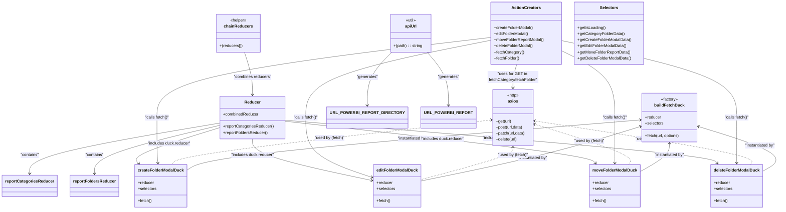

# Diagram: web/portal/src/pages/reports/redux/ReportFolderModalState.js


> Auto-generated by Obscura crawlers

## Diagram 1



### SVG

<svg id="container" width="3042.239013671875" xmlns="http://www.w3.org/2000/svg" class="classDiagram" height="824" viewBox="0 0 3042.239013671875 824" role="graphics-document document" aria-roledescription="class"><style>#container{font-family:"trebuchet ms",verdana,arial,sans-serif;font-size:16px;fill:#333;}@keyframes edge-animation-frame{from{stroke-dashoffset:0;}}@keyframes dash{to{stroke-dashoffset:0;}}#container .edge-animation-slow{stroke-dasharray:9,5!important;stroke-dashoffset:900;animation:dash 50s linear infinite;stroke-linecap:round;}#container .edge-animation-fast{stroke-dasharray:9,5!important;stroke-dashoffset:900;animation:dash 20s linear infinite;stroke-linecap:round;}#container .error-icon{fill:#552222;}#container .error-text{fill:#552222;stroke:#552222;}#container .edge-thickness-normal{stroke-width:1px;}#container .edge-thickness-thick{stroke-width:3.5px;}#container .edge-pattern-solid{stroke-dasharray:0;}#container .edge-thickness-invisible{stroke-width:0;fill:none;}#container .edge-pattern-dashed{stroke-dasharray:3;}#container .edge-pattern-dotted{stroke-dasharray:2;}#container .marker{fill:#333333;stroke:#333333;}#container .marker.cross{stroke:#333333;}#container svg{font-family:"trebuchet ms",verdana,arial,sans-serif;font-size:16px;}#container p{margin:0;}#container g.classGroup text{fill:#9370DB;stroke:none;font-family:"trebuchet ms",verdana,arial,sans-serif;font-size:10px;}#container g.classGroup text .title{font-weight:bolder;}#container .nodeLabel,#container .edgeLabel{color:#131300;}#container .edgeLabel .label rect{fill:#ECECFF;}#container .label text{fill:#131300;}#container .labelBkg{background:#ECECFF;}#container .edgeLabel .label span{background:#ECECFF;}#container .classTitle{font-weight:bolder;}#container .node rect,#container .node circle,#container .node ellipse,#container .node polygon,#container .node path{fill:#ECECFF;stroke:#9370DB;stroke-width:1px;}#container .divider{stroke:#9370DB;stroke-width:1;}#container g.clickable{cursor:pointer;}#container g.classGroup rect{fill:#ECECFF;stroke:#9370DB;}#container g.classGroup line{stroke:#9370DB;stroke-width:1;}#container .classLabel .box{stroke:none;stroke-width:0;fill:#ECECFF;opacity:0.5;}#container .classLabel .label{fill:#9370DB;font-size:10px;}#container .relation{stroke:#333333;stroke-width:1;fill:none;}#container .dashed-line{stroke-dasharray:3;}#container .dotted-line{stroke-dasharray:1 2;}#container #compositionStart,#container .composition{fill:#333333!important;stroke:#333333!important;stroke-width:1;}#container #compositionEnd,#container .composition{fill:#333333!important;stroke:#333333!important;stroke-width:1;}#container #dependencyStart,#container .dependency{fill:#333333!important;stroke:#333333!important;stroke-width:1;}#container #dependencyStart,#container .dependency{fill:#333333!important;stroke:#333333!important;stroke-width:1;}#container #extensionStart,#container .extension{fill:transparent!important;stroke:#333333!important;stroke-width:1;}#container #extensionEnd,#container .extension{fill:transparent!important;stroke:#333333!important;stroke-width:1;}#container #aggregationStart,#container .aggregation{fill:transparent!important;stroke:#333333!important;stroke-width:1;}#container #aggregationEnd,#container .aggregation{fill:transparent!important;stroke:#333333!important;stroke-width:1;}#container #lollipopStart,#container .lollipop{fill:#ECECFF!important;stroke:#333333!important;stroke-width:1;}#container #lollipopEnd,#container .lollipop{fill:#ECECFF!important;stroke:#333333!important;stroke-width:1;}#container .edgeTerminals{font-size:11px;line-height:initial;}#container .classTitleText{text-anchor:middle;font-size:18px;fill:#333;}#container .label-icon{display:inline-block;height:1em;overflow:visible;vertical-align:-0.125em;}#container .node .label-icon path{fill:currentColor;stroke:revert;stroke-width:revert;}#container :root{--mermaid-font-family:"trebuchet ms",verdana,arial,sans-serif;}</style><g><defs><marker id="container_class-aggregationStart" class="marker aggregation class" refX="18" refY="7" markerWidth="190" markerHeight="240" orient="auto"><path d="M 18,7 L9,13 L1,7 L9,1 Z"></path></marker></defs><defs><marker id="container_class-aggregationEnd" class="marker aggregation class" refX="1" refY="7" markerWidth="20" markerHeight="28" orient="auto"><path d="M 18,7 L9,13 L1,7 L9,1 Z"></path></marker></defs><defs><marker id="container_class-extensionStart" class="marker extension class" refX="18" refY="7" markerWidth="190" markerHeight="240" orient="auto"><path d="M 1,7 L18,13 V 1 Z"></path></marker></defs><defs><marker id="container_class-extensionEnd" class="marker extension class" refX="1" refY="7" markerWidth="20" markerHeight="28" orient="auto"><path d="M 1,1 V 13 L18,7 Z"></path></marker></defs><defs><marker id="container_class-compositionStart" class="marker composition class" refX="18" refY="7" markerWidth="190" markerHeight="240" orient="auto"><path d="M 18,7 L9,13 L1,7 L9,1 Z"></path></marker></defs><defs><marker id="container_class-compositionEnd" class="marker composition class" refX="1" refY="7" markerWidth="20" markerHeight="28" orient="auto"><path d="M 18,7 L9,13 L1,7 L9,1 Z"></path></marker></defs><defs><marker id="container_class-dependencyStart" class="marker dependency class" refX="6" refY="7" markerWidth="190" markerHeight="240" orient="auto"><path d="M 5,7 L9,13 L1,7 L9,1 Z"></path></marker></defs><defs><marker id="container_class-dependencyEnd" class="marker dependency class" refX="13" refY="7" markerWidth="20" markerHeight="28" orient="auto"><path d="M 18,7 L9,13 L14,7 L9,1 Z"></path></marker></defs><defs><marker id="container_class-lollipopStart" class="marker lollipop class" refX="13" refY="7" markerWidth="190" markerHeight="240" orient="auto"><circle stroke="black" fill="transparent" cx="7" cy="7" r="6"></circle></marker></defs><defs><marker id="container_class-lollipopEnd" class="marker lollipop class" refX="1" refY="7" markerWidth="190" markerHeight="240" orient="auto"><circle stroke="black" fill="transparent" cx="7" cy="7" r="6"></circle></marker></defs><g class="root"><g class="clusters"></g><g class="edgePaths"><path d="M2486.445,472.618L2210.195,495.682C1933.945,518.746,1381.445,564.873,1087.127,598.507C792.809,632.142,756.673,653.284,738.605,663.855L720.537,674.426" id="id_buildFetchDuck_createFolderModalDuck_1" class="edge-thickness-normal edge-pattern-solid relation" style=";;;" data-edge="true" data-et="edge" data-id="id_buildFetchDuck_createFolderModalDuck_1" data-points="W3sieCI6MjQ5Mi40MjM4MjgxMjUsInkiOjQ3Mi4xMTkxMzE4MDAwMjc1Nn0seyJ4Ijo4MjguOTQ1MzEyNSwieSI6NjExfSx7IngiOjcyMC41MzcxMDkzNzUsInkiOjY3NC40MjU4OTg4MTg1NzQyfV0=" marker-start="url(#container_class-dependencyStart)"></path><path d="M2486.675,497.359L2423.296,516.299C2359.917,535.239,2233.159,573.12,2091.224,608.991C1949.288,644.861,1792.176,678.723,1713.62,695.654L1635.064,712.584" id="id_buildFetchDuck_editFolderModalDuck_2" class="edge-thickness-normal edge-pattern-solid relation" style=";;;" data-edge="true" data-et="edge" data-id="id_buildFetchDuck_editFolderModalDuck_2" data-points="W3sieCI6MjQ5Mi40MjM4MjgxMjUsInkiOjQ5NS42NDExNTM0NTc4NDk1NX0seyJ4IjoyMTA2LjQwMDM5MDYyNSwieSI6NjExfSx7IngiOjE2MzUuMDY0NDUzMTI1LCJ5Ijo3MTIuNTg0MzAwNDY0Nzc5N31d" marker-start="url(#container_class-dependencyStart)"></path><path d="M2601.65,565L2601.65,572.667C2601.65,580.333,2601.65,595.667,2579.829,615.002C2558.008,634.337,2514.367,657.674,2492.546,669.343L2470.725,681.012" id="id_buildFetchDuck_moveFolderModalDuck_3" class="edge-thickness-normal edge-pattern-solid relation" style=";;;" data-edge="true" data-et="edge" data-id="id_buildFetchDuck_moveFolderModalDuck_3" data-points="W3sieCI6MjYwMS42NTAzOTA2MjUsInkiOjU1OX0seyJ4IjoyNjAxLjY1MDM5MDYyNSwieSI6NjExfSx7IngiOjI0NzAuNzI0NjA5Mzc1LCJ5Ijo2ODEuMDExNTE0NDkyMzc4M31d" marker-start="url(#container_class-dependencyStart)"></path><path d="M2716.626,497.359L2780.005,516.299C2843.384,535.239,2970.142,573.12,3012.284,603.417C3054.425,633.713,3011.95,656.427,2990.712,667.783L2969.475,679.14" id="id_buildFetchDuck_deleteFolderModalDuck_4" class="edge-thickness-normal edge-pattern-solid relation" style=";;;" data-edge="true" data-et="edge" data-id="id_buildFetchDuck_deleteFolderModalDuck_4" data-points="W3sieCI6MjcxMC44NzY5NTMxMjUsInkiOjQ5NS42NDExNTM0NTc4NDk1NX0seyJ4IjozMDk2LjkwMDM5MDYyNSwieSI6NjExfSx7IngiOjI5NjkuNDc0NjA5Mzc1LCJ5Ijo2NzkuMTM5OTE3NDgyMzQ4NH1d" marker-start="url(#container_class-dependencyStart)"></path><path d="M1520.772,206L1505.616,222.167C1490.46,238.333,1460.148,270.667,1444.992,305.5C1429.836,340.333,1429.836,377.667,1429.836,396.333L1429.836,415" id="id_apiUrl_URL_POWERBI_REPORT_DIRECTORY_5" class="edge-thickness-normal edge-pattern-solid relation" style=";;;" data-edge="true" data-et="edge" data-id="id_apiUrl_URL_POWERBI_REPORT_DIRECTORY_5" data-points="W3sieCI6MTUyMC43NzIzMzYwMjgzNDMsInkiOjIwNn0seyJ4IjoxNDI5LjgzNTkzNzUsInkiOjMwM30seyJ4IjoxNDI5LjgzNTkzNzUsInkiOjQyMX1d" marker-end="url(#container_class-dependencyEnd)"></path><path d="M1646.006,206L1657.845,222.167C1669.684,238.333,1693.361,270.667,1705.2,305.5C1717.039,340.333,1717.039,377.667,1717.039,396.333L1717.039,415" id="id_apiUrl_URL_POWERBI_REPORT_6" class="edge-thickness-normal edge-pattern-solid relation" style=";;;" data-edge="true" data-et="edge" data-id="id_apiUrl_URL_POWERBI_REPORT_6" data-points="W3sieCI6MTY0Ni4wMDYyNTY4MTMyMjY2LCJ5IjoyMDZ9LHsieCI6MTcxNy4wMzkwNjI1LCJ5IjozMDN9LHsieCI6MTcxNy4wMzkwNjI1LCJ5Ijo0MjF9XQ==" marker-end="url(#container_class-dependencyEnd)"></path><path d="M1877.214,473.174L1678.941,496.145C1480.669,519.116,1084.123,565.058,882.515,594.196C680.907,623.333,674.236,635.667,670.901,641.833L667.565,648" id="id_axios_createFolderModalDuck_7" class="edge-thickness-normal edge-pattern-dashed relation" style=";;;" data-edge="true" data-et="edge" data-id="id_axios_createFolderModalDuck_7" data-points="W3sieCI6MTg4My4xNzM4MjgxMjUsInkiOjQ3Mi40ODM4NDYyMDkxMjI1fSx7IngiOjY4Ny41NzgxMjUsInkiOjYxMX0seyJ4Ijo2NjcuNTY1MzI0NzY3NTYyLCJ5Ijo2NDh9XQ==" marker-start="url(#container_class-dependencyStart)"></path><path d="M1965.033,580L1965.033,585.167C1965.033,590.333,1965.033,600.667,1910.038,621.675C1855.044,642.683,1745.054,674.367,1690.059,690.208L1635.064,706.05" id="id_axios_editFolderModalDuck_8" class="edge-thickness-normal edge-pattern-dashed relation" style=";;;" data-edge="true" data-et="edge" data-id="id_axios_editFolderModalDuck_8" data-points="W3sieCI6MTk2NS4wMzMyMDMxMjUsInkiOjU3NH0seyJ4IjoxOTY1LjAzMzIwMzEyNSwieSI6NjExfSx7IngiOjE2MzUuMDY0NDUzMTI1LCJ5Ijo3MDYuMDUwMDQ5Mjg2NzM3Mn1d" marker-start="url(#container_class-dependencyStart)"></path><path d="M2052.641,489.181L2120.582,509.484C2188.522,529.787,2324.403,570.394,2388.016,596.863C2451.628,623.333,2442.974,635.667,2438.646,641.833L2434.319,648" id="id_axios_moveFolderModalDuck_9" class="edge-thickness-normal edge-pattern-dashed relation" style=";;;" data-edge="true" data-et="edge" data-id="id_axios_moveFolderModalDuck_9" data-points="W3sieCI6MjA0Ni44OTI1NzgxMjUsInkiOjQ4Ny40NjI3NzEzMjc2MTIzfSx7IngiOjI0NjAuMjgzMjAzMTI1LCJ5Ijo2MTF9LHsieCI6MjQzNC4zMTg5NDA0NzAwNDE1LCJ5Ijo2NDh9XQ==" marker-start="url(#container_class-dependencyStart)"></path><path d="M2052.827,476.118L2203.278,498.598C2353.729,521.079,2654.631,566.039,2800.755,594.686C2946.878,623.333,2938.224,635.667,2933.896,641.833L2929.569,648" id="id_axios_deleteFolderModalDuck_10" class="edge-thickness-normal edge-pattern-dashed relation" style=";;;" data-edge="true" data-et="edge" data-id="id_axios_deleteFolderModalDuck_10" data-points="W3sieCI6MjA0Ni44OTI1NzgxMjUsInkiOjQ3NS4yMzEzODU2NjM4MDYyfSx7IngiOjI5NTUuNTMzMjAzMTI1LCJ5Ijo2MTF9LHsieCI6MjkyOS41Njg5NDA0NzAwNDE1LCJ5Ijo2NDh9XQ==" marker-start="url(#container_class-dependencyStart)"></path><path d="M1875.939,147.826L1664.506,173.688C1453.072,199.55,1030.204,251.275,818.77,303.804C607.336,356.333,607.336,409.667,607.336,461C607.336,512.333,607.336,561.667,607.969,591.507C608.601,621.348,609.867,631.696,610.499,636.87L611.132,642.044" id="id_ActionCreators_createFolderModalDuck_11" class="edge-thickness-normal edge-pattern-solid relation" style=";;;" data-edge="true" data-et="edge" data-id="id_ActionCreators_createFolderModalDuck_11" data-points="W3sieCI6MTg3NS45Mzk0NTMxMjUsInkiOjE0Ny44MjU1NjUwMDIxNTk4Nn0seyJ4Ijo2MDcuMzM1OTM3NSwieSI6MzAzfSx7IngiOjYwNy4zMzU5Mzc1LCJ5Ijo0NjN9LHsieCI6NjA3LjMzNTkzNzUsInkiOjYxMX0seyJ4Ijo2MTEuODYwMDA0NTE5NjI4MSwieSI6NjQ4fV0=" marker-end="url(#container_class-dependencyEnd)"></path><path d="M1875.939,160.3L1764.285,184.084C1652.632,207.867,1429.324,255.433,1317.67,305.883C1206.016,356.333,1206.016,409.667,1206.016,461C1206.016,512.333,1206.016,561.667,1246.553,600.804C1287.091,639.942,1368.166,668.883,1408.704,683.354L1449.242,697.825" id="id_ActionCreators_editFolderModalDuck_12" class="edge-thickness-normal edge-pattern-solid relation" style=";;;" data-edge="true" data-et="edge" data-id="id_ActionCreators_editFolderModalDuck_12" data-points="W3sieCI6MTg3NS45Mzk0NTMxMjUsInkiOjE2MC4zMDAzNTM4Njk3MDkyfSx7IngiOjEyMDYuMDE1NjI1LCJ5IjozMDN9LHsieCI6MTIwNi4wMTU2MjUsInkiOjQ2M30seyJ4IjoxMjA2LjAxNTYyNSwieSI6NjExfSx7IngiOjE0NTQuODkyNTc4MTI1LCJ5Ijo2OTkuODQxOTEyMDgyNDY2Nn1d" marker-end="url(#container_class-dependencyEnd)"></path><path d="M2151.049,195.547L2189.214,213.456C2227.38,231.364,2303.71,267.182,2341.876,311.758C2380.041,356.333,2380.041,409.667,2380.041,461C2380.041,512.333,2380.041,561.667,2379.842,591.501C2379.642,621.335,2379.244,631.67,2379.044,636.837L2378.845,642.004" id="id_ActionCreators_moveFolderModalDuck_13" class="edge-thickness-normal edge-pattern-solid relation" style=";;;" data-edge="true" data-et="edge" data-id="id_ActionCreators_moveFolderModalDuck_13" data-points="W3sieCI6MjE1MS4wNDg4MjgxMjUsInkiOjE5NS41NDY3NDExMjI4MX0seyJ4IjoyMzgwLjA0MTAxNTYyNSwieSI6MzAzfSx7IngiOjIzODAuMDQxMDE1NjI1LCJ5Ijo0NjN9LHsieCI6MjM4MC4wNDEwMTU2MjUsInkiOjYxMX0seyJ4IjoyMzc4LjYxMzYyMDIyMjEwNzMsInkiOjY0OH1d" marker-end="url(#container_class-dependencyEnd)"></path><path d="M2151.049,158.454L2271.756,182.545C2392.463,206.636,2633.877,254.818,2754.584,305.576C2875.291,356.333,2875.291,409.667,2875.291,461C2875.291,512.333,2875.291,561.667,2875.092,591.501C2874.892,621.335,2874.494,631.67,2874.294,636.837L2874.095,642.004" id="id_ActionCreators_deleteFolderModalDuck_14" class="edge-thickness-normal edge-pattern-solid relation" style=";;;" data-edge="true" data-et="edge" data-id="id_ActionCreators_deleteFolderModalDuck_14" data-points="W3sieCI6MjE1MS4wNDg4MjgxMjUsInkiOjE1OC40NTM1NzYyODUwMTQ5NX0seyJ4IjoyODc1LjI5MTAxNTYyNSwieSI6MzAzfSx7IngiOjI4NzUuMjkxMDE1NjI1LCJ5Ijo0NjN9LHsieCI6Mjg3NS4yOTEwMTU2MjUsInkiOjYxMX0seyJ4IjoyODczLjg2MzYyMDIyMjEwNzMsInkiOjY0OH1d" marker-end="url(#container_class-dependencyEnd)"></path><path d="M1978.839,254L1976.538,262.167C1974.237,270.333,1969.635,286.667,1967.334,302C1965.033,317.333,1965.033,331.667,1965.033,338.833L1965.033,346" id="id_ActionCreators_axios_15" class="edge-thickness-normal edge-pattern-solid relation" style=";;;" data-edge="true" data-et="edge" data-id="id_ActionCreators_axios_15" data-points="W3sieCI6MTk3OC44Mzg5MzUzMTk3Njc0LCJ5IjoyNTR9LHsieCI6MTk2NS4wMzMyMDMxMjUsInkiOjMwM30seyJ4IjoxOTY1LjAzMzIwMzEyNSwieSI6MzUyfV0=" marker-end="url(#container_class-dependencyEnd)"></path><path d="M869.93,484.153L743.599,505.294C617.268,526.435,364.607,568.718,238.276,602.025C111.945,635.333,111.945,659.667,111.945,671.833L111.945,684" id="id_Reducer_reportCategoriesReducer_16" class="edge-thickness-normal edge-pattern-solid relation" style=";;;" data-edge="true" data-et="edge" data-id="id_Reducer_reportCategoriesReducer_16" data-points="W3sieCI6ODY5LjkyOTY4NzUsInkiOjQ4NC4xNTI1NjkzMjM1OTI1Nn0seyJ4IjoxMTEuOTQ1MzEyNSwieSI6NjExfSx7IngiOjExMS45NDUzMTI1LCJ5Ijo2OTB9XQ==" marker-end="url(#container_class-dependencyEnd)"></path><path d="M869.93,492.294L784.565,512.079C699.201,531.863,528.471,571.431,443.107,603.382C357.742,635.333,357.742,659.667,357.742,671.833L357.742,684" id="id_Reducer_reportFoldersReducer_17" class="edge-thickness-normal edge-pattern-solid relation" style=";;;" data-edge="true" data-et="edge" data-id="id_Reducer_reportFoldersReducer_17" data-points="W3sieCI6ODY5LjkyOTY4NzUsInkiOjQ5Mi4yOTQzNjM3Njc2MDE3NH0seyJ4IjozNTcuNzQyMTg3NSwieSI6NjExfSx7IngiOjM1Ny43NDIxODc1LCJ5Ijo2OTB9XQ==" marker-end="url(#container_class-dependencyEnd)"></path><path d="M869.93,500.773L808.454,519.144C746.979,537.515,624.029,574.258,568.015,598.089C512.002,621.919,522.926,632.839,528.389,638.299L533.851,643.758" id="id_Reducer_createFolderModalDuck_18" class="edge-thickness-normal edge-pattern-solid relation" style=";;;" data-edge="true" data-et="edge" data-id="id_Reducer_createFolderModalDuck_18" data-points="W3sieCI6ODY5LjkyOTY4NzUsInkiOjUwMC43NzI3Nzg4OTk1NDU3fSx7IngiOjUwMS4wNzgxMjUsInkiOjYxMX0seyJ4Ijo1MzguMDk0MjUwMzg3Mzk2NiwieSI6NjQ4fV0=" marker-end="url(#container_class-dependencyEnd)"></path><path d="M996.328,547L996.328,557.667C996.328,568.333,996.328,589.667,1071.779,616.973C1147.23,644.28,1298.132,677.56,1373.583,694.2L1449.033,710.84" id="id_Reducer_editFolderModalDuck_19" class="edge-thickness-normal edge-pattern-solid relation" style=";;;" data-edge="true" data-et="edge" data-id="id_Reducer_editFolderModalDuck_19" data-points="W3sieCI6OTk2LjMyODEyNSwieSI6NTQ3fSx7IngiOjk5Ni4zMjgxMjUsInkiOjYxMX0seyJ4IjoxNDU0Ljg5MjU3ODEyNSwieSI6NzEyLjEzMjM0MTc5MDQwMTh9XQ==" marker-end="url(#container_class-dependencyEnd)"></path><path d="M1122.727,477.644L1314.569,499.87C1506.412,522.096,1890.098,566.548,2086.475,594.175C2282.852,621.802,2291.921,632.603,2296.455,638.004L2300.99,643.405" id="id_Reducer_moveFolderModalDuck_20" class="edge-thickness-normal edge-pattern-solid relation" style=";;;" data-edge="true" data-et="edge" data-id="id_Reducer_moveFolderModalDuck_20" data-points="W3sieCI6MTEyMi43MjY1NjI1LCJ5Ijo0NzcuNjQzOTM0NzAyOTM4NzR9LHsieCI6MjI3My43ODMyMDMxMjUsInkiOjYxMX0seyJ4IjoyMzA0Ljg0Nzg2NjA4OTg3NiwieSI6NjQ4fV0=" marker-end="url(#container_class-dependencyEnd)"></path><path d="M1122.727,473.553L1397.111,496.461C1671.495,519.369,2220.264,565.184,2499.183,593.493C2778.102,621.802,2787.171,632.603,2791.705,638.004L2796.24,643.405" id="id_Reducer_deleteFolderModalDuck_21" class="edge-thickness-normal edge-pattern-solid relation" style=";;;" data-edge="true" data-et="edge" data-id="id_Reducer_deleteFolderModalDuck_21" data-points="W3sieCI6MTEyMi43MjY1NjI1LCJ5Ijo0NzMuNTUyNzgxMTU5NjE5OX0seyJ4IjoyNzY5LjAzMzIwMzEyNSwieSI6NjExfSx7IngiOjI4MDAuMDk3ODY2MDg5ODc2LCJ5Ijo2NDh9XQ==" marker-end="url(#container_class-dependencyEnd)"></path><path d="M967.974,206L972.7,222.167C977.425,238.333,986.877,270.667,991.602,298.5C996.328,326.333,996.328,349.667,996.328,361.333L996.328,373" id="id_chainReducers_Reducer_22" class="edge-thickness-normal edge-pattern-solid relation" style=";;;" data-edge="true" data-et="edge" data-id="id_chainReducers_Reducer_22" data-points="W3sieCI6OTY3Ljk3NDA0MTYwNjEwNDYsInkiOjIwNn0seyJ4Ijo5OTYuMzI4MTI1LCJ5IjozMDN9LHsieCI6OTk2LjMyODEyNSwieSI6Mzc5fV0=" marker-end="url(#container_class-dependencyEnd)"></path></g><g class="edgeLabels"><g class="edgeLabel" transform="translate(1598.10265, 546.78442)"><g class="label" data-id="id_buildFetchDuck_createFolderModalDuck_1" transform="translate(-61.125, -12)"><foreignObject width="122.25" height="24"><div xmlns="http://www.w3.org/1999/xhtml" class="labelBkg" style="display: table-cell; white-space: nowrap; line-height: 1.5; max-width: 200px; text-align: center;"><span class="edgeLabel"><p>"instantiated by"</p></span></div></foreignObject></g></g><g class="edgeLabel" transform="translate(2067.65658, 619.35023)"><g class="label" data-id="id_buildFetchDuck_editFolderModalDuck_2" transform="translate(-61.125, -12)"><foreignObject width="122.25" height="24"><div xmlns="http://www.w3.org/1999/xhtml" class="labelBkg" style="display: table-cell; white-space: nowrap; line-height: 1.5; max-width: 200px; text-align: center;"><span class="edgeLabel"><p>"instantiated by"</p></span></div></foreignObject></g></g><g class="edgeLabel" transform="translate(2601.650390625, 611)"><g class="label" data-id="id_buildFetchDuck_moveFolderModalDuck_3" transform="translate(-61.125, -12)"><foreignObject width="122.25" height="24"><div xmlns="http://www.w3.org/1999/xhtml" class="labelBkg" style="display: table-cell; white-space: nowrap; line-height: 1.5; max-width: 200px; text-align: center;"><span class="edgeLabel"><p>"instantiated by"</p></span></div></foreignObject></g></g><g class="edgeLabel" transform="translate(2973.11391, 574.00778)"><g class="label" data-id="id_buildFetchDuck_deleteFolderModalDuck_4" transform="translate(-61.125, -12)"><foreignObject width="122.25" height="24"><div xmlns="http://www.w3.org/1999/xhtml" class="labelBkg" style="display: table-cell; white-space: nowrap; line-height: 1.5; max-width: 200px; text-align: center;"><span class="edgeLabel"><p>"instantiated by"</p></span></div></foreignObject></g></g><g class="edgeLabel" transform="translate(1429.8359375, 303)"><g class="label" data-id="id_apiUrl_URL_POWERBI_REPORT_DIRECTORY_5" transform="translate(-41.734375, -12)"><foreignObject width="83.46875" height="24"><div xmlns="http://www.w3.org/1999/xhtml" class="labelBkg" style="display: table-cell; white-space: nowrap; line-height: 1.5; max-width: 200px; text-align: center;"><span class="edgeLabel"><p>"generates"</p></span></div></foreignObject></g></g><g class="edgeLabel" transform="translate(1717.0390625, 303)"><g class="label" data-id="id_apiUrl_URL_POWERBI_REPORT_6" transform="translate(-41.734375, -12)"><foreignObject width="83.46875" height="24"><div xmlns="http://www.w3.org/1999/xhtml" class="labelBkg" style="display: table-cell; white-space: nowrap; line-height: 1.5; max-width: 200px; text-align: center;"><span class="edgeLabel"><p>"generates"</p></span></div></foreignObject></g></g><g class="edgeLabel" transform="translate(1264.48294, 544.16249)"><g class="label" data-id="id_axios_createFolderModalDuck_7" transform="translate(-60.2421875, -12)"><foreignObject width="120.484375" height="24"><div xmlns="http://www.w3.org/1999/xhtml" class="labelBkg" style="display: table-cell; white-space: nowrap; line-height: 1.5; max-width: 200px; text-align: center;"><span class="edgeLabel"><p>"used by (fetch)"</p></span></div></foreignObject></g></g><g class="edgeLabel" transform="translate(1965.033203125, 611)"><g class="label" data-id="id_axios_editFolderModalDuck_8" transform="translate(-60.2421875, -12)"><foreignObject width="120.484375" height="24"><div xmlns="http://www.w3.org/1999/xhtml" class="labelBkg" style="display: table-cell; white-space: nowrap; line-height: 1.5; max-width: 200px; text-align: center;"><span class="edgeLabel"><p>"used by (fetch)"</p></span></div></foreignObject></g></g><g class="edgeLabel" transform="translate(2275.24222, 555.70254)"><g class="label" data-id="id_axios_moveFolderModalDuck_9" transform="translate(-60.2421875, -12)"><foreignObject width="120.484375" height="24"><div xmlns="http://www.w3.org/1999/xhtml" class="labelBkg" style="display: table-cell; white-space: nowrap; line-height: 1.5; max-width: 200px; text-align: center;"><span class="edgeLabel"><p>"used by (fetch)"</p></span></div></foreignObject></g></g><g class="edgeLabel" transform="translate(2523.56532, 546.45558)"><g class="label" data-id="id_axios_deleteFolderModalDuck_10" transform="translate(-60.2421875, -12)"><foreignObject width="120.484375" height="24"><div xmlns="http://www.w3.org/1999/xhtml" class="labelBkg" style="display: table-cell; white-space: nowrap; line-height: 1.5; max-width: 200px; text-align: center;"><span class="edgeLabel"><p>"used by (fetch)"</p></span></div></foreignObject></g></g><g class="edgeLabel" transform="translate(607.3359375, 463)"><g class="label" data-id="id_ActionCreators_createFolderModalDuck_11" transform="translate(-48.2890625, -12)"><foreignObject width="96.578125" height="24"><div xmlns="http://www.w3.org/1999/xhtml" class="labelBkg" style="display: table-cell; white-space: nowrap; line-height: 1.5; max-width: 200px; text-align: center;"><span class="edgeLabel"><p>"calls fetch()"</p></span></div></foreignObject></g></g><g class="edgeLabel" transform="translate(1206.015625, 463)"><g class="label" data-id="id_ActionCreators_editFolderModalDuck_12" transform="translate(-48.2890625, -12)"><foreignObject width="96.578125" height="24"><div xmlns="http://www.w3.org/1999/xhtml" class="labelBkg" style="display: table-cell; white-space: nowrap; line-height: 1.5; max-width: 200px; text-align: center;"><span class="edgeLabel"><p>"calls fetch()"</p></span></div></foreignObject></g></g><g class="edgeLabel" transform="translate(2380.041015625, 463)"><g class="label" data-id="id_ActionCreators_moveFolderModalDuck_13" transform="translate(-48.2890625, -12)"><foreignObject width="96.578125" height="24"><div xmlns="http://www.w3.org/1999/xhtml" class="labelBkg" style="display: table-cell; white-space: nowrap; line-height: 1.5; max-width: 200px; text-align: center;"><span class="edgeLabel"><p>"calls fetch()"</p></span></div></foreignObject></g></g><g class="edgeLabel" transform="translate(2875.291015625, 463)"><g class="label" data-id="id_ActionCreators_deleteFolderModalDuck_14" transform="translate(-48.2890625, -12)"><foreignObject width="96.578125" height="24"><div xmlns="http://www.w3.org/1999/xhtml" class="labelBkg" style="display: table-cell; white-space: nowrap; line-height: 1.5; max-width: 200px; text-align: center;"><span class="edgeLabel"><p>"calls fetch()"</p></span></div></foreignObject></g></g><g class="edgeLabel" transform="translate(1965.033203125, 303)"><g class="label" data-id="id_ActionCreators_axios_15" transform="translate(-100, -24)"><foreignObject width="200" height="48"><div xmlns="http://www.w3.org/1999/xhtml" class="labelBkg" style="display: table; white-space: break-spaces; line-height: 1.5; max-width: 200px; text-align: center; width: 200px;"><span class="edgeLabel"><p>"uses for GET in fetchCategory/fetchFolder"</p></span></div></foreignObject></g></g><g class="edgeLabel" transform="translate(111.9453125, 611)"><g class="label" data-id="id_Reducer_reportCategoriesReducer_16" transform="translate(-37.078125, -12)"><foreignObject width="74.15625" height="24"><div xmlns="http://www.w3.org/1999/xhtml" class="labelBkg" style="display: table-cell; white-space: nowrap; line-height: 1.5; max-width: 200px; text-align: center;"><span class="edgeLabel"><p>"contains"</p></span></div></foreignObject></g></g><g class="edgeLabel" transform="translate(357.7421875, 611)"><g class="label" data-id="id_Reducer_reportFoldersReducer_17" transform="translate(-37.078125, -12)"><foreignObject width="74.15625" height="24"><div xmlns="http://www.w3.org/1999/xhtml" class="labelBkg" style="display: table-cell; white-space: nowrap; line-height: 1.5; max-width: 200px; text-align: center;"><span class="edgeLabel"><p>"contains"</p></span></div></foreignObject></g></g><g class="edgeLabel" transform="translate(501.078125, 611)"><g class="label" data-id="id_Reducer_createFolderModalDuck_18" transform="translate(-86.2578125, -12)"><foreignObject width="172.515625" height="24"><div xmlns="http://www.w3.org/1999/xhtml" class="labelBkg" style="display: table-cell; white-space: nowrap; line-height: 1.5; max-width: 200px; text-align: center;"><span class="edgeLabel"><p>"includes duck.reducer"</p></span></div></foreignObject></g></g><g class="edgeLabel" transform="translate(996.328125, 611)"><g class="label" data-id="id_Reducer_editFolderModalDuck_19" transform="translate(-86.2578125, -12)"><foreignObject width="172.515625" height="24"><div xmlns="http://www.w3.org/1999/xhtml" class="labelBkg" style="display: table-cell; white-space: nowrap; line-height: 1.5; max-width: 200px; text-align: center;"><span class="edgeLabel"><p>"includes duck.reducer"</p></span></div></foreignObject></g></g><g class="edgeLabel" transform="translate(1722.25019, 547.10195)"><g class="label" data-id="id_Reducer_moveFolderModalDuck_20" transform="translate(-86.2578125, -12)"><foreignObject width="172.515625" height="24"><div xmlns="http://www.w3.org/1999/xhtml" class="labelBkg" style="display: table-cell; white-space: nowrap; line-height: 1.5; max-width: 200px; text-align: center;"><span class="edgeLabel"><p>"includes duck.reducer"</p></span></div></foreignObject></g></g><g class="edgeLabel" transform="translate(1969.95195, 544.28612)"><g class="label" data-id="id_Reducer_deleteFolderModalDuck_21" transform="translate(-86.2578125, -12)"><foreignObject width="172.515625" height="24"><div xmlns="http://www.w3.org/1999/xhtml" class="labelBkg" style="display: table-cell; white-space: nowrap; line-height: 1.5; max-width: 200px; text-align: center;"><span class="edgeLabel"><p>"includes duck.reducer"</p></span></div></foreignObject></g></g><g class="edgeLabel" transform="translate(996.328125, 303)"><g class="label" data-id="id_chainReducers_Reducer_22" transform="translate(-74.671875, -12)"><foreignObject width="149.34375" height="24"><div xmlns="http://www.w3.org/1999/xhtml" class="labelBkg" style="display: table-cell; white-space: nowrap; line-height: 1.5; max-width: 200px; text-align: center;"><span class="edgeLabel"><p>"combines reducers"</p></span></div></foreignObject></g></g></g><g class="nodes"><g class="node default" id="classId-buildFetchDuck-0" transform="translate(2601.650390625, 463)"><g class="basic label-container"><path d="M-109.2265625 -96 L109.2265625 -96 L109.2265625 96 L-109.2265625 96" stroke="none" stroke-width="0" fill="#ECECFF" style=""></path><path d="M-109.2265625 -96 C-46.641351087270124 -96, 15.943860325459752 -96, 109.2265625 -96 M-109.2265625 -96 C-62.17802155668999 -96, -15.129480613379982 -96, 109.2265625 -96 M109.2265625 -96 C109.2265625 -22.61067733043899, 109.2265625 50.77864533912202, 109.2265625 96 M109.2265625 -96 C109.2265625 -45.03444577500004, 109.2265625 5.931108449999925, 109.2265625 96 M109.2265625 96 C38.97651460953573 96, -31.273533280928547 96, -109.2265625 96 M109.2265625 96 C53.031383004428044 96, -3.1637964911439127 96, -109.2265625 96 M-109.2265625 96 C-109.2265625 39.13486161654646, -109.2265625 -17.73027676690708, -109.2265625 -96 M-109.2265625 96 C-109.2265625 50.11369491944182, -109.2265625 4.227389838883639, -109.2265625 -96" stroke="#9370DB" stroke-width="1.3" fill="none" stroke-dasharray="0 0" style=""></path></g><g class="annotation-group text" transform="translate(-34.2734375, -72)"><g class="label" style="" transform="translate(0,-12)"><foreignObject width="68.546875" height="24"><div xmlns="http://www.w3.org/1999/xhtml" style="display: table-cell; white-space: nowrap; line-height: 1.5; max-width: 119px; text-align: center;"><span class="nodeLabel markdown-node-label" style=""><p>«factory»</p></span></div></foreignObject></g></g><g class="label-group text" transform="translate(-56.203125, -48)"><g class="label" style="font-weight: bolder" transform="translate(0,-12)"><foreignObject width="112.40625" height="24"><div xmlns="http://www.w3.org/1999/xhtml" style="display: table-cell; white-space: nowrap; line-height: 1.5; max-width: 162px; text-align: center;"><span class="nodeLabel markdown-node-label" style=""><p>buildFetchDuck</p></span></div></foreignObject></g></g><g class="members-group text" transform="translate(-97.2265625, 0)"><g class="label" style="" transform="translate(0,-12)"><foreignObject width="63.515625" height="24"><div xmlns="http://www.w3.org/1999/xhtml" style="display: table-cell; white-space: nowrap; line-height: 1.5; max-width: 122px; text-align: center;"><span class="nodeLabel markdown-node-label" style=""><p>+reducer</p></span></div></foreignObject></g><g class="label" style="" transform="translate(0,12)"><foreignObject width="73.453125" height="24"><div xmlns="http://www.w3.org/1999/xhtml" style="display: table-cell; white-space: nowrap; line-height: 1.5; max-width: 131px; text-align: center;"><span class="nodeLabel markdown-node-label" style=""><p>+selectors</p></span></div></foreignObject></g></g><g class="methods-group text" transform="translate(-97.2265625, 72)"><g class="label" style="" transform="translate(0,-12)"><foreignObject width="138.25" height="24"><div xmlns="http://www.w3.org/1999/xhtml" style="display: table-cell; white-space: nowrap; line-height: 1.5; max-width: 196px; text-align: center;"><span class="nodeLabel markdown-node-label" style=""><p>+fetch(url, options)</p></span></div></foreignObject></g></g><g class="divider" style=""><path d="M-109.2265625 -24 C-49.76036210283991 -24, 9.705838294320174 -24, 109.2265625 -24 M-109.2265625 -24 C-32.73660329510072 -24, 43.75335590979856 -24, 109.2265625 -24" stroke="#9370DB" stroke-width="1.3" fill="none" stroke-dasharray="0 0" style=""></path></g><g class="divider" style=""><path d="M-109.2265625 48 C-61.413343521329814 48, -13.600124542659628 48, 109.2265625 48 M-109.2265625 48 C-36.19834480256171 48, 36.82987289487659 48, 109.2265625 48" stroke="#9370DB" stroke-width="1.3" fill="none" stroke-dasharray="0 0" style=""></path></g></g><g class="node default" id="classId-chainReducers-1" transform="translate(946.05078125, 131)"><g class="basic label-container"><path d="M-84.40234375 -75 L84.40234375 -75 L84.40234375 75 L-84.40234375 75" stroke="none" stroke-width="0" fill="#ECECFF" style=""></path><path d="M-84.40234375 -75 C-37.49592054093094 -75, 9.410502668138122 -75, 84.40234375 -75 M-84.40234375 -75 C-26.844900414424217 -75, 30.712542921151567 -75, 84.40234375 -75 M84.40234375 -75 C84.40234375 -19.529005111524356, 84.40234375 35.94198977695129, 84.40234375 75 M84.40234375 -75 C84.40234375 -35.88337000347765, 84.40234375 3.2332599930446975, 84.40234375 75 M84.40234375 75 C24.031968602371784 75, -36.33840654525643 75, -84.40234375 75 M84.40234375 75 C47.338895098185034 75, 10.275446446370069 75, -84.40234375 75 M-84.40234375 75 C-84.40234375 43.02481003698889, -84.40234375 11.049620073977778, -84.40234375 -75 M-84.40234375 75 C-84.40234375 37.74668152615855, -84.40234375 0.4933630523170933, -84.40234375 -75" stroke="#9370DB" stroke-width="1.3" fill="none" stroke-dasharray="0 0" style=""></path></g><g class="annotation-group text" transform="translate(-32.640625, -51)"><g class="label" style="" transform="translate(0,-12)"><foreignObject width="65.28125" height="24"><div xmlns="http://www.w3.org/1999/xhtml" style="display: table-cell; white-space: nowrap; line-height: 1.5; max-width: 115px; text-align: center;"><span class="nodeLabel markdown-node-label" style=""><p>«helper»</p></span></div></foreignObject></g></g><g class="label-group text" transform="translate(-53.3828125, -27)"><g class="label" style="font-weight: bolder" transform="translate(0,-12)"><foreignObject width="106.765625" height="24"><div xmlns="http://www.w3.org/1999/xhtml" style="display: table-cell; white-space: nowrap; line-height: 1.5; max-width: 156px; text-align: center;"><span class="nodeLabel markdown-node-label" style=""><p>chainReducers</p></span></div></foreignObject></g></g><g class="members-group text" transform="translate(-72.40234375, 21)"></g><g class="methods-group text" transform="translate(-72.40234375, 51)"><g class="label" style="" transform="translate(0,-12)"><foreignObject width="91.421875" height="24"><div xmlns="http://www.w3.org/1999/xhtml" style="display: table-cell; white-space: nowrap; line-height: 1.5; max-width: 141px; text-align: center;"><span class="nodeLabel markdown-node-label" style=""><p>+(reducers[])</p></span></div></foreignObject></g></g><g class="divider" style=""><path d="M-84.40234375 -3 C-39.00509569796921 -3, 6.3921523540615794 -3, 84.40234375 -3 M-84.40234375 -3 C-19.552027105581004 -3, 45.29828953883799 -3, 84.40234375 -3" stroke="#9370DB" stroke-width="1.3" fill="none" stroke-dasharray="0 0" style=""></path></g><g class="divider" style=""><path d="M-84.40234375 21 C-35.21932472067371 21, 13.963694308652578 21, 84.40234375 21 M-84.40234375 21 C-28.36103898846914 21, 27.68026577306172 21, 84.40234375 21" stroke="#9370DB" stroke-width="1.3" fill="none" stroke-dasharray="0 0" style=""></path></g></g><g class="node default" id="classId-apiUrl-2" transform="translate(1591.083984375, 131)"><g class="basic label-container"><path d="M-79.90234375 -75 L79.90234375 -75 L79.90234375 75 L-79.90234375 75" stroke="none" stroke-width="0" fill="#ECECFF" style=""></path><path d="M-79.90234375 -75 C-42.861996575567055 -75, -5.82164940113411 -75, 79.90234375 -75 M-79.90234375 -75 C-39.982952796831405 -75, -0.0635618436628107 -75, 79.90234375 -75 M79.90234375 -75 C79.90234375 -23.48153933059522, 79.90234375 28.036921338809563, 79.90234375 75 M79.90234375 -75 C79.90234375 -27.173909279987257, 79.90234375 20.652181440025487, 79.90234375 75 M79.90234375 75 C46.92363750969344 75, 13.944931269386885 75, -79.90234375 75 M79.90234375 75 C22.968248484564945 75, -33.96584678087011 75, -79.90234375 75 M-79.90234375 75 C-79.90234375 36.16427466878988, -79.90234375 -2.6714506624202414, -79.90234375 -75 M-79.90234375 75 C-79.90234375 15.96219946575387, -79.90234375 -43.07560106849226, -79.90234375 -75" stroke="#9370DB" stroke-width="1.3" fill="none" stroke-dasharray="0 0" style=""></path></g><g class="annotation-group text" transform="translate(-21.2734375, -51)"><g class="label" style="" transform="translate(0,-12)"><foreignObject width="42.546875" height="24"><div xmlns="http://www.w3.org/1999/xhtml" style="display: table-cell; white-space: nowrap; line-height: 1.5; max-width: 93px; text-align: center;"><span class="nodeLabel markdown-node-label" style=""><p>«util»</p></span></div></foreignObject></g></g><g class="label-group text" transform="translate(-22.2109375, -27)"><g class="label" style="font-weight: bolder" transform="translate(0,-12)"><foreignObject width="44.421875" height="24"><div xmlns="http://www.w3.org/1999/xhtml" style="display: table-cell; white-space: nowrap; line-height: 1.5; max-width: 94px; text-align: center;"><span class="nodeLabel markdown-node-label" style=""><p>apiUrl</p></span></div></foreignObject></g></g><g class="members-group text" transform="translate(-67.90234375, 21)"></g><g class="methods-group text" transform="translate(-67.90234375, 51)"><g class="label" style="" transform="translate(0,-12)"><foreignObject width="113.59375" height="24"><div xmlns="http://www.w3.org/1999/xhtml" style="display: table-cell; white-space: nowrap; line-height: 1.5; max-width: 164px; text-align: center;"><span class="nodeLabel markdown-node-label" style=""><p>+(path) : : string</p></span></div></foreignObject></g></g><g class="divider" style=""><path d="M-79.90234375 -3 C-20.602661785488856 -3, 38.69702017902229 -3, 79.90234375 -3 M-79.90234375 -3 C-31.494753999579167 -3, 16.912835750841666 -3, 79.90234375 -3" stroke="#9370DB" stroke-width="1.3" fill="none" stroke-dasharray="0 0" style=""></path></g><g class="divider" style=""><path d="M-79.90234375 21 C-28.979505410731825 21, 21.94333292853635 21, 79.90234375 21 M-79.90234375 21 C-16.308451078316878 21, 47.285441593366244 21, 79.90234375 21" stroke="#9370DB" stroke-width="1.3" fill="none" stroke-dasharray="0 0" style=""></path></g></g><g class="node default" id="classId-axios-3" transform="translate(1965.033203125, 463)"><g class="basic label-container"><path d="M-81.859375 -111 L81.859375 -111 L81.859375 111 L-81.859375 111" stroke="none" stroke-width="0" fill="#ECECFF" style=""></path><path d="M-81.859375 -111 C-46.37667462562837 -111, -10.893974251256736 -111, 81.859375 -111 M-81.859375 -111 C-46.56058817143076 -111, -11.261801342861517 -111, 81.859375 -111 M81.859375 -111 C81.859375 -46.43800503704823, 81.859375 18.123989925903544, 81.859375 111 M81.859375 -111 C81.859375 -30.269099382782116, 81.859375 50.46180123443577, 81.859375 111 M81.859375 111 C22.297499659608384 111, -37.26437568078323 111, -81.859375 111 M81.859375 111 C36.684638795317916 111, -8.490097409364168 111, -81.859375 111 M-81.859375 111 C-81.859375 35.87897910077507, -81.859375 -39.24204179844986, -81.859375 -111 M-81.859375 111 C-81.859375 35.870894764760635, -81.859375 -39.25821047047873, -81.859375 -111" stroke="#9370DB" stroke-width="1.3" fill="none" stroke-dasharray="0 0" style=""></path></g><g class="annotation-group text" transform="translate(-24.1875, -87)"><g class="label" style="" transform="translate(0,-12)"><foreignObject width="48.375" height="24"><div xmlns="http://www.w3.org/1999/xhtml" style="display: table-cell; white-space: nowrap; line-height: 1.5; max-width: 98px; text-align: center;"><span class="nodeLabel markdown-node-label" style=""><p>«http»</p></span></div></foreignObject></g></g><g class="label-group text" transform="translate(-19.2734375, -63)"><g class="label" style="font-weight: bolder" transform="translate(0,-12)"><foreignObject width="38.546875" height="24"><div xmlns="http://www.w3.org/1999/xhtml" style="display: table-cell; white-space: nowrap; line-height: 1.5; max-width: 88px; text-align: center;"><span class="nodeLabel markdown-node-label" style=""><p>axios</p></span></div></foreignObject></g></g><g class="members-group text" transform="translate(-69.859375, -15)"></g><g class="methods-group text" transform="translate(-69.859375, 15)"><g class="label" style="" transform="translate(0,-12)"><foreignObject width="61.09375" height="24"><div xmlns="http://www.w3.org/1999/xhtml" style="display: table-cell; white-space: nowrap; line-height: 1.5; max-width: 118px; text-align: center;"><span class="nodeLabel markdown-node-label" style=""><p>+get(url)</p></span></div></foreignObject></g><g class="label" style="" transform="translate(0,12)"><foreignObject width="107.015625" height="24"><div xmlns="http://www.w3.org/1999/xhtml" style="display: table-cell; white-space: nowrap; line-height: 1.5; max-width: 164px; text-align: center;"><span class="nodeLabel markdown-node-label" style=""><p>+post(url,data)</p></span></div></foreignObject></g><g class="label" style="" transform="translate(0,36)"><foreignObject width="115.53125" height="24"><div xmlns="http://www.w3.org/1999/xhtml" style="display: table-cell; white-space: nowrap; line-height: 1.5; max-width: 173px; text-align: center;"><span class="nodeLabel markdown-node-label" style=""><p>+patch(url,data)</p></span></div></foreignObject></g><g class="label" style="" transform="translate(0,60)"><foreignObject width="84.40625" height="24"><div xmlns="http://www.w3.org/1999/xhtml" style="display: table-cell; white-space: nowrap; line-height: 1.5; max-width: 142px; text-align: center;"><span class="nodeLabel markdown-node-label" style=""><p>+delete(url)</p></span></div></foreignObject></g></g><g class="divider" style=""><path d="M-81.859375 -39 C-32.925261272810026 -39, 16.008852454379948 -39, 81.859375 -39 M-81.859375 -39 C-18.32856649318456 -39, 45.20224201363088 -39, 81.859375 -39" stroke="#9370DB" stroke-width="1.3" fill="none" stroke-dasharray="0 0" style=""></path></g><g class="divider" style=""><path d="M-81.859375 -15 C-34.67004160413427 -15, 12.519291791731462 -15, 81.859375 -15 M-81.859375 -15 C-18.86335659494388 -15, 44.13266181011224 -15, 81.859375 -15" stroke="#9370DB" stroke-width="1.3" fill="none" stroke-dasharray="0 0" style=""></path></g></g><g class="node default" id="classId-createFolderModalDuck-4" transform="translate(622.130859375, 732)"><g class="basic label-container"><path d="M-98.40625 -84 L98.40625 -84 L98.40625 84 L-98.40625 84" stroke="none" stroke-width="0" fill="#ECECFF" style=""></path><path d="M-98.40625 -84 C-32.13345825716448 -84, 34.139333485671045 -84, 98.40625 -84 M-98.40625 -84 C-53.56741359925057 -84, -8.728577198501142 -84, 98.40625 -84 M98.40625 -84 C98.40625 -49.667619986962045, 98.40625 -15.33523997392409, 98.40625 84 M98.40625 -84 C98.40625 -28.63298357771869, 98.40625 26.73403284456262, 98.40625 84 M98.40625 84 C43.05781364596201 84, -12.290622708075986 84, -98.40625 84 M98.40625 84 C42.886586062667696 84, -12.633077874664608 84, -98.40625 84 M-98.40625 84 C-98.40625 23.294909532031966, -98.40625 -37.41018093593607, -98.40625 -84 M-98.40625 84 C-98.40625 29.416266288692782, -98.40625 -25.167467422614436, -98.40625 -84" stroke="#9370DB" stroke-width="1.3" fill="none" stroke-dasharray="0 0" style=""></path></g><g class="annotation-group text" transform="translate(0, -60)"></g><g class="label-group text" transform="translate(-86.40625, -60)"><g class="label" style="font-weight: bolder" transform="translate(0,-12)"><foreignObject width="172.8125" height="24"><div xmlns="http://www.w3.org/1999/xhtml" style="display: table-cell; white-space: nowrap; line-height: 1.5; max-width: 221px; text-align: center;"><span class="nodeLabel markdown-node-label" style=""><p>createFolderModalDuck</p></span></div></foreignObject></g></g><g class="members-group text" transform="translate(-86.40625, -12)"><g class="label" style="" transform="translate(0,-12)"><foreignObject width="63.515625" height="24"><div xmlns="http://www.w3.org/1999/xhtml" style="display: table-cell; white-space: nowrap; line-height: 1.5; max-width: 122px; text-align: center;"><span class="nodeLabel markdown-node-label" style=""><p>+reducer</p></span></div></foreignObject></g><g class="label" style="" transform="translate(0,12)"><foreignObject width="73.453125" height="24"><div xmlns="http://www.w3.org/1999/xhtml" style="display: table-cell; white-space: nowrap; line-height: 1.5; max-width: 131px; text-align: center;"><span class="nodeLabel markdown-node-label" style=""><p>+selectors</p></span></div></foreignObject></g></g><g class="methods-group text" transform="translate(-86.40625, 60)"><g class="label" style="" transform="translate(0,-12)"><foreignObject width="54.59375" height="24"><div xmlns="http://www.w3.org/1999/xhtml" style="display: table-cell; white-space: nowrap; line-height: 1.5; max-width: 112px; text-align: center;"><span class="nodeLabel markdown-node-label" style=""><p>+fetch()</p></span></div></foreignObject></g></g><g class="divider" style=""><path d="M-98.40625 -36 C-22.49632686982028 -36, 53.41359626035944 -36, 98.40625 -36 M-98.40625 -36 C-40.536417383832365 -36, 17.33341523233527 -36, 98.40625 -36" stroke="#9370DB" stroke-width="1.3" fill="none" stroke-dasharray="0 0" style=""></path></g><g class="divider" style=""><path d="M-98.40625 36 C-25.512492326352103 36, 47.381265347295795 36, 98.40625 36 M-98.40625 36 C-27.749300147459167 36, 42.90764970508167 36, 98.40625 36" stroke="#9370DB" stroke-width="1.3" fill="none" stroke-dasharray="0 0" style=""></path></g></g><g class="node default" id="classId-editFolderModalDuck-5" transform="translate(1544.978515625, 732)"><g class="basic label-container"><path d="M-90.0859375 -84 L90.0859375 -84 L90.0859375 84 L-90.0859375 84" stroke="none" stroke-width="0" fill="#ECECFF" style=""></path><path d="M-90.0859375 -84 C-52.88672793091599 -84, -15.687518361831977 -84, 90.0859375 -84 M-90.0859375 -84 C-45.6311492973101 -84, -1.176361094620205 -84, 90.0859375 -84 M90.0859375 -84 C90.0859375 -39.24750049088488, 90.0859375 5.504999018230237, 90.0859375 84 M90.0859375 -84 C90.0859375 -18.546787646145248, 90.0859375 46.906424707709505, 90.0859375 84 M90.0859375 84 C28.01185899094302 84, -34.06221951811396 84, -90.0859375 84 M90.0859375 84 C44.180585231065486 84, -1.7247670378690287 84, -90.0859375 84 M-90.0859375 84 C-90.0859375 23.150640963842626, -90.0859375 -37.69871807231475, -90.0859375 -84 M-90.0859375 84 C-90.0859375 22.24766276897656, -90.0859375 -39.50467446204688, -90.0859375 -84" stroke="#9370DB" stroke-width="1.3" fill="none" stroke-dasharray="0 0" style=""></path></g><g class="annotation-group text" transform="translate(0, -60)"></g><g class="label-group text" transform="translate(-78.0859375, -60)"><g class="label" style="font-weight: bolder" transform="translate(0,-12)"><foreignObject width="156.171875" height="24"><div xmlns="http://www.w3.org/1999/xhtml" style="display: table-cell; white-space: nowrap; line-height: 1.5; max-width: 205px; text-align: center;"><span class="nodeLabel markdown-node-label" style=""><p>editFolderModalDuck</p></span></div></foreignObject></g></g><g class="members-group text" transform="translate(-78.0859375, -12)"><g class="label" style="" transform="translate(0,-12)"><foreignObject width="63.515625" height="24"><div xmlns="http://www.w3.org/1999/xhtml" style="display: table-cell; white-space: nowrap; line-height: 1.5; max-width: 122px; text-align: center;"><span class="nodeLabel markdown-node-label" style=""><p>+reducer</p></span></div></foreignObject></g><g class="label" style="" transform="translate(0,12)"><foreignObject width="73.453125" height="24"><div xmlns="http://www.w3.org/1999/xhtml" style="display: table-cell; white-space: nowrap; line-height: 1.5; max-width: 131px; text-align: center;"><span class="nodeLabel markdown-node-label" style=""><p>+selectors</p></span></div></foreignObject></g></g><g class="methods-group text" transform="translate(-78.0859375, 60)"><g class="label" style="" transform="translate(0,-12)"><foreignObject width="54.59375" height="24"><div xmlns="http://www.w3.org/1999/xhtml" style="display: table-cell; white-space: nowrap; line-height: 1.5; max-width: 112px; text-align: center;"><span class="nodeLabel markdown-node-label" style=""><p>+fetch()</p></span></div></foreignObject></g></g><g class="divider" style=""><path d="M-90.0859375 -36 C-45.86450995031906 -36, -1.6430824006381215 -36, 90.0859375 -36 M-90.0859375 -36 C-25.19082856057487 -36, 39.70428037885026 -36, 90.0859375 -36" stroke="#9370DB" stroke-width="1.3" fill="none" stroke-dasharray="0 0" style=""></path></g><g class="divider" style=""><path d="M-90.0859375 36 C-53.326991208868876 36, -16.56804491773775 36, 90.0859375 36 M-90.0859375 36 C-39.372881460070694 36, 11.340174579858612 36, 90.0859375 36" stroke="#9370DB" stroke-width="1.3" fill="none" stroke-dasharray="0 0" style=""></path></g></g><g class="node default" id="classId-moveFolderModalDuck-6" transform="translate(2375.373046875, 732)"><g class="basic label-container"><path d="M-95.3515625 -84 L95.3515625 -84 L95.3515625 84 L-95.3515625 84" stroke="none" stroke-width="0" fill="#ECECFF" style=""></path><path d="M-95.3515625 -84 C-23.10731745814222 -84, 49.13692758371556 -84, 95.3515625 -84 M-95.3515625 -84 C-28.098789032576093 -84, 39.153984434847814 -84, 95.3515625 -84 M95.3515625 -84 C95.3515625 -39.83560493303266, 95.3515625 4.328790133934675, 95.3515625 84 M95.3515625 -84 C95.3515625 -22.974849588749144, 95.3515625 38.05030082250171, 95.3515625 84 M95.3515625 84 C35.67591999846529 84, -23.99972250306942 84, -95.3515625 84 M95.3515625 84 C54.23178229879639 84, 13.112002097592779 84, -95.3515625 84 M-95.3515625 84 C-95.3515625 34.465648829276546, -95.3515625 -15.068702341446908, -95.3515625 -84 M-95.3515625 84 C-95.3515625 18.765621851800717, -95.3515625 -46.46875629639857, -95.3515625 -84" stroke="#9370DB" stroke-width="1.3" fill="none" stroke-dasharray="0 0" style=""></path></g><g class="annotation-group text" transform="translate(0, -60)"></g><g class="label-group text" transform="translate(-83.3515625, -60)"><g class="label" style="font-weight: bolder" transform="translate(0,-12)"><foreignObject width="166.703125" height="24"><div xmlns="http://www.w3.org/1999/xhtml" style="display: table-cell; white-space: nowrap; line-height: 1.5; max-width: 216px; text-align: center;"><span class="nodeLabel markdown-node-label" style=""><p>moveFolderModalDuck</p></span></div></foreignObject></g></g><g class="members-group text" transform="translate(-83.3515625, -12)"><g class="label" style="" transform="translate(0,-12)"><foreignObject width="63.515625" height="24"><div xmlns="http://www.w3.org/1999/xhtml" style="display: table-cell; white-space: nowrap; line-height: 1.5; max-width: 122px; text-align: center;"><span class="nodeLabel markdown-node-label" style=""><p>+reducer</p></span></div></foreignObject></g><g class="label" style="" transform="translate(0,12)"><foreignObject width="73.453125" height="24"><div xmlns="http://www.w3.org/1999/xhtml" style="display: table-cell; white-space: nowrap; line-height: 1.5; max-width: 131px; text-align: center;"><span class="nodeLabel markdown-node-label" style=""><p>+selectors</p></span></div></foreignObject></g></g><g class="methods-group text" transform="translate(-83.3515625, 60)"><g class="label" style="" transform="translate(0,-12)"><foreignObject width="54.59375" height="24"><div xmlns="http://www.w3.org/1999/xhtml" style="display: table-cell; white-space: nowrap; line-height: 1.5; max-width: 112px; text-align: center;"><span class="nodeLabel markdown-node-label" style=""><p>+fetch()</p></span></div></foreignObject></g></g><g class="divider" style=""><path d="M-95.3515625 -36 C-21.543620868871017 -36, 52.26432076225797 -36, 95.3515625 -36 M-95.3515625 -36 C-46.17939027506912 -36, 2.992781949861765 -36, 95.3515625 -36" stroke="#9370DB" stroke-width="1.3" fill="none" stroke-dasharray="0 0" style=""></path></g><g class="divider" style=""><path d="M-95.3515625 36 C-29.015787397366168 36, 37.319987705267664 36, 95.3515625 36 M-95.3515625 36 C-52.79095547675014 36, -10.230348453500284 36, 95.3515625 36" stroke="#9370DB" stroke-width="1.3" fill="none" stroke-dasharray="0 0" style=""></path></g></g><g class="node default" id="classId-deleteFolderModalDuck-7" transform="translate(2870.623046875, 732)"><g class="basic label-container"><path d="M-98.8515625 -84 L98.8515625 -84 L98.8515625 84 L-98.8515625 84" stroke="none" stroke-width="0" fill="#ECECFF" style=""></path><path d="M-98.8515625 -84 C-32.26166674992744 -84, 34.328229000145114 -84, 98.8515625 -84 M-98.8515625 -84 C-38.69810657283856 -84, 21.455349354322877 -84, 98.8515625 -84 M98.8515625 -84 C98.8515625 -38.29767257514145, 98.8515625 7.4046548497171045, 98.8515625 84 M98.8515625 -84 C98.8515625 -17.514369964886058, 98.8515625 48.971260070227885, 98.8515625 84 M98.8515625 84 C45.41377615360186 84, -8.024010192796283 84, -98.8515625 84 M98.8515625 84 C33.25886100555019 84, -32.333840488899625 84, -98.8515625 84 M-98.8515625 84 C-98.8515625 38.83409084958973, -98.8515625 -6.331818300820544, -98.8515625 -84 M-98.8515625 84 C-98.8515625 28.08641053028596, -98.8515625 -27.82717893942808, -98.8515625 -84" stroke="#9370DB" stroke-width="1.3" fill="none" stroke-dasharray="0 0" style=""></path></g><g class="annotation-group text" transform="translate(0, -60)"></g><g class="label-group text" transform="translate(-86.8515625, -60)"><g class="label" style="font-weight: bolder" transform="translate(0,-12)"><foreignObject width="173.703125" height="24"><div xmlns="http://www.w3.org/1999/xhtml" style="display: table-cell; white-space: nowrap; line-height: 1.5; max-width: 222px; text-align: center;"><span class="nodeLabel markdown-node-label" style=""><p>deleteFolderModalDuck</p></span></div></foreignObject></g></g><g class="members-group text" transform="translate(-86.8515625, -12)"><g class="label" style="" transform="translate(0,-12)"><foreignObject width="63.515625" height="24"><div xmlns="http://www.w3.org/1999/xhtml" style="display: table-cell; white-space: nowrap; line-height: 1.5; max-width: 122px; text-align: center;"><span class="nodeLabel markdown-node-label" style=""><p>+reducer</p></span></div></foreignObject></g><g class="label" style="" transform="translate(0,12)"><foreignObject width="73.453125" height="24"><div xmlns="http://www.w3.org/1999/xhtml" style="display: table-cell; white-space: nowrap; line-height: 1.5; max-width: 131px; text-align: center;"><span class="nodeLabel markdown-node-label" style=""><p>+selectors</p></span></div></foreignObject></g></g><g class="methods-group text" transform="translate(-86.8515625, 60)"><g class="label" style="" transform="translate(0,-12)"><foreignObject width="54.59375" height="24"><div xmlns="http://www.w3.org/1999/xhtml" style="display: table-cell; white-space: nowrap; line-height: 1.5; max-width: 112px; text-align: center;"><span class="nodeLabel markdown-node-label" style=""><p>+fetch()</p></span></div></foreignObject></g></g><g class="divider" style=""><path d="M-98.8515625 -36 C-37.70223229222944 -36, 23.44709791554112 -36, 98.8515625 -36 M-98.8515625 -36 C-35.14790324237355 -36, 28.555756015252896 -36, 98.8515625 -36" stroke="#9370DB" stroke-width="1.3" fill="none" stroke-dasharray="0 0" style=""></path></g><g class="divider" style=""><path d="M-98.8515625 36 C-27.332501951835653 36, 44.186558596328695 36, 98.8515625 36 M-98.8515625 36 C-29.679026414161726 36, 39.49350967167655 36, 98.8515625 36" stroke="#9370DB" stroke-width="1.3" fill="none" stroke-dasharray="0 0" style=""></path></g></g><g class="node default" id="classId-ActionCreators-8" transform="translate(2013.494140625, 131)"><g class="basic label-container"><path d="M-137.5546875 -123 L137.5546875 -123 L137.5546875 123 L-137.5546875 123" stroke="none" stroke-width="0" fill="#ECECFF" style=""></path><path d="M-137.5546875 -123 C-55.54893052193543 -123, 26.456826456129136 -123, 137.5546875 -123 M-137.5546875 -123 C-72.21189049547756 -123, -6.869093490955123 -123, 137.5546875 -123 M137.5546875 -123 C137.5546875 -41.78533857209018, 137.5546875 39.429322855819635, 137.5546875 123 M137.5546875 -123 C137.5546875 -26.232180178035577, 137.5546875 70.53563964392885, 137.5546875 123 M137.5546875 123 C59.4422531748602 123, -18.670181150279603 123, -137.5546875 123 M137.5546875 123 C51.60616370951904 123, -34.342360080961924 123, -137.5546875 123 M-137.5546875 123 C-137.5546875 47.05353684145258, -137.5546875 -28.892926317094833, -137.5546875 -123 M-137.5546875 123 C-137.5546875 38.55095062297586, -137.5546875 -45.89809875404828, -137.5546875 -123" stroke="#9370DB" stroke-width="1.3" fill="none" stroke-dasharray="0 0" style=""></path></g><g class="annotation-group text" transform="translate(0, -99)"></g><g class="label-group text" transform="translate(-53.96875, -99)"><g class="label" style="font-weight: bolder" transform="translate(0,-12)"><foreignObject width="107.9375" height="24"><div xmlns="http://www.w3.org/1999/xhtml" style="display: table-cell; white-space: nowrap; line-height: 1.5; max-width: 156px; text-align: center;"><span class="nodeLabel markdown-node-label" style=""><p>ActionCreators</p></span></div></foreignObject></g></g><g class="members-group text" transform="translate(-125.5546875, -51)"></g><g class="methods-group text" transform="translate(-125.5546875, -21)"><g class="label" style="" transform="translate(0,-12)"><foreignObject width="153.53125" height="24"><div xmlns="http://www.w3.org/1999/xhtml" style="display: table-cell; white-space: nowrap; line-height: 1.5; max-width: 211px; text-align: center;"><span class="nodeLabel markdown-node-label" style=""><p>+createFolderModal()</p></span></div></foreignObject></g><g class="label" style="" transform="translate(0,12)"><foreignObject width="137.234375" height="24"><div xmlns="http://www.w3.org/1999/xhtml" style="display: table-cell; white-space: nowrap; line-height: 1.5; max-width: 195px; text-align: center;"><span class="nodeLabel markdown-node-label" style=""><p>+editFolderModal()</p></span></div></foreignObject></g><g class="label" style="" transform="translate(0,36)"><foreignObject width="197.140625" height="24"><div xmlns="http://www.w3.org/1999/xhtml" style="display: table-cell; white-space: nowrap; line-height: 1.5; max-width: 255px; text-align: center;"><span class="nodeLabel markdown-node-label" style=""><p>+moveFolderReportModal()</p></span></div></foreignObject></g><g class="label" style="" transform="translate(0,60)"><foreignObject width="154.53125" height="24"><div xmlns="http://www.w3.org/1999/xhtml" style="display: table-cell; white-space: nowrap; line-height: 1.5; max-width: 212px; text-align: center;"><span class="nodeLabel markdown-node-label" style=""><p>+deleteFolderModal()</p></span></div></foreignObject></g><g class="label" style="" transform="translate(0,84)"><foreignObject width="117.8125" height="24"><div xmlns="http://www.w3.org/1999/xhtml" style="display: table-cell; white-space: nowrap; line-height: 1.5; max-width: 175px; text-align: center;"><span class="nodeLabel markdown-node-label" style=""><p>+fetchCategory()</p></span></div></foreignObject></g><g class="label" style="" transform="translate(0,108)"><foreignObject width="100.3125" height="24"><div xmlns="http://www.w3.org/1999/xhtml" style="display: table-cell; white-space: nowrap; line-height: 1.5; max-width: 158px; text-align: center;"><span class="nodeLabel markdown-node-label" style=""><p>+fetchFolder()</p></span></div></foreignObject></g></g><g class="divider" style=""><path d="M-137.5546875 -75 C-74.10158296096952 -75, -10.648478421939046 -75, 137.5546875 -75 M-137.5546875 -75 C-40.909292984489866 -75, 55.73610153102027 -75, 137.5546875 -75" stroke="#9370DB" stroke-width="1.3" fill="none" stroke-dasharray="0 0" style=""></path></g><g class="divider" style=""><path d="M-137.5546875 -51 C-48.934015062058705 -51, 39.68665737588259 -51, 137.5546875 -51 M-137.5546875 -51 C-52.99906917876787 -51, 31.556549142464263 -51, 137.5546875 -51" stroke="#9370DB" stroke-width="1.3" fill="none" stroke-dasharray="0 0" style=""></path></g></g><g class="node default" id="classId-Selectors-9" transform="translate(2335.658203125, 131)"><g class="basic label-container"><path d="M-134.609375 -123 L134.609375 -123 L134.609375 123 L-134.609375 123" stroke="none" stroke-width="0" fill="#ECECFF" style=""></path><path d="M-134.609375 -123 C-70.44481752009473 -123, -6.280260040189461 -123, 134.609375 -123 M-134.609375 -123 C-69.82479245956235 -123, -5.040209919124692 -123, 134.609375 -123 M134.609375 -123 C134.609375 -63.39621480374239, 134.609375 -3.7924296074847774, 134.609375 123 M134.609375 -123 C134.609375 -72.68211109287972, 134.609375 -22.36422218575946, 134.609375 123 M134.609375 123 C73.39851831112779 123, 12.187661622255561 123, -134.609375 123 M134.609375 123 C63.96260162511243 123, -6.684171749775146 123, -134.609375 123 M-134.609375 123 C-134.609375 62.00276649702184, -134.609375 1.0055329940436764, -134.609375 -123 M-134.609375 123 C-134.609375 28.90260489721902, -134.609375 -65.19479020556196, -134.609375 -123" stroke="#9370DB" stroke-width="1.3" fill="none" stroke-dasharray="0 0" style=""></path></g><g class="annotation-group text" transform="translate(0, -99)"></g><g class="label-group text" transform="translate(-34.171875, -99)"><g class="label" style="font-weight: bolder" transform="translate(0,-12)"><foreignObject width="68.34375" height="24"><div xmlns="http://www.w3.org/1999/xhtml" style="display: table-cell; white-space: nowrap; line-height: 1.5; max-width: 117px; text-align: center;"><span class="nodeLabel markdown-node-label" style=""><p>Selectors</p></span></div></foreignObject></g></g><g class="members-group text" transform="translate(-122.609375, -51)"></g><g class="methods-group text" transform="translate(-122.609375, -21)"><g class="label" style="" transform="translate(0,-12)"><foreignObject width="110.34375" height="24"><div xmlns="http://www.w3.org/1999/xhtml" style="display: table-cell; white-space: nowrap; line-height: 1.5; max-width: 168px; text-align: center;"><span class="nodeLabel markdown-node-label" style=""><p>+getIsLoading()</p></span></div></foreignObject></g><g class="label" style="" transform="translate(0,12)"><foreignObject width="183.0625" height="24"><div xmlns="http://www.w3.org/1999/xhtml" style="display: table-cell; white-space: nowrap; line-height: 1.5; max-width: 240px; text-align: center;"><span class="nodeLabel markdown-node-label" style=""><p>+getCategoryFolderData()</p></span></div></foreignObject></g><g class="label" style="" transform="translate(0,36)"><foreignObject width="210.375" height="24"><div xmlns="http://www.w3.org/1999/xhtml" style="display: table-cell; white-space: nowrap; line-height: 1.5; max-width: 268px; text-align: center;"><span class="nodeLabel markdown-node-label" style=""><p>+getCreateFolderModalData()</p></span></div></foreignObject></g><g class="label" style="" transform="translate(0,60)"><foreignObject width="192.53125" height="24"><div xmlns="http://www.w3.org/1999/xhtml" style="display: table-cell; white-space: nowrap; line-height: 1.5; max-width: 250px; text-align: center;"><span class="nodeLabel markdown-node-label" style=""><p>+getEditFolderModalData()</p></span></div></foreignObject></g><g class="label" style="" transform="translate(0,84)"><foreignObject width="207.0625" height="24"><div xmlns="http://www.w3.org/1999/xhtml" style="display: table-cell; white-space: nowrap; line-height: 1.5; max-width: 264px; text-align: center;"><span class="nodeLabel markdown-node-label" style=""><p>+getMoveFolderReportData()</p></span></div></foreignObject></g><g class="label" style="" transform="translate(0,108)"><foreignObject width="211.046875" height="24"><div xmlns="http://www.w3.org/1999/xhtml" style="display: table-cell; white-space: nowrap; line-height: 1.5; max-width: 268px; text-align: center;"><span class="nodeLabel markdown-node-label" style=""><p>+getDeleteFolderModalData()</p></span></div></foreignObject></g></g><g class="divider" style=""><path d="M-134.609375 -75 C-79.83904541789275 -75, -25.068715835785497 -75, 134.609375 -75 M-134.609375 -75 C-77.85455201492411 -75, -21.09972902984822 -75, 134.609375 -75" stroke="#9370DB" stroke-width="1.3" fill="none" stroke-dasharray="0 0" style=""></path></g><g class="divider" style=""><path d="M-134.609375 -51 C-30.235773542469644 -51, 74.13782791506071 -51, 134.609375 -51 M-134.609375 -51 C-73.64566536422122 -51, -12.681955728442432 -51, 134.609375 -51" stroke="#9370DB" stroke-width="1.3" fill="none" stroke-dasharray="0 0" style=""></path></g></g><g class="node default" id="classId-Reducer-10" transform="translate(996.328125, 463)"><g class="basic label-container"><path d="M-126.3984375 -84 L126.3984375 -84 L126.3984375 84 L-126.3984375 84" stroke="none" stroke-width="0" fill="#ECECFF" style=""></path><path d="M-126.3984375 -84 C-64.40137726453887 -84, -2.404317029077731 -84, 126.3984375 -84 M-126.3984375 -84 C-70.68149803627864 -84, -14.964558572557294 -84, 126.3984375 -84 M126.3984375 -84 C126.3984375 -47.87268162717557, 126.3984375 -11.745363254351133, 126.3984375 84 M126.3984375 -84 C126.3984375 -17.477429824567523, 126.3984375 49.045140350864955, 126.3984375 84 M126.3984375 84 C53.545276001306036 84, -19.30788549738793 84, -126.3984375 84 M126.3984375 84 C62.79869484339578 84, -0.8010478132084415 84, -126.3984375 84 M-126.3984375 84 C-126.3984375 45.15732440796214, -126.3984375 6.314648815924286, -126.3984375 -84 M-126.3984375 84 C-126.3984375 24.12187531362715, -126.3984375 -35.7562493727457, -126.3984375 -84" stroke="#9370DB" stroke-width="1.3" fill="none" stroke-dasharray="0 0" style=""></path></g><g class="annotation-group text" transform="translate(0, -60)"></g><g class="label-group text" transform="translate(-29.90625, -60)"><g class="label" style="font-weight: bolder" transform="translate(0,-12)"><foreignObject width="59.8125" height="24"><div xmlns="http://www.w3.org/1999/xhtml" style="display: table-cell; white-space: nowrap; line-height: 1.5; max-width: 110px; text-align: center;"><span class="nodeLabel markdown-node-label" style=""><p>Reducer</p></span></div></foreignObject></g></g><g class="members-group text" transform="translate(-114.3984375, -12)"><g class="label" style="" transform="translate(0,-12)"><foreignObject width="139.3125" height="24"><div xmlns="http://www.w3.org/1999/xhtml" style="display: table-cell; white-space: nowrap; line-height: 1.5; max-width: 197px; text-align: center;"><span class="nodeLabel markdown-node-label" style=""><p>+combinedReducer</p></span></div></foreignObject></g></g><g class="methods-group text" transform="translate(-114.3984375, 36)"><g class="label" style="" transform="translate(0,-12)"><foreignObject width="198.890625" height="24"><div xmlns="http://www.w3.org/1999/xhtml" style="display: table-cell; white-space: nowrap; line-height: 1.5; max-width: 256px; text-align: center;"><span class="nodeLabel markdown-node-label" style=""><p>+reportCategoriesReducer()</p></span></div></foreignObject></g><g class="label" style="" transform="translate(0,12)"><foreignObject width="175.78125" height="24"><div xmlns="http://www.w3.org/1999/xhtml" style="display: table-cell; white-space: nowrap; line-height: 1.5; max-width: 233px; text-align: center;"><span class="nodeLabel markdown-node-label" style=""><p>+reportFoldersReducer()</p></span></div></foreignObject></g></g><g class="divider" style=""><path d="M-126.3984375 -36 C-36.41089371522237 -36, 53.57665006955526 -36, 126.3984375 -36 M-126.3984375 -36 C-41.29721857664914 -36, 43.80400034670171 -36, 126.3984375 -36" stroke="#9370DB" stroke-width="1.3" fill="none" stroke-dasharray="0 0" style=""></path></g><g class="divider" style=""><path d="M-126.3984375 12 C-47.77337395813194 12, 30.851689583736118 12, 126.3984375 12 M-126.3984375 12 C-36.39598928878546 12, 53.606458922429084 12, 126.3984375 12" stroke="#9370DB" stroke-width="1.3" fill="none" stroke-dasharray="0 0" style=""></path></g></g><g class="node default" id="classId-URL_POWERBI_REPORT_DIRECTORY-11" transform="translate(1429.8359375, 463)"><g class="basic label-container"><path d="M-140.53125 -42 L140.53125 -42 L140.53125 42 L-140.53125 42" stroke="none" stroke-width="0" fill="#ECECFF" style=""></path><path d="M-140.53125 -42 C-76.27972307769446 -42, -12.028196155388912 -42, 140.53125 -42 M-140.53125 -42 C-83.49004884769519 -42, -26.4488476953904 -42, 140.53125 -42 M140.53125 -42 C140.53125 -17.77661075610478, 140.53125 6.446778487790439, 140.53125 42 M140.53125 -42 C140.53125 -22.603376388899623, 140.53125 -3.2067527777992453, 140.53125 42 M140.53125 42 C53.36199872078727 42, -33.80725255842546 42, -140.53125 42 M140.53125 42 C81.45886082109018 42, 22.386471642180354 42, -140.53125 42 M-140.53125 42 C-140.53125 9.16827246420877, -140.53125 -23.66345507158246, -140.53125 -42 M-140.53125 42 C-140.53125 20.988770859482404, -140.53125 -0.022458281035191874, -140.53125 -42" stroke="#9370DB" stroke-width="1.3" fill="none" stroke-dasharray="0 0" style=""></path></g><g class="annotation-group text" transform="translate(0, -18)"></g><g class="label-group text" transform="translate(-128.53125, -18)"><g class="label" style="font-weight: bolder" transform="translate(0,-12)"><foreignObject width="257.0625" height="24"><div xmlns="http://www.w3.org/1999/xhtml" style="display: table-cell; white-space: nowrap; line-height: 1.5; max-width: 304px; text-align: center;"><span class="nodeLabel markdown-node-label" style=""><p>URL_POWERBI_REPORT_DIRECTORY</p></span></div></foreignObject></g></g><g class="members-group text" transform="translate(-128.53125, 30)"></g><g class="methods-group text" transform="translate(-128.53125, 60)"></g><g class="divider" style=""><path d="M-140.53125 6 C-72.03945748595133 6, -3.5476649719026625 6, 140.53125 6 M-140.53125 6 C-76.68105874434559 6, -12.830867488691183 6, 140.53125 6" stroke="#9370DB" stroke-width="1.3" fill="none" stroke-dasharray="0 0" style=""></path></g><g class="divider" style=""><path d="M-140.53125 24 C-44.055158493291614 24, 52.42093301341677 24, 140.53125 24 M-140.53125 24 C-45.23887456133582 24, 50.05350087732836 24, 140.53125 24" stroke="#9370DB" stroke-width="1.3" fill="none" stroke-dasharray="0 0" style=""></path></g></g><g class="node default" id="classId-URL_POWERBI_REPORT-12" transform="translate(1717.0390625, 463)"><g class="basic label-container"><path d="M-96.671875 -42 L96.671875 -42 L96.671875 42 L-96.671875 42" stroke="none" stroke-width="0" fill="#ECECFF" style=""></path><path d="M-96.671875 -42 C-35.730253989253924 -42, 25.21136702149215 -42, 96.671875 -42 M-96.671875 -42 C-45.850387475464366 -42, 4.971100049071268 -42, 96.671875 -42 M96.671875 -42 C96.671875 -24.924584412773523, 96.671875 -7.849168825547046, 96.671875 42 M96.671875 -42 C96.671875 -12.516766376498481, 96.671875 16.966467247003038, 96.671875 42 M96.671875 42 C51.389384251137145 42, 6.106893502274289 42, -96.671875 42 M96.671875 42 C46.37967919927312 42, -3.91251660145376 42, -96.671875 42 M-96.671875 42 C-96.671875 12.432136312322815, -96.671875 -17.13572737535437, -96.671875 -42 M-96.671875 42 C-96.671875 12.584197056281749, -96.671875 -16.831605887436503, -96.671875 -42" stroke="#9370DB" stroke-width="1.3" fill="none" stroke-dasharray="0 0" style=""></path></g><g class="annotation-group text" transform="translate(0, -18)"></g><g class="label-group text" transform="translate(-84.671875, -18)"><g class="label" style="font-weight: bolder" transform="translate(0,-12)"><foreignObject width="169.34375" height="24"><div xmlns="http://www.w3.org/1999/xhtml" style="display: table-cell; white-space: nowrap; line-height: 1.5; max-width: 218px; text-align: center;"><span class="nodeLabel markdown-node-label" style=""><p>URL_POWERBI_REPORT</p></span></div></foreignObject></g></g><g class="members-group text" transform="translate(-84.671875, 30)"></g><g class="methods-group text" transform="translate(-84.671875, 60)"></g><g class="divider" style=""><path d="M-96.671875 6 C-54.90790659697818 6, -13.143938193956359 6, 96.671875 6 M-96.671875 6 C-48.36676976186598 6, -0.06166452373196307 6, 96.671875 6" stroke="#9370DB" stroke-width="1.3" fill="none" stroke-dasharray="0 0" style=""></path></g><g class="divider" style=""><path d="M-96.671875 24 C-34.458899163839185 24, 27.75407667232163 24, 96.671875 24 M-96.671875 24 C-33.14015785034345 24, 30.3915592993131 24, 96.671875 24" stroke="#9370DB" stroke-width="1.3" fill="none" stroke-dasharray="0 0" style=""></path></g></g><g class="node default" id="classId-reportCategoriesReducer-13" transform="translate(111.9453125, 732)"><g class="basic label-container"><path d="M-103.9453125 -42 L103.9453125 -42 L103.9453125 42 L-103.9453125 42" stroke="none" stroke-width="0" fill="#ECECFF" style=""></path><path d="M-103.9453125 -42 C-49.22533009822136 -42, 5.494652303557274 -42, 103.9453125 -42 M-103.9453125 -42 C-59.68663725235106 -42, -15.427962004702124 -42, 103.9453125 -42 M103.9453125 -42 C103.9453125 -11.308644794512716, 103.9453125 19.382710410974568, 103.9453125 42 M103.9453125 -42 C103.9453125 -19.183734674180393, 103.9453125 3.6325306516392146, 103.9453125 42 M103.9453125 42 C29.812895788248397 42, -44.319520923503205 42, -103.9453125 42 M103.9453125 42 C46.30066416496927 42, -11.34398417006146 42, -103.9453125 42 M-103.9453125 42 C-103.9453125 19.218696410510717, -103.9453125 -3.562607178978567, -103.9453125 -42 M-103.9453125 42 C-103.9453125 18.653835516032718, -103.9453125 -4.692328967934564, -103.9453125 -42" stroke="#9370DB" stroke-width="1.3" fill="none" stroke-dasharray="0 0" style=""></path></g><g class="annotation-group text" transform="translate(0, -18)"></g><g class="label-group text" transform="translate(-91.9453125, -18)"><g class="label" style="font-weight: bolder" transform="translate(0,-12)"><foreignObject width="183.890625" height="24"><div xmlns="http://www.w3.org/1999/xhtml" style="display: table-cell; white-space: nowrap; line-height: 1.5; max-width: 231px; text-align: center;"><span class="nodeLabel markdown-node-label" style=""><p>reportCategoriesReducer</p></span></div></foreignObject></g></g><g class="members-group text" transform="translate(-91.9453125, 30)"></g><g class="methods-group text" transform="translate(-91.9453125, 60)"></g><g class="divider" style=""><path d="M-103.9453125 6 C-47.15181198230493 6, 9.641688535390145 6, 103.9453125 6 M-103.9453125 6 C-34.10907783938411 6, 35.72715682123177 6, 103.9453125 6" stroke="#9370DB" stroke-width="1.3" fill="none" stroke-dasharray="0 0" style=""></path></g><g class="divider" style=""><path d="M-103.9453125 24 C-21.99424970655062 24, 59.95681308689876 24, 103.9453125 24 M-103.9453125 24 C-39.35834915819915 24, 25.228614183601707 24, 103.9453125 24" stroke="#9370DB" stroke-width="1.3" fill="none" stroke-dasharray="0 0" style=""></path></g></g><g class="node default" id="classId-reportFoldersReducer-14" transform="translate(357.7421875, 732)"><g class="basic label-container"><path d="M-91.8515625 -42 L91.8515625 -42 L91.8515625 42 L-91.8515625 42" stroke="none" stroke-width="0" fill="#ECECFF" style=""></path><path d="M-91.8515625 -42 C-42.107709173400124 -42, 7.636144153199751 -42, 91.8515625 -42 M-91.8515625 -42 C-39.42603622367435 -42, 12.999490052651296 -42, 91.8515625 -42 M91.8515625 -42 C91.8515625 -17.236110171573525, 91.8515625 7.52777965685295, 91.8515625 42 M91.8515625 -42 C91.8515625 -23.10497531482175, 91.8515625 -4.209950629643501, 91.8515625 42 M91.8515625 42 C28.670033334821632 42, -34.511495830356736 42, -91.8515625 42 M91.8515625 42 C29.93228376520036 42, -31.98699496959928 42, -91.8515625 42 M-91.8515625 42 C-91.8515625 20.030859772042962, -91.8515625 -1.9382804559140752, -91.8515625 -42 M-91.8515625 42 C-91.8515625 21.231036807307415, -91.8515625 0.4620736146148303, -91.8515625 -42" stroke="#9370DB" stroke-width="1.3" fill="none" stroke-dasharray="0 0" style=""></path></g><g class="annotation-group text" transform="translate(0, -18)"></g><g class="label-group text" transform="translate(-79.8515625, -18)"><g class="label" style="font-weight: bolder" transform="translate(0,-12)"><foreignObject width="159.703125" height="24"><div xmlns="http://www.w3.org/1999/xhtml" style="display: table-cell; white-space: nowrap; line-height: 1.5; max-width: 208px; text-align: center;"><span class="nodeLabel markdown-node-label" style=""><p>reportFoldersReducer</p></span></div></foreignObject></g></g><g class="members-group text" transform="translate(-79.8515625, 30)"></g><g class="methods-group text" transform="translate(-79.8515625, 60)"></g><g class="divider" style=""><path d="M-91.8515625 6 C-30.862122056186415 6, 30.12731838762717 6, 91.8515625 6 M-91.8515625 6 C-36.10993373393407 6, 19.63169503213186 6, 91.8515625 6" stroke="#9370DB" stroke-width="1.3" fill="none" stroke-dasharray="0 0" style=""></path></g><g class="divider" style=""><path d="M-91.8515625 24 C-28.62220284983747 24, 34.60715680032506 24, 91.8515625 24 M-91.8515625 24 C-33.87740198335659 24, 24.096758533286817 24, 91.8515625 24" stroke="#9370DB" stroke-width="1.3" fill="none" stroke-dasharray="0 0" style=""></path></g></g></g></g></g></svg>

## Diagram 2

```mermaid
flowchart TD
    subgraph UserAction
        A[Call Action Creator] --> B{Which action?}
    end
    B --> |createFolderModal| C[createFolderModalDuck.fetch]
    B --> |editFolderModal| D[editFolderModalDuck.fetch]
    B --> |moveFolderReportModal| E[moveFolderModalDuck.fetch]
    B --> |deleteFolderModal| F[deleteFolderModalDuck.fetch]
    B --> |fetchCategory| G[axios.get URL_POWERBI_REPORT_DIRECTORY?level=0]
    B --> |fetchFolder| H[axios.get URL_POWERBI_REPORT_DIRECTORY?level=1&type=...]
    C --> I[HTTP POST to URL_POWERBI_REPORT_DIRECTORY]
    D --> J[HTTP PATCH to folder URL]
    E --> K[HTTP PATCH to /powerbi/report/...]
    F --> L[HTTP DELETE to folder URL]
    I --> M[dispatch duck success/failure actions]
    J --> M
    K --> M
    L --> M
    G --> N[dispatch RECEIVE_CATEGORIES or empty on 404]
    H --> O[dispatch RECEIVE_FOLDERS or empty on 404]
    M --> P[Reducers update state under "reportFoldersModal"]
    N --> P
    O --> P
    P --> Q[Selectors read state (getIsLoading, getCategoryFolderData, duck.selectors...)]
```

> SVG rendering failed for this diagram.
