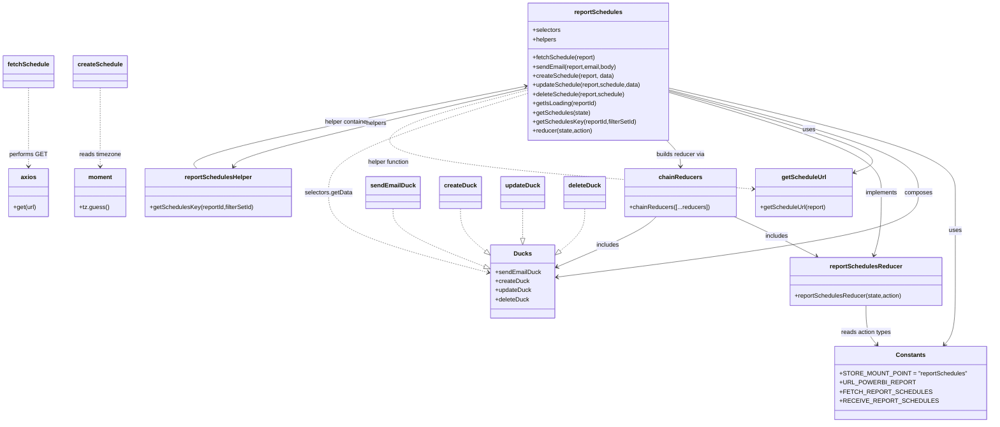

# Diagram: web/portal/src/pages/reports/redux/ReportSchedulesState.js

> Auto-generated by Obscura crawlers

## Mermaid

### SVG

<svg id="container" width="2551.49609375" xmlns="http://www.w3.org/2000/svg" class="classDiagram" height="1108" viewBox="0 0 2551.49609375 1108" role="graphics-document document" aria-roledescription="class"><g><defs><marker id="container_class-aggregationStart" class="marker aggregation class" refX="18" refY="7" markerWidth="190" markerHeight="240" orient="auto"><path d="M 18,7 L9,13 L1,7 L9,1 Z"></path></marker></defs><defs><marker id="container_class-aggregationEnd" class="marker aggregation class" refX="1" refY="7" markerWidth="20" markerHeight="28" orient="auto"><path d="M 18,7 L9,13 L1,7 L9,1 Z"></path></marker></defs><defs><marker id="container_class-extensionStart" class="marker extension class" refX="18" refY="7" markerWidth="190" markerHeight="240" orient="auto"><path d="M 1,7 L18,13 V 1 Z"></path></marker></defs><defs><marker id="container_class-extensionEnd" class="marker extension class" refX="1" refY="7" markerWidth="20" markerHeight="28" orient="auto"><path d="M 1,1 V 13 L18,7 Z"></path></marker></defs><defs><marker id="container_class-compositionStart" class="marker composition class" refX="18" refY="7" markerWidth="190" markerHeight="240" orient="auto"><path d="M 18,7 L9,13 L1,7 L9,1 Z"></path></marker></defs><defs><marker id="container_class-compositionEnd" class="marker composition class" refX="1" refY="7" markerWidth="20" markerHeight="28" orient="auto"><path d="M 18,7 L9,13 L1,7 L9,1 Z"></path></marker></defs><defs><marker id="container_class-dependencyStart" class="marker dependency class" refX="6" refY="7" markerWidth="190" markerHeight="240" orient="auto"><path d="M 5,7 L9,13 L1,7 L9,1 Z"></path></marker></defs><defs><marker id="container_class-dependencyEnd" class="marker dependency class" refX="13" refY="7" markerWidth="20" markerHeight="28" orient="auto"><path d="M 18,7 L9,13 L14,7 L9,1 Z"></path></marker></defs><defs><marker id="container_class-lollipopStart" class="marker lollipop class" refX="13" refY="7" markerWidth="190" markerHeight="240" orient="auto"><circle stroke="black" fill="transparent" cx="7" cy="7" r="6"></circle></marker></defs><defs><marker id="container_class-lollipopEnd" class="marker lollipop class" refX="1" refY="7" markerWidth="190" markerHeight="240" orient="auto"><circle stroke="black" fill="transparent" cx="7" cy="7" r="6"></circle></marker></defs><g class="root"><g class="clusters"></g><g class="edgePaths"><path d="M1723.234,231.12L1848.142,260.1C1973.049,289.08,2222.865,347.04,2347.772,392.687C2472.68,438.333,2472.68,471.667,2472.68,505C2472.68,538.333,2472.68,571.667,2472.68,610.5C2472.68,649.333,2472.68,693.667,2472.68,738C2472.68,782.333,2472.68,826.667,2467.931,854.248C2463.181,881.83,2453.683,892.659,2448.934,898.074L2444.185,903.489" id="id_reportSchedules_Constants_1" class="edge-thickness-normal edge-pattern-solid relation" style=";;;" data-edge="true" data-et="edge" data-id="id_reportSchedules_Constants_1" data-points="W3sieCI6MTcyMy4yMzQzNzUsInkiOjIzMS4xMTk3NzMxMzM1MzA0Nn0seyJ4IjoyNDcyLjY3OTY4NzUsInkiOjQwNX0seyJ4IjoyNDcyLjY3OTY4NzUsInkiOjUwNX0seyJ4IjoyNDcyLjY3OTY4NzUsInkiOjYwNX0seyJ4IjoyNDcyLjY3OTY4NzUsInkiOjczOH0seyJ4IjoyNDcyLjY3OTY4NzUsInkiOjg3MX0seyJ4IjoyNDQwLjIyODYxODQyMTA1MjUsInkiOjkwOH1d" marker-end="url(#container_class-dependencyEnd)"></path><path d="M1723.234,236.001L1832.289,264.168C1941.344,292.334,2159.453,348.667,2268.508,393.5C2377.563,438.333,2377.563,471.667,2377.563,505C2377.563,538.333,2377.563,571.667,2220.419,608.604C2063.275,645.542,1748.988,686.084,1591.844,706.355L1434.701,726.625" id="id_reportSchedules_Ducks_2" class="edge-thickness-normal edge-pattern-solid relation" style=";;;" data-edge="true" data-et="edge" data-id="id_reportSchedules_Ducks_2" data-points="W3sieCI6MTcyMy4yMzQzNzUsInkiOjIzNi4wMDEzODU0OTIzMTQ3fSx7IngiOjIzNzcuNTYyNSwieSI6NDA1fSx7IngiOjIzNzcuNTYyNSwieSI6NTA1fSx7IngiOjIzNzcuNTYyNSwieSI6NjA1fSx7IngiOjE0MjguNzUsInkiOjcyNy4zOTMwOTU1NTc0MjQ3fV0=" marker-end="url(#container_class-dependencyEnd)"></path><path d="M1723.234,239.023L1823.996,266.686C1924.758,294.349,2126.281,349.674,2206.671,385.326C2287.06,420.978,2246.315,436.956,2225.943,444.945L2205.57,452.934" id="id_reportSchedules_getScheduleUrl_3" class="edge-thickness-normal edge-pattern-solid relation" style=";;;" data-edge="true" data-et="edge" data-id="id_reportSchedules_getScheduleUrl_3" data-points="W3sieCI6MTcyMy4yMzQzNzUsInkiOjIzOS4wMjMxMTg1ODc3Nzk0Nn0seyJ4IjoyMzI3LjgwNDY4NzUsInkiOjQwNX0seyJ4IjoyMTk5Ljk4NDM3NSwieSI6NDU1LjEyNDg0NDkwMTI3M31d" marker-end="url(#container_class-dependencyEnd)"></path><path d="M1723.234,242.451L1815.703,269.542C1908.172,296.634,2093.109,350.817,2185.578,394.575C2278.047,438.333,2278.047,471.667,2278.047,505C2278.047,538.333,2278.047,571.667,2274.934,599.04C2271.822,626.413,2265.597,647.826,2262.485,658.532L2259.372,669.239" id="id_reportSchedules_reportSchedulesReducer_4" class="edge-thickness-normal edge-pattern-solid relation" style=";;;" data-edge="true" data-et="edge" data-id="id_reportSchedules_reportSchedulesReducer_4" data-points="W3sieCI6MTcyMy4yMzQzNzUsInkiOjI0Mi40NTA4NTE3NDgzMjU1fSx7IngiOjIyNzguMDQ2ODc1LCJ5Ijo0MDV9LHsieCI6MjI3OC4wNDY4NzUsInkiOjUwNX0seyJ4IjoyMjc4LjA0Njg3NSwieSI6NjA1fSx7IngiOjIyNTcuNjk3MzY4NDIxMDUyNSwieSI6Njc1fV0=" marker-end="url(#container_class-dependencyEnd)"></path><path d="M2239.383,801L2239.383,812.667C2239.383,824.333,2239.383,847.667,2244.132,864.748C2248.881,881.83,2258.379,892.659,2263.128,898.074L2267.878,903.489" id="id_reportSchedulesReducer_Constants_5" class="edge-thickness-normal edge-pattern-solid relation" style=";;;" data-edge="true" data-et="edge" data-id="id_reportSchedulesReducer_Constants_5" data-points="W3sieCI6MjIzOS4zODI4MTI1LCJ5Ijo4MDF9LHsieCI6MjIzOS4zODI4MTI1LCJ5Ijo4NzF9LHsieCI6MjI3MS44MzM4ODE1Nzg5NDc1LCJ5Ijo5MDh9XQ==" marker-end="url(#container_class-dependencyEnd)"></path><path d="M1715.74,368L1721.85,374.167C1727.961,380.333,1740.182,392.667,1746.292,404C1752.402,415.333,1752.402,425.667,1752.402,430.833L1752.402,436" id="id_reportSchedules_chainReducers_6" class="edge-thickness-normal edge-pattern-solid relation" style=";;;" data-edge="true" data-et="edge" data-id="id_reportSchedules_chainReducers_6" data-points="W3sieCI6MTcxNS43NDAwMjczNjE3NTExLCJ5IjozNjh9LHsieCI6MTc1Mi40MDIzNDM3NSwieSI6NDA1fSx7IngiOjE3NTIuNDAyMzQzNzUsInkiOjQ0Mn1d" marker-end="url(#container_class-dependencyEnd)"></path><path d="M1893.622,568L1907.445,574.167C1921.268,580.333,1948.914,592.667,1984.9,610.048C2020.885,627.43,2065.21,649.861,2087.372,661.076L2109.535,672.291" id="id_chainReducers_reportSchedulesReducer_7" class="edge-thickness-normal edge-pattern-solid relation" style=";;;" data-edge="true" data-et="edge" data-id="id_chainReducers_reportSchedulesReducer_7" data-points="W3sieCI6MTg5My42MjIwMTE3MTg3NSwieSI6NTY4fSx7IngiOjE5NzYuNTYwNTQ2ODc1LCJ5Ijo2MDV9LHsieCI6MjExNC44ODgwNTUwOTg2ODQsInkiOjY3NX1d" marker-end="url(#container_class-dependencyEnd)"></path><path d="M1690.683,568L1684.642,574.167C1678.601,580.333,1666.518,592.667,1623.781,614.684C1581.043,636.701,1507.651,668.403,1470.954,684.253L1434.258,700.104" id="id_chainReducers_Ducks_8" class="edge-thickness-normal edge-pattern-solid relation" style=";;;" data-edge="true" data-et="edge" data-id="id_chainReducers_Ducks_8" data-points="W3sieCI6MTY5MC42ODMyNjE3MTg3NSwieSI6NTY4fSx7IngiOjE2NTQuNDM1NTQ2ODc1LCJ5Ijo2MDV9LHsieCI6MTQyOC43NSwieSI6NzAyLjQ4Mjk0MDE2NTMwMTl9XQ==" marker-end="url(#container_class-dependencyEnd)"></path><path d="M72.148,230L72.148,259.167C72.148,288.333,72.148,346.667,72.148,381C72.148,415.333,72.148,425.667,72.148,430.833L72.148,436" id="id_fetchSchedule_axios_9" class="edge-thickness-normal edge-pattern-dashed relation" style=";;;" data-edge="true" data-et="edge" data-id="id_fetchSchedule_axios_9" data-points="W3sieCI6NzIuMTQ4NDM3NSwieSI6MjMwfSx7IngiOjcyLjE0ODQzNzUsInkiOjQwNX0seyJ4Ijo3Mi4xNDg0Mzc1LCJ5Ijo0NDJ9XQ==" marker-end="url(#container_class-dependencyEnd)"></path><path d="M254.75,230L254.75,259.167C254.75,288.333,254.75,346.667,254.75,381C254.75,415.333,254.75,425.667,254.75,430.833L254.75,436" id="id_createSchedule_moment_10" class="edge-thickness-normal edge-pattern-dashed relation" style=";;;" data-edge="true" data-et="edge" data-id="id_createSchedule_moment_10" data-points="W3sieCI6MjU0Ljc1LCJ5IjoyMzB9LHsieCI6MjU0Ljc1LCJ5Ijo0MDV9LHsieCI6MjU0Ljc1LCJ5Ijo0NDJ9XQ==" marker-end="url(#container_class-dependencyEnd)"></path><path d="M1017.133,547L1017.133,556.667C1017.133,566.333,1017.133,585.667,1055.661,610.89C1094.189,636.113,1171.245,667.227,1209.773,682.784L1248.302,698.34" id="id_sendEmailDuck_Ducks_11" class="edge-thickness-normal edge-pattern-dashed relation" style=";;;" data-edge="true" data-et="edge" data-id="id_sendEmailDuck_Ducks_11" data-points="W3sieCI6MTAxNy4xMzI4MTI1LCJ5Ijo1NDd9LHsieCI6MTAxNy4xMzI4MTI1LCJ5Ijo2MDV9LHsieCI6MTI2NC4yOTY4NzUsInkiOjcwNC43OTg4OTQ3MzkzMzg3fV0=" marker-end="url(#container_class-extensionEnd)"></path><path d="M1187.68,547L1187.68,556.667C1187.68,566.333,1187.68,585.667,1198.245,604.18C1208.81,622.693,1229.94,640.385,1240.506,649.231L1251.071,658.078" id="id_createDuck_Ducks_12" class="edge-thickness-normal edge-pattern-dashed relation" style=";;;" data-edge="true" data-et="edge" data-id="id_createDuck_Ducks_12" data-points="W3sieCI6MTE4Ny42Nzk2ODc1LCJ5Ijo1NDd9LHsieCI6MTE4Ny42Nzk2ODc1LCJ5Ijo2MDV9LHsieCI6MTI2NC4yOTY4NzUsInkiOjY2OS4xNTE2MzI4OTM5NjAzfV0=" marker-end="url(#container_class-extensionEnd)"></path><path d="M1346.523,547L1346.523,556.667C1346.523,566.333,1346.523,585.667,1346.523,598.625C1346.523,611.583,1346.523,618.167,1346.523,621.458L1346.523,624.75" id="id_updateDuck_Ducks_13" class="edge-thickness-normal edge-pattern-dashed relation" style=";;;" data-edge="true" data-et="edge" data-id="id_updateDuck_Ducks_13" data-points="W3sieCI6MTM0Ni41MjM0Mzc1LCJ5Ijo1NDd9LHsieCI6MTM0Ni41MjM0Mzc1LCJ5Ijo2MDV9LHsieCI6MTM0Ni41MjM0Mzc1LCJ5Ijo2NDJ9XQ==" marker-end="url(#container_class-extensionEnd)"></path><path d="M1505.82,547L1505.82,556.667C1505.82,566.333,1505.82,585.667,1495.182,604.215C1484.544,622.764,1463.268,640.528,1452.63,649.41L1441.991,658.292" id="id_deleteDuck_Ducks_14" class="edge-thickness-normal edge-pattern-dashed relation" style=";;;" data-edge="true" data-et="edge" data-id="id_deleteDuck_Ducks_14" data-points="W3sieCI6MTUwNS44MjAzMTI1LCJ5Ijo1NDd9LHsieCI6MTUwNS44MjAzMTI1LCJ5Ijo2MDV9LHsieCI6MTQyOC43NSwieSI6NjY5LjM0NzQ3NDI1MjA4NDN9XQ==" marker-end="url(#container_class-extensionEnd)"></path><path d="M1351.531,246.846L1268.283,273.205C1185.034,299.564,1018.536,352.282,935.288,395.308C852.039,438.333,852.039,471.667,852.039,505C852.039,538.333,852.039,571.667,919.783,606.554C987.527,641.442,1123.015,677.884,1190.759,696.104L1258.503,714.325" id="id_reportSchedules_Ducks_15" class="edge-thickness-normal edge-pattern-dashed relation" style=";;;" data-edge="true" data-et="edge" data-id="id_reportSchedules_Ducks_15" data-points="W3sieCI6MTM1MS41MzEyNSwieSI6MjQ2Ljg0NjA3NDA1MDQzMDl9LHsieCI6ODUyLjAzOTA2MjUsInkiOjQwNX0seyJ4Ijo4NTIuMDM5MDYyNSwieSI6NTA1fSx7IngiOjg1Mi4wMzkwNjI1LCJ5Ijo2MDV9LHsieCI6MTI2NC4yOTY4NzUsInkiOjcxNS44ODM3NjQ2NTM4Mzc2fV0=" marker-end="url(#container_class-dependencyEnd)"></path><path d="M1351.531,237.383L1246.394,265.319C1141.257,293.255,930.983,349.128,1029,392.089C1127.017,435.05,1533.325,465.101,1736.479,480.126L1939.634,495.151" id="id_reportSchedules_getScheduleUrl_16" class="edge-thickness-normal edge-pattern-dashed relation" style=";;;" data-edge="true" data-et="edge" data-id="id_reportSchedules_getScheduleUrl_16" data-points="W3sieCI6MTM1MS41MzEyNSwieSI6MjM3LjM4Mjk4MjEzMjY1MDN9LHsieCI6NzIwLjcwODk4NDM3NSwieSI6NDA1fSx7IngiOjE5NDUuNjE3MTg3NSwieSI6NDk1LjU5MzU2ODEyNTc3NzN9XQ==" marker-end="url(#container_class-dependencyEnd)"></path><path d="M508.139,442L502.851,435.833C497.562,429.667,486.985,417.333,626.571,381.536C766.156,345.738,1055.905,286.476,1200.779,256.845L1345.653,227.214" id="id_reportSchedulesHelper_reportSchedules_17" class="edge-thickness-normal edge-pattern-solid relation" style=";;;" data-edge="true" data-et="edge" data-id="id_reportSchedulesHelper_reportSchedules_17" data-points="W3sieCI6NTA4LjEzOTMxNjQwNjI1MDAzLCJ5Ijo0NDJ9LHsieCI6NDc2LjQwODIwMzEyNSwieSI6NDA1fSx7IngiOjEzNTEuNTMxMjUsInkiOjIyNi4wMTIwMjA5MzQ0NjY2fV0=" marker-end="url(#container_class-dependencyEnd)"></path><path d="M1351.531,231.839L1229.181,260.699C1106.83,289.559,862.129,347.28,736.854,381.431C611.58,415.583,605.732,426.166,602.808,431.457L599.884,436.748" id="id_reportSchedules_reportSchedulesHelper_18" class="edge-thickness-normal edge-pattern-solid relation" style=";;;" data-edge="true" data-et="edge" data-id="id_reportSchedules_reportSchedulesHelper_18" data-points="W3sieCI6MTM1MS41MzEyNSwieSI6MjMxLjgzODg2NzgxMTU2NTJ9LHsieCI6NjE3LjQyNzczNDM3NSwieSI6NDA1fSx7IngiOjU5Ni45ODE2MjEwOTM3NSwieSI6NDQyfV0=" marker-end="url(#container_class-dependencyEnd)"></path></g><g class="edgeLabels"><g class="edgeLabel" transform="translate(2472.6796875, 605)"><g class="label" data-id="id_reportSchedules_Constants_1" transform="translate(-16.4921875, -12)"><foreignObject width="32.984375" height="24">

uses

</foreignObject></g></g><g class="edgeLabel" transform="translate(2377.5625, 505)"><g class="label" data-id="id_reportSchedules_Ducks_2" transform="translate(-36.453125, -12)"><foreignObject width="72.90625" height="24">

composes

</foreignObject></g></g><g class="edgeLabel" transform="translate(2091.71873, 340.18569)"><g class="label" data-id="id_reportSchedules_getScheduleUrl_3" transform="translate(-16.4921875, -12)"><foreignObject width="32.984375" height="24">

uses

</foreignObject></g></g><g class="edgeLabel" transform="translate(2278.046875, 505)"><g class="label" data-id="id_reportSchedules_reportSchedulesReducer_4" transform="translate(-43.0625, -12)"><foreignObject width="86.125" height="24">

implements

</foreignObject></g></g><g class="edgeLabel" transform="translate(2239.3828125, 871)"><g class="label" data-id="id_reportSchedulesReducer_Constants_5" transform="translate(-66.5546875, -12)"><foreignObject width="133.109375" height="24">

reads action types

</foreignObject></g></g><g class="edgeLabel" transform="translate(1752.40234375, 405)"><g class="label" data-id="id_reportSchedules_chainReducers_6" transform="translate(-65.0390625, -12)"><foreignObject width="130.078125" height="24">

builds reducer via

</foreignObject></g></g><g class="edgeLabel" transform="translate(2005.20797, 619.4969)"><g class="label" data-id="id_chainReducers_reportSchedulesReducer_7" transform="translate(-30.6484375, -12)"><foreignObject width="61.296875" height="24">

includes

</foreignObject></g></g><g class="edgeLabel" transform="translate(1565.368, 643.47196)"><g class="label" data-id="id_chainReducers_Ducks_8" transform="translate(-30.6484375, -12)"><foreignObject width="61.296875" height="24">

includes

</foreignObject></g></g><g class="edgeLabel" transform="translate(72.1484375, 405)"><g class="label" data-id="id_fetchSchedule_axios_9" transform="translate(-48.7421875, -12)"><foreignObject width="97.484375" height="24">

performs GET

</foreignObject></g></g><g class="edgeLabel" transform="translate(254.75, 405)"><g class="label" data-id="id_createSchedule_moment_10" transform="translate(-55.5859375, -12)"><foreignObject width="111.171875" height="24">

reads timezone

</foreignObject></g></g><g class="edgeLabel"><g class="label" data-id="id_sendEmailDuck_Ducks_11" transform="translate(0, 0)"><foreignObject width="0" height="0">

</foreignObject></g></g><g class="edgeLabel"><g class="label" data-id="id_createDuck_Ducks_12" transform="translate(0, 0)"><foreignObject width="0" height="0">

</foreignObject></g></g><g class="edgeLabel"><g class="label" data-id="id_updateDuck_Ducks_13" transform="translate(0, 0)"><foreignObject width="0" height="0">

</foreignObject></g></g><g class="edgeLabel"><g class="label" data-id="id_deleteDuck_Ducks_14" transform="translate(0, 0)"><foreignObject width="0" height="0">

</foreignObject></g></g><g class="edgeLabel" transform="translate(852.0390625, 505)"><g class="label" data-id="id_reportSchedules_Ducks_15" transform="translate(-62.4609375, -12)"><foreignObject width="124.921875" height="24">

selectors.getData

</foreignObject></g></g><g class="edgeLabel" transform="translate(1007.69632, 426.22543)"><g class="label" data-id="id_reportSchedules_getScheduleUrl_16" transform="translate(-56.0703125, -12)"><foreignObject width="112.140625" height="24">

helper function

</foreignObject></g></g><g class="edgeLabel" transform="translate(890.09261, 320.38957)"><g class="label" data-id="id_reportSchedulesHelper_reportSchedules_17" transform="translate(-60.3125, -12)"><foreignObject width="120.625" height="24">

helper container

</foreignObject></g></g><g class="edgeLabel" transform="translate(963.90734, 323.27201)"><g class="label" data-id="id_reportSchedules_reportSchedulesHelper_18" transform="translate(-27.2109375, -12)"><foreignObject width="54.421875" height="24">

helpers

</foreignObject></g></g></g><g class="nodes"><g class="node default" id="classId-reportSchedules-0" transform="translate(1537.3828125, 188)"><g class="basic label-container"><path d="M-185.8515625 -180 L185.8515625 -180 L185.8515625 180 L-185.8515625 180" stroke="none" stroke-width="0" fill="#ECECFF" style=""></path><path d="M-185.8515625 -180 C-107.22425692618874 -180, -28.596951352377488 -180, 185.8515625 -180 M-185.8515625 -180 C-88.79536496820943 -180, 8.260832563581147 -180, 185.8515625 -180 M185.8515625 -180 C185.8515625 -96.4307407784586, 185.8515625 -12.861481556917198, 185.8515625 180 M185.8515625 -180 C185.8515625 -97.98823735081595, 185.8515625 -15.9764747016319, 185.8515625 180 M185.8515625 180 C61.06544555790677 180, -63.72067138418646 180, -185.8515625 180 M185.8515625 180 C78.60520454117245 180, -28.64115341765509 180, -185.8515625 180 M-185.8515625 180 C-185.8515625 79.84802797384813, -185.8515625 -20.303944052303734, -185.8515625 -180 M-185.8515625 180 C-185.8515625 56.33958105821442, -185.8515625 -67.32083788357116, -185.8515625 -180" stroke="#9370DB" stroke-width="1.3" fill="none" stroke-dasharray="0 0" style=""></path></g><g class="annotation-group text" transform="translate(0, -156)"></g><g class="label-group text" transform="translate(-60.5625, -156)"><g class="label" style="font-weight: bolder" transform="translate(0,-12)"><foreignObject width="121.125" height="24">

reportSchedules

</foreignObject></g></g><g class="members-group text" transform="translate(-173.8515625, -108)"><g class="label" style="" transform="translate(0,-12)"><foreignObject width="73.453125" height="24">

+selectors

</foreignObject></g><g class="label" style="" transform="translate(0,12)"><foreignObject width="62.40625" height="24">

+helpers

</foreignObject></g></g><g class="methods-group text" transform="translate(-173.8515625, -36)"><g class="label" style="" transform="translate(0,-12)"><foreignObject width="166.484375" height="24">

+fetchSchedule(report)

</foreignObject></g><g class="label" style="" transform="translate(0,12)"><foreignObject width="223" height="24">

+sendEmail(report,email,body)

</foreignObject></g><g class="label" style="" transform="translate(0,36)"><foreignObject width="215.890625" height="24">

+createSchedule(report, data)

</foreignObject></g><g class="label" style="" transform="translate(0,60)"><foreignObject width="287.140625" height="24">

+updateSchedule(report,schedule,data)

</foreignObject></g><g class="label" style="" transform="translate(0,84)"><foreignObject width="245.515625" height="24">

+deleteSchedule(report,schedule)

</foreignObject></g><g class="label" style="" transform="translate(0,108)"><foreignObject width="169.84375" height="24">

+getIsLoading(reportId)

</foreignObject></g><g class="label" style="" transform="translate(0,132)"><foreignObject width="151.15625" height="24">

+getSchedules(state)

</foreignObject></g><g class="label" style="" transform="translate(0,156)"><foreignObject width="275.734375" height="24">

+getSchedulesKey(reportId,filterSetId)

</foreignObject></g><g class="label" style="" transform="translate(0,180)"><foreignObject width="159.015625" height="24">

+reducer(state,action)

</foreignObject></g></g><g class="divider" style=""><path d="M-185.8515625 -132 C-87.09312833956884 -132, 11.66530582086233 -132, 185.8515625 -132 M-185.8515625 -132 C-109.66825016129273 -132, -33.484937822585465 -132, 185.8515625 -132" stroke="#9370DB" stroke-width="1.3" fill="none" stroke-dasharray="0 0" style=""></path></g><g class="divider" style=""><path d="M-185.8515625 -60 C-73.61551969672158 -60, 38.620523106556846 -60, 185.8515625 -60 M-185.8515625 -60 C-64.38658357365011 -60, 57.07839535269977 -60, 185.8515625 -60" stroke="#9370DB" stroke-width="1.3" fill="none" stroke-dasharray="0 0" style=""></path></g></g><g class="node default" id="classId-Constants-1" transform="translate(2356.03125, 1004)"><g class="basic label-container"><path d="M-187.46484375 -96 L187.46484375 -96 L187.46484375 96 L-187.46484375 96" stroke="none" stroke-width="0" fill="#ECECFF" style=""></path><path d="M-187.46484375 -96 C-103.96620279530745 -96, -20.467561840614906 -96, 187.46484375 -96 M-187.46484375 -96 C-56.20773984081379 -96, 75.04936406837243 -96, 187.46484375 -96 M187.46484375 -96 C187.46484375 -42.19791604905299, 187.46484375 11.604167901894016, 187.46484375 96 M187.46484375 -96 C187.46484375 -39.915457502273036, 187.46484375 16.16908499545393, 187.46484375 96 M187.46484375 96 C61.44874171693236 96, -64.56736031613528 96, -187.46484375 96 M187.46484375 96 C85.98168416311199 96, -15.501475423776014 96, -187.46484375 96 M-187.46484375 96 C-187.46484375 22.149780841767736, -187.46484375 -51.70043831646453, -187.46484375 -96 M-187.46484375 96 C-187.46484375 43.533016259152944, -187.46484375 -8.933967481694111, -187.46484375 -96" stroke="#9370DB" stroke-width="1.3" fill="none" stroke-dasharray="0 0" style=""></path></g><g class="annotation-group text" transform="translate(0, -72)"></g><g class="label-group text" transform="translate(-36.5390625, -72)"><g class="label" style="font-weight: bolder" transform="translate(0,-12)"><foreignObject width="73.078125" height="24">

Constants

</foreignObject></g></g><g class="members-group text" transform="translate(-175.46484375, -24)"><g class="label" style="" transform="translate(0,-12)"><foreignObject width="314.390625" height="24">

+STORE_MOUNT_POINT = "reportSchedules"

</foreignObject></g><g class="label" style="" transform="translate(0,12)"><foreignObject width="175.390625" height="24">

+URL_POWERBI_REPORT

</foreignObject></g><g class="label" style="" transform="translate(0,36)"><foreignObject width="206.828125" height="24">

+FETCH_REPORT_SCHEDULES

</foreignObject></g><g class="label" style="" transform="translate(0,60)"><foreignObject width="220.59375" height="24">

+RECEIVE_REPORT_SCHEDULES

</foreignObject></g></g><g class="methods-group text" transform="translate(-175.46484375, 96)"></g><g class="divider" style=""><path d="M-187.46484375 -48 C-72.44892904948604 -48, 42.56698565102792 -48, 187.46484375 -48 M-187.46484375 -48 C-104.16520464808738 -48, -20.865565546174764 -48, 187.46484375 -48" stroke="#9370DB" stroke-width="1.3" fill="none" stroke-dasharray="0 0" style=""></path></g><g class="divider" style=""><path d="M-187.46484375 72 C-76.93049049748434 72, 33.603862755031315 72, 187.46484375 72 M-187.46484375 72 C-77.40111855752878 72, 32.66260663494245 72, 187.46484375 72" stroke="#9370DB" stroke-width="1.3" fill="none" stroke-dasharray="0 0" style=""></path></g></g><g class="node default" id="classId-Ducks-2" transform="translate(1346.5234375, 738)"><g class="basic label-container"><path d="M-82.2265625 -96 L82.2265625 -96 L82.2265625 96 L-82.2265625 96" stroke="none" stroke-width="0" fill="#ECECFF" style=""></path><path d="M-82.2265625 -96 C-45.317660582374444 -96, -8.408758664748888 -96, 82.2265625 -96 M-82.2265625 -96 C-17.766385554218203 -96, 46.69379139156359 -96, 82.2265625 -96 M82.2265625 -96 C82.2265625 -36.417277218011435, 82.2265625 23.16544556397713, 82.2265625 96 M82.2265625 -96 C82.2265625 -25.877596928109483, 82.2265625 44.244806143781034, 82.2265625 96 M82.2265625 96 C21.935864586167376 96, -38.35483332766525 96, -82.2265625 96 M82.2265625 96 C39.079310012291124 96, -4.067942475417752 96, -82.2265625 96 M-82.2265625 96 C-82.2265625 22.096833097237493, -82.2265625 -51.806333805525014, -82.2265625 -96 M-82.2265625 96 C-82.2265625 47.84654389349015, -82.2265625 -0.3069122130197002, -82.2265625 -96" stroke="#9370DB" stroke-width="1.3" fill="none" stroke-dasharray="0 0" style=""></path></g><g class="annotation-group text" transform="translate(0, -72)"></g><g class="label-group text" transform="translate(-21.859375, -72)"><g class="label" style="font-weight: bolder" transform="translate(0,-12)"><foreignObject width="43.71875" height="24">

Ducks

</foreignObject></g></g><g class="members-group text" transform="translate(-70.2265625, -24)"><g class="label" style="" transform="translate(0,-12)"><foreignObject width="118.59375" height="24">

+sendEmailDuck

</foreignObject></g><g class="label" style="" transform="translate(0,12)"><foreignObject width="88.3125" height="24">

+createDuck

</foreignObject></g><g class="label" style="" transform="translate(0,36)"><foreignObject width="94.796875" height="24">

+updateDuck

</foreignObject></g><g class="label" style="" transform="translate(0,60)"><foreignObject width="89.3125" height="24">

+deleteDuck

</foreignObject></g></g><g class="methods-group text" transform="translate(-70.2265625, 96)"></g><g class="divider" style=""><path d="M-82.2265625 -48 C-43.35284749008186 -48, -4.479132480163713 -48, 82.2265625 -48 M-82.2265625 -48 C-48.67273119400803 -48, -15.11889988801606 -48, 82.2265625 -48" stroke="#9370DB" stroke-width="1.3" fill="none" stroke-dasharray="0 0" style=""></path></g><g class="divider" style=""><path d="M-82.2265625 72 C-39.675297608977495 72, 2.8759672820450106 72, 82.2265625 72 M-82.2265625 72 C-30.873437189143395 72, 20.47968812171321 72, 82.2265625 72" stroke="#9370DB" stroke-width="1.3" fill="none" stroke-dasharray="0 0" style=""></path></g></g><g class="node default" id="classId-getScheduleUrl-3" transform="translate(2072.80078125, 505)"><g class="basic label-container"><path d="M-127.18359375 -63 L127.18359375 -63 L127.18359375 63 L-127.18359375 63" stroke="none" stroke-width="0" fill="#ECECFF" style=""></path><path d="M-127.18359375 -63 C-60.53549976937052 -63, 6.1125942112589655 -63, 127.18359375 -63 M-127.18359375 -63 C-29.7123188863697 -63, 67.7589559772606 -63, 127.18359375 -63 M127.18359375 -63 C127.18359375 -22.83928398386825, 127.18359375 17.321432032263502, 127.18359375 63 M127.18359375 -63 C127.18359375 -20.572686351269752, 127.18359375 21.854627297460496, 127.18359375 63 M127.18359375 63 C71.89485612120023 63, 16.60611849240047 63, -127.18359375 63 M127.18359375 63 C30.276834219784334 63, -66.62992531043133 63, -127.18359375 63 M-127.18359375 63 C-127.18359375 22.732463156608645, -127.18359375 -17.53507368678271, -127.18359375 -63 M-127.18359375 63 C-127.18359375 13.53427661783202, -127.18359375 -35.93144676433596, -127.18359375 -63" stroke="#9370DB" stroke-width="1.3" fill="none" stroke-dasharray="0 0" style=""></path></g><g class="annotation-group text" transform="translate(0, -39)"></g><g class="label-group text" transform="translate(-56.1015625, -39)"><g class="label" style="font-weight: bolder" transform="translate(0,-12)"><foreignObject width="112.203125" height="24">

getScheduleUrl

</foreignObject></g></g><g class="members-group text" transform="translate(-115.18359375, 9)"></g><g class="methods-group text" transform="translate(-115.18359375, 39)"><g class="label" style="" transform="translate(0,-12)"><foreignObject width="174.265625" height="24">

+getScheduleUrl(report)

</foreignObject></g></g><g class="divider" style=""><path d="M-127.18359375 -15 C-41.01999324390874 -15, 45.14360726218251 -15, 127.18359375 -15 M-127.18359375 -15 C-70.95127939280766 -15, -14.718965035615327 -15, 127.18359375 -15" stroke="#9370DB" stroke-width="1.3" fill="none" stroke-dasharray="0 0" style=""></path></g><g class="divider" style=""><path d="M-127.18359375 9 C-52.95825539261752 9, 21.267082964764967 9, 127.18359375 9 M-127.18359375 9 C-38.20655975727847 9, 50.77047423544306 9, 127.18359375 9" stroke="#9370DB" stroke-width="1.3" fill="none" stroke-dasharray="0 0" style=""></path></g></g><g class="node default" id="classId-reportSchedulesReducer-4" transform="translate(2239.3828125, 738)"><g class="basic label-container"><path d="M-198.296875 -63 L198.296875 -63 L198.296875 63 L-198.296875 63" stroke="none" stroke-width="0" fill="#ECECFF" style=""></path><path d="M-198.296875 -63 C-104.10245130383694 -63, -9.908027607673887 -63, 198.296875 -63 M-198.296875 -63 C-72.03565446604772 -63, 54.225566067904566 -63, 198.296875 -63 M198.296875 -63 C198.296875 -13.732606298370818, 198.296875 35.53478740325836, 198.296875 63 M198.296875 -63 C198.296875 -28.003987150622287, 198.296875 6.992025698755427, 198.296875 63 M198.296875 63 C116.98240460584297 63, 35.667934211685946 63, -198.296875 63 M198.296875 63 C95.6307308854363 63, -7.035413229127414 63, -198.296875 63 M-198.296875 63 C-198.296875 25.330935131608904, -198.296875 -12.338129736782193, -198.296875 -63 M-198.296875 63 C-198.296875 34.339872909755684, -198.296875 5.679745819511368, -198.296875 -63" stroke="#9370DB" stroke-width="1.3" fill="none" stroke-dasharray="0 0" style=""></path></g><g class="annotation-group text" transform="translate(0, -39)"></g><g class="label-group text" transform="translate(-90.46875, -39)"><g class="label" style="font-weight: bolder" transform="translate(0,-12)"><foreignObject width="180.9375" height="24">

reportSchedulesReducer

</foreignObject></g></g><g class="members-group text" transform="translate(-186.296875, 9)"></g><g class="methods-group text" transform="translate(-186.296875, 39)"><g class="label" style="" transform="translate(0,-12)"><foreignObject width="282.125" height="24">

+reportSchedulesReducer(state,action)

</foreignObject></g></g><g class="divider" style=""><path d="M-198.296875 -15 C-82.54033111884233 -15, 33.21621276231534 -15, 198.296875 -15 M-198.296875 -15 C-74.66625223525806 -15, 48.96437052948389 -15, 198.296875 -15" stroke="#9370DB" stroke-width="1.3" fill="none" stroke-dasharray="0 0" style=""></path></g><g class="divider" style=""><path d="M-198.296875 9 C-61.60094353905552 9, 75.09498792188896 9, 198.296875 9 M-198.296875 9 C-113.00947830035618 9, -27.722081600712357 9, 198.296875 9" stroke="#9370DB" stroke-width="1.3" fill="none" stroke-dasharray="0 0" style=""></path></g></g><g class="node default" id="classId-chainReducers-5" transform="translate(1752.40234375, 505)"><g class="basic label-container"><path d="M-143.21484375 -63 L143.21484375 -63 L143.21484375 63 L-143.21484375 63" stroke="none" stroke-width="0" fill="#ECECFF" style=""></path><path d="M-143.21484375 -63 C-52.1660593078216 -63, 38.882725134356804 -63, 143.21484375 -63 M-143.21484375 -63 C-43.59192955369562 -63, 56.03098464260876 -63, 143.21484375 -63 M143.21484375 -63 C143.21484375 -17.49462416689471, 143.21484375 28.01075166621058, 143.21484375 63 M143.21484375 -63 C143.21484375 -27.95250569944251, 143.21484375 7.094988601114977, 143.21484375 63 M143.21484375 63 C51.65083682667368 63, -39.913170096652635 63, -143.21484375 63 M143.21484375 63 C43.15738517967918 63, -56.90007339064164 63, -143.21484375 63 M-143.21484375 63 C-143.21484375 31.131932530179416, -143.21484375 -0.7361349396411683, -143.21484375 -63 M-143.21484375 63 C-143.21484375 26.502266235312725, -143.21484375 -9.995467529374551, -143.21484375 -63" stroke="#9370DB" stroke-width="1.3" fill="none" stroke-dasharray="0 0" style=""></path></g><g class="annotation-group text" transform="translate(0, -39)"></g><g class="label-group text" transform="translate(-53.3828125, -39)"><g class="label" style="font-weight: bolder" transform="translate(0,-12)"><foreignObject width="106.765625" height="24">

chainReducers

</foreignObject></g></g><g class="members-group text" transform="translate(-131.21484375, 9)"></g><g class="methods-group text" transform="translate(-131.21484375, 39)"><g class="label" style="" transform="translate(0,-12)"><foreignObject width="209.046875" height="24">

+chainReducers([...reducers])

</foreignObject></g></g><g class="divider" style=""><path d="M-143.21484375 -15 C-55.038356816363574 -15, 33.13813011727285 -15, 143.21484375 -15 M-143.21484375 -15 C-28.67102079641147 -15, 85.87280215717706 -15, 143.21484375 -15" stroke="#9370DB" stroke-width="1.3" fill="none" stroke-dasharray="0 0" style=""></path></g><g class="divider" style=""><path d="M-143.21484375 9 C-77.73632199278212 9, -12.257800235564247 9, 143.21484375 9 M-143.21484375 9 C-78.25241269208709 9, -13.289981634174183 9, 143.21484375 9" stroke="#9370DB" stroke-width="1.3" fill="none" stroke-dasharray="0 0" style=""></path></g></g><g class="node default" id="classId-axios-6" transform="translate(72.1484375, 505)"><g class="basic label-container"><path d="M-52.18359375 -63 L52.18359375 -63 L52.18359375 63 L-52.18359375 63" stroke="none" stroke-width="0" fill="#ECECFF" style=""></path><path d="M-52.18359375 -63 C-27.13333673487668 -63, -2.083079719753357 -63, 52.18359375 -63 M-52.18359375 -63 C-21.299361514830633 -63, 9.584870720338735 -63, 52.18359375 -63 M52.18359375 -63 C52.18359375 -35.04187141083058, 52.18359375 -7.083742821661168, 52.18359375 63 M52.18359375 -63 C52.18359375 -28.605524557646078, 52.18359375 5.788950884707845, 52.18359375 63 M52.18359375 63 C13.430851364648767 63, -25.321891020702466 63, -52.18359375 63 M52.18359375 63 C30.158657702431167 63, 8.133721654862335 63, -52.18359375 63 M-52.18359375 63 C-52.18359375 36.5987599050914, -52.18359375 10.197519810182804, -52.18359375 -63 M-52.18359375 63 C-52.18359375 19.39604725067415, -52.18359375 -24.207905498651698, -52.18359375 -63" stroke="#9370DB" stroke-width="1.3" fill="none" stroke-dasharray="0 0" style=""></path></g><g class="annotation-group text" transform="translate(0, -39)"></g><g class="label-group text" transform="translate(-19.2734375, -39)"><g class="label" style="font-weight: bolder" transform="translate(0,-12)"><foreignObject width="38.546875" height="24">

axios

</foreignObject></g></g><g class="members-group text" transform="translate(-40.18359375, 9)"></g><g class="methods-group text" transform="translate(-40.18359375, 39)"><g class="label" style="" transform="translate(0,-12)"><foreignObject width="61.09375" height="24">

+get(url)

</foreignObject></g></g><g class="divider" style=""><path d="M-52.18359375 -15 C-24.35322471699047 -15, 3.477144316019057 -15, 52.18359375 -15 M-52.18359375 -15 C-26.033607642152948 -15, 0.1163784656941047 -15, 52.18359375 -15" stroke="#9370DB" stroke-width="1.3" fill="none" stroke-dasharray="0 0" style=""></path></g><g class="divider" style=""><path d="M-52.18359375 9 C-17.449325658145938 9, 17.284942433708125 9, 52.18359375 9 M-52.18359375 9 C-27.699615331306102 9, -3.2156369126122044 9, 52.18359375 9" stroke="#9370DB" stroke-width="1.3" fill="none" stroke-dasharray="0 0" style=""></path></g></g><g class="node default" id="classId-moment-7" transform="translate(254.75, 505)"><g class="basic label-container"><path d="M-65.0078125 -63 L65.0078125 -63 L65.0078125 63 L-65.0078125 63" stroke="none" stroke-width="0" fill="#ECECFF" style=""></path><path d="M-65.0078125 -63 C-23.54044752426376 -63, 17.926917451472477 -63, 65.0078125 -63 M-65.0078125 -63 C-36.79112086298322 -63, -8.57442922596644 -63, 65.0078125 -63 M65.0078125 -63 C65.0078125 -17.507863494414373, 65.0078125 27.984273011171254, 65.0078125 63 M65.0078125 -63 C65.0078125 -35.48066562528727, 65.0078125 -7.9613312505745455, 65.0078125 63 M65.0078125 63 C34.30237375277146 63, 3.5969350055429103 63, -65.0078125 63 M65.0078125 63 C16.6102022363849 63, -31.7874080272302 63, -65.0078125 63 M-65.0078125 63 C-65.0078125 19.28343854460723, -65.0078125 -24.433122910785542, -65.0078125 -63 M-65.0078125 63 C-65.0078125 27.989377134489153, -65.0078125 -7.021245731021693, -65.0078125 -63" stroke="#9370DB" stroke-width="1.3" fill="none" stroke-dasharray="0 0" style=""></path></g><g class="annotation-group text" transform="translate(0, -39)"></g><g class="label-group text" transform="translate(-30.3125, -39)"><g class="label" style="font-weight: bolder" transform="translate(0,-12)"><foreignObject width="60.625" height="24">

moment

</foreignObject></g></g><g class="members-group text" transform="translate(-53.0078125, 9)"></g><g class="methods-group text" transform="translate(-53.0078125, 39)"><g class="label" style="" transform="translate(0,-12)"><foreignObject width="75.703125" height="24">

+tz.guess()

</foreignObject></g></g><g class="divider" style=""><path d="M-65.0078125 -15 C-24.71342607022219 -15, 15.580960359555618 -15, 65.0078125 -15 M-65.0078125 -15 C-24.671780870978452 -15, 15.664250758043096 -15, 65.0078125 -15" stroke="#9370DB" stroke-width="1.3" fill="none" stroke-dasharray="0 0" style=""></path></g><g class="divider" style=""><path d="M-65.0078125 9 C-30.266709532981288 9, 4.474393434037424 9, 65.0078125 9 M-65.0078125 9 C-19.50119335689589 9, 26.00542578620822 9, 65.0078125 9" stroke="#9370DB" stroke-width="1.3" fill="none" stroke-dasharray="0 0" style=""></path></g></g><g class="node default" id="classId-fetchSchedule-8" transform="translate(72.1484375, 188)"><g class="basic label-container"><path d="M-64.1484375 -42 L64.1484375 -42 L64.1484375 42 L-64.1484375 42" stroke="none" stroke-width="0" fill="#ECECFF" style=""></path><path d="M-64.1484375 -42 C-31.173666785805295 -42, 1.8011039283894092 -42, 64.1484375 -42 M-64.1484375 -42 C-34.25968902587789 -42, -4.37094055175578 -42, 64.1484375 -42 M64.1484375 -42 C64.1484375 -19.04712064111818, 64.1484375 3.9057587177636393, 64.1484375 42 M64.1484375 -42 C64.1484375 -18.05739411353045, 64.1484375 5.885211772939101, 64.1484375 42 M64.1484375 42 C14.33841873960666 42, -35.47160002078668 42, -64.1484375 42 M64.1484375 42 C13.278936785479537 42, -37.590563929040925 42, -64.1484375 42 M-64.1484375 42 C-64.1484375 14.827721650138631, -64.1484375 -12.344556699722737, -64.1484375 -42 M-64.1484375 42 C-64.1484375 12.453527713206721, -64.1484375 -17.092944573586557, -64.1484375 -42" stroke="#9370DB" stroke-width="1.3" fill="none" stroke-dasharray="0 0" style=""></path></g><g class="annotation-group text" transform="translate(0, -18)"></g><g class="label-group text" transform="translate(-52.1484375, -18)"><g class="label" style="font-weight: bolder" transform="translate(0,-12)"><foreignObject width="104.296875" height="24">

fetchSchedule

</foreignObject></g></g><g class="members-group text" transform="translate(-52.1484375, 30)"></g><g class="methods-group text" transform="translate(-52.1484375, 60)"></g><g class="divider" style=""><path d="M-64.1484375 6 C-28.69988609925376 6, 6.74866530149248 6, 64.1484375 6 M-64.1484375 6 C-17.355410895183965 6, 29.43761570963207 6, 64.1484375 6" stroke="#9370DB" stroke-width="1.3" fill="none" stroke-dasharray="0 0" style=""></path></g><g class="divider" style=""><path d="M-64.1484375 24 C-31.337965162881225 24, 1.472507174237549 24, 64.1484375 24 M-64.1484375 24 C-36.23181047956432 24, -8.31518345912864 24, 64.1484375 24" stroke="#9370DB" stroke-width="1.3" fill="none" stroke-dasharray="0 0" style=""></path></g></g><g class="node default" id="classId-createSchedule-9" transform="translate(254.75, 188)"><g class="basic label-container"><path d="M-68.453125 -42 L68.453125 -42 L68.453125 42 L-68.453125 42" stroke="none" stroke-width="0" fill="#ECECFF" style=""></path><path d="M-68.453125 -42 C-14.91511916968981 -42, 38.62288666062038 -42, 68.453125 -42 M-68.453125 -42 C-25.633800240948617 -42, 17.185524518102767 -42, 68.453125 -42 M68.453125 -42 C68.453125 -9.634063169449632, 68.453125 22.731873661100735, 68.453125 42 M68.453125 -42 C68.453125 -16.32438400214683, 68.453125 9.351231995706343, 68.453125 42 M68.453125 42 C37.57206878659448 42, 6.6910125731889565 42, -68.453125 42 M68.453125 42 C29.29282099270683 42, -9.867483014586341 42, -68.453125 42 M-68.453125 42 C-68.453125 24.23173213641278, -68.453125 6.463464272825561, -68.453125 -42 M-68.453125 42 C-68.453125 17.690517535864906, -68.453125 -6.618964928270188, -68.453125 -42" stroke="#9370DB" stroke-width="1.3" fill="none" stroke-dasharray="0 0" style=""></path></g><g class="annotation-group text" transform="translate(0, -18)"></g><g class="label-group text" transform="translate(-56.453125, -18)"><g class="label" style="font-weight: bolder" transform="translate(0,-12)"><foreignObject width="112.90625" height="24">

createSchedule

</foreignObject></g></g><g class="members-group text" transform="translate(-56.453125, 30)"></g><g class="methods-group text" transform="translate(-56.453125, 60)"></g><g class="divider" style=""><path d="M-68.453125 6 C-27.07178055240788 6, 14.30956389518424 6, 68.453125 6 M-68.453125 6 C-31.3578614506866 6, 5.737402098626802 6, 68.453125 6" stroke="#9370DB" stroke-width="1.3" fill="none" stroke-dasharray="0 0" style=""></path></g><g class="divider" style=""><path d="M-68.453125 24 C-29.408071610520864 24, 9.636981778958273 24, 68.453125 24 M-68.453125 24 C-35.81542165984548 24, -3.1777183196909533 24, 68.453125 24" stroke="#9370DB" stroke-width="1.3" fill="none" stroke-dasharray="0 0" style=""></path></g></g><g class="node default" id="classId-sendEmailDuck-10" transform="translate(1017.1328125, 505)"><g class="basic label-container"><path d="M-67.6328125 -42 L67.6328125 -42 L67.6328125 42 L-67.6328125 42" stroke="none" stroke-width="0" fill="#ECECFF" style=""></path><path d="M-67.6328125 -42 C-18.762102895109173 -42, 30.108606709781654 -42, 67.6328125 -42 M-67.6328125 -42 C-17.58987586071502 -42, 32.45306077856996 -42, 67.6328125 -42 M67.6328125 -42 C67.6328125 -14.570129727102639, 67.6328125 12.859740545794722, 67.6328125 42 M67.6328125 -42 C67.6328125 -10.685892051066954, 67.6328125 20.62821589786609, 67.6328125 42 M67.6328125 42 C29.51224689357828 42, -8.608318712843442 42, -67.6328125 42 M67.6328125 42 C30.898392813444843 42, -5.836026873110313 42, -67.6328125 42 M-67.6328125 42 C-67.6328125 14.953078391708281, -67.6328125 -12.093843216583437, -67.6328125 -42 M-67.6328125 42 C-67.6328125 16.166768739818277, -67.6328125 -9.666462520363446, -67.6328125 -42" stroke="#9370DB" stroke-width="1.3" fill="none" stroke-dasharray="0 0" style=""></path></g><g class="annotation-group text" transform="translate(0, -18)"></g><g class="label-group text" transform="translate(-55.6328125, -18)"><g class="label" style="font-weight: bolder" transform="translate(0,-12)"><foreignObject width="111.265625" height="24">

sendEmailDuck

</foreignObject></g></g><g class="members-group text" transform="translate(-55.6328125, 30)"></g><g class="methods-group text" transform="translate(-55.6328125, 60)"></g><g class="divider" style=""><path d="M-67.6328125 6 C-32.462467301514245 6, 2.7078778969715103 6, 67.6328125 6 M-67.6328125 6 C-13.6988165025423 6, 40.2351794949154 6, 67.6328125 6" stroke="#9370DB" stroke-width="1.3" fill="none" stroke-dasharray="0 0" style=""></path></g><g class="divider" style=""><path d="M-67.6328125 24 C-30.7607323528062 24, 6.111347794387598 24, 67.6328125 24 M-67.6328125 24 C-37.57020035080855 24, -7.5075882016170965 24, 67.6328125 24" stroke="#9370DB" stroke-width="1.3" fill="none" stroke-dasharray="0 0" style=""></path></g></g><g class="node default" id="classId-createDuck-11" transform="translate(1187.6796875, 505)"><g class="basic label-container"><path d="M-52.9140625 -42 L52.9140625 -42 L52.9140625 42 L-52.9140625 42" stroke="none" stroke-width="0" fill="#ECECFF" style=""></path><path d="M-52.9140625 -42 C-28.7310836768627 -42, -4.548104853725398 -42, 52.9140625 -42 M-52.9140625 -42 C-26.369697212327676 -42, 0.17466807534464834 -42, 52.9140625 -42 M52.9140625 -42 C52.9140625 -18.583012394771643, 52.9140625 4.833975210456714, 52.9140625 42 M52.9140625 -42 C52.9140625 -18.89696284679411, 52.9140625 4.206074306411779, 52.9140625 42 M52.9140625 42 C17.55465692354771 42, -17.80474865290458 42, -52.9140625 42 M52.9140625 42 C14.787820036330693 42, -23.338422427338614 42, -52.9140625 42 M-52.9140625 42 C-52.9140625 12.640584357290312, -52.9140625 -16.718831285419377, -52.9140625 -42 M-52.9140625 42 C-52.9140625 14.190188746424141, -52.9140625 -13.619622507151718, -52.9140625 -42" stroke="#9370DB" stroke-width="1.3" fill="none" stroke-dasharray="0 0" style=""></path></g><g class="annotation-group text" transform="translate(0, -18)"></g><g class="label-group text" transform="translate(-40.9140625, -18)"><g class="label" style="font-weight: bolder" transform="translate(0,-12)"><foreignObject width="81.828125" height="24">

createDuck

</foreignObject></g></g><g class="members-group text" transform="translate(-40.9140625, 30)"></g><g class="methods-group text" transform="translate(-40.9140625, 60)"></g><g class="divider" style=""><path d="M-52.9140625 6 C-12.811080099940156 6, 27.291902300119688 6, 52.9140625 6 M-52.9140625 6 C-15.77267003801579 6, 21.36872242396842 6, 52.9140625 6" stroke="#9370DB" stroke-width="1.3" fill="none" stroke-dasharray="0 0" style=""></path></g><g class="divider" style=""><path d="M-52.9140625 24 C-19.794298036583733 24, 13.325466426832534 24, 52.9140625 24 M-52.9140625 24 C-18.83643246270293 24, 15.241197574594139 24, 52.9140625 24" stroke="#9370DB" stroke-width="1.3" fill="none" stroke-dasharray="0 0" style=""></path></g></g><g class="node default" id="classId-updateDuck-12" transform="translate(1346.5234375, 505)"><g class="basic label-container"><path d="M-55.9296875 -42 L55.9296875 -42 L55.9296875 42 L-55.9296875 42" stroke="none" stroke-width="0" fill="#ECECFF" style=""></path><path d="M-55.9296875 -42 C-17.596400212576917 -42, 20.736887074846166 -42, 55.9296875 -42 M-55.9296875 -42 C-19.165037033379306 -42, 17.599613433241387 -42, 55.9296875 -42 M55.9296875 -42 C55.9296875 -17.604680367831037, 55.9296875 6.790639264337926, 55.9296875 42 M55.9296875 -42 C55.9296875 -19.635600176621185, 55.9296875 2.728799646757629, 55.9296875 42 M55.9296875 42 C12.943291494355002 42, -30.043104511289997 42, -55.9296875 42 M55.9296875 42 C28.902661352619067 42, 1.875635205238133 42, -55.9296875 42 M-55.9296875 42 C-55.9296875 14.956348808928563, -55.9296875 -12.087302382142873, -55.9296875 -42 M-55.9296875 42 C-55.9296875 12.558220521132906, -55.9296875 -16.883558957734188, -55.9296875 -42" stroke="#9370DB" stroke-width="1.3" fill="none" stroke-dasharray="0 0" style=""></path></g><g class="annotation-group text" transform="translate(0, -18)"></g><g class="label-group text" transform="translate(-43.9296875, -18)"><g class="label" style="font-weight: bolder" transform="translate(0,-12)"><foreignObject width="87.859375" height="24">

updateDuck

</foreignObject></g></g><g class="members-group text" transform="translate(-43.9296875, 30)"></g><g class="methods-group text" transform="translate(-43.9296875, 60)"></g><g class="divider" style=""><path d="M-55.9296875 6 C-28.365292400253534 6, -0.8008973005070672 6, 55.9296875 6 M-55.9296875 6 C-16.020252830536542 6, 23.889181838926916 6, 55.9296875 6" stroke="#9370DB" stroke-width="1.3" fill="none" stroke-dasharray="0 0" style=""></path></g><g class="divider" style=""><path d="M-55.9296875 24 C-15.46763074572631 24, 24.99442600854738 24, 55.9296875 24 M-55.9296875 24 C-32.0592201772333 24, -8.188752854466593 24, 55.9296875 24" stroke="#9370DB" stroke-width="1.3" fill="none" stroke-dasharray="0 0" style=""></path></g></g><g class="node default" id="classId-deleteDuck-13" transform="translate(1505.8203125, 505)"><g class="basic label-container"><path d="M-53.3671875 -42 L53.3671875 -42 L53.3671875 42 L-53.3671875 42" stroke="none" stroke-width="0" fill="#ECECFF" style=""></path><path d="M-53.3671875 -42 C-27.110806244385582 -42, -0.8544249887711644 -42, 53.3671875 -42 M-53.3671875 -42 C-26.071961339620124 -42, 1.223264820759752 -42, 53.3671875 -42 M53.3671875 -42 C53.3671875 -8.608979637214354, 53.3671875 24.782040725571292, 53.3671875 42 M53.3671875 -42 C53.3671875 -19.374639247536336, 53.3671875 3.250721504927327, 53.3671875 42 M53.3671875 42 C17.121781417421637 42, -19.123624665156726 42, -53.3671875 42 M53.3671875 42 C26.018699217280883 42, -1.3297890654382343 42, -53.3671875 42 M-53.3671875 42 C-53.3671875 9.86991110129324, -53.3671875 -22.26017779741352, -53.3671875 -42 M-53.3671875 42 C-53.3671875 24.206061350087136, -53.3671875 6.412122700174272, -53.3671875 -42" stroke="#9370DB" stroke-width="1.3" fill="none" stroke-dasharray="0 0" style=""></path></g><g class="annotation-group text" transform="translate(0, -18)"></g><g class="label-group text" transform="translate(-41.3671875, -18)"><g class="label" style="font-weight: bolder" transform="translate(0,-12)"><foreignObject width="82.734375" height="24">

deleteDuck

</foreignObject></g></g><g class="members-group text" transform="translate(-41.3671875, 30)"></g><g class="methods-group text" transform="translate(-41.3671875, 60)"></g><g class="divider" style=""><path d="M-53.3671875 6 C-11.366745971158686 6, 30.63369555768263 6, 53.3671875 6 M-53.3671875 6 C-24.526721208987727 6, 4.313745082024546 6, 53.3671875 6" stroke="#9370DB" stroke-width="1.3" fill="none" stroke-dasharray="0 0" style=""></path></g><g class="divider" style=""><path d="M-53.3671875 24 C-29.449150585283398 24, -5.531113670566796 24, 53.3671875 24 M-53.3671875 24 C-13.112642378153822 24, 27.141902743692356 24, 53.3671875 24" stroke="#9370DB" stroke-width="1.3" fill="none" stroke-dasharray="0 0" style=""></path></g></g><g class="node default" id="classId-reportSchedulesHelper-14" transform="translate(562.16796875, 505)"><g class="basic label-container"><path d="M-192.41015625 -63 L192.41015625 -63 L192.41015625 63 L-192.41015625 63" stroke="none" stroke-width="0" fill="#ECECFF" style=""></path><path d="M-192.41015625 -63 C-63.38679596258194 -63, 65.63656432483612 -63, 192.41015625 -63 M-192.41015625 -63 C-95.8862311392259 -63, 0.6376939715482024 -63, 192.41015625 -63 M192.41015625 -63 C192.41015625 -24.422497602916415, 192.41015625 14.15500479416717, 192.41015625 63 M192.41015625 -63 C192.41015625 -29.856152724417136, 192.41015625 3.2876945511657283, 192.41015625 63 M192.41015625 63 C63.158602145189064 63, -66.09295195962187 63, -192.41015625 63 M192.41015625 63 C101.79388586853902 63, 11.177615487078043 63, -192.41015625 63 M-192.41015625 63 C-192.41015625 31.747285041583922, -192.41015625 0.4945700831678437, -192.41015625 -63 M-192.41015625 63 C-192.41015625 16.219033912666994, -192.41015625 -30.561932174666012, -192.41015625 -63" stroke="#9370DB" stroke-width="1.3" fill="none" stroke-dasharray="0 0" style=""></path></g><g class="annotation-group text" transform="translate(0, -39)"></g><g class="label-group text" transform="translate(-85.0859375, -39)"><g class="label" style="font-weight: bolder" transform="translate(0,-12)"><foreignObject width="170.171875" height="24">

reportSchedulesHelper

</foreignObject></g></g><g class="members-group text" transform="translate(-180.41015625, 9)"></g><g class="methods-group text" transform="translate(-180.41015625, 39)"><g class="label" style="" transform="translate(0,-12)"><foreignObject width="275.734375" height="24">

+getSchedulesKey(reportId,filterSetId)

</foreignObject></g></g><g class="divider" style=""><path d="M-192.41015625 -15 C-90.28884888065916 -15, 11.83245848868168 -15, 192.41015625 -15 M-192.41015625 -15 C-50.21754132319023 -15, 91.97507360361953 -15, 192.41015625 -15" stroke="#9370DB" stroke-width="1.3" fill="none" stroke-dasharray="0 0" style=""></path></g><g class="divider" style=""><path d="M-192.41015625 9 C-62.81597957623518 9, 66.77819709752964 9, 192.41015625 9 M-192.41015625 9 C-87.49720420898637 9, 17.41574783202725 9, 192.41015625 9" stroke="#9370DB" stroke-width="1.3" fill="none" stroke-dasharray="0 0" style=""></path></g></g></g></g></g></svg>
