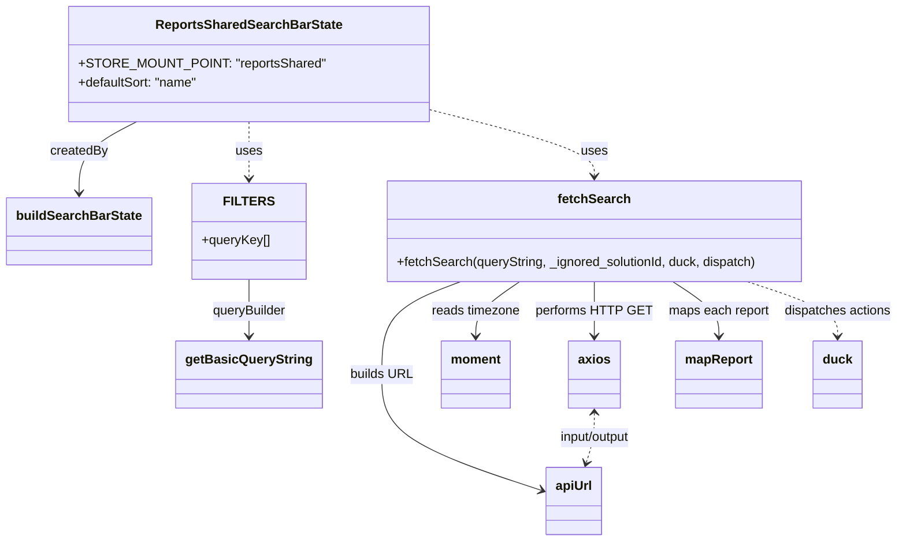

# Diagram: web/portal/src/pages/reports/redux/ReportsSharedState.js


> Auto-generated by Obscura crawlers

## Diagram 1



### SVG

<svg id="container" width="1102.7890625" xmlns="http://www.w3.org/2000/svg" class="classDiagram" height="676" viewBox="0 0 1102.7890625 676" role="graphics-document document" aria-roledescription="class"><style>#container{font-family:"trebuchet ms",verdana,arial,sans-serif;font-size:16px;fill:#333;}@keyframes edge-animation-frame{from{stroke-dashoffset:0;}}@keyframes dash{to{stroke-dashoffset:0;}}#container .edge-animation-slow{stroke-dasharray:9,5!important;stroke-dashoffset:900;animation:dash 50s linear infinite;stroke-linecap:round;}#container .edge-animation-fast{stroke-dasharray:9,5!important;stroke-dashoffset:900;animation:dash 20s linear infinite;stroke-linecap:round;}#container .error-icon{fill:#552222;}#container .error-text{fill:#552222;stroke:#552222;}#container .edge-thickness-normal{stroke-width:1px;}#container .edge-thickness-thick{stroke-width:3.5px;}#container .edge-pattern-solid{stroke-dasharray:0;}#container .edge-thickness-invisible{stroke-width:0;fill:none;}#container .edge-pattern-dashed{stroke-dasharray:3;}#container .edge-pattern-dotted{stroke-dasharray:2;}#container .marker{fill:#333333;stroke:#333333;}#container .marker.cross{stroke:#333333;}#container svg{font-family:"trebuchet ms",verdana,arial,sans-serif;font-size:16px;}#container p{margin:0;}#container g.classGroup text{fill:#9370DB;stroke:none;font-family:"trebuchet ms",verdana,arial,sans-serif;font-size:10px;}#container g.classGroup text .title{font-weight:bolder;}#container .nodeLabel,#container .edgeLabel{color:#131300;}#container .edgeLabel .label rect{fill:#ECECFF;}#container .label text{fill:#131300;}#container .labelBkg{background:#ECECFF;}#container .edgeLabel .label span{background:#ECECFF;}#container .classTitle{font-weight:bolder;}#container .node rect,#container .node circle,#container .node ellipse,#container .node polygon,#container .node path{fill:#ECECFF;stroke:#9370DB;stroke-width:1px;}#container .divider{stroke:#9370DB;stroke-width:1;}#container g.clickable{cursor:pointer;}#container g.classGroup rect{fill:#ECECFF;stroke:#9370DB;}#container g.classGroup line{stroke:#9370DB;stroke-width:1;}#container .classLabel .box{stroke:none;stroke-width:0;fill:#ECECFF;opacity:0.5;}#container .classLabel .label{fill:#9370DB;font-size:10px;}#container .relation{stroke:#333333;stroke-width:1;fill:none;}#container .dashed-line{stroke-dasharray:3;}#container .dotted-line{stroke-dasharray:1 2;}#container #compositionStart,#container .composition{fill:#333333!important;stroke:#333333!important;stroke-width:1;}#container #compositionEnd,#container .composition{fill:#333333!important;stroke:#333333!important;stroke-width:1;}#container #dependencyStart,#container .dependency{fill:#333333!important;stroke:#333333!important;stroke-width:1;}#container #dependencyStart,#container .dependency{fill:#333333!important;stroke:#333333!important;stroke-width:1;}#container #extensionStart,#container .extension{fill:transparent!important;stroke:#333333!important;stroke-width:1;}#container #extensionEnd,#container .extension{fill:transparent!important;stroke:#333333!important;stroke-width:1;}#container #aggregationStart,#container .aggregation{fill:transparent!important;stroke:#333333!important;stroke-width:1;}#container #aggregationEnd,#container .aggregation{fill:transparent!important;stroke:#333333!important;stroke-width:1;}#container #lollipopStart,#container .lollipop{fill:#ECECFF!important;stroke:#333333!important;stroke-width:1;}#container #lollipopEnd,#container .lollipop{fill:#ECECFF!important;stroke:#333333!important;stroke-width:1;}#container .edgeTerminals{font-size:11px;line-height:initial;}#container .classTitleText{text-anchor:middle;font-size:18px;fill:#333;}#container .label-icon{display:inline-block;height:1em;overflow:visible;vertical-align:-0.125em;}#container .node .label-icon path{fill:currentColor;stroke:revert;stroke-width:revert;}#container :root{--mermaid-font-family:"trebuchet ms",verdana,arial,sans-serif;}</style><g><defs><marker id="container_class-aggregationStart" class="marker aggregation class" refX="18" refY="7" markerWidth="190" markerHeight="240" orient="auto"><path d="M 18,7 L9,13 L1,7 L9,1 Z"></path></marker></defs><defs><marker id="container_class-aggregationEnd" class="marker aggregation class" refX="1" refY="7" markerWidth="20" markerHeight="28" orient="auto"><path d="M 18,7 L9,13 L1,7 L9,1 Z"></path></marker></defs><defs><marker id="container_class-extensionStart" class="marker extension class" refX="18" refY="7" markerWidth="190" markerHeight="240" orient="auto"><path d="M 1,7 L18,13 V 1 Z"></path></marker></defs><defs><marker id="container_class-extensionEnd" class="marker extension class" refX="1" refY="7" markerWidth="20" markerHeight="28" orient="auto"><path d="M 1,1 V 13 L18,7 Z"></path></marker></defs><defs><marker id="container_class-compositionStart" class="marker composition class" refX="18" refY="7" markerWidth="190" markerHeight="240" orient="auto"><path d="M 18,7 L9,13 L1,7 L9,1 Z"></path></marker></defs><defs><marker id="container_class-compositionEnd" class="marker composition class" refX="1" refY="7" markerWidth="20" markerHeight="28" orient="auto"><path d="M 18,7 L9,13 L1,7 L9,1 Z"></path></marker></defs><defs><marker id="container_class-dependencyStart" class="marker dependency class" refX="6" refY="7" markerWidth="190" markerHeight="240" orient="auto"><path d="M 5,7 L9,13 L1,7 L9,1 Z"></path></marker></defs><defs><marker id="container_class-dependencyEnd" class="marker dependency class" refX="13" refY="7" markerWidth="20" markerHeight="28" orient="auto"><path d="M 18,7 L9,13 L14,7 L9,1 Z"></path></marker></defs><defs><marker id="container_class-lollipopStart" class="marker lollipop class" refX="13" refY="7" markerWidth="190" markerHeight="240" orient="auto"><circle stroke="black" fill="transparent" cx="7" cy="7" r="6"></circle></marker></defs><defs><marker id="container_class-lollipopEnd" class="marker lollipop class" refX="1" refY="7" markerWidth="190" markerHeight="240" orient="auto"><circle stroke="black" fill="transparent" cx="7" cy="7" r="6"></circle></marker></defs><g class="root"><g class="clusters"></g><g class="edgePaths"><path d="M165.194,152L153.545,158.167C141.895,164.333,118.596,176.667,106.946,191.5C95.297,206.333,95.297,223.667,95.297,232.333L95.297,241" id="id_ReportsSharedSearchBarState_buildSearchBarState_1" class="edge-thickness-normal edge-pattern-solid relation" style=";;;" data-edge="true" data-et="edge" data-id="id_ReportsSharedSearchBarState_buildSearchBarState_1" data-points="W3sieCI6MTY1LjE5NDMwOTA1OTYzMywieSI6MTUyfSx7IngiOjk1LjI5Njg3NSwieSI6MTg5fSx7IngiOjk1LjI5Njg3NSwieSI6MjQ3fV0=" marker-end="url(#container_class-dependencyEnd)"></path><path d="M301.211,152L301.211,158.167C301.211,164.333,301.211,176.667,301.211,188.5C301.211,200.333,301.211,211.667,301.211,217.333L301.211,223" id="id_ReportsSharedSearchBarState_FILTERS_2" class="edge-thickness-normal edge-pattern-dashed relation" style=";;;" data-edge="true" data-et="edge" data-id="id_ReportsSharedSearchBarState_FILTERS_2" data-points="W3sieCI6MzAxLjIxMDkzNzUsInkiOjE1Mn0seyJ4IjozMDEuMjEwOTM3NSwieSI6MTg5fSx7IngiOjMwMS4yMTA5Mzc1LCJ5IjoyMjl9XQ==" marker-end="url(#container_class-dependencyEnd)"></path><path d="M513.641,134.93L548.491,143.942C583.341,152.954,653.042,170.977,687.892,185.155C722.742,199.333,722.742,209.667,722.742,214.833L722.742,220" id="id_ReportsSharedSearchBarState_fetchSearch_3" class="edge-thickness-normal edge-pattern-dashed relation" style=";;;" data-edge="true" data-et="edge" data-id="id_ReportsSharedSearchBarState_fetchSearch_3" data-points="W3sieCI6NTEzLjY0MDYyNSwieSI6MTM0LjkzMDI5NTA1NTIzMDJ9LHsieCI6NzIyLjc0MjE4NzUsInkiOjE4OX0seyJ4Ijo3MjIuNzQyMTg3NSwieSI6MjI2fV0=" marker-end="url(#container_class-dependencyEnd)"></path><path d="M301.211,349L301.211,355.667C301.211,362.333,301.211,375.667,301.211,387.5C301.211,399.333,301.211,409.667,301.211,414.833L301.211,420" id="id_FILTERS_getBasicQueryString_4" class="edge-thickness-normal edge-pattern-solid relation" style=";;;" data-edge="true" data-et="edge" data-id="id_FILTERS_getBasicQueryString_4" data-points="W3sieCI6MzAxLjIxMDkzNzUsInkiOjM0OX0seyJ4IjozMDEuMjEwOTM3NSwieSI6Mzg5fSx7IngiOjMwMS4yMTA5Mzc1LCJ5Ijo0MjZ9XQ==" marker-end="url(#container_class-dependencyEnd)"></path><path d="M558.406,352L542.32,358.167C526.234,364.333,494.062,376.667,477.976,396C461.891,415.333,461.891,441.667,461.891,468C461.891,494.333,461.891,520.667,495.246,544.811C528.602,568.955,595.314,590.91,628.67,601.888L662.025,612.865" id="id_fetchSearch_apiUrl_5" class="edge-thickness-normal edge-pattern-solid relation" style=";;;" data-edge="true" data-et="edge" data-id="id_fetchSearch_apiUrl_5" data-points="W3sieCI6NTU4LjQwNTcwMzEyNSwieSI6MzUyfSx7IngiOjQ2MS44OTA2MjUsInkiOjM4OX0seyJ4Ijo0NjEuODkwNjI1LCJ5Ijo0Njh9LHsieCI6NDYxLjg5MDYyNSwieSI6NTQ3fSx7IngiOjY2Ny43MjQ2MDkzNzUsInkiOjYxNC43NDEwMDcxMzU3MDg2fV0=" marker-end="url(#container_class-dependencyEnd)"></path><path d="M631.515,352L622.586,358.167C613.656,364.333,595.797,376.667,586.867,388C577.938,399.333,577.938,409.667,577.938,414.833L577.938,420" id="id_fetchSearch_moment_6" class="edge-thickness-normal edge-pattern-solid relation" style=";;;" data-edge="true" data-et="edge" data-id="id_fetchSearch_moment_6" data-points="W3sieCI6NjMxLjUxNTIzNDM3NSwieSI6MzUyfSx7IngiOjU3Ny45Mzc1LCJ5IjozODl9LHsieCI6NTc3LjkzNzUsInkiOjQyNn1d" marker-end="url(#container_class-dependencyEnd)"></path><path d="M722.742,352L722.742,358.167C722.742,364.333,722.742,376.667,722.742,388C722.742,399.333,722.742,409.667,722.742,414.833L722.742,420" id="id_fetchSearch_axios_7" class="edge-thickness-normal edge-pattern-solid relation" style=";;;" data-edge="true" data-et="edge" data-id="id_fetchSearch_axios_7" data-points="W3sieCI6NzIyLjc0MjE4NzUsInkiOjM1Mn0seyJ4Ijo3MjIuNzQyMTg3NSwieSI6Mzg5fSx7IngiOjcyMi43NDIxODc1LCJ5Ijo0MjZ9XQ==" marker-end="url(#container_class-dependencyEnd)"></path><path d="M819.078,352L828.508,358.167C837.937,364.333,856.797,376.667,866.227,388C875.656,399.333,875.656,409.667,875.656,414.833L875.656,420" id="id_fetchSearch_mapReport_8" class="edge-thickness-normal edge-pattern-solid relation" style=";;;" data-edge="true" data-et="edge" data-id="id_fetchSearch_mapReport_8" data-points="W3sieCI6ODE5LjA3ODA0Njg3NSwieSI6MzUyfSx7IngiOjg3NS42NTYyNSwieSI6Mzg5fSx7IngiOjg3NS42NTYyNSwieSI6NDI2fV0=" marker-end="url(#container_class-dependencyEnd)"></path><path d="M914.469,352L933.236,358.167C952.003,364.333,989.537,376.667,1008.303,388C1027.07,399.333,1027.07,409.667,1027.07,414.833L1027.07,420" id="id_fetchSearch_duck_9" class="edge-thickness-normal edge-pattern-dashed relation" style=";;;" data-edge="true" data-et="edge" data-id="id_fetchSearch_duck_9" data-points="W3sieCI6OTE0LjQ2ODkwNjI1LCJ5IjozNTJ9LHsieCI6MTAyNy4wNzAzMTI1LCJ5IjozODl9LHsieCI6MTAyNy4wNzAzMTI1LCJ5Ijo0MjZ9XQ==" marker-end="url(#container_class-dependencyEnd)"></path><path d="M722.742,516L722.742,521.167C722.742,526.333,722.742,536.667,721.373,547.033C720.003,557.399,717.264,567.799,715.895,572.998L714.525,578.198" id="id_axios_apiUrl_10" class="edge-thickness-normal edge-pattern-dashed relation" style=";;;" data-edge="true" data-et="edge" data-id="id_axios_apiUrl_10" data-points="W3sieCI6NzIyLjc0MjE4NzUsInkiOjUxMH0seyJ4Ijo3MjIuNzQyMTg3NSwieSI6NTQ3fSx7IngiOjcxMi45OTczMDUxODE5NjIsInkiOjU4NH1d" marker-start="url(#container_class-dependencyStart)" marker-end="url(#container_class-dependencyEnd)"></path></g><g class="edgeLabels"><g class="edgeLabel" transform="translate(95.296875, 189)"><g class="label" data-id="id_ReportsSharedSearchBarState_buildSearchBarState_1" transform="translate(-36.0234375, -12)"><foreignObject width="72.046875" height="24"><div xmlns="http://www.w3.org/1999/xhtml" class="labelBkg" style="display: table-cell; white-space: nowrap; line-height: 1.5; max-width: 200px; text-align: center;"><span class="edgeLabel"><p>createdBy</p></span></div></foreignObject></g></g><g class="edgeLabel" transform="translate(301.2109375, 189)"><g class="label" data-id="id_ReportsSharedSearchBarState_FILTERS_2" transform="translate(-16.4921875, -12)"><foreignObject width="32.984375" height="24"><div xmlns="http://www.w3.org/1999/xhtml" class="labelBkg" style="display: table-cell; white-space: nowrap; line-height: 1.5; max-width: 200px; text-align: center;"><span class="edgeLabel"><p>uses</p></span></div></foreignObject></g></g><g class="edgeLabel" transform="translate(722.7421875, 189)"><g class="label" data-id="id_ReportsSharedSearchBarState_fetchSearch_3" transform="translate(-16.4921875, -12)"><foreignObject width="32.984375" height="24"><div xmlns="http://www.w3.org/1999/xhtml" class="labelBkg" style="display: table-cell; white-space: nowrap; line-height: 1.5; max-width: 200px; text-align: center;"><span class="edgeLabel"><p>uses</p></span></div></foreignObject></g></g><g class="edgeLabel" transform="translate(301.2109375, 389)"><g class="label" data-id="id_FILTERS_getBasicQueryString_4" transform="translate(-47.140625, -12)"><foreignObject width="94.28125" height="24"><div xmlns="http://www.w3.org/1999/xhtml" class="labelBkg" style="display: table-cell; white-space: nowrap; line-height: 1.5; max-width: 200px; text-align: center;"><span class="edgeLabel"><p>queryBuilder</p></span></div></foreignObject></g></g><g class="edgeLabel" transform="translate(461.890625, 468)"><g class="label" data-id="id_fetchSearch_apiUrl_5" transform="translate(-38.734375, -12)"><foreignObject width="77.46875" height="24"><div xmlns="http://www.w3.org/1999/xhtml" class="labelBkg" style="display: table-cell; white-space: nowrap; line-height: 1.5; max-width: 200px; text-align: center;"><span class="edgeLabel"><p>builds URL</p></span></div></foreignObject></g></g><g class="edgeLabel" transform="translate(577.9375, 389)"><g class="label" data-id="id_fetchSearch_moment_6" transform="translate(-55.5859375, -12)"><foreignObject width="111.171875" height="24"><div xmlns="http://www.w3.org/1999/xhtml" class="labelBkg" style="display: table-cell; white-space: nowrap; line-height: 1.5; max-width: 200px; text-align: center;"><span class="edgeLabel"><p>reads timezone</p></span></div></foreignObject></g></g><g class="edgeLabel" transform="translate(722.7421875, 389)"><g class="label" data-id="id_fetchSearch_axios_7" transform="translate(-69.21875, -12)"><foreignObject width="138.4375" height="24"><div xmlns="http://www.w3.org/1999/xhtml" class="labelBkg" style="display: table-cell; white-space: nowrap; line-height: 1.5; max-width: 200px; text-align: center;"><span class="edgeLabel"><p>performs HTTP GET</p></span></div></foreignObject></g></g><g class="edgeLabel" transform="translate(875.65625, 389)"><g class="label" data-id="id_fetchSearch_mapReport_8" transform="translate(-63.6953125, -12)"><foreignObject width="127.390625" height="24"><div xmlns="http://www.w3.org/1999/xhtml" class="labelBkg" style="display: table-cell; white-space: nowrap; line-height: 1.5; max-width: 200px; text-align: center;"><span class="edgeLabel"><p>maps each report</p></span></div></foreignObject></g></g><g class="edgeLabel" transform="translate(1027.0703125, 389)"><g class="label" data-id="id_fetchSearch_duck_9" transform="translate(-67.71875, -12)"><foreignObject width="135.4375" height="24"><div xmlns="http://www.w3.org/1999/xhtml" class="labelBkg" style="display: table-cell; white-space: nowrap; line-height: 1.5; max-width: 200px; text-align: center;"><span class="edgeLabel"><p>dispatches actions</p></span></div></foreignObject></g></g><g class="edgeLabel" transform="translate(722.7421875, 547)"><g class="label" data-id="id_axios_apiUrl_10" transform="translate(-47.515625, -12)"><foreignObject width="95.03125" height="24"><div xmlns="http://www.w3.org/1999/xhtml" class="labelBkg" style="display: table-cell; white-space: nowrap; line-height: 1.5; max-width: 200px; text-align: center;"><span class="edgeLabel"><p>input/output</p></span></div></foreignObject></g></g></g><g class="nodes"><g class="node default" id="classId-ReportsSharedSearchBarState-0" transform="translate(301.2109375, 80)"><g class="basic label-container"><path d="M-212.4296875 -72 L212.4296875 -72 L212.4296875 72 L-212.4296875 72" stroke="none" stroke-width="0" fill="#ECECFF" style=""></path><path d="M-212.4296875 -72 C-89.99209887776296 -72, 32.44548974447409 -72, 212.4296875 -72 M-212.4296875 -72 C-99.2857606903238 -72, 13.858166119352404 -72, 212.4296875 -72 M212.4296875 -72 C212.4296875 -40.22877592623724, 212.4296875 -8.45755185247448, 212.4296875 72 M212.4296875 -72 C212.4296875 -37.130266102032465, 212.4296875 -2.26053220406493, 212.4296875 72 M212.4296875 72 C114.04329863900058 72, 15.656909778001165 72, -212.4296875 72 M212.4296875 72 C83.95940526481249 72, -44.51087697037502 72, -212.4296875 72 M-212.4296875 72 C-212.4296875 18.22699602964547, -212.4296875 -35.54600794070906, -212.4296875 -72 M-212.4296875 72 C-212.4296875 41.52101436019269, -212.4296875 11.042028720385375, -212.4296875 -72" stroke="#9370DB" stroke-width="1.3" fill="none" stroke-dasharray="0 0" style=""></path></g><g class="annotation-group text" transform="translate(0, -48)"></g><g class="label-group text" transform="translate(-111.15625, -48)"><g class="label" style="font-weight: bolder" transform="translate(0,-12)"><foreignObject width="222.3125" height="24"><div xmlns="http://www.w3.org/1999/xhtml" style="display: table-cell; white-space: nowrap; line-height: 1.5; max-width: 268px; text-align: center;"><span class="nodeLabel markdown-node-label" style=""><p>ReportsSharedSearchBarState</p></span></div></foreignObject></g></g><g class="members-group text" transform="translate(-200.4296875, 0)"><g class="label" style="" transform="translate(0,-12)"><foreignObject width="289.703125" height="24"><div xmlns="http://www.w3.org/1999/xhtml" style="display: table-cell; white-space: nowrap; line-height: 1.5; max-width: 347px; text-align: center;"><span class="nodeLabel markdown-node-label" style=""><p>+STORE_MOUNT_POINT: "reportsShared"</p></span></div></foreignObject></g><g class="label" style="" transform="translate(0,12)"><foreignObject width="151.046875" height="24"><div xmlns="http://www.w3.org/1999/xhtml" style="display: table-cell; white-space: nowrap; line-height: 1.5; max-width: 208px; text-align: center;"><span class="nodeLabel markdown-node-label" style=""><p>+defaultSort: "name"</p></span></div></foreignObject></g></g><g class="methods-group text" transform="translate(-200.4296875, 72)"></g><g class="divider" style=""><path d="M-212.4296875 -24 C-82.8080619505287 -24, 46.81356359894261 -24, 212.4296875 -24 M-212.4296875 -24 C-110.0073626256482 -24, -7.585037751296397 -24, 212.4296875 -24" stroke="#9370DB" stroke-width="1.3" fill="none" stroke-dasharray="0 0" style=""></path></g><g class="divider" style=""><path d="M-212.4296875 48 C-73.1698127554323 48, 66.09006198913539 48, 212.4296875 48 M-212.4296875 48 C-90.00131838086342 48, 32.42705073827315 48, 212.4296875 48" stroke="#9370DB" stroke-width="1.3" fill="none" stroke-dasharray="0 0" style=""></path></g></g><g class="node default" id="classId-buildSearchBarState-1" transform="translate(95.296875, 289)"><g class="basic label-container"><path d="M-87.296875 -42 L87.296875 -42 L87.296875 42 L-87.296875 42" stroke="none" stroke-width="0" fill="#ECECFF" style=""></path><path d="M-87.296875 -42 C-29.341994246295464 -42, 28.612886507409073 -42, 87.296875 -42 M-87.296875 -42 C-31.86118398137763 -42, 23.574507037244743 -42, 87.296875 -42 M87.296875 -42 C87.296875 -15.304837008151296, 87.296875 11.390325983697409, 87.296875 42 M87.296875 -42 C87.296875 -10.294690210479686, 87.296875 21.410619579040628, 87.296875 42 M87.296875 42 C35.82620844354006 42, -15.644458112919878 42, -87.296875 42 M87.296875 42 C21.527606949330206 42, -44.24166110133959 42, -87.296875 42 M-87.296875 42 C-87.296875 15.815019001692345, -87.296875 -10.36996199661531, -87.296875 -42 M-87.296875 42 C-87.296875 10.649252062464821, -87.296875 -20.701495875070357, -87.296875 -42" stroke="#9370DB" stroke-width="1.3" fill="none" stroke-dasharray="0 0" style=""></path></g><g class="annotation-group text" transform="translate(0, -18)"></g><g class="label-group text" transform="translate(-75.296875, -18)"><g class="label" style="font-weight: bolder" transform="translate(0,-12)"><foreignObject width="150.59375" height="24"><div xmlns="http://www.w3.org/1999/xhtml" style="display: table-cell; white-space: nowrap; line-height: 1.5; max-width: 198px; text-align: center;"><span class="nodeLabel markdown-node-label" style=""><p>buildSearchBarState</p></span></div></foreignObject></g></g><g class="members-group text" transform="translate(-75.296875, 30)"></g><g class="methods-group text" transform="translate(-75.296875, 60)"></g><g class="divider" style=""><path d="M-87.296875 6 C-33.94677978327821 6, 19.40331543344358 6, 87.296875 6 M-87.296875 6 C-48.682156096135955 6, -10.06743719227191 6, 87.296875 6" stroke="#9370DB" stroke-width="1.3" fill="none" stroke-dasharray="0 0" style=""></path></g><g class="divider" style=""><path d="M-87.296875 24 C-35.446666940562345 24, 16.40354111887531 24, 87.296875 24 M-87.296875 24 C-35.45949253135071 24, 16.377889937298576 24, 87.296875 24" stroke="#9370DB" stroke-width="1.3" fill="none" stroke-dasharray="0 0" style=""></path></g></g><g class="node default" id="classId-FILTERS-2" transform="translate(301.2109375, 289)"><g class="basic label-container"><path d="M-68.6171875 -60 L68.6171875 -60 L68.6171875 60 L-68.6171875 60" stroke="none" stroke-width="0" fill="#ECECFF" style=""></path><path d="M-68.6171875 -60 C-22.38315011163008 -60, 23.85088727673984 -60, 68.6171875 -60 M-68.6171875 -60 C-19.886166583803053 -60, 28.844854332393894 -60, 68.6171875 -60 M68.6171875 -60 C68.6171875 -14.062087127810074, 68.6171875 31.875825744379853, 68.6171875 60 M68.6171875 -60 C68.6171875 -13.809129908424616, 68.6171875 32.38174018315077, 68.6171875 60 M68.6171875 60 C21.75063794466236 60, -25.115911610675283 60, -68.6171875 60 M68.6171875 60 C24.80448742053889 60, -19.00821265892222 60, -68.6171875 60 M-68.6171875 60 C-68.6171875 23.812609518212852, -68.6171875 -12.374780963574295, -68.6171875 -60 M-68.6171875 60 C-68.6171875 19.510370147416822, -68.6171875 -20.979259705166356, -68.6171875 -60" stroke="#9370DB" stroke-width="1.3" fill="none" stroke-dasharray="0 0" style=""></path></g><g class="annotation-group text" transform="translate(0, -36)"></g><g class="label-group text" transform="translate(-27.5625, -36)"><g class="label" style="font-weight: bolder" transform="translate(0,-12)"><foreignObject width="55.125" height="24"><div xmlns="http://www.w3.org/1999/xhtml" style="display: table-cell; white-space: nowrap; line-height: 1.5; max-width: 105px; text-align: center;"><span class="nodeLabel markdown-node-label" style=""><p>FILTERS</p></span></div></foreignObject></g></g><g class="members-group text" transform="translate(-56.6171875, 12)"><g class="label" style="" transform="translate(0,-12)"><foreignObject width="85.671875" height="24"><div xmlns="http://www.w3.org/1999/xhtml" style="display: table-cell; white-space: nowrap; line-height: 1.5; max-width: 143px; text-align: center;"><span class="nodeLabel markdown-node-label" style=""><p>+queryKey[]</p></span></div></foreignObject></g></g><g class="methods-group text" transform="translate(-56.6171875, 60)"></g><g class="divider" style=""><path d="M-68.6171875 -12 C-18.3318419053127 -12, 31.9535036893746 -12, 68.6171875 -12 M-68.6171875 -12 C-25.45399497467428 -12, 17.70919755065144 -12, 68.6171875 -12" stroke="#9370DB" stroke-width="1.3" fill="none" stroke-dasharray="0 0" style=""></path></g><g class="divider" style=""><path d="M-68.6171875 36 C-37.86156994131679 36, -7.105952382633575 36, 68.6171875 36 M-68.6171875 36 C-17.51265066136036 36, 33.59188617727928 36, 68.6171875 36" stroke="#9370DB" stroke-width="1.3" fill="none" stroke-dasharray="0 0" style=""></path></g></g><g class="node default" id="classId-fetchSearch-3" transform="translate(722.7421875, 289)"><g class="basic label-container"><path d="M-261.30078125 -63 L261.30078125 -63 L261.30078125 63 L-261.30078125 63" stroke="none" stroke-width="0" fill="#ECECFF" style=""></path><path d="M-261.30078125 -63 C-147.75629097098124 -63, -34.21180069196248 -63, 261.30078125 -63 M-261.30078125 -63 C-125.00657178330744 -63, 11.287637683385128 -63, 261.30078125 -63 M261.30078125 -63 C261.30078125 -27.7230114363949, 261.30078125 7.553977127210203, 261.30078125 63 M261.30078125 -63 C261.30078125 -14.02408929432886, 261.30078125 34.95182141134228, 261.30078125 63 M261.30078125 63 C52.760583499758695 63, -155.7796142504826 63, -261.30078125 63 M261.30078125 63 C81.28062265223224 63, -98.73953594553552 63, -261.30078125 63 M-261.30078125 63 C-261.30078125 20.78201862846094, -261.30078125 -21.43596274307812, -261.30078125 -63 M-261.30078125 63 C-261.30078125 22.858800148372644, -261.30078125 -17.28239970325471, -261.30078125 -63" stroke="#9370DB" stroke-width="1.3" fill="none" stroke-dasharray="0 0" style=""></path></g><g class="annotation-group text" transform="translate(0, -39)"></g><g class="label-group text" transform="translate(-43.2890625, -39)"><g class="label" style="font-weight: bolder" transform="translate(0,-12)"><foreignObject width="86.578125" height="24"><div xmlns="http://www.w3.org/1999/xhtml" style="display: table-cell; white-space: nowrap; line-height: 1.5; max-width: 135px; text-align: center;"><span class="nodeLabel markdown-node-label" style=""><p>fetchSearch</p></span></div></foreignObject></g></g><g class="members-group text" transform="translate(-249.30078125, 9)"></g><g class="methods-group text" transform="translate(-249.30078125, 39)"><g class="label" style="" transform="translate(0,-12)"><foreignObject width="455.3125" height="24"><div xmlns="http://www.w3.org/1999/xhtml" style="display: table-cell; white-space: nowrap; line-height: 1.5; max-width: 513px; text-align: center;"><span class="nodeLabel markdown-node-label" style=""><p>+fetchSearch(queryString, _ignored_solutionId, duck, dispatch)</p></span></div></foreignObject></g></g><g class="divider" style=""><path d="M-261.30078125 -15 C-154.27523196439597 -15, -47.24968267879191 -15, 261.30078125 -15 M-261.30078125 -15 C-127.9403551499199 -15, 5.420070950160209 -15, 261.30078125 -15" stroke="#9370DB" stroke-width="1.3" fill="none" stroke-dasharray="0 0" style=""></path></g><g class="divider" style=""><path d="M-261.30078125 9 C-138.1569627603289 9, -15.013144270657762 9, 261.30078125 9 M-261.30078125 9 C-145.09404519166412 9, -28.887309133328216 9, 261.30078125 9" stroke="#9370DB" stroke-width="1.3" fill="none" stroke-dasharray="0 0" style=""></path></g></g><g class="node default" id="classId-axios-4" transform="translate(722.7421875, 468)"><g class="basic label-container"><path d="M-31.2734375 -42 L31.2734375 -42 L31.2734375 42 L-31.2734375 42" stroke="none" stroke-width="0" fill="#ECECFF" style=""></path><path d="M-31.2734375 -42 C-7.332019345967073 -42, 16.609398808065855 -42, 31.2734375 -42 M-31.2734375 -42 C-12.682377934740575 -42, 5.908681630518849 -42, 31.2734375 -42 M31.2734375 -42 C31.2734375 -12.754531400504696, 31.2734375 16.490937198990608, 31.2734375 42 M31.2734375 -42 C31.2734375 -18.776113654418758, 31.2734375 4.447772691162484, 31.2734375 42 M31.2734375 42 C7.503028231453143 42, -16.267381037093713 42, -31.2734375 42 M31.2734375 42 C9.896656007043397 42, -11.480125485913206 42, -31.2734375 42 M-31.2734375 42 C-31.2734375 21.782519046587524, -31.2734375 1.5650380931750476, -31.2734375 -42 M-31.2734375 42 C-31.2734375 8.903550655151783, -31.2734375 -24.192898689696435, -31.2734375 -42" stroke="#9370DB" stroke-width="1.3" fill="none" stroke-dasharray="0 0" style=""></path></g><g class="annotation-group text" transform="translate(0, -18)"></g><g class="label-group text" transform="translate(-19.2734375, -18)"><g class="label" style="font-weight: bolder" transform="translate(0,-12)"><foreignObject width="38.546875" height="24"><div xmlns="http://www.w3.org/1999/xhtml" style="display: table-cell; white-space: nowrap; line-height: 1.5; max-width: 88px; text-align: center;"><span class="nodeLabel markdown-node-label" style=""><p>axios</p></span></div></foreignObject></g></g><g class="members-group text" transform="translate(-19.2734375, 30)"></g><g class="methods-group text" transform="translate(-19.2734375, 60)"></g><g class="divider" style=""><path d="M-31.2734375 6 C-18.187569618324947 6, -5.101701736649893 6, 31.2734375 6 M-31.2734375 6 C-10.180444000807611 6, 10.912549498384777 6, 31.2734375 6" stroke="#9370DB" stroke-width="1.3" fill="none" stroke-dasharray="0 0" style=""></path></g><g class="divider" style=""><path d="M-31.2734375 24 C-8.016513943556436 24, 15.240409612887127 24, 31.2734375 24 M-31.2734375 24 C-16.735995745246505 24, -2.1985539904930143 24, 31.2734375 24" stroke="#9370DB" stroke-width="1.3" fill="none" stroke-dasharray="0 0" style=""></path></g></g><g class="node default" id="classId-apiUrl-5" transform="translate(701.935546875, 626)"><g class="basic label-container"><path d="M-34.2109375 -42 L34.2109375 -42 L34.2109375 42 L-34.2109375 42" stroke="none" stroke-width="0" fill="#ECECFF" style=""></path><path d="M-34.2109375 -42 C-9.15244162405688 -42, 15.90605425188624 -42, 34.2109375 -42 M-34.2109375 -42 C-15.440046137495564 -42, 3.330845225008872 -42, 34.2109375 -42 M34.2109375 -42 C34.2109375 -22.058253162094054, 34.2109375 -2.1165063241881086, 34.2109375 42 M34.2109375 -42 C34.2109375 -12.152668820160287, 34.2109375 17.694662359679427, 34.2109375 42 M34.2109375 42 C18.452576861163138 42, 2.694216222326272 42, -34.2109375 42 M34.2109375 42 C8.267004057468629 42, -17.676929385062742 42, -34.2109375 42 M-34.2109375 42 C-34.2109375 23.462986016431863, -34.2109375 4.925972032863726, -34.2109375 -42 M-34.2109375 42 C-34.2109375 13.315215303569971, -34.2109375 -15.369569392860058, -34.2109375 -42" stroke="#9370DB" stroke-width="1.3" fill="none" stroke-dasharray="0 0" style=""></path></g><g class="annotation-group text" transform="translate(0, -18)"></g><g class="label-group text" transform="translate(-22.2109375, -18)"><g class="label" style="font-weight: bolder" transform="translate(0,-12)"><foreignObject width="44.421875" height="24"><div xmlns="http://www.w3.org/1999/xhtml" style="display: table-cell; white-space: nowrap; line-height: 1.5; max-width: 94px; text-align: center;"><span class="nodeLabel markdown-node-label" style=""><p>apiUrl</p></span></div></foreignObject></g></g><g class="members-group text" transform="translate(-22.2109375, 30)"></g><g class="methods-group text" transform="translate(-22.2109375, 60)"></g><g class="divider" style=""><path d="M-34.2109375 6 C-18.838392869542755 6, -3.46584823908551 6, 34.2109375 6 M-34.2109375 6 C-13.930852816693516 6, 6.349231866612968 6, 34.2109375 6" stroke="#9370DB" stroke-width="1.3" fill="none" stroke-dasharray="0 0" style=""></path></g><g class="divider" style=""><path d="M-34.2109375 24 C-17.126862224885393 24, -0.04278694977078601 24, 34.2109375 24 M-34.2109375 24 C-7.1553695550532375 24, 19.900198389893525 24, 34.2109375 24" stroke="#9370DB" stroke-width="1.3" fill="none" stroke-dasharray="0 0" style=""></path></g></g><g class="node default" id="classId-moment-6" transform="translate(577.9375, 468)"><g class="basic label-container"><path d="M-42.3125 -42 L42.3125 -42 L42.3125 42 L-42.3125 42" stroke="none" stroke-width="0" fill="#ECECFF" style=""></path><path d="M-42.3125 -42 C-15.967767334762648 -42, 10.376965330474704 -42, 42.3125 -42 M-42.3125 -42 C-13.64497741583449 -42, 15.022545168331021 -42, 42.3125 -42 M42.3125 -42 C42.3125 -13.883119559452552, 42.3125 14.233760881094895, 42.3125 42 M42.3125 -42 C42.3125 -15.23991255969095, 42.3125 11.5201748806181, 42.3125 42 M42.3125 42 C8.507221298825506 42, -25.298057402348988 42, -42.3125 42 M42.3125 42 C23.010361598946698 42, 3.708223197893396 42, -42.3125 42 M-42.3125 42 C-42.3125 19.706379538001038, -42.3125 -2.587240923997925, -42.3125 -42 M-42.3125 42 C-42.3125 17.332087273811283, -42.3125 -7.335825452377435, -42.3125 -42" stroke="#9370DB" stroke-width="1.3" fill="none" stroke-dasharray="0 0" style=""></path></g><g class="annotation-group text" transform="translate(0, -18)"></g><g class="label-group text" transform="translate(-30.3125, -18)"><g class="label" style="font-weight: bolder" transform="translate(0,-12)"><foreignObject width="60.625" height="24"><div xmlns="http://www.w3.org/1999/xhtml" style="display: table-cell; white-space: nowrap; line-height: 1.5; max-width: 111px; text-align: center;"><span class="nodeLabel markdown-node-label" style=""><p>moment</p></span></div></foreignObject></g></g><g class="members-group text" transform="translate(-30.3125, 30)"></g><g class="methods-group text" transform="translate(-30.3125, 60)"></g><g class="divider" style=""><path d="M-42.3125 6 C-22.5156281432531 6, -2.718756286506199 6, 42.3125 6 M-42.3125 6 C-19.856583073909217 6, 2.599333852181566 6, 42.3125 6" stroke="#9370DB" stroke-width="1.3" fill="none" stroke-dasharray="0 0" style=""></path></g><g class="divider" style=""><path d="M-42.3125 24 C-23.966435349912512 24, -5.620370699825024 24, 42.3125 24 M-42.3125 24 C-13.536547413742397 24, 15.239405172515205 24, 42.3125 24" stroke="#9370DB" stroke-width="1.3" fill="none" stroke-dasharray="0 0" style=""></path></g></g><g class="node default" id="classId-mapReport-7" transform="translate(875.65625, 468)"><g class="basic label-container"><path d="M-52.8984375 -42 L52.8984375 -42 L52.8984375 42 L-52.8984375 42" stroke="none" stroke-width="0" fill="#ECECFF" style=""></path><path d="M-52.8984375 -42 C-23.187386796543876 -42, 6.5236639069122475 -42, 52.8984375 -42 M-52.8984375 -42 C-20.908151152246305 -42, 11.08213519550739 -42, 52.8984375 -42 M52.8984375 -42 C52.8984375 -18.501477143771922, 52.8984375 4.997045712456156, 52.8984375 42 M52.8984375 -42 C52.8984375 -17.699296199546446, 52.8984375 6.601407600907109, 52.8984375 42 M52.8984375 42 C30.180916055114714 42, 7.463394610229429 42, -52.8984375 42 M52.8984375 42 C29.12021442532877 42, 5.341991350657537 42, -52.8984375 42 M-52.8984375 42 C-52.8984375 9.777859848890415, -52.8984375 -22.44428030221917, -52.8984375 -42 M-52.8984375 42 C-52.8984375 11.110380554311426, -52.8984375 -19.779238891377148, -52.8984375 -42" stroke="#9370DB" stroke-width="1.3" fill="none" stroke-dasharray="0 0" style=""></path></g><g class="annotation-group text" transform="translate(0, -18)"></g><g class="label-group text" transform="translate(-40.8984375, -18)"><g class="label" style="font-weight: bolder" transform="translate(0,-12)"><foreignObject width="81.796875" height="24"><div xmlns="http://www.w3.org/1999/xhtml" style="display: table-cell; white-space: nowrap; line-height: 1.5; max-width: 131px; text-align: center;"><span class="nodeLabel markdown-node-label" style=""><p>mapReport</p></span></div></foreignObject></g></g><g class="members-group text" transform="translate(-40.8984375, 30)"></g><g class="methods-group text" transform="translate(-40.8984375, 60)"></g><g class="divider" style=""><path d="M-52.8984375 6 C-16.42376944702047 6, 20.050898605959063 6, 52.8984375 6 M-52.8984375 6 C-10.9647569005569 6, 30.9689236988862 6, 52.8984375 6" stroke="#9370DB" stroke-width="1.3" fill="none" stroke-dasharray="0 0" style=""></path></g><g class="divider" style=""><path d="M-52.8984375 24 C-12.81297182162946 24, 27.27249385674108 24, 52.8984375 24 M-52.8984375 24 C-10.776529921143691 24, 31.345377657712618 24, 52.8984375 24" stroke="#9370DB" stroke-width="1.3" fill="none" stroke-dasharray="0 0" style=""></path></g></g><g class="node default" id="classId-getBasicQueryString-8" transform="translate(301.2109375, 468)"><g class="basic label-container"><path d="M-86.9453125 -42 L86.9453125 -42 L86.9453125 42 L-86.9453125 42" stroke="none" stroke-width="0" fill="#ECECFF" style=""></path><path d="M-86.9453125 -42 C-48.38937832467259 -42, -9.833444149345183 -42, 86.9453125 -42 M-86.9453125 -42 C-42.24082041647849 -42, 2.463671667043016 -42, 86.9453125 -42 M86.9453125 -42 C86.9453125 -17.897881166248077, 86.9453125 6.204237667503847, 86.9453125 42 M86.9453125 -42 C86.9453125 -15.308993537253897, 86.9453125 11.382012925492205, 86.9453125 42 M86.9453125 42 C50.163800880854446 42, 13.382289261708891 42, -86.9453125 42 M86.9453125 42 C21.463284917837427 42, -44.018742664325146 42, -86.9453125 42 M-86.9453125 42 C-86.9453125 12.874519790739217, -86.9453125 -16.250960418521565, -86.9453125 -42 M-86.9453125 42 C-86.9453125 13.346905170277786, -86.9453125 -15.306189659444428, -86.9453125 -42" stroke="#9370DB" stroke-width="1.3" fill="none" stroke-dasharray="0 0" style=""></path></g><g class="annotation-group text" transform="translate(0, -18)"></g><g class="label-group text" transform="translate(-74.9453125, -18)"><g class="label" style="font-weight: bolder" transform="translate(0,-12)"><foreignObject width="149.890625" height="24"><div xmlns="http://www.w3.org/1999/xhtml" style="display: table-cell; white-space: nowrap; line-height: 1.5; max-width: 197px; text-align: center;"><span class="nodeLabel markdown-node-label" style=""><p>getBasicQueryString</p></span></div></foreignObject></g></g><g class="members-group text" transform="translate(-74.9453125, 30)"></g><g class="methods-group text" transform="translate(-74.9453125, 60)"></g><g class="divider" style=""><path d="M-86.9453125 6 C-23.434012209863198 6, 40.077288080273604 6, 86.9453125 6 M-86.9453125 6 C-21.34362384155932 6, 44.25806481688136 6, 86.9453125 6" stroke="#9370DB" stroke-width="1.3" fill="none" stroke-dasharray="0 0" style=""></path></g><g class="divider" style=""><path d="M-86.9453125 24 C-43.19536977993467 24, 0.5545729401306545 24, 86.9453125 24 M-86.9453125 24 C-36.5012121491729 24, 13.942888201654199 24, 86.9453125 24" stroke="#9370DB" stroke-width="1.3" fill="none" stroke-dasharray="0 0" style=""></path></g></g><g class="node default" id="classId-duck-9" transform="translate(1027.0703125, 468)"><g class="basic label-container"><path d="M-29.625 -42 L29.625 -42 L29.625 42 L-29.625 42" stroke="none" stroke-width="0" fill="#ECECFF" style=""></path><path d="M-29.625 -42 C-6.373598809753791 -42, 16.87780238049242 -42, 29.625 -42 M-29.625 -42 C-14.199679115634872 -42, 1.2256417687302559 -42, 29.625 -42 M29.625 -42 C29.625 -12.811929427366273, 29.625 16.376141145267454, 29.625 42 M29.625 -42 C29.625 -20.380903996628334, 29.625 1.2381920067433327, 29.625 42 M29.625 42 C11.035632103686329 42, -7.553735792627343 42, -29.625 42 M29.625 42 C14.79438418259647 42, -0.036231634807059265 42, -29.625 42 M-29.625 42 C-29.625 17.32247568744751, -29.625 -7.355048625104978, -29.625 -42 M-29.625 42 C-29.625 21.1607430763412, -29.625 0.32148615268239666, -29.625 -42" stroke="#9370DB" stroke-width="1.3" fill="none" stroke-dasharray="0 0" style=""></path></g><g class="annotation-group text" transform="translate(0, -18)"></g><g class="label-group text" transform="translate(-17.625, -18)"><g class="label" style="font-weight: bolder" transform="translate(0,-12)"><foreignObject width="35.25" height="24"><div xmlns="http://www.w3.org/1999/xhtml" style="display: table-cell; white-space: nowrap; line-height: 1.5; max-width: 86px; text-align: center;"><span class="nodeLabel markdown-node-label" style=""><p>duck</p></span></div></foreignObject></g></g><g class="members-group text" transform="translate(-17.625, 30)"></g><g class="methods-group text" transform="translate(-17.625, 60)"></g><g class="divider" style=""><path d="M-29.625 6 C-8.682106543781256 6, 12.260786912437489 6, 29.625 6 M-29.625 6 C-17.64359710448082 6, -5.662194208961633 6, 29.625 6" stroke="#9370DB" stroke-width="1.3" fill="none" stroke-dasharray="0 0" style=""></path></g><g class="divider" style=""><path d="M-29.625 24 C-6.6142723512918415 24, 16.396455297416317 24, 29.625 24 M-29.625 24 C-7.378659579486801 24, 14.867680841026399 24, 29.625 24" stroke="#9370DB" stroke-width="1.3" fill="none" stroke-dasharray="0 0" style=""></path></g></g></g></g></g></svg>

## Diagram 2

```mermaid
flowchart TD
    A([Start fetchSearch(queryString)]) --> B[Construct URL via apiUrl: /powerbi/pb_token?directoryCategory=shared_reports&queryString]
    B --> C[Prepare config headers: "x-time-zone" from moment.tz.guess(), Accept: application/json;version=reports]
    C --> D[dispatch({ type: duck.actions.REQUEST })]
    D --> E[axios.get(url, config)]
    E -->|200 OK| F[Map response.data -> response.data.map(mapReport)]
    F --> G[dispatch({ type: duck.actions.RECEIVE, payload: { ...response.data, data: mapped } })]
    E -->|Error| H[console.log(err); dispatch({ type: duck.actions.REQUEST_ERROR, err })]
    G --> I([End])
    H --> I
```

> SVG rendering failed for this diagram.
