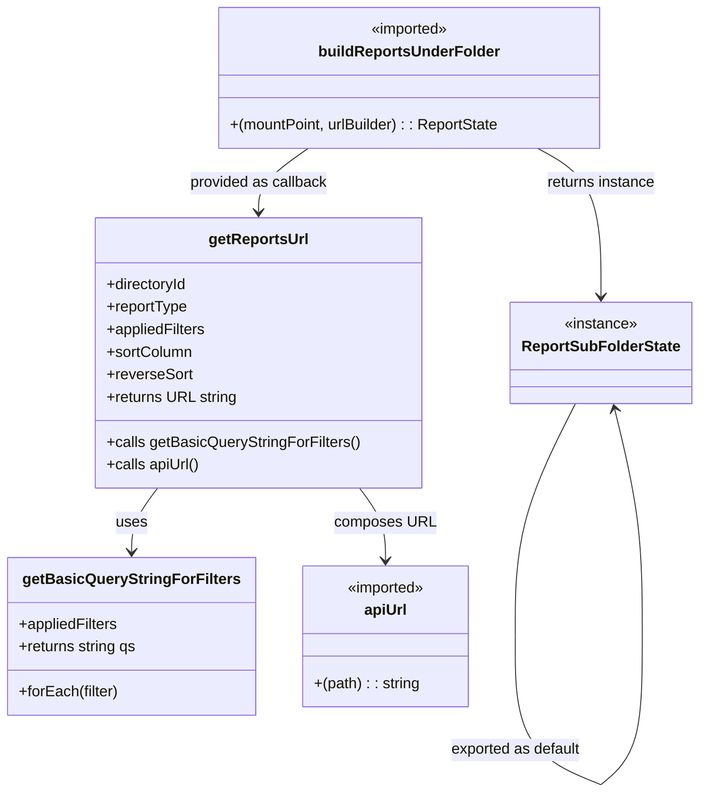

# Diagram: web/portal/src/pages/reports/redux/ReportsUnderFolderState.js


> Auto-generated by Obscura crawlers

## Diagram 1

```mermaid
flowchart LR
    subgraph Imports
        A_api[apiUrl (from "api-url")]
        A_build[buildReportsUnderFolder (from "pages/reports/...")]
    end
    subgraph Module["reportUnderFolder module"]
        CONST_STORE[STORE_MOUNT_POINT = "reportUnderFolder"]
        FUNC_getBasic[getBasicQueryStringForFilters(appliedFilters)]
        FUNC_getReports[getReportsUrl(directoryId, reportType, appliedFilters, sortColumn, reverseSort)]
        STATE_ReportSub[ReportSubFolderState]
        EXPORT[export default ReportSubFolderState]
    end
    A_api -->|used by| FUNC_getReports
    FUNC_getBasic -->|returns query string| FUNC_getReports
    A_build -->|invoked with STORE_MOUNT_POINT and getReportsUrl| STATE_ReportSub
    CONST_STORE --> A_build
    FUNC_getReports --> A_build
    STATE_ReportSub --> EXPORT
```

> SVG rendering failed for this diagram.

## Diagram 2



### SVG

<svg id="container" width="737.9508056640625" xmlns="http://www.w3.org/2000/svg" class="classDiagram" height="844.1499633789062" viewBox="0 0 737.9508056640625 844.1499633789062" role="graphics-document document" aria-roledescription="class"><style>#container{font-family:"trebuchet ms",verdana,arial,sans-serif;font-size:16px;fill:#333;}@keyframes edge-animation-frame{from{stroke-dashoffset:0;}}@keyframes dash{to{stroke-dashoffset:0;}}#container .edge-animation-slow{stroke-dasharray:9,5!important;stroke-dashoffset:900;animation:dash 50s linear infinite;stroke-linecap:round;}#container .edge-animation-fast{stroke-dasharray:9,5!important;stroke-dashoffset:900;animation:dash 20s linear infinite;stroke-linecap:round;}#container .error-icon{fill:#552222;}#container .error-text{fill:#552222;stroke:#552222;}#container .edge-thickness-normal{stroke-width:1px;}#container .edge-thickness-thick{stroke-width:3.5px;}#container .edge-pattern-solid{stroke-dasharray:0;}#container .edge-thickness-invisible{stroke-width:0;fill:none;}#container .edge-pattern-dashed{stroke-dasharray:3;}#container .edge-pattern-dotted{stroke-dasharray:2;}#container .marker{fill:#333333;stroke:#333333;}#container .marker.cross{stroke:#333333;}#container svg{font-family:"trebuchet ms",verdana,arial,sans-serif;font-size:16px;}#container p{margin:0;}#container g.classGroup text{fill:#9370DB;stroke:none;font-family:"trebuchet ms",verdana,arial,sans-serif;font-size:10px;}#container g.classGroup text .title{font-weight:bolder;}#container .nodeLabel,#container .edgeLabel{color:#131300;}#container .edgeLabel .label rect{fill:#ECECFF;}#container .label text{fill:#131300;}#container .labelBkg{background:#ECECFF;}#container .edgeLabel .label span{background:#ECECFF;}#container .classTitle{font-weight:bolder;}#container .node rect,#container .node circle,#container .node ellipse,#container .node polygon,#container .node path{fill:#ECECFF;stroke:#9370DB;stroke-width:1px;}#container .divider{stroke:#9370DB;stroke-width:1;}#container g.clickable{cursor:pointer;}#container g.classGroup rect{fill:#ECECFF;stroke:#9370DB;}#container g.classGroup line{stroke:#9370DB;stroke-width:1;}#container .classLabel .box{stroke:none;stroke-width:0;fill:#ECECFF;opacity:0.5;}#container .classLabel .label{fill:#9370DB;font-size:10px;}#container .relation{stroke:#333333;stroke-width:1;fill:none;}#container .dashed-line{stroke-dasharray:3;}#container .dotted-line{stroke-dasharray:1 2;}#container #compositionStart,#container .composition{fill:#333333!important;stroke:#333333!important;stroke-width:1;}#container #compositionEnd,#container .composition{fill:#333333!important;stroke:#333333!important;stroke-width:1;}#container #dependencyStart,#container .dependency{fill:#333333!important;stroke:#333333!important;stroke-width:1;}#container #dependencyStart,#container .dependency{fill:#333333!important;stroke:#333333!important;stroke-width:1;}#container #extensionStart,#container .extension{fill:transparent!important;stroke:#333333!important;stroke-width:1;}#container #extensionEnd,#container .extension{fill:transparent!important;stroke:#333333!important;stroke-width:1;}#container #aggregationStart,#container .aggregation{fill:transparent!important;stroke:#333333!important;stroke-width:1;}#container #aggregationEnd,#container .aggregation{fill:transparent!important;stroke:#333333!important;stroke-width:1;}#container #lollipopStart,#container .lollipop{fill:#ECECFF!important;stroke:#333333!important;stroke-width:1;}#container #lollipopEnd,#container .lollipop{fill:#ECECFF!important;stroke:#333333!important;stroke-width:1;}#container .edgeTerminals{font-size:11px;line-height:initial;}#container .classTitleText{text-anchor:middle;font-size:18px;fill:#333;}#container .label-icon{display:inline-block;height:1em;overflow:visible;vertical-align:-0.125em;}#container .node .label-icon path{fill:currentColor;stroke:revert;stroke-width:revert;}#container :root{--mermaid-font-family:"trebuchet ms",verdana,arial,sans-serif;}</style><g><defs><marker id="container_class-aggregationStart" class="marker aggregation class" refX="18" refY="7" markerWidth="190" markerHeight="240" orient="auto"><path d="M 18,7 L9,13 L1,7 L9,1 Z"></path></marker></defs><defs><marker id="container_class-aggregationEnd" class="marker aggregation class" refX="1" refY="7" markerWidth="20" markerHeight="28" orient="auto"><path d="M 18,7 L9,13 L1,7 L9,1 Z"></path></marker></defs><defs><marker id="container_class-extensionStart" class="marker extension class" refX="18" refY="7" markerWidth="190" markerHeight="240" orient="auto"><path d="M 1,7 L18,13 V 1 Z"></path></marker></defs><defs><marker id="container_class-extensionEnd" class="marker extension class" refX="1" refY="7" markerWidth="20" markerHeight="28" orient="auto"><path d="M 1,1 V 13 L18,7 Z"></path></marker></defs><defs><marker id="container_class-compositionStart" class="marker composition class" refX="18" refY="7" markerWidth="190" markerHeight="240" orient="auto"><path d="M 18,7 L9,13 L1,7 L9,1 Z"></path></marker></defs><defs><marker id="container_class-compositionEnd" class="marker composition class" refX="1" refY="7" markerWidth="20" markerHeight="28" orient="auto"><path d="M 18,7 L9,13 L1,7 L9,1 Z"></path></marker></defs><defs><marker id="container_class-dependencyStart" class="marker dependency class" refX="6" refY="7" markerWidth="190" markerHeight="240" orient="auto"><path d="M 5,7 L9,13 L1,7 L9,1 Z"></path></marker></defs><defs><marker id="container_class-dependencyEnd" class="marker dependency class" refX="13" refY="7" markerWidth="20" markerHeight="28" orient="auto"><path d="M 18,7 L9,13 L14,7 L9,1 Z"></path></marker></defs><defs><marker id="container_class-lollipopStart" class="marker lollipop class" refX="13" refY="7" markerWidth="190" markerHeight="240" orient="auto"><circle stroke="black" fill="transparent" cx="7" cy="7" r="6"></circle></marker></defs><defs><marker id="container_class-lollipopEnd" class="marker lollipop class" refX="1" refY="7" markerWidth="190" markerHeight="240" orient="auto"><circle stroke="black" fill="transparent" cx="7" cy="7" r="6"></circle></marker></defs><g class="root"><g class="clusters"></g><g class="edgePaths"><path d="M166.024,520L161.415,526.167C156.807,532.333,147.591,544.667,142.983,556C138.375,567.333,138.375,577.667,138.375,582.833L138.375,588" id="id_getReportsUrl_getBasicQueryStringForFilters_1" class="edge-thickness-normal edge-pattern-solid relation" style=";;;" data-edge="true" data-et="edge" data-id="id_getReportsUrl_getBasicQueryStringForFilters_1" data-points="W3sieCI6MTY2LjAyMzU4ODU3MDQ0MTk3LCJ5Ijo1MjB9LHsieCI6MTM4LjM3NSwieSI6NTU3fSx7IngiOjEzOC4zNzUsInkiOjU5NH1d" marker-end="url(#container_class-dependencyEnd)"></path><path d="M381.234,520L385.842,526.167C390.45,532.333,399.667,544.667,404.275,557.5C408.883,570.333,408.883,583.667,408.883,590.333L408.883,597" id="id_getReportsUrl_apiUrl_2" class="edge-thickness-normal edge-pattern-solid relation" style=";;;" data-edge="true" data-et="edge" data-id="id_getReportsUrl_apiUrl_2" data-points="W3sieCI6MzgxLjIzNDIyMzkyOTU1OCwieSI6NTIwfSx7IngiOjQwOC44ODI4MTI1LCJ5Ijo1NTd9LHsieCI6NDA4Ljg4MjgxMjUsInkiOjYwM31d" marker-end="url(#container_class-dependencyEnd)"></path><path d="M325.73,158L317.046,164.167C308.363,170.333,290.996,182.667,282.312,194C273.629,205.333,273.629,215.667,273.629,220.833L273.629,226" id="id_buildReportsUnderFolder_getReportsUrl_3" class="edge-thickness-normal edge-pattern-solid relation" style=";;;" data-edge="true" data-et="edge" data-id="id_buildReportsUnderFolder_getReportsUrl_3" data-points="W3sieCI6MzI1LjcyOTg0MDk1OTgyMTQ0LCJ5IjoxNTh9LHsieCI6MjczLjYyODkwNjI1LCJ5IjoxOTV9LHsieCI6MjczLjYyODkwNjI1LCJ5IjoyMzJ9XQ==" marker-end="url(#container_class-dependencyEnd)"></path><path d="M568.848,158L580.154,164.167C591.46,170.333,614.073,182.667,625.379,209C636.685,235.333,636.685,275.667,636.685,295.833L636.685,316" id="id_buildReportsUnderFolder_ReportSubFolderState_4" class="edge-thickness-normal edge-pattern-solid relation" style=";;;" data-edge="true" data-et="edge" data-id="id_buildReportsUnderFolder_ReportSubFolderState_4" data-points="W3sieCI6NTY4Ljg0Nzg2NTUxMzY0MjMsInkiOjE1OH0seyJ4Ijo2MzYuNjg1MTU2MjUwMzcyNSwieSI6MTk1fSx7IngiOjYzNi42ODUxNTYyNTAzNzI1LCJ5IjozMjJ9XQ==" marker-end="url(#container_class-dependencyEnd)"></path><path d="M610.545,430L600.298,451.167C590.052,472.333,569.559,514.667,559.312,555.992C549.066,597.317,549.066,637.633,549.066,657.792L549.066,677.95" id="ReportSubFolderState-cyclic-special-1" class="edge-thickness-normal edge-pattern-solid relation" style=";;;" data-edge="true" data-et="edge" data-id="ReportSubFolderState-cyclic-special-1" data-points="W3sieCI6NjEwLjU0NDUyMjYxNzg4NywieSI6NDMwfSx7IngiOjU0OS4wNjU2MjUwMDA3NDUxLCJ5Ijo1NTd9LHsieCI6NTQ5LjA2NTYyNTAwMDc0NTEsInkiOjY3Ny45NDk5OTk5OTkyNTQ5fV0="></path><path d="M549.066,678.05L549.066,698.208C549.066,718.367,549.066,758.683,563.661,785.013C578.255,811.343,607.445,823.686,622.04,829.857L636.635,836.029" id="ReportSubFolderState-cyclic-special-mid" class="edge-thickness-normal edge-pattern-solid relation" style=";;;" data-edge="true" data-et="edge" data-id="ReportSubFolderState-cyclic-special-mid" data-points="W3sieCI6NTQ5LjA2NTYyNTAwMDc0NTEsInkiOjY3OC4wNTAwMDAwMDA3NDUxfSx7IngiOjU0OS4wNjU2MjUwMDA3NDUxLCJ5Ijo3OTl9LHsieCI6NjM2LjYzNTE1NjI0OTYyNzUsInkiOjgzNi4wMjg4NTc0NTQwODY1fV0="></path><path d="M636.735,836.009L644.288,829.841C651.841,823.673,666.947,811.336,674.499,785.002C682.052,758.667,682.052,718.333,682.052,678C682.052,637.667,682.052,597.333,676.99,556.97C671.928,516.607,661.803,476.213,656.741,456.017L651.679,435.82" id="ReportSubFolderState-cyclic-special-2" class="edge-thickness-normal edge-pattern-solid relation" style=";;;" data-edge="true" data-et="edge" data-id="ReportSubFolderState-cyclic-special-2" data-points="W3sieCI6NjM2LjczNTE1NjI1MTExNzYsInkiOjgzNi4wMDkxNjY1MjMyOTc1fSx7IngiOjY4Mi4wNTIzNDM3NTAzNzI1LCJ5Ijo3OTl9LHsieCI6NjgyLjA1MjM0Mzc1MDM3MjUsInkiOjY3OH0seyJ4Ijo2ODIuMDUyMzQzNzUwMzcyNSwieSI6NTU3fSx7IngiOjY1MC4yMjAxMTgyNjY5NDcxLCJ5Ijo0MzB9XQ==" marker-end="url(#container_class-dependencyEnd)"></path></g><g class="edgeLabels"><g class="edgeLabel" transform="translate(138.375, 557)"><g class="label" data-id="id_getReportsUrl_getBasicQueryStringForFilters_1" transform="translate(-16.4921875, -12)"><foreignObject width="32.984375" height="24"><div xmlns="http://www.w3.org/1999/xhtml" class="labelBkg" style="display: table-cell; white-space: nowrap; line-height: 1.5; max-width: 200px; text-align: center;"><span class="edgeLabel"><p>uses</p></span></div></foreignObject></g></g><g class="edgeLabel" transform="translate(408.8828125, 557)"><g class="label" data-id="id_getReportsUrl_apiUrl_2" transform="translate(-52.6953125, -12)"><foreignObject width="105.390625" height="24"><div xmlns="http://www.w3.org/1999/xhtml" class="labelBkg" style="display: table-cell; white-space: nowrap; line-height: 1.5; max-width: 200px; text-align: center;"><span class="edgeLabel"><p>composes URL</p></span></div></foreignObject></g></g><g class="edgeLabel" transform="translate(273.62890625, 195)"><g class="label" data-id="id_buildReportsUnderFolder_getReportsUrl_3" transform="translate(-74.2578125, -12)"><foreignObject width="148.515625" height="24"><div xmlns="http://www.w3.org/1999/xhtml" class="labelBkg" style="display: table-cell; white-space: nowrap; line-height: 1.5; max-width: 200px; text-align: center;"><span class="edgeLabel"><p>provided as callback</p></span></div></foreignObject></g></g><g class="edgeLabel" transform="translate(636.6851562503725, 195)"><g class="label" data-id="id_buildReportsUnderFolder_ReportSubFolderState_4" transform="translate(-58.9609375, -12)"><foreignObject width="117.921875" height="24"><div xmlns="http://www.w3.org/1999/xhtml" class="labelBkg" style="display: table-cell; white-space: nowrap; line-height: 1.5; max-width: 200px; text-align: center;"><span class="edgeLabel"><p>returns instance</p></span></div></foreignObject></g></g><g class="edgeLabel"><g class="label" data-id="ReportSubFolderState-cyclic-special-1" transform="translate(0, 0)"><foreignObject width="0" height="0"><div xmlns="http://www.w3.org/1999/xhtml" class="labelBkg" style="display: table-cell; white-space: nowrap; line-height: 1.5; max-width: 200px; text-align: center;"><span class="edgeLabel"></span></div></foreignObject></g></g><g class="edgeLabel" transform="translate(549.0656250007451, 799)"><g class="label" data-id="ReportSubFolderState-cyclic-special-mid" transform="translate(-70.734375, -12)"><foreignObject width="141.46875" height="24"><div xmlns="http://www.w3.org/1999/xhtml" class="labelBkg" style="display: table-cell; white-space: nowrap; line-height: 1.5; max-width: 200px; text-align: center;"><span class="edgeLabel"><p>exported as default</p></span></div></foreignObject></g></g><g class="edgeLabel"><g class="label" data-id="ReportSubFolderState-cyclic-special-2" transform="translate(0, 0)"><foreignObject width="0" height="0"><div xmlns="http://www.w3.org/1999/xhtml" class="labelBkg" style="display: table-cell; white-space: nowrap; line-height: 1.5; max-width: 200px; text-align: center;"><span class="edgeLabel"></span></div></foreignObject></g></g></g><g class="nodes"><g class="node default" id="classId-getBasicQueryStringForFilters-0" transform="translate(138.375, 678)"><g class="basic label-container"><path d="M-130.375 -84 L130.375 -84 L130.375 84 L-130.375 84" stroke="none" stroke-width="0" fill="#ECECFF" style=""></path><path d="M-130.375 -84 C-30.10063431203089 -84, 70.17373137593822 -84, 130.375 -84 M-130.375 -84 C-71.30373595310017 -84, -12.232471906200345 -84, 130.375 -84 M130.375 -84 C130.375 -26.435548634278554, 130.375 31.128902731442892, 130.375 84 M130.375 -84 C130.375 -23.946036873032355, 130.375 36.10792625393529, 130.375 84 M130.375 84 C65.13126569802664 84, -0.11246860394672353 84, -130.375 84 M130.375 84 C37.529358871074166 84, -55.31628225785167 84, -130.375 84 M-130.375 84 C-130.375 21.15880474091469, -130.375 -41.68239051817062, -130.375 -84 M-130.375 84 C-130.375 49.706303038456504, -130.375 15.412606076913008, -130.375 -84" stroke="#9370DB" stroke-width="1.3" fill="none" stroke-dasharray="0 0" style=""></path></g><g class="annotation-group text" transform="translate(0, -60)"></g><g class="label-group text" transform="translate(-109.078125, -60)"><g class="label" style="font-weight: bolder" transform="translate(0,-12)"><foreignObject width="218.15625" height="24"><div xmlns="http://www.w3.org/1999/xhtml" style="display: table-cell; white-space: nowrap; line-height: 1.5; max-width: 263px; text-align: center;"><span class="nodeLabel markdown-node-label" style=""><p>getBasicQueryStringForFilters</p></span></div></foreignObject></g></g><g class="members-group text" transform="translate(-118.375, -12)"><g class="label" style="" transform="translate(0,-12)"><foreignObject width="107.109375" height="24"><div xmlns="http://www.w3.org/1999/xhtml" style="display: table-cell; white-space: nowrap; line-height: 1.5; max-width: 164px; text-align: center;"><span class="nodeLabel markdown-node-label" style=""><p>+appliedFilters</p></span></div></foreignObject></g><g class="label" style="" transform="translate(0,12)"><foreignObject width="127.671875" height="24"><div xmlns="http://www.w3.org/1999/xhtml" style="display: table-cell; white-space: nowrap; line-height: 1.5; max-width: 185px; text-align: center;"><span class="nodeLabel markdown-node-label" style=""><p>+returns string qs</p></span></div></foreignObject></g></g><g class="methods-group text" transform="translate(-118.375, 60)"><g class="label" style="" transform="translate(0,-12)"><foreignObject width="107.25" height="24"><div xmlns="http://www.w3.org/1999/xhtml" style="display: table-cell; white-space: nowrap; line-height: 1.5; max-width: 165px; text-align: center;"><span class="nodeLabel markdown-node-label" style=""><p>+forEach(filter)</p></span></div></foreignObject></g></g><g class="divider" style=""><path d="M-130.375 -36 C-34.47857589418241 -36, 61.417848211635174 -36, 130.375 -36 M-130.375 -36 C-76.0718778702103 -36, -21.768755740420616 -36, 130.375 -36" stroke="#9370DB" stroke-width="1.3" fill="none" stroke-dasharray="0 0" style=""></path></g><g class="divider" style=""><path d="M-130.375 36 C-39.07563098899615 36, 52.223738022007694 36, 130.375 36 M-130.375 36 C-40.19832089235139 36, 49.97835821529722 36, 130.375 36" stroke="#9370DB" stroke-width="1.3" fill="none" stroke-dasharray="0 0" style=""></path></g></g><g class="node default" id="classId-getReportsUrl-1" transform="translate(273.62890625, 376)"><g class="basic label-container"><path d="M-172.15625 -144 L172.15625 -144 L172.15625 144 L-172.15625 144" stroke="none" stroke-width="0" fill="#ECECFF" style=""></path><path d="M-172.15625 -144 C-56.83737331735681 -144, 58.481503365286386 -144, 172.15625 -144 M-172.15625 -144 C-37.73467627407129 -144, 96.68689745185742 -144, 172.15625 -144 M172.15625 -144 C172.15625 -51.11066229911009, 172.15625 41.77867540177982, 172.15625 144 M172.15625 -144 C172.15625 -59.487363880651216, 172.15625 25.025272238697568, 172.15625 144 M172.15625 144 C94.62356646266493 144, 17.09088292532985 144, -172.15625 144 M172.15625 144 C36.33854411067492 144, -99.47916177865017 144, -172.15625 144 M-172.15625 144 C-172.15625 46.66148191565489, -172.15625 -50.67703616869022, -172.15625 -144 M-172.15625 144 C-172.15625 39.61839639794094, -172.15625 -64.76320720411812, -172.15625 -144" stroke="#9370DB" stroke-width="1.3" fill="none" stroke-dasharray="0 0" style=""></path></g><g class="annotation-group text" transform="translate(0, -120)"></g><g class="label-group text" transform="translate(-51.375, -120)"><g class="label" style="font-weight: bolder" transform="translate(0,-12)"><foreignObject width="102.75" height="24"><div xmlns="http://www.w3.org/1999/xhtml" style="display: table-cell; white-space: nowrap; line-height: 1.5; max-width: 151px; text-align: center;"><span class="nodeLabel markdown-node-label" style=""><p>getReportsUrl</p></span></div></foreignObject></g></g><g class="members-group text" transform="translate(-160.15625, -72)"><g class="label" style="" transform="translate(0,-12)"><foreignObject width="87.359375" height="24"><div xmlns="http://www.w3.org/1999/xhtml" style="display: table-cell; white-space: nowrap; line-height: 1.5; max-width: 145px; text-align: center;"><span class="nodeLabel markdown-node-label" style=""><p>+directoryId</p></span></div></foreignObject></g><g class="label" style="" transform="translate(0,12)"><foreignObject width="86.9375" height="24"><div xmlns="http://www.w3.org/1999/xhtml" style="display: table-cell; white-space: nowrap; line-height: 1.5; max-width: 144px; text-align: center;"><span class="nodeLabel markdown-node-label" style=""><p>+reportType</p></span></div></foreignObject></g><g class="label" style="" transform="translate(0,36)"><foreignObject width="107.109375" height="24"><div xmlns="http://www.w3.org/1999/xhtml" style="display: table-cell; white-space: nowrap; line-height: 1.5; max-width: 164px; text-align: center;"><span class="nodeLabel markdown-node-label" style=""><p>+appliedFilters</p></span></div></foreignObject></g><g class="label" style="" transform="translate(0,60)"><foreignObject width="91.828125" height="24"><div xmlns="http://www.w3.org/1999/xhtml" style="display: table-cell; white-space: nowrap; line-height: 1.5; max-width: 149px; text-align: center;"><span class="nodeLabel markdown-node-label" style=""><p>+sortColumn</p></span></div></foreignObject></g><g class="label" style="" transform="translate(0,84)"><foreignObject width="91.015625" height="24"><div xmlns="http://www.w3.org/1999/xhtml" style="display: table-cell; white-space: nowrap; line-height: 1.5; max-width: 149px; text-align: center;"><span class="nodeLabel markdown-node-label" style=""><p>+reverseSort</p></span></div></foreignObject></g><g class="label" style="" transform="translate(0,108)"><foreignObject width="138.875" height="24"><div xmlns="http://www.w3.org/1999/xhtml" style="display: table-cell; white-space: nowrap; line-height: 1.5; max-width: 197px; text-align: center;"><span class="nodeLabel markdown-node-label" style=""><p>+returns URL string</p></span></div></foreignObject></g></g><g class="methods-group text" transform="translate(-160.15625, 96)"><g class="label" style="" transform="translate(0,-12)"><foreignObject width="268.9375" height="24"><div xmlns="http://www.w3.org/1999/xhtml" style="display: table-cell; white-space: nowrap; line-height: 1.5; max-width: 326px; text-align: center;"><span class="nodeLabel markdown-node-label" style=""><p>+calls getBasicQueryStringForFilters()</p></span></div></foreignObject></g><g class="label" style="" transform="translate(0,12)"><foreignObject width="99.65625" height="24"><div xmlns="http://www.w3.org/1999/xhtml" style="display: table-cell; white-space: nowrap; line-height: 1.5; max-width: 157px; text-align: center;"><span class="nodeLabel markdown-node-label" style=""><p>+calls apiUrl()</p></span></div></foreignObject></g></g><g class="divider" style=""><path d="M-172.15625 -96 C-79.39452409930111 -96, 13.367201801397783 -96, 172.15625 -96 M-172.15625 -96 C-76.04469242503342 -96, 20.066865149933165 -96, 172.15625 -96" stroke="#9370DB" stroke-width="1.3" fill="none" stroke-dasharray="0 0" style=""></path></g><g class="divider" style=""><path d="M-172.15625 72 C-94.06355648029142 72, -15.97086296058285 72, 172.15625 72 M-172.15625 72 C-69.7764332600919 72, 32.60338347981619 72, 172.15625 72" stroke="#9370DB" stroke-width="1.3" fill="none" stroke-dasharray="0 0" style=""></path></g></g><g class="node default" id="classId-buildReportsUnderFolder-2" transform="translate(431.33984375, 83)"><g class="basic label-container"><path d="M-204.12109375 -75 L204.12109375 -75 L204.12109375 75 L-204.12109375 75" stroke="none" stroke-width="0" fill="#ECECFF" style=""></path><path d="M-204.12109375 -75 C-91.84245122187431 -75, 20.436191306251374 -75, 204.12109375 -75 M-204.12109375 -75 C-43.614852178918426 -75, 116.89138939216315 -75, 204.12109375 -75 M204.12109375 -75 C204.12109375 -15.619488859773597, 204.12109375 43.761022280452806, 204.12109375 75 M204.12109375 -75 C204.12109375 -18.71593208731639, 204.12109375 37.56813582536722, 204.12109375 75 M204.12109375 75 C67.5858145113962 75, -68.94946472720761 75, -204.12109375 75 M204.12109375 75 C103.3897492405488 75, 2.6584047310975905 75, -204.12109375 75 M-204.12109375 75 C-204.12109375 38.59764391030361, -204.12109375 2.19528782060722, -204.12109375 -75 M-204.12109375 75 C-204.12109375 23.100410658788746, -204.12109375 -28.799178682422507, -204.12109375 -75" stroke="#9370DB" stroke-width="1.3" fill="none" stroke-dasharray="0 0" style=""></path></g><g class="annotation-group text" transform="translate(-42.671875, -51)"><g class="label" style="" transform="translate(0,-12)"><foreignObject width="85.34375" height="24"><div xmlns="http://www.w3.org/1999/xhtml" style="display: table-cell; white-space: nowrap; line-height: 1.5; max-width: 135px; text-align: center;"><span class="nodeLabel markdown-node-label" style=""><p>«imported»</p></span></div></foreignObject></g></g><g class="label-group text" transform="translate(-92.8828125, -27)"><g class="label" style="font-weight: bolder" transform="translate(0,-12)"><foreignObject width="185.765625" height="24"><div xmlns="http://www.w3.org/1999/xhtml" style="display: table-cell; white-space: nowrap; line-height: 1.5; max-width: 235px; text-align: center;"><span class="nodeLabel markdown-node-label" style=""><p>buildReportsUnderFolder</p></span></div></foreignObject></g></g><g class="members-group text" transform="translate(-192.12109375, 21)"></g><g class="methods-group text" transform="translate(-192.12109375, 51)"><g class="label" style="" transform="translate(0,-12)"><foreignObject width="291.359375" height="24"><div xmlns="http://www.w3.org/1999/xhtml" style="display: table-cell; white-space: nowrap; line-height: 1.5; max-width: 341px; text-align: center;"><span class="nodeLabel markdown-node-label" style=""><p>+(mountPoint, urlBuilder) : : ReportState</p></span></div></foreignObject></g></g><g class="divider" style=""><path d="M-204.12109375 -3 C-64.99582241561077 -3, 74.12944891877845 -3, 204.12109375 -3 M-204.12109375 -3 C-110.59153771167631 -3, -17.06198167335262 -3, 204.12109375 -3" stroke="#9370DB" stroke-width="1.3" fill="none" stroke-dasharray="0 0" style=""></path></g><g class="divider" style=""><path d="M-204.12109375 21 C-53.01473542987148 21, 98.09162289025704 21, 204.12109375 21 M-204.12109375 21 C-91.31444544674088 21, 21.492202856518247 21, 204.12109375 21" stroke="#9370DB" stroke-width="1.3" fill="none" stroke-dasharray="0 0" style=""></path></g></g><g class="node default" id="classId-apiUrl-3" transform="translate(408.8828125, 678)"><g class="basic label-container"><path d="M-90.1328125 -75 L90.1328125 -75 L90.1328125 75 L-90.1328125 75" stroke="none" stroke-width="0" fill="#ECECFF" style=""></path><path d="M-90.1328125 -75 C-22.065987676156766 -75, 46.00083714768647 -75, 90.1328125 -75 M-90.1328125 -75 C-38.70712387522305 -75, 12.718564749553906 -75, 90.1328125 -75 M90.1328125 -75 C90.1328125 -26.426164680450448, 90.1328125 22.147670639099104, 90.1328125 75 M90.1328125 -75 C90.1328125 -18.88058422734771, 90.1328125 37.23883154530458, 90.1328125 75 M90.1328125 75 C19.47038489314386 75, -51.19204271371228 75, -90.1328125 75 M90.1328125 75 C21.764060397276566 75, -46.60469170544687 75, -90.1328125 75 M-90.1328125 75 C-90.1328125 36.860370697593275, -90.1328125 -1.2792586048134496, -90.1328125 -75 M-90.1328125 75 C-90.1328125 19.131108565425983, -90.1328125 -36.737782869148035, -90.1328125 -75" stroke="#9370DB" stroke-width="1.3" fill="none" stroke-dasharray="0 0" style=""></path></g><g class="annotation-group text" transform="translate(-42.671875, -51)"><g class="label" style="" transform="translate(0,-12)"><foreignObject width="85.34375" height="24"><div xmlns="http://www.w3.org/1999/xhtml" style="display: table-cell; white-space: nowrap; line-height: 1.5; max-width: 135px; text-align: center;"><span class="nodeLabel markdown-node-label" style=""><p>«imported»</p></span></div></foreignObject></g></g><g class="label-group text" transform="translate(-22.2109375, -27)"><g class="label" style="font-weight: bolder" transform="translate(0,-12)"><foreignObject width="44.421875" height="24"><div xmlns="http://www.w3.org/1999/xhtml" style="display: table-cell; white-space: nowrap; line-height: 1.5; max-width: 94px; text-align: center;"><span class="nodeLabel markdown-node-label" style=""><p>apiUrl</p></span></div></foreignObject></g></g><g class="members-group text" transform="translate(-78.1328125, 21)"></g><g class="methods-group text" transform="translate(-78.1328125, 51)"><g class="label" style="" transform="translate(0,-12)"><foreignObject width="113.59375" height="24"><div xmlns="http://www.w3.org/1999/xhtml" style="display: table-cell; white-space: nowrap; line-height: 1.5; max-width: 164px; text-align: center;"><span class="nodeLabel markdown-node-label" style=""><p>+(path) : : string</p></span></div></foreignObject></g></g><g class="divider" style=""><path d="M-90.1328125 -3 C-38.920937192615035 -3, 12.29093811476993 -3, 90.1328125 -3 M-90.1328125 -3 C-48.76562362108977 -3, -7.398434742179546 -3, 90.1328125 -3" stroke="#9370DB" stroke-width="1.3" fill="none" stroke-dasharray="0 0" style=""></path></g><g class="divider" style=""><path d="M-90.1328125 21 C-25.006443670532406 21, 40.11992515893519 21, 90.1328125 21 M-90.1328125 21 C-49.64074143698491 21, -9.148670373969821 21, 90.1328125 21" stroke="#9370DB" stroke-width="1.3" fill="none" stroke-dasharray="0 0" style=""></path></g></g><g class="node default" id="classId-ReportSubFolderState-4" transform="translate(636.6851562503725, 376)"><g class="basic label-container"><path d="M-93.265625 -54 L93.265625 -54 L93.265625 54 L-93.265625 54" stroke="none" stroke-width="0" fill="#ECECFF" style=""></path><path d="M-93.265625 -54 C-41.284701804442086 -54, 10.696221391115827 -54, 93.265625 -54 M-93.265625 -54 C-37.880549668988984 -54, 17.504525662022033 -54, 93.265625 -54 M93.265625 -54 C93.265625 -17.52840407077766, 93.265625 18.943191858444678, 93.265625 54 M93.265625 -54 C93.265625 -24.12819242042556, 93.265625 5.743615159148881, 93.265625 54 M93.265625 54 C26.417363511040506 54, -40.43089797791899 54, -93.265625 54 M93.265625 54 C47.35846492980647 54, 1.4513048596129465 54, -93.265625 54 M-93.265625 54 C-93.265625 21.302755106140303, -93.265625 -11.394489787719394, -93.265625 -54 M-93.265625 54 C-93.265625 12.037862055120996, -93.265625 -29.924275889758007, -93.265625 -54" stroke="#9370DB" stroke-width="1.3" fill="none" stroke-dasharray="0 0" style=""></path></g><g class="annotation-group text" transform="translate(-39.546875, -30)"><g class="label" style="" transform="translate(0,-12)"><foreignObject width="79.09375" height="24"><div xmlns="http://www.w3.org/1999/xhtml" style="display: table-cell; white-space: nowrap; line-height: 1.5; max-width: 129px; text-align: center;"><span class="nodeLabel markdown-node-label" style=""><p>«instance»</p></span></div></foreignObject></g></g><g class="label-group text" transform="translate(-81.265625, -6)"><g class="label" style="font-weight: bolder" transform="translate(0,-12)"><foreignObject width="162.53125" height="24"><div xmlns="http://www.w3.org/1999/xhtml" style="display: table-cell; white-space: nowrap; line-height: 1.5; max-width: 210px; text-align: center;"><span class="nodeLabel markdown-node-label" style=""><p>ReportSubFolderState</p></span></div></foreignObject></g></g><g class="members-group text" transform="translate(-81.265625, 42)"></g><g class="methods-group text" transform="translate(-81.265625, 72)"></g><g class="divider" style=""><path d="M-93.265625 18 C-29.990844172014675 18, 33.28393665597065 18, 93.265625 18 M-93.265625 18 C-41.07335179928518 18, 11.118921401429645 18, 93.265625 18" stroke="#9370DB" stroke-width="1.3" fill="none" stroke-dasharray="0 0" style=""></path></g><g class="divider" style=""><path d="M-93.265625 36 C-23.59394049642343 36, 46.07774400715314 36, 93.265625 36 M-93.265625 36 C-25.26775099482981 36, 42.73012301034038 36, 93.265625 36" stroke="#9370DB" stroke-width="1.3" fill="none" stroke-dasharray="0 0" style=""></path></g></g><g class="label edgeLabel" id="ReportSubFolderState---ReportSubFolderState---1" transform="translate(549.0656250007451, 678)"><rect width="0.1" height="0.1"></rect><g class="label" style="" transform="translate(0, 0)"><rect></rect><foreignObject width="0" height="0"><div xmlns="http://www.w3.org/1999/xhtml" style="display: table-cell; white-space: nowrap; line-height: 1.5; max-width: 10px; text-align: center;"><span class="nodeLabel"></span></div></foreignObject></g></g><g class="label edgeLabel" id="ReportSubFolderState---ReportSubFolderState---2" transform="translate(636.6851562503725, 836.0500000007451)"><rect width="0.1" height="0.1"></rect><g class="label" style="" transform="translate(0, 0)"><rect></rect><foreignObject width="0" height="0"><div xmlns="http://www.w3.org/1999/xhtml" style="display: table-cell; white-space: nowrap; line-height: 1.5; max-width: 10px; text-align: center;"><span class="nodeLabel"></span></div></foreignObject></g></g></g></g></g></svg>
