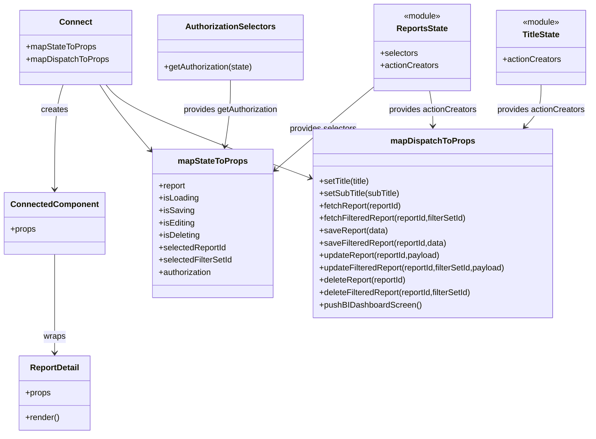

# Diagram: web/portal/src/pages/reports/report-detail/ReportDetail.page.container.js


> Auto-generated by Obscura crawlers

## Diagram 1

```mermaid
flowchart TD
  subgraph ReactRedux
    CONNECT[connect(mapStateToProps, mapDispatchToProps)]
    ReportDetail[ReportDetail Component]
    Connected[Connected Component]
  end

  subgraph ReduxStore
    Store[Redux Store]
    ReportsState[ReportsState]
    TitleState[TitleState]
    AuthSelectors[getAuthorization]
  end

  CONNECT --> Connected
  Connected --> ReportDetail
  CONNECT --> ReportsState
  CONNECT --> TitleState
  CONNECT --> AuthSelectors
  Store --> ReportsState
  Store --> TitleState
  Store --> AuthSelectors

  subgraph mapStateToProps
    getReport[getReport(state)]
    getIsLoading[getIsLoading(state)]
    getIsSaving[getIsSaving(state)]
    getIsEditing[getIsEditing(state)]
    getIsDeleting[getIsDeleting(state)]
    getSelectedReportId[getSelectedReportId(state)]
    getSelectedFilterSetId[getSelectedFilterSetId(state)]
    authorization[getAuthorization(state)]
  end

  ReportsState --> getReport
  ReportsState --> getIsLoading
  ReportsState --> getIsSaving
  ReportsState --> getIsEditing
  ReportsState --> getIsDeleting
  ReportsState --> getSelectedReportId
  ReportsState --> getSelectedFilterSetId
  AuthSelectors --> authorization

  mapStateToProps --> CONNECT
  getReport --> mapStateToProps
  authorization --> mapStateToProps

  subgraph mapDispatchToProps
    setTitle[setTitle(title) -> dispatch(TitleState.actionCreators.setTitle)]
    setSubTitle[setSubTitle(subTitle) -> dispatch(TitleState.actionCreators.setSubTitle)]
    fetchReport[fetchReport(reportId) -> dispatch(ReportsState.actionCreators.fetchReport)]
    fetchFilteredReport[fetchFilteredReport(reportId, filterSetId) -> dispatch(fetchFilteredReport)]
    saveReport[saveReport(data) -> dispatch(saveReport)]
    saveFilteredReport[saveFilteredReport(reportId, data) -> dispatch(saveFilteredReport)]
    updateReport[updateReport(reportId, payload) -> dispatch(updateReport)]
    updateFilteredReport[updateFilteredReport(reportId, filterSetId, payload) -> dispatch(updateFilteredReport)]
    deleteReport[deleteReport(reportId) -> dispatch(deleteReport)]
    deleteFilteredReport[deleteFilteredReport(reportId, filterSetId) -> dispatch(deleteFilteredReport)]
    pushBIDashboard[pushBIDashboardScreen -> dispatch({type: "REPORTS"})]
  end

  TitleState --> setTitle
  TitleState --> setSubTitle
  ReportsState --> fetchReport
  ReportsState --> fetchFilteredReport
  ReportsState --> saveReport
  ReportsState --> saveFilteredReport
  ReportsState --> updateReport
  ReportsState --> updateFilteredReport
  ReportsState --> deleteReport
  ReportsState --> deleteFilteredReport

  mapDispatchToProps --> CONNECT
  setTitle --> mapDispatchToProps
  pushBIDashboard --> mapDispatchToProps
```

> SVG rendering failed for this diagram.

## Diagram 2



### SVG

<svg id="container" width="1142.86328125" xmlns="http://www.w3.org/2000/svg" class="classDiagram" height="842" viewBox="0 0 1142.86328125 842" role="graphics-document document" aria-roledescription="class"><style>#container{font-family:"trebuchet ms",verdana,arial,sans-serif;font-size:16px;fill:#333;}@keyframes edge-animation-frame{from{stroke-dashoffset:0;}}@keyframes dash{to{stroke-dashoffset:0;}}#container .edge-animation-slow{stroke-dasharray:9,5!important;stroke-dashoffset:900;animation:dash 50s linear infinite;stroke-linecap:round;}#container .edge-animation-fast{stroke-dasharray:9,5!important;stroke-dashoffset:900;animation:dash 20s linear infinite;stroke-linecap:round;}#container .error-icon{fill:#552222;}#container .error-text{fill:#552222;stroke:#552222;}#container .edge-thickness-normal{stroke-width:1px;}#container .edge-thickness-thick{stroke-width:3.5px;}#container .edge-pattern-solid{stroke-dasharray:0;}#container .edge-thickness-invisible{stroke-width:0;fill:none;}#container .edge-pattern-dashed{stroke-dasharray:3;}#container .edge-pattern-dotted{stroke-dasharray:2;}#container .marker{fill:#333333;stroke:#333333;}#container .marker.cross{stroke:#333333;}#container svg{font-family:"trebuchet ms",verdana,arial,sans-serif;font-size:16px;}#container p{margin:0;}#container g.classGroup text{fill:#9370DB;stroke:none;font-family:"trebuchet ms",verdana,arial,sans-serif;font-size:10px;}#container g.classGroup text .title{font-weight:bolder;}#container .nodeLabel,#container .edgeLabel{color:#131300;}#container .edgeLabel .label rect{fill:#ECECFF;}#container .label text{fill:#131300;}#container .labelBkg{background:#ECECFF;}#container .edgeLabel .label span{background:#ECECFF;}#container .classTitle{font-weight:bolder;}#container .node rect,#container .node circle,#container .node ellipse,#container .node polygon,#container .node path{fill:#ECECFF;stroke:#9370DB;stroke-width:1px;}#container .divider{stroke:#9370DB;stroke-width:1;}#container g.clickable{cursor:pointer;}#container g.classGroup rect{fill:#ECECFF;stroke:#9370DB;}#container g.classGroup line{stroke:#9370DB;stroke-width:1;}#container .classLabel .box{stroke:none;stroke-width:0;fill:#ECECFF;opacity:0.5;}#container .classLabel .label{fill:#9370DB;font-size:10px;}#container .relation{stroke:#333333;stroke-width:1;fill:none;}#container .dashed-line{stroke-dasharray:3;}#container .dotted-line{stroke-dasharray:1 2;}#container #compositionStart,#container .composition{fill:#333333!important;stroke:#333333!important;stroke-width:1;}#container #compositionEnd,#container .composition{fill:#333333!important;stroke:#333333!important;stroke-width:1;}#container #dependencyStart,#container .dependency{fill:#333333!important;stroke:#333333!important;stroke-width:1;}#container #dependencyStart,#container .dependency{fill:#333333!important;stroke:#333333!important;stroke-width:1;}#container #extensionStart,#container .extension{fill:transparent!important;stroke:#333333!important;stroke-width:1;}#container #extensionEnd,#container .extension{fill:transparent!important;stroke:#333333!important;stroke-width:1;}#container #aggregationStart,#container .aggregation{fill:transparent!important;stroke:#333333!important;stroke-width:1;}#container #aggregationEnd,#container .aggregation{fill:transparent!important;stroke:#333333!important;stroke-width:1;}#container #lollipopStart,#container .lollipop{fill:#ECECFF!important;stroke:#333333!important;stroke-width:1;}#container #lollipopEnd,#container .lollipop{fill:#ECECFF!important;stroke:#333333!important;stroke-width:1;}#container .edgeTerminals{font-size:11px;line-height:initial;}#container .classTitleText{text-anchor:middle;font-size:18px;fill:#333;}#container .label-icon{display:inline-block;height:1em;overflow:visible;vertical-align:-0.125em;}#container .node .label-icon path{fill:currentColor;stroke:revert;stroke-width:revert;}#container :root{--mermaid-font-family:"trebuchet ms",verdana,arial,sans-serif;}</style><g><defs><marker id="container_class-aggregationStart" class="marker aggregation class" refX="18" refY="7" markerWidth="190" markerHeight="240" orient="auto"><path d="M 18,7 L9,13 L1,7 L9,1 Z"></path></marker></defs><defs><marker id="container_class-aggregationEnd" class="marker aggregation class" refX="1" refY="7" markerWidth="20" markerHeight="28" orient="auto"><path d="M 18,7 L9,13 L1,7 L9,1 Z"></path></marker></defs><defs><marker id="container_class-extensionStart" class="marker extension class" refX="18" refY="7" markerWidth="190" markerHeight="240" orient="auto"><path d="M 1,7 L18,13 V 1 Z"></path></marker></defs><defs><marker id="container_class-extensionEnd" class="marker extension class" refX="1" refY="7" markerWidth="20" markerHeight="28" orient="auto"><path d="M 1,1 V 13 L18,7 Z"></path></marker></defs><defs><marker id="container_class-compositionStart" class="marker composition class" refX="18" refY="7" markerWidth="190" markerHeight="240" orient="auto"><path d="M 18,7 L9,13 L1,7 L9,1 Z"></path></marker></defs><defs><marker id="container_class-compositionEnd" class="marker composition class" refX="1" refY="7" markerWidth="20" markerHeight="28" orient="auto"><path d="M 18,7 L9,13 L1,7 L9,1 Z"></path></marker></defs><defs><marker id="container_class-dependencyStart" class="marker dependency class" refX="6" refY="7" markerWidth="190" markerHeight="240" orient="auto"><path d="M 5,7 L9,13 L1,7 L9,1 Z"></path></marker></defs><defs><marker id="container_class-dependencyEnd" class="marker dependency class" refX="13" refY="7" markerWidth="20" markerHeight="28" orient="auto"><path d="M 18,7 L9,13 L14,7 L9,1 Z"></path></marker></defs><defs><marker id="container_class-lollipopStart" class="marker lollipop class" refX="13" refY="7" markerWidth="190" markerHeight="240" orient="auto"><circle stroke="black" fill="transparent" cx="7" cy="7" r="6"></circle></marker></defs><defs><marker id="container_class-lollipopEnd" class="marker lollipop class" refX="1" refY="7" markerWidth="190" markerHeight="240" orient="auto"><circle stroke="black" fill="transparent" cx="7" cy="7" r="6"></circle></marker></defs><g class="root"><g class="clusters"></g><g class="edgePaths"><path d="M117.909,164L115.06,172.167C112.21,180.333,106.511,196.667,103.662,230.5C100.813,264.333,100.813,315.667,100.813,341.333L100.813,367" id="id_Connect_ConnectedComponent_1" class="edge-thickness-normal edge-pattern-solid relation" style=";;;" data-edge="true" data-et="edge" data-id="id_Connect_ConnectedComponent_1" data-points="W3sieCI6MTE3LjkwOTM0OTE3MzU1MzcyLCJ5IjoxNjR9LHsieCI6MTAwLjgxMjUsInkiOjIxM30seyJ4IjoxMDAuODEyNSwieSI6MzczfV0=" marker-end="url(#container_class-dependencyEnd)"></path><path d="M100.813,493L100.813,519.667C100.813,546.333,100.813,599.667,100.813,631.5C100.813,663.333,100.813,673.667,100.813,678.833L100.813,684" id="id_ConnectedComponent_ReportDetail_2" class="edge-thickness-normal edge-pattern-solid relation" style=";;;" data-edge="true" data-et="edge" data-id="id_ConnectedComponent_ReportDetail_2" data-points="W3sieCI6MTAwLjgxMjUsInkiOjQ5M30seyJ4IjoxMDAuODEyNSwieSI6NjUzfSx7IngiOjEwMC44MTI1LCJ5Ijo2OTB9XQ==" marker-end="url(#container_class-dependencyEnd)"></path><path d="M186.863,164L191.835,172.167C196.807,180.333,206.75,196.667,223.636,218.521C240.522,240.376,264.351,267.753,276.265,281.441L288.18,295.129" id="id_Connect_mapStateToProps_3" class="edge-thickness-normal edge-pattern-solid relation" style=";;;" data-edge="true" data-et="edge" data-id="id_Connect_mapStateToProps_3" data-points="W3sieCI6MTg2Ljg2MzI0ODk2Njk0MjE0LCJ5IjoxNjR9LHsieCI6MjE2LjY5MzM1OTM3NSwieSI6MjEzfSx7IngiOjI5Mi4xMTkxNDA2MjUsInkiOjI5OS42NTQ1NjMyNTczMTMwNH1d" marker-end="url(#container_class-dependencyEnd)"></path><path d="M198.764,164L205.086,172.167C211.407,180.333,224.05,196.667,290.256,226.773C356.463,256.879,476.232,300.758,536.116,322.697L596.001,344.636" id="id_Connect_mapDispatchToProps_4" class="edge-thickness-normal edge-pattern-solid relation" style=";;;" data-edge="true" data-et="edge" data-id="id_Connect_mapDispatchToProps_4" data-points="W3sieCI6MTk4Ljc2NDA3NTQxMzIyMzE0LCJ5IjoxNjR9LHsieCI6MjM2LjY5MzM1OTM3NSwieSI6MjEzfSx7IngiOjYwMS42MzQ3NjU2MjUsInkiOjM0Ni43MDA0MzE5MzE3MjM1M31d" marker-end="url(#container_class-dependencyEnd)"></path><path d="M725.949,164.942L715.779,172.951C705.609,180.961,685.268,196.981,652.411,224.43C619.555,251.88,574.181,290.76,551.495,310.2L528.808,329.64" id="id_ReportsState_mapStateToProps_5" class="edge-thickness-normal edge-pattern-solid relation" style=";;;" data-edge="true" data-et="edge" data-id="id_ReportsState_mapStateToProps_5" data-points="W3sieCI6NzI1Ljk0OTIxODc1LCJ5IjoxNjQuOTQxNzg5NjU5Njg3NTJ9LHsieCI6NjY0LjkyNzczNDM3NSwieSI6MjEzfSx7IngiOjUyNC4yNTE5NTMxMjUsInkiOjMzMy41NDM3NzI2MzE4MzUxN31d" marker-end="url(#container_class-dependencyEnd)"></path><path d="M441.648,155L441.648,164.667C441.648,174.333,441.648,193.667,439.872,215.011C438.096,236.356,434.543,259.712,432.767,271.39L430.991,283.068" id="id_AuthorizationSelectors_mapStateToProps_6" class="edge-thickness-normal edge-pattern-solid relation" style=";;;" data-edge="true" data-et="edge" data-id="id_AuthorizationSelectors_mapStateToProps_6" data-points="W3sieCI6NDQxLjY0ODQzNzUsInkiOjE1NX0seyJ4Ijo0NDEuNjQ4NDM3NSwieSI6MjEzfSx7IngiOjQzMC4wODg1Mjk4Mjk1NDU0NSwieSI6Mjg5fV0=" marker-end="url(#container_class-dependencyEnd)"></path><path d="M1048.023,164L1048.023,172.167C1048.023,180.333,1048.023,196.667,1042.806,210.278C1037.588,223.889,1027.153,234.779,1021.935,240.223L1016.717,245.668" id="id_TitleState_mapDispatchToProps_7" class="edge-thickness-normal edge-pattern-solid relation" style=";;;" data-edge="true" data-et="edge" data-id="id_TitleState_mapDispatchToProps_7" data-points="W3sieCI6MTA0OC4wMjM0Mzc1LCJ5IjoxNjR9LHsieCI6MTA0OC4wMjM0Mzc1LCJ5IjoyMTN9LHsieCI6MTAxMi41NjU2NTE2MzM1MjI3LCJ5IjoyNTB9XQ==" marker-end="url(#container_class-dependencyEnd)"></path><path d="M831.498,176L832.447,182.167C833.396,188.333,835.295,200.667,836.244,212C837.193,223.333,837.193,233.667,837.193,238.833L837.193,244" id="id_ReportsState_mapDispatchToProps_8" class="edge-thickness-normal edge-pattern-solid relation" style=";;;" data-edge="true" data-et="edge" data-id="id_ReportsState_mapDispatchToProps_8" data-points="W3sieCI6ODMxLjQ5NzUxNDIwNDU0NTUsInkiOjE3Nn0seyJ4Ijo4MzcuMTkzMzU5Mzc1LCJ5IjoyMTN9LHsieCI6ODM3LjE5MzM1OTM3NSwieSI6MjUwfV0=" marker-end="url(#container_class-dependencyEnd)"></path></g><g class="edgeLabels"><g class="edgeLabel" transform="translate(100.8125, 213)"><g class="label" data-id="id_Connect_ConnectedComponent_1" transform="translate(-26.171875, -12)"><foreignObject width="52.34375" height="24"><div xmlns="http://www.w3.org/1999/xhtml" class="labelBkg" style="display: table-cell; white-space: nowrap; line-height: 1.5; max-width: 200px; text-align: center;"><span class="edgeLabel"><p>creates</p></span></div></foreignObject></g></g><g class="edgeLabel" transform="translate(100.8125, 653)"><g class="label" data-id="id_ConnectedComponent_ReportDetail_2" transform="translate(-21.390625, -12)"><foreignObject width="42.78125" height="24"><div xmlns="http://www.w3.org/1999/xhtml" class="labelBkg" style="display: table-cell; white-space: nowrap; line-height: 1.5; max-width: 200px; text-align: center;"><span class="edgeLabel"><p>wraps</p></span></div></foreignObject></g></g><g class="edgeLabel"><g class="label" data-id="id_Connect_mapStateToProps_3" transform="translate(0, 0)"><foreignObject width="0" height="0"><div xmlns="http://www.w3.org/1999/xhtml" class="labelBkg" style="display: table-cell; white-space: nowrap; line-height: 1.5; max-width: 200px; text-align: center;"><span class="edgeLabel"></span></div></foreignObject></g></g><g class="edgeLabel"><g class="label" data-id="id_Connect_mapDispatchToProps_4" transform="translate(0, 0)"><foreignObject width="0" height="0"><div xmlns="http://www.w3.org/1999/xhtml" class="labelBkg" style="display: table-cell; white-space: nowrap; line-height: 1.5; max-width: 200px; text-align: center;"><span class="edgeLabel"></span></div></foreignObject></g></g><g class="edgeLabel" transform="translate(624.08068, 248.00147)"><g class="label" data-id="id_ReportsState_mapStateToProps_5" transform="translate(-66.1640625, -12)"><foreignObject width="132.328125" height="24"><div xmlns="http://www.w3.org/1999/xhtml" class="labelBkg" style="display: table-cell; white-space: nowrap; line-height: 1.5; max-width: 200px; text-align: center;"><span class="edgeLabel"><p>provides selectors</p></span></div></foreignObject></g></g><g class="edgeLabel" transform="translate(441.6484375, 213)"><g class="label" data-id="id_AuthorizationSelectors_mapStateToProps_6" transform="translate(-93.78125, -12)"><foreignObject width="187.5625" height="24"><div xmlns="http://www.w3.org/1999/xhtml" class="labelBkg" style="display: table-cell; white-space: nowrap; line-height: 1.5; max-width: 200px; text-align: center;"><span class="edgeLabel"><p>provides getAuthorization</p></span></div></foreignObject></g></g><g class="edgeLabel" transform="translate(1048.0234375, 213)"><g class="label" data-id="id_TitleState_mapDispatchToProps_7" transform="translate(-86.1015625, -12)"><foreignObject width="172.203125" height="24"><div xmlns="http://www.w3.org/1999/xhtml" class="labelBkg" style="display: table-cell; white-space: nowrap; line-height: 1.5; max-width: 200px; text-align: center;"><span class="edgeLabel"><p>provides actionCreators</p></span></div></foreignObject></g></g><g class="edgeLabel" transform="translate(837.193359375, 213)"><g class="label" data-id="id_ReportsState_mapDispatchToProps_8" transform="translate(-86.1015625, -12)"><foreignObject width="172.203125" height="24"><div xmlns="http://www.w3.org/1999/xhtml" class="labelBkg" style="display: table-cell; white-space: nowrap; line-height: 1.5; max-width: 200px; text-align: center;"><span class="edgeLabel"><p>provides actionCreators</p></span></div></foreignObject></g></g></g><g class="nodes"><g class="node default" id="classId-ReportDetail-0" transform="translate(100.8125, 762)"><g class="basic label-container"><path d="M-68.609375 -72 L68.609375 -72 L68.609375 72 L-68.609375 72" stroke="none" stroke-width="0" fill="#ECECFF" style=""></path><path d="M-68.609375 -72 C-15.071384843392622 -72, 38.46660531321476 -72, 68.609375 -72 M-68.609375 -72 C-25.004604159186307 -72, 18.600166681627385 -72, 68.609375 -72 M68.609375 -72 C68.609375 -30.444726571070518, 68.609375 11.110546857858964, 68.609375 72 M68.609375 -72 C68.609375 -43.127367161136206, 68.609375 -14.254734322272412, 68.609375 72 M68.609375 72 C40.747698378392144 72, 12.886021756784288 72, -68.609375 72 M68.609375 72 C31.667245021419355 72, -5.274884957161291 72, -68.609375 72 M-68.609375 72 C-68.609375 32.47263195519079, -68.609375 -7.054736089618416, -68.609375 -72 M-68.609375 72 C-68.609375 29.08948624232862, -68.609375 -13.821027515342763, -68.609375 -72" stroke="#9370DB" stroke-width="1.3" fill="none" stroke-dasharray="0 0" style=""></path></g><g class="annotation-group text" transform="translate(0, -48)"></g><g class="label-group text" transform="translate(-46.609375, -48)"><g class="label" style="font-weight: bolder" transform="translate(0,-12)"><foreignObject width="93.21875" height="24"><div xmlns="http://www.w3.org/1999/xhtml" style="display: table-cell; white-space: nowrap; line-height: 1.5; max-width: 142px; text-align: center;"><span class="nodeLabel markdown-node-label" style=""><p>ReportDetail</p></span></div></foreignObject></g></g><g class="members-group text" transform="translate(-56.609375, 0)"><g class="label" style="" transform="translate(0,-12)"><foreignObject width="49.515625" height="24"><div xmlns="http://www.w3.org/1999/xhtml" style="display: table-cell; white-space: nowrap; line-height: 1.5; max-width: 107px; text-align: center;"><span class="nodeLabel markdown-node-label" style=""><p>+props</p></span></div></foreignObject></g></g><g class="methods-group text" transform="translate(-56.609375, 48)"><g class="label" style="" transform="translate(0,-12)"><foreignObject width="66.609375" height="24"><div xmlns="http://www.w3.org/1999/xhtml" style="display: table-cell; white-space: nowrap; line-height: 1.5; max-width: 124px; text-align: center;"><span class="nodeLabel markdown-node-label" style=""><p>+render()</p></span></div></foreignObject></g></g><g class="divider" style=""><path d="M-68.609375 -24 C-33.61211220668429 -24, 1.3851505866314255 -24, 68.609375 -24 M-68.609375 -24 C-31.961908864668693 -24, 4.685557270662613 -24, 68.609375 -24" stroke="#9370DB" stroke-width="1.3" fill="none" stroke-dasharray="0 0" style=""></path></g><g class="divider" style=""><path d="M-68.609375 24 C-24.394450428889684 24, 19.820474142220633 24, 68.609375 24 M-68.609375 24 C-21.704911578496883 24, 25.199551843006233 24, 68.609375 24" stroke="#9370DB" stroke-width="1.3" fill="none" stroke-dasharray="0 0" style=""></path></g></g><g class="node default" id="classId-ConnectedComponent-1" transform="translate(100.8125, 433)"><g class="basic label-container"><path d="M-92.8125 -60 L92.8125 -60 L92.8125 60 L-92.8125 60" stroke="none" stroke-width="0" fill="#ECECFF" style=""></path><path d="M-92.8125 -60 C-34.40845776210631 -60, 23.995584475787382 -60, 92.8125 -60 M-92.8125 -60 C-41.54257326165938 -60, 9.727353476681245 -60, 92.8125 -60 M92.8125 -60 C92.8125 -32.413120086251354, 92.8125 -4.8262401725027, 92.8125 60 M92.8125 -60 C92.8125 -25.344416420961473, 92.8125 9.311167158077055, 92.8125 60 M92.8125 60 C22.912821715128928 60, -46.986856569742145 60, -92.8125 60 M92.8125 60 C25.233741087149397 60, -42.345017825701206 60, -92.8125 60 M-92.8125 60 C-92.8125 23.719996288473162, -92.8125 -12.560007423053676, -92.8125 -60 M-92.8125 60 C-92.8125 21.696981374997037, -92.8125 -16.606037250005926, -92.8125 -60" stroke="#9370DB" stroke-width="1.3" fill="none" stroke-dasharray="0 0" style=""></path></g><g class="annotation-group text" transform="translate(0, -36)"></g><g class="label-group text" transform="translate(-80.8125, -36)"><g class="label" style="font-weight: bolder" transform="translate(0,-12)"><foreignObject width="161.625" height="24"><div xmlns="http://www.w3.org/1999/xhtml" style="display: table-cell; white-space: nowrap; line-height: 1.5; max-width: 211px; text-align: center;"><span class="nodeLabel markdown-node-label" style=""><p>ConnectedComponent</p></span></div></foreignObject></g></g><g class="members-group text" transform="translate(-80.8125, 12)"><g class="label" style="" transform="translate(0,-12)"><foreignObject width="49.515625" height="24"><div xmlns="http://www.w3.org/1999/xhtml" style="display: table-cell; white-space: nowrap; line-height: 1.5; max-width: 107px; text-align: center;"><span class="nodeLabel markdown-node-label" style=""><p>+props</p></span></div></foreignObject></g></g><g class="methods-group text" transform="translate(-80.8125, 60)"></g><g class="divider" style=""><path d="M-92.8125 -12 C-45.842384412397706 -12, 1.1277311752045875 -12, 92.8125 -12 M-92.8125 -12 C-55.36104028745571 -12, -17.909580574911416 -12, 92.8125 -12" stroke="#9370DB" stroke-width="1.3" fill="none" stroke-dasharray="0 0" style=""></path></g><g class="divider" style=""><path d="M-92.8125 36 C-54.13547871399437 36, -15.458457427988733 36, 92.8125 36 M-92.8125 36 C-48.25710474029096 36, -3.7017094805819255 36, 92.8125 36" stroke="#9370DB" stroke-width="1.3" fill="none" stroke-dasharray="0 0" style=""></path></g></g><g class="node default" id="classId-Connect-2" transform="translate(143.03125, 92)"><g class="basic label-container"><path d="M-107.109375 -72 L107.109375 -72 L107.109375 72 L-107.109375 72" stroke="none" stroke-width="0" fill="#ECECFF" style=""></path><path d="M-107.109375 -72 C-44.97122686281983 -72, 17.166921274360334 -72, 107.109375 -72 M-107.109375 -72 C-54.2469214007064 -72, -1.3844678014127965 -72, 107.109375 -72 M107.109375 -72 C107.109375 -43.17408081526597, 107.109375 -14.34816163053194, 107.109375 72 M107.109375 -72 C107.109375 -25.913217119350627, 107.109375 20.173565761298747, 107.109375 72 M107.109375 72 C33.3689209496566 72, -40.371533100686804 72, -107.109375 72 M107.109375 72 C27.31468965722354 72, -52.47999568555292 72, -107.109375 72 M-107.109375 72 C-107.109375 15.353418014842312, -107.109375 -41.293163970315376, -107.109375 -72 M-107.109375 72 C-107.109375 40.300432859085106, -107.109375 8.600865718170212, -107.109375 -72" stroke="#9370DB" stroke-width="1.3" fill="none" stroke-dasharray="0 0" style=""></path></g><g class="annotation-group text" transform="translate(0, -48)"></g><g class="label-group text" transform="translate(-29.6875, -48)"><g class="label" style="font-weight: bolder" transform="translate(0,-12)"><foreignObject width="59.375" height="24"><div xmlns="http://www.w3.org/1999/xhtml" style="display: table-cell; white-space: nowrap; line-height: 1.5; max-width: 109px; text-align: center;"><span class="nodeLabel markdown-node-label" style=""><p>Connect</p></span></div></foreignObject></g></g><g class="members-group text" transform="translate(-95.109375, 0)"><g class="label" style="" transform="translate(0,-12)"><foreignObject width="134.984375" height="24"><div xmlns="http://www.w3.org/1999/xhtml" style="display: table-cell; white-space: nowrap; line-height: 1.5; max-width: 192px; text-align: center;"><span class="nodeLabel markdown-node-label" style=""><p>+mapStateToProps</p></span></div></foreignObject></g><g class="label" style="" transform="translate(0,12)"><foreignObject width="160.53125" height="24"><div xmlns="http://www.w3.org/1999/xhtml" style="display: table-cell; white-space: nowrap; line-height: 1.5; max-width: 218px; text-align: center;"><span class="nodeLabel markdown-node-label" style=""><p>+mapDispatchToProps</p></span></div></foreignObject></g></g><g class="methods-group text" transform="translate(-95.109375, 72)"></g><g class="divider" style=""><path d="M-107.109375 -24 C-62.75736154805946 -24, -18.405348096118914 -24, 107.109375 -24 M-107.109375 -24 C-53.82321998197805 -24, -0.537064963956098 -24, 107.109375 -24" stroke="#9370DB" stroke-width="1.3" fill="none" stroke-dasharray="0 0" style=""></path></g><g class="divider" style=""><path d="M-107.109375 48 C-39.893803782384126 48, 27.32176743523175 48, 107.109375 48 M-107.109375 48 C-26.620028584549303 48, 53.869317830901394 48, 107.109375 48" stroke="#9370DB" stroke-width="1.3" fill="none" stroke-dasharray="0 0" style=""></path></g></g><g class="node default" id="classId-ReportsState-3" transform="translate(818.56640625, 92)"><g class="basic label-container"><path d="M-92.6171875 -84 L92.6171875 -84 L92.6171875 84 L-92.6171875 84" stroke="none" stroke-width="0" fill="#ECECFF" style=""></path><path d="M-92.6171875 -84 C-24.234763501267537 -84, 44.147660497464926 -84, 92.6171875 -84 M-92.6171875 -84 C-30.91763404710708 -84, 30.781919405785843 -84, 92.6171875 -84 M92.6171875 -84 C92.6171875 -49.26677286931255, 92.6171875 -14.533545738625094, 92.6171875 84 M92.6171875 -84 C92.6171875 -36.70203686605998, 92.6171875 10.595926267880046, 92.6171875 84 M92.6171875 84 C27.295574058442867 84, -38.02603938311427 84, -92.6171875 84 M92.6171875 84 C35.412921142752424 84, -21.791345214495152 84, -92.6171875 84 M-92.6171875 84 C-92.6171875 18.433675983314203, -92.6171875 -47.132648033371595, -92.6171875 -84 M-92.6171875 84 C-92.6171875 22.08780834007633, -92.6171875 -39.82438331984734, -92.6171875 -84" stroke="#9370DB" stroke-width="1.3" fill="none" stroke-dasharray="0 0" style=""></path></g><g class="annotation-group text" transform="translate(-36.6015625, -60)"><g class="label" style="" transform="translate(0,-12)"><foreignObject width="73.203125" height="24"><div xmlns="http://www.w3.org/1999/xhtml" style="display: table-cell; white-space: nowrap; line-height: 1.5; max-width: 123px; text-align: center;"><span class="nodeLabel markdown-node-label" style=""><p>«module»</p></span></div></foreignObject></g></g><g class="label-group text" transform="translate(-48.15625, -36)"><g class="label" style="font-weight: bolder" transform="translate(0,-12)"><foreignObject width="96.3125" height="24"><div xmlns="http://www.w3.org/1999/xhtml" style="display: table-cell; white-space: nowrap; line-height: 1.5; max-width: 144px; text-align: center;"><span class="nodeLabel markdown-node-label" style=""><p>ReportsState</p></span></div></foreignObject></g></g><g class="members-group text" transform="translate(-80.6171875, 12)"><g class="label" style="" transform="translate(0,-12)"><foreignObject width="73.453125" height="24"><div xmlns="http://www.w3.org/1999/xhtml" style="display: table-cell; white-space: nowrap; line-height: 1.5; max-width: 131px; text-align: center;"><span class="nodeLabel markdown-node-label" style=""><p>+selectors</p></span></div></foreignObject></g><g class="label" style="" transform="translate(0,12)"><foreignObject width="113.078125" height="24"><div xmlns="http://www.w3.org/1999/xhtml" style="display: table-cell; white-space: nowrap; line-height: 1.5; max-width: 170px; text-align: center;"><span class="nodeLabel markdown-node-label" style=""><p>+actionCreators</p></span></div></foreignObject></g></g><g class="methods-group text" transform="translate(-80.6171875, 84)"></g><g class="divider" style=""><path d="M-92.6171875 -12 C-51.4653141624877 -12, -10.313440824975402 -12, 92.6171875 -12 M-92.6171875 -12 C-29.823079810856903 -12, 32.97102787828619 -12, 92.6171875 -12" stroke="#9370DB" stroke-width="1.3" fill="none" stroke-dasharray="0 0" style=""></path></g><g class="divider" style=""><path d="M-92.6171875 60 C-40.432604834596646 60, 11.751977830806709 60, 92.6171875 60 M-92.6171875 60 C-28.210255512422066 60, 36.19667647515587 60, 92.6171875 60" stroke="#9370DB" stroke-width="1.3" fill="none" stroke-dasharray="0 0" style=""></path></g></g><g class="node default" id="classId-TitleState-4" transform="translate(1048.0234375, 92)"><g class="basic label-container"><path d="M-86.83984375 -72 L86.83984375 -72 L86.83984375 72 L-86.83984375 72" stroke="none" stroke-width="0" fill="#ECECFF" style=""></path><path d="M-86.83984375 -72 C-32.353730908971194 -72, 22.132381932057612 -72, 86.83984375 -72 M-86.83984375 -72 C-45.1985827136276 -72, -3.557321677255203 -72, 86.83984375 -72 M86.83984375 -72 C86.83984375 -19.079812869711347, 86.83984375 33.840374260577306, 86.83984375 72 M86.83984375 -72 C86.83984375 -34.29263760281495, 86.83984375 3.414724794370102, 86.83984375 72 M86.83984375 72 C20.134330938750438 72, -46.571181872499125 72, -86.83984375 72 M86.83984375 72 C37.675905062358034 72, -11.488033625283933 72, -86.83984375 72 M-86.83984375 72 C-86.83984375 38.90038674838753, -86.83984375 5.800773496775065, -86.83984375 -72 M-86.83984375 72 C-86.83984375 42.24671354664653, -86.83984375 12.493427093293057, -86.83984375 -72" stroke="#9370DB" stroke-width="1.3" fill="none" stroke-dasharray="0 0" style=""></path></g><g class="annotation-group text" transform="translate(-36.6015625, -48)"><g class="label" style="" transform="translate(0,-12)"><foreignObject width="73.203125" height="24"><div xmlns="http://www.w3.org/1999/xhtml" style="display: table-cell; white-space: nowrap; line-height: 1.5; max-width: 123px; text-align: center;"><span class="nodeLabel markdown-node-label" style=""><p>«module»</p></span></div></foreignObject></g></g><g class="label-group text" transform="translate(-35.6484375, -24)"><g class="label" style="font-weight: bolder" transform="translate(0,-12)"><foreignObject width="71.296875" height="24"><div xmlns="http://www.w3.org/1999/xhtml" style="display: table-cell; white-space: nowrap; line-height: 1.5; max-width: 119px; text-align: center;"><span class="nodeLabel markdown-node-label" style=""><p>TitleState</p></span></div></foreignObject></g></g><g class="members-group text" transform="translate(-74.83984375, 24)"><g class="label" style="" transform="translate(0,-12)"><foreignObject width="113.078125" height="24"><div xmlns="http://www.w3.org/1999/xhtml" style="display: table-cell; white-space: nowrap; line-height: 1.5; max-width: 170px; text-align: center;"><span class="nodeLabel markdown-node-label" style=""><p>+actionCreators</p></span></div></foreignObject></g></g><g class="methods-group text" transform="translate(-74.83984375, 72)"></g><g class="divider" style=""><path d="M-86.83984375 0 C-43.54241898387644 0, -0.24499421775287544 0, 86.83984375 0 M-86.83984375 0 C-22.827609801166886 0, 41.18462414766623 0, 86.83984375 0" stroke="#9370DB" stroke-width="1.3" fill="none" stroke-dasharray="0 0" style=""></path></g><g class="divider" style=""><path d="M-86.83984375 48 C-34.13852197893811 48, 18.562799792123784 48, 86.83984375 48 M-86.83984375 48 C-21.086720881808603 48, 44.666401986382795 48, 86.83984375 48" stroke="#9370DB" stroke-width="1.3" fill="none" stroke-dasharray="0 0" style=""></path></g></g><g class="node default" id="classId-AuthorizationSelectors-5" transform="translate(441.6484375, 92)"><g class="basic label-container"><path d="M-141.5078125 -63 L141.5078125 -63 L141.5078125 63 L-141.5078125 63" stroke="none" stroke-width="0" fill="#ECECFF" style=""></path><path d="M-141.5078125 -63 C-35.279044817247 -63, 70.949722865506 -63, 141.5078125 -63 M-141.5078125 -63 C-29.28321270368714 -63, 82.94138709262572 -63, 141.5078125 -63 M141.5078125 -63 C141.5078125 -13.216381983717604, 141.5078125 36.56723603256479, 141.5078125 63 M141.5078125 -63 C141.5078125 -33.6822542182954, 141.5078125 -4.364508436590789, 141.5078125 63 M141.5078125 63 C72.70121494012731 63, 3.89461738025463 63, -141.5078125 63 M141.5078125 63 C48.98511441040097 63, -43.537583679198065 63, -141.5078125 63 M-141.5078125 63 C-141.5078125 21.950639722207363, -141.5078125 -19.098720555585274, -141.5078125 -63 M-141.5078125 63 C-141.5078125 20.994086539900565, -141.5078125 -21.01182692019887, -141.5078125 -63" stroke="#9370DB" stroke-width="1.3" fill="none" stroke-dasharray="0 0" style=""></path></g><g class="annotation-group text" transform="translate(0, -39)"></g><g class="label-group text" transform="translate(-83.875, -39)"><g class="label" style="font-weight: bolder" transform="translate(0,-12)"><foreignObject width="167.75" height="24"><div xmlns="http://www.w3.org/1999/xhtml" style="display: table-cell; white-space: nowrap; line-height: 1.5; max-width: 215px; text-align: center;"><span class="nodeLabel markdown-node-label" style=""><p>AuthorizationSelectors</p></span></div></foreignObject></g></g><g class="members-group text" transform="translate(-129.5078125, 9)"></g><g class="methods-group text" transform="translate(-129.5078125, 39)"><g class="label" style="" transform="translate(0,-12)"><foreignObject width="175.140625" height="24"><div xmlns="http://www.w3.org/1999/xhtml" style="display: table-cell; white-space: nowrap; line-height: 1.5; max-width: 233px; text-align: center;"><span class="nodeLabel markdown-node-label" style=""><p>+getAuthorization(state)</p></span></div></foreignObject></g></g><g class="divider" style=""><path d="M-141.5078125 -15 C-50.85805480732601 -15, 39.79170288534797 -15, 141.5078125 -15 M-141.5078125 -15 C-73.46688331618327 -15, -5.425954132366542 -15, 141.5078125 -15" stroke="#9370DB" stroke-width="1.3" fill="none" stroke-dasharray="0 0" style=""></path></g><g class="divider" style=""><path d="M-141.5078125 9 C-68.76205383980302 9, 3.9837048203939673 9, 141.5078125 9 M-141.5078125 9 C-68.417416067916 9, 4.672980364168012 9, 141.5078125 9" stroke="#9370DB" stroke-width="1.3" fill="none" stroke-dasharray="0 0" style=""></path></g></g><g class="node default" id="classId-mapStateToProps-6" transform="translate(408.185546875, 433)"><g class="basic label-container"><path d="M-116.06640625 -144 L116.06640625 -144 L116.06640625 144 L-116.06640625 144" stroke="none" stroke-width="0" fill="#ECECFF" style=""></path><path d="M-116.06640625 -144 C-39.906345744605886 -144, 36.25371476078823 -144, 116.06640625 -144 M-116.06640625 -144 C-24.106861302452344 -144, 67.85268364509531 -144, 116.06640625 -144 M116.06640625 -144 C116.06640625 -37.63243749079844, 116.06640625 68.73512501840312, 116.06640625 144 M116.06640625 -144 C116.06640625 -75.82173281533703, 116.06640625 -7.643465630674058, 116.06640625 144 M116.06640625 144 C46.7920376037268 144, -22.482331042546406 144, -116.06640625 144 M116.06640625 144 C65.3634573051161 144, 14.660508360232186 144, -116.06640625 144 M-116.06640625 144 C-116.06640625 61.84250623377736, -116.06640625 -20.314987532445286, -116.06640625 -144 M-116.06640625 144 C-116.06640625 34.291678439586505, -116.06640625 -75.41664312082699, -116.06640625 -144" stroke="#9370DB" stroke-width="1.3" fill="none" stroke-dasharray="0 0" style=""></path></g><g class="annotation-group text" transform="translate(0, -120)"></g><g class="label-group text" transform="translate(-64.7109375, -120)"><g class="label" style="font-weight: bolder" transform="translate(0,-12)"><foreignObject width="129.421875" height="24"><div xmlns="http://www.w3.org/1999/xhtml" style="display: table-cell; white-space: nowrap; line-height: 1.5; max-width: 177px; text-align: center;"><span class="nodeLabel markdown-node-label" style=""><p>mapStateToProps</p></span></div></foreignObject></g></g><g class="members-group text" transform="translate(-104.06640625, -72)"><g class="label" style="" transform="translate(0,-12)"><foreignObject width="53.203125" height="24"><div xmlns="http://www.w3.org/1999/xhtml" style="display: table-cell; white-space: nowrap; line-height: 1.5; max-width: 111px; text-align: center;"><span class="nodeLabel markdown-node-label" style=""><p>+report</p></span></div></foreignObject></g><g class="label" style="" transform="translate(0,12)"><foreignObject width="77.203125" height="24"><div xmlns="http://www.w3.org/1999/xhtml" style="display: table-cell; white-space: nowrap; line-height: 1.5; max-width: 135px; text-align: center;"><span class="nodeLabel markdown-node-label" style=""><p>+isLoading</p></span></div></foreignObject></g><g class="label" style="" transform="translate(0,36)"><foreignObject width="67.234375" height="24"><div xmlns="http://www.w3.org/1999/xhtml" style="display: table-cell; white-space: nowrap; line-height: 1.5; max-width: 125px; text-align: center;"><span class="nodeLabel markdown-node-label" style=""><p>+isSaving</p></span></div></foreignObject></g><g class="label" style="" transform="translate(0,60)"><foreignObject width="70.28125" height="24"><div xmlns="http://www.w3.org/1999/xhtml" style="display: table-cell; white-space: nowrap; line-height: 1.5; max-width: 128px; text-align: center;"><span class="nodeLabel markdown-node-label" style=""><p>+isEditing</p></span></div></foreignObject></g><g class="label" style="" transform="translate(0,84)"><foreignObject width="80.3125" height="24"><div xmlns="http://www.w3.org/1999/xhtml" style="display: table-cell; white-space: nowrap; line-height: 1.5; max-width: 138px; text-align: center;"><span class="nodeLabel markdown-node-label" style=""><p>+isDeleting</p></span></div></foreignObject></g><g class="label" style="" transform="translate(0,108)"><foreignObject width="132.234375" height="24"><div xmlns="http://www.w3.org/1999/xhtml" style="display: table-cell; white-space: nowrap; line-height: 1.5; max-width: 190px; text-align: center;"><span class="nodeLabel markdown-node-label" style=""><p>+selectedReportId</p></span></div></foreignObject></g><g class="label" style="" transform="translate(0,132)"><foreignObject width="143.421875" height="24"><div xmlns="http://www.w3.org/1999/xhtml" style="display: table-cell; white-space: nowrap; line-height: 1.5; max-width: 201px; text-align: center;"><span class="nodeLabel markdown-node-label" style=""><p>+selectedFilterSetId</p></span></div></foreignObject></g><g class="label" style="" transform="translate(0,156)"><foreignObject width="105.421875" height="24"><div xmlns="http://www.w3.org/1999/xhtml" style="display: table-cell; white-space: nowrap; line-height: 1.5; max-width: 163px; text-align: center;"><span class="nodeLabel markdown-node-label" style=""><p>+authorization</p></span></div></foreignObject></g></g><g class="methods-group text" transform="translate(-104.06640625, 144)"></g><g class="divider" style=""><path d="M-116.06640625 -96 C-43.217035085788694 -96, 29.63233607842261 -96, 116.06640625 -96 M-116.06640625 -96 C-40.36186009718995 -96, 35.342686055620106 -96, 116.06640625 -96" stroke="#9370DB" stroke-width="1.3" fill="none" stroke-dasharray="0 0" style=""></path></g><g class="divider" style=""><path d="M-116.06640625 120 C-60.2817040001784 120, -4.497001750356802 120, 116.06640625 120 M-116.06640625 120 C-26.112852764511217 120, 63.840700720977566 120, 116.06640625 120" stroke="#9370DB" stroke-width="1.3" fill="none" stroke-dasharray="0 0" style=""></path></g></g><g class="node default" id="classId-mapDispatchToProps-7" transform="translate(837.193359375, 433)"><g class="basic label-container"><path d="M-235.55859375 -183 L235.55859375 -183 L235.55859375 183 L-235.55859375 183" stroke="none" stroke-width="0" fill="#ECECFF" style=""></path><path d="M-235.55859375 -183 C-105.67068433103108 -183, 24.217225087937834 -183, 235.55859375 -183 M-235.55859375 -183 C-107.20016132690893 -183, 21.158271096182148 -183, 235.55859375 -183 M235.55859375 -183 C235.55859375 -67.57153127959137, 235.55859375 47.85693744081726, 235.55859375 183 M235.55859375 -183 C235.55859375 -69.355696994972, 235.55859375 44.288606010055986, 235.55859375 183 M235.55859375 183 C60.9329699808562 183, -113.6926537882876 183, -235.55859375 183 M235.55859375 183 C100.66739411333242 183, -34.22380552333516 183, -235.55859375 183 M-235.55859375 183 C-235.55859375 46.60220142786537, -235.55859375 -89.79559714426927, -235.55859375 -183 M-235.55859375 183 C-235.55859375 67.72030352977846, -235.55859375 -47.559392940443075, -235.55859375 -183" stroke="#9370DB" stroke-width="1.3" fill="none" stroke-dasharray="0 0" style=""></path></g><g class="annotation-group text" transform="translate(0, -159)"></g><g class="label-group text" transform="translate(-77.1953125, -159)"><g class="label" style="font-weight: bolder" transform="translate(0,-12)"><foreignObject width="154.390625" height="24"><div xmlns="http://www.w3.org/1999/xhtml" style="display: table-cell; white-space: nowrap; line-height: 1.5; max-width: 203px; text-align: center;"><span class="nodeLabel markdown-node-label" style=""><p>mapDispatchToProps</p></span></div></foreignObject></g></g><g class="members-group text" transform="translate(-223.55859375, -111)"></g><g class="methods-group text" transform="translate(-223.55859375, -81)"><g class="label" style="" transform="translate(0,-12)"><foreignObject width="101.28125" height="24"><div xmlns="http://www.w3.org/1999/xhtml" style="display: table-cell; white-space: nowrap; line-height: 1.5; max-width: 159px; text-align: center;"><span class="nodeLabel markdown-node-label" style=""><p>+setTitle(title)</p></span></div></foreignObject></g><g class="label" style="" transform="translate(0,12)"><foreignObject width="157.609375" height="24"><div xmlns="http://www.w3.org/1999/xhtml" style="display: table-cell; white-space: nowrap; line-height: 1.5; max-width: 215px; text-align: center;"><span class="nodeLabel markdown-node-label" style=""><p>+setSubTitle(subTitle)</p></span></div></foreignObject></g><g class="label" style="" transform="translate(0,36)"><foreignObject width="163.0625" height="24"><div xmlns="http://www.w3.org/1999/xhtml" style="display: table-cell; white-space: nowrap; line-height: 1.5; max-width: 220px; text-align: center;"><span class="nodeLabel markdown-node-label" style=""><p>+fetchReport(reportId)</p></span></div></foreignObject></g><g class="label" style="" transform="translate(0,60)"><foreignObject width="293.234375" height="24"><div xmlns="http://www.w3.org/1999/xhtml" style="display: table-cell; white-space: nowrap; line-height: 1.5; max-width: 351px; text-align: center;"><span class="nodeLabel markdown-node-label" style=""><p>+fetchFilteredReport(reportId,filterSetId)</p></span></div></foreignObject></g><g class="label" style="" transform="translate(0,84)"><foreignObject width="132.265625" height="24"><div xmlns="http://www.w3.org/1999/xhtml" style="display: table-cell; white-space: nowrap; line-height: 1.5; max-width: 190px; text-align: center;"><span class="nodeLabel markdown-node-label" style=""><p>+saveReport(data)</p></span></div></foreignObject></g><g class="label" style="" transform="translate(0,108)"><foreignObject width="250.1875" height="24"><div xmlns="http://www.w3.org/1999/xhtml" style="display: table-cell; white-space: nowrap; line-height: 1.5; max-width: 308px; text-align: center;"><span class="nodeLabel markdown-node-label" style=""><p>+saveFilteredReport(reportId,data)</p></span></div></foreignObject></g><g class="label" style="" transform="translate(0,132)"><foreignObject width="239.75" height="24"><div xmlns="http://www.w3.org/1999/xhtml" style="display: table-cell; white-space: nowrap; line-height: 1.5; max-width: 297px; text-align: center;"><span class="nodeLabel markdown-node-label" style=""><p>+updateReport(reportId,payload)</p></span></div></foreignObject></g><g class="label" style="" transform="translate(0,156)"><foreignObject width="369.921875" height="24"><div xmlns="http://www.w3.org/1999/xhtml" style="display: table-cell; white-space: nowrap; line-height: 1.5; max-width: 427px; text-align: center;"><span class="nodeLabel markdown-node-label" style=""><p>+updateFilteredReport(reportId,filterSetId,payload)</p></span></div></foreignObject></g><g class="label" style="" transform="translate(0,180)"><foreignObject width="172.703125" height="24"><div xmlns="http://www.w3.org/1999/xhtml" style="display: table-cell; white-space: nowrap; line-height: 1.5; max-width: 230px; text-align: center;"><span class="nodeLabel markdown-node-label" style=""><p>+deleteReport(reportId)</p></span></div></foreignObject></g><g class="label" style="" transform="translate(0,204)"><foreignObject width="302.875" height="24"><div xmlns="http://www.w3.org/1999/xhtml" style="display: table-cell; white-space: nowrap; line-height: 1.5; max-width: 360px; text-align: center;"><span class="nodeLabel markdown-node-label" style=""><p>+deleteFilteredReport(reportId,filterSetId)</p></span></div></foreignObject></g><g class="label" style="" transform="translate(0,228)"><foreignObject width="195.546875" height="24"><div xmlns="http://www.w3.org/1999/xhtml" style="display: table-cell; white-space: nowrap; line-height: 1.5; max-width: 253px; text-align: center;"><span class="nodeLabel markdown-node-label" style=""><p>+pushBIDashboardScreen()</p></span></div></foreignObject></g></g><g class="divider" style=""><path d="M-235.55859375 -135 C-74.59275521824276 -135, 86.37308331351448 -135, 235.55859375 -135 M-235.55859375 -135 C-48.83338116819908 -135, 137.89183141360184 -135, 235.55859375 -135" stroke="#9370DB" stroke-width="1.3" fill="none" stroke-dasharray="0 0" style=""></path></g><g class="divider" style=""><path d="M-235.55859375 -111 C-102.65369077115182 -111, 30.25121220769637 -111, 235.55859375 -111 M-235.55859375 -111 C-113.19911356036768 -111, 9.160366629264644 -111, 235.55859375 -111" stroke="#9370DB" stroke-width="1.3" fill="none" stroke-dasharray="0 0" style=""></path></g></g></g></g></g></svg>
