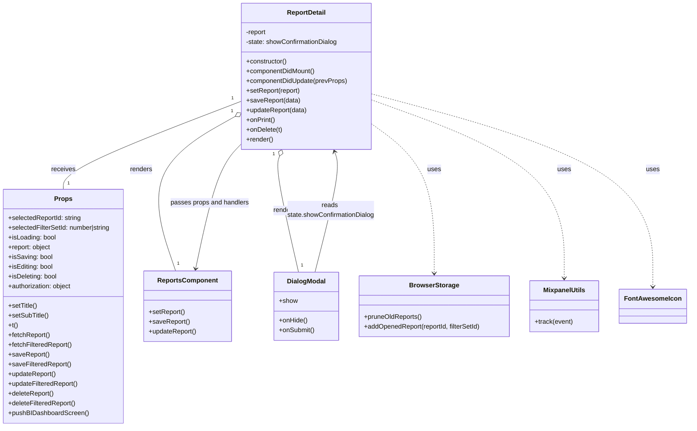

# Diagram: web/portal/src/pages/reports/report-detail/ReportDetail.page.js


> Auto-generated by Obscura crawlers

## Diagram 1



### SVG

<svg id="container" width="1697.06640625" xmlns="http://www.w3.org/2000/svg" class="classDiagram" height="1050" viewBox="0 0 1697.06640625 1050" role="graphics-document document" aria-roledescription="class"><style>#container{font-family:"trebuchet ms",verdana,arial,sans-serif;font-size:16px;fill:#333;}@keyframes edge-animation-frame{from{stroke-dashoffset:0;}}@keyframes dash{to{stroke-dashoffset:0;}}#container .edge-animation-slow{stroke-dasharray:9,5!important;stroke-dashoffset:900;animation:dash 50s linear infinite;stroke-linecap:round;}#container .edge-animation-fast{stroke-dasharray:9,5!important;stroke-dashoffset:900;animation:dash 20s linear infinite;stroke-linecap:round;}#container .error-icon{fill:#552222;}#container .error-text{fill:#552222;stroke:#552222;}#container .edge-thickness-normal{stroke-width:1px;}#container .edge-thickness-thick{stroke-width:3.5px;}#container .edge-pattern-solid{stroke-dasharray:0;}#container .edge-thickness-invisible{stroke-width:0;fill:none;}#container .edge-pattern-dashed{stroke-dasharray:3;}#container .edge-pattern-dotted{stroke-dasharray:2;}#container .marker{fill:#333333;stroke:#333333;}#container .marker.cross{stroke:#333333;}#container svg{font-family:"trebuchet ms",verdana,arial,sans-serif;font-size:16px;}#container p{margin:0;}#container g.classGroup text{fill:#9370DB;stroke:none;font-family:"trebuchet ms",verdana,arial,sans-serif;font-size:10px;}#container g.classGroup text .title{font-weight:bolder;}#container .nodeLabel,#container .edgeLabel{color:#131300;}#container .edgeLabel .label rect{fill:#ECECFF;}#container .label text{fill:#131300;}#container .labelBkg{background:#ECECFF;}#container .edgeLabel .label span{background:#ECECFF;}#container .classTitle{font-weight:bolder;}#container .node rect,#container .node circle,#container .node ellipse,#container .node polygon,#container .node path{fill:#ECECFF;stroke:#9370DB;stroke-width:1px;}#container .divider{stroke:#9370DB;stroke-width:1;}#container g.clickable{cursor:pointer;}#container g.classGroup rect{fill:#ECECFF;stroke:#9370DB;}#container g.classGroup line{stroke:#9370DB;stroke-width:1;}#container .classLabel .box{stroke:none;stroke-width:0;fill:#ECECFF;opacity:0.5;}#container .classLabel .label{fill:#9370DB;font-size:10px;}#container .relation{stroke:#333333;stroke-width:1;fill:none;}#container .dashed-line{stroke-dasharray:3;}#container .dotted-line{stroke-dasharray:1 2;}#container #compositionStart,#container .composition{fill:#333333!important;stroke:#333333!important;stroke-width:1;}#container #compositionEnd,#container .composition{fill:#333333!important;stroke:#333333!important;stroke-width:1;}#container #dependencyStart,#container .dependency{fill:#333333!important;stroke:#333333!important;stroke-width:1;}#container #dependencyStart,#container .dependency{fill:#333333!important;stroke:#333333!important;stroke-width:1;}#container #extensionStart,#container .extension{fill:transparent!important;stroke:#333333!important;stroke-width:1;}#container #extensionEnd,#container .extension{fill:transparent!important;stroke:#333333!important;stroke-width:1;}#container #aggregationStart,#container .aggregation{fill:transparent!important;stroke:#333333!important;stroke-width:1;}#container #aggregationEnd,#container .aggregation{fill:transparent!important;stroke:#333333!important;stroke-width:1;}#container #lollipopStart,#container .lollipop{fill:#ECECFF!important;stroke:#333333!important;stroke-width:1;}#container #lollipopEnd,#container .lollipop{fill:#ECECFF!important;stroke:#333333!important;stroke-width:1;}#container .edgeTerminals{font-size:11px;line-height:initial;}#container .classTitleText{text-anchor:middle;font-size:18px;fill:#333;}#container .label-icon{display:inline-block;height:1em;overflow:visible;vertical-align:-0.125em;}#container .node .label-icon path{fill:currentColor;stroke:revert;stroke-width:revert;}#container :root{--mermaid-font-family:"trebuchet ms",verdana,arial,sans-serif;}</style><g><defs><marker id="container_class-aggregationStart" class="marker aggregation class" refX="18" refY="7" markerWidth="190" markerHeight="240" orient="auto"><path d="M 18,7 L9,13 L1,7 L9,1 Z"></path></marker></defs><defs><marker id="container_class-aggregationEnd" class="marker aggregation class" refX="1" refY="7" markerWidth="20" markerHeight="28" orient="auto"><path d="M 18,7 L9,13 L1,7 L9,1 Z"></path></marker></defs><defs><marker id="container_class-extensionStart" class="marker extension class" refX="18" refY="7" markerWidth="190" markerHeight="240" orient="auto"><path d="M 1,7 L18,13 V 1 Z"></path></marker></defs><defs><marker id="container_class-extensionEnd" class="marker extension class" refX="1" refY="7" markerWidth="20" markerHeight="28" orient="auto"><path d="M 1,1 V 13 L18,7 Z"></path></marker></defs><defs><marker id="container_class-compositionStart" class="marker composition class" refX="18" refY="7" markerWidth="190" markerHeight="240" orient="auto"><path d="M 18,7 L9,13 L1,7 L9,1 Z"></path></marker></defs><defs><marker id="container_class-compositionEnd" class="marker composition class" refX="1" refY="7" markerWidth="20" markerHeight="28" orient="auto"><path d="M 18,7 L9,13 L1,7 L9,1 Z"></path></marker></defs><defs><marker id="container_class-dependencyStart" class="marker dependency class" refX="6" refY="7" markerWidth="190" markerHeight="240" orient="auto"><path d="M 5,7 L9,13 L1,7 L9,1 Z"></path></marker></defs><defs><marker id="container_class-dependencyEnd" class="marker dependency class" refX="13" refY="7" markerWidth="20" markerHeight="28" orient="auto"><path d="M 18,7 L9,13 L14,7 L9,1 Z"></path></marker></defs><defs><marker id="container_class-lollipopStart" class="marker lollipop class" refX="13" refY="7" markerWidth="190" markerHeight="240" orient="auto"><circle stroke="black" fill="transparent" cx="7" cy="7" r="6"></circle></marker></defs><defs><marker id="container_class-lollipopEnd" class="marker lollipop class" refX="1" refY="7" markerWidth="190" markerHeight="240" orient="auto"><circle stroke="black" fill="transparent" cx="7" cy="7" r="6"></circle></marker></defs><g class="root"><g class="clusters"></g><g class="edgePaths"><path d="M601.199,248.972L527.441,276.976C453.682,304.981,306.165,360.991,232.407,397.162C158.648,433.333,158.648,449.667,158.648,457.833L158.648,466" id="id_ReportDetail_Props_1" class="edge-thickness-normal edge-pattern-solid relation" style=";;;" data-edge="true" data-et="edge" data-id="id_ReportDetail_Props_1" data-points="W3sieCI6NjAxLjE5OTIxODc1LCJ5IjoyNDguOTcxNTQ4NDgwMjc1NjZ9LHsieCI6MTU4LjY0ODQzNzUsInkiOjQxN30seyJ4IjoxNTguNjQ4NDM3NSwieSI6NDY2fV0="></path><path d="M586.132,285.917L546.94,307.764C507.749,329.611,429.366,373.306,404.404,436.819C379.442,500.333,407.902,583.667,422.132,625.333L436.362,667" id="id_ReportDetail_ReportsComponent_2" class="edge-thickness-normal edge-pattern-solid relation" style=";;;" data-edge="true" data-et="edge" data-id="id_ReportDetail_ReportsComponent_2" data-points="W3sieCI6NjAxLjE5OTIxODc1LCJ5IjoyNzcuNTE3ODU1MTkwMTUyNjZ9LHsieCI6MzUwLjk4MjQyMTg3NSwieSI6NDE3fSx7IngiOjQzNi4zNjIwOTMxNDcyNTUyLCJ5Ijo2Njd9XQ==" marker-start="url(#container_class-aggregationStart)"></path><path d="M694.744,384.324L692.884,389.77C691.025,395.216,687.305,406.108,695.23,453.721C703.155,501.333,722.724,585.667,732.509,627.833L742.293,670" id="id_ReportDetail_DialogModal_3" class="edge-thickness-normal edge-pattern-solid relation" style=";;;" data-edge="true" data-et="edge" data-id="id_ReportDetail_DialogModal_3" data-points="W3sieCI6NzAwLjMxODUyMTQyNDY3MjQsInkiOjM2OH0seyJ4Ijo2ODMuNTg1OTM3NSwieSI6NDE3fSx7IngiOjc0Mi4yOTMzNjI4NTIzNzM5LCJ5Ijo2NzB9XQ==" marker-start="url(#container_class-aggregationStart)"></path><path d="M922.371,304.439L948.244,323.199C974.117,341.959,1025.863,379.48,1051.736,440.906C1077.609,502.333,1077.609,587.667,1077.609,630.333L1077.609,673" id="id_ReportDetail_BrowserStorage_4" class="edge-thickness-normal edge-pattern-dashed relation" style=";;;" data-edge="true" data-et="edge" data-id="id_ReportDetail_BrowserStorage_4" data-points="W3sieCI6OTIyLjM3MTA5Mzc1LCJ5IjozMDQuNDM4NzU3NzE0ODA4NzN9LHsieCI6MTA3Ny42MDkzNzUsInkiOjQxN30seyJ4IjoxMDc3LjYwOTM3NSwieSI6Njc5fV0=" marker-end="url(#container_class-dependencyEnd)"></path><path d="M922.371,245.752L1001.734,274.293C1081.098,302.834,1239.824,359.917,1319.188,433.125C1398.551,506.333,1398.551,595.667,1398.551,640.333L1398.551,685" id="id_ReportDetail_MixpanelUtils_5" class="edge-thickness-normal edge-pattern-dashed relation" style=";;;" data-edge="true" data-et="edge" data-id="id_ReportDetail_MixpanelUtils_5" data-points="W3sieCI6OTIyLjM3MTA5Mzc1LCJ5IjoyNDUuNzUxNTE1MjI1ODcyOTR9LHsieCI6MTM5OC41NTA3ODEyNSwieSI6NDE3fSx7IngiOjEzOTguNTUwNzgxMjUsInkiOjY5MX1d" marker-end="url(#container_class-dependencyEnd)"></path><path d="M922.371,231.308L1037.13,262.256C1151.889,293.205,1381.408,355.103,1496.167,434.218C1610.926,513.333,1610.926,609.667,1610.926,657.833L1610.926,706" id="id_ReportDetail_FontAwesomeIcon_6" class="edge-thickness-normal edge-pattern-dashed relation" style=";;;" data-edge="true" data-et="edge" data-id="id_ReportDetail_FontAwesomeIcon_6" data-points="W3sieCI6OTIyLjM3MTA5Mzc1LCJ5IjoyMzEuMzA3NTI1OTkxMzUxNTV9LHsieCI6MTYxMC45MjU3ODEyNSwieSI6NDE3fSx7IngiOjE2MTAuOTI1NzgxMjUsInkiOjcxMn1d" marker-end="url(#container_class-dependencyEnd)"></path><path d="M486.054,661.134L494.808,620.445C503.562,579.756,521.07,498.378,540.261,446.981C559.452,395.585,580.326,374.169,590.762,363.461L601.199,352.754" id="id_ReportsComponent_ReportDetail_7" class="edge-thickness-normal edge-pattern-solid relation" style=";;;" data-edge="true" data-et="edge" data-id="id_ReportsComponent_ReportDetail_7" data-points="W3sieCI6NDg0Ljc5MTg0NDM5OTEwOTgsInkiOjY2N30seyJ4Ijo1MzguNTc4MTI1LCJ5Ijo0MTd9LHsieCI6NjAxLjE5OTIxODc1LCJ5IjozNTIuNzUzNjc5NDk0NTgzNn1d" marker-start="url(#container_class-dependencyStart)"></path><path d="M783.057,670L793.736,627.833C804.414,585.667,825.77,501.333,833.754,451.937C841.738,402.541,836.35,388.082,833.656,380.852L830.961,373.622" id="id_DialogModal_ReportDetail_8" class="edge-thickness-normal edge-pattern-solid relation" style=";;;" data-edge="true" data-et="edge" data-id="id_DialogModal_ReportDetail_8" data-points="W3sieCI6NzgzLjA1NzI5NTUzMDQxNTQsInkiOjY3MH0seyJ4Ijo4NDcuMTI2OTUzMTI1LCJ5Ijo0MTd9LHsieCI6ODI4Ljg2NjA0NDYyMzM2MjQsInkiOjM2OH1d" marker-end="url(#container_class-dependencyEnd)"></path></g><g class="edgeLabels"><g class="edgeLabel" transform="translate(158.6484375, 417)"><g class="label" data-id="id_ReportDetail_Props_1" transform="translate(-29.4921875, -12)"><foreignObject width="58.984375" height="24"><div xmlns="http://www.w3.org/1999/xhtml" class="labelBkg" style="display: table-cell; white-space: nowrap; line-height: 1.5; max-width: 200px; text-align: center;"><span class="edgeLabel"><p>receives</p></span></div></foreignObject></g></g><g class="edgeLabel" transform="translate(360.7172, 411.57339)"><g class="label" data-id="id_ReportDetail_ReportsComponent_2" transform="translate(-27.75, -12)"><foreignObject width="55.5" height="24"><div xmlns="http://www.w3.org/1999/xhtml" class="labelBkg" style="display: table-cell; white-space: nowrap; line-height: 1.5; max-width: 200px; text-align: center;"><span class="edgeLabel"><p>renders</p></span></div></foreignObject></g></g><g class="edgeLabel" transform="translate(707.0877, 518.28097)"><g class="label" data-id="id_ReportDetail_DialogModal_3" transform="translate(-27.75, -12)"><foreignObject width="55.5" height="24"><div xmlns="http://www.w3.org/1999/xhtml" class="labelBkg" style="display: table-cell; white-space: nowrap; line-height: 1.5; max-width: 200px; text-align: center;"><span class="edgeLabel"><p>renders</p></span></div></foreignObject></g></g><g class="edgeLabel" transform="translate(1077.609375, 417)"><g class="label" data-id="id_ReportDetail_BrowserStorage_4" transform="translate(-16.4921875, -12)"><foreignObject width="32.984375" height="24"><div xmlns="http://www.w3.org/1999/xhtml" class="labelBkg" style="display: table-cell; white-space: nowrap; line-height: 1.5; max-width: 200px; text-align: center;"><span class="edgeLabel"><p>uses</p></span></div></foreignObject></g></g><g class="edgeLabel" transform="translate(1398.55078125, 417)"><g class="label" data-id="id_ReportDetail_MixpanelUtils_5" transform="translate(-16.4921875, -12)"><foreignObject width="32.984375" height="24"><div xmlns="http://www.w3.org/1999/xhtml" class="labelBkg" style="display: table-cell; white-space: nowrap; line-height: 1.5; max-width: 200px; text-align: center;"><span class="edgeLabel"><p>uses</p></span></div></foreignObject></g></g><g class="edgeLabel" transform="translate(1610.92578125, 417)"><g class="label" data-id="id_ReportDetail_FontAwesomeIcon_6" transform="translate(-16.4921875, -12)"><foreignObject width="32.984375" height="24"><div xmlns="http://www.w3.org/1999/xhtml" class="labelBkg" style="display: table-cell; white-space: nowrap; line-height: 1.5; max-width: 200px; text-align: center;"><span class="edgeLabel"><p>uses</p></span></div></foreignObject></g></g><g class="edgeLabel" transform="translate(521.12009, 498.14539)"><g class="label" data-id="id_ReportsComponent_ReportDetail_7" transform="translate(-97.2578125, -12)"><foreignObject width="194.515625" height="24"><div xmlns="http://www.w3.org/1999/xhtml" class="labelBkg" style="display: table-cell; white-space: nowrap; line-height: 1.5; max-width: 200px; text-align: center;"><span class="edgeLabel"><p>passes props and handlers</p></span></div></foreignObject></g></g><g class="edgeLabel" transform="translate(821.51072, 518.15406)"><g class="label" data-id="id_DialogModal_ReportDetail_8" transform="translate(-108.6484375, -24)"><foreignObject width="217.296875" height="48"><div xmlns="http://www.w3.org/1999/xhtml" class="labelBkg" style="display: table; white-space: break-spaces; line-height: 1.5; max-width: 200px; text-align: center; width: 200px;"><span class="edgeLabel"><p>reads state.showConfirmationDialog</p></span></div></foreignObject></g></g><g class="edgeTerminals" transform="translate(579.5144125598171, 241.16007430602298)"><g class="inner" transform="translate(0, 0)"><foreignObject style="width: 9px; height: 12px;"><div xmlns="http://www.w3.org/1999/xhtml" style="display: inline-block; padding-right: 1px; white-space: nowrap;"><span class="edgeLabel">1</span></div></foreignObject></g></g><g class="edgeTerminals" transform="translate(578.6101905381756, 272.93683179421976)"><g class="inner" transform="translate(0, 0)"><foreignObject style="width: 9px; height: 12px;"><div xmlns="http://www.w3.org/1999/xhtml" style="display: inline-block; padding-right: 1px; white-space: nowrap;"><span class="edgeLabel">1</span></div></foreignObject></g></g><g class="edgeTerminals" transform="translate(680.4680701616076, 379.7136458563894)"><g class="inner" transform="translate(0, 0)"><foreignObject style="width: 9px; height: 12px;"><div xmlns="http://www.w3.org/1999/xhtml" style="display: inline-block; padding-right: 1px; white-space: nowrap;"><span class="edgeLabel">1</span></div></foreignObject></g></g><g class="edgeTerminals" transform="translate(168.64843874999997, 443.5000010714286)"><g class="inner" transform="translate(0, 0)"></g><foreignObject style="width: 9px; height: 12px;"><div xmlns="http://www.w3.org/1999/xhtml" style="display: inline-block; padding-right: 1px; white-space: nowrap;"><span class="edgeLabel">1</span></div></foreignObject></g><g class="edgeTerminals" transform="translate(439.90126484794087, 640.5912956691019)"><g class="inner" transform="translate(0, 0)"></g><foreignObject style="width: 9px; height: 12px;"><div xmlns="http://www.w3.org/1999/xhtml" style="display: inline-block; padding-right: 1px; white-space: nowrap;"><span class="edgeLabel">1</span></div></foreignObject></g><g class="edgeTerminals" transform="translate(747.949443559042, 644.5623378485433)"><g class="inner" transform="translate(0, 0)"></g><foreignObject style="width: 9px; height: 12px;"><div xmlns="http://www.w3.org/1999/xhtml" style="display: inline-block; padding-right: 1px; white-space: nowrap;"><span class="edgeLabel">1</span></div></foreignObject></g></g><g class="nodes"><g class="node default" id="classId-ReportDetail-0" transform="translate(761.78515625, 188)"><g class="basic label-container"><path d="M-160.5859375 -180 L160.5859375 -180 L160.5859375 180 L-160.5859375 180" stroke="none" stroke-width="0" fill="#ECECFF" style=""></path><path d="M-160.5859375 -180 C-57.98075894944006 -180, 44.62441960111988 -180, 160.5859375 -180 M-160.5859375 -180 C-64.50780115341496 -180, 31.57033519317008 -180, 160.5859375 -180 M160.5859375 -180 C160.5859375 -73.78438249916454, 160.5859375 32.43123500167093, 160.5859375 180 M160.5859375 -180 C160.5859375 -103.57168730473374, 160.5859375 -27.143374609467486, 160.5859375 180 M160.5859375 180 C35.02128624417304 180, -90.54336501165392 180, -160.5859375 180 M160.5859375 180 C71.94205053771731 180, -16.701836424565386 180, -160.5859375 180 M-160.5859375 180 C-160.5859375 59.131037915153144, -160.5859375 -61.73792416969371, -160.5859375 -180 M-160.5859375 180 C-160.5859375 97.05370958121759, -160.5859375 14.107419162435178, -160.5859375 -180" stroke="#9370DB" stroke-width="1.3" fill="none" stroke-dasharray="0 0" style=""></path></g><g class="annotation-group text" transform="translate(0, -156)"></g><g class="label-group text" transform="translate(-46.609375, -156)"><g class="label" style="font-weight: bolder" transform="translate(0,-12)"><foreignObject width="93.21875" height="24"><div xmlns="http://www.w3.org/1999/xhtml" style="display: table-cell; white-space: nowrap; line-height: 1.5; max-width: 142px; text-align: center;"><span class="nodeLabel markdown-node-label" style=""><p>ReportDetail</p></span></div></foreignObject></g></g><g class="members-group text" transform="translate(-148.5859375, -108)"><g class="label" style="" transform="translate(0,-12)"><foreignObject width="51.671875" height="24"><div xmlns="http://www.w3.org/1999/xhtml" style="display: table-cell; white-space: nowrap; line-height: 1.5; max-width: 109px; text-align: center;"><span class="nodeLabel markdown-node-label" style=""><p>-report</p></span></div></foreignObject></g><g class="label" style="" transform="translate(0,12)"><foreignObject width="228.09375" height="24"><div xmlns="http://www.w3.org/1999/xhtml" style="display: table-cell; white-space: nowrap; line-height: 1.5; max-width: 286px; text-align: center;"><span class="nodeLabel markdown-node-label" style=""><p>-state: showConfirmationDialog</p></span></div></foreignObject></g></g><g class="methods-group text" transform="translate(-148.5859375, -36)"><g class="label" style="" transform="translate(0,-12)"><foreignObject width="101.84375" height="24"><div xmlns="http://www.w3.org/1999/xhtml" style="display: table-cell; white-space: nowrap; line-height: 1.5; max-width: 159px; text-align: center;"><span class="nodeLabel markdown-node-label" style=""><p>+constructor()</p></span></div></foreignObject></g><g class="label" style="" transform="translate(0,12)"><foreignObject width="171.484375" height="24"><div xmlns="http://www.w3.org/1999/xhtml" style="display: table-cell; white-space: nowrap; line-height: 1.5; max-width: 229px; text-align: center;"><span class="nodeLabel markdown-node-label" style=""><p>+componentDidMount()</p></span></div></foreignObject></g><g class="label" style="" transform="translate(0,36)"><foreignObject width="250.5625" height="24"><div xmlns="http://www.w3.org/1999/xhtml" style="display: table-cell; white-space: nowrap; line-height: 1.5; max-width: 308px; text-align: center;"><span class="nodeLabel markdown-node-label" style=""><p>+componentDidUpdate(prevProps)</p></span></div></foreignObject></g><g class="label" style="" transform="translate(0,60)"><foreignObject width="134.5" height="24"><div xmlns="http://www.w3.org/1999/xhtml" style="display: table-cell; white-space: nowrap; line-height: 1.5; max-width: 192px; text-align: center;"><span class="nodeLabel markdown-node-label" style=""><p>+setReport(report)</p></span></div></foreignObject></g><g class="label" style="" transform="translate(0,84)"><foreignObject width="132.265625" height="24"><div xmlns="http://www.w3.org/1999/xhtml" style="display: table-cell; white-space: nowrap; line-height: 1.5; max-width: 190px; text-align: center;"><span class="nodeLabel markdown-node-label" style=""><p>+saveReport(data)</p></span></div></foreignObject></g><g class="label" style="" transform="translate(0,108)"><foreignObject width="151.296875" height="24"><div xmlns="http://www.w3.org/1999/xhtml" style="display: table-cell; white-space: nowrap; line-height: 1.5; max-width: 209px; text-align: center;"><span class="nodeLabel markdown-node-label" style=""><p>+updateReport(data)</p></span></div></foreignObject></g><g class="label" style="" transform="translate(0,132)"><foreignObject width="71.890625" height="24"><div xmlns="http://www.w3.org/1999/xhtml" style="display: table-cell; white-space: nowrap; line-height: 1.5; max-width: 129px; text-align: center;"><span class="nodeLabel markdown-node-label" style=""><p>+onPrint()</p></span></div></foreignObject></g><g class="label" style="" transform="translate(0,156)"><foreignObject width="89.46875" height="24"><div xmlns="http://www.w3.org/1999/xhtml" style="display: table-cell; white-space: nowrap; line-height: 1.5; max-width: 147px; text-align: center;"><span class="nodeLabel markdown-node-label" style=""><p>+onDelete(t)</p></span></div></foreignObject></g><g class="label" style="" transform="translate(0,180)"><foreignObject width="66.609375" height="24"><div xmlns="http://www.w3.org/1999/xhtml" style="display: table-cell; white-space: nowrap; line-height: 1.5; max-width: 124px; text-align: center;"><span class="nodeLabel markdown-node-label" style=""><p>+render()</p></span></div></foreignObject></g></g><g class="divider" style=""><path d="M-160.5859375 -132 C-76.61355689890033 -132, 7.358823702199345 -132, 160.5859375 -132 M-160.5859375 -132 C-56.05997106991086 -132, 48.46599536017828 -132, 160.5859375 -132" stroke="#9370DB" stroke-width="1.3" fill="none" stroke-dasharray="0 0" style=""></path></g><g class="divider" style=""><path d="M-160.5859375 -60 C-65.75977808140881 -60, 29.066381337182378 -60, 160.5859375 -60 M-160.5859375 -60 C-72.40326828932224 -60, 15.779400921355517 -60, 160.5859375 -60" stroke="#9370DB" stroke-width="1.3" fill="none" stroke-dasharray="0 0" style=""></path></g></g><g class="node default" id="classId-Props-1" transform="translate(158.6484375, 754)"><g class="basic label-container"><path d="M-150.6484375 -288 L150.6484375 -288 L150.6484375 288 L-150.6484375 288" stroke="none" stroke-width="0" fill="#ECECFF" style=""></path><path d="M-150.6484375 -288 C-48.90846835642574 -288, 52.831500787148514 -288, 150.6484375 -288 M-150.6484375 -288 C-32.22736619553467 -288, 86.19370510893066 -288, 150.6484375 -288 M150.6484375 -288 C150.6484375 -114.15307494745542, 150.6484375 59.693850105089155, 150.6484375 288 M150.6484375 -288 C150.6484375 -146.29165447021893, 150.6484375 -4.58330894043786, 150.6484375 288 M150.6484375 288 C53.9949996925812 288, -42.658438114837594 288, -150.6484375 288 M150.6484375 288 C41.63637081451324 288, -67.37569587097352 288, -150.6484375 288 M-150.6484375 288 C-150.6484375 68.64531959681733, -150.6484375 -150.70936080636534, -150.6484375 -288 M-150.6484375 288 C-150.6484375 87.91385135843592, -150.6484375 -112.17229728312816, -150.6484375 -288" stroke="#9370DB" stroke-width="1.3" fill="none" stroke-dasharray="0 0" style=""></path></g><g class="annotation-group text" transform="translate(0, -264)"></g><g class="label-group text" transform="translate(-20.921875, -264)"><g class="label" style="font-weight: bolder" transform="translate(0,-12)"><foreignObject width="41.84375" height="24"><div xmlns="http://www.w3.org/1999/xhtml" style="display: table-cell; white-space: nowrap; line-height: 1.5; max-width: 91px; text-align: center;"><span class="nodeLabel markdown-node-label" style=""><p>Props</p></span></div></foreignObject></g></g><g class="members-group text" transform="translate(-138.6484375, -216)"><g class="label" style="" transform="translate(0,-12)"><foreignObject width="181.9375" height="24"><div xmlns="http://www.w3.org/1999/xhtml" style="display: table-cell; white-space: nowrap; line-height: 1.5; max-width: 240px; text-align: center;"><span class="nodeLabel markdown-node-label" style=""><p>+selectedReportId: string</p></span></div></foreignObject></g><g class="label" style="" transform="translate(0,12)"><foreignObject width="256.375" height="24"><div xmlns="http://www.w3.org/1999/xhtml" style="display: table-cell; white-space: nowrap; line-height: 1.5; max-width: 314px; text-align: center;"><span class="nodeLabel markdown-node-label" style=""><p>+selectedFilterSetId: number|string</p></span></div></foreignObject></g><g class="label" style="" transform="translate(0,36)"><foreignObject width="118.171875" height="24"><div xmlns="http://www.w3.org/1999/xhtml" style="display: table-cell; white-space: nowrap; line-height: 1.5; max-width: 176px; text-align: center;"><span class="nodeLabel markdown-node-label" style=""><p>+isLoading: bool</p></span></div></foreignObject></g><g class="label" style="" transform="translate(0,60)"><foreignObject width="106.828125" height="24"><div xmlns="http://www.w3.org/1999/xhtml" style="display: table-cell; white-space: nowrap; line-height: 1.5; max-width: 164px; text-align: center;"><span class="nodeLabel markdown-node-label" style=""><p>+report: object</p></span></div></foreignObject></g><g class="label" style="" transform="translate(0,84)"><foreignObject width="108.203125" height="24"><div xmlns="http://www.w3.org/1999/xhtml" style="display: table-cell; white-space: nowrap; line-height: 1.5; max-width: 166px; text-align: center;"><span class="nodeLabel markdown-node-label" style=""><p>+isSaving: bool</p></span></div></foreignObject></g><g class="label" style="" transform="translate(0,108)"><foreignObject width="111.234375" height="24"><div xmlns="http://www.w3.org/1999/xhtml" style="display: table-cell; white-space: nowrap; line-height: 1.5; max-width: 169px; text-align: center;"><span class="nodeLabel markdown-node-label" style=""><p>+isEditing: bool</p></span></div></foreignObject></g><g class="label" style="" transform="translate(0,132)"><foreignObject width="121.265625" height="24"><div xmlns="http://www.w3.org/1999/xhtml" style="display: table-cell; white-space: nowrap; line-height: 1.5; max-width: 179px; text-align: center;"><span class="nodeLabel markdown-node-label" style=""><p>+isDeleting: bool</p></span></div></foreignObject></g><g class="label" style="" transform="translate(0,156)"><foreignObject width="158.96875" height="24"><div xmlns="http://www.w3.org/1999/xhtml" style="display: table-cell; white-space: nowrap; line-height: 1.5; max-width: 217px; text-align: center;"><span class="nodeLabel markdown-node-label" style=""><p>+authorization: object</p></span></div></foreignObject></g></g><g class="methods-group text" transform="translate(-138.6484375, 0)"><g class="label" style="" transform="translate(0,-12)"><foreignObject width="72.0625" height="24"><div xmlns="http://www.w3.org/1999/xhtml" style="display: table-cell; white-space: nowrap; line-height: 1.5; max-width: 129px; text-align: center;"><span class="nodeLabel markdown-node-label" style=""><p>+setTitle()</p></span></div></foreignObject></g><g class="label" style="" transform="translate(0,12)"><foreignObject width="99.59375" height="24"><div xmlns="http://www.w3.org/1999/xhtml" style="display: table-cell; white-space: nowrap; line-height: 1.5; max-width: 157px; text-align: center;"><span class="nodeLabel markdown-node-label" style=""><p>+setSubTitle()</p></span></div></foreignObject></g><g class="label" style="" transform="translate(0,36)"><foreignObject width="24.0625" height="24"><div xmlns="http://www.w3.org/1999/xhtml" style="display: table-cell; white-space: nowrap; line-height: 1.5; max-width: 81px; text-align: center;"><span class="nodeLabel markdown-node-label" style=""><p>+t()</p></span></div></foreignObject></g><g class="label" style="" transform="translate(0,60)"><foreignObject width="103.5625" height="24"><div xmlns="http://www.w3.org/1999/xhtml" style="display: table-cell; white-space: nowrap; line-height: 1.5; max-width: 161px; text-align: center;"><span class="nodeLabel markdown-node-label" style=""><p>+fetchReport()</p></span></div></foreignObject></g><g class="label" style="" transform="translate(0,84)"><foreignObject width="158.296875" height="24"><div xmlns="http://www.w3.org/1999/xhtml" style="display: table-cell; white-space: nowrap; line-height: 1.5; max-width: 216px; text-align: center;"><span class="nodeLabel markdown-node-label" style=""><p>+fetchFilteredReport()</p></span></div></foreignObject></g><g class="label" style="" transform="translate(0,108)"><foreignObject width="99.625" height="24"><div xmlns="http://www.w3.org/1999/xhtml" style="display: table-cell; white-space: nowrap; line-height: 1.5; max-width: 157px; text-align: center;"><span class="nodeLabel markdown-node-label" style=""><p>+saveReport()</p></span></div></foreignObject></g><g class="label" style="" transform="translate(0,132)"><foreignObject width="154.359375" height="24"><div xmlns="http://www.w3.org/1999/xhtml" style="display: table-cell; white-space: nowrap; line-height: 1.5; max-width: 212px; text-align: center;"><span class="nodeLabel markdown-node-label" style=""><p>+saveFilteredReport()</p></span></div></foreignObject></g><g class="label" style="" transform="translate(0,156)"><foreignObject width="118.65625" height="24"><div xmlns="http://www.w3.org/1999/xhtml" style="display: table-cell; white-space: nowrap; line-height: 1.5; max-width: 176px; text-align: center;"><span class="nodeLabel markdown-node-label" style=""><p>+updateReport()</p></span></div></foreignObject></g><g class="label" style="" transform="translate(0,180)"><foreignObject width="173.40625" height="24"><div xmlns="http://www.w3.org/1999/xhtml" style="display: table-cell; white-space: nowrap; line-height: 1.5; max-width: 231px; text-align: center;"><span class="nodeLabel markdown-node-label" style=""><p>+updateFilteredReport()</p></span></div></foreignObject></g><g class="label" style="" transform="translate(0,204)"><foreignObject width="113.1875" height="24"><div xmlns="http://www.w3.org/1999/xhtml" style="display: table-cell; white-space: nowrap; line-height: 1.5; max-width: 171px; text-align: center;"><span class="nodeLabel markdown-node-label" style=""><p>+deleteReport()</p></span></div></foreignObject></g><g class="label" style="" transform="translate(0,228)"><foreignObject width="167.921875" height="24"><div xmlns="http://www.w3.org/1999/xhtml" style="display: table-cell; white-space: nowrap; line-height: 1.5; max-width: 225px; text-align: center;"><span class="nodeLabel markdown-node-label" style=""><p>+deleteFilteredReport()</p></span></div></foreignObject></g><g class="label" style="" transform="translate(0,252)"><foreignObject width="195.546875" height="24"><div xmlns="http://www.w3.org/1999/xhtml" style="display: table-cell; white-space: nowrap; line-height: 1.5; max-width: 253px; text-align: center;"><span class="nodeLabel markdown-node-label" style=""><p>+pushBIDashboardScreen()</p></span></div></foreignObject></g></g><g class="divider" style=""><path d="M-150.6484375 -240 C-60.13060447476498 -240, 30.38722855047004 -240, 150.6484375 -240 M-150.6484375 -240 C-73.78411729245828 -240, 3.080202915083447 -240, 150.6484375 -240" stroke="#9370DB" stroke-width="1.3" fill="none" stroke-dasharray="0 0" style=""></path></g><g class="divider" style=""><path d="M-150.6484375 -24 C-33.54230240867419 -24, 83.56383268265162 -24, 150.6484375 -24 M-150.6484375 -24 C-69.19252863867273 -24, 12.263380222654547 -24, 150.6484375 -24" stroke="#9370DB" stroke-width="1.3" fill="none" stroke-dasharray="0 0" style=""></path></g></g><g class="node default" id="classId-ReportsComponent-2" transform="translate(466.07421875, 754)"><g class="basic label-container"><path d="M-106.77734375 -87 L106.77734375 -87 L106.77734375 87 L-106.77734375 87" stroke="none" stroke-width="0" fill="#ECECFF" style=""></path><path d="M-106.77734375 -87 C-60.566013418384884 -87, -14.354683086769768 -87, 106.77734375 -87 M-106.77734375 -87 C-60.69859217966452 -87, -14.619840609329046 -87, 106.77734375 -87 M106.77734375 -87 C106.77734375 -18.611362447696408, 106.77734375 49.777275104607185, 106.77734375 87 M106.77734375 -87 C106.77734375 -40.00783753487053, 106.77734375 6.984324930258936, 106.77734375 87 M106.77734375 87 C35.1468065398643 87, -36.4837306702714 87, -106.77734375 87 M106.77734375 87 C41.64312597077175 87, -23.491091808456503 87, -106.77734375 87 M-106.77734375 87 C-106.77734375 35.317993239258676, -106.77734375 -16.364013521482647, -106.77734375 -87 M-106.77734375 87 C-106.77734375 18.517802553375816, -106.77734375 -49.96439489324837, -106.77734375 -87" stroke="#9370DB" stroke-width="1.3" fill="none" stroke-dasharray="0 0" style=""></path></g><g class="annotation-group text" transform="translate(0, -63)"></g><g class="label-group text" transform="translate(-70.8984375, -63)"><g class="label" style="font-weight: bolder" transform="translate(0,-12)"><foreignObject width="141.796875" height="24"><div xmlns="http://www.w3.org/1999/xhtml" style="display: table-cell; white-space: nowrap; line-height: 1.5; max-width: 190px; text-align: center;"><span class="nodeLabel markdown-node-label" style=""><p>ReportsComponent</p></span></div></foreignObject></g></g><g class="members-group text" transform="translate(-94.77734375, -15)"></g><g class="methods-group text" transform="translate(-94.77734375, 15)"><g class="label" style="" transform="translate(0,-12)"><foreignObject width="89.28125" height="24"><div xmlns="http://www.w3.org/1999/xhtml" style="display: table-cell; white-space: nowrap; line-height: 1.5; max-width: 147px; text-align: center;"><span class="nodeLabel markdown-node-label" style=""><p>+setReport()</p></span></div></foreignObject></g><g class="label" style="" transform="translate(0,12)"><foreignObject width="99.625" height="24"><div xmlns="http://www.w3.org/1999/xhtml" style="display: table-cell; white-space: nowrap; line-height: 1.5; max-width: 157px; text-align: center;"><span class="nodeLabel markdown-node-label" style=""><p>+saveReport()</p></span></div></foreignObject></g><g class="label" style="" transform="translate(0,36)"><foreignObject width="118.65625" height="24"><div xmlns="http://www.w3.org/1999/xhtml" style="display: table-cell; white-space: nowrap; line-height: 1.5; max-width: 176px; text-align: center;"><span class="nodeLabel markdown-node-label" style=""><p>+updateReport()</p></span></div></foreignObject></g></g><g class="divider" style=""><path d="M-106.77734375 -39 C-34.60143327364841 -39, 37.57447720270318 -39, 106.77734375 -39 M-106.77734375 -39 C-25.068271879812357 -39, 56.640799990375285 -39, 106.77734375 -39" stroke="#9370DB" stroke-width="1.3" fill="none" stroke-dasharray="0 0" style=""></path></g><g class="divider" style=""><path d="M-106.77734375 -15 C-37.10732180608791 -15, 32.56270013782418 -15, 106.77734375 -15 M-106.77734375 -15 C-59.35143394872975 -15, -11.925524147459498 -15, 106.77734375 -15" stroke="#9370DB" stroke-width="1.3" fill="none" stroke-dasharray="0 0" style=""></path></g></g><g class="node default" id="classId-DialogModal-3" transform="translate(761.78515625, 754)"><g class="basic label-container"><path d="M-79.1171875 -84 L79.1171875 -84 L79.1171875 84 L-79.1171875 84" stroke="none" stroke-width="0" fill="#ECECFF" style=""></path><path d="M-79.1171875 -84 C-26.094823816935175 -84, 26.92753986612965 -84, 79.1171875 -84 M-79.1171875 -84 C-18.383134829437452 -84, 42.350917841125096 -84, 79.1171875 -84 M79.1171875 -84 C79.1171875 -19.768119102412868, 79.1171875 44.463761795174264, 79.1171875 84 M79.1171875 -84 C79.1171875 -23.317446947055423, 79.1171875 37.365106105889154, 79.1171875 84 M79.1171875 84 C21.989285340836318 84, -35.138616818327364 84, -79.1171875 84 M79.1171875 84 C46.56945600918618 84, 14.021724518372366 84, -79.1171875 84 M-79.1171875 84 C-79.1171875 45.451172583997426, -79.1171875 6.902345167994852, -79.1171875 -84 M-79.1171875 84 C-79.1171875 26.777384304967704, -79.1171875 -30.445231390064592, -79.1171875 -84" stroke="#9370DB" stroke-width="1.3" fill="none" stroke-dasharray="0 0" style=""></path></g><g class="annotation-group text" transform="translate(0, -60)"></g><g class="label-group text" transform="translate(-45.625, -60)"><g class="label" style="font-weight: bolder" transform="translate(0,-12)"><foreignObject width="91.25" height="24"><div xmlns="http://www.w3.org/1999/xhtml" style="display: table-cell; white-space: nowrap; line-height: 1.5; max-width: 141px; text-align: center;"><span class="nodeLabel markdown-node-label" style=""><p>DialogModal</p></span></div></foreignObject></g></g><g class="members-group text" transform="translate(-67.1171875, -12)"><g class="label" style="" transform="translate(0,-12)"><foreignObject width="45.65625" height="24"><div xmlns="http://www.w3.org/1999/xhtml" style="display: table-cell; white-space: nowrap; line-height: 1.5; max-width: 104px; text-align: center;"><span class="nodeLabel markdown-node-label" style=""><p>+show</p></span></div></foreignObject></g></g><g class="methods-group text" transform="translate(-67.1171875, 36)"><g class="label" style="" transform="translate(0,-12)"><foreignObject width="70.765625" height="24"><div xmlns="http://www.w3.org/1999/xhtml" style="display: table-cell; white-space: nowrap; line-height: 1.5; max-width: 128px; text-align: center;"><span class="nodeLabel markdown-node-label" style=""><p>+onHide()</p></span></div></foreignObject></g><g class="label" style="" transform="translate(0,12)"><foreignObject width="88.609375" height="24"><div xmlns="http://www.w3.org/1999/xhtml" style="display: table-cell; white-space: nowrap; line-height: 1.5; max-width: 146px; text-align: center;"><span class="nodeLabel markdown-node-label" style=""><p>+onSubmit()</p></span></div></foreignObject></g></g><g class="divider" style=""><path d="M-79.1171875 -36 C-42.19508950224408 -36, -5.272991504488161 -36, 79.1171875 -36 M-79.1171875 -36 C-30.3577790766668 -36, 18.401629346666397 -36, 79.1171875 -36" stroke="#9370DB" stroke-width="1.3" fill="none" stroke-dasharray="0 0" style=""></path></g><g class="divider" style=""><path d="M-79.1171875 12 C-32.14205984623167 12, 14.833067807536665 12, 79.1171875 12 M-79.1171875 12 C-34.73384705529267 12, 9.649493389414658 12, 79.1171875 12" stroke="#9370DB" stroke-width="1.3" fill="none" stroke-dasharray="0 0" style=""></path></g></g><g class="node default" id="classId-BrowserStorage-4" transform="translate(1077.609375, 754)"><g class="basic label-container"><path d="M-186.70703125 -75 L186.70703125 -75 L186.70703125 75 L-186.70703125 75" stroke="none" stroke-width="0" fill="#ECECFF" style=""></path><path d="M-186.70703125 -75 C-46.64553609255822 -75, 93.41595906488357 -75, 186.70703125 -75 M-186.70703125 -75 C-41.22374849472948 -75, 104.25953426054105 -75, 186.70703125 -75 M186.70703125 -75 C186.70703125 -39.76914950406147, 186.70703125 -4.538299008122934, 186.70703125 75 M186.70703125 -75 C186.70703125 -15.963513788610975, 186.70703125 43.07297242277805, 186.70703125 75 M186.70703125 75 C108.87072038266388 75, 31.034409515327752 75, -186.70703125 75 M186.70703125 75 C56.84155382272942 75, -73.02392360454115 75, -186.70703125 75 M-186.70703125 75 C-186.70703125 23.591646703688937, -186.70703125 -27.816706592622126, -186.70703125 -75 M-186.70703125 75 C-186.70703125 40.171188007791486, -186.70703125 5.342376015582971, -186.70703125 -75" stroke="#9370DB" stroke-width="1.3" fill="none" stroke-dasharray="0 0" style=""></path></g><g class="annotation-group text" transform="translate(0, -51)"></g><g class="label-group text" transform="translate(-58.1328125, -51)"><g class="label" style="font-weight: bolder" transform="translate(0,-12)"><foreignObject width="116.265625" height="24"><div xmlns="http://www.w3.org/1999/xhtml" style="display: table-cell; white-space: nowrap; line-height: 1.5; max-width: 163px; text-align: center;"><span class="nodeLabel markdown-node-label" style=""><p>BrowserStorage</p></span></div></foreignObject></g></g><g class="members-group text" transform="translate(-174.70703125, -3)"></g><g class="methods-group text" transform="translate(-174.70703125, 27)"><g class="label" style="" transform="translate(0,-12)"><foreignObject width="143.125" height="24"><div xmlns="http://www.w3.org/1999/xhtml" style="display: table-cell; white-space: nowrap; line-height: 1.5; max-width: 200px; text-align: center;"><span class="nodeLabel markdown-node-label" style=""><p>+pruneOldReports()</p></span></div></foreignObject></g><g class="label" style="" transform="translate(0,12)"><foreignObject width="291.28125" height="24"><div xmlns="http://www.w3.org/1999/xhtml" style="display: table-cell; white-space: nowrap; line-height: 1.5; max-width: 349px; text-align: center;"><span class="nodeLabel markdown-node-label" style=""><p>+addOpenedReport(reportId, filterSetId)</p></span></div></foreignObject></g></g><g class="divider" style=""><path d="M-186.70703125 -27 C-86.22743356966635 -27, 14.252164110667309 -27, 186.70703125 -27 M-186.70703125 -27 C-48.813770417310735 -27, 89.07949041537853 -27, 186.70703125 -27" stroke="#9370DB" stroke-width="1.3" fill="none" stroke-dasharray="0 0" style=""></path></g><g class="divider" style=""><path d="M-186.70703125 -3 C-76.85639917657686 -3, 32.994232896846285 -3, 186.70703125 -3 M-186.70703125 -3 C-86.12734341747498 -3, 14.45234441505005 -3, 186.70703125 -3" stroke="#9370DB" stroke-width="1.3" fill="none" stroke-dasharray="0 0" style=""></path></g></g><g class="node default" id="classId-MixpanelUtils-5" transform="translate(1398.55078125, 754)"><g class="basic label-container"><path d="M-84.234375 -63 L84.234375 -63 L84.234375 63 L-84.234375 63" stroke="none" stroke-width="0" fill="#ECECFF" style=""></path><path d="M-84.234375 -63 C-48.838319799623164 -63, -13.442264599246329 -63, 84.234375 -63 M-84.234375 -63 C-36.75983797681616 -63, 10.714699046367684 -63, 84.234375 -63 M84.234375 -63 C84.234375 -28.85117826050965, 84.234375 5.297643478980703, 84.234375 63 M84.234375 -63 C84.234375 -15.290258058242713, 84.234375 32.41948388351457, 84.234375 63 M84.234375 63 C42.62628376355895 63, 1.018192527117904 63, -84.234375 63 M84.234375 63 C38.883575019552616 63, -6.467224960894768 63, -84.234375 63 M-84.234375 63 C-84.234375 19.871218609946993, -84.234375 -23.257562780106014, -84.234375 -63 M-84.234375 63 C-84.234375 24.680759974988682, -84.234375 -13.638480050022636, -84.234375 -63" stroke="#9370DB" stroke-width="1.3" fill="none" stroke-dasharray="0 0" style=""></path></g><g class="annotation-group text" transform="translate(0, -39)"></g><g class="label-group text" transform="translate(-49.921875, -39)"><g class="label" style="font-weight: bolder" transform="translate(0,-12)"><foreignObject width="99.84375" height="24"><div xmlns="http://www.w3.org/1999/xhtml" style="display: table-cell; white-space: nowrap; line-height: 1.5; max-width: 149px; text-align: center;"><span class="nodeLabel markdown-node-label" style=""><p>MixpanelUtils</p></span></div></foreignObject></g></g><g class="members-group text" transform="translate(-72.234375, 9)"></g><g class="methods-group text" transform="translate(-72.234375, 39)"><g class="label" style="" transform="translate(0,-12)"><foreignObject width="94.546875" height="24"><div xmlns="http://www.w3.org/1999/xhtml" style="display: table-cell; white-space: nowrap; line-height: 1.5; max-width: 152px; text-align: center;"><span class="nodeLabel markdown-node-label" style=""><p>+track(event)</p></span></div></foreignObject></g></g><g class="divider" style=""><path d="M-84.234375 -15 C-50.00069298868512 -15, -15.767010977370234 -15, 84.234375 -15 M-84.234375 -15 C-20.453237479733588 -15, 43.327900040532825 -15, 84.234375 -15" stroke="#9370DB" stroke-width="1.3" fill="none" stroke-dasharray="0 0" style=""></path></g><g class="divider" style=""><path d="M-84.234375 9 C-48.395611274425505 9, -12.55684754885101 9, 84.234375 9 M-84.234375 9 C-28.467110350177023 9, 27.300154299645953 9, 84.234375 9" stroke="#9370DB" stroke-width="1.3" fill="none" stroke-dasharray="0 0" style=""></path></g></g><g class="node default" id="classId-FontAwesomeIcon-6" transform="translate(1610.92578125, 754)"><g class="basic label-container"><path d="M-78.140625 -42 L78.140625 -42 L78.140625 42 L-78.140625 42" stroke="none" stroke-width="0" fill="#ECECFF" style=""></path><path d="M-78.140625 -42 C-29.16542206666462 -42, 19.809780866670764 -42, 78.140625 -42 M-78.140625 -42 C-28.703423460505483 -42, 20.733778078989033 -42, 78.140625 -42 M78.140625 -42 C78.140625 -22.781139239722854, 78.140625 -3.562278479445709, 78.140625 42 M78.140625 -42 C78.140625 -11.180609074714745, 78.140625 19.63878185057051, 78.140625 42 M78.140625 42 C36.340091577754265 42, -5.46044184449147 42, -78.140625 42 M78.140625 42 C18.755046116648202 42, -40.630532766703595 42, -78.140625 42 M-78.140625 42 C-78.140625 13.11587294266213, -78.140625 -15.768254114675742, -78.140625 -42 M-78.140625 42 C-78.140625 13.16779755419159, -78.140625 -15.664404891616819, -78.140625 -42" stroke="#9370DB" stroke-width="1.3" fill="none" stroke-dasharray="0 0" style=""></path></g><g class="annotation-group text" transform="translate(0, -18)"></g><g class="label-group text" transform="translate(-66.140625, -18)"><g class="label" style="font-weight: bolder" transform="translate(0,-12)"><foreignObject width="132.28125" height="24"><div xmlns="http://www.w3.org/1999/xhtml" style="display: table-cell; white-space: nowrap; line-height: 1.5; max-width: 181px; text-align: center;"><span class="nodeLabel markdown-node-label" style=""><p>FontAwesomeIcon</p></span></div></foreignObject></g></g><g class="members-group text" transform="translate(-66.140625, 30)"></g><g class="methods-group text" transform="translate(-66.140625, 60)"></g><g class="divider" style=""><path d="M-78.140625 6 C-33.38044125132758 6, 11.379742497344836 6, 78.140625 6 M-78.140625 6 C-20.983865791425288 6, 36.172893417149425 6, 78.140625 6" stroke="#9370DB" stroke-width="1.3" fill="none" stroke-dasharray="0 0" style=""></path></g><g class="divider" style=""><path d="M-78.140625 24 C-43.96950999955891 24, -9.798394999117818 24, 78.140625 24 M-78.140625 24 C-34.72637814763372 24, 8.687868704732566 24, 78.140625 24" stroke="#9370DB" stroke-width="1.3" fill="none" stroke-dasharray="0 0" style=""></path></g></g></g></g></g></svg>

## Diagram 2

```mermaid
flowchart TD
    A[Mount ReportDetail] --> B[setTitle(t("reports:Report"))]
    A --> C[MixpanelUtils.track("Viewed Page: BI / Reports / Details")]
    A --> D[BrowserStorage.pruneOldReports()]
    A --> E[BrowserStorage.addOpenedReport(selectedReportId, selectedFilterSetId)]
    A --> F{selectedFilterSetId?}
    F -- yes --> G[fetchFilteredReport(selectedReportId, selectedFilterSetId)]
    F -- no --> H[fetchReport(selectedReportId)]
    G --> I[render ReportsComponent with handlers]
    H --> I
    I --> J[User interactions]
    J --> K[onPrint -> this.report.print()]
    J --> L[onDelete -> showConfirmationDialog = true]
    J --> M[ReportsComponent calls setReport/saveReport/updateReport]
    M --> N[saveReport -> determine private/shared -> saveFilteredReport or saveReport -> pushBIDashboardScreen]
    M --> O[updateReport -> extract reportId/filterSetId -> updateFilteredReport or updateReport]
    L --> P[DialogModal onSubmit]
    P --> Q{report.filterSet?}
    Q -- yes --> R[deleteFilteredReport(reportId, filterSetId) -> pushBIDashboardScreen()]
    Q -- no --> S[deleteReport(reportId) -> pushBIDashboardScreen()]
    T[Props.report changes] --> U[componentDidUpdate -> setSubTitle(report.filterSet.name or report.name)]
```

> SVG rendering failed for this diagram.
