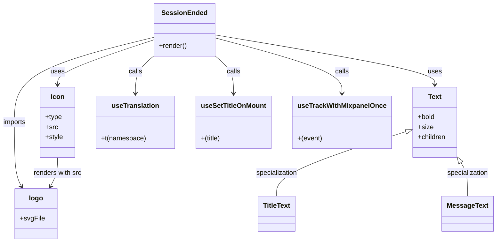

# Diagram: web/portal/src/pages/session-ended/SessionEnded.page.js


> Auto-generated by Obscura crawlers

## Diagram 1

```mermaid
flowchart LR
  SE[SessionEnded] -->|calls| UT[useTranslation("appnav")]
  SE -->|calls on mount| UST[useSetTitleOnMount]
  SE -->|calls once| TM[useTrackWithMixpanelOnce]
  SE -->|imports| LOGO[logo (fv_logo.svg)]
  SE -->|uses component| ICON[Icon(type=LocalImage)]
  SE -->|uses component| CARD[Card Container]
  CARD --> TITLE[Text (bold, size28): "Session Ended"]
  CARD --> MSG[Text: "You have been logged out. Please close this browser tab."]
  ICON --> LOGO
  style SE fill:#f9f,stroke:#333,stroke-width:1px
  style CARD fill:#fff,stroke:#ddd
  style ICON fill:#eef,stroke:#333
```

> SVG rendering failed for this diagram.

## Diagram 2



### SVG

<svg id="container" width="1160.12890625" xmlns="http://www.w3.org/2000/svg" class="classDiagram" height="578" viewBox="0 0 1160.12890625 578" role="graphics-document document" aria-roledescription="class"><style>#container{font-family:"trebuchet ms",verdana,arial,sans-serif;font-size:16px;fill:#333;}@keyframes edge-animation-frame{from{stroke-dashoffset:0;}}@keyframes dash{to{stroke-dashoffset:0;}}#container .edge-animation-slow{stroke-dasharray:9,5!important;stroke-dashoffset:900;animation:dash 50s linear infinite;stroke-linecap:round;}#container .edge-animation-fast{stroke-dasharray:9,5!important;stroke-dashoffset:900;animation:dash 20s linear infinite;stroke-linecap:round;}#container .error-icon{fill:#552222;}#container .error-text{fill:#552222;stroke:#552222;}#container .edge-thickness-normal{stroke-width:1px;}#container .edge-thickness-thick{stroke-width:3.5px;}#container .edge-pattern-solid{stroke-dasharray:0;}#container .edge-thickness-invisible{stroke-width:0;fill:none;}#container .edge-pattern-dashed{stroke-dasharray:3;}#container .edge-pattern-dotted{stroke-dasharray:2;}#container .marker{fill:#333333;stroke:#333333;}#container .marker.cross{stroke:#333333;}#container svg{font-family:"trebuchet ms",verdana,arial,sans-serif;font-size:16px;}#container p{margin:0;}#container g.classGroup text{fill:#9370DB;stroke:none;font-family:"trebuchet ms",verdana,arial,sans-serif;font-size:10px;}#container g.classGroup text .title{font-weight:bolder;}#container .nodeLabel,#container .edgeLabel{color:#131300;}#container .edgeLabel .label rect{fill:#ECECFF;}#container .label text{fill:#131300;}#container .labelBkg{background:#ECECFF;}#container .edgeLabel .label span{background:#ECECFF;}#container .classTitle{font-weight:bolder;}#container .node rect,#container .node circle,#container .node ellipse,#container .node polygon,#container .node path{fill:#ECECFF;stroke:#9370DB;stroke-width:1px;}#container .divider{stroke:#9370DB;stroke-width:1;}#container g.clickable{cursor:pointer;}#container g.classGroup rect{fill:#ECECFF;stroke:#9370DB;}#container g.classGroup line{stroke:#9370DB;stroke-width:1;}#container .classLabel .box{stroke:none;stroke-width:0;fill:#ECECFF;opacity:0.5;}#container .classLabel .label{fill:#9370DB;font-size:10px;}#container .relation{stroke:#333333;stroke-width:1;fill:none;}#container .dashed-line{stroke-dasharray:3;}#container .dotted-line{stroke-dasharray:1 2;}#container #compositionStart,#container .composition{fill:#333333!important;stroke:#333333!important;stroke-width:1;}#container #compositionEnd,#container .composition{fill:#333333!important;stroke:#333333!important;stroke-width:1;}#container #dependencyStart,#container .dependency{fill:#333333!important;stroke:#333333!important;stroke-width:1;}#container #dependencyStart,#container .dependency{fill:#333333!important;stroke:#333333!important;stroke-width:1;}#container #extensionStart,#container .extension{fill:transparent!important;stroke:#333333!important;stroke-width:1;}#container #extensionEnd,#container .extension{fill:transparent!important;stroke:#333333!important;stroke-width:1;}#container #aggregationStart,#container .aggregation{fill:transparent!important;stroke:#333333!important;stroke-width:1;}#container #aggregationEnd,#container .aggregation{fill:transparent!important;stroke:#333333!important;stroke-width:1;}#container #lollipopStart,#container .lollipop{fill:#ECECFF!important;stroke:#333333!important;stroke-width:1;}#container #lollipopEnd,#container .lollipop{fill:#ECECFF!important;stroke:#333333!important;stroke-width:1;}#container .edgeTerminals{font-size:11px;line-height:initial;}#container .classTitleText{text-anchor:middle;font-size:18px;fill:#333;}#container .label-icon{display:inline-block;height:1em;overflow:visible;vertical-align:-0.125em;}#container .node .label-icon path{fill:currentColor;stroke:revert;stroke-width:revert;}#container :root{--mermaid-font-family:"trebuchet ms",verdana,arial,sans-serif;}</style><g><defs><marker id="container_class-aggregationStart" class="marker aggregation class" refX="18" refY="7" markerWidth="190" markerHeight="240" orient="auto"><path d="M 18,7 L9,13 L1,7 L9,1 Z"></path></marker></defs><defs><marker id="container_class-aggregationEnd" class="marker aggregation class" refX="1" refY="7" markerWidth="20" markerHeight="28" orient="auto"><path d="M 18,7 L9,13 L1,7 L9,1 Z"></path></marker></defs><defs><marker id="container_class-extensionStart" class="marker extension class" refX="18" refY="7" markerWidth="190" markerHeight="240" orient="auto"><path d="M 1,7 L18,13 V 1 Z"></path></marker></defs><defs><marker id="container_class-extensionEnd" class="marker extension class" refX="1" refY="7" markerWidth="20" markerHeight="28" orient="auto"><path d="M 1,1 V 13 L18,7 Z"></path></marker></defs><defs><marker id="container_class-compositionStart" class="marker composition class" refX="18" refY="7" markerWidth="190" markerHeight="240" orient="auto"><path d="M 18,7 L9,13 L1,7 L9,1 Z"></path></marker></defs><defs><marker id="container_class-compositionEnd" class="marker composition class" refX="1" refY="7" markerWidth="20" markerHeight="28" orient="auto"><path d="M 18,7 L9,13 L1,7 L9,1 Z"></path></marker></defs><defs><marker id="container_class-dependencyStart" class="marker dependency class" refX="6" refY="7" markerWidth="190" markerHeight="240" orient="auto"><path d="M 5,7 L9,13 L1,7 L9,1 Z"></path></marker></defs><defs><marker id="container_class-dependencyEnd" class="marker dependency class" refX="13" refY="7" markerWidth="20" markerHeight="28" orient="auto"><path d="M 18,7 L9,13 L14,7 L9,1 Z"></path></marker></defs><defs><marker id="container_class-lollipopStart" class="marker lollipop class" refX="13" refY="7" markerWidth="190" markerHeight="240" orient="auto"><circle stroke="black" fill="transparent" cx="7" cy="7" r="6"></circle></marker></defs><defs><marker id="container_class-lollipopEnd" class="marker lollipop class" refX="1" refY="7" markerWidth="190" markerHeight="240" orient="auto"><circle stroke="black" fill="transparent" cx="7" cy="7" r="6"></circle></marker></defs><g class="root"><g class="clusters"></g><g class="edgePaths"><path d="M366.873,94.808L329.116,107.507C291.359,120.205,215.846,145.603,178.089,163.468C140.332,181.333,140.332,191.667,140.332,196.833L140.332,202" id="id_SessionEnded_Icon_1" class="edge-thickness-normal edge-pattern-solid relation" style=";;;" data-edge="true" data-et="edge" data-id="id_SessionEnded_Icon_1" data-points="W3sieCI6MzY2Ljg3MzA0Njg3NSwieSI6OTQuODA4MjQxMzE0MzAxMX0seyJ4IjoxNDAuMzMyMDMxMjUsInkiOjE3MX0seyJ4IjoxNDAuMzMyMDMxMjUsInkiOjIwOH1d" marker-end="url(#container_class-dependencyEnd)"></path><path d="M508.451,83.212L593.265,97.843C678.078,112.475,847.705,141.737,932.519,161.535C1017.332,181.333,1017.332,191.667,1017.332,196.833L1017.332,202" id="id_SessionEnded_Text_2" class="edge-thickness-normal edge-pattern-solid relation" style=";;;" data-edge="true" data-et="edge" data-id="id_SessionEnded_Text_2" data-points="W3sieCI6NTA4LjQ1MTE3MTg3NSwieSI6ODMuMjExOTYwNjA1Mjc0NDF9LHsieCI6MTAxNy4zMzIwMzEyNSwieSI6MTcxfSx7IngiOjEwMTcuMzMyMDMxMjUsInkiOjIwOH1d" marker-end="url(#container_class-dependencyEnd)"></path><path d="M366.873,132.887L359.607,139.239C352.341,145.591,337.809,158.296,330.543,173.314C323.277,188.333,323.277,205.667,323.277,214.333L323.277,223" id="id_SessionEnded_useTranslation_3" class="edge-thickness-normal edge-pattern-solid relation" style=";;;" data-edge="true" data-et="edge" data-id="id_SessionEnded_useTranslation_3" data-points="W3sieCI6MzY2Ljg3MzA0Njg3NSwieSI6MTMyLjg4Njc5MjQ1MjgzMDE4fSx7IngiOjMyMy4yNzczNDM3NSwieSI6MTcxfSx7IngiOjMyMy4yNzczNDM3NSwieSI6MjI5fV0=" marker-end="url(#container_class-dependencyEnd)"></path><path d="M508.451,132.887L515.717,139.239C522.983,145.591,537.515,158.296,544.781,173.314C552.047,188.333,552.047,205.667,552.047,214.333L552.047,223" id="id_SessionEnded_useSetTitleOnMount_4" class="edge-thickness-normal edge-pattern-solid relation" style=";;;" data-edge="true" data-et="edge" data-id="id_SessionEnded_useSetTitleOnMount_4" data-points="W3sieCI6NTA4LjQ1MTE3MTg3NSwieSI6MTMyLjg4Njc5MjQ1MjgzMDE4fSx7IngiOjU1Mi4wNDY4NzUsInkiOjE3MX0seyJ4Ijo1NTIuMDQ2ODc1LCJ5IjoyMjl9XQ==" marker-end="url(#container_class-dependencyEnd)"></path><path d="M508.451,90.467L557.259,103.889C606.066,117.311,703.682,144.156,752.489,166.245C801.297,188.333,801.297,205.667,801.297,214.333L801.297,223" id="id_SessionEnded_useTrackWithMixpanelOnce_5" class="edge-thickness-normal edge-pattern-solid relation" style=";;;" data-edge="true" data-et="edge" data-id="id_SessionEnded_useTrackWithMixpanelOnce_5" data-points="W3sieCI6NTA4LjQ1MTE3MTg3NSwieSI6OTAuNDY3MDc3NzM2MTgxNDd9LHsieCI6ODAxLjI5Njg3NSwieSI6MTcxfSx7IngiOjgwMS4yOTY4NzUsInkiOjIyOX1d" marker-end="url(#container_class-dependencyEnd)"></path><path d="M366.873,88.635L311.769,102.363C256.665,116.09,146.458,143.545,91.354,177.439C36.25,211.333,36.25,251.667,36.25,292C36.25,332.333,36.25,372.667,39.086,398.119C41.921,423.571,47.593,434.142,50.428,439.427L53.264,444.713" id="id_SessionEnded_logo_6" class="edge-thickness-normal edge-pattern-solid relation" style=";;;" data-edge="true" data-et="edge" data-id="id_SessionEnded_logo_6" data-points="W3sieCI6MzY2Ljg3MzA0Njg3NSwieSI6ODguNjM1MDA5MjIwMzc5MjN9LHsieCI6MzYuMjUsInkiOjE3MX0seyJ4IjozNi4yNSwieSI6MjkyfSx7IngiOjM2LjI1LCJ5Ijo0MTN9LHsieCI6NTYuMTAwNjk2NjgxNzAxMDMsInkiOjQ1MH1d" marker-end="url(#container_class-dependencyEnd)"></path><path d="M140.332,376L140.332,382.167C140.332,388.333,140.332,400.667,137.496,412.119C134.661,423.571,128.989,434.142,126.154,439.427L123.318,444.713" id="id_Icon_logo_7" class="edge-thickness-normal edge-pattern-solid relation" style=";;;" data-edge="true" data-et="edge" data-id="id_Icon_logo_7" data-points="W3sieCI6MTQwLjMzMjAzMTI1LCJ5IjozNzZ9LHsieCI6MTQwLjMzMjAzMTI1LCJ5Ijo0MTN9LHsieCI6MTIwLjQ4MTMzNDU2ODI5ODk2LCJ5Ijo0NTB9XQ==" marker-end="url(#container_class-dependencyEnd)"></path><path d="M947.506,314.988L897.887,331.323C848.267,347.659,749.029,380.329,699.41,405.831C649.791,431.333,649.791,449.667,649.791,458.833L649.791,468" id="id_Text_TitleText_8" class="edge-thickness-normal edge-pattern-solid relation" style=";;;" data-edge="true" data-et="edge" data-id="id_Text_TitleText_8" data-points="W3sieCI6OTYzLjg5MDYyNSwieSI6MzA5LjU5MzcxMDMxMDgxNzc2fSx7IngiOjY0OS43OTEwMTU2MjUsInkiOjQxM30seyJ4Ijo2NDkuNzkxMDE1NjI1LCJ5Ijo0Njh9XQ==" marker-start="url(#container_class-extensionStart)"></path><path d="M1079.402,390.598L1081.752,394.332C1084.102,398.065,1088.803,405.533,1091.154,418.433C1093.504,431.333,1093.504,449.667,1093.504,458.833L1093.504,468" id="id_Text_MessageText_9" class="edge-thickness-normal edge-pattern-solid relation" style=";;;" data-edge="true" data-et="edge" data-id="id_Text_MessageText_9" data-points="W3sieCI6MTA3MC4yMTE2ODAwMTAzMzA2LCJ5IjozNzZ9LHsieCI6MTA5My41MDM5MDYyNSwieSI6NDEzfSx7IngiOjEwOTMuNTAzOTA2MjUsInkiOjQ2OH1d" marker-start="url(#container_class-extensionStart)"></path></g><g class="edgeLabels"><g class="edgeLabel" transform="translate(140.33203125, 171)"><g class="label" data-id="id_SessionEnded_Icon_1" transform="translate(-16.4921875, -12)"><foreignObject width="32.984375" height="24"><div xmlns="http://www.w3.org/1999/xhtml" class="labelBkg" style="display: table-cell; white-space: nowrap; line-height: 1.5; max-width: 200px; text-align: center;"><span class="edgeLabel"><p>uses</p></span></div></foreignObject></g></g><g class="edgeLabel" transform="translate(1017.33203125, 171)"><g class="label" data-id="id_SessionEnded_Text_2" transform="translate(-16.4921875, -12)"><foreignObject width="32.984375" height="24"><div xmlns="http://www.w3.org/1999/xhtml" class="labelBkg" style="display: table-cell; white-space: nowrap; line-height: 1.5; max-width: 200px; text-align: center;"><span class="edgeLabel"><p>uses</p></span></div></foreignObject></g></g><g class="edgeLabel" transform="translate(323.27734375, 171)"><g class="label" data-id="id_SessionEnded_useTranslation_3" transform="translate(-16.4453125, -12)"><foreignObject width="32.890625" height="24"><div xmlns="http://www.w3.org/1999/xhtml" class="labelBkg" style="display: table-cell; white-space: nowrap; line-height: 1.5; max-width: 200px; text-align: center;"><span class="edgeLabel"><p>calls</p></span></div></foreignObject></g></g><g class="edgeLabel" transform="translate(552.046875, 171)"><g class="label" data-id="id_SessionEnded_useSetTitleOnMount_4" transform="translate(-16.4453125, -12)"><foreignObject width="32.890625" height="24"><div xmlns="http://www.w3.org/1999/xhtml" class="labelBkg" style="display: table-cell; white-space: nowrap; line-height: 1.5; max-width: 200px; text-align: center;"><span class="edgeLabel"><p>calls</p></span></div></foreignObject></g></g><g class="edgeLabel" transform="translate(801.296875, 171)"><g class="label" data-id="id_SessionEnded_useTrackWithMixpanelOnce_5" transform="translate(-16.4453125, -12)"><foreignObject width="32.890625" height="24"><div xmlns="http://www.w3.org/1999/xhtml" class="labelBkg" style="display: table-cell; white-space: nowrap; line-height: 1.5; max-width: 200px; text-align: center;"><span class="edgeLabel"><p>calls</p></span></div></foreignObject></g></g><g class="edgeLabel" transform="translate(36.25, 292)"><g class="label" data-id="id_SessionEnded_logo_6" transform="translate(-28.25, -12)"><foreignObject width="56.5" height="24"><div xmlns="http://www.w3.org/1999/xhtml" class="labelBkg" style="display: table-cell; white-space: nowrap; line-height: 1.5; max-width: 200px; text-align: center;"><span class="edgeLabel"><p>imports</p></span></div></foreignObject></g></g><g class="edgeLabel" transform="translate(140.33203125, 413)"><g class="label" data-id="id_Icon_logo_7" transform="translate(-57.9609375, -12)"><foreignObject width="115.921875" height="24"><div xmlns="http://www.w3.org/1999/xhtml" class="labelBkg" style="display: table-cell; white-space: nowrap; line-height: 1.5; max-width: 200px; text-align: center;"><span class="edgeLabel"><p>renders with src</p></span></div></foreignObject></g></g><g class="edgeLabel" transform="translate(649.791015625, 413)"><g class="label" data-id="id_Text_TitleText_8" transform="translate(-50.0390625, -12)"><foreignObject width="100.078125" height="24"><div xmlns="http://www.w3.org/1999/xhtml" class="labelBkg" style="display: table-cell; white-space: nowrap; line-height: 1.5; max-width: 200px; text-align: center;"><span class="edgeLabel"><p>specialization</p></span></div></foreignObject></g></g><g class="edgeLabel" transform="translate(1093.50390625, 413)"><g class="label" data-id="id_Text_MessageText_9" transform="translate(-50.0390625, -12)"><foreignObject width="100.078125" height="24"><div xmlns="http://www.w3.org/1999/xhtml" class="labelBkg" style="display: table-cell; white-space: nowrap; line-height: 1.5; max-width: 200px; text-align: center;"><span class="edgeLabel"><p>specialization</p></span></div></foreignObject></g></g></g><g class="nodes"><g class="node default" id="classId-SessionEnded-0" transform="translate(437.662109375, 71)"><g class="basic label-container"><path d="M-70.7890625 -63 L70.7890625 -63 L70.7890625 63 L-70.7890625 63" stroke="none" stroke-width="0" fill="#ECECFF" style=""></path><path d="M-70.7890625 -63 C-40.26632293095844 -63, -9.743583361916869 -63, 70.7890625 -63 M-70.7890625 -63 C-29.10850929096253 -63, 12.57204391807494 -63, 70.7890625 -63 M70.7890625 -63 C70.7890625 -29.561822755456753, 70.7890625 3.876354489086495, 70.7890625 63 M70.7890625 -63 C70.7890625 -27.67921833164357, 70.7890625 7.6415633367128635, 70.7890625 63 M70.7890625 63 C20.1737151472395 63, -30.441632205521003 63, -70.7890625 63 M70.7890625 63 C17.624758388946645 63, -35.53954572210671 63, -70.7890625 63 M-70.7890625 63 C-70.7890625 15.583234126677297, -70.7890625 -31.833531746645406, -70.7890625 -63 M-70.7890625 63 C-70.7890625 25.35081448863837, -70.7890625 -12.29837102272326, -70.7890625 -63" stroke="#9370DB" stroke-width="1.3" fill="none" stroke-dasharray="0 0" style=""></path></g><g class="annotation-group text" transform="translate(0, -39)"></g><g class="label-group text" transform="translate(-50.96875, -39)"><g class="label" style="font-weight: bolder" transform="translate(0,-12)"><foreignObject width="101.9375" height="24"><div xmlns="http://www.w3.org/1999/xhtml" style="display: table-cell; white-space: nowrap; line-height: 1.5; max-width: 151px; text-align: center;"><span class="nodeLabel markdown-node-label" style=""><p>SessionEnded</p></span></div></foreignObject></g></g><g class="members-group text" transform="translate(-58.7890625, 9)"></g><g class="methods-group text" transform="translate(-58.7890625, 39)"><g class="label" style="" transform="translate(0,-12)"><foreignObject width="66.609375" height="24"><div xmlns="http://www.w3.org/1999/xhtml" style="display: table-cell; white-space: nowrap; line-height: 1.5; max-width: 124px; text-align: center;"><span class="nodeLabel markdown-node-label" style=""><p>+render()</p></span></div></foreignObject></g></g><g class="divider" style=""><path d="M-70.7890625 -15 C-19.565747826237597 -15, 31.657566847524805 -15, 70.7890625 -15 M-70.7890625 -15 C-29.872191648749087 -15, 11.044679202501825 -15, 70.7890625 -15" stroke="#9370DB" stroke-width="1.3" fill="none" stroke-dasharray="0 0" style=""></path></g><g class="divider" style=""><path d="M-70.7890625 9 C-38.314372987870364 9, -5.839683475740728 9, 70.7890625 9 M-70.7890625 9 C-23.752101448905904 9, 23.28485960218819 9, 70.7890625 9" stroke="#9370DB" stroke-width="1.3" fill="none" stroke-dasharray="0 0" style=""></path></g></g><g class="node default" id="classId-Icon-1" transform="translate(140.33203125, 292)"><g class="basic label-container"><path d="M-40.83203125 -84 L40.83203125 -84 L40.83203125 84 L-40.83203125 84" stroke="none" stroke-width="0" fill="#ECECFF" style=""></path><path d="M-40.83203125 -84 C-17.368405407642918 -84, 6.0952204347141645 -84, 40.83203125 -84 M-40.83203125 -84 C-8.968169545954964 -84, 22.89569215809007 -84, 40.83203125 -84 M40.83203125 -84 C40.83203125 -37.33775942402966, 40.83203125 9.324481151940674, 40.83203125 84 M40.83203125 -84 C40.83203125 -34.586544723146304, 40.83203125 14.826910553707393, 40.83203125 84 M40.83203125 84 C23.25264710128364 84, 5.673262952567278 84, -40.83203125 84 M40.83203125 84 C17.804846458541817 84, -5.222338332916365 84, -40.83203125 84 M-40.83203125 84 C-40.83203125 29.89928854023433, -40.83203125 -24.20142291953134, -40.83203125 -84 M-40.83203125 84 C-40.83203125 41.807901483783795, -40.83203125 -0.3841970324324109, -40.83203125 -84" stroke="#9370DB" stroke-width="1.3" fill="none" stroke-dasharray="0 0" style=""></path></g><g class="annotation-group text" transform="translate(0, -60)"></g><g class="label-group text" transform="translate(-15.3046875, -60)"><g class="label" style="font-weight: bolder" transform="translate(0,-12)"><foreignObject width="30.609375" height="24"><div xmlns="http://www.w3.org/1999/xhtml" style="display: table-cell; white-space: nowrap; line-height: 1.5; max-width: 81px; text-align: center;"><span class="nodeLabel markdown-node-label" style=""><p>Icon</p></span></div></foreignObject></g></g><g class="members-group text" transform="translate(-28.83203125, -12)"><g class="label" style="" transform="translate(0,-12)"><foreignObject width="39.703125" height="24"><div xmlns="http://www.w3.org/1999/xhtml" style="display: table-cell; white-space: nowrap; line-height: 1.5; max-width: 97px; text-align: center;"><span class="nodeLabel markdown-node-label" style=""><p>+type</p></span></div></foreignObject></g><g class="label" style="" transform="translate(0,12)"><foreignObject width="28.8125" height="24"><div xmlns="http://www.w3.org/1999/xhtml" style="display: table-cell; white-space: nowrap; line-height: 1.5; max-width: 87px; text-align: center;"><span class="nodeLabel markdown-node-label" style=""><p>+src</p></span></div></foreignObject></g><g class="label" style="" transform="translate(0,36)"><foreignObject width="42.359375" height="24"><div xmlns="http://www.w3.org/1999/xhtml" style="display: table-cell; white-space: nowrap; line-height: 1.5; max-width: 100px; text-align: center;"><span class="nodeLabel markdown-node-label" style=""><p>+style</p></span></div></foreignObject></g></g><g class="methods-group text" transform="translate(-28.83203125, 84)"></g><g class="divider" style=""><path d="M-40.83203125 -36 C-9.72351705829406 -36, 21.38499713341188 -36, 40.83203125 -36 M-40.83203125 -36 C-21.679539679104188 -36, -2.527048108208376 -36, 40.83203125 -36" stroke="#9370DB" stroke-width="1.3" fill="none" stroke-dasharray="0 0" style=""></path></g><g class="divider" style=""><path d="M-40.83203125 60 C-13.992636593728914 60, 12.846758062542172 60, 40.83203125 60 M-40.83203125 60 C-17.120113395330076 60, 6.591804459339848 60, 40.83203125 60" stroke="#9370DB" stroke-width="1.3" fill="none" stroke-dasharray="0 0" style=""></path></g></g><g class="node default" id="classId-Text-2" transform="translate(1017.33203125, 292)"><g class="basic label-container"><path d="M-53.44140625 -84 L53.44140625 -84 L53.44140625 84 L-53.44140625 84" stroke="none" stroke-width="0" fill="#ECECFF" style=""></path><path d="M-53.44140625 -84 C-25.320638642711163 -84, 2.8001289645776737 -84, 53.44140625 -84 M-53.44140625 -84 C-13.631346872305201 -84, 26.178712505389598 -84, 53.44140625 -84 M53.44140625 -84 C53.44140625 -25.976905590428323, 53.44140625 32.04618881914335, 53.44140625 84 M53.44140625 -84 C53.44140625 -42.4747025835211, 53.44140625 -0.949405167042201, 53.44140625 84 M53.44140625 84 C14.334000607762448 84, -24.773405034475104 84, -53.44140625 84 M53.44140625 84 C30.69454659691328 84, 7.947686943826561 84, -53.44140625 84 M-53.44140625 84 C-53.44140625 22.199754857218636, -53.44140625 -39.60049028556273, -53.44140625 -84 M-53.44140625 84 C-53.44140625 37.66059411278632, -53.44140625 -8.67881177442736, -53.44140625 -84" stroke="#9370DB" stroke-width="1.3" fill="none" stroke-dasharray="0 0" style=""></path></g><g class="annotation-group text" transform="translate(0, -60)"></g><g class="label-group text" transform="translate(-15.3828125, -60)"><g class="label" style="font-weight: bolder" transform="translate(0,-12)"><foreignObject width="30.765625" height="24"><div xmlns="http://www.w3.org/1999/xhtml" style="display: table-cell; white-space: nowrap; line-height: 1.5; max-width: 80px; text-align: center;"><span class="nodeLabel markdown-node-label" style=""><p>Text</p></span></div></foreignObject></g></g><g class="members-group text" transform="translate(-41.44140625, -12)"><g class="label" style="" transform="translate(0,-12)"><foreignObject width="41.015625" height="24"><div xmlns="http://www.w3.org/1999/xhtml" style="display: table-cell; white-space: nowrap; line-height: 1.5; max-width: 98px; text-align: center;"><span class="nodeLabel markdown-node-label" style=""><p>+bold</p></span></div></foreignObject></g><g class="label" style="" transform="translate(0,12)"><foreignObject width="35.578125" height="24"><div xmlns="http://www.w3.org/1999/xhtml" style="display: table-cell; white-space: nowrap; line-height: 1.5; max-width: 93px; text-align: center;"><span class="nodeLabel markdown-node-label" style=""><p>+size</p></span></div></foreignObject></g><g class="label" style="" transform="translate(0,36)"><foreignObject width="67.5" height="24"><div xmlns="http://www.w3.org/1999/xhtml" style="display: table-cell; white-space: nowrap; line-height: 1.5; max-width: 125px; text-align: center;"><span class="nodeLabel markdown-node-label" style=""><p>+children</p></span></div></foreignObject></g></g><g class="methods-group text" transform="translate(-41.44140625, 84)"></g><g class="divider" style=""><path d="M-53.44140625 -36 C-30.80748110571216 -36, -8.17355596142432 -36, 53.44140625 -36 M-53.44140625 -36 C-18.05719638564336 -36, 17.327013478713283 -36, 53.44140625 -36" stroke="#9370DB" stroke-width="1.3" fill="none" stroke-dasharray="0 0" style=""></path></g><g class="divider" style=""><path d="M-53.44140625 60 C-17.41476484193521 60, 18.61187656612958 60, 53.44140625 60 M-53.44140625 60 C-20.858496970101193 60, 11.724412309797614 60, 53.44140625 60" stroke="#9370DB" stroke-width="1.3" fill="none" stroke-dasharray="0 0" style=""></path></g></g><g class="node default" id="classId-useTranslation-3" transform="translate(323.27734375, 292)"><g class="basic label-container"><path d="M-92.11328125 -63 L92.11328125 -63 L92.11328125 63 L-92.11328125 63" stroke="none" stroke-width="0" fill="#ECECFF" style=""></path><path d="M-92.11328125 -63 C-49.1066445991264 -63, -6.100007948252795 -63, 92.11328125 -63 M-92.11328125 -63 C-46.708830582656624 -63, -1.3043799153132483 -63, 92.11328125 -63 M92.11328125 -63 C92.11328125 -15.039636242119016, 92.11328125 32.92072751576197, 92.11328125 63 M92.11328125 -63 C92.11328125 -20.426576457184304, 92.11328125 22.146847085631393, 92.11328125 63 M92.11328125 63 C45.09092413468914 63, -1.9314329806217216 63, -92.11328125 63 M92.11328125 63 C21.538666005828688 63, -49.035949238342624 63, -92.11328125 63 M-92.11328125 63 C-92.11328125 30.12442882900205, -92.11328125 -2.7511423419959016, -92.11328125 -63 M-92.11328125 63 C-92.11328125 14.935899633412433, -92.11328125 -33.128200733175134, -92.11328125 -63" stroke="#9370DB" stroke-width="1.3" fill="none" stroke-dasharray="0 0" style=""></path></g><g class="annotation-group text" transform="translate(0, -39)"></g><g class="label-group text" transform="translate(-54.0859375, -39)"><g class="label" style="font-weight: bolder" transform="translate(0,-12)"><foreignObject width="108.171875" height="24"><div xmlns="http://www.w3.org/1999/xhtml" style="display: table-cell; white-space: nowrap; line-height: 1.5; max-width: 157px; text-align: center;"><span class="nodeLabel markdown-node-label" style=""><p>useTranslation</p></span></div></foreignObject></g></g><g class="members-group text" transform="translate(-80.11328125, 9)"></g><g class="methods-group text" transform="translate(-80.11328125, 39)"><g class="label" style="" transform="translate(0,-12)"><foreignObject width="106.140625" height="24"><div xmlns="http://www.w3.org/1999/xhtml" style="display: table-cell; white-space: nowrap; line-height: 1.5; max-width: 164px; text-align: center;"><span class="nodeLabel markdown-node-label" style=""><p>+t(namespace)</p></span></div></foreignObject></g></g><g class="divider" style=""><path d="M-92.11328125 -15 C-19.216178034880258 -15, 53.680925180239484 -15, 92.11328125 -15 M-92.11328125 -15 C-27.12111594144632 -15, 37.87104936710736 -15, 92.11328125 -15" stroke="#9370DB" stroke-width="1.3" fill="none" stroke-dasharray="0 0" style=""></path></g><g class="divider" style=""><path d="M-92.11328125 9 C-49.32336182378612 9, -6.533442397572244 9, 92.11328125 9 M-92.11328125 9 C-51.013434002433016 9, -9.913586754866031 9, 92.11328125 9" stroke="#9370DB" stroke-width="1.3" fill="none" stroke-dasharray="0 0" style=""></path></g></g><g class="node default" id="classId-useSetTitleOnMount-4" transform="translate(552.046875, 292)"><g class="basic label-container"><path d="M-86.65625 -63 L86.65625 -63 L86.65625 63 L-86.65625 63" stroke="none" stroke-width="0" fill="#ECECFF" style=""></path><path d="M-86.65625 -63 C-40.79843120519842 -63, 5.059387589603162 -63, 86.65625 -63 M-86.65625 -63 C-45.81663770514794 -63, -4.97702541029588 -63, 86.65625 -63 M86.65625 -63 C86.65625 -22.28556896367033, 86.65625 18.428862072659342, 86.65625 63 M86.65625 -63 C86.65625 -37.59721919565264, 86.65625 -12.19443839130529, 86.65625 63 M86.65625 63 C51.95504103514365 63, 17.253832070287302 63, -86.65625 63 M86.65625 63 C37.66468504090261 63, -11.326879918194777 63, -86.65625 63 M-86.65625 63 C-86.65625 14.208712321839513, -86.65625 -34.58257535632097, -86.65625 -63 M-86.65625 63 C-86.65625 25.269282551207432, -86.65625 -12.461434897585136, -86.65625 -63" stroke="#9370DB" stroke-width="1.3" fill="none" stroke-dasharray="0 0" style=""></path></g><g class="annotation-group text" transform="translate(0, -39)"></g><g class="label-group text" transform="translate(-74.65625, -39)"><g class="label" style="font-weight: bolder" transform="translate(0,-12)"><foreignObject width="149.3125" height="24"><div xmlns="http://www.w3.org/1999/xhtml" style="display: table-cell; white-space: nowrap; line-height: 1.5; max-width: 197px; text-align: center;"><span class="nodeLabel markdown-node-label" style=""><p>useSetTitleOnMount</p></span></div></foreignObject></g></g><g class="members-group text" transform="translate(-74.65625, 9)"></g><g class="methods-group text" transform="translate(-74.65625, 39)"><g class="label" style="" transform="translate(0,-12)"><foreignObject width="47.59375" height="24"><div xmlns="http://www.w3.org/1999/xhtml" style="display: table-cell; white-space: nowrap; line-height: 1.5; max-width: 98px; text-align: center;"><span class="nodeLabel markdown-node-label" style=""><p>+(title)</p></span></div></foreignObject></g></g><g class="divider" style=""><path d="M-86.65625 -15 C-17.55032299048861 -15, 51.55560401902278 -15, 86.65625 -15 M-86.65625 -15 C-35.46296969455524 -15, 15.730310610889518 -15, 86.65625 -15" stroke="#9370DB" stroke-width="1.3" fill="none" stroke-dasharray="0 0" style=""></path></g><g class="divider" style=""><path d="M-86.65625 9 C-31.236744368644345 9, 24.18276126271131 9, 86.65625 9 M-86.65625 9 C-21.334029194365087 9, 43.988191611269826 9, 86.65625 9" stroke="#9370DB" stroke-width="1.3" fill="none" stroke-dasharray="0 0" style=""></path></g></g><g class="node default" id="classId-useTrackWithMixpanelOnce-5" transform="translate(801.296875, 292)"><g class="basic label-container"><path d="M-112.59375 -63 L112.59375 -63 L112.59375 63 L-112.59375 63" stroke="none" stroke-width="0" fill="#ECECFF" style=""></path><path d="M-112.59375 -63 C-46.89956879789165 -63, 18.794612404216707 -63, 112.59375 -63 M-112.59375 -63 C-55.52742463771442 -63, 1.538900724571164 -63, 112.59375 -63 M112.59375 -63 C112.59375 -32.260425560072036, 112.59375 -1.5208511201440729, 112.59375 63 M112.59375 -63 C112.59375 -33.4533076108426, 112.59375 -3.9066152216851933, 112.59375 63 M112.59375 63 C43.481354026679185 63, -25.63104194664163 63, -112.59375 63 M112.59375 63 C45.501415443678 63, -21.590919112644002 63, -112.59375 63 M-112.59375 63 C-112.59375 26.262611372647413, -112.59375 -10.474777254705174, -112.59375 -63 M-112.59375 63 C-112.59375 37.314755781084216, -112.59375 11.629511562168425, -112.59375 -63" stroke="#9370DB" stroke-width="1.3" fill="none" stroke-dasharray="0 0" style=""></path></g><g class="annotation-group text" transform="translate(0, -39)"></g><g class="label-group text" transform="translate(-100.59375, -39)"><g class="label" style="font-weight: bolder" transform="translate(0,-12)"><foreignObject width="201.1875" height="24"><div xmlns="http://www.w3.org/1999/xhtml" style="display: table-cell; white-space: nowrap; line-height: 1.5; max-width: 248px; text-align: center;"><span class="nodeLabel markdown-node-label" style=""><p>useTrackWithMixpanelOnce</p></span></div></foreignObject></g></g><g class="members-group text" transform="translate(-100.59375, 9)"></g><g class="methods-group text" transform="translate(-100.59375, 39)"><g class="label" style="" transform="translate(0,-12)"><foreignObject width="58.703125" height="24"><div xmlns="http://www.w3.org/1999/xhtml" style="display: table-cell; white-space: nowrap; line-height: 1.5; max-width: 109px; text-align: center;"><span class="nodeLabel markdown-node-label" style=""><p>+(event)</p></span></div></foreignObject></g></g><g class="divider" style=""><path d="M-112.59375 -15 C-52.05269643312493 -15, 8.488357133750142 -15, 112.59375 -15 M-112.59375 -15 C-59.12818360258164 -15, -5.662617205163286 -15, 112.59375 -15" stroke="#9370DB" stroke-width="1.3" fill="none" stroke-dasharray="0 0" style=""></path></g><g class="divider" style=""><path d="M-112.59375 9 C-38.48627759502038 9, 35.621194809959235 9, 112.59375 9 M-112.59375 9 C-62.68260999661423 9, -12.771469993228465 9, 112.59375 9" stroke="#9370DB" stroke-width="1.3" fill="none" stroke-dasharray="0 0" style=""></path></g></g><g class="node default" id="classId-logo-6" transform="translate(88.291015625, 510)"><g class="basic label-container"><path d="M-48.19921875 -60 L48.19921875 -60 L48.19921875 60 L-48.19921875 60" stroke="none" stroke-width="0" fill="#ECECFF" style=""></path><path d="M-48.19921875 -60 C-28.162811206195872 -60, -8.126403662391745 -60, 48.19921875 -60 M-48.19921875 -60 C-19.811011710128223 -60, 8.577195329743553 -60, 48.19921875 -60 M48.19921875 -60 C48.19921875 -27.266780158817532, 48.19921875 5.4664396823649355, 48.19921875 60 M48.19921875 -60 C48.19921875 -34.57910976887041, 48.19921875 -9.158219537740827, 48.19921875 60 M48.19921875 60 C16.200297598848163 60, -15.798623552303674 60, -48.19921875 60 M48.19921875 60 C18.51379396051441 60, -11.171630828971182 60, -48.19921875 60 M-48.19921875 60 C-48.19921875 18.4937186131709, -48.19921875 -23.012562773658203, -48.19921875 -60 M-48.19921875 60 C-48.19921875 18.585304179668668, -48.19921875 -22.829391640662664, -48.19921875 -60" stroke="#9370DB" stroke-width="1.3" fill="none" stroke-dasharray="0 0" style=""></path></g><g class="annotation-group text" transform="translate(0, -36)"></g><g class="label-group text" transform="translate(-15.9140625, -36)"><g class="label" style="font-weight: bolder" transform="translate(0,-12)"><foreignObject width="31.828125" height="24"><div xmlns="http://www.w3.org/1999/xhtml" style="display: table-cell; white-space: nowrap; line-height: 1.5; max-width: 81px; text-align: center;"><span class="nodeLabel markdown-node-label" style=""><p>logo</p></span></div></foreignObject></g></g><g class="members-group text" transform="translate(-36.19921875, 12)"><g class="label" style="" transform="translate(0,-12)"><foreignObject width="56.484375" height="24"><div xmlns="http://www.w3.org/1999/xhtml" style="display: table-cell; white-space: nowrap; line-height: 1.5; max-width: 114px; text-align: center;"><span class="nodeLabel markdown-node-label" style=""><p>+svgFile</p></span></div></foreignObject></g></g><g class="methods-group text" transform="translate(-36.19921875, 60)"></g><g class="divider" style=""><path d="M-48.19921875 -12 C-20.14161143068661 -12, 7.915995888626782 -12, 48.19921875 -12 M-48.19921875 -12 C-18.312894976754006 -12, 11.573428796491989 -12, 48.19921875 -12" stroke="#9370DB" stroke-width="1.3" fill="none" stroke-dasharray="0 0" style=""></path></g><g class="divider" style=""><path d="M-48.19921875 36 C-25.645638990476403 36, -3.092059230952806 36, 48.19921875 36 M-48.19921875 36 C-9.776147617525147 36, 28.646923514949705 36, 48.19921875 36" stroke="#9370DB" stroke-width="1.3" fill="none" stroke-dasharray="0 0" style=""></path></g></g><g class="node default" id="classId-TitleText-7" transform="translate(649.791015625, 510)"><g class="basic label-container"><path d="M-43.71875 -42 L43.71875 -42 L43.71875 42 L-43.71875 42" stroke="none" stroke-width="0" fill="#ECECFF" style=""></path><path d="M-43.71875 -42 C-17.274695952941627 -42, 9.169358094116745 -42, 43.71875 -42 M-43.71875 -42 C-19.76091750346372 -42, 4.196914993072561 -42, 43.71875 -42 M43.71875 -42 C43.71875 -17.05892992582666, 43.71875 7.882140148346679, 43.71875 42 M43.71875 -42 C43.71875 -17.22112297890505, 43.71875 7.557754042189899, 43.71875 42 M43.71875 42 C10.829689962572395 42, -22.05937007485521 42, -43.71875 42 M43.71875 42 C24.88323543015112 42, 6.047720860302242 42, -43.71875 42 M-43.71875 42 C-43.71875 11.861946708764414, -43.71875 -18.276106582471172, -43.71875 -42 M-43.71875 42 C-43.71875 17.880589920646855, -43.71875 -6.2388201587062895, -43.71875 -42" stroke="#9370DB" stroke-width="1.3" fill="none" stroke-dasharray="0 0" style=""></path></g><g class="annotation-group text" transform="translate(0, -18)"></g><g class="label-group text" transform="translate(-31.71875, -18)"><g class="label" style="font-weight: bolder" transform="translate(0,-12)"><foreignObject width="63.4375" height="24"><div xmlns="http://www.w3.org/1999/xhtml" style="display: table-cell; white-space: nowrap; line-height: 1.5; max-width: 111px; text-align: center;"><span class="nodeLabel markdown-node-label" style=""><p>TitleText</p></span></div></foreignObject></g></g><g class="members-group text" transform="translate(-31.71875, 30)"></g><g class="methods-group text" transform="translate(-31.71875, 60)"></g><g class="divider" style=""><path d="M-43.71875 6 C-16.897173159207256 6, 9.924403681585488 6, 43.71875 6 M-43.71875 6 C-12.436936658089778 6, 18.844876683820445 6, 43.71875 6" stroke="#9370DB" stroke-width="1.3" fill="none" stroke-dasharray="0 0" style=""></path></g><g class="divider" style=""><path d="M-43.71875 24 C-18.67487069015234 24, 6.369008619695322 24, 43.71875 24 M-43.71875 24 C-16.614795948038232 24, 10.489158103923536 24, 43.71875 24" stroke="#9370DB" stroke-width="1.3" fill="none" stroke-dasharray="0 0" style=""></path></g></g><g class="node default" id="classId-MessageText-8" transform="translate(1093.50390625, 510)"><g class="basic label-container"><path d="M-58.625 -42 L58.625 -42 L58.625 42 L-58.625 42" stroke="none" stroke-width="0" fill="#ECECFF" style=""></path><path d="M-58.625 -42 C-33.95082709656054 -42, -9.276654193121075 -42, 58.625 -42 M-58.625 -42 C-15.486490605824471 -42, 27.652018788351057 -42, 58.625 -42 M58.625 -42 C58.625 -19.95928245797537, 58.625 2.081435084049261, 58.625 42 M58.625 -42 C58.625 -18.98401432409292, 58.625 4.031971351814157, 58.625 42 M58.625 42 C20.78736203558585 42, -17.0502759288283 42, -58.625 42 M58.625 42 C13.204606648970021 42, -32.21578670205996 42, -58.625 42 M-58.625 42 C-58.625 22.918304170783422, -58.625 3.836608341566844, -58.625 -42 M-58.625 42 C-58.625 13.022555143051637, -58.625 -15.954889713896726, -58.625 -42" stroke="#9370DB" stroke-width="1.3" fill="none" stroke-dasharray="0 0" style=""></path></g><g class="annotation-group text" transform="translate(0, -18)"></g><g class="label-group text" transform="translate(-46.625, -18)"><g class="label" style="font-weight: bolder" transform="translate(0,-12)"><foreignObject width="93.25" height="24"><div xmlns="http://www.w3.org/1999/xhtml" style="display: table-cell; white-space: nowrap; line-height: 1.5; max-width: 141px; text-align: center;"><span class="nodeLabel markdown-node-label" style=""><p>MessageText</p></span></div></foreignObject></g></g><g class="members-group text" transform="translate(-46.625, 30)"></g><g class="methods-group text" transform="translate(-46.625, 60)"></g><g class="divider" style=""><path d="M-58.625 6 C-13.147130774324175 6, 32.33073845135165 6, 58.625 6 M-58.625 6 C-26.896144019917745 6, 4.832711960164509 6, 58.625 6" stroke="#9370DB" stroke-width="1.3" fill="none" stroke-dasharray="0 0" style=""></path></g><g class="divider" style=""><path d="M-58.625 24 C-30.92939002575322 24, -3.233780051506443 24, 58.625 24 M-58.625 24 C-32.83748729360917 24, -7.049974587218351 24, 58.625 24" stroke="#9370DB" stroke-width="1.3" fill="none" stroke-dasharray="0 0" style=""></path></g></g></g></g></g></svg>
