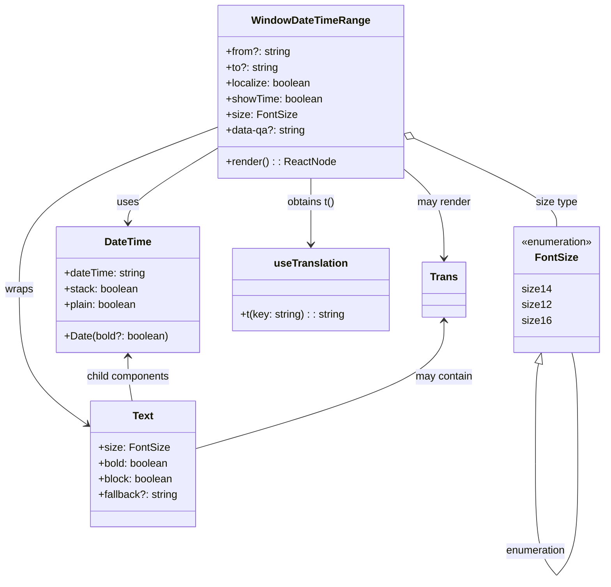

# Diagram: web/portal/src/pages/shipments/components/WindowDateTimeRange.tsx

> Auto-generated by Obscura crawlers

## Mermaid

### SVG

<svg id="container" width="922.9019775390625" xmlns="http://www.w3.org/2000/svg" class="classDiagram" height="886.1499633789062" viewBox="0 0 922.9019775390625 886.1499633789062" role="graphics-document document" aria-roledescription="class"><g><defs><marker id="container_class-aggregationStart" class="marker aggregation class" refX="18" refY="7" markerWidth="190" markerHeight="240" orient="auto"><path d="M 18,7 L9,13 L1,7 L9,1 Z"></path></marker></defs><defs><marker id="container_class-aggregationEnd" class="marker aggregation class" refX="1" refY="7" markerWidth="20" markerHeight="28" orient="auto"><path d="M 18,7 L9,13 L1,7 L9,1 Z"></path></marker></defs><defs><marker id="container_class-extensionStart" class="marker extension class" refX="18" refY="7" markerWidth="190" markerHeight="240" orient="auto"><path d="M 1,7 L18,13 V 1 Z"></path></marker></defs><defs><marker id="container_class-extensionEnd" class="marker extension class" refX="1" refY="7" markerWidth="20" markerHeight="28" orient="auto"><path d="M 1,1 V 13 L18,7 Z"></path></marker></defs><defs><marker id="container_class-compositionStart" class="marker composition class" refX="18" refY="7" markerWidth="190" markerHeight="240" orient="auto"><path d="M 18,7 L9,13 L1,7 L9,1 Z"></path></marker></defs><defs><marker id="container_class-compositionEnd" class="marker composition class" refX="1" refY="7" markerWidth="20" markerHeight="28" orient="auto"><path d="M 18,7 L9,13 L1,7 L9,1 Z"></path></marker></defs><defs><marker id="container_class-dependencyStart" class="marker dependency class" refX="6" refY="7" markerWidth="190" markerHeight="240" orient="auto"><path d="M 5,7 L9,13 L1,7 L9,1 Z"></path></marker></defs><defs><marker id="container_class-dependencyEnd" class="marker dependency class" refX="13" refY="7" markerWidth="20" markerHeight="28" orient="auto"><path d="M 18,7 L9,13 L14,7 L9,1 Z"></path></marker></defs><defs><marker id="container_class-lollipopStart" class="marker lollipop class" refX="13" refY="7" markerWidth="190" markerHeight="240" orient="auto"><circle stroke="black" fill="transparent" cx="7" cy="7" r="6"></circle></marker></defs><defs><marker id="container_class-lollipopEnd" class="marker lollipop class" refX="1" refY="7" markerWidth="190" markerHeight="240" orient="auto"><circle stroke="black" fill="transparent" cx="7" cy="7" r="6"></circle></marker></defs><g class="root"><g class="clusters"></g><g class="edgePaths"><path d="M335.055,223.799L311.674,237.999C288.294,252.199,241.534,280.6,218.154,299.966C194.773,319.333,194.773,329.667,194.773,334.833L194.773,340" id="id_WindowDateTimeRange_DateTime_1" class="edge-thickness-normal edge-pattern-solid relation" style=";;;" data-edge="true" data-et="edge" data-id="id_WindowDateTimeRange_DateTime_1" data-points="W3sieCI6MzM1LjA1NDY4NzUsInkiOjIyMy43OTg5Mjc0NjMzOTQ3Nn0seyJ4IjoxOTQuNzczNDM3NSwieSI6MzA5fSx7IngiOjE5NC43NzM0Mzc1LCJ5IjozNDZ9XQ==" marker-end="url(#container_class-dependencyEnd)"></path><path d="M335.055,192.56L284.111,211.966C233.167,231.373,131.279,270.187,80.335,311.76C29.391,353.333,29.391,397.667,29.391,442C29.391,486.333,29.391,530.667,46.712,565.014C64.033,599.36,98.676,623.721,115.997,635.901L133.318,648.081" id="id_WindowDateTimeRange_Text_2" class="edge-thickness-normal edge-pattern-solid relation" style=";;;" data-edge="true" data-et="edge" data-id="id_WindowDateTimeRange_Text_2" data-points="W3sieCI6MzM1LjA1NDY4NzUsInkiOjE5Mi41NTk2MjM0OTU0MzQ1OH0seyJ4IjoyOS4zOTA2MjUsInkiOjMwOX0seyJ4IjoyOS4zOTA2MjUsInkiOjQ0Mn0seyJ4IjoyOS4zOTA2MjUsInkiOjU3NX0seyJ4IjoxMzguMjI2MTcxODc1MzcyNTMsInkiOjY1MS41MzI3NzMzNTkyNzQ2fV0=" marker-end="url(#container_class-dependencyEnd)"></path><path d="M611,255.928L621.527,264.773C632.055,273.619,653.109,291.309,663.637,314.321C674.164,337.333,674.164,365.667,674.164,379.833L674.164,394" id="id_WindowDateTimeRange_Trans_3" class="edge-thickness-normal edge-pattern-solid relation" style=";;;" data-edge="true" data-et="edge" data-id="id_WindowDateTimeRange_Trans_3" data-points="W3sieCI6NjExLCJ5IjoyNTUuOTI4MDA2ODM2MTQ2MTJ9LHsieCI6Njc0LjE2NDA2MjUsInkiOjMwOX0seyJ4Ijo2NzQuMTY0MDYyNSwieSI6NDAwfV0=" marker-end="url(#container_class-dependencyEnd)"></path><path d="M473.027,272L473.027,278.167C473.027,284.333,473.027,296.667,473.027,313.5C473.027,330.333,473.027,351.667,473.027,362.333L473.027,373" id="id_WindowDateTimeRange_useTranslation_4" class="edge-thickness-normal edge-pattern-solid relation" style=";;;" data-edge="true" data-et="edge" data-id="id_WindowDateTimeRange_useTranslation_4" data-points="W3sieCI6NDczLjAyNzM0Mzc1LCJ5IjoyNzJ9LHsieCI6NDczLjAyNzM0Mzc1LCJ5IjozMDl9LHsieCI6NDczLjAyNzM0Mzc1LCJ5IjozNzl9XQ==" marker-end="url(#container_class-dependencyEnd)"></path><path d="M626.722,209.391L663.493,225.992C700.264,242.594,773.805,275.797,810.576,298.565C847.347,321.333,847.347,333.667,847.347,339.833L847.347,346" id="id_WindowDateTimeRange_FontSize_5" class="edge-thickness-normal edge-pattern-solid relation" style=";;;" data-edge="true" data-et="edge" data-id="id_WindowDateTimeRange_FontSize_5" data-points="W3sieCI6NjExLCJ5IjoyMDIuMjkyNjQ3Mzk0ODQ4OTh9LHsieCI6ODQ3LjM0NzI2NTYyNTM3MjUsInkiOjMwOX0seyJ4Ijo4NDcuMzQ3MjY1NjI1MzcyNSwieSI6MzQ2fV0=" marker-start="url(#container_class-aggregationStart)"></path><path d="M194.773,544L194.773,549.167C194.773,554.333,194.773,564.667,195.875,576C196.976,587.333,199.179,599.667,200.28,605.833L201.382,612" id="id_DateTime_Text_6" class="edge-thickness-normal edge-pattern-solid relation" style=";;;" data-edge="true" data-et="edge" data-id="id_DateTime_Text_6" data-points="W3sieCI6MTk0Ljc3MzQzNzUsInkiOjUzOH0seyJ4IjoxOTQuNzczNDM3NSwieSI6NTc1fSx7IngiOjIwMS4zODE1NTgzODgyNjE1NCwieSI6NjEyfV0=" marker-start="url(#container_class-dependencyStart)"></path><path d="M674.164,490L674.164,504.167C674.164,518.333,674.164,546.667,611.608,579.093C549.052,611.52,423.94,648.04,361.384,666.3L298.828,684.56" id="id_Trans_Text_7" class="edge-thickness-normal edge-pattern-solid relation" style=";;;" data-edge="true" data-et="edge" data-id="id_Trans_Text_7" data-points="W3sieCI6Njc0LjE2NDA2MjUsInkiOjQ4NH0seyJ4Ijo2NzQuMTY0MDYyNSwieSI6NTc1fSx7IngiOjI5OC44Mjc3MzQzNzUzNzI1MywieSI6Njg0LjU2MDI4NTE3NzU4Njd9XQ==" marker-start="url(#container_class-dependencyStart)"></path><path d="M819.127,554.734L818.282,558.111C817.436,561.489,815.745,568.245,814.9,593.781C814.054,619.317,814.054,663.633,814.054,685.792L814.054,707.95" id="FontSize-cyclic-special-1" class="edge-thickness-normal edge-pattern-solid relation" style=";;;" data-edge="true" data-et="edge" data-id="FontSize-cyclic-special-1" data-points="W3sieCI6ODIzLjMxNjI1MDU4Nzc3ODUsInkiOjUzOH0seyJ4Ijo4MTQuMDU0Mjk2ODc1MzcyNSwieSI6NTc1fSx7IngiOjgxNC4wNTQyOTY4NzUzNzI1LCJ5Ijo3MDcuOTQ5OTk5OTk5MjU0OX1d" marker-start="url(#container_class-extensionStart)"></path><path d="M814.054,708.05L814.054,730.208C814.054,752.367,814.054,796.683,819.596,825.008C825.137,853.333,836.22,865.667,841.761,871.833L847.302,878" id="FontSize-cyclic-special-mid" class="edge-thickness-normal edge-pattern-solid relation" style=";;;" data-edge="true" data-et="edge" data-id="FontSize-cyclic-special-mid" data-points="W3sieCI6ODE0LjA1NDI5Njg3NTM3MjUsInkiOjcwOC4wNTAwMDAwMDA3NDUxfSx7IngiOjgxNC4wNTQyOTY4NzUzNzI1LCJ5Ijo4NDF9LHsieCI6ODQ3LjMwMjMzNTg0MjMxNTMsInkiOjg3OH1d"></path><path d="M847.392,878L852.934,871.833C858.475,865.667,869.558,853.333,875.099,825C880.64,796.667,880.64,752.333,880.64,708C880.64,663.667,880.64,619.333,879.097,591C877.553,562.667,874.466,550.333,872.922,544.167L871.378,538" id="FontSize-cyclic-special-2" class="edge-thickness-normal edge-pattern-solid relation" style=";;;" data-edge="true" data-et="edge" data-id="FontSize-cyclic-special-2" data-points="W3sieCI6ODQ3LjM5MjE5NTQwODQyOTgsInkiOjg3OH0seyJ4Ijo4ODAuNjQwMjM0Mzc1MzcyNSwieSI6ODQxfSx7IngiOjg4MC42NDAyMzQzNzUzNzI1LCJ5Ijo3MDh9LHsieCI6ODgwLjY0MDIzNDM3NTM3MjUsInkiOjU3NX0seyJ4Ijo4NzEuMzc4MjgwNjYyOTY2NSwieSI6NTM4fV0="></path></g><g class="edgeLabels"><g class="edgeLabel" transform="translate(194.7734375, 309)"><g class="label" data-id="id_WindowDateTimeRange_DateTime_1" transform="translate(-16.4921875, -12)"><foreignObject width="32.984375" height="24">

uses

</foreignObject></g></g><g class="edgeLabel" transform="translate(29.390625, 442)"><g class="label" data-id="id_WindowDateTimeRange_Text_2" transform="translate(-21.390625, -12)"><foreignObject width="42.78125" height="24">

wraps

</foreignObject></g></g><g class="edgeLabel" transform="translate(674.1640625, 309)"><g class="label" data-id="id_WindowDateTimeRange_Trans_3" transform="translate(-41.2734375, -12)"><foreignObject width="82.546875" height="24">

may render

</foreignObject></g></g><g class="edgeLabel" transform="translate(473.02734375, 309)"><g class="label" data-id="id_WindowDateTimeRange_useTranslation_4" transform="translate(-37.484375, -12)"><foreignObject width="74.96875" height="24">

obtains t()

</foreignObject></g></g><g class="edgeLabel" transform="translate(847.3472656253725, 309)"><g class="label" data-id="id_WindowDateTimeRange_FontSize_5" transform="translate(-31.8125, -12)"><foreignObject width="63.625" height="24">

size type

</foreignObject></g></g><g class="edgeLabel" transform="translate(194.7734375, 575)"><g class="label" data-id="id_DateTime_Text_6" transform="translate(-64.953125, -12)"><foreignObject width="129.90625" height="24">

child components

</foreignObject></g></g><g class="edgeLabel" transform="translate(674.1640625, 575)"><g class="label" data-id="id_Trans_Text_7" transform="translate(-44.296875, -12)"><foreignObject width="88.59375" height="24">

may contain

</foreignObject></g></g><g class="edgeLabel"><g class="label" data-id="FontSize-cyclic-special-1" transform="translate(0, 0)"><foreignObject width="0" height="0">

</foreignObject></g></g><g class="edgeLabel" transform="translate(814.0542968753725, 841)"><g class="label" data-id="FontSize-cyclic-special-mid" transform="translate(-46.5859375, -12)"><foreignObject width="93.171875" height="24">

enumeration

</foreignObject></g></g><g class="edgeLabel"><g class="label" data-id="FontSize-cyclic-special-2" transform="translate(0, 0)"><foreignObject width="0" height="0">

</foreignObject></g></g></g><g class="nodes"><g class="node default" id="classId-WindowDateTimeRange-0" transform="translate(473.02734375, 140)"><g class="basic label-container"><path d="M-137.97265625 -132 L137.97265625 -132 L137.97265625 132 L-137.97265625 132" stroke="none" stroke-width="0" fill="#ECECFF" style=""></path><path d="M-137.97265625 -132 C-49.89642053824561 -132, 38.179815173508786 -132, 137.97265625 -132 M-137.97265625 -132 C-38.501252129226955 -132, 60.97015199154609 -132, 137.97265625 -132 M137.97265625 -132 C137.97265625 -70.12851440986189, 137.97265625 -8.257028819723786, 137.97265625 132 M137.97265625 -132 C137.97265625 -34.510557588950974, 137.97265625 62.97888482209805, 137.97265625 132 M137.97265625 132 C50.185258662955306 132, -37.60213892408939 132, -137.97265625 132 M137.97265625 132 C40.39764601576992 132, -57.177364218460156 132, -137.97265625 132 M-137.97265625 132 C-137.97265625 43.21664547252301, -137.97265625 -45.566709054953975, -137.97265625 -132 M-137.97265625 132 C-137.97265625 31.35789286855814, -137.97265625 -69.28421426288372, -137.97265625 -132" stroke="#9370DB" stroke-width="1.3" fill="none" stroke-dasharray="0 0" style=""></path></g><g class="annotation-group text" transform="translate(0, -108)"></g><g class="label-group text" transform="translate(-86.2421875, -108)"><g class="label" style="font-weight: bolder" transform="translate(0,-12)"><foreignObject width="172.484375" height="24">

WindowDateTimeRange

</foreignObject></g></g><g class="members-group text" transform="translate(-125.97265625, -60)"><g class="label" style="" transform="translate(0,-12)"><foreignObject width="98.4375" height="24">

+from?: string

</foreignObject></g><g class="label" style="" transform="translate(0,12)"><foreignObject width="79.203125" height="24">

+to?: string

</foreignObject></g><g class="label" style="" transform="translate(0,36)"><foreignObject width="130.296875" height="24">

+localize: boolean

</foreignObject></g><g class="label" style="" transform="translate(0,60)"><foreignObject width="148.390625" height="24">

+showTime: boolean

</foreignObject></g><g class="label" style="" transform="translate(0,84)"><foreignObject width="104.28125" height="24">

+size: FontSize

</foreignObject></g><g class="label" style="" transform="translate(0,108)"><foreignObject width="121.765625" height="24">

+data-qa?: string

</foreignObject></g></g><g class="methods-group text" transform="translate(-125.97265625, 108)"><g class="label" style="" transform="translate(0,-12)"><foreignObject width="165.703125" height="24">

+render() : : ReactNode

</foreignObject></g></g><g class="divider" style=""><path d="M-137.97265625 -84 C-69.39881658520548 -84, -0.8249769204109612 -84, 137.97265625 -84 M-137.97265625 -84 C-63.81197809112331 -84, 10.348700067753384 -84, 137.97265625 -84" stroke="#9370DB" stroke-width="1.3" fill="none" stroke-dasharray="0 0" style=""></path></g><g class="divider" style=""><path d="M-137.97265625 84 C-37.908070863600926 84, 62.15651452279815 84, 137.97265625 84 M-137.97265625 84 C-67.33890784375392 84, 3.294840562492169 84, 137.97265625 84" stroke="#9370DB" stroke-width="1.3" fill="none" stroke-dasharray="0 0" style=""></path></g></g><g class="node default" id="classId-DateTime-1" transform="translate(194.7734375, 442)"><g class="basic label-container"><path d="M-108.9921875 -96 L108.9921875 -96 L108.9921875 96 L-108.9921875 96" stroke="none" stroke-width="0" fill="#ECECFF" style=""></path><path d="M-108.9921875 -96 C-47.40984090817347 -96, 14.172505683653057 -96, 108.9921875 -96 M-108.9921875 -96 C-32.21128101393187 -96, 44.569625472136266 -96, 108.9921875 -96 M108.9921875 -96 C108.9921875 -26.956671830590693, 108.9921875 42.086656338818614, 108.9921875 96 M108.9921875 -96 C108.9921875 -46.139777267698136, 108.9921875 3.7204454646037277, 108.9921875 96 M108.9921875 96 C52.34430892058633 96, -4.303569658827342 96, -108.9921875 96 M108.9921875 96 C49.22518932185335 96, -10.5418088562933 96, -108.9921875 96 M-108.9921875 96 C-108.9921875 47.70436182299453, -108.9921875 -0.5912763540109438, -108.9921875 -96 M-108.9921875 96 C-108.9921875 33.440458845376355, -108.9921875 -29.11908230924729, -108.9921875 -96" stroke="#9370DB" stroke-width="1.3" fill="none" stroke-dasharray="0 0" style=""></path></g><g class="annotation-group text" transform="translate(0, -72)"></g><g class="label-group text" transform="translate(-34.625, -72)"><g class="label" style="font-weight: bolder" transform="translate(0,-12)"><foreignObject width="69.25" height="24">

DateTime

</foreignObject></g></g><g class="members-group text" transform="translate(-96.9921875, -24)"><g class="label" style="" transform="translate(0,-12)"><foreignObject width="125.453125" height="24">

+dateTime: string

</foreignObject></g><g class="label" style="" transform="translate(0,12)"><foreignObject width="113.25" height="24">

+stack: boolean

</foreignObject></g><g class="label" style="" transform="translate(0,36)"><foreignObject width="112.21875" height="24">

+plain: boolean

</foreignObject></g></g><g class="methods-group text" transform="translate(-96.9921875, 72)"><g class="label" style="" transform="translate(0,-12)"><foreignObject width="159.359375" height="24">

+Date(bold?: boolean)

</foreignObject></g></g><g class="divider" style=""><path d="M-108.9921875 -48 C-49.57741925368064 -48, 9.837348992638724 -48, 108.9921875 -48 M-108.9921875 -48 C-36.89657910752993 -48, 35.19902928494014 -48, 108.9921875 -48" stroke="#9370DB" stroke-width="1.3" fill="none" stroke-dasharray="0 0" style=""></path></g><g class="divider" style=""><path d="M-108.9921875 48 C-51.32817378148876 48, 6.3358399370224845 48, 108.9921875 48 M-108.9921875 48 C-22.07667241412257 48, 64.83884267175486 48, 108.9921875 48" stroke="#9370DB" stroke-width="1.3" fill="none" stroke-dasharray="0 0" style=""></path></g></g><g class="node default" id="classId-Text-2" transform="translate(218.52695312537253, 708)"><g class="basic label-container"><path d="M-80.30078125 -96 L80.30078125 -96 L80.30078125 96 L-80.30078125 96" stroke="none" stroke-width="0" fill="#ECECFF" style=""></path><path d="M-80.30078125 -96 C-21.552726742015757 -96, 37.195327765968486 -96, 80.30078125 -96 M-80.30078125 -96 C-41.473423754942495 -96, -2.6460662598849893 -96, 80.30078125 -96 M80.30078125 -96 C80.30078125 -23.38675256455008, 80.30078125 49.22649487089984, 80.30078125 96 M80.30078125 -96 C80.30078125 -47.174388480315685, 80.30078125 1.651223039368631, 80.30078125 96 M80.30078125 96 C44.98674564692032 96, 9.672710043840638 96, -80.30078125 96 M80.30078125 96 C28.705444295010516 96, -22.88989265997897 96, -80.30078125 96 M-80.30078125 96 C-80.30078125 25.77898237431009, -80.30078125 -44.44203525137982, -80.30078125 -96 M-80.30078125 96 C-80.30078125 53.94794355965867, -80.30078125 11.895887119317337, -80.30078125 -96" stroke="#9370DB" stroke-width="1.3" fill="none" stroke-dasharray="0 0" style=""></path></g><g class="annotation-group text" transform="translate(0, -72)"></g><g class="label-group text" transform="translate(-15.3828125, -72)"><g class="label" style="font-weight: bolder" transform="translate(0,-12)"><foreignObject width="30.765625" height="24">

Text

</foreignObject></g></g><g class="members-group text" transform="translate(-68.30078125, -24)"><g class="label" style="" transform="translate(0,-12)"><foreignObject width="104.28125" height="24">

+size: FontSize

</foreignObject></g><g class="label" style="" transform="translate(0,12)"><foreignObject width="108.53125" height="24">

+bold: boolean

</foreignObject></g><g class="label" style="" transform="translate(0,36)"><foreignObject width="114.875" height="24">

+block: boolean

</foreignObject></g><g class="label" style="" transform="translate(0,60)"><foreignObject width="121.21875" height="24">

+fallback?: string

</foreignObject></g></g><g class="methods-group text" transform="translate(-68.30078125, 96)"></g><g class="divider" style=""><path d="M-80.30078125 -48 C-25.534955820637414 -48, 29.230869608725172 -48, 80.30078125 -48 M-80.30078125 -48 C-31.225141359975815 -48, 17.85049853004837 -48, 80.30078125 -48" stroke="#9370DB" stroke-width="1.3" fill="none" stroke-dasharray="0 0" style=""></path></g><g class="divider" style=""><path d="M-80.30078125 72 C-41.34320245429403 72, -2.3856236585880595 72, 80.30078125 72 M-80.30078125 72 C-23.113498969766 72, 34.073783310468 72, 80.30078125 72" stroke="#9370DB" stroke-width="1.3" fill="none" stroke-dasharray="0 0" style=""></path></g></g><g class="node default" id="classId-Trans-3" transform="translate(674.1640625, 442)"><g class="basic label-container"><path d="M-31.875 -42 L31.875 -42 L31.875 42 L-31.875 42" stroke="none" stroke-width="0" fill="#ECECFF" style=""></path><path d="M-31.875 -42 C-18.007568350541924 -42, -4.140136701083847 -42, 31.875 -42 M-31.875 -42 C-15.870680301845823 -42, 0.13363939630835375 -42, 31.875 -42 M31.875 -42 C31.875 -12.587930406151052, 31.875 16.824139187697895, 31.875 42 M31.875 -42 C31.875 -21.880989521326196, 31.875 -1.761979042652392, 31.875 42 M31.875 42 C9.204448329166748 42, -13.466103341666503 42, -31.875 42 M31.875 42 C7.275837357820535 42, -17.32332528435893 42, -31.875 42 M-31.875 42 C-31.875 17.33354529593345, -31.875 -7.332909408133098, -31.875 -42 M-31.875 42 C-31.875 16.793194858706883, -31.875 -8.413610282586234, -31.875 -42" stroke="#9370DB" stroke-width="1.3" fill="none" stroke-dasharray="0 0" style=""></path></g><g class="annotation-group text" transform="translate(0, -18)"></g><g class="label-group text" transform="translate(-19.875, -18)"><g class="label" style="font-weight: bolder" transform="translate(0,-12)"><foreignObject width="39.75" height="24">

Trans

</foreignObject></g></g><g class="members-group text" transform="translate(-19.875, 30)"></g><g class="methods-group text" transform="translate(-19.875, 60)"></g><g class="divider" style=""><path d="M-31.875 6 C-7.709050489176178 6, 16.456899021647644 6, 31.875 6 M-31.875 6 C-9.741643775805152 6, 12.391712448389697 6, 31.875 6" stroke="#9370DB" stroke-width="1.3" fill="none" stroke-dasharray="0 0" style=""></path></g><g class="divider" style=""><path d="M-31.875 24 C-18.155766061287117 24, -4.436532122574231 24, 31.875 24 M-31.875 24 C-18.06024715748677 24, -4.245494314973545 24, 31.875 24" stroke="#9370DB" stroke-width="1.3" fill="none" stroke-dasharray="0 0" style=""></path></g></g><g class="node default" id="classId-useTranslation-4" transform="translate(473.02734375, 442)"><g class="basic label-container"><path d="M-119.26171875 -63 L119.26171875 -63 L119.26171875 63 L-119.26171875 63" stroke="none" stroke-width="0" fill="#ECECFF" style=""></path><path d="M-119.26171875 -63 C-66.37937437322182 -63, -13.49702999644363 -63, 119.26171875 -63 M-119.26171875 -63 C-27.48202140915845 -63, 64.2976759316831 -63, 119.26171875 -63 M119.26171875 -63 C119.26171875 -33.01680160472934, 119.26171875 -3.0336032094586756, 119.26171875 63 M119.26171875 -63 C119.26171875 -34.20479604382734, 119.26171875 -5.40959208765468, 119.26171875 63 M119.26171875 63 C34.236578533671974 63, -50.78856168265605 63, -119.26171875 63 M119.26171875 63 C46.715562015677435 63, -25.83059471864513 63, -119.26171875 63 M-119.26171875 63 C-119.26171875 29.416127968729853, -119.26171875 -4.167744062540294, -119.26171875 -63 M-119.26171875 63 C-119.26171875 16.416447353525022, -119.26171875 -30.167105292949955, -119.26171875 -63" stroke="#9370DB" stroke-width="1.3" fill="none" stroke-dasharray="0 0" style=""></path></g><g class="annotation-group text" transform="translate(0, -39)"></g><g class="label-group text" transform="translate(-54.0859375, -39)"><g class="label" style="font-weight: bolder" transform="translate(0,-12)"><foreignObject width="108.171875" height="24">

useTranslation

</foreignObject></g></g><g class="members-group text" transform="translate(-107.26171875, 9)"></g><g class="methods-group text" transform="translate(-107.26171875, 39)"><g class="label" style="" transform="translate(0,-12)"><foreignObject width="160.4375" height="24">

+t(key: string) : : string

</foreignObject></g></g><g class="divider" style=""><path d="M-119.26171875 -15 C-45.97727255690161 -15, 27.30717363619678 -15, 119.26171875 -15 M-119.26171875 -15 C-33.70173477705862 -15, 51.85824919588276 -15, 119.26171875 -15" stroke="#9370DB" stroke-width="1.3" fill="none" stroke-dasharray="0 0" style=""></path></g><g class="divider" style=""><path d="M-119.26171875 9 C-68.1754308376463 9, -17.08914292529262 9, 119.26171875 9 M-119.26171875 9 C-71.42965842620005 9, -23.5975981024001 9, 119.26171875 9" stroke="#9370DB" stroke-width="1.3" fill="none" stroke-dasharray="0 0" style=""></path></g></g><g class="node default" id="classId-FontSize-5" transform="translate(847.3472656253725, 442)"><g class="basic label-container"><path d="M-67.5546875 -96 L67.5546875 -96 L67.5546875 96 L-67.5546875 96" stroke="none" stroke-width="0" fill="#ECECFF" style=""></path><path d="M-67.5546875 -96 C-32.03317281859952 -96, 3.488341862800965 -96, 67.5546875 -96 M-67.5546875 -96 C-19.974636471552074 -96, 27.60541455689585 -96, 67.5546875 -96 M67.5546875 -96 C67.5546875 -39.21137457886066, 67.5546875 17.577250842278687, 67.5546875 96 M67.5546875 -96 C67.5546875 -21.29034671065496, 67.5546875 53.41930657869008, 67.5546875 96 M67.5546875 96 C27.495459004303015 96, -12.56376949139397 96, -67.5546875 96 M67.5546875 96 C14.96065612542477 96, -37.63337524915046 96, -67.5546875 96 M-67.5546875 96 C-67.5546875 31.531284095693493, -67.5546875 -32.93743180861301, -67.5546875 -96 M-67.5546875 96 C-67.5546875 27.625656473944048, -67.5546875 -40.748687052111904, -67.5546875 -96" stroke="#9370DB" stroke-width="1.3" fill="none" stroke-dasharray="0 0" style=""></path></g><g class="annotation-group text" transform="translate(-55.5546875, -72)"><g class="label" style="" transform="translate(0,-12)"><foreignObject width="111.109375" height="24">

«enumeration»

</foreignObject></g></g><g class="label-group text" transform="translate(-30.84375, -48)"><g class="label" style="font-weight: bolder" transform="translate(0,-12)"><foreignObject width="61.6875" height="24">

FontSize

</foreignObject></g></g><g class="members-group text" transform="translate(-55.5546875, 0)"><g class="label" style="" transform="translate(0,-12)"><foreignObject width="42.234375" height="24">

size14

</foreignObject></g><g class="label" style="" transform="translate(0,12)"><foreignObject width="41.640625" height="24">

size12

</foreignObject></g><g class="label" style="" transform="translate(0,36)"><foreignObject width="42.25" height="24">

size16

</foreignObject></g></g><g class="methods-group text" transform="translate(-55.5546875, 96)"></g><g class="divider" style=""><path d="M-67.5546875 -24 C-33.98070894548089 -24, -0.40673039096178343 -24, 67.5546875 -24 M-67.5546875 -24 C-33.11957507937225 -24, 1.3155373412555065 -24, 67.5546875 -24" stroke="#9370DB" stroke-width="1.3" fill="none" stroke-dasharray="0 0" style=""></path></g><g class="divider" style=""><path d="M-67.5546875 72 C-21.627953449191885 72, 24.29878060161623 72, 67.5546875 72 M-67.5546875 72 C-23.309980192270004 72, 20.934727115459992 72, 67.5546875 72" stroke="#9370DB" stroke-width="1.3" fill="none" stroke-dasharray="0 0" style=""></path></g></g><g class="label edgeLabel" id="FontSize---FontSize---1" transform="translate(814.0542968753725, 708)"><rect width="0.1" height="0.1"></rect><g class="label" style="" transform="translate(0, 0)"><rect></rect><foreignObject width="0" height="0">

</foreignObject></g></g><g class="label edgeLabel" id="FontSize---FontSize---2" transform="translate(847.3472656253725, 878.0500000007451)"><rect width="0.1" height="0.1"></rect><g class="label" style="" transform="translate(0, 0)"><rect></rect><foreignObject width="0" height="0">

</foreignObject></g></g></g></g></g></svg>
