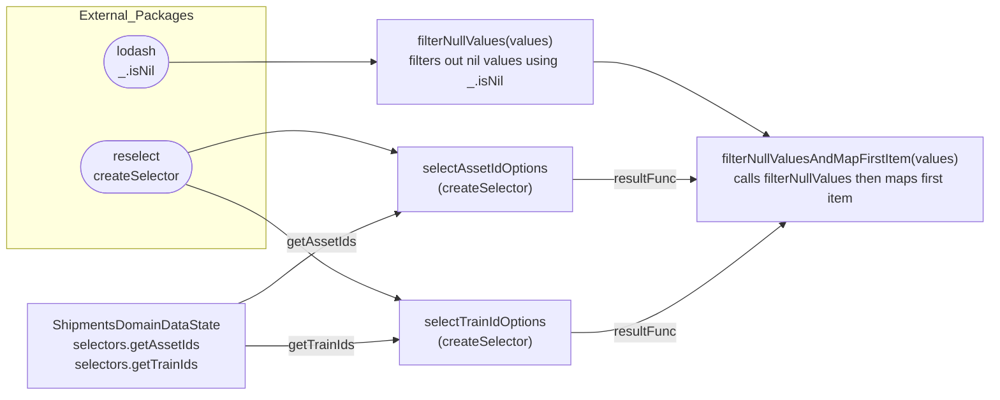

# Diagram: web/portal/src/pages/shipments/components/search/Shipments.SearchCategorySelectors.js

> Auto-generated by Obscura crawlers

## Mermaid

### SVG

<svg id="container" width="1672.46875" xmlns="http://www.w3.org/2000/svg" class="flowchart" height="363" viewBox="0 0 1672.46875 363" role="graphics-document document" aria-roledescription="flowchart-v2"><g><marker id="container_flowchart-v2-pointEnd" class="marker flowchart-v2" viewBox="0 0 10 10" refX="5" refY="5" markerUnits="userSpaceOnUse" markerWidth="8" markerHeight="8" orient="auto"><path d="M 0 0 L 10 5 L 0 10 z" class="arrowMarkerPath" style="stroke-width: 1; stroke-dasharray: 1, 0;"></path></marker><marker id="container_flowchart-v2-pointStart" class="marker flowchart-v2" viewBox="0 0 10 10" refX="4.5" refY="5" markerUnits="userSpaceOnUse" markerWidth="8" markerHeight="8" orient="auto"><path d="M 0 5 L 10 10 L 10 0 z" class="arrowMarkerPath" style="stroke-width: 1; stroke-dasharray: 1, 0;"></path></marker><marker id="container_flowchart-v2-circleEnd" class="marker flowchart-v2" viewBox="0 0 10 10" refX="11" refY="5" markerUnits="userSpaceOnUse" markerWidth="11" markerHeight="11" orient="auto"><circle cx="5" cy="5" r="5" class="arrowMarkerPath" style="stroke-width: 1; stroke-dasharray: 1, 0;"></circle></marker><marker id="container_flowchart-v2-circleStart" class="marker flowchart-v2" viewBox="0 0 10 10" refX="-1" refY="5" markerUnits="userSpaceOnUse" markerWidth="11" markerHeight="11" orient="auto"><circle cx="5" cy="5" r="5" class="arrowMarkerPath" style="stroke-width: 1; stroke-dasharray: 1, 0;"></circle></marker><marker id="container_flowchart-v2-crossEnd" class="marker cross flowchart-v2" viewBox="0 0 11 11" refX="12" refY="5.2" markerUnits="userSpaceOnUse" markerWidth="11" markerHeight="11" orient="auto"><path d="M 1,1 l 9,9 M 10,1 l -9,9" class="arrowMarkerPath" style="stroke-width: 2; stroke-dasharray: 1, 0;"></path></marker><marker id="container_flowchart-v2-crossStart" class="marker cross flowchart-v2" viewBox="0 0 11 11" refX="-1" refY="5.2" markerUnits="userSpaceOnUse" markerWidth="11" markerHeight="11" orient="auto"><path d="M 1,1 l 9,9 M 10,1 l -9,9" class="arrowMarkerPath" style="stroke-width: 2; stroke-dasharray: 1, 0;"></path></marker><g class="root"><g class="clusters"><g class="cluster" id="External_Packages" data-look="classic"><rect style="" x="8" y="8" width="649" height="241"></rect><g class="cluster-label" transform="translate(265.8984375, 8)"><foreignObject width="133.203125" height="24">

External_Packages

</foreignObject></g></g></g><g class="edgePaths"><path d="M400.529,63L443.274,62.917C486.019,62.833,571.51,62.667,625.32,62.583C679.13,62.5,701.26,62.5,727.171,62.5C753.081,62.5,782.771,62.5,797.616,62.5L812.461,62.5" id="L_LODASH_F1_0" class="edge-thickness-normal edge-pattern-solid edge-thickness-normal edge-pattern-solid flowchart-link" style=";" data-edge="true" data-et="edge" data-id="L_LODASH_F1_0" data-points="W3sieCI6NDAwLjUyOTA0MjMyNjg0NDY2LCJ5Ijo2My4wMDAwMDAwMDAwMDAwMX0seyJ4Ijo2NTcsInkiOjYyLjV9LHsieCI6NzIzLjM5MDYyNSwieSI6NjIuNX0seyJ4Ijo4MTYuNDYwOTM3NSwieSI6NjIuNX1d" marker-end="url(#container_flowchart-v2-pointEnd)"></path><path d="M1107.602,62.5L1122.487,62.5C1137.372,62.5,1167.143,62.5,1210.746,75.066C1254.348,87.632,1311.783,112.764,1340.5,125.33L1369.217,137.896" id="L_F1_F2_0" class="edge-thickness-normal edge-pattern-solid edge-thickness-normal edge-pattern-solid flowchart-link" style=";" data-edge="true" data-et="edge" data-id="L_F1_F2_0" data-points="W3sieCI6MTEwNy42MDE1NjI1LCJ5Ijo2Mi41fSx7IngiOjExOTYuOTE0MDYyNSwieSI6NjIuNX0seyJ4IjoxMzcyLjg4MTQ2NTUxNzI0MTQsInkiOjEzOS41fV0=" marker-end="url(#container_flowchart-v2-pointEnd)"></path><path d="M428.666,164.849L466.722,159.124C504.777,153.399,580.889,141.95,630.009,136.225C679.13,130.5,701.26,130.5,729.073,133.869C756.885,137.237,790.38,143.974,807.127,147.343L823.874,150.711" id="L_RESELECT_S1_0" class="edge-thickness-normal edge-pattern-solid edge-thickness-normal edge-pattern-solid flowchart-link" style=";" data-edge="true" data-et="edge" data-id="L_RESELECT_S1_0" data-points="W3sieCI6NDI4LjY2NjA1MzQ4Mjc1MjQsInkiOjE2NC44NDkwODkxNjEyNTY5OH0seyJ4Ijo2NTcsInkiOjEzMC41fSx7IngiOjcyMy4zOTA2MjUsInkiOjEzMC41fSx7IngiOjgyNy43OTU4OTg0Mzc1LCJ5IjoxNTEuNX1d" marker-end="url(#container_flowchart-v2-pointEnd)"></path><path d="M431.916,189.135L469.43,192.905C506.944,196.674,581.972,204.212,630.551,217.481C679.13,230.75,701.26,249.75,733.016,264.3C764.771,278.85,806.151,288.951,826.841,294.001L847.531,299.051" id="L_RESELECT_S2_0" class="edge-thickness-normal edge-pattern-solid edge-thickness-normal edge-pattern-solid flowchart-link" style=";" data-edge="true" data-et="edge" data-id="L_RESELECT_S2_0" data-points="W3sieCI6NDMxLjkxNTY2ODU2NTk4MDUsInkiOjE4OS4xMzU0MjY3NDgyODYxfSx7IngiOjY1NywieSI6MjExLjc1fSx7IngiOjcyMy4zOTA2MjUsInkiOjI2OC43NX0seyJ4Ijo4NTEuNDE2NzExMzczMzkwNSwieSI6MzAwfV0=" marker-end="url(#container_flowchart-v2-pointEnd)"></path><path d="M569.297,300L583.914,298.333C598.532,296.667,627.766,293.333,653.448,282.792C679.13,272.25,701.26,254.5,733.016,240.575C764.771,226.65,806.151,216.549,826.841,211.499L847.531,206.449" id="L_SD_S1_0" class="edge-thickness-normal edge-pattern-solid edge-thickness-normal edge-pattern-solid flowchart-link" style=";" data-edge="true" data-et="edge" data-id="L_SD_S1_0" data-points="W3sieCI6NTY5LjI5NzI5NzI5NzI5NzMsInkiOjMwMH0seyJ4Ijo2NTcsInkiOjI5MH0seyJ4Ijo3MjMuMzkwNjI1LCJ5IjoyMzYuNzV9LHsieCI6ODUxLjQxNjcxMTM3MzM5MDUsInkiOjIwNS41fV0=" marker-end="url(#container_flowchart-v2-pointEnd)"></path><path d="M632,341.767L636.167,341.973C640.333,342.178,648.667,342.589,663.898,342.795C679.13,343,701.26,343,722.929,342.289C744.597,341.578,765.803,340.156,776.406,339.446L787.009,338.735" id="L_SD_S2_0" class="edge-thickness-normal edge-pattern-solid edge-thickness-normal edge-pattern-solid flowchart-link" style=";" data-edge="true" data-et="edge" data-id="L_SD_S2_0" data-points="W3sieCI6NjMyLCJ5IjozNDEuNzY3MzM0MzYwNTU0N30seyJ4Ijo2NTcsInkiOjM0M30seyJ4Ijo3MjMuMzkwNjI1LCJ5IjozNDN9LHsieCI6NzkxLCJ5IjozMzguNDY3MDMzMzI2Nzg1ODR9XQ==" marker-end="url(#container_flowchart-v2-pointEnd)"></path><path d="M1134.281,178.5L1144.72,178.5C1155.159,178.5,1176.036,178.5,1196.247,178.5C1216.458,178.5,1236.003,178.5,1245.775,178.5L1255.547,178.5" id="L_S1_F2_0" class="edge-thickness-normal edge-pattern-solid edge-thickness-normal edge-pattern-solid flowchart-link" style=";" data-edge="true" data-et="edge" data-id="L_S1_F2_0" data-points="W3sieCI6MTEzNC4yODEyNSwieSI6MTc4LjV9LHsieCI6MTE5Ni45MTQwNjI1LCJ5IjoxNzguNX0seyJ4IjoxMjU5LjU0Njg3NSwieSI6MTc4LjV9XQ==" marker-end="url(#container_flowchart-v2-pointEnd)"></path><path d="M1133.063,327L1143.704,327C1154.346,327,1175.63,327,1218.269,309.076C1260.909,291.152,1324.903,255.303,1356.9,237.379L1388.897,219.455" id="L_S2_F2_0" class="edge-thickness-normal edge-pattern-solid edge-thickness-normal edge-pattern-solid flowchart-link" style=";" data-edge="true" data-et="edge" data-id="L_S2_F2_0" data-points="W3sieCI6MTEzMy4wNjI1LCJ5IjozMjd9LHsieCI6MTE5Ni45MTQwNjI1LCJ5IjozMjd9LHsieCI6MTM5Mi4zODcyMzE2OTE5MTkyLCJ5IjoyMTcuNX1d" marker-end="url(#container_flowchart-v2-pointEnd)"></path></g><g class="edgeLabels"><g class="edgeLabel"><g class="label" data-id="L_LODASH_F1_0" transform="translate(0, 0)"><foreignObject width="0" height="0">

</foreignObject></g></g><g class="edgeLabel"><g class="label" data-id="L_F1_F2_0" transform="translate(0, 0)"><foreignObject width="0" height="0">

</foreignObject></g></g><g class="edgeLabel"><g class="label" data-id="L_RESELECT_S1_0" transform="translate(0, 0)"><foreignObject width="0" height="0">

</foreignObject></g></g><g class="edgeLabel"><g class="label" data-id="L_RESELECT_S2_0" transform="translate(0, 0)"><foreignObject width="0" height="0">

</foreignObject></g></g><g class="edgeLabel" transform="translate(707.16746, 249.76213)"><g class="label" data-id="L_SD_S1_0" transform="translate(-41.390625, -12)"><foreignObject width="82.78125" height="24">

getAssetIds

</foreignObject></g></g><g class="edgeLabel" transform="translate(723.390625, 343)"><g class="label" data-id="L_SD_S2_0" transform="translate(-40.1640625, -12)"><foreignObject width="80.328125" height="24">

getTrainIds

</foreignObject></g></g><g class="edgeLabel" transform="translate(1196.9140625, 178.5)"><g class="label" data-id="L_S1_F2_0" transform="translate(-37.6328125, -12)"><foreignObject width="75.265625" height="24">

resultFunc

</foreignObject></g></g><g class="edgeLabel" transform="translate(1196.9140625, 327)"><g class="label" data-id="L_S2_F2_0" transform="translate(-37.6328125, -12)"><foreignObject width="75.265625" height="24">

resultFunc

</foreignObject></g></g></g><g class="nodes"><g class="node default" id="flowchart-LODASH-0" transform="translate(332.5, 62.5)"><g class="basic label-container outer-path"><path d="M-48.0390625 -19.5 C-26.224947341606086 -19.5, -4.410832183212172 -19.5, 48.0390625 -19.5 C48.0390625 -19.5, 48.0390625 -19.5, 48.0390625 -19.5 C48.4650893551973 -19.48633814796479, 48.89111621039459 -19.47267629592958, 49.2884317896239 -19.45993515863156 C49.61011274390613 -19.428902983849902, 49.93179369818836 -19.397870809068245, 50.532667152847864 -19.3399052695533 C50.93904382095033 -19.27420544135262, 51.34542048905279 -19.208505613151946, 51.76665575967676 -19.140403561325776 C52.180854488616504 -19.045865404344585, 52.59505321755625 -18.95132724736339, 52.98532688623539 -18.862249829261074 C53.354990950144995 -18.752535475498973, 53.7246550140546 -18.642821121736873, 54.183672751460605 -18.50658706670804 C54.63582448098311 -18.34019105059899, 55.087976210505616 -18.173795034489935, 55.3567690951478 -18.074876768247425 C55.80498215064492 -17.87646614434674, 56.253195206142045 -17.678055520446055, 56.49979541279238 -17.568892924097174 C56.91019405171854 -17.354788217042273, 57.320592690644695 -17.140683509987372, 57.60805476407678 -16.990714730406097 C57.89512008845226 -16.816694043786587, 58.182185412827735 -16.642673357167073, 58.6769930736057 -16.342718045390892 C59.000438558132274 -16.11709647711451, 59.323884042658854 -15.891474908838127, 59.70221784457871 -15.627565626425154 C60.09000414754354 -15.318316369237616, 60.47779045050836 -15.009067112050076, 60.679516208501866 -14.848196188198123 C60.98954818167346 -14.566633353160181, 61.29958015484506 -14.285070518122238, 61.60487223676799 -14.007812326905688 C61.94443810069462 -13.657182693525534, 62.28400396462125 -13.306553060145381, 62.47448344296865 -13.10986736009568 C62.753692584113956 -12.781892415456202, 63.03290172525926 -12.453917470816725, 63.28477640812658 -12.158051136245305 C63.560123004771654 -11.789111781331904, 63.83546960141672 -11.420172426418503, 64.03242146464063 -11.156274872382312 C64.26909096213332 -10.792686969574977, 64.505760459626 -10.429099066767641, 64.71434637860425 -10.108655082055241 C64.91235027473415 -9.757079114407965, 65.11035417086406 -9.40550314676069, 65.3277489742735 -9.019496659696287 C65.4583043051906 -8.748395721610368, 65.58885963610768 -8.477294783524448, 65.87010864880834 -7.893275190886684 C65.9879111148794 -7.602300822135441, 66.10571358095045 -7.311326453384198, 66.33919672997033 -6.734618561215508 C66.4825133229867 -6.302971817448286, 66.6258299160031 -5.8713250736810645, 66.73308563421489 -5.548287939305138 C66.8409074693358 -5.137116551710135, 66.94872930445672 -4.7259451641151315, 67.05015678754556 -4.339158212148133 C67.1011421308093 -4.077359250244977, 67.15212747407303 -3.8155602883418207, 67.28910727658177 -3.1121979531509023 C67.3330509381776 -2.7713795914711445, 67.37699459977344 -2.4305612297913872, 67.44895520250937 -1.872449005199798 C67.47857816075694 -1.4110475192724459, 67.5082011190045 -0.9496460333450936, 67.52904371591342 -0.6250057626472757 C67.52904371591342 -0.29618515909901727, 67.52904371591342 0.03263544444924116, 67.52904371591342 0.625005762647271 C67.50465900606005 1.0048173015969764, 67.48027429620669 1.3846288405466813, 67.44895520250937 1.8724490051997846 C67.39838952136198 2.264626442855769, 67.34782384021459 2.656803880511754, 67.28910727658177 3.1121979531508885 C67.19910051076026 3.574363672707712, 67.10909374493873 4.036529392264536, 67.05015678754556 4.339158212148129 C66.97859431501688 4.612056935271765, 66.90703184248821 4.884955658395402, 66.73308563421489 5.548287939305125 C66.63133369649762 5.854748563739877, 66.52958175878035 6.161209188174628, 66.33919672997033 6.734618561215495 C66.19082963450052 7.101088155508563, 66.04246253903072 7.467557749801631, 65.87010864880834 7.893275190886679 C65.688491857146 8.27040634475034, 65.50687506548367 8.647537498614001, 65.3277489742735 9.019496659696284 C65.1918407889793 9.260815404882209, 65.05593260368511 9.502134150068136, 64.71434637860425 10.108655082055236 C64.47395700488474 10.477957713673606, 64.23356763116523 10.847260345291977, 64.03242146464065 11.156274872382301 C63.82284313147689 11.437090745842806, 63.61326479831313 11.717906619303308, 63.28477640812658 12.158051136245302 C62.98633140771908 12.508621615725561, 62.687886407311574 12.859192095205819, 62.47448344296866 13.10986736009567 C62.16409333133241 13.430370633862195, 61.85370321969616 13.75087390762872, 61.60487223676799 14.007812326905684 C61.36230922018973 14.228101640696329, 61.11974620361147 14.448390954486975, 60.67951620850189 14.848196188198111 C60.42095296793474 15.054393491893613, 60.16238972736758 15.260590795589115, 59.70221784457871 15.627565626425152 C59.323818531122484 15.89152060684995, 58.945419217666256 16.155475587274747, 58.67699307360571 16.34271804539089 C58.45070976250939 16.479892318365813, 58.22442645141308 16.61706659134074, 57.60805476407678 16.990714730406093 C57.231019883928695 17.187413585876985, 56.85398500378061 17.384112441347877, 56.49979541279239 17.56889292409717 C56.214475448941464 17.695195608377965, 55.92915548509054 17.821498292658756, 55.356769095147804 18.07487676824742 C54.89310451135415 18.245509621151914, 54.429439927560495 18.416142474056407, 54.18367275146062 18.506587066708033 C53.739254377230424 18.638488107379906, 53.29483600300023 18.77038914805178, 52.98532688623541 18.86224982926107 C52.70447505879932 18.926352426143907, 52.423623231363216 18.990455023026744, 51.766655759676766 19.140403561325773 C51.45516797772323 19.190762490288193, 51.14368019576969 19.241121419250614, 50.53266715284788 19.3399052695533 C50.140710438480795 19.377716862391374, 49.748753724113705 19.415528455229452, 49.2884317896239 19.45993515863156 C48.969324150978565 19.470168319497578, 48.65021651233322 19.480401480363593, 48.03906250000001 19.5 C48.03906250000001 19.5, 48.03906250000001 19.5, 48.0390625 19.5 C12.542475227006783 19.5, -22.954112045986435 19.5, -48.03906249999999 19.5 C-48.46947859481523 19.486197393593383, -48.899894689630464 19.47239478718676, -49.28843178962389 19.45993515863156 C-49.56784186026484 19.4329808051566, -49.84725193090579 19.406026451681644, -50.53266715284787 19.3399052695533 C-51.022449919413745 19.26072099017701, -51.51223268597961 19.181536710800724, -51.76665575967676 19.140403561325773 C-52.244992359728315 19.031226353802033, -52.72332895977986 18.922049146278297, -52.985326886235384 18.862249829261074 C-53.39622764906731 18.740296639714675, -53.80712841189925 18.61834345016828, -54.18367275146059 18.506587066708043 C-54.57857189011458 18.361260533275754, -54.97347102876857 18.215933999843465, -55.3567690951478 18.074876768247425 C-55.71040810330764 17.918331269663515, -56.06404711146749 17.761785771079605, -56.49979541279238 17.568892924097174 C-56.794845834730275 17.41496530796099, -57.08989625666817 17.261037691824804, -57.60805476407678 16.990714730406097 C-57.95716248504317 16.77908357837158, -58.30627020600956 16.567452426337066, -58.676993073605686 16.3427180453909 C-59.04629802477954 16.085106898405694, -59.41560297595339 15.82749575142049, -59.70221784457871 15.627565626425156 C-59.977282932450684 15.408208538636657, -60.25234802032266 15.188851450848158, -60.679516208501866 14.848196188198125 C-61.037183684889285 14.52337204950592, -61.394851161276705 14.198547910813714, -61.604872236767974 14.007812326905697 C-61.87481723766728 13.729071950580419, -62.14476223856658 13.450331574255143, -62.474483442968655 13.109867360095677 C-62.65158072676871 12.901838813423213, -62.82867801056876 12.693810266750749, -63.284776408126575 12.158051136245307 C-63.47998008139066 11.896495997491915, -63.67518375465474 11.634940858738522, -64.03242146464063 11.156274872382316 C-64.29850004492238 10.747506720966522, -64.56457862520412 10.338738569550728, -64.71434637860425 10.108655082055249 C-64.93065575058912 9.724575888397036, -65.146965122574 9.340496694738821, -65.3277489742735 9.019496659696289 C-65.53939475499928 8.580009667524969, -65.75104053572504 8.140522675353651, -65.87010864880834 7.893275190886686 C-66.00592436482667 7.557807746503164, -66.14174008084501 7.222340302119641, -66.33919672997033 6.73461856121551 C-66.45942486463144 6.372510575368059, -66.57965299929258 6.0104025895206075, -66.73308563421489 5.5482879393051325 C-66.80709461907932 5.266059604320119, -66.88110360394374 4.983831269335104, -67.05015678754556 4.339158212148136 C-67.1190296723336 3.9855105050509345, -67.18790255712163 3.6318627979537332, -67.28910727658177 3.112197953150904 C-67.35084578545454 2.6333662699812925, -67.4125842943273 2.1545345868116814, -67.44895520250937 1.872449005199809 C-67.47896323863839 1.4050496204396166, -67.50897127476739 0.9376502356794238, -67.52904371591342 0.6250057626472781 C-67.52904371591342 0.35489392528240965, -67.52904371591342 0.08478208791754116, -67.52904371591342 -0.6250057626472687 C-67.51095778706944 -0.9067087030911509, -67.49287185822547 -1.1884116435350331, -67.44895520250937 -1.8724490051997822 C-67.41533016902174 -2.1332381249159456, -67.3817051355341 -2.3940272446321087, -67.28910727658177 -3.112197953150895 C-67.19846909063752 -3.577605881587291, -67.10783090469326 -4.0430138100236865, -67.05015678754556 -4.339158212148126 C-66.98625527555424 -4.582842372461522, -66.92235376356292 -4.82652653277492, -66.73308563421489 -5.548287939305123 C-66.60994087767887 -5.919180325539153, -66.48679612114286 -6.290072711773182, -66.33919672997033 -6.734618561215485 C-66.163542458042 -7.168488008922753, -65.9878881861137 -7.602357456630022, -65.87010864880834 -7.893275190886676 C-65.74900110656259 -8.144757593646275, -65.62789356431684 -8.396239996405873, -65.3277489742735 -9.019496659696282 C-65.11260109042148 -9.401513513561206, -64.89745320656944 -9.783530367426128, -64.71434637860425 -10.108655082055243 C-64.57028976331048 -10.329964727764025, -64.42623314801672 -10.551274373472808, -64.03242146464063 -11.156274872382308 C-63.87780091308145 -11.363452325249588, -63.72318036152227 -11.570629778116867, -63.28477640812659 -12.158051136245302 C-63.111448131731485 -12.361652392357316, -62.938119855336375 -12.56525364846933, -62.47448344296866 -13.10986736009567 C-62.23648105278502 -13.35562436831992, -61.99847866260137 -13.60138137654417, -61.604872236767996 -14.007812326905677 C-61.35065675036509 -14.238684105483607, -61.09644126396219 -14.469555884061537, -60.67951620850189 -14.848196188198107 C-60.30696210647007 -15.145298170487466, -59.93440800443825 -15.442400152776823, -59.70221784457872 -15.627565626425149 C-59.31242974770093 -15.899464929152334, -58.92264165082315 -16.17136423187952, -58.676993073605715 -16.342718045390885 C-58.30779557982417 -16.566527735766556, -57.93859808604263 -16.790337426142226, -57.60805476407679 -16.99071473040609 C-57.24567842026155 -17.179766236861376, -56.883302076446306 -17.368817743316665, -56.49979541279239 -17.56889292409717 C-56.20994390957253 -17.697201586433252, -55.92009240635267 -17.82551024876933, -55.356769095147804 -18.07487676824742 C-54.96310232201178 -18.21974977977724, -54.569435548875745 -18.364622791307056, -54.18367275146062 -18.506587066708033 C-53.942699093552456 -18.57810678347863, -53.70172543564429 -18.649626500249234, -52.98532688623541 -18.862249829261067 C-52.625567529827215 -18.94436255471204, -52.26580817341901 -19.026475280163012, -51.766655759676766 -19.140403561325773 C-51.289739840727556 -19.217507628563293, -50.81282392177835 -19.29461169580081, -50.53266715284788 -19.3399052695533 C-50.26960677667402 -19.3652823876664, -50.006546400500156 -19.390659505779503, -49.2884317896239 -19.45993515863156 C-48.89596845541845 -19.47252069387599, -48.503505121212996 -19.485106229120422, -48.03906250000001 -19.5 C-48.03906250000001 -19.5, -48.0390625 -19.5, -48.0390625 -19.5" stroke="none" stroke-width="0" fill="#ECECFF" style=""></path><path d="M-48.0390625 -19.5 C-22.726011249780377 -19.5, 2.587040000439245 -19.5, 48.0390625 -19.5 M-48.0390625 -19.5 C-25.52671132824676 -19.5, -3.0143601564935167 -19.5, 48.0390625 -19.5 M48.0390625 -19.5 C48.0390625 -19.5, 48.0390625 -19.5, 48.0390625 -19.5 M48.0390625 -19.5 C48.0390625 -19.5, 48.0390625 -19.5, 48.0390625 -19.5 M48.0390625 -19.5 C48.35440105883342 -19.48988770618748, 48.66973961766684 -19.479775412374963, 49.2884317896239 -19.45993515863156 M48.0390625 -19.5 C48.29383952514285 -19.491829796697065, 48.54861655028569 -19.48365959339413, 49.2884317896239 -19.45993515863156 M49.2884317896239 -19.45993515863156 C49.74500832265381 -19.415889769603783, 50.20158485568373 -19.371844380576004, 50.532667152847864 -19.3399052695533 M49.2884317896239 -19.45993515863156 C49.64602492620379 -19.425438578814365, 50.00361806278369 -19.39094199899717, 50.532667152847864 -19.3399052695533 M50.532667152847864 -19.3399052695533 C51.00908187194764 -19.262882232420573, 51.48549659104743 -19.185859195287847, 51.76665575967676 -19.140403561325776 M50.532667152847864 -19.3399052695533 C50.869984887889274 -19.28537035408991, 51.20730262293068 -19.23083543862652, 51.76665575967676 -19.140403561325776 M51.76665575967676 -19.140403561325776 C52.24149701977598 -19.032024142336933, 52.716338279875195 -18.92364472334809, 52.98532688623539 -18.862249829261074 M51.76665575967676 -19.140403561325776 C52.02692446465707 -19.080998927826045, 52.287193169637376 -19.021594294326313, 52.98532688623539 -18.862249829261074 M52.98532688623539 -18.862249829261074 C53.410026167893264 -18.73620131175704, 53.83472544955114 -18.610152794253004, 54.183672751460605 -18.50658706670804 M52.98532688623539 -18.862249829261074 C53.37766897138056 -18.74580475783562, 53.77001105652572 -18.62935968641017, 54.183672751460605 -18.50658706670804 M54.183672751460605 -18.50658706670804 C54.61841201358223 -18.346598999561596, 55.053151275703854 -18.186610932415153, 55.3567690951478 -18.074876768247425 M54.183672751460605 -18.50658706670804 C54.44711567392658 -18.40963763600088, 54.71055859639256 -18.31268820529372, 55.3567690951478 -18.074876768247425 M55.3567690951478 -18.074876768247425 C55.61394435436773 -17.96103290982377, 55.87111961358767 -17.847189051400115, 56.49979541279238 -17.568892924097174 M55.3567690951478 -18.074876768247425 C55.73511528883685 -17.90739413154235, 56.11346148252591 -17.73991149483728, 56.49979541279238 -17.568892924097174 M56.49979541279238 -17.568892924097174 C56.83293038669603 -17.395096621594774, 57.16606536059968 -17.221300319092375, 57.60805476407678 -16.990714730406097 M56.49979541279238 -17.568892924097174 C56.917014677372926 -17.351229901007198, 57.33423394195347 -17.133566877917218, 57.60805476407678 -16.990714730406097 M57.60805476407678 -16.990714730406097 C57.82255130799429 -16.860685664961697, 58.037047851911794 -16.730656599517296, 58.6769930736057 -16.342718045390892 M57.60805476407678 -16.990714730406097 C57.997267955354324 -16.754771406583053, 58.386481146631866 -16.518828082760013, 58.6769930736057 -16.342718045390892 M58.6769930736057 -16.342718045390892 C58.90894272668312 -16.180920008342735, 59.14089237976054 -16.019121971294577, 59.70221784457871 -15.627565626425154 M58.6769930736057 -16.342718045390892 C58.92477186371856 -16.16987828757911, 59.17255065383142 -15.997038529767325, 59.70221784457871 -15.627565626425154 M59.70221784457871 -15.627565626425154 C60.05671959048323 -15.344859917753944, 60.41122133638776 -15.062154209082733, 60.679516208501866 -14.848196188198123 M59.70221784457871 -15.627565626425154 C59.905763835997774 -15.465243114854767, 60.10930982741684 -15.302920603284377, 60.679516208501866 -14.848196188198123 M60.679516208501866 -14.848196188198123 C61.03141562811879 -14.528610446050461, 61.38331504773572 -14.209024703902799, 61.60487223676799 -14.007812326905688 M60.679516208501866 -14.848196188198123 C60.87963518681658 -14.666453426950723, 61.079754165131284 -14.484710665703322, 61.60487223676799 -14.007812326905688 M61.60487223676799 -14.007812326905688 C61.93879211576961 -13.663012636504593, 62.27271199477122 -13.3182129461035, 62.47448344296865 -13.10986736009568 M61.60487223676799 -14.007812326905688 C61.91390727867757 -13.688708273885245, 62.22294232058715 -13.369604220864801, 62.47448344296865 -13.10986736009568 M62.47448344296865 -13.10986736009568 C62.79356016211635 -12.735061689805137, 63.11263688126405 -12.360256019514592, 63.28477640812658 -12.158051136245305 M62.47448344296865 -13.10986736009568 C62.797575297272566 -12.730345283582986, 63.12066715157648 -12.35082320707029, 63.28477640812658 -12.158051136245305 M63.28477640812658 -12.158051136245305 C63.52067245604584 -11.841971922605575, 63.756568503965084 -11.525892708965843, 64.03242146464063 -11.156274872382312 M63.28477640812658 -12.158051136245305 C63.55006877445125 -11.802583534002022, 63.81536114077591 -11.44711593175874, 64.03242146464063 -11.156274872382312 M64.03242146464063 -11.156274872382312 C64.23685453350569 -10.842210780640148, 64.44128760237076 -10.528146688897982, 64.71434637860425 -10.108655082055241 M64.03242146464063 -11.156274872382312 C64.29353005890285 -10.755141954120626, 64.55463865316506 -10.35400903585894, 64.71434637860425 -10.108655082055241 M64.71434637860425 -10.108655082055241 C64.9530716987631 -9.684774102553243, 65.19179701892196 -9.260893123051245, 65.3277489742735 -9.019496659696287 M64.71434637860425 -10.108655082055241 C64.8566190896356 -9.85603547694489, 64.99889180066694 -9.603415871834537, 65.3277489742735 -9.019496659696287 M65.3277489742735 -9.019496659696287 C65.44993873706991 -8.765767002807442, 65.57212849986632 -8.512037345918598, 65.87010864880834 -7.893275190886684 M65.3277489742735 -9.019496659696287 C65.5292404288815 -8.601095342976322, 65.73073188348947 -8.182694026256355, 65.87010864880834 -7.893275190886684 M65.87010864880834 -7.893275190886684 C66.05286522193917 -7.441862921895572, 66.23562179507 -6.9904506529044586, 66.33919672997033 -6.734618561215508 M65.87010864880834 -7.893275190886684 C66.01239939376904 -7.541814299829344, 66.15469013872975 -7.190353408772004, 66.33919672997033 -6.734618561215508 M66.33919672997033 -6.734618561215508 C66.46297658409287 -6.361813362239911, 66.58675643821542 -5.989008163264313, 66.73308563421489 -5.548287939305138 M66.33919672997033 -6.734618561215508 C66.43198721861624 -6.45514839357066, 66.52477770726215 -6.175678225925812, 66.73308563421489 -5.548287939305138 M66.73308563421489 -5.548287939305138 C66.8372902707495 -5.15091049762347, 66.94149490728412 -4.753533055941803, 67.05015678754556 -4.339158212148133 M66.73308563421489 -5.548287939305138 C66.80627090219701 -5.2692007937935275, 66.87945617017913 -4.990113648281917, 67.05015678754556 -4.339158212148133 M67.05015678754556 -4.339158212148133 C67.10771607369642 -4.043603442922861, 67.1652753598473 -3.7480486736975887, 67.28910727658177 -3.1121979531509023 M67.05015678754556 -4.339158212148133 C67.11602677846764 -4.00092973039075, 67.18189676938972 -3.6627012486333665, 67.28910727658177 -3.1121979531509023 M67.28910727658177 -3.1121979531509023 C67.34191584800472 -2.702625101426552, 67.39472441942765 -2.2930522497022015, 67.44895520250937 -1.872449005199798 M67.28910727658177 -3.1121979531509023 C67.34450738527971 -2.682525650078555, 67.39990749397765 -2.2528533470062078, 67.44895520250937 -1.872449005199798 M67.44895520250937 -1.872449005199798 C67.46946986639301 -1.5529165560733733, 67.48998453027666 -1.2333841069469487, 67.52904371591342 -0.6250057626472757 M67.44895520250937 -1.872449005199798 C67.47061653526501 -1.5350562628176807, 67.49227786802064 -1.1976635204355635, 67.52904371591342 -0.6250057626472757 M67.52904371591342 -0.6250057626472757 C67.52904371591342 -0.2526982291122719, 67.52904371591342 0.11960930442273188, 67.52904371591342 0.625005762647271 M67.52904371591342 -0.6250057626472757 C67.52904371591342 -0.15744991533638136, 67.52904371591342 0.31010593197451297, 67.52904371591342 0.625005762647271 M67.52904371591342 0.625005762647271 C67.50878956126417 0.9404805701687086, 67.48853540661491 1.255955377690146, 67.44895520250937 1.8724490051997846 M67.52904371591342 0.625005762647271 C67.50376025953078 1.0188160042455003, 67.47847680314814 1.4126262458437295, 67.44895520250937 1.8724490051997846 M67.44895520250937 1.8724490051997846 C67.38620255174571 2.3591461726102123, 67.32344990098204 2.8458433400206404, 67.28910727658177 3.1121979531508885 M67.44895520250937 1.8724490051997846 C67.41056911817644 2.170163895096264, 67.3721830338435 2.467878784992743, 67.28910727658177 3.1121979531508885 M67.28910727658177 3.1121979531508885 C67.23140829420906 3.4084700329505297, 67.17370931183635 3.704742112750171, 67.05015678754556 4.339158212148129 M67.28910727658177 3.1121979531508885 C67.19533069136621 3.593720898544526, 67.10155410615064 4.075243843938163, 67.05015678754556 4.339158212148129 M67.05015678754556 4.339158212148129 C66.97643977687382 4.620273122994005, 66.90272276620207 4.901388033839882, 66.73308563421489 5.548287939305125 M67.05015678754556 4.339158212148129 C66.97307450563825 4.633106360732997, 66.89599222373094 4.927054509317865, 66.73308563421489 5.548287939305125 M66.73308563421489 5.548287939305125 C66.6502498773532 5.797776040886992, 66.56741412049152 6.04726414246886, 66.33919672997033 6.734618561215495 M66.73308563421489 5.548287939305125 C66.62831678376023 5.863835024225151, 66.52354793330557 6.179382109145175, 66.33919672997033 6.734618561215495 M66.33919672997033 6.734618561215495 C66.1948675684366 7.091114380618291, 66.05053840690289 7.447610200021087, 65.87010864880834 7.893275190886679 M66.33919672997033 6.734618561215495 C66.2202847478298 7.028333456109368, 66.10137276568928 7.322048351003241, 65.87010864880834 7.893275190886679 M65.87010864880834 7.893275190886679 C65.73810370463916 8.167386281907314, 65.60609876046999 8.441497372927948, 65.3277489742735 9.019496659696284 M65.87010864880834 7.893275190886679 C65.68563279516798 8.276343248121853, 65.5011569415276 8.659411305357027, 65.3277489742735 9.019496659696284 M65.3277489742735 9.019496659696284 C65.10066783098222 9.42270222406915, 64.87358668769093 9.825907788442017, 64.71434637860425 10.108655082055236 M65.3277489742735 9.019496659696284 C65.1236669619302 9.38186493815647, 64.91958494958689 9.744233216616657, 64.71434637860425 10.108655082055236 M64.71434637860425 10.108655082055236 C64.50772887725043 10.426075048702396, 64.30111137589661 10.743495015349556, 64.03242146464065 11.156274872382301 M64.71434637860425 10.108655082055236 C64.52511670773004 10.399362671799466, 64.33588703685582 10.690070261543696, 64.03242146464065 11.156274872382301 M64.03242146464065 11.156274872382301 C63.871685127350624 11.37164692096936, 63.710948790060606 11.587018969556418, 63.28477640812658 12.158051136245302 M64.03242146464065 11.156274872382301 C63.73618935966669 11.55319890574746, 63.43995725469273 11.950122939112617, 63.28477640812658 12.158051136245302 M63.28477640812658 12.158051136245302 C62.96881783283969 12.529194057329526, 62.652859257552805 12.900336978413751, 62.47448344296866 13.10986736009567 M63.28477640812658 12.158051136245302 C63.08528783235249 12.39238176857108, 62.885799256578395 12.626712400896858, 62.47448344296866 13.10986736009567 M62.47448344296866 13.10986736009567 C62.232896344343665 13.359325874095651, 61.99130924571867 13.608784388095632, 61.60487223676799 14.007812326905684 M62.47448344296866 13.10986736009567 C62.23808598936356 13.353967139534825, 62.00168853575847 13.59806691897398, 61.60487223676799 14.007812326905684 M61.60487223676799 14.007812326905684 C61.278512367226995 14.304203725413855, 60.952152497685994 14.600595123922023, 60.67951620850189 14.848196188198111 M61.60487223676799 14.007812326905684 C61.28667533982638 14.296790329679512, 60.968478442884766 14.58576833245334, 60.67951620850189 14.848196188198111 M60.67951620850189 14.848196188198111 C60.4763981393044 15.010177443184281, 60.273280070106914 15.17215869817045, 59.70221784457871 15.627565626425152 M60.67951620850189 14.848196188198111 C60.31343929097856 15.140132788207064, 59.94736237345523 15.432069388216016, 59.70221784457871 15.627565626425152 M59.70221784457871 15.627565626425152 C59.3378178890036 15.881755260814517, 58.97341793342849 16.13594489520388, 58.67699307360571 16.34271804539089 M59.70221784457871 15.627565626425152 C59.41825823136575 15.825643560188979, 59.13429861815279 16.023721493952806, 58.67699307360571 16.34271804539089 M58.67699307360571 16.34271804539089 C58.342604064109054 16.5454266280357, 58.00821505461241 16.74813521068051, 57.60805476407678 16.990714730406093 M58.67699307360571 16.34271804539089 C58.429201113683916 16.49293098768267, 58.18140915376212 16.64314392997445, 57.60805476407678 16.990714730406093 M57.60805476407678 16.990714730406093 C57.21516925402507 17.195682849344895, 56.82228374397335 17.400650968283696, 56.49979541279239 17.56889292409717 M57.60805476407678 16.990714730406093 C57.2077937029898 17.19953066959573, 56.8075326419028 17.40834660878537, 56.49979541279239 17.56889292409717 M56.49979541279239 17.56889292409717 C56.04290488341193 17.77114480827789, 55.58601435403147 17.97339669245861, 55.356769095147804 18.07487676824742 M56.49979541279239 17.56889292409717 C56.08927191116734 17.75061950051958, 55.67874840954229 17.932346076941993, 55.356769095147804 18.07487676824742 M55.356769095147804 18.07487676824742 C55.06420768647088 18.182542071048545, 54.771646277793955 18.290207373849668, 54.18367275146062 18.506587066708033 M55.356769095147804 18.07487676824742 C55.088717994514916 18.173522051117533, 54.820666893882034 18.27216733398765, 54.18367275146062 18.506587066708033 M54.18367275146062 18.506587066708033 C53.73079613080017 18.640998470522163, 53.277919510139725 18.775409874336294, 52.98532688623541 18.86224982926107 M54.18367275146062 18.506587066708033 C53.87462074190275 18.598312080897706, 53.56556873234489 18.690037095087376, 52.98532688623541 18.86224982926107 M52.98532688623541 18.86224982926107 C52.546839294718446 18.962331760625872, 52.10835170320148 19.06241369199067, 51.766655759676766 19.140403561325773 M52.98532688623541 18.86224982926107 C52.7361052084956 18.919133050881747, 52.48688353075578 18.976016272502424, 51.766655759676766 19.140403561325773 M51.766655759676766 19.140403561325773 C51.372822027999625 19.204075544837128, 50.978988296322484 19.267747528348487, 50.53266715284788 19.3399052695533 M51.766655759676766 19.140403561325773 C51.40982250051484 19.198093595383817, 51.05298924135292 19.255783629441865, 50.53266715284788 19.3399052695533 M50.53266715284788 19.3399052695533 C50.19921510790999 19.3720729872937, 49.865763062972114 19.4042407050341, 49.2884317896239 19.45993515863156 M50.53266715284788 19.3399052695533 C50.12778153445011 19.37896409821393, 49.722895916052344 19.418022926874567, 49.2884317896239 19.45993515863156 M49.2884317896239 19.45993515863156 C48.85928826998161 19.4736969560293, 48.43014475033932 19.48745875342704, 48.03906250000001 19.5 M49.2884317896239 19.45993515863156 C48.8096104396594 19.4752900273557, 48.330789089694896 19.490644896079846, 48.03906250000001 19.5 M48.03906250000001 19.5 C48.03906250000001 19.5, 48.0390625 19.5, 48.0390625 19.5 M48.03906250000001 19.5 C48.03906250000001 19.5, 48.0390625 19.5, 48.0390625 19.5 M48.0390625 19.5 C16.732277935745472 19.5, -14.574506628509056 19.5, -48.03906249999999 19.5 M48.0390625 19.5 C28.368824630211737 19.5, 8.698586760423474 19.5, -48.03906249999999 19.5 M-48.03906249999999 19.5 C-48.45160284151444 19.486770634208693, -48.8641431830289 19.47354126841739, -49.28843178962389 19.45993515863156 M-48.03906249999999 19.5 C-48.45479373066748 19.486668308604244, -48.87052496133498 19.47333661720849, -49.28843178962389 19.45993515863156 M-49.28843178962389 19.45993515863156 C-49.547563762802255 19.434937008830836, -49.80669573598062 19.409938859030113, -50.53266715284787 19.3399052695533 M-49.28843178962389 19.45993515863156 C-49.7223529812861 19.41807530313849, -50.15627417294831 19.37621544764542, -50.53266715284787 19.3399052695533 M-50.53266715284787 19.3399052695533 C-50.841632221748874 19.289954193273278, -51.15059729064988 19.240003116993257, -51.76665575967676 19.140403561325773 M-50.53266715284787 19.3399052695533 C-51.00394193172358 19.26371321809517, -51.47521671059929 19.187521166637037, -51.76665575967676 19.140403561325773 M-51.76665575967676 19.140403561325773 C-52.22219852772138 19.036428897213963, -52.677741295766005 18.932454233102153, -52.985326886235384 18.862249829261074 M-51.76665575967676 19.140403561325773 C-52.168258482952986 19.04874036044066, -52.56986120622921 18.95707715955555, -52.985326886235384 18.862249829261074 M-52.985326886235384 18.862249829261074 C-53.411974213307104 18.73562314210371, -53.83862154037882 18.608996454946343, -54.18367275146059 18.506587066708043 M-52.985326886235384 18.862249829261074 C-53.43698391028713 18.728200395318613, -53.88864093433889 18.594150961376155, -54.18367275146059 18.506587066708043 M-54.18367275146059 18.506587066708043 C-54.647452224927676 18.3359119333417, -55.11123169839477 18.165236799975354, -55.3567690951478 18.074876768247425 M-54.18367275146059 18.506587066708043 C-54.60936293879443 18.349929142732233, -55.035053126128275 18.193271218756426, -55.3567690951478 18.074876768247425 M-55.3567690951478 18.074876768247425 C-55.68692564132028 17.928726259002836, -56.01708218749276 17.782575749758248, -56.49979541279238 17.568892924097174 M-55.3567690951478 18.074876768247425 C-55.76545566314627 17.8939633478508, -56.17414223114474 17.713049927454176, -56.49979541279238 17.568892924097174 M-56.49979541279238 17.568892924097174 C-56.768578683228476 17.428668864074563, -57.03736195366457 17.288444804051956, -57.60805476407678 16.990714730406097 M-56.49979541279238 17.568892924097174 C-56.92029524055853 17.34951843329457, -57.340795068324674 17.130143942491966, -57.60805476407678 16.990714730406097 M-57.60805476407678 16.990714730406097 C-57.94579838320753 16.785972563687224, -58.28354200233827 16.581230396968348, -58.676993073605686 16.3427180453909 M-57.60805476407678 16.990714730406097 C-57.93968883204324 16.789676209506723, -58.2713229000097 16.588637688607346, -58.676993073605686 16.3427180453909 M-58.676993073605686 16.3427180453909 C-58.91299817009871 16.17809110657333, -59.14900326659174 16.013464167755764, -59.70221784457871 15.627565626425156 M-58.676993073605686 16.3427180453909 C-58.91453694303971 16.1770177251821, -59.15208081247373 16.011317404973305, -59.70221784457871 15.627565626425156 M-59.70221784457871 15.627565626425156 C-59.908286101763494 15.463231675026918, -60.11435435894827 15.298897723628679, -60.679516208501866 14.848196188198125 M-59.70221784457871 15.627565626425156 C-60.02352567094031 15.371331185262136, -60.3448334973019 15.115096744099114, -60.679516208501866 14.848196188198125 M-60.679516208501866 14.848196188198125 C-61.02539259694218 14.534080403604387, -61.3712689853825 14.21996461901065, -61.604872236767974 14.007812326905697 M-60.679516208501866 14.848196188198125 C-60.99291412718487 14.563576490504763, -61.30631204586786 14.278956792811401, -61.604872236767974 14.007812326905697 M-61.604872236767974 14.007812326905697 C-61.89819901371262 13.704928347134091, -62.191525790657266 13.402044367362484, -62.474483442968655 13.109867360095677 M-61.604872236767974 14.007812326905697 C-61.87844610052547 13.725324851744153, -62.15201996428297 13.44283737658261, -62.474483442968655 13.109867360095677 M-62.474483442968655 13.109867360095677 C-62.694073808920514 12.851924021202828, -62.91366417487238 12.593980682309978, -63.284776408126575 12.158051136245307 M-62.474483442968655 13.109867360095677 C-62.757901548737614 12.776948326112377, -63.04131965450658 12.444029292129079, -63.284776408126575 12.158051136245307 M-63.284776408126575 12.158051136245307 C-63.458207258357845 11.9256695968109, -63.63163810858911 11.693288057376494, -64.03242146464063 11.156274872382316 M-63.284776408126575 12.158051136245307 C-63.55535069901105 11.79550623628511, -63.82592498989552 11.432961336324912, -64.03242146464063 11.156274872382316 M-64.03242146464063 11.156274872382316 C-64.24373600714702 10.83163898919267, -64.45505054965341 10.507003106003026, -64.71434637860425 10.108655082055249 M-64.03242146464063 11.156274872382316 C-64.19386372070316 10.908256213754477, -64.3553059767657 10.660237555126637, -64.71434637860425 10.108655082055249 M-64.71434637860425 10.108655082055249 C-64.8656482774033 9.840003239758943, -65.01695017620233 9.571351397462637, -65.3277489742735 9.019496659696289 M-64.71434637860425 10.108655082055249 C-64.88311706176623 9.808985644216312, -65.05188774492822 9.509316206377374, -65.3277489742735 9.019496659696289 M-65.3277489742735 9.019496659696289 C-65.51928649675256 8.621764896022077, -65.71082401923161 8.224033132347865, -65.87010864880834 7.893275190886686 M-65.3277489742735 9.019496659696289 C-65.49063143170464 8.68126775171425, -65.65351388913578 8.343038843732211, -65.87010864880834 7.893275190886686 M-65.87010864880834 7.893275190886686 C-66.02111365393338 7.520289908744676, -66.17211865905843 7.147304626602666, -66.33919672997033 6.73461856121551 M-65.87010864880834 7.893275190886686 C-66.04693882749582 7.456501230749684, -66.2237690061833 7.01972727061268, -66.33919672997033 6.73461856121551 M-66.33919672997033 6.73461856121551 C-66.44901048312511 6.403877033158809, -66.55882423627989 6.073135505102107, -66.73308563421489 5.5482879393051325 M-66.33919672997033 6.73461856121551 C-66.4273362955466 6.4691562328324785, -66.51547586112285 6.203693904449447, -66.73308563421489 5.5482879393051325 M-66.73308563421489 5.5482879393051325 C-66.85986300968104 5.064830860990585, -66.9866403851472 4.581373782676037, -67.05015678754556 4.339158212148136 M-66.73308563421489 5.5482879393051325 C-66.80158900352063 5.287054902594252, -66.87009237282638 5.025821865883371, -67.05015678754556 4.339158212148136 M-67.05015678754556 4.339158212148136 C-67.12600243351818 3.949706850061646, -67.20184807949082 3.5602554879751556, -67.28910727658177 3.112197953150904 M-67.05015678754556 4.339158212148136 C-67.11184865159797 4.02238352881912, -67.17354051565037 3.7056088454901026, -67.28910727658177 3.112197953150904 M-67.28910727658177 3.112197953150904 C-67.34794806247756 2.6558404371706583, -67.40678884837334 2.199482921190413, -67.44895520250937 1.872449005199809 M-67.28910727658177 3.112197953150904 C-67.34437823767172 2.6835272934231233, -67.39964919876165 2.2548566336953426, -67.44895520250937 1.872449005199809 M-67.44895520250937 1.872449005199809 C-67.47945070767341 1.3974568967411676, -67.50994621283745 0.9224647882825259, -67.52904371591342 0.6250057626472781 M-67.44895520250937 1.872449005199809 C-67.46856529860463 1.5670059295315266, -67.48817539469988 1.2615628538632442, -67.52904371591342 0.6250057626472781 M-67.52904371591342 0.6250057626472781 C-67.52904371591342 0.36041486730213135, -67.52904371591342 0.09582397195698455, -67.52904371591342 -0.6250057626472687 M-67.52904371591342 0.6250057626472781 C-67.52904371591342 0.21474522961919895, -67.52904371591342 -0.19551530340888024, -67.52904371591342 -0.6250057626472687 M-67.52904371591342 -0.6250057626472687 C-67.5123242986393 -0.8854241823622624, -67.4956048813652 -1.145842602077256, -67.44895520250937 -1.8724490051997822 M-67.52904371591342 -0.6250057626472687 C-67.49910256150864 -1.0913634105666266, -67.46916140710384 -1.5577210584859844, -67.44895520250937 -1.8724490051997822 M-67.44895520250937 -1.8724490051997822 C-67.4057071802764 -2.2078721253507694, -67.36245915804342 -2.543295245501757, -67.28910727658177 -3.112197953150895 M-67.44895520250937 -1.8724490051997822 C-67.41447809708639 -2.1398466265859066, -67.3800009916634 -2.4072442479720313, -67.28910727658177 -3.112197953150895 M-67.28910727658177 -3.112197953150895 C-67.19825598864868 -3.578700115260813, -67.10740470071559 -4.045202277370731, -67.05015678754556 -4.339158212148126 M-67.28910727658177 -3.112197953150895 C-67.2336339214803 -3.397041907299208, -67.17816056637884 -3.6818858614475203, -67.05015678754556 -4.339158212148126 M-67.05015678754556 -4.339158212148126 C-66.92715414748342 -4.80822058838651, -66.80415150742127 -5.277282964624893, -66.73308563421489 -5.548287939305123 M-67.05015678754556 -4.339158212148126 C-66.95684854233372 -4.694982991190155, -66.86354029712189 -5.050807770232185, -66.73308563421489 -5.548287939305123 M-66.73308563421489 -5.548287939305123 C-66.64261329840467 -5.820776199956355, -66.55214096259445 -6.093264460607588, -66.33919672997033 -6.734618561215485 M-66.73308563421489 -5.548287939305123 C-66.65037681625502 -5.7973937211396835, -66.56766799829515 -6.046499502974243, -66.33919672997033 -6.734618561215485 M-66.33919672997033 -6.734618561215485 C-66.17297185415374 -7.145197218221775, -66.00674697833718 -7.555775875228067, -65.87010864880834 -7.893275190886676 M-66.33919672997033 -6.734618561215485 C-66.18083985681841 -7.1257630995225885, -66.02248298366649 -7.516907637829692, -65.87010864880834 -7.893275190886676 M-65.87010864880834 -7.893275190886676 C-65.73252935273605 -8.178961542906158, -65.59495005666375 -8.464647894925639, -65.3277489742735 -9.019496659696282 M-65.87010864880834 -7.893275190886676 C-65.6886563821827 -8.270064704991382, -65.50720411555704 -8.64685421909609, -65.3277489742735 -9.019496659696282 M-65.3277489742735 -9.019496659696282 C-65.19735157729926 -9.25103044219231, -65.06695418032501 -9.482564224688335, -64.71434637860425 -10.108655082055243 M-65.3277489742735 -9.019496659696282 C-65.2001321730353 -9.246093212897106, -65.07251537179711 -9.472689766097933, -64.71434637860425 -10.108655082055243 M-64.71434637860425 -10.108655082055243 C-64.45207693166189 -10.511571381766219, -64.18980748471954 -10.914487681477192, -64.03242146464063 -11.156274872382308 M-64.71434637860425 -10.108655082055243 C-64.496449162957 -10.44340371888449, -64.27855194730975 -10.778152355713738, -64.03242146464063 -11.156274872382308 M-64.03242146464063 -11.156274872382308 C-63.83315113476706 -11.423278960512397, -63.63388080489347 -11.690283048642485, -63.28477640812659 -12.158051136245302 M-64.03242146464063 -11.156274872382308 C-63.77101431613898 -11.506536636693385, -63.50960716763733 -11.856798401004461, -63.28477640812659 -12.158051136245302 M-63.28477640812659 -12.158051136245302 C-62.9983763063892 -12.494472992373492, -62.711976204651805 -12.830894848501682, -62.47448344296866 -13.10986736009567 M-63.28477640812659 -12.158051136245302 C-63.03902489380464 -12.446724848625168, -62.79327337948269 -12.735398561005034, -62.47448344296866 -13.10986736009567 M-62.47448344296866 -13.10986736009567 C-62.221713524565295 -13.370873053643399, -61.96894360616192 -13.631878747191127, -61.604872236767996 -14.007812326905677 M-62.47448344296866 -13.10986736009567 C-62.143460160581334 -13.451676076677499, -61.81243687819401 -13.79348479325933, -61.604872236767996 -14.007812326905677 M-61.604872236767996 -14.007812326905677 C-61.317460747001945 -14.268831837419901, -61.03004925723589 -14.529851347934125, -60.67951620850189 -14.848196188198107 M-61.604872236767996 -14.007812326905677 C-61.256181091682514 -14.324484399010178, -60.907489946597025 -14.641156471114677, -60.67951620850189 -14.848196188198107 M-60.67951620850189 -14.848196188198107 C-60.36029816273651 -15.10276408494704, -60.04108011697114 -15.357331981695973, -59.70221784457872 -15.627565626425149 M-60.67951620850189 -14.848196188198107 C-60.293172520994695 -15.156294997947796, -59.906828833487495 -15.464393807697485, -59.70221784457872 -15.627565626425149 M-59.70221784457872 -15.627565626425149 C-59.318606112304025 -15.89515656457573, -58.93499438002934 -16.16274750272631, -58.676993073605715 -16.342718045390885 M-59.70221784457872 -15.627565626425149 C-59.322273097338034 -15.892598634557235, -58.94232835009734 -16.157631642689317, -58.676993073605715 -16.342718045390885 M-58.676993073605715 -16.342718045390885 C-58.34169839890915 -16.545975647602162, -58.00640372421259 -16.749233249813436, -57.60805476407679 -16.99071473040609 M-58.676993073605715 -16.342718045390885 C-58.29726077707087 -16.57291399510498, -57.91752848053603 -16.803109944819074, -57.60805476407679 -16.99071473040609 M-57.60805476407679 -16.99071473040609 C-57.18145914923829 -17.213269389419803, -56.754863534399796 -17.435824048433517, -56.49979541279239 -17.56889292409717 M-57.60805476407679 -16.99071473040609 C-57.22363141022444 -17.19126814787595, -56.8392080563721 -17.391821565345808, -56.49979541279239 -17.56889292409717 M-56.49979541279239 -17.56889292409717 C-56.15184568284198 -17.722919947984202, -55.80389595289157 -17.876946971871234, -55.356769095147804 -18.07487676824742 M-56.49979541279239 -17.56889292409717 C-56.139471825419704 -17.728397487607605, -55.77914823804702 -17.88790205111804, -55.356769095147804 -18.07487676824742 M-55.356769095147804 -18.07487676824742 C-55.09731181640397 -18.170359445221944, -54.83785453766014 -18.265842122196467, -54.18367275146062 -18.506587066708033 M-55.356769095147804 -18.07487676824742 C-55.0973620079106 -18.17034097428354, -54.83795492067339 -18.265805180319663, -54.18367275146062 -18.506587066708033 M-54.18367275146062 -18.506587066708033 C-53.759009913693326 -18.632624767856644, -53.334347075926026 -18.758662469005255, -52.98532688623541 -18.862249829261067 M-54.18367275146062 -18.506587066708033 C-53.72581135475667 -18.64247792588625, -53.267949958052725 -18.778368785064465, -52.98532688623541 -18.862249829261067 M-52.98532688623541 -18.862249829261067 C-52.62145763512658 -18.94530061135789, -52.25758838401775 -19.028351393454713, -51.766655759676766 -19.140403561325773 M-52.98532688623541 -18.862249829261067 C-52.6830707108537 -18.93123782888607, -52.38081453547199 -19.00022582851107, -51.766655759676766 -19.140403561325773 M-51.766655759676766 -19.140403561325773 C-51.51565154485346 -19.180983976211646, -51.26464733003016 -19.22156439109752, -50.53266715284788 -19.3399052695533 M-51.766655759676766 -19.140403561325773 C-51.323396931677365 -19.212066211113164, -50.880138103677965 -19.28372886090056, -50.53266715284788 -19.3399052695533 M-50.53266715284788 -19.3399052695533 C-50.12748591559175 -19.378992616209665, -49.72230467833561 -19.41807996286603, -49.2884317896239 -19.45993515863156 M-50.53266715284788 -19.3399052695533 C-50.15519303785846 -19.376319743447286, -49.777718922869035 -19.41273421734127, -49.2884317896239 -19.45993515863156 M-49.2884317896239 -19.45993515863156 C-48.96099855070847 -19.470435305293442, -48.633565311793035 -19.48093545195532, -48.03906250000001 -19.5 M-49.2884317896239 -19.45993515863156 C-48.83219243275326 -19.474565866790364, -48.37595307588261 -19.489196574949172, -48.03906250000001 -19.5 M-48.03906250000001 -19.5 C-48.03906250000001 -19.5, -48.0390625 -19.5, -48.0390625 -19.5 M-48.03906250000001 -19.5 C-48.03906250000001 -19.5, -48.0390625 -19.5, -48.0390625 -19.5" stroke="#9370DB" stroke-width="1.3" fill="none" stroke-dasharray="0 0" style=""></path></g><g class="label" style="" transform="translate(-55.1640625, -12)"><rect></rect><foreignObject width="110.328125" height="24">

lodash\n_.isNil

</foreignObject></g></g><g class="node default" id="flowchart-RESELECT-1" transform="translate(332.5, 178.5)"><g class="basic label-container outer-path"><path d="M-82.2578125 -19.5 C-32.95171941828249 -19.5, 16.354373663435027 -19.5, 82.2578125 -19.5 C82.2578125 -19.5, 82.2578125 -19.5, 82.2578125 -19.5 C82.61928963103006 -19.488408131980417, 82.98076676206013 -19.47681626396084, 83.5071817896239 -19.45993515863156 C83.96310467149489 -19.415952826544952, 84.41902755336588 -19.371970494458346, 84.75141715284786 -19.3399052695533 C85.05223529134337 -19.291271325800853, 85.35305342983887 -19.242637382048407, 85.98540575967675 -19.140403561325776 C86.38115767394706 -19.050075769416168, 86.77690958821736 -18.959747977506563, 87.20407688623538 -18.862249829261074 C87.49693321957906 -18.775331606758936, 87.78978955292274 -18.688413384256794, 88.4024227514606 -18.50658706670804 C88.67944726344074 -18.40463948551284, 88.95647177542085 -18.302691904317633, 89.5755190951478 -18.074876768247425 C89.88688725936599 -17.93704331835645, 90.19825542358419 -17.79920986846548, 90.71854541279238 -17.568892924097174 C91.1446627145742 -17.346587800698764, 91.570780016356 -17.12428267730035, 91.82680476407678 -16.990714730406097 C92.05144802635517 -16.85453466466259, 92.27609128863357 -16.718354598919085, 92.8957430736057 -16.342718045390892 C93.11258967043048 -16.19145524658381, 93.32943626725526 -16.040192447776725, 93.92096784457871 -15.627565626425154 C94.24651703686567 -15.367948808804144, 94.57206622915263 -15.108331991183135, 94.89826620850187 -14.848196188198123 C95.23076001007055 -14.54623411491736, 95.56325381163923 -14.244272041636595, 95.82362223676799 -14.007812326905688 C96.06226330013378 -13.76139583618483, 96.30090436349957 -13.514979345463974, 96.69323344296865 -13.10986736009568 C96.89474142952407 -12.873164612958416, 97.0962494160795 -12.63646186582115, 97.50352640812658 -12.158051136245305 C97.77743641116284 -11.791036685891335, 98.0513464141991 -11.424022235537365, 98.25117146464063 -11.156274872382312 C98.46478897977343 -10.828101004803758, 98.67840649490623 -10.499927137225203, 98.93309637860425 -10.108655082055241 C99.17607117481393 -9.677228727518887, 99.4190459710236 -9.245802372982531, 99.5464989742735 -9.019496659696287 C99.73924867327518 -8.619247785536404, 99.93199837227688 -8.21899891137652, 100.08885864880834 -7.893275190886684 C100.24125010701597 -7.516865342825428, 100.3936415652236 -7.140455494764171, 100.55794672997033 -6.734618561215508 C100.65193936641529 -6.451527715936143, 100.74593200286026 -6.168436870656778, 100.95183563421489 -5.548287939305138 C101.06907734203668 -5.101194494503036, 101.18631904985847 -4.654101049700936, 101.26890678754556 -4.339158212148133 C101.32735351205359 -4.039046634519014, 101.38580023656161 -3.7389350568898956, 101.50785727658177 -3.1121979531509023 C101.54113938981035 -2.8540684552466993, 101.57442150303893 -2.5959389573424962, 101.66770520250937 -1.872449005199798 C101.69943069104308 -1.3782989129339116, 101.73115617957679 -0.8841488206680255, 101.74779371591342 -0.6250057626472757 C101.74779371591342 -0.20794843274994707, 101.74779371591342 0.20910889714738157, 101.74779371591342 0.625005762647271 C101.73167501164555 0.8760675924032175, 101.71555630737768 1.1271294221591641, 101.66770520250937 1.8724490051997846 C101.62019192008758 2.2409526411042835, 101.5726786376658 2.609456277008782, 101.50785727658177 3.1121979531508885 C101.43259536115036 3.4986519822797075, 101.35733344571896 3.885106011408527, 101.26890678754556 4.339158212148129 C101.16032738808572 4.753218520897924, 101.05174798862588 5.167278829647721, 100.95183563421489 5.548287939305125 C100.79708717497239 6.014365642724848, 100.6423387157299 6.480443346144571, 100.55794672997033 6.734618561215495 C100.38041949053547 7.1731142748752665, 100.20289225110062 7.611609988535038, 100.08885864880834 7.893275190886679 C99.88047636767233 8.325985456332159, 99.67209408653632 8.758695721777638, 99.5464989742735 9.019496659696284 C99.34833600343637 9.371355080594313, 99.15017303259924 9.72321350149234, 98.93309637860425 10.108655082055236 C98.66776937758046 10.516268605903532, 98.40244237655668 10.923882129751828, 98.25117146464065 11.156274872382301 C97.97220135317275 11.5300694070493, 97.69323124170485 11.903863941716299, 97.50352640812659 12.158051136245302 C97.24365135855089 12.463315156786141, 96.9837763089752 12.768579177326982, 96.69323344296866 13.10986736009567 C96.4730929834569 13.337180458409419, 96.25295252394514 13.564493556723168, 95.82362223676799 14.007812326905684 C95.62311114238507 14.18991119759141, 95.42260004800215 14.372010068277136, 94.8982662085019 14.848196188198111 C94.66060488669353 15.037724767906893, 94.42294356488517 15.227253347615672, 93.92096784457871 15.627565626425152 C93.61584217893977 15.840408082097696, 93.31071651330083 16.05325053777024, 92.8957430736057 16.34271804539089 C92.6315036185271 16.502901555902938, 92.3672641634485 16.663085066414986, 91.82680476407678 16.990714730406093 C91.551209508996 17.134492598454553, 91.27561425391521 17.278270466503017, 90.71854541279238 17.56889292409717 C90.40951590351695 17.705691120818717, 90.10048639424151 17.842489317540263, 89.5755190951478 18.07487676824742 C89.21874653390708 18.206172368753407, 88.86197397266638 18.337467969259393, 88.40242275146062 18.506587066708033 C87.97143998653439 18.63450048906344, 87.54045722160816 18.76241391141885, 87.20407688623541 18.86224982926107 C86.78284617695046 18.958392989868095, 86.3616154676655 19.054536150475123, 85.98540575967677 19.140403561325773 C85.63975605465728 19.196285525079826, 85.29410634963779 19.252167488833884, 84.75141715284788 19.3399052695533 C84.35947806035391 19.37771516243047, 83.96753896785994 19.41552505530764, 83.5071817896239 19.45993515863156 C83.03514841351638 19.475072350246098, 82.56311503740886 19.490209541860636, 82.2578125 19.5 C82.2578125 19.5, 82.2578125 19.5, 82.2578125 19.5 C28.41043781746697 19.5, -25.43693686506606 19.5, -82.2578125 19.5 C-82.52097205829274 19.49156098517456, -82.7841316165855 19.483121970349117, -83.5071817896239 19.45993515863156 C-83.79300679911496 19.432361963720822, -84.07883180860604 19.404788768810086, -84.75141715284786 19.3399052695533 C-85.22693771623726 19.263026792581545, -85.70245827962667 19.186148315609792, -85.98540575967675 19.140403561325773 C-86.26575258602817 19.076416227645073, -86.5460994123796 19.01242889396437, -87.20407688623538 18.862249829261074 C-87.61045492563979 18.741638960287705, -88.0168329650442 18.621028091314336, -88.40242275146059 18.506587066708043 C-88.85396731851182 18.340414492000967, -89.30551188556306 18.174241917293894, -89.5755190951478 18.074876768247425 C-90.0180279939458 17.878991205309646, -90.46053689274379 17.683105642371867, -90.71854541279238 17.568892924097174 C-91.06438358447848 17.38846937144846, -91.41022175616457 17.208045818799743, -91.82680476407678 16.990714730406097 C-92.23401862834068 16.74385929283503, -92.64123249260457 16.497003855263962, -92.89574307360569 16.3427180453909 C-93.1263126562171 16.181882685757543, -93.3568822388285 16.02104732612419, -93.92096784457871 15.627565626425156 C-94.22595076283088 15.384349865055357, -94.53093368108304 15.14113410368556, -94.89826620850187 14.848196188198125 C-95.24095320353312 14.536976926311775, -95.58364019856437 14.225757664425423, -95.82362223676797 14.007812326905697 C-96.00478270084956 13.82074927419075, -96.18594316493115 13.6336862214758, -96.69323344296865 13.109867360095677 C-96.89931373950269 12.867793717485721, -97.10539403603674 12.625720074875767, -97.50352640812658 12.158051136245307 C-97.68391314412565 11.916349343576258, -97.86429988012473 11.67464755090721, -98.25117146464063 11.156274872382316 C-98.41693939738374 10.901610812766284, -98.58270733012685 10.646946753150251, -98.93309637860425 10.108655082055249 C-99.16907706178966 9.689647483424203, -99.4050577449751 9.270639884793155, -99.5464989742735 9.019496659696289 C-99.7512327467305 8.594362600588367, -99.9559665191875 8.169228541480443, -100.08885864880834 7.893275190886686 C-100.19050203333944 7.642214065953706, -100.29214541787054 7.391152941020724, -100.55794672997033 6.73461856121551 C-100.67711522924023 6.375702028336433, -100.79628372851015 6.016785495457356, -100.95183563421489 5.5482879393051325 C-101.04122801664504 5.20739604219534, -101.13062039907518 4.866504145085546, -101.26890678754556 4.339158212148136 C-101.32950561754501 4.027996027668199, -101.39010444754446 3.7168338431882626, -101.50785727658177 3.112197953150904 C-101.54391020851122 2.8325785325627773, -101.57996314044067 2.5529591119746504, -101.66770520250937 1.872449005199809 C-101.69973582749296 1.3735461664252824, -101.73176645247655 0.8746433276507558, -101.74779371591342 0.6250057626472781 C-101.74779371591342 0.13879187237170165, -101.74779371591342 -0.34742201790387484, -101.74779371591342 -0.6250057626472687 C-101.72286827967065 -1.013239551578323, -101.69794284342788 -1.401473340509377, -101.66770520250937 -1.8724490051997822 C-101.63277611196676 -2.1433521339191444, -101.59784702142416 -2.4142552626385063, -101.50785727658177 -3.112197953150895 C-101.42906690639744 -3.516769851696801, -101.35027653621312 -3.9213417502427075, -101.26890678754556 -4.339158212148126 C-101.15806178402683 -4.761858251093451, -101.04721678050811 -5.184558290038776, -100.95183563421489 -5.548287939305123 C-100.86176444113183 -5.819568021975563, -100.77169324804876 -6.090848104646003, -100.55794672997033 -6.734618561215485 C-100.4099621459074 -7.100143344938205, -100.26197756184447 -7.465668128660926, -100.08885864880834 -7.893275190886676 C-99.90104591027065 -8.28327236100903, -99.71323317173297 -8.673269531131387, -99.5464989742735 -9.019496659696282 C-99.31583977705913 -9.42905542112685, -99.08518057984475 -9.838614182557418, -98.93309637860425 -10.108655082055243 C-98.698122045224 -10.469638757570575, -98.46314771184375 -10.830622433085907, -98.25117146464063 -11.156274872382308 C-98.03051225171188 -11.45193811523899, -97.80985303878313 -11.747601358095672, -97.50352640812659 -12.158051136245302 C-97.2306848136955 -12.478546398190586, -96.95784321926442 -12.79904166013587, -96.69323344296866 -13.10986736009567 C-96.46852566143512 -13.341896593381017, -96.24381787990157 -13.573925826666365, -95.82362223676799 -14.007812326905677 C-95.54971038356128 -14.256571824677522, -95.27579853035456 -14.505331322449365, -94.8982662085019 -14.848196188198107 C-94.63070135108251 -15.061572041790182, -94.36313649366312 -15.274947895382258, -93.92096784457871 -15.627565626425149 C-93.71403255806925 -15.771914724209974, -93.5070972715598 -15.9162638219948, -92.89574307360571 -16.342718045390885 C-92.53683191965136 -16.56029209611407, -92.17792076569701 -16.777866146837248, -91.82680476407678 -16.99071473040609 C-91.50433145684279 -17.158948848236054, -91.1818581496088 -17.327182966066022, -90.7185454127924 -17.56889292409717 C-90.34020603269748 -17.736372544626235, -89.96186665260255 -17.903852165155303, -89.57551909514781 -18.07487676824742 C-89.32222075453316 -18.1680928990578, -89.06892241391853 -18.261309029868183, -88.40242275146062 -18.506587066708033 C-88.1369208021852 -18.585386651604807, -87.87141885290978 -18.664186236501582, -87.20407688623541 -18.862249829261067 C-86.79906591458668 -18.954690940596308, -86.39405494293793 -19.04713205193155, -85.98540575967677 -19.140403561325773 C-85.68131430561807 -19.189566709353535, -85.3772228515594 -19.238729857381298, -84.75141715284788 -19.3399052695533 C-84.44041619399479 -19.369907158020478, -84.1294152351417 -19.39990904648766, -83.5071817896239 -19.45993515863156 C-83.11468185651555 -19.47252186753157, -82.72218192340719 -19.485108576431582, -82.2578125 -19.5 C-82.2578125 -19.5, -82.2578125 -19.5, -82.2578125 -19.5" stroke="none" stroke-width="0" fill="#ECECFF" style=""></path><path d="M-82.2578125 -19.5 C-31.92258609751655 -19.5, 18.4126403049669 -19.5, 82.2578125 -19.5 M-82.2578125 -19.5 C-27.370765243917546 -19.5, 27.516282012164908 -19.5, 82.2578125 -19.5 M82.2578125 -19.5 C82.2578125 -19.5, 82.2578125 -19.5, 82.2578125 -19.5 M82.2578125 -19.5 C82.2578125 -19.5, 82.2578125 -19.5, 82.2578125 -19.5 M82.2578125 -19.5 C82.73389379026918 -19.484732999657083, 83.20997508053837 -19.469465999314167, 83.5071817896239 -19.45993515863156 M82.2578125 -19.5 C82.51174677120147 -19.49185682217564, 82.76568104240295 -19.483713644351287, 83.5071817896239 -19.45993515863156 M83.5071817896239 -19.45993515863156 C83.81175667666504 -19.430553185583594, 84.11633156370618 -19.40117121253563, 84.75141715284786 -19.3399052695533 M83.5071817896239 -19.45993515863156 C83.9777016930957 -19.41454466942661, 84.44822159656749 -19.36915418022166, 84.75141715284786 -19.3399052695533 M84.75141715284786 -19.3399052695533 C85.1437115372743 -19.27648215576762, 85.53600592170073 -19.213059041981943, 85.98540575967675 -19.140403561325776 M84.75141715284786 -19.3399052695533 C85.1319510856732 -19.278383494378822, 85.51248501849854 -19.216861719204346, 85.98540575967675 -19.140403561325776 M85.98540575967675 -19.140403561325776 C86.41758886037391 -19.041760588849947, 86.84977196107108 -18.943117616374117, 87.20407688623538 -18.862249829261074 M85.98540575967675 -19.140403561325776 C86.2714508743792 -19.07511563051376, 86.55749598908164 -19.009827699701745, 87.20407688623538 -18.862249829261074 M87.20407688623538 -18.862249829261074 C87.6421317368983 -18.732237448981152, 88.08018658756123 -18.602225068701234, 88.4024227514606 -18.50658706670804 M87.20407688623538 -18.862249829261074 C87.65295483934582 -18.729025208986354, 88.10183279245626 -18.595800588711633, 88.4024227514606 -18.50658706670804 M88.4024227514606 -18.50658706670804 C88.77240597988148 -18.370429818561682, 89.14238920830238 -18.234272570415325, 89.5755190951478 -18.074876768247425 M88.4024227514606 -18.50658706670804 C88.86533817525071 -18.336229911610012, 89.32825359904082 -18.16587275651198, 89.5755190951478 -18.074876768247425 M89.5755190951478 -18.074876768247425 C89.81205032663777 -17.970171408516496, 90.04858155812776 -17.865466048785567, 90.71854541279238 -17.568892924097174 M89.5755190951478 -18.074876768247425 C89.9965725344941 -17.888488900755316, 90.41762597384042 -17.702101033263208, 90.71854541279238 -17.568892924097174 M90.71854541279238 -17.568892924097174 C91.04247779786935 -17.399897606291113, 91.36641018294632 -17.23090228848505, 91.82680476407678 -16.990714730406097 M90.71854541279238 -17.568892924097174 C90.95426007188001 -17.445920737433596, 91.18997473096766 -17.322948550770022, 91.82680476407678 -16.990714730406097 M91.82680476407678 -16.990714730406097 C92.12321339710691 -16.81103007517276, 92.41962203013703 -16.63134541993942, 92.8957430736057 -16.342718045390892 M91.82680476407678 -16.990714730406097 C92.10390356836174 -16.82273580683523, 92.3810023726467 -16.65475688326436, 92.8957430736057 -16.342718045390892 M92.8957430736057 -16.342718045390892 C93.26165624848564 -16.087472854720694, 93.62756942336556 -15.8322276640505, 93.92096784457871 -15.627565626425154 M92.8957430736057 -16.342718045390892 C93.10983783126561 -16.19337481046002, 93.32393258892553 -16.04403157552915, 93.92096784457871 -15.627565626425154 M93.92096784457871 -15.627565626425154 C94.27985403433453 -15.341363440457485, 94.63874022409036 -15.055161254489816, 94.89826620850187 -14.848196188198123 M93.92096784457871 -15.627565626425154 C94.2662923391519 -15.352178531473763, 94.61161683372511 -15.076791436522372, 94.89826620850187 -14.848196188198123 M94.89826620850187 -14.848196188198123 C95.16325421374695 -14.607541093032957, 95.42824221899204 -14.36688599786779, 95.82362223676799 -14.007812326905688 M94.89826620850187 -14.848196188198123 C95.14497781345385 -14.6241392362121, 95.39168941840583 -14.400082284226077, 95.82362223676799 -14.007812326905688 M95.82362223676799 -14.007812326905688 C96.12121943295288 -13.70051878866058, 96.41881662913778 -13.39322525041547, 96.69323344296865 -13.10986736009568 M95.82362223676799 -14.007812326905688 C96.11216886241326 -13.709864245808411, 96.40071548805851 -13.411916164711133, 96.69323344296865 -13.10986736009568 M96.69323344296865 -13.10986736009568 C96.89898202666294 -12.868183366262299, 97.10473061035722 -12.626499372428917, 97.50352640812658 -12.158051136245305 M96.69323344296865 -13.10986736009568 C96.91376263068751 -12.85082122773483, 97.1342918184064 -12.591775095373979, 97.50352640812658 -12.158051136245305 M97.50352640812658 -12.158051136245305 C97.72627824623136 -11.859583966294814, 97.94903008433614 -11.56111679634432, 98.25117146464063 -11.156274872382312 M97.50352640812658 -12.158051136245305 C97.67825768174775 -11.923927147939427, 97.85298895536893 -11.689803159633547, 98.25117146464063 -11.156274872382312 M98.25117146464063 -11.156274872382312 C98.46602368144049 -10.826204171479336, 98.68087589824034 -10.49613347057636, 98.93309637860425 -10.108655082055241 M98.25117146464063 -11.156274872382312 C98.41493631595333 -10.90468808374607, 98.57870116726603 -10.653101295109828, 98.93309637860425 -10.108655082055241 M98.93309637860425 -10.108655082055241 C99.15919140661565 -9.707200465216822, 99.38528643462703 -9.305745848378402, 99.5464989742735 -9.019496659696287 M98.93309637860425 -10.108655082055241 C99.12297176659285 -9.771512103713546, 99.31284715458145 -9.434369125371848, 99.5464989742735 -9.019496659696287 M99.5464989742735 -9.019496659696287 C99.68262189557663 -8.736834501046424, 99.81874481687974 -8.45417234239656, 100.08885864880834 -7.893275190886684 M99.5464989742735 -9.019496659696287 C99.72567820331396 -8.647427156772453, 99.9048574323544 -8.275357653848621, 100.08885864880834 -7.893275190886684 M100.08885864880834 -7.893275190886684 C100.25936125558475 -7.472130455705315, 100.42986386236116 -7.050985720523946, 100.55794672997033 -6.734618561215508 M100.08885864880834 -7.893275190886684 C100.19296620784537 -7.6361275072824775, 100.29707376688242 -7.3789798236782715, 100.55794672997033 -6.734618561215508 M100.55794672997033 -6.734618561215508 C100.66969469260157 -6.39805150239015, 100.78144265523281 -6.061484443564791, 100.95183563421489 -5.548287939305138 M100.55794672997033 -6.734618561215508 C100.65920154577545 -6.4296551887744995, 100.76045636158058 -6.124691816333492, 100.95183563421489 -5.548287939305138 M100.95183563421489 -5.548287939305138 C101.02065212356081 -5.2858608401739735, 101.08946861290674 -5.023433741042809, 101.26890678754556 -4.339158212148133 M100.95183563421489 -5.548287939305138 C101.0290961959422 -5.253659932499594, 101.10635675766953 -4.95903192569405, 101.26890678754556 -4.339158212148133 M101.26890678754556 -4.339158212148133 C101.35346503851689 -3.904969464803058, 101.4380232894882 -3.4707807174579832, 101.50785727658177 -3.1121979531509023 M101.26890678754556 -4.339158212148133 C101.36225339300346 -3.859843121933847, 101.45559999846137 -3.3805280317195607, 101.50785727658177 -3.1121979531509023 M101.50785727658177 -3.1121979531509023 C101.57132649457974 -2.61994323177348, 101.63479571257768 -2.127688510396058, 101.66770520250937 -1.872449005199798 M101.50785727658177 -3.1121979531509023 C101.55302950682656 -2.761851055638181, 101.59820173707134 -2.4115041581254593, 101.66770520250937 -1.872449005199798 M101.66770520250937 -1.872449005199798 C101.68374837133027 -1.6225637010013996, 101.69979154015118 -1.3726783968030012, 101.74779371591342 -0.6250057626472757 M101.66770520250937 -1.872449005199798 C101.68724899271781 -1.5680386972398375, 101.70679278292624 -1.263628389279877, 101.74779371591342 -0.6250057626472757 M101.74779371591342 -0.6250057626472757 C101.74779371591342 -0.2459776469466885, 101.74779371591342 0.1330504687538987, 101.74779371591342 0.625005762647271 M101.74779371591342 -0.6250057626472757 C101.74779371591342 -0.15478066786235412, 101.74779371591342 0.31544442692256747, 101.74779371591342 0.625005762647271 M101.74779371591342 0.625005762647271 C101.71907499398776 1.072323037974402, 101.69035627206212 1.519640313301533, 101.66770520250937 1.8724490051997846 M101.74779371591342 0.625005762647271 C101.72170832482637 1.031306784576783, 101.69562293373932 1.4376078065062945, 101.66770520250937 1.8724490051997846 M101.66770520250937 1.8724490051997846 C101.60892303104244 2.328351919244628, 101.55014085957549 2.7842548332894714, 101.50785727658177 3.1121979531508885 M101.66770520250937 1.8724490051997846 C101.60439464297517 2.3634732028630165, 101.54108408344095 2.854497400526248, 101.50785727658177 3.1121979531508885 M101.50785727658177 3.1121979531508885 C101.42316439443724 3.547078003116143, 101.33847151229268 3.981958053081397, 101.26890678754556 4.339158212148129 M101.50785727658177 3.1121979531508885 C101.423972330113 3.5429294241783458, 101.34008738364422 3.973660895205803, 101.26890678754556 4.339158212148129 M101.26890678754556 4.339158212148129 C101.16426038099901 4.738220314349647, 101.05961397445245 5.137282416551164, 100.95183563421489 5.548287939305125 M101.26890678754556 4.339158212148129 C101.18490049512923 4.659510613689072, 101.10089420271288 4.9798630152300145, 100.95183563421489 5.548287939305125 M100.95183563421489 5.548287939305125 C100.84242957016458 5.8778015727355575, 100.7330235061143 6.20731520616599, 100.55794672997033 6.734618561215495 M100.95183563421489 5.548287939305125 C100.80256853232687 5.997856667708862, 100.65330143043886 6.447425396112599, 100.55794672997033 6.734618561215495 M100.55794672997033 6.734618561215495 C100.37044139339642 7.1977603677221085, 100.18293605682251 7.660902174228723, 100.08885864880834 7.893275190886679 M100.55794672997033 6.734618561215495 C100.42373849113004 7.066115505890789, 100.28953025228975 7.397612450566083, 100.08885864880834 7.893275190886679 M100.08885864880834 7.893275190886679 C99.88696687433298 8.31250778037671, 99.68507509985763 8.73174036986674, 99.5464989742735 9.019496659696284 M100.08885864880834 7.893275190886679 C99.92347647826621 8.23669480662899, 99.75809430772408 8.5801144223713, 99.5464989742735 9.019496659696284 M99.5464989742735 9.019496659696284 C99.37706375225069 9.32034605357447, 99.20762853022788 9.621195447452656, 98.93309637860425 10.108655082055236 M99.5464989742735 9.019496659696284 C99.41595404340988 9.25129240355233, 99.28540911254625 9.483088147408377, 98.93309637860425 10.108655082055236 M98.93309637860425 10.108655082055236 C98.682239233103 10.494039022120647, 98.43138208760176 10.879422962186059, 98.25117146464065 11.156274872382301 M98.93309637860425 10.108655082055236 C98.76760750967287 10.362890424717332, 98.60211864074148 10.617125767379427, 98.25117146464065 11.156274872382301 M98.25117146464065 11.156274872382301 C98.01228559926473 11.476360169035999, 97.7733997338888 11.796445465689697, 97.50352640812659 12.158051136245302 M98.25117146464065 11.156274872382301 C98.0919063286628 11.36967564524024, 97.93264119268495 11.58307641809818, 97.50352640812659 12.158051136245302 M97.50352640812659 12.158051136245302 C97.23714001221421 12.470963754699305, 96.97075361630183 12.78387637315331, 96.69323344296866 13.10986736009567 M97.50352640812659 12.158051136245302 C97.2152308798073 12.496699468289423, 96.926935351488 12.835347800333546, 96.69323344296866 13.10986736009567 M96.69323344296866 13.10986736009567 C96.50965310022877 13.299429136201042, 96.3260727574889 13.488990912306415, 95.82362223676799 14.007812326905684 M96.69323344296866 13.10986736009567 C96.45927451578382 13.351449160799174, 96.22531558859897 13.593030961502677, 95.82362223676799 14.007812326905684 M95.82362223676799 14.007812326905684 C95.53004402918882 14.27443228737537, 95.23646582160966 14.541052247845057, 94.8982662085019 14.848196188198111 M95.82362223676799 14.007812326905684 C95.61096599214814 14.20094110169353, 95.39830974752829 14.394069876481376, 94.8982662085019 14.848196188198111 M94.8982662085019 14.848196188198111 C94.67052279137953 15.02981550284634, 94.44277937425717 15.211434817494569, 93.92096784457871 15.627565626425152 M94.8982662085019 14.848196188198111 C94.54916657757941 15.126593853927456, 94.20006694665693 15.404991519656802, 93.92096784457871 15.627565626425152 M93.92096784457871 15.627565626425152 C93.67726807344961 15.79756003717175, 93.43356830232051 15.967554447918351, 92.8957430736057 16.34271804539089 M93.92096784457871 15.627565626425152 C93.63625559323026 15.826168567971118, 93.35154334188181 16.024771509517084, 92.8957430736057 16.34271804539089 M92.8957430736057 16.34271804539089 C92.6363744234583 16.49994884532961, 92.37700577331093 16.65717964526833, 91.82680476407678 16.990714730406093 M92.8957430736057 16.34271804539089 C92.49424777468649 16.586106855043987, 92.09275247576727 16.829495664697088, 91.82680476407678 16.990714730406093 M91.82680476407678 16.990714730406093 C91.40571362734384 17.210397706717924, 90.9846224906109 17.43008068302975, 90.71854541279238 17.56889292409717 M91.82680476407678 16.990714730406093 C91.5650848907584 17.127253820676717, 91.30336501744 17.26379291094734, 90.71854541279238 17.56889292409717 M90.71854541279238 17.56889292409717 C90.48723240266756 17.671288332022783, 90.25591939254272 17.773683739948392, 89.5755190951478 18.07487676824742 M90.71854541279238 17.56889292409717 C90.4580881008416 17.684189649906138, 90.1976307888908 17.7994863757151, 89.5755190951478 18.07487676824742 M89.5755190951478 18.07487676824742 C89.12968682557118 18.23894716467994, 88.68385455599457 18.403017561112456, 88.40242275146062 18.506587066708033 M89.5755190951478 18.07487676824742 C89.17988312684041 18.22047446180334, 88.784247158533 18.366072155359262, 88.40242275146062 18.506587066708033 M88.40242275146062 18.506587066708033 C88.01007538867646 18.62303370450904, 87.61772802589229 18.73948034231005, 87.20407688623541 18.86224982926107 M88.40242275146062 18.506587066708033 C88.12225943117608 18.589738069561207, 87.84209611089155 18.67288907241438, 87.20407688623541 18.86224982926107 M87.20407688623541 18.86224982926107 C86.89204759584028 18.933468478612347, 86.58001830544515 19.004687127963624, 85.98540575967677 19.140403561325773 M87.20407688623541 18.86224982926107 C86.80888250374724 18.95245036817964, 86.41368812125906 19.042650907098214, 85.98540575967677 19.140403561325773 M85.98540575967677 19.140403561325773 C85.53444035528294 19.213312150619224, 85.08347495088911 19.286220739912675, 84.75141715284788 19.3399052695533 M85.98540575967677 19.140403561325773 C85.5104864874193 19.217184826210396, 85.03556721516183 19.293966091095022, 84.75141715284788 19.3399052695533 M84.75141715284788 19.3399052695533 C84.38199862748421 19.375542630404354, 84.01258010212052 19.41117999125541, 83.5071817896239 19.45993515863156 M84.75141715284788 19.3399052695533 C84.34565592467015 19.37904856723633, 83.93989469649243 19.41819186491936, 83.5071817896239 19.45993515863156 M83.5071817896239 19.45993515863156 C83.02909075705116 19.475266607498423, 82.55099972447844 19.49059805636529, 82.2578125 19.5 M83.5071817896239 19.45993515863156 C83.18389769255268 19.47030225039031, 82.86061359548144 19.480669342149064, 82.2578125 19.5 M82.2578125 19.5 C82.2578125 19.5, 82.2578125 19.5, 82.2578125 19.5 M82.2578125 19.5 C82.2578125 19.5, 82.2578125 19.5, 82.2578125 19.5 M82.2578125 19.5 C40.982966710296594 19.5, -0.29187907940681157 19.5, -82.2578125 19.5 M82.2578125 19.5 C31.353953929531137 19.5, -19.549904640937726 19.5, -82.2578125 19.5 M-82.2578125 19.5 C-82.63420045658557 19.487929970827015, -83.01058841317115 19.47585994165403, -83.5071817896239 19.45993515863156 M-82.2578125 19.5 C-82.66075995121409 19.4870782595292, -83.06370740242816 19.474156519058397, -83.5071817896239 19.45993515863156 M-83.5071817896239 19.45993515863156 C-83.96970148648066 19.415316439737108, -84.43222118333742 19.370697720842653, -84.75141715284786 19.3399052695533 M-83.5071817896239 19.45993515863156 C-83.9155798012531 19.42053749362016, -84.32397781288229 19.38113982860876, -84.75141715284786 19.3399052695533 M-84.75141715284786 19.3399052695533 C-85.12465598913248 19.279562909013205, -85.4978948254171 19.219220548473114, -85.98540575967675 19.140403561325773 M-84.75141715284786 19.3399052695533 C-85.08883657184764 19.285353914616092, -85.4262559908474 19.230802559678885, -85.98540575967675 19.140403561325773 M-85.98540575967675 19.140403561325773 C-86.28243480723602 19.07260861951605, -86.57946385479528 19.004813677706327, -87.20407688623538 18.862249829261074 M-85.98540575967675 19.140403561325773 C-86.28047091554885 19.073056864978057, -86.57553607142093 19.00571016863034, -87.20407688623538 18.862249829261074 M-87.20407688623538 18.862249829261074 C-87.57690195548167 18.751597305707502, -87.94972702472795 18.64094478215393, -88.40242275146059 18.506587066708043 M-87.20407688623538 18.862249829261074 C-87.65721894887105 18.727759643662036, -88.11036101150671 18.593269458063, -88.40242275146059 18.506587066708043 M-88.40242275146059 18.506587066708043 C-88.68495856230213 18.402611276585954, -88.96749437314365 18.298635486463866, -89.5755190951478 18.074876768247425 M-88.40242275146059 18.506587066708043 C-88.66568085542909 18.4097056509164, -88.92893895939758 18.312824235124758, -89.5755190951478 18.074876768247425 M-89.5755190951478 18.074876768247425 C-89.9187442252081 17.922941184581465, -90.2619693552684 17.771005600915508, -90.71854541279238 17.568892924097174 M-89.5755190951478 18.074876768247425 C-89.94367648029393 17.911904414844038, -90.31183386544006 17.748932061440648, -90.71854541279238 17.568892924097174 M-90.71854541279238 17.568892924097174 C-91.0218042156165 17.410683000910367, -91.3250630184406 17.25247307772356, -91.82680476407678 16.990714730406097 M-90.71854541279238 17.568892924097174 C-90.97662805896972 17.434251372896277, -91.23471070514708 17.299609821695377, -91.82680476407678 16.990714730406097 M-91.82680476407678 16.990714730406097 C-92.13895756528909 16.801485867897718, -92.45111036650141 16.612257005389335, -92.89574307360569 16.3427180453909 M-91.82680476407678 16.990714730406097 C-92.05180459286132 16.854318511951146, -92.27680442164586 16.717922293496198, -92.89574307360569 16.3427180453909 M-92.89574307360569 16.3427180453909 C-93.2922389768275 16.06613966733438, -93.68873488004931 15.789561289277858, -93.92096784457871 15.627565626425156 M-92.89574307360569 16.3427180453909 C-93.20842273806444 16.124606247148986, -93.52110240252321 15.906494448907075, -93.92096784457871 15.627565626425156 M-93.92096784457871 15.627565626425156 C-94.22864672147126 15.382199909782113, -94.53632559836383 15.136834193139071, -94.89826620850187 14.848196188198125 M-93.92096784457871 15.627565626425156 C-94.28680306652682 15.335821772205655, -94.65263828847492 15.044077917986156, -94.89826620850187 14.848196188198125 M-94.89826620850187 14.848196188198125 C-95.2608221513107 14.518932473643725, -95.62337809411953 14.189668759089324, -95.82362223676797 14.007812326905697 M-94.89826620850187 14.848196188198125 C-95.244493294179 14.533761909652858, -95.59072037985612 14.219327631107591, -95.82362223676797 14.007812326905697 M-95.82362223676797 14.007812326905697 C-96.12482289025843 13.696797923143254, -96.42602354374888 13.38578351938081, -96.69323344296865 13.109867360095677 M-95.82362223676797 14.007812326905697 C-96.04502737789241 13.779193340994569, -96.26643251901685 13.550574355083443, -96.69323344296865 13.109867360095677 M-96.69323344296865 13.109867360095677 C-96.94242591546079 12.817151702453035, -97.19161838795293 12.524436044810393, -97.50352640812658 12.158051136245307 M-96.69323344296865 13.109867360095677 C-96.8898711731682 12.87888549319946, -97.08650890336776 12.647903626303245, -97.50352640812658 12.158051136245307 M-97.50352640812658 12.158051136245307 C-97.7033383001966 11.890321404109304, -97.90315019226665 11.622591671973302, -98.25117146464063 11.156274872382316 M-97.50352640812658 12.158051136245307 C-97.68956825807491 11.908772006075733, -97.87561010802325 11.659492875906158, -98.25117146464063 11.156274872382316 M-98.25117146464063 11.156274872382316 C-98.50307470267474 10.76928385327126, -98.75497794070884 10.382292834160204, -98.93309637860425 10.108655082055249 M-98.25117146464063 11.156274872382316 C-98.4906413535258 10.788384816385747, -98.73011124241097 10.420494760389177, -98.93309637860425 10.108655082055249 M-98.93309637860425 10.108655082055249 C-99.13799149904989 9.744843047823244, -99.34288661949553 9.381031013591237, -99.5464989742735 9.019496659696289 M-98.93309637860425 10.108655082055249 C-99.13811489478688 9.744623946197052, -99.3431334109695 9.380592810338857, -99.5464989742735 9.019496659696289 M-99.5464989742735 9.019496659696289 C-99.75213271242919 8.59249380255886, -99.95776645058487 8.165490945421432, -100.08885864880834 7.893275190886686 M-99.5464989742735 9.019496659696289 C-99.70470133036402 8.690986082286187, -99.86290368645453 8.362475504876087, -100.08885864880834 7.893275190886686 M-100.08885864880834 7.893275190886686 C-100.26005384525362 7.470419745832892, -100.43124904169889 7.047564300779099, -100.55794672997033 6.73461856121551 M-100.08885864880834 7.893275190886686 C-100.21897977429325 7.571873495218157, -100.34910089977815 7.250471799549629, -100.55794672997033 6.73461856121551 M-100.55794672997033 6.73461856121551 C-100.68526436982567 6.3511581152823355, -100.81258200968101 5.967697669349161, -100.95183563421489 5.5482879393051325 M-100.55794672997033 6.73461856121551 C-100.63701133446894 6.496488569699661, -100.71607593896756 6.258358578183813, -100.95183563421489 5.5482879393051325 M-100.95183563421489 5.5482879393051325 C-101.04731743776117 5.184174440307735, -101.14279924130744 4.820060941310338, -101.26890678754556 4.339158212148136 M-100.95183563421489 5.5482879393051325 C-101.06780524386024 5.106045556180646, -101.18377485350558 4.66380317305616, -101.26890678754556 4.339158212148136 M-101.26890678754556 4.339158212148136 C-101.35311812074933 3.906750814218332, -101.43732945395311 3.474343416288528, -101.50785727658177 3.112197953150904 M-101.26890678754556 4.339158212148136 C-101.34006070623754 3.9737978780508607, -101.41121462492951 3.6084375439535856, -101.50785727658177 3.112197953150904 M-101.50785727658177 3.112197953150904 C-101.56188058414837 2.693203847773125, -101.61590389171496 2.2742097423953465, -101.66770520250937 1.872449005199809 M-101.50785727658177 3.112197953150904 C-101.55807824448718 2.7226940433284854, -101.60829921239257 2.3331901335060663, -101.66770520250937 1.872449005199809 M-101.66770520250937 1.872449005199809 C-101.69344845864788 1.4714770112602165, -101.71919171478638 1.0705050173206236, -101.74779371591342 0.6250057626472781 M-101.66770520250937 1.872449005199809 C-101.6865196043472 1.5793995098637748, -101.70533400618503 1.2863500145277407, -101.74779371591342 0.6250057626472781 M-101.74779371591342 0.6250057626472781 C-101.74779371591342 0.23690097541295735, -101.74779371591342 -0.15120381182136344, -101.74779371591342 -0.6250057626472687 M-101.74779371591342 0.6250057626472781 C-101.74779371591342 0.3016864082519512, -101.74779371591342 -0.021632946143375742, -101.74779371591342 -0.6250057626472687 M-101.74779371591342 -0.6250057626472687 C-101.7261129074919 -0.9627018542459838, -101.70443209907037 -1.3003979458446988, -101.66770520250937 -1.8724490051997822 M-101.74779371591342 -0.6250057626472687 C-101.73103382871483 -0.8860545341027563, -101.71427394151624 -1.1471033055582438, -101.66770520250937 -1.8724490051997822 M-101.66770520250937 -1.8724490051997822 C-101.609578958995 -2.3232646715721437, -101.55145271548064 -2.7740803379445054, -101.50785727658177 -3.112197953150895 M-101.66770520250937 -1.8724490051997822 C-101.61266413066646 -2.2993366893243756, -101.55762305882355 -2.7262243734489697, -101.50785727658177 -3.112197953150895 M-101.50785727658177 -3.112197953150895 C-101.44750599521065 -3.4220890277438203, -101.38715471383951 -3.731980102336746, -101.26890678754556 -4.339158212148126 M-101.50785727658177 -3.112197953150895 C-101.45862116733076 -3.365014968099476, -101.40938505807975 -3.617831983048057, -101.26890678754556 -4.339158212148126 M-101.26890678754556 -4.339158212148126 C-101.18182181291397 -4.671250963285154, -101.09473683828237 -5.003343714422184, -100.95183563421489 -5.548287939305123 M-101.26890678754556 -4.339158212148126 C-101.18036941629398 -4.676789581069833, -101.09183204504241 -5.014420949991538, -100.95183563421489 -5.548287939305123 M-100.95183563421489 -5.548287939305123 C-100.8673301528984 -5.802804984910367, -100.78282467158193 -6.057322030515611, -100.55794672997033 -6.734618561215485 M-100.95183563421489 -5.548287939305123 C-100.80620474226559 -5.986904982724792, -100.66057385031631 -6.425522026144462, -100.55794672997033 -6.734618561215485 M-100.55794672997033 -6.734618561215485 C-100.42033055881961 -7.074533164585401, -100.28271438766892 -7.414447767955318, -100.08885864880834 -7.893275190886676 M-100.55794672997033 -6.734618561215485 C-100.38212840600526 -7.168893220625231, -100.2063100820402 -7.6031678800349765, -100.08885864880834 -7.893275190886676 M-100.08885864880834 -7.893275190886676 C-99.90074904416659 -8.283888809826047, -99.71263943952484 -8.67450242876542, -99.5464989742735 -9.019496659696282 M-100.08885864880834 -7.893275190886676 C-99.9279949904829 -8.227312019330357, -99.76713133215746 -8.561348847774038, -99.5464989742735 -9.019496659696282 M-99.5464989742735 -9.019496659696282 C-99.36194678557757 -9.347187758661462, -99.17739459688164 -9.674878857626643, -98.93309637860425 -10.108655082055243 M-99.5464989742735 -9.019496659696282 C-99.37374375321545 -9.326241048047892, -99.20098853215741 -9.632985436399503, -98.93309637860425 -10.108655082055243 M-98.93309637860425 -10.108655082055243 C-98.77185658135271 -10.356362709581585, -98.61061678410118 -10.604070337107927, -98.25117146464063 -11.156274872382308 M-98.93309637860425 -10.108655082055243 C-98.75147474769207 -10.387674679372992, -98.56985311677991 -10.666694276690741, -98.25117146464063 -11.156274872382308 M-98.25117146464063 -11.156274872382308 C-98.09297477794951 -11.368244020533783, -97.93477809125838 -11.58021316868526, -97.50352640812659 -12.158051136245302 M-98.25117146464063 -11.156274872382308 C-98.09401861460388 -11.366845374512396, -97.93686576456713 -11.577415876642485, -97.50352640812659 -12.158051136245302 M-97.50352640812659 -12.158051136245302 C-97.31465160611324 -12.379914225970868, -97.1257768040999 -12.601777315696436, -96.69323344296866 -13.10986736009567 M-97.50352640812659 -12.158051136245302 C-97.28827470174325 -12.410898038732249, -97.07302299535989 -12.663744941219196, -96.69323344296866 -13.10986736009567 M-96.69323344296866 -13.10986736009567 C-96.50747306369936 -13.301680202901982, -96.32171268443008 -13.493493045708297, -95.82362223676799 -14.007812326905677 M-96.69323344296866 -13.10986736009567 C-96.39455214629373 -13.418280321103037, -96.0958708496188 -13.726693282110404, -95.82362223676799 -14.007812326905677 M-95.82362223676799 -14.007812326905677 C-95.51440613064985 -14.288634213072344, -95.20519002453169 -14.569456099239012, -94.8982662085019 -14.848196188198107 M-95.82362223676799 -14.007812326905677 C-95.62557166203176 -14.187676618750064, -95.42752108729553 -14.367540910594451, -94.8982662085019 -14.848196188198107 M-94.8982662085019 -14.848196188198107 C-94.59322937239865 -15.091454947619324, -94.28819253629541 -15.33471370704054, -93.92096784457871 -15.627565626425149 M-94.8982662085019 -14.848196188198107 C-94.55333946600071 -15.12326608645669, -94.20841272349953 -15.398335984715272, -93.92096784457871 -15.627565626425149 M-93.92096784457871 -15.627565626425149 C-93.63691701619805 -15.825707187941319, -93.3528661878174 -16.02384874945749, -92.89574307360571 -16.342718045390885 M-93.92096784457871 -15.627565626425149 C-93.51857515707 -15.90825734593253, -93.11618246956131 -16.18894906543991, -92.89574307360571 -16.342718045390885 M-92.89574307360571 -16.342718045390885 C-92.65518632274707 -16.48854496142978, -92.41462957188841 -16.634371877468674, -91.82680476407678 -16.99071473040609 M-92.89574307360571 -16.342718045390885 C-92.50344481658898 -16.58053155419488, -92.11114655957225 -16.818345062998876, -91.82680476407678 -16.99071473040609 M-91.82680476407678 -16.99071473040609 C-91.4903204166925 -17.166258398907967, -91.1538360693082 -17.341802067409844, -90.7185454127924 -17.56889292409717 M-91.82680476407678 -16.99071473040609 C-91.52462967171343 -17.14835928253967, -91.22245457935007 -17.30600383467325, -90.7185454127924 -17.56889292409717 M-90.7185454127924 -17.56889292409717 C-90.47013596647659 -17.678856417176767, -90.22172652016077 -17.788819910256368, -89.57551909514781 -18.07487676824742 M-90.7185454127924 -17.56889292409717 C-90.41826138596173 -17.701819755165943, -90.11797735913105 -17.83474658623471, -89.57551909514781 -18.07487676824742 M-89.57551909514781 -18.07487676824742 C-89.12955959490453 -18.238993986741374, -88.68360009466126 -18.40311120523533, -88.40242275146062 -18.506587066708033 M-89.57551909514781 -18.07487676824742 C-89.13474042874687 -18.237087391996294, -88.69396176234594 -18.399298015745163, -88.40242275146062 -18.506587066708033 M-88.40242275146062 -18.506587066708033 C-88.04912563215196 -18.61144379722442, -87.69582851284329 -18.716300527740813, -87.20407688623541 -18.862249829261067 M-88.40242275146062 -18.506587066708033 C-88.0058453591543 -18.624289155067334, -87.609267966848 -18.741991243426636, -87.20407688623541 -18.862249829261067 M-87.20407688623541 -18.862249829261067 C-86.90072227921337 -18.931488538740037, -86.59736767219134 -19.000727248219004, -85.98540575967677 -19.140403561325773 M-87.20407688623541 -18.862249829261067 C-86.72337627295208 -18.971966607378334, -86.24267565966873 -19.081683385495598, -85.98540575967677 -19.140403561325773 M-85.98540575967677 -19.140403561325773 C-85.70713848166605 -19.185391656839574, -85.42887120365533 -19.23037975235338, -84.75141715284788 -19.3399052695533 M-85.98540575967677 -19.140403561325773 C-85.50367300089806 -19.218286377871774, -85.02194024211936 -19.296169194417775, -84.75141715284788 -19.3399052695533 M-84.75141715284788 -19.3399052695533 C-84.48917571393781 -19.36520338577348, -84.22693427502773 -19.39050150199366, -83.5071817896239 -19.45993515863156 M-84.75141715284788 -19.3399052695533 C-84.36216012826321 -19.377456426564915, -83.97290310367856 -19.415007583576532, -83.5071817896239 -19.45993515863156 M-83.5071817896239 -19.45993515863156 C-83.09907889366659 -19.473022224180813, -82.69097599770929 -19.486109289730063, -82.2578125 -19.5 M-83.5071817896239 -19.45993515863156 C-83.12459038031676 -19.472204120459036, -82.74199897100962 -19.484473082286517, -82.2578125 -19.5 M-82.2578125 -19.5 C-82.2578125 -19.5, -82.2578125 -19.5, -82.2578125 -19.5 M-82.2578125 -19.5 C-82.2578125 -19.5, -82.2578125 -19.5, -82.2578125 -19.5" stroke="#9370DB" stroke-width="1.3" fill="none" stroke-dasharray="0 0" style=""></path></g><g class="label" style="" transform="translate(-89.3828125, -12)"><rect></rect><foreignObject width="178.765625" height="24">

reselect\ncreateSelector

</foreignObject></g></g><g class="node default" id="flowchart-SD-2" transform="translate(332.5, 327)"><rect class="basic label-container" style="" x="-299.5" y="-27" width="599" height="54"></rect><g class="label" style="" transform="translate(-269.5, -12)"><rect></rect><foreignObject width="539" height="24">

ShipmentsDomainDataState\nselectors.getAssetIds\nselectors.getTrainIds

</foreignObject></g></g><g class="node default" id="flowchart-F1-3" transform="translate(962.03125, 62.5)"><rect class="basic label-container" style="" x="-145.5703125" y="-39" width="291.140625" height="78"></rect><g class="label" style="" transform="translate(-115.5703125, -24)"><rect></rect><foreignObject width="231.140625" height="48">

filterNullValues(values)\nfilters out nil values using _.isNil

</foreignObject></g></g><g class="node default" id="flowchart-F2-4" transform="translate(1462.0078125, 178.5)"><rect class="basic label-container" style="" x="-202.4609375" y="-39" width="404.921875" height="78"></rect><g class="label" style="" transform="translate(-172.4609375, -24)"><rect></rect><foreignObject width="344.921875" height="48">

filterNullValuesAndMapFirstItem(values)\ncalls filterNullValues then maps first item

</foreignObject></g></g><g class="node default" id="flowchart-S1-5" transform="translate(962.03125, 178.5)"><rect class="basic label-container" style="" x="-172.25" y="-27" width="344.5" height="54"></rect><g class="label" style="" transform="translate(-142.25, -12)"><rect></rect><foreignObject width="284.5" height="24">

selectAssetIdOptions\n(createSelector)

</foreignObject></g></g><g class="node default" id="flowchart-S2-6" transform="translate(962.03125, 327)"><rect class="basic label-container" style="" x="-171.03125" y="-27" width="342.0625" height="54"></rect><g class="label" style="" transform="translate(-141.03125, -12)"><rect></rect><foreignObject width="282.0625" height="24">

selectTrainIdOptions\n(createSelector)

</foreignObject></g></g></g></g></g></svg>
