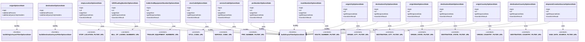

# Diagram: web/portal/src/pages/shipments/components/search/Shipments.SearchFilterLoaders.js

> Auto-generated by Obscura crawlers

## Mermaid

```mermaid
classDiagram
    class buildAsyncFilterOptionsState <<function>> {
    }
    class buildOriginAsyncFilterOptionsState <<function>> {
    }
    class buildDestinationAsyncFilterOptionsState <<function>> {
    }
    class STOP_LOCATION_FILTER_URL <<constant>> {}
    class BILL_OF_LADING_NUMBERS_URL <<constant>> {}
    class TRAILER_EQUIPMENT_NUMBERS_URL <<constant>> {}
    class STCC_CODE_URL <<constant>> {}
    class SERVICE_CODE_URL <<constant>> {}
    class PRO_NUMBER_FILTER_URL <<constant>> {}
    class ROUTE_NUMBER_FILTER_URL <<constant>> {}
    class ORIGIN_CITY_FILTER_URL <<constant>> {}
    class DESTINATION_CITY_FILTER_URL <<constant>> {}
    class ORIGIN_STATE_FILTER_URL <<constant>> {}
    class DESTINATION_STATE_FILTER_URL <<constant>> {}
    class ORIGIN_COUNTRY_FILTER_URL <<constant>> {}
    class DESTINATION_COUNTRY_FILTER_URL <<constant>> {}
    class SAW_DATA_SOURCE_FILTER_URL <<constant>> {}

    class originOptionsState {
      +topic
      +additionalParams
      +additionalQueryOnlyHeaders
    }
    class destinationOptionsState {
      +topic
      +additionalParams
      +additionalQueryOnlyHeaders
    }
    class stopLocationOptionsState {
      +topic
      +url
      +pageSize
      +getResponseData
      +transformResult
    }
    class billOfLadingNumberOptionsState {
      +topic
      +url
      +pageSize
      +getResponseData
      +transformResult
    }
    class trailerAndEquipmentNumberOptionsState {
      +topic
      +url
      +pageSize
      +getResponseData
      +transformResult
    }
    class stccCodeOptionsState {
      +topic
      +url
      +pageSize
      +getResponseData
      +transformResult
    }
    class serviceCodeOptionsState {
      +topic
      +url
      +pageSize
      +getResponseData
      +transformResult
    }
    class proNumberOptionsState {
      +topic
      +url
      +pageSize
      +getResponseData
      +transformResult
    }
    class routeNumberOptionsState {
      +topic
      +url
      +pageSize
      +getResponseData
      +transformResult
    }
    class originCityOptionsState {
      +topic
      +url
      +getResponseData
      +transformResult
    }
    class destinationCityOptionsState {
      +topic
      +url
      +getResponseData
      +transformResult
    }
    class originStateOptionsState {
      +topic
      +url
      +getResponseData
      +transformResult
    }
    class destinationStateOptionsState {
      +topic
      +url
      +getResponseData
      +transformResult
    }
    class originCountryOptionsState {
      +topic
      +url
      +getResponseData
      +transformResult
    }
    class destinationCountryOptionsState {
      +topic
      +url
      +getResponseData
      +transformResult
    }
    class shipmentCreationSourceOptionsState {
      +topic
      +url
      +getResponseData
      +transformResult
    }

    originOptionsState --> buildOriginAsyncFilterOptionsState : builtBy
    destinationOptionsState --> buildDestinationAsyncFilterOptionsState : builtBy

    stopLocationOptionsState --> buildAsyncFilterOptionsState : builtBy
    billOfLadingNumberOptionsState --> buildAsyncFilterOptionsState : builtBy
    trailerAndEquipmentNumberOptionsState --> buildAsyncFilterOptionsState : builtBy
    stccCodeOptionsState --> buildAsyncFilterOptionsState : builtBy
    serviceCodeOptionsState --> buildAsyncFilterOptionsState : builtBy
    proNumberOptionsState --> buildAsyncFilterOptionsState : builtBy
    routeNumberOptionsState --> buildAsyncFilterOptionsState : builtBy
    originCityOptionsState --> buildAsyncFilterOptionsState : builtBy
    destinationCityOptionsState --> buildAsyncFilterOptionsState : builtBy
    originStateOptionsState --> buildAsyncFilterOptionsState : builtBy
    destinationStateOptionsState --> buildAsyncFilterOptionsState : builtBy
    originCountryOptionsState --> buildAsyncFilterOptionsState : builtBy
    destinationCountryOptionsState --> buildAsyncFilterOptionsState : builtBy
    shipmentCreationSourceOptionsState --> buildAsyncFilterOptionsState : builtBy

    stopLocationOptionsState --> STOP_LOCATION_FILTER_URL : uses
    billOfLadingNumberOptionsState --> BILL_OF_LADING_NUMBERS_URL : uses
    trailerAndEquipmentNumberOptionsState --> TRAILER_EQUIPMENT_NUMBERS_URL : uses
    stccCodeOptionsState --> STCC_CODE_URL : uses
    serviceCodeOptionsState --> SERVICE_CODE_URL : uses
    proNumberOptionsState --> PRO_NUMBER_FILTER_URL : uses
    routeNumberOptionsState --> ROUTE_NUMBER_FILTER_URL : uses
    originCityOptionsState --> ORIGIN_CITY_FILTER_URL : uses
    destinationCityOptionsState --> DESTINATION_CITY_FILTER_URL : uses
    originStateOptionsState --> ORIGIN_STATE_FILTER_URL : uses
    destinationStateOptionsState --> DESTINATION_STATE_FILTER_URL : uses
    originCountryOptionsState --> ORIGIN_COUNTRY_FILTER_URL : uses
    destinationCountryOptionsState --> DESTINATION_COUNTRY_FILTER_URL : uses
    shipmentCreationSourceOptionsState --> SAW_DATA_SOURCE_FILTER_URL : uses
```

> SVG rendering failed for this diagram.
