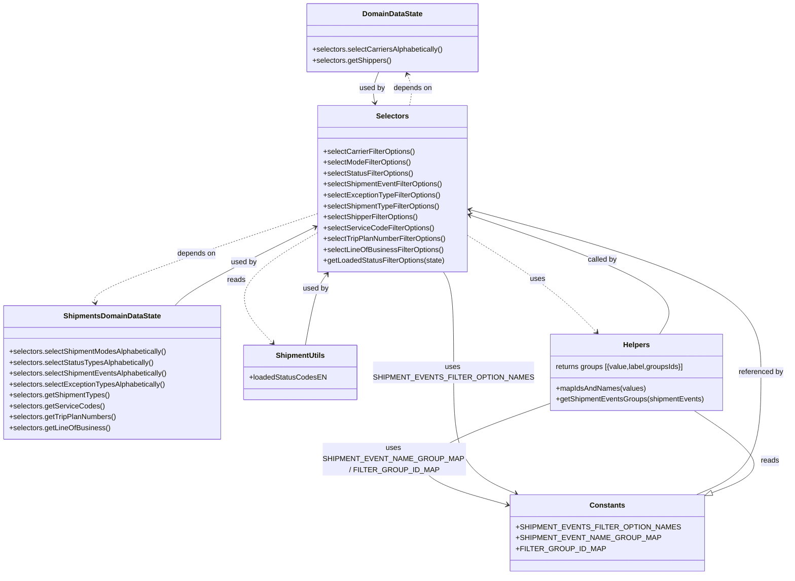

# Diagram: web/portal/src/pages/shipments/components/search/Shipments.SearchFilterSelectors.js

> Auto-generated by Obscura crawlers

## Mermaid

### SVG

<svg id="container" width="1677.6953125" xmlns="http://www.w3.org/2000/svg" class="classDiagram" height="1264" viewBox="0 0 1677.6953125 1264" role="graphics-document document" aria-roledescription="class"><g><defs><marker id="container_class-aggregationStart" class="marker aggregation class" refX="18" refY="7" markerWidth="190" markerHeight="240" orient="auto"><path d="M 18,7 L9,13 L1,7 L9,1 Z"></path></marker></defs><defs><marker id="container_class-aggregationEnd" class="marker aggregation class" refX="1" refY="7" markerWidth="20" markerHeight="28" orient="auto"><path d="M 18,7 L9,13 L1,7 L9,1 Z"></path></marker></defs><defs><marker id="container_class-extensionStart" class="marker extension class" refX="18" refY="7" markerWidth="190" markerHeight="240" orient="auto"><path d="M 1,7 L18,13 V 1 Z"></path></marker></defs><defs><marker id="container_class-extensionEnd" class="marker extension class" refX="1" refY="7" markerWidth="20" markerHeight="28" orient="auto"><path d="M 1,1 V 13 L18,7 Z"></path></marker></defs><defs><marker id="container_class-compositionStart" class="marker composition class" refX="18" refY="7" markerWidth="190" markerHeight="240" orient="auto"><path d="M 18,7 L9,13 L1,7 L9,1 Z"></path></marker></defs><defs><marker id="container_class-compositionEnd" class="marker composition class" refX="1" refY="7" markerWidth="20" markerHeight="28" orient="auto"><path d="M 18,7 L9,13 L1,7 L9,1 Z"></path></marker></defs><defs><marker id="container_class-dependencyStart" class="marker dependency class" refX="6" refY="7" markerWidth="190" markerHeight="240" orient="auto"><path d="M 5,7 L9,13 L1,7 L9,1 Z"></path></marker></defs><defs><marker id="container_class-dependencyEnd" class="marker dependency class" refX="13" refY="7" markerWidth="20" markerHeight="28" orient="auto"><path d="M 18,7 L9,13 L14,7 L9,1 Z"></path></marker></defs><defs><marker id="container_class-lollipopStart" class="marker lollipop class" refX="13" refY="7" markerWidth="190" markerHeight="240" orient="auto"><circle stroke="black" fill="transparent" cx="7" cy="7" r="6"></circle></marker></defs><defs><marker id="container_class-lollipopEnd" class="marker lollipop class" refX="1" refY="7" markerWidth="190" markerHeight="240" orient="auto"><circle stroke="black" fill="transparent" cx="7" cy="7" r="6"></circle></marker></defs><g class="root"><g class="clusters"></g><g class="edgePaths"><path d="M816.666,158L814.153,164.167C811.641,170.333,806.616,182.667,805.18,194.021C803.744,205.375,805.895,215.75,806.971,220.938L808.047,226.125" id="id_DomainDataState_Selectors_1" class="edge-thickness-normal edge-pattern-solid relation" style=";;;" data-edge="true" data-et="edge" data-id="id_DomainDataState_Selectors_1" data-points="W3sieCI6ODE2LjY2NTYzMTk3NTQ0NjQsInkiOjE1OH0seyJ4Ijo4MDEuNTkxNzk2ODc1LCJ5IjoxOTV9LHsieCI6ODA5LjI2NTc0OTI4OTc3MjgsInkiOjIzMn1d" marker-end="url(#container_class-dependencyEnd)"></path><path d="M383.748,672L389.483,665.833C395.218,659.667,406.689,647.333,455.41,619.126C504.13,590.919,590.099,546.838,633.084,524.798L676.069,502.758" id="id_ShipmentsDomainDataState_Selectors_2" class="edge-thickness-normal edge-pattern-solid relation" style=";;;" data-edge="true" data-et="edge" data-id="id_ShipmentsDomainDataState_Selectors_2" data-points="W3sieCI6MzgzLjc0NzU3OTgyMzM2OTU2LCJ5Ijo2NzJ9LHsieCI6NDE4LjE2MDE1NjI1LCJ5Ijo2MzV9LHsieCI6NjgxLjQwODIwMzEyNSwieSI6NTAwLjAyMDA1MTk4NDk0MTd9XQ==" marker-end="url(#container_class-dependencyEnd)"></path><path d="M668.752,759L672.589,738.333C676.426,717.667,684.1,676.333,691.717,650.317C699.334,624.3,706.894,613.6,710.674,608.25L714.454,602.9" id="id_ShipmentUtils_Selectors_3" class="edge-thickness-normal edge-pattern-solid relation" style=";;;" data-edge="true" data-et="edge" data-id="id_ShipmentUtils_Selectors_3" data-points="W3sieCI6NjY4Ljc1MjQ2MjYzNTg2OTYsInkiOjc1OX0seyJ4Ijo2OTEuNzczNDM3NSwieSI6NjM1fSx7IngiOjcxNy45MTY4NDEyNjQyMDQ1LCJ5Ijo1OTh9XQ==" marker-end="url(#container_class-dependencyEnd)"></path><path d="M1482.563,1088.194L1505.477,1077.995C1528.391,1067.796,1574.219,1047.398,1597.133,1002.532C1620.047,957.667,1620.047,888.333,1620.047,823C1620.047,757.667,1620.047,696.333,1519.84,637.141C1419.633,577.948,1219.218,520.896,1119.011,492.37L1018.804,463.845" id="id_Constants_Selectors_4" class="edge-thickness-normal edge-pattern-solid relation" style=";;;" data-edge="true" data-et="edge" data-id="id_Constants_Selectors_4" data-points="W3sieCI6MTQ4Mi41NjI1LCJ5IjoxMDg4LjE5NDI4NzU2NDMwMDh9LHsieCI6MTYyMC4wNDY4NzUsInkiOjEwMjd9LHsieCI6MTYyMC4wNDY4NzUsInkiOjgxOX0seyJ4IjoxNjIwLjA0Njg3NSwieSI6NjM1fSx7IngiOjEwMTMuMDMzMjAzMTI1LCJ5Ijo0NjIuMjAxNzUyOTAwNjUxM31d" marker-end="url(#container_class-dependencyEnd)"></path><path d="M1397.03,735L1407.032,718.333C1417.034,701.667,1437.037,668.333,1373.979,625.309C1310.92,582.285,1164.798,529.57,1091.738,503.212L1018.677,476.855" id="id_Helpers_Selectors_5" class="edge-thickness-normal edge-pattern-solid relation" style=";;;" data-edge="true" data-et="edge" data-id="id_Helpers_Selectors_5" data-points="W3sieCI6MTM5Ny4wMzAxODg1MTkwMjE3LCJ5Ijo3MzV9LHsieCI6MTQ1Ny4wNDEwMTU2MjUsInkiOjYzNX0seyJ4IjoxMDEzLjAzMzIwMzEyNSwieSI6NDc0LjgxODg1MDMyNzMyNDl9XQ==" marker-end="url(#container_class-dependencyEnd)"></path><path d="M1013.033,526.016L1040.163,544.18C1067.292,562.344,1121.551,598.672,1163.473,632.77C1205.394,666.868,1234.977,698.735,1249.769,714.669L1264.56,730.603" id="id_Selectors_Helpers_6" class="edge-thickness-normal edge-pattern-dashed relation" style=";;;" data-edge="true" data-et="edge" data-id="id_Selectors_Helpers_6" data-points="W3sieCI6MTAxMy4wMzMyMDMxMjUsInkiOjUyNi4wMTYwNjA1ODA4NDM4fSx7IngiOjExNzUuODEwNTQ2ODc1LCJ5Ijo2MzV9LHsieCI6MTI2OC42NDIzNjU4Mjg4MDQzLCJ5Ijo3MzV9XQ==" marker-end="url(#container_class-dependencyEnd)"></path><path d="M885.176,232L886.455,225.833C887.734,219.667,890.292,207.333,889.436,195.926C888.58,184.519,884.31,174.038,882.175,168.797L880.04,163.557" id="id_Selectors_DomainDataState_7" class="edge-thickness-normal edge-pattern-dashed relation" style=";;;" data-edge="true" data-et="edge" data-id="id_Selectors_DomainDataState_7" data-points="W3sieCI6ODg1LjE3NTY1Njk2MDIyNzIsInkiOjIzMn0seyJ4Ijo4OTIuODQ5NjA5Mzc1LCJ5IjoxOTV9LHsieCI6ODc3Ljc3NTc3NDI3NDU1MzYsInkiOjE1OH1d" marker-end="url(#container_class-dependencyEnd)"></path><path d="M681.408,471.484L601.407,498.737C521.405,525.989,361.402,580.495,282.689,612.943C203.976,645.392,206.553,655.784,207.841,660.98L209.13,666.176" id="id_Selectors_ShipmentsDomainDataState_8" class="edge-thickness-normal edge-pattern-dashed relation" style=";;;" data-edge="true" data-et="edge" data-id="id_Selectors_ShipmentsDomainDataState_8" data-points="W3sieCI6NjgxLjQwODIwMzEyNSwieSI6NDcxLjQ4NDE5Mzc4MTU0NjY1fSx7IngiOjIwMS4zOTg0Mzc1LCJ5Ijo2MzV9LHsieCI6MjEwLjU3MzgxNTM4NzIyODI1LCJ5Ijo2NzJ9XQ==" marker-end="url(#container_class-dependencyEnd)"></path><path d="M681.408,516.122L648.92,535.935C616.432,555.748,551.456,595.374,537.509,635.121C523.561,674.869,560.642,714.738,579.182,734.672L597.723,754.607" id="id_Selectors_ShipmentUtils_9" class="edge-thickness-normal edge-pattern-dashed relation" style=";;;" data-edge="true" data-et="edge" data-id="id_Selectors_ShipmentUtils_9" data-points="W3sieCI6NjgxLjQwODIwMzEyNSwieSI6NTE2LjEyMTkzMzUyNDI3NDZ9LHsieCI6NDg2LjQ4MDQ2ODc1LCJ5Ijo2MzV9LHsieCI6NjAxLjgwOTEwMzI2MDg2OTUsInkiOjc1OX1d" marker-end="url(#container_class-dependencyEnd)"></path><path d="M1498.598,1091.004L1525.508,1080.337C1552.417,1069.669,1606.236,1048.335,1602.003,1017.001C1597.77,985.667,1535.485,944.333,1504.342,923.667L1473.2,903" id="id_Constants_Helpers_10" class="edge-thickness-normal edge-pattern-solid relation" style=";;;" data-edge="true" data-et="edge" data-id="id_Constants_Helpers_10" data-points="W3sieCI6MTQ4Mi41NjI1LCJ5IjoxMDk3LjM2MDc0NzEyNDU5NTV9LHsieCI6MTY2MC4wNTQ2ODc1LCJ5IjoxMDI3fSx7IngiOjE0NzMuMjAwMDQ1MDcyMTE1NSwieSI6OTAzfV0=" marker-start="url(#container_class-extensionStart)"></path><path d="M1157.844,892.319L1100.049,914.766C1042.255,937.213,926.667,982.106,917.067,1019.016C907.467,1055.925,1003.856,1084.849,1052.051,1099.312L1100.245,1113.774" id="id_Helpers_Constants_11" class="edge-thickness-normal edge-pattern-solid relation" style=";;;" data-edge="true" data-et="edge" data-id="id_Helpers_Constants_11" data-points="W3sieCI6MTE1Ny44NDM3NSwieSI6ODkyLjMxOTM5NjkzMjE0NH0seyJ4Ijo4MTEuMDc4MTI1LCJ5IjoxMDI3fSx7IngiOjExMDUuOTkyMTg3NSwieSI6MTExNS40OTg3NzUyNTI4MzE0fV0=" marker-end="url(#container_class-dependencyEnd)"></path><path d="M948.11,598L951.509,604.167C954.909,610.333,961.708,622.667,965.108,659.5C968.508,696.333,968.508,757.667,968.508,823C968.508,888.333,968.508,957.667,990.508,1002.126C1012.509,1046.585,1056.51,1066.17,1078.51,1075.962L1100.511,1085.754" id="id_Selectors_Constants_12" class="edge-thickness-normal edge-pattern-solid relation" style=";;;" data-edge="true" data-et="edge" data-id="id_Selectors_Constants_12" data-points="W3sieCI6OTQ4LjEwOTUyNTkyMzI5NTUsInkiOjU5OH0seyJ4Ijo5NjguNTA3ODEyNSwieSI6NjM1fSx7IngiOjk2OC41MDc4MTI1LCJ5Ijo4MTl9LHsieCI6OTY4LjUwNzgxMjUsInkiOjEwMjd9LHsieCI6MTEwNS45OTIxODc1LCJ5IjoxMDg4LjE5NDI4NzU2NDMwMDh9XQ==" marker-end="url(#container_class-dependencyEnd)"></path></g><g class="edgeLabels"><g class="edgeLabel" transform="translate(802.00027, 193.99736)"><g class="label" data-id="id_DomainDataState_Selectors_1" transform="translate(-28.3125, -12)"><foreignObject width="56.625" height="24">

used by

</foreignObject></g></g><g class="edgeLabel" transform="translate(527.30253, 579.03745)"><g class="label" data-id="id_ShipmentsDomainDataState_Selectors_2" transform="translate(-28.3125, -12)"><foreignObject width="56.625" height="24">

used by

</foreignObject></g></g><g class="edgeLabel" transform="translate(691.7734375, 635)"><g class="label" data-id="id_ShipmentUtils_Selectors_3" transform="translate(-28.3125, -12)"><foreignObject width="56.625" height="24">

used by

</foreignObject></g></g><g class="edgeLabel" transform="translate(1620.046875, 819)"><g class="label" data-id="id_Constants_Selectors_4" transform="translate(-49.6484375, -12)"><foreignObject width="99.296875" height="24">

referenced by

</foreignObject></g></g><g class="edgeLabel" transform="translate(1289.88909, 574.69794)"><g class="label" data-id="id_Helpers_Selectors_5" transform="translate(-32.5859375, -12)"><foreignObject width="65.171875" height="24">

called by

</foreignObject></g></g><g class="edgeLabel" transform="translate(1151.11223, 618.46379)"><g class="label" data-id="id_Selectors_Helpers_6" transform="translate(-16.4921875, -12)"><foreignObject width="32.984375" height="24">

uses

</foreignObject></g></g><g class="edgeLabel" transform="translate(892.44113, 193.99736)"><g class="label" data-id="id_Selectors_DomainDataState_7" transform="translate(-42.9453125, -12)"><foreignObject width="85.890625" height="24">

depends on

</foreignObject></g></g><g class="edgeLabel" transform="translate(423.36108, 559.3882)"><g class="label" data-id="id_Selectors_ShipmentsDomainDataState_8" transform="translate(-42.9453125, -12)"><foreignObject width="85.890625" height="24">

depends on

</foreignObject></g></g><g class="edgeLabel" transform="translate(486.48046875, 635)"><g class="label" data-id="id_Selectors_ShipmentUtils_9" transform="translate(-20.0078125, -12)"><foreignObject width="40.015625" height="24">

reads

</foreignObject></g></g><g class="edgeLabel" transform="translate(1646.17065, 1017.78631)"><g class="label" data-id="id_Constants_Helpers_10" transform="translate(-20.0078125, -12)"><foreignObject width="40.015625" height="24">

reads

</foreignObject></g></g><g class="edgeLabel" transform="translate(840.95172, 1015.39737)"><g class="label" data-id="id_Helpers_Constants_11" transform="translate(-137.4296875, -36)"><foreignObject width="274.859375" height="72">

uses SHIPMENT_EVENT_NAME_GROUP_MAP / FILTER_GROUP_ID_MAP

</foreignObject></g></g><g class="edgeLabel" transform="translate(968.5078125, 819)"><g class="label" data-id="id_Selectors_Constants_12" transform="translate(-154.3359375, -24)"><foreignObject width="308.671875" height="48">

uses SHIPMENT_EVENTS_FILTER_OPTION_NAMES

</foreignObject></g></g></g><g class="nodes"><g class="node default" id="classId-DomainDataState-0" transform="translate(847.220703125, 83)"><g class="basic label-container"><path d="M-189.16796875 -75 L189.16796875 -75 L189.16796875 75 L-189.16796875 75" stroke="none" stroke-width="0" fill="#ECECFF" style=""></path><path d="M-189.16796875 -75 C-70.03679622987951 -75, 49.09437629024097 -75, 189.16796875 -75 M-189.16796875 -75 C-91.00191876211387 -75, 7.164131225772252 -75, 189.16796875 -75 M189.16796875 -75 C189.16796875 -33.786694090477674, 189.16796875 7.426611819044652, 189.16796875 75 M189.16796875 -75 C189.16796875 -24.196654773296736, 189.16796875 26.60669045340653, 189.16796875 75 M189.16796875 75 C43.19255838646632 75, -102.78285197706737 75, -189.16796875 75 M189.16796875 75 C65.52680112407482 75, -58.114366501850355 75, -189.16796875 75 M-189.16796875 75 C-189.16796875 44.232034388796905, -189.16796875 13.464068777593802, -189.16796875 -75 M-189.16796875 75 C-189.16796875 24.915175268298803, -189.16796875 -25.169649463402394, -189.16796875 -75" stroke="#9370DB" stroke-width="1.3" fill="none" stroke-dasharray="0 0" style=""></path></g><g class="annotation-group text" transform="translate(0, -51)"></g><g class="label-group text" transform="translate(-64.1015625, -51)"><g class="label" style="font-weight: bolder" transform="translate(0,-12)"><foreignObject width="128.203125" height="24">

DomainDataState

</foreignObject></g></g><g class="members-group text" transform="translate(-177.16796875, -3)"></g><g class="methods-group text" transform="translate(-177.16796875, 27)"><g class="label" style="" transform="translate(0,-12)"><foreignObject width="290.234375" height="24">

+selectors.selectCarriersAlphabetically()

</foreignObject></g><g class="label" style="" transform="translate(0,12)"><foreignObject width="173.796875" height="24">

+selectors.getShippers()

</foreignObject></g></g><g class="divider" style=""><path d="M-189.16796875 -27 C-76.33374569678664 -27, 36.50047735642673 -27, 189.16796875 -27 M-189.16796875 -27 C-79.6276243349807 -27, 29.91272008003861 -27, 189.16796875 -27" stroke="#9370DB" stroke-width="1.3" fill="none" stroke-dasharray="0 0" style=""></path></g><g class="divider" style=""><path d="M-189.16796875 -3 C-77.1322629155349 -3, 34.90344291893021 -3, 189.16796875 -3 M-189.16796875 -3 C-45.879764617130235 -3, 97.40843951573953 -3, 189.16796875 -3" stroke="#9370DB" stroke-width="1.3" fill="none" stroke-dasharray="0 0" style=""></path></g></g><g class="node default" id="classId-ShipmentsDomainDataState-1" transform="translate(247.02734375, 819)"><g class="basic label-container"><path d="M-239.02734375 -147 L239.02734375 -147 L239.02734375 147 L-239.02734375 147" stroke="none" stroke-width="0" fill="#ECECFF" style=""></path><path d="M-239.02734375 -147 C-111.18218159893527 -147, 16.662980552129454 -147, 239.02734375 -147 M-239.02734375 -147 C-79.30023956612689 -147, 80.42686461774622 -147, 239.02734375 -147 M239.02734375 -147 C239.02734375 -40.478826000233425, 239.02734375 66.04234799953315, 239.02734375 147 M239.02734375 -147 C239.02734375 -69.52779205078001, 239.02734375 7.944415898439985, 239.02734375 147 M239.02734375 147 C58.19974194661009 147, -122.62785985677982 147, -239.02734375 147 M239.02734375 147 C78.04137427910149 147, -82.94459519179702 147, -239.02734375 147 M-239.02734375 147 C-239.02734375 39.33100330350889, -239.02734375 -68.33799339298221, -239.02734375 -147 M-239.02734375 147 C-239.02734375 52.84414023303306, -239.02734375 -41.31171953393388, -239.02734375 -147" stroke="#9370DB" stroke-width="1.3" fill="none" stroke-dasharray="0 0" style=""></path></g><g class="annotation-group text" transform="translate(0, -123)"></g><g class="label-group text" transform="translate(-103.0703125, -123)"><g class="label" style="font-weight: bolder" transform="translate(0,-12)"><foreignObject width="206.140625" height="24">

ShipmentsDomainDataState

</foreignObject></g></g><g class="members-group text" transform="translate(-227.02734375, -75)"></g><g class="methods-group text" transform="translate(-227.02734375, -45)"><g class="label" style="" transform="translate(0,-12)"><foreignObject width="350.984375" height="24">

+selectors.selectShipmentModesAlphabetically()

</foreignObject></g><g class="label" style="" transform="translate(0,12)"><foreignObject width="320.578125" height="24">

+selectors.selectStatusTypesAlphabetically()

</foreignObject></g><g class="label" style="" transform="translate(0,36)"><foreignObject width="350.828125" height="24">

+selectors.selectShipmentEventsAlphabetically()

</foreignObject></g><g class="label" style="" transform="translate(0,60)"><foreignObject width="345.671875" height="24">

+selectors.selectExceptionTypesAlphabetically()

</foreignObject></g><g class="label" style="" transform="translate(0,84)"><foreignObject width="220.953125" height="24">

+selectors.getShipmentTypes()

</foreignObject></g><g class="label" style="" transform="translate(0,108)"><foreignObject width="205.84375" height="24">

+selectors.getServiceCodes()

</foreignObject></g><g class="label" style="" transform="translate(0,132)"><foreignObject width="235.453125" height="24">

+selectors.getTripPlanNumbers()

</foreignObject></g><g class="label" style="" transform="translate(0,156)"><foreignObject width="220.96875" height="24">

+selectors.getLineOfBusiness()

</foreignObject></g></g><g class="divider" style=""><path d="M-239.02734375 -99 C-95.2811529158038 -99, 48.4650379183924 -99, 239.02734375 -99 M-239.02734375 -99 C-124.00260685799269 -99, -8.977869965985377 -99, 239.02734375 -99" stroke="#9370DB" stroke-width="1.3" fill="none" stroke-dasharray="0 0" style=""></path></g><g class="divider" style=""><path d="M-239.02734375 -75 C-55.22880467880995 -75, 128.5697343923801 -75, 239.02734375 -75 M-239.02734375 -75 C-111.65935269767134 -75, 15.708638354657324 -75, 239.02734375 -75" stroke="#9370DB" stroke-width="1.3" fill="none" stroke-dasharray="0 0" style=""></path></g></g><g class="node default" id="classId-ShipmentUtils-2" transform="translate(657.61328125, 819)"><g class="basic label-container"><path d="M-121.55859375 -60 L121.55859375 -60 L121.55859375 60 L-121.55859375 60" stroke="none" stroke-width="0" fill="#ECECFF" style=""></path><path d="M-121.55859375 -60 C-60.53317452277648 -60, 0.49224470444704593 -60, 121.55859375 -60 M-121.55859375 -60 C-45.26576351613774 -60, 31.027066717724523 -60, 121.55859375 -60 M121.55859375 -60 C121.55859375 -13.278519141150646, 121.55859375 33.44296171769871, 121.55859375 60 M121.55859375 -60 C121.55859375 -19.323428537215804, 121.55859375 21.35314292556839, 121.55859375 60 M121.55859375 60 C65.66318166411321 60, 9.767769578226435 60, -121.55859375 60 M121.55859375 60 C60.22963257404518 60, -1.099328601909633 60, -121.55859375 60 M-121.55859375 60 C-121.55859375 24.884248353568438, -121.55859375 -10.231503292863124, -121.55859375 -60 M-121.55859375 60 C-121.55859375 23.02938694284647, -121.55859375 -13.941226114307057, -121.55859375 -60" stroke="#9370DB" stroke-width="1.3" fill="none" stroke-dasharray="0 0" style=""></path></g><g class="annotation-group text" transform="translate(0, -36)"></g><g class="label-group text" transform="translate(-51.8984375, -36)"><g class="label" style="font-weight: bolder" transform="translate(0,-12)"><foreignObject width="103.796875" height="24">

ShipmentUtils

</foreignObject></g></g><g class="members-group text" transform="translate(-109.55859375, 12)"><g class="label" style="" transform="translate(0,-12)"><foreignObject width="167.21875" height="24">

+loadedStatusCodesEN

</foreignObject></g></g><g class="methods-group text" transform="translate(-109.55859375, 60)"></g><g class="divider" style=""><path d="M-121.55859375 -12 C-34.36922922412593 -12, 52.82013530174814 -12, 121.55859375 -12 M-121.55859375 -12 C-31.588210896528864 -12, 58.38217195694227 -12, 121.55859375 -12" stroke="#9370DB" stroke-width="1.3" fill="none" stroke-dasharray="0 0" style=""></path></g><g class="divider" style=""><path d="M-121.55859375 36 C-57.37883112632775 36, 6.800931497344493 36, 121.55859375 36 M-121.55859375 36 C-27.026834509186557 36, 67.50492473162689 36, 121.55859375 36" stroke="#9370DB" stroke-width="1.3" fill="none" stroke-dasharray="0 0" style=""></path></g></g><g class="node default" id="classId-Constants-3" transform="translate(1294.27734375, 1172)"><g class="basic label-container"><path d="M-188.28515625 -84 L188.28515625 -84 L188.28515625 84 L-188.28515625 84" stroke="none" stroke-width="0" fill="#ECECFF" style=""></path><path d="M-188.28515625 -84 C-101.1896758143709 -84, -14.094195378741802 -84, 188.28515625 -84 M-188.28515625 -84 C-67.31893367578682 -84, 53.64728889842635 -84, 188.28515625 -84 M188.28515625 -84 C188.28515625 -28.550562074883373, 188.28515625 26.898875850233253, 188.28515625 84 M188.28515625 -84 C188.28515625 -46.02121002148327, 188.28515625 -8.04242004296654, 188.28515625 84 M188.28515625 84 C104.49855435042774 84, 20.711952450855478 84, -188.28515625 84 M188.28515625 84 C92.18199726578668 84, -3.921161718426646 84, -188.28515625 84 M-188.28515625 84 C-188.28515625 33.15556465543243, -188.28515625 -17.688870689135143, -188.28515625 -84 M-188.28515625 84 C-188.28515625 43.181957312771566, -188.28515625 2.3639146255431314, -188.28515625 -84" stroke="#9370DB" stroke-width="1.3" fill="none" stroke-dasharray="0 0" style=""></path></g><g class="annotation-group text" transform="translate(0, -60)"></g><g class="label-group text" transform="translate(-36.5390625, -60)"><g class="label" style="font-weight: bolder" transform="translate(0,-12)"><foreignObject width="73.078125" height="24">

Constants

</foreignObject></g></g><g class="members-group text" transform="translate(-176.28515625, -12)"><g class="label" style="" transform="translate(0,-12)"><foreignObject width="316.03125" height="24">

+SHIPMENT_EVENTS_FILTER_OPTION_NAMES

</foreignObject></g><g class="label" style="" transform="translate(0,12)"><foreignObject width="277.953125" height="24">

+SHIPMENT_EVENT_NAME_GROUP_MAP

</foreignObject></g><g class="label" style="" transform="translate(0,36)"><foreignObject width="172.328125" height="24">

+FILTER_GROUP_ID_MAP

</foreignObject></g></g><g class="methods-group text" transform="translate(-176.28515625, 84)"></g><g class="divider" style=""><path d="M-188.28515625 -36 C-112.7577145552171 -36, -37.23027286043421 -36, 188.28515625 -36 M-188.28515625 -36 C-45.31313979133654 -36, 97.65887666732692 -36, 188.28515625 -36" stroke="#9370DB" stroke-width="1.3" fill="none" stroke-dasharray="0 0" style=""></path></g><g class="divider" style=""><path d="M-188.28515625 60 C-51.755231730711614 60, 84.77469278857677 60, 188.28515625 60 M-188.28515625 60 C-60.10798426693569 60, 68.06918771612862 60, 188.28515625 60" stroke="#9370DB" stroke-width="1.3" fill="none" stroke-dasharray="0 0" style=""></path></g></g><g class="node default" id="classId-Selectors-4" transform="translate(847.220703125, 415)"><g class="basic label-container"><path d="M-165.8125 -183 L165.8125 -183 L165.8125 183 L-165.8125 183" stroke="none" stroke-width="0" fill="#ECECFF" style=""></path><path d="M-165.8125 -183 C-35.59453748770184 -183, 94.62342502459632 -183, 165.8125 -183 M-165.8125 -183 C-38.06409063354714 -183, 89.68431873290572 -183, 165.8125 -183 M165.8125 -183 C165.8125 -91.65362334168593, 165.8125 -0.3072466833718579, 165.8125 183 M165.8125 -183 C165.8125 -76.40441084847748, 165.8125 30.191178303045035, 165.8125 183 M165.8125 183 C52.6915722807331 183, -60.429355438533804 183, -165.8125 183 M165.8125 183 C56.31769571181259 183, -53.17710857637482 183, -165.8125 183 M-165.8125 183 C-165.8125 68.21233441505217, -165.8125 -46.57533116989566, -165.8125 -183 M-165.8125 183 C-165.8125 56.59760689294538, -165.8125 -69.80478621410924, -165.8125 -183" stroke="#9370DB" stroke-width="1.3" fill="none" stroke-dasharray="0 0" style=""></path></g><g class="annotation-group text" transform="translate(0, -159)"></g><g class="label-group text" transform="translate(-34.171875, -159)"><g class="label" style="font-weight: bolder" transform="translate(0,-12)"><foreignObject width="68.34375" height="24">

Selectors

</foreignObject></g></g><g class="members-group text" transform="translate(-153.8125, -111)"></g><g class="methods-group text" transform="translate(-153.8125, -81)"><g class="label" style="" transform="translate(0,-12)"><foreignObject width="204.546875" height="24">

+selectCarrierFilterOptions()

</foreignObject></g><g class="label" style="" transform="translate(0,12)"><foreignObject width="195.375" height="24">

+selectModeFilterOptions()

</foreignObject></g><g class="label" style="" transform="translate(0,36)"><foreignObject width="200.9375" height="24">

+selectStatusFilterOptions()

</foreignObject></g><g class="label" style="" transform="translate(0,60)"><foreignObject width="264.90625" height="24">

+selectShipmentEventFilterOptions()

</foreignObject></g><g class="label" style="" transform="translate(0,84)"><foreignObject width="259.75" height="24">

+selectExceptionTypeFilterOptions()

</foreignObject></g><g class="label" style="" transform="translate(0,108)"><foreignObject width="258.71875" height="24">

+selectShipmentTypeFilterOptions()

</foreignObject></g><g class="label" style="" transform="translate(0,132)"><foreignObject width="211.796875" height="24">

+selectShipperFilterOptions()

</foreignObject></g><g class="label" style="" transform="translate(0,156)"><foreignObject width="243.609375" height="24">

+selectServiceCodeFilterOptions()

</foreignObject></g><g class="label" style="" transform="translate(0,180)"><foreignObject width="273.453125" height="24">

+selectTripPlanNumberFilterOptions()

</foreignObject></g><g class="label" style="" transform="translate(0,204)"><foreignObject width="266.203125" height="24">

+selectLineOfBusinessFilterOptions()

</foreignObject></g><g class="label" style="" transform="translate(0,228)"><foreignObject width="269.953125" height="24">

+getLoadedStatusFilterOptions(state)

</foreignObject></g></g><g class="divider" style=""><path d="M-165.8125 -135 C-71.12166721452675 -135, 23.569165570946495 -135, 165.8125 -135 M-165.8125 -135 C-37.490368665106274 -135, 90.83176266978745 -135, 165.8125 -135" stroke="#9370DB" stroke-width="1.3" fill="none" stroke-dasharray="0 0" style=""></path></g><g class="divider" style=""><path d="M-165.8125 -111 C-56.249745392363835 -111, 53.31300921527233 -111, 165.8125 -111 M-165.8125 -111 C-95.98306299586633 -111, -26.153625991732667 -111, 165.8125 -111" stroke="#9370DB" stroke-width="1.3" fill="none" stroke-dasharray="0 0" style=""></path></g></g><g class="node default" id="classId-Helpers-5" transform="translate(1346.62109375, 819)"><g class="basic label-container"><path d="M-188.77734375 -84 L188.77734375 -84 L188.77734375 84 L-188.77734375 84" stroke="none" stroke-width="0" fill="#ECECFF" style=""></path><path d="M-188.77734375 -84 C-64.36550228888501 -84, 60.04633917222998 -84, 188.77734375 -84 M-188.77734375 -84 C-68.86290352571498 -84, 51.05153669857003 -84, 188.77734375 -84 M188.77734375 -84 C188.77734375 -18.934279575451967, 188.77734375 46.131440849096066, 188.77734375 84 M188.77734375 -84 C188.77734375 -39.383035059182106, 188.77734375 5.233929881635788, 188.77734375 84 M188.77734375 84 C58.829630461102454 84, -71.11808282779509 84, -188.77734375 84 M188.77734375 84 C45.94425576240633 84, -96.88883222518734 84, -188.77734375 84 M-188.77734375 84 C-188.77734375 18.416300213798877, -188.77734375 -47.167399572402246, -188.77734375 -84 M-188.77734375 84 C-188.77734375 24.927781385772747, -188.77734375 -34.14443722845451, -188.77734375 -84" stroke="#9370DB" stroke-width="1.3" fill="none" stroke-dasharray="0 0" style=""></path></g><g class="annotation-group text" transform="translate(0, -60)"></g><g class="label-group text" transform="translate(-28.2890625, -60)"><g class="label" style="font-weight: bolder" transform="translate(0,-12)"><foreignObject width="56.578125" height="24">

Helpers

</foreignObject></g></g><g class="members-group text" transform="translate(-176.77734375, -12)"><g class="label" style="" transform="translate(0,-12)"><foreignObject width="285.203125" height="24">

returns groups [{value,label,groupsIds}]

</foreignObject></g></g><g class="methods-group text" transform="translate(-176.77734375, 36)"><g class="label" style="" transform="translate(0,-12)"><foreignObject width="196.046875" height="24">

+mapIdsAndNames(values)

</foreignObject></g><g class="label" style="" transform="translate(0,12)"><foreignObject width="325.265625" height="24">

+getShipmentEventsGroups(shipmentEvents)

</foreignObject></g></g><g class="divider" style=""><path d="M-188.77734375 -36 C-39.31533627160911 -36, 110.14667120678178 -36, 188.77734375 -36 M-188.77734375 -36 C-84.07570890578185 -36, 20.625925938436296 -36, 188.77734375 -36" stroke="#9370DB" stroke-width="1.3" fill="none" stroke-dasharray="0 0" style=""></path></g><g class="divider" style=""><path d="M-188.77734375 12 C-43.202011612971745 12, 102.37332052405651 12, 188.77734375 12 M-188.77734375 12 C-47.113752663585046 12, 94.54983842282991 12, 188.77734375 12" stroke="#9370DB" stroke-width="1.3" fill="none" stroke-dasharray="0 0" style=""></path></g></g></g></g></g></svg>
