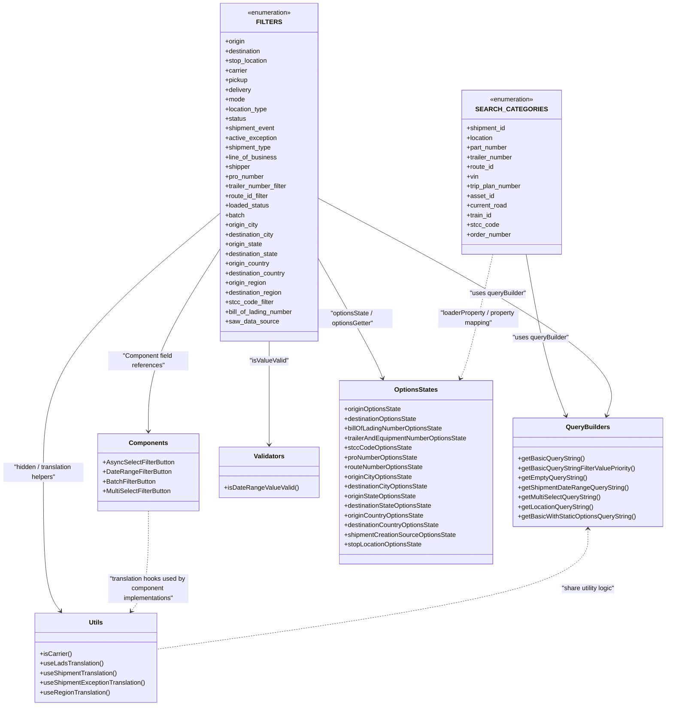

# Diagram: web/portal/src/pages/shipments/components/search/Shipments.searchOptions.js

> Auto-generated by Obscura crawlers

## Mermaid

```mermaid
classDiagram
class QueryBuilders {
  +getBasicQueryString()
  +getBasicQueryStringFilterValuePriority()
  +getEmptyQueryString()
  +getShipmentDateRangeQueryString()
  +getMultiSelectQueryString()
  +getLocationQueryString()
  +getBasicWithStaticOptionsQueryString()
}
class Components {
  +AsyncSelectFilterButton
  +DateRangeFilterButton
  +BatchFilterButton
  +MultiSelectFilterButton
}
class Validators {
  +isDateRangeValueValid()
}
class Utils {
  +isCarrier()
  +useLadsTranslation()
  +useShipmentTranslation()
  +useShipmentExceptionTranslation()
  +useRegionTranslation()
}
class OptionsStates {
  +originOptionsState
  +destinationOptionsState
  +billOfLadingNumberOptionsState
  +trailerAndEquipmentNumberOptionsState
  +stccCodeOptionsState
  +proNumberOptionsState
  +routeNumberOptionsState
  +originCityOptionsState
  +destinationCityOptionsState
  +originStateOptionsState
  +destinationStateOptionsState
  +originCountryOptionsState
  +destinationCountryOptionsState
  +shipmentCreationSourceOptionsState
  +stopLocationOptionsState
}
class SEARCH_CATEGORIES {
  +shipment_id
  +location
  +part_number
  +trailer_number
  +route_id
  +vin
  +trip_plan_number
  +asset_id
  +current_road
  +train_id
  +stcc_code
  +order_number
}
class FILTERS {
  +origin
  +destination
  +stop_location
  +carrier
  +pickup
  +delivery
  +mode
  +location_type
  +status
  +shipment_event
  +active_exception
  +shipment_type
  +line_of_business
  +shipper
  +pro_number
  +trailer_number_filter
  +route_id_filter
  +loaded_status
  +batch
  +origin_city
  +destination_city
  +origin_state
  +destination_state
  +origin_country
  +destination_country
  +origin_region
  +destination_region
  +stcc_code_filter
  +bill_of_lading_number
  +saw_data_source
}
SEARCH_CATEGORIES --> QueryBuilders : "uses queryBuilder"
FILTERS --> Components : "Component field references"
FILTERS --> QueryBuilders : "uses queryBuilder"
FILTERS --> OptionsStates : "optionsState / optionsGetter"
FILTERS --> Validators : "isValueValid"
FILTERS --> Utils : "hidden / translation helpers"
SEARCH_CATEGORIES ..> OptionsStates : "loaderProperty / property mapping"
Components ..> Utils : "translation hooks used by component implementations"
QueryBuilders <.. Utils : "share utility logic"
class SEARCH_CATEGORIES <<enumeration>>
class FILTERS <<enumeration>>
```

> SVG rendering failed for this diagram.
