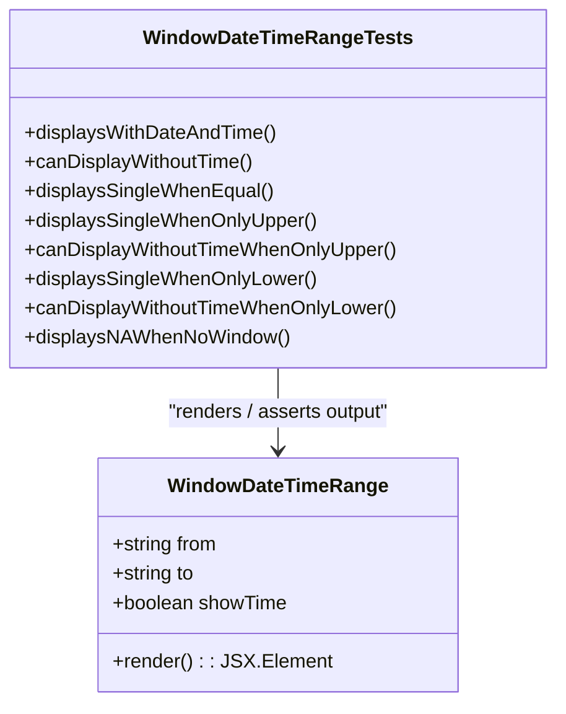

# Diagram: web/portal/src/pages/shipments/components/tests/WindowDateTimeRange.test.tsx

> Auto-generated by Obscura crawlers

## Mermaid

### SVG

<svg id="container" width="452.578125" xmlns="http://www.w3.org/2000/svg" class="classDiagram" height="576" viewBox="0 0 452.578125 576" role="graphics-document document" aria-roledescription="class"><g><defs><marker id="container_class-aggregationStart" class="marker aggregation class" refX="18" refY="7" markerWidth="190" markerHeight="240" orient="auto"><path d="M 18,7 L9,13 L1,7 L9,1 Z"></path></marker></defs><defs><marker id="container_class-aggregationEnd" class="marker aggregation class" refX="1" refY="7" markerWidth="20" markerHeight="28" orient="auto"><path d="M 18,7 L9,13 L1,7 L9,1 Z"></path></marker></defs><defs><marker id="container_class-extensionStart" class="marker extension class" refX="18" refY="7" markerWidth="190" markerHeight="240" orient="auto"><path d="M 1,7 L18,13 V 1 Z"></path></marker></defs><defs><marker id="container_class-extensionEnd" class="marker extension class" refX="1" refY="7" markerWidth="20" markerHeight="28" orient="auto"><path d="M 1,1 V 13 L18,7 Z"></path></marker></defs><defs><marker id="container_class-compositionStart" class="marker composition class" refX="18" refY="7" markerWidth="190" markerHeight="240" orient="auto"><path d="M 18,7 L9,13 L1,7 L9,1 Z"></path></marker></defs><defs><marker id="container_class-compositionEnd" class="marker composition class" refX="1" refY="7" markerWidth="20" markerHeight="28" orient="auto"><path d="M 18,7 L9,13 L1,7 L9,1 Z"></path></marker></defs><defs><marker id="container_class-dependencyStart" class="marker dependency class" refX="6" refY="7" markerWidth="190" markerHeight="240" orient="auto"><path d="M 5,7 L9,13 L1,7 L9,1 Z"></path></marker></defs><defs><marker id="container_class-dependencyEnd" class="marker dependency class" refX="13" refY="7" markerWidth="20" markerHeight="28" orient="auto"><path d="M 18,7 L9,13 L14,7 L9,1 Z"></path></marker></defs><defs><marker id="container_class-lollipopStart" class="marker lollipop class" refX="13" refY="7" markerWidth="190" markerHeight="240" orient="auto"><circle stroke="black" fill="transparent" cx="7" cy="7" r="6"></circle></marker></defs><defs><marker id="container_class-lollipopEnd" class="marker lollipop class" refX="1" refY="7" markerWidth="190" markerHeight="240" orient="auto"><circle stroke="black" fill="transparent" cx="7" cy="7" r="6"></circle></marker></defs><g class="root"><g class="clusters"></g><g class="edgePaths"><path d="M226.289,302L226.289,308.167C226.289,314.333,226.289,326.667,226.289,338C226.289,349.333,226.289,359.667,226.289,364.833L226.289,370" id="id_WindowDateTimeRangeTests_WindowDateTimeRange_1" class="edge-thickness-normal edge-pattern-solid relation" style=";;;" data-edge="true" data-et="edge" data-id="id_WindowDateTimeRangeTests_WindowDateTimeRange_1" data-points="W3sieCI6MjI2LjI4OTA2MjUsInkiOjMwMn0seyJ4IjoyMjYuMjg5MDYyNSwieSI6MzM5fSx7IngiOjIyNi4yODkwNjI1LCJ5IjozNzZ9XQ==" marker-end="url(#container_class-dependencyEnd)"></path></g><g class="edgeLabels"><g class="edgeLabel" transform="translate(226.2890625, 339)"><g class="label" data-id="id_WindowDateTimeRangeTests_WindowDateTimeRange_1" transform="translate(-94.78125, -12)"><foreignObject width="189.5625" height="24">

"renders / asserts output"

</foreignObject></g></g></g><g class="nodes"><g class="node default" id="classId-WindowDateTimeRange-0" transform="translate(226.2890625, 472)"><g class="basic label-container"><path d="M-141.29296875 -96 L141.29296875 -96 L141.29296875 96 L-141.29296875 96" stroke="none" stroke-width="0" fill="#ECECFF" style=""></path><path d="M-141.29296875 -96 C-30.818528043865143 -96, 79.65591266226971 -96, 141.29296875 -96 M-141.29296875 -96 C-46.8662548797645 -96, 47.560458990471005 -96, 141.29296875 -96 M141.29296875 -96 C141.29296875 -32.92127233439576, 141.29296875 30.15745533120848, 141.29296875 96 M141.29296875 -96 C141.29296875 -38.84259510833459, 141.29296875 18.314809783330816, 141.29296875 96 M141.29296875 96 C56.343517901822224 96, -28.60593294635555 96, -141.29296875 96 M141.29296875 96 C31.23638027027458 96, -78.82020820945084 96, -141.29296875 96 M-141.29296875 96 C-141.29296875 48.91908898069243, -141.29296875 1.838177961384858, -141.29296875 -96 M-141.29296875 96 C-141.29296875 46.063126850833754, -141.29296875 -3.8737462983324917, -141.29296875 -96" stroke="#9370DB" stroke-width="1.3" fill="none" stroke-dasharray="0 0" style=""></path></g><g class="annotation-group text" transform="translate(0, -72)"></g><g class="label-group text" transform="translate(-86.2421875, -72)"><g class="label" style="font-weight: bolder" transform="translate(0,-12)"><foreignObject width="172.484375" height="24">

WindowDateTimeRange

</foreignObject></g></g><g class="members-group text" transform="translate(-129.29296875, -24)"><g class="label" style="" transform="translate(0,-12)"><foreignObject width="87.96875" height="24">

+string from

</foreignObject></g><g class="label" style="" transform="translate(0,12)"><foreignObject width="68.75" height="24">

+string to

</foreignObject></g><g class="label" style="" transform="translate(0,36)"><foreignObject width="144.546875" height="24">

+boolean showTime

</foreignObject></g></g><g class="methods-group text" transform="translate(-129.29296875, 72)"><g class="label" style="" transform="translate(0,-12)"><foreignObject width="172.34375" height="24">

+render() : : JSX.Element

</foreignObject></g></g><g class="divider" style=""><path d="M-141.29296875 -48 C-82.85830895797932 -48, -24.423649165958636 -48, 141.29296875 -48 M-141.29296875 -48 C-50.09771158004581 -48, 41.09754558990838 -48, 141.29296875 -48" stroke="#9370DB" stroke-width="1.3" fill="none" stroke-dasharray="0 0" style=""></path></g><g class="divider" style=""><path d="M-141.29296875 48 C-37.14387686412442 48, 67.00521502175116 48, 141.29296875 48 M-141.29296875 48 C-43.31881877689085 48, 54.6553311962183 48, 141.29296875 48" stroke="#9370DB" stroke-width="1.3" fill="none" stroke-dasharray="0 0" style=""></path></g></g><g class="node default" id="classId-WindowDateTimeRangeTests-1" transform="translate(226.2890625, 155)"><g class="basic label-container"><path d="M-218.2890625 -147 L218.2890625 -147 L218.2890625 147 L-218.2890625 147" stroke="none" stroke-width="0" fill="#ECECFF" style=""></path><path d="M-218.2890625 -147 C-109.85363486133024 -147, -1.4182072226604703 -147, 218.2890625 -147 M-218.2890625 -147 C-118.38304953522056 -147, -18.47703657044113 -147, 218.2890625 -147 M218.2890625 -147 C218.2890625 -87.01037539629377, 218.2890625 -27.020750792587535, 218.2890625 147 M218.2890625 -147 C218.2890625 -59.03449361171185, 218.2890625 28.931012776576296, 218.2890625 147 M218.2890625 147 C124.63222133615055 147, 30.9753801723011 147, -218.2890625 147 M218.2890625 147 C60.3269470627624 147, -97.6351683744752 147, -218.2890625 147 M-218.2890625 147 C-218.2890625 55.91450824102361, -218.2890625 -35.17098351795278, -218.2890625 -147 M-218.2890625 147 C-218.2890625 59.23274193005395, -218.2890625 -28.534516139892105, -218.2890625 -147" stroke="#9370DB" stroke-width="1.3" fill="none" stroke-dasharray="0 0" style=""></path></g><g class="annotation-group text" transform="translate(0, -123)"></g><g class="label-group text" transform="translate(-105.359375, -123)"><g class="label" style="font-weight: bolder" transform="translate(0,-12)"><foreignObject width="210.71875" height="24">

WindowDateTimeRangeTests

</foreignObject></g></g><g class="members-group text" transform="translate(-206.2890625, -75)"></g><g class="methods-group text" transform="translate(-206.2890625, -45)"><g class="label" style="" transform="translate(0,-12)"><foreignObject width="207.03125" height="24">

+displaysWithDateAndTime()

</foreignObject></g><g class="label" style="" transform="translate(0,12)"><foreignObject width="189.1875" height="24">

+canDisplayWithoutTime()

</foreignObject></g><g class="label" style="" transform="translate(0,36)"><foreignObject width="203.015625" height="24">

+displaysSingleWhenEqual()

</foreignObject></g><g class="label" style="" transform="translate(0,60)"><foreignObject width="240.015625" height="24">

+displaysSingleWhenOnlyUpper()

</foreignObject></g><g class="label" style="" transform="translate(0,84)"><foreignObject width="307.21875" height="24">

+canDisplayWithoutTimeWhenOnlyUpper()

</foreignObject></g><g class="label" style="" transform="translate(0,108)"><foreignObject width="238.796875" height="24">

+displaysSingleWhenOnlyLower()

</foreignObject></g><g class="label" style="" transform="translate(0,132)"><foreignObject width="306.015625" height="24">

+canDisplayWithoutTimeWhenOnlyLower()

</foreignObject></g><g class="label" style="" transform="translate(0,156)"><foreignObject width="216.265625" height="24">

+displaysNAWhenNoWindow()

</foreignObject></g></g><g class="divider" style=""><path d="M-218.2890625 -99 C-55.97615357830853 -99, 106.33675534338295 -99, 218.2890625 -99 M-218.2890625 -99 C-95.83982979768666 -99, 26.609402904626677 -99, 218.2890625 -99" stroke="#9370DB" stroke-width="1.3" fill="none" stroke-dasharray="0 0" style=""></path></g><g class="divider" style=""><path d="M-218.2890625 -75 C-57.93993734333392 -75, 102.40918781333215 -75, 218.2890625 -75 M-218.2890625 -75 C-103.14458973057958 -75, 11.999883038840835 -75, 218.2890625 -75" stroke="#9370DB" stroke-width="1.3" fill="none" stroke-dasharray="0 0" style=""></path></g></g></g></g></g></svg>
