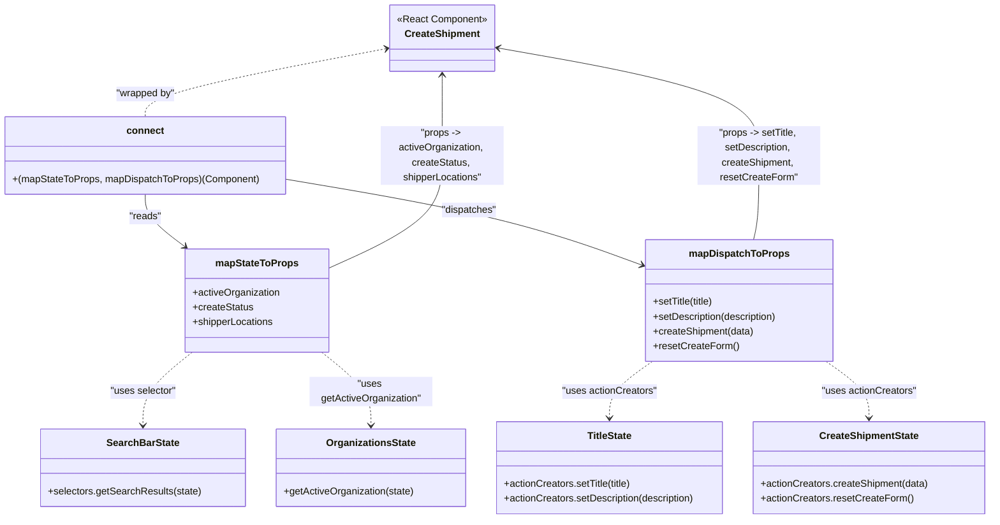

# Diagram: web/portal/src/pages/shipments/create-shipment/CreateShipment.page.container.js

> Auto-generated by Obscura crawlers

## Mermaid

### SVG

<svg id="container" width="1611.525390625" xmlns="http://www.w3.org/2000/svg" class="classDiagram" height="844" viewBox="0 0 1611.525390625 844" role="graphics-document document" aria-roledescription="class"><g><defs><marker id="container_class-aggregationStart" class="marker aggregation class" refX="18" refY="7" markerWidth="190" markerHeight="240" orient="auto"><path d="M 18,7 L9,13 L1,7 L9,1 Z"></path></marker></defs><defs><marker id="container_class-aggregationEnd" class="marker aggregation class" refX="1" refY="7" markerWidth="20" markerHeight="28" orient="auto"><path d="M 18,7 L9,13 L1,7 L9,1 Z"></path></marker></defs><defs><marker id="container_class-extensionStart" class="marker extension class" refX="18" refY="7" markerWidth="190" markerHeight="240" orient="auto"><path d="M 1,7 L18,13 V 1 Z"></path></marker></defs><defs><marker id="container_class-extensionEnd" class="marker extension class" refX="1" refY="7" markerWidth="20" markerHeight="28" orient="auto"><path d="M 1,1 V 13 L18,7 Z"></path></marker></defs><defs><marker id="container_class-compositionStart" class="marker composition class" refX="18" refY="7" markerWidth="190" markerHeight="240" orient="auto"><path d="M 18,7 L9,13 L1,7 L9,1 Z"></path></marker></defs><defs><marker id="container_class-compositionEnd" class="marker composition class" refX="1" refY="7" markerWidth="20" markerHeight="28" orient="auto"><path d="M 18,7 L9,13 L1,7 L9,1 Z"></path></marker></defs><defs><marker id="container_class-dependencyStart" class="marker dependency class" refX="6" refY="7" markerWidth="190" markerHeight="240" orient="auto"><path d="M 5,7 L9,13 L1,7 L9,1 Z"></path></marker></defs><defs><marker id="container_class-dependencyEnd" class="marker dependency class" refX="13" refY="7" markerWidth="20" markerHeight="28" orient="auto"><path d="M 18,7 L9,13 L14,7 L9,1 Z"></path></marker></defs><defs><marker id="container_class-lollipopStart" class="marker lollipop class" refX="13" refY="7" markerWidth="190" markerHeight="240" orient="auto"><circle stroke="black" fill="transparent" cx="7" cy="7" r="6"></circle></marker></defs><defs><marker id="container_class-lollipopEnd" class="marker lollipop class" refX="1" refY="7" markerWidth="190" markerHeight="240" orient="auto"><circle stroke="black" fill="transparent" cx="7" cy="7" r="6"></circle></marker></defs><g class="root"><g class="clusters"></g><g class="edgePaths"><path d="M625.969,79.181L560.729,91.484C495.489,103.787,365.008,128.394,299.768,146.864C234.527,165.333,234.527,177.667,234.527,183.833L234.527,190" id="id_CreateShipment_connect_1" class="edge-thickness-normal edge-pattern-dashed relation" style=";;;" data-edge="true" data-et="edge" data-id="id_CreateShipment_connect_1" data-points="W3sieCI6NjMxLjg2NTIzNDM3NSwieSI6NzguMDY5MjQ0OTM1NTQzMjh9LHsieCI6MjM0LjUyNzM0Mzc1LCJ5IjoxNTN9LHsieCI6MjM0LjUyNzM0Mzc1LCJ5IjoxOTB9XQ==" marker-start="url(#container_class-dependencyStart)"></path><path d="M234.527,316L234.527,322.167C234.527,328.333,234.527,340.667,245.248,354.899C255.968,369.131,277.408,385.262,288.128,393.327L298.848,401.393" id="id_connect_mapStateToProps_2" class="edge-thickness-normal edge-pattern-solid relation" style=";;;" data-edge="true" data-et="edge" data-id="id_connect_mapStateToProps_2" data-points="W3sieCI6MjM0LjUyNzM0Mzc1LCJ5IjozMTZ9LHsieCI6MjM0LjUyNzM0Mzc1LCJ5IjozNTN9LHsieCI6MzAzLjY0Mjg2NTM0OTI2NDcsInkiOjQwNX1d" marker-end="url(#container_class-dependencyEnd)"></path><path d="M461.055,291.229L522.058,301.524C583.062,311.82,705.069,332.41,802.092,355.751C899.116,379.092,971.155,405.183,1007.175,418.229L1043.195,431.275" id="id_connect_mapDispatchToProps_3" class="edge-thickness-normal edge-pattern-solid relation" style=";;;" data-edge="true" data-et="edge" data-id="id_connect_mapDispatchToProps_3" data-points="W3sieCI6NDYxLjA1NDY4NzUsInkiOjI5MS4yMjkzMTI1ODk2MTM4N30seyJ4Ijo4MjcuMDc2MTcxODc1LCJ5IjozNTN9LHsieCI6MTA0OC44MzU5Mzc1LCJ5Ijo0MzMuMzE4MjAyMzg3NDU0MTZ9XQ==" marker-end="url(#container_class-dependencyEnd)"></path><path d="M311.016,573L297.775,583.667C284.533,594.333,258.051,615.667,244.81,635.5C231.568,655.333,231.568,673.667,231.568,682.833L231.568,692" id="id_mapStateToProps_SearchBarState_4" class="edge-thickness-normal edge-pattern-dashed relation" style=";;;" data-edge="true" data-et="edge" data-id="id_mapStateToProps_SearchBarState_4" data-points="W3sieCI6MzExLjAxNTk5NDUxMDEzNTEsInkiOjU3M30seyJ4IjoyMzEuNTY4MzU5Mzc1LCJ5Ijo2Mzd9LHsieCI6MjMxLjU2ODM1OTM3NSwieSI6Njk4fV0=" marker-end="url(#container_class-dependencyEnd)"></path><path d="M519.566,573L532.807,583.667C546.049,594.333,572.531,615.667,585.772,635.5C599.014,655.333,599.014,673.667,599.014,682.833L599.014,692" id="id_mapStateToProps_OrganizationsState_5" class="edge-thickness-normal edge-pattern-dashed relation" style=";;;" data-edge="true" data-et="edge" data-id="id_mapStateToProps_OrganizationsState_5" data-points="W3sieCI6NTE5LjU2NjAzNjczOTg2NDksInkiOjU3M30seyJ4Ijo1OTkuMDEzNjcxODc1LCJ5Ijo2Mzd9LHsieCI6NTk5LjAxMzY3MTg3NSwieSI6Njk4fV0=" marker-end="url(#container_class-dependencyEnd)"></path><path d="M531.146,436.79L562.135,422.825C593.123,408.86,655.1,380.93,686.088,350.298C717.076,319.667,717.076,286.333,717.076,253C717.076,219.667,717.076,186.333,717.076,164.5C717.076,142.667,717.076,132.333,717.076,127.167L717.076,122" id="id_mapStateToProps_CreateShipment_6" class="edge-thickness-normal edge-pattern-solid relation" style=";;;" data-edge="true" data-et="edge" data-id="id_mapStateToProps_CreateShipment_6" data-points="W3sieCI6NTMxLjE0NjQ4NDM3NSwieSI6NDM2Ljc4OTUzMzYzNDQ5MjY3fSx7IngiOjcxNy4wNzYxNzE4NzUsInkiOjM1M30seyJ4Ijo3MTcuMDc2MTcxODc1LCJ5IjoyNTN9LHsieCI6NzE3LjA3NjE3MTg3NSwieSI6MTUzfSx7IngiOjcxNy4wNzYxNzE4NzUsInkiOjExNn1d" marker-end="url(#container_class-dependencyEnd)"></path><path d="M1060.226,588L1048.484,596.167C1036.741,604.333,1013.256,620.667,1001.514,636C989.771,651.333,989.771,665.667,989.771,672.833L989.771,680" id="id_mapDispatchToProps_TitleState_7" class="edge-thickness-normal edge-pattern-dashed relation" style=";;;" data-edge="true" data-et="edge" data-id="id_mapDispatchToProps_TitleState_7" data-points="W3sieCI6MTA2MC4yMjY0NDM3Mjg4ODUyLCJ5Ijo1ODh9LHsieCI6OTg5Ljc3MTQ4NDM3NSwieSI6NjM3fSx7IngiOjk4OS43NzE0ODQzNzUsInkiOjY4Nn1d" marker-end="url(#container_class-dependencyEnd)"></path><path d="M1344.922,588L1356.664,596.167C1368.407,604.333,1391.892,620.667,1403.634,636C1415.377,651.333,1415.377,665.667,1415.377,672.833L1415.377,680" id="id_mapDispatchToProps_CreateShipmentState_8" class="edge-thickness-normal edge-pattern-dashed relation" style=";;;" data-edge="true" data-et="edge" data-id="id_mapDispatchToProps_CreateShipmentState_8" data-points="W3sieCI6MTM0NC45MjE5OTM3NzExMTQ4LCJ5Ijo1ODh9LHsieCI6MTQxNS4zNzY5NTMxMjUsInkiOjYzN30seyJ4IjoxNDE1LjM3Njk1MzEyNSwieSI6Njg2fV0=" marker-end="url(#container_class-dependencyEnd)"></path><path d="M1226.366,390L1227.848,383.833C1229.33,377.667,1232.294,365.333,1233.776,342.5C1235.258,319.667,1235.258,286.333,1235.258,253C1235.258,219.667,1235.258,186.333,1164.081,157.167C1092.904,128.001,950.55,103.001,879.374,90.502L808.197,78.002" id="id_mapDispatchToProps_CreateShipment_9" class="edge-thickness-normal edge-pattern-solid relation" style=";;;" data-edge="true" data-et="edge" data-id="id_mapDispatchToProps_CreateShipment_9" data-points="W3sieCI6MTIyNi4zNjU5NTI0MzU2NjE3LCJ5IjozOTB9LHsieCI6MTIzNS4yNTc4MTI1LCJ5IjozNTN9LHsieCI6MTIzNS4yNTc4MTI1LCJ5IjoyNTN9LHsieCI6MTIzNS4yNTc4MTI1LCJ5IjoxNTN9LHsieCI6ODAyLjI4NzEwOTM3NSwieSI6NzYuOTY0MjQxNjk1NTMyMzh9XQ==" marker-end="url(#container_class-dependencyEnd)"></path></g><g class="edgeLabels"><g class="edgeLabel" transform="translate(234.52734375, 153)"><g class="label" data-id="id_CreateShipment_connect_1" transform="translate(-48.7109375, -12)"><foreignObject width="97.421875" height="24">

"wrapped by"

</foreignObject></g></g><g class="edgeLabel" transform="translate(234.52734375, 353)"><g class="label" data-id="id_connect_mapStateToProps_2" transform="translate(-26.265625, -12)"><foreignObject width="52.53125" height="24">

"reads"

</foreignObject></g></g><g class="edgeLabel" transform="translate(760.3495, 341.73904)"><g class="label" data-id="id_connect_mapDispatchToProps_3" transform="translate(-45.3671875, -12)"><foreignObject width="90.734375" height="24">

"dispatches"

</foreignObject></g></g><g class="edgeLabel" transform="translate(231.568359375, 637)"><g class="label" data-id="id_mapStateToProps_SearchBarState_4" transform="translate(-54.140625, -12)"><foreignObject width="108.28125" height="24">

"uses selector"

</foreignObject></g></g><g class="edgeLabel" transform="translate(599.013671875, 637)"><g class="label" data-id="id_mapStateToProps_OrganizationsState_5" transform="translate(-100, -24)"><foreignObject width="200" height="48">

"uses getActiveOrganization"

</foreignObject></g></g><g class="edgeLabel" transform="translate(717.076171875, 253)"><g class="label" data-id="id_mapStateToProps_CreateShipment_6" transform="translate(-100, -48)"><foreignObject width="200" height="96">

"props -&gt; activeOrganization, createStatus, shipperLocations"

</foreignObject></g></g><g class="edgeLabel" transform="translate(989.771484375, 637)"><g class="label" data-id="id_mapDispatchToProps_TitleState_7" transform="translate(-77.5390625, -12)"><foreignObject width="155.078125" height="24">

"uses actionCreators"

</foreignObject></g></g><g class="edgeLabel" transform="translate(1415.376953125, 637)"><g class="label" data-id="id_mapDispatchToProps_CreateShipmentState_8" transform="translate(-77.5390625, -12)"><foreignObject width="155.078125" height="24">

"uses actionCreators"

</foreignObject></g></g><g class="edgeLabel" transform="translate(1235.2578125, 253)"><g class="label" data-id="id_mapDispatchToProps_CreateShipment_9" transform="translate(-100, -48)"><foreignObject width="200" height="96">

"props -&gt; setTitle, setDescription, createShipment, resetCreateForm"

</foreignObject></g></g></g><g class="nodes"><g class="node default" id="classId-CreateShipment-0" transform="translate(717.076171875, 62)"><g class="basic label-container"><path d="M-85.2109375 -54 L85.2109375 -54 L85.2109375 54 L-85.2109375 54" stroke="none" stroke-width="0" fill="#ECECFF" style=""></path><path d="M-85.2109375 -54 C-24.610017307621114 -54, 35.99090288475777 -54, 85.2109375 -54 M-85.2109375 -54 C-17.546414429504395 -54, 50.11810864099121 -54, 85.2109375 -54 M85.2109375 -54 C85.2109375 -30.31136565552229, 85.2109375 -6.622731311044582, 85.2109375 54 M85.2109375 -54 C85.2109375 -27.631786596887274, 85.2109375 -1.2635731937745476, 85.2109375 54 M85.2109375 54 C38.474215628331955 54, -8.262506243336091 54, -85.2109375 54 M85.2109375 54 C42.48286783698901 54, -0.24520182602198304 54, -85.2109375 54 M-85.2109375 54 C-85.2109375 20.82199360112157, -85.2109375 -12.356012797756861, -85.2109375 -54 M-85.2109375 54 C-85.2109375 21.283604318747514, -85.2109375 -11.432791362504972, -85.2109375 -54" stroke="#9370DB" stroke-width="1.3" fill="none" stroke-dasharray="0 0" style=""></path></g><g class="annotation-group text" transform="translate(-73.2109375, -30)"><g class="label" style="" transform="translate(0,-12)"><foreignObject width="146.421875" height="24">

«React Component»

</foreignObject></g></g><g class="label-group text" transform="translate(-58.65625, -6)"><g class="label" style="font-weight: bolder" transform="translate(0,-12)"><foreignObject width="117.3125" height="24">

CreateShipment

</foreignObject></g></g><g class="members-group text" transform="translate(-73.2109375, 42)"></g><g class="methods-group text" transform="translate(-73.2109375, 72)"></g><g class="divider" style=""><path d="M-85.2109375 18 C-17.459174270933772 18, 50.292588958132455 18, 85.2109375 18 M-85.2109375 18 C-22.704909067671927 18, 39.801119364656145 18, 85.2109375 18" stroke="#9370DB" stroke-width="1.3" fill="none" stroke-dasharray="0 0" style=""></path></g><g class="divider" style=""><path d="M-85.2109375 36 C-42.25249726550301 36, 0.7059429689939805 36, 85.2109375 36 M-85.2109375 36 C-29.158309081318833 36, 26.894319337362333 36, 85.2109375 36" stroke="#9370DB" stroke-width="1.3" fill="none" stroke-dasharray="0 0" style=""></path></g></g><g class="node default" id="classId-connect-1" transform="translate(234.52734375, 253)"><g class="basic label-container"><path d="M-226.52734375 -63 L226.52734375 -63 L226.52734375 63 L-226.52734375 63" stroke="none" stroke-width="0" fill="#ECECFF" style=""></path><path d="M-226.52734375 -63 C-60.53527265515484 -63, 105.45679843969032 -63, 226.52734375 -63 M-226.52734375 -63 C-132.76920632817672 -63, -39.011068906353415 -63, 226.52734375 -63 M226.52734375 -63 C226.52734375 -35.27730718713916, 226.52734375 -7.554614374278316, 226.52734375 63 M226.52734375 -63 C226.52734375 -33.24290453700939, 226.52734375 -3.485809074018775, 226.52734375 63 M226.52734375 63 C76.66925716819941 63, -73.18882941360118 63, -226.52734375 63 M226.52734375 63 C135.62257509117808 63, 44.717806432356184 63, -226.52734375 63 M-226.52734375 63 C-226.52734375 22.46357754593295, -226.52734375 -18.0728449081341, -226.52734375 -63 M-226.52734375 63 C-226.52734375 19.69425499109608, -226.52734375 -23.61149001780784, -226.52734375 -63" stroke="#9370DB" stroke-width="1.3" fill="none" stroke-dasharray="0 0" style=""></path></g><g class="annotation-group text" transform="translate(0, -39)"></g><g class="label-group text" transform="translate(-28.9140625, -39)"><g class="label" style="font-weight: bolder" transform="translate(0,-12)"><foreignObject width="57.828125" height="24">

connect

</foreignObject></g></g><g class="members-group text" transform="translate(-214.52734375, 9)"></g><g class="methods-group text" transform="translate(-214.52734375, 39)"><g class="label" style="" transform="translate(0,-12)"><foreignObject width="400.140625" height="24">

+(mapStateToProps, mapDispatchToProps)(Component)

</foreignObject></g></g><g class="divider" style=""><path d="M-226.52734375 -15 C-93.9106648602685 -15, 38.706014029463006 -15, 226.52734375 -15 M-226.52734375 -15 C-74.68197233931699 -15, 77.16339907136603 -15, 226.52734375 -15" stroke="#9370DB" stroke-width="1.3" fill="none" stroke-dasharray="0 0" style=""></path></g><g class="divider" style=""><path d="M-226.52734375 9 C-132.14587780031474 9, -37.76441185062944 9, 226.52734375 9 M-226.52734375 9 C-76.33655873009715 9, 73.8542262898057 9, 226.52734375 9" stroke="#9370DB" stroke-width="1.3" fill="none" stroke-dasharray="0 0" style=""></path></g></g><g class="node default" id="classId-mapStateToProps-2" transform="translate(415.291015625, 489)"><g class="basic label-container"><path d="M-115.85546875 -84 L115.85546875 -84 L115.85546875 84 L-115.85546875 84" stroke="none" stroke-width="0" fill="#ECECFF" style=""></path><path d="M-115.85546875 -84 C-53.745387820895466 -84, 8.364693108209067 -84, 115.85546875 -84 M-115.85546875 -84 C-28.524604475088694 -84, 58.80625979982261 -84, 115.85546875 -84 M115.85546875 -84 C115.85546875 -48.49722251855205, 115.85546875 -12.9944450371041, 115.85546875 84 M115.85546875 -84 C115.85546875 -21.198264275093102, 115.85546875 41.603471449813796, 115.85546875 84 M115.85546875 84 C40.53331371373466 84, -34.788841322530686 84, -115.85546875 84 M115.85546875 84 C68.72414764577996 84, 21.592826541559916 84, -115.85546875 84 M-115.85546875 84 C-115.85546875 24.004446016168835, -115.85546875 -35.99110796766233, -115.85546875 -84 M-115.85546875 84 C-115.85546875 44.927371522436445, -115.85546875 5.85474304487289, -115.85546875 -84" stroke="#9370DB" stroke-width="1.3" fill="none" stroke-dasharray="0 0" style=""></path></g><g class="annotation-group text" transform="translate(0, -60)"></g><g class="label-group text" transform="translate(-64.7109375, -60)"><g class="label" style="font-weight: bolder" transform="translate(0,-12)"><foreignObject width="129.421875" height="24">

mapStateToProps

</foreignObject></g></g><g class="members-group text" transform="translate(-103.85546875, -12)"><g class="label" style="" transform="translate(0,-12)"><foreignObject width="143" height="24">

+activeOrganization

</foreignObject></g><g class="label" style="" transform="translate(0,12)"><foreignObject width="98.5" height="24">

+createStatus

</foreignObject></g><g class="label" style="" transform="translate(0,36)"><foreignObject width="132.84375" height="24">

+shipperLocations

</foreignObject></g></g><g class="methods-group text" transform="translate(-103.85546875, 84)"></g><g class="divider" style=""><path d="M-115.85546875 -36 C-24.008413467797695 -36, 67.83864181440461 -36, 115.85546875 -36 M-115.85546875 -36 C-57.08950630444945 -36, 1.6764561411010988 -36, 115.85546875 -36" stroke="#9370DB" stroke-width="1.3" fill="none" stroke-dasharray="0 0" style=""></path></g><g class="divider" style=""><path d="M-115.85546875 60 C-44.236615840865326 60, 27.382237068269347 60, 115.85546875 60 M-115.85546875 60 C-60.380760811413936 60, -4.906052872827871 60, 115.85546875 60" stroke="#9370DB" stroke-width="1.3" fill="none" stroke-dasharray="0 0" style=""></path></g></g><g class="node default" id="classId-mapDispatchToProps-3" transform="translate(1202.57421875, 489)"><g class="basic label-container"><path d="M-153.73828125 -99 L153.73828125 -99 L153.73828125 99 L-153.73828125 99" stroke="none" stroke-width="0" fill="#ECECFF" style=""></path><path d="M-153.73828125 -99 C-69.66210372440257 -99, 14.41407380119486 -99, 153.73828125 -99 M-153.73828125 -99 C-31.915322814483545 -99, 89.90763562103291 -99, 153.73828125 -99 M153.73828125 -99 C153.73828125 -57.82213278572622, 153.73828125 -16.644265571452436, 153.73828125 99 M153.73828125 -99 C153.73828125 -55.53053885758226, 153.73828125 -12.061077715164515, 153.73828125 99 M153.73828125 99 C60.774274417519436 99, -32.18973241496113 99, -153.73828125 99 M153.73828125 99 C38.04259370860838 99, -77.65309383278324 99, -153.73828125 99 M-153.73828125 99 C-153.73828125 38.207294235087026, -153.73828125 -22.585411529825947, -153.73828125 -99 M-153.73828125 99 C-153.73828125 23.871505003883755, -153.73828125 -51.25698999223249, -153.73828125 -99" stroke="#9370DB" stroke-width="1.3" fill="none" stroke-dasharray="0 0" style=""></path></g><g class="annotation-group text" transform="translate(0, -75)"></g><g class="label-group text" transform="translate(-77.1953125, -75)"><g class="label" style="font-weight: bolder" transform="translate(0,-12)"><foreignObject width="154.390625" height="24">

mapDispatchToProps

</foreignObject></g></g><g class="members-group text" transform="translate(-141.73828125, -27)"></g><g class="methods-group text" transform="translate(-141.73828125, 3)"><g class="label" style="" transform="translate(0,-12)"><foreignObject width="101.28125" height="24">

+setTitle(title)

</foreignObject></g><g class="label" style="" transform="translate(0,12)"><foreignObject width="206.28125" height="24">

+setDescription(description)

</foreignObject></g><g class="label" style="" transform="translate(0,36)"><foreignObject width="165.5625" height="24">

+createShipment(data)

</foreignObject></g><g class="label" style="" transform="translate(0,60)"><foreignObject width="137.203125" height="24">

+resetCreateForm()

</foreignObject></g></g><g class="divider" style=""><path d="M-153.73828125 -51 C-62.81182446180111 -51, 28.114632326397782 -51, 153.73828125 -51 M-153.73828125 -51 C-74.2957623088081 -51, 5.146756632383813 -51, 153.73828125 -51" stroke="#9370DB" stroke-width="1.3" fill="none" stroke-dasharray="0 0" style=""></path></g><g class="divider" style=""><path d="M-153.73828125 -27 C-39.85891641749484 -27, 74.02044841501032 -27, 153.73828125 -27 M-153.73828125 -27 C-51.08293907937039 -27, 51.57240309125922 -27, 153.73828125 -27" stroke="#9370DB" stroke-width="1.3" fill="none" stroke-dasharray="0 0" style=""></path></g></g><g class="node default" id="classId-SearchBarState-4" transform="translate(231.568359375, 761)"><g class="basic label-container"><path d="M-164.14453125 -63 L164.14453125 -63 L164.14453125 63 L-164.14453125 63" stroke="none" stroke-width="0" fill="#ECECFF" style=""></path><path d="M-164.14453125 -63 C-57.502508602751945 -63, 49.13951404449611 -63, 164.14453125 -63 M-164.14453125 -63 C-58.94279770819112 -63, 46.258935833617755 -63, 164.14453125 -63 M164.14453125 -63 C164.14453125 -16.690536889246005, 164.14453125 29.61892622150799, 164.14453125 63 M164.14453125 -63 C164.14453125 -29.38056097447464, 164.14453125 4.238878051050719, 164.14453125 63 M164.14453125 63 C80.75577848462015 63, -2.632974280759697 63, -164.14453125 63 M164.14453125 63 C68.41687843912892 63, -27.310774371742156 63, -164.14453125 63 M-164.14453125 63 C-164.14453125 37.29003030140052, -164.14453125 11.580060602801048, -164.14453125 -63 M-164.14453125 63 C-164.14453125 35.1166954122842, -164.14453125 7.23339082456841, -164.14453125 -63" stroke="#9370DB" stroke-width="1.3" fill="none" stroke-dasharray="0 0" style=""></path></g><g class="annotation-group text" transform="translate(0, -39)"></g><g class="label-group text" transform="translate(-56.5546875, -39)"><g class="label" style="font-weight: bolder" transform="translate(0,-12)"><foreignObject width="113.109375" height="24">

SearchBarState

</foreignObject></g></g><g class="members-group text" transform="translate(-152.14453125, 9)"></g><g class="methods-group text" transform="translate(-152.14453125, 39)"><g class="label" style="" transform="translate(0,-12)"><foreignObject width="247.734375" height="24">

+selectors.getSearchResults(state)

</foreignObject></g></g><g class="divider" style=""><path d="M-164.14453125 -15 C-88.95602676649888 -15, -13.76752228299776 -15, 164.14453125 -15 M-164.14453125 -15 C-92.16735773549772 -15, -20.190184220995434 -15, 164.14453125 -15" stroke="#9370DB" stroke-width="1.3" fill="none" stroke-dasharray="0 0" style=""></path></g><g class="divider" style=""><path d="M-164.14453125 9 C-81.10199195503239 9, 1.9405473399352218 9, 164.14453125 9 M-164.14453125 9 C-78.76029966182905 9, 6.623931926341896 9, 164.14453125 9" stroke="#9370DB" stroke-width="1.3" fill="none" stroke-dasharray="0 0" style=""></path></g></g><g class="node default" id="classId-CreateShipmentState-5" transform="translate(1415.376953125, 761)"><g class="basic label-container"><path d="M-188.1484375 -75 L188.1484375 -75 L188.1484375 75 L-188.1484375 75" stroke="none" stroke-width="0" fill="#ECECFF" style=""></path><path d="M-188.1484375 -75 C-42.6442521030755 -75, 102.859933293849 -75, 188.1484375 -75 M-188.1484375 -75 C-87.62080780573939 -75, 12.906821888521222 -75, 188.1484375 -75 M188.1484375 -75 C188.1484375 -26.095513017549642, 188.1484375 22.808973964900716, 188.1484375 75 M188.1484375 -75 C188.1484375 -30.951722228454173, 188.1484375 13.096555543091654, 188.1484375 75 M188.1484375 75 C72.15354575726198 75, -43.84134598547604 75, -188.1484375 75 M188.1484375 75 C59.55775841085563 75, -69.03292067828875 75, -188.1484375 75 M-188.1484375 75 C-188.1484375 43.027371194151705, -188.1484375 11.05474238830341, -188.1484375 -75 M-188.1484375 75 C-188.1484375 31.50166856593639, -188.1484375 -11.996662868127217, -188.1484375 -75" stroke="#9370DB" stroke-width="1.3" fill="none" stroke-dasharray="0 0" style=""></path></g><g class="annotation-group text" transform="translate(0, -51)"></g><g class="label-group text" transform="translate(-77.96875, -51)"><g class="label" style="font-weight: bolder" transform="translate(0,-12)"><foreignObject width="155.9375" height="24">

CreateShipmentState

</foreignObject></g></g><g class="members-group text" transform="translate(-176.1484375, -3)"></g><g class="methods-group text" transform="translate(-176.1484375, 27)"><g class="label" style="" transform="translate(0,-12)"><foreignObject width="274.328125" height="24">

+actionCreators.createShipment(data)

</foreignObject></g><g class="label" style="" transform="translate(0,12)"><foreignObject width="246.140625" height="24">

+actionCreators.resetCreateForm()

</foreignObject></g></g><g class="divider" style=""><path d="M-188.1484375 -27 C-58.87509740105335 -27, 70.3982426978933 -27, 188.1484375 -27 M-188.1484375 -27 C-80.64581511158936 -27, 26.856807276821286 -27, 188.1484375 -27" stroke="#9370DB" stroke-width="1.3" fill="none" stroke-dasharray="0 0" style=""></path></g><g class="divider" style=""><path d="M-188.1484375 -3 C-74.88100519595811 -3, 38.38642710808378 -3, 188.1484375 -3 M-188.1484375 -3 C-56.68379834188633 -3, 74.78084081622734 -3, 188.1484375 -3" stroke="#9370DB" stroke-width="1.3" fill="none" stroke-dasharray="0 0" style=""></path></g></g><g class="node default" id="classId-TitleState-6" transform="translate(989.771484375, 761)"><g class="basic label-container"><path d="M-187.45703125 -75 L187.45703125 -75 L187.45703125 75 L-187.45703125 75" stroke="none" stroke-width="0" fill="#ECECFF" style=""></path><path d="M-187.45703125 -75 C-99.93979334080004 -75, -12.422555431600074 -75, 187.45703125 -75 M-187.45703125 -75 C-54.547108201880405 -75, 78.36281484623919 -75, 187.45703125 -75 M187.45703125 -75 C187.45703125 -24.41770743061447, 187.45703125 26.16458513877106, 187.45703125 75 M187.45703125 -75 C187.45703125 -26.75529445158608, 187.45703125 21.489411096827837, 187.45703125 75 M187.45703125 75 C64.74875663561578 75, -57.959517978768446 75, -187.45703125 75 M187.45703125 75 C48.513514048940124 75, -90.43000315211975 75, -187.45703125 75 M-187.45703125 75 C-187.45703125 15.288361306567516, -187.45703125 -44.42327738686497, -187.45703125 -75 M-187.45703125 75 C-187.45703125 31.55919094628665, -187.45703125 -11.881618107426704, -187.45703125 -75" stroke="#9370DB" stroke-width="1.3" fill="none" stroke-dasharray="0 0" style=""></path></g><g class="annotation-group text" transform="translate(0, -51)"></g><g class="label-group text" transform="translate(-35.6484375, -51)"><g class="label" style="font-weight: bolder" transform="translate(0,-12)"><foreignObject width="71.296875" height="24">

TitleState

</foreignObject></g></g><g class="members-group text" transform="translate(-175.45703125, -3)"></g><g class="methods-group text" transform="translate(-175.45703125, 27)"><g class="label" style="" transform="translate(0,-12)"><foreignObject width="210.28125" height="24">

+actionCreators.setTitle(title)

</foreignObject></g><g class="label" style="" transform="translate(0,12)"><foreignObject width="315.265625" height="24">

+actionCreators.setDescription(description)

</foreignObject></g></g><g class="divider" style=""><path d="M-187.45703125 -27 C-40.73937095038886 -27, 105.97828934922228 -27, 187.45703125 -27 M-187.45703125 -27 C-105.44705871968593 -27, -23.437086189371854 -27, 187.45703125 -27" stroke="#9370DB" stroke-width="1.3" fill="none" stroke-dasharray="0 0" style=""></path></g><g class="divider" style=""><path d="M-187.45703125 -3 C-78.84492983881519 -3, 29.76717157236962 -3, 187.45703125 -3 M-187.45703125 -3 C-66.00434061988217 -3, 55.44835001023566 -3, 187.45703125 -3" stroke="#9370DB" stroke-width="1.3" fill="none" stroke-dasharray="0 0" style=""></path></g></g><g class="node default" id="classId-OrganizationsState-7" transform="translate(599.013671875, 761)"><g class="basic label-container"><path d="M-153.30078125 -63 L153.30078125 -63 L153.30078125 63 L-153.30078125 63" stroke="none" stroke-width="0" fill="#ECECFF" style=""></path><path d="M-153.30078125 -63 C-48.486430987676854 -63, 56.32791927464629 -63, 153.30078125 -63 M-153.30078125 -63 C-35.074366898083454 -63, 83.15204745383309 -63, 153.30078125 -63 M153.30078125 -63 C153.30078125 -24.430278727286932, 153.30078125 14.139442545426135, 153.30078125 63 M153.30078125 -63 C153.30078125 -22.10324955438974, 153.30078125 18.793500891220518, 153.30078125 63 M153.30078125 63 C31.006568580704112 63, -91.28764408859178 63, -153.30078125 63 M153.30078125 63 C45.24129752414649 63, -62.81818620170702 63, -153.30078125 63 M-153.30078125 63 C-153.30078125 34.36903069375914, -153.30078125 5.738061387518293, -153.30078125 -63 M-153.30078125 63 C-153.30078125 28.952120739342448, -153.30078125 -5.095758521315105, -153.30078125 -63" stroke="#9370DB" stroke-width="1.3" fill="none" stroke-dasharray="0 0" style=""></path></g><g class="annotation-group text" transform="translate(0, -39)"></g><g class="label-group text" transform="translate(-69.8671875, -39)"><g class="label" style="font-weight: bolder" transform="translate(0,-12)"><foreignObject width="139.734375" height="24">

OrganizationsState

</foreignObject></g></g><g class="members-group text" transform="translate(-141.30078125, 9)"></g><g class="methods-group text" transform="translate(-141.30078125, 39)"><g class="label" style="" transform="translate(0,-12)"><foreignObject width="212.734375" height="24">

+getActiveOrganization(state)

</foreignObject></g></g><g class="divider" style=""><path d="M-153.30078125 -15 C-69.6793968549052 -15, 13.941987540189587 -15, 153.30078125 -15 M-153.30078125 -15 C-70.97578922018677 -15, 11.349202809626462 -15, 153.30078125 -15" stroke="#9370DB" stroke-width="1.3" fill="none" stroke-dasharray="0 0" style=""></path></g><g class="divider" style=""><path d="M-153.30078125 9 C-50.333043522652744 9, 52.63469420469451 9, 153.30078125 9 M-153.30078125 9 C-70.74302373625906 9, 11.814733777481877 9, 153.30078125 9" stroke="#9370DB" stroke-width="1.3" fill="none" stroke-dasharray="0 0" style=""></path></g></g></g></g></g></svg>
