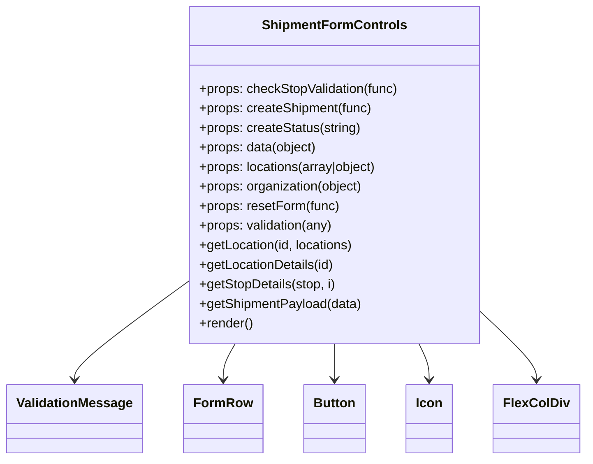

# Diagram: web/portal/src/pages/shipments/create-shipment/components/organisms/ShipmentFormControls.organism.js


> Auto-generated by Obscura crawlers

## Diagram 1



### SVG

<svg id="container" width="695.484375" xmlns="http://www.w3.org/2000/svg" class="classDiagram" height="564" viewBox="0 0 695.484375 564" role="graphics-document document" aria-roledescription="class"><style>#container{font-family:"trebuchet ms",verdana,arial,sans-serif;font-size:16px;fill:#333;}@keyframes edge-animation-frame{from{stroke-dashoffset:0;}}@keyframes dash{to{stroke-dashoffset:0;}}#container .edge-animation-slow{stroke-dasharray:9,5!important;stroke-dashoffset:900;animation:dash 50s linear infinite;stroke-linecap:round;}#container .edge-animation-fast{stroke-dasharray:9,5!important;stroke-dashoffset:900;animation:dash 20s linear infinite;stroke-linecap:round;}#container .error-icon{fill:#552222;}#container .error-text{fill:#552222;stroke:#552222;}#container .edge-thickness-normal{stroke-width:1px;}#container .edge-thickness-thick{stroke-width:3.5px;}#container .edge-pattern-solid{stroke-dasharray:0;}#container .edge-thickness-invisible{stroke-width:0;fill:none;}#container .edge-pattern-dashed{stroke-dasharray:3;}#container .edge-pattern-dotted{stroke-dasharray:2;}#container .marker{fill:#333333;stroke:#333333;}#container .marker.cross{stroke:#333333;}#container svg{font-family:"trebuchet ms",verdana,arial,sans-serif;font-size:16px;}#container p{margin:0;}#container g.classGroup text{fill:#9370DB;stroke:none;font-family:"trebuchet ms",verdana,arial,sans-serif;font-size:10px;}#container g.classGroup text .title{font-weight:bolder;}#container .nodeLabel,#container .edgeLabel{color:#131300;}#container .edgeLabel .label rect{fill:#ECECFF;}#container .label text{fill:#131300;}#container .labelBkg{background:#ECECFF;}#container .edgeLabel .label span{background:#ECECFF;}#container .classTitle{font-weight:bolder;}#container .node rect,#container .node circle,#container .node ellipse,#container .node polygon,#container .node path{fill:#ECECFF;stroke:#9370DB;stroke-width:1px;}#container .divider{stroke:#9370DB;stroke-width:1;}#container g.clickable{cursor:pointer;}#container g.classGroup rect{fill:#ECECFF;stroke:#9370DB;}#container g.classGroup line{stroke:#9370DB;stroke-width:1;}#container .classLabel .box{stroke:none;stroke-width:0;fill:#ECECFF;opacity:0.5;}#container .classLabel .label{fill:#9370DB;font-size:10px;}#container .relation{stroke:#333333;stroke-width:1;fill:none;}#container .dashed-line{stroke-dasharray:3;}#container .dotted-line{stroke-dasharray:1 2;}#container #compositionStart,#container .composition{fill:#333333!important;stroke:#333333!important;stroke-width:1;}#container #compositionEnd,#container .composition{fill:#333333!important;stroke:#333333!important;stroke-width:1;}#container #dependencyStart,#container .dependency{fill:#333333!important;stroke:#333333!important;stroke-width:1;}#container #dependencyStart,#container .dependency{fill:#333333!important;stroke:#333333!important;stroke-width:1;}#container #extensionStart,#container .extension{fill:transparent!important;stroke:#333333!important;stroke-width:1;}#container #extensionEnd,#container .extension{fill:transparent!important;stroke:#333333!important;stroke-width:1;}#container #aggregationStart,#container .aggregation{fill:transparent!important;stroke:#333333!important;stroke-width:1;}#container #aggregationEnd,#container .aggregation{fill:transparent!important;stroke:#333333!important;stroke-width:1;}#container #lollipopStart,#container .lollipop{fill:#ECECFF!important;stroke:#333333!important;stroke-width:1;}#container #lollipopEnd,#container .lollipop{fill:#ECECFF!important;stroke:#333333!important;stroke-width:1;}#container .edgeTerminals{font-size:11px;line-height:initial;}#container .classTitleText{text-anchor:middle;font-size:18px;fill:#333;}#container .label-icon{display:inline-block;height:1em;overflow:visible;vertical-align:-0.125em;}#container .node .label-icon path{fill:currentColor;stroke:revert;stroke-width:revert;}#container :root{--mermaid-font-family:"trebuchet ms",verdana,arial,sans-serif;}</style><g><defs><marker id="container_class-aggregationStart" class="marker aggregation class" refX="18" refY="7" markerWidth="190" markerHeight="240" orient="auto"><path d="M 18,7 L9,13 L1,7 L9,1 Z"></path></marker></defs><defs><marker id="container_class-aggregationEnd" class="marker aggregation class" refX="1" refY="7" markerWidth="20" markerHeight="28" orient="auto"><path d="M 18,7 L9,13 L1,7 L9,1 Z"></path></marker></defs><defs><marker id="container_class-extensionStart" class="marker extension class" refX="18" refY="7" markerWidth="190" markerHeight="240" orient="auto"><path d="M 1,7 L18,13 V 1 Z"></path></marker></defs><defs><marker id="container_class-extensionEnd" class="marker extension class" refX="1" refY="7" markerWidth="20" markerHeight="28" orient="auto"><path d="M 1,1 V 13 L18,7 Z"></path></marker></defs><defs><marker id="container_class-compositionStart" class="marker composition class" refX="18" refY="7" markerWidth="190" markerHeight="240" orient="auto"><path d="M 18,7 L9,13 L1,7 L9,1 Z"></path></marker></defs><defs><marker id="container_class-compositionEnd" class="marker composition class" refX="1" refY="7" markerWidth="20" markerHeight="28" orient="auto"><path d="M 18,7 L9,13 L1,7 L9,1 Z"></path></marker></defs><defs><marker id="container_class-dependencyStart" class="marker dependency class" refX="6" refY="7" markerWidth="190" markerHeight="240" orient="auto"><path d="M 5,7 L9,13 L1,7 L9,1 Z"></path></marker></defs><defs><marker id="container_class-dependencyEnd" class="marker dependency class" refX="13" refY="7" markerWidth="20" markerHeight="28" orient="auto"><path d="M 18,7 L9,13 L14,7 L9,1 Z"></path></marker></defs><defs><marker id="container_class-lollipopStart" class="marker lollipop class" refX="13" refY="7" markerWidth="190" markerHeight="240" orient="auto"><circle stroke="black" fill="transparent" cx="7" cy="7" r="6"></circle></marker></defs><defs><marker id="container_class-lollipopEnd" class="marker lollipop class" refX="1" refY="7" markerWidth="190" markerHeight="240" orient="auto"><circle stroke="black" fill="transparent" cx="7" cy="7" r="6"></circle></marker></defs><g class="root"><g class="clusters"></g><g class="edgePaths"><path d="M218.961,348.716L197.174,365.097C175.388,381.477,131.815,414.239,110.029,433.786C88.242,453.333,88.242,459.667,88.242,462.833L88.242,466" id="id_ShipmentFormControls_ValidationMessage_1" class="edge-thickness-normal edge-pattern-solid relation" style=";;;" data-edge="true" data-et="edge" data-id="id_ShipmentFormControls_ValidationMessage_1" data-points="W3sieCI6MjE4Ljk2MDkzNzUsInkiOjM0OC43MTYwMjE4NzU2MzN9LHsieCI6ODguMjQyMTg3NSwieSI6NDQ3fSx7IngiOjg4LjI0MjE4NzUsInkiOjQ3Mn1d" marker-end="url(#container_class-dependencyEnd)"></path><path d="M278.513,422L276.132,426.167C273.751,430.333,268.989,438.667,266.608,446C264.227,453.333,264.227,459.667,264.227,462.833L264.227,466" id="id_ShipmentFormControls_FormRow_2" class="edge-thickness-normal edge-pattern-solid relation" style=";;;" data-edge="true" data-et="edge" data-id="id_ShipmentFormControls_FormRow_2" data-points="W3sieCI6Mjc4LjUxMjk5ODM4MzYyMDcsInkiOjQyMn0seyJ4IjoyNjQuMjI2NTYyNSwieSI6NDQ3fSx7IngiOjI2NC4yMjY1NjI1LCJ5Ijo0NzJ9XQ==" marker-end="url(#container_class-dependencyEnd)"></path><path d="M396.805,422L396.805,426.167C396.805,430.333,396.805,438.667,396.805,446C396.805,453.333,396.805,459.667,396.805,462.833L396.805,466" id="id_ShipmentFormControls_Button_3" class="edge-thickness-normal edge-pattern-solid relation" style=";;;" data-edge="true" data-et="edge" data-id="id_ShipmentFormControls_Button_3" data-points="W3sieCI6Mzk2LjgwNDY4NzUsInkiOjQyMn0seyJ4IjozOTYuODA0Njg3NSwieSI6NDQ3fSx7IngiOjM5Ni44MDQ2ODc1LCJ5Ijo0NzJ9XQ==" marker-end="url(#container_class-dependencyEnd)"></path><path d="M498.646,422L500.696,426.167C502.746,430.333,506.845,438.667,508.895,446C510.945,453.333,510.945,459.667,510.945,462.833L510.945,466" id="id_ShipmentFormControls_Icon_4" class="edge-thickness-normal edge-pattern-solid relation" style=";;;" data-edge="true" data-et="edge" data-id="id_ShipmentFormControls_Icon_4" data-points="W3sieCI6NDk4LjY0NTY3NjE4NTM0NDgsInkiOjQyMn0seyJ4Ijo1MTAuOTQ1MzEyNSwieSI6NDQ3fSx7IngiOjUxMC45NDUzMTI1LCJ5Ijo0NzJ9XQ==" marker-end="url(#container_class-dependencyEnd)"></path><path d="M574.648,386.158L585.185,396.298C595.721,406.439,616.794,426.719,627.331,440.026C637.867,453.333,637.867,459.667,637.867,462.833L637.867,466" id="id_ShipmentFormControls_FlexColDiv_5" class="edge-thickness-normal edge-pattern-solid relation" style=";;;" data-edge="true" data-et="edge" data-id="id_ShipmentFormControls_FlexColDiv_5" data-points="W3sieCI6NTc0LjY0ODQzNzUsInkiOjM4Ni4xNTc4OTQ3MzY4NDIxfSx7IngiOjYzNy44NjcxODc1LCJ5Ijo0NDd9LHsieCI6NjM3Ljg2NzE4NzUsInkiOjQ3Mn1d" marker-end="url(#container_class-dependencyEnd)"></path></g><g class="edgeLabels"><g class="edgeLabel"><g class="label" data-id="id_ShipmentFormControls_ValidationMessage_1" transform="translate(0, 0)"><foreignObject width="0" height="0"><div xmlns="http://www.w3.org/1999/xhtml" class="labelBkg" style="display: table-cell; white-space: nowrap; line-height: 1.5; max-width: 200px; text-align: center;"><span class="edgeLabel"></span></div></foreignObject></g></g><g class="edgeLabel"><g class="label" data-id="id_ShipmentFormControls_FormRow_2" transform="translate(0, 0)"><foreignObject width="0" height="0"><div xmlns="http://www.w3.org/1999/xhtml" class="labelBkg" style="display: table-cell; white-space: nowrap; line-height: 1.5; max-width: 200px; text-align: center;"><span class="edgeLabel"></span></div></foreignObject></g></g><g class="edgeLabel"><g class="label" data-id="id_ShipmentFormControls_Button_3" transform="translate(0, 0)"><foreignObject width="0" height="0"><div xmlns="http://www.w3.org/1999/xhtml" class="labelBkg" style="display: table-cell; white-space: nowrap; line-height: 1.5; max-width: 200px; text-align: center;"><span class="edgeLabel"></span></div></foreignObject></g></g><g class="edgeLabel"><g class="label" data-id="id_ShipmentFormControls_Icon_4" transform="translate(0, 0)"><foreignObject width="0" height="0"><div xmlns="http://www.w3.org/1999/xhtml" class="labelBkg" style="display: table-cell; white-space: nowrap; line-height: 1.5; max-width: 200px; text-align: center;"><span class="edgeLabel"></span></div></foreignObject></g></g><g class="edgeLabel"><g class="label" data-id="id_ShipmentFormControls_FlexColDiv_5" transform="translate(0, 0)"><foreignObject width="0" height="0"><div xmlns="http://www.w3.org/1999/xhtml" class="labelBkg" style="display: table-cell; white-space: nowrap; line-height: 1.5; max-width: 200px; text-align: center;"><span class="edgeLabel"></span></div></foreignObject></g></g></g><g class="nodes"><g class="node default" id="classId-ShipmentFormControls-0" transform="translate(396.8046875, 215)"><g class="basic label-container"><path d="M-177.84375 -207 L177.84375 -207 L177.84375 207 L-177.84375 207" stroke="none" stroke-width="0" fill="#ECECFF" style=""></path><path d="M-177.84375 -207 C-66.42989066739241 -207, 44.98396866521517 -207, 177.84375 -207 M-177.84375 -207 C-70.18875484837451 -207, 37.46624030325097 -207, 177.84375 -207 M177.84375 -207 C177.84375 -110.22536989984708, 177.84375 -13.450739799694162, 177.84375 207 M177.84375 -207 C177.84375 -119.35920122541566, 177.84375 -31.71840245083132, 177.84375 207 M177.84375 207 C103.32418661063298 207, 28.804623221265956 207, -177.84375 207 M177.84375 207 C80.4859683814388 207, -16.87181323712241 207, -177.84375 207 M-177.84375 207 C-177.84375 122.67886060291137, -177.84375 38.35772120582274, -177.84375 -207 M-177.84375 207 C-177.84375 70.47670347037854, -177.84375 -66.04659305924292, -177.84375 -207" stroke="#9370DB" stroke-width="1.3" fill="none" stroke-dasharray="0 0" style=""></path></g><g class="annotation-group text" transform="translate(0, -183)"></g><g class="label-group text" transform="translate(-84.0625, -183)"><g class="label" style="font-weight: bolder" transform="translate(0,-12)"><foreignObject width="168.125" height="24"><div xmlns="http://www.w3.org/1999/xhtml" style="display: table-cell; white-space: nowrap; line-height: 1.5; max-width: 217px; text-align: center;"><span class="nodeLabel markdown-node-label" style=""><p>ShipmentFormControls</p></span></div></foreignObject></g></g><g class="members-group text" transform="translate(-165.84375, -135)"></g><g class="methods-group text" transform="translate(-165.84375, -105)"><g class="label" style="" transform="translate(0,-12)"><foreignObject width="247.625" height="24"><div xmlns="http://www.w3.org/1999/xhtml" style="display: table-cell; white-space: nowrap; line-height: 1.5; max-width: 305px; text-align: center;"><span class="nodeLabel markdown-node-label" style=""><p>+props: checkStopValidation(func)</p></span></div></foreignObject></g><g class="label" style="" transform="translate(0,12)"><foreignObject width="214.21875" height="24"><div xmlns="http://www.w3.org/1999/xhtml" style="display: table-cell; white-space: nowrap; line-height: 1.5; max-width: 272px; text-align: center;"><span class="nodeLabel markdown-node-label" style=""><p>+props: createShipment(func)</p></span></div></foreignObject></g><g class="label" style="" transform="translate(0,36)"><foreignObject width="200.109375" height="24"><div xmlns="http://www.w3.org/1999/xhtml" style="display: table-cell; white-space: nowrap; line-height: 1.5; max-width: 257px; text-align: center;"><span class="nodeLabel markdown-node-label" style=""><p>+props: createStatus(string)</p></span></div></foreignObject></g><g class="label" style="" transform="translate(0,60)"><foreignObject width="146.078125" height="24"><div xmlns="http://www.w3.org/1999/xhtml" style="display: table-cell; white-space: nowrap; line-height: 1.5; max-width: 203px; text-align: center;"><span class="nodeLabel markdown-node-label" style=""><p>+props: data(object)</p></span></div></foreignObject></g><g class="label" style="" transform="translate(0,84)"><foreignObject width="223.34375" height="24"><div xmlns="http://www.w3.org/1999/xhtml" style="display: table-cell; white-space: nowrap; line-height: 1.5; max-width: 281px; text-align: center;"><span class="nodeLabel markdown-node-label" style=""><p>+props: locations(array|object)</p></span></div></foreignObject></g><g class="label" style="" transform="translate(0,108)"><foreignObject width="203.78125" height="24"><div xmlns="http://www.w3.org/1999/xhtml" style="display: table-cell; white-space: nowrap; line-height: 1.5; max-width: 261px; text-align: center;"><span class="nodeLabel markdown-node-label" style=""><p>+props: organization(object)</p></span></div></foreignObject></g><g class="label" style="" transform="translate(0,132)"><foreignObject width="172.5625" height="24"><div xmlns="http://www.w3.org/1999/xhtml" style="display: table-cell; white-space: nowrap; line-height: 1.5; max-width: 230px; text-align: center;"><span class="nodeLabel markdown-node-label" style=""><p>+props: resetForm(func)</p></span></div></foreignObject></g><g class="label" style="" transform="translate(0,156)"><foreignObject width="166.4375" height="24"><div xmlns="http://www.w3.org/1999/xhtml" style="display: table-cell; white-space: nowrap; line-height: 1.5; max-width: 224px; text-align: center;"><span class="nodeLabel markdown-node-label" style=""><p>+props: validation(any)</p></span></div></foreignObject></g><g class="label" style="" transform="translate(0,180)"><foreignObject width="191.8125" height="24"><div xmlns="http://www.w3.org/1999/xhtml" style="display: table-cell; white-space: nowrap; line-height: 1.5; max-width: 249px; text-align: center;"><span class="nodeLabel markdown-node-label" style=""><p>+getLocation(id, locations)</p></span></div></foreignObject></g><g class="label" style="" transform="translate(0,204)"><foreignObject width="167.171875" height="24"><div xmlns="http://www.w3.org/1999/xhtml" style="display: table-cell; white-space: nowrap; line-height: 1.5; max-width: 225px; text-align: center;"><span class="nodeLabel markdown-node-label" style=""><p>+getLocationDetails(id)</p></span></div></foreignObject></g><g class="label" style="" transform="translate(0,228)"><foreignObject width="168.375" height="24"><div xmlns="http://www.w3.org/1999/xhtml" style="display: table-cell; white-space: nowrap; line-height: 1.5; max-width: 226px; text-align: center;"><span class="nodeLabel markdown-node-label" style=""><p>+getStopDetails(stop, i)</p></span></div></foreignObject></g><g class="label" style="" transform="translate(0,252)"><foreignObject width="200.078125" height="24"><div xmlns="http://www.w3.org/1999/xhtml" style="display: table-cell; white-space: nowrap; line-height: 1.5; max-width: 257px; text-align: center;"><span class="nodeLabel markdown-node-label" style=""><p>+getShipmentPayload(data)</p></span></div></foreignObject></g><g class="label" style="" transform="translate(0,276)"><foreignObject width="66.609375" height="24"><div xmlns="http://www.w3.org/1999/xhtml" style="display: table-cell; white-space: nowrap; line-height: 1.5; max-width: 124px; text-align: center;"><span class="nodeLabel markdown-node-label" style=""><p>+render()</p></span></div></foreignObject></g></g><g class="divider" style=""><path d="M-177.84375 -159 C-49.85355835726864 -159, 78.13663328546272 -159, 177.84375 -159 M-177.84375 -159 C-41.17609845720398 -159, 95.49155308559205 -159, 177.84375 -159" stroke="#9370DB" stroke-width="1.3" fill="none" stroke-dasharray="0 0" style=""></path></g><g class="divider" style=""><path d="M-177.84375 -135 C-94.08935565689319 -135, -10.33496131378638 -135, 177.84375 -135 M-177.84375 -135 C-35.80946326340444 -135, 106.22482347319112 -135, 177.84375 -135" stroke="#9370DB" stroke-width="1.3" fill="none" stroke-dasharray="0 0" style=""></path></g></g><g class="node default" id="classId-ValidationMessage-1" transform="translate(88.2421875, 514)"><g class="basic label-container"><path d="M-80.2421875 -42 L80.2421875 -42 L80.2421875 42 L-80.2421875 42" stroke="none" stroke-width="0" fill="#ECECFF" style=""></path><path d="M-80.2421875 -42 C-18.020396085995102 -42, 44.201395328009795 -42, 80.2421875 -42 M-80.2421875 -42 C-28.83533815514363 -42, 22.571511189712737 -42, 80.2421875 -42 M80.2421875 -42 C80.2421875 -22.132346910064147, 80.2421875 -2.2646938201282936, 80.2421875 42 M80.2421875 -42 C80.2421875 -14.537886951251224, 80.2421875 12.924226097497552, 80.2421875 42 M80.2421875 42 C33.540859896013494 42, -13.160467707973012 42, -80.2421875 42 M80.2421875 42 C33.617418296498116 42, -13.007350907003769 42, -80.2421875 42 M-80.2421875 42 C-80.2421875 9.567443261937903, -80.2421875 -22.865113476124193, -80.2421875 -42 M-80.2421875 42 C-80.2421875 10.438462582923815, -80.2421875 -21.12307483415237, -80.2421875 -42" stroke="#9370DB" stroke-width="1.3" fill="none" stroke-dasharray="0 0" style=""></path></g><g class="annotation-group text" transform="translate(0, -18)"></g><g class="label-group text" transform="translate(-68.2421875, -18)"><g class="label" style="font-weight: bolder" transform="translate(0,-12)"><foreignObject width="136.484375" height="24"><div xmlns="http://www.w3.org/1999/xhtml" style="display: table-cell; white-space: nowrap; line-height: 1.5; max-width: 184px; text-align: center;"><span class="nodeLabel markdown-node-label" style=""><p>ValidationMessage</p></span></div></foreignObject></g></g><g class="members-group text" transform="translate(-68.2421875, 30)"></g><g class="methods-group text" transform="translate(-68.2421875, 60)"></g><g class="divider" style=""><path d="M-80.2421875 6 C-31.632366993743332 6, 16.977453512513335 6, 80.2421875 6 M-80.2421875 6 C-41.7366956341422 6, -3.231203768284402 6, 80.2421875 6" stroke="#9370DB" stroke-width="1.3" fill="none" stroke-dasharray="0 0" style=""></path></g><g class="divider" style=""><path d="M-80.2421875 24 C-34.8849911573867 24, 10.4722051852266 24, 80.2421875 24 M-80.2421875 24 C-17.207705560397166 24, 45.82677637920567 24, 80.2421875 24" stroke="#9370DB" stroke-width="1.3" fill="none" stroke-dasharray="0 0" style=""></path></g></g><g class="node default" id="classId-FormRow-2" transform="translate(264.2265625, 514)"><g class="basic label-container"><path d="M-45.7421875 -42 L45.7421875 -42 L45.7421875 42 L-45.7421875 42" stroke="none" stroke-width="0" fill="#ECECFF" style=""></path><path d="M-45.7421875 -42 C-19.832687817471243 -42, 6.076811865057515 -42, 45.7421875 -42 M-45.7421875 -42 C-13.647990101682304 -42, 18.446207296635393 -42, 45.7421875 -42 M45.7421875 -42 C45.7421875 -21.169521146227293, 45.7421875 -0.33904229245458595, 45.7421875 42 M45.7421875 -42 C45.7421875 -25.007074859180072, 45.7421875 -8.014149718360144, 45.7421875 42 M45.7421875 42 C17.92620536180114 42, -9.889776776397717 42, -45.7421875 42 M45.7421875 42 C11.094075185542117 42, -23.554037128915766 42, -45.7421875 42 M-45.7421875 42 C-45.7421875 15.15727432429793, -45.7421875 -11.68545135140414, -45.7421875 -42 M-45.7421875 42 C-45.7421875 12.555097268408314, -45.7421875 -16.88980546318337, -45.7421875 -42" stroke="#9370DB" stroke-width="1.3" fill="none" stroke-dasharray="0 0" style=""></path></g><g class="annotation-group text" transform="translate(0, -18)"></g><g class="label-group text" transform="translate(-33.7421875, -18)"><g class="label" style="font-weight: bolder" transform="translate(0,-12)"><foreignObject width="67.484375" height="24"><div xmlns="http://www.w3.org/1999/xhtml" style="display: table-cell; white-space: nowrap; line-height: 1.5; max-width: 117px; text-align: center;"><span class="nodeLabel markdown-node-label" style=""><p>FormRow</p></span></div></foreignObject></g></g><g class="members-group text" transform="translate(-33.7421875, 30)"></g><g class="methods-group text" transform="translate(-33.7421875, 60)"></g><g class="divider" style=""><path d="M-45.7421875 6 C-13.099630371884032 6, 19.542926756231935 6, 45.7421875 6 M-45.7421875 6 C-26.104971939987305 6, -6.46775637997461 6, 45.7421875 6" stroke="#9370DB" stroke-width="1.3" fill="none" stroke-dasharray="0 0" style=""></path></g><g class="divider" style=""><path d="M-45.7421875 24 C-9.594824877506419 24, 26.552537744987163 24, 45.7421875 24 M-45.7421875 24 C-11.396236556854632 24, 22.949714386290736 24, 45.7421875 24" stroke="#9370DB" stroke-width="1.3" fill="none" stroke-dasharray="0 0" style=""></path></g></g><g class="node default" id="classId-Button-3" transform="translate(396.8046875, 514)"><g class="basic label-container"><path d="M-36.8359375 -42 L36.8359375 -42 L36.8359375 42 L-36.8359375 42" stroke="none" stroke-width="0" fill="#ECECFF" style=""></path><path d="M-36.8359375 -42 C-11.10575798559313 -42, 14.624421528813741 -42, 36.8359375 -42 M-36.8359375 -42 C-16.84056942893836 -42, 3.154798642123282 -42, 36.8359375 -42 M36.8359375 -42 C36.8359375 -18.907098540101725, 36.8359375 4.185802919796551, 36.8359375 42 M36.8359375 -42 C36.8359375 -17.41949728108606, 36.8359375 7.161005437827882, 36.8359375 42 M36.8359375 42 C9.536191719599906 42, -17.76355406080019 42, -36.8359375 42 M36.8359375 42 C9.257824006291528 42, -18.320289487416943 42, -36.8359375 42 M-36.8359375 42 C-36.8359375 23.333726868682646, -36.8359375 4.6674537373652925, -36.8359375 -42 M-36.8359375 42 C-36.8359375 17.412608588725753, -36.8359375 -7.174782822548494, -36.8359375 -42" stroke="#9370DB" stroke-width="1.3" fill="none" stroke-dasharray="0 0" style=""></path></g><g class="annotation-group text" transform="translate(0, -18)"></g><g class="label-group text" transform="translate(-24.8359375, -18)"><g class="label" style="font-weight: bolder" transform="translate(0,-12)"><foreignObject width="49.671875" height="24"><div xmlns="http://www.w3.org/1999/xhtml" style="display: table-cell; white-space: nowrap; line-height: 1.5; max-width: 99px; text-align: center;"><span class="nodeLabel markdown-node-label" style=""><p>Button</p></span></div></foreignObject></g></g><g class="members-group text" transform="translate(-24.8359375, 30)"></g><g class="methods-group text" transform="translate(-24.8359375, 60)"></g><g class="divider" style=""><path d="M-36.8359375 6 C-20.250158611213426 6, -3.664379722426851 6, 36.8359375 6 M-36.8359375 6 C-20.712541275598262 6, -4.589145051196525 6, 36.8359375 6" stroke="#9370DB" stroke-width="1.3" fill="none" stroke-dasharray="0 0" style=""></path></g><g class="divider" style=""><path d="M-36.8359375 24 C-7.873078243590104 24, 21.089781012819792 24, 36.8359375 24 M-36.8359375 24 C-20.07225133573684 24, -3.3085651714736812 24, 36.8359375 24" stroke="#9370DB" stroke-width="1.3" fill="none" stroke-dasharray="0 0" style=""></path></g></g><g class="node default" id="classId-Icon-4" transform="translate(510.9453125, 514)"><g class="basic label-container"><path d="M-27.3046875 -42 L27.3046875 -42 L27.3046875 42 L-27.3046875 42" stroke="none" stroke-width="0" fill="#ECECFF" style=""></path><path d="M-27.3046875 -42 C-5.770549914621203 -42, 15.763587670757595 -42, 27.3046875 -42 M-27.3046875 -42 C-15.284196019247643 -42, -3.2637045384952863 -42, 27.3046875 -42 M27.3046875 -42 C27.3046875 -24.78240592053028, 27.3046875 -7.5648118410605605, 27.3046875 42 M27.3046875 -42 C27.3046875 -12.779350877121491, 27.3046875 16.441298245757018, 27.3046875 42 M27.3046875 42 C10.76963860855064 42, -5.765410282898721 42, -27.3046875 42 M27.3046875 42 C8.106052665838448 42, -11.092582168323105 42, -27.3046875 42 M-27.3046875 42 C-27.3046875 23.23314568208269, -27.3046875 4.466291364165379, -27.3046875 -42 M-27.3046875 42 C-27.3046875 12.705045144111647, -27.3046875 -16.589909711776706, -27.3046875 -42" stroke="#9370DB" stroke-width="1.3" fill="none" stroke-dasharray="0 0" style=""></path></g><g class="annotation-group text" transform="translate(0, -18)"></g><g class="label-group text" transform="translate(-15.3046875, -18)"><g class="label" style="font-weight: bolder" transform="translate(0,-12)"><foreignObject width="30.609375" height="24"><div xmlns="http://www.w3.org/1999/xhtml" style="display: table-cell; white-space: nowrap; line-height: 1.5; max-width: 81px; text-align: center;"><span class="nodeLabel markdown-node-label" style=""><p>Icon</p></span></div></foreignObject></g></g><g class="members-group text" transform="translate(-15.3046875, 30)"></g><g class="methods-group text" transform="translate(-15.3046875, 60)"></g><g class="divider" style=""><path d="M-27.3046875 6 C-14.97883600984016 6, -2.65298451968032 6, 27.3046875 6 M-27.3046875 6 C-13.03154400433984 6, 1.2415994913203185 6, 27.3046875 6" stroke="#9370DB" stroke-width="1.3" fill="none" stroke-dasharray="0 0" style=""></path></g><g class="divider" style=""><path d="M-27.3046875 24 C-10.572813024747653 24, 6.159061450504694 24, 27.3046875 24 M-27.3046875 24 C-12.295416228401635 24, 2.7138550431967303 24, 27.3046875 24" stroke="#9370DB" stroke-width="1.3" fill="none" stroke-dasharray="0 0" style=""></path></g></g><g class="node default" id="classId-FlexColDiv-5" transform="translate(637.8671875, 514)"><g class="basic label-container"><path d="M-49.6171875 -42 L49.6171875 -42 L49.6171875 42 L-49.6171875 42" stroke="none" stroke-width="0" fill="#ECECFF" style=""></path><path d="M-49.6171875 -42 C-21.755686494675803 -42, 6.105814510648393 -42, 49.6171875 -42 M-49.6171875 -42 C-19.471425876866327 -42, 10.674335746267346 -42, 49.6171875 -42 M49.6171875 -42 C49.6171875 -24.09350335520051, 49.6171875 -6.187006710401022, 49.6171875 42 M49.6171875 -42 C49.6171875 -11.90632930814932, 49.6171875 18.18734138370136, 49.6171875 42 M49.6171875 42 C23.79348356752293 42, -2.0302203649541397 42, -49.6171875 42 M49.6171875 42 C15.873289385058996 42, -17.870608729882008 42, -49.6171875 42 M-49.6171875 42 C-49.6171875 22.34695369770374, -49.6171875 2.6939073954074786, -49.6171875 -42 M-49.6171875 42 C-49.6171875 17.648433215726865, -49.6171875 -6.703133568546271, -49.6171875 -42" stroke="#9370DB" stroke-width="1.3" fill="none" stroke-dasharray="0 0" style=""></path></g><g class="annotation-group text" transform="translate(0, -18)"></g><g class="label-group text" transform="translate(-37.6171875, -18)"><g class="label" style="font-weight: bolder" transform="translate(0,-12)"><foreignObject width="75.234375" height="24"><div xmlns="http://www.w3.org/1999/xhtml" style="display: table-cell; white-space: nowrap; line-height: 1.5; max-width: 124px; text-align: center;"><span class="nodeLabel markdown-node-label" style=""><p>FlexColDiv</p></span></div></foreignObject></g></g><g class="members-group text" transform="translate(-37.6171875, 30)"></g><g class="methods-group text" transform="translate(-37.6171875, 60)"></g><g class="divider" style=""><path d="M-49.6171875 6 C-17.0621648955576 6, 15.492857708884799 6, 49.6171875 6 M-49.6171875 6 C-28.780581923368455 6, -7.94397634673691 6, 49.6171875 6" stroke="#9370DB" stroke-width="1.3" fill="none" stroke-dasharray="0 0" style=""></path></g><g class="divider" style=""><path d="M-49.6171875 24 C-10.536067920421353 24, 28.545051659157295 24, 49.6171875 24 M-49.6171875 24 C-26.117714736229146 24, -2.618241972458293 24, 49.6171875 24" stroke="#9370DB" stroke-width="1.3" fill="none" stroke-dasharray="0 0" style=""></path></g></g></g></g></g></svg>

## Diagram 2

```mermaid
flowchart LR
  A[getShipmentPayload(data)] --> B{extract origin, stops, destination}
  B --> C[getStopDetails(origin, 1)]
  B --> D{for each stop in stops}
  D --> E[getStopDetails(stop, i+2)]
  B --> F[getStopDetails(destination, stops.length+2)]
  C --> G[getLocationDetails(stop.location)]
  E --> G
  F --> G
  G --> H[getLocation(id, locations)]
  H --> I[iterate locations collection]
  I --> J[match by id -> loc]
  G --> K[attach geofence center if valid]
  K --> L[getType(loc.geofence) -> fenceType.isValid()]
  A --> M[build shipmentReferences from routeID/trailerID]
  A --> N[assemble payload: carrier, telematics, customer, shipmentIdentification, shipmentReferences, stops]
  N --> O[createShipment(payload)]
```

> SVG rendering failed for this diagram.
