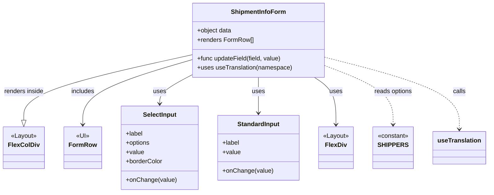

# Diagram: web/portal/src/pages/shipments/create-shipment/components/organisms/ShipmentInfoForm.organism.js


> Auto-generated by Obscura crawlers

## Diagram 1



### SVG

<svg id="container" width="1237.9765625" xmlns="http://www.w3.org/2000/svg" class="classDiagram" height="498" viewBox="0 0 1237.9765625 498" role="graphics-document document" aria-roledescription="class"><style>#container{font-family:"trebuchet ms",verdana,arial,sans-serif;font-size:16px;fill:#333;}@keyframes edge-animation-frame{from{stroke-dashoffset:0;}}@keyframes dash{to{stroke-dashoffset:0;}}#container .edge-animation-slow{stroke-dasharray:9,5!important;stroke-dashoffset:900;animation:dash 50s linear infinite;stroke-linecap:round;}#container .edge-animation-fast{stroke-dasharray:9,5!important;stroke-dashoffset:900;animation:dash 20s linear infinite;stroke-linecap:round;}#container .error-icon{fill:#552222;}#container .error-text{fill:#552222;stroke:#552222;}#container .edge-thickness-normal{stroke-width:1px;}#container .edge-thickness-thick{stroke-width:3.5px;}#container .edge-pattern-solid{stroke-dasharray:0;}#container .edge-thickness-invisible{stroke-width:0;fill:none;}#container .edge-pattern-dashed{stroke-dasharray:3;}#container .edge-pattern-dotted{stroke-dasharray:2;}#container .marker{fill:#333333;stroke:#333333;}#container .marker.cross{stroke:#333333;}#container svg{font-family:"trebuchet ms",verdana,arial,sans-serif;font-size:16px;}#container p{margin:0;}#container g.classGroup text{fill:#9370DB;stroke:none;font-family:"trebuchet ms",verdana,arial,sans-serif;font-size:10px;}#container g.classGroup text .title{font-weight:bolder;}#container .nodeLabel,#container .edgeLabel{color:#131300;}#container .edgeLabel .label rect{fill:#ECECFF;}#container .label text{fill:#131300;}#container .labelBkg{background:#ECECFF;}#container .edgeLabel .label span{background:#ECECFF;}#container .classTitle{font-weight:bolder;}#container .node rect,#container .node circle,#container .node ellipse,#container .node polygon,#container .node path{fill:#ECECFF;stroke:#9370DB;stroke-width:1px;}#container .divider{stroke:#9370DB;stroke-width:1;}#container g.clickable{cursor:pointer;}#container g.classGroup rect{fill:#ECECFF;stroke:#9370DB;}#container g.classGroup line{stroke:#9370DB;stroke-width:1;}#container .classLabel .box{stroke:none;stroke-width:0;fill:#ECECFF;opacity:0.5;}#container .classLabel .label{fill:#9370DB;font-size:10px;}#container .relation{stroke:#333333;stroke-width:1;fill:none;}#container .dashed-line{stroke-dasharray:3;}#container .dotted-line{stroke-dasharray:1 2;}#container #compositionStart,#container .composition{fill:#333333!important;stroke:#333333!important;stroke-width:1;}#container #compositionEnd,#container .composition{fill:#333333!important;stroke:#333333!important;stroke-width:1;}#container #dependencyStart,#container .dependency{fill:#333333!important;stroke:#333333!important;stroke-width:1;}#container #dependencyStart,#container .dependency{fill:#333333!important;stroke:#333333!important;stroke-width:1;}#container #extensionStart,#container .extension{fill:transparent!important;stroke:#333333!important;stroke-width:1;}#container #extensionEnd,#container .extension{fill:transparent!important;stroke:#333333!important;stroke-width:1;}#container #aggregationStart,#container .aggregation{fill:transparent!important;stroke:#333333!important;stroke-width:1;}#container #aggregationEnd,#container .aggregation{fill:transparent!important;stroke:#333333!important;stroke-width:1;}#container #lollipopStart,#container .lollipop{fill:#ECECFF!important;stroke:#333333!important;stroke-width:1;}#container #lollipopEnd,#container .lollipop{fill:#ECECFF!important;stroke:#333333!important;stroke-width:1;}#container .edgeTerminals{font-size:11px;line-height:initial;}#container .classTitleText{text-anchor:middle;font-size:18px;fill:#333;}#container .label-icon{display:inline-block;height:1em;overflow:visible;vertical-align:-0.125em;}#container .node .label-icon path{fill:currentColor;stroke:revert;stroke-width:revert;}#container :root{--mermaid-font-family:"trebuchet ms",verdana,arial,sans-serif;}</style><g><defs><marker id="container_class-aggregationStart" class="marker aggregation class" refX="18" refY="7" markerWidth="190" markerHeight="240" orient="auto"><path d="M 18,7 L9,13 L1,7 L9,1 Z"></path></marker></defs><defs><marker id="container_class-aggregationEnd" class="marker aggregation class" refX="1" refY="7" markerWidth="20" markerHeight="28" orient="auto"><path d="M 18,7 L9,13 L1,7 L9,1 Z"></path></marker></defs><defs><marker id="container_class-extensionStart" class="marker extension class" refX="18" refY="7" markerWidth="190" markerHeight="240" orient="auto"><path d="M 1,7 L18,13 V 1 Z"></path></marker></defs><defs><marker id="container_class-extensionEnd" class="marker extension class" refX="1" refY="7" markerWidth="20" markerHeight="28" orient="auto"><path d="M 1,1 V 13 L18,7 Z"></path></marker></defs><defs><marker id="container_class-compositionStart" class="marker composition class" refX="18" refY="7" markerWidth="190" markerHeight="240" orient="auto"><path d="M 18,7 L9,13 L1,7 L9,1 Z"></path></marker></defs><defs><marker id="container_class-compositionEnd" class="marker composition class" refX="1" refY="7" markerWidth="20" markerHeight="28" orient="auto"><path d="M 18,7 L9,13 L1,7 L9,1 Z"></path></marker></defs><defs><marker id="container_class-dependencyStart" class="marker dependency class" refX="6" refY="7" markerWidth="190" markerHeight="240" orient="auto"><path d="M 5,7 L9,13 L1,7 L9,1 Z"></path></marker></defs><defs><marker id="container_class-dependencyEnd" class="marker dependency class" refX="13" refY="7" markerWidth="20" markerHeight="28" orient="auto"><path d="M 18,7 L9,13 L14,7 L9,1 Z"></path></marker></defs><defs><marker id="container_class-lollipopStart" class="marker lollipop class" refX="13" refY="7" markerWidth="190" markerHeight="240" orient="auto"><circle stroke="black" fill="transparent" cx="7" cy="7" r="6"></circle></marker></defs><defs><marker id="container_class-lollipopEnd" class="marker lollipop class" refX="1" refY="7" markerWidth="190" markerHeight="240" orient="auto"><circle stroke="black" fill="transparent" cx="7" cy="7" r="6"></circle></marker></defs><g class="root"><g class="clusters"></g><g class="edgePaths"><path d="M480.977,141.95L410.805,157.792C340.633,173.633,200.289,205.317,130.117,233.45C59.945,261.583,59.945,286.167,59.945,298.458L59.945,310.75" id="id_ShipmentInfoForm_FlexColDiv_1" class="edge-thickness-normal edge-pattern-solid relation" style=";;;" data-edge="true" data-et="edge" data-id="id_ShipmentInfoForm_FlexColDiv_1" data-points="W3sieCI6NDgwLjk3NjU2MjUsInkiOjE0MS45NDk4NjAwOTYyNzV9LHsieCI6NTkuOTQ1MzEyNSwieSI6MjM3fSx7IngiOjU5Ljk0NTMxMjUsInkiOjMyOH1d" marker-end="url(#container_class-extensionEnd)"></path><path d="M480.977,154.38L435.031,168.15C389.086,181.92,297.195,209.46,251.25,237.397C205.305,265.333,205.305,293.667,205.305,307.833L205.305,322" id="id_ShipmentInfoForm_FormRow_2" class="edge-thickness-normal edge-pattern-solid relation" style=";;;" data-edge="true" data-et="edge" data-id="id_ShipmentInfoForm_FormRow_2" data-points="W3sieCI6NDgwLjk3NjU2MjUsInkiOjE1NC4zODA0NTUyNTc2NDQ4M30seyJ4IjoyMDUuMzA0Njg3NSwieSI6MjM3fSx7IngiOjIwNS4zMDQ2ODc1LCJ5IjozMjh9XQ==" marker-end="url(#container_class-dependencyEnd)"></path><path d="M480.977,193.253L467.244,200.544C453.512,207.835,426.047,222.418,412.314,234.875C398.582,247.333,398.582,257.667,398.582,262.833L398.582,268" id="id_ShipmentInfoForm_SelectInput_3" class="edge-thickness-normal edge-pattern-solid relation" style=";;;" data-edge="true" data-et="edge" data-id="id_ShipmentInfoForm_SelectInput_3" data-points="W3sieCI6NDgwLjk3NjU2MjUsInkiOjE5My4yNTI5MTk5ODY5MDF9LHsieCI6Mzk4LjU4MjAzMTI1LCJ5IjoyMzd9LHsieCI6Mzk4LjU4MjAzMTI1LCJ5IjoyNzR9XQ==" marker-end="url(#container_class-dependencyEnd)"></path><path d="M649.078,200L649.078,206.167C649.078,212.333,649.078,224.667,649.078,240C649.078,255.333,649.078,273.667,649.078,282.833L649.078,292" id="id_ShipmentInfoForm_StandardInput_4" class="edge-thickness-normal edge-pattern-solid relation" style=";;;" data-edge="true" data-et="edge" data-id="id_ShipmentInfoForm_StandardInput_4" data-points="W3sieCI6NjQ5LjA3ODEyNSwieSI6MjAwfSx7IngiOjY0OS4wNzgxMjUsInkiOjIzN30seyJ4Ijo2NDkuMDc4MTI1LCJ5IjoyOTh9XQ==" marker-end="url(#container_class-dependencyEnd)"></path><path d="M792.249,200L801.446,206.167C810.643,212.333,829.036,224.667,838.233,245C847.43,265.333,847.43,293.667,847.43,307.833L847.43,322" id="id_ShipmentInfoForm_FlexDiv_5" class="edge-thickness-normal edge-pattern-solid relation" style=";;;" data-edge="true" data-et="edge" data-id="id_ShipmentInfoForm_FlexDiv_5" data-points="W3sieCI6NzkyLjI0OTE3NzYzMTU3OSwieSI6MjAwfSx7IngiOjg0Ny40Mjk2ODc1LCJ5IjoyMzd9LHsieCI6ODQ3LjQyOTY4NzUsInkiOjMyOH1d" marker-end="url(#container_class-dependencyEnd)"></path><path d="M817.18,168.573L846.868,179.978C876.557,191.382,935.935,214.191,965.624,239.762C995.313,265.333,995.313,293.667,995.313,307.833L995.313,322" id="id_ShipmentInfoForm_SHIPPERS_6" class="edge-thickness-normal edge-pattern-dashed relation" style=";;;" data-edge="true" data-et="edge" data-id="id_ShipmentInfoForm_SHIPPERS_6" data-points="W3sieCI6ODE3LjE3OTY4NzUsInkiOjE2OC41NzMzMzM2MzQxODkyOH0seyJ4Ijo5OTUuMzEyNSwieSI6MjM3fSx7IngiOjk5NS4zMTI1LCJ5IjozMjh9XQ==" marker-end="url(#container_class-dependencyEnd)"></path><path d="M817.18,147.428L874.965,162.357C932.75,177.286,1048.32,207.143,1106.105,238.238C1163.891,269.333,1163.891,301.667,1163.891,317.833L1163.891,334" id="id_ShipmentInfoForm_useTranslation_7" class="edge-thickness-normal edge-pattern-dashed relation" style=";;;" data-edge="true" data-et="edge" data-id="id_ShipmentInfoForm_useTranslation_7" data-points="W3sieCI6ODE3LjE3OTY4NzUsInkiOjE0Ny40Mjg0NDc4NTcyMjk1N30seyJ4IjoxMTYzLjg5MDYyNSwieSI6MjM3fSx7IngiOjExNjMuODkwNjI1LCJ5IjozNDB9XQ==" marker-end="url(#container_class-dependencyEnd)"></path></g><g class="edgeLabels"><g class="edgeLabel" transform="translate(59.9453125, 237)"><g class="label" data-id="id_ShipmentInfoForm_FlexColDiv_1" transform="translate(-51.9453125, -12)"><foreignObject width="103.890625" height="24"><div xmlns="http://www.w3.org/1999/xhtml" class="labelBkg" style="display: table-cell; white-space: nowrap; line-height: 1.5; max-width: 200px; text-align: center;"><span class="edgeLabel"><p>renders inside</p></span></div></foreignObject></g></g><g class="edgeLabel" transform="translate(205.3046875, 237)"><g class="label" data-id="id_ShipmentInfoForm_FormRow_2" transform="translate(-30.6484375, -12)"><foreignObject width="61.296875" height="24"><div xmlns="http://www.w3.org/1999/xhtml" class="labelBkg" style="display: table-cell; white-space: nowrap; line-height: 1.5; max-width: 200px; text-align: center;"><span class="edgeLabel"><p>includes</p></span></div></foreignObject></g></g><g class="edgeLabel" transform="translate(398.58203125, 237)"><g class="label" data-id="id_ShipmentInfoForm_SelectInput_3" transform="translate(-16.4921875, -12)"><foreignObject width="32.984375" height="24"><div xmlns="http://www.w3.org/1999/xhtml" class="labelBkg" style="display: table-cell; white-space: nowrap; line-height: 1.5; max-width: 200px; text-align: center;"><span class="edgeLabel"><p>uses</p></span></div></foreignObject></g></g><g class="edgeLabel" transform="translate(649.078125, 237)"><g class="label" data-id="id_ShipmentInfoForm_StandardInput_4" transform="translate(-16.4921875, -12)"><foreignObject width="32.984375" height="24"><div xmlns="http://www.w3.org/1999/xhtml" class="labelBkg" style="display: table-cell; white-space: nowrap; line-height: 1.5; max-width: 200px; text-align: center;"><span class="edgeLabel"><p>uses</p></span></div></foreignObject></g></g><g class="edgeLabel" transform="translate(847.4296875, 237)"><g class="label" data-id="id_ShipmentInfoForm_FlexDiv_5" transform="translate(-16.4921875, -12)"><foreignObject width="32.984375" height="24"><div xmlns="http://www.w3.org/1999/xhtml" class="labelBkg" style="display: table-cell; white-space: nowrap; line-height: 1.5; max-width: 200px; text-align: center;"><span class="edgeLabel"><p>uses</p></span></div></foreignObject></g></g><g class="edgeLabel" transform="translate(995.3125, 237)"><g class="label" data-id="id_ShipmentInfoForm_SHIPPERS_6" transform="translate(-49.7890625, -12)"><foreignObject width="99.578125" height="24"><div xmlns="http://www.w3.org/1999/xhtml" class="labelBkg" style="display: table-cell; white-space: nowrap; line-height: 1.5; max-width: 200px; text-align: center;"><span class="edgeLabel"><p>reads options</p></span></div></foreignObject></g></g><g class="edgeLabel" transform="translate(1163.890625, 237)"><g class="label" data-id="id_ShipmentInfoForm_useTranslation_7" transform="translate(-16.4453125, -12)"><foreignObject width="32.890625" height="24"><div xmlns="http://www.w3.org/1999/xhtml" class="labelBkg" style="display: table-cell; white-space: nowrap; line-height: 1.5; max-width: 200px; text-align: center;"><span class="edgeLabel"><p>calls</p></span></div></foreignObject></g></g></g><g class="nodes"><g class="node default" id="classId-ShipmentInfoForm-0" transform="translate(649.078125, 104)"><g class="basic label-container"><path d="M-168.1015625 -96 L168.1015625 -96 L168.1015625 96 L-168.1015625 96" stroke="none" stroke-width="0" fill="#ECECFF" style=""></path><path d="M-168.1015625 -96 C-62.803973947256964 -96, 42.49361460548607 -96, 168.1015625 -96 M-168.1015625 -96 C-49.50041221932459 -96, 69.10073806135082 -96, 168.1015625 -96 M168.1015625 -96 C168.1015625 -53.673219550809556, 168.1015625 -11.346439101619112, 168.1015625 96 M168.1015625 -96 C168.1015625 -52.51386649928242, 168.1015625 -9.027732998564844, 168.1015625 96 M168.1015625 96 C62.29471447198793 96, -43.51213355602414 96, -168.1015625 96 M168.1015625 96 C43.2455095488683 96, -81.6105434022634 96, -168.1015625 96 M-168.1015625 96 C-168.1015625 22.06482189911614, -168.1015625 -51.87035620176772, -168.1015625 -96 M-168.1015625 96 C-168.1015625 51.35262836370089, -168.1015625 6.705256727401775, -168.1015625 -96" stroke="#9370DB" stroke-width="1.3" fill="none" stroke-dasharray="0 0" style=""></path></g><g class="annotation-group text" transform="translate(0, -72)"></g><g class="label-group text" transform="translate(-67.765625, -72)"><g class="label" style="font-weight: bolder" transform="translate(0,-12)"><foreignObject width="135.53125" height="24"><div xmlns="http://www.w3.org/1999/xhtml" style="display: table-cell; white-space: nowrap; line-height: 1.5; max-width: 185px; text-align: center;"><span class="nodeLabel markdown-node-label" style=""><p>ShipmentInfoForm</p></span></div></foreignObject></g></g><g class="members-group text" transform="translate(-156.1015625, -24)"><g class="label" style="" transform="translate(0,-12)"><foreignObject width="90.34375" height="24"><div xmlns="http://www.w3.org/1999/xhtml" style="display: table-cell; white-space: nowrap; line-height: 1.5; max-width: 148px; text-align: center;"><span class="nodeLabel markdown-node-label" style=""><p>+object data</p></span></div></foreignObject></g><g class="label" style="" transform="translate(0,12)"><foreignObject width="144.8125" height="24"><div xmlns="http://www.w3.org/1999/xhtml" style="display: table-cell; white-space: nowrap; line-height: 1.5; max-width: 202px; text-align: center;"><span class="nodeLabel markdown-node-label" style=""><p>+renders FormRow[]</p></span></div></foreignObject></g></g><g class="methods-group text" transform="translate(-156.1015625, 48)"><g class="label" style="" transform="translate(0,-12)"><foreignObject width="219.15625" height="24"><div xmlns="http://www.w3.org/1999/xhtml" style="display: table-cell; white-space: nowrap; line-height: 1.5; max-width: 277px; text-align: center;"><span class="nodeLabel markdown-node-label" style=""><p>+func updateField(field, value)</p></span></div></foreignObject></g><g class="label" style="" transform="translate(0,12)"><foreignObject width="244.4375" height="24"><div xmlns="http://www.w3.org/1999/xhtml" style="display: table-cell; white-space: nowrap; line-height: 1.5; max-width: 302px; text-align: center;"><span class="nodeLabel markdown-node-label" style=""><p>+uses useTranslation(namespace)</p></span></div></foreignObject></g></g><g class="divider" style=""><path d="M-168.1015625 -48 C-59.14119022848358 -48, 49.81918204303284 -48, 168.1015625 -48 M-168.1015625 -48 C-80.1746572506373 -48, 7.752247998725409 -48, 168.1015625 -48" stroke="#9370DB" stroke-width="1.3" fill="none" stroke-dasharray="0 0" style=""></path></g><g class="divider" style=""><path d="M-168.1015625 24 C-34.15008364626598 24, 99.80139520746803 24, 168.1015625 24 M-168.1015625 24 C-50.56930459677663 24, 66.96295330644674 24, 168.1015625 24" stroke="#9370DB" stroke-width="1.3" fill="none" stroke-dasharray="0 0" style=""></path></g></g><g class="node default" id="classId-FormRow-1" transform="translate(205.3046875, 382)"><g class="basic label-container"><path d="M-45.7421875 -54 L45.7421875 -54 L45.7421875 54 L-45.7421875 54" stroke="none" stroke-width="0" fill="#ECECFF" style=""></path><path d="M-45.7421875 -54 C-17.428665673031535 -54, 10.88485615393693 -54, 45.7421875 -54 M-45.7421875 -54 C-20.7573823692536 -54, 4.227422761492797 -54, 45.7421875 -54 M45.7421875 -54 C45.7421875 -24.488353867620198, 45.7421875 5.023292264759604, 45.7421875 54 M45.7421875 -54 C45.7421875 -19.88067591917285, 45.7421875 14.238648161654297, 45.7421875 54 M45.7421875 54 C13.218346729096538 54, -19.305494041806924 54, -45.7421875 54 M45.7421875 54 C12.09677715173126 54, -21.54863319653748 54, -45.7421875 54 M-45.7421875 54 C-45.7421875 21.91098452521014, -45.7421875 -10.178030949579721, -45.7421875 -54 M-45.7421875 54 C-45.7421875 15.474961262279699, -45.7421875 -23.050077475440602, -45.7421875 -54" stroke="#9370DB" stroke-width="1.3" fill="none" stroke-dasharray="0 0" style=""></path></g><g class="annotation-group text" transform="translate(-16.7890625, -30)"><g class="label" style="" transform="translate(0,-12)"><foreignObject width="33.578125" height="24"><div xmlns="http://www.w3.org/1999/xhtml" style="display: table-cell; white-space: nowrap; line-height: 1.5; max-width: 84px; text-align: center;"><span class="nodeLabel markdown-node-label" style=""><p>«UI»</p></span></div></foreignObject></g></g><g class="label-group text" transform="translate(-33.7421875, -6)"><g class="label" style="font-weight: bolder" transform="translate(0,-12)"><foreignObject width="67.484375" height="24"><div xmlns="http://www.w3.org/1999/xhtml" style="display: table-cell; white-space: nowrap; line-height: 1.5; max-width: 117px; text-align: center;"><span class="nodeLabel markdown-node-label" style=""><p>FormRow</p></span></div></foreignObject></g></g><g class="members-group text" transform="translate(-33.7421875, 42)"></g><g class="methods-group text" transform="translate(-33.7421875, 72)"></g><g class="divider" style=""><path d="M-45.7421875 18 C-25.340984299413737 18, -4.939781098827474 18, 45.7421875 18 M-45.7421875 18 C-12.209916699332162 18, 21.322354101335677 18, 45.7421875 18" stroke="#9370DB" stroke-width="1.3" fill="none" stroke-dasharray="0 0" style=""></path></g><g class="divider" style=""><path d="M-45.7421875 36 C-18.93888004657269 36, 7.864427406854617 36, 45.7421875 36 M-45.7421875 36 C-12.373863490786839 36, 20.994460518426322 36, 45.7421875 36" stroke="#9370DB" stroke-width="1.3" fill="none" stroke-dasharray="0 0" style=""></path></g></g><g class="node default" id="classId-SelectInput-2" transform="translate(398.58203125, 382)"><g class="basic label-container"><path d="M-97.53515625 -108 L97.53515625 -108 L97.53515625 108 L-97.53515625 108" stroke="none" stroke-width="0" fill="#ECECFF" style=""></path><path d="M-97.53515625 -108 C-28.76739589544279 -108, 40.00036445911442 -108, 97.53515625 -108 M-97.53515625 -108 C-34.74743853657489 -108, 28.04027917685022 -108, 97.53515625 -108 M97.53515625 -108 C97.53515625 -56.617693531218116, 97.53515625 -5.2353870624362315, 97.53515625 108 M97.53515625 -108 C97.53515625 -49.11150807847184, 97.53515625 9.776983843056314, 97.53515625 108 M97.53515625 108 C36.39462299298746 108, -24.745910264025085 108, -97.53515625 108 M97.53515625 108 C24.974289870319907 108, -47.586576509360185 108, -97.53515625 108 M-97.53515625 108 C-97.53515625 48.649121496904016, -97.53515625 -10.701757006191968, -97.53515625 -108 M-97.53515625 108 C-97.53515625 58.879043879302046, -97.53515625 9.758087758604091, -97.53515625 -108" stroke="#9370DB" stroke-width="1.3" fill="none" stroke-dasharray="0 0" style=""></path></g><g class="annotation-group text" transform="translate(0, -84)"></g><g class="label-group text" transform="translate(-42.0703125, -84)"><g class="label" style="font-weight: bolder" transform="translate(0,-12)"><foreignObject width="84.140625" height="24"><div xmlns="http://www.w3.org/1999/xhtml" style="display: table-cell; white-space: nowrap; line-height: 1.5; max-width: 133px; text-align: center;"><span class="nodeLabel markdown-node-label" style=""><p>SelectInput</p></span></div></foreignObject></g></g><g class="members-group text" transform="translate(-85.53515625, -36)"><g class="label" style="" transform="translate(0,-12)"><foreignObject width="44.21875" height="24"><div xmlns="http://www.w3.org/1999/xhtml" style="display: table-cell; white-space: nowrap; line-height: 1.5; max-width: 102px; text-align: center;"><span class="nodeLabel markdown-node-label" style=""><p>+label</p></span></div></foreignObject></g><g class="label" style="" transform="translate(0,12)"><foreignObject width="63.3125" height="24"><div xmlns="http://www.w3.org/1999/xhtml" style="display: table-cell; white-space: nowrap; line-height: 1.5; max-width: 121px; text-align: center;"><span class="nodeLabel markdown-node-label" style=""><p>+options</p></span></div></foreignObject></g><g class="label" style="" transform="translate(0,36)"><foreignObject width="46.71875" height="24"><div xmlns="http://www.w3.org/1999/xhtml" style="display: table-cell; white-space: nowrap; line-height: 1.5; max-width: 104px; text-align: center;"><span class="nodeLabel markdown-node-label" style=""><p>+value</p></span></div></foreignObject></g><g class="label" style="" transform="translate(0,60)"><foreignObject width="95.109375" height="24"><div xmlns="http://www.w3.org/1999/xhtml" style="display: table-cell; white-space: nowrap; line-height: 1.5; max-width: 153px; text-align: center;"><span class="nodeLabel markdown-node-label" style=""><p>+borderColor</p></span></div></foreignObject></g></g><g class="methods-group text" transform="translate(-85.53515625, 84)"><g class="label" style="" transform="translate(0,-12)"><foreignObject width="129" height="24"><div xmlns="http://www.w3.org/1999/xhtml" style="display: table-cell; white-space: nowrap; line-height: 1.5; max-width: 186px; text-align: center;"><span class="nodeLabel markdown-node-label" style=""><p>+onChange(value)</p></span></div></foreignObject></g></g><g class="divider" style=""><path d="M-97.53515625 -60 C-43.32093025442494 -60, 10.893295741150126 -60, 97.53515625 -60 M-97.53515625 -60 C-55.71389093658622 -60, -13.892625623172435 -60, 97.53515625 -60" stroke="#9370DB" stroke-width="1.3" fill="none" stroke-dasharray="0 0" style=""></path></g><g class="divider" style=""><path d="M-97.53515625 60 C-36.13705815596567 60, 25.261039938068663 60, 97.53515625 60 M-97.53515625 60 C-33.37187800072209 60, 30.791400248555817 60, 97.53515625 60" stroke="#9370DB" stroke-width="1.3" fill="none" stroke-dasharray="0 0" style=""></path></g></g><g class="node default" id="classId-StandardInput-3" transform="translate(649.078125, 382)"><g class="basic label-container"><path d="M-102.9609375 -84 L102.9609375 -84 L102.9609375 84 L-102.9609375 84" stroke="none" stroke-width="0" fill="#ECECFF" style=""></path><path d="M-102.9609375 -84 C-53.2205508857232 -84, -3.480164271446398 -84, 102.9609375 -84 M-102.9609375 -84 C-53.36074128224748 -84, -3.7605450644949627 -84, 102.9609375 -84 M102.9609375 -84 C102.9609375 -46.361978541064495, 102.9609375 -8.72395708212899, 102.9609375 84 M102.9609375 -84 C102.9609375 -33.95055643803185, 102.9609375 16.098887123936294, 102.9609375 84 M102.9609375 84 C44.62040927348815 84, -13.7201189530237 84, -102.9609375 84 M102.9609375 84 C30.81073536671522 84, -41.33946676656956 84, -102.9609375 84 M-102.9609375 84 C-102.9609375 46.48366521491412, -102.9609375 8.967330429828237, -102.9609375 -84 M-102.9609375 84 C-102.9609375 44.23160033386911, -102.9609375 4.463200667738221, -102.9609375 -84" stroke="#9370DB" stroke-width="1.3" fill="none" stroke-dasharray="0 0" style=""></path></g><g class="annotation-group text" transform="translate(0, -60)"></g><g class="label-group text" transform="translate(-52.921875, -60)"><g class="label" style="font-weight: bolder" transform="translate(0,-12)"><foreignObject width="105.84375" height="24"><div xmlns="http://www.w3.org/1999/xhtml" style="display: table-cell; white-space: nowrap; line-height: 1.5; max-width: 155px; text-align: center;"><span class="nodeLabel markdown-node-label" style=""><p>StandardInput</p></span></div></foreignObject></g></g><g class="members-group text" transform="translate(-90.9609375, -12)"><g class="label" style="" transform="translate(0,-12)"><foreignObject width="44.21875" height="24"><div xmlns="http://www.w3.org/1999/xhtml" style="display: table-cell; white-space: nowrap; line-height: 1.5; max-width: 102px; text-align: center;"><span class="nodeLabel markdown-node-label" style=""><p>+label</p></span></div></foreignObject></g><g class="label" style="" transform="translate(0,12)"><foreignObject width="46.71875" height="24"><div xmlns="http://www.w3.org/1999/xhtml" style="display: table-cell; white-space: nowrap; line-height: 1.5; max-width: 104px; text-align: center;"><span class="nodeLabel markdown-node-label" style=""><p>+value</p></span></div></foreignObject></g></g><g class="methods-group text" transform="translate(-90.9609375, 60)"><g class="label" style="" transform="translate(0,-12)"><foreignObject width="129" height="24"><div xmlns="http://www.w3.org/1999/xhtml" style="display: table-cell; white-space: nowrap; line-height: 1.5; max-width: 186px; text-align: center;"><span class="nodeLabel markdown-node-label" style=""><p>+onChange(value)</p></span></div></foreignObject></g></g><g class="divider" style=""><path d="M-102.9609375 -36 C-34.396421766062545 -36, 34.16809396787491 -36, 102.9609375 -36 M-102.9609375 -36 C-35.45578876348543 -36, 32.04935997302914 -36, 102.9609375 -36" stroke="#9370DB" stroke-width="1.3" fill="none" stroke-dasharray="0 0" style=""></path></g><g class="divider" style=""><path d="M-102.9609375 36 C-43.84884253400297 36, 15.263252431994061 36, 102.9609375 36 M-102.9609375 36 C-53.935697694264626 36, -4.910457888529251 36, 102.9609375 36" stroke="#9370DB" stroke-width="1.3" fill="none" stroke-dasharray="0 0" style=""></path></g></g><g class="node default" id="classId-FlexColDiv-4" transform="translate(59.9453125, 382)"><g class="basic label-container"><path d="M-49.6171875 -54 L49.6171875 -54 L49.6171875 54 L-49.6171875 54" stroke="none" stroke-width="0" fill="#ECECFF" style=""></path><path d="M-49.6171875 -54 C-19.191702188266206 -54, 11.233783123467589 -54, 49.6171875 -54 M-49.6171875 -54 C-11.602396752374325 -54, 26.41239399525135 -54, 49.6171875 -54 M49.6171875 -54 C49.6171875 -11.683209721787492, 49.6171875 30.633580556425017, 49.6171875 54 M49.6171875 -54 C49.6171875 -20.196271762984892, 49.6171875 13.607456474030215, 49.6171875 54 M49.6171875 54 C26.98742207681431 54, 4.3576566536286165 54, -49.6171875 54 M49.6171875 54 C21.736745755071787 54, -6.143695989856425 54, -49.6171875 54 M-49.6171875 54 C-49.6171875 28.54213481638254, -49.6171875 3.0842696327650785, -49.6171875 -54 M-49.6171875 54 C-49.6171875 15.650793655625137, -49.6171875 -22.698412688749727, -49.6171875 -54" stroke="#9370DB" stroke-width="1.3" fill="none" stroke-dasharray="0 0" style=""></path></g><g class="annotation-group text" transform="translate(-33.390625, -30)"><g class="label" style="" transform="translate(0,-12)"><foreignObject width="66.78125" height="24"><div xmlns="http://www.w3.org/1999/xhtml" style="display: table-cell; white-space: nowrap; line-height: 1.5; max-width: 117px; text-align: center;"><span class="nodeLabel markdown-node-label" style=""><p>«Layout»</p></span></div></foreignObject></g></g><g class="label-group text" transform="translate(-37.6171875, -6)"><g class="label" style="font-weight: bolder" transform="translate(0,-12)"><foreignObject width="75.234375" height="24"><div xmlns="http://www.w3.org/1999/xhtml" style="display: table-cell; white-space: nowrap; line-height: 1.5; max-width: 124px; text-align: center;"><span class="nodeLabel markdown-node-label" style=""><p>FlexColDiv</p></span></div></foreignObject></g></g><g class="members-group text" transform="translate(-37.6171875, 42)"></g><g class="methods-group text" transform="translate(-37.6171875, 72)"></g><g class="divider" style=""><path d="M-49.6171875 18 C-14.429349031471617 18, 20.758489437056767 18, 49.6171875 18 M-49.6171875 18 C-28.877998013626968 18, -8.138808527253936 18, 49.6171875 18" stroke="#9370DB" stroke-width="1.3" fill="none" stroke-dasharray="0 0" style=""></path></g><g class="divider" style=""><path d="M-49.6171875 36 C-13.916957285725147 36, 21.783272928549707 36, 49.6171875 36 M-49.6171875 36 C-25.135729233447297 36, -0.6542709668945932 36, 49.6171875 36" stroke="#9370DB" stroke-width="1.3" fill="none" stroke-dasharray="0 0" style=""></path></g></g><g class="node default" id="classId-FlexDiv-5" transform="translate(847.4296875, 382)"><g class="basic label-container"><path d="M-45.390625 -54 L45.390625 -54 L45.390625 54 L-45.390625 54" stroke="none" stroke-width="0" fill="#ECECFF" style=""></path><path d="M-45.390625 -54 C-17.229918848780184 -54, 10.930787302439633 -54, 45.390625 -54 M-45.390625 -54 C-23.450608096712468 -54, -1.5105911934249363 -54, 45.390625 -54 M45.390625 -54 C45.390625 -26.71902799888192, 45.390625 0.5619440022361601, 45.390625 54 M45.390625 -54 C45.390625 -11.329473010022134, 45.390625 31.34105397995573, 45.390625 54 M45.390625 54 C18.129222834795673 54, -9.132179330408654 54, -45.390625 54 M45.390625 54 C25.219029027565576 54, 5.047433055131151 54, -45.390625 54 M-45.390625 54 C-45.390625 15.331298161354951, -45.390625 -23.337403677290098, -45.390625 -54 M-45.390625 54 C-45.390625 12.535437307894, -45.390625 -28.929125384212, -45.390625 -54" stroke="#9370DB" stroke-width="1.3" fill="none" stroke-dasharray="0 0" style=""></path></g><g class="annotation-group text" transform="translate(-33.390625, -30)"><g class="label" style="" transform="translate(0,-12)"><foreignObject width="66.78125" height="24"><div xmlns="http://www.w3.org/1999/xhtml" style="display: table-cell; white-space: nowrap; line-height: 1.5; max-width: 117px; text-align: center;"><span class="nodeLabel markdown-node-label" style=""><p>«Layout»</p></span></div></foreignObject></g></g><g class="label-group text" transform="translate(-26.1328125, -6)"><g class="label" style="font-weight: bolder" transform="translate(0,-12)"><foreignObject width="52.265625" height="24"><div xmlns="http://www.w3.org/1999/xhtml" style="display: table-cell; white-space: nowrap; line-height: 1.5; max-width: 101px; text-align: center;"><span class="nodeLabel markdown-node-label" style=""><p>FlexDiv</p></span></div></foreignObject></g></g><g class="members-group text" transform="translate(-33.390625, 42)"></g><g class="methods-group text" transform="translate(-33.390625, 72)"></g><g class="divider" style=""><path d="M-45.390625 18 C-15.554656397643893 18, 14.281312204712215 18, 45.390625 18 M-45.390625 18 C-24.569983107454938 18, -3.749341214909876 18, 45.390625 18" stroke="#9370DB" stroke-width="1.3" fill="none" stroke-dasharray="0 0" style=""></path></g><g class="divider" style=""><path d="M-45.390625 36 C-11.69814517977997 36, 21.99433464044006 36, 45.390625 36 M-45.390625 36 C-11.985415821201109 36, 21.419793357597783 36, 45.390625 36" stroke="#9370DB" stroke-width="1.3" fill="none" stroke-dasharray="0 0" style=""></path></g></g><g class="node default" id="classId-SHIPPERS-6" transform="translate(995.3125, 382)"><g class="basic label-container"><path d="M-52.4921875 -54 L52.4921875 -54 L52.4921875 54 L-52.4921875 54" stroke="none" stroke-width="0" fill="#ECECFF" style=""></path><path d="M-52.4921875 -54 C-19.47848178896436 -54, 13.535223922071282 -54, 52.4921875 -54 M-52.4921875 -54 C-18.160685416567738 -54, 16.170816666864525 -54, 52.4921875 -54 M52.4921875 -54 C52.4921875 -23.40368802988458, 52.4921875 7.192623940230838, 52.4921875 54 M52.4921875 -54 C52.4921875 -17.408944502156984, 52.4921875 19.18211099568603, 52.4921875 54 M52.4921875 54 C11.488481754367704 54, -29.51522399126459 54, -52.4921875 54 M52.4921875 54 C28.43291632287979 54, 4.373645145759582 54, -52.4921875 54 M-52.4921875 54 C-52.4921875 19.408686013824784, -52.4921875 -15.182627972350431, -52.4921875 -54 M-52.4921875 54 C-52.4921875 23.201127438878967, -52.4921875 -7.597745122242067, -52.4921875 -54" stroke="#9370DB" stroke-width="1.3" fill="none" stroke-dasharray="0 0" style=""></path></g><g class="annotation-group text" transform="translate(-40.4921875, -30)"><g class="label" style="" transform="translate(0,-12)"><foreignObject width="80.984375" height="24"><div xmlns="http://www.w3.org/1999/xhtml" style="display: table-cell; white-space: nowrap; line-height: 1.5; max-width: 131px; text-align: center;"><span class="nodeLabel markdown-node-label" style=""><p>«constant»</p></span></div></foreignObject></g></g><g class="label-group text" transform="translate(-35.5, -6)"><g class="label" style="font-weight: bolder" transform="translate(0,-12)"><foreignObject width="71" height="24"><div xmlns="http://www.w3.org/1999/xhtml" style="display: table-cell; white-space: nowrap; line-height: 1.5; max-width: 120px; text-align: center;"><span class="nodeLabel markdown-node-label" style=""><p>SHIPPERS</p></span></div></foreignObject></g></g><g class="members-group text" transform="translate(-40.4921875, 42)"></g><g class="methods-group text" transform="translate(-40.4921875, 72)"></g><g class="divider" style=""><path d="M-52.4921875 18 C-28.338384601865094 18, -4.1845817037301885 18, 52.4921875 18 M-52.4921875 18 C-15.326240320940215 18, 21.83970685811957 18, 52.4921875 18" stroke="#9370DB" stroke-width="1.3" fill="none" stroke-dasharray="0 0" style=""></path></g><g class="divider" style=""><path d="M-52.4921875 36 C-26.277147624040662 36, -0.06210774808132413 36, 52.4921875 36 M-52.4921875 36 C-28.13067765364042 36, -3.7691678072808372 36, 52.4921875 36" stroke="#9370DB" stroke-width="1.3" fill="none" stroke-dasharray="0 0" style=""></path></g></g><g class="node default" id="classId-useTranslation-7" transform="translate(1163.890625, 382)"><g class="basic label-container"><path d="M-66.0859375 -42 L66.0859375 -42 L66.0859375 42 L-66.0859375 42" stroke="none" stroke-width="0" fill="#ECECFF" style=""></path><path d="M-66.0859375 -42 C-35.23287975632614 -42, -4.379822012652276 -42, 66.0859375 -42 M-66.0859375 -42 C-15.102786504098184 -42, 35.88036449180363 -42, 66.0859375 -42 M66.0859375 -42 C66.0859375 -11.630554779048559, 66.0859375 18.738890441902882, 66.0859375 42 M66.0859375 -42 C66.0859375 -16.3864186860944, 66.0859375 9.227162627811197, 66.0859375 42 M66.0859375 42 C31.8172021509205 42, -2.451533198158998 42, -66.0859375 42 M66.0859375 42 C13.68615546746048 42, -38.71362656507904 42, -66.0859375 42 M-66.0859375 42 C-66.0859375 12.821570263704523, -66.0859375 -16.356859472590955, -66.0859375 -42 M-66.0859375 42 C-66.0859375 18.676455511238782, -66.0859375 -4.647088977522436, -66.0859375 -42" stroke="#9370DB" stroke-width="1.3" fill="none" stroke-dasharray="0 0" style=""></path></g><g class="annotation-group text" transform="translate(0, -18)"></g><g class="label-group text" transform="translate(-54.0859375, -18)"><g class="label" style="font-weight: bolder" transform="translate(0,-12)"><foreignObject width="108.171875" height="24"><div xmlns="http://www.w3.org/1999/xhtml" style="display: table-cell; white-space: nowrap; line-height: 1.5; max-width: 157px; text-align: center;"><span class="nodeLabel markdown-node-label" style=""><p>useTranslation</p></span></div></foreignObject></g></g><g class="members-group text" transform="translate(-54.0859375, 30)"></g><g class="methods-group text" transform="translate(-54.0859375, 60)"></g><g class="divider" style=""><path d="M-66.0859375 6 C-31.79768114792649 6, 2.490575204147021 6, 66.0859375 6 M-66.0859375 6 C-38.76849913627311 6, -11.451060772546207 6, 66.0859375 6" stroke="#9370DB" stroke-width="1.3" fill="none" stroke-dasharray="0 0" style=""></path></g><g class="divider" style=""><path d="M-66.0859375 24 C-24.78688911393199 24, 16.512159272136017 24, 66.0859375 24 M-66.0859375 24 C-21.89328647349069 24, 22.29936455301862 24, 66.0859375 24" stroke="#9370DB" stroke-width="1.3" fill="none" stroke-dasharray="0 0" style=""></path></g></g></g></g></g></svg>

## Diagram 2

```mermaid
flowchart TD
    A[ShipmentInfoForm render] --> B[FlexColDiv container]
    B --> C[FormRow 1]
    C --> D[SelectInput (customer)]
    C --> E[StandardInput (shipmentID)]
    C --> F[StandardInput (assetID)]
    B --> G[FormRow 2]
    G --> H[StandardInput (trailerID)]
    G --> I[StandardInput (routeID)]
    G --> J[FlexDiv (spacer)]
    D -- onChange --> K[updateField("customer", value)]
    E -- onChange --> L[updateField("shipmentID", value)]
    F -- onChange --> M[updateField("assetID", value)]
    H -- onChange --> N[updateField("trailerID", value)]
    I -- onChange --> O[updateField("routeID", value)]
    D --> P[options: SHIPPERS]
```

> SVG rendering failed for this diagram.
