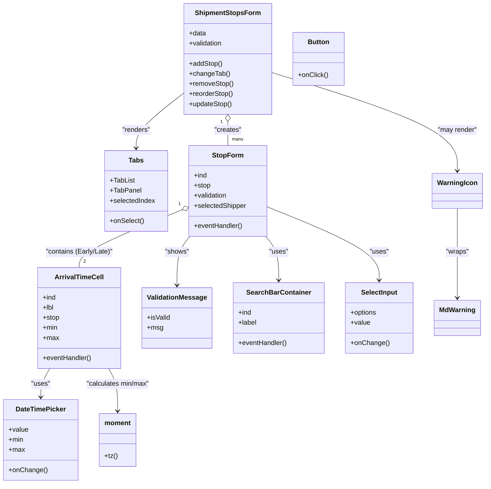

# Diagram: web/portal/src/pages/shipments/create-shipment/components/organisms/ShipmentStopsForm.organism.js

> Auto-generated by Obscura crawlers

## Mermaid

### SVG

<svg id="container" width="1129.77734375" xmlns="http://www.w3.org/2000/svg" class="classDiagram" height="1150" viewBox="0 0 1129.77734375 1150" role="graphics-document document" aria-roledescription="class"><g><defs><marker id="container_class-aggregationStart" class="marker aggregation class" refX="18" refY="7" markerWidth="190" markerHeight="240" orient="auto"><path d="M 18,7 L9,13 L1,7 L9,1 Z"></path></marker></defs><defs><marker id="container_class-aggregationEnd" class="marker aggregation class" refX="1" refY="7" markerWidth="20" markerHeight="28" orient="auto"><path d="M 18,7 L9,13 L1,7 L9,1 Z"></path></marker></defs><defs><marker id="container_class-extensionStart" class="marker extension class" refX="18" refY="7" markerWidth="190" markerHeight="240" orient="auto"><path d="M 1,7 L18,13 V 1 Z"></path></marker></defs><defs><marker id="container_class-extensionEnd" class="marker extension class" refX="1" refY="7" markerWidth="20" markerHeight="28" orient="auto"><path d="M 1,1 V 13 L18,7 Z"></path></marker></defs><defs><marker id="container_class-compositionStart" class="marker composition class" refX="18" refY="7" markerWidth="190" markerHeight="240" orient="auto"><path d="M 18,7 L9,13 L1,7 L9,1 Z"></path></marker></defs><defs><marker id="container_class-compositionEnd" class="marker composition class" refX="1" refY="7" markerWidth="20" markerHeight="28" orient="auto"><path d="M 18,7 L9,13 L1,7 L9,1 Z"></path></marker></defs><defs><marker id="container_class-dependencyStart" class="marker dependency class" refX="6" refY="7" markerWidth="190" markerHeight="240" orient="auto"><path d="M 5,7 L9,13 L1,7 L9,1 Z"></path></marker></defs><defs><marker id="container_class-dependencyEnd" class="marker dependency class" refX="13" refY="7" markerWidth="20" markerHeight="28" orient="auto"><path d="M 18,7 L9,13 L14,7 L9,1 Z"></path></marker></defs><defs><marker id="container_class-lollipopStart" class="marker lollipop class" refX="13" refY="7" markerWidth="190" markerHeight="240" orient="auto"><circle stroke="black" fill="transparent" cx="7" cy="7" r="6"></circle></marker></defs><defs><marker id="container_class-lollipopEnd" class="marker lollipop class" refX="1" refY="7" markerWidth="190" markerHeight="240" orient="auto"><circle stroke="black" fill="transparent" cx="7" cy="7" r="6"></circle></marker></defs><g class="root"><g class="clusters"></g><g class="edgePaths"><path d="M428.031,219.163L408.777,234.136C389.522,249.109,351.013,279.054,331.758,301.194C312.504,323.333,312.504,337.667,312.504,344.833L312.504,352" id="id_ShipmentStopsForm_Tabs_1" class="edge-thickness-normal edge-pattern-solid relation" style=";;;" data-edge="true" data-et="edge" data-id="id_ShipmentStopsForm_Tabs_1" data-points="W3sieCI6NDI4LjAzMTI1LCJ5IjoyMTkuMTYyOTM0MDcxNDY0NTJ9LHsieCI6MzEyLjUwMzkwNjI1LCJ5IjozMDl9LHsieCI6MzEyLjUwMzkwNjI1LCJ5IjozNTh9XQ==" marker-end="url(#container_class-dependencyEnd)"></path><path d="M529.832,289.25L529.832,292.542C529.832,295.833,529.832,302.417,529.832,311.875C529.832,321.333,529.832,333.667,529.832,339.833L529.832,346" id="id_ShipmentStopsForm_StopForm_2" class="edge-thickness-normal edge-pattern-solid relation" style=";;;" data-edge="true" data-et="edge" data-id="id_ShipmentStopsForm_StopForm_2" data-points="W3sieCI6NTI5LjgzMjAzMTI1LCJ5IjoyNzJ9LHsieCI6NTI5LjgzMjAzMTI1LCJ5IjozMDl9LHsieCI6NTI5LjgzMjAzMTI1LCJ5IjozNDZ9XQ==" marker-start="url(#container_class-aggregationStart)"></path><path d="M421.554,499.271L381.799,515.892C342.044,532.514,262.534,565.757,222.778,588.545C183.023,611.333,183.023,623.667,183.023,629.833L183.023,636" id="id_StopForm_ArrivalTimeCell_3" class="edge-thickness-normal edge-pattern-solid relation" style=";;;" data-edge="true" data-et="edge" data-id="id_StopForm_ArrivalTimeCell_3" data-points="W3sieCI6NDM3LjQ2ODc1LCJ5Ijo0OTIuNjE2OTA4NjQyNDIwM30seyJ4IjoxODMuMDIzNDM3NSwieSI6NTk5fSx7IngiOjE4My4wMjM0Mzc1LCJ5Ijo2MzZ9XQ==" marker-start="url(#container_class-aggregationStart)"></path><path d="M618.106,562L623.146,568.167C628.186,574.333,638.267,586.667,643.307,604C648.348,621.333,648.348,643.667,648.348,654.833L648.348,666" id="id_StopForm_SearchBarContainer_4" class="edge-thickness-normal edge-pattern-solid relation" style=";;;" data-edge="true" data-et="edge" data-id="id_StopForm_SearchBarContainer_4" data-points="W3sieCI6NjE4LjEwNTczODE0NjU1MTcsInkiOjU2Mn0seyJ4Ijo2NDguMzQ3NjU2MjUsInkiOjU5OX0seyJ4Ijo2NDguMzQ3NjU2MjUsInkiOjY3Mn1d" marker-end="url(#container_class-dependencyEnd)"></path><path d="M622.195,491.896L665.702,509.747C709.208,527.598,796.221,563.299,839.728,592.316C883.234,621.333,883.234,643.667,883.234,654.833L883.234,666" id="id_StopForm_SelectInput_5" class="edge-thickness-normal edge-pattern-solid relation" style=";;;" data-edge="true" data-et="edge" data-id="id_StopForm_SelectInput_5" data-points="W3sieCI6NjIyLjE5NTMxMjUsInkiOjQ5MS44OTYzOTc3NDA3MTI1fSx7IngiOjg4My4yMzQzNzUsInkiOjU5OX0seyJ4Ijo4ODMuMjM0Mzc1LCJ5Ijo2NzJ9XQ==" marker-end="url(#container_class-dependencyEnd)"></path><path d="M441.558,562L436.518,568.167C431.478,574.333,421.397,586.667,416.357,606C411.316,625.333,411.316,651.667,411.316,664.833L411.316,678" id="id_StopForm_ValidationMessage_6" class="edge-thickness-normal edge-pattern-solid relation" style=";;;" data-edge="true" data-et="edge" data-id="id_StopForm_ValidationMessage_6" data-points="W3sieCI6NDQxLjU1ODMyNDM1MzQ0ODI2LCJ5Ijo1NjJ9LHsieCI6NDExLjMxNjQwNjI1LCJ5Ijo1OTl9LHsieCI6NDExLjMxNjQwNjI1LCJ5Ijo2ODR9XQ==" marker-end="url(#container_class-dependencyEnd)"></path><path d="M114.819,876L111.314,882.167C107.809,888.333,100.799,900.667,97.294,912C93.789,923.333,93.789,933.667,93.789,938.833L93.789,944" id="id_ArrivalTimeCell_DateTimePicker_7" class="edge-thickness-normal edge-pattern-solid relation" style=";;;" data-edge="true" data-et="edge" data-id="id_ArrivalTimeCell_DateTimePicker_7" data-points="W3sieCI6MTE0LjgxODgxOTY2NTYwNTA5LCJ5Ijo4NzZ9LHsieCI6OTMuNzg5MDYyNSwieSI6OTEzfSx7IngiOjkzLjc4OTA2MjUsInkiOjk1MH1d" marker-end="url(#container_class-dependencyEnd)"></path><path d="M251.228,876L254.733,882.167C258.238,888.333,265.248,900.667,268.753,917.5C272.258,934.333,272.258,955.667,272.258,966.333L272.258,977" id="id_ArrivalTimeCell_moment_8" class="edge-thickness-normal edge-pattern-solid relation" style=";;;" data-edge="true" data-et="edge" data-id="id_ArrivalTimeCell_moment_8" data-points="W3sieCI6MjUxLjIyODA1NTMzNDM5NDkyLCJ5Ijo4NzZ9LHsieCI6MjcyLjI1NzgxMjUsInkiOjkxM30seyJ4IjoyNzIuMjU3ODEyNSwieSI6OTgzfV0=" marker-end="url(#container_class-dependencyEnd)"></path><path d="M631.633,172.181L703.769,194.984C775.905,217.787,920.177,263.394,992.313,302.363C1064.449,341.333,1064.449,373.667,1064.449,389.833L1064.449,406" id="id_ShipmentStopsForm_WarningIcon_9" class="edge-thickness-normal edge-pattern-solid relation" style=";;;" data-edge="true" data-et="edge" data-id="id_ShipmentStopsForm_WarningIcon_9" data-points="W3sieCI6NjMxLjYzMjgxMjUsInkiOjE3Mi4xODA2NTY0Mjc2NDI0NX0seyJ4IjoxMDY0LjQ0OTIxODc1LCJ5IjozMDl9LHsieCI6MTA2NC40NDkyMTg3NSwieSI6NDEyfV0=" marker-end="url(#container_class-dependencyEnd)"></path><path d="M1064.449,496L1064.449,513.167C1064.449,530.333,1064.449,564.667,1064.449,600C1064.449,635.333,1064.449,671.667,1064.449,689.833L1064.449,708" id="id_WarningIcon_MdWarning_10" class="edge-thickness-normal edge-pattern-solid relation" style=";;;" data-edge="true" data-et="edge" data-id="id_WarningIcon_MdWarning_10" data-points="W3sieCI6MTA2NC40NDkyMTg3NSwieSI6NDk2fSx7IngiOjEwNjQuNDQ5MjE4NzUsInkiOjU5OX0seyJ4IjoxMDY0LjQ0OTIxODc1LCJ5Ijo3MTR9XQ==" marker-end="url(#container_class-dependencyEnd)"></path></g><g class="edgeLabels"><g class="edgeLabel" transform="translate(312.50390625, 309)"><g class="label" data-id="id_ShipmentStopsForm_Tabs_1" transform="translate(-34.015625, -12)"><foreignObject width="68.03125" height="24">

"renders"

</foreignObject></g></g><g class="edgeLabel" transform="translate(529.83203125, 309)"><g class="label" data-id="id_ShipmentStopsForm_StopForm_2" transform="translate(-32.359375, -12)"><foreignObject width="64.71875" height="24">

"creates"

</foreignObject></g></g><g class="edgeLabel" transform="translate(183.0234375, 599)"><g class="label" data-id="id_StopForm_ArrivalTimeCell_3" transform="translate(-81.8671875, -12)"><foreignObject width="163.734375" height="24">

"contains (Early/Late)"

</foreignObject></g></g><g class="edgeLabel" transform="translate(648.34765625, 599)"><g class="label" data-id="id_StopForm_SearchBarContainer_4" transform="translate(-22.7578125, -12)"><foreignObject width="45.515625" height="24">

"uses"

</foreignObject></g></g><g class="edgeLabel" transform="translate(883.234375, 599)"><g class="label" data-id="id_StopForm_SelectInput_5" transform="translate(-22.7578125, -12)"><foreignObject width="45.515625" height="24">

"uses"

</foreignObject></g></g><g class="edgeLabel" transform="translate(411.31640625, 599)"><g class="label" data-id="id_StopForm_ValidationMessage_6" transform="translate(-28.7578125, -12)"><foreignObject width="57.515625" height="24">

"shows"

</foreignObject></g></g><g class="edgeLabel" transform="translate(93.7890625, 913)"><g class="label" data-id="id_ArrivalTimeCell_DateTimePicker_7" transform="translate(-22.7578125, -12)"><foreignObject width="45.515625" height="24">

"uses"

</foreignObject></g></g><g class="edgeLabel" transform="translate(272.2578125, 913)"><g class="label" data-id="id_ArrivalTimeCell_moment_8" transform="translate(-77.4765625, -12)"><foreignObject width="154.953125" height="24">

"calculates min/max"

</foreignObject></g></g><g class="edgeLabel" transform="translate(1064.44921875, 309)"><g class="label" data-id="id_ShipmentStopsForm_WarningIcon_9" transform="translate(-47.6953125, -12)"><foreignObject width="95.390625" height="24">

"may render"

</foreignObject></g></g><g class="edgeLabel" transform="translate(1064.44921875, 599)"><g class="label" data-id="id_WarningIcon_MdWarning_10" transform="translate(-27.6484375, -12)"><foreignObject width="55.296875" height="24">

"wraps"

</foreignObject></g></g><g class="edgeTerminals" transform="translate(514.832030625, 289.49999946428574)"><g class="inner" transform="translate(0, 0)"><foreignObject style="width: 9px; height: 12px;">
1
</foreignObject></g></g><g class="edgeTerminals" transform="translate(415.53701532109955, 485.5282533438097)"><g class="inner" transform="translate(0, 0)"><foreignObject style="width: 9px; height: 12px;">
1
</foreignObject></g></g><g class="edgeTerminals" transform="translate(539.832030625, 323.49999946428574)"><g class="inner" transform="translate(0, 0)"></g><foreignObject style="width: 36px; height: 12px;">
many
</foreignObject></g><g class="edgeTerminals" transform="translate(193.02343874999997, 613.5000010714285)"><g class="inner" transform="translate(0, 0)"></g><foreignObject style="width: 9px; height: 12px;">
2
</foreignObject></g></g><g class="nodes"><g class="node default" id="classId-ShipmentStopsForm-0" transform="translate(529.83203125, 140)"><g class="basic label-container"><path d="M-101.80078125 -132 L101.80078125 -132 L101.80078125 132 L-101.80078125 132" stroke="none" stroke-width="0" fill="#ECECFF" style=""></path><path d="M-101.80078125 -132 C-44.238531798729746 -132, 13.323717652540509 -132, 101.80078125 -132 M-101.80078125 -132 C-46.091152116748304 -132, 9.618477016503391 -132, 101.80078125 -132 M101.80078125 -132 C101.80078125 -57.46873337824243, 101.80078125 17.062533243515134, 101.80078125 132 M101.80078125 -132 C101.80078125 -43.4127024199271, 101.80078125 45.1745951601458, 101.80078125 132 M101.80078125 132 C33.65492986618726 132, -34.49092151762548 132, -101.80078125 132 M101.80078125 132 C46.96830581745962 132, -7.864169615080755 132, -101.80078125 132 M-101.80078125 132 C-101.80078125 65.13495828972093, -101.80078125 -1.7300834205581452, -101.80078125 -132 M-101.80078125 132 C-101.80078125 78.88625754632793, -101.80078125 25.772515092655837, -101.80078125 -132" stroke="#9370DB" stroke-width="1.3" fill="none" stroke-dasharray="0 0" style=""></path></g><g class="annotation-group text" transform="translate(0, -108)"></g><g class="label-group text" transform="translate(-74.1953125, -108)"><g class="label" style="font-weight: bolder" transform="translate(0,-12)"><foreignObject width="148.390625" height="24">

ShipmentStopsForm

</foreignObject></g></g><g class="members-group text" transform="translate(-89.80078125, -60)"><g class="label" style="" transform="translate(0,-12)"><foreignObject width="40.625" height="24">

+data

</foreignObject></g><g class="label" style="" transform="translate(0,12)"><foreignObject width="80.46875" height="24">

+validation

</foreignObject></g></g><g class="methods-group text" transform="translate(-89.80078125, 12)"><g class="label" style="" transform="translate(0,-12)"><foreignObject width="79.0625" height="24">

+addStop()

</foreignObject></g><g class="label" style="" transform="translate(0,12)"><foreignObject width="95.921875" height="24">

+changeTab()

</foreignObject></g><g class="label" style="" transform="translate(0,36)"><foreignObject width="105.40625" height="24">

+removeStop()

</foreignObject></g><g class="label" style="" transform="translate(0,60)"><foreignObject width="105.390625" height="24">

+reorderStop()

</foreignObject></g><g class="label" style="" transform="translate(0,84)"><foreignObject width="102.8125" height="24">

+updateStop()

</foreignObject></g></g><g class="divider" style=""><path d="M-101.80078125 -84 C-36.97021245405523 -84, 27.860356341889542 -84, 101.80078125 -84 M-101.80078125 -84 C-43.308763514953014 -84, 15.183254220093971 -84, 101.80078125 -84" stroke="#9370DB" stroke-width="1.3" fill="none" stroke-dasharray="0 0" style=""></path></g><g class="divider" style=""><path d="M-101.80078125 -12 C-40.454942245261016 -12, 20.890896759477968 -12, 101.80078125 -12 M-101.80078125 -12 C-52.281910487134176 -12, -2.763039724268353 -12, 101.80078125 -12" stroke="#9370DB" stroke-width="1.3" fill="none" stroke-dasharray="0 0" style=""></path></g></g><g class="node default" id="classId-Tabs-1" transform="translate(312.50390625, 454)"><g class="basic label-container"><path d="M-74.96484375 -96 L74.96484375 -96 L74.96484375 96 L-74.96484375 96" stroke="none" stroke-width="0" fill="#ECECFF" style=""></path><path d="M-74.96484375 -96 C-35.85709736804046 -96, 3.250649013919073 -96, 74.96484375 -96 M-74.96484375 -96 C-38.76001169944574 -96, -2.5551796488914817 -96, 74.96484375 -96 M74.96484375 -96 C74.96484375 -39.677329166853355, 74.96484375 16.64534166629329, 74.96484375 96 M74.96484375 -96 C74.96484375 -54.937541152407405, 74.96484375 -13.87508230481481, 74.96484375 96 M74.96484375 96 C21.513607628192588 96, -31.937628493614824 96, -74.96484375 96 M74.96484375 96 C32.19648200951705 96, -10.571879730965904 96, -74.96484375 96 M-74.96484375 96 C-74.96484375 35.40974972250264, -74.96484375 -25.180500554994723, -74.96484375 -96 M-74.96484375 96 C-74.96484375 39.499391272157546, -74.96484375 -17.00121745568491, -74.96484375 -96" stroke="#9370DB" stroke-width="1.3" fill="none" stroke-dasharray="0 0" style=""></path></g><g class="annotation-group text" transform="translate(0, -72)"></g><g class="label-group text" transform="translate(-16.9453125, -72)"><g class="label" style="font-weight: bolder" transform="translate(0,-12)"><foreignObject width="33.890625" height="24">

Tabs

</foreignObject></g></g><g class="members-group text" transform="translate(-62.96484375, -24)"><g class="label" style="" transform="translate(0,-12)"><foreignObject width="58.59375" height="24">

+TabList

</foreignObject></g><g class="label" style="" transform="translate(0,12)"><foreignObject width="72.78125" height="24">

+TabPanel

</foreignObject></g><g class="label" style="" transform="translate(0,36)"><foreignObject width="108.984375" height="24">

+selectedIndex

</foreignObject></g></g><g class="methods-group text" transform="translate(-62.96484375, 72)"><g class="label" style="" transform="translate(0,-12)"><foreignObject width="81.265625" height="24">

+onSelect()

</foreignObject></g></g><g class="divider" style=""><path d="M-74.96484375 -48 C-16.75700106730438 -48, 41.45084161539124 -48, 74.96484375 -48 M-74.96484375 -48 C-23.120945545569505 -48, 28.72295265886099 -48, 74.96484375 -48" stroke="#9370DB" stroke-width="1.3" fill="none" stroke-dasharray="0 0" style=""></path></g><g class="divider" style=""><path d="M-74.96484375 48 C-24.72053065954355 48, 25.523782430912902 48, 74.96484375 48 M-74.96484375 48 C-43.44582803269794 48, -11.926812315395878 48, 74.96484375 48" stroke="#9370DB" stroke-width="1.3" fill="none" stroke-dasharray="0 0" style=""></path></g></g><g class="node default" id="classId-StopForm-2" transform="translate(529.83203125, 454)"><g class="basic label-container"><path d="M-92.36328125 -108 L92.36328125 -108 L92.36328125 108 L-92.36328125 108" stroke="none" stroke-width="0" fill="#ECECFF" style=""></path><path d="M-92.36328125 -108 C-26.05610010172633 -108, 40.25108104654734 -108, 92.36328125 -108 M-92.36328125 -108 C-20.1870303946086 -108, 51.9892204607828 -108, 92.36328125 -108 M92.36328125 -108 C92.36328125 -48.19145161474391, 92.36328125 11.617096770512177, 92.36328125 108 M92.36328125 -108 C92.36328125 -48.00465484605083, 92.36328125 11.990690307898333, 92.36328125 108 M92.36328125 108 C54.635096482766215 108, 16.90691171553243 108, -92.36328125 108 M92.36328125 108 C22.22433264060652 108, -47.91461596878696 108, -92.36328125 108 M-92.36328125 108 C-92.36328125 53.74833908668986, -92.36328125 -0.5033218266202795, -92.36328125 -108 M-92.36328125 108 C-92.36328125 54.74122665527619, -92.36328125 1.482453310552387, -92.36328125 -108" stroke="#9370DB" stroke-width="1.3" fill="none" stroke-dasharray="0 0" style=""></path></g><g class="annotation-group text" transform="translate(0, -84)"></g><g class="label-group text" transform="translate(-35.2265625, -84)"><g class="label" style="font-weight: bolder" transform="translate(0,-12)"><foreignObject width="70.453125" height="24">

StopForm

</foreignObject></g></g><g class="members-group text" transform="translate(-80.36328125, -36)"><g class="label" style="" transform="translate(0,-12)"><foreignObject width="31.453125" height="24">

+ind

</foreignObject></g><g class="label" style="" transform="translate(0,12)"><foreignObject width="39.84375" height="24">

+stop

</foreignObject></g><g class="label" style="" transform="translate(0,36)"><foreignObject width="80.46875" height="24">

+validation

</foreignObject></g><g class="label" style="" transform="translate(0,60)"><foreignObject width="125.5" height="24">

+selectedShipper

</foreignObject></g></g><g class="methods-group text" transform="translate(-80.36328125, 84)"><g class="label" style="" transform="translate(0,-12)"><foreignObject width="116.734375" height="24">

+eventHandler()

</foreignObject></g></g><g class="divider" style=""><path d="M-92.36328125 -60 C-19.132670515236853 -60, 54.09794021952629 -60, 92.36328125 -60 M-92.36328125 -60 C-28.82049266908797 -60, 34.72229591182406 -60, 92.36328125 -60" stroke="#9370DB" stroke-width="1.3" fill="none" stroke-dasharray="0 0" style=""></path></g><g class="divider" style=""><path d="M-92.36328125 60 C-53.437832055076285 60, -14.51238286015257 60, 92.36328125 60 M-92.36328125 60 C-30.184866553309057 60, 31.993548143381886 60, 92.36328125 60" stroke="#9370DB" stroke-width="1.3" fill="none" stroke-dasharray="0 0" style=""></path></g></g><g class="node default" id="classId-ArrivalTimeCell-3" transform="translate(183.0234375, 756)"><g class="basic label-container"><path d="M-98.05078125 -120 L98.05078125 -120 L98.05078125 120 L-98.05078125 120" stroke="none" stroke-width="0" fill="#ECECFF" style=""></path><path d="M-98.05078125 -120 C-36.507844487464574 -120, 25.035092275070852 -120, 98.05078125 -120 M-98.05078125 -120 C-28.48678843806823 -120, 41.07720437386354 -120, 98.05078125 -120 M98.05078125 -120 C98.05078125 -28.092703934919868, 98.05078125 63.814592130160264, 98.05078125 120 M98.05078125 -120 C98.05078125 -50.85976113105244, 98.05078125 18.280477737895126, 98.05078125 120 M98.05078125 120 C26.60130916433974 120, -44.84816292132052 120, -98.05078125 120 M98.05078125 120 C29.716627792079663 120, -38.617525665840674 120, -98.05078125 120 M-98.05078125 120 C-98.05078125 26.1128072257725, -98.05078125 -67.774385548455, -98.05078125 -120 M-98.05078125 120 C-98.05078125 54.8718951922292, -98.05078125 -10.256209615541593, -98.05078125 -120" stroke="#9370DB" stroke-width="1.3" fill="none" stroke-dasharray="0 0" style=""></path></g><g class="annotation-group text" transform="translate(0, -96)"></g><g class="label-group text" transform="translate(-55.3671875, -96)"><g class="label" style="font-weight: bolder" transform="translate(0,-12)"><foreignObject width="110.734375" height="24">

ArrivalTimeCell

</foreignObject></g></g><g class="members-group text" transform="translate(-86.05078125, -48)"><g class="label" style="" transform="translate(0,-12)"><foreignObject width="31.453125" height="24">

+ind

</foreignObject></g><g class="label" style="" transform="translate(0,12)"><foreignObject width="26.875" height="24">

+lbl

</foreignObject></g><g class="label" style="" transform="translate(0,36)"><foreignObject width="39.84375" height="24">

+stop

</foreignObject></g><g class="label" style="" transform="translate(0,60)"><foreignObject width="35.59375" height="24">

+min

</foreignObject></g><g class="label" style="" transform="translate(0,84)"><foreignObject width="38.171875" height="24">

+max

</foreignObject></g></g><g class="methods-group text" transform="translate(-86.05078125, 96)"><g class="label" style="" transform="translate(0,-12)"><foreignObject width="116.734375" height="24">

+eventHandler()

</foreignObject></g></g><g class="divider" style=""><path d="M-98.05078125 -72 C-37.137541507808415 -72, 23.77569823438317 -72, 98.05078125 -72 M-98.05078125 -72 C-55.464573256974624 -72, -12.878365263949249 -72, 98.05078125 -72" stroke="#9370DB" stroke-width="1.3" fill="none" stroke-dasharray="0 0" style=""></path></g><g class="divider" style=""><path d="M-98.05078125 72 C-33.20092969372649 72, 31.648921862547013 72, 98.05078125 72 M-98.05078125 72 C-50.27866661921956 72, -2.5065519884391136 72, 98.05078125 72" stroke="#9370DB" stroke-width="1.3" fill="none" stroke-dasharray="0 0" style=""></path></g></g><g class="node default" id="classId-WarningIcon-4" transform="translate(1064.44921875, 454)"><g class="basic label-container"><path d="M-57.328125 -42 L57.328125 -42 L57.328125 42 L-57.328125 42" stroke="none" stroke-width="0" fill="#ECECFF" style=""></path><path d="M-57.328125 -42 C-33.38606575876675 -42, -9.444006517533495 -42, 57.328125 -42 M-57.328125 -42 C-33.79506902864725 -42, -10.262013057294496 -42, 57.328125 -42 M57.328125 -42 C57.328125 -24.806093310095466, 57.328125 -7.612186620190933, 57.328125 42 M57.328125 -42 C57.328125 -16.92339001193614, 57.328125 8.153219976127723, 57.328125 42 M57.328125 42 C31.039507864479145 42, 4.750890728958289 42, -57.328125 42 M57.328125 42 C31.377447960216465 42, 5.426770920432929 42, -57.328125 42 M-57.328125 42 C-57.328125 23.45862148379832, -57.328125 4.917242967596643, -57.328125 -42 M-57.328125 42 C-57.328125 22.256879193825164, -57.328125 2.513758387650327, -57.328125 -42" stroke="#9370DB" stroke-width="1.3" fill="none" stroke-dasharray="0 0" style=""></path></g><g class="annotation-group text" transform="translate(0, -18)"></g><g class="label-group text" transform="translate(-45.328125, -18)"><g class="label" style="font-weight: bolder" transform="translate(0,-12)"><foreignObject width="90.65625" height="24">

WarningIcon

</foreignObject></g></g><g class="members-group text" transform="translate(-45.328125, 30)"></g><g class="methods-group text" transform="translate(-45.328125, 60)"></g><g class="divider" style=""><path d="M-57.328125 6 C-13.747417344465738 6, 29.833290311068524 6, 57.328125 6 M-57.328125 6 C-21.55548186400324 6, 14.217161271993518 6, 57.328125 6" stroke="#9370DB" stroke-width="1.3" fill="none" stroke-dasharray="0 0" style=""></path></g><g class="divider" style=""><path d="M-57.328125 24 C-25.250646577366027 24, 6.826831845267947 24, 57.328125 24 M-57.328125 24 C-33.64477476341655 24, -9.961424526833099 24, 57.328125 24" stroke="#9370DB" stroke-width="1.3" fill="none" stroke-dasharray="0 0" style=""></path></g></g><g class="node default" id="classId-DateTimePicker-5" transform="translate(93.7890625, 1046)"><g class="basic label-container"><path d="M-85.7890625 -96 L85.7890625 -96 L85.7890625 96 L-85.7890625 96" stroke="none" stroke-width="0" fill="#ECECFF" style=""></path><path d="M-85.7890625 -96 C-29.778422880842896 -96, 26.232216738314207 -96, 85.7890625 -96 M-85.7890625 -96 C-49.261482979499405 -96, -12.73390345899881 -96, 85.7890625 -96 M85.7890625 -96 C85.7890625 -30.546794178484646, 85.7890625 34.90641164303071, 85.7890625 96 M85.7890625 -96 C85.7890625 -31.21147374306409, 85.7890625 33.57705251387182, 85.7890625 96 M85.7890625 96 C21.07573411069221 96, -43.63759427861558 96, -85.7890625 96 M85.7890625 96 C22.319801354746822 96, -41.149459790506356 96, -85.7890625 96 M-85.7890625 96 C-85.7890625 31.212819415490088, -85.7890625 -33.574361169019824, -85.7890625 -96 M-85.7890625 96 C-85.7890625 54.83453138867765, -85.7890625 13.669062777355293, -85.7890625 -96" stroke="#9370DB" stroke-width="1.3" fill="none" stroke-dasharray="0 0" style=""></path></g><g class="annotation-group text" transform="translate(0, -72)"></g><g class="label-group text" transform="translate(-57.453125, -72)"><g class="label" style="font-weight: bolder" transform="translate(0,-12)"><foreignObject width="114.90625" height="24">

DateTimePicker

</foreignObject></g></g><g class="members-group text" transform="translate(-73.7890625, -24)"><g class="label" style="" transform="translate(0,-12)"><foreignObject width="46.71875" height="24">

+value

</foreignObject></g><g class="label" style="" transform="translate(0,12)"><foreignObject width="35.59375" height="24">

+min

</foreignObject></g><g class="label" style="" transform="translate(0,36)"><foreignObject width="38.171875" height="24">

+max

</foreignObject></g></g><g class="methods-group text" transform="translate(-73.7890625, 72)"><g class="label" style="" transform="translate(0,-12)"><foreignObject width="90.125" height="24">

+onChange()

</foreignObject></g></g><g class="divider" style=""><path d="M-85.7890625 -48 C-44.95511664602749 -48, -4.121170792054983 -48, 85.7890625 -48 M-85.7890625 -48 C-34.34868967842612 -48, 17.091683143147762 -48, 85.7890625 -48" stroke="#9370DB" stroke-width="1.3" fill="none" stroke-dasharray="0 0" style=""></path></g><g class="divider" style=""><path d="M-85.7890625 48 C-33.247662571248064 48, 19.293737357503872 48, 85.7890625 48 M-85.7890625 48 C-24.99728300468618 48, 35.79449649062764 48, 85.7890625 48" stroke="#9370DB" stroke-width="1.3" fill="none" stroke-dasharray="0 0" style=""></path></g></g><g class="node default" id="classId-ValidationMessage-6" transform="translate(411.31640625, 756)"><g class="basic label-container"><path d="M-80.2421875 -72 L80.2421875 -72 L80.2421875 72 L-80.2421875 72" stroke="none" stroke-width="0" fill="#ECECFF" style=""></path><path d="M-80.2421875 -72 C-16.876986437573493 -72, 46.488214624853015 -72, 80.2421875 -72 M-80.2421875 -72 C-20.163687805317593 -72, 39.91481188936481 -72, 80.2421875 -72 M80.2421875 -72 C80.2421875 -22.919223603541525, 80.2421875 26.16155279291695, 80.2421875 72 M80.2421875 -72 C80.2421875 -15.115318714565227, 80.2421875 41.769362570869546, 80.2421875 72 M80.2421875 72 C32.50223854605299 72, -15.237710407894014 72, -80.2421875 72 M80.2421875 72 C16.442986382929043 72, -47.356214734141915 72, -80.2421875 72 M-80.2421875 72 C-80.2421875 28.888089298142212, -80.2421875 -14.223821403715576, -80.2421875 -72 M-80.2421875 72 C-80.2421875 19.49599640704863, -80.2421875 -33.00800718590274, -80.2421875 -72" stroke="#9370DB" stroke-width="1.3" fill="none" stroke-dasharray="0 0" style=""></path></g><g class="annotation-group text" transform="translate(0, -48)"></g><g class="label-group text" transform="translate(-68.2421875, -48)"><g class="label" style="font-weight: bolder" transform="translate(0,-12)"><foreignObject width="136.484375" height="24">

ValidationMessage

</foreignObject></g></g><g class="members-group text" transform="translate(-68.2421875, 0)"><g class="label" style="" transform="translate(0,-12)"><foreignObject width="55.546875" height="24">

+isValid

</foreignObject></g><g class="label" style="" transform="translate(0,12)"><foreignObject width="37.5" height="24">

+msg

</foreignObject></g></g><g class="methods-group text" transform="translate(-68.2421875, 72)"></g><g class="divider" style=""><path d="M-80.2421875 -24 C-18.48345510211628 -24, 43.27527729576744 -24, 80.2421875 -24 M-80.2421875 -24 C-40.25888544149833 -24, -0.27558338299665763 -24, 80.2421875 -24" stroke="#9370DB" stroke-width="1.3" fill="none" stroke-dasharray="0 0" style=""></path></g><g class="divider" style=""><path d="M-80.2421875 48 C-17.464851412269013 48, 45.312484675461974 48, 80.2421875 48 M-80.2421875 48 C-18.296837537788193 48, 43.648512424423615 48, 80.2421875 48" stroke="#9370DB" stroke-width="1.3" fill="none" stroke-dasharray="0 0" style=""></path></g></g><g class="node default" id="classId-SearchBarContainer-7" transform="translate(648.34765625, 756)"><g class="basic label-container"><path d="M-106.7890625 -84 L106.7890625 -84 L106.7890625 84 L-106.7890625 84" stroke="none" stroke-width="0" fill="#ECECFF" style=""></path><path d="M-106.7890625 -84 C-25.11605009827217 -84, 56.55696230345566 -84, 106.7890625 -84 M-106.7890625 -84 C-62.34649230530087 -84, -17.90392211060174 -84, 106.7890625 -84 M106.7890625 -84 C106.7890625 -35.10072157975645, 106.7890625 13.798556840487095, 106.7890625 84 M106.7890625 -84 C106.7890625 -24.761746154622543, 106.7890625 34.476507690754914, 106.7890625 84 M106.7890625 84 C25.217826428860803 84, -56.35340964227839 84, -106.7890625 84 M106.7890625 84 C56.42539648797038 84, 6.061730475940763 84, -106.7890625 84 M-106.7890625 84 C-106.7890625 30.721425704063805, -106.7890625 -22.55714859187239, -106.7890625 -84 M-106.7890625 84 C-106.7890625 30.033271870108763, -106.7890625 -23.933456259782474, -106.7890625 -84" stroke="#9370DB" stroke-width="1.3" fill="none" stroke-dasharray="0 0" style=""></path></g><g class="annotation-group text" transform="translate(0, -60)"></g><g class="label-group text" transform="translate(-72.84375, -60)"><g class="label" style="font-weight: bolder" transform="translate(0,-12)"><foreignObject width="145.6875" height="24">

SearchBarContainer

</foreignObject></g></g><g class="members-group text" transform="translate(-94.7890625, -12)"><g class="label" style="" transform="translate(0,-12)"><foreignObject width="31.453125" height="24">

+ind

</foreignObject></g><g class="label" style="" transform="translate(0,12)"><foreignObject width="44.21875" height="24">

+label

</foreignObject></g></g><g class="methods-group text" transform="translate(-94.7890625, 60)"><g class="label" style="" transform="translate(0,-12)"><foreignObject width="116.734375" height="24">

+eventHandler()

</foreignObject></g></g><g class="divider" style=""><path d="M-106.7890625 -36 C-46.579552073638766 -36, 13.629958352722468 -36, 106.7890625 -36 M-106.7890625 -36 C-25.823884969825173 -36, 55.141292560349655 -36, 106.7890625 -36" stroke="#9370DB" stroke-width="1.3" fill="none" stroke-dasharray="0 0" style=""></path></g><g class="divider" style=""><path d="M-106.7890625 36 C-58.361797212216175 36, -9.93453192443235 36, 106.7890625 36 M-106.7890625 36 C-26.364620585878953 36, 54.059821328242094 36, 106.7890625 36" stroke="#9370DB" stroke-width="1.3" fill="none" stroke-dasharray="0 0" style=""></path></g></g><g class="node default" id="classId-SelectInput-8" transform="translate(883.234375, 756)"><g class="basic label-container"><path d="M-78.09765625 -84 L78.09765625 -84 L78.09765625 84 L-78.09765625 84" stroke="none" stroke-width="0" fill="#ECECFF" style=""></path><path d="M-78.09765625 -84 C-42.96970997890249 -84, -7.841763707804986 -84, 78.09765625 -84 M-78.09765625 -84 C-27.947295994863424 -84, 22.203064260273152 -84, 78.09765625 -84 M78.09765625 -84 C78.09765625 -27.357208941409738, 78.09765625 29.285582117180525, 78.09765625 84 M78.09765625 -84 C78.09765625 -49.251759767316024, 78.09765625 -14.503519534632048, 78.09765625 84 M78.09765625 84 C17.33155219869832 84, -43.43455185260336 84, -78.09765625 84 M78.09765625 84 C31.089476364332043 84, -15.918703521335914 84, -78.09765625 84 M-78.09765625 84 C-78.09765625 45.599823406145894, -78.09765625 7.199646812291789, -78.09765625 -84 M-78.09765625 84 C-78.09765625 44.00963018994771, -78.09765625 4.019260379895414, -78.09765625 -84" stroke="#9370DB" stroke-width="1.3" fill="none" stroke-dasharray="0 0" style=""></path></g><g class="annotation-group text" transform="translate(0, -60)"></g><g class="label-group text" transform="translate(-42.0703125, -60)"><g class="label" style="font-weight: bolder" transform="translate(0,-12)"><foreignObject width="84.140625" height="24">

SelectInput

</foreignObject></g></g><g class="members-group text" transform="translate(-66.09765625, -12)"><g class="label" style="" transform="translate(0,-12)"><foreignObject width="63.3125" height="24">

+options

</foreignObject></g><g class="label" style="" transform="translate(0,12)"><foreignObject width="46.71875" height="24">

+value

</foreignObject></g></g><g class="methods-group text" transform="translate(-66.09765625, 60)"><g class="label" style="" transform="translate(0,-12)"><foreignObject width="90.125" height="24">

+onChange()

</foreignObject></g></g><g class="divider" style=""><path d="M-78.09765625 -36 C-20.794560795949202 -36, 36.508534658101595 -36, 78.09765625 -36 M-78.09765625 -36 C-37.71398542878086 -36, 2.669685392438282 -36, 78.09765625 -36" stroke="#9370DB" stroke-width="1.3" fill="none" stroke-dasharray="0 0" style=""></path></g><g class="divider" style=""><path d="M-78.09765625 36 C-21.64336907850378 36, 34.81091809299244 36, 78.09765625 36 M-78.09765625 36 C-32.82881822605873 36, 12.440019797882542 36, 78.09765625 36" stroke="#9370DB" stroke-width="1.3" fill="none" stroke-dasharray="0 0" style=""></path></g></g><g class="node default" id="classId-Button-9" transform="translate(741.51171875, 140)"><g class="basic label-container"><path d="M-59.87890625 -63 L59.87890625 -63 L59.87890625 63 L-59.87890625 63" stroke="none" stroke-width="0" fill="#ECECFF" style=""></path><path d="M-59.87890625 -63 C-35.13457858043908 -63, -10.390250910878159 -63, 59.87890625 -63 M-59.87890625 -63 C-17.550267362342936 -63, 24.778371525314128 -63, 59.87890625 -63 M59.87890625 -63 C59.87890625 -37.6211153322961, 59.87890625 -12.242230664592206, 59.87890625 63 M59.87890625 -63 C59.87890625 -34.49851975605887, 59.87890625 -5.997039512117738, 59.87890625 63 M59.87890625 63 C34.25513918449179 63, 8.631372118983577 63, -59.87890625 63 M59.87890625 63 C32.20683769938894 63, 4.534769148777876 63, -59.87890625 63 M-59.87890625 63 C-59.87890625 29.71325634110984, -59.87890625 -3.5734873177803195, -59.87890625 -63 M-59.87890625 63 C-59.87890625 34.74290017911084, -59.87890625 6.485800358221681, -59.87890625 -63" stroke="#9370DB" stroke-width="1.3" fill="none" stroke-dasharray="0 0" style=""></path></g><g class="annotation-group text" transform="translate(0, -39)"></g><g class="label-group text" transform="translate(-24.8359375, -39)"><g class="label" style="font-weight: bolder" transform="translate(0,-12)"><foreignObject width="49.671875" height="24">

Button

</foreignObject></g></g><g class="members-group text" transform="translate(-47.87890625, 9)"></g><g class="methods-group text" transform="translate(-47.87890625, 39)"><g class="label" style="" transform="translate(0,-12)"><foreignObject width="70.921875" height="24">

+onClick()

</foreignObject></g></g><g class="divider" style=""><path d="M-59.87890625 -15 C-21.01398862473176 -15, 17.850929000536482 -15, 59.87890625 -15 M-59.87890625 -15 C-23.28274006099052 -15, 13.31342612801896 -15, 59.87890625 -15" stroke="#9370DB" stroke-width="1.3" fill="none" stroke-dasharray="0 0" style=""></path></g><g class="divider" style=""><path d="M-59.87890625 9 C-29.524534177388773 9, 0.8298378952224539 9, 59.87890625 9 M-59.87890625 9 C-25.356250519759158 9, 9.166405210481685 9, 59.87890625 9" stroke="#9370DB" stroke-width="1.3" fill="none" stroke-dasharray="0 0" style=""></path></g></g><g class="node default" id="classId-moment-10" transform="translate(272.2578125, 1046)"><g class="basic label-container"><path d="M-42.6796875 -63 L42.6796875 -63 L42.6796875 63 L-42.6796875 63" stroke="none" stroke-width="0" fill="#ECECFF" style=""></path><path d="M-42.6796875 -63 C-20.57586165576341 -63, 1.5279641884731774 -63, 42.6796875 -63 M-42.6796875 -63 C-22.07821812285748 -63, -1.476748745714957 -63, 42.6796875 -63 M42.6796875 -63 C42.6796875 -29.207812262897157, 42.6796875 4.584375474205686, 42.6796875 63 M42.6796875 -63 C42.6796875 -20.30969534743857, 42.6796875 22.38060930512286, 42.6796875 63 M42.6796875 63 C10.108898926015577 63, -22.461889647968846 63, -42.6796875 63 M42.6796875 63 C14.937121624242067 63, -12.805444251515866 63, -42.6796875 63 M-42.6796875 63 C-42.6796875 32.56043394900301, -42.6796875 2.1208678980060185, -42.6796875 -63 M-42.6796875 63 C-42.6796875 17.28380762613046, -42.6796875 -28.43238474773908, -42.6796875 -63" stroke="#9370DB" stroke-width="1.3" fill="none" stroke-dasharray="0 0" style=""></path></g><g class="annotation-group text" transform="translate(0, -39)"></g><g class="label-group text" transform="translate(-30.3125, -39)"><g class="label" style="font-weight: bolder" transform="translate(0,-12)"><foreignObject width="60.625" height="24">

moment

</foreignObject></g></g><g class="members-group text" transform="translate(-30.6796875, 9)"></g><g class="methods-group text" transform="translate(-30.6796875, 39)"><g class="label" style="" transform="translate(0,-12)"><foreignObject width="31.046875" height="24">

+tz()

</foreignObject></g></g><g class="divider" style=""><path d="M-42.6796875 -15 C-13.785080231552406 -15, 15.109527036895187 -15, 42.6796875 -15 M-42.6796875 -15 C-18.352316438863532 -15, 5.9750546222729355 -15, 42.6796875 -15" stroke="#9370DB" stroke-width="1.3" fill="none" stroke-dasharray="0 0" style=""></path></g><g class="divider" style=""><path d="M-42.6796875 9 C-20.931419848768865 9, 0.8168478024622701 9, 42.6796875 9 M-42.6796875 9 C-9.936915688518603 9, 22.805856122962794 9, 42.6796875 9" stroke="#9370DB" stroke-width="1.3" fill="none" stroke-dasharray="0 0" style=""></path></g></g><g class="node default" id="classId-MdWarning-11" transform="translate(1064.44921875, 756)"><g class="basic label-container"><path d="M-53.1171875 -42 L53.1171875 -42 L53.1171875 42 L-53.1171875 42" stroke="none" stroke-width="0" fill="#ECECFF" style=""></path><path d="M-53.1171875 -42 C-18.439084671477588 -42, 16.239018157044825 -42, 53.1171875 -42 M-53.1171875 -42 C-25.960856835188974 -42, 1.1954738296220526 -42, 53.1171875 -42 M53.1171875 -42 C53.1171875 -9.591354337121658, 53.1171875 22.817291325756685, 53.1171875 42 M53.1171875 -42 C53.1171875 -23.660030544004986, 53.1171875 -5.320061088009972, 53.1171875 42 M53.1171875 42 C23.17557098174441 42, -6.766045536511179 42, -53.1171875 42 M53.1171875 42 C28.259295819423425 42, 3.40140413884685 42, -53.1171875 42 M-53.1171875 42 C-53.1171875 15.124295860917062, -53.1171875 -11.751408278165876, -53.1171875 -42 M-53.1171875 42 C-53.1171875 19.984881193935355, -53.1171875 -2.030237612129291, -53.1171875 -42" stroke="#9370DB" stroke-width="1.3" fill="none" stroke-dasharray="0 0" style=""></path></g><g class="annotation-group text" transform="translate(0, -18)"></g><g class="label-group text" transform="translate(-41.1171875, -18)"><g class="label" style="font-weight: bolder" transform="translate(0,-12)"><foreignObject width="82.234375" height="24">

MdWarning

</foreignObject></g></g><g class="members-group text" transform="translate(-41.1171875, 30)"></g><g class="methods-group text" transform="translate(-41.1171875, 60)"></g><g class="divider" style=""><path d="M-53.1171875 6 C-26.038107205259035 6, 1.0409730894819305 6, 53.1171875 6 M-53.1171875 6 C-18.20372926550803 6, 16.70972896898394 6, 53.1171875 6" stroke="#9370DB" stroke-width="1.3" fill="none" stroke-dasharray="0 0" style=""></path></g><g class="divider" style=""><path d="M-53.1171875 24 C-16.450287043142247 24, 20.216613413715507 24, 53.1171875 24 M-53.1171875 24 C-20.616744206332434 24, 11.883699087335131 24, 53.1171875 24" stroke="#9370DB" stroke-width="1.3" fill="none" stroke-dasharray="0 0" style=""></path></g></g></g></g></g></svg>
