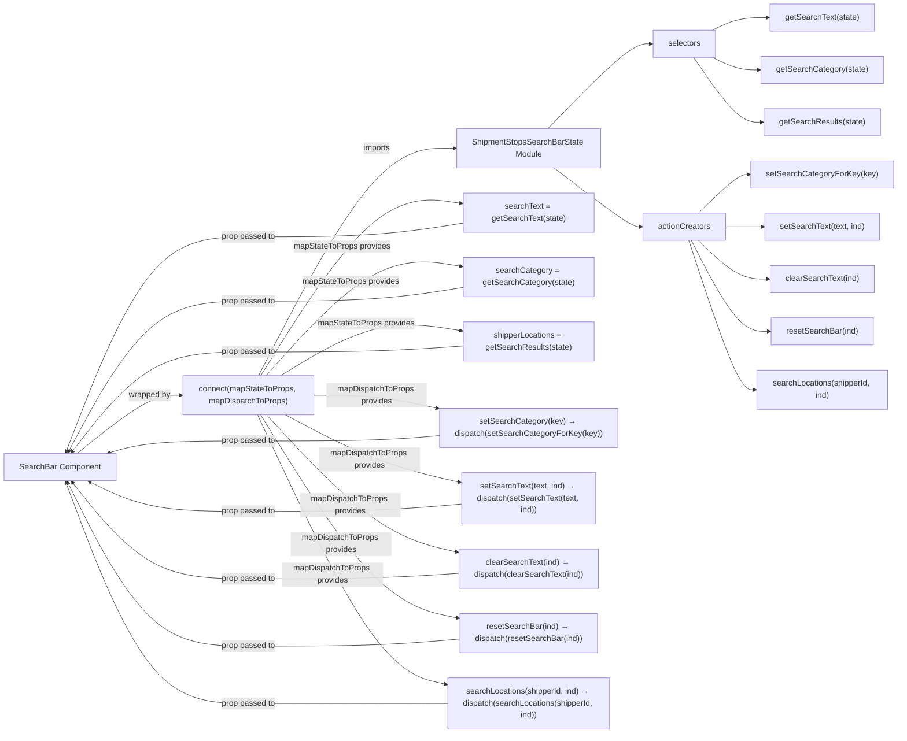

# Diagram: web/portal/src/pages/shipments/create-shipment/components/search/ShipmentStopsSearchBarContainer.js

> Auto-generated by Obscura crawlers

## Mermaid

### SVG

<svg id="container" width="1774.640625" xmlns="http://www.w3.org/2000/svg" class="flowchart" height="1458" viewBox="0 0 1774.640625 1458" role="graphics-document document" aria-roledescription="flowchart-v2"><g><marker id="container_flowchart-v2-pointEnd" class="marker flowchart-v2" viewBox="0 0 10 10" refX="5" refY="5" markerUnits="userSpaceOnUse" markerWidth="8" markerHeight="8" orient="auto"><path d="M 0 0 L 10 5 L 0 10 z" class="arrowMarkerPath" style="stroke-width: 1; stroke-dasharray: 1, 0;"></path></marker><marker id="container_flowchart-v2-pointStart" class="marker flowchart-v2" viewBox="0 0 10 10" refX="4.5" refY="5" markerUnits="userSpaceOnUse" markerWidth="8" markerHeight="8" orient="auto"><path d="M 0 5 L 10 10 L 10 0 z" class="arrowMarkerPath" style="stroke-width: 1; stroke-dasharray: 1, 0;"></path></marker><marker id="container_flowchart-v2-circleEnd" class="marker flowchart-v2" viewBox="0 0 10 10" refX="11" refY="5" markerUnits="userSpaceOnUse" markerWidth="11" markerHeight="11" orient="auto"><circle cx="5" cy="5" r="5" class="arrowMarkerPath" style="stroke-width: 1; stroke-dasharray: 1, 0;"></circle></marker><marker id="container_flowchart-v2-circleStart" class="marker flowchart-v2" viewBox="0 0 10 10" refX="-1" refY="5" markerUnits="userSpaceOnUse" markerWidth="11" markerHeight="11" orient="auto"><circle cx="5" cy="5" r="5" class="arrowMarkerPath" style="stroke-width: 1; stroke-dasharray: 1, 0;"></circle></marker><marker id="container_flowchart-v2-crossEnd" class="marker cross flowchart-v2" viewBox="0 0 11 11" refX="12" refY="5.2" markerUnits="userSpaceOnUse" markerWidth="11" markerHeight="11" orient="auto"><path d="M 1,1 l 9,9 M 10,1 l -9,9" class="arrowMarkerPath" style="stroke-width: 2; stroke-dasharray: 1, 0;"></path></marker><marker id="container_flowchart-v2-crossStart" class="marker cross flowchart-v2" viewBox="0 0 11 11" refX="-1" refY="5.2" markerUnits="userSpaceOnUse" markerWidth="11" markerHeight="11" orient="auto"><path d="M 1,1 l 9,9 M 10,1 l -9,9" class="arrowMarkerPath" style="stroke-width: 2; stroke-dasharray: 1, 0;"></path></marker><g class="root"><g class="clusters"></g><g class="edgePaths"><path d="M152.288,902L176.353,882.667C200.419,863.333,248.549,824.667,283.168,805.333C317.786,786,338.893,786,349.447,786L360,786" id="L_SearchBar_Connect_0" class="edge-thickness-normal edge-pattern-solid edge-thickness-normal edge-pattern-solid flowchart-link" style=";" data-edge="true" data-et="edge" data-id="L_SearchBar_Connect_0" data-points="W3sieCI6MTUyLjI4ODA3OTEwODM5MTYsInkiOjkwMn0seyJ4IjoyOTYuNjc5Njg3NSwieSI6Nzg2fSx7IngiOjM2NCwieSI6Nzg2fV0=" marker-end="url(#container_flowchart-v2-pointEnd)"></path><path d="M514.255,747L553.379,671.667C592.503,596.333,670.752,445.667,735.437,370.333C800.122,295,851.245,295,876.806,295L902.367,295" id="L_Connect_SearchBarState_0" class="edge-thickness-normal edge-pattern-solid edge-thickness-normal edge-pattern-solid flowchart-link" style=";" data-edge="true" data-et="edge" data-id="L_Connect_SearchBarState_0" data-points="W3sieCI6NTE0LjI1NDU4MjQ4NDcyNSwieSI6NzQ3fSx7IngiOjc0OSwieSI6Mjk1fSx7IngiOjkwNi4zNjcxODc1LCJ5IjoyOTV9XQ==" marker-end="url(#container_flowchart-v2-pointEnd)"></path><path d="M1086.444,256L1113.521,227.833C1140.598,199.667,1194.752,143.333,1228.652,115.167C1262.552,87,1276.198,87,1283.021,87L1289.844,87" id="L_SearchBarState_Selectors_0" class="edge-thickness-normal edge-pattern-solid edge-thickness-normal edge-pattern-solid flowchart-link" style=";" data-edge="true" data-et="edge" data-id="L_SearchBarState_Selectors_0" data-points="W3sieCI6MTA4Ni40NDQzMzU5Mzc1LCJ5IjoyNTZ9LHsieCI6MTI0OC45MDYyNSwieSI6ODd9LHsieCI6MTI5My44NDM3NSwieSI6ODd9XQ==" marker-end="url(#container_flowchart-v2-pointEnd)"></path><path d="M1098.941,334L1123.936,353.5C1148.93,373,1198.918,412,1227.412,431.5C1255.906,451,1262.906,451,1266.406,451L1269.906,451" id="L_SearchBarState_AC_0" class="edge-thickness-normal edge-pattern-solid edge-thickness-normal edge-pattern-solid flowchart-link" style=";" data-edge="true" data-et="edge" data-id="L_SearchBarState_AC_0" data-points="W3sieCI6MTA5OC45NDE0MDYyNSwieSI6MzM0fSx7IngiOjEyNDguOTA2MjUsInkiOjQ1MX0seyJ4IjoxMjczLjkwNjI1LCJ5Ijo0NTF9XQ==" marker-end="url(#container_flowchart-v2-pointEnd)"></path><path d="M1412.485,60L1421.112,55.833C1429.74,51.667,1446.995,43.333,1464.969,39.167C1482.943,35,1501.635,35,1510.982,35L1520.328,35" id="L_Selectors_getSearchText_0" class="edge-thickness-normal edge-pattern-solid edge-thickness-normal edge-pattern-solid flowchart-link" style=";" data-edge="true" data-et="edge" data-id="L_Selectors_getSearchText_0" data-points="W3sieCI6MTQxMi40ODQ2NzU0ODA3NjkzLCJ5Ijo2MH0seyJ4IjoxNDY0LjI1LCJ5IjozNX0seyJ4IjoxNTI0LjMyODEyNSwieSI6MzV9XQ==" marker-end="url(#container_flowchart-v2-pointEnd)"></path><path d="M1412.485,114L1421.112,118.167C1429.74,122.333,1446.995,130.667,1462.159,134.833C1477.323,139,1490.396,139,1496.932,139L1503.469,139" id="L_Selectors_getSearchCategory_0" class="edge-thickness-normal edge-pattern-solid edge-thickness-normal edge-pattern-solid flowchart-link" style=";" data-edge="true" data-et="edge" data-id="L_Selectors_getSearchCategory_0" data-points="W3sieCI6MTQxMi40ODQ2NzU0ODA3NjkzLCJ5IjoxMTR9LHsieCI6MTQ2NC4yNSwieSI6MTM5fSx7IngiOjE1MDcuNDY4NzUsInkiOjEzOX1d" marker-end="url(#container_flowchart-v2-pointEnd)"></path><path d="M1375.214,114L1390.053,135.5C1404.892,157,1434.571,200,1456.809,221.5C1479.047,243,1493.844,243,1501.242,243L1508.641,243" id="L_Selectors_getSearchResults_0" class="edge-thickness-normal edge-pattern-solid edge-thickness-normal edge-pattern-solid flowchart-link" style=";" data-edge="true" data-et="edge" data-id="L_Selectors_getSearchResults_0" data-points="W3sieCI6MTM3NS4yMTM2NDE4MjY5MjMsInkiOjExNH0seyJ4IjoxNDY0LjI1LCJ5IjoyNDN9LHsieCI6MTUxMi42NDA2MjUsInkiOjI0M31d" marker-end="url(#container_flowchart-v2-pointEnd)"></path><path d="M1384.531,424L1397.818,411.167C1411.104,398.333,1437.677,372.667,1454.464,359.833C1471.25,347,1478.25,347,1481.75,347L1485.25,347" id="L_AC_setSearchCategoryForKey_0" class="edge-thickness-normal edge-pattern-solid edge-thickness-normal edge-pattern-solid flowchart-link" style=";" data-edge="true" data-et="edge" data-id="L_AC_setSearchCategoryForKey_0" data-points="W3sieCI6MTM4NC41MzE0MDAyNDAzODQ1LCJ5Ijo0MjR9LHsieCI6MTQ2NC4yNSwieSI6MzQ3fSx7IngiOjE0ODkuMjUsInkiOjM0N31d" marker-end="url(#container_flowchart-v2-pointEnd)"></path><path d="M1439.25,451L1443.417,451C1447.583,451,1455.917,451,1467.549,451C1479.182,451,1494.115,451,1501.581,451L1509.047,451" id="L_AC_setSearchTextAC_0" class="edge-thickness-normal edge-pattern-solid edge-thickness-normal edge-pattern-solid flowchart-link" style=";" data-edge="true" data-et="edge" data-id="L_AC_setSearchTextAC_0" data-points="W3sieCI6MTQzOS4yNSwieSI6NDUxfSx7IngiOjE0NjQuMjUsInkiOjQ1MX0seyJ4IjoxNTEzLjA0Njg3NSwieSI6NDUxfV0=" marker-end="url(#container_flowchart-v2-pointEnd)"></path><path d="M1384.531,478L1397.818,490.833C1411.104,503.667,1437.677,529.333,1460.268,542.167C1482.859,555,1501.469,555,1510.773,555L1520.078,555" id="L_AC_clearSearchTextAC_0" class="edge-thickness-normal edge-pattern-solid edge-thickness-normal edge-pattern-solid flowchart-link" style=";" data-edge="true" data-et="edge" data-id="L_AC_clearSearchTextAC_0" data-points="W3sieCI6MTM4NC41MzE0MDAyNDAzODQ1LCJ5Ijo0Nzh9LHsieCI6MTQ2NC4yNSwieSI6NTU1fSx7IngiOjE1MjQuMDc4MTI1LCJ5Ijo1NTV9XQ==" marker-end="url(#container_flowchart-v2-pointEnd)"></path><path d="M1370.555,478L1386.171,508.167C1401.787,538.333,1433.018,598.667,1458.289,628.833C1483.56,659,1502.87,659,1512.525,659L1522.18,659" id="L_AC_resetSearchBarAC_0" class="edge-thickness-normal edge-pattern-solid edge-thickness-normal edge-pattern-solid flowchart-link" style=";" data-edge="true" data-et="edge" data-id="L_AC_resetSearchBarAC_0" data-points="W3sieCI6MTM3MC41NTQ3NjI2MjAxOTI0LCJ5Ijo0Nzh9LHsieCI6MTQ2NC4yNSwieSI6NjU5fSx7IngiOjE1MjYuMTc5Njg3NSwieSI6NjU5fV0=" marker-end="url(#container_flowchart-v2-pointEnd)"></path><path d="M1365.551,478L1382.001,527.5C1398.451,577,1431.35,676,1452.749,725.5C1474.148,775,1484.047,775,1488.996,775L1493.945,775" id="L_AC_searchLocationsAC_0" class="edge-thickness-normal edge-pattern-solid edge-thickness-normal edge-pattern-solid flowchart-link" style=";" data-edge="true" data-et="edge" data-id="L_AC_searchLocationsAC_0" data-points="W3sieCI6MTM2NS41NTA3ODEyNSwieSI6NDc4fSx7IngiOjE0NjQuMjUsInkiOjc3NX0seyJ4IjoxNDk3Ljk0NTMxMjUsInkiOjc3NX1d" marker-end="url(#container_flowchart-v2-pointEnd)"></path><path d="M518.556,747L556.963,686C595.37,625,672.185,503,738.258,445.874C804.331,388.747,859.661,396.495,887.326,400.369L914.992,404.242" id="L_Connect_searchText_0" class="edge-thickness-normal edge-pattern-solid edge-thickness-normal edge-pattern-solid flowchart-link" style=";" data-edge="true" data-et="edge" data-id="L_Connect_searchText_0" data-points="W3sieCI6NTE4LjU1NTU1NTU1NTU1NTUsInkiOjc0N30seyJ4Ijo3NDksInkiOjM4MX0seyJ4Ijo5MTguOTUzMTI1LCJ5Ijo0MDQuNzk3MTU1ODA1NTk0Nn1d" marker-end="url(#container_flowchart-v2-pointEnd)"></path><path d="M529.141,747L565.784,706.333C602.428,665.667,675.714,584.333,740.024,548.094C804.334,511.855,859.669,520.71,887.336,525.137L915.003,529.565" id="L_Connect_searchCategory_0" class="edge-thickness-normal edge-pattern-solid edge-thickness-normal edge-pattern-solid flowchart-link" style=";" data-edge="true" data-et="edge" data-id="L_Connect_searchCategory_0" data-points="W3sieCI6NTI5LjE0MTM0Mjc1NjE4MzgsInkiOjc0N30seyJ4Ijo3NDksInkiOjUwM30seyJ4Ijo5MTguOTUzMTI1LCJ5Ijo1MzAuMTk2NzQ5NDkyMTA4MX1d" marker-end="url(#container_flowchart-v2-pointEnd)"></path><path d="M558.161,747L589.968,727.667C621.774,708.333,685.387,669.667,744.861,654.761C804.334,639.855,859.669,648.71,887.336,653.137L915.003,657.565" id="L_Connect_shipperLocations_0" class="edge-thickness-normal edge-pattern-solid edge-thickness-normal edge-pattern-solid flowchart-link" style=";" data-edge="true" data-et="edge" data-id="L_Connect_shipperLocations_0" data-points="W3sieCI6NTU4LjE2MTI5MDMyMjU4MDYsInkiOjc0N30seyJ4Ijo3NDksInkiOjYzMX0seyJ4Ijo5MTguOTUzMTI1LCJ5Ijo2NTguMTk2NzQ5NDkyMTA4MX1d" marker-end="url(#container_flowchart-v2-pointEnd)"></path><path d="M624,786L644.833,786C665.667,786,707.333,786,748.348,790.373C789.364,794.747,829.727,803.494,849.909,807.867L870.091,812.24" id="L_Connect_setSearchCategory_0" class="edge-thickness-normal edge-pattern-solid edge-thickness-normal edge-pattern-solid flowchart-link" style=";" data-edge="true" data-et="edge" data-id="L_Connect_setSearchCategory_0" data-points="W3sieCI6NjI0LCJ5Ijo3ODZ9LHsieCI6NzQ5LCJ5Ijo3ODZ9LHsieCI6ODc0LCJ5Ijo4MTMuMDg3NTY1NzY1NDg0Mn1d" marker-end="url(#container_flowchart-v2-pointEnd)"></path><path d="M567.667,825L597.889,841C628.111,857,688.556,889,745.747,911.294C802.939,933.588,856.877,946.175,883.846,952.469L910.816,958.763" id="L_Connect_setSearchText_0" class="edge-thickness-normal edge-pattern-solid edge-thickness-normal edge-pattern-solid flowchart-link" style=";" data-edge="true" data-et="edge" data-id="L_Connect_setSearchText_0" data-points="W3sieCI6NTY3LjY2NjY2NjY2NjY2NjYsInkiOjgyNX0seyJ4Ijo3NDksInkiOjkyMX0seyJ4Ijo5MTQuNzEwOTM3NSwieSI6OTU5LjY3MTkyNzkwNTQwMTh9XQ==" marker-end="url(#container_flowchart-v2-pointEnd)"></path><path d="M530.164,825L566.636,864.333C603.109,903.667,676.055,982.333,738.515,1027.731C800.975,1073.129,852.95,1085.259,878.937,1091.323L904.925,1097.388" id="L_Connect_clearSearchText_0" class="edge-thickness-normal edge-pattern-solid edge-thickness-normal edge-pattern-solid flowchart-link" style=";" data-edge="true" data-et="edge" data-id="L_Connect_clearSearchText_0" data-points="W3sieCI6NTMwLjE2MzYzNjM2MzYzNjMsInkiOjgyNX0seyJ4Ijo3NDksInkiOjEwNjF9LHsieCI6OTA4LjgyMDMxMjUsInkiOjEwOTguMjk3MjMzOTQyODAzNn1d" marker-end="url(#container_flowchart-v2-pointEnd)"></path><path d="M518.315,825L556.763,886.667C595.21,948.333,672.105,1071.667,736.889,1138.953C801.673,1206.239,854.345,1217.477,880.681,1223.096L907.018,1228.716" id="L_Connect_resetSearchBar_0" class="edge-thickness-normal edge-pattern-solid edge-thickness-normal edge-pattern-solid flowchart-link" style=";" data-edge="true" data-et="edge" data-id="L_Connect_resetSearchBar_0" data-points="W3sieCI6NTE4LjMxNTQwMzQyMjk4MjksInkiOjgyNX0seyJ4Ijo3NDksInkiOjExOTV9LHsieCI6OTEwLjkyOTY4NzUsInkiOjEyMjkuNTUwMzk4NDk5NzY1Nn1d" marker-end="url(#container_flowchart-v2-pointEnd)"></path><path d="M512.315,825L551.762,909C591.21,993,670.105,1161,731.63,1250.152C793.155,1339.304,837.309,1349.609,859.387,1354.761L881.464,1359.913" id="L_Connect_searchLocations_0" class="edge-thickness-normal edge-pattern-solid edge-thickness-normal edge-pattern-solid flowchart-link" style=";" data-edge="true" data-et="edge" data-id="L_Connect_searchLocations_0" data-points="W3sieCI6NTEyLjMxNDkxNzEyNzA3MTgsInkiOjgyNX0seyJ4Ijo3NDksInkiOjEzMjl9LHsieCI6ODg1LjM1OTM3NSwieSI6MTM2MC44MjIxNTk3MTI0NTV9XQ==" marker-end="url(#container_flowchart-v2-pointEnd)"></path><path d="M918.953,443.803L890.628,448.336C862.302,452.869,805.651,461.934,734.826,466.467C664,471,579,471,503.613,471C428.227,471,362.453,471,301.89,542.212C241.327,613.424,185.975,755.848,158.298,827.06L130.622,898.272" id="L_searchText_SearchBar_0" class="edge-thickness-normal edge-pattern-solid edge-thickness-normal edge-pattern-solid flowchart-link" style=";" data-edge="true" data-et="edge" data-id="L_searchText_SearchBar_0" data-points="W3sieCI6OTE4Ljk1MzEyNSwieSI6NDQzLjgwMzI1MDUwNzg5MTg1fSx7IngiOjc0OSwieSI6NDcxfSx7IngiOjQ5NCwieSI6NDcxfSx7IngiOjI5Ni42Nzk2ODc1LCJ5Ijo0NzF9LHsieCI6MTI5LjE3MzEzNzI4MTY1OTQsInkiOjkwMn1d" marker-end="url(#container_flowchart-v2-pointEnd)"></path><path d="M918.953,571.803L890.628,576.336C862.302,580.869,805.651,589.934,734.826,594.467C664,599,579,599,503.613,599C428.227,599,362.453,599,302.644,648.913C242.834,698.826,188.988,798.653,162.065,848.566L135.142,898.479" id="L_searchCategory_SearchBar_0" class="edge-thickness-normal edge-pattern-solid edge-thickness-normal edge-pattern-solid flowchart-link" style=";" data-edge="true" data-et="edge" data-id="L_searchCategory_SearchBar_0" data-points="W3sieCI6OTE4Ljk1MzEyNSwieSI6NTcxLjgwMzI1MDUwNzg5MTl9LHsieCI6NzQ5LCJ5Ijo1OTl9LHsieCI6NDk0LCJ5Ijo1OTl9LHsieCI6Mjk2LjY3OTY4NzUsInkiOjU5OX0seyJ4IjoxMzMuMjQzMzIzODYzNjM2MzYsInkiOjkwMn1d" marker-end="url(#container_flowchart-v2-pointEnd)"></path><path d="M918.953,688.101L890.628,690.085C862.302,692.068,805.651,696.034,734.826,698.017C664,700,579,700,503.613,700C428.227,700,362.453,700,303.807,733.14C245.16,766.281,193.641,832.561,167.881,865.702L142.121,898.842" id="L_shipperLocations_SearchBar_0" class="edge-thickness-normal edge-pattern-solid edge-thickness-normal edge-pattern-solid flowchart-link" style=";" data-edge="true" data-et="edge" data-id="L_shipperLocations_SearchBar_0" data-points="W3sieCI6OTE4Ljk1MzEyNSwieSI6Njg4LjEwMTQyMjA5NzIwMjd9LHsieCI6NzQ5LCJ5Ijo3MDB9LHsieCI6NDk0LCJ5Ijo3MDB9LHsieCI6Mjk2LjY3OTY4NzUsInkiOjcwMH0seyJ4IjoxMzkuNjY2NTg3MDYzMzE4OCwieSI6OTAyfV0=" marker-end="url(#container_flowchart-v2-pointEnd)"></path><path d="M874,866.165L853.167,867.971C832.333,869.777,790.667,873.388,727.333,875.194C664,877,579,877,503.613,877C428.227,877,362.453,877,315.944,880.98C269.434,884.959,242.188,892.919,228.565,896.899L214.942,900.878" id="L_setSearchCategory_SearchBar_0" class="edge-thickness-normal edge-pattern-solid edge-thickness-normal edge-pattern-solid flowchart-link" style=";" data-edge="true" data-et="edge" data-id="L_setSearchCategory_SearchBar_0" data-points="W3sieCI6ODc0LCJ5Ijo4NjYuMTY0OTczNjkzODA2NH0seyJ4Ijo3NDksInkiOjg3N30seyJ4Ijo0OTQsInkiOjg3N30seyJ4IjoyOTYuNjc5Njg3NSwieSI6ODc3fSx7IngiOjIxMS4xMDI3NjQ0MjMwNzY5LCJ5Ijo5MDJ9XQ==" marker-end="url(#container_flowchart-v2-pointEnd)"></path><path d="M914.711,1002.636L887.092,1005.03C859.474,1007.424,804.237,1012.212,734.118,1014.606C664,1017,579,1017,503.613,1017C428.227,1017,362.453,1017,309.6,1007.129C256.746,997.258,216.813,977.515,196.846,967.644L176.879,957.773" id="L_setSearchText_SearchBar_0" class="edge-thickness-normal edge-pattern-solid edge-thickness-normal edge-pattern-solid flowchart-link" style=";" data-edge="true" data-et="edge" data-id="L_setSearchText_SearchBar_0" data-points="W3sieCI6OTE0LjcxMDkzNzUsInkiOjEwMDIuNjM2MTQxMDYzNzA3OX0seyJ4Ijo3NDksInkiOjEwMTd9LHsieCI6NDk0LCJ5IjoxMDE3fSx7IngiOjI5Ni42Nzk2ODc1LCJ5IjoxMDE3fSx7IngiOjE3My4yOTMzMjM4NjM2MzYzNywieSI6OTU2fV0=" marker-end="url(#container_flowchart-v2-pointEnd)"></path><path d="M908.82,1140.344L882.184,1142.12C855.547,1143.896,802.273,1147.448,733.137,1149.224C664,1151,579,1151,503.613,1151C428.227,1151,362.453,1151,303.925,1119.02C245.397,1087.04,194.114,1023.08,168.472,991.101L142.831,959.121" id="L_clearSearchText_SearchBar_0" class="edge-thickness-normal edge-pattern-solid edge-thickness-normal edge-pattern-solid flowchart-link" style=";" data-edge="true" data-et="edge" data-id="L_clearSearchText_SearchBar_0" data-points="W3sieCI6OTA4LjgyMDMxMjUsInkiOjExNDAuMzQzNjQ3NDQ0OTEzNH0seyJ4Ijo3NDksInkiOjExNTF9LHsieCI6NDk0LCJ5IjoxMTUxfSx7IngiOjI5Ni42Nzk2ODc1LCJ5IjoxMTUxfSx7IngiOjE0MC4zMjgzMzYxNDg2NDg2NSwieSI6OTU2fV0=" marker-end="url(#container_flowchart-v2-pointEnd)"></path><path d="M910.93,1270.964L883.941,1273.303C856.953,1275.643,802.977,1280.321,733.488,1282.661C664,1285,579,1285,503.613,1285C428.227,1285,362.453,1285,302.448,1230.763C242.443,1176.526,188.206,1068.052,161.087,1013.815L133.969,959.578" id="L_resetSearchBar_SearchBar_0" class="edge-thickness-normal edge-pattern-solid edge-thickness-normal edge-pattern-solid flowchart-link" style=";" data-edge="true" data-et="edge" data-id="L_resetSearchBar_SearchBar_0" data-points="W3sieCI6OTEwLjkyOTY4NzUsInkiOjEyNzAuOTYzOTAwNjA5NDcwM30seyJ4Ijo3NDksInkiOjEyODV9LHsieCI6NDk0LCJ5IjoxMjg1fSx7IngiOjI5Ni42Nzk2ODc1LCJ5IjoxMjg1fSx7IngiOjEzMi4xNzk2ODc1LCJ5Ijo5NTZ9XQ==" marker-end="url(#container_flowchart-v2-pointEnd)"></path><path d="M885.359,1399L862.633,1399C839.906,1399,794.453,1399,729.227,1399C664,1399,579,1399,503.613,1399C428.227,1399,362.453,1399,301.84,1325.79C241.227,1252.58,185.775,1106.16,158.048,1032.951L130.322,959.741" id="L_searchLocations_SearchBar_0" class="edge-thickness-normal edge-pattern-solid edge-thickness-normal edge-pattern-solid flowchart-link" style=";" data-edge="true" data-et="edge" data-id="L_searchLocations_SearchBar_0" data-points="W3sieCI6ODg1LjM1OTM3NSwieSI6MTM5OX0seyJ4Ijo3NDksInkiOjEzOTl9LHsieCI6NDk0LCJ5IjoxMzk5fSx7IngiOjI5Ni42Nzk2ODc1LCJ5IjoxMzk5fSx7IngiOjEyOC45MDUyMTk0MTQ4OTM2MiwieSI6OTU2fV0=" marker-end="url(#container_flowchart-v2-pointEnd)"></path></g><g class="edgeLabels"><g class="edgeLabel" transform="translate(296.6796875, 786)"><g class="label" data-id="L_SearchBar_Connect_0" transform="translate(-42.3203125, -12)"><foreignObject width="84.640625" height="24">

wrapped by

</foreignObject></g></g><g class="edgeLabel" transform="translate(749, 295)"><g class="label" data-id="L_Connect_SearchBarState_0" transform="translate(-28.25, -12)"><foreignObject width="56.5" height="24">

imports

</foreignObject></g></g><g class="edgeLabel"><g class="label" data-id="L_SearchBarState_Selectors_0" transform="translate(0, 0)"><foreignObject width="0" height="0">

</foreignObject></g></g><g class="edgeLabel"><g class="label" data-id="L_SearchBarState_AC_0" transform="translate(0, 0)"><foreignObject width="0" height="0">

</foreignObject></g></g><g class="edgeLabel"><g class="label" data-id="L_Selectors_getSearchText_0" transform="translate(0, 0)"><foreignObject width="0" height="0">

</foreignObject></g></g><g class="edgeLabel"><g class="label" data-id="L_Selectors_getSearchCategory_0" transform="translate(0, 0)"><foreignObject width="0" height="0">

</foreignObject></g></g><g class="edgeLabel"><g class="label" data-id="L_Selectors_getSearchResults_0" transform="translate(0, 0)"><foreignObject width="0" height="0">

</foreignObject></g></g><g class="edgeLabel"><g class="label" data-id="L_AC_setSearchCategoryForKey_0" transform="translate(0, 0)"><foreignObject width="0" height="0">

</foreignObject></g></g><g class="edgeLabel"><g class="label" data-id="L_AC_setSearchTextAC_0" transform="translate(0, 0)"><foreignObject width="0" height="0">

</foreignObject></g></g><g class="edgeLabel"><g class="label" data-id="L_AC_clearSearchTextAC_0" transform="translate(0, 0)"><foreignObject width="0" height="0">

</foreignObject></g></g><g class="edgeLabel"><g class="label" data-id="L_AC_resetSearchBarAC_0" transform="translate(0, 0)"><foreignObject width="0" height="0">

</foreignObject></g></g><g class="edgeLabel"><g class="label" data-id="L_AC_searchLocationsAC_0" transform="translate(0, 0)"><foreignObject width="0" height="0">

</foreignObject></g></g><g class="edgeLabel" transform="translate(679.49611, 491.38853)"><g class="label" data-id="L_Connect_searchText_0" transform="translate(-96.9296875, -12)"><foreignObject width="193.859375" height="24">

mapStateToProps provides

</foreignObject></g></g><g class="edgeLabel" transform="translate(696.67769, 561.06751)"><g class="label" data-id="L_Connect_searchCategory_0" transform="translate(-96.9296875, -12)"><foreignObject width="193.859375" height="24">

mapStateToProps provides

</foreignObject></g></g><g class="edgeLabel" transform="translate(727.11886, 644.3003)"><g class="label" data-id="L_Connect_shipperLocations_0" transform="translate(-96.9296875, -12)"><foreignObject width="193.859375" height="24">

mapStateToProps provides

</foreignObject></g></g><g class="edgeLabel" transform="translate(749, 786)"><g class="label" data-id="L_Connect_setSearchCategory_0" transform="translate(-100, -24)"><foreignObject width="200" height="48">

mapDispatchToProps provides

</foreignObject></g></g><g class="edgeLabel" transform="translate(733.52758, 912.80872)"><g class="label" data-id="L_Connect_setSearchText_0" transform="translate(-100, -24)"><foreignObject width="200" height="48">

mapDispatchToProps provides

</foreignObject></g></g><g class="edgeLabel" transform="translate(695.37584, 1003.17002)"><g class="label" data-id="L_Connect_clearSearchText_0" transform="translate(-100, -24)"><foreignObject width="200" height="48">

mapDispatchToProps provides

</foreignObject></g></g><g class="edgeLabel" transform="translate(677.45766, 1080.2517)"><g class="label" data-id="L_Connect_resetSearchBar_0" transform="translate(-100, -24)"><foreignObject width="200" height="48">

mapDispatchToProps provides

</foreignObject></g></g><g class="edgeLabel" transform="translate(660.41762, 1140.37164)"><g class="label" data-id="L_Connect_searchLocations_0" transform="translate(-100, -24)"><foreignObject width="200" height="48">

mapDispatchToProps provides

</foreignObject></g></g><g class="edgeLabel" transform="translate(494, 471)"><g class="label" data-id="L_searchText_SearchBar_0" transform="translate(-54.1875, -12)"><foreignObject width="108.375" height="24">

prop passed to

</foreignObject></g></g><g class="edgeLabel" transform="translate(494, 599)"><g class="label" data-id="L_searchCategory_SearchBar_0" transform="translate(-54.1875, -12)"><foreignObject width="108.375" height="24">

prop passed to

</foreignObject></g></g><g class="edgeLabel" transform="translate(494, 700)"><g class="label" data-id="L_shipperLocations_SearchBar_0" transform="translate(-54.1875, -12)"><foreignObject width="108.375" height="24">

prop passed to

</foreignObject></g></g><g class="edgeLabel" transform="translate(494, 877)"><g class="label" data-id="L_setSearchCategory_SearchBar_0" transform="translate(-54.1875, -12)"><foreignObject width="108.375" height="24">

prop passed to

</foreignObject></g></g><g class="edgeLabel" transform="translate(494, 1017)"><g class="label" data-id="L_setSearchText_SearchBar_0" transform="translate(-54.1875, -12)"><foreignObject width="108.375" height="24">

prop passed to

</foreignObject></g></g><g class="edgeLabel" transform="translate(494, 1151)"><g class="label" data-id="L_clearSearchText_SearchBar_0" transform="translate(-54.1875, -12)"><foreignObject width="108.375" height="24">

prop passed to

</foreignObject></g></g><g class="edgeLabel" transform="translate(494, 1285)"><g class="label" data-id="L_resetSearchBar_SearchBar_0" transform="translate(-54.1875, -12)"><foreignObject width="108.375" height="24">

prop passed to

</foreignObject></g></g><g class="edgeLabel" transform="translate(494, 1399)"><g class="label" data-id="L_searchLocations_SearchBar_0" transform="translate(-54.1875, -12)"><foreignObject width="108.375" height="24">

prop passed to

</foreignObject></g></g></g><g class="nodes"><g class="node default" id="flowchart-SearchBar-0" transform="translate(118.6796875, 929)"><rect class="basic label-container" style="" x="-110.6796875" y="-27" width="221.359375" height="54"></rect><g class="label" style="" transform="translate(-80.6796875, -12)"><rect></rect><foreignObject width="161.359375" height="24">

SearchBar Component

</foreignObject></g></g><g class="node default" id="flowchart-Connect-1" transform="translate(494, 786)"><rect class="basic label-container" style="" x="-130" y="-39" width="260" height="78"></rect><g class="label" style="" transform="translate(-100, -24)"><rect></rect><foreignObject width="200" height="48">

connect(mapStateToProps, mapDispatchToProps)

</foreignObject></g></g><g class="node default" id="flowchart-SearchBarState-2" transform="translate(1048.953125, 295)"><rect class="basic label-container" style="" x="-142.5859375" y="-39" width="285.171875" height="78"></rect><g class="label" style="" transform="translate(-112.5859375, -24)"><rect></rect><foreignObject width="225.171875" height="48">

ShipmentStopsSearchBarState Module

</foreignObject></g></g><g class="node default" id="flowchart-Selectors-3" transform="translate(1356.578125, 87)"><rect class="basic label-container" style="" x="-62.734375" y="-27" width="125.46875" height="54"></rect><g class="label" style="" transform="translate(-32.734375, -12)"><rect></rect><foreignObject width="65.46875" height="24">

selectors

</foreignObject></g></g><g class="node default" id="flowchart-AC-4" transform="translate(1356.578125, 451)"><rect class="basic label-container" style="" x="-82.671875" y="-27" width="165.34375" height="54"></rect><g class="label" style="" transform="translate(-52.671875, -12)"><rect></rect><foreignObject width="105.34375" height="24">

actionCreators

</foreignObject></g></g><g class="node default" id="flowchart-getSearchText-5" transform="translate(1627.9453125, 35)"><rect class="basic label-container" style="" x="-103.6171875" y="-27" width="207.234375" height="54"></rect><g class="label" style="" transform="translate(-73.6171875, -12)"><rect></rect><foreignObject width="147.234375" height="24">

getSearchText(state)

</foreignObject></g></g><g class="node default" id="flowchart-getSearchCategory-6" transform="translate(1627.9453125, 139)"><rect class="basic label-container" style="" x="-120.4765625" y="-27" width="240.953125" height="54"></rect><g class="label" style="" transform="translate(-90.4765625, -12)"><rect></rect><foreignObject width="180.953125" height="24">

getSearchCategory(state)

</foreignObject></g></g><g class="node default" id="flowchart-getSearchResults-7" transform="translate(1627.9453125, 243)"><rect class="basic label-container" style="" x="-115.3046875" y="-27" width="230.609375" height="54"></rect><g class="label" style="" transform="translate(-85.3046875, -12)"><rect></rect><foreignObject width="170.609375" height="24">

getSearchResults(state)

</foreignObject></g></g><g class="node default" id="flowchart-setSearchCategoryForKey-8" transform="translate(1627.9453125, 347)"><rect class="basic label-container" style="" x="-138.6953125" y="-27" width="277.390625" height="54"></rect><g class="label" style="" transform="translate(-108.6953125, -12)"><rect></rect><foreignObject width="217.390625" height="24">

setSearchCategoryForKey(key)

</foreignObject></g></g><g class="node default" id="flowchart-setSearchTextAC-9" transform="translate(1627.9453125, 451)"><rect class="basic label-container" style="" x="-114.8984375" y="-27" width="229.796875" height="54"></rect><g class="label" style="" transform="translate(-84.8984375, -12)"><rect></rect><foreignObject width="169.796875" height="24">

setSearchText(text, ind)

</foreignObject></g></g><g class="node default" id="flowchart-clearSearchTextAC-10" transform="translate(1627.9453125, 555)"><rect class="basic label-container" style="" x="-103.8671875" y="-27" width="207.734375" height="54"></rect><g class="label" style="" transform="translate(-73.8671875, -12)"><rect></rect><foreignObject width="147.734375" height="24">

clearSearchText(ind)

</foreignObject></g></g><g class="node default" id="flowchart-resetSearchBarAC-11" transform="translate(1627.9453125, 659)"><rect class="basic label-container" style="" x="-101.765625" y="-27" width="203.53125" height="54"></rect><g class="label" style="" transform="translate(-71.765625, -12)"><rect></rect><foreignObject width="143.53125" height="24">

resetSearchBar(ind)

</foreignObject></g></g><g class="node default" id="flowchart-searchLocationsAC-12" transform="translate(1627.9453125, 775)"><rect class="basic label-container" style="" x="-130" y="-39" width="260" height="78"></rect><g class="label" style="" transform="translate(-100, -24)"><rect></rect><foreignObject width="200" height="48">

searchLocations(shipperId, ind)

</foreignObject></g></g><g class="node default" id="flowchart-searchText-38" transform="translate(1048.953125, 423)"><rect class="basic label-container" style="" x="-130" y="-39" width="260" height="78"></rect><g class="label" style="" transform="translate(-100, -24)"><rect></rect><foreignObject width="200" height="48">

searchText = getSearchText(state)

</foreignObject></g></g><g class="node default" id="flowchart-searchCategory-40" transform="translate(1048.953125, 551)"><rect class="basic label-container" style="" x="-130" y="-39" width="260" height="78"></rect><g class="label" style="" transform="translate(-100, -24)"><rect></rect><foreignObject width="200" height="48">

searchCategory = getSearchCategory(state)

</foreignObject></g></g><g class="node default" id="flowchart-shipperLocations-42" transform="translate(1048.953125, 679)"><rect class="basic label-container" style="" x="-130" y="-39" width="260" height="78"></rect><g class="label" style="" transform="translate(-100, -24)"><rect></rect><foreignObject width="200" height="48">

shipperLocations = getSearchResults(state)

</foreignObject></g></g><g class="node default" id="flowchart-setSearchCategory-44" transform="translate(1048.953125, 851)"><rect class="basic label-container" style="" x="-174.953125" y="-39" width="349.90625" height="78"></rect><g class="label" style="" transform="translate(-144.953125, -24)"><rect></rect><foreignObject width="289.90625" height="48">

setSearchCategory(key) → dispatch(setSearchCategoryForKey(key))

</foreignObject></g></g><g class="node default" id="flowchart-setSearchText-46" transform="translate(1048.953125, 991)"><rect class="basic label-container" style="" x="-134.2421875" y="-51" width="268.484375" height="102"></rect><g class="label" style="" transform="translate(-104.2421875, -36)"><rect></rect><foreignObject width="208.484375" height="72">

setSearchText(text, ind) → dispatch(setSearchText(text, ind))

</foreignObject></g></g><g class="node default" id="flowchart-clearSearchText-48" transform="translate(1048.953125, 1131)"><rect class="basic label-container" style="" x="-140.1328125" y="-39" width="280.265625" height="78"></rect><g class="label" style="" transform="translate(-110.1328125, -24)"><rect></rect><foreignObject width="220.265625" height="48">

clearSearchText(ind) → dispatch(clearSearchText(ind))

</foreignObject></g></g><g class="node default" id="flowchart-resetSearchBar-50" transform="translate(1048.953125, 1259)"><rect class="basic label-container" style="" x="-138.0234375" y="-39" width="276.046875" height="78"></rect><g class="label" style="" transform="translate(-108.0234375, -24)"><rect></rect><foreignObject width="216.046875" height="48">

resetSearchBar(ind) → dispatch(resetSearchBar(ind))

</foreignObject></g></g><g class="node default" id="flowchart-searchLocations-52" transform="translate(1048.953125, 1399)"><rect class="basic label-container" style="" x="-163.59375" y="-51" width="327.1875" height="102"></rect><g class="label" style="" transform="translate(-133.59375, -36)"><rect></rect><foreignObject width="267.1875" height="72">

searchLocations(shipperId, ind) → dispatch(searchLocations(shipperId, ind))

</foreignObject></g></g></g></g></g></svg>
