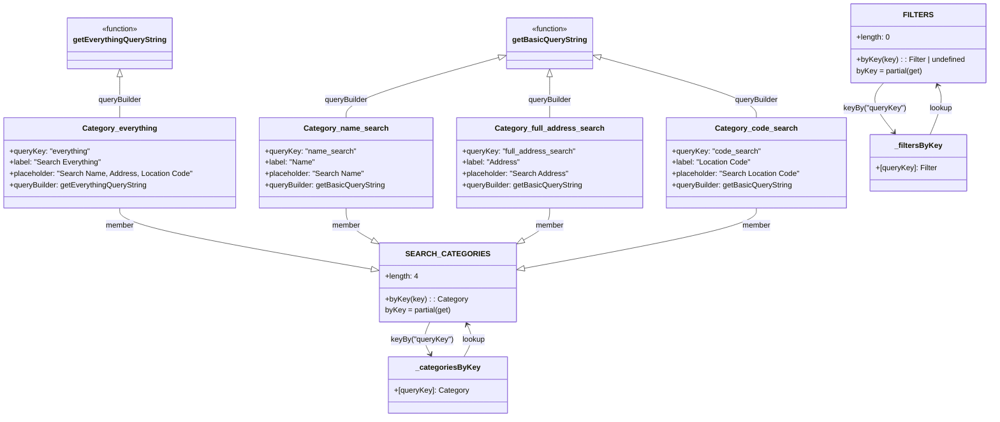

# Diagram: web/portal/src/pages/shipments/create-shipment/components/search/ShipmentStopsSearchFilterCategoryDefs.js

> Auto-generated by Obscura crawlers

## Mermaid

### SVG

<svg id="container" width="2078.21484375" xmlns="http://www.w3.org/2000/svg" class="classDiagram" height="886" viewBox="0 0 2078.21484375 886" role="graphics-document document" aria-roledescription="class"><g><defs><marker id="container_class-aggregationStart" class="marker aggregation class" refX="18" refY="7" markerWidth="190" markerHeight="240" orient="auto"><path d="M 18,7 L9,13 L1,7 L9,1 Z"></path></marker></defs><defs><marker id="container_class-aggregationEnd" class="marker aggregation class" refX="1" refY="7" markerWidth="20" markerHeight="28" orient="auto"><path d="M 18,7 L9,13 L1,7 L9,1 Z"></path></marker></defs><defs><marker id="container_class-extensionStart" class="marker extension class" refX="18" refY="7" markerWidth="190" markerHeight="240" orient="auto"><path d="M 1,7 L18,13 V 1 Z"></path></marker></defs><defs><marker id="container_class-extensionEnd" class="marker extension class" refX="1" refY="7" markerWidth="20" markerHeight="28" orient="auto"><path d="M 1,1 V 13 L18,7 Z"></path></marker></defs><defs><marker id="container_class-compositionStart" class="marker composition class" refX="18" refY="7" markerWidth="190" markerHeight="240" orient="auto"><path d="M 18,7 L9,13 L1,7 L9,1 Z"></path></marker></defs><defs><marker id="container_class-compositionEnd" class="marker composition class" refX="1" refY="7" markerWidth="20" markerHeight="28" orient="auto"><path d="M 18,7 L9,13 L1,7 L9,1 Z"></path></marker></defs><defs><marker id="container_class-dependencyStart" class="marker dependency class" refX="6" refY="7" markerWidth="190" markerHeight="240" orient="auto"><path d="M 5,7 L9,13 L1,7 L9,1 Z"></path></marker></defs><defs><marker id="container_class-dependencyEnd" class="marker dependency class" refX="13" refY="7" markerWidth="20" markerHeight="28" orient="auto"><path d="M 18,7 L9,13 L14,7 L9,1 Z"></path></marker></defs><defs><marker id="container_class-lollipopStart" class="marker lollipop class" refX="13" refY="7" markerWidth="190" markerHeight="240" orient="auto"><circle stroke="black" fill="transparent" cx="7" cy="7" r="6"></circle></marker></defs><defs><marker id="container_class-lollipopEnd" class="marker lollipop class" refX="1" refY="7" markerWidth="190" markerHeight="240" orient="auto"><circle stroke="black" fill="transparent" cx="7" cy="7" r="6"></circle></marker></defs><g class="root"><g class="clusters"></g><g class="edgePaths"><path d="M251.027,163.25L251.027,171.542C251.027,179.833,251.027,196.417,251.027,210.875C251.027,225.333,251.027,237.667,251.027,243.833L251.027,250" id="id_getEverythingQueryString_Category_everything_1" class="edge-thickness-normal edge-pattern-solid relation" style=";;;" data-edge="true" data-et="edge" data-id="id_getEverythingQueryString_Category_everything_1" data-points="W3sieCI6MjUxLjAyNzM0Mzc1LCJ5IjoxNDZ9LHsieCI6MjUxLjAyNzM0Mzc1LCJ5IjoyMTN9LHsieCI6MjUxLjAyNzM0Mzc1LCJ5IjoyNTB9XQ==" marker-start="url(#container_class-extensionStart)"></path><path d="M1051.354,121.27L997.271,136.559C943.188,151.847,835.022,182.423,780.938,203.878C726.855,225.333,726.855,237.667,726.855,243.833L726.855,250" id="id_getBasicQueryString_Category_name_search_2" class="edge-thickness-normal edge-pattern-solid relation" style=";;;" data-edge="true" data-et="edge" data-id="id_getBasicQueryString_Category_name_search_2" data-points="W3sieCI6MTA2Ny45NTMxMjUsInkiOjExNi41Nzc4NjYxOTY5OTAzfSx7IngiOjcyNi44NTU0Njg3NSwieSI6MjEzfSx7IngiOjcyNi44NTU0Njg3NSwieSI6MjUwfV0=" marker-start="url(#container_class-extensionStart)"></path><path d="M1154.898,163.25L1154.898,171.542C1154.898,179.833,1154.898,196.417,1154.898,210.875C1154.898,225.333,1154.898,237.667,1154.898,243.833L1154.898,250" id="id_getBasicQueryString_Category_full_address_search_3" class="edge-thickness-normal edge-pattern-solid relation" style=";;;" data-edge="true" data-et="edge" data-id="id_getBasicQueryString_Category_full_address_search_3" data-points="W3sieCI6MTE1NC44OTg0Mzc1LCJ5IjoxNDZ9LHsieCI6MTE1NC44OTg0Mzc1LCJ5IjoyMTN9LHsieCI6MTE1NC44OTg0Mzc1LCJ5IjoyNTB9XQ==" marker-start="url(#container_class-extensionStart)"></path><path d="M1258.459,120.893L1313.482,136.244C1368.504,151.595,1478.549,182.298,1533.571,203.816C1588.594,225.333,1588.594,237.667,1588.594,243.833L1588.594,250" id="id_getBasicQueryString_Category_code_search_4" class="edge-thickness-normal edge-pattern-solid relation" style=";;;" data-edge="true" data-et="edge" data-id="id_getBasicQueryString_Category_code_search_4" data-points="W3sieCI6MTI0MS44NDM3NSwieSI6MTE2LjI1NzU0MzI3ODE1MTA2fSx7IngiOjE1ODguNTkzNzUsInkiOjIxM30seyJ4IjoxNTg4LjU5Mzc1LCJ5IjoyNTB9XQ==" marker-start="url(#container_class-extensionStart)"></path><path d="M251.027,442L251.027,448.167C251.027,454.333,251.027,466.667,340.695,488.561C430.362,510.455,609.696,541.911,699.364,557.638L789.031,573.366" id="id_Category_everything_SEARCH_CATEGORIES_5" class="edge-thickness-normal edge-pattern-solid relation" style=";;;" data-edge="true" data-et="edge" data-id="id_Category_everything_SEARCH_CATEGORIES_5" data-points="W3sieCI6MjUxLjAyNzM0Mzc1LCJ5Ijo0NDJ9LHsieCI6MjUxLjAyNzM0Mzc1LCJ5Ijo0Nzl9LHsieCI6ODA2LjAyMTQ4NDM3NSwieSI6NTc2LjM0NjI3Njc4NzAwMzV9XQ==" marker-end="url(#container_class-extensionEnd)"></path><path d="M726.855,442L726.855,448.167C726.855,454.333,726.855,466.667,737.547,478.878C748.239,491.089,769.622,503.179,780.314,509.223L791.005,515.268" id="id_Category_name_search_SEARCH_CATEGORIES_6" class="edge-thickness-normal edge-pattern-solid relation" style=";;;" data-edge="true" data-et="edge" data-id="id_Category_name_search_SEARCH_CATEGORIES_6" data-points="W3sieCI6NzI2Ljg1NTQ2ODc1LCJ5Ijo0NDJ9LHsieCI6NzI2Ljg1NTQ2ODc1LCJ5Ijo0Nzl9LHsieCI6ODA2LjAyMTQ4NDM3NSwieSI6NTIzLjc1NzU5OTU0MDA1Nzl9XQ==" marker-end="url(#container_class-extensionEnd)"></path><path d="M1154.898,442L1154.898,448.167C1154.898,454.333,1154.898,466.667,1144.207,478.878C1133.515,491.089,1112.132,503.179,1101.44,509.223L1090.749,515.268" id="id_Category_full_address_search_SEARCH_CATEGORIES_7" class="edge-thickness-normal edge-pattern-solid relation" style=";;;" data-edge="true" data-et="edge" data-id="id_Category_full_address_search_SEARCH_CATEGORIES_7" data-points="W3sieCI6MTE1NC44OTg0Mzc1LCJ5Ijo0NDJ9LHsieCI6MTE1NC44OTg0Mzc1LCJ5Ijo0Nzl9LHsieCI6MTA3NS43MzI0MjE4NzUsInkiOjUyMy43NTc1OTk1NDAwNTc5fV0=" marker-end="url(#container_class-extensionEnd)"></path><path d="M1588.594,442L1588.594,448.167C1588.594,454.333,1588.594,466.667,1505.943,488.273C1423.292,509.88,1257.991,540.76,1175.34,556.2L1092.689,571.64" id="id_Category_code_search_SEARCH_CATEGORIES_8" class="edge-thickness-normal edge-pattern-solid relation" style=";;;" data-edge="true" data-et="edge" data-id="id_Category_code_search_SEARCH_CATEGORIES_8" data-points="W3sieCI6MTU4OC41OTM3NSwieSI6NDQyfSx7IngiOjE1ODguNTkzNzUsInkiOjQ3OX0seyJ4IjoxMDc1LjczMjQyMTg3NSwieSI6NTc0LjgwNzY0NDY0MTE4MjV9XQ==" marker-end="url(#container_class-extensionEnd)"></path><path d="M902.221,684L899.383,690.167C896.545,696.333,890.869,708.667,891.073,720.133C891.278,731.599,897.362,742.198,900.404,747.497L903.446,752.796" id="id_SEARCH_CATEGORIES__categoriesByKey_9" class="edge-thickness-normal edge-pattern-solid relation" style=";;;" data-edge="true" data-et="edge" data-id="id_SEARCH_CATEGORIES__categoriesByKey_9" data-points="W3sieCI6OTAyLjIyMDU3Mzk5Mjc2ODUsInkiOjY4NH0seyJ4Ijo4ODUuMTkzMzU5Mzc1LCJ5Ijo3MjF9LHsieCI6OTA2LjQzMzQ5MzA3MzQ1MzYsInkiOjc1OH1d" marker-end="url(#container_class-dependencyEnd)"></path><path d="M975.32,758L978.86,751.833C982.4,745.667,989.481,733.333,990.601,721.908C991.721,710.484,986.881,699.967,984.461,694.709L982.042,689.451" id="id__categoriesByKey_SEARCH_CATEGORIES_10" class="edge-thickness-normal edge-pattern-solid relation" style=";;;" data-edge="true" data-et="edge" data-id="id__categoriesByKey_SEARCH_CATEGORIES_10" data-points="W3sieCI6OTc1LjMyMDQxMzE3NjU0NjQsInkiOjc1OH0seyJ4Ijo5OTYuNTYwNTQ2ODc1LCJ5Ijo3MjF9LHsieCI6OTc5LjUzMzMzMjI1NzIzMTUsInkiOjY4NH1d" marker-end="url(#container_class-dependencyEnd)"></path><path d="M1856.753,176L1851.494,182.167C1846.235,188.333,1835.716,200.667,1839.284,218.21C1842.852,235.753,1860.507,258.506,1869.334,269.883L1878.161,281.26" id="id_FILTERS__filtersByKey_11" class="edge-thickness-normal edge-pattern-solid relation" style=";;;" data-edge="true" data-et="edge" data-id="id_FILTERS__filtersByKey_11" data-points="W3sieCI6MTg1Ni43NTM0NTQyODcxOTAyLCJ5IjoxNzZ9LHsieCI6MTgyNS4xOTcyNjU2MjUsInkiOjIxM30seyJ4IjoxODgxLjgzOTM3MzgyNTE4OCwieSI6Mjg2fV0=" marker-end="url(#container_class-dependencyEnd)"></path><path d="M1953.515,286L1958.609,273.833C1963.703,261.667,1973.89,237.333,1976.564,219.908C1979.238,202.484,1974.399,191.967,1971.979,186.709L1969.559,181.451" id="id__filtersByKey_FILTERS_12" class="edge-thickness-normal edge-pattern-solid relation" style=";;;" data-edge="true" data-et="edge" data-id="id__filtersByKey_FILTERS_12" data-points="W3sieCI6MTk1My41MTQ5NDk0ODMwODI4LCJ5IjoyODZ9LHsieCI6MTk4NC4wNzgxMjUsInkiOjIxM30seyJ4IjoxOTY3LjA1MDkxMDM4MjIzMTUsInkiOjE3Nn1d" marker-end="url(#container_class-dependencyEnd)"></path></g><g class="edgeLabels"><g class="edgeLabel" transform="translate(251.02734375, 213)"><g class="label" data-id="id_getEverythingQueryString_Category_everything_1" transform="translate(-47.140625, -12)"><foreignObject width="94.28125" height="24">

queryBuilder

</foreignObject></g></g><g class="edgeLabel" transform="translate(726.85546875, 213)"><g class="label" data-id="id_getBasicQueryString_Category_name_search_2" transform="translate(-47.140625, -12)"><foreignObject width="94.28125" height="24">

queryBuilder

</foreignObject></g></g><g class="edgeLabel" transform="translate(1154.8984375, 213)"><g class="label" data-id="id_getBasicQueryString_Category_full_address_search_3" transform="translate(-47.140625, -12)"><foreignObject width="94.28125" height="24">

queryBuilder

</foreignObject></g></g><g class="edgeLabel" transform="translate(1588.59375, 213)"><g class="label" data-id="id_getBasicQueryString_Category_code_search_4" transform="translate(-47.140625, -12)"><foreignObject width="94.28125" height="24">

queryBuilder

</foreignObject></g></g><g class="edgeLabel" transform="translate(251.02734375, 479)"><g class="label" data-id="id_Category_everything_SEARCH_CATEGORIES_5" transform="translate(-30.2734375, -12)"><foreignObject width="60.546875" height="24">

member

</foreignObject></g></g><g class="edgeLabel" transform="translate(726.85546875, 479)"><g class="label" data-id="id_Category_name_search_SEARCH_CATEGORIES_6" transform="translate(-30.2734375, -12)"><foreignObject width="60.546875" height="24">

member

</foreignObject></g></g><g class="edgeLabel" transform="translate(1154.8984375, 479)"><g class="label" data-id="id_Category_full_address_search_SEARCH_CATEGORIES_7" transform="translate(-30.2734375, -12)"><foreignObject width="60.546875" height="24">

member

</foreignObject></g></g><g class="edgeLabel" transform="translate(1588.59375, 479)"><g class="label" data-id="id_Category_code_search_SEARCH_CATEGORIES_8" transform="translate(-30.2734375, -12)"><foreignObject width="60.546875" height="24">

member

</foreignObject></g></g><g class="edgeLabel" transform="translate(885.67459, 721.8383)"><g class="label" data-id="id_SEARCH_CATEGORIES__categoriesByKey_9" transform="translate(-66.265625, -12)"><foreignObject width="132.53125" height="24">

keyBy("queryKey")

</foreignObject></g></g><g class="edgeLabel" transform="translate(996.07931, 721.8383)"><g class="label" data-id="id__categoriesByKey_SEARCH_CATEGORIES_10" transform="translate(-25.1015625, -12)"><foreignObject width="50.203125" height="24">

lookup

</foreignObject></g></g><g class="edgeLabel" transform="translate(1838.61287, 230.28995)"><g class="label" data-id="id_FILTERS__filtersByKey_11" transform="translate(-66.265625, -12)"><foreignObject width="132.53125" height="24">

keyBy("queryKey")

</foreignObject></g></g><g class="edgeLabel" transform="translate(1976.66133, 230.71499)"><g class="label" data-id="id__filtersByKey_FILTERS_12" transform="translate(-25.1015625, -12)"><foreignObject width="50.203125" height="24">

lookup

</foreignObject></g></g></g><g class="nodes"><g class="node default" id="classId-getEverythingQueryString-0" transform="translate(251.02734375, 92)"><g class="basic label-container"><path d="M-106.59375 -54 L106.59375 -54 L106.59375 54 L-106.59375 54" stroke="none" stroke-width="0" fill="#ECECFF" style=""></path><path d="M-106.59375 -54 C-43.68050724959022 -54, 19.232735500819558 -54, 106.59375 -54 M-106.59375 -54 C-27.714549938964055 -54, 51.16465012207189 -54, 106.59375 -54 M106.59375 -54 C106.59375 -21.164431958442314, 106.59375 11.671136083115371, 106.59375 54 M106.59375 -54 C106.59375 -15.018979553986604, 106.59375 23.962040892026792, 106.59375 54 M106.59375 54 C42.44915488693859 54, -21.695440226122827 54, -106.59375 54 M106.59375 54 C57.01814937524863 54, 7.4425487504972665 54, -106.59375 54 M-106.59375 54 C-106.59375 22.618320475969362, -106.59375 -8.763359048061275, -106.59375 -54 M-106.59375 54 C-106.59375 28.878013097749573, -106.59375 3.756026195499146, -106.59375 -54" stroke="#9370DB" stroke-width="1.3" fill="none" stroke-dasharray="0 0" style=""></path></g><g class="annotation-group text" transform="translate(-39.484375, -30)"><g class="label" style="" transform="translate(0,-12)"><foreignObject width="78.96875" height="24">

«function»

</foreignObject></g></g><g class="label-group text" transform="translate(-94.59375, -6)"><g class="label" style="font-weight: bolder" transform="translate(0,-12)"><foreignObject width="189.1875" height="24">

getEverythingQueryString

</foreignObject></g></g><g class="members-group text" transform="translate(-94.59375, 42)"></g><g class="methods-group text" transform="translate(-94.59375, 72)"></g><g class="divider" style=""><path d="M-106.59375 18 C-32.851212340576964 18, 40.89132531884607 18, 106.59375 18 M-106.59375 18 C-52.238326229933286 18, 2.117097540133429 18, 106.59375 18" stroke="#9370DB" stroke-width="1.3" fill="none" stroke-dasharray="0 0" style=""></path></g><g class="divider" style=""><path d="M-106.59375 36 C-59.49255667368255 36, -12.3913633473651 36, 106.59375 36 M-106.59375 36 C-50.97205875987662 36, 4.6496324802467655 36, 106.59375 36" stroke="#9370DB" stroke-width="1.3" fill="none" stroke-dasharray="0 0" style=""></path></g></g><g class="node default" id="classId-getBasicQueryString-1" transform="translate(1154.8984375, 92)"><g class="basic label-container"><path d="M-86.9453125 -54 L86.9453125 -54 L86.9453125 54 L-86.9453125 54" stroke="none" stroke-width="0" fill="#ECECFF" style=""></path><path d="M-86.9453125 -54 C-31.33256814418403 -54, 24.28017621163194 -54, 86.9453125 -54 M-86.9453125 -54 C-25.161234205057568 -54, 36.622844089884865 -54, 86.9453125 -54 M86.9453125 -54 C86.9453125 -12.968352217954696, 86.9453125 28.06329556409061, 86.9453125 54 M86.9453125 -54 C86.9453125 -22.587345893516627, 86.9453125 8.825308212966746, 86.9453125 54 M86.9453125 54 C31.606863501708617 54, -23.731585496582767 54, -86.9453125 54 M86.9453125 54 C41.926716077152015 54, -3.0918803456959694 54, -86.9453125 54 M-86.9453125 54 C-86.9453125 17.2964092967509, -86.9453125 -19.407181406498196, -86.9453125 -54 M-86.9453125 54 C-86.9453125 28.741738941545844, -86.9453125 3.4834778830916875, -86.9453125 -54" stroke="#9370DB" stroke-width="1.3" fill="none" stroke-dasharray="0 0" style=""></path></g><g class="annotation-group text" transform="translate(-39.484375, -30)"><g class="label" style="" transform="translate(0,-12)"><foreignObject width="78.96875" height="24">

«function»

</foreignObject></g></g><g class="label-group text" transform="translate(-74.9453125, -6)"><g class="label" style="font-weight: bolder" transform="translate(0,-12)"><foreignObject width="149.890625" height="24">

getBasicQueryString

</foreignObject></g></g><g class="members-group text" transform="translate(-74.9453125, 42)"></g><g class="methods-group text" transform="translate(-74.9453125, 72)"></g><g class="divider" style=""><path d="M-86.9453125 18 C-51.92198042775618 18, -16.898648355512364 18, 86.9453125 18 M-86.9453125 18 C-18.376135502805724 18, 50.19304149438855 18, 86.9453125 18" stroke="#9370DB" stroke-width="1.3" fill="none" stroke-dasharray="0 0" style=""></path></g><g class="divider" style=""><path d="M-86.9453125 36 C-22.13688067500034 36, 42.67155114999932 36, 86.9453125 36 M-86.9453125 36 C-32.02354807601065 36, 22.898216347978703 36, 86.9453125 36" stroke="#9370DB" stroke-width="1.3" fill="none" stroke-dasharray="0 0" style=""></path></g></g><g class="node default" id="classId-Category_everything-2" transform="translate(251.02734375, 346)"><g class="basic label-container"><path d="M-243.02734375 -96 L243.02734375 -96 L243.02734375 96 L-243.02734375 96" stroke="none" stroke-width="0" fill="#ECECFF" style=""></path><path d="M-243.02734375 -96 C-70.05803573419504 -96, 102.91127228160991 -96, 243.02734375 -96 M-243.02734375 -96 C-57.95833479150946 -96, 127.11067416698108 -96, 243.02734375 -96 M243.02734375 -96 C243.02734375 -46.60152337705903, 243.02734375 2.7969532458819373, 243.02734375 96 M243.02734375 -96 C243.02734375 -52.80348575856421, 243.02734375 -9.606971517128414, 243.02734375 96 M243.02734375 96 C101.30665804915753 96, -40.41402765168493 96, -243.02734375 96 M243.02734375 96 C111.33461554072247 96, -20.358112668555066 96, -243.02734375 96 M-243.02734375 96 C-243.02734375 39.610407138787224, -243.02734375 -16.779185722425552, -243.02734375 -96 M-243.02734375 96 C-243.02734375 27.068194702425146, -243.02734375 -41.86361059514971, -243.02734375 -96" stroke="#9370DB" stroke-width="1.3" fill="none" stroke-dasharray="0 0" style=""></path></g><g class="annotation-group text" transform="translate(0, -72)"></g><g class="label-group text" transform="translate(-75.4296875, -72)"><g class="label" style="font-weight: bolder" transform="translate(0,-12)"><foreignObject width="150.859375" height="24">

Category_everything

</foreignObject></g></g><g class="members-group text" transform="translate(-231.02734375, -24)"><g class="label" style="" transform="translate(0,-12)"><foreignObject width="172.71875" height="24">

+queryKey: "everything"

</foreignObject></g><g class="label" style="" transform="translate(0,12)"><foreignObject width="194.34375" height="24">

+label: "Search Everything"

</foreignObject></g><g class="label" style="" transform="translate(0,36)"><foreignObject width="386.625" height="24">

+placeholder: "Search Name, Address, Location Code"

</foreignObject></g><g class="label" style="" transform="translate(0,60)"><foreignObject width="295.25" height="24">

+queryBuilder: getEverythingQueryString

</foreignObject></g></g><g class="methods-group text" transform="translate(-231.02734375, 96)"></g><g class="divider" style=""><path d="M-243.02734375 -48 C-55.93377905143748 -48, 131.15978564712503 -48, 243.02734375 -48 M-243.02734375 -48 C-65.42344408226211 -48, 112.18045558547578 -48, 243.02734375 -48" stroke="#9370DB" stroke-width="1.3" fill="none" stroke-dasharray="0 0" style=""></path></g><g class="divider" style=""><path d="M-243.02734375 72 C-116.7840228182234 72, 9.459298113553189 72, 243.02734375 72 M-243.02734375 72 C-81.93549375028331 72, 79.15635624943337 72, 243.02734375 72" stroke="#9370DB" stroke-width="1.3" fill="none" stroke-dasharray="0 0" style=""></path></g></g><g class="node default" id="classId-Category_name_search-3" transform="translate(726.85546875, 346)"><g class="basic label-container"><path d="M-182.80078125 -96 L182.80078125 -96 L182.80078125 96 L-182.80078125 96" stroke="none" stroke-width="0" fill="#ECECFF" style=""></path><path d="M-182.80078125 -96 C-89.57039344850779 -96, 3.6599943529844268 -96, 182.80078125 -96 M-182.80078125 -96 C-51.651005163610535 -96, 79.49877092277893 -96, 182.80078125 -96 M182.80078125 -96 C182.80078125 -57.55616102849411, 182.80078125 -19.11232205698822, 182.80078125 96 M182.80078125 -96 C182.80078125 -26.214937435422897, 182.80078125 43.570125129154206, 182.80078125 96 M182.80078125 96 C82.31544955310432 96, -18.16988214379137 96, -182.80078125 96 M182.80078125 96 C58.15608729741365 96, -66.4886066551727 96, -182.80078125 96 M-182.80078125 96 C-182.80078125 35.74187653988344, -182.80078125 -24.516246920233115, -182.80078125 -96 M-182.80078125 96 C-182.80078125 21.471933720848398, -182.80078125 -53.056132558303204, -182.80078125 -96" stroke="#9370DB" stroke-width="1.3" fill="none" stroke-dasharray="0 0" style=""></path></g><g class="annotation-group text" transform="translate(0, -72)"></g><g class="label-group text" transform="translate(-84.6171875, -72)"><g class="label" style="font-weight: bolder" transform="translate(0,-12)"><foreignObject width="169.234375" height="24">

Category_name_search

</foreignObject></g></g><g class="members-group text" transform="translate(-170.80078125, -24)"><g class="label" style="" transform="translate(0,-12)"><foreignObject width="192.09375" height="24">

+queryKey: "name_search"

</foreignObject></g><g class="label" style="" transform="translate(0,12)"><foreignObject width="107.125" height="24">

+label: "Name"

</foreignObject></g><g class="label" style="" transform="translate(0,36)"><foreignObject width="210.5" height="24">

+placeholder: "Search Name"

</foreignObject></g><g class="label" style="" transform="translate(0,60)"><foreignObject width="256.984375" height="24">

+queryBuilder: getBasicQueryString

</foreignObject></g></g><g class="methods-group text" transform="translate(-170.80078125, 96)"></g><g class="divider" style=""><path d="M-182.80078125 -48 C-78.08972849759833 -48, 26.62132425480334 -48, 182.80078125 -48 M-182.80078125 -48 C-79.60463225181411 -48, 23.59151674637178 -48, 182.80078125 -48" stroke="#9370DB" stroke-width="1.3" fill="none" stroke-dasharray="0 0" style=""></path></g><g class="divider" style=""><path d="M-182.80078125 72 C-76.77827119504542 72, 29.24423885990916 72, 182.80078125 72 M-182.80078125 72 C-39.77224470152922 72, 103.25629184694156 72, 182.80078125 72" stroke="#9370DB" stroke-width="1.3" fill="none" stroke-dasharray="0 0" style=""></path></g></g><g class="node default" id="classId-Category_full_address_search-4" transform="translate(1154.8984375, 346)"><g class="basic label-container"><path d="M-195.2421875 -96 L195.2421875 -96 L195.2421875 96 L-195.2421875 96" stroke="none" stroke-width="0" fill="#ECECFF" style=""></path><path d="M-195.2421875 -96 C-81.14165652110678 -96, 32.958874457786436 -96, 195.2421875 -96 M-195.2421875 -96 C-71.72029686677726 -96, 51.80159376644548 -96, 195.2421875 -96 M195.2421875 -96 C195.2421875 -24.5119308571834, 195.2421875 46.9761382856332, 195.2421875 96 M195.2421875 -96 C195.2421875 -22.173937207646688, 195.2421875 51.652125584706624, 195.2421875 96 M195.2421875 96 C52.83592209932155 96, -89.5703433013569 96, -195.2421875 96 M195.2421875 96 C99.42320636680613 96, 3.6042252336122544 96, -195.2421875 96 M-195.2421875 96 C-195.2421875 30.701864301068213, -195.2421875 -34.596271397863575, -195.2421875 -96 M-195.2421875 96 C-195.2421875 41.105338455635135, -195.2421875 -13.78932308872973, -195.2421875 -96" stroke="#9370DB" stroke-width="1.3" fill="none" stroke-dasharray="0 0" style=""></path></g><g class="annotation-group text" transform="translate(0, -72)"></g><g class="label-group text" transform="translate(-109.5, -72)"><g class="label" style="font-weight: bolder" transform="translate(0,-12)"><foreignObject width="219" height="24">

Category_full_address_search

</foreignObject></g></g><g class="members-group text" transform="translate(-183.2421875, -24)"><g class="label" style="" transform="translate(0,-12)"><foreignObject width="240.671875" height="24">

+queryKey: "full_address_search"

</foreignObject></g><g class="label" style="" transform="translate(0,12)"><foreignObject width="122.015625" height="24">

+label: "Address"

</foreignObject></g><g class="label" style="" transform="translate(0,36)"><foreignObject width="225.859375" height="24">

+placeholder: "Search Address"

</foreignObject></g><g class="label" style="" transform="translate(0,60)"><foreignObject width="256.984375" height="24">

+queryBuilder: getBasicQueryString

</foreignObject></g></g><g class="methods-group text" transform="translate(-183.2421875, 96)"></g><g class="divider" style=""><path d="M-195.2421875 -48 C-74.38281403166576 -48, 46.47655943666848 -48, 195.2421875 -48 M-195.2421875 -48 C-88.77612402928094 -48, 17.689939441438128 -48, 195.2421875 -48" stroke="#9370DB" stroke-width="1.3" fill="none" stroke-dasharray="0 0" style=""></path></g><g class="divider" style=""><path d="M-195.2421875 72 C-63.125053082982106 72, 68.99208133403579 72, 195.2421875 72 M-195.2421875 72 C-40.51223887662664 72, 114.21770974674672 72, 195.2421875 72" stroke="#9370DB" stroke-width="1.3" fill="none" stroke-dasharray="0 0" style=""></path></g></g><g class="node default" id="classId-Category_code_search-5" transform="translate(1588.59375, 346)"><g class="basic label-container"><path d="M-188.453125 -96 L188.453125 -96 L188.453125 96 L-188.453125 96" stroke="none" stroke-width="0" fill="#ECECFF" style=""></path><path d="M-188.453125 -96 C-56.368732257733825 -96, 75.71566048453235 -96, 188.453125 -96 M-188.453125 -96 C-111.01622114493362 -96, -33.57931728986725 -96, 188.453125 -96 M188.453125 -96 C188.453125 -35.58703923478259, 188.453125 24.825921530434826, 188.453125 96 M188.453125 -96 C188.453125 -38.66795806989121, 188.453125 18.664083860217573, 188.453125 96 M188.453125 96 C39.96229614684253 96, -108.52853270631493 96, -188.453125 96 M188.453125 96 C108.45157713888678 96, 28.450029277773552 96, -188.453125 96 M-188.453125 96 C-188.453125 23.32332176020381, -188.453125 -49.35335647959238, -188.453125 -96 M-188.453125 96 C-188.453125 36.711510564649465, -188.453125 -22.57697887070107, -188.453125 -96" stroke="#9370DB" stroke-width="1.3" fill="none" stroke-dasharray="0 0" style=""></path></g><g class="annotation-group text" transform="translate(0, -72)"></g><g class="label-group text" transform="translate(-81.84375, -72)"><g class="label" style="font-weight: bolder" transform="translate(0,-12)"><foreignObject width="163.6875" height="24">

Category_code_search

</foreignObject></g></g><g class="members-group text" transform="translate(-176.453125, -24)"><g class="label" style="" transform="translate(0,-12)"><foreignObject width="186.375" height="24">

+queryKey: "code_search"

</foreignObject></g><g class="label" style="" transform="translate(0,12)"><foreignObject width="167.6875" height="24">

+label: "Location Code"

</foreignObject></g><g class="label" style="" transform="translate(0,36)"><foreignObject width="271.0625" height="24">

+placeholder: "Search Location Code"

</foreignObject></g><g class="label" style="" transform="translate(0,60)"><foreignObject width="256.984375" height="24">

+queryBuilder: getBasicQueryString

</foreignObject></g></g><g class="methods-group text" transform="translate(-176.453125, 96)"></g><g class="divider" style=""><path d="M-188.453125 -48 C-76.91969164230751 -48, 34.613741715384975 -48, 188.453125 -48 M-188.453125 -48 C-107.11132639379099 -48, -25.76952778758198 -48, 188.453125 -48" stroke="#9370DB" stroke-width="1.3" fill="none" stroke-dasharray="0 0" style=""></path></g><g class="divider" style=""><path d="M-188.453125 72 C-96.85697298793615 72, -5.260820975872292 72, 188.453125 72 M-188.453125 72 C-86.10203922559766 72, 16.24904654880467 72, 188.453125 72" stroke="#9370DB" stroke-width="1.3" fill="none" stroke-dasharray="0 0" style=""></path></g></g><g class="node default" id="classId-SEARCH_CATEGORIES-6" transform="translate(940.876953125, 600)"><g class="basic label-container"><path d="M-134.85546875 -84 L134.85546875 -84 L134.85546875 84 L-134.85546875 84" stroke="none" stroke-width="0" fill="#ECECFF" style=""></path><path d="M-134.85546875 -84 C-33.52166458491887 -84, 67.81213958016227 -84, 134.85546875 -84 M-134.85546875 -84 C-42.68529647843195 -84, 49.4848757931361 -84, 134.85546875 -84 M134.85546875 -84 C134.85546875 -32.601856799900396, 134.85546875 18.796286400199207, 134.85546875 84 M134.85546875 -84 C134.85546875 -46.28815911024862, 134.85546875 -8.576318220497242, 134.85546875 84 M134.85546875 84 C39.43740146585333 84, -55.980665818293346 84, -134.85546875 84 M134.85546875 84 C71.38246480319091 84, 7.909460856381813 84, -134.85546875 84 M-134.85546875 84 C-134.85546875 36.77684783095694, -134.85546875 -10.446304338086122, -134.85546875 -84 M-134.85546875 84 C-134.85546875 29.76856892320624, -134.85546875 -24.462862153587523, -134.85546875 -84" stroke="#9370DB" stroke-width="1.3" fill="none" stroke-dasharray="0 0" style=""></path></g><g class="annotation-group text" transform="translate(0, -60)"></g><g class="label-group text" transform="translate(-76.1171875, -60)"><g class="label" style="font-weight: bolder" transform="translate(0,-12)"><foreignObject width="152.234375" height="24">

SEARCH_CATEGORIES

</foreignObject></g></g><g class="members-group text" transform="translate(-122.85546875, -12)"><g class="label" style="" transform="translate(0,-12)"><foreignObject width="70.765625" height="24">

+length: 4

</foreignObject></g></g><g class="methods-group text" transform="translate(-122.85546875, 36)"><g class="label" style="" transform="translate(0,-12)"><foreignObject width="169.59375" height="24">

+byKey(key) : : Category

</foreignObject></g><g class="label" style="" transform="translate(0,12)"><foreignObject width="140.203125" height="24">

byKey = partial(get)

</foreignObject></g></g><g class="divider" style=""><path d="M-134.85546875 -36 C-53.25219876326017 -36, 28.351071223479664 -36, 134.85546875 -36 M-134.85546875 -36 C-54.324727160767054 -36, 26.206014428465892 -36, 134.85546875 -36" stroke="#9370DB" stroke-width="1.3" fill="none" stroke-dasharray="0 0" style=""></path></g><g class="divider" style=""><path d="M-134.85546875 12 C-32.30141658129389 12, 70.25263558741221 12, 134.85546875 12 M-134.85546875 12 C-66.316386206766 12, 2.2226963364680046 12, 134.85546875 12" stroke="#9370DB" stroke-width="1.3" fill="none" stroke-dasharray="0 0" style=""></path></g></g><g class="node default" id="classId-_categoriesByKey-7" transform="translate(940.876953125, 818)"><g class="basic label-container"><path d="M-122.8046875 -60 L122.8046875 -60 L122.8046875 60 L-122.8046875 60" stroke="none" stroke-width="0" fill="#ECECFF" style=""></path><path d="M-122.8046875 -60 C-27.632467852561575 -60, 67.53975179487685 -60, 122.8046875 -60 M-122.8046875 -60 C-26.82129863927156 -60, 69.16209022145688 -60, 122.8046875 -60 M122.8046875 -60 C122.8046875 -25.388400394969707, 122.8046875 9.223199210060585, 122.8046875 60 M122.8046875 -60 C122.8046875 -13.17350655713171, 122.8046875 33.65298688573658, 122.8046875 60 M122.8046875 60 C40.62935468984716 60, -41.545978120305676 60, -122.8046875 60 M122.8046875 60 C65.01088621979213 60, 7.217084939584268 60, -122.8046875 60 M-122.8046875 60 C-122.8046875 34.318516963571234, -122.8046875 8.637033927142468, -122.8046875 -60 M-122.8046875 60 C-122.8046875 32.61875117259498, -122.8046875 5.237502345189974, -122.8046875 -60" stroke="#9370DB" stroke-width="1.3" fill="none" stroke-dasharray="0 0" style=""></path></g><g class="annotation-group text" transform="translate(0, -36)"></g><g class="label-group text" transform="translate(-64.640625, -36)"><g class="label" style="font-weight: bolder" transform="translate(0,-12)"><foreignObject width="129.28125" height="24">

_categoriesByKey

</foreignObject></g></g><g class="members-group text" transform="translate(-110.8046875, 12)"><g class="label" style="" transform="translate(0,-12)"><foreignObject width="156.96875" height="24">

+[queryKey]: Category

</foreignObject></g></g><g class="methods-group text" transform="translate(-110.8046875, 60)"></g><g class="divider" style=""><path d="M-122.8046875 -12 C-46.887729301981565 -12, 29.02922889603687 -12, 122.8046875 -12 M-122.8046875 -12 C-51.96366101805104 -12, 18.877365463897917 -12, 122.8046875 -12" stroke="#9370DB" stroke-width="1.3" fill="none" stroke-dasharray="0 0" style=""></path></g><g class="divider" style=""><path d="M-122.8046875 36 C-63.35160220118624 36, -3.898516902372478 36, 122.8046875 36 M-122.8046875 36 C-31.064708130005982 36, 60.675271239988035 36, 122.8046875 36" stroke="#9370DB" stroke-width="1.3" fill="none" stroke-dasharray="0 0" style=""></path></g></g><g class="node default" id="classId-FILTERS-8" transform="translate(1928.39453125, 92)"><g class="basic label-container"><path d="M-141.8203125 -84 L141.8203125 -84 L141.8203125 84 L-141.8203125 84" stroke="none" stroke-width="0" fill="#ECECFF" style=""></path><path d="M-141.8203125 -84 C-79.28323084124469 -84, -16.74614918248939 -84, 141.8203125 -84 M-141.8203125 -84 C-77.38004815900237 -84, -12.939783818004742 -84, 141.8203125 -84 M141.8203125 -84 C141.8203125 -27.62861642905237, 141.8203125 28.742767141895257, 141.8203125 84 M141.8203125 -84 C141.8203125 -40.00418738909994, 141.8203125 3.9916252218001205, 141.8203125 84 M141.8203125 84 C34.71136199675823 84, -72.39758850648354 84, -141.8203125 84 M141.8203125 84 C44.409202599581704 84, -53.00190730083659 84, -141.8203125 84 M-141.8203125 84 C-141.8203125 26.952377976284104, -141.8203125 -30.09524404743179, -141.8203125 -84 M-141.8203125 84 C-141.8203125 39.80411710014797, -141.8203125 -4.391765799704061, -141.8203125 -84" stroke="#9370DB" stroke-width="1.3" fill="none" stroke-dasharray="0 0" style=""></path></g><g class="annotation-group text" transform="translate(0, -60)"></g><g class="label-group text" transform="translate(-27.5625, -60)"><g class="label" style="font-weight: bolder" transform="translate(0,-12)"><foreignObject width="55.125" height="24">

FILTERS

</foreignObject></g></g><g class="members-group text" transform="translate(-129.8203125, -12)"><g class="label" style="" transform="translate(0,-12)"><foreignObject width="71.171875" height="24">

+length: 0

</foreignObject></g></g><g class="methods-group text" transform="translate(-129.8203125, 36)"><g class="label" style="" transform="translate(0,-12)"><foreignObject width="232.078125" height="24">

+byKey(key) : : Filter | undefined

</foreignObject></g><g class="label" style="" transform="translate(0,12)"><foreignObject width="140.203125" height="24">

byKey = partial(get)

</foreignObject></g></g><g class="divider" style=""><path d="M-141.8203125 -36 C-39.11591925940962 -36, 63.588473981180755 -36, 141.8203125 -36 M-141.8203125 -36 C-33.632131946540156 -36, 74.55604860691969 -36, 141.8203125 -36" stroke="#9370DB" stroke-width="1.3" fill="none" stroke-dasharray="0 0" style=""></path></g><g class="divider" style=""><path d="M-141.8203125 12 C-50.597042218511746 12, 40.62622806297651 12, 141.8203125 12 M-141.8203125 12 C-63.15366795767878 12, 15.512976584642445 12, 141.8203125 12" stroke="#9370DB" stroke-width="1.3" fill="none" stroke-dasharray="0 0" style=""></path></g></g><g class="node default" id="classId-_filtersByKey-9" transform="translate(1928.39453125, 346)"><g class="basic label-container"><path d="M-101.34765625 -60 L101.34765625 -60 L101.34765625 60 L-101.34765625 60" stroke="none" stroke-width="0" fill="#ECECFF" style=""></path><path d="M-101.34765625 -60 C-32.93308349645149 -60, 35.481489257097024 -60, 101.34765625 -60 M-101.34765625 -60 C-20.408867350768972 -60, 60.529921548462056 -60, 101.34765625 -60 M101.34765625 -60 C101.34765625 -20.45333567953071, 101.34765625 19.09332864093858, 101.34765625 60 M101.34765625 -60 C101.34765625 -19.934414474724022, 101.34765625 20.131171050551956, 101.34765625 60 M101.34765625 60 C25.940065350329675 60, -49.46752554934065 60, -101.34765625 60 M101.34765625 60 C45.412170493857715 60, -10.52331526228457 60, -101.34765625 60 M-101.34765625 60 C-101.34765625 12.500901549328567, -101.34765625 -34.998196901342865, -101.34765625 -60 M-101.34765625 60 C-101.34765625 12.082786582616613, -101.34765625 -35.834426834766774, -101.34765625 -60" stroke="#9370DB" stroke-width="1.3" fill="none" stroke-dasharray="0 0" style=""></path></g><g class="annotation-group text" transform="translate(0, -36)"></g><g class="label-group text" transform="translate(-48.0078125, -36)"><g class="label" style="font-weight: bolder" transform="translate(0,-12)"><foreignObject width="96.015625" height="24">

_filtersByKey

</foreignObject></g></g><g class="members-group text" transform="translate(-89.34765625, 12)"><g class="label" style="" transform="translate(0,-12)"><foreignObject width="130.6875" height="24">

+[queryKey]: Filter

</foreignObject></g></g><g class="methods-group text" transform="translate(-89.34765625, 60)"></g><g class="divider" style=""><path d="M-101.34765625 -12 C-38.266601024822855 -12, 24.81445420035429 -12, 101.34765625 -12 M-101.34765625 -12 C-32.33593856825152 -12, 36.67577911349696 -12, 101.34765625 -12" stroke="#9370DB" stroke-width="1.3" fill="none" stroke-dasharray="0 0" style=""></path></g><g class="divider" style=""><path d="M-101.34765625 36 C-31.890929884732884 36, 37.56579648053423 36, 101.34765625 36 M-101.34765625 36 C-26.557400486242628 36, 48.232855277514744 36, 101.34765625 36" stroke="#9370DB" stroke-width="1.3" fill="none" stroke-dasharray="0 0" style=""></path></g></g></g></g></g></svg>
