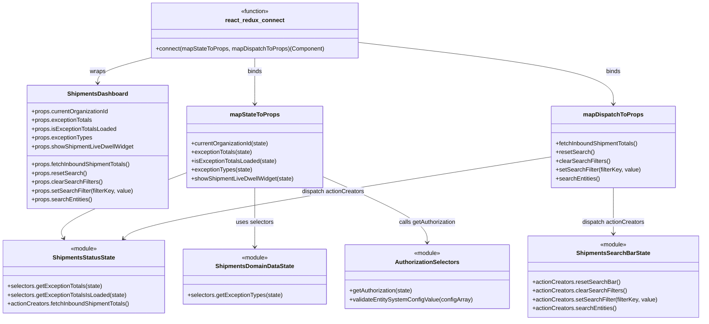

# Diagram: web/portal/src/pages/shipments/dashboard/Shipments.Dashboard.page.container.js

> Auto-generated by Obscura crawlers

## Mermaid

### SVG

<svg id="container" width="1897.953125" xmlns="http://www.w3.org/2000/svg" class="classDiagram" height="872" viewBox="0 0 1897.953125 872" role="graphics-document document" aria-roledescription="class"><g><defs><marker id="container_class-aggregationStart" class="marker aggregation class" refX="18" refY="7" markerWidth="190" markerHeight="240" orient="auto"><path d="M 18,7 L9,13 L1,7 L9,1 Z"></path></marker></defs><defs><marker id="container_class-aggregationEnd" class="marker aggregation class" refX="1" refY="7" markerWidth="20" markerHeight="28" orient="auto"><path d="M 18,7 L9,13 L1,7 L9,1 Z"></path></marker></defs><defs><marker id="container_class-extensionStart" class="marker extension class" refX="18" refY="7" markerWidth="190" markerHeight="240" orient="auto"><path d="M 1,7 L18,13 V 1 Z"></path></marker></defs><defs><marker id="container_class-extensionEnd" class="marker extension class" refX="1" refY="7" markerWidth="20" markerHeight="28" orient="auto"><path d="M 1,1 V 13 L18,7 Z"></path></marker></defs><defs><marker id="container_class-compositionStart" class="marker composition class" refX="18" refY="7" markerWidth="190" markerHeight="240" orient="auto"><path d="M 18,7 L9,13 L1,7 L9,1 Z"></path></marker></defs><defs><marker id="container_class-compositionEnd" class="marker composition class" refX="1" refY="7" markerWidth="20" markerHeight="28" orient="auto"><path d="M 18,7 L9,13 L1,7 L9,1 Z"></path></marker></defs><defs><marker id="container_class-dependencyStart" class="marker dependency class" refX="6" refY="7" markerWidth="190" markerHeight="240" orient="auto"><path d="M 5,7 L9,13 L1,7 L9,1 Z"></path></marker></defs><defs><marker id="container_class-dependencyEnd" class="marker dependency class" refX="13" refY="7" markerWidth="20" markerHeight="28" orient="auto"><path d="M 18,7 L9,13 L14,7 L9,1 Z"></path></marker></defs><defs><marker id="container_class-lollipopStart" class="marker lollipop class" refX="13" refY="7" markerWidth="190" markerHeight="240" orient="auto"><circle stroke="black" fill="transparent" cx="7" cy="7" r="6"></circle></marker></defs><defs><marker id="container_class-lollipopEnd" class="marker lollipop class" refX="1" refY="7" markerWidth="190" markerHeight="240" orient="auto"><circle stroke="black" fill="transparent" cx="7" cy="7" r="6"></circle></marker></defs><g class="root"><g class="clusters"></g><g class="edgePaths"><path d="M509.266,469.723L449.563,492.27C389.861,514.816,270.456,559.908,214.622,589.737C158.788,619.567,166.524,634.134,170.393,641.418L174.261,648.701" id="id_mapStateToProps_ShipmentsStatusState_1" class="edge-thickness-normal edge-pattern-solid relation" style=";;;" data-edge="true" data-et="edge" data-id="id_mapStateToProps_ShipmentsStatusState_1" data-points="W3sieCI6NTA5LjI2NTYyNSwieSI6NDY5LjcyMzQyNTUzNjgxNDI2fSx7IngiOjE1MS4wNTA3ODEyNSwieSI6NjA1fSx7IngiOjE3Ny4wNzU1NjQ4MjI2MzUxMywieSI6NjU0fV0=" marker-end="url(#container_class-dependencyEnd)"></path><path d="M693.895,511L693.895,526.667C693.895,542.333,693.895,573.667,693.895,600.5C693.895,627.333,693.895,649.667,693.895,660.833L693.895,672" id="id_mapStateToProps_ShipmentsDomainDataState_2" class="edge-thickness-normal edge-pattern-solid relation" style=";;;" data-edge="true" data-et="edge" data-id="id_mapStateToProps_ShipmentsDomainDataState_2" data-points="W3sieCI6NjkzLjg5NDUzMTI1LCJ5Ijo1MTF9LHsieCI6NjkzLjg5NDUzMTI1LCJ5Ijo2MDV9LHsieCI6NjkzLjg5NDUzMTI1LCJ5Ijo2Nzh9XQ==" marker-end="url(#container_class-dependencyEnd)"></path><path d="M878.523,481.59L925.068,502.158C971.612,522.726,1064.701,563.863,1111.245,593.598C1157.789,623.333,1157.789,641.667,1157.789,650.833L1157.789,660" id="id_mapStateToProps_AuthorizationSelectors_3" class="edge-thickness-normal edge-pattern-solid relation" style=";;;" data-edge="true" data-et="edge" data-id="id_mapStateToProps_AuthorizationSelectors_3" data-points="W3sieCI6ODc4LjUyMzQzNzUsInkiOjQ4MS41ODk1MDYzMDI3ODY0fSx7IngiOjExNTcuNzg5MDYyNSwieSI6NjA1fSx7IngiOjExNTcuNzg5MDYyNSwieSI6NjY2fV0=" marker-end="url(#container_class-dependencyEnd)"></path><path d="M1492.766,426.784L1307.833,456.487C1122.9,486.189,753.035,545.595,560.352,582.77C367.668,619.945,352.166,634.89,344.415,642.363L336.664,649.836" id="id_mapDispatchToProps_ShipmentsStatusState_4" class="edge-thickness-normal edge-pattern-solid relation" style=";;;" data-edge="true" data-et="edge" data-id="id_mapDispatchToProps_ShipmentsStatusState_4" data-points="W3sieCI6MTQ5Mi43NjU2MjUsInkiOjQyNi43ODQxNTI5MDA5NDAzNH0seyJ4IjozODMuMTY5OTIxODc1LCJ5Ijo2MDV9LHsieCI6MzMyLjM0NDQ0OTQyOTg5ODY1LCJ5Ijo2NTR9XQ==" marker-end="url(#container_class-dependencyEnd)"></path><path d="M1659.527,511L1659.527,526.667C1659.527,542.333,1659.527,573.667,1659.527,594.5C1659.527,615.333,1659.527,625.667,1659.527,630.833L1659.527,636" id="id_mapDispatchToProps_ShipmentsSearchBarState_5" class="edge-thickness-normal edge-pattern-solid relation" style=";;;" data-edge="true" data-et="edge" data-id="id_mapDispatchToProps_ShipmentsSearchBarState_5" data-points="W3sieCI6MTY1OS41MjczNDM3NSwieSI6NTExfSx7IngiOjE2NTkuNTI3MzQzNzUsInkiOjYwNX0seyJ4IjoxNjU5LjUyNzM0Mzc1LCJ5Ijo2NDJ9XQ==" marker-end="url(#container_class-dependencyEnd)"></path><path d="M414.773,156.455L390.362,162.879C365.951,169.303,317.128,182.152,292.716,193.742C268.305,205.333,268.305,215.667,268.305,220.833L268.305,226" id="id_react_redux_connect_ShipmentsDashboard_6" class="edge-thickness-normal edge-pattern-solid relation" style=";;;" data-edge="true" data-et="edge" data-id="id_react_redux_connect_ShipmentsDashboard_6" data-points="W3sieCI6NDE0Ljc3MzQzNzUsInkiOjE1Ni40NTQ2NzIyODM4NzA3NH0seyJ4IjoyNjguMzA0Njg3NSwieSI6MTk1fSx7IngiOjI2OC4zMDQ2ODc1LCJ5IjoyMzJ9XQ==" marker-end="url(#container_class-dependencyEnd)"></path><path d="M693.895,158L693.895,164.167C693.895,170.333,693.895,182.667,693.895,203.5C693.895,224.333,693.895,253.667,693.895,268.333L693.895,283" id="id_react_redux_connect_mapStateToProps_7" class="edge-thickness-normal edge-pattern-solid relation" style=";;;" data-edge="true" data-et="edge" data-id="id_react_redux_connect_mapStateToProps_7" data-points="W3sieCI6NjkzLjg5NDUzMTI1LCJ5IjoxNTh9LHsieCI6NjkzLjg5NDUzMTI1LCJ5IjoxOTV9LHsieCI6NjkzLjg5NDUzMTI1LCJ5IjoyODl9XQ==" marker-end="url(#container_class-dependencyEnd)"></path><path d="M973.016,115.374L1087.434,128.645C1201.853,141.916,1430.69,168.458,1545.109,196.396C1659.527,224.333,1659.527,253.667,1659.527,268.333L1659.527,283" id="id_react_redux_connect_mapDispatchToProps_8" class="edge-thickness-normal edge-pattern-solid relation" style=";;;" data-edge="true" data-et="edge" data-id="id_react_redux_connect_mapDispatchToProps_8" data-points="W3sieCI6OTczLjAxNTYyNSwieSI6MTE1LjM3NDE3MTczMDAwMjE5fSx7IngiOjE2NTkuNTI3MzQzNzUsInkiOjE5NX0seyJ4IjoxNjU5LjUyNzM0Mzc1LCJ5IjoyODl9XQ==" marker-end="url(#container_class-dependencyEnd)"></path></g><g class="edgeLabels"><g class="edgeLabel" transform="translate(304.20594, 547.16235)"><g class="label" data-id="id_mapStateToProps_ShipmentsStatusState_1" transform="translate(-51.34375, -12)"><foreignObject width="102.6875" height="24">

uses selectors

</foreignObject></g></g><g class="edgeLabel" transform="translate(693.89453125, 605)"><g class="label" data-id="id_mapStateToProps_ShipmentsDomainDataState_2" transform="translate(-51.34375, -12)"><foreignObject width="102.6875" height="24">

uses selectors

</foreignObject></g></g><g class="edgeLabel" transform="translate(1157.7890625, 605)"><g class="label" data-id="id_mapStateToProps_AuthorizationSelectors_3" transform="translate(-78.90625, -12)"><foreignObject width="157.8125" height="24">

calls getAuthorization

</foreignObject></g></g><g class="edgeLabel" transform="translate(903.11492, 521.48991)"><g class="label" data-id="id_mapDispatchToProps_ShipmentsStatusState_4" transform="translate(-85.8671875, -12)"><foreignObject width="171.734375" height="24">

dispatch actionCreators

</foreignObject></g></g><g class="edgeLabel" transform="translate(1659.52734375, 605)"><g class="label" data-id="id_mapDispatchToProps_ShipmentsSearchBarState_5" transform="translate(-85.8671875, -12)"><foreignObject width="171.734375" height="24">

dispatch actionCreators

</foreignObject></g></g><g class="edgeLabel" transform="translate(268.3046875, 195)"><g class="label" data-id="id_react_redux_connect_ShipmentsDashboard_6" transform="translate(-21.390625, -12)"><foreignObject width="42.78125" height="24">

wraps

</foreignObject></g></g><g class="edgeLabel" transform="translate(693.89453125, 195)"><g class="label" data-id="id_react_redux_connect_mapStateToProps_7" transform="translate(-20.21875, -12)"><foreignObject width="40.4375" height="24">

binds

</foreignObject></g></g><g class="edgeLabel" transform="translate(1659.52734375, 195)"><g class="label" data-id="id_react_redux_connect_mapDispatchToProps_8" transform="translate(-20.21875, -12)"><foreignObject width="40.4375" height="24">

binds

</foreignObject></g></g></g><g class="nodes"><g class="node default" id="classId-ShipmentsDashboard-0" transform="translate(268.3046875, 400)"><g class="basic label-container"><path d="M-190.9609375 -168 L190.9609375 -168 L190.9609375 168 L-190.9609375 168" stroke="none" stroke-width="0" fill="#ECECFF" style=""></path><path d="M-190.9609375 -168 C-50.49476311384163 -168, 89.97141127231674 -168, 190.9609375 -168 M-190.9609375 -168 C-79.81963591454644 -168, 31.321665670907123 -168, 190.9609375 -168 M190.9609375 -168 C190.9609375 -46.025975474373666, 190.9609375 75.94804905125267, 190.9609375 168 M190.9609375 -168 C190.9609375 -54.7196766522261, 190.9609375 58.5606466955478, 190.9609375 168 M190.9609375 168 C92.35675523749943 168, -6.247427025001144 168, -190.9609375 168 M190.9609375 168 C54.910228507301014 168, -81.14048048539797 168, -190.9609375 168 M-190.9609375 168 C-190.9609375 34.417237933072215, -190.9609375 -99.16552413385557, -190.9609375 -168 M-190.9609375 168 C-190.9609375 52.21999653942021, -190.9609375 -63.560006921159584, -190.9609375 -168" stroke="#9370DB" stroke-width="1.3" fill="none" stroke-dasharray="0 0" style=""></path></g><g class="annotation-group text" transform="translate(0, -144)"></g><g class="label-group text" transform="translate(-78.40625, -144)"><g class="label" style="font-weight: bolder" transform="translate(0,-12)"><foreignObject width="156.8125" height="24">

ShipmentsDashboard

</foreignObject></g></g><g class="members-group text" transform="translate(-178.9609375, -96)"><g class="label" style="" transform="translate(0,-12)"><foreignObject width="212.109375" height="24">

+props.currentOrganizationId

</foreignObject></g><g class="label" style="" transform="translate(0,12)"><foreignObject width="167.046875" height="24">

+props.exceptionTotals

</foreignObject></g><g class="label" style="" transform="translate(0,36)"><foreignObject width="232.484375" height="24">

+props.isExceptionTotalsLoaded

</foreignObject></g><g class="label" style="" transform="translate(0,60)"><foreignObject width="165.140625" height="24">

+props.exceptionTypes

</foreignObject></g><g class="label" style="" transform="translate(0,84)"><foreignObject width="279.515625" height="24">

+props.showShipmentLiveDwellWidget

</foreignObject></g></g><g class="methods-group text" transform="translate(-178.9609375, 48)"><g class="label" style="" transform="translate(0,-12)"><foreignObject width="273.96875" height="24">

+props.fetchInboundShipmentTotals()

</foreignObject></g><g class="label" style="" transform="translate(0,12)"><foreignObject width="148.8125" height="24">

+props.resetSearch()

</foreignObject></g><g class="label" style="" transform="translate(0,36)"><foreignObject width="192.125" height="24">

+props.clearSearchFilters()

</foreignObject></g><g class="label" style="" transform="translate(0,60)"><foreignObject width="277.75" height="24">

+props.setSearchFilter(filterKey, value)

</foreignObject></g><g class="label" style="" transform="translate(0,84)"><foreignObject width="165.78125" height="24">

+props.searchEntities()

</foreignObject></g></g><g class="divider" style=""><path d="M-190.9609375 -120 C-64.48591236991328 -120, 61.98911276017344 -120, 190.9609375 -120 M-190.9609375 -120 C-67.5970426659426 -120, 55.76685216811481 -120, 190.9609375 -120" stroke="#9370DB" stroke-width="1.3" fill="none" stroke-dasharray="0 0" style=""></path></g><g class="divider" style=""><path d="M-190.9609375 24 C-65.93962268221637 24, 59.081692135567266 24, 190.9609375 24 M-190.9609375 24 C-56.55820552063747 24, 77.84452645872506 24, 190.9609375 24" stroke="#9370DB" stroke-width="1.3" fill="none" stroke-dasharray="0 0" style=""></path></g></g><g class="node default" id="classId-mapStateToProps-1" transform="translate(693.89453125, 400)"><g class="basic label-container"><path d="M-184.62890625 -111 L184.62890625 -111 L184.62890625 111 L-184.62890625 111" stroke="none" stroke-width="0" fill="#ECECFF" style=""></path><path d="M-184.62890625 -111 C-69.85401083886828 -111, 44.920884572263446 -111, 184.62890625 -111 M-184.62890625 -111 C-65.7791389906904 -111, 53.0706282686192 -111, 184.62890625 -111 M184.62890625 -111 C184.62890625 -32.19916126487587, 184.62890625 46.60167747024826, 184.62890625 111 M184.62890625 -111 C184.62890625 -32.194840758203284, 184.62890625 46.61031848359343, 184.62890625 111 M184.62890625 111 C58.448319588123525 111, -67.73226707375295 111, -184.62890625 111 M184.62890625 111 C100.77410576726908 111, 16.919305284538154 111, -184.62890625 111 M-184.62890625 111 C-184.62890625 39.54828359028316, -184.62890625 -31.903432819433675, -184.62890625 -111 M-184.62890625 111 C-184.62890625 46.26948489640532, -184.62890625 -18.461030207189367, -184.62890625 -111" stroke="#9370DB" stroke-width="1.3" fill="none" stroke-dasharray="0 0" style=""></path></g><g class="annotation-group text" transform="translate(0, -87)"></g><g class="label-group text" transform="translate(-64.7109375, -87)"><g class="label" style="font-weight: bolder" transform="translate(0,-12)"><foreignObject width="129.421875" height="24">

mapStateToProps

</foreignObject></g></g><g class="members-group text" transform="translate(-172.62890625, -39)"></g><g class="methods-group text" transform="translate(-172.62890625, -9)"><g class="label" style="" transform="translate(0,-12)"><foreignObject width="213.375" height="24">

+currentOrganizationId(state)

</foreignObject></g><g class="label" style="" transform="translate(0,12)"><foreignObject width="168.3125" height="24">

+exceptionTotals(state)

</foreignObject></g><g class="label" style="" transform="translate(0,36)"><foreignObject width="233.59375" height="24">

+isExceptionTotalsLoaded(state)

</foreignObject></g><g class="label" style="" transform="translate(0,60)"><foreignObject width="166.40625" height="24">

+exceptionTypes(state)

</foreignObject></g><g class="label" style="" transform="translate(0,84)"><foreignObject width="280.546875" height="24">

+showShipmentLiveDwellWidget(state)

</foreignObject></g></g><g class="divider" style=""><path d="M-184.62890625 -63 C-65.47173265191668 -63, 53.685440946166636 -63, 184.62890625 -63 M-184.62890625 -63 C-49.973721488073124 -63, 84.68146327385375 -63, 184.62890625 -63" stroke="#9370DB" stroke-width="1.3" fill="none" stroke-dasharray="0 0" style=""></path></g><g class="divider" style=""><path d="M-184.62890625 -39 C-100.96663770844066 -39, -17.304369166881315 -39, 184.62890625 -39 M-184.62890625 -39 C-74.22561514658231 -39, 36.17767595683537 -39, 184.62890625 -39" stroke="#9370DB" stroke-width="1.3" fill="none" stroke-dasharray="0 0" style=""></path></g></g><g class="node default" id="classId-mapDispatchToProps-2" transform="translate(1659.52734375, 400)"><g class="basic label-container"><path d="M-166.76171875 -111 L166.76171875 -111 L166.76171875 111 L-166.76171875 111" stroke="none" stroke-width="0" fill="#ECECFF" style=""></path><path d="M-166.76171875 -111 C-45.78758315263876 -111, 75.18655244472248 -111, 166.76171875 -111 M-166.76171875 -111 C-68.07170896503882 -111, 30.618300819922354 -111, 166.76171875 -111 M166.76171875 -111 C166.76171875 -26.720703786600538, 166.76171875 57.558592426798924, 166.76171875 111 M166.76171875 -111 C166.76171875 -47.69716557243583, 166.76171875 15.605668855128343, 166.76171875 111 M166.76171875 111 C71.74792775886856 111, -23.265863232262888 111, -166.76171875 111 M166.76171875 111 C82.64643595365375 111, -1.4688468426924999 111, -166.76171875 111 M-166.76171875 111 C-166.76171875 59.713379032121715, -166.76171875 8.42675806424343, -166.76171875 -111 M-166.76171875 111 C-166.76171875 66.29203753584412, -166.76171875 21.58407507168822, -166.76171875 -111" stroke="#9370DB" stroke-width="1.3" fill="none" stroke-dasharray="0 0" style=""></path></g><g class="annotation-group text" transform="translate(0, -87)"></g><g class="label-group text" transform="translate(-77.1953125, -87)"><g class="label" style="font-weight: bolder" transform="translate(0,-12)"><foreignObject width="154.390625" height="24">

mapDispatchToProps

</foreignObject></g></g><g class="members-group text" transform="translate(-154.76171875, -39)"></g><g class="methods-group text" transform="translate(-154.76171875, -9)"><g class="label" style="" transform="translate(0,-12)"><foreignObject width="228.59375" height="24">

+fetchInboundShipmentTotals()

</foreignObject></g><g class="label" style="" transform="translate(0,12)"><foreignObject width="103.453125" height="24">

+resetSearch()

</foreignObject></g><g class="label" style="" transform="translate(0,36)"><foreignObject width="146.921875" height="24">

+clearSearchFilters()

</foreignObject></g><g class="label" style="" transform="translate(0,60)"><foreignObject width="232.328125" height="24">

+setSearchFilter(filterKey, value)

</foreignObject></g><g class="label" style="" transform="translate(0,84)"><foreignObject width="120.359375" height="24">

+searchEntities()

</foreignObject></g></g><g class="divider" style=""><path d="M-166.76171875 -63 C-59.708876666101986 -63, 47.34396541779603 -63, 166.76171875 -63 M-166.76171875 -63 C-77.02512669934342 -63, 12.711465351313166 -63, 166.76171875 -63" stroke="#9370DB" stroke-width="1.3" fill="none" stroke-dasharray="0 0" style=""></path></g><g class="divider" style=""><path d="M-166.76171875 -39 C-55.81763656680684 -39, 55.12644561638632 -39, 166.76171875 -39 M-166.76171875 -39 C-44.35010000905913 -39, 78.06151873188173 -39, 166.76171875 -39" stroke="#9370DB" stroke-width="1.3" fill="none" stroke-dasharray="0 0" style=""></path></g></g><g class="node default" id="classId-ShipmentsStatusState-3" transform="translate(229.65625, 753)"><g class="basic label-container"><path d="M-221.65625 -99 L221.65625 -99 L221.65625 99 L-221.65625 99" stroke="none" stroke-width="0" fill="#ECECFF" style=""></path><path d="M-221.65625 -99 C-106.0384394522601 -99, 9.579371095479786 -99, 221.65625 -99 M-221.65625 -99 C-65.76661623776823 -99, 90.12301752446353 -99, 221.65625 -99 M221.65625 -99 C221.65625 -38.34473706954546, 221.65625 22.31052586090908, 221.65625 99 M221.65625 -99 C221.65625 -42.070845284868675, 221.65625 14.85830943026265, 221.65625 99 M221.65625 99 C49.06092968514119 99, -123.53439062971762 99, -221.65625 99 M221.65625 99 C84.38377511478933 99, -52.88869977042134 99, -221.65625 99 M-221.65625 99 C-221.65625 58.28410709174451, -221.65625 17.56821418348902, -221.65625 -99 M-221.65625 99 C-221.65625 56.184168625608955, -221.65625 13.368337251217909, -221.65625 -99" stroke="#9370DB" stroke-width="1.3" fill="none" stroke-dasharray="0 0" style=""></path></g><g class="annotation-group text" transform="translate(-36.6015625, -75)"><g class="label" style="" transform="translate(0,-12)"><foreignObject width="73.203125" height="24">

«module»

</foreignObject></g></g><g class="label-group text" transform="translate(-81.765625, -51)"><g class="label" style="font-weight: bolder" transform="translate(0,-12)"><foreignObject width="163.53125" height="24">

ShipmentsStatusState

</foreignObject></g></g><g class="members-group text" transform="translate(-209.65625, -3)"></g><g class="methods-group text" transform="translate(-209.65625, 27)"><g class="label" style="" transform="translate(0,-12)"><foreignObject width="260" height="24">

+selectors.getExceptionTotals(state)

</foreignObject></g><g class="label" style="" transform="translate(0,12)"><foreignObject width="325.5" height="24">

+selectors.getExceptionTotalsIsLoaded(state)

</foreignObject></g><g class="label" style="" transform="translate(0,36)"><foreignObject width="337.546875" height="24">

+actionCreators.fetchInboundShipmentTotals()

</foreignObject></g></g><g class="divider" style=""><path d="M-221.65625 -27 C-116.52253663307798 -27, -11.388823266155953 -27, 221.65625 -27 M-221.65625 -27 C-70.27296600686142 -27, 81.11031798627715 -27, 221.65625 -27" stroke="#9370DB" stroke-width="1.3" fill="none" stroke-dasharray="0 0" style=""></path></g><g class="divider" style=""><path d="M-221.65625 -3 C-103.43927629240375 -3, 14.777697415192506 -3, 221.65625 -3 M-221.65625 -3 C-90.02505469067569 -3, 41.606140618648624 -3, 221.65625 -3" stroke="#9370DB" stroke-width="1.3" fill="none" stroke-dasharray="0 0" style=""></path></g></g><g class="node default" id="classId-ShipmentsDomainDataState-4" transform="translate(693.89453125, 753)"><g class="basic label-container"><path d="M-192.58203125 -75 L192.58203125 -75 L192.58203125 75 L-192.58203125 75" stroke="none" stroke-width="0" fill="#ECECFF" style=""></path><path d="M-192.58203125 -75 C-45.35874524234481 -75, 101.86454076531038 -75, 192.58203125 -75 M-192.58203125 -75 C-86.89306642336305 -75, 18.795898403273895 -75, 192.58203125 -75 M192.58203125 -75 C192.58203125 -42.40661779905183, 192.58203125 -9.81323559810366, 192.58203125 75 M192.58203125 -75 C192.58203125 -20.04276191129979, 192.58203125 34.91447617740042, 192.58203125 75 M192.58203125 75 C51.03038467625177 75, -90.52126189749646 75, -192.58203125 75 M192.58203125 75 C66.49901478070859 75, -59.584001688582816 75, -192.58203125 75 M-192.58203125 75 C-192.58203125 29.596153556722115, -192.58203125 -15.80769288655577, -192.58203125 -75 M-192.58203125 75 C-192.58203125 22.628514240825446, -192.58203125 -29.74297151834911, -192.58203125 -75" stroke="#9370DB" stroke-width="1.3" fill="none" stroke-dasharray="0 0" style=""></path></g><g class="annotation-group text" transform="translate(-36.6015625, -51)"><g class="label" style="" transform="translate(0,-12)"><foreignObject width="73.203125" height="24">

«module»

</foreignObject></g></g><g class="label-group text" transform="translate(-103.0703125, -27)"><g class="label" style="font-weight: bolder" transform="translate(0,-12)"><foreignObject width="206.140625" height="24">

ShipmentsDomainDataState

</foreignObject></g></g><g class="members-group text" transform="translate(-180.58203125, 21)"></g><g class="methods-group text" transform="translate(-180.58203125, 51)"><g class="label" style="" transform="translate(0,-12)"><foreignObject width="258.09375" height="24">

+selectors.getExceptionTypes(state)

</foreignObject></g></g><g class="divider" style=""><path d="M-192.58203125 -3 C-99.2770126854008 -3, -5.971994120801611 -3, 192.58203125 -3 M-192.58203125 -3 C-69.51872034993626 -3, 53.54459055012748 -3, 192.58203125 -3" stroke="#9370DB" stroke-width="1.3" fill="none" stroke-dasharray="0 0" style=""></path></g><g class="divider" style=""><path d="M-192.58203125 21 C-67.88560120791328 21, 56.810828834173435 21, 192.58203125 21 M-192.58203125 21 C-103.40331379363063 21, -14.22459633726126 21, 192.58203125 21" stroke="#9370DB" stroke-width="1.3" fill="none" stroke-dasharray="0 0" style=""></path></g></g><g class="node default" id="classId-ShipmentsSearchBarState-5" transform="translate(1659.52734375, 753)"><g class="basic label-container"><path d="M-230.42578125 -111 L230.42578125 -111 L230.42578125 111 L-230.42578125 111" stroke="none" stroke-width="0" fill="#ECECFF" style=""></path><path d="M-230.42578125 -111 C-65.41566652088031 -111, 99.59444820823938 -111, 230.42578125 -111 M-230.42578125 -111 C-56.773636239564524 -111, 116.87850877087095 -111, 230.42578125 -111 M230.42578125 -111 C230.42578125 -61.470910474800355, 230.42578125 -11.94182094960071, 230.42578125 111 M230.42578125 -111 C230.42578125 -24.82092710400454, 230.42578125 61.35814579199092, 230.42578125 111 M230.42578125 111 C47.573133920368804 111, -135.2795134092624 111, -230.42578125 111 M230.42578125 111 C84.64871600987772 111, -61.12834923024457 111, -230.42578125 111 M-230.42578125 111 C-230.42578125 42.449924762096785, -230.42578125 -26.10015047580643, -230.42578125 -111 M-230.42578125 111 C-230.42578125 52.44394901062385, -230.42578125 -6.112101978752307, -230.42578125 -111" stroke="#9370DB" stroke-width="1.3" fill="none" stroke-dasharray="0 0" style=""></path></g><g class="annotation-group text" transform="translate(-36.6015625, -87)"><g class="label" style="" transform="translate(0,-12)"><foreignObject width="73.203125" height="24">

«module»

</foreignObject></g></g><g class="label-group text" transform="translate(-95.5234375, -63)"><g class="label" style="font-weight: bolder" transform="translate(0,-12)"><foreignObject width="191.046875" height="24">

ShipmentsSearchBarState

</foreignObject></g></g><g class="members-group text" transform="translate(-218.42578125, -15)"></g><g class="methods-group text" transform="translate(-218.42578125, 15)"><g class="label" style="" transform="translate(0,-12)"><foreignObject width="236.984375" height="24">

+actionCreators.resetSearchBar()

</foreignObject></g><g class="label" style="" transform="translate(0,12)"><foreignObject width="255.6875" height="24">

+actionCreators.clearSearchFilters()

</foreignObject></g><g class="label" style="" transform="translate(0,36)"><foreignObject width="341.328125" height="24">

+actionCreators.setSearchFilter(filterKey, value)

</foreignObject></g><g class="label" style="" transform="translate(0,60)"><foreignObject width="229.359375" height="24">

+actionCreators.searchEntities()

</foreignObject></g></g><g class="divider" style=""><path d="M-230.42578125 -39 C-114.1965363297544 -39, 2.032708590491211 -39, 230.42578125 -39 M-230.42578125 -39 C-53.657127218768665 -39, 123.11152681246267 -39, 230.42578125 -39" stroke="#9370DB" stroke-width="1.3" fill="none" stroke-dasharray="0 0" style=""></path></g><g class="divider" style=""><path d="M-230.42578125 -15 C-49.36125859547252 -15, 131.70326405905496 -15, 230.42578125 -15 M-230.42578125 -15 C-77.71733812344507 -15, 74.99110500310985 -15, 230.42578125 -15" stroke="#9370DB" stroke-width="1.3" fill="none" stroke-dasharray="0 0" style=""></path></g></g><g class="node default" id="classId-AuthorizationSelectors-6" transform="translate(1157.7890625, 753)"><g class="basic label-container"><path d="M-221.3125 -87 L221.3125 -87 L221.3125 87 L-221.3125 87" stroke="none" stroke-width="0" fill="#ECECFF" style=""></path><path d="M-221.3125 -87 C-105.1113948359605 -87, 11.089710328079008 -87, 221.3125 -87 M-221.3125 -87 C-84.57974284569659 -87, 52.15301430860683 -87, 221.3125 -87 M221.3125 -87 C221.3125 -46.97164300209915, 221.3125 -6.943286004198299, 221.3125 87 M221.3125 -87 C221.3125 -36.529400016513065, 221.3125 13.941199966973869, 221.3125 87 M221.3125 87 C130.16948371859797 87, 39.026467437195976 87, -221.3125 87 M221.3125 87 C72.44423231375939 87, -76.42403537248123 87, -221.3125 87 M-221.3125 87 C-221.3125 26.417865517932356, -221.3125 -34.16426896413529, -221.3125 -87 M-221.3125 87 C-221.3125 39.21938732440616, -221.3125 -8.561225351187673, -221.3125 -87" stroke="#9370DB" stroke-width="1.3" fill="none" stroke-dasharray="0 0" style=""></path></g><g class="annotation-group text" transform="translate(-36.6015625, -63)"><g class="label" style="" transform="translate(0,-12)"><foreignObject width="73.203125" height="24">

«module»

</foreignObject></g></g><g class="label-group text" transform="translate(-83.875, -39)"><g class="label" style="font-weight: bolder" transform="translate(0,-12)"><foreignObject width="167.75" height="24">

AuthorizationSelectors

</foreignObject></g></g><g class="members-group text" transform="translate(-209.3125, 9)"></g><g class="methods-group text" transform="translate(-209.3125, 39)"><g class="label" style="" transform="translate(0,-12)"><foreignObject width="175.140625" height="24">

+getAuthorization(state)

</foreignObject></g><g class="label" style="" transform="translate(0,12)"><foreignObject width="334.75" height="24">

+validateEntitySystemConfigValue(configArray)

</foreignObject></g></g><g class="divider" style=""><path d="M-221.3125 -15 C-89.86861222335835 -15, 41.57527555328329 -15, 221.3125 -15 M-221.3125 -15 C-97.68451604738199 -15, 25.94346790523602 -15, 221.3125 -15" stroke="#9370DB" stroke-width="1.3" fill="none" stroke-dasharray="0 0" style=""></path></g><g class="divider" style=""><path d="M-221.3125 9 C-66.22615631797629 9, 88.86018736404742 9, 221.3125 9 M-221.3125 9 C-88.79680219330422 9, 43.71889561339157 9, 221.3125 9" stroke="#9370DB" stroke-width="1.3" fill="none" stroke-dasharray="0 0" style=""></path></g></g><g class="node default" id="classId-react_redux_connect-7" transform="translate(693.89453125, 83)"><g class="basic label-container"><path d="M-279.12109375 -75 L279.12109375 -75 L279.12109375 75 L-279.12109375 75" stroke="none" stroke-width="0" fill="#ECECFF" style=""></path><path d="M-279.12109375 -75 C-92.4743776629299 -75, 94.17233842414021 -75, 279.12109375 -75 M-279.12109375 -75 C-105.24512025848873 -75, 68.63085323302255 -75, 279.12109375 -75 M279.12109375 -75 C279.12109375 -42.37259980141888, 279.12109375 -9.745199602837758, 279.12109375 75 M279.12109375 -75 C279.12109375 -16.21378179620026, 279.12109375 42.57243640759948, 279.12109375 75 M279.12109375 75 C90.11119479166018 75, -98.89870416667964 75, -279.12109375 75 M279.12109375 75 C62.55462527891072 75, -154.01184319217856 75, -279.12109375 75 M-279.12109375 75 C-279.12109375 29.598940341747678, -279.12109375 -15.802119316504644, -279.12109375 -75 M-279.12109375 75 C-279.12109375 22.276311113484354, -279.12109375 -30.447377773031292, -279.12109375 -75" stroke="#9370DB" stroke-width="1.3" fill="none" stroke-dasharray="0 0" style=""></path></g><g class="annotation-group text" transform="translate(-39.484375, -51)"><g class="label" style="" transform="translate(0,-12)"><foreignObject width="78.96875" height="24">

«function»

</foreignObject></g></g><g class="label-group text" transform="translate(-76.5390625, -27)"><g class="label" style="font-weight: bolder" transform="translate(0,-12)"><foreignObject width="153.078125" height="24">

react_redux_connect

</foreignObject></g></g><g class="members-group text" transform="translate(-267.12109375, 21)"></g><g class="methods-group text" transform="translate(-267.12109375, 51)"><g class="label" style="" transform="translate(0,-12)"><foreignObject width="457.703125" height="24">

+connect(mapStateToProps, mapDispatchToProps)(Component)

</foreignObject></g></g><g class="divider" style=""><path d="M-279.12109375 -3 C-58.11870888191211 -3, 162.88367598617577 -3, 279.12109375 -3 M-279.12109375 -3 C-77.64520425707659 -3, 123.83068523584683 -3, 279.12109375 -3" stroke="#9370DB" stroke-width="1.3" fill="none" stroke-dasharray="0 0" style=""></path></g><g class="divider" style=""><path d="M-279.12109375 21 C-77.01690536250445 21, 125.08728302499111 21, 279.12109375 21 M-279.12109375 21 C-93.69595904616403 21, 91.72917565767193 21, 279.12109375 21" stroke="#9370DB" stroke-width="1.3" fill="none" stroke-dasharray="0 0" style=""></path></g></g></g></g></g></svg>
