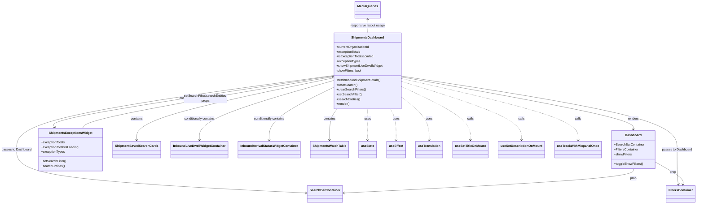

# Diagram: web/portal/src/pages/shipments/dashboard/Shipments.Dashboard.page.js

> Auto-generated by Obscura crawlers

## Mermaid

### SVG

<svg id="container" width="3414.890625" xmlns="http://www.w3.org/2000/svg" class="classDiagram" height="1030" viewBox="0 0 3414.890625 1030" role="graphics-document document" aria-roledescription="class"><g><defs><marker id="container_class-aggregationStart" class="marker aggregation class" refX="18" refY="7" markerWidth="190" markerHeight="240" orient="auto"><path d="M 18,7 L9,13 L1,7 L9,1 Z"></path></marker></defs><defs><marker id="container_class-aggregationEnd" class="marker aggregation class" refX="1" refY="7" markerWidth="20" markerHeight="28" orient="auto"><path d="M 18,7 L9,13 L1,7 L9,1 Z"></path></marker></defs><defs><marker id="container_class-extensionStart" class="marker extension class" refX="18" refY="7" markerWidth="190" markerHeight="240" orient="auto"><path d="M 1,7 L18,13 V 1 Z"></path></marker></defs><defs><marker id="container_class-extensionEnd" class="marker extension class" refX="1" refY="7" markerWidth="20" markerHeight="28" orient="auto"><path d="M 1,1 V 13 L18,7 Z"></path></marker></defs><defs><marker id="container_class-compositionStart" class="marker composition class" refX="18" refY="7" markerWidth="190" markerHeight="240" orient="auto"><path d="M 18,7 L9,13 L1,7 L9,1 Z"></path></marker></defs><defs><marker id="container_class-compositionEnd" class="marker composition class" refX="1" refY="7" markerWidth="20" markerHeight="28" orient="auto"><path d="M 18,7 L9,13 L1,7 L9,1 Z"></path></marker></defs><defs><marker id="container_class-dependencyStart" class="marker dependency class" refX="6" refY="7" markerWidth="190" markerHeight="240" orient="auto"><path d="M 5,7 L9,13 L1,7 L9,1 Z"></path></marker></defs><defs><marker id="container_class-dependencyEnd" class="marker dependency class" refX="13" refY="7" markerWidth="20" markerHeight="28" orient="auto"><path d="M 18,7 L9,13 L14,7 L9,1 Z"></path></marker></defs><defs><marker id="container_class-lollipopStart" class="marker lollipop class" refX="13" refY="7" markerWidth="190" markerHeight="240" orient="auto"><circle stroke="black" fill="transparent" cx="7" cy="7" r="6"></circle></marker></defs><defs><marker id="container_class-lollipopEnd" class="marker lollipop class" refX="1" refY="7" markerWidth="190" markerHeight="240" orient="auto"><circle stroke="black" fill="transparent" cx="7" cy="7" r="6"></circle></marker></defs><g class="root"><g class="clusters"></g><g class="edgePaths"><path d="M1969.977,389.217L2158.418,424.181C2346.859,459.145,2723.742,529.072,2912.184,573.203C3100.625,617.333,3100.625,635.667,3100.625,644.833L3100.625,654" id="id_ShipmentsDashboard_Dashboard_1" class="edge-thickness-normal edge-pattern-solid relation" style=";;;" data-edge="true" data-et="edge" data-id="id_ShipmentsDashboard_Dashboard_1" data-points="W3sieCI6MTk2OS45NzY1NjI1LCJ5IjozODkuMjE3NDEzNzk0MTQwNDR9LHsieCI6MzEwMC42MjUsInkiOjU5OX0seyJ4IjozMTAwLjYyNSwieSI6NjYwfV0=" marker-end="url(#container_class-dependencyEnd)"></path><path d="M1633.477,381.595L1375.099,417.829C1116.721,454.063,599.966,526.532,341.589,588.932C83.211,651.333,83.211,703.667,83.211,754C83.211,804.333,83.211,852.667,319.523,889.207C555.835,925.748,1028.459,950.496,1264.771,962.87L1501.082,975.244" id="id_ShipmentsDashboard_SearchBarContainer_2" class="edge-thickness-normal edge-pattern-solid relation" style=";;;" data-edge="true" data-et="edge" data-id="id_ShipmentsDashboard_SearchBarContainer_2" data-points="W3sieCI6MTYzMy40NzY1NjI1LCJ5IjozODEuNTk0OTI2NTgwODk3NH0seyJ4Ijo4My4yMTA5Mzc1LCJ5Ijo1OTl9LHsieCI6ODMuMjEwOTM3NSwieSI6NzU2fSx7IngiOjgzLjIxMDkzNzUsInkiOjkwMX0seyJ4IjoxNTA3LjA3NDIxODc1LCJ5Ijo5NzUuNTU3MzUwNjkwOTExM31d" marker-end="url(#container_class-dependencyEnd)"></path><path d="M1969.977,384.74L2194.671,420.45C2419.365,456.16,2868.753,527.58,3093.447,589.457C3318.141,651.333,3318.141,703.667,3318.141,754C3318.141,804.333,3318.141,852.667,3319.358,882.026C3320.575,911.386,3323.009,921.772,3324.226,926.965L3325.443,932.158" id="id_ShipmentsDashboard_FiltersContainer_3" class="edge-thickness-normal edge-pattern-solid relation" style=";;;" data-edge="true" data-et="edge" data-id="id_ShipmentsDashboard_FiltersContainer_3" data-points="W3sieCI6MTk2OS45NzY1NjI1LCJ5IjozODQuNzM5NTYzNDIzMTY2MjZ9LHsieCI6MzMxOC4xNDA2MjUsInkiOjU5OX0seyJ4IjozMzE4LjE0MDYyNSwieSI6NzU2fSx7IngiOjMzMTguMTQwNjI1LCJ5Ijo5MDF9LHsieCI6MzMyNi44MTI1LCJ5Ijo5Mzh9XQ==" marker-end="url(#container_class-dependencyEnd)"></path><path d="M1633.477,384.024L1401.831,419.853C1170.186,455.683,706.895,527.341,480.373,570.517C253.851,613.693,264.099,628.386,269.223,635.732L274.347,643.079" id="id_ShipmentsDashboard_ShipmentsExceptionsWidget_4" class="edge-thickness-normal edge-pattern-solid relation" style=";;;" data-edge="true" data-et="edge" data-id="id_ShipmentsDashboard_ShipmentsExceptionsWidget_4" data-points="W3sieCI6MTYzMy40NzY1NjI1LCJ5IjozODQuMDIzNzc5MTExMjM1MzR9LHsieCI6MjQzLjYwMzUxNTYyNSwieSI6NTk5fSx7IngiOjI3Ny43NzkyODQ0MzQ3MTMzNiwieSI6NjQ4fV0=" marker-end="url(#container_class-dependencyEnd)"></path><path d="M1633.477,394.059L1474.104,428.216C1314.732,462.373,995.987,530.686,836.615,583.01C677.242,635.333,677.242,671.667,677.242,689.833L677.242,708" id="id_ShipmentsDashboard_ShipmentSavedSearchCards_5" class="edge-thickness-normal edge-pattern-solid relation" style=";;;" data-edge="true" data-et="edge" data-id="id_ShipmentsDashboard_ShipmentSavedSearchCards_5" data-points="W3sieCI6MTYzMy40NzY1NjI1LCJ5IjozOTQuMDU5NDE2MTIxMjc3OH0seyJ4Ijo2NzcuMjQyMTg3NSwieSI6NTk5fSx7IngiOjY3Ny4yNDIxODc1LCJ5Ijo3MTR9XQ==" marker-end="url(#container_class-dependencyEnd)"></path><path d="M1633.477,407.372L1524.639,439.31C1415.802,471.248,1198.128,535.124,1089.29,585.229C980.453,635.333,980.453,671.667,980.453,689.833L980.453,708" id="id_ShipmentsDashboard_InboundLiveDwellWidgetContainer_6" class="edge-thickness-normal edge-pattern-solid relation" style=";;;" data-edge="true" data-et="edge" data-id="id_ShipmentsDashboard_InboundLiveDwellWidgetContainer_6" data-points="W3sieCI6MTYzMy40NzY1NjI1LCJ5Ijo0MDcuMzcyNDExMzY1NzMzNDZ9LHsieCI6OTgwLjQ1MzEyNSwieSI6NTk5fSx7IngiOjk4MC40NTMxMjUsInkiOjcxNH1d" marker-end="url(#container_class-dependencyEnd)"></path><path d="M1633.477,442.219L1581.275,468.349C1529.073,494.479,1424.669,546.74,1372.467,591.037C1320.266,635.333,1320.266,671.667,1320.266,689.833L1320.266,708" id="id_ShipmentsDashboard_InboundArrivalStatusWidgetContainer_7" class="edge-thickness-normal edge-pattern-solid relation" style=";;;" data-edge="true" data-et="edge" data-id="id_ShipmentsDashboard_InboundArrivalStatusWidgetContainer_7" data-points="W3sieCI6MTYzMy40NzY1NjI1LCJ5Ijo0NDIuMjE5MTg5NjQwOTA0MX0seyJ4IjoxMzIwLjI2NTYyNSwieSI6NTk5fSx7IngiOjEzMjAuMjY1NjI1LCJ5Ijo3MTR9XQ==" marker-end="url(#container_class-dependencyEnd)"></path><path d="M1652.517,550L1646.17,558.167C1639.824,566.333,1627.131,582.667,1620.784,609C1614.438,635.333,1614.438,671.667,1614.438,689.833L1614.438,708" id="id_ShipmentsDashboard_ShipmentsWatchTable_8" class="edge-thickness-normal edge-pattern-solid relation" style=";;;" data-edge="true" data-et="edge" data-id="id_ShipmentsDashboard_ShipmentsWatchTable_8" data-points="W3sieCI6MTY1Mi41MTcwMTg5MzE1MzUyLCJ5Ijo1NTB9LHsieCI6MTYxNC40Mzc1LCJ5Ijo1OTl9LHsieCI6MTYxNC40Mzc1LCJ5Ijo3MTR9XQ==" marker-end="url(#container_class-dependencyEnd)"></path><path d="M1801.727,550L1801.727,558.167C1801.727,566.333,1801.727,582.667,1801.727,609C1801.727,635.333,1801.727,671.667,1801.727,689.833L1801.727,708" id="id_ShipmentsDashboard_useState_9" class="edge-thickness-normal edge-pattern-dashed relation" style=";;;" data-edge="true" data-et="edge" data-id="id_ShipmentsDashboard_useState_9" data-points="W3sieCI6MTgwMS43MjY1NjI1LCJ5Ijo1NTB9LHsieCI6MTgwMS43MjY1NjI1LCJ5Ijo1OTl9LHsieCI6MTgwMS43MjY1NjI1LCJ5Ijo3MTR9XQ==" marker-end="url(#container_class-dependencyEnd)"></path><path d="M1913.287,550L1918.032,558.167C1922.777,566.333,1932.267,582.667,1937.013,609C1941.758,635.333,1941.758,671.667,1941.758,689.833L1941.758,708" id="id_ShipmentsDashboard_useEffect_10" class="edge-thickness-normal edge-pattern-dashed relation" style=";;;" data-edge="true" data-et="edge" data-id="id_ShipmentsDashboard_useEffect_10" data-points="W3sieCI6MTkxMy4yODY3Mjg0NzUxMDM3LCJ5Ijo1NTB9LHsieCI6MTk0MS43NTc4MTI1LCJ5Ijo1OTl9LHsieCI6MTk0MS43NTc4MTI1LCJ5Ijo3MTR9XQ==" marker-end="url(#container_class-dependencyEnd)"></path><path d="M1969.977,492.276L1992.264,510.063C2014.552,527.851,2059.128,563.425,2081.415,599.379C2103.703,635.333,2103.703,671.667,2103.703,689.833L2103.703,708" id="id_ShipmentsDashboard_useTranslation_11" class="edge-thickness-normal edge-pattern-dashed relation" style=";;;" data-edge="true" data-et="edge" data-id="id_ShipmentsDashboard_useTranslation_11" data-points="W3sieCI6MTk2OS45NzY1NjI1LCJ5Ijo0OTIuMjc2MTQ5MzI4NjQyfSx7IngiOjIxMDMuNzAzMTI1LCJ5Ijo1OTl9LHsieCI6MjEwMy43MDMxMjUsInkiOjcxNH1d" marker-end="url(#container_class-dependencyEnd)"></path><path d="M1969.977,438.338L2026.055,465.115C2082.133,491.892,2194.289,545.446,2250.367,590.39C2306.445,635.333,2306.445,671.667,2306.445,689.833L2306.445,708" id="id_ShipmentsDashboard_useSetTitleOnMount_12" class="edge-thickness-normal edge-pattern-dashed relation" style=";;;" data-edge="true" data-et="edge" data-id="id_ShipmentsDashboard_useSetTitleOnMount_12" data-points="W3sieCI6MTk2OS45NzY1NjI1LCJ5Ijo0MzguMzM4MzA3MjI1NTU4NzZ9LHsieCI6MjMwNi40NDUzMTI1LCJ5Ijo1OTl9LHsieCI6MjMwNi40NDUzMTI1LCJ5Ijo3MTR9XQ==" marker-end="url(#container_class-dependencyEnd)"></path><path d="M1969.977,411.785L2067.583,442.988C2165.19,474.19,2360.404,536.595,2458.01,585.964C2555.617,635.333,2555.617,671.667,2555.617,689.833L2555.617,708" id="id_ShipmentsDashboard_useSetDescriptionOnMount_13" class="edge-thickness-normal edge-pattern-dashed relation" style=";;;" data-edge="true" data-et="edge" data-id="id_ShipmentsDashboard_useSetDescriptionOnMount_13" data-points="W3sieCI6MTk2OS45NzY1NjI1LCJ5Ijo0MTEuNzg1MzIxOTc1NTg0OTZ9LHsieCI6MjU1NS42MTcxODc1LCJ5Ijo1OTl9LHsieCI6MjU1NS42MTcxODc1LCJ5Ijo3MTR9XQ==" marker-end="url(#container_class-dependencyEnd)"></path><path d="M1969.977,397.405L2113.435,431.005C2256.893,464.604,2543.81,531.802,2687.268,583.568C2830.727,635.333,2830.727,671.667,2830.727,689.833L2830.727,708" id="id_ShipmentsDashboard_useTrackWithMixpanelOnce_14" class="edge-thickness-normal edge-pattern-dashed relation" style=";;;" data-edge="true" data-et="edge" data-id="id_ShipmentsDashboard_useTrackWithMixpanelOnce_14" data-points="W3sieCI6MTk2OS45NzY1NjI1LCJ5IjozOTcuNDA1NDkwNzY3NzM1Njd9LHsieCI6MjgzMC43MjY1NjI1LCJ5Ijo1OTl9LHsieCI6MjgzMC43MjY1NjI1LCJ5Ijo3MTR9XQ==" marker-end="url(#container_class-dependencyEnd)"></path><path d="M409.128,648L413.364,639.833C417.6,631.667,426.072,615.333,629.146,572.117C832.219,528.9,1229.893,458.8,1428.731,423.75L1627.568,388.7" id="id_ShipmentsExceptionsWidget_ShipmentsDashboard_15" class="edge-thickness-normal edge-pattern-solid relation" style=";;;" data-edge="true" data-et="edge" data-id="id_ShipmentsExceptionsWidget_ShipmentsDashboard_15" data-points="W3sieCI6NDA5LjEyNzUxMjkzNzg5ODEsInkiOjY0OH0seyJ4Ijo0MzQuNTQ0OTIxODc1LCJ5Ijo1OTl9LHsieCI6MTYzMy40NzY1NjI1LCJ5IjozODcuNjU4Mjc1Njc4MzI0MzR9XQ==" marker-end="url(#container_class-dependencyEnd)"></path><path d="M3100.625,852L3100.625,860.167C3100.625,868.333,3100.625,884.667,2864.313,905.207C2628.001,925.748,2155.377,950.496,1919.065,962.87L1682.754,975.244" id="id_Dashboard_SearchBarContainer_16" class="edge-thickness-normal edge-pattern-solid relation" style=";;;" data-edge="true" data-et="edge" data-id="id_Dashboard_SearchBarContainer_16" data-points="W3sieCI6MzEwMC42MjUsInkiOjg1Mn0seyJ4IjozMTAwLjYyNSwieSI6OTAxfSx7IngiOjE2NzYuNzYxNzE4NzUsInkiOjk3NS41NTczNTA2OTA5MTEzfV0=" marker-end="url(#container_class-dependencyEnd)"></path><path d="M3207.93,817.125L3232.47,831.104C3257.01,845.083,3306.091,873.042,3329.414,892.214C3352.738,911.386,3350.303,921.772,3349.086,926.965L3347.869,932.158" id="id_Dashboard_FiltersContainer_17" class="edge-thickness-normal edge-pattern-solid relation" style=";;;" data-edge="true" data-et="edge" data-id="id_Dashboard_FiltersContainer_17" data-points="W3sieCI6MzIwNy45Mjk2ODc1LCJ5Ijo4MTcuMTI1MDA3NjcyOTQ4M30seyJ4IjozMzU1LjE3MTg3NSwieSI6OTAxfSx7IngiOjMzNDYuNSwieSI6OTM4fV0=" marker-end="url(#container_class-dependencyEnd)"></path><path d="M1801.727,98L1801.727,103.167C1801.727,108.333,1801.727,118.667,1801.727,130C1801.727,141.333,1801.727,153.667,1801.727,159.833L1801.727,166" id="id_MediaQueries_ShipmentsDashboard_18" class="edge-thickness-normal edge-pattern-dashed relation" style=";;;" data-edge="true" data-et="edge" data-id="id_MediaQueries_ShipmentsDashboard_18" data-points="W3sieCI6MTgwMS43MjY1NjI1LCJ5Ijo5Mn0seyJ4IjoxODAxLjcyNjU2MjUsInkiOjEyOX0seyJ4IjoxODAxLjcyNjU2MjUsInkiOjE2Nn1d" marker-start="url(#container_class-dependencyStart)"></path></g><g class="edgeLabels"><g class="edgeLabel" transform="translate(3100.625, 599)"><g class="label" data-id="id_ShipmentsDashboard_Dashboard_1" transform="translate(-27.75, -12)"><foreignObject width="55.5" height="24">

renders

</foreignObject></g></g><g class="edgeLabel" transform="translate(83.2109375, 756)"><g class="label" data-id="id_ShipmentsDashboard_SearchBarContainer_2" transform="translate(-75.2109375, -12)"><foreignObject width="150.421875" height="24">

passes to Dashboard

</foreignObject></g></g><g class="edgeLabel" transform="translate(3318.140625, 756)"><g class="label" data-id="id_ShipmentsDashboard_FiltersContainer_3" transform="translate(-75.2109375, -12)"><foreignObject width="150.421875" height="24">

passes to Dashboard

</foreignObject></g></g><g class="edgeLabel" transform="translate(909.02058, 496.07776)"><g class="label" data-id="id_ShipmentsDashboard_ShipmentsExceptionsWidget_4" transform="translate(-30.890625, -12)"><foreignObject width="61.78125" height="24">

contains

</foreignObject></g></g><g class="edgeLabel" transform="translate(677.2421875, 599)"><g class="label" data-id="id_ShipmentsDashboard_ShipmentSavedSearchCards_5" transform="translate(-30.890625, -12)"><foreignObject width="61.78125" height="24">

contains

</foreignObject></g></g><g class="edgeLabel" transform="translate(980.453125, 599)"><g class="label" data-id="id_ShipmentsDashboard_InboundLiveDwellWidgetContainer_6" transform="translate(-80.3984375, -12)"><foreignObject width="160.796875" height="24">

conditionally contains

</foreignObject></g></g><g class="edgeLabel" transform="translate(1320.265625, 599)"><g class="label" data-id="id_ShipmentsDashboard_InboundArrivalStatusWidgetContainer_7" transform="translate(-80.3984375, -12)"><foreignObject width="160.796875" height="24">

conditionally contains

</foreignObject></g></g><g class="edgeLabel" transform="translate(1614.4375, 599)"><g class="label" data-id="id_ShipmentsDashboard_ShipmentsWatchTable_8" transform="translate(-30.890625, -12)"><foreignObject width="61.78125" height="24">

contains

</foreignObject></g></g><g class="edgeLabel" transform="translate(1801.7265625, 599)"><g class="label" data-id="id_ShipmentsDashboard_useState_9" transform="translate(-16.4921875, -12)"><foreignObject width="32.984375" height="24">

uses

</foreignObject></g></g><g class="edgeLabel" transform="translate(1941.7578125, 599)"><g class="label" data-id="id_ShipmentsDashboard_useEffect_10" transform="translate(-16.4921875, -12)"><foreignObject width="32.984375" height="24">

uses

</foreignObject></g></g><g class="edgeLabel" transform="translate(2103.703125, 599)"><g class="label" data-id="id_ShipmentsDashboard_useTranslation_11" transform="translate(-16.4921875, -12)"><foreignObject width="32.984375" height="24">

uses

</foreignObject></g></g><g class="edgeLabel" transform="translate(2306.4453125, 599)"><g class="label" data-id="id_ShipmentsDashboard_useSetTitleOnMount_12" transform="translate(-16.4453125, -12)"><foreignObject width="32.890625" height="24">

calls

</foreignObject></g></g><g class="edgeLabel" transform="translate(2555.6171875, 599)"><g class="label" data-id="id_ShipmentsDashboard_useSetDescriptionOnMount_13" transform="translate(-16.4453125, -12)"><foreignObject width="32.890625" height="24">

calls

</foreignObject></g></g><g class="edgeLabel" transform="translate(2830.7265625, 599)"><g class="label" data-id="id_ShipmentsDashboard_useTrackWithMixpanelOnce_14" transform="translate(-16.4453125, -12)"><foreignObject width="32.890625" height="24">

calls

</foreignObject></g></g><g class="edgeLabel" transform="translate(1006.82979, 498.12046)"><g class="label" data-id="id_ShipmentsExceptionsWidget_ShipmentsDashboard_15" transform="translate(-110.3671875, -24)"><foreignObject width="220.734375" height="48">

setSearchFilter/searchEntities props

</foreignObject></g></g><g class="edgeLabel" transform="translate(3100.625, 901)"><g class="label" data-id="id_Dashboard_SearchBarContainer_16" transform="translate(-17.03125, -12)"><foreignObject width="34.0625" height="24">

prop

</foreignObject></g></g><g class="edgeLabel" transform="translate(3298.06126, 868.46753)"><g class="label" data-id="id_Dashboard_FiltersContainer_17" transform="translate(-17.03125, -12)"><foreignObject width="34.0625" height="24">

prop

</foreignObject></g></g><g class="edgeLabel" transform="translate(1801.7265625, 129)"><g class="label" data-id="id_MediaQueries_ShipmentsDashboard_18" transform="translate(-87.1875, -12)"><foreignObject width="174.375" height="24">

responsive layout usage

</foreignObject></g></g></g><g class="nodes"><g class="node default" id="classId-ShipmentsDashboard-0" transform="translate(1801.7265625, 358)"><g class="basic label-container"><path d="M-168.25 -192 L168.25 -192 L168.25 192 L-168.25 192" stroke="none" stroke-width="0" fill="#ECECFF" style=""></path><path d="M-168.25 -192 C-88.42781021999627 -192, -8.605620439992549 -192, 168.25 -192 M-168.25 -192 C-65.41354367988335 -192, 37.42291264023331 -192, 168.25 -192 M168.25 -192 C168.25 -54.89166633800281, 168.25 82.21666732399439, 168.25 192 M168.25 -192 C168.25 -66.38592122018582, 168.25 59.22815755962836, 168.25 192 M168.25 192 C62.19158956047278 192, -43.866820879054444 192, -168.25 192 M168.25 192 C72.296757394077 192, -23.65648521184599 192, -168.25 192 M-168.25 192 C-168.25 74.63778132262408, -168.25 -42.72443735475184, -168.25 -192 M-168.25 192 C-168.25 102.11542178097775, -168.25 12.23084356195551, -168.25 -192" stroke="#9370DB" stroke-width="1.3" fill="none" stroke-dasharray="0 0" style=""></path></g><g class="annotation-group text" transform="translate(0, -168)"></g><g class="label-group text" transform="translate(-78.40625, -168)"><g class="label" style="font-weight: bolder" transform="translate(0,-12)"><foreignObject width="156.8125" height="24">

ShipmentsDashboard

</foreignObject></g></g><g class="members-group text" transform="translate(-156.25, -120)"><g class="label" style="" transform="translate(0,-12)"><foreignObject width="166.90625" height="24">

+currentOrganizationId

</foreignObject></g><g class="label" style="" transform="translate(0,12)"><foreignObject width="121.84375" height="24">

+exceptionTotals

</foreignObject></g><g class="label" style="" transform="translate(0,36)"><foreignObject width="187.125" height="24">

+isExceptionTotalsLoaded

</foreignObject></g><g class="label" style="" transform="translate(0,60)"><foreignObject width="119.9375" height="24">

+exceptionTypes

</foreignObject></g><g class="label" style="" transform="translate(0,84)"><foreignObject width="234.09375" height="24">

+showShipmentLiveDwellWidget

</foreignObject></g><g class="label" style="" transform="translate(0,108)"><foreignObject width="129.234375" height="24">

-showFilters: bool

</foreignObject></g></g><g class="methods-group text" transform="translate(-156.25, 48)"><g class="label" style="" transform="translate(0,-12)"><foreignObject width="228.59375" height="24">

+fetchInboundShipmentTotals()

</foreignObject></g><g class="label" style="" transform="translate(0,12)"><foreignObject width="103.453125" height="24">

+resetSearch()

</foreignObject></g><g class="label" style="" transform="translate(0,36)"><foreignObject width="146.921875" height="24">

+clearSearchFilters()

</foreignObject></g><g class="label" style="" transform="translate(0,60)"><foreignObject width="125.953125" height="24">

+setSearchFilter()

</foreignObject></g><g class="label" style="" transform="translate(0,84)"><foreignObject width="120.359375" height="24">

+searchEntities()

</foreignObject></g><g class="label" style="" transform="translate(0,108)"><foreignObject width="66.609375" height="24">

+render()

</foreignObject></g></g><g class="divider" style=""><path d="M-168.25 -144 C-82.57131697552695 -144, 3.1073660489460906 -144, 168.25 -144 M-168.25 -144 C-95.77207748650007 -144, -23.294154973000133 -144, 168.25 -144" stroke="#9370DB" stroke-width="1.3" fill="none" stroke-dasharray="0 0" style=""></path></g><g class="divider" style=""><path d="M-168.25 24 C-37.60809592477446 24, 93.03380815045108 24, 168.25 24 M-168.25 24 C-48.59055462802189 24, 71.06889074395622 24, 168.25 24" stroke="#9370DB" stroke-width="1.3" fill="none" stroke-dasharray="0 0" style=""></path></g></g><g class="node default" id="classId-Dashboard-1" transform="translate(3100.625, 756)"><g class="basic label-container"><path d="M-107.3046875 -96 L107.3046875 -96 L107.3046875 96 L-107.3046875 96" stroke="none" stroke-width="0" fill="#ECECFF" style=""></path><path d="M-107.3046875 -96 C-27.79213834392955 -96, 51.7204108121409 -96, 107.3046875 -96 M-107.3046875 -96 C-30.606031491544158 -96, 46.092624516911684 -96, 107.3046875 -96 M107.3046875 -96 C107.3046875 -52.42671656959429, 107.3046875 -8.853433139188581, 107.3046875 96 M107.3046875 -96 C107.3046875 -47.65881600999886, 107.3046875 0.682367980002283, 107.3046875 96 M107.3046875 96 C38.37430652372906 96, -30.55607445254188 96, -107.3046875 96 M107.3046875 96 C46.756795188200336 96, -13.791097123599329 96, -107.3046875 96 M-107.3046875 96 C-107.3046875 28.39071565469571, -107.3046875 -39.21856869060858, -107.3046875 -96 M-107.3046875 96 C-107.3046875 56.69664395477582, -107.3046875 17.393287909551645, -107.3046875 -96" stroke="#9370DB" stroke-width="1.3" fill="none" stroke-dasharray="0 0" style=""></path></g><g class="annotation-group text" transform="translate(0, -72)"></g><g class="label-group text" transform="translate(-39.4375, -72)"><g class="label" style="font-weight: bolder" transform="translate(0,-12)"><foreignObject width="78.875" height="24">

Dashboard

</foreignObject></g></g><g class="members-group text" transform="translate(-95.3046875, -24)"><g class="label" style="" transform="translate(0,-12)"><foreignObject width="151.171875" height="24">

+SearchBarContainer

</foreignObject></g><g class="label" style="" transform="translate(0,12)"><foreignObject width="122.65625" height="24">

+FiltersContainer

</foreignObject></g><g class="label" style="" transform="translate(0,36)"><foreignObject width="89.8125" height="24">

+showFilters

</foreignObject></g></g><g class="methods-group text" transform="translate(-95.3046875, 72)"><g class="label" style="" transform="translate(0,-12)"><foreignObject width="146.203125" height="24">

+toggleShowFilters()

</foreignObject></g></g><g class="divider" style=""><path d="M-107.3046875 -48 C-43.8152408774692 -48, 19.6742057450616 -48, 107.3046875 -48 M-107.3046875 -48 C-62.636102050165775 -48, -17.96751660033155 -48, 107.3046875 -48" stroke="#9370DB" stroke-width="1.3" fill="none" stroke-dasharray="0 0" style=""></path></g><g class="divider" style=""><path d="M-107.3046875 48 C-58.83374713547392 48, -10.362806770947842 48, 107.3046875 48 M-107.3046875 48 C-29.03492284275812 48, 49.23484181448376 48, 107.3046875 48" stroke="#9370DB" stroke-width="1.3" fill="none" stroke-dasharray="0 0" style=""></path></g></g><g class="node default" id="classId-SearchBarContainer-2" transform="translate(1591.91796875, 980)"><g class="basic label-container"><path d="M-84.84375 -42 L84.84375 -42 L84.84375 42 L-84.84375 42" stroke="none" stroke-width="0" fill="#ECECFF" style=""></path><path d="M-84.84375 -42 C-35.020174908487675 -42, 14.80340018302465 -42, 84.84375 -42 M-84.84375 -42 C-20.942552778455365 -42, 42.95864444308927 -42, 84.84375 -42 M84.84375 -42 C84.84375 -15.207883597371193, 84.84375 11.584232805257614, 84.84375 42 M84.84375 -42 C84.84375 -12.134450413530743, 84.84375 17.731099172938514, 84.84375 42 M84.84375 42 C47.45324792462899 42, 10.062745849257979 42, -84.84375 42 M84.84375 42 C39.11389549018521 42, -6.615959019629585 42, -84.84375 42 M-84.84375 42 C-84.84375 16.48718331083066, -84.84375 -9.025633378338682, -84.84375 -42 M-84.84375 42 C-84.84375 11.306253036190501, -84.84375 -19.387493927618998, -84.84375 -42" stroke="#9370DB" stroke-width="1.3" fill="none" stroke-dasharray="0 0" style=""></path></g><g class="annotation-group text" transform="translate(0, -18)"></g><g class="label-group text" transform="translate(-72.84375, -18)"><g class="label" style="font-weight: bolder" transform="translate(0,-12)"><foreignObject width="145.6875" height="24">

SearchBarContainer

</foreignObject></g></g><g class="members-group text" transform="translate(-72.84375, 30)"></g><g class="methods-group text" transform="translate(-72.84375, 60)"></g><g class="divider" style=""><path d="M-84.84375 6 C-48.982215994420315 6, -13.12068198884063 6, 84.84375 6 M-84.84375 6 C-50.35636943364691 6, -15.868988867293822 6, 84.84375 6" stroke="#9370DB" stroke-width="1.3" fill="none" stroke-dasharray="0 0" style=""></path></g><g class="divider" style=""><path d="M-84.84375 24 C-19.646601611441042 24, 45.550546777117916 24, 84.84375 24 M-84.84375 24 C-44.204925562868965 24, -3.56610112573793 24, 84.84375 24" stroke="#9370DB" stroke-width="1.3" fill="none" stroke-dasharray="0 0" style=""></path></g></g><g class="node default" id="classId-FiltersContainer-3" transform="translate(3336.65625, 980)"><g class="basic label-container"><path d="M-70.234375 -42 L70.234375 -42 L70.234375 42 L-70.234375 42" stroke="none" stroke-width="0" fill="#ECECFF" style=""></path><path d="M-70.234375 -42 C-32.60068762427149 -42, 5.032999751457027 -42, 70.234375 -42 M-70.234375 -42 C-14.240343835777296 -42, 41.75368732844541 -42, 70.234375 -42 M70.234375 -42 C70.234375 -12.32978818540029, 70.234375 17.34042362919942, 70.234375 42 M70.234375 -42 C70.234375 -15.538134112268182, 70.234375 10.923731775463636, 70.234375 42 M70.234375 42 C19.108172716274346 42, -32.01802956745131 42, -70.234375 42 M70.234375 42 C23.55341025612114 42, -23.12755448775772 42, -70.234375 42 M-70.234375 42 C-70.234375 16.388402255819756, -70.234375 -9.223195488360489, -70.234375 -42 M-70.234375 42 C-70.234375 12.346608076178008, -70.234375 -17.306783847643985, -70.234375 -42" stroke="#9370DB" stroke-width="1.3" fill="none" stroke-dasharray="0 0" style=""></path></g><g class="annotation-group text" transform="translate(0, -18)"></g><g class="label-group text" transform="translate(-58.234375, -18)"><g class="label" style="font-weight: bolder" transform="translate(0,-12)"><foreignObject width="116.46875" height="24">

FiltersContainer

</foreignObject></g></g><g class="members-group text" transform="translate(-58.234375, 30)"></g><g class="methods-group text" transform="translate(-58.234375, 60)"></g><g class="divider" style=""><path d="M-70.234375 6 C-37.428658157733906 6, -4.622941315467813 6, 70.234375 6 M-70.234375 6 C-31.52773445387639 6, 7.178906092247217 6, 70.234375 6" stroke="#9370DB" stroke-width="1.3" fill="none" stroke-dasharray="0 0" style=""></path></g><g class="divider" style=""><path d="M-70.234375 24 C-36.22802685886213 24, -2.2216787177242594 24, 70.234375 24 M-70.234375 24 C-27.274378294953145 24, 15.68561841009371 24, 70.234375 24" stroke="#9370DB" stroke-width="1.3" fill="none" stroke-dasharray="0 0" style=""></path></g></g><g class="node default" id="classId-ShipmentsExceptionsWidget-4" transform="translate(353.10546875, 756)"><g class="basic label-container"><path d="M-159.68359375 -108 L159.68359375 -108 L159.68359375 108 L-159.68359375 108" stroke="none" stroke-width="0" fill="#ECECFF" style=""></path><path d="M-159.68359375 -108 C-42.76552314845786 -108, 74.15254745308428 -108, 159.68359375 -108 M-159.68359375 -108 C-52.55345836105069 -108, 54.576677027898626 -108, 159.68359375 -108 M159.68359375 -108 C159.68359375 -45.086960414272255, 159.68359375 17.82607917145549, 159.68359375 108 M159.68359375 -108 C159.68359375 -21.652099606729408, 159.68359375 64.69580078654118, 159.68359375 108 M159.68359375 108 C49.72936723646622 108, -60.224859277067566 108, -159.68359375 108 M159.68359375 108 C73.20425784443032 108, -13.275078061139368 108, -159.68359375 108 M-159.68359375 108 C-159.68359375 53.84864651272776, -159.68359375 -0.3027069745444777, -159.68359375 -108 M-159.68359375 108 C-159.68359375 44.96386247258319, -159.68359375 -18.072275054833625, -159.68359375 -108" stroke="#9370DB" stroke-width="1.3" fill="none" stroke-dasharray="0 0" style=""></path></g><g class="annotation-group text" transform="translate(0, -84)"></g><g class="label-group text" transform="translate(-104.1015625, -84)"><g class="label" style="font-weight: bolder" transform="translate(0,-12)"><foreignObject width="208.203125" height="24">

ShipmentsExceptionsWidget

</foreignObject></g></g><g class="members-group text" transform="translate(-147.68359375, -36)"><g class="label" style="" transform="translate(0,-12)"><foreignObject width="121.84375" height="24">

+exceptionTotals

</foreignObject></g><g class="label" style="" transform="translate(0,12)"><foreignObject width="191.265625" height="24">

+exceptionTotalsIsLoading

</foreignObject></g><g class="label" style="" transform="translate(0,36)"><foreignObject width="119.9375" height="24">

+exceptionTypes

</foreignObject></g></g><g class="methods-group text" transform="translate(-147.68359375, 60)"><g class="label" style="" transform="translate(0,-12)"><foreignObject width="125.953125" height="24">

+setSearchFilter()

</foreignObject></g><g class="label" style="" transform="translate(0,12)"><foreignObject width="120.359375" height="24">

+searchEntities()

</foreignObject></g></g><g class="divider" style=""><path d="M-159.68359375 -60 C-47.66210967833365 -60, 64.3593743933327 -60, 159.68359375 -60 M-159.68359375 -60 C-62.1527341940655 -60, 35.378125361868996 -60, 159.68359375 -60" stroke="#9370DB" stroke-width="1.3" fill="none" stroke-dasharray="0 0" style=""></path></g><g class="divider" style=""><path d="M-159.68359375 36 C-92.30320222279171 36, -24.922810695583422 36, 159.68359375 36 M-159.68359375 36 C-82.91962586565054 36, -6.15565798130109 36, 159.68359375 36" stroke="#9370DB" stroke-width="1.3" fill="none" stroke-dasharray="0 0" style=""></path></g></g><g class="node default" id="classId-ShipmentSavedSearchCards-5" transform="translate(677.2421875, 756)"><g class="basic label-container"><path d="M-114.453125 -42 L114.453125 -42 L114.453125 42 L-114.453125 42" stroke="none" stroke-width="0" fill="#ECECFF" style=""></path><path d="M-114.453125 -42 C-66.42415572196984 -42, -18.395186443939693 -42, 114.453125 -42 M-114.453125 -42 C-31.41191615331546 -42, 51.62929269336908 -42, 114.453125 -42 M114.453125 -42 C114.453125 -24.76524984688957, 114.453125 -7.5304996937791415, 114.453125 42 M114.453125 -42 C114.453125 -9.021308170569206, 114.453125 23.957383658861588, 114.453125 42 M114.453125 42 C35.78678967763851 42, -42.87954564472298 42, -114.453125 42 M114.453125 42 C65.48165707322859 42, 16.51018914645718 42, -114.453125 42 M-114.453125 42 C-114.453125 21.547160150548265, -114.453125 1.0943203010965306, -114.453125 -42 M-114.453125 42 C-114.453125 22.420628293407994, -114.453125 2.8412565868159874, -114.453125 -42" stroke="#9370DB" stroke-width="1.3" fill="none" stroke-dasharray="0 0" style=""></path></g><g class="annotation-group text" transform="translate(0, -18)"></g><g class="label-group text" transform="translate(-102.453125, -18)"><g class="label" style="font-weight: bolder" transform="translate(0,-12)"><foreignObject width="204.90625" height="24">

ShipmentSavedSearchCards

</foreignObject></g></g><g class="members-group text" transform="translate(-102.453125, 30)"></g><g class="methods-group text" transform="translate(-102.453125, 60)"></g><g class="divider" style=""><path d="M-114.453125 6 C-48.3714572223183 6, 17.710210555363403 6, 114.453125 6 M-114.453125 6 C-38.224119676312185 6, 38.00488564737563 6, 114.453125 6" stroke="#9370DB" stroke-width="1.3" fill="none" stroke-dasharray="0 0" style=""></path></g><g class="divider" style=""><path d="M-114.453125 24 C-39.61387055146406 24, 35.22538389707188 24, 114.453125 24 M-114.453125 24 C-54.000954494905336 24, 6.451216010189327 24, 114.453125 24" stroke="#9370DB" stroke-width="1.3" fill="none" stroke-dasharray="0 0" style=""></path></g></g><g class="node default" id="classId-InboundLiveDwellWidgetContainer-6" transform="translate(980.453125, 756)"><g class="basic label-container"><path d="M-138.7578125 -42 L138.7578125 -42 L138.7578125 42 L-138.7578125 42" stroke="none" stroke-width="0" fill="#ECECFF" style=""></path><path d="M-138.7578125 -42 C-33.016553290425406 -42, 72.72470591914919 -42, 138.7578125 -42 M-138.7578125 -42 C-64.76022676410382 -42, 9.23735897179236 -42, 138.7578125 -42 M138.7578125 -42 C138.7578125 -20.72737707433705, 138.7578125 0.5452458513259018, 138.7578125 42 M138.7578125 -42 C138.7578125 -17.440563841042362, 138.7578125 7.118872317915276, 138.7578125 42 M138.7578125 42 C62.866389912135276 42, -13.025032675729449 42, -138.7578125 42 M138.7578125 42 C72.67176392443302 42, 6.585715348866046 42, -138.7578125 42 M-138.7578125 42 C-138.7578125 16.259094028507548, -138.7578125 -9.481811942984905, -138.7578125 -42 M-138.7578125 42 C-138.7578125 21.083349159902742, -138.7578125 0.16669831980548366, -138.7578125 -42" stroke="#9370DB" stroke-width="1.3" fill="none" stroke-dasharray="0 0" style=""></path></g><g class="annotation-group text" transform="translate(0, -18)"></g><g class="label-group text" transform="translate(-126.7578125, -18)"><g class="label" style="font-weight: bolder" transform="translate(0,-12)"><foreignObject width="253.515625" height="24">

InboundLiveDwellWidgetContainer

</foreignObject></g></g><g class="members-group text" transform="translate(-126.7578125, 30)"></g><g class="methods-group text" transform="translate(-126.7578125, 60)"></g><g class="divider" style=""><path d="M-138.7578125 6 C-58.37233423119524 6, 22.01314403760952 6, 138.7578125 6 M-138.7578125 6 C-74.7213432566353 6, -10.684874013270587 6, 138.7578125 6" stroke="#9370DB" stroke-width="1.3" fill="none" stroke-dasharray="0 0" style=""></path></g><g class="divider" style=""><path d="M-138.7578125 24 C-32.51793573280315 24, 73.7219410343937 24, 138.7578125 24 M-138.7578125 24 C-78.72978820674385 24, -18.70176391348768 24, 138.7578125 24" stroke="#9370DB" stroke-width="1.3" fill="none" stroke-dasharray="0 0" style=""></path></g></g><g class="node default" id="classId-InboundArrivalStatusWidgetContainer-7" transform="translate(1320.265625, 756)"><g class="basic label-container"><path d="M-151.0546875 -42 L151.0546875 -42 L151.0546875 42 L-151.0546875 42" stroke="none" stroke-width="0" fill="#ECECFF" style=""></path><path d="M-151.0546875 -42 C-52.36974193421857 -42, 46.315203631562866 -42, 151.0546875 -42 M-151.0546875 -42 C-36.44259733296418 -42, 78.16949283407163 -42, 151.0546875 -42 M151.0546875 -42 C151.0546875 -18.211577981613583, 151.0546875 5.576844036772833, 151.0546875 42 M151.0546875 -42 C151.0546875 -21.964119051725362, 151.0546875 -1.9282381034507239, 151.0546875 42 M151.0546875 42 C67.08510871338419 42, -16.884470073231626 42, -151.0546875 42 M151.0546875 42 C70.13660131258916 42, -10.781484874821672 42, -151.0546875 42 M-151.0546875 42 C-151.0546875 12.43981217677323, -151.0546875 -17.12037564645354, -151.0546875 -42 M-151.0546875 42 C-151.0546875 18.069195085737633, -151.0546875 -5.861609828524735, -151.0546875 -42" stroke="#9370DB" stroke-width="1.3" fill="none" stroke-dasharray="0 0" style=""></path></g><g class="annotation-group text" transform="translate(0, -18)"></g><g class="label-group text" transform="translate(-139.0546875, -18)"><g class="label" style="font-weight: bolder" transform="translate(0,-12)"><foreignObject width="278.109375" height="24">

InboundArrivalStatusWidgetContainer

</foreignObject></g></g><g class="members-group text" transform="translate(-139.0546875, 30)"></g><g class="methods-group text" transform="translate(-139.0546875, 60)"></g><g class="divider" style=""><path d="M-151.0546875 6 C-44.2382621374655 6, 62.578163225069005 6, 151.0546875 6 M-151.0546875 6 C-52.17465640471622 6, 46.70537469056757 6, 151.0546875 6" stroke="#9370DB" stroke-width="1.3" fill="none" stroke-dasharray="0 0" style=""></path></g><g class="divider" style=""><path d="M-151.0546875 24 C-30.854880684665275 24, 89.34492613066945 24, 151.0546875 24 M-151.0546875 24 C-41.59426404604885 24, 67.8661594079023 24, 151.0546875 24" stroke="#9370DB" stroke-width="1.3" fill="none" stroke-dasharray="0 0" style=""></path></g></g><g class="node default" id="classId-ShipmentsWatchTable-8" transform="translate(1614.4375, 756)"><g class="basic label-container"><path d="M-93.1171875 -42 L93.1171875 -42 L93.1171875 42 L-93.1171875 42" stroke="none" stroke-width="0" fill="#ECECFF" style=""></path><path d="M-93.1171875 -42 C-20.293653688347362 -42, 52.529880123305276 -42, 93.1171875 -42 M-93.1171875 -42 C-30.222592949000656 -42, 32.67200160199869 -42, 93.1171875 -42 M93.1171875 -42 C93.1171875 -23.76442418228003, 93.1171875 -5.528848364560062, 93.1171875 42 M93.1171875 -42 C93.1171875 -22.645358374329188, 93.1171875 -3.290716748658376, 93.1171875 42 M93.1171875 42 C43.276320308257645 42, -6.564546883484709 42, -93.1171875 42 M93.1171875 42 C44.72942698434142 42, -3.6583335313171546 42, -93.1171875 42 M-93.1171875 42 C-93.1171875 9.665445972618663, -93.1171875 -22.669108054762674, -93.1171875 -42 M-93.1171875 42 C-93.1171875 17.49142790978169, -93.1171875 -7.017144180436617, -93.1171875 -42" stroke="#9370DB" stroke-width="1.3" fill="none" stroke-dasharray="0 0" style=""></path></g><g class="annotation-group text" transform="translate(0, -18)"></g><g class="label-group text" transform="translate(-81.1171875, -18)"><g class="label" style="font-weight: bolder" transform="translate(0,-12)"><foreignObject width="162.234375" height="24">

ShipmentsWatchTable

</foreignObject></g></g><g class="members-group text" transform="translate(-81.1171875, 30)"></g><g class="methods-group text" transform="translate(-81.1171875, 60)"></g><g class="divider" style=""><path d="M-93.1171875 6 C-39.346008678336496 6, 14.425170143327009 6, 93.1171875 6 M-93.1171875 6 C-29.276324689691627 6, 34.564538120616746 6, 93.1171875 6" stroke="#9370DB" stroke-width="1.3" fill="none" stroke-dasharray="0 0" style=""></path></g><g class="divider" style=""><path d="M-93.1171875 24 C-35.205314831266044 24, 22.706557837467912 24, 93.1171875 24 M-93.1171875 24 C-27.30360758349515 24, 38.5099723330097 24, 93.1171875 24" stroke="#9370DB" stroke-width="1.3" fill="none" stroke-dasharray="0 0" style=""></path></g></g><g class="node default" id="classId-useState-9" transform="translate(1801.7265625, 756)"><g class="basic label-container"><path d="M-44.171875 -42 L44.171875 -42 L44.171875 42 L-44.171875 42" stroke="none" stroke-width="0" fill="#ECECFF" style=""></path><path d="M-44.171875 -42 C-10.165640593990268 -42, 23.840593812019463 -42, 44.171875 -42 M-44.171875 -42 C-9.52348168148972 -42, 25.12491163702056 -42, 44.171875 -42 M44.171875 -42 C44.171875 -20.855923133263083, 44.171875 0.288153733473834, 44.171875 42 M44.171875 -42 C44.171875 -15.56335117702276, 44.171875 10.87329764595448, 44.171875 42 M44.171875 42 C20.605491640674767 42, -2.9608917186504655 42, -44.171875 42 M44.171875 42 C15.428051580755593 42, -13.315771838488814 42, -44.171875 42 M-44.171875 42 C-44.171875 23.453940463765285, -44.171875 4.90788092753057, -44.171875 -42 M-44.171875 42 C-44.171875 10.90892911865194, -44.171875 -20.18214176269612, -44.171875 -42" stroke="#9370DB" stroke-width="1.3" fill="none" stroke-dasharray="0 0" style=""></path></g><g class="annotation-group text" transform="translate(0, -18)"></g><g class="label-group text" transform="translate(-32.171875, -18)"><g class="label" style="font-weight: bolder" transform="translate(0,-12)"><foreignObject width="64.34375" height="24">

useState

</foreignObject></g></g><g class="members-group text" transform="translate(-32.171875, 30)"></g><g class="methods-group text" transform="translate(-32.171875, 60)"></g><g class="divider" style=""><path d="M-44.171875 6 C-23.5497609359076 6, -2.927646871815199 6, 44.171875 6 M-44.171875 6 C-26.461861101312824 6, -8.751847202625648 6, 44.171875 6" stroke="#9370DB" stroke-width="1.3" fill="none" stroke-dasharray="0 0" style=""></path></g><g class="divider" style=""><path d="M-44.171875 24 C-25.561821778998425 24, -6.95176855799685 24, 44.171875 24 M-44.171875 24 C-15.178264405615845 24, 13.81534618876831 24, 44.171875 24" stroke="#9370DB" stroke-width="1.3" fill="none" stroke-dasharray="0 0" style=""></path></g></g><g class="node default" id="classId-useEffect-10" transform="translate(1941.7578125, 756)"><g class="basic label-container"><path d="M-45.859375 -42 L45.859375 -42 L45.859375 42 L-45.859375 42" stroke="none" stroke-width="0" fill="#ECECFF" style=""></path><path d="M-45.859375 -42 C-26.594036451492173 -42, -7.328697902984345 -42, 45.859375 -42 M-45.859375 -42 C-25.283580271671354 -42, -4.707785543342709 -42, 45.859375 -42 M45.859375 -42 C45.859375 -16.18646594408617, 45.859375 9.627068111827661, 45.859375 42 M45.859375 -42 C45.859375 -24.645535499744373, 45.859375 -7.2910709994887455, 45.859375 42 M45.859375 42 C27.273083918606417 42, 8.686792837212835 42, -45.859375 42 M45.859375 42 C13.003414753317543 42, -19.852545493364914 42, -45.859375 42 M-45.859375 42 C-45.859375 20.387358567032276, -45.859375 -1.2252828659354478, -45.859375 -42 M-45.859375 42 C-45.859375 17.00324884380362, -45.859375 -7.9935023123927635, -45.859375 -42" stroke="#9370DB" stroke-width="1.3" fill="none" stroke-dasharray="0 0" style=""></path></g><g class="annotation-group text" transform="translate(0, -18)"></g><g class="label-group text" transform="translate(-33.859375, -18)"><g class="label" style="font-weight: bolder" transform="translate(0,-12)"><foreignObject width="67.71875" height="24">

useEffect

</foreignObject></g></g><g class="members-group text" transform="translate(-33.859375, 30)"></g><g class="methods-group text" transform="translate(-33.859375, 60)"></g><g class="divider" style=""><path d="M-45.859375 6 C-14.985898802133228 6, 15.887577395733544 6, 45.859375 6 M-45.859375 6 C-19.699692017338712 6, 6.459990965322575 6, 45.859375 6" stroke="#9370DB" stroke-width="1.3" fill="none" stroke-dasharray="0 0" style=""></path></g><g class="divider" style=""><path d="M-45.859375 24 C-17.961073257398773 24, 9.937228485202453 24, 45.859375 24 M-45.859375 24 C-16.64737536114365 24, 12.564624277712703 24, 45.859375 24" stroke="#9370DB" stroke-width="1.3" fill="none" stroke-dasharray="0 0" style=""></path></g></g><g class="node default" id="classId-useTranslation-11" transform="translate(2103.703125, 756)"><g class="basic label-container"><path d="M-66.0859375 -42 L66.0859375 -42 L66.0859375 42 L-66.0859375 42" stroke="none" stroke-width="0" fill="#ECECFF" style=""></path><path d="M-66.0859375 -42 C-14.370712540222371 -42, 37.34451241955526 -42, 66.0859375 -42 M-66.0859375 -42 C-31.150373189560533 -42, 3.7851911208789346 -42, 66.0859375 -42 M66.0859375 -42 C66.0859375 -22.706834608147446, 66.0859375 -3.413669216294892, 66.0859375 42 M66.0859375 -42 C66.0859375 -13.897833322088879, 66.0859375 14.204333355822243, 66.0859375 42 M66.0859375 42 C28.073918072406393 42, -9.938101355187214 42, -66.0859375 42 M66.0859375 42 C34.98677411597819 42, 3.8876107319563786 42, -66.0859375 42 M-66.0859375 42 C-66.0859375 23.502875777209493, -66.0859375 5.0057515544189854, -66.0859375 -42 M-66.0859375 42 C-66.0859375 8.985929917590525, -66.0859375 -24.02814016481895, -66.0859375 -42" stroke="#9370DB" stroke-width="1.3" fill="none" stroke-dasharray="0 0" style=""></path></g><g class="annotation-group text" transform="translate(0, -18)"></g><g class="label-group text" transform="translate(-54.0859375, -18)"><g class="label" style="font-weight: bolder" transform="translate(0,-12)"><foreignObject width="108.171875" height="24">

useTranslation

</foreignObject></g></g><g class="members-group text" transform="translate(-54.0859375, 30)"></g><g class="methods-group text" transform="translate(-54.0859375, 60)"></g><g class="divider" style=""><path d="M-66.0859375 6 C-24.757873284185337 6, 16.570190931629327 6, 66.0859375 6 M-66.0859375 6 C-31.552996884468698 6, 2.9799437310626047 6, 66.0859375 6" stroke="#9370DB" stroke-width="1.3" fill="none" stroke-dasharray="0 0" style=""></path></g><g class="divider" style=""><path d="M-66.0859375 24 C-37.987682258563396 24, -9.889427017126799 24, 66.0859375 24 M-66.0859375 24 C-39.162653642006205 24, -12.23936978401241 24, 66.0859375 24" stroke="#9370DB" stroke-width="1.3" fill="none" stroke-dasharray="0 0" style=""></path></g></g><g class="node default" id="classId-useSetTitleOnMount-12" transform="translate(2306.4453125, 756)"><g class="basic label-container"><path d="M-86.65625 -42 L86.65625 -42 L86.65625 42 L-86.65625 42" stroke="none" stroke-width="0" fill="#ECECFF" style=""></path><path d="M-86.65625 -42 C-27.058020776481982 -42, 32.540208447036036 -42, 86.65625 -42 M-86.65625 -42 C-43.723308283308384 -42, -0.7903665666167683 -42, 86.65625 -42 M86.65625 -42 C86.65625 -18.445663225375306, 86.65625 5.108673549249389, 86.65625 42 M86.65625 -42 C86.65625 -21.654778654731228, 86.65625 -1.3095573094624555, 86.65625 42 M86.65625 42 C29.287574204915025 42, -28.08110159016995 42, -86.65625 42 M86.65625 42 C40.741103535366335 42, -5.17404292926733 42, -86.65625 42 M-86.65625 42 C-86.65625 12.659449486709644, -86.65625 -16.681101026580713, -86.65625 -42 M-86.65625 42 C-86.65625 24.664989392394258, -86.65625 7.329978784788516, -86.65625 -42" stroke="#9370DB" stroke-width="1.3" fill="none" stroke-dasharray="0 0" style=""></path></g><g class="annotation-group text" transform="translate(0, -18)"></g><g class="label-group text" transform="translate(-74.65625, -18)"><g class="label" style="font-weight: bolder" transform="translate(0,-12)"><foreignObject width="149.3125" height="24">

useSetTitleOnMount

</foreignObject></g></g><g class="members-group text" transform="translate(-74.65625, 30)"></g><g class="methods-group text" transform="translate(-74.65625, 60)"></g><g class="divider" style=""><path d="M-86.65625 6 C-48.61950685598633 6, -10.58276371197266 6, 86.65625 6 M-86.65625 6 C-31.48811688911993 6, 23.68001622176014 6, 86.65625 6" stroke="#9370DB" stroke-width="1.3" fill="none" stroke-dasharray="0 0" style=""></path></g><g class="divider" style=""><path d="M-86.65625 24 C-28.75882022158153 24, 29.13860955683694 24, 86.65625 24 M-86.65625 24 C-50.142311043228254 24, -13.628372086456508 24, 86.65625 24" stroke="#9370DB" stroke-width="1.3" fill="none" stroke-dasharray="0 0" style=""></path></g></g><g class="node default" id="classId-useSetDescriptionOnMount-13" transform="translate(2555.6171875, 756)"><g class="basic label-container"><path d="M-112.515625 -42 L112.515625 -42 L112.515625 42 L-112.515625 42" stroke="none" stroke-width="0" fill="#ECECFF" style=""></path><path d="M-112.515625 -42 C-41.379802292053256 -42, 29.756020415893488 -42, 112.515625 -42 M-112.515625 -42 C-47.50874739294855 -42, 17.4981302141029 -42, 112.515625 -42 M112.515625 -42 C112.515625 -16.758291886797004, 112.515625 8.483416226405993, 112.515625 42 M112.515625 -42 C112.515625 -14.409189937167056, 112.515625 13.181620125665887, 112.515625 42 M112.515625 42 C53.232822089790346 42, -6.049980820419307 42, -112.515625 42 M112.515625 42 C55.79688821594668 42, -0.9218485681066397 42, -112.515625 42 M-112.515625 42 C-112.515625 8.703602425929667, -112.515625 -24.592795148140667, -112.515625 -42 M-112.515625 42 C-112.515625 10.473142079490913, -112.515625 -21.053715841018175, -112.515625 -42" stroke="#9370DB" stroke-width="1.3" fill="none" stroke-dasharray="0 0" style=""></path></g><g class="annotation-group text" transform="translate(0, -18)"></g><g class="label-group text" transform="translate(-100.515625, -18)"><g class="label" style="font-weight: bolder" transform="translate(0,-12)"><foreignObject width="201.03125" height="24">

useSetDescriptionOnMount

</foreignObject></g></g><g class="members-group text" transform="translate(-100.515625, 30)"></g><g class="methods-group text" transform="translate(-100.515625, 60)"></g><g class="divider" style=""><path d="M-112.515625 6 C-46.33258129723356 6, 19.85046240553288 6, 112.515625 6 M-112.515625 6 C-57.91375150806213 6, -3.311878016124254 6, 112.515625 6" stroke="#9370DB" stroke-width="1.3" fill="none" stroke-dasharray="0 0" style=""></path></g><g class="divider" style=""><path d="M-112.515625 24 C-25.877062860374124 24, 60.76149927925175 24, 112.515625 24 M-112.515625 24 C-60.319529002755786 24, -8.123433005511572 24, 112.515625 24" stroke="#9370DB" stroke-width="1.3" fill="none" stroke-dasharray="0 0" style=""></path></g></g><g class="node default" id="classId-useTrackWithMixpanelOnce-14" transform="translate(2830.7265625, 756)"><g class="basic label-container"><path d="M-112.59375 -42 L112.59375 -42 L112.59375 42 L-112.59375 42" stroke="none" stroke-width="0" fill="#ECECFF" style=""></path><path d="M-112.59375 -42 C-28.91687242854627 -42, 54.76000514290746 -42, 112.59375 -42 M-112.59375 -42 C-34.673409251833206 -42, 43.24693149633359 -42, 112.59375 -42 M112.59375 -42 C112.59375 -24.03116046440385, 112.59375 -6.062320928807701, 112.59375 42 M112.59375 -42 C112.59375 -20.5025483763046, 112.59375 0.9949032473908019, 112.59375 42 M112.59375 42 C33.180626746988736 42, -46.23249650602253 42, -112.59375 42 M112.59375 42 C62.93605219873503 42, 13.278354397470054 42, -112.59375 42 M-112.59375 42 C-112.59375 18.027699163731565, -112.59375 -5.944601672536869, -112.59375 -42 M-112.59375 42 C-112.59375 8.547633854907893, -112.59375 -24.904732290184214, -112.59375 -42" stroke="#9370DB" stroke-width="1.3" fill="none" stroke-dasharray="0 0" style=""></path></g><g class="annotation-group text" transform="translate(0, -18)"></g><g class="label-group text" transform="translate(-100.59375, -18)"><g class="label" style="font-weight: bolder" transform="translate(0,-12)"><foreignObject width="201.1875" height="24">

useTrackWithMixpanelOnce

</foreignObject></g></g><g class="members-group text" transform="translate(-100.59375, 30)"></g><g class="methods-group text" transform="translate(-100.59375, 60)"></g><g class="divider" style=""><path d="M-112.59375 6 C-41.585395560740494 6, 29.42295887851901 6, 112.59375 6 M-112.59375 6 C-52.3836248695718 6, 7.826500260856406 6, 112.59375 6" stroke="#9370DB" stroke-width="1.3" fill="none" stroke-dasharray="0 0" style=""></path></g><g class="divider" style=""><path d="M-112.59375 24 C-46.488385475543964 24, 19.61697904891207 24, 112.59375 24 M-112.59375 24 C-41.03120424726653 24, 30.53134150546694 24, 112.59375 24" stroke="#9370DB" stroke-width="1.3" fill="none" stroke-dasharray="0 0" style=""></path></g></g><g class="node default" id="classId-MediaQueries-15" transform="translate(1801.7265625, 50)"><g class="basic label-container"><path d="M-62.40625 -42 L62.40625 -42 L62.40625 42 L-62.40625 42" stroke="none" stroke-width="0" fill="#ECECFF" style=""></path><path d="M-62.40625 -42 C-23.803088175926284 -42, 14.800073648147432 -42, 62.40625 -42 M-62.40625 -42 C-28.28687734460769 -42, 5.832495310784623 -42, 62.40625 -42 M62.40625 -42 C62.40625 -22.48455331027792, 62.40625 -2.9691066205558414, 62.40625 42 M62.40625 -42 C62.40625 -23.685020486332512, 62.40625 -5.370040972665024, 62.40625 42 M62.40625 42 C24.973585301423682 42, -12.459079397152635 42, -62.40625 42 M62.40625 42 C16.722265280946594 42, -28.96171943810681 42, -62.40625 42 M-62.40625 42 C-62.40625 16.250001713201613, -62.40625 -9.499996573596775, -62.40625 -42 M-62.40625 42 C-62.40625 9.797908559847187, -62.40625 -22.404182880305626, -62.40625 -42" stroke="#9370DB" stroke-width="1.3" fill="none" stroke-dasharray="0 0" style=""></path></g><g class="annotation-group text" transform="translate(0, -18)"></g><g class="label-group text" transform="translate(-50.40625, -18)"><g class="label" style="font-weight: bolder" transform="translate(0,-12)"><foreignObject width="100.8125" height="24">

MediaQueries

</foreignObject></g></g><g class="members-group text" transform="translate(-50.40625, 30)"></g><g class="methods-group text" transform="translate(-50.40625, 60)"></g><g class="divider" style=""><path d="M-62.40625 6 C-17.419610544140937 6, 27.567028911718126 6, 62.40625 6 M-62.40625 6 C-19.309371910711157 6, 23.787506178577686 6, 62.40625 6" stroke="#9370DB" stroke-width="1.3" fill="none" stroke-dasharray="0 0" style=""></path></g><g class="divider" style=""><path d="M-62.40625 24 C-30.607521480966746 24, 1.1912070380665085 24, 62.40625 24 M-62.40625 24 C-37.050700193683866 24, -11.69515038736774 24, 62.40625 24" stroke="#9370DB" stroke-width="1.3" fill="none" stroke-dasharray="0 0" style=""></path></g></g></g></g></g></svg>
