# Diagram: web/portal/src/pages/shipments/dashboard/components/InboundLiveDwellWidgetContainer.js

> Auto-generated by Obscura crawlers

## Mermaid

```mermaid
flowchart LR
  subgraph Redux_Module["InboundLiveDwellWidgetState"]
    direction TB
    selectors[Selectors] --- getCountData["getCountData()"]
    selectors --- getSearchResults["getSearchResults()"]
    selectors --- getIsLoading["getIsLoading()"]
    selectors --- getPage["getPage()"]
    selectors --- getPageSize["getPageSize()"]
    selectors --- getTotalPages["getTotalPages()"]
    selectors --- getSortColumn["getSortColumn()"]
    selectors --- getReverseSort["getReverseSort()"]
    selectors --- getExportName["getExportName()"]
    selectors --- getIsExporting["getIsExporting()"]
    selectors --- getExportFailed["getExportFailed()"]
    selectors --- getExportIdentifier["getExportIdentifier()"]

    actionCreatorsModule[ActionCreators] --- fetchCount["fetchCount"]
    actionCreatorsModule --- searchEntities["searchEntities (fetchShipments)"]
    actionCreatorsModule --- setSearchFilter["setSearchFilter"]
    actionCreatorsModule --- setPagination["setPagination"]
    actionCreatorsModule --- setSort["setSort"]
    actionCreatorsModule --- exportSearch["exportSearch"]
    actionCreatorsModule --- resetExport["resetExport"]
  end

  subgraph Local_Actions["Local Action Creators"]
    pushShipmentDetailView["pushShipmentDetailView(id)\n(type: SHIPMENT_DETAIL)"]
  end

  subgraph Props["mapStateToProps -> props"]
    direction TB
    countDataProp["countData ← getCountData(state)"]
    shipmentResultsProp["shipmentResults ← getSearchResults(state)"]
    isShipmentsLoadingProp["isShipmentsLoading ← getIsLoading(state)"]
    pageProp["page ← getPage(state)"]
    pageSizeProp["pageSize ← getPageSize(state)"]
    totalPagesProp["totalPages ← getTotalPages(state)"]
    sortColumnProp["sortColumn ← getSortColumn(state)"]
    reverseSortProp["reverseSort ← getReverseSort(state)"]
    exportNameProp["exportName ← getExportName(state)"]
    isExportingProp["isExporting ← getIsExporting(state)"]
    exportFailedProp["exportFailed ← getExportFailed(state)"]
    exportIdentifierProp["exportIdentifier ← getExportIdentifier(state)"]
  end

  subgraph Connected_Actions["actionCreators passed to connect"]
    direction TB
    a_fetchCount["fetchCount ← fetchCount"]
    a_fetchShipments["fetchShipments ← searchEntities"]
    a_setSearchFilter["setSearchFilter ← setSearchFilter"]
    a_setPagination["setPagination ← setPagination"]
    a_setSort["setSort ← setSort"]
    a_pushShipmentDetailView["pushShipmentDetailView ← pushShipmentDetailView"]
    a_exportSearch["exportSearch ← exportSearch"]
    a_resetExport["resetExport ← resetExport"]
  end

  subgraph React_Component["InboundLiveDwellWidget (organism)"]
    InboundLiveDwellWidgetNode[InboundLiveDwellWidget]
  end

  selectors --> countDataProp
  selectors --> shipmentResultsProp
  selectors --> isShipmentsLoadingProp
  selectors --> pageProp
  selectors --> pageSizeProp
  selectors --> totalPagesProp
  selectors --> sortColumnProp
  selectors --> reverseSortProp
  selectors --> exportNameProp
  selectors --> isExportingProp
  selectors --> exportFailedProp
  selectors --> exportIdentifierProp

  actionCreatorsModule --> a_fetchCount
  actionCreatorsModule --> a_fetchShipments
  actionCreatorsModule --> a_setSearchFilter
  actionCreatorsModule --> a_setPagination
  actionCreatorsModule --> a_setSort
  actionCreatorsModule --> a_exportSearch
  actionCreatorsModule --> a_resetExport

  pushShipmentDetailView --> a_pushShipmentDetailView

  countDataProp --> InboundLiveDwellWidgetNode
  shipmentResultsProp --> InboundLiveDwellWidgetNode
  isShipmentsLoadingProp --> InboundLiveDwellWidgetNode
  pageProp --> InboundLiveDwellWidgetNode
  pageSizeProp --> InboundLiveDwellWidgetNode
  totalPagesProp --> InboundLiveDwellWidgetNode
  sortColumnProp --> InboundLiveDwellWidgetNode
  reverseSortProp --> InboundLiveDwellWidgetNode
  exportNameProp --> InboundLiveDwellWidgetNode
  isExportingProp --> InboundLiveDwellWidgetNode
  exportFailedProp --> InboundLiveDwellWidgetNode
  exportIdentifierProp --> InboundLiveDwellWidgetNode

  a_fetchCount --> InboundLiveDwellWidgetNode
  a_fetchShipments --> InboundLiveDwellWidgetNode
  a_setSearchFilter --> InboundLiveDwellWidgetNode
  a_setPagination --> InboundLiveDwellWidgetNode
  a_setSort --> InboundLiveDwellWidgetNode
  a_pushShipmentDetailView --> InboundLiveDwellWidgetNode
  a_exportSearch --> InboundLiveDwellWidgetNode
  a_resetExport --> InboundLiveDwellWidgetNode

  Redux_Module --> Props
  Redux_Module --> Connected_Actions
  Local_Actions --> Connected_Actions

  connect["connect(mapStateToProps, actionCreators)"] --> InboundLiveDwellWidgetNode
  Connected_Actions --> connect
  Props --> connect
```

### SVG

<svg id="container" width="1404.703125" xmlns="http://www.w3.org/2000/svg" class="flowchart" height="5024" viewBox="0 0 1404.703125 5024" role="graphics-document document" aria-roledescription="flowchart-v2"><g><marker id="container_flowchart-v2-pointEnd" class="marker flowchart-v2" viewBox="0 0 10 10" refX="5" refY="5" markerUnits="userSpaceOnUse" markerWidth="8" markerHeight="8" orient="auto"><path d="M 0 0 L 10 5 L 0 10 z" class="arrowMarkerPath" style="stroke-width: 1; stroke-dasharray: 1, 0;"></path></marker><marker id="container_flowchart-v2-pointStart" class="marker flowchart-v2" viewBox="0 0 10 10" refX="4.5" refY="5" markerUnits="userSpaceOnUse" markerWidth="8" markerHeight="8" orient="auto"><path d="M 0 5 L 10 10 L 10 0 z" class="arrowMarkerPath" style="stroke-width: 1; stroke-dasharray: 1, 0;"></path></marker><marker id="container_flowchart-v2-circleEnd" class="marker flowchart-v2" viewBox="0 0 10 10" refX="11" refY="5" markerUnits="userSpaceOnUse" markerWidth="11" markerHeight="11" orient="auto"><circle cx="5" cy="5" r="5" class="arrowMarkerPath" style="stroke-width: 1; stroke-dasharray: 1, 0;"></circle></marker><marker id="container_flowchart-v2-circleStart" class="marker flowchart-v2" viewBox="0 0 10 10" refX="-1" refY="5" markerUnits="userSpaceOnUse" markerWidth="11" markerHeight="11" orient="auto"><circle cx="5" cy="5" r="5" class="arrowMarkerPath" style="stroke-width: 1; stroke-dasharray: 1, 0;"></circle></marker><marker id="container_flowchart-v2-crossEnd" class="marker cross flowchart-v2" viewBox="0 0 11 11" refX="12" refY="5.2" markerUnits="userSpaceOnUse" markerWidth="11" markerHeight="11" orient="auto"><path d="M 1,1 l 9,9 M 10,1 l -9,9" class="arrowMarkerPath" style="stroke-width: 2; stroke-dasharray: 1, 0;"></path></marker><marker id="container_flowchart-v2-crossStart" class="marker cross flowchart-v2" viewBox="0 0 11 11" refX="-1" refY="5.2" markerUnits="userSpaceOnUse" markerWidth="11" markerHeight="11" orient="auto"><path d="M 1,1 l 9,9 M 10,1 l -9,9" class="arrowMarkerPath" style="stroke-width: 2; stroke-dasharray: 1, 0;"></path></marker><g class="root"><g class="clusters"><g class="cluster" id="React_Component" data-look="classic"><rect style="" x="1106.765625" y="333" width="289.9375" height="2646"></rect><g class="cluster-label" transform="translate(1151.734375, 333)"><foreignObject width="200" height="48">

InboundLiveDwellWidget (organism)

</foreignObject></g></g><g class="cluster" id="Connected_Actions" data-look="classic"><rect style="" x="436.765625" y="4004" width="310" height="1012"></rect><g class="cluster-label" transform="translate(491.765625, 4004)"><foreignObject width="200" height="48">

actionCreators passed to connect

</foreignObject></g></g><g class="cluster" id="Props" data-look="classic"><rect style="" x="436.765625" y="8" width="310" height="1536"></rect><g class="cluster-label" transform="translate(496.0390625, 8)"><foreignObject width="191.453125" height="24">

mapStateToProps -&gt; props

</foreignObject></g></g><g class="cluster" id="Local_Actions" data-look="classic"><rect style="" x="8" y="4545" width="378.765625" height="190"></rect><g class="cluster-label" transform="translate(121.4296875, 4545)"><foreignObject width="151.90625" height="24">

Local Action Creators

</foreignObject></g></g><g class="cluster" id="Redux_Module" data-look="classic"><rect style="" x="8" y="1564" width="738.765625" height="2420"></rect><g class="cluster-label" transform="translate(268.7421875, 1564)"><foreignObject width="217.28125" height="24">

InboundLiveDwellWidgetState

</foreignObject></g></g></g><g class="edgePaths"><path d="M252.963,1930L275.263,1919.167C297.564,1908.333,342.165,1886.667,368.632,1875.833C395.099,1865,403.432,1865,411.766,1865C420.099,1865,428.432,1865,444.383,1865C460.333,1865,483.901,1865,495.685,1865L507.469,1865" id="L_selectors_getCountData_0" class="edge-thickness-normal edge-pattern-solid edge-thickness-normal edge-pattern-solid flowchart-link" style=";" data-edge="true" data-et="edge" data-id="L_selectors_getCountData_0" data-points="W3sieCI6MjUyLjk2MjU1MDk1MTA4Njk0LCJ5IjoxOTMwfSx7IngiOjM4Ni43NjU2MjUsInkiOjE4NjV9LHsieCI6NDExLjc2NTYyNSwieSI6MTg2NX0seyJ4Ijo0MzYuNzY1NjI1LCJ5IjoxODY1fSx7IngiOjUwNy40Njg3NSwieSI6MTg2NX1d"></path><path d="M260.742,1961.015L281.746,1962.346C302.75,1963.676,344.758,1966.338,369.928,1967.669C395.099,1969,403.432,1969,411.766,1969C420.099,1969,428.432,1969,442.223,1969C456.013,1969,475.26,1969,484.884,1969L494.508,1969" id="L_selectors_getSearchResults_0" class="edge-thickness-normal edge-pattern-solid edge-thickness-normal edge-pattern-solid flowchart-link" style=";" data-edge="true" data-et="edge" data-id="L_selectors_getSearchResults_0" data-points="W3sieCI6MjYwLjc0MjE4NzUsInkiOjE5NjEuMDE0Njg1ODYyNzk0NX0seyJ4IjozODYuNzY1NjI1LCJ5IjoxOTY5fSx7IngiOjQxMS43NjU2MjUsInkiOjE5Njl9LHsieCI6NDM2Ljc2NTYyNSwieSI6MTk2OX0seyJ4Ijo0OTQuNTA3ODEyNSwieSI6MTk2OX1d"></path><path d="M241.463,1984L265.68,1998.833C289.897,2013.667,338.332,2043.333,366.715,2058.167C395.099,2073,403.432,2073,411.766,2073C420.099,2073,428.432,2073,444.902,2073C461.372,2073,485.979,2073,498.283,2073L510.586,2073" id="L_selectors_getIsLoading_0" class="edge-thickness-normal edge-pattern-solid edge-thickness-normal edge-pattern-solid flowchart-link" style=";" data-edge="true" data-et="edge" data-id="L_selectors_getIsLoading_0" data-points="W3sieCI6MjQxLjQ2MzI5NDcxOTgyNzYsInkiOjE5ODR9LHsieCI6Mzg2Ljc2NTYyNSwieSI6MjA3M30seyJ4Ijo0MTEuNzY1NjI1LCJ5IjoyMDczfSx7IngiOjQzNi43NjU2MjUsInkiOjIwNzN9LHsieCI6NTEwLjU4NTkzNzUsInkiOjIwNzN9XQ=="></path><path d="M220.625,1984L248.315,2016.167C276.005,2048.333,331.385,2112.667,363.242,2144.833C395.099,2177,403.432,2177,411.766,2177C420.099,2177,428.432,2177,447.875,2177C467.318,2177,497.87,2177,513.146,2177L528.422,2177" id="L_selectors_getPage_0" class="edge-thickness-normal edge-pattern-solid edge-thickness-normal edge-pattern-solid flowchart-link" style=";" data-edge="true" data-et="edge" data-id="L_selectors_getPage_0" data-points="W3sieCI6MjIwLjYyNTI0ODU3OTU0NTQ2LCJ5IjoxOTg0fSx7IngiOjM4Ni43NjU2MjUsInkiOjIxNzd9LHsieCI6NDExLjc2NTYyNSwieSI6MjE3N30seyJ4Ijo0MzYuNzY1NjI1LCJ5IjoyMTc3fSx7IngiOjUyOC40MjE4NzUsInkiOjIxNzd9XQ=="></path><path d="M213.165,1984L242.098,2033.5C271.032,2083,328.899,2182,361.999,2231.5C395.099,2281,403.432,2281,411.766,2281C420.099,2281,428.432,2281,445.473,2281C462.513,2281,488.26,2281,501.134,2281L514.008,2281" id="L_selectors_getPageSize_0" class="edge-thickness-normal edge-pattern-solid edge-thickness-normal edge-pattern-solid flowchart-link" style=";" data-edge="true" data-et="edge" data-id="L_selectors_getPageSize_0" data-points="W3sieCI6MjEzLjE2NDcxMzU0MTY2NjY2LCJ5IjoxOTg0fSx7IngiOjM4Ni43NjU2MjUsInkiOjIyODF9LHsieCI6NDExLjc2NTYyNSwieSI6MjI4MX0seyJ4Ijo0MzYuNzY1NjI1LCJ5IjoyMjgxfSx7IngiOjUxNC4wMDc4MTI1LCJ5IjoyMjgxfV0="></path><path d="M209.33,1984L238.902,2050.833C268.475,2117.667,327.62,2251.333,361.36,2318.167C395.099,2385,403.432,2385,411.766,2385C420.099,2385,428.432,2385,444.284,2385C460.135,2385,483.505,2385,495.19,2385L506.875,2385" id="L_selectors_getTotalPages_0" class="edge-thickness-normal edge-pattern-solid edge-thickness-normal edge-pattern-solid flowchart-link" style=";" data-edge="true" data-et="edge" data-id="L_selectors_getTotalPages_0" data-points="W3sieCI6MjA5LjMyOTg1OTA4Mjk0MzkzLCJ5IjoxOTg0fSx7IngiOjM4Ni43NjU2MjUsInkiOjIzODV9LHsieCI6NDExLjc2NTYyNSwieSI6MjM4NX0seyJ4Ijo0MzYuNzY1NjI1LCJ5IjoyMzg1fSx7IngiOjUwNi44NzUsInkiOjIzODV9XQ=="></path><path d="M206.994,1984L236.956,2068.167C266.918,2152.333,326.842,2320.667,360.97,2404.833C395.099,2489,403.432,2489,411.766,2489C420.099,2489,428.432,2489,443.596,2489C458.76,2489,480.755,2489,491.753,2489L502.75,2489" id="L_selectors_getSortColumn_0" class="edge-thickness-normal edge-pattern-solid edge-thickness-normal edge-pattern-solid flowchart-link" style=";" data-edge="true" data-et="edge" data-id="L_selectors_getSortColumn_0" data-points="W3sieCI6MjA2Ljk5NDM0NjIxNzEwNTI2LCJ5IjoxOTg0fSx7IngiOjM4Ni43NjU2MjUsInkiOjI0ODl9LHsieCI6NDExLjc2NTYyNSwieSI6MjQ4OX0seyJ4Ijo0MzYuNzY1NjI1LCJ5IjoyNDg5fSx7IngiOjUwMi43NSwieSI6MjQ4OX1d"></path><path d="M205.423,1984L235.646,2085.5C265.87,2187,326.318,2390,360.708,2491.5C395.099,2593,403.432,2593,411.766,2593C420.099,2593,428.432,2593,443.457,2593C458.482,2593,480.198,2593,491.056,2593L501.914,2593" id="L_selectors_getReverseSort_0" class="edge-thickness-normal edge-pattern-solid edge-thickness-normal edge-pattern-solid flowchart-link" style=";" data-edge="true" data-et="edge" data-id="L_selectors_getReverseSort_0" data-points="W3sieCI6MjA1LjQyMjY0ODg3OTcxNjk3LCJ5IjoxOTg0fSx7IngiOjM4Ni43NjU2MjUsInkiOjI1OTN9LHsieCI6NDExLjc2NTYyNSwieSI6MjU5M30seyJ4Ijo0MzYuNzY1NjI1LCJ5IjoyNTkzfSx7IngiOjUwMS45MTQwNjI1LCJ5IjoyNTkzfV0="></path><path d="M204.293,1984L234.705,2102.833C265.117,2221.667,325.941,2459.333,360.52,2578.167C395.099,2697,403.432,2697,411.766,2697C420.099,2697,428.432,2697,443.255,2697C458.078,2697,479.391,2697,490.047,2697L500.703,2697" id="L_selectors_getExportName_0" class="edge-thickness-normal edge-pattern-solid edge-thickness-normal edge-pattern-solid flowchart-link" style=";" data-edge="true" data-et="edge" data-id="L_selectors_getExportName_0" data-points="W3sieCI6MjA0LjI5MjcyNTkyOTA1NDA2LCJ5IjoxOTg0fSx7IngiOjM4Ni43NjU2MjUsInkiOjI2OTd9LHsieCI6NDExLjc2NTYyNSwieSI6MjY5N30seyJ4Ijo0MzYuNzY1NjI1LCJ5IjoyNjk3fSx7IngiOjUwMC43MDMxMjUsInkiOjI2OTd9XQ=="></path><path d="M203.441,1984L233.995,2120.167C264.549,2256.333,325.658,2528.667,360.378,2664.833C395.099,2801,403.432,2801,411.766,2801C420.099,2801,428.432,2801,443.895,2801C459.357,2801,481.948,2801,493.243,2801L504.539,2801" id="L_selectors_getIsExporting_0" class="edge-thickness-normal edge-pattern-solid edge-thickness-normal edge-pattern-solid flowchart-link" style=";" data-edge="true" data-et="edge" data-id="L_selectors_getIsExporting_0" data-points="W3sieCI6MjAzLjQ0MTI2NzQwMjI1MTE5LCJ5IjoxOTg0fSx7IngiOjM4Ni43NjU2MjUsInkiOjI4MDF9LHsieCI6NDExLjc2NTYyNSwieSI6MjgwMX0seyJ4Ijo0MzYuNzY1NjI1LCJ5IjoyODAxfSx7IngiOjUwNC41MzkwNjI1LCJ5IjoyODAxfV0="></path><path d="M202.777,1984L233.441,2137.5C264.106,2291,325.436,2598,360.267,2751.5C395.099,2905,403.432,2905,411.766,2905C420.099,2905,428.432,2905,443.177,2905C457.922,2905,479.078,2905,489.656,2905L500.234,2905" id="L_selectors_getExportFailed_0" class="edge-thickness-normal edge-pattern-solid edge-thickness-normal edge-pattern-solid flowchart-link" style=";" data-edge="true" data-et="edge" data-id="L_selectors_getExportFailed_0" data-points="W3sieCI6MjAyLjc3NjYyNjc4MDA2MzI4LCJ5IjoxOTg0fSx7IngiOjM4Ni43NjU2MjUsInkiOjI5MDV9LHsieCI6NDExLjc2NTYyNSwieSI6MjkwNX0seyJ4Ijo0MzYuNzY1NjI1LCJ5IjoyOTA1fSx7IngiOjUwMC4yMzQzNzUsInkiOjI5MDV9XQ=="></path><path d="M202.243,1984L232.997,2154.833C263.751,2325.667,325.258,2667.333,360.179,2838.167C395.099,3009,403.432,3009,411.766,3009C420.099,3009,428.432,3009,441.197,3009C453.961,3009,471.156,3009,479.754,3009L488.352,3009" id="L_selectors_getExportIdentifier_0" class="edge-thickness-normal edge-pattern-solid edge-thickness-normal edge-pattern-solid flowchart-link" style=";" data-edge="true" data-et="edge" data-id="L_selectors_getExportIdentifier_0" data-points="W3sieCI6MjAyLjI0MzM5Nzk5MTkyMDE1LCJ5IjoxOTg0fSx7IngiOjM4Ni43NjU2MjUsInkiOjMwMDl9LHsieCI6NDExLjc2NTYyNSwieSI6MzAwOX0seyJ4Ijo0MzYuNzY1NjI1LCJ5IjozMDA5fSx7IngiOjQ4OC4zNTE1NjI1LCJ5IjozMDA5fV0="></path><path d="M204.302,3825L234.713,3706.333C265.123,3587.667,325.944,3350.333,360.522,3231.667C395.099,3113,403.432,3113,411.766,3113C420.099,3113,428.432,3113,446.854,3113C465.276,3113,493.786,3113,508.042,3113L522.297,3113" id="L_actionCreatorsModule_fetchCount_0" class="edge-thickness-normal edge-pattern-solid edge-thickness-normal edge-pattern-solid flowchart-link" style=";" data-edge="true" data-et="edge" data-id="L_actionCreatorsModule_fetchCount_0" data-points="W3sieCI6MjA0LjMwMjA3NjI4NTUyMDk3LCJ5IjozODI1fSx7IngiOjM4Ni43NjU2MjUsInkiOjMxMTN9LHsieCI6NDExLjc2NTYyNSwieSI6MzExM30seyJ4Ijo0MzYuNzY1NjI1LCJ5IjozMTEzfSx7IngiOjUyMi4yOTY4NzUsInkiOjMxMTN9XQ=="></path><path d="M205.59,3825L235.786,3725.667C265.982,3626.333,326.374,3427.667,360.736,3328.333C395.099,3229,403.432,3229,411.766,3229C420.099,3229,428.432,3229,436.766,3229C445.099,3229,453.432,3229,457.599,3229L461.766,3229" id="L_actionCreatorsModule_searchEntities_0" class="edge-thickness-normal edge-pattern-solid edge-thickness-normal edge-pattern-solid flowchart-link" style=";" data-edge="true" data-et="edge" data-id="L_actionCreatorsModule_searchEntities_0" data-points="W3sieCI6MjA1LjU5MDQxNDMyNTg0MjcsInkiOjM4MjV9LHsieCI6Mzg2Ljc2NTYyNSwieSI6MzIyOX0seyJ4Ijo0MTEuNzY1NjI1LCJ5IjozMjI5fSx7IngiOjQzNi43NjU2MjUsInkiOjMyMjl9LHsieCI6NDYxLjc2NTYyNSwieSI6MzIyOX1d"></path><path d="M207.468,3825L237.351,3745C267.234,3665,327,3505,361.049,3425C395.099,3345,403.432,3345,411.766,3345C420.099,3345,428.432,3345,444.465,3345C460.497,3345,484.229,3345,496.095,3345L507.961,3345" id="L_actionCreatorsModule_setSearchFilter_0" class="edge-thickness-normal edge-pattern-solid edge-thickness-normal edge-pattern-solid flowchart-link" style=";" data-edge="true" data-et="edge" data-id="L_actionCreatorsModule_setSearchFilter_0" data-points="W3sieCI6MjA3LjQ2ODI4NzcyMTg5MzUsInkiOjM4MjV9LHsieCI6Mzg2Ljc2NTYyNSwieSI6MzM0NX0seyJ4Ijo0MTEuNzY1NjI1LCJ5IjozMzQ1fSx7IngiOjQzNi43NjU2MjUsInkiOjMzNDV9LHsieCI6NTA3Ljk2MDkzNzUsInkiOjMzNDV9XQ=="></path><path d="M210.071,3825L239.52,3762.333C268.969,3699.667,327.867,3574.333,361.483,3511.667C395.099,3449,403.432,3449,411.766,3449C420.099,3449,428.432,3449,445.194,3449C461.956,3449,487.146,3449,499.741,3449L512.336,3449" id="L_actionCreatorsModule_setPagination_0" class="edge-thickness-normal edge-pattern-solid edge-thickness-normal edge-pattern-solid flowchart-link" style=";" data-edge="true" data-et="edge" data-id="L_actionCreatorsModule_setPagination_0" data-points="W3sieCI6MjEwLjA3MDk5MTAwNDk2MjgsInkiOjM4MjV9LHsieCI6Mzg2Ljc2NTYyNSwieSI6MzQ0OX0seyJ4Ijo0MTEuNzY1NjI1LCJ5IjozNDQ5fSx7IngiOjQzNi43NjU2MjUsInkiOjM0NDl9LHsieCI6NTEyLjMzNTkzNzUsInkiOjM0NDl9XQ=="></path><path d="M214.484,3825L243.198,3779.667C271.911,3734.333,329.339,3643.667,362.219,3598.333C395.099,3553,403.432,3553,411.766,3553C420.099,3553,428.432,3553,449.1,3553C469.768,3553,502.771,3553,519.272,3553L535.773,3553" id="L_actionCreatorsModule_setSort_0" class="edge-thickness-normal edge-pattern-solid edge-thickness-normal edge-pattern-solid flowchart-link" style=";" data-edge="true" data-et="edge" data-id="L_actionCreatorsModule_setSort_0" data-points="W3sieCI6MjE0LjQ4NDI3MDQ4NDk0OTgzLCJ5IjozODI1fSx7IngiOjM4Ni43NjU2MjUsInkiOjM1NTN9LHsieCI6NDExLjc2NTYyNSwieSI6MzU1M30seyJ4Ijo0MzYuNzY1NjI1LCJ5IjozNTUzfSx7IngiOjUzNS43NzM0Mzc1LCJ5IjozNTUzfV0="></path><path d="M223.605,3825L250.798,3797C277.992,3769,332.379,3713,363.739,3685C395.099,3657,403.432,3657,411.766,3657C420.099,3657,428.432,3657,445.445,3657C462.458,3657,488.151,3657,500.997,3657L513.844,3657" id="L_actionCreatorsModule_exportSearch_0" class="edge-thickness-normal edge-pattern-solid edge-thickness-normal edge-pattern-solid flowchart-link" style=";" data-edge="true" data-et="edge" data-id="L_actionCreatorsModule_exportSearch_0" data-points="W3sieCI6MjIzLjYwNTA0ODA3NjkyMzA4LCJ5IjozODI1fSx7IngiOjM4Ni43NjU2MjUsInkiOjM2NTd9LHsieCI6NDExLjc2NTYyNSwieSI6MzY1N30seyJ4Ijo0MzYuNzY1NjI1LCJ5IjozNjU3fSx7IngiOjUxMy44NDM3NSwieSI6MzY1N31d"></path><path d="M253.573,3825L275.772,3814.333C297.971,3803.667,342.368,3782.333,368.734,3771.667C395.099,3761,403.432,3761,411.766,3761C420.099,3761,428.432,3761,446.473,3761C464.513,3761,492.26,3761,506.134,3761L520.008,3761" id="L_actionCreatorsModule_resetExport_0" class="edge-thickness-normal edge-pattern-solid edge-thickness-normal edge-pattern-solid flowchart-link" style=";" data-edge="true" data-et="edge" data-id="L_actionCreatorsModule_resetExport_0" data-points="W3sieCI6MjUzLjU3MzMxNzMwNzY5MjMyLCJ5IjozODI1fSx7IngiOjM4Ni43NjU2MjUsInkiOjM3NjF9LHsieCI6NDExLjc2NTYyNSwieSI6Mzc2MX0seyJ4Ijo0MzYuNzY1NjI1LCJ5IjozNzYxfSx7IngiOjUyMC4wMDc4MTI1LCJ5IjozNzYxfV0="></path><path d="M217.674,1930L245.856,1892.5C274.038,1855,330.402,1780,362.75,1742.5C395.099,1705,403.432,1705,411.766,1705C420.099,1705,428.432,1705,457.326,1544.992C486.22,1384.984,535.674,1064.969,560.401,904.961L585.128,744.953" id="L_selectors_countDataProp_0" class="edge-thickness-normal edge-pattern-solid edge-thickness-normal edge-pattern-solid flowchart-link" style=";" data-edge="true" data-et="edge" data-id="L_selectors_countDataProp_0" data-points="W3sieCI6MjE3LjY3MzgyODEyNSwieSI6MTkzMH0seyJ4IjozODYuNzY1NjI1LCJ5IjoxNzA1fSx7IngiOjQxMS43NjU2MjUsInkiOjE3MDV9LHsieCI6NDM2Ljc2NTYyNSwieSI6MTcwNX0seyJ4Ijo1ODUuNzM4NzA1NzU3NzI2OCwieSI6NzQxfV0=" marker-end="url(#container_flowchart-v2-pointEnd)"></path><path d="M211.909,1930L241.052,1875.833C270.195,1821.667,328.48,1713.333,361.79,1659.167C395.099,1605,403.432,1605,411.766,1605C420.099,1605,428.432,1605,457.703,1358.33C486.974,1111.66,537.183,618.32,562.287,371.65L587.391,124.979" id="L_selectors_shipmentResultsProp_0" class="edge-thickness-normal edge-pattern-solid edge-thickness-normal edge-pattern-solid flowchart-link" style=";" data-edge="true" data-et="edge" data-id="L_selectors_shipmentResultsProp_0" data-points="W3sieCI6MjExLjkwOTMzNTA0OTcxNTksInkiOjE5MzB9LHsieCI6Mzg2Ljc2NTYyNSwieSI6MTYwNX0seyJ4Ijo0MTEuNzY1NjI1LCJ5IjoxNjA1fSx7IngiOjQzNi43NjU2MjUsInkiOjE2MDV9LHsieCI6NTg3Ljc5NjQ4NTE0NDQ1MTcsInkiOjEyMX1d" marker-end="url(#container_flowchart-v2-pointEnd)"></path><path d="M212.784,1930L241.781,1879.167C270.778,1828.333,328.772,1726.667,361.935,1675.833C395.099,1625,403.432,1625,411.766,1625C420.099,1625,428.432,1625,457.648,1396.329C486.863,1167.659,536.961,710.317,562.009,481.647L587.058,252.976" id="L_selectors_isShipmentsLoadingProp_0" class="edge-thickness-normal edge-pattern-solid edge-thickness-normal edge-pattern-solid flowchart-link" style=";" data-edge="true" data-et="edge" data-id="L_selectors_isShipmentsLoadingProp_0" data-points="W3sieCI6MjEyLjc4NDQyNjc2OTU3ODMyLCJ5IjoxOTMwfSx7IngiOjM4Ni43NjU2MjUsInkiOjE2MjV9LHsieCI6NDExLjc2NTYyNSwieSI6MTYyNX0seyJ4Ijo0MzYuNzY1NjI1LCJ5IjoxNjI1fSx7IngiOjU4Ny40OTM1NDAxOTQzNDYzLCJ5IjoyNDl9XQ==" marker-end="url(#container_flowchart-v2-pointEnd)"></path><path d="M213.772,1930L242.604,1882.5C271.436,1835,329.101,1740,362.1,1692.5C395.099,1645,403.432,1645,411.766,1645C420.099,1645,428.432,1645,457.826,1430.329C487.219,1215.658,537.672,786.315,562.899,571.644L588.126,356.973" id="L_selectors_pageProp_0" class="edge-thickness-normal edge-pattern-solid edge-thickness-normal edge-pattern-solid flowchart-link" style=";" data-edge="true" data-et="edge" data-id="L_selectors_pageProp_0" data-points="W3sieCI6MjEzLjc3MTcwOTczNTU3NjkzLCJ5IjoxOTMwfSx7IngiOjM4Ni43NjU2MjUsInkiOjE2NDV9LHsieCI6NDExLjc2NTYyNSwieSI6MTY0NX0seyJ4Ijo0MzYuNzY1NjI1LCJ5IjoxNjQ1fSx7IngiOjU4OC41OTI3NjY3NzQwNzEzLCJ5IjozNTN9XQ==" marker-end="url(#container_flowchart-v2-pointEnd)"></path><path d="M214.894,1930L243.539,1885.833C272.185,1841.667,329.475,1753.333,362.287,1709.167C395.099,1665,403.432,1665,411.766,1665C420.099,1665,428.432,1665,457.525,1468.328C486.617,1271.656,536.468,878.312,561.394,681.64L586.32,484.968" id="L_selectors_pageSizeProp_0" class="edge-thickness-normal edge-pattern-solid edge-thickness-normal edge-pattern-solid flowchart-link" style=";" data-edge="true" data-et="edge" data-id="L_selectors_pageSizeProp_0" data-points="W3sieCI6MjE0Ljg5NDIzNjk0MzQ5MzE1LCJ5IjoxOTMwfSx7IngiOjM4Ni43NjU2MjUsInkiOjE2NjV9LHsieCI6NDExLjc2NTYyNSwieSI6MTY2NX0seyJ4Ijo0MzYuNzY1NjI1LCJ5IjoxNjY1fSx7IngiOjU4Ni44MjI4NjEzMDQxNywieSI6NDgxfV0=" marker-end="url(#container_flowchart-v2-pointEnd)"></path><path d="M216.182,1930L244.612,1889.167C273.043,1848.333,329.904,1766.667,362.502,1725.833C395.099,1685,403.432,1685,411.766,1685C420.099,1685,428.432,1685,457.437,1506.327C486.442,1327.654,536.117,970.308,560.955,791.635L585.793,612.962" id="L_selectors_totalPagesProp_0" class="edge-thickness-normal edge-pattern-solid edge-thickness-normal edge-pattern-solid flowchart-link" style=";" data-edge="true" data-et="edge" data-id="L_selectors_totalPagesProp_0" data-points="W3sieCI6MjE2LjE4MTg0MTY4MTk4NTMsInkiOjE5MzB9LHsieCI6Mzg2Ljc2NTYyNSwieSI6MTY4NX0seyJ4Ijo0MTEuNzY1NjI1LCJ5IjoxNjg1fSx7IngiOjQzNi43NjU2MjUsInkiOjE2ODV9LHsieCI6NTg2LjM0NDEwMDMzNjMyMjksInkiOjYwOX1d" marker-end="url(#container_flowchart-v2-pointEnd)"></path><path d="M221.502,1930L249.046,1899.167C276.59,1868.333,331.678,1806.667,363.388,1775.833C395.099,1745,403.432,1745,411.766,1745C420.099,1745,428.432,1745,457.22,1599.657C486.007,1454.315,535.249,1163.629,559.87,1018.287L584.491,872.944" id="L_selectors_sortColumnProp_0" class="edge-thickness-normal edge-pattern-solid edge-thickness-normal edge-pattern-solid flowchart-link" style=";" data-edge="true" data-et="edge" data-id="L_selectors_sortColumnProp_0" data-points="W3sieCI6MjIxLjUwMjMyMTYzOTE1MDk1LCJ5IjoxOTMwfSx7IngiOjM4Ni43NjU2MjUsInkiOjE3NDV9LHsieCI6NDExLjc2NTYyNSwieSI6MTc0NX0seyJ4Ijo0MzYuNzY1NjI1LCJ5IjoxNzQ1fSx7IngiOjU4NS4xNTkwNjc2MjI5NTA4LCJ5Ijo4Njl9XQ==" marker-end="url(#container_flowchart-v2-pointEnd)"></path><path d="M224.015,1930L251.14,1902.5C278.265,1875,332.515,1820,363.807,1792.5C395.099,1765,403.432,1765,411.766,1765C420.099,1765,428.432,1765,457.058,1637.655C485.684,1510.309,534.602,1255.619,559.061,1128.273L583.52,1000.928" id="L_selectors_reverseSortProp_0" class="edge-thickness-normal edge-pattern-solid edge-thickness-normal edge-pattern-solid flowchart-link" style=";" data-edge="true" data-et="edge" data-id="L_selectors_reverseSortProp_0" data-points="W3sieCI6MjI0LjAxNDc3MDUwNzgxMjUsInkiOjE5MzB9LHsieCI6Mzg2Ljc2NTYyNSwieSI6MTc2NX0seyJ4Ijo0MTEuNzY1NjI1LCJ5IjoxNzY1fSx7IngiOjQzNi43NjU2MjUsInkiOjE3NjV9LHsieCI6NTg0LjI3NDkxODY4MDI5NzQsInkiOjk5N31d" marker-end="url(#container_flowchart-v2-pointEnd)"></path><path d="M227.112,1930L253.721,1905.833C280.33,1881.667,333.548,1833.333,364.323,1809.167C395.099,1785,403.432,1785,411.766,1785C420.099,1785,428.432,1785,456.847,1675.651C485.261,1566.302,533.756,1347.603,558.004,1238.254L582.252,1128.905" id="L_selectors_exportNameProp_0" class="edge-thickness-normal edge-pattern-solid edge-thickness-normal edge-pattern-solid flowchart-link" style=";" data-edge="true" data-et="edge" data-id="L_selectors_exportNameProp_0" data-points="W3sieCI6MjI3LjExMTUwOTgxMTA0NjUyLCJ5IjoxOTMwfSx7IngiOjM4Ni43NjU2MjUsInkiOjE3ODV9LHsieCI6NDExLjc2NTYyNSwieSI6MTc4NX0seyJ4Ijo0MzYuNzY1NjI1LCJ5IjoxNzg1fSx7IngiOjU4My4xMTc1NTYzMzA0NzIxLCJ5IjoxMTI1fV0=" marker-end="url(#container_flowchart-v2-pointEnd)"></path><path d="M231.023,1930L256.98,1909.167C282.937,1888.333,334.851,1846.667,364.975,1825.833C395.099,1805,403.432,1805,411.766,1805C420.099,1805,428.432,1805,456.558,1713.645C484.685,1622.29,532.604,1439.579,556.563,1348.224L580.522,1256.869" id="L_selectors_isExportingProp_0" class="edge-thickness-normal edge-pattern-solid edge-thickness-normal edge-pattern-solid flowchart-link" style=";" data-edge="true" data-et="edge" data-id="L_selectors_isExportingProp_0" data-points="W3sieCI6MjMxLjAyMzE4MDUwOTg2ODQsInkiOjE5MzB9LHsieCI6Mzg2Ljc2NTYyNSwieSI6MTgwNX0seyJ4Ijo0MTEuNzY1NjI1LCJ5IjoxODA1fSx7IngiOjQzNi43NjU2MjUsInkiOjE4MDV9LHsieCI6NTgxLjUzNzE5ODYwNDA2MDksInkiOjEyNTN9XQ==" marker-end="url(#container_flowchart-v2-pointEnd)"></path><path d="M236.12,1930L261.228,1912.5C286.335,1895,336.55,1860,365.825,1842.5C395.099,1825,403.432,1825,411.766,1825C420.099,1825,428.432,1825,456.143,1751.635C483.853,1678.27,530.94,1531.539,554.484,1458.174L578.028,1384.809" id="L_selectors_exportFailedProp_0" class="edge-thickness-normal edge-pattern-solid edge-thickness-normal edge-pattern-solid flowchart-link" style=";" data-edge="true" data-et="edge" data-id="L_selectors_exportFailedProp_0" data-points="W3sieCI6MjM2LjEyMDIwNTk2NTkwOTEsInkiOjE5MzB9LHsieCI6Mzg2Ljc2NTYyNSwieSI6MTgyNX0seyJ4Ijo0MTEuNzY1NjI1LCJ5IjoxODI1fSx7IngiOjQzNi43NjU2MjUsInkiOjE4MjV9LHsieCI6NTc5LjI1MDA5NzA0OTY4OTQsInkiOjEzODF9XQ==" marker-end="url(#container_flowchart-v2-pointEnd)"></path><path d="M243.038,1930L266.992,1915.833C290.947,1901.667,338.856,1873.333,366.978,1859.167C395.099,1845,403.432,1845,411.766,1845C420.099,1845,428.432,1845,455.491,1789.616C482.55,1734.232,528.334,1623.464,551.226,1568.081L574.118,1512.697" id="L_selectors_exportIdentifierProp_0" class="edge-thickness-normal edge-pattern-solid edge-thickness-normal edge-pattern-solid flowchart-link" style=";" data-edge="true" data-et="edge" data-id="L_selectors_exportIdentifierProp_0" data-points="W3sieCI6MjQzLjAzNzU5NzY1NjI1LCJ5IjoxOTMwfSx7IngiOjM4Ni43NjU2MjUsInkiOjE4NDV9LHsieCI6NDExLjc2NTYyNSwieSI6MTg0NX0seyJ4Ijo0MzYuNzY1NjI1LCJ5IjoxODQ1fSx7IngiOjU3NS42NDU2MjUsInkiOjE1MDl9XQ==" marker-end="url(#container_flowchart-v2-pointEnd)"></path><path d="M280.281,3847.185L298.029,3846.154C315.776,3845.123,351.271,3843.062,373.185,3842.031C395.099,3841,403.432,3841,411.766,3841C420.099,3841,428.432,3841,457.123,3937.354C485.813,4033.708,534.86,4226.416,559.384,4322.77L583.907,4419.124" id="L_actionCreatorsModule_a_fetchCount_0" class="edge-thickness-normal edge-pattern-solid edge-thickness-normal edge-pattern-solid flowchart-link" style=";" data-edge="true" data-et="edge" data-id="L_actionCreatorsModule_a_fetchCount_0" data-points="W3sieCI6MjgwLjI4MTI1LCJ5IjozODQ3LjE4NDk3NTg2NzMzMn0seyJ4IjozODYuNzY1NjI1LCJ5IjozODQxfSx7IngiOjQxMS43NjU2MjUsInkiOjM4NDF9LHsieCI6NDM2Ljc2NTYyNSwieSI6Mzg0MX0seyJ4Ijo1ODQuODkzNzAzODE3NzM0LCJ5Ijo0NDIzfV0=" marker-end="url(#container_flowchart-v2-pointEnd)"></path><path d="M269.402,3825L288.962,3817.667C308.523,3810.333,347.644,3795.667,371.372,3788.333C395.099,3781,403.432,3781,411.766,3781C420.099,3781,428.432,3781,454.732,3823.409C481.031,3865.818,525.296,3950.636,547.429,3993.045L569.561,4035.454" id="L_actionCreatorsModule_a_fetchShipments_0" class="edge-thickness-normal edge-pattern-solid edge-thickness-normal edge-pattern-solid flowchart-link" style=";" data-edge="true" data-et="edge" data-id="L_actionCreatorsModule_a_fetchShipments_0" data-points="W3sieCI6MjY5LjQwMTYyODUyMTEyNjgsInkiOjM4MjV9LHsieCI6Mzg2Ljc2NTYyNSwieSI6Mzc4MX0seyJ4Ijo0MTEuNzY1NjI1LCJ5IjozNzgxfSx7IngiOjQzNi43NjU2MjUsInkiOjM3ODF9LHsieCI6NTcxLjQxMjA4OTY0NjQ2NDcsInkiOjQwMzl9XQ==" marker-end="url(#container_flowchart-v2-pointEnd)"></path><path d="M280.281,3829.676L298.029,3824.896C315.776,3820.117,351.271,3810.559,373.185,3805.779C395.099,3801,403.432,3801,411.766,3801C420.099,3801,428.432,3801,455.706,3861.377C482.98,3921.755,529.195,4042.509,552.303,4102.887L575.41,4163.264" id="L_actionCreatorsModule_a_setSearchFilter_0" class="edge-thickness-normal edge-pattern-solid edge-thickness-normal edge-pattern-solid flowchart-link" style=";" data-edge="true" data-et="edge" data-id="L_actionCreatorsModule_a_setSearchFilter_0" data-points="W3sieCI6MjgwLjI4MTI1LCJ5IjozODI5LjY3NTc5NzIwMzA4NTV9LHsieCI6Mzg2Ljc2NTYyNSwieSI6MzgwMX0seyJ4Ijo0MTEuNzY1NjI1LCJ5IjozODAxfSx7IngiOjQzNi43NjU2MjUsInkiOjM4MDF9LHsieCI6NTc2LjgzOTY5OTA3NDA3NCwieSI6NDE2N31d" marker-end="url(#container_flowchart-v2-pointEnd)"></path><path d="M280.281,3838.43L298.029,3835.525C315.776,3832.62,351.271,3826.81,373.185,3823.905C395.099,3821,403.432,3821,411.766,3821C420.099,3821,428.432,3821,456.276,3899.362C484.119,3977.724,531.472,4134.447,555.149,4212.809L578.825,4291.171" id="L_actionCreatorsModule_a_setPagination_0" class="edge-thickness-normal edge-pattern-solid edge-thickness-normal edge-pattern-solid flowchart-link" style=";" data-edge="true" data-et="edge" data-id="L_actionCreatorsModule_a_setPagination_0" data-points="W3sieCI6MjgwLjI4MTI1LCJ5IjozODM4LjQzMDM4NjUzNTIwOX0seyJ4IjozODYuNzY1NjI1LCJ5IjozODIxfSx7IngiOjQxMS43NjU2MjUsInkiOjM4MjF9LHsieCI6NDM2Ljc2NTYyNSwieSI6MzgyMX0seyJ4Ijo1NzkuOTgxOTk5MjY5MDA1OSwieSI6NDI5NX1d" marker-end="url(#container_flowchart-v2-pointEnd)"></path><path d="M280.281,3864.694L298.029,3867.412C315.776,3870.129,351.271,3875.565,373.185,3878.282C395.099,3881,403.432,3881,411.766,3881C420.099,3881,428.432,3881,457.246,3988.017C486.06,4095.034,535.355,4309.068,560.002,4416.085L584.649,4523.102" id="L_actionCreatorsModule_a_setSort_0" class="edge-thickness-normal edge-pattern-solid edge-thickness-normal edge-pattern-solid flowchart-link" style=";" data-edge="true" data-et="edge" data-id="L_actionCreatorsModule_a_setSort_0" data-points="W3sieCI6MjgwLjI4MTI1LCJ5IjozODY0LjY5NDE1NDUzMTU3ODV9LHsieCI6Mzg2Ljc2NTYyNSwieSI6Mzg4MX0seyJ4Ijo0MTEuNzY1NjI1LCJ5IjozODgxfSx7IngiOjQzNi43NjU2MjUsInkiOjM4ODF9LHsieCI6NTg1LjU0NzIwMDAzNzE0NzEsInkiOjQ1Mjd9XQ==" marker-end="url(#container_flowchart-v2-pointEnd)"></path><path d="M280.281,3873.449L298.029,3878.041C315.776,3882.632,351.271,3891.816,373.185,3896.408C395.099,3901,403.432,3901,411.766,3901C420.099,3901,428.432,3901,457.228,4047.343C486.023,4193.685,535.281,4486.37,559.909,4632.713L584.538,4779.055" id="L_actionCreatorsModule_a_exportSearch_0" class="edge-thickness-normal edge-pattern-solid edge-thickness-normal edge-pattern-solid flowchart-link" style=";" data-edge="true" data-et="edge" data-id="L_actionCreatorsModule_a_exportSearch_0" data-points="W3sieCI6MjgwLjI4MTI1LCJ5IjozODczLjQ0ODc0Mzg2MzcwMn0seyJ4IjozODYuNzY1NjI1LCJ5IjozOTAxfSx7IngiOjQxMS43NjU2MjUsInkiOjM5MDF9LHsieCI6NDM2Ljc2NTYyNSwieSI6MzkwMX0seyJ4Ijo1ODUuMjAyMTA3MDg0NjkwNSwieSI6NDc4M31d" marker-end="url(#container_flowchart-v2-pointEnd)"></path><path d="M253.573,3879L275.772,3889.667C297.971,3900.333,342.368,3921.667,368.734,3932.333C395.099,3943,403.432,3943,411.766,3943C420.099,3943,428.432,3943,457.629,4103.675C486.825,4264.349,536.884,4585.698,561.914,4746.373L586.944,4907.048" id="L_actionCreatorsModule_a_resetExport_0" class="edge-thickness-normal edge-pattern-solid edge-thickness-normal edge-pattern-solid flowchart-link" style=";" data-edge="true" data-et="edge" data-id="L_actionCreatorsModule_a_resetExport_0" data-points="W3sieCI6MjUzLjU3MzMxNzMwNzY5MjMyLCJ5IjozODc5fSx7IngiOjM4Ni43NjU2MjUsInkiOjM5NDN9LHsieCI6NDExLjc2NTYyNSwieSI6Mzk0M30seyJ4Ijo0MzYuNzY1NjI1LCJ5IjozOTQzfSx7IngiOjU4Ny41NTk1OTQ4NDkyNDYyLCJ5Ijo0OTExfV0=" marker-end="url(#container_flowchart-v2-pointEnd)"></path><path d="M326.961,4664L336.928,4667C346.896,4670,366.831,4676,380.965,4679C395.099,4682,403.432,4682,411.766,4682C420.099,4682,428.432,4682,436.099,4682C443.766,4682,450.766,4682,454.266,4682L457.766,4682" id="L_pushShipmentDetailView_a_pushShipmentDetailView_0" class="edge-thickness-normal edge-pattern-solid edge-thickness-normal edge-pattern-solid flowchart-link" style=";" data-edge="true" data-et="edge" data-id="L_pushShipmentDetailView_a_pushShipmentDetailView_0" data-points="W3sieCI6MzI2Ljk2MDUyNjMxNTc4OTUsInkiOjQ2NjR9LHsieCI6Mzg2Ljc2NTYyNSwieSI6NDY4Mn0seyJ4Ijo0MTEuNzY1NjI1LCJ5Ijo0NjgyfSx7IngiOjQzNi43NjU2MjUsInkiOjQ2ODJ9LHsieCI6NDYxLjc2NTYyNSwieSI6NDY4Mn1d" marker-end="url(#container_flowchart-v2-pointEnd)"></path><path d="M610.775,663L633.44,616.5C656.105,570,701.435,477,728.267,430.5C755.099,384,763.432,384,793.432,384C823.432,384,875.099,384,926.766,384C978.432,384,1030.099,384,1060.099,384C1090.099,384,1098.432,384,1125.302,464.025C1152.171,544.051,1197.577,704.101,1220.28,784.127L1242.983,864.152" id="L_countDataProp_InboundLiveDwellWidgetNode_0" class="edge-thickness-normal edge-pattern-solid edge-thickness-normal edge-pattern-solid flowchart-link" style=";" data-edge="true" data-et="edge" data-id="L_countDataProp_InboundLiveDwellWidgetNode_0" data-points="W3sieCI6NjEwLjc3NTA1ODk2MjI2NDEsInkiOjY2M30seyJ4Ijo3NDYuNzY1NjI1LCJ5IjozODR9LHsieCI6NzcxLjc2NTYyNSwieSI6Mzg0fSx7IngiOjkyNi43NjU2MjUsInkiOjM4NH0seyJ4IjoxMDgxLjc2NTYyNSwieSI6Mzg0fSx7IngiOjExMDYuNzY1NjI1LCJ5IjozODR9LHsieCI6MTI0NC4wNzQ1NzgwMzMyNjgyLCJ5Ijo4Njh9XQ==" marker-end="url(#container_flowchart-v2-pointEnd)"></path><path d="M610.539,121L633.243,168.167C655.948,215.333,701.357,309.667,728.228,356.833C755.099,404,763.432,404,793.432,404C823.432,404,875.099,404,926.766,404C978.432,404,1030.099,404,1060.099,404C1090.099,404,1098.432,404,1125.243,480.694C1152.054,557.388,1197.342,710.776,1219.986,787.47L1242.63,864.164" id="L_shipmentResultsProp_InboundLiveDwellWidgetNode_0" class="edge-thickness-normal edge-pattern-solid edge-thickness-normal edge-pattern-solid flowchart-link" style=";" data-edge="true" data-et="edge" data-id="L_shipmentResultsProp_InboundLiveDwellWidgetNode_0" data-points="W3sieCI6NjEwLjUzODkxNjkyNTQ2NTksInkiOjEyMX0seyJ4Ijo3NDYuNzY1NjI1LCJ5Ijo0MDR9LHsieCI6NzcxLjc2NTYyNSwieSI6NDA0fSx7IngiOjkyNi43NjU2MjUsInkiOjQwNH0seyJ4IjoxMDgxLjc2NTYyNSwieSI6NDA0fSx7IngiOjExMDYuNzY1NjI1LCJ5Ijo0MDR9LHsieCI6MTI0My43NjI1NzAwMTAxODMzLCJ5Ijo4Njh9XQ==" marker-end="url(#container_flowchart-v2-pointEnd)"></path><path d="M614.322,249L636.396,287.167C658.47,325.333,702.618,401.667,728.858,439.833C755.099,478,763.432,478,793.432,478C823.432,478,875.099,478,926.766,478C978.432,478,1030.099,478,1060.099,478C1090.099,478,1098.432,478,1124.977,542.37C1151.522,606.741,1196.278,735.481,1218.656,799.852L1241.034,864.222" id="L_isShipmentsLoadingProp_InboundLiveDwellWidgetNode_0" class="edge-thickness-normal edge-pattern-solid edge-thickness-normal edge-pattern-solid flowchart-link" style=";" data-edge="true" data-et="edge" data-id="L_isShipmentsLoadingProp_InboundLiveDwellWidgetNode_0" data-points="W3sieCI6NjE0LjMyMTU5NTE0OTI1MzgsInkiOjI0OX0seyJ4Ijo3NDYuNzY1NjI1LCJ5Ijo0Nzh9LHsieCI6NzcxLjc2NTYyNSwieSI6NDc4fSx7IngiOjkyNi43NjU2MjUsInkiOjQ3OH0seyJ4IjoxMDgxLjc2NTYyNSwieSI6NDc4fSx7IngiOjExMDYuNzY1NjI1LCJ5Ijo0Nzh9LHsieCI6MTI0Mi4zNDc5MDkxNzI2NjIsInkiOjg2OH1d" marker-end="url(#container_flowchart-v2-pointEnd)"></path><path d="M610.788,353L633.451,385.167C656.114,417.333,701.44,481.667,728.269,513.833C755.099,546,763.432,546,793.432,546C823.432,546,875.099,546,926.766,546C978.432,546,1030.099,546,1060.099,546C1090.099,546,1098.432,546,1124.635,599.051C1150.839,652.102,1194.912,758.204,1216.948,811.255L1238.985,864.306" id="L_pageProp_InboundLiveDwellWidgetNode_0" class="edge-thickness-normal edge-pattern-solid edge-thickness-normal edge-pattern-solid flowchart-link" style=";" data-edge="true" data-et="edge" data-id="L_pageProp_InboundLiveDwellWidgetNode_0" data-points="W3sieCI6NjEwLjc4ODM1MjI3MjcyNzMsInkiOjM1M30seyJ4Ijo3NDYuNzY1NjI1LCJ5Ijo1NDZ9LHsieCI6NzcxLjc2NTYyNSwieSI6NTQ2fSx7IngiOjkyNi43NjU2MjUsInkiOjU0Nn0seyJ4IjoxMDgxLjc2NTYyNSwieSI6NTQ2fSx7IngiOjExMDYuNzY1NjI1LCJ5Ijo1NDZ9LHsieCI6MTI0MC41MTkwMjc1Nzg3OTY2LCJ5Ijo4Njh9XQ==" marker-end="url(#container_flowchart-v2-pointEnd)"></path><path d="M626.911,481L646.887,503.167C666.863,525.333,706.814,569.667,730.957,591.833C755.099,614,763.432,614,793.432,614C823.432,614,875.099,614,926.766,614C978.432,614,1030.099,614,1060.099,614C1090.099,614,1098.432,614,1124.133,655.741C1149.834,697.482,1192.903,780.963,1214.437,822.704L1235.971,864.445" id="L_pageSizeProp_InboundLiveDwellWidgetNode_0" class="edge-thickness-normal edge-pattern-solid edge-thickness-normal edge-pattern-solid flowchart-link" style=";" data-edge="true" data-et="edge" data-id="L_pageSizeProp_InboundLiveDwellWidgetNode_0" data-points="W3sieCI6NjI2LjkxMDk3MzgzNzIwOTMsInkiOjQ4MX0seyJ4Ijo3NDYuNzY1NjI1LCJ5Ijo2MTR9LHsieCI6NzcxLjc2NTYyNSwieSI6NjE0fSx7IngiOjkyNi43NjU2MjUsInkiOjYxNH0seyJ4IjoxMDgxLjc2NTYyNSwieSI6NjE0fSx7IngiOjExMDYuNzY1NjI1LCJ5Ijo2MTR9LHsieCI6MTIzNy44MDQ5OTMzMjc0MDIxLCJ5Ijo4Njh9XQ==" marker-end="url(#container_flowchart-v2-pointEnd)"></path><path d="M642.994,609L660.29,622.167C677.585,635.333,712.175,661.667,733.637,674.833C755.099,688,763.432,688,793.432,688C823.432,688,875.099,688,926.766,688C978.432,688,1030.099,688,1060.099,688C1090.099,688,1098.432,688,1123.226,717.454C1148.021,746.908,1189.276,805.816,1209.903,835.27L1230.531,864.724" id="L_totalPagesProp_InboundLiveDwellWidgetNode_0" class="edge-thickness-normal edge-pattern-solid edge-thickness-normal edge-pattern-solid flowchart-link" style=";" data-edge="true" data-et="edge" data-id="L_totalPagesProp_InboundLiveDwellWidgetNode_0" data-points="W3sieCI6NjQyLjk5NDQzODU1OTMyMiwieSI6NjA5fSx7IngiOjc0Ni43NjU2MjUsInkiOjY4OH0seyJ4Ijo3NzEuNzY1NjI1LCJ5Ijo2ODh9LHsieCI6OTI2Ljc2NTYyNSwieSI6Njg4fSx7IngiOjEwODEuNzY1NjI1LCJ5Ijo2ODh9LHsieCI6MTEwNi43NjU2MjUsInkiOjY4OH0seyJ4IjoxMjMyLjgyNTQwNzYwODY5NTcsInkiOjg2OH1d" marker-end="url(#container_flowchart-v2-pointEnd)"></path><path d="M642.994,791L660.29,777.833C677.585,764.667,712.175,738.333,733.637,725.167C755.099,712,763.432,712,793.432,712C823.432,712,875.099,712,926.766,712C978.432,712,1030.099,712,1060.099,712C1090.099,712,1098.432,712,1122.782,737.477C1147.131,762.955,1187.496,813.91,1207.679,839.387L1227.862,864.865" id="L_sortColumnProp_InboundLiveDwellWidgetNode_0" class="edge-thickness-normal edge-pattern-solid edge-thickness-normal edge-pattern-solid flowchart-link" style=";" data-edge="true" data-et="edge" data-id="L_sortColumnProp_InboundLiveDwellWidgetNode_0" data-points="W3sieCI6NjQyLjk5NDQzODU1OTMyMiwieSI6NzkxfSx7IngiOjc0Ni43NjU2MjUsInkiOjcxMn0seyJ4Ijo3NzEuNzY1NjI1LCJ5Ijo3MTJ9LHsieCI6OTI2Ljc2NTYyNSwieSI6NzEyfSx7IngiOjEwODEuNzY1NjI1LCJ5Ijo3MTJ9LHsieCI6MTEwNi43NjU2MjUsInkiOjcxMn0seyJ4IjoxMjMwLjM0NTU0MzAzMjc4NywieSI6ODY4fV0=" marker-end="url(#container_flowchart-v2-pointEnd)"></path><path d="M626.911,919L646.887,896.833C666.863,874.667,706.814,830.333,730.957,808.167C755.099,786,763.432,786,793.432,786C823.432,786,875.099,786,926.766,786C978.432,786,1030.099,786,1060.099,786C1090.099,786,1098.432,786,1120.243,799.266C1142.053,812.532,1177.34,839.064,1194.984,852.33L1212.628,865.596" id="L_reverseSortProp_InboundLiveDwellWidgetNode_0" class="edge-thickness-normal edge-pattern-solid edge-thickness-normal edge-pattern-solid flowchart-link" style=";" data-edge="true" data-et="edge" data-id="L_reverseSortProp_InboundLiveDwellWidgetNode_0" data-points="W3sieCI6NjI2LjkxMDk3MzgzNzIwOTMsInkiOjkxOX0seyJ4Ijo3NDYuNzY1NjI1LCJ5Ijo3ODZ9LHsieCI6NzcxLjc2NTYyNSwieSI6Nzg2fSx7IngiOjkyNi43NjU2MjUsInkiOjc4Nn0seyJ4IjoxMDgxLjc2NTYyNSwieSI6Nzg2fSx7IngiOjExMDYuNzY1NjI1LCJ5Ijo3ODZ9LHsieCI6MTIxNS44MjQ2ODQ2MzMwMjc2LCJ5Ijo4Njh9XQ==" marker-end="url(#container_flowchart-v2-pointEnd)"></path><path d="M618.513,1047L639.889,1015.833C661.264,984.667,704.015,922.333,729.557,891.167C755.099,860,763.432,860,793.432,860C823.432,860,875.099,860,926.766,860C978.432,860,1030.099,860,1060.099,860C1090.099,860,1098.432,860,1107.474,861.177C1116.515,862.354,1126.264,864.707,1131.138,865.884L1136.013,867.061" id="L_exportNameProp_InboundLiveDwellWidgetNode_0" class="edge-thickness-normal edge-pattern-solid edge-thickness-normal edge-pattern-solid flowchart-link" style=";" data-edge="true" data-et="edge" data-id="L_exportNameProp_InboundLiveDwellWidgetNode_0" data-points="W3sieCI6NjE4LjUxMzQxMjYxMDYxOTUsInkiOjEwNDd9LHsieCI6NzQ2Ljc2NTYyNSwieSI6ODYwfSx7IngiOjc3MS43NjU2MjUsInkiOjg2MH0seyJ4Ijo5MjYuNzY1NjI1LCJ5Ijo4NjB9LHsieCI6MTA4MS43NjU2MjUsInkiOjg2MH0seyJ4IjoxMTA2Ljc2NTYyNSwieSI6ODYwfSx7IngiOjExMzkuOTAxMzM5Mjg1NzE0NCwieSI6ODY4fV0=" marker-end="url(#container_flowchart-v2-pointEnd)"></path><path d="M613.355,1175L635.59,1134.833C657.825,1094.667,702.295,1014.333,728.697,974.167C755.099,934,763.432,934,793.432,934C823.432,934,875.099,934,926.766,934C978.432,934,1030.099,934,1060.099,934C1090.099,934,1098.432,934,1109.389,932.173C1120.347,930.346,1133.928,926.693,1140.718,924.866L1147.509,923.039" id="L_isExportingProp_InboundLiveDwellWidgetNode_0" class="edge-thickness-normal edge-pattern-solid edge-thickness-normal edge-pattern-solid flowchart-link" style=";" data-edge="true" data-et="edge" data-id="L_isExportingProp_InboundLiveDwellWidgetNode_0" data-points="W3sieCI6NjEzLjM1NDkxMDcxNDI4NTcsInkiOjExNzV9LHsieCI6NzQ2Ljc2NTYyNSwieSI6OTM0fSx7IngiOjc3MS43NjU2MjUsInkiOjkzNH0seyJ4Ijo5MjYuNzY1NjI1LCJ5Ijo5MzR9LHsieCI6MTA4MS43NjU2MjUsInkiOjkzNH0seyJ4IjoxMTA2Ljc2NTYyNSwieSI6OTM0fSx7IngiOjExNTEuMzcxMzk0MjMwNzY5MywieSI6OTIyfV0=" marker-end="url(#container_flowchart-v2-pointEnd)"></path><path d="M609.864,1303L632.681,1253.833C655.498,1204.667,701.132,1106.333,728.115,1057.167C755.099,1008,763.432,1008,793.432,1008C823.432,1008,875.099,1008,926.766,1008C978.432,1008,1030.099,1008,1060.099,1008C1090.099,1008,1098.432,1008,1120.462,994.077C1142.491,980.153,1178.216,952.306,1196.078,938.383L1213.941,924.459" id="L_exportFailedProp_InboundLiveDwellWidgetNode_0" class="edge-thickness-normal edge-pattern-solid edge-thickness-normal edge-pattern-solid flowchart-link" style=";" data-edge="true" data-et="edge" data-id="L_exportFailedProp_InboundLiveDwellWidgetNode_0" data-points="W3sieCI6NjA5Ljg2NDQyNzM5NTIwOTUsInkiOjEzMDN9LHsieCI6NzQ2Ljc2NTYyNSwieSI6MTAwOH0seyJ4Ijo3NzEuNzY1NjI1LCJ5IjoxMDA4fSx7IngiOjkyNi43NjU2MjUsInkiOjEwMDh9LHsieCI6MTA4MS43NjU2MjUsInkiOjEwMDh9LHsieCI6MTEwNi43NjU2MjUsInkiOjEwMDh9LHsieCI6MTIxNy4wOTU4MjQxMTUwNDQzLCJ5Ijo5MjJ9XQ==" marker-end="url(#container_flowchart-v2-pointEnd)"></path><path d="M607.346,1431L630.582,1372.833C653.819,1314.667,700.292,1198.333,727.696,1140.167C755.099,1082,763.432,1082,793.432,1082C823.432,1082,875.099,1082,926.766,1082C978.432,1082,1030.099,1082,1060.099,1082C1090.099,1082,1098.432,1082,1122.863,1055.86C1147.295,1029.72,1187.823,977.441,1208.088,951.301L1228.352,925.161" id="L_exportIdentifierProp_InboundLiveDwellWidgetNode_0" class="edge-thickness-normal edge-pattern-solid edge-thickness-normal edge-pattern-solid flowchart-link" style=";" data-edge="true" data-et="edge" data-id="L_exportIdentifierProp_InboundLiveDwellWidgetNode_0" data-points="W3sieCI6NjA3LjM0NTUyMTkwNzIxNjUsInkiOjE0MzF9LHsieCI6NzQ2Ljc2NTYyNSwieSI6MTA4Mn0seyJ4Ijo3NzEuNzY1NjI1LCJ5IjoxMDgyfSx7IngiOjkyNi43NjU2MjUsInkiOjEwODJ9LHsieCI6MTA4MS43NjU2MjUsInkiOjEwODJ9LHsieCI6MTEwNi43NjU2MjUsInkiOjEwODJ9LHsieCI6MTIzMC44MDMwNTgxNTUwODAyLCJ5Ijo5MjJ9XQ==" marker-end="url(#container_flowchart-v2-pointEnd)"></path><path d="M622.313,4423L643.055,4404.667C663.797,4386.333,705.281,4349.667,730.19,4037.5C755.099,3725.333,763.432,3137.667,793.432,2843.833C823.432,2550,875.099,2550,926.766,2550C978.432,2550,1030.099,2550,1060.099,2550C1090.099,2550,1098.432,2550,1126.308,2279.331C1154.184,2008.662,1201.602,1467.323,1225.311,1196.654L1249.02,925.985" id="L_a_fetchCount_InboundLiveDwellWidgetNode_0" class="edge-thickness-normal edge-pattern-solid edge-thickness-normal edge-pattern-solid flowchart-link" style=";" data-edge="true" data-et="edge" data-id="L_a_fetchCount_InboundLiveDwellWidgetNode_0" data-points="W3sieCI6NjIyLjMxMzA3MDI1NTQ3NDUsInkiOjQ0MjN9LHsieCI6NzQ2Ljc2NTYyNSwieSI6NDMxM30seyJ4Ijo3NzEuNzY1NjI1LCJ5IjoyNTUwfSx7IngiOjkyNi43NjU2MjUsInkiOjI1NTB9LHsieCI6MTA4MS43NjU2MjUsInkiOjI1NTB9LHsieCI6MTEwNi43NjU2MjUsInkiOjI1NTB9LHsieCI6MTI0OS4zNjkzMjU5MDYzNDQzLCJ5Ijo5MjJ9XQ==" marker-end="url(#container_flowchart-v2-pointEnd)"></path><path d="M615.472,4117L637.354,4153C659.236,4189,703.001,4261,729.05,4003.167C755.099,3745.333,763.432,3157.667,793.432,2863.833C823.432,2570,875.099,2570,926.766,2570C978.432,2570,1030.099,2570,1060.099,2570C1090.099,2570,1098.432,2570,1126.313,2295.998C1154.195,2021.995,1201.624,1473.99,1225.338,1199.988L1249.053,925.985" id="L_a_fetchShipments_InboundLiveDwellWidgetNode_0" class="edge-thickness-normal edge-pattern-solid edge-thickness-normal edge-pattern-solid flowchart-link" style=";" data-edge="true" data-et="edge" data-id="L_a_fetchShipments_InboundLiveDwellWidgetNode_0" data-points="W3sieCI6NjE1LjQ3MTUwNzM1Mjk0MTIsInkiOjQxMTd9LHsieCI6NzQ2Ljc2NTYyNSwieSI6NDMzM30seyJ4Ijo3NzEuNzY1NjI1LCJ5IjoyNTcwfSx7IngiOjkyNi43NjU2MjUsInkiOjI1NzB9LHsieCI6MTA4MS43NjU2MjUsInkiOjI1NzB9LHsieCI6MTEwNi43NjU2MjUsInkiOjI1NzB9LHsieCI6MTI0OS4zOTc1NjUyOTg1MDc1LCJ5Ijo5MjJ9XQ==" marker-end="url(#container_flowchart-v2-pointEnd)"></path><path d="M621.84,4245L642.661,4272C663.482,4299,705.124,4353,730.111,4077.167C755.099,3801.333,763.432,3195.667,793.432,2892.833C823.432,2590,875.099,2590,926.766,2590C978.432,2590,1030.099,2590,1060.099,2590C1090.099,2590,1098.432,2590,1126.319,2312.664C1154.205,2035.328,1201.645,1480.657,1225.364,1203.321L1249.084,925.985" id="L_a_setSearchFilter_InboundLiveDwellWidgetNode_0" class="edge-thickness-normal edge-pattern-solid edge-thickness-normal edge-pattern-solid flowchart-link" style=";" data-edge="true" data-et="edge" data-id="L_a_setSearchFilter_InboundLiveDwellWidgetNode_0" data-points="W3sieCI6NjIxLjg0MDI1MTg2NTY3MTcsInkiOjQyNDV9LHsieCI6NzQ2Ljc2NTYyNSwieSI6NDQwN30seyJ4Ijo3NzEuNzY1NjI1LCJ5IjoyNTkwfSx7IngiOjkyNi43NjU2MjUsInkiOjI1OTB9LHsieCI6MTA4MS43NjU2MjUsInkiOjI1OTB9LHsieCI6MTEwNi43NjU2MjUsInkiOjI1OTB9LHsieCI6MTI0OS40MjUxMzgyNzQzMzYyLCJ5Ijo5MjJ9XQ==" marker-end="url(#container_flowchart-v2-pointEnd)"></path><path d="M634.638,4373L653.326,4390C672.014,4407,709.39,4441,732.244,4147.167C755.099,3853.333,763.432,3231.667,793.432,2920.833C823.432,2610,875.099,2610,926.766,2610C978.432,2610,1030.099,2610,1060.099,2610C1090.099,2610,1098.432,2610,1126.324,2329.331C1154.215,2048.662,1201.665,1487.324,1225.39,1206.655L1249.115,925.986" id="L_a_setPagination_InboundLiveDwellWidgetNode_0" class="edge-thickness-normal edge-pattern-solid edge-thickness-normal edge-pattern-solid flowchart-link" style=";" data-edge="true" data-et="edge" data-id="L_a_setPagination_InboundLiveDwellWidgetNode_0" data-points="W3sieCI6NjM0LjYzNzk2NTQyNTUzMTksInkiOjQzNzN9LHsieCI6NzQ2Ljc2NTYyNSwieSI6NDQ3NX0seyJ4Ijo3NzEuNzY1NjI1LCJ5IjoyNjEwfSx7IngiOjkyNi43NjU2MjUsInkiOjI2MTB9LHsieCI6MTA4MS43NjU2MjUsInkiOjI2MTB9LHsieCI6MTEwNi43NjU2MjUsInkiOjI2MTB9LHsieCI6MTI0OS40NTIwNjgxNDg2ODgsInkiOjkyMn1d" marker-end="url(#container_flowchart-v2-pointEnd)"></path><path d="M680.808,4527L691.801,4523.667C702.794,4520.333,724.78,4513.667,739.939,4199.5C755.099,3885.333,763.432,3263.667,793.432,2952.833C823.432,2642,875.099,2642,926.766,2642C978.432,2642,1030.099,2642,1060.099,2642C1090.099,2642,1098.432,2642,1126.332,2355.998C1154.231,2069.995,1201.697,1497.991,1225.43,1211.989L1249.163,925.986" id="L_a_setSort_InboundLiveDwellWidgetNode_0" class="edge-thickness-normal edge-pattern-solid edge-thickness-normal edge-pattern-solid flowchart-link" style=";" data-edge="true" data-et="edge" data-id="L_a_setSort_InboundLiveDwellWidgetNode_0" data-points="W3sieCI6NjgwLjgwODE3ODE5MTQ4OTMsInkiOjQ1Mjd9LHsieCI6NzQ2Ljc2NTYyNSwieSI6NDUwN30seyJ4Ijo3NzEuNzY1NjI1LCJ5IjoyNjQyfSx7IngiOjkyNi43NjU2MjUsInkiOjI2NDJ9LHsieCI6MTA4MS43NjU2MjUsInkiOjI2NDJ9LHsieCI6MTEwNi43NjU2MjUsInkiOjI2NDJ9LHsieCI6MTI0OS40OTM4NzM0MjU4NzI4LCJ5Ijo5MjJ9XQ==" marker-end="url(#container_flowchart-v2-pointEnd)"></path><path d="M682.628,4631L693.317,4625C704.007,4619,725.386,4607,740.243,4287.833C755.099,3968.667,763.432,3342.333,793.432,3029.167C823.432,2716,875.099,2716,926.766,2716C978.432,2716,1030.099,2716,1060.099,2716C1090.099,2716,1098.432,2716,1126.349,2417.665C1154.266,2119.329,1201.767,1522.658,1225.517,1224.323L1249.267,925.987" id="L_a_pushShipmentDetailView_InboundLiveDwellWidgetNode_0" class="edge-thickness-normal edge-pattern-solid edge-thickness-normal edge-pattern-solid flowchart-link" style=";" data-edge="true" data-et="edge" data-id="L_a_pushShipmentDetailView_InboundLiveDwellWidgetNode_0" data-points="W3sieCI6NjgyLjYyNzY5Mzk2NTUxNzIsInkiOjQ2MzF9LHsieCI6NzQ2Ljc2NTYyNSwieSI6NDU5NX0seyJ4Ijo3NzEuNzY1NjI1LCJ5IjoyNzE2fSx7IngiOjkyNi43NjU2MjUsInkiOjI3MTZ9LHsieCI6MTA4MS43NjU2MjUsInkiOjI3MTZ9LHsieCI6MTEwNi43NjU2MjUsInkiOjI3MTZ9LHsieCI6MTI0OS41ODQ5MjA3MTY2MzkzLCJ5Ijo5MjJ9XQ==" marker-end="url(#container_flowchart-v2-pointEnd)"></path><path d="M632.888,4783L651.868,4765C670.847,4747,708.806,4711,731.953,4379.833C755.099,4048.667,763.432,3422.333,793.432,3109.167C823.432,2796,875.099,2796,926.766,2796C978.432,2796,1030.099,2796,1060.099,2796C1090.099,2796,1098.432,2796,1126.367,2484.331C1154.301,2172.663,1201.836,1549.326,1225.604,1237.657L1249.371,925.988" id="L_a_exportSearch_InboundLiveDwellWidgetNode_0" class="edge-thickness-normal edge-pattern-solid edge-thickness-normal edge-pattern-solid flowchart-link" style=";" data-edge="true" data-et="edge" data-id="L_a_exportSearch_InboundLiveDwellWidgetNode_0" data-points="W3sieCI6NjMyLjg4ODA3Mzk3OTU5MTgsInkiOjQ3ODN9LHsieCI6NzQ2Ljc2NTYyNSwieSI6NDY3NX0seyJ4Ijo3NzEuNzY1NjI1LCJ5IjoyNzk2fSx7IngiOjkyNi43NjU2MjUsInkiOjI3OTZ9LHsieCI6MTA4MS43NjU2MjUsInkiOjI3OTZ9LHsieCI6MTEwNi43NjU2MjUsInkiOjI3OTZ9LHsieCI6MTI0OS42NzUzNzY0NDY2MDcsInkiOjkyMn1d" marker-end="url(#container_flowchart-v2-pointEnd)"></path><path d="M613.227,4911L635.484,4883C657.74,4855,702.253,4799,728.676,4457.833C755.099,4116.667,763.432,3490.333,793.432,3177.167C823.432,2864,875.099,2864,926.766,2864C978.432,2864,1030.099,2864,1060.099,2864C1090.099,2864,1098.432,2864,1126.38,2540.998C1154.328,2217.996,1201.89,1571.993,1225.672,1248.991L1249.453,925.989" id="L_a_resetExport_InboundLiveDwellWidgetNode_0" class="edge-thickness-normal edge-pattern-solid edge-thickness-normal edge-pattern-solid flowchart-link" style=";" data-edge="true" data-et="edge" data-id="L_a_resetExport_InboundLiveDwellWidgetNode_0" data-points="W3sieCI6NjEzLjIyNzE2MzQ2MTUzODUsInkiOjQ5MTF9LHsieCI6NzQ2Ljc2NTYyNSwieSI6NDc0M30seyJ4Ijo3NzEuNzY1NjI1LCJ5IjoyODY0fSx7IngiOjkyNi43NjU2MjUsInkiOjI4NjR9LHsieCI6MTA4MS43NjU2MjUsInkiOjI4NjR9LHsieCI6MTEwNi43NjU2MjUsInkiOjI4NjR9LHsieCI6MTI0OS43NDY0ODQ1NzMzODc1LCJ5Ijo5MjJ9XQ==" marker-end="url(#container_flowchart-v2-pointEnd)"></path><path d="M1056.766,2938L1060.932,2938C1065.099,2938,1073.432,2938,1081.766,2938C1090.099,2938,1098.432,2938,1126.394,2602.665C1154.356,2267.33,1201.945,1596.66,1225.74,1261.325L1249.535,925.99" id="L_connect_InboundLiveDwellWidgetNode_0" class="edge-thickness-normal edge-pattern-solid edge-thickness-normal edge-pattern-solid flowchart-link" style=";" data-edge="true" data-et="edge" data-id="L_connect_InboundLiveDwellWidgetNode_0" data-points="W3sieCI6MTA1Ni43NjU2MjUsInkiOjI5Mzh9LHsieCI6MTA4MS43NjU2MjUsInkiOjI5Mzh9LHsieCI6MTEwNi43NjU2MjUsInkiOjI5Mzh9LHsieCI6MTI0OS44MTg0ODg0MzYxMjMzLCJ5Ijo5MjJ9XQ==" marker-end="url(#container_flowchart-v2-pointEnd)"></path><path d="M439.796,1564L461.097,1546.536" id="L_Redux_Module_Props_0" class="edge-thickness-normal edge-pattern-solid edge-thickness-normal edge-pattern-solid flowchart-link" style=";" data-edge="true" data-et="edge" data-id="L_Redux_Module_Props_0" data-points="W3sieCI6MjE5LjQyMzA1MzYwOTkxMzc4LCJ5IjoxOTMwfSx7IngiOjM4Ni43NjU2MjUsInkiOjE3MjV9LHsieCI6NDExLjc2NTYyNSwieSI6MTcyNX0seyJ4Ijo0MzYuNzY1NjI1LCJ5IjoxNzI1fSx7IngiOjU4NS44NTY1MzQwOTA5MDkxLCJ5Ijo3NDF9XQ==" marker-end="url(#container_flowchart-v2-pointEnd)"></path><path d="M442.029,3984L470.994,4001.897" id="L_Redux_Module_Connected_Actions_0" class="edge-thickness-normal edge-pattern-solid edge-thickness-normal edge-pattern-solid flowchart-link" style=";" data-edge="true" data-et="edge" data-id="L_Redux_Module_Connected_Actions_0" data-points="W3sieCI6MjAwLjA2ODM4ODA5NzQyNjQ2LCJ5IjoxOTg0fSx7IngiOjM4Ni43NjU2MjUsInkiOjM4NjF9LHsieCI6NDExLjc2NTYyNSwieSI6Mzg2MX0seyJ4Ijo0MzYuNzY1NjI1LCJ5IjozODYxfSx7IngiOjU4NC42NjAzNjE4NDIxMDUzLCJ5Ijo0NDIzfV0=" marker-end="url(#container_flowchart-v2-pointEnd)"></path><path d="M386.766,4619L390.932,4619C395.099,4619,403.432,4619,411.099,4619C418.766,4619,425.766,4619,429.266,4619L432.766,4619" id="L_Local_Actions_Connected_Actions_0" class="edge-thickness-normal edge-pattern-solid edge-thickness-normal edge-pattern-solid flowchart-link" style=";" data-edge="true" data-et="edge" data-id="L_Local_Actions_Connected_Actions_0" data-points="W3sieCI6MzYxLjc2NTYyNSwieSI6NDYxOS43OTIwNDY1MzI3MzN9LHsieCI6Mzg2Ljc2NTYyNSwieSI6NDYxOX0seyJ4Ijo0MTEuNzY1NjI1LCJ5Ijo0NjE5fSx7IngiOjQzNi43NjU2MjUsInkiOjQ2MTl9LHsieCI6NTY3LjAwMjMxMTM5MDUzMjYsInkiOjQ0Nzd9XQ==" marker-end="url(#container_flowchart-v2-pointEnd)"></path><path d="M746.766,4763L750.932,4454.333C755.099,4145.667,763.432,3528.333,771.109,3220.278C778.785,2912.223,785.805,2913.446,789.315,2914.057L792.825,2914.668" id="L_Connected_Actions_connect_0" class="edge-thickness-normal edge-pattern-solid edge-thickness-normal edge-pattern-solid flowchart-link" style=";" data-edge="true" data-et="edge" data-id="L_Connected_Actions_connect_0" data-points="W3sieCI6NjA1LjEzNjIzMjAyODc1NCwieSI6NDQ3N30seyJ4Ijo3NDYuNzY1NjI1LCJ5Ijo0NzYzfSx7IngiOjc3MS43NjU2MjUsInkiOjI5MTF9LHsieCI6Nzk2Ljc2NTYyNSwieSI6MjkxNS4zNTQ4Mzg3MDk2Nzc2fV0=" marker-end="url(#container_flowchart-v2-pointEnd)"></path><path d="M746.766,1219L750.932,1507.167C755.099,1795.333,763.432,2371.667,771.1,2659.607C778.768,2947.548,785.771,2947.096,789.273,2946.871L792.774,2946.645" id="L_Props_connect_0" class="edge-thickness-normal edge-pattern-solid edge-thickness-normal edge-pattern-solid flowchart-link" style=";" data-edge="true" data-et="edge" data-id="L_Props_connect_0" data-points="W3sieCI6NjAzLjQ1ODA4MTQ3OTY5MDYsInkiOjc0MX0seyJ4Ijo3NDYuNzY1NjI1LCJ5IjoxMjE5fSx7IngiOjc3MS43NjU2MjUsInkiOjI5NDh9LHsieCI6Nzk2Ljc2NTYyNSwieSI6Mjk0Ni4zODcwOTY3NzQxOTM3fV0=" marker-end="url(#container_flowchart-v2-pointEnd)"></path></g><g class="edgeLabels"><g class="edgeLabel"><g class="label" data-id="L_selectors_getCountData_0" transform="translate(0, 0)"><foreignObject width="0" height="0">

</foreignObject></g></g><g class="edgeLabel"><g class="label" data-id="L_selectors_getSearchResults_0" transform="translate(0, 0)"><foreignObject width="0" height="0">

</foreignObject></g></g><g class="edgeLabel"><g class="label" data-id="L_selectors_getIsLoading_0" transform="translate(0, 0)"><foreignObject width="0" height="0">

</foreignObject></g></g><g class="edgeLabel"><g class="label" data-id="L_selectors_getPage_0" transform="translate(0, 0)"><foreignObject width="0" height="0">

</foreignObject></g></g><g class="edgeLabel"><g class="label" data-id="L_selectors_getPageSize_0" transform="translate(0, 0)"><foreignObject width="0" height="0">

</foreignObject></g></g><g class="edgeLabel"><g class="label" data-id="L_selectors_getTotalPages_0" transform="translate(0, 0)"><foreignObject width="0" height="0">

</foreignObject></g></g><g class="edgeLabel"><g class="label" data-id="L_selectors_getSortColumn_0" transform="translate(0, 0)"><foreignObject width="0" height="0">

</foreignObject></g></g><g class="edgeLabel"><g class="label" data-id="L_selectors_getReverseSort_0" transform="translate(0, 0)"><foreignObject width="0" height="0">

</foreignObject></g></g><g class="edgeLabel"><g class="label" data-id="L_selectors_getExportName_0" transform="translate(0, 0)"><foreignObject width="0" height="0">

</foreignObject></g></g><g class="edgeLabel"><g class="label" data-id="L_selectors_getIsExporting_0" transform="translate(0, 0)"><foreignObject width="0" height="0">

</foreignObject></g></g><g class="edgeLabel"><g class="label" data-id="L_selectors_getExportFailed_0" transform="translate(0, 0)"><foreignObject width="0" height="0">

</foreignObject></g></g><g class="edgeLabel"><g class="label" data-id="L_selectors_getExportIdentifier_0" transform="translate(0, 0)"><foreignObject width="0" height="0">

</foreignObject></g></g><g class="edgeLabel"><g class="label" data-id="L_actionCreatorsModule_fetchCount_0" transform="translate(0, 0)"><foreignObject width="0" height="0">

</foreignObject></g></g><g class="edgeLabel"><g class="label" data-id="L_actionCreatorsModule_searchEntities_0" transform="translate(0, 0)"><foreignObject width="0" height="0">

</foreignObject></g></g><g class="edgeLabel"><g class="label" data-id="L_actionCreatorsModule_setSearchFilter_0" transform="translate(0, 0)"><foreignObject width="0" height="0">

</foreignObject></g></g><g class="edgeLabel"><g class="label" data-id="L_actionCreatorsModule_setPagination_0" transform="translate(0, 0)"><foreignObject width="0" height="0">

</foreignObject></g></g><g class="edgeLabel"><g class="label" data-id="L_actionCreatorsModule_setSort_0" transform="translate(0, 0)"><foreignObject width="0" height="0">

</foreignObject></g></g><g class="edgeLabel"><g class="label" data-id="L_actionCreatorsModule_exportSearch_0" transform="translate(0, 0)"><foreignObject width="0" height="0">

</foreignObject></g></g><g class="edgeLabel"><g class="label" data-id="L_actionCreatorsModule_resetExport_0" transform="translate(0, 0)"><foreignObject width="0" height="0">

</foreignObject></g></g><g class="edgeLabel"><g class="label" data-id="L_selectors_countDataProp_0" transform="translate(0, 0)"><foreignObject width="0" height="0">

</foreignObject></g></g><g class="edgeLabel"><g class="label" data-id="L_selectors_shipmentResultsProp_0" transform="translate(0, 0)"><foreignObject width="0" height="0">

</foreignObject></g></g><g class="edgeLabel"><g class="label" data-id="L_selectors_isShipmentsLoadingProp_0" transform="translate(0, 0)"><foreignObject width="0" height="0">

</foreignObject></g></g><g class="edgeLabel"><g class="label" data-id="L_selectors_pageProp_0" transform="translate(0, 0)"><foreignObject width="0" height="0">

</foreignObject></g></g><g class="edgeLabel"><g class="label" data-id="L_selectors_pageSizeProp_0" transform="translate(0, 0)"><foreignObject width="0" height="0">

</foreignObject></g></g><g class="edgeLabel"><g class="label" data-id="L_selectors_totalPagesProp_0" transform="translate(0, 0)"><foreignObject width="0" height="0">

</foreignObject></g></g><g class="edgeLabel"><g class="label" data-id="L_selectors_sortColumnProp_0" transform="translate(0, 0)"><foreignObject width="0" height="0">

</foreignObject></g></g><g class="edgeLabel"><g class="label" data-id="L_selectors_reverseSortProp_0" transform="translate(0, 0)"><foreignObject width="0" height="0">

</foreignObject></g></g><g class="edgeLabel"><g class="label" data-id="L_selectors_exportNameProp_0" transform="translate(0, 0)"><foreignObject width="0" height="0">

</foreignObject></g></g><g class="edgeLabel"><g class="label" data-id="L_selectors_isExportingProp_0" transform="translate(0, 0)"><foreignObject width="0" height="0">

</foreignObject></g></g><g class="edgeLabel"><g class="label" data-id="L_selectors_exportFailedProp_0" transform="translate(0, 0)"><foreignObject width="0" height="0">

</foreignObject></g></g><g class="edgeLabel"><g class="label" data-id="L_selectors_exportIdentifierProp_0" transform="translate(0, 0)"><foreignObject width="0" height="0">

</foreignObject></g></g><g class="edgeLabel"><g class="label" data-id="L_actionCreatorsModule_a_fetchCount_0" transform="translate(0, 0)"><foreignObject width="0" height="0">

</foreignObject></g></g><g class="edgeLabel"><g class="label" data-id="L_actionCreatorsModule_a_fetchShipments_0" transform="translate(0, 0)"><foreignObject width="0" height="0">

</foreignObject></g></g><g class="edgeLabel"><g class="label" data-id="L_actionCreatorsModule_a_setSearchFilter_0" transform="translate(0, 0)"><foreignObject width="0" height="0">

</foreignObject></g></g><g class="edgeLabel"><g class="label" data-id="L_actionCreatorsModule_a_setPagination_0" transform="translate(0, 0)"><foreignObject width="0" height="0">

</foreignObject></g></g><g class="edgeLabel"><g class="label" data-id="L_actionCreatorsModule_a_setSort_0" transform="translate(0, 0)"><foreignObject width="0" height="0">

</foreignObject></g></g><g class="edgeLabel"><g class="label" data-id="L_actionCreatorsModule_a_exportSearch_0" transform="translate(0, 0)"><foreignObject width="0" height="0">

</foreignObject></g></g><g class="edgeLabel"><g class="label" data-id="L_actionCreatorsModule_a_resetExport_0" transform="translate(0, 0)"><foreignObject width="0" height="0">

</foreignObject></g></g><g class="edgeLabel"><g class="label" data-id="L_pushShipmentDetailView_a_pushShipmentDetailView_0" transform="translate(0, 0)"><foreignObject width="0" height="0">

</foreignObject></g></g><g class="edgeLabel"><g class="label" data-id="L_countDataProp_InboundLiveDwellWidgetNode_0" transform="translate(0, 0)"><foreignObject width="0" height="0">

</foreignObject></g></g><g class="edgeLabel"><g class="label" data-id="L_shipmentResultsProp_InboundLiveDwellWidgetNode_0" transform="translate(0, 0)"><foreignObject width="0" height="0">

</foreignObject></g></g><g class="edgeLabel"><g class="label" data-id="L_isShipmentsLoadingProp_InboundLiveDwellWidgetNode_0" transform="translate(0, 0)"><foreignObject width="0" height="0">

</foreignObject></g></g><g class="edgeLabel"><g class="label" data-id="L_pageProp_InboundLiveDwellWidgetNode_0" transform="translate(0, 0)"><foreignObject width="0" height="0">

</foreignObject></g></g><g class="edgeLabel"><g class="label" data-id="L_pageSizeProp_InboundLiveDwellWidgetNode_0" transform="translate(0, 0)"><foreignObject width="0" height="0">

</foreignObject></g></g><g class="edgeLabel"><g class="label" data-id="L_totalPagesProp_InboundLiveDwellWidgetNode_0" transform="translate(0, 0)"><foreignObject width="0" height="0">

</foreignObject></g></g><g class="edgeLabel"><g class="label" data-id="L_sortColumnProp_InboundLiveDwellWidgetNode_0" transform="translate(0, 0)"><foreignObject width="0" height="0">

</foreignObject></g></g><g class="edgeLabel"><g class="label" data-id="L_reverseSortProp_InboundLiveDwellWidgetNode_0" transform="translate(0, 0)"><foreignObject width="0" height="0">

</foreignObject></g></g><g class="edgeLabel"><g class="label" data-id="L_exportNameProp_InboundLiveDwellWidgetNode_0" transform="translate(0, 0)"><foreignObject width="0" height="0">

</foreignObject></g></g><g class="edgeLabel"><g class="label" data-id="L_isExportingProp_InboundLiveDwellWidgetNode_0" transform="translate(0, 0)"><foreignObject width="0" height="0">

</foreignObject></g></g><g class="edgeLabel"><g class="label" data-id="L_exportFailedProp_InboundLiveDwellWidgetNode_0" transform="translate(0, 0)"><foreignObject width="0" height="0">

</foreignObject></g></g><g class="edgeLabel"><g class="label" data-id="L_exportIdentifierProp_InboundLiveDwellWidgetNode_0" transform="translate(0, 0)"><foreignObject width="0" height="0">

</foreignObject></g></g><g class="edgeLabel"><g class="label" data-id="L_a_fetchCount_InboundLiveDwellWidgetNode_0" transform="translate(0, 0)"><foreignObject width="0" height="0">

</foreignObject></g></g><g class="edgeLabel"><g class="label" data-id="L_a_fetchShipments_InboundLiveDwellWidgetNode_0" transform="translate(0, 0)"><foreignObject width="0" height="0">

</foreignObject></g></g><g class="edgeLabel"><g class="label" data-id="L_a_setSearchFilter_InboundLiveDwellWidgetNode_0" transform="translate(0, 0)"><foreignObject width="0" height="0">

</foreignObject></g></g><g class="edgeLabel"><g class="label" data-id="L_a_setPagination_InboundLiveDwellWidgetNode_0" transform="translate(0, 0)"><foreignObject width="0" height="0">

</foreignObject></g></g><g class="edgeLabel"><g class="label" data-id="L_a_setSort_InboundLiveDwellWidgetNode_0" transform="translate(0, 0)"><foreignObject width="0" height="0">

</foreignObject></g></g><g class="edgeLabel"><g class="label" data-id="L_a_pushShipmentDetailView_InboundLiveDwellWidgetNode_0" transform="translate(0, 0)"><foreignObject width="0" height="0">

</foreignObject></g></g><g class="edgeLabel"><g class="label" data-id="L_a_exportSearch_InboundLiveDwellWidgetNode_0" transform="translate(0, 0)"><foreignObject width="0" height="0">

</foreignObject></g></g><g class="edgeLabel"><g class="label" data-id="L_a_resetExport_InboundLiveDwellWidgetNode_0" transform="translate(0, 0)"><foreignObject width="0" height="0">

</foreignObject></g></g><g class="edgeLabel"><g class="label" data-id="L_connect_InboundLiveDwellWidgetNode_0" transform="translate(0, 0)"><foreignObject width="0" height="0">

</foreignObject></g></g><g class="edgeLabel"><g class="label" data-id="L_Redux_Module_Props_0" transform="translate(0, 0)"><foreignObject width="0" height="0">

</foreignObject></g></g><g class="edgeLabel"><g class="label" data-id="L_Redux_Module_Connected_Actions_0" transform="translate(0, 0)"><foreignObject width="0" height="0">

</foreignObject></g></g><g class="edgeLabel"><g class="label" data-id="L_Local_Actions_Connected_Actions_0" transform="translate(0, 0)"><foreignObject width="0" height="0">

</foreignObject></g></g><g class="edgeLabel"><g class="label" data-id="L_Connected_Actions_connect_0" transform="translate(0, 0)"><foreignObject width="0" height="0">

</foreignObject></g></g><g class="edgeLabel"><g class="label" data-id="L_Props_connect_0" transform="translate(0, 0)"><foreignObject width="0" height="0">

</foreignObject></g></g></g><g class="nodes"><g class="node default" id="flowchart-selectors-0" transform="translate(197.3828125, 1957)"><rect class="basic label-container" style="" x="-63.359375" y="-27" width="126.71875" height="54"></rect><g class="label" style="" transform="translate(-33.359375, -12)"><rect></rect><foreignObject width="66.71875" height="24">

Selectors

</foreignObject></g></g><g class="node default" id="flowchart-getCountData-1" transform="translate(591.765625, 1865)"><rect class="basic label-container" style="" x="-84.296875" y="-27" width="168.59375" height="54"></rect><g class="label" style="" transform="translate(-54.296875, -12)"><rect></rect><foreignObject width="108.59375" height="24">

getCountData()

</foreignObject></g></g><g class="node default" id="flowchart-getSearchResults-3" transform="translate(591.765625, 1969)"><rect class="basic label-container" style="" x="-97.2578125" y="-27" width="194.515625" height="54"></rect><g class="label" style="" transform="translate(-67.2578125, -12)"><rect></rect><foreignObject width="134.515625" height="24">

getSearchResults()

</foreignObject></g></g><g class="node default" id="flowchart-getIsLoading-5" transform="translate(591.765625, 2073)"><rect class="basic label-container" style="" x="-81.1796875" y="-27" width="162.359375" height="54"></rect><g class="label" style="" transform="translate(-51.1796875, -12)"><rect></rect><foreignObject width="102.359375" height="24">

getIsLoading()

</foreignObject></g></g><g class="node default" id="flowchart-getPage-7" transform="translate(591.765625, 2177)"><rect class="basic label-container" style="" x="-63.34375" y="-27" width="126.6875" height="54"></rect><g class="label" style="" transform="translate(-33.34375, -12)"><rect></rect><foreignObject width="66.6875" height="24">

getPage()

</foreignObject></g></g><g class="node default" id="flowchart-getPageSize-9" transform="translate(591.765625, 2281)"><rect class="basic label-container" style="" x="-77.7578125" y="-27" width="155.515625" height="54"></rect><g class="label" style="" transform="translate(-47.7578125, -12)"><rect></rect><foreignObject width="95.515625" height="24">

getPageSize()

</foreignObject></g></g><g class="node default" id="flowchart-getTotalPages-11" transform="translate(591.765625, 2385)"><rect class="basic label-container" style="" x="-84.890625" y="-27" width="169.78125" height="54"></rect><g class="label" style="" transform="translate(-54.890625, -12)"><rect></rect><foreignObject width="109.78125" height="24">

getTotalPages()

</foreignObject></g></g><g class="node default" id="flowchart-getSortColumn-13" transform="translate(591.765625, 2489)"><rect class="basic label-container" style="" x="-89.015625" y="-27" width="178.03125" height="54"></rect><g class="label" style="" transform="translate(-59.015625, -12)"><rect></rect><foreignObject width="118.03125" height="24">

getSortColumn()

</foreignObject></g></g><g class="node default" id="flowchart-getReverseSort-15" transform="translate(591.765625, 2593)"><rect class="basic label-container" style="" x="-89.8515625" y="-27" width="179.703125" height="54"></rect><g class="label" style="" transform="translate(-59.8515625, -12)"><rect></rect><foreignObject width="119.703125" height="24">

getReverseSort()

</foreignObject></g></g><g class="node default" id="flowchart-getExportName-17" transform="translate(591.765625, 2697)"><rect class="basic label-container" style="" x="-91.0625" y="-27" width="182.125" height="54"></rect><g class="label" style="" transform="translate(-61.0625, -12)"><rect></rect><foreignObject width="122.125" height="24">

getExportName()

</foreignObject></g></g><g class="node default" id="flowchart-getIsExporting-19" transform="translate(591.765625, 2801)"><rect class="basic label-container" style="" x="-87.2265625" y="-27" width="174.453125" height="54"></rect><g class="label" style="" transform="translate(-57.2265625, -12)"><rect></rect><foreignObject width="114.453125" height="24">

getIsExporting()

</foreignObject></g></g><g class="node default" id="flowchart-getExportFailed-21" transform="translate(591.765625, 2905)"><rect class="basic label-container" style="" x="-91.53125" y="-27" width="183.0625" height="54"></rect><g class="label" style="" transform="translate(-61.53125, -12)"><rect></rect><foreignObject width="123.0625" height="24">

getExportFailed()

</foreignObject></g></g><g class="node default" id="flowchart-getExportIdentifier-23" transform="translate(591.765625, 3009)"><rect class="basic label-container" style="" x="-103.4140625" y="-27" width="206.828125" height="54"></rect><g class="label" style="" transform="translate(-73.4140625, -12)"><rect></rect><foreignObject width="146.828125" height="24">

getExportIdentifier()

</foreignObject></g></g><g class="node default" id="flowchart-actionCreatorsModule-24" transform="translate(197.3828125, 3852)"><rect class="basic label-container" style="" x="-82.8984375" y="-27" width="165.796875" height="54"></rect><g class="label" style="" transform="translate(-52.8984375, -12)"><rect></rect><foreignObject width="105.796875" height="24">

ActionCreators

</foreignObject></g></g><g class="node default" id="flowchart-fetchCount-25" transform="translate(591.765625, 3113)"><rect class="basic label-container" style="" x="-69.46875" y="-27" width="138.9375" height="54"></rect><g class="label" style="" transform="translate(-39.46875, -12)"><rect></rect><foreignObject width="78.9375" height="24">

fetchCount

</foreignObject></g></g><g class="node default" id="flowchart-searchEntities-27" transform="translate(591.765625, 3229)"><rect class="basic label-container" style="" x="-130" y="-39" width="260" height="78"></rect><g class="label" style="" transform="translate(-100, -24)"><rect></rect><foreignObject width="200" height="48">

searchEntities (fetchShipments)

</foreignObject></g></g><g class="node default" id="flowchart-setSearchFilter-29" transform="translate(591.765625, 3345)"><rect class="basic label-container" style="" x="-83.8046875" y="-27" width="167.609375" height="54"></rect><g class="label" style="" transform="translate(-53.8046875, -12)"><rect></rect><foreignObject width="107.609375" height="24">

setSearchFilter

</foreignObject></g></g><g class="node default" id="flowchart-setPagination-31" transform="translate(591.765625, 3449)"><rect class="basic label-container" style="" x="-79.4296875" y="-27" width="158.859375" height="54"></rect><g class="label" style="" transform="translate(-49.4296875, -12)"><rect></rect><foreignObject width="98.859375" height="24">

setPagination

</foreignObject></g></g><g class="node default" id="flowchart-setSort-33" transform="translate(591.765625, 3553)"><rect class="basic label-container" style="" x="-55.9921875" y="-27" width="111.984375" height="54"></rect><g class="label" style="" transform="translate(-25.9921875, -12)"><rect></rect><foreignObject width="51.984375" height="24">

setSort

</foreignObject></g></g><g class="node default" id="flowchart-exportSearch-35" transform="translate(591.765625, 3657)"><rect class="basic label-container" style="" x="-77.921875" y="-27" width="155.84375" height="54"></rect><g class="label" style="" transform="translate(-47.921875, -12)"><rect></rect><foreignObject width="95.84375" height="24">

exportSearch

</foreignObject></g></g><g class="node default" id="flowchart-resetExport-37" transform="translate(591.765625, 3761)"><rect class="basic label-container" style="" x="-71.7578125" y="-27" width="143.515625" height="54"></rect><g class="label" style="" transform="translate(-41.7578125, -12)"><rect></rect><foreignObject width="83.515625" height="24">

resetExport

</foreignObject></g></g><g class="node default" id="flowchart-pushShipmentDetailView-38" transform="translate(197.3828125, 4625)"><rect class="basic label-container" style="" x="-164.3828125" y="-39" width="328.765625" height="78"></rect><g class="label" style="" transform="translate(-134.3828125, -24)"><rect></rect><foreignObject width="268.765625" height="48">

pushShipmentDetailView(id)\n(type: SHIPMENT_DETAIL)

</foreignObject></g></g><g class="node default" id="flowchart-countDataProp-39" transform="translate(591.765625, 702)"><rect class="basic label-container" style="" x="-130" y="-39" width="260" height="78"></rect><g class="label" style="" transform="translate(-100, -24)"><rect></rect><foreignObject width="200" height="48">

countData ← getCountData(state)

</foreignObject></g></g><g class="node default" id="flowchart-shipmentResultsProp-40" transform="translate(591.765625, 82)"><rect class="basic label-container" style="" x="-130" y="-39" width="260" height="78"></rect><g class="label" style="" transform="translate(-100, -24)"><rect></rect><foreignObject width="200" height="48">

shipmentResults ← getSearchResults(state)

</foreignObject></g></g><g class="node default" id="flowchart-isShipmentsLoadingProp-41" transform="translate(591.765625, 210)"><rect class="basic label-container" style="" x="-130" y="-39" width="260" height="78"></rect><g class="label" style="" transform="translate(-100, -24)"><rect></rect><foreignObject width="200" height="48">

isShipmentsLoading ← getIsLoading(state)

</foreignObject></g></g><g class="node default" id="flowchart-pageProp-42" transform="translate(591.765625, 326)"><rect class="basic label-container" style="" x="-110.1640625" y="-27" width="220.328125" height="54"></rect><g class="label" style="" transform="translate(-80.1640625, -12)"><rect></rect><foreignObject width="160.328125" height="24">

page ← getPage(state)

</foreignObject></g></g><g class="node default" id="flowchart-pageSizeProp-43" transform="translate(591.765625, 442)"><rect class="basic label-container" style="" x="-130" y="-39" width="260" height="78"></rect><g class="label" style="" transform="translate(-100, -24)"><rect></rect><foreignObject width="200" height="48">

pageSize ← getPageSize(state)

</foreignObject></g></g><g class="node default" id="flowchart-totalPagesProp-44" transform="translate(591.765625, 570)"><rect class="basic label-container" style="" x="-130" y="-39" width="260" height="78"></rect><g class="label" style="" transform="translate(-100, -24)"><rect></rect><foreignObject width="200" height="48">

totalPages ← getTotalPages(state)

</foreignObject></g></g><g class="node default" id="flowchart-sortColumnProp-45" transform="translate(591.765625, 830)"><rect class="basic label-container" style="" x="-130" y="-39" width="260" height="78"></rect><g class="label" style="" transform="translate(-100, -24)"><rect></rect><foreignObject width="200" height="48">

sortColumn ← getSortColumn(state)

</foreignObject></g></g><g class="node default" id="flowchart-reverseSortProp-46" transform="translate(591.765625, 958)"><rect class="basic label-container" style="" x="-130" y="-39" width="260" height="78"></rect><g class="label" style="" transform="translate(-100, -24)"><rect></rect><foreignObject width="200" height="48">

reverseSort ← getReverseSort(state)

</foreignObject></g></g><g class="node default" id="flowchart-exportNameProp-47" transform="translate(591.765625, 1086)"><rect class="basic label-container" style="" x="-130" y="-39" width="260" height="78"></rect><g class="label" style="" transform="translate(-100, -24)"><rect></rect><foreignObject width="200" height="48">

exportName ← getExportName(state)

</foreignObject></g></g><g class="node default" id="flowchart-isExportingProp-48" transform="translate(591.765625, 1214)"><rect class="basic label-container" style="" x="-130" y="-39" width="260" height="78"></rect><g class="label" style="" transform="translate(-100, -24)"><rect></rect><foreignObject width="200" height="48">

isExporting ← getIsExporting(state)

</foreignObject></g></g><g class="node default" id="flowchart-exportFailedProp-49" transform="translate(591.765625, 1342)"><rect class="basic label-container" style="" x="-130" y="-39" width="260" height="78"></rect><g class="label" style="" transform="translate(-100, -24)"><rect></rect><foreignObject width="200" height="48">

exportFailed ← getExportFailed(state)

</foreignObject></g></g><g class="node default" id="flowchart-exportIdentifierProp-50" transform="translate(591.765625, 1470)"><rect class="basic label-container" style="" x="-130" y="-39" width="260" height="78"></rect><g class="label" style="" transform="translate(-100, -24)"><rect></rect><foreignObject width="200" height="48">

exportIdentifier ← getExportIdentifier(state)

</foreignObject></g></g><g class="node default" id="flowchart-a_fetchCount-51" transform="translate(591.765625, 4450)"><rect class="basic label-container" style="" x="-120.375" y="-27" width="240.75" height="54"></rect><g class="label" style="" transform="translate(-90.375, -12)"><rect></rect><foreignObject width="180.75" height="24">

fetchCount ← fetchCount

</foreignObject></g></g><g class="node default" id="flowchart-a_fetchShipments-52" transform="translate(591.765625, 4078)"><rect class="basic label-container" style="" x="-130" y="-39" width="260" height="78"></rect><g class="label" style="" transform="translate(-100, -24)"><rect></rect><foreignObject width="200" height="48">

fetchShipments ← searchEntities

</foreignObject></g></g><g class="node default" id="flowchart-a_setSearchFilter-53" transform="translate(591.765625, 4206)"><rect class="basic label-container" style="" x="-130" y="-39" width="260" height="78"></rect><g class="label" style="" transform="translate(-100, -24)"><rect></rect><foreignObject width="200" height="48">

setSearchFilter ← setSearchFilter

</foreignObject></g></g><g class="node default" id="flowchart-a_setPagination-54" transform="translate(591.765625, 4334)"><rect class="basic label-container" style="" x="-130" y="-39" width="260" height="78"></rect><g class="label" style="" transform="translate(-100, -24)"><rect></rect><foreignObject width="200" height="48">

setPagination ← setPagination

</foreignObject></g></g><g class="node default" id="flowchart-a_setSort-55" transform="translate(591.765625, 4554)"><rect class="basic label-container" style="" x="-93.4296875" y="-27" width="186.859375" height="54"></rect><g class="label" style="" transform="translate(-63.4296875, -12)"><rect></rect><foreignObject width="126.859375" height="24">

setSort ← setSort

</foreignObject></g></g><g class="node default" id="flowchart-a_pushShipmentDetailView-56" transform="translate(591.765625, 4682)"><rect class="basic label-container" style="" x="-130" y="-51" width="260" height="102"></rect><g class="label" style="" transform="translate(-100, -36)"><rect></rect><foreignObject width="200" height="72">

pushShipmentDetailView ← pushShipmentDetailView

</foreignObject></g></g><g class="node default" id="flowchart-a_exportSearch-57" transform="translate(591.765625, 4822)"><rect class="basic label-container" style="" x="-130" y="-39" width="260" height="78"></rect><g class="label" style="" transform="translate(-100, -24)"><rect></rect><foreignObject width="200" height="48">

exportSearch ← exportSearch

</foreignObject></g></g><g class="node default" id="flowchart-a_resetExport-58" transform="translate(591.765625, 4938)"><rect class="basic label-container" style="" x="-124.9453125" y="-27" width="249.890625" height="54"></rect><g class="label" style="" transform="translate(-94.9453125, -12)"><rect></rect><foreignObject width="189.890625" height="24">

resetExport ← resetExport

</foreignObject></g></g><g class="node default" id="flowchart-InboundLiveDwellWidgetNode-59" transform="translate(1251.734375, 895)"><rect class="basic label-container" style="" x="-119.96875" y="-27" width="239.9375" height="54"></rect><g class="label" style="" transform="translate(-89.96875, -12)"><rect></rect><foreignObject width="179.9375" height="24">

InboundLiveDwellWidget

</foreignObject></g></g><g class="node default" id="flowchart-connect-146" transform="translate(926.765625, 2938)"><rect class="basic label-container" style="" x="-130" y="-39" width="260" height="78"></rect><g class="label" style="" transform="translate(-100, -24)"><rect></rect><foreignObject width="200" height="48">

connect(mapStateToProps, actionCreators)

</foreignObject></g></g></g></g></g></svg>
