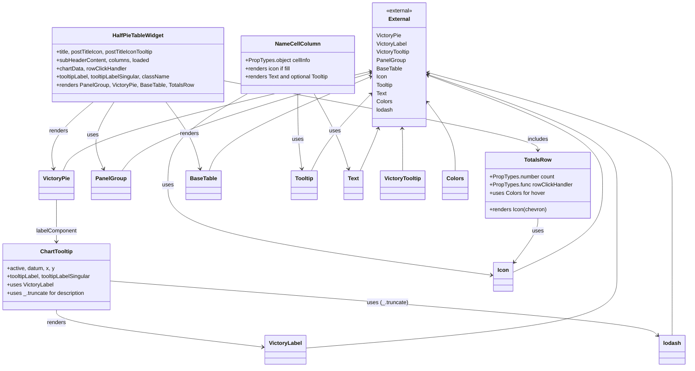

# Diagram: web/portal/src/pages/shipments/dashboard/components/organisms/HalfPieTableWidget.organism.js


> Auto-generated by Obscura crawlers

## Diagram 1



### SVG

<svg id="container" width="1987.87890625" xmlns="http://www.w3.org/2000/svg" class="classDiagram" height="1066" viewBox="0 0 1987.87890625 1066" role="graphics-document document" aria-roledescription="class"><style>#container{font-family:"trebuchet ms",verdana,arial,sans-serif;font-size:16px;fill:#333;}@keyframes edge-animation-frame{from{stroke-dashoffset:0;}}@keyframes dash{to{stroke-dashoffset:0;}}#container .edge-animation-slow{stroke-dasharray:9,5!important;stroke-dashoffset:900;animation:dash 50s linear infinite;stroke-linecap:round;}#container .edge-animation-fast{stroke-dasharray:9,5!important;stroke-dashoffset:900;animation:dash 20s linear infinite;stroke-linecap:round;}#container .error-icon{fill:#552222;}#container .error-text{fill:#552222;stroke:#552222;}#container .edge-thickness-normal{stroke-width:1px;}#container .edge-thickness-thick{stroke-width:3.5px;}#container .edge-pattern-solid{stroke-dasharray:0;}#container .edge-thickness-invisible{stroke-width:0;fill:none;}#container .edge-pattern-dashed{stroke-dasharray:3;}#container .edge-pattern-dotted{stroke-dasharray:2;}#container .marker{fill:#333333;stroke:#333333;}#container .marker.cross{stroke:#333333;}#container svg{font-family:"trebuchet ms",verdana,arial,sans-serif;font-size:16px;}#container p{margin:0;}#container g.classGroup text{fill:#9370DB;stroke:none;font-family:"trebuchet ms",verdana,arial,sans-serif;font-size:10px;}#container g.classGroup text .title{font-weight:bolder;}#container .nodeLabel,#container .edgeLabel{color:#131300;}#container .edgeLabel .label rect{fill:#ECECFF;}#container .label text{fill:#131300;}#container .labelBkg{background:#ECECFF;}#container .edgeLabel .label span{background:#ECECFF;}#container .classTitle{font-weight:bolder;}#container .node rect,#container .node circle,#container .node ellipse,#container .node polygon,#container .node path{fill:#ECECFF;stroke:#9370DB;stroke-width:1px;}#container .divider{stroke:#9370DB;stroke-width:1;}#container g.clickable{cursor:pointer;}#container g.classGroup rect{fill:#ECECFF;stroke:#9370DB;}#container g.classGroup line{stroke:#9370DB;stroke-width:1;}#container .classLabel .box{stroke:none;stroke-width:0;fill:#ECECFF;opacity:0.5;}#container .classLabel .label{fill:#9370DB;font-size:10px;}#container .relation{stroke:#333333;stroke-width:1;fill:none;}#container .dashed-line{stroke-dasharray:3;}#container .dotted-line{stroke-dasharray:1 2;}#container #compositionStart,#container .composition{fill:#333333!important;stroke:#333333!important;stroke-width:1;}#container #compositionEnd,#container .composition{fill:#333333!important;stroke:#333333!important;stroke-width:1;}#container #dependencyStart,#container .dependency{fill:#333333!important;stroke:#333333!important;stroke-width:1;}#container #dependencyStart,#container .dependency{fill:#333333!important;stroke:#333333!important;stroke-width:1;}#container #extensionStart,#container .extension{fill:transparent!important;stroke:#333333!important;stroke-width:1;}#container #extensionEnd,#container .extension{fill:transparent!important;stroke:#333333!important;stroke-width:1;}#container #aggregationStart,#container .aggregation{fill:transparent!important;stroke:#333333!important;stroke-width:1;}#container #aggregationEnd,#container .aggregation{fill:transparent!important;stroke:#333333!important;stroke-width:1;}#container #lollipopStart,#container .lollipop{fill:#ECECFF!important;stroke:#333333!important;stroke-width:1;}#container #lollipopEnd,#container .lollipop{fill:#ECECFF!important;stroke:#333333!important;stroke-width:1;}#container .edgeTerminals{font-size:11px;line-height:initial;}#container .classTitleText{text-anchor:middle;font-size:18px;fill:#333;}#container .label-icon{display:inline-block;height:1em;overflow:visible;vertical-align:-0.125em;}#container .node .label-icon path{fill:currentColor;stroke:revert;stroke-width:revert;}#container :root{--mermaid-font-family:"trebuchet ms",verdana,arial,sans-serif;}</style><g><defs><marker id="container_class-aggregationStart" class="marker aggregation class" refX="18" refY="7" markerWidth="190" markerHeight="240" orient="auto"><path d="M 18,7 L9,13 L1,7 L9,1 Z"></path></marker></defs><defs><marker id="container_class-aggregationEnd" class="marker aggregation class" refX="1" refY="7" markerWidth="20" markerHeight="28" orient="auto"><path d="M 18,7 L9,13 L1,7 L9,1 Z"></path></marker></defs><defs><marker id="container_class-extensionStart" class="marker extension class" refX="18" refY="7" markerWidth="190" markerHeight="240" orient="auto"><path d="M 1,7 L18,13 V 1 Z"></path></marker></defs><defs><marker id="container_class-extensionEnd" class="marker extension class" refX="1" refY="7" markerWidth="20" markerHeight="28" orient="auto"><path d="M 1,1 V 13 L18,7 Z"></path></marker></defs><defs><marker id="container_class-compositionStart" class="marker composition class" refX="18" refY="7" markerWidth="190" markerHeight="240" orient="auto"><path d="M 18,7 L9,13 L1,7 L9,1 Z"></path></marker></defs><defs><marker id="container_class-compositionEnd" class="marker composition class" refX="1" refY="7" markerWidth="20" markerHeight="28" orient="auto"><path d="M 18,7 L9,13 L1,7 L9,1 Z"></path></marker></defs><defs><marker id="container_class-dependencyStart" class="marker dependency class" refX="6" refY="7" markerWidth="190" markerHeight="240" orient="auto"><path d="M 5,7 L9,13 L1,7 L9,1 Z"></path></marker></defs><defs><marker id="container_class-dependencyEnd" class="marker dependency class" refX="13" refY="7" markerWidth="20" markerHeight="28" orient="auto"><path d="M 18,7 L9,13 L14,7 L9,1 Z"></path></marker></defs><defs><marker id="container_class-lollipopStart" class="marker lollipop class" refX="13" refY="7" markerWidth="190" markerHeight="240" orient="auto"><circle stroke="black" fill="transparent" cx="7" cy="7" r="6"></circle></marker></defs><defs><marker id="container_class-lollipopEnd" class="marker lollipop class" refX="1" refY="7" markerWidth="190" markerHeight="240" orient="auto"><circle stroke="black" fill="transparent" cx="7" cy="7" r="6"></circle></marker></defs><g class="root"><g class="clusters"></g><g class="edgePaths"><path d="M331.601,296L320.278,314.167C308.955,332.333,286.31,368.667,281.251,401.085C276.193,433.502,288.723,462.005,294.987,476.256L301.252,490.507" id="id_HalfPieTableWidget_PanelGroup_1" class="edge-thickness-normal edge-pattern-solid relation" style=";;;" data-edge="true" data-et="edge" data-id="id_HalfPieTableWidget_PanelGroup_1" data-points="W3sieCI6MzMxLjYwMDY5ODQ0NDcwMDQ3LCJ5IjoyOTZ9LHsieCI6MjYzLjY2NDA2MjUsInkiOjQwNX0seyJ4IjozMDMuNjY2MzI0MDEzMTU3OSwieSI6NDk2fV0=" marker-end="url(#container_class-dependencyEnd)"></path><path d="M272.458,296L251.187,314.167C229.916,332.333,187.374,368.667,168.649,401.016C149.924,433.365,155.016,461.73,157.562,475.912L160.107,490.094" id="id_HalfPieTableWidget_VictoryPie_2" class="edge-thickness-normal edge-pattern-solid relation" style=";;;" data-edge="true" data-et="edge" data-id="id_HalfPieTableWidget_VictoryPie_2" data-points="W3sieCI6MjcyLjQ1ODQ4OTM0MzMxOCwieSI6Mjk2fSx7IngiOjE0NC44MzIwMzEyNSwieSI6NDA1fSx7IngiOjE2MS4xNjc1NTc1NjU3ODk0OCwieSI6NDk2fV0=" marker-end="url(#container_class-dependencyEnd)"></path><path d="M479.964,296L493.597,314.167C507.23,332.333,534.497,368.667,550.962,401.019C567.428,433.372,573.091,461.744,575.923,475.93L578.755,490.116" id="id_HalfPieTableWidget_BaseTable_3" class="edge-thickness-normal edge-pattern-solid relation" style=";;;" data-edge="true" data-et="edge" data-id="id_HalfPieTableWidget_BaseTable_3" data-points="W3sieCI6NDc5Ljk2MzYzNzY3MjgxMTA1LCJ5IjoyOTZ9LHsieCI6NTYxLjc2MzY3MTg3NSwieSI6NDA1fSx7IngiOjU3OS45Mjk5OTU4ODgxNTc5LCJ5Ijo0OTZ9XQ==" marker-end="url(#container_class-dependencyEnd)"></path><path d="M644.125,234.006L796.025,262.505C947.926,291.004,1251.727,348.002,1403.627,381.668C1555.527,415.333,1555.527,425.667,1555.527,430.833L1555.527,436" id="id_HalfPieTableWidget_TotalsRow_4" class="edge-thickness-normal edge-pattern-solid relation" style=";;;" data-edge="true" data-et="edge" data-id="id_HalfPieTableWidget_TotalsRow_4" data-points="W3sieCI6NjQ0LjEyNSwieSI6MjM0LjAwNTY3Mzg5Mjk5OTgyfSx7IngiOjE1NTUuNTI3MzQzNzUsInkiOjQwNX0seyJ4IjoxNTU1LjUyNzM0Mzc1LCJ5Ijo0NDJ9XQ==" marker-end="url(#container_class-dependencyEnd)"></path><path d="M168.707,580L168.707,595.167C168.707,610.333,168.707,640.667,168.707,661C168.707,681.333,168.707,691.667,168.707,696.833L168.707,702" id="id_VictoryPie_ChartTooltip_5" class="edge-thickness-normal edge-pattern-solid relation" style=";;;" data-edge="true" data-et="edge" data-id="id_VictoryPie_ChartTooltip_5" data-points="W3sieCI6MTY4LjcwNzAzMTI1LCJ5Ijo1ODB9LHsieCI6MTY4LjcwNzAzMTI1LCJ5Ijo2NzF9LHsieCI6MTY4LjcwNzAzMTI1LCJ5Ijo3MDh9XQ==" marker-end="url(#container_class-dependencyEnd)"></path><path d="M716.834,272L678.605,294.167C640.377,316.333,563.92,360.667,525.691,405C487.463,449.333,487.463,493.667,487.463,538C487.463,582.333,487.463,626.667,642.495,670.235C797.527,713.803,1107.59,756.607,1262.622,778.008L1417.654,799.41" id="id_NameCellColumn_Icon_6" class="edge-thickness-normal edge-pattern-solid relation" style=";;;" data-edge="true" data-et="edge" data-id="id_NameCellColumn_Icon_6" data-points="W3sieCI6NzE2LjgzMzU0MzM0Njc3NDEsInkiOjI3Mn0seyJ4Ijo0ODcuNDYyODkwNjI1LCJ5Ijo0MDV9LHsieCI6NDg3LjQ2Mjg5MDYyNSwieSI6NTM4fSx7IngiOjQ4Ny40NjI4OTA2MjUsInkiOjY3MX0seyJ4IjoxNDIzLjU5NzY1NjI1LCJ5Ijo4MDAuMjMwNjY3NzEyNzIzNn1d" marker-end="url(#container_class-dependencyEnd)"></path><path d="M861.699,272L861.699,294.167C861.699,316.333,861.699,360.667,863.644,397.009C865.589,433.352,869.478,461.704,871.423,475.88L873.368,490.056" id="id_NameCellColumn_Tooltip_7" class="edge-thickness-normal edge-pattern-solid relation" style=";;;" data-edge="true" data-et="edge" data-id="id_NameCellColumn_Tooltip_7" data-points="W3sieCI6ODYxLjY5OTIxODc1LCJ5IjoyNzJ9LHsieCI6ODYxLjY5OTIxODc1LCJ5Ijo0MDV9LHsieCI6ODc0LjE4MzM4ODE1Nzg5NDcsInkiOjQ5Nn1d" marker-end="url(#container_class-dependencyEnd)"></path><path d="M910.364,272L923.206,294.167C936.048,316.333,961.732,360.667,978.773,397.041C995.814,433.415,1004.213,461.831,1008.412,476.038L1012.611,490.246" id="id_NameCellColumn_Text_8" class="edge-thickness-normal edge-pattern-solid relation" style=";;;" data-edge="true" data-et="edge" data-id="id_NameCellColumn_Text_8" data-points="W3sieCI6OTEwLjM2Mzc4NTI4MjI1OCwieSI6MjcyfSx7IngiOjk4Ny40MTYwMTU2MjUsInkiOjQwNX0seyJ4IjoxMDE0LjMxMTM2OTI0MzQyMSwieSI6NDk2fV0=" marker-end="url(#container_class-dependencyEnd)"></path><path d="M1555.527,634L1555.527,640.167C1555.527,646.333,1555.527,658.667,1543.259,680.429C1530.99,702.191,1506.454,733.383,1494.185,748.979L1481.917,764.574" id="id_TotalsRow_Icon_9" class="edge-thickness-normal edge-pattern-solid relation" style=";;;" data-edge="true" data-et="edge" data-id="id_TotalsRow_Icon_9" data-points="W3sieCI6MTU1NS41MjczNDM3NSwieSI6NjM0fSx7IngiOjE1NTUuNTI3MzQzNzUsInkiOjY3MX0seyJ4IjoxNDc4LjIwNzAzMTI1LCJ5Ijo3NjkuMjkwMDk4NTY2MzA4Mn1d" marker-end="url(#container_class-dependencyEnd)"></path><path d="M168.707,900L168.707,906.167C168.707,912.333,168.707,924.667,267.004,942.719C365.3,960.772,561.894,984.544,660.19,996.43L758.487,1008.316" id="id_ChartTooltip_VictoryLabel_10" class="edge-thickness-normal edge-pattern-solid relation" style=";;;" data-edge="true" data-et="edge" data-id="id_ChartTooltip_VictoryLabel_10" data-points="W3sieCI6MTY4LjcwNzAzMTI1LCJ5Ijo5MDB9LHsieCI6MTY4LjcwNzAzMTI1LCJ5Ijo5Mzd9LHsieCI6NzY0LjQ0MzM1OTM3NSwieSI6MTAwOS4wMzU4MjMwODE4NjcyfV0=" marker-end="url(#container_class-dependencyEnd)"></path><path d="M329.414,816.615L585.018,836.679C840.621,856.743,1351.828,896.872,1613.995,923.397C1876.162,949.922,1889.289,962.845,1895.852,969.306L1902.416,975.767" id="id_ChartTooltip_lodash_11" class="edge-thickness-normal edge-pattern-solid relation" style=";;;" data-edge="true" data-et="edge" data-id="id_ChartTooltip_lodash_11" data-points="W3sieCI6MzI5LjQxNDA2MjUsInkiOjgxNi42MTUwNTA2NzQ1ODUzfSx7IngiOjE4NjMuMDM1MTU2MjUsInkiOjkzN30seyJ4IjoxOTA2LjY5MTQwNjI1LCJ5Ijo5NzkuOTc2MjQ2MTA1OTE5fV0=" marker-end="url(#container_class-dependencyEnd)"></path><path d="M1073.429,208.323L932.386,241.103C791.343,273.882,509.258,339.441,361.548,387.387C213.838,435.333,200.504,465.667,193.837,480.833L187.17,496" id="id_External_VictoryPie_12" class="edge-thickness-normal edge-pattern-solid relation" style=";;;" data-edge="true" data-et="edge" data-id="id_External_VictoryPie_12" data-points="W3sieCI6MTA3OS4yNzM0Mzc1LCJ5IjoyMDYuOTY0ODQ5MzA2MzU3NDJ9LHsieCI6MjI3LjE3MTg3NSwieSI6NDA1fSx7IngiOjE4Ny4xNjk2MTM0ODY4NDIxLCJ5Ijo0OTZ9XQ==" marker-start="url(#container_class-dependencyStart)"></path><path d="M1248.142,218.45L1337.249,249.541C1426.356,280.633,1604.571,342.817,1693.678,396.075C1782.785,449.333,1782.785,493.667,1782.785,538C1782.785,582.333,1782.785,626.667,1782.785,671C1782.785,715.333,1782.785,759.667,1782.785,804C1782.785,848.333,1782.785,892.667,1632.259,927.211C1481.734,961.755,1180.682,986.509,1030.157,998.887L879.631,1011.264" id="id_External_VictoryLabel_13" class="edge-thickness-normal edge-pattern-solid relation" style=";;;" data-edge="true" data-et="edge" data-id="id_External_VictoryLabel_13" data-points="W3sieCI6MTI0Mi40NzY1NjI1LCJ5IjoyMTYuNDcyODI1MDI4NzM1ODN9LHsieCI6MTc4Mi43ODUxNTYyNSwieSI6NDA1fSx7IngiOjE3ODIuNzg1MTU2MjUsInkiOjUzOH0seyJ4IjoxNzgyLjc4NTE1NjI1LCJ5Ijo2NzF9LHsieCI6MTc4Mi43ODUxNTYyNSwieSI6ODA0fSx7IngiOjE3ODIuNzg1MTU2MjUsInkiOjkzN30seyJ4Ijo4NzkuNjMwODU5Mzc1LCJ5IjoxMDExLjI2NDIwNDUyODEyODV9XQ==" marker-start="url(#container_class-dependencyStart)"></path><path d="M1169.446,373.994L1169.684,379.161C1169.922,384.329,1170.399,394.665,1170.637,414.999C1170.875,435.333,1170.875,465.667,1170.875,480.833L1170.875,496" id="id_External_VictoryTooltip_14" class="edge-thickness-normal edge-pattern-solid relation" style=";;;" data-edge="true" data-et="edge" data-id="id_External_VictoryTooltip_14" data-points="W3sieCI6MTE2OS4xNjk5MzA4NzU1NzYsInkiOjM2OH0seyJ4IjoxMTcwLjg3NSwieSI6NDA1fSx7IngiOjExNzAuODc1LCJ5Ijo0OTZ9XQ==" marker-start="url(#container_class-dependencyStart)"></path><path d="M1073.518,213.745L965.357,245.621C857.196,277.497,640.875,341.248,521.034,388.291C401.193,435.333,377.833,465.667,366.153,480.833L354.473,496" id="id_External_PanelGroup_15" class="edge-thickness-normal edge-pattern-solid relation" style=";;;" data-edge="true" data-et="edge" data-id="id_External_PanelGroup_15" data-points="W3sieCI6MTA3OS4yNzM0Mzc1LCJ5IjoyMTIuMDQ4NjI2MzgxNjQyM30seyJ4Ijo0MjQuNTUyNzM0Mzc1LCJ5Ijo0MDV9LHsieCI6MzU0LjQ3MzI3MzAyNjMxNTgsInkiOjQ5Nn1d" marker-start="url(#container_class-dependencyStart)"></path><path d="M1073.733,224.208L1001.212,254.34C928.692,284.472,783.652,344.736,705.396,390.035C627.14,435.333,615.669,465.667,609.933,480.833L604.198,496" id="id_External_BaseTable_16" class="edge-thickness-normal edge-pattern-solid relation" style=";;;" data-edge="true" data-et="edge" data-id="id_External_BaseTable_16" data-points="W3sieCI6MTA3OS4yNzM0Mzc1LCJ5IjoyMjEuOTA1MzYyMzk4NTEzMX0seyJ4Ijo2MzguNjExMzI4MTI1LCJ5Ijo0MDV9LHsieCI6NjA0LjE5NzY3NjgwOTIxMDUsInkiOjQ5Nn1d" marker-start="url(#container_class-dependencyStart)"></path><path d="M1248.097,220.59L1330.353,251.325C1412.609,282.06,1577.121,343.53,1659.377,396.432C1741.633,449.333,1741.633,493.667,1741.633,538C1741.633,582.333,1741.633,626.667,1697.729,668.918C1653.824,711.17,1566.016,751.339,1522.111,771.424L1478.207,791.509" id="id_External_Icon_17" class="edge-thickness-normal edge-pattern-solid relation" style=";;;" data-edge="true" data-et="edge" data-id="id_External_Icon_17" data-points="W3sieCI6MTI0Mi40NzY1NjI1LCJ5IjoyMTguNDkwNDAxODE4NzQ0Mzd9LHsieCI6MTc0MS42MzI4MTI1LCJ5Ijo0MDV9LHsieCI6MTc0MS42MzI4MTI1LCJ5Ijo1Mzh9LHsieCI6MTc0MS42MzI4MTI1LCJ5Ijo2NzF9LHsieCI6MTQ3OC4yMDcwMzEyNSwieSI6NzkxLjUwODk2ODUxOTQ4ODl9XQ==" marker-start="url(#container_class-dependencyStart)"></path><path d="M1075.101,276.653L1054.405,298.044C1033.709,319.436,992.316,362.218,963.526,398.776C934.736,435.333,918.548,465.667,910.454,480.833L902.36,496" id="id_External_Tooltip_18" class="edge-thickness-normal edge-pattern-solid relation" style=";;;" data-edge="true" data-et="edge" data-id="id_External_Tooltip_18" data-points="W3sieCI6MTA3OS4yNzM0Mzc1LCJ5IjoyNzIuMzQxMjI1MTczMjYzODd9LHsieCI6OTUwLjkyMzgyODEyNSwieSI6NDA1fSx7IngiOjkwMi4zNTk1ODA1OTIxMDUzLCJ5Ijo0OTZ9XQ==" marker-start="url(#container_class-dependencyStart)"></path><path d="M1097.738,373.681L1095.963,378.9C1094.188,384.12,1090.638,394.56,1081.979,414.947C1073.321,435.333,1059.554,465.667,1052.67,480.833L1045.787,496" id="id_External_Text_19" class="edge-thickness-normal edge-pattern-solid relation" style=";;;" data-edge="true" data-et="edge" data-id="id_External_Text_19" data-points="W3sieCI6MTA5OS42NjkxMDI4MjI1ODA3LCJ5IjozNjh9LHsieCI6MTA4Ny4wODc4OTA2MjUsInkiOjQwNX0seyJ4IjoxMDQ1Ljc4NjY5ODE5MDc4OTQsInkiOjQ5Nn1d" marker-start="url(#container_class-dependencyStart)"></path><path d="M1246.015,304.604L1258.232,321.336C1270.45,338.069,1294.885,371.535,1307.103,403.434C1319.32,435.333,1319.32,465.667,1319.32,480.833L1319.32,496" id="id_External_Colors_20" class="edge-thickness-normal edge-pattern-solid relation" style=";;;" data-edge="true" data-et="edge" data-id="id_External_Colors_20" data-points="W3sieCI6MTI0Mi40NzY1NjI1LCJ5IjoyOTkuNzU4MDQ5NDA1ODQ3OH0seyJ4IjoxMzE5LjMyMDMxMjUsInkiOjQwNX0seyJ4IjoxMzE5LjMyMDMxMjUsInkiOjQ5Nn1d" marker-start="url(#container_class-dependencyStart)"></path><path d="M1248.258,212.236L1364.096,244.363C1479.934,276.49,1711.61,340.745,1827.447,395.039C1943.285,449.333,1943.285,493.667,1943.285,538C1943.285,582.333,1943.285,626.667,1943.285,671C1943.285,715.333,1943.285,759.667,1943.285,804C1943.285,848.333,1943.285,892.667,1943.285,921C1943.285,949.333,1943.285,961.667,1943.285,967.833L1943.285,974" id="id_External_lodash_21" class="edge-thickness-normal edge-pattern-solid relation" style=";;;" data-edge="true" data-et="edge" data-id="id_External_lodash_21" data-points="W3sieCI6MTI0Mi40NzY1NjI1LCJ5IjoyMTAuNjMyMDQxNDE4NDkzNTR9LHsieCI6MTk0My4yODUxNTYyNSwieSI6NDA1fSx7IngiOjE5NDMuMjg1MTU2MjUsInkiOjUzOH0seyJ4IjoxOTQzLjI4NTE1NjI1LCJ5Ijo2NzF9LHsieCI6MTk0My4yODUxNTYyNSwieSI6ODA0fSx7IngiOjE5NDMuMjg1MTU2MjUsInkiOjkzN30seyJ4IjoxOTQzLjI4NTE1NjI1LCJ5Ijo5NzR9XQ==" marker-start="url(#container_class-dependencyStart)"></path></g><g class="edgeLabels"><g class="edgeLabel" transform="translate(271.34278, 392.67999)"><g class="label" data-id="id_HalfPieTableWidget_PanelGroup_1" transform="translate(-16.4921875, -12)"><foreignObject width="32.984375" height="24"><div xmlns="http://www.w3.org/1999/xhtml" class="labelBkg" style="display: table-cell; white-space: nowrap; line-height: 1.5; max-width: 200px; text-align: center;"><span class="edgeLabel"><p>uses</p></span></div></foreignObject></g></g><g class="edgeLabel" transform="translate(173.49331, 380.5217)"><g class="label" data-id="id_HalfPieTableWidget_VictoryPie_2" transform="translate(-27.75, -12)"><foreignObject width="55.5" height="24"><div xmlns="http://www.w3.org/1999/xhtml" class="labelBkg" style="display: table-cell; white-space: nowrap; line-height: 1.5; max-width: 200px; text-align: center;"><span class="edgeLabel"><p>renders</p></span></div></foreignObject></g></g><g class="edgeLabel" transform="translate(548.71322, 387.61004)"><g class="label" data-id="id_HalfPieTableWidget_BaseTable_3" transform="translate(-27.75, -12)"><foreignObject width="55.5" height="24"><div xmlns="http://www.w3.org/1999/xhtml" class="labelBkg" style="display: table-cell; white-space: nowrap; line-height: 1.5; max-width: 200px; text-align: center;"><span class="edgeLabel"><p>renders</p></span></div></foreignObject></g></g><g class="edgeLabel" transform="translate(1555.52734375, 405)"><g class="label" data-id="id_HalfPieTableWidget_TotalsRow_4" transform="translate(-30.6484375, -12)"><foreignObject width="61.296875" height="24"><div xmlns="http://www.w3.org/1999/xhtml" class="labelBkg" style="display: table-cell; white-space: nowrap; line-height: 1.5; max-width: 200px; text-align: center;"><span class="edgeLabel"><p>includes</p></span></div></foreignObject></g></g><g class="edgeLabel" transform="translate(168.70703125, 671)"><g class="label" data-id="id_VictoryPie_ChartTooltip_5" transform="translate(-60.015625, -12)"><foreignObject width="120.03125" height="24"><div xmlns="http://www.w3.org/1999/xhtml" class="labelBkg" style="display: table-cell; white-space: nowrap; line-height: 1.5; max-width: 200px; text-align: center;"><span class="edgeLabel"><p>labelComponent</p></span></div></foreignObject></g></g><g class="edgeLabel" transform="translate(487.462890625, 538)"><g class="label" data-id="id_NameCellColumn_Icon_6" transform="translate(-16.4921875, -12)"><foreignObject width="32.984375" height="24"><div xmlns="http://www.w3.org/1999/xhtml" class="labelBkg" style="display: table-cell; white-space: nowrap; line-height: 1.5; max-width: 200px; text-align: center;"><span class="edgeLabel"><p>uses</p></span></div></foreignObject></g></g><g class="edgeLabel" transform="translate(861.69921875, 405)"><g class="label" data-id="id_NameCellColumn_Tooltip_7" transform="translate(-16.4921875, -12)"><foreignObject width="32.984375" height="24"><div xmlns="http://www.w3.org/1999/xhtml" class="labelBkg" style="display: table-cell; white-space: nowrap; line-height: 1.5; max-width: 200px; text-align: center;"><span class="edgeLabel"><p>uses</p></span></div></foreignObject></g></g><g class="edgeLabel" transform="translate(972.67397, 379.55372)"><g class="label" data-id="id_NameCellColumn_Text_8" transform="translate(-16.4921875, -12)"><foreignObject width="32.984375" height="24"><div xmlns="http://www.w3.org/1999/xhtml" class="labelBkg" style="display: table-cell; white-space: nowrap; line-height: 1.5; max-width: 200px; text-align: center;"><span class="edgeLabel"><p>uses</p></span></div></foreignObject></g></g><g class="edgeLabel" transform="translate(1555.52734375, 671)"><g class="label" data-id="id_TotalsRow_Icon_9" transform="translate(-16.4921875, -12)"><foreignObject width="32.984375" height="24"><div xmlns="http://www.w3.org/1999/xhtml" class="labelBkg" style="display: table-cell; white-space: nowrap; line-height: 1.5; max-width: 200px; text-align: center;"><span class="edgeLabel"><p>uses</p></span></div></foreignObject></g></g><g class="edgeLabel" transform="translate(168.70703125, 937)"><g class="label" data-id="id_ChartTooltip_VictoryLabel_10" transform="translate(-27.75, -12)"><foreignObject width="55.5" height="24"><div xmlns="http://www.w3.org/1999/xhtml" class="labelBkg" style="display: table-cell; white-space: nowrap; line-height: 1.5; max-width: 200px; text-align: center;"><span class="edgeLabel"><p>renders</p></span></div></foreignObject></g></g><g class="edgeLabel" transform="translate(1126.76083, 879.20453)"><g class="label" data-id="id_ChartTooltip_lodash_11" transform="translate(-60.25, -12)"><foreignObject width="120.5" height="24"><div xmlns="http://www.w3.org/1999/xhtml" class="labelBkg" style="display: table-cell; white-space: nowrap; line-height: 1.5; max-width: 200px; text-align: center;"><span class="edgeLabel"><p>uses (_.truncate)</p></span></div></foreignObject></g></g><g class="edgeLabel"><g class="label" data-id="id_External_VictoryPie_12" transform="translate(0, 0)"><foreignObject width="0" height="0"><div xmlns="http://www.w3.org/1999/xhtml" class="labelBkg" style="display: table-cell; white-space: nowrap; line-height: 1.5; max-width: 200px; text-align: center;"><span class="edgeLabel"></span></div></foreignObject></g></g><g class="edgeLabel"><g class="label" data-id="id_External_VictoryLabel_13" transform="translate(0, 0)"><foreignObject width="0" height="0"><div xmlns="http://www.w3.org/1999/xhtml" class="labelBkg" style="display: table-cell; white-space: nowrap; line-height: 1.5; max-width: 200px; text-align: center;"><span class="edgeLabel"></span></div></foreignObject></g></g><g class="edgeLabel"><g class="label" data-id="id_External_VictoryTooltip_14" transform="translate(0, 0)"><foreignObject width="0" height="0"><div xmlns="http://www.w3.org/1999/xhtml" class="labelBkg" style="display: table-cell; white-space: nowrap; line-height: 1.5; max-width: 200px; text-align: center;"><span class="edgeLabel"></span></div></foreignObject></g></g><g class="edgeLabel"><g class="label" data-id="id_External_PanelGroup_15" transform="translate(0, 0)"><foreignObject width="0" height="0"><div xmlns="http://www.w3.org/1999/xhtml" class="labelBkg" style="display: table-cell; white-space: nowrap; line-height: 1.5; max-width: 200px; text-align: center;"><span class="edgeLabel"></span></div></foreignObject></g></g><g class="edgeLabel"><g class="label" data-id="id_External_BaseTable_16" transform="translate(0, 0)"><foreignObject width="0" height="0"><div xmlns="http://www.w3.org/1999/xhtml" class="labelBkg" style="display: table-cell; white-space: nowrap; line-height: 1.5; max-width: 200px; text-align: center;"><span class="edgeLabel"></span></div></foreignObject></g></g><g class="edgeLabel"><g class="label" data-id="id_External_Icon_17" transform="translate(0, 0)"><foreignObject width="0" height="0"><div xmlns="http://www.w3.org/1999/xhtml" class="labelBkg" style="display: table-cell; white-space: nowrap; line-height: 1.5; max-width: 200px; text-align: center;"><span class="edgeLabel"></span></div></foreignObject></g></g><g class="edgeLabel"><g class="label" data-id="id_External_Tooltip_18" transform="translate(0, 0)"><foreignObject width="0" height="0"><div xmlns="http://www.w3.org/1999/xhtml" class="labelBkg" style="display: table-cell; white-space: nowrap; line-height: 1.5; max-width: 200px; text-align: center;"><span class="edgeLabel"></span></div></foreignObject></g></g><g class="edgeLabel"><g class="label" data-id="id_External_Text_19" transform="translate(0, 0)"><foreignObject width="0" height="0"><div xmlns="http://www.w3.org/1999/xhtml" class="labelBkg" style="display: table-cell; white-space: nowrap; line-height: 1.5; max-width: 200px; text-align: center;"><span class="edgeLabel"></span></div></foreignObject></g></g><g class="edgeLabel"><g class="label" data-id="id_External_Colors_20" transform="translate(0, 0)"><foreignObject width="0" height="0"><div xmlns="http://www.w3.org/1999/xhtml" class="labelBkg" style="display: table-cell; white-space: nowrap; line-height: 1.5; max-width: 200px; text-align: center;"><span class="edgeLabel"></span></div></foreignObject></g></g><g class="edgeLabel"><g class="label" data-id="id_External_lodash_21" transform="translate(0, 0)"><foreignObject width="0" height="0"><div xmlns="http://www.w3.org/1999/xhtml" class="labelBkg" style="display: table-cell; white-space: nowrap; line-height: 1.5; max-width: 200px; text-align: center;"><span class="edgeLabel"></span></div></foreignObject></g></g></g><g class="nodes"><g class="node default" id="classId-NameCellColumn-0" transform="translate(861.69921875, 188)"><g class="basic label-container"><path d="M-167.57421875 -84 L167.57421875 -84 L167.57421875 84 L-167.57421875 84" stroke="none" stroke-width="0" fill="#ECECFF" style=""></path><path d="M-167.57421875 -84 C-79.3167160018925 -84, 8.940786746214997 -84, 167.57421875 -84 M-167.57421875 -84 C-77.96018076851524 -84, 11.653857212969513 -84, 167.57421875 -84 M167.57421875 -84 C167.57421875 -43.13284779409106, 167.57421875 -2.265695588182126, 167.57421875 84 M167.57421875 -84 C167.57421875 -20.74142872638202, 167.57421875 42.51714254723596, 167.57421875 84 M167.57421875 84 C71.89409365375336 84, -23.786031442493282 84, -167.57421875 84 M167.57421875 84 C45.07972269923265 84, -77.4147733515347 84, -167.57421875 84 M-167.57421875 84 C-167.57421875 44.30686545375562, -167.57421875 4.61373090751124, -167.57421875 -84 M-167.57421875 84 C-167.57421875 29.33708840467488, -167.57421875 -25.32582319065024, -167.57421875 -84" stroke="#9370DB" stroke-width="1.3" fill="none" stroke-dasharray="0 0" style=""></path></g><g class="annotation-group text" transform="translate(0, -60)"></g><g class="label-group text" transform="translate(-61.9140625, -60)"><g class="label" style="font-weight: bolder" transform="translate(0,-12)"><foreignObject width="123.828125" height="24"><div xmlns="http://www.w3.org/1999/xhtml" style="display: table-cell; white-space: nowrap; line-height: 1.5; max-width: 174px; text-align: center;"><span class="nodeLabel markdown-node-label" style=""><p>NameCellColumn</p></span></div></foreignObject></g></g><g class="members-group text" transform="translate(-155.57421875, -12)"><g class="label" style="" transform="translate(0,-12)"><foreignObject width="190.171875" height="24"><div xmlns="http://www.w3.org/1999/xhtml" style="display: table-cell; white-space: nowrap; line-height: 1.5; max-width: 248px; text-align: center;"><span class="nodeLabel markdown-node-label" style=""><p>+PropTypes.object cellInfo</p></span></div></foreignObject></g><g class="label" style="" transform="translate(0,12)"><foreignObject width="135.203125" height="24"><div xmlns="http://www.w3.org/1999/xhtml" style="display: table-cell; white-space: nowrap; line-height: 1.5; max-width: 193px; text-align: center;"><span class="nodeLabel markdown-node-label" style=""><p>+renders icon if fill</p></span></div></foreignObject></g><g class="label" style="" transform="translate(0,36)"><foreignObject width="249.234375" height="24"><div xmlns="http://www.w3.org/1999/xhtml" style="display: table-cell; white-space: nowrap; line-height: 1.5; max-width: 307px; text-align: center;"><span class="nodeLabel markdown-node-label" style=""><p>+renders Text and optional Tooltip</p></span></div></foreignObject></g></g><g class="methods-group text" transform="translate(-155.57421875, 84)"></g><g class="divider" style=""><path d="M-167.57421875 -36 C-55.23612861713774 -36, 57.101961515724525 -36, 167.57421875 -36 M-167.57421875 -36 C-42.64992873865043 -36, 82.27436127269914 -36, 167.57421875 -36" stroke="#9370DB" stroke-width="1.3" fill="none" stroke-dasharray="0 0" style=""></path></g><g class="divider" style=""><path d="M-167.57421875 60 C-79.19695955995462 60, 9.180299630090758 60, 167.57421875 60 M-167.57421875 60 C-34.689993071951164 60, 98.19423260609767 60, 167.57421875 60" stroke="#9370DB" stroke-width="1.3" fill="none" stroke-dasharray="0 0" style=""></path></g></g><g class="node default" id="classId-TotalsRow-1" transform="translate(1555.52734375, 538)"><g class="basic label-container"><path d="M-151.10546875 -96 L151.10546875 -96 L151.10546875 96 L-151.10546875 96" stroke="none" stroke-width="0" fill="#ECECFF" style=""></path><path d="M-151.10546875 -96 C-84.52717167982806 -96, -17.948874609656116 -96, 151.10546875 -96 M-151.10546875 -96 C-36.591403352531586 -96, 77.92266204493683 -96, 151.10546875 -96 M151.10546875 -96 C151.10546875 -28.253021282578686, 151.10546875 39.49395743484263, 151.10546875 96 M151.10546875 -96 C151.10546875 -49.75410067233853, 151.10546875 -3.5082013446770617, 151.10546875 96 M151.10546875 96 C65.36516677948643 96, -20.37513519102714 96, -151.10546875 96 M151.10546875 96 C83.53667203264698 96, 15.967875315293952 96, -151.10546875 96 M-151.10546875 96 C-151.10546875 40.56826385105467, -151.10546875 -14.863472297890667, -151.10546875 -96 M-151.10546875 96 C-151.10546875 29.523985367520368, -151.10546875 -36.952029264959265, -151.10546875 -96" stroke="#9370DB" stroke-width="1.3" fill="none" stroke-dasharray="0 0" style=""></path></g><g class="annotation-group text" transform="translate(0, -72)"></g><g class="label-group text" transform="translate(-37.5703125, -72)"><g class="label" style="font-weight: bolder" transform="translate(0,-12)"><foreignObject width="75.140625" height="24"><div xmlns="http://www.w3.org/1999/xhtml" style="display: table-cell; white-space: nowrap; line-height: 1.5; max-width: 124px; text-align: center;"><span class="nodeLabel markdown-node-label" style=""><p>TotalsRow</p></span></div></foreignObject></g></g><g class="members-group text" transform="translate(-139.10546875, -24)"><g class="label" style="" transform="translate(0,-12)"><foreignObject width="188.734375" height="24"><div xmlns="http://www.w3.org/1999/xhtml" style="display: table-cell; white-space: nowrap; line-height: 1.5; max-width: 246px; text-align: center;"><span class="nodeLabel markdown-node-label" style=""><p>+PropTypes.number count</p></span></div></foreignObject></g><g class="label" style="" transform="translate(0,12)"><foreignObject width="240.640625" height="24"><div xmlns="http://www.w3.org/1999/xhtml" style="display: table-cell; white-space: nowrap; line-height: 1.5; max-width: 299px; text-align: center;"><span class="nodeLabel markdown-node-label" style=""><p>+PropTypes.func rowClickHandler</p></span></div></foreignObject></g><g class="label" style="" transform="translate(0,36)"><foreignObject width="161.109375" height="24"><div xmlns="http://www.w3.org/1999/xhtml" style="display: table-cell; white-space: nowrap; line-height: 1.5; max-width: 219px; text-align: center;"><span class="nodeLabel markdown-node-label" style=""><p>+uses Colors for hover</p></span></div></foreignObject></g></g><g class="methods-group text" transform="translate(-139.10546875, 72)"><g class="label" style="" transform="translate(0,-12)"><foreignObject width="166.828125" height="24"><div xmlns="http://www.w3.org/1999/xhtml" style="display: table-cell; white-space: nowrap; line-height: 1.5; max-width: 224px; text-align: center;"><span class="nodeLabel markdown-node-label" style=""><p>+renders Icon(chevron)</p></span></div></foreignObject></g></g><g class="divider" style=""><path d="M-151.10546875 -48 C-55.54731928082144 -48, 40.01083018835712 -48, 151.10546875 -48 M-151.10546875 -48 C-50.11188856488067 -48, 50.881691620238655 -48, 151.10546875 -48" stroke="#9370DB" stroke-width="1.3" fill="none" stroke-dasharray="0 0" style=""></path></g><g class="divider" style=""><path d="M-151.10546875 48 C-45.83515904301757 48, 59.43515066396486 48, 151.10546875 48 M-151.10546875 48 C-60.298672043039716 48, 30.50812466392057 48, 151.10546875 48" stroke="#9370DB" stroke-width="1.3" fill="none" stroke-dasharray="0 0" style=""></path></g></g><g class="node default" id="classId-ChartTooltip-2" transform="translate(168.70703125, 804)"><g class="basic label-container"><path d="M-160.70703125 -96 L160.70703125 -96 L160.70703125 96 L-160.70703125 96" stroke="none" stroke-width="0" fill="#ECECFF" style=""></path><path d="M-160.70703125 -96 C-61.434779999451806 -96, 37.83747125109639 -96, 160.70703125 -96 M-160.70703125 -96 C-77.39482692166578 -96, 5.917377406668436 -96, 160.70703125 -96 M160.70703125 -96 C160.70703125 -46.393549934046135, 160.70703125 3.2129001319077304, 160.70703125 96 M160.70703125 -96 C160.70703125 -38.464572448742665, 160.70703125 19.07085510251467, 160.70703125 96 M160.70703125 96 C33.21872976739378 96, -94.26957171521244 96, -160.70703125 96 M160.70703125 96 C39.77311228798827 96, -81.16080667402346 96, -160.70703125 96 M-160.70703125 96 C-160.70703125 38.38487835504745, -160.70703125 -19.230243289905104, -160.70703125 -96 M-160.70703125 96 C-160.70703125 24.291393035131023, -160.70703125 -47.417213929737954, -160.70703125 -96" stroke="#9370DB" stroke-width="1.3" fill="none" stroke-dasharray="0 0" style=""></path></g><g class="annotation-group text" transform="translate(0, -72)"></g><g class="label-group text" transform="translate(-45.5390625, -72)"><g class="label" style="font-weight: bolder" transform="translate(0,-12)"><foreignObject width="91.078125" height="24"><div xmlns="http://www.w3.org/1999/xhtml" style="display: table-cell; white-space: nowrap; line-height: 1.5; max-width: 139px; text-align: center;"><span class="nodeLabel markdown-node-label" style=""><p>ChartTooltip</p></span></div></foreignObject></g></g><g class="members-group text" transform="translate(-148.70703125, -24)"><g class="label" style="" transform="translate(0,-12)"><foreignObject width="137.765625" height="24"><div xmlns="http://www.w3.org/1999/xhtml" style="display: table-cell; white-space: nowrap; line-height: 1.5; max-width: 195px; text-align: center;"><span class="nodeLabel markdown-node-label" style=""><p>+active, datum, x, y</p></span></div></foreignObject></g><g class="label" style="" transform="translate(0,12)"><foreignObject width="251.875" height="24"><div xmlns="http://www.w3.org/1999/xhtml" style="display: table-cell; white-space: nowrap; line-height: 1.5; max-width: 310px; text-align: center;"><span class="nodeLabel markdown-node-label" style=""><p>+tooltipLabel, tooltipLabelSingular</p></span></div></foreignObject></g><g class="label" style="" transform="translate(0,36)"><foreignObject width="134.609375" height="24"><div xmlns="http://www.w3.org/1999/xhtml" style="display: table-cell; white-space: nowrap; line-height: 1.5; max-width: 192px; text-align: center;"><span class="nodeLabel markdown-node-label" style=""><p>+uses VictoryLabel</p></span></div></foreignObject></g><g class="label" style="" transform="translate(0,60)"><foreignObject width="229.78125" height="24"><div xmlns="http://www.w3.org/1999/xhtml" style="display: table-cell; white-space: nowrap; line-height: 1.5; max-width: 287px; text-align: center;"><span class="nodeLabel markdown-node-label" style=""><p>+uses _.truncate for description</p></span></div></foreignObject></g></g><g class="methods-group text" transform="translate(-148.70703125, 96)"></g><g class="divider" style=""><path d="M-160.70703125 -48 C-91.28771818126212 -48, -21.868405112524243 -48, 160.70703125 -48 M-160.70703125 -48 C-85.77311898028086 -48, -10.839206710561712 -48, 160.70703125 -48" stroke="#9370DB" stroke-width="1.3" fill="none" stroke-dasharray="0 0" style=""></path></g><g class="divider" style=""><path d="M-160.70703125 72 C-35.56021691963538 72, 89.58659741072924 72, 160.70703125 72 M-160.70703125 72 C-83.6964547298102 72, -6.685878209620398 72, 160.70703125 72" stroke="#9370DB" stroke-width="1.3" fill="none" stroke-dasharray="0 0" style=""></path></g></g><g class="node default" id="classId-HalfPieTableWidget-3" transform="translate(398.9140625, 188)"><g class="basic label-container"><path d="M-245.2109375 -108 L245.2109375 -108 L245.2109375 108 L-245.2109375 108" stroke="none" stroke-width="0" fill="#ECECFF" style=""></path><path d="M-245.2109375 -108 C-112.58452174407216 -108, 20.041894011855675 -108, 245.2109375 -108 M-245.2109375 -108 C-58.52880801046874 -108, 128.15332147906253 -108, 245.2109375 -108 M245.2109375 -108 C245.2109375 -47.539889048225284, 245.2109375 12.920221903549432, 245.2109375 108 M245.2109375 -108 C245.2109375 -41.28472159346782, 245.2109375 25.430556813064356, 245.2109375 108 M245.2109375 108 C118.63402177540256 108, -7.9428939491948825 108, -245.2109375 108 M245.2109375 108 C66.54728488939756 108, -112.11636772120488 108, -245.2109375 108 M-245.2109375 108 C-245.2109375 60.72969116479494, -245.2109375 13.459382329589886, -245.2109375 -108 M-245.2109375 108 C-245.2109375 57.21712432819724, -245.2109375 6.434248656394473, -245.2109375 -108" stroke="#9370DB" stroke-width="1.3" fill="none" stroke-dasharray="0 0" style=""></path></g><g class="annotation-group text" transform="translate(0, -84)"></g><g class="label-group text" transform="translate(-71.734375, -84)"><g class="label" style="font-weight: bolder" transform="translate(0,-12)"><foreignObject width="143.46875" height="24"><div xmlns="http://www.w3.org/1999/xhtml" style="display: table-cell; white-space: nowrap; line-height: 1.5; max-width: 191px; text-align: center;"><span class="nodeLabel markdown-node-label" style=""><p>HalfPieTableWidget</p></span></div></foreignObject></g></g><g class="members-group text" transform="translate(-233.2109375, -36)"><g class="label" style="" transform="translate(0,-12)"><foreignObject width="292.890625" height="24"><div xmlns="http://www.w3.org/1999/xhtml" style="display: table-cell; white-space: nowrap; line-height: 1.5; max-width: 350px; text-align: center;"><span class="nodeLabel markdown-node-label" style=""><p>+title, postTitleIcon, postTitleIconTooltip</p></span></div></foreignObject></g><g class="label" style="" transform="translate(0,12)"><foreignObject width="271.46875" height="24"><div xmlns="http://www.w3.org/1999/xhtml" style="display: table-cell; white-space: nowrap; line-height: 1.5; max-width: 329px; text-align: center;"><span class="nodeLabel markdown-node-label" style=""><p>+subHeaderContent, columns, loaded</p></span></div></foreignObject></g><g class="label" style="" transform="translate(0,36)"><foreignObject width="205.359375" height="24"><div xmlns="http://www.w3.org/1999/xhtml" style="display: table-cell; white-space: nowrap; line-height: 1.5; max-width: 264px; text-align: center;"><span class="nodeLabel markdown-node-label" style=""><p>+chartData, rowClickHandler</p></span></div></foreignObject></g><g class="label" style="" transform="translate(0,60)"><foreignObject width="336.328125" height="24"><div xmlns="http://www.w3.org/1999/xhtml" style="display: table-cell; white-space: nowrap; line-height: 1.5; max-width: 394px; text-align: center;"><span class="nodeLabel markdown-node-label" style=""><p>+tooltipLabel, tooltipLabelSingular, className</p></span></div></foreignObject></g><g class="label" style="" transform="translate(0,84)"><foreignObject width="394.6875" height="24"><div xmlns="http://www.w3.org/1999/xhtml" style="display: table-cell; white-space: nowrap; line-height: 1.5; max-width: 453px; text-align: center;"><span class="nodeLabel markdown-node-label" style=""><p>+renders PanelGroup, VictoryPie, BaseTable, TotalsRow</p></span></div></foreignObject></g></g><g class="methods-group text" transform="translate(-233.2109375, 108)"></g><g class="divider" style=""><path d="M-245.2109375 -60 C-130.18032518005705 -60, -15.149712860114107 -60, 245.2109375 -60 M-245.2109375 -60 C-57.49290229450773 -60, 130.22513291098454 -60, 245.2109375 -60" stroke="#9370DB" stroke-width="1.3" fill="none" stroke-dasharray="0 0" style=""></path></g><g class="divider" style=""><path d="M-245.2109375 84 C-79.59415945361212 84, 86.02261859277576 84, 245.2109375 84 M-245.2109375 84 C-111.88681061305229 84, 21.43731627389542 84, 245.2109375 84" stroke="#9370DB" stroke-width="1.3" fill="none" stroke-dasharray="0 0" style=""></path></g></g><g class="node default" id="classId-External-4" transform="translate(1160.875, 188)"><g class="basic label-container"><path d="M-81.6015625 -180 L81.6015625 -180 L81.6015625 180 L-81.6015625 180" stroke="none" stroke-width="0" fill="#ECECFF" style=""></path><path d="M-81.6015625 -180 C-32.64203280346487 -180, 16.317496893070256 -180, 81.6015625 -180 M-81.6015625 -180 C-23.29428912892672 -180, 35.01298424214656 -180, 81.6015625 -180 M81.6015625 -180 C81.6015625 -50.61220384640768, 81.6015625 78.77559230718464, 81.6015625 180 M81.6015625 -180 C81.6015625 -37.87277545481302, 81.6015625 104.25444909037395, 81.6015625 180 M81.6015625 180 C34.05670262552053 180, -13.488157248958942 180, -81.6015625 180 M81.6015625 180 C30.348896747331835 180, -20.90376900533633 180, -81.6015625 180 M-81.6015625 180 C-81.6015625 70.39412410924554, -81.6015625 -39.21175178150892, -81.6015625 -180 M-81.6015625 180 C-81.6015625 71.46601052439665, -81.6015625 -37.0679789512067, -81.6015625 -180" stroke="#9370DB" stroke-width="1.3" fill="none" stroke-dasharray="0 0" style=""></path></g><g class="annotation-group text" transform="translate(-38.65625, -156)"><g class="label" style="" transform="translate(0,-12)"><foreignObject width="77.3125" height="24"><div xmlns="http://www.w3.org/1999/xhtml" style="display: table-cell; white-space: nowrap; line-height: 1.5; max-width: 127px; text-align: center;"><span class="nodeLabel markdown-node-label" style=""><p>«external»</p></span></div></foreignObject></g></g><g class="label-group text" transform="translate(-30.171875, -132)"><g class="label" style="font-weight: bolder" transform="translate(0,-12)"><foreignObject width="60.34375" height="24"><div xmlns="http://www.w3.org/1999/xhtml" style="display: table-cell; white-space: nowrap; line-height: 1.5; max-width: 110px; text-align: center;"><span class="nodeLabel markdown-node-label" style=""><p>External</p></span></div></foreignObject></g></g><g class="members-group text" transform="translate(-69.6015625, -84)"><g class="label" style="" transform="translate(0,-12)"><foreignObject width="72.515625" height="24"><div xmlns="http://www.w3.org/1999/xhtml" style="display: table-cell; white-space: nowrap; line-height: 1.5; max-width: 123px; text-align: center;"><span class="nodeLabel markdown-node-label" style=""><p>VictoryPie</p></span></div></foreignObject></g><g class="label" style="" transform="translate(0,12)"><foreignObject width="89.421875" height="24"><div xmlns="http://www.w3.org/1999/xhtml" style="display: table-cell; white-space: nowrap; line-height: 1.5; max-width: 140px; text-align: center;"><span class="nodeLabel markdown-node-label" style=""><p>VictoryLabel</p></span></div></foreignObject></g><g class="label" style="" transform="translate(0,36)"><foreignObject width="100.546875" height="24"><div xmlns="http://www.w3.org/1999/xhtml" style="display: table-cell; white-space: nowrap; line-height: 1.5; max-width: 151px; text-align: center;"><span class="nodeLabel markdown-node-label" style=""><p>VictoryTooltip</p></span></div></foreignObject></g><g class="label" style="" transform="translate(0,60)"><foreignObject width="83.859375" height="24"><div xmlns="http://www.w3.org/1999/xhtml" style="display: table-cell; white-space: nowrap; line-height: 1.5; max-width: 134px; text-align: center;"><span class="nodeLabel markdown-node-label" style=""><p>PanelGroup</p></span></div></foreignObject></g><g class="label" style="" transform="translate(0,84)"><foreignObject width="73.484375" height="24"><div xmlns="http://www.w3.org/1999/xhtml" style="display: table-cell; white-space: nowrap; line-height: 1.5; max-width: 123px; text-align: center;"><span class="nodeLabel markdown-node-label" style=""><p>BaseTable</p></span></div></foreignObject></g><g class="label" style="" transform="translate(0,108)"><foreignObject width="30.78125" height="24"><div xmlns="http://www.w3.org/1999/xhtml" style="display: table-cell; white-space: nowrap; line-height: 1.5; max-width: 81px; text-align: center;"><span class="nodeLabel markdown-node-label" style=""><p>Icon</p></span></div></foreignObject></g><g class="label" style="" transform="translate(0,132)"><foreignObject width="50.5625" height="24"><div xmlns="http://www.w3.org/1999/xhtml" style="display: table-cell; white-space: nowrap; line-height: 1.5; max-width: 101px; text-align: center;"><span class="nodeLabel markdown-node-label" style=""><p>Tooltip</p></span></div></foreignObject></g><g class="label" style="" transform="translate(0,156)"><foreignObject width="29.515625" height="24"><div xmlns="http://www.w3.org/1999/xhtml" style="display: table-cell; white-space: nowrap; line-height: 1.5; max-width: 80px; text-align: center;"><span class="nodeLabel markdown-node-label" style=""><p>Text</p></span></div></foreignObject></g><g class="label" style="" transform="translate(0,180)"><foreignObject width="45.359375" height="24"><div xmlns="http://www.w3.org/1999/xhtml" style="display: table-cell; white-space: nowrap; line-height: 1.5; max-width: 95px; text-align: center;"><span class="nodeLabel markdown-node-label" style=""><p>Colors</p></span></div></foreignObject></g><g class="label" style="" transform="translate(0,204)"><foreignObject width="48.921875" height="24"><div xmlns="http://www.w3.org/1999/xhtml" style="display: table-cell; white-space: nowrap; line-height: 1.5; max-width: 99px; text-align: center;"><span class="nodeLabel markdown-node-label" style=""><p>lodash</p></span></div></foreignObject></g></g><g class="methods-group text" transform="translate(-69.6015625, 180)"></g><g class="divider" style=""><path d="M-81.6015625 -108 C-30.69953562269059 -108, 20.20249125461882 -108, 81.6015625 -108 M-81.6015625 -108 C-44.16909450073671 -108, -6.736626501473424 -108, 81.6015625 -108" stroke="#9370DB" stroke-width="1.3" fill="none" stroke-dasharray="0 0" style=""></path></g><g class="divider" style=""><path d="M-81.6015625 156 C-24.687844046315668 156, 32.225874407368664 156, 81.6015625 156 M-81.6015625 156 C-44.11993942319215 156, -6.6383163463843005 156, 81.6015625 156" stroke="#9370DB" stroke-width="1.3" fill="none" stroke-dasharray="0 0" style=""></path></g></g><g class="node default" id="classId-PanelGroup-5" transform="translate(322.12890625, 538)"><g class="basic label-container"><path d="M-54.328125 -42 L54.328125 -42 L54.328125 42 L-54.328125 42" stroke="none" stroke-width="0" fill="#ECECFF" style=""></path><path d="M-54.328125 -42 C-32.40220997508312 -42, -10.476294950166235 -42, 54.328125 -42 M-54.328125 -42 C-24.77235274156385 -42, 4.7834195168723 -42, 54.328125 -42 M54.328125 -42 C54.328125 -11.146229252556115, 54.328125 19.70754149488777, 54.328125 42 M54.328125 -42 C54.328125 -16.020981023654713, 54.328125 9.958037952690574, 54.328125 42 M54.328125 42 C21.52133931679881 42, -11.285446366402383 42, -54.328125 42 M54.328125 42 C31.284461428970918 42, 8.240797857941836 42, -54.328125 42 M-54.328125 42 C-54.328125 14.37070173999328, -54.328125 -13.258596520013441, -54.328125 -42 M-54.328125 42 C-54.328125 24.61972424118262, -54.328125 7.2394484823652405, -54.328125 -42" stroke="#9370DB" stroke-width="1.3" fill="none" stroke-dasharray="0 0" style=""></path></g><g class="annotation-group text" transform="translate(0, -18)"></g><g class="label-group text" transform="translate(-42.328125, -18)"><g class="label" style="font-weight: bolder" transform="translate(0,-12)"><foreignObject width="84.65625" height="24"><div xmlns="http://www.w3.org/1999/xhtml" style="display: table-cell; white-space: nowrap; line-height: 1.5; max-width: 134px; text-align: center;"><span class="nodeLabel markdown-node-label" style=""><p>PanelGroup</p></span></div></foreignObject></g></g><g class="members-group text" transform="translate(-42.328125, 30)"></g><g class="methods-group text" transform="translate(-42.328125, 60)"></g><g class="divider" style=""><path d="M-54.328125 6 C-29.802259854915214 6, -5.276394709830427 6, 54.328125 6 M-54.328125 6 C-31.882800027442617 6, -9.437475054885233 6, 54.328125 6" stroke="#9370DB" stroke-width="1.3" fill="none" stroke-dasharray="0 0" style=""></path></g><g class="divider" style=""><path d="M-54.328125 24 C-13.209382264021443 24, 27.909360471957115 24, 54.328125 24 M-54.328125 24 C-20.899739263386387 24, 12.528646473227226 24, 54.328125 24" stroke="#9370DB" stroke-width="1.3" fill="none" stroke-dasharray="0 0" style=""></path></g></g><g class="node default" id="classId-VictoryPie-6" transform="translate(168.70703125, 538)"><g class="basic label-container"><path d="M-49.09375 -42 L49.09375 -42 L49.09375 42 L-49.09375 42" stroke="none" stroke-width="0" fill="#ECECFF" style=""></path><path d="M-49.09375 -42 C-10.333842496078141 -42, 28.426065007843718 -42, 49.09375 -42 M-49.09375 -42 C-28.501654101145657 -42, -7.909558202291315 -42, 49.09375 -42 M49.09375 -42 C49.09375 -20.798837473682735, 49.09375 0.4023250526345308, 49.09375 42 M49.09375 -42 C49.09375 -18.91713118149587, 49.09375 4.165737637008263, 49.09375 42 M49.09375 42 C10.641407430688488 42, -27.810935138623023 42, -49.09375 42 M49.09375 42 C24.89079441272737 42, 0.6878388254547403 42, -49.09375 42 M-49.09375 42 C-49.09375 14.01829559719507, -49.09375 -13.963408805609859, -49.09375 -42 M-49.09375 42 C-49.09375 24.783941617936108, -49.09375 7.567883235872216, -49.09375 -42" stroke="#9370DB" stroke-width="1.3" fill="none" stroke-dasharray="0 0" style=""></path></g><g class="annotation-group text" transform="translate(0, -18)"></g><g class="label-group text" transform="translate(-37.09375, -18)"><g class="label" style="font-weight: bolder" transform="translate(0,-12)"><foreignObject width="74.1875" height="24"><div xmlns="http://www.w3.org/1999/xhtml" style="display: table-cell; white-space: nowrap; line-height: 1.5; max-width: 123px; text-align: center;"><span class="nodeLabel markdown-node-label" style=""><p>VictoryPie</p></span></div></foreignObject></g></g><g class="members-group text" transform="translate(-37.09375, 30)"></g><g class="methods-group text" transform="translate(-37.09375, 60)"></g><g class="divider" style=""><path d="M-49.09375 6 C-12.248373168512089 6, 24.597003662975823 6, 49.09375 6 M-49.09375 6 C-17.303478547349876 6, 14.486792905300248 6, 49.09375 6" stroke="#9370DB" stroke-width="1.3" fill="none" stroke-dasharray="0 0" style=""></path></g><g class="divider" style=""><path d="M-49.09375 24 C-10.067721356448985 24, 28.95830728710203 24, 49.09375 24 M-49.09375 24 C-20.392637390313247 24, 8.308475219373506 24, 49.09375 24" stroke="#9370DB" stroke-width="1.3" fill="none" stroke-dasharray="0 0" style=""></path></g></g><g class="node default" id="classId-BaseTable-7" transform="translate(588.314453125, 538)"><g class="basic label-container"><path d="M-49.359375 -42 L49.359375 -42 L49.359375 42 L-49.359375 42" stroke="none" stroke-width="0" fill="#ECECFF" style=""></path><path d="M-49.359375 -42 C-16.946175639327862 -42, 15.467023721344276 -42, 49.359375 -42 M-49.359375 -42 C-17.500067155574932 -42, 14.359240688850136 -42, 49.359375 -42 M49.359375 -42 C49.359375 -19.03694304442034, 49.359375 3.9261139111593195, 49.359375 42 M49.359375 -42 C49.359375 -16.530338781329274, 49.359375 8.939322437341453, 49.359375 42 M49.359375 42 C28.38154663933211 42, 7.403718278664222 42, -49.359375 42 M49.359375 42 C24.526877813724674 42, -0.30561937255065175 42, -49.359375 42 M-49.359375 42 C-49.359375 13.224262566012797, -49.359375 -15.551474867974406, -49.359375 -42 M-49.359375 42 C-49.359375 13.414949600102254, -49.359375 -15.170100799795492, -49.359375 -42" stroke="#9370DB" stroke-width="1.3" fill="none" stroke-dasharray="0 0" style=""></path></g><g class="annotation-group text" transform="translate(0, -18)"></g><g class="label-group text" transform="translate(-37.359375, -18)"><g class="label" style="font-weight: bolder" transform="translate(0,-12)"><foreignObject width="74.71875" height="24"><div xmlns="http://www.w3.org/1999/xhtml" style="display: table-cell; white-space: nowrap; line-height: 1.5; max-width: 123px; text-align: center;"><span class="nodeLabel markdown-node-label" style=""><p>BaseTable</p></span></div></foreignObject></g></g><g class="members-group text" transform="translate(-37.359375, 30)"></g><g class="methods-group text" transform="translate(-37.359375, 60)"></g><g class="divider" style=""><path d="M-49.359375 6 C-14.495904034675327 6, 20.367566930649346 6, 49.359375 6 M-49.359375 6 C-21.79956798239827 6, 5.760239035203462 6, 49.359375 6" stroke="#9370DB" stroke-width="1.3" fill="none" stroke-dasharray="0 0" style=""></path></g><g class="divider" style=""><path d="M-49.359375 24 C-13.785090311584447 24, 21.789194376831105 24, 49.359375 24 M-49.359375 24 C-29.136828238133916 24, -8.914281476267831 24, 49.359375 24" stroke="#9370DB" stroke-width="1.3" fill="none" stroke-dasharray="0 0" style=""></path></g></g><g class="node default" id="classId-Icon-8" transform="translate(1450.90234375, 804)"><g class="basic label-container"><path d="M-27.3046875 -42 L27.3046875 -42 L27.3046875 42 L-27.3046875 42" stroke="none" stroke-width="0" fill="#ECECFF" style=""></path><path d="M-27.3046875 -42 C-12.26725637558414 -42, 2.770174748831721 -42, 27.3046875 -42 M-27.3046875 -42 C-15.71179356475834 -42, -4.1188996295166795 -42, 27.3046875 -42 M27.3046875 -42 C27.3046875 -13.919597859863678, 27.3046875 14.160804280272643, 27.3046875 42 M27.3046875 -42 C27.3046875 -24.10982929796647, 27.3046875 -6.219658595932941, 27.3046875 42 M27.3046875 42 C7.155932872662529 42, -12.992821754674942 42, -27.3046875 42 M27.3046875 42 C13.863178352563958 42, 0.42166920512791606 42, -27.3046875 42 M-27.3046875 42 C-27.3046875 12.227598489997987, -27.3046875 -17.544803020004025, -27.3046875 -42 M-27.3046875 42 C-27.3046875 17.35687295891184, -27.3046875 -7.28625408217632, -27.3046875 -42" stroke="#9370DB" stroke-width="1.3" fill="none" stroke-dasharray="0 0" style=""></path></g><g class="annotation-group text" transform="translate(0, -18)"></g><g class="label-group text" transform="translate(-15.3046875, -18)"><g class="label" style="font-weight: bolder" transform="translate(0,-12)"><foreignObject width="30.609375" height="24"><div xmlns="http://www.w3.org/1999/xhtml" style="display: table-cell; white-space: nowrap; line-height: 1.5; max-width: 81px; text-align: center;"><span class="nodeLabel markdown-node-label" style=""><p>Icon</p></span></div></foreignObject></g></g><g class="members-group text" transform="translate(-15.3046875, 30)"></g><g class="methods-group text" transform="translate(-15.3046875, 60)"></g><g class="divider" style=""><path d="M-27.3046875 6 C-10.115689423753793 6, 7.073308652492415 6, 27.3046875 6 M-27.3046875 6 C-13.185115763425197 6, 0.9344559731496069 6, 27.3046875 6" stroke="#9370DB" stroke-width="1.3" fill="none" stroke-dasharray="0 0" style=""></path></g><g class="divider" style=""><path d="M-27.3046875 24 C-13.576452224286045 24, 0.15178305142790904 24, 27.3046875 24 M-27.3046875 24 C-7.883983250103249 24, 11.536720999793502 24, 27.3046875 24" stroke="#9370DB" stroke-width="1.3" fill="none" stroke-dasharray="0 0" style=""></path></g></g><g class="node default" id="classId-Tooltip-9" transform="translate(879.9453125, 538)"><g class="basic label-container"><path d="M-37.7265625 -42 L37.7265625 -42 L37.7265625 42 L-37.7265625 42" stroke="none" stroke-width="0" fill="#ECECFF" style=""></path><path d="M-37.7265625 -42 C-15.478010897848112 -42, 6.770540704303777 -42, 37.7265625 -42 M-37.7265625 -42 C-14.75872490759254 -42, 8.209112684814919 -42, 37.7265625 -42 M37.7265625 -42 C37.7265625 -11.95378033594508, 37.7265625 18.09243932810984, 37.7265625 42 M37.7265625 -42 C37.7265625 -22.618588475656082, 37.7265625 -3.237176951312165, 37.7265625 42 M37.7265625 42 C14.199024760681542 42, -9.328512978636915 42, -37.7265625 42 M37.7265625 42 C13.574166611625241 42, -10.578229276749518 42, -37.7265625 42 M-37.7265625 42 C-37.7265625 10.261476340518406, -37.7265625 -21.477047318963187, -37.7265625 -42 M-37.7265625 42 C-37.7265625 24.045268594041055, -37.7265625 6.090537188082109, -37.7265625 -42" stroke="#9370DB" stroke-width="1.3" fill="none" stroke-dasharray="0 0" style=""></path></g><g class="annotation-group text" transform="translate(0, -18)"></g><g class="label-group text" transform="translate(-25.7265625, -18)"><g class="label" style="font-weight: bolder" transform="translate(0,-12)"><foreignObject width="51.453125" height="24"><div xmlns="http://www.w3.org/1999/xhtml" style="display: table-cell; white-space: nowrap; line-height: 1.5; max-width: 101px; text-align: center;"><span class="nodeLabel markdown-node-label" style=""><p>Tooltip</p></span></div></foreignObject></g></g><g class="members-group text" transform="translate(-25.7265625, 30)"></g><g class="methods-group text" transform="translate(-25.7265625, 60)"></g><g class="divider" style=""><path d="M-37.7265625 6 C-14.106861693393078 6, 9.512839113213843 6, 37.7265625 6 M-37.7265625 6 C-10.692244810075707 6, 16.342072879848587 6, 37.7265625 6" stroke="#9370DB" stroke-width="1.3" fill="none" stroke-dasharray="0 0" style=""></path></g><g class="divider" style=""><path d="M-37.7265625 24 C-16.084478112088153 24, 5.557606275823694 24, 37.7265625 24 M-37.7265625 24 C-21.287614929805752 24, -4.848667359611504 24, 37.7265625 24" stroke="#9370DB" stroke-width="1.3" fill="none" stroke-dasharray="0 0" style=""></path></g></g><g class="node default" id="classId-Text-10" transform="translate(1026.724609375, 538)"><g class="basic label-container"><path d="M-27.3828125 -42 L27.3828125 -42 L27.3828125 42 L-27.3828125 42" stroke="none" stroke-width="0" fill="#ECECFF" style=""></path><path d="M-27.3828125 -42 C-16.119915958752635 -42, -4.857019417505267 -42, 27.3828125 -42 M-27.3828125 -42 C-5.64154045609278 -42, 16.09973158781444 -42, 27.3828125 -42 M27.3828125 -42 C27.3828125 -11.135427652083653, 27.3828125 19.729144695832694, 27.3828125 42 M27.3828125 -42 C27.3828125 -19.68233436587086, 27.3828125 2.635331268258277, 27.3828125 42 M27.3828125 42 C8.231910620255931 42, -10.918991259488138 42, -27.3828125 42 M27.3828125 42 C15.118029229643446 42, 2.853245959286891 42, -27.3828125 42 M-27.3828125 42 C-27.3828125 24.257001269634838, -27.3828125 6.514002539269676, -27.3828125 -42 M-27.3828125 42 C-27.3828125 9.164238868835852, -27.3828125 -23.671522262328295, -27.3828125 -42" stroke="#9370DB" stroke-width="1.3" fill="none" stroke-dasharray="0 0" style=""></path></g><g class="annotation-group text" transform="translate(0, -18)"></g><g class="label-group text" transform="translate(-15.3828125, -18)"><g class="label" style="font-weight: bolder" transform="translate(0,-12)"><foreignObject width="30.765625" height="24"><div xmlns="http://www.w3.org/1999/xhtml" style="display: table-cell; white-space: nowrap; line-height: 1.5; max-width: 80px; text-align: center;"><span class="nodeLabel markdown-node-label" style=""><p>Text</p></span></div></foreignObject></g></g><g class="members-group text" transform="translate(-15.3828125, 30)"></g><g class="methods-group text" transform="translate(-15.3828125, 60)"></g><g class="divider" style=""><path d="M-27.3828125 6 C-11.17981029777399 6, 5.02319190445202 6, 27.3828125 6 M-27.3828125 6 C-14.841706971525154 6, -2.300601443050308 6, 27.3828125 6" stroke="#9370DB" stroke-width="1.3" fill="none" stroke-dasharray="0 0" style=""></path></g><g class="divider" style=""><path d="M-27.3828125 24 C-10.99649130455526 24, 5.38982989088948 24, 27.3828125 24 M-27.3828125 24 C-10.25814065365969 24, 6.866531192680618 24, 27.3828125 24" stroke="#9370DB" stroke-width="1.3" fill="none" stroke-dasharray="0 0" style=""></path></g></g><g class="node default" id="classId-VictoryLabel-11" transform="translate(822.037109375, 1016)"><g class="basic label-container"><path d="M-57.59375 -42 L57.59375 -42 L57.59375 42 L-57.59375 42" stroke="none" stroke-width="0" fill="#ECECFF" style=""></path><path d="M-57.59375 -42 C-16.979173737804565 -42, 23.63540252439087 -42, 57.59375 -42 M-57.59375 -42 C-27.2323341951686 -42, 3.129081609662798 -42, 57.59375 -42 M57.59375 -42 C57.59375 -16.852103472465828, 57.59375 8.295793055068344, 57.59375 42 M57.59375 -42 C57.59375 -10.041708866965166, 57.59375 21.916582266069668, 57.59375 42 M57.59375 42 C14.42041494252205 42, -28.7529201149559 42, -57.59375 42 M57.59375 42 C13.872811762344298 42, -29.848126475311403 42, -57.59375 42 M-57.59375 42 C-57.59375 22.361964001993588, -57.59375 2.723928003987176, -57.59375 -42 M-57.59375 42 C-57.59375 17.29517671531216, -57.59375 -7.409646569375681, -57.59375 -42" stroke="#9370DB" stroke-width="1.3" fill="none" stroke-dasharray="0 0" style=""></path></g><g class="annotation-group text" transform="translate(0, -18)"></g><g class="label-group text" transform="translate(-45.59375, -18)"><g class="label" style="font-weight: bolder" transform="translate(0,-12)"><foreignObject width="91.1875" height="24"><div xmlns="http://www.w3.org/1999/xhtml" style="display: table-cell; white-space: nowrap; line-height: 1.5; max-width: 140px; text-align: center;"><span class="nodeLabel markdown-node-label" style=""><p>VictoryLabel</p></span></div></foreignObject></g></g><g class="members-group text" transform="translate(-45.59375, 30)"></g><g class="methods-group text" transform="translate(-45.59375, 60)"></g><g class="divider" style=""><path d="M-57.59375 6 C-22.68267090223174 6, 12.228408195536517 6, 57.59375 6 M-57.59375 6 C-18.86119429678427 6, 19.87136140643146 6, 57.59375 6" stroke="#9370DB" stroke-width="1.3" fill="none" stroke-dasharray="0 0" style=""></path></g><g class="divider" style=""><path d="M-57.59375 24 C-26.44543914022056 24, 4.702871719558878 24, 57.59375 24 M-57.59375 24 C-26.15893015641008 24, 5.275889687179841 24, 57.59375 24" stroke="#9370DB" stroke-width="1.3" fill="none" stroke-dasharray="0 0" style=""></path></g></g><g class="node default" id="classId-lodash-12" transform="translate(1943.28515625, 1016)"><g class="basic label-container"><path d="M-36.59375 -42 L36.59375 -42 L36.59375 42 L-36.59375 42" stroke="none" stroke-width="0" fill="#ECECFF" style=""></path><path d="M-36.59375 -42 C-10.008183107412837 -42, 16.577383785174327 -42, 36.59375 -42 M-36.59375 -42 C-19.92713721813089 -42, -3.2605244362617825 -42, 36.59375 -42 M36.59375 -42 C36.59375 -22.729484969100014, 36.59375 -3.4589699382000276, 36.59375 42 M36.59375 -42 C36.59375 -21.994333453099827, 36.59375 -1.9886669061996542, 36.59375 42 M36.59375 42 C13.142390677987674 42, -10.308968644024652 42, -36.59375 42 M36.59375 42 C11.569653642512193 42, -13.454442714975613 42, -36.59375 42 M-36.59375 42 C-36.59375 22.153598434678727, -36.59375 2.3071968693574547, -36.59375 -42 M-36.59375 42 C-36.59375 21.92925402371635, -36.59375 1.8585080474327, -36.59375 -42" stroke="#9370DB" stroke-width="1.3" fill="none" stroke-dasharray="0 0" style=""></path></g><g class="annotation-group text" transform="translate(0, -18)"></g><g class="label-group text" transform="translate(-24.59375, -18)"><g class="label" style="font-weight: bolder" transform="translate(0,-12)"><foreignObject width="49.1875" height="24"><div xmlns="http://www.w3.org/1999/xhtml" style="display: table-cell; white-space: nowrap; line-height: 1.5; max-width: 99px; text-align: center;"><span class="nodeLabel markdown-node-label" style=""><p>lodash</p></span></div></foreignObject></g></g><g class="members-group text" transform="translate(-24.59375, 30)"></g><g class="methods-group text" transform="translate(-24.59375, 60)"></g><g class="divider" style=""><path d="M-36.59375 6 C-20.860858170681105 6, -5.12796634136221 6, 36.59375 6 M-36.59375 6 C-12.71464364478302 6, 11.164462710433959 6, 36.59375 6" stroke="#9370DB" stroke-width="1.3" fill="none" stroke-dasharray="0 0" style=""></path></g><g class="divider" style=""><path d="M-36.59375 24 C-21.06841307239374 24, -5.543076144787474 24, 36.59375 24 M-36.59375 24 C-12.554006057789529 24, 11.485737884420942 24, 36.59375 24" stroke="#9370DB" stroke-width="1.3" fill="none" stroke-dasharray="0 0" style=""></path></g></g><g class="node default" id="classId-VictoryTooltip-13" transform="translate(1170.875, 538)"><g class="basic label-container"><path d="M-63.34375 -42 L63.34375 -42 L63.34375 42 L-63.34375 42" stroke="none" stroke-width="0" fill="#ECECFF" style=""></path><path d="M-63.34375 -42 C-25.099378293405948 -42, 13.144993413188104 -42, 63.34375 -42 M-63.34375 -42 C-21.60908578381708 -42, 20.12557843236584 -42, 63.34375 -42 M63.34375 -42 C63.34375 -15.474477988511556, 63.34375 11.051044022976889, 63.34375 42 M63.34375 -42 C63.34375 -18.129080156276224, 63.34375 5.741839687447552, 63.34375 42 M63.34375 42 C29.956165008904954 42, -3.431419982190093 42, -63.34375 42 M63.34375 42 C24.1404109432495 42, -15.062928113501002 42, -63.34375 42 M-63.34375 42 C-63.34375 15.547755638918137, -63.34375 -10.904488722163727, -63.34375 -42 M-63.34375 42 C-63.34375 24.839166354307036, -63.34375 7.678332708614072, -63.34375 -42" stroke="#9370DB" stroke-width="1.3" fill="none" stroke-dasharray="0 0" style=""></path></g><g class="annotation-group text" transform="translate(0, -18)"></g><g class="label-group text" transform="translate(-51.34375, -18)"><g class="label" style="font-weight: bolder" transform="translate(0,-12)"><foreignObject width="102.6875" height="24"><div xmlns="http://www.w3.org/1999/xhtml" style="display: table-cell; white-space: nowrap; line-height: 1.5; max-width: 151px; text-align: center;"><span class="nodeLabel markdown-node-label" style=""><p>VictoryTooltip</p></span></div></foreignObject></g></g><g class="members-group text" transform="translate(-51.34375, 30)"></g><g class="methods-group text" transform="translate(-51.34375, 60)"></g><g class="divider" style=""><path d="M-63.34375 6 C-15.438229522427072 6, 32.467290955145856 6, 63.34375 6 M-63.34375 6 C-32.144109494256355 6, -0.9444689885127033 6, 63.34375 6" stroke="#9370DB" stroke-width="1.3" fill="none" stroke-dasharray="0 0" style=""></path></g><g class="divider" style=""><path d="M-63.34375 24 C-12.701603483667455 24, 37.94054303266509 24, 63.34375 24 M-63.34375 24 C-25.905946192061165 24, 11.53185761587767 24, 63.34375 24" stroke="#9370DB" stroke-width="1.3" fill="none" stroke-dasharray="0 0" style=""></path></g></g><g class="node default" id="classId-Colors-14" transform="translate(1319.3203125, 538)"><g class="basic label-container"><path d="M-35.1015625 -42 L35.1015625 -42 L35.1015625 42 L-35.1015625 42" stroke="none" stroke-width="0" fill="#ECECFF" style=""></path><path d="M-35.1015625 -42 C-18.074412948456548 -42, -1.0472633969130953 -42, 35.1015625 -42 M-35.1015625 -42 C-11.824812255435262 -42, 11.451937989129476 -42, 35.1015625 -42 M35.1015625 -42 C35.1015625 -9.033199122113587, 35.1015625 23.933601755772827, 35.1015625 42 M35.1015625 -42 C35.1015625 -16.72144320965785, 35.1015625 8.557113580684302, 35.1015625 42 M35.1015625 42 C14.66517012619639 42, -5.77122224760722 42, -35.1015625 42 M35.1015625 42 C16.880246924641217 42, -1.3410686507175669 42, -35.1015625 42 M-35.1015625 42 C-35.1015625 19.00125932653034, -35.1015625 -3.997481346939317, -35.1015625 -42 M-35.1015625 42 C-35.1015625 22.989987335281743, -35.1015625 3.979974670563486, -35.1015625 -42" stroke="#9370DB" stroke-width="1.3" fill="none" stroke-dasharray="0 0" style=""></path></g><g class="annotation-group text" transform="translate(0, -18)"></g><g class="label-group text" transform="translate(-23.1015625, -18)"><g class="label" style="font-weight: bolder" transform="translate(0,-12)"><foreignObject width="46.203125" height="24"><div xmlns="http://www.w3.org/1999/xhtml" style="display: table-cell; white-space: nowrap; line-height: 1.5; max-width: 95px; text-align: center;"><span class="nodeLabel markdown-node-label" style=""><p>Colors</p></span></div></foreignObject></g></g><g class="members-group text" transform="translate(-23.1015625, 30)"></g><g class="methods-group text" transform="translate(-23.1015625, 60)"></g><g class="divider" style=""><path d="M-35.1015625 6 C-19.236922769537127 6, -3.3722830390742544 6, 35.1015625 6 M-35.1015625 6 C-20.4508518672746 6, -5.800141234549198 6, 35.1015625 6" stroke="#9370DB" stroke-width="1.3" fill="none" stroke-dasharray="0 0" style=""></path></g><g class="divider" style=""><path d="M-35.1015625 24 C-12.882817017321766 24, 9.335928465356467 24, 35.1015625 24 M-35.1015625 24 C-17.360892269362214 24, 0.37977796127557184 24, 35.1015625 24" stroke="#9370DB" stroke-width="1.3" fill="none" stroke-dasharray="0 0" style=""></path></g></g></g></g></g></svg>

## Diagram 2

```mermaid
flowchart LR
    A[PanelGroup.Header (title, postTitleIcon)] --> B[PanelGroup.Content]
    B --> C{loaded ?}
    C -- false --> D[Loader spinner]
    C -- true --> E[VictoryPie (half pie)]
    E --> F[ChartTooltip (labelComponent)]
    B --> G[BaseTable (chartData, columns)]
    B --> H[TotalsRow (sum counts)]
    G --> H
    H --> I[onClick rowClickHandler]
    F --> I
    style E fill:#f9f,stroke:#333,stroke-width:1px
    style G fill:#ff9,stroke:#333,stroke-width:1px
    style H fill:#9ff,stroke:#333,stroke-width:1px
```

> SVG rendering failed for this diagram.
