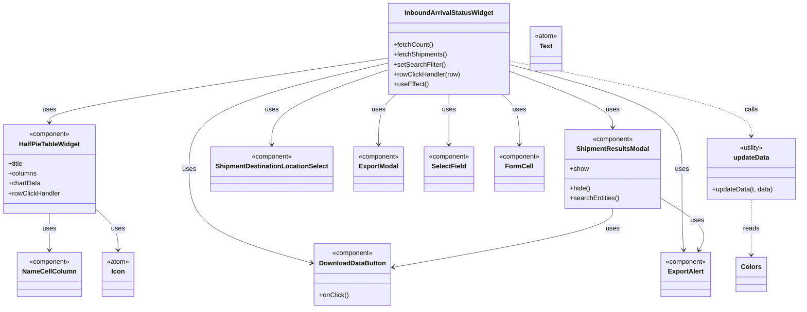

# Diagram: web/portal/src/pages/shipments/dashboard/components/organisms/InboundArrivalStatusWidget.organism.js


> Auto-generated by Obscura crawlers

## Diagram 1



> SVG rendering failed for this diagram.

## Diagram 2

```mermaid
flowchart LR
    A[Start: updateData(t, data)] --> B{For each item d}
    B --> C[Set translatedName = ""\nmodalName = ""\ntooltipContent = ""]
    C --> D[name = d.name?.toUpperCase() ?? ""]
    D --> E{name === "EARLY"}
    E -->|yes| F[translatedName = t("Early")\nmodalName = t("Early")\ntooltipContent = t("Arrival ... before lower bound")]
    E -->|no| G{name === "ONTIME"}
    G -->|yes| H[translatedName = t("On-time")\nmodalName = t("On-time")\ntooltipContent = t("Arrival ... +/- 15 minutes")]
    G -->|no| I{name === "LATE"}
    I -->|yes| J[translatedName = t("Late")\nmodalName = t("Late")\ntooltipContent = t("Arrival ... after lower bound")]
    I -->|no| K[leave translatedName/modalName/tooltipContent empty]
    F --> L[return object with fullDescription, fill from Colors.arrivalStatus[d.code]]
    H --> L
    J --> L
    K --> L
    L --> M[Next item or return mapped array]
```

> SVG rendering failed for this diagram.
