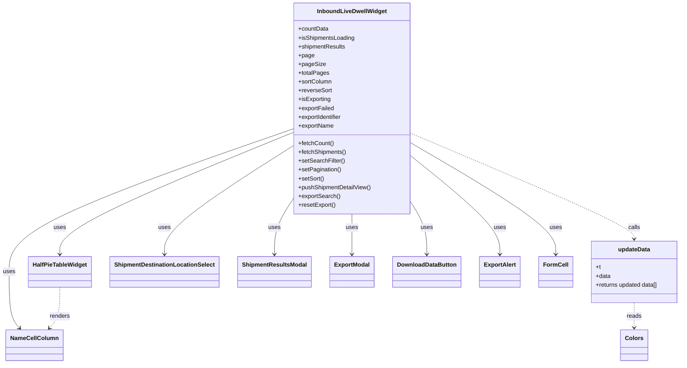

# Diagram: web/portal/src/pages/shipments/dashboard/components/organisms/InboundLiveDwellWidget.organism.js


> Auto-generated by Obscura crawlers

## Diagram 1



### SVG

<svg id="container" width="1814.3515625" xmlns="http://www.w3.org/2000/svg" class="classDiagram" height="992" viewBox="0 0 1814.3515625 992" role="graphics-document document" aria-roledescription="class"><style>#container{font-family:"trebuchet ms",verdana,arial,sans-serif;font-size:16px;fill:#333;}@keyframes edge-animation-frame{from{stroke-dashoffset:0;}}@keyframes dash{to{stroke-dashoffset:0;}}#container .edge-animation-slow{stroke-dasharray:9,5!important;stroke-dashoffset:900;animation:dash 50s linear infinite;stroke-linecap:round;}#container .edge-animation-fast{stroke-dasharray:9,5!important;stroke-dashoffset:900;animation:dash 20s linear infinite;stroke-linecap:round;}#container .error-icon{fill:#552222;}#container .error-text{fill:#552222;stroke:#552222;}#container .edge-thickness-normal{stroke-width:1px;}#container .edge-thickness-thick{stroke-width:3.5px;}#container .edge-pattern-solid{stroke-dasharray:0;}#container .edge-thickness-invisible{stroke-width:0;fill:none;}#container .edge-pattern-dashed{stroke-dasharray:3;}#container .edge-pattern-dotted{stroke-dasharray:2;}#container .marker{fill:#333333;stroke:#333333;}#container .marker.cross{stroke:#333333;}#container svg{font-family:"trebuchet ms",verdana,arial,sans-serif;font-size:16px;}#container p{margin:0;}#container g.classGroup text{fill:#9370DB;stroke:none;font-family:"trebuchet ms",verdana,arial,sans-serif;font-size:10px;}#container g.classGroup text .title{font-weight:bolder;}#container .nodeLabel,#container .edgeLabel{color:#131300;}#container .edgeLabel .label rect{fill:#ECECFF;}#container .label text{fill:#131300;}#container .labelBkg{background:#ECECFF;}#container .edgeLabel .label span{background:#ECECFF;}#container .classTitle{font-weight:bolder;}#container .node rect,#container .node circle,#container .node ellipse,#container .node polygon,#container .node path{fill:#ECECFF;stroke:#9370DB;stroke-width:1px;}#container .divider{stroke:#9370DB;stroke-width:1;}#container g.clickable{cursor:pointer;}#container g.classGroup rect{fill:#ECECFF;stroke:#9370DB;}#container g.classGroup line{stroke:#9370DB;stroke-width:1;}#container .classLabel .box{stroke:none;stroke-width:0;fill:#ECECFF;opacity:0.5;}#container .classLabel .label{fill:#9370DB;font-size:10px;}#container .relation{stroke:#333333;stroke-width:1;fill:none;}#container .dashed-line{stroke-dasharray:3;}#container .dotted-line{stroke-dasharray:1 2;}#container #compositionStart,#container .composition{fill:#333333!important;stroke:#333333!important;stroke-width:1;}#container #compositionEnd,#container .composition{fill:#333333!important;stroke:#333333!important;stroke-width:1;}#container #dependencyStart,#container .dependency{fill:#333333!important;stroke:#333333!important;stroke-width:1;}#container #dependencyStart,#container .dependency{fill:#333333!important;stroke:#333333!important;stroke-width:1;}#container #extensionStart,#container .extension{fill:transparent!important;stroke:#333333!important;stroke-width:1;}#container #extensionEnd,#container .extension{fill:transparent!important;stroke:#333333!important;stroke-width:1;}#container #aggregationStart,#container .aggregation{fill:transparent!important;stroke:#333333!important;stroke-width:1;}#container #aggregationEnd,#container .aggregation{fill:transparent!important;stroke:#333333!important;stroke-width:1;}#container #lollipopStart,#container .lollipop{fill:#ECECFF!important;stroke:#333333!important;stroke-width:1;}#container #lollipopEnd,#container .lollipop{fill:#ECECFF!important;stroke:#333333!important;stroke-width:1;}#container .edgeTerminals{font-size:11px;line-height:initial;}#container .classTitleText{text-anchor:middle;font-size:18px;fill:#333;}#container .label-icon{display:inline-block;height:1em;overflow:visible;vertical-align:-0.125em;}#container .node .label-icon path{fill:currentColor;stroke:revert;stroke-width:revert;}#container :root{--mermaid-font-family:"trebuchet ms",verdana,arial,sans-serif;}</style><g><defs><marker id="container_class-aggregationStart" class="marker aggregation class" refX="18" refY="7" markerWidth="190" markerHeight="240" orient="auto"><path d="M 18,7 L9,13 L1,7 L9,1 Z"></path></marker></defs><defs><marker id="container_class-aggregationEnd" class="marker aggregation class" refX="1" refY="7" markerWidth="20" markerHeight="28" orient="auto"><path d="M 18,7 L9,13 L1,7 L9,1 Z"></path></marker></defs><defs><marker id="container_class-extensionStart" class="marker extension class" refX="18" refY="7" markerWidth="190" markerHeight="240" orient="auto"><path d="M 1,7 L18,13 V 1 Z"></path></marker></defs><defs><marker id="container_class-extensionEnd" class="marker extension class" refX="1" refY="7" markerWidth="20" markerHeight="28" orient="auto"><path d="M 1,1 V 13 L18,7 Z"></path></marker></defs><defs><marker id="container_class-compositionStart" class="marker composition class" refX="18" refY="7" markerWidth="190" markerHeight="240" orient="auto"><path d="M 18,7 L9,13 L1,7 L9,1 Z"></path></marker></defs><defs><marker id="container_class-compositionEnd" class="marker composition class" refX="1" refY="7" markerWidth="20" markerHeight="28" orient="auto"><path d="M 18,7 L9,13 L1,7 L9,1 Z"></path></marker></defs><defs><marker id="container_class-dependencyStart" class="marker dependency class" refX="6" refY="7" markerWidth="190" markerHeight="240" orient="auto"><path d="M 5,7 L9,13 L1,7 L9,1 Z"></path></marker></defs><defs><marker id="container_class-dependencyEnd" class="marker dependency class" refX="13" refY="7" markerWidth="20" markerHeight="28" orient="auto"><path d="M 18,7 L9,13 L14,7 L9,1 Z"></path></marker></defs><defs><marker id="container_class-lollipopStart" class="marker lollipop class" refX="13" refY="7" markerWidth="190" markerHeight="240" orient="auto"><circle stroke="black" fill="transparent" cx="7" cy="7" r="6"></circle></marker></defs><defs><marker id="container_class-lollipopEnd" class="marker lollipop class" refX="1" refY="7" markerWidth="190" markerHeight="240" orient="auto"><circle stroke="black" fill="transparent" cx="7" cy="7" r="6"></circle></marker></defs><g class="root"><g class="clusters"></g><g class="edgePaths"><path d="M774.664,362.277L672.173,405.398C569.682,448.518,364.701,534.759,262.21,590.046C159.719,645.333,159.719,669.667,159.719,681.833L159.719,694" id="id_InboundLiveDwellWidget_HalfPieTableWidget_1" class="edge-thickness-normal edge-pattern-solid relation" style=";;;" data-edge="true" data-et="edge" data-id="id_InboundLiveDwellWidget_HalfPieTableWidget_1" data-points="W3sieCI6Nzc0LjY2NDA2MjUsInkiOjM2Mi4yNzcyOTQwMTE3NTE5Nn0seyJ4IjoxNTkuNzE4NzUsInkiOjYyMX0seyJ4IjoxNTkuNzE4NzUsInkiOjcwMH1d" marker-end="url(#container_class-dependencyEnd)"></path><path d="M774.664,399.395L718.392,436.329C662.12,473.264,549.576,547.132,493.303,596.233C437.031,645.333,437.031,669.667,437.031,681.833L437.031,694" id="id_InboundLiveDwellWidget_ShipmentDestinationLocationSelect_2" class="edge-thickness-normal edge-pattern-solid relation" style=";;;" data-edge="true" data-et="edge" data-id="id_InboundLiveDwellWidget_ShipmentDestinationLocationSelect_2" data-points="W3sieCI6Nzc0LjY2NDA2MjUsInkiOjM5OS4zOTUzMzkyOTcyNjU3Nn0seyJ4Ijo0MzcuMDMxMjUsInkiOjYyMX0seyJ4Ijo0MzcuMDMxMjUsInkiOjcwMH1d" marker-end="url(#container_class-dependencyEnd)"></path><path d="M774.664,545.697L766.746,558.248C758.828,570.798,742.992,595.899,735.074,620.616C727.156,645.333,727.156,669.667,727.156,681.833L727.156,694" id="id_InboundLiveDwellWidget_ShipmentResultsModal_3" class="edge-thickness-normal edge-pattern-solid relation" style=";;;" data-edge="true" data-et="edge" data-id="id_InboundLiveDwellWidget_ShipmentResultsModal_3" data-points="W3sieCI6Nzc0LjY2NDA2MjUsInkiOjU0NS42OTcwODUxNTkwNzc5fSx7IngiOjcyNy4xNTYyNSwieSI6NjIxfSx7IngiOjcyNy4xNTYyNSwieSI6NzAwfV0=" marker-end="url(#container_class-dependencyEnd)"></path><path d="M932.195,584L932.195,590.167C932.195,596.333,932.195,608.667,932.195,627C932.195,645.333,932.195,669.667,932.195,681.833L932.195,694" id="id_InboundLiveDwellWidget_ExportModal_4" class="edge-thickness-normal edge-pattern-solid relation" style=";;;" data-edge="true" data-et="edge" data-id="id_InboundLiveDwellWidget_ExportModal_4" data-points="W3sieCI6OTMyLjE5NTMxMjUsInkiOjU4NH0seyJ4Ijo5MzIuMTk1MzEyNSwieSI6NjIxfSx7IngiOjkzMi4xOTUzMTI1LCJ5Ijo3MDB9XQ==" marker-end="url(#container_class-dependencyEnd)"></path><path d="M1089.727,553.517L1096.607,564.764C1103.487,576.012,1117.247,598.506,1124.128,621.92C1131.008,645.333,1131.008,669.667,1131.008,681.833L1131.008,694" id="id_InboundLiveDwellWidget_DownloadDataButton_5" class="edge-thickness-normal edge-pattern-solid relation" style=";;;" data-edge="true" data-et="edge" data-id="id_InboundLiveDwellWidget_DownloadDataButton_5" data-points="W3sieCI6MTA4OS43MjY1NjI1LCJ5Ijo1NTMuNTE3MjkwMTYwMzI2OX0seyJ4IjoxMTMxLjAwNzgxMjUsInkiOjYyMX0seyJ4IjoxMTMxLjAwNzgxMjUsInkiOjcwMH1d" marker-end="url(#container_class-dependencyEnd)"></path><path d="M1089.727,426.289L1128.964,458.741C1168.201,491.193,1246.674,556.096,1285.911,600.715C1325.148,645.333,1325.148,669.667,1325.148,681.833L1325.148,694" id="id_InboundLiveDwellWidget_ExportAlert_6" class="edge-thickness-normal edge-pattern-solid relation" style=";;;" data-edge="true" data-et="edge" data-id="id_InboundLiveDwellWidget_ExportAlert_6" data-points="W3sieCI6MTA4OS43MjY1NjI1LCJ5Ijo0MjYuMjg5NDc0NzMwNjA1Nn0seyJ4IjoxMzI1LjE0ODQzNzUsInkiOjYyMX0seyJ4IjoxMzI1LjE0ODQzNzUsInkiOjcwMH1d" marker-end="url(#container_class-dependencyEnd)"></path><path d="M1089.727,390.698L1153.578,429.082C1217.43,467.465,1345.133,544.233,1408.984,594.783C1472.836,645.333,1472.836,669.667,1472.836,681.833L1472.836,694" id="id_InboundLiveDwellWidget_FormCell_7" class="edge-thickness-normal edge-pattern-solid relation" style=";;;" data-edge="true" data-et="edge" data-id="id_InboundLiveDwellWidget_FormCell_7" data-points="W3sieCI6MTA4OS43MjY1NjI1LCJ5IjozOTAuNjk4MTMwMTExODQ2NDd9LHsieCI6MTQ3Mi44MzU5Mzc1LCJ5Ijo2MjF9LHsieCI6MTQ3Mi44MzU5Mzc1LCJ5Ijo3MDB9XQ==" marker-end="url(#container_class-dependencyEnd)"></path><path d="M774.664,352.404L649.635,397.17C524.607,441.936,274.549,531.468,149.521,596.401C24.492,661.333,24.492,701.667,24.492,742C24.492,782.333,24.492,822.667,29.12,848.24C33.747,873.814,43.003,884.628,47.63,890.035L52.258,895.442" id="id_InboundLiveDwellWidget_NameCellColumn_8" class="edge-thickness-normal edge-pattern-solid relation" style=";;;" data-edge="true" data-et="edge" data-id="id_InboundLiveDwellWidget_NameCellColumn_8" data-points="W3sieCI6Nzc0LjY2NDA2MjUsInkiOjM1Mi40MDM1MjUzODE3MTU1NX0seyJ4IjoyNC40OTIxODc1LCJ5Ijo2MjF9LHsieCI6MjQuNDkyMTg3NSwieSI6NzQyfSx7IngiOjI0LjQ5MjE4NzUsInkiOjg2M30seyJ4Ijo1Ni4xNTkxNjczMjU5NDkzNywieSI6OTAwfV0=" marker-end="url(#container_class-dependencyEnd)"></path><path d="M1089.727,363.872L1189.193,406.726C1288.66,449.581,1487.594,535.291,1587.061,583.312C1686.527,631.333,1686.527,641.667,1686.527,646.833L1686.527,652" id="id_InboundLiveDwellWidget_updateData_9" class="edge-thickness-normal edge-pattern-dashed relation" style=";;;" data-edge="true" data-et="edge" data-id="id_InboundLiveDwellWidget_updateData_9" data-points="W3sieCI6MTA4OS43MjY1NjI1LCJ5IjozNjMuODcxNTEyOTc5NzE2MX0seyJ4IjoxNjg2LjUyNzM0Mzc1LCJ5Ijo2MjF9LHsieCI6MTY4Ni41MjczNDM3NSwieSI6NjU4fV0=" marker-end="url(#container_class-dependencyEnd)"></path><path d="M1686.527,826L1686.527,832.167C1686.527,838.333,1686.527,850.667,1686.527,862C1686.527,873.333,1686.527,883.667,1686.527,888.833L1686.527,894" id="id_updateData_Colors_10" class="edge-thickness-normal edge-pattern-dashed relation" style=";;;" data-edge="true" data-et="edge" data-id="id_updateData_Colors_10" data-points="W3sieCI6MTY4Ni41MjczNDM3NSwieSI6ODI2fSx7IngiOjE2ODYuNTI3MzQzNzUsInkiOjg2M30seyJ4IjoxNjg2LjUyNzM0Mzc1LCJ5Ijo5MDB9XQ==" marker-end="url(#container_class-dependencyEnd)"></path><path d="M159.719,784L159.719,797.167C159.719,810.333,159.719,836.667,155.091,855.24C150.464,873.814,141.208,884.628,136.581,890.035L131.953,895.442" id="id_HalfPieTableWidget_NameCellColumn_11" class="edge-thickness-normal edge-pattern-dashed relation" style=";;;" data-edge="true" data-et="edge" data-id="id_HalfPieTableWidget_NameCellColumn_11" data-points="W3sieCI6MTU5LjcxODc1LCJ5Ijo3ODR9LHsieCI6MTU5LjcxODc1LCJ5Ijo4NjN9LHsieCI6MTI4LjA1MTc3MDE3NDA1MDYzLCJ5Ijo5MDB9XQ==" marker-end="url(#container_class-dependencyEnd)"></path></g><g class="edgeLabels"><g class="edgeLabel" transform="translate(159.71875, 621)"><g class="label" data-id="id_InboundLiveDwellWidget_HalfPieTableWidget_1" transform="translate(-16.4921875, -12)"><foreignObject width="32.984375" height="24"><div xmlns="http://www.w3.org/1999/xhtml" class="labelBkg" style="display: table-cell; white-space: nowrap; line-height: 1.5; max-width: 200px; text-align: center;"><span class="edgeLabel"><p>uses</p></span></div></foreignObject></g></g><g class="edgeLabel" transform="translate(437.03125, 621)"><g class="label" data-id="id_InboundLiveDwellWidget_ShipmentDestinationLocationSelect_2" transform="translate(-16.4921875, -12)"><foreignObject width="32.984375" height="24"><div xmlns="http://www.w3.org/1999/xhtml" class="labelBkg" style="display: table-cell; white-space: nowrap; line-height: 1.5; max-width: 200px; text-align: center;"><span class="edgeLabel"><p>uses</p></span></div></foreignObject></g></g><g class="edgeLabel" transform="translate(727.15625, 621)"><g class="label" data-id="id_InboundLiveDwellWidget_ShipmentResultsModal_3" transform="translate(-16.4921875, -12)"><foreignObject width="32.984375" height="24"><div xmlns="http://www.w3.org/1999/xhtml" class="labelBkg" style="display: table-cell; white-space: nowrap; line-height: 1.5; max-width: 200px; text-align: center;"><span class="edgeLabel"><p>uses</p></span></div></foreignObject></g></g><g class="edgeLabel" transform="translate(932.1953125, 621)"><g class="label" data-id="id_InboundLiveDwellWidget_ExportModal_4" transform="translate(-16.4921875, -12)"><foreignObject width="32.984375" height="24"><div xmlns="http://www.w3.org/1999/xhtml" class="labelBkg" style="display: table-cell; white-space: nowrap; line-height: 1.5; max-width: 200px; text-align: center;"><span class="edgeLabel"><p>uses</p></span></div></foreignObject></g></g><g class="edgeLabel" transform="translate(1131.0078125, 621)"><g class="label" data-id="id_InboundLiveDwellWidget_DownloadDataButton_5" transform="translate(-16.4921875, -12)"><foreignObject width="32.984375" height="24"><div xmlns="http://www.w3.org/1999/xhtml" class="labelBkg" style="display: table-cell; white-space: nowrap; line-height: 1.5; max-width: 200px; text-align: center;"><span class="edgeLabel"><p>uses</p></span></div></foreignObject></g></g><g class="edgeLabel" transform="translate(1325.1484375, 621)"><g class="label" data-id="id_InboundLiveDwellWidget_ExportAlert_6" transform="translate(-16.4921875, -12)"><foreignObject width="32.984375" height="24"><div xmlns="http://www.w3.org/1999/xhtml" class="labelBkg" style="display: table-cell; white-space: nowrap; line-height: 1.5; max-width: 200px; text-align: center;"><span class="edgeLabel"><p>uses</p></span></div></foreignObject></g></g><g class="edgeLabel" transform="translate(1472.8359375, 621)"><g class="label" data-id="id_InboundLiveDwellWidget_FormCell_7" transform="translate(-16.4921875, -12)"><foreignObject width="32.984375" height="24"><div xmlns="http://www.w3.org/1999/xhtml" class="labelBkg" style="display: table-cell; white-space: nowrap; line-height: 1.5; max-width: 200px; text-align: center;"><span class="edgeLabel"><p>uses</p></span></div></foreignObject></g></g><g class="edgeLabel" transform="translate(24.4921875, 742)"><g class="label" data-id="id_InboundLiveDwellWidget_NameCellColumn_8" transform="translate(-16.4921875, -12)"><foreignObject width="32.984375" height="24"><div xmlns="http://www.w3.org/1999/xhtml" class="labelBkg" style="display: table-cell; white-space: nowrap; line-height: 1.5; max-width: 200px; text-align: center;"><span class="edgeLabel"><p>uses</p></span></div></foreignObject></g></g><g class="edgeLabel" transform="translate(1686.52734375, 621)"><g class="label" data-id="id_InboundLiveDwellWidget_updateData_9" transform="translate(-16.4453125, -12)"><foreignObject width="32.890625" height="24"><div xmlns="http://www.w3.org/1999/xhtml" class="labelBkg" style="display: table-cell; white-space: nowrap; line-height: 1.5; max-width: 200px; text-align: center;"><span class="edgeLabel"><p>calls</p></span></div></foreignObject></g></g><g class="edgeLabel" transform="translate(1686.52734375, 863)"><g class="label" data-id="id_updateData_Colors_10" transform="translate(-20.0078125, -12)"><foreignObject width="40.015625" height="24"><div xmlns="http://www.w3.org/1999/xhtml" class="labelBkg" style="display: table-cell; white-space: nowrap; line-height: 1.5; max-width: 200px; text-align: center;"><span class="edgeLabel"><p>reads</p></span></div></foreignObject></g></g><g class="edgeLabel" transform="translate(159.71875, 863)"><g class="label" data-id="id_HalfPieTableWidget_NameCellColumn_11" transform="translate(-27.75, -12)"><foreignObject width="55.5" height="24"><div xmlns="http://www.w3.org/1999/xhtml" class="labelBkg" style="display: table-cell; white-space: nowrap; line-height: 1.5; max-width: 200px; text-align: center;"><span class="edgeLabel"><p>renders</p></span></div></foreignObject></g></g></g><g class="nodes"><g class="node default" id="classId-InboundLiveDwellWidget-0" transform="translate(932.1953125, 296)"><g class="basic label-container"><path d="M-157.53125 -288 L157.53125 -288 L157.53125 288 L-157.53125 288" stroke="none" stroke-width="0" fill="#ECECFF" style=""></path><path d="M-157.53125 -288 C-46.52346380111109 -288, 64.48432239777782 -288, 157.53125 -288 M-157.53125 -288 C-75.71030038255829 -288, 6.110649234883425 -288, 157.53125 -288 M157.53125 -288 C157.53125 -143.63707303129348, 157.53125 0.725853937413035, 157.53125 288 M157.53125 -288 C157.53125 -136.33252147205707, 157.53125 15.334957055885866, 157.53125 288 M157.53125 288 C60.46096978975619 288, -36.60931042048762 288, -157.53125 288 M157.53125 288 C60.3224816365816 288, -36.8862867268368 288, -157.53125 288 M-157.53125 288 C-157.53125 116.73563878917574, -157.53125 -54.528722421648524, -157.53125 -288 M-157.53125 288 C-157.53125 97.86183829098775, -157.53125 -92.2763234180245, -157.53125 -288" stroke="#9370DB" stroke-width="1.3" fill="none" stroke-dasharray="0 0" style=""></path></g><g class="annotation-group text" transform="translate(0, -264)"></g><g class="label-group text" transform="translate(-91.15625, -264)"><g class="label" style="font-weight: bolder" transform="translate(0,-12)"><foreignObject width="182.3125" height="24"><div xmlns="http://www.w3.org/1999/xhtml" style="display: table-cell; white-space: nowrap; line-height: 1.5; max-width: 230px; text-align: center;"><span class="nodeLabel markdown-node-label" style=""><p>InboundLiveDwellWidget</p></span></div></foreignObject></g></g><g class="members-group text" transform="translate(-145.53125, -216)"><g class="label" style="" transform="translate(0,-12)"><foreignObject width="82.34375" height="24"><div xmlns="http://www.w3.org/1999/xhtml" style="display: table-cell; white-space: nowrap; line-height: 1.5; max-width: 140px; text-align: center;"><span class="nodeLabel markdown-node-label" style=""><p>+countData</p></span></div></foreignObject></g><g class="label" style="" transform="translate(0,12)"><foreignObject width="154.375" height="24"><div xmlns="http://www.w3.org/1999/xhtml" style="display: table-cell; white-space: nowrap; line-height: 1.5; max-width: 212px; text-align: center;"><span class="nodeLabel markdown-node-label" style=""><p>+isShipmentsLoading</p></span></div></foreignObject></g><g class="label" style="" transform="translate(0,36)"><foreignObject width="129.3125" height="24"><div xmlns="http://www.w3.org/1999/xhtml" style="display: table-cell; white-space: nowrap; line-height: 1.5; max-width: 187px; text-align: center;"><span class="nodeLabel markdown-node-label" style=""><p>+shipmentResults</p></span></div></foreignObject></g><g class="label" style="" transform="translate(0,60)"><foreignObject width="42.65625" height="24"><div xmlns="http://www.w3.org/1999/xhtml" style="display: table-cell; white-space: nowrap; line-height: 1.5; max-width: 100px; text-align: center;"><span class="nodeLabel markdown-node-label" style=""><p>+page</p></span></div></foreignObject></g><g class="label" style="" transform="translate(0,84)"><foreignObject width="71.5" height="24"><div xmlns="http://www.w3.org/1999/xhtml" style="display: table-cell; white-space: nowrap; line-height: 1.5; max-width: 129px; text-align: center;"><span class="nodeLabel markdown-node-label" style=""><p>+pageSize</p></span></div></foreignObject></g><g class="label" style="" transform="translate(0,108)"><foreignObject width="82.90625" height="24"><div xmlns="http://www.w3.org/1999/xhtml" style="display: table-cell; white-space: nowrap; line-height: 1.5; max-width: 140px; text-align: center;"><span class="nodeLabel markdown-node-label" style=""><p>+totalPages</p></span></div></foreignObject></g><g class="label" style="" transform="translate(0,132)"><foreignObject width="91.828125" height="24"><div xmlns="http://www.w3.org/1999/xhtml" style="display: table-cell; white-space: nowrap; line-height: 1.5; max-width: 149px; text-align: center;"><span class="nodeLabel markdown-node-label" style=""><p>+sortColumn</p></span></div></foreignObject></g><g class="label" style="" transform="translate(0,156)"><foreignObject width="91.015625" height="24"><div xmlns="http://www.w3.org/1999/xhtml" style="display: table-cell; white-space: nowrap; line-height: 1.5; max-width: 149px; text-align: center;"><span class="nodeLabel markdown-node-label" style=""><p>+reverseSort</p></span></div></foreignObject></g><g class="label" style="" transform="translate(0,180)"><foreignObject width="89.296875" height="24"><div xmlns="http://www.w3.org/1999/xhtml" style="display: table-cell; white-space: nowrap; line-height: 1.5; max-width: 147px; text-align: center;"><span class="nodeLabel markdown-node-label" style=""><p>+isExporting</p></span></div></foreignObject></g><g class="label" style="" transform="translate(0,204)"><foreignObject width="98.140625" height="24"><div xmlns="http://www.w3.org/1999/xhtml" style="display: table-cell; white-space: nowrap; line-height: 1.5; max-width: 156px; text-align: center;"><span class="nodeLabel markdown-node-label" style=""><p>+exportFailed</p></span></div></foreignObject></g><g class="label" style="" transform="translate(0,228)"><foreignObject width="121.890625" height="24"><div xmlns="http://www.w3.org/1999/xhtml" style="display: table-cell; white-space: nowrap; line-height: 1.5; max-width: 180px; text-align: center;"><span class="nodeLabel markdown-node-label" style=""><p>+exportIdentifier</p></span></div></foreignObject></g><g class="label" style="" transform="translate(0,252)"><foreignObject width="97.1875" height="24"><div xmlns="http://www.w3.org/1999/xhtml" style="display: table-cell; white-space: nowrap; line-height: 1.5; max-width: 155px; text-align: center;"><span class="nodeLabel markdown-node-label" style=""><p>+exportName</p></span></div></foreignObject></g></g><g class="methods-group text" transform="translate(-145.53125, 96)"><g class="label" style="" transform="translate(0,-12)"><foreignObject width="97.046875" height="24"><div xmlns="http://www.w3.org/1999/xhtml" style="display: table-cell; white-space: nowrap; line-height: 1.5; max-width: 154px; text-align: center;"><span class="nodeLabel markdown-node-label" style=""><p>+fetchCount()</p></span></div></foreignObject></g><g class="label" style="" transform="translate(0,12)"><foreignObject width="131.765625" height="24"><div xmlns="http://www.w3.org/1999/xhtml" style="display: table-cell; white-space: nowrap; line-height: 1.5; max-width: 189px; text-align: center;"><span class="nodeLabel markdown-node-label" style=""><p>+fetchShipments()</p></span></div></foreignObject></g><g class="label" style="" transform="translate(0,36)"><foreignObject width="125.953125" height="24"><div xmlns="http://www.w3.org/1999/xhtml" style="display: table-cell; white-space: nowrap; line-height: 1.5; max-width: 183px; text-align: center;"><span class="nodeLabel markdown-node-label" style=""><p>+setSearchFilter()</p></span></div></foreignObject></g><g class="label" style="" transform="translate(0,60)"><foreignObject width="117.203125" height="24"><div xmlns="http://www.w3.org/1999/xhtml" style="display: table-cell; white-space: nowrap; line-height: 1.5; max-width: 175px; text-align: center;"><span class="nodeLabel markdown-node-label" style=""><p>+setPagination()</p></span></div></foreignObject></g><g class="label" style="" transform="translate(0,84)"><foreignObject width="70.34375" height="24"><div xmlns="http://www.w3.org/1999/xhtml" style="display: table-cell; white-space: nowrap; line-height: 1.5; max-width: 128px; text-align: center;"><span class="nodeLabel markdown-node-label" style=""><p>+setSort()</p></span></div></foreignObject></g><g class="label" style="" transform="translate(0,108)"><foreignObject width="199.90625" height="24"><div xmlns="http://www.w3.org/1999/xhtml" style="display: table-cell; white-space: nowrap; line-height: 1.5; max-width: 257px; text-align: center;"><span class="nodeLabel markdown-node-label" style=""><p>+pushShipmentDetailView()</p></span></div></foreignObject></g><g class="label" style="" transform="translate(0,132)"><foreignObject width="114.203125" height="24"><div xmlns="http://www.w3.org/1999/xhtml" style="display: table-cell; white-space: nowrap; line-height: 1.5; max-width: 172px; text-align: center;"><span class="nodeLabel markdown-node-label" style=""><p>+exportSearch()</p></span></div></foreignObject></g><g class="label" style="" transform="translate(0,156)"><foreignObject width="101.859375" height="24"><div xmlns="http://www.w3.org/1999/xhtml" style="display: table-cell; white-space: nowrap; line-height: 1.5; max-width: 159px; text-align: center;"><span class="nodeLabel markdown-node-label" style=""><p>+resetExport()</p></span></div></foreignObject></g></g><g class="divider" style=""><path d="M-157.53125 -240 C-49.212750049177245 -240, 59.10574990164551 -240, 157.53125 -240 M-157.53125 -240 C-40.43581216188812 -240, 76.65962567622375 -240, 157.53125 -240" stroke="#9370DB" stroke-width="1.3" fill="none" stroke-dasharray="0 0" style=""></path></g><g class="divider" style=""><path d="M-157.53125 72 C-68.24857427970312 72, 21.03410144059376 72, 157.53125 72 M-157.53125 72 C-78.97118646537291 72, -0.41112293074581885 72, 157.53125 72" stroke="#9370DB" stroke-width="1.3" fill="none" stroke-dasharray="0 0" style=""></path></g></g><g class="node default" id="classId-updateData-1" transform="translate(1686.52734375, 742)"><g class="basic label-container"><path d="M-119.82421875 -84 L119.82421875 -84 L119.82421875 84 L-119.82421875 84" stroke="none" stroke-width="0" fill="#ECECFF" style=""></path><path d="M-119.82421875 -84 C-34.807327809436416 -84, 50.20956313112717 -84, 119.82421875 -84 M-119.82421875 -84 C-42.02340156842918 -84, 35.77741561314164 -84, 119.82421875 -84 M119.82421875 -84 C119.82421875 -22.963797960257196, 119.82421875 38.07240407948561, 119.82421875 84 M119.82421875 -84 C119.82421875 -27.403379828087303, 119.82421875 29.193240343825394, 119.82421875 84 M119.82421875 84 C24.91961157089665 84, -69.9849956082067 84, -119.82421875 84 M119.82421875 84 C29.92863344028187 84, -59.96695186943626 84, -119.82421875 84 M-119.82421875 84 C-119.82421875 45.85853777090237, -119.82421875 7.717075541804746, -119.82421875 -84 M-119.82421875 84 C-119.82421875 38.88230548217418, -119.82421875 -6.235389035651636, -119.82421875 -84" stroke="#9370DB" stroke-width="1.3" fill="none" stroke-dasharray="0 0" style=""></path></g><g class="annotation-group text" transform="translate(0, -60)"></g><g class="label-group text" transform="translate(-42.7890625, -60)"><g class="label" style="font-weight: bolder" transform="translate(0,-12)"><foreignObject width="85.578125" height="24"><div xmlns="http://www.w3.org/1999/xhtml" style="display: table-cell; white-space: nowrap; line-height: 1.5; max-width: 135px; text-align: center;"><span class="nodeLabel markdown-node-label" style=""><p>updateData</p></span></div></foreignObject></g></g><g class="members-group text" transform="translate(-107.82421875, -12)"><g class="label" style="" transform="translate(0,-12)"><foreignObject width="13.6875" height="24"><div xmlns="http://www.w3.org/1999/xhtml" style="display: table-cell; white-space: nowrap; line-height: 1.5; max-width: 71px; text-align: center;"><span class="nodeLabel markdown-node-label" style=""><p>+t</p></span></div></foreignObject></g><g class="label" style="" transform="translate(0,12)"><foreignObject width="40.625" height="24"><div xmlns="http://www.w3.org/1999/xhtml" style="display: table-cell; white-space: nowrap; line-height: 1.5; max-width: 98px; text-align: center;"><span class="nodeLabel markdown-node-label" style=""><p>+data</p></span></div></foreignObject></g><g class="label" style="" transform="translate(0,36)"><foreignObject width="172.859375" height="24"><div xmlns="http://www.w3.org/1999/xhtml" style="display: table-cell; white-space: nowrap; line-height: 1.5; max-width: 230px; text-align: center;"><span class="nodeLabel markdown-node-label" style=""><p>+returns updated data[]</p></span></div></foreignObject></g></g><g class="methods-group text" transform="translate(-107.82421875, 84)"></g><g class="divider" style=""><path d="M-119.82421875 -36 C-40.42452156288367 -36, 38.97517562423266 -36, 119.82421875 -36 M-119.82421875 -36 C-68.73363297718099 -36, -17.643047204361977 -36, 119.82421875 -36" stroke="#9370DB" stroke-width="1.3" fill="none" stroke-dasharray="0 0" style=""></path></g><g class="divider" style=""><path d="M-119.82421875 60 C-35.93156821602072 60, 47.96108231795856 60, 119.82421875 60 M-119.82421875 60 C-64.29452663614535 60, -8.764834522290684 60, 119.82421875 60" stroke="#9370DB" stroke-width="1.3" fill="none" stroke-dasharray="0 0" style=""></path></g></g><g class="node default" id="classId-HalfPieTableWidget-2" transform="translate(159.71875, 742)"><g class="basic label-container"><path d="M-83.734375 -42 L83.734375 -42 L83.734375 42 L-83.734375 42" stroke="none" stroke-width="0" fill="#ECECFF" style=""></path><path d="M-83.734375 -42 C-31.99688049004594 -42, 19.740614019908122 -42, 83.734375 -42 M-83.734375 -42 C-22.360185713192216 -42, 39.01400357361557 -42, 83.734375 -42 M83.734375 -42 C83.734375 -22.398881506356663, 83.734375 -2.7977630127133253, 83.734375 42 M83.734375 -42 C83.734375 -12.139230419202875, 83.734375 17.72153916159425, 83.734375 42 M83.734375 42 C18.527462478676128 42, -46.679450042647744 42, -83.734375 42 M83.734375 42 C47.99637951215337 42, 12.258384024306736 42, -83.734375 42 M-83.734375 42 C-83.734375 17.158468401028397, -83.734375 -7.683063197943206, -83.734375 -42 M-83.734375 42 C-83.734375 11.568399001390649, -83.734375 -18.863201997218702, -83.734375 -42" stroke="#9370DB" stroke-width="1.3" fill="none" stroke-dasharray="0 0" style=""></path></g><g class="annotation-group text" transform="translate(0, -18)"></g><g class="label-group text" transform="translate(-71.734375, -18)"><g class="label" style="font-weight: bolder" transform="translate(0,-12)"><foreignObject width="143.46875" height="24"><div xmlns="http://www.w3.org/1999/xhtml" style="display: table-cell; white-space: nowrap; line-height: 1.5; max-width: 191px; text-align: center;"><span class="nodeLabel markdown-node-label" style=""><p>HalfPieTableWidget</p></span></div></foreignObject></g></g><g class="members-group text" transform="translate(-71.734375, 30)"></g><g class="methods-group text" transform="translate(-71.734375, 60)"></g><g class="divider" style=""><path d="M-83.734375 6 C-47.46698942945203 6, -11.199603858904055 6, 83.734375 6 M-83.734375 6 C-38.37169489516947 6, 6.990985209661062 6, 83.734375 6" stroke="#9370DB" stroke-width="1.3" fill="none" stroke-dasharray="0 0" style=""></path></g><g class="divider" style=""><path d="M-83.734375 24 C-37.94810839148893 24, 7.838158217022141 24, 83.734375 24 M-83.734375 24 C-23.499948555651308 24, 36.734477888697384 24, 83.734375 24" stroke="#9370DB" stroke-width="1.3" fill="none" stroke-dasharray="0 0" style=""></path></g></g><g class="node default" id="classId-ShipmentDestinationLocationSelect-3" transform="translate(437.03125, 742)"><g class="basic label-container"><path d="M-143.578125 -42 L143.578125 -42 L143.578125 42 L-143.578125 42" stroke="none" stroke-width="0" fill="#ECECFF" style=""></path><path d="M-143.578125 -42 C-73.83827316513376 -42, -4.098421330267513 -42, 143.578125 -42 M-143.578125 -42 C-77.44642216548883 -42, -11.314719330977653 -42, 143.578125 -42 M143.578125 -42 C143.578125 -17.357538010725072, 143.578125 7.284923978549855, 143.578125 42 M143.578125 -42 C143.578125 -23.65586622034242, 143.578125 -5.3117324406848425, 143.578125 42 M143.578125 42 C49.40545571616465 42, -44.767213567670694 42, -143.578125 42 M143.578125 42 C39.04330076178445 42, -65.4915234764311 42, -143.578125 42 M-143.578125 42 C-143.578125 11.264851527573363, -143.578125 -19.470296944853274, -143.578125 -42 M-143.578125 42 C-143.578125 8.883831664492938, -143.578125 -24.232336671014124, -143.578125 -42" stroke="#9370DB" stroke-width="1.3" fill="none" stroke-dasharray="0 0" style=""></path></g><g class="annotation-group text" transform="translate(0, -18)"></g><g class="label-group text" transform="translate(-131.578125, -18)"><g class="label" style="font-weight: bolder" transform="translate(0,-12)"><foreignObject width="263.15625" height="24"><div xmlns="http://www.w3.org/1999/xhtml" style="display: table-cell; white-space: nowrap; line-height: 1.5; max-width: 310px; text-align: center;"><span class="nodeLabel markdown-node-label" style=""><p>ShipmentDestinationLocationSelect</p></span></div></foreignObject></g></g><g class="members-group text" transform="translate(-131.578125, 30)"></g><g class="methods-group text" transform="translate(-131.578125, 60)"></g><g class="divider" style=""><path d="M-143.578125 6 C-66.92640635189122 6, 9.725312296217567 6, 143.578125 6 M-143.578125 6 C-56.10694620705911 6, 31.36423258588178 6, 143.578125 6" stroke="#9370DB" stroke-width="1.3" fill="none" stroke-dasharray="0 0" style=""></path></g><g class="divider" style=""><path d="M-143.578125 24 C-51.04779577725702 24, 41.482533445485956 24, 143.578125 24 M-143.578125 24 C-62.22849827083125 24, 19.121128458337495 24, 143.578125 24" stroke="#9370DB" stroke-width="1.3" fill="none" stroke-dasharray="0 0" style=""></path></g></g><g class="node default" id="classId-ShipmentResultsModal-4" transform="translate(727.15625, 742)"><g class="basic label-container"><path d="M-96.546875 -42 L96.546875 -42 L96.546875 42 L-96.546875 42" stroke="none" stroke-width="0" fill="#ECECFF" style=""></path><path d="M-96.546875 -42 C-21.0573432569593 -42, 54.4321884860814 -42, 96.546875 -42 M-96.546875 -42 C-23.92767967026451 -42, 48.69151565947098 -42, 96.546875 -42 M96.546875 -42 C96.546875 -14.654504890163363, 96.546875 12.690990219673274, 96.546875 42 M96.546875 -42 C96.546875 -21.787242416222348, 96.546875 -1.5744848324446963, 96.546875 42 M96.546875 42 C35.16061146946999 42, -26.225652061060018 42, -96.546875 42 M96.546875 42 C23.700071779045473 42, -49.146731441909054 42, -96.546875 42 M-96.546875 42 C-96.546875 12.055499202311236, -96.546875 -17.88900159537753, -96.546875 -42 M-96.546875 42 C-96.546875 21.76206094282496, -96.546875 1.5241218856499188, -96.546875 -42" stroke="#9370DB" stroke-width="1.3" fill="none" stroke-dasharray="0 0" style=""></path></g><g class="annotation-group text" transform="translate(0, -18)"></g><g class="label-group text" transform="translate(-84.546875, -18)"><g class="label" style="font-weight: bolder" transform="translate(0,-12)"><foreignObject width="169.09375" height="24"><div xmlns="http://www.w3.org/1999/xhtml" style="display: table-cell; white-space: nowrap; line-height: 1.5; max-width: 217px; text-align: center;"><span class="nodeLabel markdown-node-label" style=""><p>ShipmentResultsModal</p></span></div></foreignObject></g></g><g class="members-group text" transform="translate(-84.546875, 30)"></g><g class="methods-group text" transform="translate(-84.546875, 60)"></g><g class="divider" style=""><path d="M-96.546875 6 C-56.31576628857551 6, -16.08465757715102 6, 96.546875 6 M-96.546875 6 C-39.854811737839185 6, 16.83725152432163 6, 96.546875 6" stroke="#9370DB" stroke-width="1.3" fill="none" stroke-dasharray="0 0" style=""></path></g><g class="divider" style=""><path d="M-96.546875 24 C-47.206805229350365 24, 2.133264541299269 24, 96.546875 24 M-96.546875 24 C-48.0532215678867 24, 0.4404318642265963 24, 96.546875 24" stroke="#9370DB" stroke-width="1.3" fill="none" stroke-dasharray="0 0" style=""></path></g></g><g class="node default" id="classId-ExportModal-5" transform="translate(932.1953125, 742)"><g class="basic label-container"><path d="M-58.4921875 -42 L58.4921875 -42 L58.4921875 42 L-58.4921875 42" stroke="none" stroke-width="0" fill="#ECECFF" style=""></path><path d="M-58.4921875 -42 C-31.794008380267282 -42, -5.095829260534565 -42, 58.4921875 -42 M-58.4921875 -42 C-14.596798813302158 -42, 29.298589873395684 -42, 58.4921875 -42 M58.4921875 -42 C58.4921875 -13.071924143432721, 58.4921875 15.856151713134558, 58.4921875 42 M58.4921875 -42 C58.4921875 -19.311183976402646, 58.4921875 3.3776320471947088, 58.4921875 42 M58.4921875 42 C27.111967600677136 42, -4.268252298645727 42, -58.4921875 42 M58.4921875 42 C27.13880783395216 42, -4.214571832095679 42, -58.4921875 42 M-58.4921875 42 C-58.4921875 11.96305096419557, -58.4921875 -18.07389807160886, -58.4921875 -42 M-58.4921875 42 C-58.4921875 15.142420734015602, -58.4921875 -11.715158531968797, -58.4921875 -42" stroke="#9370DB" stroke-width="1.3" fill="none" stroke-dasharray="0 0" style=""></path></g><g class="annotation-group text" transform="translate(0, -18)"></g><g class="label-group text" transform="translate(-46.4921875, -18)"><g class="label" style="font-weight: bolder" transform="translate(0,-12)"><foreignObject width="92.984375" height="24"><div xmlns="http://www.w3.org/1999/xhtml" style="display: table-cell; white-space: nowrap; line-height: 1.5; max-width: 142px; text-align: center;"><span class="nodeLabel markdown-node-label" style=""><p>ExportModal</p></span></div></foreignObject></g></g><g class="members-group text" transform="translate(-46.4921875, 30)"></g><g class="methods-group text" transform="translate(-46.4921875, 60)"></g><g class="divider" style=""><path d="M-58.4921875 6 C-19.189403411306586 6, 20.11338067738683 6, 58.4921875 6 M-58.4921875 6 C-19.706808963165486 6, 19.07856957366903 6, 58.4921875 6" stroke="#9370DB" stroke-width="1.3" fill="none" stroke-dasharray="0 0" style=""></path></g><g class="divider" style=""><path d="M-58.4921875 24 C-13.518141335433285 24, 31.45590482913343 24, 58.4921875 24 M-58.4921875 24 C-33.749689644919826 24, -9.007191789839645 24, 58.4921875 24" stroke="#9370DB" stroke-width="1.3" fill="none" stroke-dasharray="0 0" style=""></path></g></g><g class="node default" id="classId-DownloadDataButton-6" transform="translate(1131.0078125, 742)"><g class="basic label-container"><path d="M-90.3203125 -42 L90.3203125 -42 L90.3203125 42 L-90.3203125 42" stroke="none" stroke-width="0" fill="#ECECFF" style=""></path><path d="M-90.3203125 -42 C-53.865594942320264 -42, -17.41087738464053 -42, 90.3203125 -42 M-90.3203125 -42 C-20.092621062323644 -42, 50.13507037535271 -42, 90.3203125 -42 M90.3203125 -42 C90.3203125 -22.318668868761424, 90.3203125 -2.6373377375228486, 90.3203125 42 M90.3203125 -42 C90.3203125 -12.160915652194888, 90.3203125 17.678168695610225, 90.3203125 42 M90.3203125 42 C36.97094923546094 42, -16.378414029078115 42, -90.3203125 42 M90.3203125 42 C40.1718382261051 42, -9.976636047789796 42, -90.3203125 42 M-90.3203125 42 C-90.3203125 22.131134848288866, -90.3203125 2.2622696965777322, -90.3203125 -42 M-90.3203125 42 C-90.3203125 11.373269646622209, -90.3203125 -19.253460706755583, -90.3203125 -42" stroke="#9370DB" stroke-width="1.3" fill="none" stroke-dasharray="0 0" style=""></path></g><g class="annotation-group text" transform="translate(0, -18)"></g><g class="label-group text" transform="translate(-78.3203125, -18)"><g class="label" style="font-weight: bolder" transform="translate(0,-12)"><foreignObject width="156.640625" height="24"><div xmlns="http://www.w3.org/1999/xhtml" style="display: table-cell; white-space: nowrap; line-height: 1.5; max-width: 205px; text-align: center;"><span class="nodeLabel markdown-node-label" style=""><p>DownloadDataButton</p></span></div></foreignObject></g></g><g class="members-group text" transform="translate(-78.3203125, 30)"></g><g class="methods-group text" transform="translate(-78.3203125, 60)"></g><g class="divider" style=""><path d="M-90.3203125 6 C-23.60314841156665 6, 43.1140156768667 6, 90.3203125 6 M-90.3203125 6 C-46.283290683397745 6, -2.2462688667954893 6, 90.3203125 6" stroke="#9370DB" stroke-width="1.3" fill="none" stroke-dasharray="0 0" style=""></path></g><g class="divider" style=""><path d="M-90.3203125 24 C-21.91074687285615 24, 46.4988187542877 24, 90.3203125 24 M-90.3203125 24 C-50.529182111411956 24, -10.738051722823911 24, 90.3203125 24" stroke="#9370DB" stroke-width="1.3" fill="none" stroke-dasharray="0 0" style=""></path></g></g><g class="node default" id="classId-ExportAlert-7" transform="translate(1325.1484375, 742)"><g class="basic label-container"><path d="M-53.8203125 -42 L53.8203125 -42 L53.8203125 42 L-53.8203125 42" stroke="none" stroke-width="0" fill="#ECECFF" style=""></path><path d="M-53.8203125 -42 C-32.02481879297946 -42, -10.229325085958926 -42, 53.8203125 -42 M-53.8203125 -42 C-11.233063194641169 -42, 31.354186110717663 -42, 53.8203125 -42 M53.8203125 -42 C53.8203125 -11.136148955311338, 53.8203125 19.727702089377324, 53.8203125 42 M53.8203125 -42 C53.8203125 -24.247576475041015, 53.8203125 -6.49515295008203, 53.8203125 42 M53.8203125 42 C23.48959980118993 42, -6.8411128976201425 42, -53.8203125 42 M53.8203125 42 C16.534446094515268 42, -20.751420310969465 42, -53.8203125 42 M-53.8203125 42 C-53.8203125 21.264420695551095, -53.8203125 0.5288413911021905, -53.8203125 -42 M-53.8203125 42 C-53.8203125 13.249129743982571, -53.8203125 -15.501740512034857, -53.8203125 -42" stroke="#9370DB" stroke-width="1.3" fill="none" stroke-dasharray="0 0" style=""></path></g><g class="annotation-group text" transform="translate(0, -18)"></g><g class="label-group text" transform="translate(-41.8203125, -18)"><g class="label" style="font-weight: bolder" transform="translate(0,-12)"><foreignObject width="83.640625" height="24"><div xmlns="http://www.w3.org/1999/xhtml" style="display: table-cell; white-space: nowrap; line-height: 1.5; max-width: 132px; text-align: center;"><span class="nodeLabel markdown-node-label" style=""><p>ExportAlert</p></span></div></foreignObject></g></g><g class="members-group text" transform="translate(-41.8203125, 30)"></g><g class="methods-group text" transform="translate(-41.8203125, 60)"></g><g class="divider" style=""><path d="M-53.8203125 6 C-29.07958329898998 6, -4.3388540979799615 6, 53.8203125 6 M-53.8203125 6 C-14.722218029523901 6, 24.375876440952197 6, 53.8203125 6" stroke="#9370DB" stroke-width="1.3" fill="none" stroke-dasharray="0 0" style=""></path></g><g class="divider" style=""><path d="M-53.8203125 24 C-28.77556883222805 24, -3.7308251644560997 24, 53.8203125 24 M-53.8203125 24 C-31.63699023434019 24, -9.453667968680378 24, 53.8203125 24" stroke="#9370DB" stroke-width="1.3" fill="none" stroke-dasharray="0 0" style=""></path></g></g><g class="node default" id="classId-FormCell-8" transform="translate(1472.8359375, 742)"><g class="basic label-container"><path d="M-43.8671875 -42 L43.8671875 -42 L43.8671875 42 L-43.8671875 42" stroke="none" stroke-width="0" fill="#ECECFF" style=""></path><path d="M-43.8671875 -42 C-26.236318692194253 -42, -8.605449884388506 -42, 43.8671875 -42 M-43.8671875 -42 C-9.275913436380058 -42, 25.315360627239883 -42, 43.8671875 -42 M43.8671875 -42 C43.8671875 -20.688937576058432, 43.8671875 0.6221248478831356, 43.8671875 42 M43.8671875 -42 C43.8671875 -21.79568297596644, 43.8671875 -1.5913659519328789, 43.8671875 42 M43.8671875 42 C9.295997892368383 42, -25.275191715263233 42, -43.8671875 42 M43.8671875 42 C23.83958360271376 42, 3.811979705427518 42, -43.8671875 42 M-43.8671875 42 C-43.8671875 13.484476298211469, -43.8671875 -15.031047403577062, -43.8671875 -42 M-43.8671875 42 C-43.8671875 8.77123451934662, -43.8671875 -24.45753096130676, -43.8671875 -42" stroke="#9370DB" stroke-width="1.3" fill="none" stroke-dasharray="0 0" style=""></path></g><g class="annotation-group text" transform="translate(0, -18)"></g><g class="label-group text" transform="translate(-31.8671875, -18)"><g class="label" style="font-weight: bolder" transform="translate(0,-12)"><foreignObject width="63.734375" height="24"><div xmlns="http://www.w3.org/1999/xhtml" style="display: table-cell; white-space: nowrap; line-height: 1.5; max-width: 114px; text-align: center;"><span class="nodeLabel markdown-node-label" style=""><p>FormCell</p></span></div></foreignObject></g></g><g class="members-group text" transform="translate(-31.8671875, 30)"></g><g class="methods-group text" transform="translate(-31.8671875, 60)"></g><g class="divider" style=""><path d="M-43.8671875 6 C-16.48140459309012 6, 10.904378313819763 6, 43.8671875 6 M-43.8671875 6 C-25.211118559551938 6, -6.555049619103876 6, 43.8671875 6" stroke="#9370DB" stroke-width="1.3" fill="none" stroke-dasharray="0 0" style=""></path></g><g class="divider" style=""><path d="M-43.8671875 24 C-20.40658614720633 24, 3.0540152055873406 24, 43.8671875 24 M-43.8671875 24 C-21.23350411826249 24, 1.4001792634750174 24, 43.8671875 24" stroke="#9370DB" stroke-width="1.3" fill="none" stroke-dasharray="0 0" style=""></path></g></g><g class="node default" id="classId-NameCellColumn-9" transform="translate(92.10546875, 942)"><g class="basic label-container"><path d="M-73.9140625 -42 L73.9140625 -42 L73.9140625 42 L-73.9140625 42" stroke="none" stroke-width="0" fill="#ECECFF" style=""></path><path d="M-73.9140625 -42 C-19.66174205449836 -42, 34.59057839100328 -42, 73.9140625 -42 M-73.9140625 -42 C-36.10644654771571 -42, 1.7011694045685744 -42, 73.9140625 -42 M73.9140625 -42 C73.9140625 -22.703388905286253, 73.9140625 -3.406777810572507, 73.9140625 42 M73.9140625 -42 C73.9140625 -19.42220137762281, 73.9140625 3.1555972447543823, 73.9140625 42 M73.9140625 42 C38.81681383720593 42, 3.719565174411855 42, -73.9140625 42 M73.9140625 42 C15.23800177107816 42, -43.43805895784368 42, -73.9140625 42 M-73.9140625 42 C-73.9140625 13.840405577205441, -73.9140625 -14.319188845589117, -73.9140625 -42 M-73.9140625 42 C-73.9140625 21.560610457082582, -73.9140625 1.1212209141651641, -73.9140625 -42" stroke="#9370DB" stroke-width="1.3" fill="none" stroke-dasharray="0 0" style=""></path></g><g class="annotation-group text" transform="translate(0, -18)"></g><g class="label-group text" transform="translate(-61.9140625, -18)"><g class="label" style="font-weight: bolder" transform="translate(0,-12)"><foreignObject width="123.828125" height="24"><div xmlns="http://www.w3.org/1999/xhtml" style="display: table-cell; white-space: nowrap; line-height: 1.5; max-width: 174px; text-align: center;"><span class="nodeLabel markdown-node-label" style=""><p>NameCellColumn</p></span></div></foreignObject></g></g><g class="members-group text" transform="translate(-61.9140625, 30)"></g><g class="methods-group text" transform="translate(-61.9140625, 60)"></g><g class="divider" style=""><path d="M-73.9140625 6 C-32.93568911217943 6, 8.042684275641136 6, 73.9140625 6 M-73.9140625 6 C-43.32181067467031 6, -12.72955884934062 6, 73.9140625 6" stroke="#9370DB" stroke-width="1.3" fill="none" stroke-dasharray="0 0" style=""></path></g><g class="divider" style=""><path d="M-73.9140625 24 C-36.61757008644855 24, 0.6789223271028959 24, 73.9140625 24 M-73.9140625 24 C-19.370443498214257 24, 35.173175503571485 24, 73.9140625 24" stroke="#9370DB" stroke-width="1.3" fill="none" stroke-dasharray="0 0" style=""></path></g></g><g class="node default" id="classId-Colors-10" transform="translate(1686.52734375, 942)"><g class="basic label-container"><path d="M-35.1015625 -42 L35.1015625 -42 L35.1015625 42 L-35.1015625 42" stroke="none" stroke-width="0" fill="#ECECFF" style=""></path><path d="M-35.1015625 -42 C-7.787857028786107 -42, 19.525848442427787 -42, 35.1015625 -42 M-35.1015625 -42 C-8.713345113734817 -42, 17.674872272530365 -42, 35.1015625 -42 M35.1015625 -42 C35.1015625 -12.01565148502673, 35.1015625 17.96869702994654, 35.1015625 42 M35.1015625 -42 C35.1015625 -23.680585782760915, 35.1015625 -5.361171565521829, 35.1015625 42 M35.1015625 42 C7.875692176441156 42, -19.35017814711769 42, -35.1015625 42 M35.1015625 42 C20.621741849679516 42, 6.141921199359032 42, -35.1015625 42 M-35.1015625 42 C-35.1015625 21.274721630224484, -35.1015625 0.5494432604489674, -35.1015625 -42 M-35.1015625 42 C-35.1015625 22.42499677572965, -35.1015625 2.849993551459299, -35.1015625 -42" stroke="#9370DB" stroke-width="1.3" fill="none" stroke-dasharray="0 0" style=""></path></g><g class="annotation-group text" transform="translate(0, -18)"></g><g class="label-group text" transform="translate(-23.1015625, -18)"><g class="label" style="font-weight: bolder" transform="translate(0,-12)"><foreignObject width="46.203125" height="24"><div xmlns="http://www.w3.org/1999/xhtml" style="display: table-cell; white-space: nowrap; line-height: 1.5; max-width: 95px; text-align: center;"><span class="nodeLabel markdown-node-label" style=""><p>Colors</p></span></div></foreignObject></g></g><g class="members-group text" transform="translate(-23.1015625, 30)"></g><g class="methods-group text" transform="translate(-23.1015625, 60)"></g><g class="divider" style=""><path d="M-35.1015625 6 C-20.78442764320838 6, -6.46729278641676 6, 35.1015625 6 M-35.1015625 6 C-9.622571741697787 6, 15.856419016604427 6, 35.1015625 6" stroke="#9370DB" stroke-width="1.3" fill="none" stroke-dasharray="0 0" style=""></path></g><g class="divider" style=""><path d="M-35.1015625 24 C-8.224204722051834 24, 18.653153055896333 24, 35.1015625 24 M-35.1015625 24 C-14.01432424387945 24, 7.0729140122411 24, 35.1015625 24" stroke="#9370DB" stroke-width="1.3" fill="none" stroke-dasharray="0 0" style=""></path></g></g></g></g></g></svg>

## Diagram 2

```mermaid
sequenceDiagram
participant UI as User Interface
participant Widget as InboundLiveDwellWidget
participant Hooks as React Hooks
participant API as fetchCount / fetchShipments
participant Modal as ShipmentResultsModal

UI->>Widget: render component
Widget->>Hooks: useState(showModal, location, chosenStatus)
Widget->>Hooks: useEffect(location) triggers
Hooks->>API: fetchCount(location.code)
API-->>Widget: countData
Widget->>updateData: updateData(t, countData.data)
updateData-->>Widget: chartData
UI->>Widget: user selects location
Widget->>Hooks: setLocation(location)
Hooks->>API: fetchCount (triggered by useEffect)
UI->>Widget: user clicks row
Widget->>Widget: rowClickHandler(row)
Widget->>Widget: setSearchFilter(unloadType, destCode, dwellType)
Widget->>Hooks: setChosenStatus(modalName); setShowModal(true)
Widget->>API: fetchShipments()
API-->>Widget: shipmentResults
Widget->>Modal: render with shipments, pagination, export handlers
Widget->>ExportModal: provide exportIdentifier, exportName, resetExport
```

> SVG rendering failed for this diagram.
