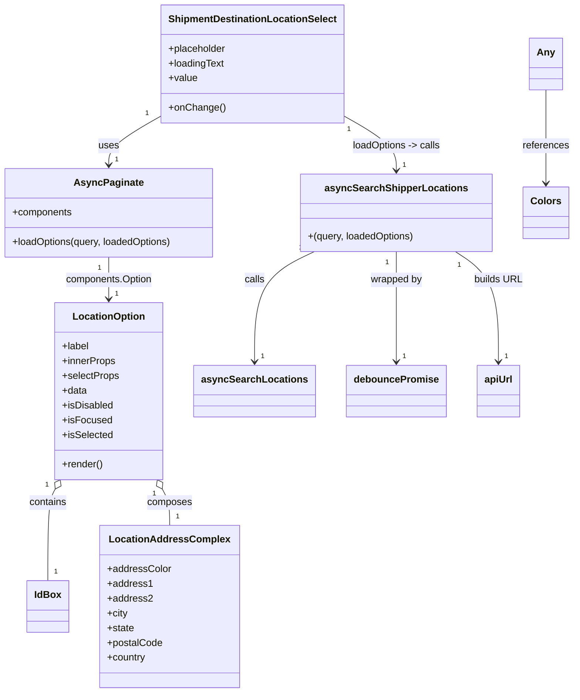

# Diagram: web/portal/src/pages/shipments/dashboard/components/organisms/Shipments.DestinationLocationSelect.organism.js


> Auto-generated by Obscura crawlers

## Diagram 1



### SVG

<svg id="container" width="911.98046875" xmlns="http://www.w3.org/2000/svg" class="classDiagram" height="1126" viewBox="0 0 911.98046875 1126" role="graphics-document document" aria-roledescription="class"><style>#container{font-family:"trebuchet ms",verdana,arial,sans-serif;font-size:16px;fill:#333;}@keyframes edge-animation-frame{from{stroke-dashoffset:0;}}@keyframes dash{to{stroke-dashoffset:0;}}#container .edge-animation-slow{stroke-dasharray:9,5!important;stroke-dashoffset:900;animation:dash 50s linear infinite;stroke-linecap:round;}#container .edge-animation-fast{stroke-dasharray:9,5!important;stroke-dashoffset:900;animation:dash 20s linear infinite;stroke-linecap:round;}#container .error-icon{fill:#552222;}#container .error-text{fill:#552222;stroke:#552222;}#container .edge-thickness-normal{stroke-width:1px;}#container .edge-thickness-thick{stroke-width:3.5px;}#container .edge-pattern-solid{stroke-dasharray:0;}#container .edge-thickness-invisible{stroke-width:0;fill:none;}#container .edge-pattern-dashed{stroke-dasharray:3;}#container .edge-pattern-dotted{stroke-dasharray:2;}#container .marker{fill:#333333;stroke:#333333;}#container .marker.cross{stroke:#333333;}#container svg{font-family:"trebuchet ms",verdana,arial,sans-serif;font-size:16px;}#container p{margin:0;}#container g.classGroup text{fill:#9370DB;stroke:none;font-family:"trebuchet ms",verdana,arial,sans-serif;font-size:10px;}#container g.classGroup text .title{font-weight:bolder;}#container .nodeLabel,#container .edgeLabel{color:#131300;}#container .edgeLabel .label rect{fill:#ECECFF;}#container .label text{fill:#131300;}#container .labelBkg{background:#ECECFF;}#container .edgeLabel .label span{background:#ECECFF;}#container .classTitle{font-weight:bolder;}#container .node rect,#container .node circle,#container .node ellipse,#container .node polygon,#container .node path{fill:#ECECFF;stroke:#9370DB;stroke-width:1px;}#container .divider{stroke:#9370DB;stroke-width:1;}#container g.clickable{cursor:pointer;}#container g.classGroup rect{fill:#ECECFF;stroke:#9370DB;}#container g.classGroup line{stroke:#9370DB;stroke-width:1;}#container .classLabel .box{stroke:none;stroke-width:0;fill:#ECECFF;opacity:0.5;}#container .classLabel .label{fill:#9370DB;font-size:10px;}#container .relation{stroke:#333333;stroke-width:1;fill:none;}#container .dashed-line{stroke-dasharray:3;}#container .dotted-line{stroke-dasharray:1 2;}#container #compositionStart,#container .composition{fill:#333333!important;stroke:#333333!important;stroke-width:1;}#container #compositionEnd,#container .composition{fill:#333333!important;stroke:#333333!important;stroke-width:1;}#container #dependencyStart,#container .dependency{fill:#333333!important;stroke:#333333!important;stroke-width:1;}#container #dependencyStart,#container .dependency{fill:#333333!important;stroke:#333333!important;stroke-width:1;}#container #extensionStart,#container .extension{fill:transparent!important;stroke:#333333!important;stroke-width:1;}#container #extensionEnd,#container .extension{fill:transparent!important;stroke:#333333!important;stroke-width:1;}#container #aggregationStart,#container .aggregation{fill:transparent!important;stroke:#333333!important;stroke-width:1;}#container #aggregationEnd,#container .aggregation{fill:transparent!important;stroke:#333333!important;stroke-width:1;}#container #lollipopStart,#container .lollipop{fill:#ECECFF!important;stroke:#333333!important;stroke-width:1;}#container #lollipopEnd,#container .lollipop{fill:#ECECFF!important;stroke:#333333!important;stroke-width:1;}#container .edgeTerminals{font-size:11px;line-height:initial;}#container .classTitleText{text-anchor:middle;font-size:18px;fill:#333;}#container .label-icon{display:inline-block;height:1em;overflow:visible;vertical-align:-0.125em;}#container .node .label-icon path{fill:currentColor;stroke:revert;stroke-width:revert;}#container :root{--mermaid-font-family:"trebuchet ms",verdana,arial,sans-serif;}</style><g><defs><marker id="container_class-aggregationStart" class="marker aggregation class" refX="18" refY="7" markerWidth="190" markerHeight="240" orient="auto"><path d="M 18,7 L9,13 L1,7 L9,1 Z"></path></marker></defs><defs><marker id="container_class-aggregationEnd" class="marker aggregation class" refX="1" refY="7" markerWidth="20" markerHeight="28" orient="auto"><path d="M 18,7 L9,13 L1,7 L9,1 Z"></path></marker></defs><defs><marker id="container_class-extensionStart" class="marker extension class" refX="18" refY="7" markerWidth="190" markerHeight="240" orient="auto"><path d="M 1,7 L18,13 V 1 Z"></path></marker></defs><defs><marker id="container_class-extensionEnd" class="marker extension class" refX="1" refY="7" markerWidth="20" markerHeight="28" orient="auto"><path d="M 1,1 V 13 L18,7 Z"></path></marker></defs><defs><marker id="container_class-compositionStart" class="marker composition class" refX="18" refY="7" markerWidth="190" markerHeight="240" orient="auto"><path d="M 18,7 L9,13 L1,7 L9,1 Z"></path></marker></defs><defs><marker id="container_class-compositionEnd" class="marker composition class" refX="1" refY="7" markerWidth="20" markerHeight="28" orient="auto"><path d="M 18,7 L9,13 L1,7 L9,1 Z"></path></marker></defs><defs><marker id="container_class-dependencyStart" class="marker dependency class" refX="6" refY="7" markerWidth="190" markerHeight="240" orient="auto"><path d="M 5,7 L9,13 L1,7 L9,1 Z"></path></marker></defs><defs><marker id="container_class-dependencyEnd" class="marker dependency class" refX="13" refY="7" markerWidth="20" markerHeight="28" orient="auto"><path d="M 18,7 L9,13 L14,7 L9,1 Z"></path></marker></defs><defs><marker id="container_class-lollipopStart" class="marker lollipop class" refX="13" refY="7" markerWidth="190" markerHeight="240" orient="auto"><circle stroke="black" fill="transparent" cx="7" cy="7" r="6"></circle></marker></defs><defs><marker id="container_class-lollipopEnd" class="marker lollipop class" refX="1" refY="7" markerWidth="190" markerHeight="240" orient="auto"><circle stroke="black" fill="transparent" cx="7" cy="7" r="6"></circle></marker></defs><g class="root"><g class="clusters"></g><g class="edgePaths"><path d="M259.121,189.119L245.66,197.099C232.199,205.079,205.277,221.04,191.816,234.186C178.355,247.333,178.355,257.667,178.355,262.833L178.355,268" id="id_ShipmentDestinationLocationSelect_AsyncPaginate_1" class="edge-thickness-normal edge-pattern-solid relation" style=";;;" data-edge="true" data-et="edge" data-id="id_ShipmentDestinationLocationSelect_AsyncPaginate_1" data-points="W3sieCI6MjU5LjEyMTA5Mzc1LCJ5IjoxODkuMTE4ODg4NDI0NTcxNjV9LHsieCI6MTc4LjM1NTQ2ODc1LCJ5IjoyMzd9LHsieCI6MTc4LjM1NTQ2ODc1LCJ5IjoyNzR9XQ==" marker-end="url(#container_class-dependencyEnd)"></path><path d="M178.355,418L178.355,424.167C178.355,430.333,178.355,442.667,178.355,454C178.355,465.333,178.355,475.667,178.355,480.833L178.355,486" id="id_AsyncPaginate_LocationOption_2" class="edge-thickness-normal edge-pattern-solid relation" style=";;;" data-edge="true" data-et="edge" data-id="id_AsyncPaginate_LocationOption_2" data-points="W3sieCI6MTc4LjM1NTQ2ODc1LCJ5Ijo0MTh9LHsieCI6MTc4LjM1NTQ2ODc1LCJ5Ijo0NTV9LHsieCI6MTc4LjM1NTQ2ODc1LCJ5Ijo0OTJ9XQ==" marker-end="url(#container_class-dependencyEnd)"></path><path d="M93.784,795.235L91.858,798.862C89.931,802.49,86.078,809.745,84.151,834.539C82.225,859.333,82.225,901.667,82.225,922.833L82.225,944" id="id_LocationOption_IdBox_3" class="edge-thickness-normal edge-pattern-solid relation" style=";;;" data-edge="true" data-et="edge" data-id="id_LocationOption_IdBox_3" data-points="W3sieCI6MTAxLjg3NTY2OTAyNjI0MzA5LCJ5Ijo3ODB9LHsieCI6ODIuMjI0NjA5Mzc1LCJ5Ijo4MTd9LHsieCI6ODIuMjI0NjA5Mzc1LCJ5Ijo5NDR9XQ==" marker-start="url(#container_class-aggregationStart)"></path><path d="M262.927,795.235L264.853,798.862C266.78,802.49,270.633,809.745,272.56,819.539C274.486,829.333,274.486,841.667,274.486,847.833L274.486,854" id="id_LocationOption_LocationAddressComplex_4" class="edge-thickness-normal edge-pattern-solid relation" style=";;;" data-edge="true" data-et="edge" data-id="id_LocationOption_LocationAddressComplex_4" data-points="W3sieCI6MjU0LjgzNTI2ODQ3Mzc1NjksInkiOjc4MH0seyJ4IjoyNzQuNDg2MzI4MTI1LCJ5Ijo4MTd9LHsieCI6Mjc0LjQ4NjMyODEyNSwieSI6ODU0fV0=" marker-start="url(#container_class-aggregationStart)"></path><path d="M546.277,189.119L559.738,197.099C573.199,205.079,600.121,221.04,613.582,235.686C627.043,250.333,627.043,263.667,627.043,270.333L627.043,277" id="id_ShipmentDestinationLocationSelect_asyncSearchShipperLocations_5" class="edge-thickness-normal edge-pattern-solid relation" style=";;;" data-edge="true" data-et="edge" data-id="id_ShipmentDestinationLocationSelect_asyncSearchShipperLocations_5" data-points="W3sieCI6NTQ2LjI3NzM0Mzc1LCJ5IjoxODkuMTE4ODg4NDI0NTcxNjV9LHsieCI6NjI3LjA0Mjk2ODc1LCJ5IjoyMzd9LHsieCI6NjI3LjA0Mjk2ODc1LCJ5IjoyODN9XQ==" marker-end="url(#container_class-dependencyEnd)"></path><path d="M627.043,409L627.043,416.667C627.043,424.333,627.043,439.667,627.043,469.5C627.043,499.333,627.043,543.667,627.043,565.833L627.043,588" id="id_asyncSearchShipperLocations_debouncePromise_6" class="edge-thickness-normal edge-pattern-solid relation" style=";;;" data-edge="true" data-et="edge" data-id="id_asyncSearchShipperLocations_debouncePromise_6" data-points="W3sieCI6NjI3LjA0Mjk2ODc1LCJ5Ijo0MDl9LHsieCI6NjI3LjA0Mjk2ODc1LCJ5Ijo0NTV9LHsieCI6NjI3LjA0Mjk2ODc1LCJ5Ijo1OTR9XQ==" marker-end="url(#container_class-dependencyEnd)"></path><path d="M499.855,409L484.378,416.667C468.9,424.333,437.944,439.667,422.466,469.5C406.988,499.333,406.988,543.667,406.988,565.833L406.988,588" id="id_asyncSearchShipperLocations_asyncSearchLocations_7" class="edge-thickness-normal edge-pattern-solid relation" style=";;;" data-edge="true" data-et="edge" data-id="id_asyncSearchShipperLocations_asyncSearchLocations_7" data-points="W3sieCI6NDk5Ljg1NTM5NzA3NTY4ODEsInkiOjQwOX0seyJ4Ijo0MDYuOTg4MjgxMjUsInkiOjQ1NX0seyJ4Ijo0MDYuOTg4MjgxMjUsInkiOjU5NH1d" marker-end="url(#container_class-dependencyEnd)"></path><path d="M720.522,409L731.898,416.667C743.274,424.333,766.026,439.667,777.402,469.5C788.777,499.333,788.777,543.667,788.777,565.833L788.777,588" id="id_asyncSearchShipperLocations_apiUrl_8" class="edge-thickness-normal edge-pattern-solid relation" style=";;;" data-edge="true" data-et="edge" data-id="id_asyncSearchShipperLocations_apiUrl_8" data-points="W3sieCI6NzIwLjUyMjQ2OTg5Njc4OSwieSI6NDA5fSx7IngiOjc4OC43NzczNDM3NSwieSI6NDU1fSx7IngiOjc4OC43NzczNDM3NSwieSI6NTk0fV0=" marker-end="url(#container_class-dependencyEnd)"></path><path d="M866.152,146L866.152,161.167C866.152,176.333,866.152,206.667,866.152,232C866.152,257.333,866.152,277.667,866.152,287.833L866.152,298" id="id_Any_Colors_9" class="edge-thickness-normal edge-pattern-solid relation" style=";;;" data-edge="true" data-et="edge" data-id="id_Any_Colors_9" data-points="W3sieCI6ODY2LjE1MjM0Mzc1LCJ5IjoxNDZ9LHsieCI6ODY2LjE1MjM0Mzc1LCJ5IjoyMzd9LHsieCI6ODY2LjE1MjM0Mzc1LCJ5IjozMDR9XQ==" marker-end="url(#container_class-dependencyEnd)"></path></g><g class="edgeLabels"><g class="edgeLabel" transform="translate(178.35546875, 237)"><g class="label" data-id="id_ShipmentDestinationLocationSelect_AsyncPaginate_1" transform="translate(-16.4921875, -12)"><foreignObject width="32.984375" height="24"><div xmlns="http://www.w3.org/1999/xhtml" class="labelBkg" style="display: table-cell; white-space: nowrap; line-height: 1.5; max-width: 200px; text-align: center;"><span class="edgeLabel"><p>uses</p></span></div></foreignObject></g></g><g class="edgeLabel" transform="translate(178.35546875, 455)"><g class="label" data-id="id_AsyncPaginate_LocationOption_2" transform="translate(-71.53125, -12)"><foreignObject width="143.0625" height="24"><div xmlns="http://www.w3.org/1999/xhtml" class="labelBkg" style="display: table-cell; white-space: nowrap; line-height: 1.5; max-width: 200px; text-align: center;"><span class="edgeLabel"><p>components.Option</p></span></div></foreignObject></g></g><g class="edgeLabel" transform="translate(82.224609375, 817)"><g class="label" data-id="id_LocationOption_IdBox_3" transform="translate(-30.890625, -12)"><foreignObject width="61.78125" height="24"><div xmlns="http://www.w3.org/1999/xhtml" class="labelBkg" style="display: table-cell; white-space: nowrap; line-height: 1.5; max-width: 200px; text-align: center;"><span class="edgeLabel"><p>contains</p></span></div></foreignObject></g></g><g class="edgeLabel" transform="translate(274.486328125, 817)"><g class="label" data-id="id_LocationOption_LocationAddressComplex_4" transform="translate(-36.453125, -12)"><foreignObject width="72.90625" height="24"><div xmlns="http://www.w3.org/1999/xhtml" class="labelBkg" style="display: table-cell; white-space: nowrap; line-height: 1.5; max-width: 200px; text-align: center;"><span class="edgeLabel"><p>composes</p></span></div></foreignObject></g></g><g class="edgeLabel" transform="translate(627.04296875, 237)"><g class="label" data-id="id_ShipmentDestinationLocationSelect_asyncSearchShipperLocations_5" transform="translate(-72.46875, -12)"><foreignObject width="144.9375" height="24"><div xmlns="http://www.w3.org/1999/xhtml" class="labelBkg" style="display: table-cell; white-space: nowrap; line-height: 1.5; max-width: 200px; text-align: center;"><span class="edgeLabel"><p>loadOptions -&gt; calls</p></span></div></foreignObject></g></g><g class="edgeLabel" transform="translate(627.04296875, 455)"><g class="label" data-id="id_asyncSearchShipperLocations_debouncePromise_6" transform="translate(-42.3203125, -12)"><foreignObject width="84.640625" height="24"><div xmlns="http://www.w3.org/1999/xhtml" class="labelBkg" style="display: table-cell; white-space: nowrap; line-height: 1.5; max-width: 200px; text-align: center;"><span class="edgeLabel"><p>wrapped by</p></span></div></foreignObject></g></g><g class="edgeLabel" transform="translate(406.98828125, 455)"><g class="label" data-id="id_asyncSearchShipperLocations_asyncSearchLocations_7" transform="translate(-16.4453125, -12)"><foreignObject width="32.890625" height="24"><div xmlns="http://www.w3.org/1999/xhtml" class="labelBkg" style="display: table-cell; white-space: nowrap; line-height: 1.5; max-width: 200px; text-align: center;"><span class="edgeLabel"><p>calls</p></span></div></foreignObject></g></g><g class="edgeLabel" transform="translate(788.77734375, 455)"><g class="label" data-id="id_asyncSearchShipperLocations_apiUrl_8" transform="translate(-38.734375, -12)"><foreignObject width="77.46875" height="24"><div xmlns="http://www.w3.org/1999/xhtml" class="labelBkg" style="display: table-cell; white-space: nowrap; line-height: 1.5; max-width: 200px; text-align: center;"><span class="edgeLabel"><p>builds URL</p></span></div></foreignObject></g></g><g class="edgeLabel" transform="translate(866.15234375, 237)"><g class="label" data-id="id_Any_Colors_9" transform="translate(-37.828125, -12)"><foreignObject width="75.65625" height="24"><div xmlns="http://www.w3.org/1999/xhtml" class="labelBkg" style="display: table-cell; white-space: nowrap; line-height: 1.5; max-width: 200px; text-align: center;"><span class="edgeLabel"><p>references</p></span></div></foreignObject></g></g><g class="edgeTerminals" transform="translate(236.4182263185391, 185.14021780540378)"><g class="inner" transform="translate(0, 0)"><foreignObject style="width: 9px; height: 12px;"><div xmlns="http://www.w3.org/1999/xhtml" style="display: inline-block; padding-right: 1px; white-space: nowrap;"><span class="edgeLabel">1</span></div></foreignObject></g></g><g class="edgeTerminals" transform="translate(163.35546937499998, 435.50000053571426)"><g class="inner" transform="translate(0, 0)"><foreignObject style="width: 9px; height: 12px;"><div xmlns="http://www.w3.org/1999/xhtml" style="display: inline-block; padding-right: 1px; white-space: nowrap;"><span class="edgeLabel">1</span></div></foreignObject></g></g><g class="edgeTerminals" transform="translate(80.41963816215473, 788.4195472664763)"><g class="inner" transform="translate(0, 0)"><foreignObject style="width: 9px; height: 12px;"><div xmlns="http://www.w3.org/1999/xhtml" style="display: inline-block; padding-right: 1px; white-space: nowrap;"><span class="edgeLabel">1</span></div></foreignObject></g></g><g class="edgeTerminals" transform="translate(249.79628832975845, 802.4913035692208)"><g class="inner" transform="translate(0, 0)"><foreignObject style="width: 9px; height: 12px;"><div xmlns="http://www.w3.org/1999/xhtml" style="display: inline-block; padding-right: 1px; white-space: nowrap;"><span class="edgeLabel">1</span></div></foreignObject></g></g><g class="edgeTerminals" transform="translate(553.681411788539, 210.94616089780274)"><g class="inner" transform="translate(0, 0)"><foreignObject style="width: 9px; height: 12px;"><div xmlns="http://www.w3.org/1999/xhtml" style="display: inline-block; padding-right: 1px; white-space: nowrap;"><span class="edgeLabel">1</span></div></foreignObject></g></g><g class="edgeTerminals" transform="translate(612.042969375, 426.50000053571426)"><g class="inner" transform="translate(0, 0)"><foreignObject style="width: 9px; height: 12px;"><div xmlns="http://www.w3.org/1999/xhtml" style="display: inline-block; padding-right: 1px; white-space: nowrap;"><span class="edgeLabel">1</span></div></foreignObject></g></g><g class="edgeTerminals" transform="translate(477.5157922110556, 403.3262007310111)"><g class="inner" transform="translate(0, 0)"><foreignObject style="width: 9px; height: 12px;"><div xmlns="http://www.w3.org/1999/xhtml" style="display: inline-block; padding-right: 1px; white-space: nowrap;"><span class="edgeLabel">1</span></div></foreignObject></g></g><g class="edgeTerminals" transform="translate(726.6513483058022, 431.2190646475122)"><g class="inner" transform="translate(0, 0)"><foreignObject style="width: 9px; height: 12px;"><div xmlns="http://www.w3.org/1999/xhtml" style="display: inline-block; padding-right: 1px; white-space: nowrap;"><span class="edgeLabel">1</span></div></foreignObject></g></g><g class="edgeTerminals" transform="translate(188.35546937499998, 251.50000053571426)"><g class="inner" transform="translate(0, 0)"></g><foreignObject style="width: 9px; height: 12px;"><div xmlns="http://www.w3.org/1999/xhtml" style="display: inline-block; padding-right: 1px; white-space: nowrap;"><span class="edgeLabel">1</span></div></foreignObject></g><g class="edgeTerminals" transform="translate(188.35546937499998, 469.50000053571426)"><g class="inner" transform="translate(0, 0)"></g><foreignObject style="width: 9px; height: 12px;"><div xmlns="http://www.w3.org/1999/xhtml" style="display: inline-block; padding-right: 1px; white-space: nowrap;"><span class="edgeLabel">1</span></div></foreignObject></g><g class="edgeTerminals" transform="translate(92.22460968749999, 921.5000002678571)"><g class="inner" transform="translate(0, 0)"></g><foreignObject style="width: 9px; height: 12px;"><div xmlns="http://www.w3.org/1999/xhtml" style="display: inline-block; padding-right: 1px; white-space: nowrap;"><span class="edgeLabel">1</span></div></foreignObject></g><g class="edgeTerminals" transform="translate(284.4863290625, 831.5000008035714)"><g class="inner" transform="translate(0, 0)"></g><foreignObject style="width: 9px; height: 12px;"><div xmlns="http://www.w3.org/1999/xhtml" style="display: inline-block; padding-right: 1px; white-space: nowrap;"><span class="edgeLabel">1</span></div></foreignObject></g><g class="edgeTerminals" transform="translate(637.042969375, 260.50000053571426)"><g class="inner" transform="translate(0, 0)"></g><foreignObject style="width: 9px; height: 12px;"><div xmlns="http://www.w3.org/1999/xhtml" style="display: inline-block; padding-right: 1px; white-space: nowrap;"><span class="edgeLabel">1</span></div></foreignObject></g><g class="edgeTerminals" transform="translate(637.042969375, 571.5000005357143)"><g class="inner" transform="translate(0, 0)"></g><foreignObject style="width: 9px; height: 12px;"><div xmlns="http://www.w3.org/1999/xhtml" style="display: inline-block; padding-right: 1px; white-space: nowrap;"><span class="edgeLabel">1</span></div></foreignObject></g><g class="edgeTerminals" transform="translate(416.988280625, 571.4999994642857)"><g class="inner" transform="translate(0, 0)"></g><foreignObject style="width: 9px; height: 12px;"><div xmlns="http://www.w3.org/1999/xhtml" style="display: inline-block; padding-right: 1px; white-space: nowrap;"><span class="edgeLabel">1</span></div></foreignObject></g><g class="edgeTerminals" transform="translate(798.7773418749999, 571.4999983928572)"><g class="inner" transform="translate(0, 0)"></g><foreignObject style="width: 9px; height: 12px;"><div xmlns="http://www.w3.org/1999/xhtml" style="display: inline-block; padding-right: 1px; white-space: nowrap;"><span class="edgeLabel">1</span></div></foreignObject></g></g><g class="nodes"><g class="node default" id="classId-ShipmentDestinationLocationSelect-0" transform="translate(402.69921875, 104)"><g class="basic label-container"><path d="M-143.578125 -96 L143.578125 -96 L143.578125 96 L-143.578125 96" stroke="none" stroke-width="0" fill="#ECECFF" style=""></path><path d="M-143.578125 -96 C-65.56815666939674 -96, 12.441811661206515 -96, 143.578125 -96 M-143.578125 -96 C-82.49574887761287 -96, -21.413372755225723 -96, 143.578125 -96 M143.578125 -96 C143.578125 -21.437371644327783, 143.578125 53.125256711344434, 143.578125 96 M143.578125 -96 C143.578125 -53.49750255321257, 143.578125 -10.99500510642514, 143.578125 96 M143.578125 96 C59.79812884004296 96, -23.981867319914073 96, -143.578125 96 M143.578125 96 C70.45657259615331 96, -2.664979807693385 96, -143.578125 96 M-143.578125 96 C-143.578125 54.730119615829615, -143.578125 13.46023923165923, -143.578125 -96 M-143.578125 96 C-143.578125 20.763741358304983, -143.578125 -54.47251728339003, -143.578125 -96" stroke="#9370DB" stroke-width="1.3" fill="none" stroke-dasharray="0 0" style=""></path></g><g class="annotation-group text" transform="translate(0, -72)"></g><g class="label-group text" transform="translate(-131.578125, -72)"><g class="label" style="font-weight: bolder" transform="translate(0,-12)"><foreignObject width="263.15625" height="24"><div xmlns="http://www.w3.org/1999/xhtml" style="display: table-cell; white-space: nowrap; line-height: 1.5; max-width: 310px; text-align: center;"><span class="nodeLabel markdown-node-label" style=""><p>ShipmentDestinationLocationSelect</p></span></div></foreignObject></g></g><g class="members-group text" transform="translate(-131.578125, -24)"><g class="label" style="" transform="translate(0,-12)"><foreignObject width="94.640625" height="24"><div xmlns="http://www.w3.org/1999/xhtml" style="display: table-cell; white-space: nowrap; line-height: 1.5; max-width: 153px; text-align: center;"><span class="nodeLabel markdown-node-label" style=""><p>+placeholder</p></span></div></foreignObject></g><g class="label" style="" transform="translate(0,12)"><foreignObject width="91.765625" height="24"><div xmlns="http://www.w3.org/1999/xhtml" style="display: table-cell; white-space: nowrap; line-height: 1.5; max-width: 149px; text-align: center;"><span class="nodeLabel markdown-node-label" style=""><p>+loadingText</p></span></div></foreignObject></g><g class="label" style="" transform="translate(0,36)"><foreignObject width="46.71875" height="24"><div xmlns="http://www.w3.org/1999/xhtml" style="display: table-cell; white-space: nowrap; line-height: 1.5; max-width: 104px; text-align: center;"><span class="nodeLabel markdown-node-label" style=""><p>+value</p></span></div></foreignObject></g></g><g class="methods-group text" transform="translate(-131.578125, 72)"><g class="label" style="" transform="translate(0,-12)"><foreignObject width="90.125" height="24"><div xmlns="http://www.w3.org/1999/xhtml" style="display: table-cell; white-space: nowrap; line-height: 1.5; max-width: 147px; text-align: center;"><span class="nodeLabel markdown-node-label" style=""><p>+onChange()</p></span></div></foreignObject></g></g><g class="divider" style=""><path d="M-143.578125 -48 C-65.22346988680617 -48, 13.131185226387657 -48, 143.578125 -48 M-143.578125 -48 C-78.68791316662352 -48, -13.797701333247034 -48, 143.578125 -48" stroke="#9370DB" stroke-width="1.3" fill="none" stroke-dasharray="0 0" style=""></path></g><g class="divider" style=""><path d="M-143.578125 48 C-71.85203256327947 48, -0.1259401265589304 48, 143.578125 48 M-143.578125 48 C-69.20062516379905 48, 5.176874672401908 48, 143.578125 48" stroke="#9370DB" stroke-width="1.3" fill="none" stroke-dasharray="0 0" style=""></path></g></g><g class="node default" id="classId-AsyncPaginate-1" transform="translate(178.35546875, 346)"><g class="basic label-container"><path d="M-170.35546875 -72 L170.35546875 -72 L170.35546875 72 L-170.35546875 72" stroke="none" stroke-width="0" fill="#ECECFF" style=""></path><path d="M-170.35546875 -72 C-59.43461874635496 -72, 51.486231257290086 -72, 170.35546875 -72 M-170.35546875 -72 C-89.43867103586487 -72, -8.521873321729743 -72, 170.35546875 -72 M170.35546875 -72 C170.35546875 -40.256058254142225, 170.35546875 -8.51211650828445, 170.35546875 72 M170.35546875 -72 C170.35546875 -30.50101337333553, 170.35546875 10.997973253328936, 170.35546875 72 M170.35546875 72 C77.091087088617 72, -16.173294572765997 72, -170.35546875 72 M170.35546875 72 C66.30793742116522 72, -37.73959390766956 72, -170.35546875 72 M-170.35546875 72 C-170.35546875 42.91116776714546, -170.35546875 13.822335534290914, -170.35546875 -72 M-170.35546875 72 C-170.35546875 31.574199091000473, -170.35546875 -8.851601817999054, -170.35546875 -72" stroke="#9370DB" stroke-width="1.3" fill="none" stroke-dasharray="0 0" style=""></path></g><g class="annotation-group text" transform="translate(0, -48)"></g><g class="label-group text" transform="translate(-52.7421875, -48)"><g class="label" style="font-weight: bolder" transform="translate(0,-12)"><foreignObject width="105.484375" height="24"><div xmlns="http://www.w3.org/1999/xhtml" style="display: table-cell; white-space: nowrap; line-height: 1.5; max-width: 153px; text-align: center;"><span class="nodeLabel markdown-node-label" style=""><p>AsyncPaginate</p></span></div></foreignObject></g></g><g class="members-group text" transform="translate(-158.35546875, 0)"><g class="label" style="" transform="translate(0,-12)"><foreignObject width="97.9375" height="24"><div xmlns="http://www.w3.org/1999/xhtml" style="display: table-cell; white-space: nowrap; line-height: 1.5; max-width: 155px; text-align: center;"><span class="nodeLabel markdown-node-label" style=""><p>+components</p></span></div></foreignObject></g></g><g class="methods-group text" transform="translate(-158.35546875, 48)"><g class="label" style="" transform="translate(0,-12)"><foreignObject width="263.96875" height="24"><div xmlns="http://www.w3.org/1999/xhtml" style="display: table-cell; white-space: nowrap; line-height: 1.5; max-width: 321px; text-align: center;"><span class="nodeLabel markdown-node-label" style=""><p>+loadOptions(query, loadedOptions)</p></span></div></foreignObject></g></g><g class="divider" style=""><path d="M-170.35546875 -24 C-41.30944331874153 -24, 87.73658211251694 -24, 170.35546875 -24 M-170.35546875 -24 C-59.32522184217457 -24, 51.70502506565086 -24, 170.35546875 -24" stroke="#9370DB" stroke-width="1.3" fill="none" stroke-dasharray="0 0" style=""></path></g><g class="divider" style=""><path d="M-170.35546875 24 C-96.00281168453445 24, -21.6501546190689 24, 170.35546875 24 M-170.35546875 24 C-52.40284487898957 24, 65.54977899202086 24, 170.35546875 24" stroke="#9370DB" stroke-width="1.3" fill="none" stroke-dasharray="0 0" style=""></path></g></g><g class="node default" id="classId-LocationOption-2" transform="translate(178.35546875, 636)"><g class="basic label-container"><path d="M-86.1015625 -144 L86.1015625 -144 L86.1015625 144 L-86.1015625 144" stroke="none" stroke-width="0" fill="#ECECFF" style=""></path><path d="M-86.1015625 -144 C-45.092507600848464 -144, -4.0834527016969275 -144, 86.1015625 -144 M-86.1015625 -144 C-21.494002121632377 -144, 43.113558256735246 -144, 86.1015625 -144 M86.1015625 -144 C86.1015625 -54.942954654023055, 86.1015625 34.11409069195389, 86.1015625 144 M86.1015625 -144 C86.1015625 -43.56582358720661, 86.1015625 56.86835282558678, 86.1015625 144 M86.1015625 144 C21.83326340382176 144, -42.43503569235648 144, -86.1015625 144 M86.1015625 144 C38.22158818013354 144, -9.658386139732926 144, -86.1015625 144 M-86.1015625 144 C-86.1015625 85.23694951140627, -86.1015625 26.47389902281253, -86.1015625 -144 M-86.1015625 144 C-86.1015625 82.09897662867039, -86.1015625 20.19795325734077, -86.1015625 -144" stroke="#9370DB" stroke-width="1.3" fill="none" stroke-dasharray="0 0" style=""></path></g><g class="annotation-group text" transform="translate(0, -120)"></g><g class="label-group text" transform="translate(-56.28125, -120)"><g class="label" style="font-weight: bolder" transform="translate(0,-12)"><foreignObject width="112.5625" height="24"><div xmlns="http://www.w3.org/1999/xhtml" style="display: table-cell; white-space: nowrap; line-height: 1.5; max-width: 162px; text-align: center;"><span class="nodeLabel markdown-node-label" style=""><p>LocationOption</p></span></div></foreignObject></g></g><g class="members-group text" transform="translate(-74.1015625, -72)"><g class="label" style="" transform="translate(0,-12)"><foreignObject width="44.21875" height="24"><div xmlns="http://www.w3.org/1999/xhtml" style="display: table-cell; white-space: nowrap; line-height: 1.5; max-width: 102px; text-align: center;"><span class="nodeLabel markdown-node-label" style=""><p>+label</p></span></div></foreignObject></g><g class="label" style="" transform="translate(0,12)"><foreignObject width="87.140625" height="24"><div xmlns="http://www.w3.org/1999/xhtml" style="display: table-cell; white-space: nowrap; line-height: 1.5; max-width: 145px; text-align: center;"><span class="nodeLabel markdown-node-label" style=""><p>+innerProps</p></span></div></foreignObject></g><g class="label" style="" transform="translate(0,36)"><foreignObject width="91.921875" height="24"><div xmlns="http://www.w3.org/1999/xhtml" style="display: table-cell; white-space: nowrap; line-height: 1.5; max-width: 149px; text-align: center;"><span class="nodeLabel markdown-node-label" style=""><p>+selectProps</p></span></div></foreignObject></g><g class="label" style="" transform="translate(0,60)"><foreignObject width="40.625" height="24"><div xmlns="http://www.w3.org/1999/xhtml" style="display: table-cell; white-space: nowrap; line-height: 1.5; max-width: 98px; text-align: center;"><span class="nodeLabel markdown-node-label" style=""><p>+data</p></span></div></foreignObject></g><g class="label" style="" transform="translate(0,84)"><foreignObject width="83.203125" height="24"><div xmlns="http://www.w3.org/1999/xhtml" style="display: table-cell; white-space: nowrap; line-height: 1.5; max-width: 141px; text-align: center;"><span class="nodeLabel markdown-node-label" style=""><p>+isDisabled</p></span></div></foreignObject></g><g class="label" style="" transform="translate(0,108)"><foreignObject width="79.171875" height="24"><div xmlns="http://www.w3.org/1999/xhtml" style="display: table-cell; white-space: nowrap; line-height: 1.5; max-width: 137px; text-align: center;"><span class="nodeLabel markdown-node-label" style=""><p>+isFocused</p></span></div></foreignObject></g><g class="label" style="" transform="translate(0,132)"><foreignObject width="82.21875" height="24"><div xmlns="http://www.w3.org/1999/xhtml" style="display: table-cell; white-space: nowrap; line-height: 1.5; max-width: 140px; text-align: center;"><span class="nodeLabel markdown-node-label" style=""><p>+isSelected</p></span></div></foreignObject></g></g><g class="methods-group text" transform="translate(-74.1015625, 120)"><g class="label" style="" transform="translate(0,-12)"><foreignObject width="66.609375" height="24"><div xmlns="http://www.w3.org/1999/xhtml" style="display: table-cell; white-space: nowrap; line-height: 1.5; max-width: 124px; text-align: center;"><span class="nodeLabel markdown-node-label" style=""><p>+render()</p></span></div></foreignObject></g></g><g class="divider" style=""><path d="M-86.1015625 -96 C-49.64027763941742 -96, -13.17899277883484 -96, 86.1015625 -96 M-86.1015625 -96 C-36.60178122487246 -96, 12.898000050255078 -96, 86.1015625 -96" stroke="#9370DB" stroke-width="1.3" fill="none" stroke-dasharray="0 0" style=""></path></g><g class="divider" style=""><path d="M-86.1015625 96 C-45.90583306151943 96, -5.7101036230388615 96, 86.1015625 96 M-86.1015625 96 C-40.68132760849536 96, 4.738907283009283 96, 86.1015625 96" stroke="#9370DB" stroke-width="1.3" fill="none" stroke-dasharray="0 0" style=""></path></g></g><g class="node default" id="classId-IdBox-3" transform="translate(82.224609375, 986)"><g class="basic label-container"><path d="M-32.75 -42 L32.75 -42 L32.75 42 L-32.75 42" stroke="none" stroke-width="0" fill="#ECECFF" style=""></path><path d="M-32.75 -42 C-9.293169145749943 -42, 14.163661708500115 -42, 32.75 -42 M-32.75 -42 C-6.731961320691873 -42, 19.286077358616254 -42, 32.75 -42 M32.75 -42 C32.75 -19.272846761588827, 32.75 3.454306476822346, 32.75 42 M32.75 -42 C32.75 -17.621157051272142, 32.75 6.7576858974557155, 32.75 42 M32.75 42 C7.466557422308874 42, -17.816885155382252 42, -32.75 42 M32.75 42 C14.555167361036265 42, -3.6396652779274703 42, -32.75 42 M-32.75 42 C-32.75 11.466789916265334, -32.75 -19.06642016746933, -32.75 -42 M-32.75 42 C-32.75 18.660231338897795, -32.75 -4.6795373222044105, -32.75 -42" stroke="#9370DB" stroke-width="1.3" fill="none" stroke-dasharray="0 0" style=""></path></g><g class="annotation-group text" transform="translate(0, -18)"></g><g class="label-group text" transform="translate(-20.75, -18)"><g class="label" style="font-weight: bolder" transform="translate(0,-12)"><foreignObject width="41.5" height="24"><div xmlns="http://www.w3.org/1999/xhtml" style="display: table-cell; white-space: nowrap; line-height: 1.5; max-width: 91px; text-align: center;"><span class="nodeLabel markdown-node-label" style=""><p>IdBox</p></span></div></foreignObject></g></g><g class="members-group text" transform="translate(-20.75, 30)"></g><g class="methods-group text" transform="translate(-20.75, 60)"></g><g class="divider" style=""><path d="M-32.75 6 C-15.529987336687533 6, 1.6900253266249337 6, 32.75 6 M-32.75 6 C-15.794953421886888 6, 1.1600931562262247 6, 32.75 6" stroke="#9370DB" stroke-width="1.3" fill="none" stroke-dasharray="0 0" style=""></path></g><g class="divider" style=""><path d="M-32.75 24 C-12.155073119180493 24, 8.439853761639014 24, 32.75 24 M-32.75 24 C-11.146889249091995 24, 10.45622150181601 24, 32.75 24" stroke="#9370DB" stroke-width="1.3" fill="none" stroke-dasharray="0 0" style=""></path></g></g><g class="node default" id="classId-LocationAddressComplex-4" transform="translate(274.486328125, 986)"><g class="basic label-container"><path d="M-109.51171875 -132 L109.51171875 -132 L109.51171875 132 L-109.51171875 132" stroke="none" stroke-width="0" fill="#ECECFF" style=""></path><path d="M-109.51171875 -132 C-62.349179805034254 -132, -15.186640860068508 -132, 109.51171875 -132 M-109.51171875 -132 C-41.08805858667296 -132, 27.335601576654085 -132, 109.51171875 -132 M109.51171875 -132 C109.51171875 -63.42236411712679, 109.51171875 5.15527176574642, 109.51171875 132 M109.51171875 -132 C109.51171875 -72.25854676900431, 109.51171875 -12.517093538008638, 109.51171875 132 M109.51171875 132 C27.087942513506647 132, -55.335833722986706 132, -109.51171875 132 M109.51171875 132 C55.159731158658985 132, 0.8077435673179707 132, -109.51171875 132 M-109.51171875 132 C-109.51171875 69.99613663609286, -109.51171875 7.992273272185713, -109.51171875 -132 M-109.51171875 132 C-109.51171875 65.29159607974785, -109.51171875 -1.4168078405043047, -109.51171875 -132" stroke="#9370DB" stroke-width="1.3" fill="none" stroke-dasharray="0 0" style=""></path></g><g class="annotation-group text" transform="translate(0, -108)"></g><g class="label-group text" transform="translate(-92.1171875, -108)"><g class="label" style="font-weight: bolder" transform="translate(0,-12)"><foreignObject width="184.234375" height="24"><div xmlns="http://www.w3.org/1999/xhtml" style="display: table-cell; white-space: nowrap; line-height: 1.5; max-width: 232px; text-align: center;"><span class="nodeLabel markdown-node-label" style=""><p>LocationAddressComplex</p></span></div></foreignObject></g></g><g class="members-group text" transform="translate(-97.51171875, -60)"><g class="label" style="" transform="translate(0,-12)"><foreignObject width="102.90625" height="24"><div xmlns="http://www.w3.org/1999/xhtml" style="display: table-cell; white-space: nowrap; line-height: 1.5; max-width: 161px; text-align: center;"><span class="nodeLabel markdown-node-label" style=""><p>+addressColor</p></span></div></foreignObject></g><g class="label" style="" transform="translate(0,12)"><foreignObject width="71.234375" height="24"><div xmlns="http://www.w3.org/1999/xhtml" style="display: table-cell; white-space: nowrap; line-height: 1.5; max-width: 129px; text-align: center;"><span class="nodeLabel markdown-node-label" style=""><p>+address1</p></span></div></foreignObject></g><g class="label" style="" transform="translate(0,36)"><foreignObject width="72.546875" height="24"><div xmlns="http://www.w3.org/1999/xhtml" style="display: table-cell; white-space: nowrap; line-height: 1.5; max-width: 130px; text-align: center;"><span class="nodeLabel markdown-node-label" style=""><p>+address2</p></span></div></foreignObject></g><g class="label" style="" transform="translate(0,60)"><foreignObject width="33.71875" height="24"><div xmlns="http://www.w3.org/1999/xhtml" style="display: table-cell; white-space: nowrap; line-height: 1.5; max-width: 91px; text-align: center;"><span class="nodeLabel markdown-node-label" style=""><p>+city</p></span></div></foreignObject></g><g class="label" style="" transform="translate(0,84)"><foreignObject width="44.09375" height="24"><div xmlns="http://www.w3.org/1999/xhtml" style="display: table-cell; white-space: nowrap; line-height: 1.5; max-width: 101px; text-align: center;"><span class="nodeLabel markdown-node-label" style=""><p>+state</p></span></div></foreignObject></g><g class="label" style="" transform="translate(0,108)"><foreignObject width="89.484375" height="24"><div xmlns="http://www.w3.org/1999/xhtml" style="display: table-cell; white-space: nowrap; line-height: 1.5; max-width: 147px; text-align: center;"><span class="nodeLabel markdown-node-label" style=""><p>+postalCode</p></span></div></foreignObject></g><g class="label" style="" transform="translate(0,132)"><foreignObject width="63.171875" height="24"><div xmlns="http://www.w3.org/1999/xhtml" style="display: table-cell; white-space: nowrap; line-height: 1.5; max-width: 121px; text-align: center;"><span class="nodeLabel markdown-node-label" style=""><p>+country</p></span></div></foreignObject></g></g><g class="methods-group text" transform="translate(-97.51171875, 132)"></g><g class="divider" style=""><path d="M-109.51171875 -84 C-35.58552170021224 -84, 38.34067534957552 -84, 109.51171875 -84 M-109.51171875 -84 C-50.75585264126825 -84, 8.000013467463504 -84, 109.51171875 -84" stroke="#9370DB" stroke-width="1.3" fill="none" stroke-dasharray="0 0" style=""></path></g><g class="divider" style=""><path d="M-109.51171875 108 C-42.042237985822126 108, 25.427242778355748 108, 109.51171875 108 M-109.51171875 108 C-52.81642295758309 108, 3.878872834833814 108, 109.51171875 108" stroke="#9370DB" stroke-width="1.3" fill="none" stroke-dasharray="0 0" style=""></path></g></g><g class="node default" id="classId-asyncSearchShipperLocations-5" transform="translate(627.04296875, 346)"><g class="basic label-container"><path d="M-154.0078125 -63 L154.0078125 -63 L154.0078125 63 L-154.0078125 63" stroke="none" stroke-width="0" fill="#ECECFF" style=""></path><path d="M-154.0078125 -63 C-71.34065525499314 -63, 11.326501990013725 -63, 154.0078125 -63 M-154.0078125 -63 C-42.717152153684424 -63, 68.57350819263115 -63, 154.0078125 -63 M154.0078125 -63 C154.0078125 -18.257508618405453, 154.0078125 26.484982763189095, 154.0078125 63 M154.0078125 -63 C154.0078125 -20.487147790174582, 154.0078125 22.025704419650836, 154.0078125 63 M154.0078125 63 C83.52743380092464 63, 13.047055101849281 63, -154.0078125 63 M154.0078125 63 C54.872371884142765 63, -44.26306873171447 63, -154.0078125 63 M-154.0078125 63 C-154.0078125 32.33570456560195, -154.0078125 1.6714091312039017, -154.0078125 -63 M-154.0078125 63 C-154.0078125 21.684471099279108, -154.0078125 -19.631057801441784, -154.0078125 -63" stroke="#9370DB" stroke-width="1.3" fill="none" stroke-dasharray="0 0" style=""></path></g><g class="annotation-group text" transform="translate(0, -39)"></g><g class="label-group text" transform="translate(-109.15625, -39)"><g class="label" style="font-weight: bolder" transform="translate(0,-12)"><foreignObject width="218.3125" height="24"><div xmlns="http://www.w3.org/1999/xhtml" style="display: table-cell; white-space: nowrap; line-height: 1.5; max-width: 265px; text-align: center;"><span class="nodeLabel markdown-node-label" style=""><p>asyncSearchShipperLocations</p></span></div></foreignObject></g></g><g class="members-group text" transform="translate(-142.0078125, 9)"></g><g class="methods-group text" transform="translate(-142.0078125, 39)"><g class="label" style="" transform="translate(0,-12)"><foreignObject width="174.859375" height="24"><div xmlns="http://www.w3.org/1999/xhtml" style="display: table-cell; white-space: nowrap; line-height: 1.5; max-width: 225px; text-align: center;"><span class="nodeLabel markdown-node-label" style=""><p>+(query, loadedOptions)</p></span></div></foreignObject></g></g><g class="divider" style=""><path d="M-154.0078125 -15 C-32.7010509435552 -15, 88.6057106128896 -15, 154.0078125 -15 M-154.0078125 -15 C-66.01090241391877 -15, 21.986007672162458 -15, 154.0078125 -15" stroke="#9370DB" stroke-width="1.3" fill="none" stroke-dasharray="0 0" style=""></path></g><g class="divider" style=""><path d="M-154.0078125 9 C-82.7746172616022 9, -11.541422023204404 9, 154.0078125 9 M-154.0078125 9 C-70.76152318451349 9, 12.484766130973014 9, 154.0078125 9" stroke="#9370DB" stroke-width="1.3" fill="none" stroke-dasharray="0 0" style=""></path></g></g><g class="node default" id="classId-asyncSearchLocations-6" transform="translate(406.98828125, 636)"><g class="basic label-container"><path d="M-92.53125 -42 L92.53125 -42 L92.53125 42 L-92.53125 42" stroke="none" stroke-width="0" fill="#ECECFF" style=""></path><path d="M-92.53125 -42 C-27.31402043279401 -42, 37.90320913441198 -42, 92.53125 -42 M-92.53125 -42 C-24.5058128809477 -42, 43.5196242381046 -42, 92.53125 -42 M92.53125 -42 C92.53125 -16.449842807471235, 92.53125 9.10031438505753, 92.53125 42 M92.53125 -42 C92.53125 -12.899136169681082, 92.53125 16.201727660637836, 92.53125 42 M92.53125 42 C46.70874180499824 42, 0.8862336099964807 42, -92.53125 42 M92.53125 42 C21.743273808129146 42, -49.04470238374171 42, -92.53125 42 M-92.53125 42 C-92.53125 19.47215172106519, -92.53125 -3.0556965578696165, -92.53125 -42 M-92.53125 42 C-92.53125 19.870812252078146, -92.53125 -2.2583754958437083, -92.53125 -42" stroke="#9370DB" stroke-width="1.3" fill="none" stroke-dasharray="0 0" style=""></path></g><g class="annotation-group text" transform="translate(0, -18)"></g><g class="label-group text" transform="translate(-80.53125, -18)"><g class="label" style="font-weight: bolder" transform="translate(0,-12)"><foreignObject width="161.0625" height="24"><div xmlns="http://www.w3.org/1999/xhtml" style="display: table-cell; white-space: nowrap; line-height: 1.5; max-width: 209px; text-align: center;"><span class="nodeLabel markdown-node-label" style=""><p>asyncSearchLocations</p></span></div></foreignObject></g></g><g class="members-group text" transform="translate(-80.53125, 30)"></g><g class="methods-group text" transform="translate(-80.53125, 60)"></g><g class="divider" style=""><path d="M-92.53125 6 C-45.048339189367134 6, 2.4345716212657322 6, 92.53125 6 M-92.53125 6 C-42.271590617902376 6, 7.988068764195248 6, 92.53125 6" stroke="#9370DB" stroke-width="1.3" fill="none" stroke-dasharray="0 0" style=""></path></g><g class="divider" style=""><path d="M-92.53125 24 C-19.304913265592745 24, 53.92142346881451 24, 92.53125 24 M-92.53125 24 C-47.78418418767554 24, -3.037118375351085 24, 92.53125 24" stroke="#9370DB" stroke-width="1.3" fill="none" stroke-dasharray="0 0" style=""></path></g></g><g class="node default" id="classId-debouncePromise-7" transform="translate(627.04296875, 636)"><g class="basic label-container"><path d="M-77.5234375 -42 L77.5234375 -42 L77.5234375 42 L-77.5234375 42" stroke="none" stroke-width="0" fill="#ECECFF" style=""></path><path d="M-77.5234375 -42 C-32.19777507346312 -42, 13.12788735307376 -42, 77.5234375 -42 M-77.5234375 -42 C-44.64372601338229 -42, -11.764014526764583 -42, 77.5234375 -42 M77.5234375 -42 C77.5234375 -21.153312455171196, 77.5234375 -0.3066249103423928, 77.5234375 42 M77.5234375 -42 C77.5234375 -17.275679573536554, 77.5234375 7.448640852926893, 77.5234375 42 M77.5234375 42 C27.04551568386924 42, -23.43240613226152 42, -77.5234375 42 M77.5234375 42 C44.07599354425082 42, 10.628549588501642 42, -77.5234375 42 M-77.5234375 42 C-77.5234375 9.706858355936177, -77.5234375 -22.586283288127646, -77.5234375 -42 M-77.5234375 42 C-77.5234375 25.18017481240875, -77.5234375 8.360349624817502, -77.5234375 -42" stroke="#9370DB" stroke-width="1.3" fill="none" stroke-dasharray="0 0" style=""></path></g><g class="annotation-group text" transform="translate(0, -18)"></g><g class="label-group text" transform="translate(-65.5234375, -18)"><g class="label" style="font-weight: bolder" transform="translate(0,-12)"><foreignObject width="131.046875" height="24"><div xmlns="http://www.w3.org/1999/xhtml" style="display: table-cell; white-space: nowrap; line-height: 1.5; max-width: 180px; text-align: center;"><span class="nodeLabel markdown-node-label" style=""><p>debouncePromise</p></span></div></foreignObject></g></g><g class="members-group text" transform="translate(-65.5234375, 30)"></g><g class="methods-group text" transform="translate(-65.5234375, 60)"></g><g class="divider" style=""><path d="M-77.5234375 6 C-32.442986138713785 6, 12.63746522257243 6, 77.5234375 6 M-77.5234375 6 C-32.59649777528288 6, 12.330441949434245 6, 77.5234375 6" stroke="#9370DB" stroke-width="1.3" fill="none" stroke-dasharray="0 0" style=""></path></g><g class="divider" style=""><path d="M-77.5234375 24 C-18.321215678091782 24, 40.881006143816435 24, 77.5234375 24 M-77.5234375 24 C-45.97012757250836 24, -14.416817645016714 24, 77.5234375 24" stroke="#9370DB" stroke-width="1.3" fill="none" stroke-dasharray="0 0" style=""></path></g></g><g class="node default" id="classId-apiUrl-8" transform="translate(788.77734375, 636)"><g class="basic label-container"><path d="M-34.2109375 -42 L34.2109375 -42 L34.2109375 42 L-34.2109375 42" stroke="none" stroke-width="0" fill="#ECECFF" style=""></path><path d="M-34.2109375 -42 C-14.09874224412657 -42, 6.013453011746861 -42, 34.2109375 -42 M-34.2109375 -42 C-18.879911085868798 -42, -3.5488846717375964 -42, 34.2109375 -42 M34.2109375 -42 C34.2109375 -13.889528452275723, 34.2109375 14.220943095448554, 34.2109375 42 M34.2109375 -42 C34.2109375 -14.34494377102779, 34.2109375 13.31011245794442, 34.2109375 42 M34.2109375 42 C11.823158011865878 42, -10.564621476268243 42, -34.2109375 42 M34.2109375 42 C18.16620188015584 42, 2.121466260311678 42, -34.2109375 42 M-34.2109375 42 C-34.2109375 17.818441689405546, -34.2109375 -6.363116621188908, -34.2109375 -42 M-34.2109375 42 C-34.2109375 23.8272975335704, -34.2109375 5.6545950671407965, -34.2109375 -42" stroke="#9370DB" stroke-width="1.3" fill="none" stroke-dasharray="0 0" style=""></path></g><g class="annotation-group text" transform="translate(0, -18)"></g><g class="label-group text" transform="translate(-22.2109375, -18)"><g class="label" style="font-weight: bolder" transform="translate(0,-12)"><foreignObject width="44.421875" height="24"><div xmlns="http://www.w3.org/1999/xhtml" style="display: table-cell; white-space: nowrap; line-height: 1.5; max-width: 94px; text-align: center;"><span class="nodeLabel markdown-node-label" style=""><p>apiUrl</p></span></div></foreignObject></g></g><g class="members-group text" transform="translate(-22.2109375, 30)"></g><g class="methods-group text" transform="translate(-22.2109375, 60)"></g><g class="divider" style=""><path d="M-34.2109375 6 C-6.911627809367069 6, 20.387681881265863 6, 34.2109375 6 M-34.2109375 6 C-11.47987277688291 6, 11.25119194623418 6, 34.2109375 6" stroke="#9370DB" stroke-width="1.3" fill="none" stroke-dasharray="0 0" style=""></path></g><g class="divider" style=""><path d="M-34.2109375 24 C-9.899262619358748 24, 14.412412261282505 24, 34.2109375 24 M-34.2109375 24 C-13.383491461211726 24, 7.443954577576548 24, 34.2109375 24" stroke="#9370DB" stroke-width="1.3" fill="none" stroke-dasharray="0 0" style=""></path></g></g><g class="node default" id="classId-Colors-9" transform="translate(866.15234375, 346)"><g class="basic label-container"><path d="M-35.1015625 -42 L35.1015625 -42 L35.1015625 42 L-35.1015625 42" stroke="none" stroke-width="0" fill="#ECECFF" style=""></path><path d="M-35.1015625 -42 C-18.79745395830914 -42, -2.4933454166182827 -42, 35.1015625 -42 M-35.1015625 -42 C-16.22414560126666 -42, 2.653271297466681 -42, 35.1015625 -42 M35.1015625 -42 C35.1015625 -19.622351956862406, 35.1015625 2.7552960862751874, 35.1015625 42 M35.1015625 -42 C35.1015625 -19.699072784234453, 35.1015625 2.6018544315310947, 35.1015625 42 M35.1015625 42 C19.32093124074664 42, 3.540299981493277 42, -35.1015625 42 M35.1015625 42 C7.868659739533772 42, -19.364243020932456 42, -35.1015625 42 M-35.1015625 42 C-35.1015625 8.936959610296014, -35.1015625 -24.12608077940797, -35.1015625 -42 M-35.1015625 42 C-35.1015625 20.170575222005677, -35.1015625 -1.6588495559886454, -35.1015625 -42" stroke="#9370DB" stroke-width="1.3" fill="none" stroke-dasharray="0 0" style=""></path></g><g class="annotation-group text" transform="translate(0, -18)"></g><g class="label-group text" transform="translate(-23.1015625, -18)"><g class="label" style="font-weight: bolder" transform="translate(0,-12)"><foreignObject width="46.203125" height="24"><div xmlns="http://www.w3.org/1999/xhtml" style="display: table-cell; white-space: nowrap; line-height: 1.5; max-width: 95px; text-align: center;"><span class="nodeLabel markdown-node-label" style=""><p>Colors</p></span></div></foreignObject></g></g><g class="members-group text" transform="translate(-23.1015625, 30)"></g><g class="methods-group text" transform="translate(-23.1015625, 60)"></g><g class="divider" style=""><path d="M-35.1015625 6 C-8.873755137740801 6, 17.354052224518398 6, 35.1015625 6 M-35.1015625 6 C-18.067919482917173 6, -1.0342764658343455 6, 35.1015625 6" stroke="#9370DB" stroke-width="1.3" fill="none" stroke-dasharray="0 0" style=""></path></g><g class="divider" style=""><path d="M-35.1015625 24 C-15.203960066946966 24, 4.693642366106069 24, 35.1015625 24 M-35.1015625 24 C-9.639021261645684 24, 15.823519976708631 24, 35.1015625 24" stroke="#9370DB" stroke-width="1.3" fill="none" stroke-dasharray="0 0" style=""></path></g></g><g class="node default" id="classId-Any-10" transform="translate(866.15234375, 104)"><g class="basic label-container"><path d="M-25.4375 -42 L25.4375 -42 L25.4375 42 L-25.4375 42" stroke="none" stroke-width="0" fill="#ECECFF" style=""></path><path d="M-25.4375 -42 C-12.60369907985422 -42, 0.23010184029156022 -42, 25.4375 -42 M-25.4375 -42 C-7.453005550139835 -42, 10.53148889972033 -42, 25.4375 -42 M25.4375 -42 C25.4375 -11.29893647143243, 25.4375 19.40212705713514, 25.4375 42 M25.4375 -42 C25.4375 -10.570771751993455, 25.4375 20.85845649601309, 25.4375 42 M25.4375 42 C7.474248880407345 42, -10.48900223918531 42, -25.4375 42 M25.4375 42 C8.059783911632955 42, -9.31793217673409 42, -25.4375 42 M-25.4375 42 C-25.4375 16.56801666502583, -25.4375 -8.86396666994834, -25.4375 -42 M-25.4375 42 C-25.4375 23.750388192758834, -25.4375 5.500776385517668, -25.4375 -42" stroke="#9370DB" stroke-width="1.3" fill="none" stroke-dasharray="0 0" style=""></path></g><g class="annotation-group text" transform="translate(0, -18)"></g><g class="label-group text" transform="translate(-13.4375, -18)"><g class="label" style="font-weight: bolder" transform="translate(0,-12)"><foreignObject width="26.875" height="24"><div xmlns="http://www.w3.org/1999/xhtml" style="display: table-cell; white-space: nowrap; line-height: 1.5; max-width: 76px; text-align: center;"><span class="nodeLabel markdown-node-label" style=""><p>Any</p></span></div></foreignObject></g></g><g class="members-group text" transform="translate(-13.4375, 30)"></g><g class="methods-group text" transform="translate(-13.4375, 60)"></g><g class="divider" style=""><path d="M-25.4375 6 C-11.747077954820323 6, 1.9433440903593535 6, 25.4375 6 M-25.4375 6 C-7.9501919201871125 6, 9.537116159625775 6, 25.4375 6" stroke="#9370DB" stroke-width="1.3" fill="none" stroke-dasharray="0 0" style=""></path></g><g class="divider" style=""><path d="M-25.4375 24 C-13.510616579953787 24, -1.583733159907574 24, 25.4375 24 M-25.4375 24 C-10.394087914459034 24, 4.649324171081933 24, 25.4375 24" stroke="#9370DB" stroke-width="1.3" fill="none" stroke-dasharray="0 0" style=""></path></g></g></g></g></g></svg>

## Diagram 2

```mermaid
flowchart LR
    A[User types query] --> B[AsyncPaginate.loadOptions]
    B --> C[asyncSearchShipperLocations (debounced 500ms)]
    C --> D{Calculate page}
    D --> E[pageSize = 20]
    D --> F[page = loadedOptions.length / pageSize if divisible]
    C --> G[Build apiUrl with queryParam]
    G --> H[Call asyncSearchLocations(query, true, page, pageSize, urlBuilder, "ShipperLocation")]
    H --> I[Return paginated results]
    I --> J[AsyncPaginate receives options]
    J --> K[Render options using LocationOption]
    K --> L[Render IdBox (label)]
    K --> M[Render LocationAddressComplex (address fields)]
    style C stroke:#f96,stroke-width:2px
    style H stroke:#6b6,stroke-width:2px
```

> SVG rendering failed for this diagram.
