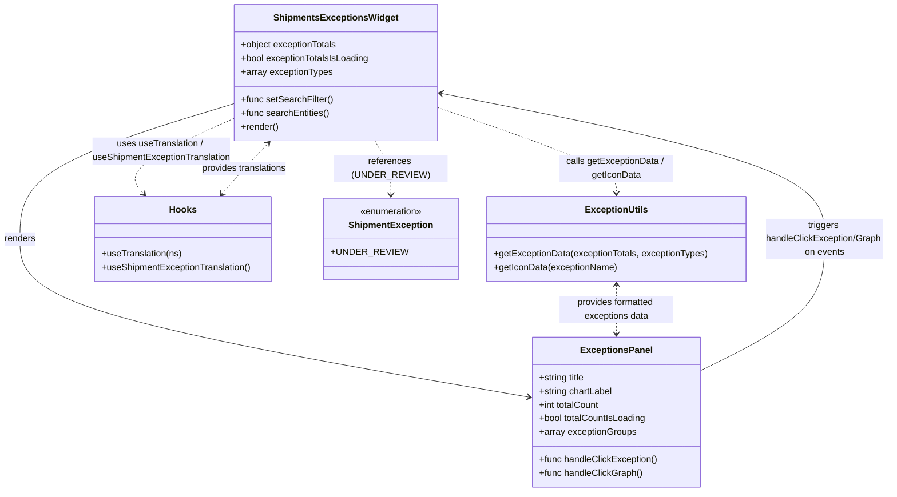

# Diagram: web/portal/src/pages/shipments/dashboard/components/organisms/Shipments.ExceptionsWidget.organism.js

> Auto-generated by Obscura crawlers

## Mermaid

### SVG

<svg id="container" width="1558.833984375" xmlns="http://www.w3.org/2000/svg" class="classDiagram" height="866" viewBox="0 0 1558.833984375 866" role="graphics-document document" aria-roledescription="class"><g><defs><marker id="container_class-aggregationStart" class="marker aggregation class" refX="18" refY="7" markerWidth="190" markerHeight="240" orient="auto"><path d="M 18,7 L9,13 L1,7 L9,1 Z"></path></marker></defs><defs><marker id="container_class-aggregationEnd" class="marker aggregation class" refX="1" refY="7" markerWidth="20" markerHeight="28" orient="auto"><path d="M 18,7 L9,13 L1,7 L9,1 Z"></path></marker></defs><defs><marker id="container_class-extensionStart" class="marker extension class" refX="18" refY="7" markerWidth="190" markerHeight="240" orient="auto"><path d="M 1,7 L18,13 V 1 Z"></path></marker></defs><defs><marker id="container_class-extensionEnd" class="marker extension class" refX="1" refY="7" markerWidth="20" markerHeight="28" orient="auto"><path d="M 1,1 V 13 L18,7 Z"></path></marker></defs><defs><marker id="container_class-compositionStart" class="marker composition class" refX="18" refY="7" markerWidth="190" markerHeight="240" orient="auto"><path d="M 18,7 L9,13 L1,7 L9,1 Z"></path></marker></defs><defs><marker id="container_class-compositionEnd" class="marker composition class" refX="1" refY="7" markerWidth="20" markerHeight="28" orient="auto"><path d="M 18,7 L9,13 L1,7 L9,1 Z"></path></marker></defs><defs><marker id="container_class-dependencyStart" class="marker dependency class" refX="6" refY="7" markerWidth="190" markerHeight="240" orient="auto"><path d="M 5,7 L9,13 L1,7 L9,1 Z"></path></marker></defs><defs><marker id="container_class-dependencyEnd" class="marker dependency class" refX="13" refY="7" markerWidth="20" markerHeight="28" orient="auto"><path d="M 18,7 L9,13 L14,7 L9,1 Z"></path></marker></defs><defs><marker id="container_class-lollipopStart" class="marker lollipop class" refX="13" refY="7" markerWidth="190" markerHeight="240" orient="auto"><circle stroke="black" fill="transparent" cx="7" cy="7" r="6"></circle></marker></defs><defs><marker id="container_class-lollipopEnd" class="marker lollipop class" refX="1" refY="7" markerWidth="190" markerHeight="240" orient="auto"><circle stroke="black" fill="transparent" cx="7" cy="7" r="6"></circle></marker></defs><g class="root"><g class="clusters"></g><g class="edgePaths"><path d="M416.049,181.932L352.666,201.11C289.283,220.288,162.516,258.644,99.133,298.489C35.75,338.333,35.75,379.667,35.75,421C35.75,462.333,35.75,503.667,184.035,550.091C332.321,596.516,628.891,648.033,777.176,673.791L925.462,699.549" id="id_ShipmentsExceptionsWidget_ExceptionsPanel_1" class="edge-thickness-normal edge-pattern-solid relation" style=";;;" data-edge="true" data-et="edge" data-id="id_ShipmentsExceptionsWidget_ExceptionsPanel_1" data-points="W3sieCI6NDE2LjA0ODgyODEyNSwieSI6MTgxLjkzMjI1OTgxMjkyMDd9LHsieCI6MzUuNzUsInkiOjI5N30seyJ4IjozNS43NSwieSI6NDIxfSx7IngiOjM1Ljc1LCJ5Ijo1NDV9LHsieCI6OTMxLjM3MzA0Njg3NSwieSI6NzAwLjU3NTcxODMyNjQzODZ9XQ==" marker-end="url(#container_class-dependencyEnd)"></path><path d="M772.541,190.311L823.407,208.092C874.273,225.874,976.005,261.437,1026.87,286.385C1077.736,311.333,1077.736,325.667,1077.736,332.833L1077.736,340" id="id_ShipmentsExceptionsWidget_ExceptionUtils_2" class="edge-thickness-normal edge-pattern-dashed relation" style=";;;" data-edge="true" data-et="edge" data-id="id_ShipmentsExceptionsWidget_ExceptionUtils_2" data-points="W3sieCI6NzcyLjU0MTAxNTYyNSwieSI6MTkwLjMxMDczNjAxNTM4NDV9LHsieCI6MTA3Ny43MzYzMjgxMjUsInkiOjI5N30seyJ4IjoxMDc3LjczNjMyODEyNSwieSI6MzQ2fV0=" marker-end="url(#container_class-dependencyEnd)"></path><path d="M416.049,207.852L382.883,222.71C349.717,237.568,283.385,267.284,256.813,289.561C230.241,311.838,243.429,326.677,250.022,334.096L256.616,341.515" id="id_ShipmentsExceptionsWidget_Hooks_3" class="edge-thickness-normal edge-pattern-dashed relation" style=";;;" data-edge="true" data-et="edge" data-id="id_ShipmentsExceptionsWidget_Hooks_3" data-points="W3sieCI6NDE2LjA0ODgyODEyNSwieSI6MjA3Ljg1MjEyMzc2MDAxODIzfSx7IngiOjIxNy4wNTI3MzQzNzUsInkiOjI5N30seyJ4IjoyNjAuNjAyMjg3MDQ2MzcxLCJ5IjozNDZ9XQ==" marker-end="url(#container_class-dependencyEnd)"></path><path d="M664.166,248L668.922,256.167C673.677,264.333,683.187,280.667,687.942,296.5C692.697,312.333,692.697,327.667,692.697,335.333L692.697,343" id="id_ShipmentsExceptionsWidget_ShipmentException_4" class="edge-thickness-normal edge-pattern-dashed relation" style=";;;" data-edge="true" data-et="edge" data-id="id_ShipmentsExceptionsWidget_ShipmentException_4" data-points="W3sieCI6NjY0LjE2NjQwODU2MTM5MDUsInkiOjI0OH0seyJ4Ijo2OTIuNjk3MjY1NjI1LCJ5IjoyOTd9LHsieCI6NjkyLjY5NzI2NTYyNSwieSI6MzQ5fV0=" marker-end="url(#container_class-dependencyEnd)"></path><path d="M1077.736,502L1077.736,509.167C1077.736,516.333,1077.736,530.667,1077.736,545C1077.736,559.333,1077.736,573.667,1077.736,580.833L1077.736,588" id="id_ExceptionUtils_ExceptionsPanel_5" class="edge-thickness-normal edge-pattern-dashed relation" style=";;;" data-edge="true" data-et="edge" data-id="id_ExceptionUtils_ExceptionsPanel_5" data-points="W3sieCI6MTA3Ny43MzYzMjgxMjUsInkiOjQ5Nn0seyJ4IjoxMDc3LjczNjMyODEyNSwieSI6NTQ1fSx7IngiOjEwNzcuNzM2MzI4MTI1LCJ5Ijo1OTR9XQ==" marker-start="url(#container_class-dependencyStart)" marker-end="url(#container_class-dependencyEnd)"></path><path d="M397.903,341.515L404.497,334.096C411.091,326.677,424.279,311.838,437.771,296.986C451.263,282.133,465.06,267.265,471.958,259.832L478.856,252.398" id="id_Hooks_ShipmentsExceptionsWidget_6" class="edge-thickness-normal edge-pattern-dashed relation" style=";;;" data-edge="true" data-et="edge" data-id="id_Hooks_ShipmentsExceptionsWidget_6" data-points="W3sieCI6MzkzLjkxNzI0NDIwMzYyOSwieSI6MzQ2fSx7IngiOjQzNy40NjY3OTY4NzUsInkiOjI5N30seyJ4Ijo0ODIuOTM3NjczMzU0Mjg5OSwieSI6MjQ4fV0=" marker-start="url(#container_class-dependencyStart)" marker-end="url(#container_class-dependencyEnd)"></path><path d="M1224.1,653.985L1261.016,635.821C1297.933,617.657,1371.766,581.328,1408.683,542.497C1445.6,503.667,1445.6,462.333,1445.6,421C1445.6,379.667,1445.6,338.333,1334.404,295.592C1223.208,252.851,1000.817,208.702,889.622,186.628L778.426,164.554" id="id_ExceptionsPanel_ShipmentsExceptionsWidget_7" class="edge-thickness-normal edge-pattern-solid relation" style=";;;" data-edge="true" data-et="edge" data-id="id_ExceptionsPanel_ShipmentsExceptionsWidget_7" data-points="W3sieCI6MTIyNC4wOTk2MDkzNzUsInkiOjY1My45ODQ3ODMzMjQzMDc0fSx7IngiOjE0NDUuNTk5NjA5Mzc1LCJ5Ijo1NDV9LHsieCI6MTQ0NS41OTk2MDkzNzUsInkiOjQyMX0seyJ4IjoxNDQ1LjU5OTYwOTM3NSwieSI6Mjk3fSx7IngiOjc3Mi41NDEwMTU2MjUsInkiOjE2My4zODUyMDM3NzcyOTAzN31d" marker-end="url(#container_class-dependencyEnd)"></path></g><g class="edgeLabels"><g class="edgeLabel" transform="translate(35.75, 421)"><g class="label" data-id="id_ShipmentsExceptionsWidget_ExceptionsPanel_1" transform="translate(-27.75, -12)"><foreignObject width="55.5" height="24">

renders

</foreignObject></g></g><g class="edgeLabel" transform="translate(1077.736328125, 297)"><g class="label" data-id="id_ShipmentsExceptionsWidget_ExceptionUtils_2" transform="translate(-100, -24)"><foreignObject width="200" height="48">

calls getExceptionData / getIconData

</foreignObject></g></g><g class="edgeLabel" transform="translate(286.63743, 265.82689)"><g class="label" data-id="id_ShipmentsExceptionsWidget_Hooks_3" transform="translate(-123.609375, -24)"><foreignObject width="247.21875" height="48">

uses useTranslation / useShipmentExceptionTranslation

</foreignObject></g></g><g class="edgeLabel" transform="translate(692.697265625, 297)"><g class="label" data-id="id_ShipmentsExceptionsWidget_ShipmentException_4" transform="translate(-100, -24)"><foreignObject width="200" height="48">

references (UNDER_REVIEW)

</foreignObject></g></g><g class="edgeLabel" transform="translate(1077.736328125, 545)"><g class="label" data-id="id_ExceptionUtils_ExceptionsPanel_5" transform="translate(-100, -24)"><foreignObject width="200" height="48">

provides formatted exceptions data

</foreignObject></g></g><g class="edgeLabel" transform="translate(437.466796875, 297)"><g class="label" data-id="id_Hooks_ShipmentsExceptionsWidget_6" transform="translate(-76.8046875, -12)"><foreignObject width="153.609375" height="24">

provides translations

</foreignObject></g></g><g class="edgeLabel" transform="translate(1445.599609375, 421)"><g class="label" data-id="id_ExceptionsPanel_ShipmentsExceptionsWidget_7" transform="translate(-105.234375, -36)"><foreignObject width="210.46875" height="72">

triggers handleClickException/Graph on events

</foreignObject></g></g></g><g class="nodes"><g class="node default" id="classId-ShipmentsExceptionsWidget-0" transform="translate(594.294921875, 128)"><g class="basic label-container"><path d="M-178.24609375 -120 L178.24609375 -120 L178.24609375 120 L-178.24609375 120" stroke="none" stroke-width="0" fill="#ECECFF" style=""></path><path d="M-178.24609375 -120 C-106.28637399067634 -120, -34.32665423135268 -120, 178.24609375 -120 M-178.24609375 -120 C-102.0497076383184 -120, -25.85332152663679 -120, 178.24609375 -120 M178.24609375 -120 C178.24609375 -55.350071376187174, 178.24609375 9.299857247625653, 178.24609375 120 M178.24609375 -120 C178.24609375 -26.107576859344874, 178.24609375 67.78484628131025, 178.24609375 120 M178.24609375 120 C41.55476509551417 120, -95.13656355897166 120, -178.24609375 120 M178.24609375 120 C72.32629975549105 120, -33.5934942390179 120, -178.24609375 120 M-178.24609375 120 C-178.24609375 60.95593616214695, -178.24609375 1.9118723242938955, -178.24609375 -120 M-178.24609375 120 C-178.24609375 63.441390081498405, -178.24609375 6.882780162996809, -178.24609375 -120" stroke="#9370DB" stroke-width="1.3" fill="none" stroke-dasharray="0 0" style=""></path></g><g class="annotation-group text" transform="translate(0, -96)"></g><g class="label-group text" transform="translate(-104.1015625, -96)"><g class="label" style="font-weight: bolder" transform="translate(0,-12)"><foreignObject width="208.203125" height="24">

ShipmentsExceptionsWidget

</foreignObject></g></g><g class="members-group text" transform="translate(-166.24609375, -48)"><g class="label" style="" transform="translate(0,-12)"><foreignObject width="171.5625" height="24">

+object exceptionTotals

</foreignObject></g><g class="label" style="" transform="translate(0,12)"><foreignObject width="228.390625" height="24">

+bool exceptionTotalsIsLoading

</foreignObject></g><g class="label" style="" transform="translate(0,36)"><foreignObject width="160.78125" height="24">

+array exceptionTypes

</foreignObject></g></g><g class="methods-group text" transform="translate(-166.24609375, 48)"><g class="label" style="" transform="translate(0,-12)"><foreignObject width="161.65625" height="24">

+func setSearchFilter()

</foreignObject></g><g class="label" style="" transform="translate(0,12)"><foreignObject width="156.0625" height="24">

+func searchEntities()

</foreignObject></g><g class="label" style="" transform="translate(0,36)"><foreignObject width="66.609375" height="24">

+render()

</foreignObject></g></g><g class="divider" style=""><path d="M-178.24609375 -72 C-84.79175671249077 -72, 8.662580325018467 -72, 178.24609375 -72 M-178.24609375 -72 C-89.45013666804125 -72, -0.6541795860825061 -72, 178.24609375 -72" stroke="#9370DB" stroke-width="1.3" fill="none" stroke-dasharray="0 0" style=""></path></g><g class="divider" style=""><path d="M-178.24609375 24 C-69.1343367074417 24, 39.97742033511659 24, 178.24609375 24 M-178.24609375 24 C-38.80170232450459 24, 100.64268910099082 24, 178.24609375 24" stroke="#9370DB" stroke-width="1.3" fill="none" stroke-dasharray="0 0" style=""></path></g></g><g class="node default" id="classId-ExceptionsPanel-1" transform="translate(1077.736328125, 726)"><g class="basic label-container"><path d="M-146.36328125 -132 L146.36328125 -132 L146.36328125 132 L-146.36328125 132" stroke="none" stroke-width="0" fill="#ECECFF" style=""></path><path d="M-146.36328125 -132 C-74.14099087378784 -132, -1.918700497575685 -132, 146.36328125 -132 M-146.36328125 -132 C-69.12244320633357 -132, 8.118394837332858 -132, 146.36328125 -132 M146.36328125 -132 C146.36328125 -64.10452978820528, 146.36328125 3.790940423589433, 146.36328125 132 M146.36328125 -132 C146.36328125 -42.67564094111961, 146.36328125 46.64871811776078, 146.36328125 132 M146.36328125 132 C76.61397432242941 132, 6.864667394858827 132, -146.36328125 132 M146.36328125 132 C83.34454270109751 132, 20.325804152195005 132, -146.36328125 132 M-146.36328125 132 C-146.36328125 28.263102096633475, -146.36328125 -75.47379580673305, -146.36328125 -132 M-146.36328125 132 C-146.36328125 29.602996896318857, -146.36328125 -72.79400620736229, -146.36328125 -132" stroke="#9370DB" stroke-width="1.3" fill="none" stroke-dasharray="0 0" style=""></path></g><g class="annotation-group text" transform="translate(0, -108)"></g><g class="label-group text" transform="translate(-59.7421875, -108)"><g class="label" style="font-weight: bolder" transform="translate(0,-12)"><foreignObject width="119.484375" height="24">

ExceptionsPanel

</foreignObject></g></g><g class="members-group text" transform="translate(-134.36328125, -60)"><g class="label" style="" transform="translate(0,-12)"><foreignObject width="83.09375" height="24">

+string title

</foreignObject></g><g class="label" style="" transform="translate(0,12)"><foreignObject width="130.96875" height="24">

+string chartLabel

</foreignObject></g><g class="label" style="" transform="translate(0,36)"><foreignObject width="108.125" height="24">

+int totalCount

</foreignObject></g><g class="label" style="" transform="translate(0,60)"><foreignObject width="190.765625" height="24">

+bool totalCountIsLoading

</foreignObject></g><g class="label" style="" transform="translate(0,84)"><foreignObject width="171" height="24">

+array exceptionGroups

</foreignObject></g></g><g class="methods-group text" transform="translate(-134.36328125, 84)"><g class="label" style="" transform="translate(0,-12)"><foreignObject width="208.984375" height="24">

+func handleClickException()

</foreignObject></g><g class="label" style="" transform="translate(0,12)"><foreignObject width="181.546875" height="24">

+func handleClickGraph()

</foreignObject></g></g><g class="divider" style=""><path d="M-146.36328125 -84 C-66.97301776016391 -84, 12.417245729672175 -84, 146.36328125 -84 M-146.36328125 -84 C-71.07983150296862 -84, 4.203618244062767 -84, 146.36328125 -84" stroke="#9370DB" stroke-width="1.3" fill="none" stroke-dasharray="0 0" style=""></path></g><g class="divider" style=""><path d="M-146.36328125 60 C-38.403345783901685 60, 69.55658968219663 60, 146.36328125 60 M-146.36328125 60 C-44.11163979655781 60, 58.14000165688438 60, 146.36328125 60" stroke="#9370DB" stroke-width="1.3" fill="none" stroke-dasharray="0 0" style=""></path></g></g><g class="node default" id="classId-ExceptionUtils-2" transform="translate(1077.736328125, 421)"><g class="basic label-container"><path d="M-227.62890625 -75 L227.62890625 -75 L227.62890625 75 L-227.62890625 75" stroke="none" stroke-width="0" fill="#ECECFF" style=""></path><path d="M-227.62890625 -75 C-134.16512732733838 -75, -40.701348404676736 -75, 227.62890625 -75 M-227.62890625 -75 C-109.36687746923815 -75, 8.895151311523705 -75, 227.62890625 -75 M227.62890625 -75 C227.62890625 -16.934436773456213, 227.62890625 41.131126453087575, 227.62890625 75 M227.62890625 -75 C227.62890625 -22.495197768166072, 227.62890625 30.009604463667856, 227.62890625 75 M227.62890625 75 C59.150960443254945 75, -109.32698536349011 75, -227.62890625 75 M227.62890625 75 C75.44566421256673 75, -76.73757782486655 75, -227.62890625 75 M-227.62890625 75 C-227.62890625 30.481818018907973, -227.62890625 -14.036363962184055, -227.62890625 -75 M-227.62890625 75 C-227.62890625 43.832269934839005, -227.62890625 12.664539869678016, -227.62890625 -75" stroke="#9370DB" stroke-width="1.3" fill="none" stroke-dasharray="0 0" style=""></path></g><g class="annotation-group text" transform="translate(0, -51)"></g><g class="label-group text" transform="translate(-52.4921875, -51)"><g class="label" style="font-weight: bolder" transform="translate(0,-12)"><foreignObject width="104.984375" height="24">

ExceptionUtils

</foreignObject></g></g><g class="members-group text" transform="translate(-215.62890625, -3)"></g><g class="methods-group text" transform="translate(-215.62890625, 27)"><g class="label" style="" transform="translate(0,-12)"><foreignObject width="378.765625" height="24">

+getExceptionData(exceptionTotals, exceptionTypes)

</foreignObject></g><g class="label" style="" transform="translate(0,12)"><foreignObject width="217.71875" height="24">

+getIconData(exceptionName)

</foreignObject></g></g><g class="divider" style=""><path d="M-227.62890625 -27 C-120.29019581813307 -27, -12.951485386266143 -27, 227.62890625 -27 M-227.62890625 -27 C-121.32736185045198 -27, -15.025817450903958 -27, 227.62890625 -27" stroke="#9370DB" stroke-width="1.3" fill="none" stroke-dasharray="0 0" style=""></path></g><g class="divider" style=""><path d="M-227.62890625 -3 C-132.8834340020291 -3, -38.13796175405818 -3, 227.62890625 -3 M-227.62890625 -3 C-49.36159024376241 -3, 128.90572576247519 -3, 227.62890625 -3" stroke="#9370DB" stroke-width="1.3" fill="none" stroke-dasharray="0 0" style=""></path></g></g><g class="node default" id="classId-Hooks-3" transform="translate(327.259765625, 421)"><g class="basic label-container"><path d="M-156.24609375 -75 L156.24609375 -75 L156.24609375 75 L-156.24609375 75" stroke="none" stroke-width="0" fill="#ECECFF" style=""></path><path d="M-156.24609375 -75 C-83.53907067260145 -75, -10.832047595202908 -75, 156.24609375 -75 M-156.24609375 -75 C-80.26661256317483 -75, -4.287131376349663 -75, 156.24609375 -75 M156.24609375 -75 C156.24609375 -37.01025746654024, 156.24609375 0.9794850669195228, 156.24609375 75 M156.24609375 -75 C156.24609375 -17.251239659601538, 156.24609375 40.497520680796924, 156.24609375 75 M156.24609375 75 C39.823637104328654 75, -76.59881954134269 75, -156.24609375 75 M156.24609375 75 C81.325507465346 75, 6.404921180692014 75, -156.24609375 75 M-156.24609375 75 C-156.24609375 26.15588489289214, -156.24609375 -22.68823021421572, -156.24609375 -75 M-156.24609375 75 C-156.24609375 44.45582725098659, -156.24609375 13.911654501973182, -156.24609375 -75" stroke="#9370DB" stroke-width="1.3" fill="none" stroke-dasharray="0 0" style=""></path></g><g class="annotation-group text" transform="translate(0, -51)"></g><g class="label-group text" transform="translate(-22.9140625, -51)"><g class="label" style="font-weight: bolder" transform="translate(0,-12)"><foreignObject width="45.828125" height="24">

Hooks

</foreignObject></g></g><g class="members-group text" transform="translate(-144.24609375, -3)"></g><g class="methods-group text" transform="translate(-144.24609375, 27)"><g class="label" style="" transform="translate(0,-12)"><foreignObject width="141.984375" height="24">

+useTranslation(ns)

</foreignObject></g><g class="label" style="" transform="translate(0,12)"><foreignObject width="265.578125" height="24">

+useShipmentExceptionTranslation()

</foreignObject></g></g><g class="divider" style=""><path d="M-156.24609375 -27 C-65.08609706123721 -27, 26.073899627525577 -27, 156.24609375 -27 M-156.24609375 -27 C-48.16628234611305 -27, 59.9135290577739 -27, 156.24609375 -27" stroke="#9370DB" stroke-width="1.3" fill="none" stroke-dasharray="0 0" style=""></path></g><g class="divider" style=""><path d="M-156.24609375 -3 C-62.48528899405248 -3, 31.275515761895036 -3, 156.24609375 -3 M-156.24609375 -3 C-74.64752892572655 -3, 6.951035898546905 -3, 156.24609375 -3" stroke="#9370DB" stroke-width="1.3" fill="none" stroke-dasharray="0 0" style=""></path></g></g><g class="node default" id="classId-ShipmentException-4" transform="translate(692.697265625, 421)"><g class="basic label-container"><path d="M-107.41015625 -72 L107.41015625 -72 L107.41015625 72 L-107.41015625 72" stroke="none" stroke-width="0" fill="#ECECFF" style=""></path><path d="M-107.41015625 -72 C-29.77214716031122 -72, 47.86586192937756 -72, 107.41015625 -72 M-107.41015625 -72 C-49.082592901949134 -72, 9.244970446101732 -72, 107.41015625 -72 M107.41015625 -72 C107.41015625 -41.91768285294616, 107.41015625 -11.835365705892322, 107.41015625 72 M107.41015625 -72 C107.41015625 -21.985722309693337, 107.41015625 28.028555380613327, 107.41015625 72 M107.41015625 72 C52.83463225576348 72, -1.7408917384730387 72, -107.41015625 72 M107.41015625 72 C44.272549097994094 72, -18.86505805401181 72, -107.41015625 72 M-107.41015625 72 C-107.41015625 40.650505669086506, -107.41015625 9.301011338173012, -107.41015625 -72 M-107.41015625 72 C-107.41015625 14.884266157636844, -107.41015625 -42.23146768472631, -107.41015625 -72" stroke="#9370DB" stroke-width="1.3" fill="none" stroke-dasharray="0 0" style=""></path></g><g class="annotation-group text" transform="translate(-55.5546875, -48)"><g class="label" style="" transform="translate(0,-12)"><foreignObject width="111.109375" height="24">

«enumeration»

</foreignObject></g></g><g class="label-group text" transform="translate(-70.8046875, -24)"><g class="label" style="font-weight: bolder" transform="translate(0,-12)"><foreignObject width="141.609375" height="24">

ShipmentException

</foreignObject></g></g><g class="members-group text" transform="translate(-95.41015625, 24)"><g class="label" style="" transform="translate(0,-12)"><foreignObject width="120.015625" height="24">

+UNDER_REVIEW

</foreignObject></g></g><g class="methods-group text" transform="translate(-95.41015625, 72)"></g><g class="divider" style=""><path d="M-107.41015625 0 C-30.087989660959494 0, 47.23417692808101 0, 107.41015625 0 M-107.41015625 0 C-40.62041845507774 0, 26.16931933984452 0, 107.41015625 0" stroke="#9370DB" stroke-width="1.3" fill="none" stroke-dasharray="0 0" style=""></path></g><g class="divider" style=""><path d="M-107.41015625 48 C-58.26012219254363 48, -9.110088135087267 48, 107.41015625 48 M-107.41015625 48 C-49.56125990357243 48, 8.287636442855145 48, 107.41015625 48" stroke="#9370DB" stroke-width="1.3" fill="none" stroke-dasharray="0 0" style=""></path></g></g></g></g></g></svg>
