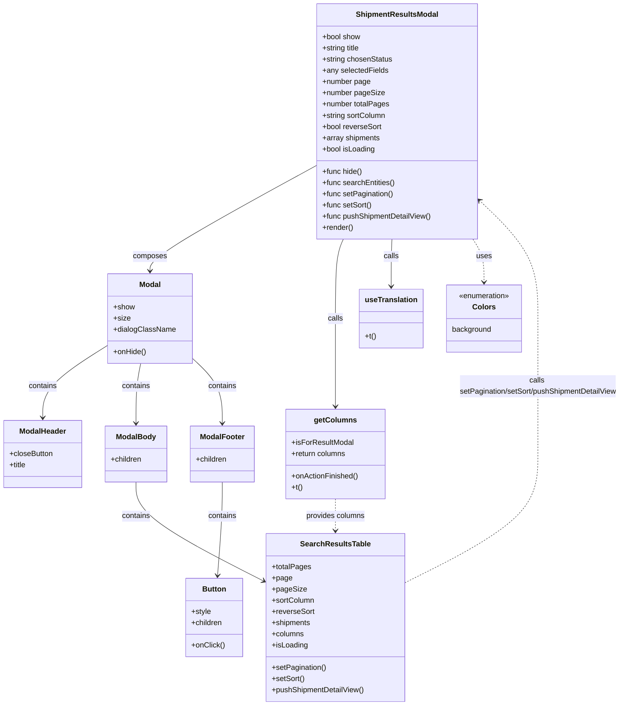

# Diagram: web/portal/src/pages/shipments/dashboard/components/organisms/Shipments.ResultsModal.organism.js

> Auto-generated by Obscura crawlers

## Mermaid

### SVG

<svg id="container" width="1333.474609375" xmlns="http://www.w3.org/2000/svg" class="classDiagram" height="1510" viewBox="0 0 1333.474609375 1510" role="graphics-document document" aria-roledescription="class"><g><defs><marker id="container_class-aggregationStart" class="marker aggregation class" refX="18" refY="7" markerWidth="190" markerHeight="240" orient="auto"><path d="M 18,7 L9,13 L1,7 L9,1 Z"></path></marker></defs><defs><marker id="container_class-aggregationEnd" class="marker aggregation class" refX="1" refY="7" markerWidth="20" markerHeight="28" orient="auto"><path d="M 18,7 L9,13 L1,7 L9,1 Z"></path></marker></defs><defs><marker id="container_class-extensionStart" class="marker extension class" refX="18" refY="7" markerWidth="190" markerHeight="240" orient="auto"><path d="M 1,7 L18,13 V 1 Z"></path></marker></defs><defs><marker id="container_class-extensionEnd" class="marker extension class" refX="1" refY="7" markerWidth="20" markerHeight="28" orient="auto"><path d="M 1,1 V 13 L18,7 Z"></path></marker></defs><defs><marker id="container_class-compositionStart" class="marker composition class" refX="18" refY="7" markerWidth="190" markerHeight="240" orient="auto"><path d="M 18,7 L9,13 L1,7 L9,1 Z"></path></marker></defs><defs><marker id="container_class-compositionEnd" class="marker composition class" refX="1" refY="7" markerWidth="20" markerHeight="28" orient="auto"><path d="M 18,7 L9,13 L1,7 L9,1 Z"></path></marker></defs><defs><marker id="container_class-dependencyStart" class="marker dependency class" refX="6" refY="7" markerWidth="190" markerHeight="240" orient="auto"><path d="M 5,7 L9,13 L1,7 L9,1 Z"></path></marker></defs><defs><marker id="container_class-dependencyEnd" class="marker dependency class" refX="13" refY="7" markerWidth="20" markerHeight="28" orient="auto"><path d="M 18,7 L9,13 L14,7 L9,1 Z"></path></marker></defs><defs><marker id="container_class-lollipopStart" class="marker lollipop class" refX="13" refY="7" markerWidth="190" markerHeight="240" orient="auto"><circle stroke="black" fill="transparent" cx="7" cy="7" r="6"></circle></marker></defs><defs><marker id="container_class-lollipopEnd" class="marker lollipop class" refX="1" refY="7" markerWidth="190" markerHeight="240" orient="auto"><circle stroke="black" fill="transparent" cx="7" cy="7" r="6"></circle></marker></defs><g class="root"><g class="clusters"></g><g class="edgePaths"><path d="M675.314,354.431L616.221,386.859C557.128,419.287,438.942,484.144,379.849,521.738C320.756,559.333,320.756,569.667,320.756,574.833L320.756,580" id="id_ShipmentResultsModal_Modal_1" class="edge-thickness-normal edge-pattern-solid relation" style=";;;" data-edge="true" data-et="edge" data-id="id_ShipmentResultsModal_Modal_1" data-points="W3sieCI6Njc1LjMxNDQ1MzEyNSwieSI6MzU0LjQzMDUxNzk1MzcwMDg3fSx7IngiOjMyMC43NTU4NTkzNzUsInkiOjU0OX0seyJ4IjozMjAuNzU1ODU5Mzc1LCJ5Ijo1ODZ9XQ==" marker-end="url(#container_class-dependencyEnd)"></path><path d="M231.689,738.428L208.389,753.19C185.089,767.952,138.488,797.476,115.187,823.405C91.887,849.333,91.887,871.667,91.887,882.833L91.887,894" id="id_Modal_ModalHeader_2" class="edge-thickness-normal edge-pattern-solid relation" style=";;;" data-edge="true" data-et="edge" data-id="id_Modal_ModalHeader_2" data-points="W3sieCI6MjMxLjY4OTQ1MzEyNSwieSI6NzM4LjQyODAwNDUzOTk4NTJ9LHsieCI6OTEuODg2NzE4NzUsInkiOjgyN30seyJ4Ijo5MS44ODY3MTg3NSwieSI6OTAwfV0=" marker-end="url(#container_class-dependencyEnd)"></path><path d="M301.73,778L300.112,786.167C298.493,794.333,295.256,810.667,293.638,832C292.02,853.333,292.02,879.667,292.02,892.833L292.02,906" id="id_Modal_ModalBody_3" class="edge-thickness-normal edge-pattern-solid relation" style=";;;" data-edge="true" data-et="edge" data-id="id_Modal_ModalBody_3" data-points="W3sieCI6MzAxLjczMDQyODM0MDUxNzIsInkiOjc3OH0seyJ4IjoyOTIuMDE5NTMxMjUsInkiOjgyN30seyJ4IjoyOTIuMDE5NTMxMjUsInkiOjkxMn1d" marker-end="url(#container_class-dependencyEnd)"></path><path d="M409.822,764.657L421.019,775.047C432.215,785.438,454.607,806.219,465.804,829.776C477,853.333,477,879.667,477,892.833L477,906" id="id_Modal_ModalFooter_4" class="edge-thickness-normal edge-pattern-solid relation" style=";;;" data-edge="true" data-et="edge" data-id="id_Modal_ModalFooter_4" data-points="W3sieCI6NDA5LjgyMjI2NTYyNSwieSI6NzY0LjY1NjcyNDYyNzE3MzV9LHsieCI6NDc3LCJ5Ijo4Mjd9LHsieCI6NDc3LCJ5Ijo5MTJ9XQ==" marker-end="url(#container_class-dependencyEnd)"></path><path d="M292.02,1032L292.02,1044.167C292.02,1056.333,292.02,1080.667,337.482,1116C382.944,1151.333,473.868,1197.665,519.331,1220.832L564.793,1243.998" id="id_ModalBody_SearchResultsTable_5" class="edge-thickness-normal edge-pattern-solid relation" style=";;;" data-edge="true" data-et="edge" data-id="id_ModalBody_SearchResultsTable_5" data-points="W3sieCI6MjkyLjAxOTUzMTI1LCJ5IjoxMDMyfSx7IngiOjI5Mi4wMTk1MzEyNSwieSI6MTEwNX0seyJ4Ijo1NzAuMTM4NjcxODc1LCJ5IjoxMjQ2LjcyMjM0OTM2OTEzMjJ9XQ==" marker-end="url(#container_class-dependencyEnd)"></path><path d="M734.448,512L731.684,518.167C728.921,524.333,723.393,536.667,720.629,565C717.865,593.333,717.865,637.667,717.865,684C717.865,730.333,717.865,778.667,717.865,810C717.865,841.333,717.865,855.667,717.865,862.833L717.865,870" id="id_ShipmentResultsModal_getColumns_6" class="edge-thickness-normal edge-pattern-solid relation" style=";;;" data-edge="true" data-et="edge" data-id="id_ShipmentResultsModal_getColumns_6" data-points="W3sieCI6NzM0LjQ0ODMxOTkwNzAwNjksInkiOjUxMn0seyJ4Ijo3MTcuODY1MjM0Mzc1LCJ5Ijo1NDl9LHsieCI6NzE3Ljg2NTIzNDM3NSwieSI6NjgyfSx7IngiOjcxNy44NjUyMzQzNzUsInkiOjgyN30seyJ4Ijo3MTcuODY1MjM0Mzc1LCJ5Ijo4NzZ9XQ==" marker-end="url(#container_class-dependencyEnd)"></path><path d="M836.932,512L836.676,518.167C836.42,524.333,835.908,536.667,835.652,553.5C835.396,570.333,835.396,591.667,835.396,602.333L835.396,613" id="id_ShipmentResultsModal_useTranslation_7" class="edge-thickness-normal edge-pattern-solid relation" style=";;;" data-edge="true" data-et="edge" data-id="id_ShipmentResultsModal_useTranslation_7" data-points="W3sieCI6ODM2LjkzMjMxNjQ0Njc5OTMsInkiOjUxMn0seyJ4Ijo4MzUuMzk2NDg0Mzc1LCJ5Ijo1NDl9LHsieCI6ODM1LjM5NjQ4NDM3NSwieSI6NjE5fV0=" marker-end="url(#container_class-dependencyEnd)"></path><path d="M477,1032L477,1044.167C477,1056.333,477,1080.667,475.367,1114.003C473.734,1147.339,470.468,1189.679,468.834,1210.848L467.201,1232.018" id="id_ModalFooter_Button_8" class="edge-thickness-normal edge-pattern-solid relation" style=";;;" data-edge="true" data-et="edge" data-id="id_ModalFooter_Button_8" data-points="W3sieCI6NDc3LCJ5IjoxMDMyfSx7IngiOjQ3NywieSI6MTEwNX0seyJ4Ijo0NjYuNzM5ODU2MzUwODA2NDYsInkiOjEyMzh9XQ==" marker-end="url(#container_class-dependencyEnd)"></path><path d="M1010.077,512L1014.058,518.167C1018.039,524.333,1026.001,536.667,1029.982,552C1033.963,567.333,1033.963,585.667,1033.963,594.833L1033.963,604" id="id_ShipmentResultsModal_Colors_9" class="edge-thickness-normal edge-pattern-dashed relation" style=";;;" data-edge="true" data-et="edge" data-id="id_ShipmentResultsModal_Colors_9" data-points="W3sieCI6MTAxMC4wNzY3MjYwNDg4NzU1LCJ5Ijo1MTJ9LHsieCI6MTAzMy45NjI4OTA2MjUsInkiOjU0OX0seyJ4IjoxMDMzLjk2Mjg5MDYyNSwieSI6NjEwfV0=" marker-end="url(#container_class-dependencyEnd)"></path><path d="M717.865,1068L717.865,1074.167C717.865,1080.333,717.865,1092.667,717.865,1104C717.865,1115.333,717.865,1125.667,717.865,1130.833L717.865,1136" id="id_getColumns_SearchResultsTable_10" class="edge-thickness-normal edge-pattern-dashed relation" style=";;;" data-edge="true" data-et="edge" data-id="id_getColumns_SearchResultsTable_10" data-points="W3sieCI6NzE3Ljg2NTIzNDM3NSwieSI6MTA2OH0seyJ4Ijo3MTcuODY1MjM0Mzc1LCJ5IjoxMTA1fSx7IngiOjcxNy44NjUyMzQzNzUsInkiOjExNDJ9XQ==" marker-end="url(#container_class-dependencyEnd)"></path><path d="M865.592,1248.065L913.234,1224.221C960.876,1200.377,1056.16,1152.688,1103.801,1106.677C1151.443,1060.667,1151.443,1016.333,1151.443,970C1151.443,923.667,1151.443,875.333,1151.443,827C1151.443,778.667,1151.443,730.333,1151.443,684C1151.443,637.667,1151.443,593.333,1130.173,550.949C1108.902,508.565,1066.361,468.129,1045.09,447.911L1023.82,427.694" id="id_SearchResultsTable_ShipmentResultsModal_11" class="edge-thickness-normal edge-pattern-dashed relation" style=";;;" data-edge="true" data-et="edge" data-id="id_SearchResultsTable_ShipmentResultsModal_11" data-points="W3sieCI6ODY1LjU5MTc5Njg3NSwieSI6MTI0OC4wNjQ4NDkxODM3NTQ0fSx7IngiOjExNTEuNDQzMzU5Mzc1LCJ5IjoxMTA1fSx7IngiOjExNTEuNDQzMzU5Mzc1LCJ5Ijo5NzJ9LHsieCI6MTE1MS40NDMzNTkzNzUsInkiOjgyN30seyJ4IjoxMTUxLjQ0MzM1OTM3NSwieSI6NjgyfSx7IngiOjExNTEuNDQzMzU5Mzc1LCJ5Ijo1NDl9LHsieCI6MTAxOS40NzA3MDMxMjUsInkiOjQyMy41NjAxMDYzNzYxNDUwM31d" marker-end="url(#container_class-dependencyEnd)"></path></g><g class="edgeLabels"><g class="edgeLabel" transform="translate(320.755859375, 549)"><g class="label" data-id="id_ShipmentResultsModal_Modal_1" transform="translate(-36.453125, -12)"><foreignObject width="72.90625" height="24">

composes

</foreignObject></g></g><g class="edgeLabel" transform="translate(91.88671875, 827)"><g class="label" data-id="id_Modal_ModalHeader_2" transform="translate(-30.890625, -12)"><foreignObject width="61.78125" height="24">

contains

</foreignObject></g></g><g class="edgeLabel" transform="translate(292.01953125, 827)"><g class="label" data-id="id_Modal_ModalBody_3" transform="translate(-30.890625, -12)"><foreignObject width="61.78125" height="24">

contains

</foreignObject></g></g><g class="edgeLabel" transform="translate(477, 827)"><g class="label" data-id="id_Modal_ModalFooter_4" transform="translate(-30.890625, -12)"><foreignObject width="61.78125" height="24">

contains

</foreignObject></g></g><g class="edgeLabel" transform="translate(292.01953125, 1105)"><g class="label" data-id="id_ModalBody_SearchResultsTable_5" transform="translate(-30.890625, -12)"><foreignObject width="61.78125" height="24">

contains

</foreignObject></g></g><g class="edgeLabel" transform="translate(717.865234375, 682)"><g class="label" data-id="id_ShipmentResultsModal_getColumns_6" transform="translate(-16.4453125, -12)"><foreignObject width="32.890625" height="24">

calls

</foreignObject></g></g><g class="edgeLabel" transform="translate(835.396484375, 549)"><g class="label" data-id="id_ShipmentResultsModal_useTranslation_7" transform="translate(-16.4453125, -12)"><foreignObject width="32.890625" height="24">

calls

</foreignObject></g></g><g class="edgeLabel" transform="translate(477, 1105)"><g class="label" data-id="id_ModalFooter_Button_8" transform="translate(-30.890625, -12)"><foreignObject width="61.78125" height="24">

contains

</foreignObject></g></g><g class="edgeLabel" transform="translate(1033.962890625, 549)"><g class="label" data-id="id_ShipmentResultsModal_Colors_9" transform="translate(-16.4921875, -12)"><foreignObject width="32.984375" height="24">

uses

</foreignObject></g></g><g class="edgeLabel" transform="translate(717.865234375, 1105)"><g class="label" data-id="id_getColumns_SearchResultsTable_10" transform="translate(-64.0546875, -12)"><foreignObject width="128.109375" height="24">

provides columns

</foreignObject></g></g><g class="edgeLabel" transform="translate(1151.443359375, 827)"><g class="label" data-id="id_SearchResultsTable_ShipmentResultsModal_11" transform="translate(-174.03125, -24)"><foreignObject width="348.0625" height="48">

calls setPagination/setSort/pushShipmentDetailView

</foreignObject></g></g></g><g class="nodes"><g class="node default" id="classId-ShipmentResultsModal-0" transform="translate(847.392578125, 260)"><g class="basic label-container"><path d="M-172.078125 -252 L172.078125 -252 L172.078125 252 L-172.078125 252" stroke="none" stroke-width="0" fill="#ECECFF" style=""></path><path d="M-172.078125 -252 C-60.98148425656679 -252, 50.115156486866425 -252, 172.078125 -252 M-172.078125 -252 C-48.67166390836111 -252, 74.73479718327778 -252, 172.078125 -252 M172.078125 -252 C172.078125 -127.95823793655435, 172.078125 -3.916475873108709, 172.078125 252 M172.078125 -252 C172.078125 -68.89388469825204, 172.078125 114.21223060349593, 172.078125 252 M172.078125 252 C93.3067910855712 252, 14.535457171142411 252, -172.078125 252 M172.078125 252 C97.29815352126093 252, 22.518182042521858 252, -172.078125 252 M-172.078125 252 C-172.078125 62.58263047572018, -172.078125 -126.83473904855964, -172.078125 -252 M-172.078125 252 C-172.078125 126.48354156870525, -172.078125 0.9670831374104978, -172.078125 -252" stroke="#9370DB" stroke-width="1.3" fill="none" stroke-dasharray="0 0" style=""></path></g><g class="annotation-group text" transform="translate(0, -228)"></g><g class="label-group text" transform="translate(-84.546875, -228)"><g class="label" style="font-weight: bolder" transform="translate(0,-12)"><foreignObject width="169.09375" height="24">

ShipmentResultsModal

</foreignObject></g></g><g class="members-group text" transform="translate(-160.078125, -180)"><g class="label" style="" transform="translate(0,-12)"><foreignObject width="82.78125" height="24">

+bool show

</foreignObject></g><g class="label" style="" transform="translate(0,12)"><foreignObject width="83.09375" height="24">

+string title

</foreignObject></g><g class="label" style="" transform="translate(0,36)"><foreignObject width="151.453125" height="24">

+string chosenStatus

</foreignObject></g><g class="label" style="" transform="translate(0,60)"><foreignObject width="141" height="24">

+any selectedFields

</foreignObject></g><g class="label" style="" transform="translate(0,84)"><foreignObject width="103.703125" height="24">

+number page

</foreignObject></g><g class="label" style="" transform="translate(0,108)"><foreignObject width="132.53125" height="24">

+number pageSize

</foreignObject></g><g class="label" style="" transform="translate(0,132)"><foreignObject width="144.03125" height="24">

+number totalPages

</foreignObject></g><g class="label" style="" transform="translate(0,156)"><foreignObject width="137.703125" height="24">

+string sortColumn

</foreignObject></g><g class="label" style="" transform="translate(0,180)"><foreignObject width="128.140625" height="24">

+bool reverseSort

</foreignObject></g><g class="label" style="" transform="translate(0,204)"><foreignObject width="124.75" height="24">

+array shipments

</foreignObject></g><g class="label" style="" transform="translate(0,228)"><foreignObject width="114.328125" height="24">

+bool isLoading

</foreignObject></g></g><g class="methods-group text" transform="translate(-160.078125, 108)"><g class="label" style="" transform="translate(0,-12)"><foreignObject width="86.234375" height="24">

+func hide()

</foreignObject></g><g class="label" style="" transform="translate(0,12)"><foreignObject width="156.0625" height="24">

+func searchEntities()

</foreignObject></g><g class="label" style="" transform="translate(0,36)"><foreignObject width="152.90625" height="24">

+func setPagination()

</foreignObject></g><g class="label" style="" transform="translate(0,60)"><foreignObject width="106.046875" height="24">

+func setSort()

</foreignObject></g><g class="label" style="" transform="translate(0,84)"><foreignObject width="235.609375" height="24">

+func pushShipmentDetailView()

</foreignObject></g><g class="label" style="" transform="translate(0,108)"><foreignObject width="66.609375" height="24">

+render()

</foreignObject></g></g><g class="divider" style=""><path d="M-172.078125 -204 C-45.87063331297399 -204, 80.33685837405201 -204, 172.078125 -204 M-172.078125 -204 C-49.45095658398182 -204, 73.17621183203636 -204, 172.078125 -204" stroke="#9370DB" stroke-width="1.3" fill="none" stroke-dasharray="0 0" style=""></path></g><g class="divider" style=""><path d="M-172.078125 84 C-34.521318731801784 84, 103.03548753639643 84, 172.078125 84 M-172.078125 84 C-41.07481430695063 84, 89.92849638609874 84, 172.078125 84" stroke="#9370DB" stroke-width="1.3" fill="none" stroke-dasharray="0 0" style=""></path></g></g><g class="node default" id="classId-Modal-1" transform="translate(320.755859375, 682)"><g class="basic label-container"><path d="M-89.06640625 -96 L89.06640625 -96 L89.06640625 96 L-89.06640625 96" stroke="none" stroke-width="0" fill="#ECECFF" style=""></path><path d="M-89.06640625 -96 C-52.50111312998009 -96, -15.935820009960182 -96, 89.06640625 -96 M-89.06640625 -96 C-28.329826905762197 -96, 32.40675243847561 -96, 89.06640625 -96 M89.06640625 -96 C89.06640625 -25.21343890189813, 89.06640625 45.57312219620374, 89.06640625 96 M89.06640625 -96 C89.06640625 -53.60262862062958, 89.06640625 -11.205257241259162, 89.06640625 96 M89.06640625 96 C46.5620794908989 96, 4.057752731797805 96, -89.06640625 96 M89.06640625 96 C38.25234306411914 96, -12.561720121761724 96, -89.06640625 96 M-89.06640625 96 C-89.06640625 52.90720291761086, -89.06640625 9.81440583522172, -89.06640625 -96 M-89.06640625 96 C-89.06640625 29.454181501177004, -89.06640625 -37.09163699764599, -89.06640625 -96" stroke="#9370DB" stroke-width="1.3" fill="none" stroke-dasharray="0 0" style=""></path></g><g class="annotation-group text" transform="translate(0, -72)"></g><g class="label-group text" transform="translate(-22.4453125, -72)"><g class="label" style="font-weight: bolder" transform="translate(0,-12)"><foreignObject width="44.890625" height="24">

Modal

</foreignObject></g></g><g class="members-group text" transform="translate(-77.06640625, -24)"><g class="label" style="" transform="translate(0,-12)"><foreignObject width="45.65625" height="24">

+show

</foreignObject></g><g class="label" style="" transform="translate(0,12)"><foreignObject width="35.578125" height="24">

+size

</foreignObject></g><g class="label" style="" transform="translate(0,36)"><foreignObject width="131.6875" height="24">

+dialogClassName

</foreignObject></g></g><g class="methods-group text" transform="translate(-77.06640625, 72)"><g class="label" style="" transform="translate(0,-12)"><foreignObject width="70.765625" height="24">

+onHide()

</foreignObject></g></g><g class="divider" style=""><path d="M-89.06640625 -48 C-41.21660294369684 -48, 6.633200362606317 -48, 89.06640625 -48 M-89.06640625 -48 C-25.127821524269514 -48, 38.81076320146097 -48, 89.06640625 -48" stroke="#9370DB" stroke-width="1.3" fill="none" stroke-dasharray="0 0" style=""></path></g><g class="divider" style=""><path d="M-89.06640625 48 C-32.680164106199896 48, 23.706078037600207 48, 89.06640625 48 M-89.06640625 48 C-51.614298643908576 48, -14.162191037817152 48, 89.06640625 48" stroke="#9370DB" stroke-width="1.3" fill="none" stroke-dasharray="0 0" style=""></path></g></g><g class="node default" id="classId-ModalHeader-2" transform="translate(91.88671875, 972)"><g class="basic label-container"><path d="M-83.88671875 -72 L83.88671875 -72 L83.88671875 72 L-83.88671875 72" stroke="none" stroke-width="0" fill="#ECECFF" style=""></path><path d="M-83.88671875 -72 C-41.191557287559 -72, 1.5036041748819997 -72, 83.88671875 -72 M-83.88671875 -72 C-33.52257541728572 -72, 16.841567915428556 -72, 83.88671875 -72 M83.88671875 -72 C83.88671875 -33.316536089871995, 83.88671875 5.366927820256009, 83.88671875 72 M83.88671875 -72 C83.88671875 -31.42511871575357, 83.88671875 9.14976256849286, 83.88671875 72 M83.88671875 72 C48.39252532579695 72, 12.898331901593906 72, -83.88671875 72 M83.88671875 72 C49.06268900209426 72, 14.23865925418852 72, -83.88671875 72 M-83.88671875 72 C-83.88671875 33.52710831683398, -83.88671875 -4.945783366332037, -83.88671875 -72 M-83.88671875 72 C-83.88671875 33.75730905267967, -83.88671875 -4.485381894640653, -83.88671875 -72" stroke="#9370DB" stroke-width="1.3" fill="none" stroke-dasharray="0 0" style=""></path></g><g class="annotation-group text" transform="translate(0, -48)"></g><g class="label-group text" transform="translate(-48.9140625, -48)"><g class="label" style="font-weight: bolder" transform="translate(0,-12)"><foreignObject width="97.828125" height="24">

ModalHeader

</foreignObject></g></g><g class="members-group text" transform="translate(-71.88671875, 0)"><g class="label" style="" transform="translate(0,-12)"><foreignObject width="94.859375" height="24">

+closeButton

</foreignObject></g><g class="label" style="" transform="translate(0,12)"><foreignObject width="37.140625" height="24">

+title

</foreignObject></g></g><g class="methods-group text" transform="translate(-71.88671875, 72)"></g><g class="divider" style=""><path d="M-83.88671875 -24 C-48.272207890948145 -24, -12.65769703189629 -24, 83.88671875 -24 M-83.88671875 -24 C-19.057151104161676 -24, 45.77241654167665 -24, 83.88671875 -24" stroke="#9370DB" stroke-width="1.3" fill="none" stroke-dasharray="0 0" style=""></path></g><g class="divider" style=""><path d="M-83.88671875 48 C-41.35098003705223 48, 1.1847586758955373 48, 83.88671875 48 M-83.88671875 48 C-50.23257740659627 48, -16.57843606319254 48, 83.88671875 48" stroke="#9370DB" stroke-width="1.3" fill="none" stroke-dasharray="0 0" style=""></path></g></g><g class="node default" id="classId-ModalBody-3" transform="translate(292.01953125, 972)"><g class="basic label-container"><path d="M-66.24609375 -60 L66.24609375 -60 L66.24609375 60 L-66.24609375 60" stroke="none" stroke-width="0" fill="#ECECFF" style=""></path><path d="M-66.24609375 -60 C-38.43982454604633 -60, -10.633555342092663 -60, 66.24609375 -60 M-66.24609375 -60 C-19.241674114027546 -60, 27.762745521944908 -60, 66.24609375 -60 M66.24609375 -60 C66.24609375 -29.26684659582652, 66.24609375 1.4663068083469568, 66.24609375 60 M66.24609375 -60 C66.24609375 -34.89990514945372, 66.24609375 -9.799810298907445, 66.24609375 60 M66.24609375 60 C35.008570566422065 60, 3.771047382844138 60, -66.24609375 60 M66.24609375 60 C15.62684688008276 60, -34.99239998983448 60, -66.24609375 60 M-66.24609375 60 C-66.24609375 17.107868630011808, -66.24609375 -25.784262739976384, -66.24609375 -60 M-66.24609375 60 C-66.24609375 20.81969112930375, -66.24609375 -18.360617741392502, -66.24609375 -60" stroke="#9370DB" stroke-width="1.3" fill="none" stroke-dasharray="0 0" style=""></path></g><g class="annotation-group text" transform="translate(0, -36)"></g><g class="label-group text" transform="translate(-40.9921875, -36)"><g class="label" style="font-weight: bolder" transform="translate(0,-12)"><foreignObject width="81.984375" height="24">

ModalBody

</foreignObject></g></g><g class="members-group text" transform="translate(-54.24609375, 12)"><g class="label" style="" transform="translate(0,-12)"><foreignObject width="67.5" height="24">

+children

</foreignObject></g></g><g class="methods-group text" transform="translate(-54.24609375, 60)"></g><g class="divider" style=""><path d="M-66.24609375 -12 C-24.2913257368324 -12, 17.663442276335203 -12, 66.24609375 -12 M-66.24609375 -12 C-14.861892163956398 -12, 36.522309422087204 -12, 66.24609375 -12" stroke="#9370DB" stroke-width="1.3" fill="none" stroke-dasharray="0 0" style=""></path></g><g class="divider" style=""><path d="M-66.24609375 36 C-29.324772155606738 36, 7.596549438786525 36, 66.24609375 36 M-66.24609375 36 C-25.183801573329326 36, 15.878490603341348 36, 66.24609375 36" stroke="#9370DB" stroke-width="1.3" fill="none" stroke-dasharray="0 0" style=""></path></g></g><g class="node default" id="classId-ModalFooter-4" transform="translate(477, 972)"><g class="basic label-container"><path d="M-68.734375 -60 L68.734375 -60 L68.734375 60 L-68.734375 60" stroke="none" stroke-width="0" fill="#ECECFF" style=""></path><path d="M-68.734375 -60 C-19.963359130628845 -60, 28.80765673874231 -60, 68.734375 -60 M-68.734375 -60 C-19.32727222015042 -60, 30.07983055969916 -60, 68.734375 -60 M68.734375 -60 C68.734375 -32.53374115063687, 68.734375 -5.067482301273735, 68.734375 60 M68.734375 -60 C68.734375 -22.740322133917374, 68.734375 14.519355732165252, 68.734375 60 M68.734375 60 C35.75208792891777 60, 2.769800857835534 60, -68.734375 60 M68.734375 60 C28.6875173006677 60, -11.3593403986646 60, -68.734375 60 M-68.734375 60 C-68.734375 24.155609347648863, -68.734375 -11.688781304702275, -68.734375 -60 M-68.734375 60 C-68.734375 15.511865727104151, -68.734375 -28.976268545791697, -68.734375 -60" stroke="#9370DB" stroke-width="1.3" fill="none" stroke-dasharray="0 0" style=""></path></g><g class="annotation-group text" transform="translate(0, -36)"></g><g class="label-group text" transform="translate(-45.96875, -36)"><g class="label" style="font-weight: bolder" transform="translate(0,-12)"><foreignObject width="91.9375" height="24">

ModalFooter

</foreignObject></g></g><g class="members-group text" transform="translate(-56.734375, 12)"><g class="label" style="" transform="translate(0,-12)"><foreignObject width="67.5" height="24">

+children

</foreignObject></g></g><g class="methods-group text" transform="translate(-56.734375, 60)"></g><g class="divider" style=""><path d="M-68.734375 -12 C-24.82428914243757 -12, 19.085796715124857 -12, 68.734375 -12 M-68.734375 -12 C-26.431175088882135 -12, 15.87202482223573 -12, 68.734375 -12" stroke="#9370DB" stroke-width="1.3" fill="none" stroke-dasharray="0 0" style=""></path></g><g class="divider" style=""><path d="M-68.734375 36 C-16.15021882177024 36, 36.43393735645952 36, 68.734375 36 M-68.734375 36 C-15.810544965722649 36, 37.1132850685547 36, 68.734375 36" stroke="#9370DB" stroke-width="1.3" fill="none" stroke-dasharray="0 0" style=""></path></g></g><g class="node default" id="classId-SearchResultsTable-5" transform="translate(717.865234375, 1322)"><g class="basic label-container"><path d="M-147.7265625 -180 L147.7265625 -180 L147.7265625 180 L-147.7265625 180" stroke="none" stroke-width="0" fill="#ECECFF" style=""></path><path d="M-147.7265625 -180 C-40.66286505910142 -180, 66.40083238179716 -180, 147.7265625 -180 M-147.7265625 -180 C-86.57648306760794 -180, -25.42640363521589 -180, 147.7265625 -180 M147.7265625 -180 C147.7265625 -36.302322906911996, 147.7265625 107.39535418617601, 147.7265625 180 M147.7265625 -180 C147.7265625 -103.46627666157599, 147.7265625 -26.93255332315198, 147.7265625 180 M147.7265625 180 C56.11027803214567 180, -35.506006435708656 180, -147.7265625 180 M147.7265625 180 C82.30813666624678 180, 16.889710832493563 180, -147.7265625 180 M-147.7265625 180 C-147.7265625 85.3101171296747, -147.7265625 -9.379765740650612, -147.7265625 -180 M-147.7265625 180 C-147.7265625 67.3536504839878, -147.7265625 -45.29269903202439, -147.7265625 -180" stroke="#9370DB" stroke-width="1.3" fill="none" stroke-dasharray="0 0" style=""></path></g><g class="annotation-group text" transform="translate(0, -156)"></g><g class="label-group text" transform="translate(-71.546875, -156)"><g class="label" style="font-weight: bolder" transform="translate(0,-12)"><foreignObject width="143.09375" height="24">

SearchResultsTable

</foreignObject></g></g><g class="members-group text" transform="translate(-135.7265625, -108)"><g class="label" style="" transform="translate(0,-12)"><foreignObject width="82.90625" height="24">

+totalPages

</foreignObject></g><g class="label" style="" transform="translate(0,12)"><foreignObject width="42.65625" height="24">

+page

</foreignObject></g><g class="label" style="" transform="translate(0,36)"><foreignObject width="71.5" height="24">

+pageSize

</foreignObject></g><g class="label" style="" transform="translate(0,60)"><foreignObject width="91.828125" height="24">

+sortColumn

</foreignObject></g><g class="label" style="" transform="translate(0,84)"><foreignObject width="91.015625" height="24">

+reverseSort

</foreignObject></g><g class="label" style="" transform="translate(0,108)"><foreignObject width="83.90625" height="24">

+shipments

</foreignObject></g><g class="label" style="" transform="translate(0,132)"><foreignObject width="69.21875" height="24">

+columns

</foreignObject></g><g class="label" style="" transform="translate(0,156)"><foreignObject width="77.203125" height="24">

+isLoading

</foreignObject></g></g><g class="methods-group text" transform="translate(-135.7265625, 108)"><g class="label" style="" transform="translate(0,-12)"><foreignObject width="117.203125" height="24">

+setPagination()

</foreignObject></g><g class="label" style="" transform="translate(0,12)"><foreignObject width="70.34375" height="24">

+setSort()

</foreignObject></g><g class="label" style="" transform="translate(0,36)"><foreignObject width="199.90625" height="24">

+pushShipmentDetailView()

</foreignObject></g></g><g class="divider" style=""><path d="M-147.7265625 -132 C-33.4820367045011 -132, 80.7624890909978 -132, 147.7265625 -132 M-147.7265625 -132 C-81.44524190223123 -132, -15.163921304462463 -132, 147.7265625 -132" stroke="#9370DB" stroke-width="1.3" fill="none" stroke-dasharray="0 0" style=""></path></g><g class="divider" style=""><path d="M-147.7265625 84 C-75.71755086791504 84, -3.7085392358300737 84, 147.7265625 84 M-147.7265625 84 C-42.92090313426493 84, 61.884756231470135 84, 147.7265625 84" stroke="#9370DB" stroke-width="1.3" fill="none" stroke-dasharray="0 0" style=""></path></g></g><g class="node default" id="classId-getColumns-6" transform="translate(717.865234375, 972)"><g class="basic label-container"><path d="M-105.390625 -96 L105.390625 -96 L105.390625 96 L-105.390625 96" stroke="none" stroke-width="0" fill="#ECECFF" style=""></path><path d="M-105.390625 -96 C-56.98088838220389 -96, -8.571151764407773 -96, 105.390625 -96 M-105.390625 -96 C-41.5042629006932 -96, 22.382099198613602 -96, 105.390625 -96 M105.390625 -96 C105.390625 -41.03133242367777, 105.390625 13.937335152644465, 105.390625 96 M105.390625 -96 C105.390625 -36.940768856590466, 105.390625 22.118462286819067, 105.390625 96 M105.390625 96 C57.14895186066318 96, 8.907278721326364 96, -105.390625 96 M105.390625 96 C41.871255632363564 96, -21.648113735272872 96, -105.390625 96 M-105.390625 96 C-105.390625 29.444156243843807, -105.390625 -37.111687512312386, -105.390625 -96 M-105.390625 96 C-105.390625 49.96778276459355, -105.390625 3.9355655291871017, -105.390625 -96" stroke="#9370DB" stroke-width="1.3" fill="none" stroke-dasharray="0 0" style=""></path></g><g class="annotation-group text" transform="translate(0, -72)"></g><g class="label-group text" transform="translate(-43.046875, -72)"><g class="label" style="font-weight: bolder" transform="translate(0,-12)"><foreignObject width="86.09375" height="24">

getColumns

</foreignObject></g></g><g class="members-group text" transform="translate(-93.390625, -24)"><g class="label" style="" transform="translate(0,-12)"><foreignObject width="132.796875" height="24">

+isForResultModal

</foreignObject></g><g class="label" style="" transform="translate(0,12)"><foreignObject width="118.515625" height="24">

+return columns

</foreignObject></g></g><g class="methods-group text" transform="translate(-93.390625, 48)"><g class="label" style="" transform="translate(0,-12)"><foreignObject width="143.734375" height="24">

+onActionFinished()

</foreignObject></g><g class="label" style="" transform="translate(0,12)"><foreignObject width="24.0625" height="24">

+t()

</foreignObject></g></g><g class="divider" style=""><path d="M-105.390625 -48 C-62.843819491245014 -48, -20.29701398249003 -48, 105.390625 -48 M-105.390625 -48 C-34.51589155479901 -48, 36.358841890401976 -48, 105.390625 -48" stroke="#9370DB" stroke-width="1.3" fill="none" stroke-dasharray="0 0" style=""></path></g><g class="divider" style=""><path d="M-105.390625 24 C-50.39992278285414 24, 4.5907794342917185 24, 105.390625 24 M-105.390625 24 C-26.138010154711708 24, 53.114604690576584 24, 105.390625 24" stroke="#9370DB" stroke-width="1.3" fill="none" stroke-dasharray="0 0" style=""></path></g></g><g class="node default" id="classId-useTranslation-7" transform="translate(835.396484375, 682)"><g class="basic label-container"><path d="M-66.0859375 -63 L66.0859375 -63 L66.0859375 63 L-66.0859375 63" stroke="none" stroke-width="0" fill="#ECECFF" style=""></path><path d="M-66.0859375 -63 C-25.71481040567327 -63, 14.656316688653462 -63, 66.0859375 -63 M-66.0859375 -63 C-35.547262166799484 -63, -5.008586833598962 -63, 66.0859375 -63 M66.0859375 -63 C66.0859375 -23.172956764368102, 66.0859375 16.654086471263795, 66.0859375 63 M66.0859375 -63 C66.0859375 -20.91850395763344, 66.0859375 21.16299208473312, 66.0859375 63 M66.0859375 63 C14.147233222018144 63, -37.79147105596371 63, -66.0859375 63 M66.0859375 63 C21.916038580193145 63, -22.25386033961371 63, -66.0859375 63 M-66.0859375 63 C-66.0859375 37.08942300772651, -66.0859375 11.178846015453018, -66.0859375 -63 M-66.0859375 63 C-66.0859375 18.214764840162935, -66.0859375 -26.57047031967413, -66.0859375 -63" stroke="#9370DB" stroke-width="1.3" fill="none" stroke-dasharray="0 0" style=""></path></g><g class="annotation-group text" transform="translate(0, -39)"></g><g class="label-group text" transform="translate(-54.0859375, -39)"><g class="label" style="font-weight: bolder" transform="translate(0,-12)"><foreignObject width="108.171875" height="24">

useTranslation

</foreignObject></g></g><g class="members-group text" transform="translate(-54.0859375, 9)"></g><g class="methods-group text" transform="translate(-54.0859375, 39)"><g class="label" style="" transform="translate(0,-12)"><foreignObject width="24.0625" height="24">

+t()

</foreignObject></g></g><g class="divider" style=""><path d="M-66.0859375 -15 C-35.40583582240051 -15, -4.725734144801024 -15, 66.0859375 -15 M-66.0859375 -15 C-14.506842081288298 -15, 37.072253337423405 -15, 66.0859375 -15" stroke="#9370DB" stroke-width="1.3" fill="none" stroke-dasharray="0 0" style=""></path></g><g class="divider" style=""><path d="M-66.0859375 9 C-32.94207342314829 9, 0.20179065370342641 9, 66.0859375 9 M-66.0859375 9 C-38.00261878317642 9, -9.919300066352847 9, 66.0859375 9" stroke="#9370DB" stroke-width="1.3" fill="none" stroke-dasharray="0 0" style=""></path></g></g><g class="node default" id="classId-Button-8" transform="translate(460.259765625, 1322)"><g class="basic label-container"><path d="M-59.87890625 -84 L59.87890625 -84 L59.87890625 84 L-59.87890625 84" stroke="none" stroke-width="0" fill="#ECECFF" style=""></path><path d="M-59.87890625 -84 C-20.056799272447336 -84, 19.76530770510533 -84, 59.87890625 -84 M-59.87890625 -84 C-13.685025551030407 -84, 32.50885514793919 -84, 59.87890625 -84 M59.87890625 -84 C59.87890625 -28.320931364265334, 59.87890625 27.35813727146933, 59.87890625 84 M59.87890625 -84 C59.87890625 -48.06553432826407, 59.87890625 -12.131068656528143, 59.87890625 84 M59.87890625 84 C31.304306387485397 84, 2.729706524970794 84, -59.87890625 84 M59.87890625 84 C23.276890113128708 84, -13.325126023742584 84, -59.87890625 84 M-59.87890625 84 C-59.87890625 40.92704097418792, -59.87890625 -2.1459180516241645, -59.87890625 -84 M-59.87890625 84 C-59.87890625 24.14276429884417, -59.87890625 -35.71447140231166, -59.87890625 -84" stroke="#9370DB" stroke-width="1.3" fill="none" stroke-dasharray="0 0" style=""></path></g><g class="annotation-group text" transform="translate(0, -60)"></g><g class="label-group text" transform="translate(-24.8359375, -60)"><g class="label" style="font-weight: bolder" transform="translate(0,-12)"><foreignObject width="49.671875" height="24">

Button

</foreignObject></g></g><g class="members-group text" transform="translate(-47.87890625, -12)"><g class="label" style="" transform="translate(0,-12)"><foreignObject width="42.359375" height="24">

+style

</foreignObject></g><g class="label" style="" transform="translate(0,12)"><foreignObject width="67.5" height="24">

+children

</foreignObject></g></g><g class="methods-group text" transform="translate(-47.87890625, 60)"><g class="label" style="" transform="translate(0,-12)"><foreignObject width="70.921875" height="24">

+onClick()

</foreignObject></g></g><g class="divider" style=""><path d="M-59.87890625 -36 C-12.120206411886166 -36, 35.63849342622767 -36, 59.87890625 -36 M-59.87890625 -36 C-22.056256183813602 -36, 15.766393882372796 -36, 59.87890625 -36" stroke="#9370DB" stroke-width="1.3" fill="none" stroke-dasharray="0 0" style=""></path></g><g class="divider" style=""><path d="M-59.87890625 36 C-15.001794908033588 36, 29.875316433932824 36, 59.87890625 36 M-59.87890625 36 C-13.140400305499426 36, 33.59810563900115 36, 59.87890625 36" stroke="#9370DB" stroke-width="1.3" fill="none" stroke-dasharray="0 0" style=""></path></g></g><g class="node default" id="classId-Colors-9" transform="translate(1033.962890625, 682)"><g class="basic label-container"><path d="M-82.48046875 -72 L82.48046875 -72 L82.48046875 72 L-82.48046875 72" stroke="none" stroke-width="0" fill="#ECECFF" style=""></path><path d="M-82.48046875 -72 C-22.13075437619603 -72, 38.21895999760794 -72, 82.48046875 -72 M-82.48046875 -72 C-21.632610320786036 -72, 39.21524810842793 -72, 82.48046875 -72 M82.48046875 -72 C82.48046875 -22.70176662350778, 82.48046875 26.59646675298444, 82.48046875 72 M82.48046875 -72 C82.48046875 -20.860719505464992, 82.48046875 30.278560989070016, 82.48046875 72 M82.48046875 72 C19.311271624877428 72, -43.857925500245145 72, -82.48046875 72 M82.48046875 72 C17.049396495733333 72, -48.38167575853333 72, -82.48046875 72 M-82.48046875 72 C-82.48046875 28.810500104306634, -82.48046875 -14.378999791386732, -82.48046875 -72 M-82.48046875 72 C-82.48046875 17.147360966750888, -82.48046875 -37.705278066498224, -82.48046875 -72" stroke="#9370DB" stroke-width="1.3" fill="none" stroke-dasharray="0 0" style=""></path></g><g class="annotation-group text" transform="translate(-55.5546875, -48)"><g class="label" style="" transform="translate(0,-12)"><foreignObject width="111.109375" height="24">

«enumeration»

</foreignObject></g></g><g class="label-group text" transform="translate(-23.1015625, -24)"><g class="label" style="font-weight: bolder" transform="translate(0,-12)"><foreignObject width="46.203125" height="24">

Colors

</foreignObject></g></g><g class="members-group text" transform="translate(-70.48046875, 24)"><g class="label" style="" transform="translate(0,-12)"><foreignObject width="85.40625" height="24">

background

</foreignObject></g></g><g class="methods-group text" transform="translate(-70.48046875, 72)"></g><g class="divider" style=""><path d="M-82.48046875 0 C-16.823062661590626 0, 48.83434342681875 0, 82.48046875 0 M-82.48046875 0 C-17.46199198732384 0, 47.55648477535232 0, 82.48046875 0" stroke="#9370DB" stroke-width="1.3" fill="none" stroke-dasharray="0 0" style=""></path></g><g class="divider" style=""><path d="M-82.48046875 48 C-41.34774154265813 48, -0.2150143353162548 48, 82.48046875 48 M-82.48046875 48 C-26.618074872901225 48, 29.24431900419755 48, 82.48046875 48" stroke="#9370DB" stroke-width="1.3" fill="none" stroke-dasharray="0 0" style=""></path></g></g></g></g></g></svg>
