# Diagram: web/portal/src/pages/shipments/dashboard/components/organisms/Shipments.SavedSearchCards.organism.js

> Auto-generated by Obscura crawlers

## Mermaid

```mermaid
classDiagram
    class ShipmentSavedSearchCard {
        +props: savedSearch, isDeleting, onEditClick, userSubscriptions, onSubscriptionClick, onRefreshClick
        +useEffect(): fetchSavedSearchCardData
        +handleSearchClick()
        +handleExceptionClick(exception)
        +render(): SavedSearchPanel
    }
    class ShipmentSavedSearchCards {
        -showModal: object
        -currentSavedSearch
        -deletingSavedSearchId
        -tabIndex
        +useEffect(): fetchSavedSearches, fetchUserSubscriptions
        +onRefreshSubmit()
        +render(): SavedSearchesPanel, ShipmentEditSavedSearchModalContainer, DialogModal
    }
    class SavedSearchPanel
    class SavedSearchesPanel
    class DonutChart
    class ExceptionCountGroup
    class ShipmentEditSavedSearchModalContainer
    class DialogModal
    class ShipmentsSavedSearchState {
        +selectors
        +actionCreators: fetchSavedSearches, loadSavedSearch, deleteSearch
    }
    class ShipmentsSearchBarState {
        +actionCreators: searchEntities, resetSearchAndFilters
    }
    class ShipmentSavedSearchCardDataState {
        +selectors: getSavedSearchCardData
        +actionCreators: fetchSavedSearchCardData
    }
    class ShipmentsSavedSearchSubscriptionState {
        +selectors: getUserSubscriptions, getSubscriptionCountData, getIsSubscriptionRefreshing, getSubscriptionRefreshInProgress, getSubscriptionRefreshSuccess, getSubscriptionRefreshError
        +actionCreators: fetchUserSubscriptions, fetchUserSubscriptionsCount, refreshSubscription, clearRefreshSubscription
    }
    class ShipmentsDomainDataState {
        +selectors: getExceptionTypes
    }
    class Authorization {
        +getAuthorization()
        +Features: SAVED_SEARCH_NOTIFICATION_SUBSCRIPTION
    }

    ShipmentSavedSearchCards o-- "*" ShipmentSavedSearchCard : contains
    ShipmentSavedSearchCards --> SavedSearchesPanel : renders
    ShipmentSavedSearchCards --> ShipmentEditSavedSearchModalContainer : controls
    ShipmentSavedSearchCards --> DialogModal : controls
    ShipmentSavedSearchCard --> SavedSearchPanel : renders
    ShipmentSavedSearchCard --> ExceptionCountGroup : renders
    ShipmentSavedSearchCard --> DonutChart : renders
    ShipmentSavedSearchCard --> ShipmentSavedSearchCardDataState : reads/writes
    ShipmentSavedSearchCard --> ShipmentsDomainDataState : reads
    ShipmentSavedSearchCards --> ShipmentsSavedSearchState : dispatches
    ShipmentSavedSearchCards --> ShipmentsSavedSearchSubscriptionState : dispatches
    ShipmentSavedSearchCard --> ShipmentsSearchBarState : dispatches
    ShipmentSavedSearchCards --> Authorization : checks features
    SavedSearchPanel <|-- SavedSearchesPanel
    ShipmentsSavedSearchState ..> ShipmentSavedSearchCardDataState : triggers fetch after refresh
    DonutChart ..> ShipmentSavedSearchCard : click handler -> handleSearchClick
    ExceptionCountGroup ..> ShipmentSavedSearchCard : click handler -> handleExceptionClick
```

### SVG

<svg id="container" width="4615.8515625" xmlns="http://www.w3.org/2000/svg" class="classDiagram" height="946" viewBox="0 0 4615.8515625 946" role="graphics-document document" aria-roledescription="class"><g><defs><marker id="container_class-aggregationStart" class="marker aggregation class" refX="18" refY="7" markerWidth="190" markerHeight="240" orient="auto"><path d="M 18,7 L9,13 L1,7 L9,1 Z"></path></marker></defs><defs><marker id="container_class-aggregationEnd" class="marker aggregation class" refX="1" refY="7" markerWidth="20" markerHeight="28" orient="auto"><path d="M 18,7 L9,13 L1,7 L9,1 Z"></path></marker></defs><defs><marker id="container_class-extensionStart" class="marker extension class" refX="18" refY="7" markerWidth="190" markerHeight="240" orient="auto"><path d="M 1,7 L18,13 V 1 Z"></path></marker></defs><defs><marker id="container_class-extensionEnd" class="marker extension class" refX="1" refY="7" markerWidth="20" markerHeight="28" orient="auto"><path d="M 1,1 V 13 L18,7 Z"></path></marker></defs><defs><marker id="container_class-compositionStart" class="marker composition class" refX="18" refY="7" markerWidth="190" markerHeight="240" orient="auto"><path d="M 18,7 L9,13 L1,7 L9,1 Z"></path></marker></defs><defs><marker id="container_class-compositionEnd" class="marker composition class" refX="1" refY="7" markerWidth="20" markerHeight="28" orient="auto"><path d="M 18,7 L9,13 L1,7 L9,1 Z"></path></marker></defs><defs><marker id="container_class-dependencyStart" class="marker dependency class" refX="6" refY="7" markerWidth="190" markerHeight="240" orient="auto"><path d="M 5,7 L9,13 L1,7 L9,1 Z"></path></marker></defs><defs><marker id="container_class-dependencyEnd" class="marker dependency class" refX="13" refY="7" markerWidth="20" markerHeight="28" orient="auto"><path d="M 18,7 L9,13 L14,7 L9,1 Z"></path></marker></defs><defs><marker id="container_class-lollipopStart" class="marker lollipop class" refX="13" refY="7" markerWidth="190" markerHeight="240" orient="auto"><circle stroke="black" fill="transparent" cx="7" cy="7" r="6"></circle></marker></defs><defs><marker id="container_class-lollipopEnd" class="marker lollipop class" refX="1" refY="7" markerWidth="190" markerHeight="240" orient="auto"><circle stroke="black" fill="transparent" cx="7" cy="7" r="6"></circle></marker></defs><g class="root"><g class="clusters"></g><g class="edgePaths"><path d="M1180.23,284.455L1184.15,288.546C1188.07,292.637,1195.91,300.818,1199.83,311.076C1203.75,321.333,1203.75,333.667,1203.75,339.833L1203.75,346" id="id_ShipmentSavedSearchCards_ShipmentSavedSearchCard_1" class="edge-thickness-normal edge-pattern-solid relation" style=";;;" data-edge="true" data-et="edge" data-id="id_ShipmentSavedSearchCards_ShipmentSavedSearchCard_1" data-points="W3sieCI6MTE2OC4yOTUzNzI1OTYxNTM4LCJ5IjoyNzJ9LHsieCI6MTIwMy43NSwieSI6MzA5fSx7IngiOjEyMDMuNzUsInkiOjM0Nn1d" marker-start="url(#container_class-aggregationStart)"></path><path d="M656.012,204.807L552.635,222.173C449.258,239.538,242.504,274.269,139.127,315.801C35.75,357.333,35.75,405.667,35.75,456C35.75,506.333,35.75,558.667,35.75,605C35.75,651.333,35.75,691.667,35.75,728C35.75,764.333,35.75,796.667,167.321,822.82C298.891,848.974,562.032,868.948,693.603,878.935L825.173,888.922" id="id_ShipmentSavedSearchCards_SavedSearchesPanel_2" class="edge-thickness-normal edge-pattern-solid relation" style=";;;" data-edge="true" data-et="edge" data-id="id_ShipmentSavedSearchCards_SavedSearchesPanel_2" data-points="W3sieCI6NjU2LjAxMTcxODc1LCJ5IjoyMDQuODA3MDMyMzkzNTg0MTd9LHsieCI6MzUuNzUsInkiOjMwOX0seyJ4IjozNS43NSwieSI6NDU0fSx7IngiOjM1Ljc1LCJ5Ijo2MTF9LHsieCI6MzUuNzUsInkiOjczMn0seyJ4IjozNS43NSwieSI6ODI5fSx7IngiOjgzMS4xNTYyNSwieSI6ODg5LjM3NjAyNDQ5OTQ3Nzh9XQ==" marker-end="url(#container_class-dependencyEnd)"></path><path d="M656.012,221.002L586.16,235.669C516.307,250.335,376.603,279.667,306.751,310.5C236.898,341.333,236.898,373.667,236.898,389.833L236.898,406" id="id_ShipmentSavedSearchCards_ShipmentEditSavedSearchModalContainer_3" class="edge-thickness-normal edge-pattern-solid relation" style=";;;" data-edge="true" data-et="edge" data-id="id_ShipmentSavedSearchCards_ShipmentEditSavedSearchModalContainer_3" data-points="W3sieCI6NjU2LjAxMTcxODc1LCJ5IjoyMjEuMDAyNDIxNjYwMDI2MTN9LHsieCI6MjM2Ljg5ODQzNzUsInkiOjMwOX0seyJ4IjoyMzYuODk4NDM3NSwieSI6NDEyfV0=" marker-end="url(#container_class-dependencyEnd)"></path><path d="M656.012,262.755L631.788,270.462C607.565,278.17,559.118,293.585,534.895,317.459C510.672,341.333,510.672,373.667,510.672,389.833L510.672,406" id="id_ShipmentSavedSearchCards_DialogModal_4" class="edge-thickness-normal edge-pattern-solid relation" style=";;;" data-edge="true" data-et="edge" data-id="id_ShipmentSavedSearchCards_DialogModal_4" data-points="W3sieCI6NjU2LjAxMTcxODc1LCJ5IjoyNjIuNzU0OTY5ODA5NzM4ODR9LHsieCI6NTEwLjY3MTg3NSwieSI6MzA5fSx7IngiOjUxMC42NzE4NzUsInkiOjQxMn1d" marker-end="url(#container_class-dependencyEnd)"></path><path d="M1627.262,473.997L2110.863,496.831C2594.464,519.664,3561.665,565.332,4045.266,600.333C4528.867,635.333,4528.867,659.667,4528.867,671.833L4528.867,684" id="id_ShipmentSavedSearchCard_SavedSearchPanel_5" class="edge-thickness-normal edge-pattern-solid relation" style=";;;" data-edge="true" data-et="edge" data-id="id_ShipmentSavedSearchCard_SavedSearchPanel_5" data-points="W3sieCI6MTYyNy4yNjE3MTg3NSwieSI6NDczLjk5NjY5MDY3MTE0NjQ0fSx7IngiOjQ1MjguODY3MTg3NSwieSI6NjExfSx7IngiOjQ1MjguODY3MTg3NSwieSI6NjkwfV0=" marker-end="url(#container_class-dependencyEnd)"></path><path d="M823.105,562L794.321,570.167C765.538,578.333,707.971,594.667,686.705,615.147C665.44,635.626,680.475,660.253,687.993,672.566L695.51,684.879" id="id_ShipmentSavedSearchCard_ExceptionCountGroup_6" class="edge-thickness-normal edge-pattern-solid relation" style=";;;" data-edge="true" data-et="edge" data-id="id_ShipmentSavedSearchCard_ExceptionCountGroup_6" data-points="W3sieCI6ODIzLjEwNDU0ODE2ODc4OTcsInkiOjU2Mn0seyJ4Ijo2NTAuNDA0Mjk2ODc1LCJ5Ijo2MTF9LHsieCI6Njk4LjYzNjczNDg5MTUyODksInkiOjY5MH1d" marker-end="url(#container_class-dependencyEnd)"></path><path d="M780.238,532.331L709.349,545.443C638.46,558.554,496.682,584.777,433.311,610.202C369.94,635.626,384.975,660.253,392.493,672.566L400.01,684.879" id="id_ShipmentSavedSearchCard_DonutChart_7" class="edge-thickness-normal edge-pattern-solid relation" style=";;;" data-edge="true" data-et="edge" data-id="id_ShipmentSavedSearchCard_DonutChart_7" data-points="W3sieCI6NzgwLjIzODI4MTI1LCJ5Ijo1MzIuMzMxNDc5NTU5Nzg4Mn0seyJ4IjozNTQuOTA0Mjk2ODc1LCJ5Ijo2MTF9LHsieCI6NDAzLjEzNjczNDg5MTUyODkzLCJ5Ijo2OTB9XQ==" marker-end="url(#container_class-dependencyEnd)"></path><path d="M1627.262,510.659L1752.266,527.382C1877.27,544.106,2127.279,577.553,2443.803,610.921C2760.327,644.289,3143.366,677.578,3334.886,694.222L3526.405,710.866" id="id_ShipmentSavedSearchCard_ShipmentSavedSearchCardDataState_8" class="edge-thickness-normal edge-pattern-solid relation" style=";;;" data-edge="true" data-et="edge" data-id="id_ShipmentSavedSearchCard_ShipmentSavedSearchCardDataState_8" data-points="W3sieCI6MTYyNy4yNjE3MTg3NSwieSI6NTEwLjY1ODkxNTQzODI3MDA3fSx7IngiOjIzNzcuMjg3MTA5Mzc1LCJ5Ijo2MTF9LHsieCI6MzUzMi4zODI4MTI1LCJ5Ijo3MTEuMzg1NzU3MjcxODE1NX1d" marker-end="url(#container_class-dependencyEnd)"></path><path d="M1627.262,475.984L2060.773,498.486C2494.285,520.989,3361.309,565.995,3794.82,597.664C4228.332,629.333,4228.332,647.667,4228.332,656.833L4228.332,666" id="id_ShipmentSavedSearchCard_ShipmentsDomainDataState_9" class="edge-thickness-normal edge-pattern-solid relation" style=";;;" data-edge="true" data-et="edge" data-id="id_ShipmentSavedSearchCard_ShipmentsDomainDataState_9" data-points="W3sieCI6MTYyNy4yNjE3MTg3NSwieSI6NDc1Ljk4MzY0NTcyNTg0Mjh9LHsieCI6NDIyOC4zMzIwMzEyNSwieSI6NjExfSx7IngiOjQyMjguMzMyMDMxMjUsInkiOjY3Mn1d" marker-end="url(#container_class-dependencyEnd)"></path><path d="M1427.605,161.365L1871.915,185.971C2316.225,210.577,3204.845,259.788,3649.155,295.561C4093.465,331.333,4093.465,353.667,4093.465,364.833L4093.465,376" id="id_ShipmentSavedSearchCards_ShipmentsSavedSearchState_10" class="edge-thickness-normal edge-pattern-solid relation" style=";;;" data-edge="true" data-et="edge" data-id="id_ShipmentSavedSearchCards_ShipmentsSavedSearchState_10" data-points="W3sieCI6MTQyNy42MDU0Njg3NSwieSI6MTYxLjM2NTMzOTUxODQ5OTE4fSx7IngiOjQwOTMuNDY0ODQzNzUsInkiOjMwOX0seyJ4Ijo0MDkzLjQ2NDg0Mzc1LCJ5IjozODJ9XQ==" marker-end="url(#container_class-dependencyEnd)"></path><path d="M1427.605,186.703L1595.98,207.086C1764.354,227.469,2101.103,268.234,2269.477,299.784C2437.852,331.333,2437.852,353.667,2437.852,364.833L2437.852,376" id="id_ShipmentSavedSearchCards_ShipmentsSavedSearchSubscriptionState_11" class="edge-thickness-normal edge-pattern-solid relation" style=";;;" data-edge="true" data-et="edge" data-id="id_ShipmentSavedSearchCards_ShipmentsSavedSearchSubscriptionState_11" data-points="W3sieCI6MTQyNy42MDU0Njg3NSwieSI6MTg2LjcwMzE5ODQ5MzUwOTgzfSx7IngiOjI0MzcuODUxNTYyNSwieSI6MzA5fSx7IngiOjI0MzcuODUxNTYyNSwieSI6MzgyfV0=" marker-end="url(#container_class-dependencyEnd)"></path><path d="M1627.262,532.193L1698.401,545.328C1769.54,558.462,1911.818,584.731,1982.957,607.032C2054.096,629.333,2054.096,647.667,2054.096,656.833L2054.096,666" id="id_ShipmentSavedSearchCard_ShipmentsSearchBarState_12" class="edge-thickness-normal edge-pattern-solid relation" style=";;;" data-edge="true" data-et="edge" data-id="id_ShipmentSavedSearchCard_ShipmentsSearchBarState_12" data-points="W3sieCI6MTYyNy4yNjE3MTg3NSwieSI6NTMyLjE5MzMwMzczNDQ2NDZ9LHsieCI6MjA1NC4wOTU3MDMxMjUsInkiOjYxMX0seyJ4IjoyMDU0LjA5NTcwMzEyNSwieSI6NjcyfV0=" marker-end="url(#container_class-dependencyEnd)"></path><path d="M1427.605,166.648L1771.093,190.373C2114.581,214.099,2801.556,261.549,3145.044,296.441C3488.531,331.333,3488.531,353.667,3488.531,364.833L3488.531,376" id="id_ShipmentSavedSearchCards_Authorization_13" class="edge-thickness-normal edge-pattern-solid relation" style=";;;" data-edge="true" data-et="edge" data-id="id_ShipmentSavedSearchCards_Authorization_13" data-points="W3sieCI6MTQyNy42MDU0Njg3NSwieSI6MTY2LjY0Nzc1NzQ0MzM5MTI3fSx7IngiOjM0ODguNTMxMjUsInkiOjMwOX0seyJ4IjozNDg4LjUzMTI1LCJ5IjozODJ9XQ==" marker-end="url(#container_class-dependencyEnd)"></path><path d="M4528.867,791.25L4528.867,797.542C4528.867,803.833,4528.867,816.417,3941.671,833.605C3354.474,850.794,2180.081,872.587,1592.884,883.484L1005.688,894.381" id="id_SavedSearchPanel_SavedSearchesPanel_14" class="edge-thickness-normal edge-pattern-solid relation" style=";;;" data-edge="true" data-et="edge" data-id="id_SavedSearchPanel_SavedSearchesPanel_14" data-points="W3sieCI6NDUyOC44NjcxODc1LCJ5Ijo3NzR9LHsieCI6NDUyOC44NjcxODc1LCJ5Ijo4Mjl9LHsieCI6MTAwNS42ODc1LCJ5Ijo4OTQuMzgwNTg4NDQwMjI0NH1d" marker-start="url(#container_class-extensionStart)"></path><path d="M4019.199,526L4004.586,540.167C3989.974,554.333,3960.749,582.667,3936.007,604.401C3911.266,626.136,3891.008,641.272,3880.879,648.841L3870.75,656.409" id="id_ShipmentsSavedSearchState_ShipmentSavedSearchCardDataState_15" class="edge-thickness-normal edge-pattern-dashed relation" style=";;;" data-edge="true" data-et="edge" data-id="id_ShipmentsSavedSearchState_ShipmentSavedSearchCardDataState_15" data-points="W3sieCI6NDAxOS4xOTg3MjExMzg1MzUsInkiOjUyNn0seyJ4IjozOTMxLjUyMzQzNzUsInkiOjYxMX0seyJ4IjozODY1Ljk0Mzg1OTc2MjM5NjYsInkiOjY2MH1d" marker-end="url(#container_class-dependencyEnd)"></path><path d="M454.422,690L462.461,676.833C470.499,663.667,486.577,637.333,539.904,614.025C593.231,590.717,683.807,570.434,729.095,560.292L774.383,550.15" id="id_DonutChart_ShipmentSavedSearchCard_16" class="edge-thickness-normal edge-pattern-dashed relation" style=";;;" data-edge="true" data-et="edge" data-id="id_DonutChart_ShipmentSavedSearchCard_16" data-points="W3sieCI6NDU0LjQyMTg1ODg1ODQ3MTA3LCJ5Ijo2OTB9LHsieCI6NTAyLjY1NDI5Njg3NSwieSI6NjExfSx7IngiOjc4MC4yMzgyODEyNSwieSI6NTQ4LjgzOTE3NzUxNTEwNjF9XQ==" marker-end="url(#container_class-dependencyEnd)"></path><path d="M749.922,690L757.961,676.833C765.999,663.667,782.077,637.333,810.281,616.361C838.485,595.389,878.815,579.777,898.981,571.972L919.146,564.166" id="id_ExceptionCountGroup_ShipmentSavedSearchCard_17" class="edge-thickness-normal edge-pattern-dashed relation" style=";;;" data-edge="true" data-et="edge" data-id="id_ExceptionCountGroup_ShipmentSavedSearchCard_17" data-points="W3sieCI6NzQ5LjkyMTg1ODg1ODQ3MTEsInkiOjY5MH0seyJ4Ijo3OTguMTU0Mjk2ODc1LCJ5Ijo2MTF9LHsieCI6OTI0Ljc0MTQ5MDg0Mzk0OTEsInkiOjU2Mn1d" marker-end="url(#container_class-dependencyEnd)"></path></g><g class="edgeLabels"><g class="edgeLabel" transform="translate(1203.75, 309)"><g class="label" data-id="id_ShipmentSavedSearchCards_ShipmentSavedSearchCard_1" transform="translate(-30.890625, -12)"><foreignObject width="61.78125" height="24">

contains

</foreignObject></g></g><g class="edgeLabel" transform="translate(35.75, 611)"><g class="label" data-id="id_ShipmentSavedSearchCards_SavedSearchesPanel_2" transform="translate(-27.75, -12)"><foreignObject width="55.5" height="24">

renders

</foreignObject></g></g><g class="edgeLabel" transform="translate(236.8984375, 309)"><g class="label" data-id="id_ShipmentSavedSearchCards_ShipmentEditSavedSearchModalContainer_3" transform="translate(-29.515625, -12)"><foreignObject width="59.03125" height="24">

controls

</foreignObject></g></g><g class="edgeLabel" transform="translate(510.671875, 309)"><g class="label" data-id="id_ShipmentSavedSearchCards_DialogModal_4" transform="translate(-29.515625, -12)"><foreignObject width="59.03125" height="24">

controls

</foreignObject></g></g><g class="edgeLabel" transform="translate(4528.8671875, 611)"><g class="label" data-id="id_ShipmentSavedSearchCard_SavedSearchPanel_5" transform="translate(-27.75, -12)"><foreignObject width="55.5" height="24">

renders

</foreignObject></g></g><g class="edgeLabel" transform="translate(692.23178, 599.13235)"><g class="label" data-id="id_ShipmentSavedSearchCard_ExceptionCountGroup_6" transform="translate(-27.75, -12)"><foreignObject width="55.5" height="24">

renders

</foreignObject></g></g><g class="edgeLabel" transform="translate(522.0631, 580.0828)"><g class="label" data-id="id_ShipmentSavedSearchCard_DonutChart_7" transform="translate(-27.75, -12)"><foreignObject width="55.5" height="24">

renders

</foreignObject></g></g><g class="edgeLabel" transform="translate(2377.287109375, 611)"><g class="label" data-id="id_ShipmentSavedSearchCard_ShipmentSavedSearchCardDataState_8" transform="translate(-45.9453125, -12)"><foreignObject width="91.890625" height="24">

reads/writes

</foreignObject></g></g><g class="edgeLabel" transform="translate(4228.33203125, 611)"><g class="label" data-id="id_ShipmentSavedSearchCard_ShipmentsDomainDataState_9" transform="translate(-20.0078125, -12)"><foreignObject width="40.015625" height="24">

reads

</foreignObject></g></g><g class="edgeLabel" transform="translate(4093.46484375, 309)"><g class="label" data-id="id_ShipmentSavedSearchCards_ShipmentsSavedSearchState_10" transform="translate(-39.1796875, -12)"><foreignObject width="78.359375" height="24">

dispatches

</foreignObject></g></g><g class="edgeLabel" transform="translate(2437.8515625, 309)"><g class="label" data-id="id_ShipmentSavedSearchCards_ShipmentsSavedSearchSubscriptionState_11" transform="translate(-39.1796875, -12)"><foreignObject width="78.359375" height="24">

dispatches

</foreignObject></g></g><g class="edgeLabel" transform="translate(2054.095703125, 611)"><g class="label" data-id="id_ShipmentSavedSearchCard_ShipmentsSearchBarState_12" transform="translate(-39.1796875, -12)"><foreignObject width="78.359375" height="24">

dispatches

</foreignObject></g></g><g class="edgeLabel" transform="translate(3488.53125, 309)"><g class="label" data-id="id_ShipmentSavedSearchCards_Authorization_13" transform="translate(-56.328125, -12)"><foreignObject width="112.65625" height="24">

checks features

</foreignObject></g></g><g class="edgeLabel"><g class="label" data-id="id_SavedSearchPanel_SavedSearchesPanel_14" transform="translate(0, 0)"><foreignObject width="0" height="0">

</foreignObject></g></g><g class="edgeLabel" transform="translate(3945.97296, 596.99138)"><g class="label" data-id="id_ShipmentsSavedSearchState_ShipmentSavedSearchCardDataState_15" transform="translate(-94.859375, -12)"><foreignObject width="189.71875" height="24">

triggers fetch after refresh

</foreignObject></g></g><g class="edgeLabel" transform="translate(596.28476, 590.03285)"><g class="label" data-id="id_DonutChart_ShipmentSavedSearchCard_16" transform="translate(-100, -24)"><foreignObject width="200" height="48">

click handler -&gt; handleSearchClick

</foreignObject></g></g><g class="edgeLabel" transform="translate(818.28843, 603.20638)"><g class="label" data-id="id_ExceptionCountGroup_ShipmentSavedSearchCard_17" transform="translate(-100, -24)"><foreignObject width="200" height="48">

click handler -&gt; handleExceptionClick

</foreignObject></g></g><g class="edgeTerminals" transform="translate(1213.75, 323.5)"><g class="inner" transform="translate(0, 0)"></g><foreignObject style="width: 9px; height: 12px;">
*
</foreignObject></g></g><g class="nodes"><g class="node default" id="classId-ShipmentSavedSearchCard-0" transform="translate(1203.75, 454)"><g class="basic label-container"><path d="M-423.51171875 -108 L423.51171875 -108 L423.51171875 108 L-423.51171875 108" stroke="none" stroke-width="0" fill="#ECECFF" style=""></path><path d="M-423.51171875 -108 C-216.65226923520467 -108, -9.79281972040934 -108, 423.51171875 -108 M-423.51171875 -108 C-163.46002793027355 -108, 96.59166288945289 -108, 423.51171875 -108 M423.51171875 -108 C423.51171875 -52.822394514528256, 423.51171875 2.3552109709434887, 423.51171875 108 M423.51171875 -108 C423.51171875 -23.65523289186318, 423.51171875 60.68953421627364, 423.51171875 108 M423.51171875 108 C201.589536124471 108, -20.33264650105798 108, -423.51171875 108 M423.51171875 108 C129.48079202109773 108, -164.55013470780455 108, -423.51171875 108 M-423.51171875 108 C-423.51171875 30.38323803114332, -423.51171875 -47.23352393771336, -423.51171875 -108 M-423.51171875 108 C-423.51171875 55.42916440513426, -423.51171875 2.8583288102685174, -423.51171875 -108" stroke="#9370DB" stroke-width="1.3" fill="none" stroke-dasharray="0 0" style=""></path></g><g class="annotation-group text" transform="translate(0, -84)"></g><g class="label-group text" transform="translate(-98.5859375, -84)"><g class="label" style="font-weight: bolder" transform="translate(0,-12)"><foreignObject width="197.171875" height="24">

ShipmentSavedSearchCard

</foreignObject></g></g><g class="members-group text" transform="translate(-411.51171875, -36)"><g class="label" style="" transform="translate(0,-12)"><foreignObject width="724.4375" height="24">

+props: savedSearch, isDeleting, onEditClick, userSubscriptions, onSubscriptionClick, onRefreshClick

</foreignObject></g></g><g class="methods-group text" transform="translate(-411.51171875, 12)"><g class="label" style="" transform="translate(0,-12)"><foreignObject width="299.65625" height="24">

+useEffect() : : fetchSavedSearchCardData

</foreignObject></g><g class="label" style="" transform="translate(0,12)"><foreignObject width="151.25" height="24">

+handleSearchClick()

</foreignObject></g><g class="label" style="" transform="translate(0,36)"><foreignObject width="244.046875" height="24">

+handleExceptionClick(exception)

</foreignObject></g><g class="label" style="" transform="translate(0,60)"><foreignObject width="218.90625" height="24">

+render() : : SavedSearchPanel

</foreignObject></g></g><g class="divider" style=""><path d="M-423.51171875 -60 C-200.82397587735824 -60, 21.863766995283527 -60, 423.51171875 -60 M-423.51171875 -60 C-161.458993425441 -60, 100.59373189911798 -60, 423.51171875 -60" stroke="#9370DB" stroke-width="1.3" fill="none" stroke-dasharray="0 0" style=""></path></g><g class="divider" style=""><path d="M-423.51171875 -12 C-241.597696117576 -12, -59.683673485151985 -12, 423.51171875 -12 M-423.51171875 -12 C-244.13252328183515 -12, -64.7533278136703 -12, 423.51171875 -12" stroke="#9370DB" stroke-width="1.3" fill="none" stroke-dasharray="0 0" style=""></path></g></g><g class="node default" id="classId-ShipmentSavedSearchCards-1" transform="translate(1041.80859375, 140)"><g class="basic label-container"><path d="M-385.796875 -132 L385.796875 -132 L385.796875 132 L-385.796875 132" stroke="none" stroke-width="0" fill="#ECECFF" style=""></path><path d="M-385.796875 -132 C-178.53034881579973 -132, 28.736177368400547 -132, 385.796875 -132 M-385.796875 -132 C-155.42791477117808 -132, 74.94104545764384 -132, 385.796875 -132 M385.796875 -132 C385.796875 -30.347846639696385, 385.796875 71.30430672060723, 385.796875 132 M385.796875 -132 C385.796875 -45.84522574381904, 385.796875 40.309548512361914, 385.796875 132 M385.796875 132 C86.67018520930475 132, -212.4565045813905 132, -385.796875 132 M385.796875 132 C119.4127412741937 132, -146.9713924516126 132, -385.796875 132 M-385.796875 132 C-385.796875 30.067974438616943, -385.796875 -71.86405112276611, -385.796875 -132 M-385.796875 132 C-385.796875 50.99803506953809, -385.796875 -30.00392986092382, -385.796875 -132" stroke="#9370DB" stroke-width="1.3" fill="none" stroke-dasharray="0 0" style=""></path></g><g class="annotation-group text" transform="translate(0, -108)"></g><g class="label-group text" transform="translate(-102.453125, -108)"><g class="label" style="font-weight: bolder" transform="translate(0,-12)"><foreignObject width="204.90625" height="24">

ShipmentSavedSearchCards

</foreignObject></g></g><g class="members-group text" transform="translate(-373.796875, -60)"><g class="label" style="" transform="translate(0,-12)"><foreignObject width="142.421875" height="24">

-showModal: object

</foreignObject></g><g class="label" style="" transform="translate(0,12)"><foreignObject width="150.984375" height="24">

-currentSavedSearch

</foreignObject></g><g class="label" style="" transform="translate(0,36)"><foreignObject width="172.328125" height="24">

-deletingSavedSearchId

</foreignObject></g><g class="label" style="" transform="translate(0,60)"><foreignObject width="70.25" height="24">

-tabIndex

</foreignObject></g></g><g class="methods-group text" transform="translate(-373.796875, 60)"><g class="label" style="" transform="translate(0,-12)"><foreignObject width="426.625" height="24">

+useEffect() : : fetchSavedSearches, fetchUserSubscriptions

</foreignObject></g><g class="label" style="" transform="translate(0,12)"><foreignObject width="143.40625" height="24">

+onRefreshSubmit()

</foreignObject></g><g class="label" style="" transform="translate(0,36)"><foreignObject width="645.140625" height="24">

+render() : : SavedSearchesPanel, ShipmentEditSavedSearchModalContainer, DialogModal

</foreignObject></g></g><g class="divider" style=""><path d="M-385.796875 -84 C-138.87037450313719 -84, 108.05612599372563 -84, 385.796875 -84 M-385.796875 -84 C-218.24652768638575 -84, -50.696180372771494 -84, 385.796875 -84" stroke="#9370DB" stroke-width="1.3" fill="none" stroke-dasharray="0 0" style=""></path></g><g class="divider" style=""><path d="M-385.796875 36 C-211.87523275834553 36, -37.953590516691065 36, 385.796875 36 M-385.796875 36 C-201.84490119163172 36, -17.89292738326344 36, 385.796875 36" stroke="#9370DB" stroke-width="1.3" fill="none" stroke-dasharray="0 0" style=""></path></g></g><g class="node default" id="classId-SavedSearchPanel-2" transform="translate(4528.8671875, 732)"><g class="basic label-container"><path d="M-78.984375 -42 L78.984375 -42 L78.984375 42 L-78.984375 42" stroke="none" stroke-width="0" fill="#ECECFF" style=""></path><path d="M-78.984375 -42 C-35.1438145027165 -42, 8.696745994566996 -42, 78.984375 -42 M-78.984375 -42 C-37.22082095017773 -42, 4.542733099644536 -42, 78.984375 -42 M78.984375 -42 C78.984375 -14.738015112253297, 78.984375 12.523969775493406, 78.984375 42 M78.984375 -42 C78.984375 -14.17207955678197, 78.984375 13.65584088643606, 78.984375 42 M78.984375 42 C36.11284569949414 42, -6.758683601011725 42, -78.984375 42 M78.984375 42 C35.837716425290616 42, -7.308942149418769 42, -78.984375 42 M-78.984375 42 C-78.984375 24.012769818584918, -78.984375 6.025539637169835, -78.984375 -42 M-78.984375 42 C-78.984375 22.198315029806142, -78.984375 2.396630059612285, -78.984375 -42" stroke="#9370DB" stroke-width="1.3" fill="none" stroke-dasharray="0 0" style=""></path></g><g class="annotation-group text" transform="translate(0, -18)"></g><g class="label-group text" transform="translate(-66.984375, -18)"><g class="label" style="font-weight: bolder" transform="translate(0,-12)"><foreignObject width="133.96875" height="24">

SavedSearchPanel

</foreignObject></g></g><g class="members-group text" transform="translate(-66.984375, 30)"></g><g class="methods-group text" transform="translate(-66.984375, 60)"></g><g class="divider" style=""><path d="M-78.984375 6 C-31.597502255204255 6, 15.78937048959149 6, 78.984375 6 M-78.984375 6 C-46.267073655494016 6, -13.549772310988033 6, 78.984375 6" stroke="#9370DB" stroke-width="1.3" fill="none" stroke-dasharray="0 0" style=""></path></g><g class="divider" style=""><path d="M-78.984375 24 C-27.391560514909415 24, 24.20125397018117 24, 78.984375 24 M-78.984375 24 C-23.245036535673435 24, 32.49430192865313 24, 78.984375 24" stroke="#9370DB" stroke-width="1.3" fill="none" stroke-dasharray="0 0" style=""></path></g></g><g class="node default" id="classId-SavedSearchesPanel-3" transform="translate(918.421875, 896)"><g class="basic label-container"><path d="M-87.265625 -42 L87.265625 -42 L87.265625 42 L-87.265625 42" stroke="none" stroke-width="0" fill="#ECECFF" style=""></path><path d="M-87.265625 -42 C-29.159527261308348 -42, 28.946570477383304 -42, 87.265625 -42 M-87.265625 -42 C-37.96488105801251 -42, 11.335862883974983 -42, 87.265625 -42 M87.265625 -42 C87.265625 -21.571216205586463, 87.265625 -1.1424324111729263, 87.265625 42 M87.265625 -42 C87.265625 -10.50571912143301, 87.265625 20.98856175713398, 87.265625 42 M87.265625 42 C22.789684948330617 42, -41.686255103338766 42, -87.265625 42 M87.265625 42 C35.43018055157011 42, -16.40526389685978 42, -87.265625 42 M-87.265625 42 C-87.265625 19.54652582773267, -87.265625 -2.906948344534662, -87.265625 -42 M-87.265625 42 C-87.265625 18.581190938415713, -87.265625 -4.837618123168575, -87.265625 -42" stroke="#9370DB" stroke-width="1.3" fill="none" stroke-dasharray="0 0" style=""></path></g><g class="annotation-group text" transform="translate(0, -18)"></g><g class="label-group text" transform="translate(-75.265625, -18)"><g class="label" style="font-weight: bolder" transform="translate(0,-12)"><foreignObject width="150.53125" height="24">

SavedSearchesPanel

</foreignObject></g></g><g class="members-group text" transform="translate(-75.265625, 30)"></g><g class="methods-group text" transform="translate(-75.265625, 60)"></g><g class="divider" style=""><path d="M-87.265625 6 C-34.469917237884374 6, 18.32579052423125 6, 87.265625 6 M-87.265625 6 C-25.662730090580908 6, 35.940164818838184 6, 87.265625 6" stroke="#9370DB" stroke-width="1.3" fill="none" stroke-dasharray="0 0" style=""></path></g><g class="divider" style=""><path d="M-87.265625 24 C-23.207384752585625 24, 40.85085549482875 24, 87.265625 24 M-87.265625 24 C-41.86006395191856 24, 3.545497096162876 24, 87.265625 24" stroke="#9370DB" stroke-width="1.3" fill="none" stroke-dasharray="0 0" style=""></path></g></g><g class="node default" id="classId-DonutChart-4" transform="translate(428.779296875, 732)"><g class="basic label-container"><path d="M-53.9765625 -42 L53.9765625 -42 L53.9765625 42 L-53.9765625 42" stroke="none" stroke-width="0" fill="#ECECFF" style=""></path><path d="M-53.9765625 -42 C-15.402375082616793 -42, 23.171812334766415 -42, 53.9765625 -42 M-53.9765625 -42 C-26.01889239319921 -42, 1.9387777136015814 -42, 53.9765625 -42 M53.9765625 -42 C53.9765625 -10.43949676356431, 53.9765625 21.12100647287138, 53.9765625 42 M53.9765625 -42 C53.9765625 -16.62256909185072, 53.9765625 8.754861816298558, 53.9765625 42 M53.9765625 42 C19.203813342698425 42, -15.568935814603151 42, -53.9765625 42 M53.9765625 42 C20.147000212345766 42, -13.682562075308468 42, -53.9765625 42 M-53.9765625 42 C-53.9765625 10.441829454953755, -53.9765625 -21.11634109009249, -53.9765625 -42 M-53.9765625 42 C-53.9765625 24.63533141790616, -53.9765625 7.270662835812317, -53.9765625 -42" stroke="#9370DB" stroke-width="1.3" fill="none" stroke-dasharray="0 0" style=""></path></g><g class="annotation-group text" transform="translate(0, -18)"></g><g class="label-group text" transform="translate(-41.9765625, -18)"><g class="label" style="font-weight: bolder" transform="translate(0,-12)"><foreignObject width="83.953125" height="24">

DonutChart

</foreignObject></g></g><g class="members-group text" transform="translate(-41.9765625, 30)"></g><g class="methods-group text" transform="translate(-41.9765625, 60)"></g><g class="divider" style=""><path d="M-53.9765625 6 C-13.03147210714154 6, 27.91361828571692 6, 53.9765625 6 M-53.9765625 6 C-12.985278071220769 6, 28.006006357558462 6, 53.9765625 6" stroke="#9370DB" stroke-width="1.3" fill="none" stroke-dasharray="0 0" style=""></path></g><g class="divider" style=""><path d="M-53.9765625 24 C-23.549603278302033 24, 6.8773559433959335 24, 53.9765625 24 M-53.9765625 24 C-17.85182493369605 24, 18.2729126326079 24, 53.9765625 24" stroke="#9370DB" stroke-width="1.3" fill="none" stroke-dasharray="0 0" style=""></path></g></g><g class="node default" id="classId-ExceptionCountGroup-5" transform="translate(724.279296875, 732)"><g class="basic label-container"><path d="M-91.2421875 -42 L91.2421875 -42 L91.2421875 42 L-91.2421875 42" stroke="none" stroke-width="0" fill="#ECECFF" style=""></path><path d="M-91.2421875 -42 C-26.27257633754114 -42, 38.69703482491772 -42, 91.2421875 -42 M-91.2421875 -42 C-39.81816079618825 -42, 11.605865907623496 -42, 91.2421875 -42 M91.2421875 -42 C91.2421875 -18.42401450532829, 91.2421875 5.151970989343418, 91.2421875 42 M91.2421875 -42 C91.2421875 -15.127521249227659, 91.2421875 11.744957501544683, 91.2421875 42 M91.2421875 42 C44.2246539406984 42, -2.7928796186031946 42, -91.2421875 42 M91.2421875 42 C27.431673567984333 42, -36.37884036403133 42, -91.2421875 42 M-91.2421875 42 C-91.2421875 9.005868317873663, -91.2421875 -23.988263364252674, -91.2421875 -42 M-91.2421875 42 C-91.2421875 22.251036760796175, -91.2421875 2.502073521592351, -91.2421875 -42" stroke="#9370DB" stroke-width="1.3" fill="none" stroke-dasharray="0 0" style=""></path></g><g class="annotation-group text" transform="translate(0, -18)"></g><g class="label-group text" transform="translate(-79.2421875, -18)"><g class="label" style="font-weight: bolder" transform="translate(0,-12)"><foreignObject width="158.484375" height="24">

ExceptionCountGroup

</foreignObject></g></g><g class="members-group text" transform="translate(-79.2421875, 30)"></g><g class="methods-group text" transform="translate(-79.2421875, 60)"></g><g class="divider" style=""><path d="M-91.2421875 6 C-31.10808990787762 6, 29.02600768424476 6, 91.2421875 6 M-91.2421875 6 C-47.2733954314793 6, -3.304603362958602 6, 91.2421875 6" stroke="#9370DB" stroke-width="1.3" fill="none" stroke-dasharray="0 0" style=""></path></g><g class="divider" style=""><path d="M-91.2421875 24 C-44.77408184752643 24, 1.6940238049471361 24, 91.2421875 24 M-91.2421875 24 C-40.702357188513176 24, 9.837473122973648 24, 91.2421875 24" stroke="#9370DB" stroke-width="1.3" fill="none" stroke-dasharray="0 0" style=""></path></g></g><g class="node default" id="classId-ShipmentEditSavedSearchModalContainer-6" transform="translate(236.8984375, 454)"><g class="basic label-container"><path d="M-166.1484375 -42 L166.1484375 -42 L166.1484375 42 L-166.1484375 42" stroke="none" stroke-width="0" fill="#ECECFF" style=""></path><path d="M-166.1484375 -42 C-44.98410619815826 -42, 76.18022510368348 -42, 166.1484375 -42 M-166.1484375 -42 C-44.2518366076733 -42, 77.6447642846534 -42, 166.1484375 -42 M166.1484375 -42 C166.1484375 -15.043488157973083, 166.1484375 11.913023684053833, 166.1484375 42 M166.1484375 -42 C166.1484375 -13.614928539230462, 166.1484375 14.770142921539076, 166.1484375 42 M166.1484375 42 C41.089138120537754 42, -83.97016125892449 42, -166.1484375 42 M166.1484375 42 C44.167923507816724 42, -77.81259048436655 42, -166.1484375 42 M-166.1484375 42 C-166.1484375 10.434054814924885, -166.1484375 -21.13189037015023, -166.1484375 -42 M-166.1484375 42 C-166.1484375 15.721579522710943, -166.1484375 -10.556840954578114, -166.1484375 -42" stroke="#9370DB" stroke-width="1.3" fill="none" stroke-dasharray="0 0" style=""></path></g><g class="annotation-group text" transform="translate(0, -18)"></g><g class="label-group text" transform="translate(-154.1484375, -18)"><g class="label" style="font-weight: bolder" transform="translate(0,-12)"><foreignObject width="308.296875" height="24">

ShipmentEditSavedSearchModalContainer

</foreignObject></g></g><g class="members-group text" transform="translate(-154.1484375, 30)"></g><g class="methods-group text" transform="translate(-154.1484375, 60)"></g><g class="divider" style=""><path d="M-166.1484375 6 C-88.29854950046852 6, -10.44866150093705 6, 166.1484375 6 M-166.1484375 6 C-43.709527181709205 6, 78.72938313658159 6, 166.1484375 6" stroke="#9370DB" stroke-width="1.3" fill="none" stroke-dasharray="0 0" style=""></path></g><g class="divider" style=""><path d="M-166.1484375 24 C-70.75099186365122 24, 24.646453772697555 24, 166.1484375 24 M-166.1484375 24 C-36.951690337286095 24, 92.24505682542781 24, 166.1484375 24" stroke="#9370DB" stroke-width="1.3" fill="none" stroke-dasharray="0 0" style=""></path></g></g><g class="node default" id="classId-DialogModal-7" transform="translate(510.671875, 454)"><g class="basic label-container"><path d="M-57.625 -42 L57.625 -42 L57.625 42 L-57.625 42" stroke="none" stroke-width="0" fill="#ECECFF" style=""></path><path d="M-57.625 -42 C-28.058498747670253 -42, 1.508002504659494 -42, 57.625 -42 M-57.625 -42 C-26.021471157829932 -42, 5.5820576843401355 -42, 57.625 -42 M57.625 -42 C57.625 -9.436238243618426, 57.625 23.127523512763148, 57.625 42 M57.625 -42 C57.625 -14.959521022835315, 57.625 12.08095795432937, 57.625 42 M57.625 42 C17.73028690841212 42, -22.164426183175763 42, -57.625 42 M57.625 42 C30.07212595860677 42, 2.5192519172135377 42, -57.625 42 M-57.625 42 C-57.625 12.855874485138365, -57.625 -16.28825102972327, -57.625 -42 M-57.625 42 C-57.625 8.466736236701237, -57.625 -25.066527526597525, -57.625 -42" stroke="#9370DB" stroke-width="1.3" fill="none" stroke-dasharray="0 0" style=""></path></g><g class="annotation-group text" transform="translate(0, -18)"></g><g class="label-group text" transform="translate(-45.625, -18)"><g class="label" style="font-weight: bolder" transform="translate(0,-12)"><foreignObject width="91.25" height="24">

DialogModal

</foreignObject></g></g><g class="members-group text" transform="translate(-45.625, 30)"></g><g class="methods-group text" transform="translate(-45.625, 60)"></g><g class="divider" style=""><path d="M-57.625 6 C-24.001221973655277 6, 9.622556052689447 6, 57.625 6 M-57.625 6 C-16.92803732338568 6, 23.76892535322864 6, 57.625 6" stroke="#9370DB" stroke-width="1.3" fill="none" stroke-dasharray="0 0" style=""></path></g><g class="divider" style=""><path d="M-57.625 24 C-32.000077999640126 24, -6.37515599928026 24, 57.625 24 M-57.625 24 C-20.71176154555306 24, 16.20147690889388 24, 57.625 24" stroke="#9370DB" stroke-width="1.3" fill="none" stroke-dasharray="0 0" style=""></path></g></g><g class="node default" id="classId-ShipmentsSavedSearchState-8" transform="translate(4093.46484375, 454)"><g class="basic label-container"><path d="M-314.84375 -72 L314.84375 -72 L314.84375 72 L-314.84375 72" stroke="none" stroke-width="0" fill="#ECECFF" style=""></path><path d="M-314.84375 -72 C-70.52922532017394 -72, 173.78529935965213 -72, 314.84375 -72 M-314.84375 -72 C-155.00289982390055 -72, 4.837950352198902 -72, 314.84375 -72 M314.84375 -72 C314.84375 -15.573844758876227, 314.84375 40.852310482247546, 314.84375 72 M314.84375 -72 C314.84375 -39.83043578060377, 314.84375 -7.660871561207543, 314.84375 72 M314.84375 72 C64.984785713441 72, -184.874178573118 72, -314.84375 72 M314.84375 72 C171.8109166473208 72, 28.77808329464159 72, -314.84375 72 M-314.84375 72 C-314.84375 40.2134489602238, -314.84375 8.426897920447594, -314.84375 -72 M-314.84375 72 C-314.84375 31.01492121299443, -314.84375 -9.97015757401114, -314.84375 -72" stroke="#9370DB" stroke-width="1.3" fill="none" stroke-dasharray="0 0" style=""></path></g><g class="annotation-group text" transform="translate(0, -48)"></g><g class="label-group text" transform="translate(-105.09375, -48)"><g class="label" style="font-weight: bolder" transform="translate(0,-12)"><foreignObject width="210.1875" height="24">

ShipmentsSavedSearchState

</foreignObject></g></g><g class="members-group text" transform="translate(-302.84375, 0)"><g class="label" style="" transform="translate(0,-12)"><foreignObject width="73.453125" height="24">

+selectors

</foreignObject></g><g class="label" style="" transform="translate(0,12)"><foreignObject width="500.59375" height="24">

+actionCreators: fetchSavedSearches, loadSavedSearch, deleteSearch

</foreignObject></g></g><g class="methods-group text" transform="translate(-302.84375, 72)"></g><g class="divider" style=""><path d="M-314.84375 -24 C-179.18199121399013 -24, -43.52023242798026 -24, 314.84375 -24 M-314.84375 -24 C-188.88817111461577 -24, -62.932592229231545 -24, 314.84375 -24" stroke="#9370DB" stroke-width="1.3" fill="none" stroke-dasharray="0 0" style=""></path></g><g class="divider" style=""><path d="M-314.84375 48 C-163.27882841291893 48, -11.713906825837853 48, 314.84375 48 M-314.84375 48 C-184.08767629029018 48, -53.33160258058035 48, 314.84375 48" stroke="#9370DB" stroke-width="1.3" fill="none" stroke-dasharray="0 0" style=""></path></g></g><g class="node default" id="classId-ShipmentsSearchBarState-9" transform="translate(2054.095703125, 732)"><g class="basic label-container"><path d="M-254.05859375 -60 L254.05859375 -60 L254.05859375 60 L-254.05859375 60" stroke="none" stroke-width="0" fill="#ECECFF" style=""></path><path d="M-254.05859375 -60 C-115.28568362032047 -60, 23.48722650935906 -60, 254.05859375 -60 M-254.05859375 -60 C-111.08392173947715 -60, 31.890750271045704 -60, 254.05859375 -60 M254.05859375 -60 C254.05859375 -30.945322659798308, 254.05859375 -1.890645319596615, 254.05859375 60 M254.05859375 -60 C254.05859375 -29.882596665463538, 254.05859375 0.23480666907292402, 254.05859375 60 M254.05859375 60 C84.26388826218238 60, -85.53081722563525 60, -254.05859375 60 M254.05859375 60 C120.84961293436396 60, -12.359367881272078 60, -254.05859375 60 M-254.05859375 60 C-254.05859375 28.067674857545565, -254.05859375 -3.864650284908869, -254.05859375 -60 M-254.05859375 60 C-254.05859375 35.18430590426992, -254.05859375 10.368611808539846, -254.05859375 -60" stroke="#9370DB" stroke-width="1.3" fill="none" stroke-dasharray="0 0" style=""></path></g><g class="annotation-group text" transform="translate(0, -36)"></g><g class="label-group text" transform="translate(-95.5234375, -36)"><g class="label" style="font-weight: bolder" transform="translate(0,-12)"><foreignObject width="191.046875" height="24">

ShipmentsSearchBarState

</foreignObject></g></g><g class="members-group text" transform="translate(-242.05859375, 12)"><g class="label" style="" transform="translate(0,-12)"><foreignObject width="388.59375" height="24">

+actionCreators: searchEntities, resetSearchAndFilters

</foreignObject></g></g><g class="methods-group text" transform="translate(-242.05859375, 60)"></g><g class="divider" style=""><path d="M-254.05859375 -12 C-56.38782060942637 -12, 141.28295253114726 -12, 254.05859375 -12 M-254.05859375 -12 C-56.83208088492543 -12, 140.39443198014914 -12, 254.05859375 -12" stroke="#9370DB" stroke-width="1.3" fill="none" stroke-dasharray="0 0" style=""></path></g><g class="divider" style=""><path d="M-254.05859375 36 C-137.7139665389841 36, -21.369339327968163 36, 254.05859375 36 M-254.05859375 36 C-128.7183855054282 36, -3.3781772608563756 36, 254.05859375 36" stroke="#9370DB" stroke-width="1.3" fill="none" stroke-dasharray="0 0" style=""></path></g></g><g class="node default" id="classId-ShipmentSavedSearchCardDataState-10" transform="translate(3769.58203125, 732)"><g class="basic label-container"><path d="M-237.19921875 -72 L237.19921875 -72 L237.19921875 72 L-237.19921875 72" stroke="none" stroke-width="0" fill="#ECECFF" style=""></path><path d="M-237.19921875 -72 C-57.647446759049956 -72, 121.90432523190009 -72, 237.19921875 -72 M-237.19921875 -72 C-107.53991431324076 -72, 22.119390123518485 -72, 237.19921875 -72 M237.19921875 -72 C237.19921875 -20.419167928782613, 237.19921875 31.161664142434773, 237.19921875 72 M237.19921875 -72 C237.19921875 -27.88638677677799, 237.19921875 16.22722644644402, 237.19921875 72 M237.19921875 72 C83.82354221121878 72, -69.55213432756244 72, -237.19921875 72 M237.19921875 72 C61.59905310950086 72, -114.00111253099828 72, -237.19921875 72 M-237.19921875 72 C-237.19921875 36.40062393948147, -237.19921875 0.8012478789629398, -237.19921875 -72 M-237.19921875 72 C-237.19921875 26.770757303702617, -237.19921875 -18.458485392594767, -237.19921875 -72" stroke="#9370DB" stroke-width="1.3" fill="none" stroke-dasharray="0 0" style=""></path></g><g class="annotation-group text" transform="translate(0, -48)"></g><g class="label-group text" transform="translate(-134.7890625, -48)"><g class="label" style="font-weight: bolder" transform="translate(0,-12)"><foreignObject width="269.578125" height="24">

ShipmentSavedSearchCardDataState

</foreignObject></g></g><g class="members-group text" transform="translate(-225.19921875, 0)"><g class="label" style="" transform="translate(0,-12)"><foreignObject width="262.0625" height="24">

+selectors: getSavedSearchCardData

</foreignObject></g><g class="label" style="" transform="translate(0,12)"><foreignObject width="315.609375" height="24">

+actionCreators: fetchSavedSearchCardData

</foreignObject></g></g><g class="methods-group text" transform="translate(-225.19921875, 72)"></g><g class="divider" style=""><path d="M-237.19921875 -24 C-57.321763816780646 -24, 122.55569111643871 -24, 237.19921875 -24 M-237.19921875 -24 C-120.03224050931408 -24, -2.8652622686281575 -24, 237.19921875 -24" stroke="#9370DB" stroke-width="1.3" fill="none" stroke-dasharray="0 0" style=""></path></g><g class="divider" style=""><path d="M-237.19921875 48 C-48.50439914589688 48, 140.19042045820623 48, 237.19921875 48 M-237.19921875 48 C-104.57309889676614 48, 28.05302095646772 48, 237.19921875 48" stroke="#9370DB" stroke-width="1.3" fill="none" stroke-dasharray="0 0" style=""></path></g></g><g class="node default" id="classId-ShipmentsSavedSearchSubscriptionState-11" transform="translate(2437.8515625, 454)"><g class="basic label-container"><path d="M-760.58984375 -72 L760.58984375 -72 L760.58984375 72 L-760.58984375 72" stroke="none" stroke-width="0" fill="#ECECFF" style=""></path><path d="M-760.58984375 -72 C-178.25039750117185 -72, 404.0890487476563 -72, 760.58984375 -72 M-760.58984375 -72 C-342.6577716777061 -72, 75.27430039458784 -72, 760.58984375 -72 M760.58984375 -72 C760.58984375 -19.28795954478403, 760.58984375 33.42408091043194, 760.58984375 72 M760.58984375 -72 C760.58984375 -38.42543633278089, 760.58984375 -4.850872665561781, 760.58984375 72 M760.58984375 72 C383.2034392739445 72, 5.81703479788905 72, -760.58984375 72 M760.58984375 72 C152.98152485184846 72, -454.6267940463031 72, -760.58984375 72 M-760.58984375 72 C-760.58984375 31.585954786372994, -760.58984375 -8.828090427254011, -760.58984375 -72 M-760.58984375 72 C-760.58984375 16.74899355624575, -760.58984375 -38.5020128875085, -760.58984375 -72" stroke="#9370DB" stroke-width="1.3" fill="none" stroke-dasharray="0 0" style=""></path></g><g class="annotation-group text" transform="translate(0, -48)"></g><g class="label-group text" transform="translate(-151.5859375, -48)"><g class="label" style="font-weight: bolder" transform="translate(0,-12)"><foreignObject width="303.171875" height="24">

ShipmentsSavedSearchSubscriptionState

</foreignObject></g></g><g class="members-group text" transform="translate(-748.58984375, 0)"><g class="label" style="" transform="translate(0,-12)"><foreignObject width="1345.59375" height="24">

+selectors: getUserSubscriptions, getSubscriptionCountData, getIsSubscriptionRefreshing, getSubscriptionRefreshInProgress, getSubscriptionRefreshSuccess, getSubscriptionRefreshError

</foreignObject></g><g class="label" style="" transform="translate(0,12)"><foreignObject width="850.515625" height="24">

+actionCreators: fetchUserSubscriptions, fetchUserSubscriptionsCount, refreshSubscription, clearRefreshSubscription

</foreignObject></g></g><g class="methods-group text" transform="translate(-748.58984375, 72)"></g><g class="divider" style=""><path d="M-760.58984375 -24 C-258.0342375018869 -24, 244.52136874622624 -24, 760.58984375 -24 M-760.58984375 -24 C-403.83924843623805 -24, -47.0886531224761 -24, 760.58984375 -24" stroke="#9370DB" stroke-width="1.3" fill="none" stroke-dasharray="0 0" style=""></path></g><g class="divider" style=""><path d="M-760.58984375 48 C-443.41315447331533 48, -126.23646519663066 48, 760.58984375 48 M-760.58984375 48 C-314.6443740306886 48, 131.3010956886228 48, 760.58984375 48" stroke="#9370DB" stroke-width="1.3" fill="none" stroke-dasharray="0 0" style=""></path></g></g><g class="node default" id="classId-ShipmentsDomainDataState-12" transform="translate(4228.33203125, 732)"><g class="basic label-container"><path d="M-171.55078125 -60 L171.55078125 -60 L171.55078125 60 L-171.55078125 60" stroke="none" stroke-width="0" fill="#ECECFF" style=""></path><path d="M-171.55078125 -60 C-98.256080729891 -60, -24.961380209781993 -60, 171.55078125 -60 M-171.55078125 -60 C-52.04877230510414 -60, 67.45323663979173 -60, 171.55078125 -60 M171.55078125 -60 C171.55078125 -17.569290020606843, 171.55078125 24.861419958786314, 171.55078125 60 M171.55078125 -60 C171.55078125 -30.214212806943014, 171.55078125 -0.4284256138860272, 171.55078125 60 M171.55078125 60 C66.90472646326992 60, -37.74132832346015 60, -171.55078125 60 M171.55078125 60 C62.13771942869131 60, -47.275342392617375 60, -171.55078125 60 M-171.55078125 60 C-171.55078125 32.56841101805663, -171.55078125 5.136822036113259, -171.55078125 -60 M-171.55078125 60 C-171.55078125 28.826225951130695, -171.55078125 -2.34754809773861, -171.55078125 -60" stroke="#9370DB" stroke-width="1.3" fill="none" stroke-dasharray="0 0" style=""></path></g><g class="annotation-group text" transform="translate(0, -36)"></g><g class="label-group text" transform="translate(-103.0703125, -36)"><g class="label" style="font-weight: bolder" transform="translate(0,-12)"><foreignObject width="206.140625" height="24">

ShipmentsDomainDataState

</foreignObject></g></g><g class="members-group text" transform="translate(-159.55078125, 12)"><g class="label" style="" transform="translate(0,-12)"><foreignObject width="216.03125" height="24">

+selectors: getExceptionTypes

</foreignObject></g></g><g class="methods-group text" transform="translate(-159.55078125, 60)"></g><g class="divider" style=""><path d="M-171.55078125 -12 C-88.94282264315409 -12, -6.334864036308176 -12, 171.55078125 -12 M-171.55078125 -12 C-39.892412201327545 -12, 91.76595684734491 -12, 171.55078125 -12" stroke="#9370DB" stroke-width="1.3" fill="none" stroke-dasharray="0 0" style=""></path></g><g class="divider" style=""><path d="M-171.55078125 36 C-72.9970156428769 36, 25.556749964246194 36, 171.55078125 36 M-171.55078125 36 C-85.78847387127789 36, -0.026166492555773857 36, 171.55078125 36" stroke="#9370DB" stroke-width="1.3" fill="none" stroke-dasharray="0 0" style=""></path></g></g><g class="node default" id="classId-Authorization-13" transform="translate(3488.53125, 454)"><g class="basic label-container"><path d="M-240.08984375 -72 L240.08984375 -72 L240.08984375 72 L-240.08984375 72" stroke="none" stroke-width="0" fill="#ECECFF" style=""></path><path d="M-240.08984375 -72 C-78.71084695752475 -72, 82.6681498349505 -72, 240.08984375 -72 M-240.08984375 -72 C-121.0113994093372 -72, -1.9329550686744028 -72, 240.08984375 -72 M240.08984375 -72 C240.08984375 -25.37818800743665, 240.08984375 21.243623985126703, 240.08984375 72 M240.08984375 -72 C240.08984375 -30.018907693598457, 240.08984375 11.962184612803085, 240.08984375 72 M240.08984375 72 C91.37554397828907 72, -57.33875579342185 72, -240.08984375 72 M240.08984375 72 C66.24965347952644 72, -107.59053679094711 72, -240.08984375 72 M-240.08984375 72 C-240.08984375 36.905780499962404, -240.08984375 1.811560999924808, -240.08984375 -72 M-240.08984375 72 C-240.08984375 27.98199415114548, -240.08984375 -16.036011697709043, -240.08984375 -72" stroke="#9370DB" stroke-width="1.3" fill="none" stroke-dasharray="0 0" style=""></path></g><g class="annotation-group text" transform="translate(0, -48)"></g><g class="label-group text" transform="translate(-49.7109375, -48)"><g class="label" style="font-weight: bolder" transform="translate(0,-12)"><foreignObject width="99.421875" height="24">

Authorization

</foreignObject></g></g><g class="members-group text" transform="translate(-228.08984375, 0)"><g class="label" style="" transform="translate(0,-12)"><foreignObject width="406.46875" height="24">

+Features: SAVED_SEARCH_NOTIFICATION_SUBSCRIPTION

</foreignObject></g></g><g class="methods-group text" transform="translate(-228.08984375, 48)"><g class="label" style="" transform="translate(0,-12)"><foreignObject width="139.046875" height="24">

+getAuthorization()

</foreignObject></g></g><g class="divider" style=""><path d="M-240.08984375 -24 C-80.45985674703482 -24, 79.17013025593036 -24, 240.08984375 -24 M-240.08984375 -24 C-82.63120147196108 -24, 74.82744080607785 -24, 240.08984375 -24" stroke="#9370DB" stroke-width="1.3" fill="none" stroke-dasharray="0 0" style=""></path></g><g class="divider" style=""><path d="M-240.08984375 24 C-143.34431751571094 24, -46.59879128142191 24, 240.08984375 24 M-240.08984375 24 C-52.574444069169886 24, 134.94095561166023 24, 240.08984375 24" stroke="#9370DB" stroke-width="1.3" fill="none" stroke-dasharray="0 0" style=""></path></g></g></g></g></g></svg>
