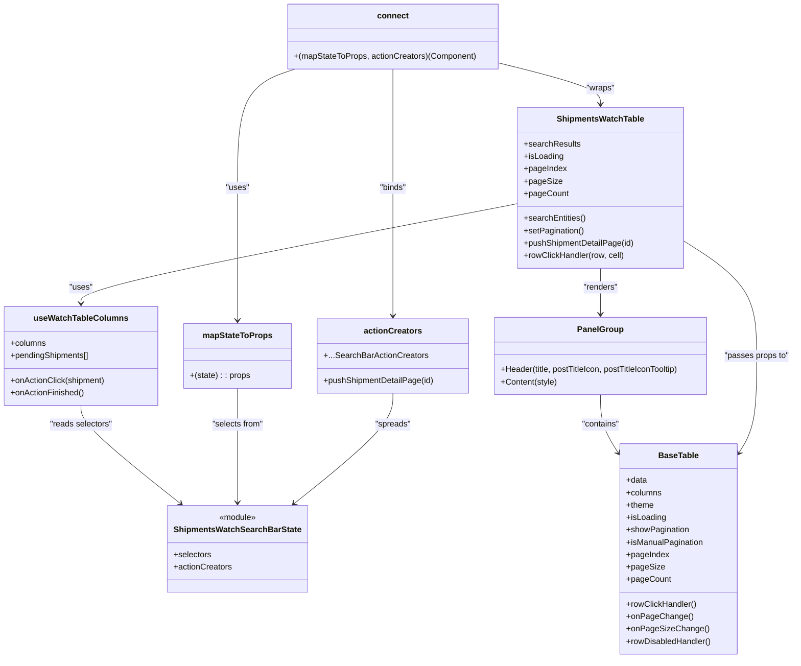

# Diagram: web/portal/src/pages/shipments/dashboard/components/organisms/Shipments.WatchTable.organism.js

> Auto-generated by Obscura crawlers

## Mermaid

### SVG

<svg id="container" width="1541.9765625" xmlns="http://www.w3.org/2000/svg" class="classDiagram" height="1276" viewBox="0 0 1541.9765625 1276" role="graphics-document document" aria-roledescription="class"><g><defs><marker id="container_class-aggregationStart" class="marker aggregation class" refX="18" refY="7" markerWidth="190" markerHeight="240" orient="auto"><path d="M 18,7 L9,13 L1,7 L9,1 Z"></path></marker></defs><defs><marker id="container_class-aggregationEnd" class="marker aggregation class" refX="1" refY="7" markerWidth="20" markerHeight="28" orient="auto"><path d="M 18,7 L9,13 L1,7 L9,1 Z"></path></marker></defs><defs><marker id="container_class-extensionStart" class="marker extension class" refX="18" refY="7" markerWidth="190" markerHeight="240" orient="auto"><path d="M 1,7 L18,13 V 1 Z"></path></marker></defs><defs><marker id="container_class-extensionEnd" class="marker extension class" refX="1" refY="7" markerWidth="20" markerHeight="28" orient="auto"><path d="M 1,1 V 13 L18,7 Z"></path></marker></defs><defs><marker id="container_class-compositionStart" class="marker composition class" refX="18" refY="7" markerWidth="190" markerHeight="240" orient="auto"><path d="M 18,7 L9,13 L1,7 L9,1 Z"></path></marker></defs><defs><marker id="container_class-compositionEnd" class="marker composition class" refX="1" refY="7" markerWidth="20" markerHeight="28" orient="auto"><path d="M 18,7 L9,13 L1,7 L9,1 Z"></path></marker></defs><defs><marker id="container_class-dependencyStart" class="marker dependency class" refX="6" refY="7" markerWidth="190" markerHeight="240" orient="auto"><path d="M 5,7 L9,13 L1,7 L9,1 Z"></path></marker></defs><defs><marker id="container_class-dependencyEnd" class="marker dependency class" refX="13" refY="7" markerWidth="20" markerHeight="28" orient="auto"><path d="M 18,7 L9,13 L14,7 L9,1 Z"></path></marker></defs><defs><marker id="container_class-lollipopStart" class="marker lollipop class" refX="13" refY="7" markerWidth="190" markerHeight="240" orient="auto"><circle stroke="black" fill="transparent" cx="7" cy="7" r="6"></circle></marker></defs><defs><marker id="container_class-lollipopEnd" class="marker lollipop class" refX="1" refY="7" markerWidth="190" markerHeight="240" orient="auto"><circle stroke="black" fill="transparent" cx="7" cy="7" r="6"></circle></marker></defs><g class="root"><g class="clusters"></g><g class="edgePaths"><path d="M1001.855,394.633L860.837,421.694C719.819,448.755,437.783,502.878,296.764,535.105C155.746,567.333,155.746,577.667,155.746,582.833L155.746,588" id="id_ShipmentsWatchTable_useWatchTableColumns_1" class="edge-thickness-normal edge-pattern-solid relation" style=";;;" data-edge="true" data-et="edge" data-id="id_ShipmentsWatchTable_useWatchTableColumns_1" data-points="W3sieCI6MTAwMS44NTU0Njg3NSwieSI6Mzk0LjYzMjYwMDQyOTU2NjI1fSx7IngiOjE1NS43NDYwOTM3NSwieSI6NTU3fSx7IngiOjE1NS43NDYwOTM3NSwieSI6NTk0fV0=" marker-end="url(#container_class-dependencyEnd)"></path><path d="M1161.484,520L1161.484,526.167C1161.484,532.333,1161.484,544.667,1161.484,559.5C1161.484,574.333,1161.484,591.667,1161.484,600.333L1161.484,609" id="id_ShipmentsWatchTable_PanelGroup_2" class="edge-thickness-normal edge-pattern-solid relation" style=";;;" data-edge="true" data-et="edge" data-id="id_ShipmentsWatchTable_PanelGroup_2" data-points="W3sieCI6MTE2MS40ODQzNzUsInkiOjUyMH0seyJ4IjoxMTYxLjQ4NDM3NSwieSI6NTU3fSx7IngiOjExNjEuNDg0Mzc1LCJ5Ijo2MTV9XQ==" marker-end="url(#container_class-dependencyEnd)"></path><path d="M1161.484,765L1161.484,774.667C1161.484,784.333,1161.484,803.667,1167.762,823.116C1174.04,842.565,1186.595,862.13,1192.872,871.912L1199.15,881.694" id="id_PanelGroup_BaseTable_3" class="edge-thickness-normal edge-pattern-solid relation" style=";;;" data-edge="true" data-et="edge" data-id="id_PanelGroup_BaseTable_3" data-points="W3sieCI6MTE2MS40ODQzNzUsInkiOjc2NX0seyJ4IjoxMTYxLjQ4NDM3NSwieSI6ODIzfSx7IngiOjEyMDIuMzkwNjI1LCJ5Ijo4ODYuNzQzOTg4Njg0NTgyN31d" marker-end="url(#container_class-dependencyEnd)"></path><path d="M1321.113,463.603L1346.061,479.169C1371.008,494.735,1420.902,525.868,1445.85,563.6C1470.797,601.333,1470.797,645.667,1470.797,690C1470.797,734.333,1470.797,778.667,1464.519,810.616C1458.242,842.565,1445.686,862.13,1439.409,871.912L1433.131,881.694" id="id_ShipmentsWatchTable_BaseTable_4" class="edge-thickness-normal edge-pattern-solid relation" style=";;;" data-edge="true" data-et="edge" data-id="id_ShipmentsWatchTable_BaseTable_4" data-points="W3sieCI6MTMyMS4xMTMyODEyNSwieSI6NDYzLjYwMjc2MDY1ODcxODl9LHsieCI6MTQ3MC43OTY4NzUsInkiOjU1N30seyJ4IjoxNDcwLjc5Njg3NSwieSI6NjkwfSx7IngiOjE0NzAuNzk2ODc1LCJ5Ijo4MjN9LHsieCI6MTQyOS44OTA2MjUsInkiOjg4Ni43NDM5ODg2ODQ1ODI3fV0=" marker-end="url(#container_class-dependencyEnd)"></path><path d="M155.746,786L155.746,792.167C155.746,798.333,155.746,810.667,187.57,842.374C219.394,874.082,283.043,925.163,314.867,950.704L346.691,976.245" id="id_useWatchTableColumns_ShipmentsWatchSearchBarState_5" class="edge-thickness-normal edge-pattern-solid relation" style=";;;" data-edge="true" data-et="edge" data-id="id_useWatchTableColumns_ShipmentsWatchSearchBarState_5" data-points="W3sieCI6MTU1Ljc0NjA5Mzc1LCJ5Ijo3ODZ9LHsieCI6MTU1Ljc0NjA5Mzc1LCJ5Ijo4MjN9LHsieCI6MzUxLjM3MDA4ODgyMjYxNDEsInkiOjk4MH1d" marker-end="url(#container_class-dependencyEnd)"></path><path d="M456.035,753L456.035,764.667C456.035,776.333,456.035,799.667,456.035,836.5C456.035,873.333,456.035,923.667,456.035,948.833L456.035,974" id="id_mapStateToProps_ShipmentsWatchSearchBarState_6" class="edge-thickness-normal edge-pattern-solid relation" style=";;;" data-edge="true" data-et="edge" data-id="id_mapStateToProps_ShipmentsWatchSearchBarState_6" data-points="W3sieCI6NDU2LjAzNTE1NjI1LCJ5Ijo3NTN9LHsieCI6NDU2LjAzNTE1NjI1LCJ5Ijo4MjN9LHsieCI6NDU2LjAzNTE1NjI1LCJ5Ijo5ODB9XQ==" marker-end="url(#container_class-dependencyEnd)"></path><path d="M754.465,762L754.465,772.167C754.465,782.333,754.465,802.667,722.841,838.372C691.217,874.077,627.968,925.154,596.344,950.692L564.72,976.23" id="id_actionCreators_ShipmentsWatchSearchBarState_7" class="edge-thickness-normal edge-pattern-solid relation" style=";;;" data-edge="true" data-et="edge" data-id="id_actionCreators_ShipmentsWatchSearchBarState_7" data-points="W3sieCI6NzU0LjQ2NDg0Mzc1LCJ5Ijo3NjJ9LHsieCI6NzU0LjQ2NDg0Mzc1LCJ5Ijo4MjN9LHsieCI6NTYwLjA1MjE0Mjc2NDUyMjgsInkiOjk4MH1d" marker-end="url(#container_class-dependencyEnd)"></path><path d="M957.383,120.855L991.4,129.212C1025.417,137.57,1093.451,154.285,1127.467,167.809C1161.484,181.333,1161.484,191.667,1161.484,196.833L1161.484,202" id="id_connect_ShipmentsWatchTable_8" class="edge-thickness-normal edge-pattern-solid relation" style=";;;" data-edge="true" data-et="edge" data-id="id_connect_ShipmentsWatchTable_8" data-points="W3sieCI6OTU3LjM4MjgxMjUsInkiOjEyMC44NTQ2MDIzMzk3OTg2NX0seyJ4IjoxMTYxLjQ4NDM3NSwieSI6MTcxfSx7IngiOjExNjEuNDg0Mzc1LCJ5IjoyMDh9XQ==" marker-end="url(#container_class-dependencyEnd)"></path><path d="M566.454,134L548.051,140.167C529.648,146.333,492.841,158.667,474.438,197C456.035,235.333,456.035,299.667,456.035,364C456.035,428.333,456.035,492.667,456.035,535.5C456.035,578.333,456.035,599.667,456.035,610.333L456.035,621" id="id_connect_mapStateToProps_9" class="edge-thickness-normal edge-pattern-solid relation" style=";;;" data-edge="true" data-et="edge" data-id="id_connect_mapStateToProps_9" data-points="W3sieCI6NTY2LjQ1NDE0MDYyNSwieSI6MTM0fSx7IngiOjQ1Ni4wMzUxNTYyNSwieSI6MTcxfSx7IngiOjQ1Ni4wMzUxNTYyNSwieSI6MzY0fSx7IngiOjQ1Ni4wMzUxNTYyNSwieSI6NTU3fSx7IngiOjQ1Ni4wMzUxNTYyNSwieSI6NjI3fV0=" marker-end="url(#container_class-dependencyEnd)"></path><path d="M754.465,134L754.465,140.167C754.465,146.333,754.465,158.667,754.465,197C754.465,235.333,754.465,299.667,754.465,364C754.465,428.333,754.465,492.667,754.465,534C754.465,575.333,754.465,593.667,754.465,602.833L754.465,612" id="id_connect_actionCreators_10" class="edge-thickness-normal edge-pattern-solid relation" style=";;;" data-edge="true" data-et="edge" data-id="id_connect_actionCreators_10" data-points="W3sieCI6NzU0LjQ2NDg0Mzc1LCJ5IjoxMzR9LHsieCI6NzU0LjQ2NDg0Mzc1LCJ5IjoxNzF9LHsieCI6NzU0LjQ2NDg0Mzc1LCJ5IjozNjR9LHsieCI6NzU0LjQ2NDg0Mzc1LCJ5Ijo1NTd9LHsieCI6NzU0LjQ2NDg0Mzc1LCJ5Ijo2MTh9XQ==" marker-end="url(#container_class-dependencyEnd)"></path></g><g class="edgeLabels"><g class="edgeLabel" transform="translate(155.74609375, 557)"><g class="label" data-id="id_ShipmentsWatchTable_useWatchTableColumns_1" transform="translate(-22.7578125, -12)"><foreignObject width="45.515625" height="24">

"uses"

</foreignObject></g></g><g class="edgeLabel" transform="translate(1161.484375, 557)"><g class="label" data-id="id_ShipmentsWatchTable_PanelGroup_2" transform="translate(-34.015625, -12)"><foreignObject width="68.03125" height="24">

"renders"

</foreignObject></g></g><g class="edgeLabel" transform="translate(1161.484375, 823)"><g class="label" data-id="id_PanelGroup_BaseTable_3" transform="translate(-37.078125, -12)"><foreignObject width="74.15625" height="24">

"contains"

</foreignObject></g></g><g class="edgeLabel" transform="translate(1470.796875, 690)"><g class="label" data-id="id_ShipmentsWatchTable_BaseTable_4" transform="translate(-63.1796875, -12)"><foreignObject width="126.359375" height="24">

"passes props to"

</foreignObject></g></g><g class="edgeLabel" transform="translate(155.74609375, 823)"><g class="label" data-id="id_useWatchTableColumns_ShipmentsWatchSearchBarState_5" transform="translate(-61.1171875, -12)"><foreignObject width="122.234375" height="24">

"reads selectors"

</foreignObject></g></g><g class="edgeLabel" transform="translate(456.03515625, 823)"><g class="label" data-id="id_mapStateToProps_ShipmentsWatchSearchBarState_6" transform="translate(-50.609375, -12)"><foreignObject width="101.21875" height="24">

"selects from"

</foreignObject></g></g><g class="edgeLabel" transform="translate(754.46484375, 823)"><g class="label" data-id="id_actionCreators_ShipmentsWatchSearchBarState_7" transform="translate(-34.6796875, -12)"><foreignObject width="69.359375" height="24">

"spreads"

</foreignObject></g></g><g class="edgeLabel" transform="translate(1161.484375, 171)"><g class="label" data-id="id_connect_ShipmentsWatchTable_8" transform="translate(-27.6484375, -12)"><foreignObject width="55.296875" height="24">

"wraps"

</foreignObject></g></g><g class="edgeLabel" transform="translate(456.03515625, 364)"><g class="label" data-id="id_connect_mapStateToProps_9" transform="translate(-22.7578125, -12)"><foreignObject width="45.515625" height="24">

"uses"

</foreignObject></g></g><g class="edgeLabel" transform="translate(754.46484375, 364)"><g class="label" data-id="id_connect_actionCreators_10" transform="translate(-26.484375, -12)"><foreignObject width="52.96875" height="24">

"binds"

</foreignObject></g></g></g><g class="nodes"><g class="node default" id="classId-ShipmentsWatchTable-0" transform="translate(1161.484375, 364)"><g class="basic label-container"><path d="M-159.62890625 -156 L159.62890625 -156 L159.62890625 156 L-159.62890625 156" stroke="none" stroke-width="0" fill="#ECECFF" style=""></path><path d="M-159.62890625 -156 C-52.87292676309883 -156, 53.88305272380234 -156, 159.62890625 -156 M-159.62890625 -156 C-64.74891863861217 -156, 30.131068972775665 -156, 159.62890625 -156 M159.62890625 -156 C159.62890625 -41.12542842000937, 159.62890625 73.74914315998126, 159.62890625 156 M159.62890625 -156 C159.62890625 -43.28195214836428, 159.62890625 69.43609570327143, 159.62890625 156 M159.62890625 156 C47.75076089633693 156, -64.12738445732614 156, -159.62890625 156 M159.62890625 156 C50.52483279511192 156, -58.57924065977616 156, -159.62890625 156 M-159.62890625 156 C-159.62890625 82.34796107165423, -159.62890625 8.69592214330845, -159.62890625 -156 M-159.62890625 156 C-159.62890625 35.509471837496264, -159.62890625 -84.98105632500747, -159.62890625 -156" stroke="#9370DB" stroke-width="1.3" fill="none" stroke-dasharray="0 0" style=""></path></g><g class="annotation-group text" transform="translate(0, -132)"></g><g class="label-group text" transform="translate(-81.1171875, -132)"><g class="label" style="font-weight: bolder" transform="translate(0,-12)"><foreignObject width="162.234375" height="24">

ShipmentsWatchTable

</foreignObject></g></g><g class="members-group text" transform="translate(-147.62890625, -84)"><g class="label" style="" transform="translate(0,-12)"><foreignObject width="108.328125" height="24">

+searchResults

</foreignObject></g><g class="label" style="" transform="translate(0,12)"><foreignObject width="77.203125" height="24">

+isLoading

</foreignObject></g><g class="label" style="" transform="translate(0,36)"><foreignObject width="82.65625" height="24">

+pageIndex

</foreignObject></g><g class="label" style="" transform="translate(0,60)"><foreignObject width="71.5" height="24">

+pageSize

</foreignObject></g><g class="label" style="" transform="translate(0,84)"><foreignObject width="85.109375" height="24">

+pageCount

</foreignObject></g></g><g class="methods-group text" transform="translate(-147.62890625, 60)"><g class="label" style="" transform="translate(0,-12)"><foreignObject width="120.359375" height="24">

+searchEntities()

</foreignObject></g><g class="label" style="" transform="translate(0,12)"><foreignObject width="117.203125" height="24">

+setPagination()

</foreignObject></g><g class="label" style="" transform="translate(0,36)"><foreignObject width="214.140625" height="24">

+pushShipmentDetailPage(id)

</foreignObject></g><g class="label" style="" transform="translate(0,60)"><foreignObject width="196.4375" height="24">

+rowClickHandler(row, cell)

</foreignObject></g></g><g class="divider" style=""><path d="M-159.62890625 -108 C-89.43735690706492 -108, -19.245807564129848 -108, 159.62890625 -108 M-159.62890625 -108 C-42.90724355940641 -108, 73.81441913118718 -108, 159.62890625 -108" stroke="#9370DB" stroke-width="1.3" fill="none" stroke-dasharray="0 0" style=""></path></g><g class="divider" style=""><path d="M-159.62890625 36 C-69.64248199299334 36, 20.34394226401332 36, 159.62890625 36 M-159.62890625 36 C-80.53813654137139 36, -1.4473668327427731 36, 159.62890625 36" stroke="#9370DB" stroke-width="1.3" fill="none" stroke-dasharray="0 0" style=""></path></g></g><g class="node default" id="classId-useWatchTableColumns-1" transform="translate(155.74609375, 690)"><g class="basic label-container"><path d="M-147.74609375 -96 L147.74609375 -96 L147.74609375 96 L-147.74609375 96" stroke="none" stroke-width="0" fill="#ECECFF" style=""></path><path d="M-147.74609375 -96 C-88.20171015037937 -96, -28.657326550758725 -96, 147.74609375 -96 M-147.74609375 -96 C-70.29156233008267 -96, 7.162969089834661 -96, 147.74609375 -96 M147.74609375 -96 C147.74609375 -56.57828928253061, 147.74609375 -17.156578565061224, 147.74609375 96 M147.74609375 -96 C147.74609375 -55.17946633029525, 147.74609375 -14.358932660590497, 147.74609375 96 M147.74609375 96 C51.82873325006142 96, -44.08862724987716 96, -147.74609375 96 M147.74609375 96 C48.33434867505197 96, -51.07739639989606 96, -147.74609375 96 M-147.74609375 96 C-147.74609375 55.89069130592697, -147.74609375 15.781382611853942, -147.74609375 -96 M-147.74609375 96 C-147.74609375 52.679850860535986, -147.74609375 9.359701721071971, -147.74609375 -96" stroke="#9370DB" stroke-width="1.3" fill="none" stroke-dasharray="0 0" style=""></path></g><g class="annotation-group text" transform="translate(0, -72)"></g><g class="label-group text" transform="translate(-86.3046875, -72)"><g class="label" style="font-weight: bolder" transform="translate(0,-12)"><foreignObject width="172.609375" height="24">

useWatchTableColumns

</foreignObject></g></g><g class="members-group text" transform="translate(-135.74609375, -24)"><g class="label" style="" transform="translate(0,-12)"><foreignObject width="69.21875" height="24">

+columns

</foreignObject></g><g class="label" style="" transform="translate(0,12)"><foreignObject width="154.84375" height="24">

+pendingShipments[]

</foreignObject></g></g><g class="methods-group text" transform="translate(-135.74609375, 48)"><g class="label" style="" transform="translate(0,-12)"><foreignObject width="185.1875" height="24">

+onActionClick(shipment)

</foreignObject></g><g class="label" style="" transform="translate(0,12)"><foreignObject width="143.734375" height="24">

+onActionFinished()

</foreignObject></g></g><g class="divider" style=""><path d="M-147.74609375 -48 C-75.97199011766963 -48, -4.197886485339268 -48, 147.74609375 -48 M-147.74609375 -48 C-32.072336058575715 -48, 83.60142163284857 -48, 147.74609375 -48" stroke="#9370DB" stroke-width="1.3" fill="none" stroke-dasharray="0 0" style=""></path></g><g class="divider" style=""><path d="M-147.74609375 24 C-77.94692810796676 24, -8.14776246593351 24, 147.74609375 24 M-147.74609375 24 C-42.04064132775267 24, 63.66481109449467 24, 147.74609375 24" stroke="#9370DB" stroke-width="1.3" fill="none" stroke-dasharray="0 0" style=""></path></g></g><g class="node default" id="classId-PanelGroup-2" transform="translate(1161.484375, 690)"><g class="basic label-container"><path d="M-211.1328125 -75 L211.1328125 -75 L211.1328125 75 L-211.1328125 75" stroke="none" stroke-width="0" fill="#ECECFF" style=""></path><path d="M-211.1328125 -75 C-94.50189056207978 -75, 22.12903137584044 -75, 211.1328125 -75 M-211.1328125 -75 C-47.61179952685552 -75, 115.90921344628896 -75, 211.1328125 -75 M211.1328125 -75 C211.1328125 -38.63719146618891, 211.1328125 -2.2743829323778186, 211.1328125 75 M211.1328125 -75 C211.1328125 -16.98871803108078, 211.1328125 41.02256393783844, 211.1328125 75 M211.1328125 75 C58.11761545199718 75, -94.89758159600564 75, -211.1328125 75 M211.1328125 75 C116.2377126302331 75, 21.34261276046621 75, -211.1328125 75 M-211.1328125 75 C-211.1328125 15.434498001183627, -211.1328125 -44.131003997632746, -211.1328125 -75 M-211.1328125 75 C-211.1328125 29.351863793969798, -211.1328125 -16.296272412060404, -211.1328125 -75" stroke="#9370DB" stroke-width="1.3" fill="none" stroke-dasharray="0 0" style=""></path></g><g class="annotation-group text" transform="translate(0, -51)"></g><g class="label-group text" transform="translate(-42.328125, -51)"><g class="label" style="font-weight: bolder" transform="translate(0,-12)"><foreignObject width="84.65625" height="24">

PanelGroup

</foreignObject></g></g><g class="members-group text" transform="translate(-199.1328125, -3)"></g><g class="methods-group text" transform="translate(-199.1328125, 27)"><g class="label" style="" transform="translate(0,-12)"><foreignObject width="355.9375" height="24">

+Header(title, postTitleIcon, postTitleIconTooltip)

</foreignObject></g><g class="label" style="" transform="translate(0,12)"><foreignObject width="109.5" height="24">

+Content(style)

</foreignObject></g></g><g class="divider" style=""><path d="M-211.1328125 -27 C-49.5081749952806 -27, 112.1164625094388 -27, 211.1328125 -27 M-211.1328125 -27 C-119.35114118876022 -27, -27.569469877520447 -27, 211.1328125 -27" stroke="#9370DB" stroke-width="1.3" fill="none" stroke-dasharray="0 0" style=""></path></g><g class="divider" style=""><path d="M-211.1328125 -3 C-125.88536955097801 -3, -40.637926601956025 -3, 211.1328125 -3 M-211.1328125 -3 C-117.3568581536656 -3, -23.580903807331197 -3, 211.1328125 -3" stroke="#9370DB" stroke-width="1.3" fill="none" stroke-dasharray="0 0" style=""></path></g></g><g class="node default" id="classId-BaseTable-3" transform="translate(1316.140625, 1064)"><g class="basic label-container"><path d="M-113.75 -204 L113.75 -204 L113.75 204 L-113.75 204" stroke="none" stroke-width="0" fill="#ECECFF" style=""></path><path d="M-113.75 -204 C-28.90372997607301 -204, 55.94254004785398 -204, 113.75 -204 M-113.75 -204 C-56.64869958950402 -204, 0.452600820991961 -204, 113.75 -204 M113.75 -204 C113.75 -58.768177824392694, 113.75 86.46364435121461, 113.75 204 M113.75 -204 C113.75 -42.75257631219063, 113.75 118.49484737561875, 113.75 204 M113.75 204 C66.98659823735947 204, 20.223196474718947 204, -113.75 204 M113.75 204 C52.0026930761514 204, -9.744613847697195 204, -113.75 204 M-113.75 204 C-113.75 81.61719686978574, -113.75 -40.76560626042851, -113.75 -204 M-113.75 204 C-113.75 41.83966420894592, -113.75 -120.32067158210816, -113.75 -204" stroke="#9370DB" stroke-width="1.3" fill="none" stroke-dasharray="0 0" style=""></path></g><g class="annotation-group text" transform="translate(0, -180)"></g><g class="label-group text" transform="translate(-37.359375, -180)"><g class="label" style="font-weight: bolder" transform="translate(0,-12)"><foreignObject width="74.71875" height="24">

BaseTable

</foreignObject></g></g><g class="members-group text" transform="translate(-101.75, -132)"><g class="label" style="" transform="translate(0,-12)"><foreignObject width="40.625" height="24">

+data

</foreignObject></g><g class="label" style="" transform="translate(0,12)"><foreignObject width="69.21875" height="24">

+columns

</foreignObject></g><g class="label" style="" transform="translate(0,36)"><foreignObject width="54.21875" height="24">

+theme

</foreignObject></g><g class="label" style="" transform="translate(0,60)"><foreignObject width="77.203125" height="24">

+isLoading

</foreignObject></g><g class="label" style="" transform="translate(0,84)"><foreignObject width="122.53125" height="24">

+showPagination

</foreignObject></g><g class="label" style="" transform="translate(0,108)"><foreignObject width="149.921875" height="24">

+isManualPagination

</foreignObject></g><g class="label" style="" transform="translate(0,132)"><foreignObject width="82.65625" height="24">

+pageIndex

</foreignObject></g><g class="label" style="" transform="translate(0,156)"><foreignObject width="71.5" height="24">

+pageSize

</foreignObject></g><g class="label" style="" transform="translate(0,180)"><foreignObject width="85.109375" height="24">

+pageCount

</foreignObject></g></g><g class="methods-group text" transform="translate(-101.75, 108)"><g class="label" style="" transform="translate(0,-12)"><foreignObject width="136.75" height="24">

+rowClickHandler()

</foreignObject></g><g class="label" style="" transform="translate(0,12)"><foreignObject width="123.859375" height="24">

+onPageChange()

</foreignObject></g><g class="label" style="" transform="translate(0,36)"><foreignObject width="152.703125" height="24">

+onPageSizeChange()

</foreignObject></g><g class="label" style="" transform="translate(0,60)"><foreignObject width="166.140625" height="24">

+rowDisabledHandler()

</foreignObject></g></g><g class="divider" style=""><path d="M-113.75 -156 C-54.51463254760116 -156, 4.7207349047976805 -156, 113.75 -156 M-113.75 -156 C-66.71320654477861 -156, -19.676413089557215 -156, 113.75 -156" stroke="#9370DB" stroke-width="1.3" fill="none" stroke-dasharray="0 0" style=""></path></g><g class="divider" style=""><path d="M-113.75 84 C-43.072009802280846 84, 27.60598039543831 84, 113.75 84 M-113.75 84 C-57.41347346814326 84, -1.076946936286518 84, 113.75 84" stroke="#9370DB" stroke-width="1.3" fill="none" stroke-dasharray="0 0" style=""></path></g></g><g class="node default" id="classId-ShipmentsWatchSearchBarState-4" transform="translate(456.03515625, 1064)"><g class="basic label-container"><path d="M-129.8359375 -84 L129.8359375 -84 L129.8359375 84 L-129.8359375 84" stroke="none" stroke-width="0" fill="#ECECFF" style=""></path><path d="M-129.8359375 -84 C-77.8015866380475 -84, -25.767235776095006 -84, 129.8359375 -84 M-129.8359375 -84 C-74.18600147908973 -84, -18.536065458179465 -84, 129.8359375 -84 M129.8359375 -84 C129.8359375 -25.46500884935132, 129.8359375 33.06998230129736, 129.8359375 84 M129.8359375 -84 C129.8359375 -37.38504641181875, 129.8359375 9.229907176362502, 129.8359375 84 M129.8359375 84 C56.5664142643291 84, -16.703108971341805 84, -129.8359375 84 M129.8359375 84 C77.41777528925255 84, 24.999613078505107 84, -129.8359375 84 M-129.8359375 84 C-129.8359375 17.894148180457563, -129.8359375 -48.211703639084874, -129.8359375 -84 M-129.8359375 84 C-129.8359375 19.222108611704314, -129.8359375 -45.55578277659137, -129.8359375 -84" stroke="#9370DB" stroke-width="1.3" fill="none" stroke-dasharray="0 0" style=""></path></g><g class="annotation-group text" transform="translate(-36.6015625, -60)"><g class="label" style="" transform="translate(0,-12)"><foreignObject width="73.203125" height="24">

«module»

</foreignObject></g></g><g class="label-group text" transform="translate(-117.8359375, -36)"><g class="label" style="font-weight: bolder" transform="translate(0,-12)"><foreignObject width="235.671875" height="24">

ShipmentsWatchSearchBarState

</foreignObject></g></g><g class="members-group text" transform="translate(-117.8359375, 12)"><g class="label" style="" transform="translate(0,-12)"><foreignObject width="73.453125" height="24">

+selectors

</foreignObject></g><g class="label" style="" transform="translate(0,12)"><foreignObject width="113.078125" height="24">

+actionCreators

</foreignObject></g></g><g class="methods-group text" transform="translate(-117.8359375, 84)"></g><g class="divider" style=""><path d="M-129.8359375 -12 C-30.0125528626791 -12, 69.8108317746418 -12, 129.8359375 -12 M-129.8359375 -12 C-44.84235989771126 -12, 40.151217704577476 -12, 129.8359375 -12" stroke="#9370DB" stroke-width="1.3" fill="none" stroke-dasharray="0 0" style=""></path></g><g class="divider" style=""><path d="M-129.8359375 60 C-27.94603614170302 60, 73.94386521659396 60, 129.8359375 60 M-129.8359375 60 C-28.126010046521785 60, 73.58391740695643 60, 129.8359375 60" stroke="#9370DB" stroke-width="1.3" fill="none" stroke-dasharray="0 0" style=""></path></g></g><g class="node default" id="classId-mapStateToProps-5" transform="translate(456.03515625, 690)"><g class="basic label-container"><path d="M-102.54296875 -63 L102.54296875 -63 L102.54296875 63 L-102.54296875 63" stroke="none" stroke-width="0" fill="#ECECFF" style=""></path><path d="M-102.54296875 -63 C-48.685787421983356 -63, 5.171393906033288 -63, 102.54296875 -63 M-102.54296875 -63 C-48.026894130934686 -63, 6.4891804881306285 -63, 102.54296875 -63 M102.54296875 -63 C102.54296875 -35.35148296876561, 102.54296875 -7.702965937531218, 102.54296875 63 M102.54296875 -63 C102.54296875 -23.228950075191555, 102.54296875 16.54209984961689, 102.54296875 63 M102.54296875 63 C26.74189440827766 63, -49.05917993344468 63, -102.54296875 63 M102.54296875 63 C42.3788951129922 63, -17.785178524015606 63, -102.54296875 63 M-102.54296875 63 C-102.54296875 34.3228673695109, -102.54296875 5.645734739021798, -102.54296875 -63 M-102.54296875 63 C-102.54296875 16.7510043990751, -102.54296875 -29.4979912018498, -102.54296875 -63" stroke="#9370DB" stroke-width="1.3" fill="none" stroke-dasharray="0 0" style=""></path></g><g class="annotation-group text" transform="translate(0, -39)"></g><g class="label-group text" transform="translate(-64.7109375, -39)"><g class="label" style="font-weight: bolder" transform="translate(0,-12)"><foreignObject width="129.421875" height="24">

mapStateToProps

</foreignObject></g></g><g class="members-group text" transform="translate(-90.54296875, 9)"></g><g class="methods-group text" transform="translate(-90.54296875, 39)"><g class="label" style="" transform="translate(0,-12)"><foreignObject width="116.375" height="24">

+(state) : : props

</foreignObject></g></g><g class="divider" style=""><path d="M-102.54296875 -15 C-45.97439296732063 -15, 10.594182815358735 -15, 102.54296875 -15 M-102.54296875 -15 C-44.51676547192441 -15, 13.509437806151183 -15, 102.54296875 -15" stroke="#9370DB" stroke-width="1.3" fill="none" stroke-dasharray="0 0" style=""></path></g><g class="divider" style=""><path d="M-102.54296875 9 C-30.058047489540456 9, 42.42687377091909 9, 102.54296875 9 M-102.54296875 9 C-26.034036560200235 9, 50.47489562959953 9, 102.54296875 9" stroke="#9370DB" stroke-width="1.3" fill="none" stroke-dasharray="0 0" style=""></path></g></g><g class="node default" id="classId-actionCreators-6" transform="translate(754.46484375, 690)"><g class="basic label-container"><path d="M-145.88671875 -72 L145.88671875 -72 L145.88671875 72 L-145.88671875 72" stroke="none" stroke-width="0" fill="#ECECFF" style=""></path><path d="M-145.88671875 -72 C-36.1499061556502 -72, 73.5869064386996 -72, 145.88671875 -72 M-145.88671875 -72 C-36.6772342501945 -72, 72.532250249611 -72, 145.88671875 -72 M145.88671875 -72 C145.88671875 -18.803247217752954, 145.88671875 34.39350556449409, 145.88671875 72 M145.88671875 -72 C145.88671875 -31.249122545109756, 145.88671875 9.501754909780487, 145.88671875 72 M145.88671875 72 C61.16168914410797 72, -23.563340461784065 72, -145.88671875 72 M145.88671875 72 C56.27675010007859 72, -33.333218549842826 72, -145.88671875 72 M-145.88671875 72 C-145.88671875 18.482186743808057, -145.88671875 -35.035626512383885, -145.88671875 -72 M-145.88671875 72 C-145.88671875 29.19957636904971, -145.88671875 -13.600847261900583, -145.88671875 -72" stroke="#9370DB" stroke-width="1.3" fill="none" stroke-dasharray="0 0" style=""></path></g><g class="annotation-group text" transform="translate(0, -48)"></g><g class="label-group text" transform="translate(-53.6328125, -48)"><g class="label" style="font-weight: bolder" transform="translate(0,-12)"><foreignObject width="107.265625" height="24">

actionCreators

</foreignObject></g></g><g class="members-group text" transform="translate(-133.88671875, 0)"><g class="label" style="" transform="translate(0,-12)"><foreignObject width="197.8125" height="24">

+...SearchBarActionCreators

</foreignObject></g></g><g class="methods-group text" transform="translate(-133.88671875, 48)"><g class="label" style="" transform="translate(0,-12)"><foreignObject width="214.140625" height="24">

+pushShipmentDetailPage(id)

</foreignObject></g></g><g class="divider" style=""><path d="M-145.88671875 -24 C-49.526333625826766 -24, 46.83405149834647 -24, 145.88671875 -24 M-145.88671875 -24 C-60.79252853791645 -24, 24.301661674167093 -24, 145.88671875 -24" stroke="#9370DB" stroke-width="1.3" fill="none" stroke-dasharray="0 0" style=""></path></g><g class="divider" style=""><path d="M-145.88671875 24 C-36.96150946007987 24, 71.96369982984027 24, 145.88671875 24 M-145.88671875 24 C-45.669746171316376 24, 54.54722640736725 24, 145.88671875 24" stroke="#9370DB" stroke-width="1.3" fill="none" stroke-dasharray="0 0" style=""></path></g></g><g class="node default" id="classId-connect-7" transform="translate(754.46484375, 71)"><g class="basic label-container"><path d="M-202.91796875 -63 L202.91796875 -63 L202.91796875 63 L-202.91796875 63" stroke="none" stroke-width="0" fill="#ECECFF" style=""></path><path d="M-202.91796875 -63 C-107.69860563414312 -63, -12.479242518286242 -63, 202.91796875 -63 M-202.91796875 -63 C-109.91128524453768 -63, -16.90460173907536 -63, 202.91796875 -63 M202.91796875 -63 C202.91796875 -16.948039693927356, 202.91796875 29.103920612145288, 202.91796875 63 M202.91796875 -63 C202.91796875 -27.04847002323963, 202.91796875 8.903059953520739, 202.91796875 63 M202.91796875 63 C100.35417981835892 63, -2.20960911328217 63, -202.91796875 63 M202.91796875 63 C107.72257253304087 63, 12.52717631608175 63, -202.91796875 63 M-202.91796875 63 C-202.91796875 14.116837498546353, -202.91796875 -34.766325002907294, -202.91796875 -63 M-202.91796875 63 C-202.91796875 19.308129592245912, -202.91796875 -24.383740815508176, -202.91796875 -63" stroke="#9370DB" stroke-width="1.3" fill="none" stroke-dasharray="0 0" style=""></path></g><g class="annotation-group text" transform="translate(0, -39)"></g><g class="label-group text" transform="translate(-28.9140625, -39)"><g class="label" style="font-weight: bolder" transform="translate(0,-12)"><foreignObject width="57.828125" height="24">

connect

</foreignObject></g></g><g class="members-group text" transform="translate(-190.91796875, 9)"></g><g class="methods-group text" transform="translate(-190.91796875, 39)"><g class="label" style="" transform="translate(0,-12)"><foreignObject width="352.921875" height="24">

+(mapStateToProps, actionCreators)(Component)

</foreignObject></g></g><g class="divider" style=""><path d="M-202.91796875 -15 C-45.201684623374206 -15, 112.51459950325159 -15, 202.91796875 -15 M-202.91796875 -15 C-115.38496899899509 -15, -27.851969247990183 -15, 202.91796875 -15" stroke="#9370DB" stroke-width="1.3" fill="none" stroke-dasharray="0 0" style=""></path></g><g class="divider" style=""><path d="M-202.91796875 9 C-63.52390324129772 9, 75.87016226740457 9, 202.91796875 9 M-202.91796875 9 C-90.02361479411626 9, 22.87073916176749 9, 202.91796875 9" stroke="#9370DB" stroke-width="1.3" fill="none" stroke-dasharray="0 0" style=""></path></g></g></g></g></g></svg>
