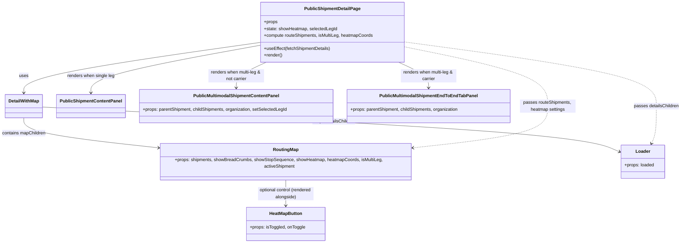

# Diagram: web/portal/src/pages/shipments/public-shipment-details/PublicShipmentDetail.page.js


> Auto-generated by Obscura crawlers

## Diagram 1



### SVG

<svg id="container" width="2445.9296875" xmlns="http://www.w3.org/2000/svg" class="classDiagram" height="862" viewBox="0 0 2445.9296875 862" role="graphics-document document" aria-roledescription="class"><style>#container{font-family:"trebuchet ms",verdana,arial,sans-serif;font-size:16px;fill:#333;}@keyframes edge-animation-frame{from{stroke-dashoffset:0;}}@keyframes dash{to{stroke-dashoffset:0;}}#container .edge-animation-slow{stroke-dasharray:9,5!important;stroke-dashoffset:900;animation:dash 50s linear infinite;stroke-linecap:round;}#container .edge-animation-fast{stroke-dasharray:9,5!important;stroke-dashoffset:900;animation:dash 20s linear infinite;stroke-linecap:round;}#container .error-icon{fill:#552222;}#container .error-text{fill:#552222;stroke:#552222;}#container .edge-thickness-normal{stroke-width:1px;}#container .edge-thickness-thick{stroke-width:3.5px;}#container .edge-pattern-solid{stroke-dasharray:0;}#container .edge-thickness-invisible{stroke-width:0;fill:none;}#container .edge-pattern-dashed{stroke-dasharray:3;}#container .edge-pattern-dotted{stroke-dasharray:2;}#container .marker{fill:#333333;stroke:#333333;}#container .marker.cross{stroke:#333333;}#container svg{font-family:"trebuchet ms",verdana,arial,sans-serif;font-size:16px;}#container p{margin:0;}#container g.classGroup text{fill:#9370DB;stroke:none;font-family:"trebuchet ms",verdana,arial,sans-serif;font-size:10px;}#container g.classGroup text .title{font-weight:bolder;}#container .nodeLabel,#container .edgeLabel{color:#131300;}#container .edgeLabel .label rect{fill:#ECECFF;}#container .label text{fill:#131300;}#container .labelBkg{background:#ECECFF;}#container .edgeLabel .label span{background:#ECECFF;}#container .classTitle{font-weight:bolder;}#container .node rect,#container .node circle,#container .node ellipse,#container .node polygon,#container .node path{fill:#ECECFF;stroke:#9370DB;stroke-width:1px;}#container .divider{stroke:#9370DB;stroke-width:1;}#container g.clickable{cursor:pointer;}#container g.classGroup rect{fill:#ECECFF;stroke:#9370DB;}#container g.classGroup line{stroke:#9370DB;stroke-width:1;}#container .classLabel .box{stroke:none;stroke-width:0;fill:#ECECFF;opacity:0.5;}#container .classLabel .label{fill:#9370DB;font-size:10px;}#container .relation{stroke:#333333;stroke-width:1;fill:none;}#container .dashed-line{stroke-dasharray:3;}#container .dotted-line{stroke-dasharray:1 2;}#container #compositionStart,#container .composition{fill:#333333!important;stroke:#333333!important;stroke-width:1;}#container #compositionEnd,#container .composition{fill:#333333!important;stroke:#333333!important;stroke-width:1;}#container #dependencyStart,#container .dependency{fill:#333333!important;stroke:#333333!important;stroke-width:1;}#container #dependencyStart,#container .dependency{fill:#333333!important;stroke:#333333!important;stroke-width:1;}#container #extensionStart,#container .extension{fill:transparent!important;stroke:#333333!important;stroke-width:1;}#container #extensionEnd,#container .extension{fill:transparent!important;stroke:#333333!important;stroke-width:1;}#container #aggregationStart,#container .aggregation{fill:transparent!important;stroke:#333333!important;stroke-width:1;}#container #aggregationEnd,#container .aggregation{fill:transparent!important;stroke:#333333!important;stroke-width:1;}#container #lollipopStart,#container .lollipop{fill:#ECECFF!important;stroke:#333333!important;stroke-width:1;}#container #lollipopEnd,#container .lollipop{fill:#ECECFF!important;stroke:#333333!important;stroke-width:1;}#container .edgeTerminals{font-size:11px;line-height:initial;}#container .classTitleText{text-anchor:middle;font-size:18px;fill:#333;}#container .label-icon{display:inline-block;height:1em;overflow:visible;vertical-align:-0.125em;}#container .node .label-icon path{fill:currentColor;stroke:revert;stroke-width:revert;}#container :root{--mermaid-font-family:"trebuchet ms",verdana,arial,sans-serif;}</style><g><defs><marker id="container_class-aggregationStart" class="marker aggregation class" refX="18" refY="7" markerWidth="190" markerHeight="240" orient="auto"><path d="M 18,7 L9,13 L1,7 L9,1 Z"></path></marker></defs><defs><marker id="container_class-aggregationEnd" class="marker aggregation class" refX="1" refY="7" markerWidth="20" markerHeight="28" orient="auto"><path d="M 18,7 L9,13 L1,7 L9,1 Z"></path></marker></defs><defs><marker id="container_class-extensionStart" class="marker extension class" refX="18" refY="7" markerWidth="190" markerHeight="240" orient="auto"><path d="M 1,7 L18,13 V 1 Z"></path></marker></defs><defs><marker id="container_class-extensionEnd" class="marker extension class" refX="1" refY="7" markerWidth="20" markerHeight="28" orient="auto"><path d="M 1,1 V 13 L18,7 Z"></path></marker></defs><defs><marker id="container_class-compositionStart" class="marker composition class" refX="18" refY="7" markerWidth="190" markerHeight="240" orient="auto"><path d="M 18,7 L9,13 L1,7 L9,1 Z"></path></marker></defs><defs><marker id="container_class-compositionEnd" class="marker composition class" refX="1" refY="7" markerWidth="20" markerHeight="28" orient="auto"><path d="M 18,7 L9,13 L1,7 L9,1 Z"></path></marker></defs><defs><marker id="container_class-dependencyStart" class="marker dependency class" refX="6" refY="7" markerWidth="190" markerHeight="240" orient="auto"><path d="M 5,7 L9,13 L1,7 L9,1 Z"></path></marker></defs><defs><marker id="container_class-dependencyEnd" class="marker dependency class" refX="13" refY="7" markerWidth="20" markerHeight="28" orient="auto"><path d="M 18,7 L9,13 L14,7 L9,1 Z"></path></marker></defs><defs><marker id="container_class-lollipopStart" class="marker lollipop class" refX="13" refY="7" markerWidth="190" markerHeight="240" orient="auto"><circle stroke="black" fill="transparent" cx="7" cy="7" r="6"></circle></marker></defs><defs><marker id="container_class-lollipopEnd" class="marker lollipop class" refX="1" refY="7" markerWidth="190" markerHeight="240" orient="auto"><circle stroke="black" fill="transparent" cx="7" cy="7" r="6"></circle></marker></defs><g class="root"><g class="clusters"></g><g class="edgePaths"><path d="M926.873,152.896L786.944,172.914C647.014,192.931,367.156,232.965,227.226,263.149C87.297,293.333,87.297,313.667,87.297,323.833L87.297,334" id="id_PublicShipmentDetailPage_DetailWithMap_1" class="edge-thickness-normal edge-pattern-solid relation" style=";;;" data-edge="true" data-et="edge" data-id="id_PublicShipmentDetailPage_DetailWithMap_1" data-points="W3sieCI6OTI2Ljg3MzA0Njg3NSwieSI6MTUyLjg5NjQwNjc3NzQ4OTN9LHsieCI6ODcuMjk2ODc1LCJ5IjoyNzN9LHsieCI6ODcuMjk2ODc1LCJ5IjozNDB9XQ==" marker-end="url(#container_class-dependencyEnd)"></path><path d="M87.297,424L87.297,433.167C87.297,442.333,87.297,460.667,164.792,477.866C242.288,495.066,397.279,511.131,474.775,519.164L552.27,527.197" id="id_DetailWithMap_RoutingMap_2" class="edge-thickness-normal edge-pattern-solid relation" style=";;;" data-edge="true" data-et="edge" data-id="id_DetailWithMap_RoutingMap_2" data-points="W3sieCI6ODcuMjk2ODc1LCJ5Ijo0MjR9LHsieCI6ODcuMjk2ODc1LCJ5Ijo0Nzl9LHsieCI6NTU4LjIzODI4MTI1LCJ5Ijo1MjcuODE1ODI2MzgzMTQ5Mn1d" marker-end="url(#container_class-dependencyEnd)"></path><path d="M153.117,385.237L470.872,400.864C788.628,416.491,1424.138,447.746,1769.106,474.039C2114.074,500.332,2168.5,521.664,2195.713,532.33L2222.925,542.995" id="id_DetailWithMap_Loader_3" class="edge-thickness-normal edge-pattern-solid relation" style=";;;" data-edge="true" data-et="edge" data-id="id_DetailWithMap_Loader_3" data-points="W3sieCI6MTUzLjExNzE4NzUsInkiOjM4NS4yMzcwMzQ2MzEwOTE1NX0seyJ4IjoyMDU5LjY0ODQzNzUsInkiOjQ3OX0seyJ4IjoyMjI4LjUxMTcxODc1LCJ5Ijo1NDUuMTg0OTM5MDc0NDM2Nn1d" marker-end="url(#container_class-dependencyEnd)"></path><path d="M1023.086,636L1023.086,644.167C1023.086,652.333,1023.086,668.667,1023.086,684C1023.086,699.333,1023.086,713.667,1023.086,720.833L1023.086,728" id="id_RoutingMap_HeatMapButton_4" class="edge-thickness-normal edge-pattern-solid relation" style=";;;" data-edge="true" data-et="edge" data-id="id_RoutingMap_HeatMapButton_4" data-points="W3sieCI6MTAyMy4wODU5Mzc1LCJ5Ijo2MzZ9LHsieCI6MTAyMy4wODU5Mzc1LCJ5Ijo2ODV9LHsieCI6MTAyMy4wODU5Mzc1LCJ5Ijo3MzR9XQ==" marker-end="url(#container_class-dependencyEnd)"></path><path d="M926.873,162.912L825.994,181.26C725.116,199.608,523.359,236.304,422.48,264.819C321.602,293.333,321.602,313.667,321.602,323.833L321.602,334" id="id_PublicShipmentDetailPage_PublicShipmentContentPanel_5" class="edge-thickness-normal edge-pattern-solid relation" style=";;;" data-edge="true" data-et="edge" data-id="id_PublicShipmentDetailPage_PublicShipmentContentPanel_5" data-points="W3sieCI6OTI2Ljg3MzA0Njg3NSwieSI6MTYyLjkxMTU0NTI5MzA3MjgzfSx7IngiOjMyMS42MDE1NjI1LCJ5IjoyNzN9LHsieCI6MzIxLjYwMTU2MjUsInkiOjM0MH1d" marker-end="url(#container_class-dependencyEnd)"></path><path d="M946.818,224L928.823,232.167C910.828,240.333,874.838,256.667,856.843,272C838.848,287.333,838.848,301.667,838.848,308.833L838.848,316" id="id_PublicShipmentDetailPage_PublicMultimodalShipmentContentPanel_6" class="edge-thickness-normal edge-pattern-solid relation" style=";;;" data-edge="true" data-et="edge" data-id="id_PublicShipmentDetailPage_PublicMultimodalShipmentContentPanel_6" data-points="W3sieCI6OTQ2LjgxODQ1ODg5NzI5MywieSI6MjI0fSx7IngiOjgzOC44NDc2NTYyNSwieSI6MjczfSx7IngiOjgzOC44NDc2NTYyNSwieSI6MzIyfV0=" marker-end="url(#container_class-dependencyEnd)"></path><path d="M1422.771,224L1440.767,232.167C1458.762,240.333,1494.752,256.667,1512.747,272C1530.742,287.333,1530.742,301.667,1530.742,308.833L1530.742,316" id="id_PublicShipmentDetailPage_PublicMultimodalShipmentEndToEndTabPanel_7" class="edge-thickness-normal edge-pattern-solid relation" style=";;;" data-edge="true" data-et="edge" data-id="id_PublicShipmentDetailPage_PublicMultimodalShipmentEndToEndTabPanel_7" data-points="W3sieCI6MTQyMi43NzEzODQ4NTI3MDcsInkiOjIyNH0seyJ4IjoxNTMwLjc0MjE4NzUsInkiOjI3M30seyJ4IjoxNTMwLjc0MjE4NzUsInkiOjMyMn1d" marker-end="url(#container_class-dependencyEnd)"></path><path d="M1442.717,150.563L1594.994,170.969C1747.272,191.375,2051.827,232.188,2204.105,270.761C2356.383,309.333,2356.383,345.667,2356.383,380C2356.383,414.333,2356.383,446.667,2353.705,468.108C2351.026,489.55,2345.67,500.1,2342.991,505.375L2340.313,510.65" id="id_PublicShipmentDetailPage_Loader_8" class="edge-thickness-normal edge-pattern-dashed relation" style=";;;" data-edge="true" data-et="edge" data-id="id_PublicShipmentDetailPage_Loader_8" data-points="W3sieCI6MTQ0Mi43MTY3OTY4NzUsInkiOjE1MC41NjMxMjEyOTgwNTEzNn0seyJ4IjoyMzU2LjM4MjgxMjUsInkiOjI3M30seyJ4IjoyMzU2LjM4MjgxMjUsInkiOjM4Mn0seyJ4IjoyMzU2LjM4MjgxMjUsInkiOjQ3OX0seyJ4IjoyMzM3LjU5NjczMDAyNTc3MywieSI6NTE2fV0=" marker-end="url(#container_class-dependencyEnd)"></path><path d="M1442.717,168.312L1528.743,185.76C1614.77,203.208,1786.822,238.104,1872.849,273.719C1958.875,309.333,1958.875,345.667,1958.875,380C1958.875,414.333,1958.875,446.667,1881.379,470.866C1803.884,495.066,1648.893,511.131,1571.397,519.164L1493.902,527.197" id="id_PublicShipmentDetailPage_RoutingMap_9" class="edge-thickness-normal edge-pattern-dashed relation" style=";;;" data-edge="true" data-et="edge" data-id="id_PublicShipmentDetailPage_RoutingMap_9" data-points="W3sieCI6MTQ0Mi43MTY3OTY4NzUsInkiOjE2OC4zMTIwNzQwNTk2ODI3NH0seyJ4IjoxOTU4Ljg3NSwieSI6MjczfSx7IngiOjE5NTguODc1LCJ5IjozODJ9LHsieCI6MTk1OC44NzUsInkiOjQ3OX0seyJ4IjoxNDg3LjkzMzU5Mzc1LCJ5Ijo1MjcuODE1ODI2MzgzMTQ5Mn1d" marker-end="url(#container_class-dependencyEnd)"></path></g><g class="edgeLabels"><g class="edgeLabel" transform="translate(87.296875, 273)"><g class="label" data-id="id_PublicShipmentDetailPage_DetailWithMap_1" transform="translate(-16.4921875, -12)"><foreignObject width="32.984375" height="24"><div xmlns="http://www.w3.org/1999/xhtml" class="labelBkg" style="display: table-cell; white-space: nowrap; line-height: 1.5; max-width: 200px; text-align: center;"><span class="edgeLabel"><p>uses</p></span></div></foreignObject></g></g><g class="edgeLabel" transform="translate(87.296875, 479)"><g class="label" data-id="id_DetailWithMap_RoutingMap_2" transform="translate(-79.296875, -12)"><foreignObject width="158.59375" height="24"><div xmlns="http://www.w3.org/1999/xhtml" class="labelBkg" style="display: table-cell; white-space: nowrap; line-height: 1.5; max-width: 200px; text-align: center;"><span class="edgeLabel"><p>contains mapChildren</p></span></div></foreignObject></g></g><g class="edgeLabel" transform="translate(1196.95859, 436.57302)"><g class="label" data-id="id_DetailWithMap_Loader_3" transform="translate(-78.5, -12)"><foreignObject width="157" height="24"><div xmlns="http://www.w3.org/1999/xhtml" class="labelBkg" style="display: table-cell; white-space: nowrap; line-height: 1.5; max-width: 200px; text-align: center;"><span class="edgeLabel"><p>wraps detailsChildren</p></span></div></foreignObject></g></g><g class="edgeLabel" transform="translate(1023.0859375, 685)"><g class="label" data-id="id_RoutingMap_HeatMapButton_4" transform="translate(-100, -24)"><foreignObject width="200" height="48"><div xmlns="http://www.w3.org/1999/xhtml" class="labelBkg" style="display: table; white-space: break-spaces; line-height: 1.5; max-width: 200px; text-align: center; width: 200px;"><span class="edgeLabel"><p>optional control (rendered alongside)</p></span></div></foreignObject></g></g><g class="edgeLabel" transform="translate(321.6015625, 273)"><g class="label" data-id="id_PublicShipmentDetailPage_PublicShipmentContentPanel_5" transform="translate(-85.90625, -12)"><foreignObject width="171.8125" height="24"><div xmlns="http://www.w3.org/1999/xhtml" class="labelBkg" style="display: table-cell; white-space: nowrap; line-height: 1.5; max-width: 200px; text-align: center;"><span class="edgeLabel"><p>renders when single leg</p></span></div></foreignObject></g></g><g class="edgeLabel" transform="translate(838.84765625, 273)"><g class="label" data-id="id_PublicShipmentDetailPage_PublicMultimodalShipmentContentPanel_6" transform="translate(-100, -24)"><foreignObject width="200" height="48"><div xmlns="http://www.w3.org/1999/xhtml" class="labelBkg" style="display: table; white-space: break-spaces; line-height: 1.5; max-width: 200px; text-align: center; width: 200px;"><span class="edgeLabel"><p>renders when multi-leg &amp; not carrier</p></span></div></foreignObject></g></g><g class="edgeLabel" transform="translate(1530.7421875, 273)"><g class="label" data-id="id_PublicShipmentDetailPage_PublicMultimodalShipmentEndToEndTabPanel_7" transform="translate(-100, -24)"><foreignObject width="200" height="48"><div xmlns="http://www.w3.org/1999/xhtml" class="labelBkg" style="display: table; white-space: break-spaces; line-height: 1.5; max-width: 200px; text-align: center; width: 200px;"><span class="edgeLabel"><p>renders when multi-leg &amp; carrier</p></span></div></foreignObject></g></g><g class="edgeLabel" transform="translate(2356.3828125, 382)"><g class="label" data-id="id_PublicShipmentDetailPage_Loader_8" transform="translate(-81.546875, -12)"><foreignObject width="163.09375" height="24"><div xmlns="http://www.w3.org/1999/xhtml" class="labelBkg" style="display: table-cell; white-space: nowrap; line-height: 1.5; max-width: 200px; text-align: center;"><span class="edgeLabel"><p>passes detailsChildren</p></span></div></foreignObject></g></g><g class="edgeLabel" transform="translate(1958.875, 382)"><g class="label" data-id="id_PublicShipmentDetailPage_RoutingMap_9" transform="translate(-100, -24)"><foreignObject width="200" height="48"><div xmlns="http://www.w3.org/1999/xhtml" class="labelBkg" style="display: table; white-space: break-spaces; line-height: 1.5; max-width: 200px; text-align: center; width: 200px;"><span class="edgeLabel"><p>passes routeShipments, heatmap settings</p></span></div></foreignObject></g></g></g><g class="nodes"><g class="node default" id="classId-PublicShipmentDetailPage-0" transform="translate(1184.794921875, 116)"><g class="basic label-container"><path d="M-257.921875 -108 L257.921875 -108 L257.921875 108 L-257.921875 108" stroke="none" stroke-width="0" fill="#ECECFF" style=""></path><path d="M-257.921875 -108 C-68.87794987793532 -108, 120.16597524412936 -108, 257.921875 -108 M-257.921875 -108 C-55.98413393773674 -108, 145.9536071245265 -108, 257.921875 -108 M257.921875 -108 C257.921875 -61.657478437099506, 257.921875 -15.314956874199012, 257.921875 108 M257.921875 -108 C257.921875 -37.82823253077339, 257.921875 32.34353493845322, 257.921875 108 M257.921875 108 C80.79596649810591 108, -96.32994200378818 108, -257.921875 108 M257.921875 108 C96.24929211281162 108, -65.42329077437677 108, -257.921875 108 M-257.921875 108 C-257.921875 61.794083389323454, -257.921875 15.588166778646908, -257.921875 -108 M-257.921875 108 C-257.921875 51.48893854991029, -257.921875 -5.022122900179426, -257.921875 -108" stroke="#9370DB" stroke-width="1.3" fill="none" stroke-dasharray="0 0" style=""></path></g><g class="annotation-group text" transform="translate(0, -84)"></g><g class="label-group text" transform="translate(-96.484375, -84)"><g class="label" style="font-weight: bolder" transform="translate(0,-12)"><foreignObject width="192.96875" height="24"><div xmlns="http://www.w3.org/1999/xhtml" style="display: table-cell; white-space: nowrap; line-height: 1.5; max-width: 241px; text-align: center;"><span class="nodeLabel markdown-node-label" style=""><p>PublicShipmentDetailPage</p></span></div></foreignObject></g></g><g class="members-group text" transform="translate(-245.921875, -36)"><g class="label" style="" transform="translate(0,-12)"><foreignObject width="49.515625" height="24"><div xmlns="http://www.w3.org/1999/xhtml" style="display: table-cell; white-space: nowrap; line-height: 1.5; max-width: 107px; text-align: center;"><span class="nodeLabel markdown-node-label" style=""><p>+props</p></span></div></foreignObject></g><g class="label" style="" transform="translate(0,12)"><foreignObject width="263.484375" height="24"><div xmlns="http://www.w3.org/1999/xhtml" style="display: table-cell; white-space: nowrap; line-height: 1.5; max-width: 321px; text-align: center;"><span class="nodeLabel markdown-node-label" style=""><p>+state: showHeatmap, selectedLegId</p></span></div></foreignObject></g><g class="label" style="" transform="translate(0,36)"><foreignObject width="395.359375" height="24"><div xmlns="http://www.w3.org/1999/xhtml" style="display: table-cell; white-space: nowrap; line-height: 1.5; max-width: 453px; text-align: center;"><span class="nodeLabel markdown-node-label" style=""><p>+compute routeShipments, isMultiLeg, heatmapCoords</p></span></div></foreignObject></g></g><g class="methods-group text" transform="translate(-245.921875, 60)"><g class="label" style="" transform="translate(0,-12)"><foreignObject width="241.046875" height="24"><div xmlns="http://www.w3.org/1999/xhtml" style="display: table-cell; white-space: nowrap; line-height: 1.5; max-width: 298px; text-align: center;"><span class="nodeLabel markdown-node-label" style=""><p>+useEffect(fetchShipmentDetails)</p></span></div></foreignObject></g><g class="label" style="" transform="translate(0,12)"><foreignObject width="66.609375" height="24"><div xmlns="http://www.w3.org/1999/xhtml" style="display: table-cell; white-space: nowrap; line-height: 1.5; max-width: 124px; text-align: center;"><span class="nodeLabel markdown-node-label" style=""><p>+render()</p></span></div></foreignObject></g></g><g class="divider" style=""><path d="M-257.921875 -60 C-123.99375828974541 -60, 9.93435842050917 -60, 257.921875 -60 M-257.921875 -60 C-151.629482832191 -60, -45.337090664382 -60, 257.921875 -60" stroke="#9370DB" stroke-width="1.3" fill="none" stroke-dasharray="0 0" style=""></path></g><g class="divider" style=""><path d="M-257.921875 36 C-126.5939197192809 36, 4.734035561438191 36, 257.921875 36 M-257.921875 36 C-148.83146932739078 36, -39.741063654781556 36, 257.921875 36" stroke="#9370DB" stroke-width="1.3" fill="none" stroke-dasharray="0 0" style=""></path></g></g><g class="node default" id="classId-DetailWithMap-1" transform="translate(87.296875, 382)"><g class="basic label-container"><path d="M-65.8203125 -42 L65.8203125 -42 L65.8203125 42 L-65.8203125 42" stroke="none" stroke-width="0" fill="#ECECFF" style=""></path><path d="M-65.8203125 -42 C-37.9839240928614 -42, -10.1475356857228 -42, 65.8203125 -42 M-65.8203125 -42 C-21.85437231597522 -42, 22.111567868049562 -42, 65.8203125 -42 M65.8203125 -42 C65.8203125 -25.024256995707137, 65.8203125 -8.048513991414275, 65.8203125 42 M65.8203125 -42 C65.8203125 -13.249569465423168, 65.8203125 15.500861069153665, 65.8203125 42 M65.8203125 42 C13.765069574062316 42, -38.29017335187537 42, -65.8203125 42 M65.8203125 42 C20.48577307556718 42, -24.848766348865638 42, -65.8203125 42 M-65.8203125 42 C-65.8203125 11.024888949010503, -65.8203125 -19.950222101978994, -65.8203125 -42 M-65.8203125 42 C-65.8203125 22.473045238136375, -65.8203125 2.946090476272751, -65.8203125 -42" stroke="#9370DB" stroke-width="1.3" fill="none" stroke-dasharray="0 0" style=""></path></g><g class="annotation-group text" transform="translate(0, -18)"></g><g class="label-group text" transform="translate(-53.8203125, -18)"><g class="label" style="font-weight: bolder" transform="translate(0,-12)"><foreignObject width="107.640625" height="24"><div xmlns="http://www.w3.org/1999/xhtml" style="display: table-cell; white-space: nowrap; line-height: 1.5; max-width: 156px; text-align: center;"><span class="nodeLabel markdown-node-label" style=""><p>DetailWithMap</p></span></div></foreignObject></g></g><g class="members-group text" transform="translate(-53.8203125, 30)"></g><g class="methods-group text" transform="translate(-53.8203125, 60)"></g><g class="divider" style=""><path d="M-65.8203125 6 C-37.781000490257924 6, -9.741688480515855 6, 65.8203125 6 M-65.8203125 6 C-38.45635082591863 6, -11.092389151837267 6, 65.8203125 6" stroke="#9370DB" stroke-width="1.3" fill="none" stroke-dasharray="0 0" style=""></path></g><g class="divider" style=""><path d="M-65.8203125 24 C-18.791654876988588 24, 28.237002746022824 24, 65.8203125 24 M-65.8203125 24 C-14.51417794818996 24, 36.79195660362008 24, 65.8203125 24" stroke="#9370DB" stroke-width="1.3" fill="none" stroke-dasharray="0 0" style=""></path></g></g><g class="node default" id="classId-RoutingMap-2" transform="translate(1023.0859375, 576)"><g class="basic label-container"><path d="M-464.84765625 -60 L464.84765625 -60 L464.84765625 60 L-464.84765625 60" stroke="none" stroke-width="0" fill="#ECECFF" style=""></path><path d="M-464.84765625 -60 C-149.6479485204253 -60, 165.5517592091494 -60, 464.84765625 -60 M-464.84765625 -60 C-93.97094868268908 -60, 276.90575888462183 -60, 464.84765625 -60 M464.84765625 -60 C464.84765625 -25.50924347763764, 464.84765625 8.981513044724721, 464.84765625 60 M464.84765625 -60 C464.84765625 -32.70002865167654, 464.84765625 -5.40005730335308, 464.84765625 60 M464.84765625 60 C256.5599635853788 60, 48.27227092075759 60, -464.84765625 60 M464.84765625 60 C100.12555367937773 60, -264.59654889124454 60, -464.84765625 60 M-464.84765625 60 C-464.84765625 26.815872303160724, -464.84765625 -6.368255393678552, -464.84765625 -60 M-464.84765625 60 C-464.84765625 20.45637473109445, -464.84765625 -19.0872505378111, -464.84765625 -60" stroke="#9370DB" stroke-width="1.3" fill="none" stroke-dasharray="0 0" style=""></path></g><g class="annotation-group text" transform="translate(0, -36)"></g><g class="label-group text" transform="translate(-43.8828125, -36)"><g class="label" style="font-weight: bolder" transform="translate(0,-12)"><foreignObject width="87.765625" height="24"><div xmlns="http://www.w3.org/1999/xhtml" style="display: table-cell; white-space: nowrap; line-height: 1.5; max-width: 137px; text-align: center;"><span class="nodeLabel markdown-node-label" style=""><p>RoutingMap</p></span></div></foreignObject></g></g><g class="members-group text" transform="translate(-452.84765625, 12)"><g class="label" style="" transform="translate(0,-12)"><foreignObject width="861.8125" height="24"><div xmlns="http://www.w3.org/1999/xhtml" style="display: table-cell; white-space: nowrap; line-height: 1.5; max-width: 919px; text-align: center;"><span class="nodeLabel markdown-node-label" style=""><p>+props: shipments, showBreadCrumbs, showStopSequence, showHeatmap, heatmapCoords, isMultiLeg, activeShipment</p></span></div></foreignObject></g></g><g class="methods-group text" transform="translate(-452.84765625, 60)"></g><g class="divider" style=""><path d="M-464.84765625 -12 C-160.81766704850207 -12, 143.21232215299585 -12, 464.84765625 -12 M-464.84765625 -12 C-123.03244056193597 -12, 218.78277512612806 -12, 464.84765625 -12" stroke="#9370DB" stroke-width="1.3" fill="none" stroke-dasharray="0 0" style=""></path></g><g class="divider" style=""><path d="M-464.84765625 36 C-177.7574239936854 36, 109.33280826262921 36, 464.84765625 36 M-464.84765625 36 C-252.35032112569073 36, -39.85298600138145 36, 464.84765625 36" stroke="#9370DB" stroke-width="1.3" fill="none" stroke-dasharray="0 0" style=""></path></g></g><g class="node default" id="classId-HeatMapButton-3" transform="translate(1023.0859375, 794)"><g class="basic label-container"><path d="M-140.390625 -60 L140.390625 -60 L140.390625 60 L-140.390625 60" stroke="none" stroke-width="0" fill="#ECECFF" style=""></path><path d="M-140.390625 -60 C-48.124715410499064 -60, 44.14119417900187 -60, 140.390625 -60 M-140.390625 -60 C-77.78008478078239 -60, -15.169544561564777 -60, 140.390625 -60 M140.390625 -60 C140.390625 -12.75890906602121, 140.390625 34.48218186795758, 140.390625 60 M140.390625 -60 C140.390625 -22.44992428389567, 140.390625 15.100151432208662, 140.390625 60 M140.390625 60 C79.57907434111395 60, 18.767523682227903 60, -140.390625 60 M140.390625 60 C69.68906124309133 60, -1.0125025138173385 60, -140.390625 60 M-140.390625 60 C-140.390625 23.57069157702209, -140.390625 -12.858616845955822, -140.390625 -60 M-140.390625 60 C-140.390625 23.066004940237555, -140.390625 -13.86799011952489, -140.390625 -60" stroke="#9370DB" stroke-width="1.3" fill="none" stroke-dasharray="0 0" style=""></path></g><g class="annotation-group text" transform="translate(0, -36)"></g><g class="label-group text" transform="translate(-57.421875, -36)"><g class="label" style="font-weight: bolder" transform="translate(0,-12)"><foreignObject width="114.84375" height="24"><div xmlns="http://www.w3.org/1999/xhtml" style="display: table-cell; white-space: nowrap; line-height: 1.5; max-width: 164px; text-align: center;"><span class="nodeLabel markdown-node-label" style=""><p>HeatMapButton</p></span></div></foreignObject></g></g><g class="members-group text" transform="translate(-128.390625, 12)"><g class="label" style="" transform="translate(0,-12)"><foreignObject width="199.359375" height="24"><div xmlns="http://www.w3.org/1999/xhtml" style="display: table-cell; white-space: nowrap; line-height: 1.5; max-width: 257px; text-align: center;"><span class="nodeLabel markdown-node-label" style=""><p>+props: isToggled, onToggle</p></span></div></foreignObject></g></g><g class="methods-group text" transform="translate(-128.390625, 60)"></g><g class="divider" style=""><path d="M-140.390625 -12 C-56.571307355017964 -12, 27.24801028996407 -12, 140.390625 -12 M-140.390625 -12 C-40.10637279827415 -12, 60.1778794034517 -12, 140.390625 -12" stroke="#9370DB" stroke-width="1.3" fill="none" stroke-dasharray="0 0" style=""></path></g><g class="divider" style=""><path d="M-140.390625 36 C-66.88889292920346 36, 6.612839141593071 36, 140.390625 36 M-140.390625 36 C-72.8237405094767 36, -5.256856018953414 36, 140.390625 36" stroke="#9370DB" stroke-width="1.3" fill="none" stroke-dasharray="0 0" style=""></path></g></g><g class="node default" id="classId-Loader-4" transform="translate(2307.1328125, 576)"><g class="basic label-container"><path d="M-78.62109375 -60 L78.62109375 -60 L78.62109375 60 L-78.62109375 60" stroke="none" stroke-width="0" fill="#ECECFF" style=""></path><path d="M-78.62109375 -60 C-45.94129016334459 -60, -13.26148657668918 -60, 78.62109375 -60 M-78.62109375 -60 C-38.10050704601397 -60, 2.420079657972053 -60, 78.62109375 -60 M78.62109375 -60 C78.62109375 -34.03899386624136, 78.62109375 -8.077987732482725, 78.62109375 60 M78.62109375 -60 C78.62109375 -19.189336186756492, 78.62109375 21.621327626487016, 78.62109375 60 M78.62109375 60 C21.77023498274523 60, -35.08062378450954 60, -78.62109375 60 M78.62109375 60 C20.719166472269507 60, -37.18276080546099 60, -78.62109375 60 M-78.62109375 60 C-78.62109375 19.777022505150853, -78.62109375 -20.445954989698294, -78.62109375 -60 M-78.62109375 60 C-78.62109375 29.913468687957074, -78.62109375 -0.17306262408585127, -78.62109375 -60" stroke="#9370DB" stroke-width="1.3" fill="none" stroke-dasharray="0 0" style=""></path></g><g class="annotation-group text" transform="translate(0, -36)"></g><g class="label-group text" transform="translate(-25.3046875, -36)"><g class="label" style="font-weight: bolder" transform="translate(0,-12)"><foreignObject width="50.609375" height="24"><div xmlns="http://www.w3.org/1999/xhtml" style="display: table-cell; white-space: nowrap; line-height: 1.5; max-width: 101px; text-align: center;"><span class="nodeLabel markdown-node-label" style=""><p>Loader</p></span></div></foreignObject></g></g><g class="members-group text" transform="translate(-66.62109375, 12)"><g class="label" style="" transform="translate(0,-12)"><foreignObject width="107.9375" height="24"><div xmlns="http://www.w3.org/1999/xhtml" style="display: table-cell; white-space: nowrap; line-height: 1.5; max-width: 165px; text-align: center;"><span class="nodeLabel markdown-node-label" style=""><p>+props: loaded</p></span></div></foreignObject></g></g><g class="methods-group text" transform="translate(-66.62109375, 60)"></g><g class="divider" style=""><path d="M-78.62109375 -12 C-27.758262806116022 -12, 23.104568137767956 -12, 78.62109375 -12 M-78.62109375 -12 C-44.467176406078806 -12, -10.313259062157613 -12, 78.62109375 -12" stroke="#9370DB" stroke-width="1.3" fill="none" stroke-dasharray="0 0" style=""></path></g><g class="divider" style=""><path d="M-78.62109375 36 C-38.37869126148424 36, 1.8637112270315157 36, 78.62109375 36 M-78.62109375 36 C-30.398993263034114 36, 17.82310722393177 36, 78.62109375 36" stroke="#9370DB" stroke-width="1.3" fill="none" stroke-dasharray="0 0" style=""></path></g></g><g class="node default" id="classId-PublicShipmentContentPanel-5" transform="translate(321.6015625, 382)"><g class="basic label-container"><path d="M-118.484375 -42 L118.484375 -42 L118.484375 42 L-118.484375 42" stroke="none" stroke-width="0" fill="#ECECFF" style=""></path><path d="M-118.484375 -42 C-68.87195155172847 -42, -19.259528103456944 -42, 118.484375 -42 M-118.484375 -42 C-64.05995216225459 -42, -9.635529324509179 -42, 118.484375 -42 M118.484375 -42 C118.484375 -16.182371675846365, 118.484375 9.63525664830727, 118.484375 42 M118.484375 -42 C118.484375 -14.260781695328632, 118.484375 13.478436609342737, 118.484375 42 M118.484375 42 C63.58570004913129 42, 8.68702509826258 42, -118.484375 42 M118.484375 42 C25.690664631527397 42, -67.1030457369452 42, -118.484375 42 M-118.484375 42 C-118.484375 14.290946802183118, -118.484375 -13.418106395633764, -118.484375 -42 M-118.484375 42 C-118.484375 14.45571863781931, -118.484375 -13.088562724361381, -118.484375 -42" stroke="#9370DB" stroke-width="1.3" fill="none" stroke-dasharray="0 0" style=""></path></g><g class="annotation-group text" transform="translate(0, -18)"></g><g class="label-group text" transform="translate(-106.484375, -18)"><g class="label" style="font-weight: bolder" transform="translate(0,-12)"><foreignObject width="212.96875" height="24"><div xmlns="http://www.w3.org/1999/xhtml" style="display: table-cell; white-space: nowrap; line-height: 1.5; max-width: 261px; text-align: center;"><span class="nodeLabel markdown-node-label" style=""><p>PublicShipmentContentPanel</p></span></div></foreignObject></g></g><g class="members-group text" transform="translate(-106.484375, 30)"></g><g class="methods-group text" transform="translate(-106.484375, 60)"></g><g class="divider" style=""><path d="M-118.484375 6 C-64.74859708986435 6, -11.012819179728709 6, 118.484375 6 M-118.484375 6 C-34.42657155206845 6, 49.631231895863095 6, 118.484375 6" stroke="#9370DB" stroke-width="1.3" fill="none" stroke-dasharray="0 0" style=""></path></g><g class="divider" style=""><path d="M-118.484375 24 C-62.80015255201341 24, -7.115930104026816 24, 118.484375 24 M-118.484375 24 C-29.670419647156194 24, 59.14353570568761 24, 118.484375 24" stroke="#9370DB" stroke-width="1.3" fill="none" stroke-dasharray="0 0" style=""></path></g></g><g class="node default" id="classId-PublicMultimodalShipmentContentPanel-6" transform="translate(838.84765625, 382)"><g class="basic label-container"><path d="M-348.76171875 -60 L348.76171875 -60 L348.76171875 60 L-348.76171875 60" stroke="none" stroke-width="0" fill="#ECECFF" style=""></path><path d="M-348.76171875 -60 C-180.14099319184604 -60, -11.520267633692072 -60, 348.76171875 -60 M-348.76171875 -60 C-181.80629037128566 -60, -14.85086199257131 -60, 348.76171875 -60 M348.76171875 -60 C348.76171875 -14.207930901229979, 348.76171875 31.584138197540042, 348.76171875 60 M348.76171875 -60 C348.76171875 -30.289993674307766, 348.76171875 -0.579987348615532, 348.76171875 60 M348.76171875 60 C79.43166432117272 60, -189.89839010765456 60, -348.76171875 60 M348.76171875 60 C100.26529365084363 60, -148.23113144831274 60, -348.76171875 60 M-348.76171875 60 C-348.76171875 34.548206504182815, -348.76171875 9.096413008365623, -348.76171875 -60 M-348.76171875 60 C-348.76171875 33.07485703392896, -348.76171875 6.149714067857914, -348.76171875 -60" stroke="#9370DB" stroke-width="1.3" fill="none" stroke-dasharray="0 0" style=""></path></g><g class="annotation-group text" transform="translate(0, -36)"></g><g class="label-group text" transform="translate(-147.9765625, -36)"><g class="label" style="font-weight: bolder" transform="translate(0,-12)"><foreignObject width="295.953125" height="24"><div xmlns="http://www.w3.org/1999/xhtml" style="display: table-cell; white-space: nowrap; line-height: 1.5; max-width: 344px; text-align: center;"><span class="nodeLabel markdown-node-label" style=""><p>PublicMultimodalShipmentContentPanel</p></span></div></foreignObject></g></g><g class="members-group text" transform="translate(-336.76171875, 12)"><g class="label" style="" transform="translate(0,-12)"><foreignObject width="525.546875" height="24"><div xmlns="http://www.w3.org/1999/xhtml" style="display: table-cell; white-space: nowrap; line-height: 1.5; max-width: 583px; text-align: center;"><span class="nodeLabel markdown-node-label" style=""><p>+props: parentShipment, childShipments, organization, setSelectedLegId</p></span></div></foreignObject></g></g><g class="methods-group text" transform="translate(-336.76171875, 60)"></g><g class="divider" style=""><path d="M-348.76171875 -12 C-89.55886233420455 -12, 169.6439940815909 -12, 348.76171875 -12 M-348.76171875 -12 C-73.66387554472783 -12, 201.43396766054434 -12, 348.76171875 -12" stroke="#9370DB" stroke-width="1.3" fill="none" stroke-dasharray="0 0" style=""></path></g><g class="divider" style=""><path d="M-348.76171875 36 C-121.6043200160392 36, 105.55307871792161 36, 348.76171875 36 M-348.76171875 36 C-75.89515742362727 36, 196.97140390274546 36, 348.76171875 36" stroke="#9370DB" stroke-width="1.3" fill="none" stroke-dasharray="0 0" style=""></path></g></g><g class="node default" id="classId-PublicMultimodalShipmentEndToEndTabPanel-7" transform="translate(1530.7421875, 382)"><g class="basic label-container"><path d="M-293.1328125 -60 L293.1328125 -60 L293.1328125 60 L-293.1328125 60" stroke="none" stroke-width="0" fill="#ECECFF" style=""></path><path d="M-293.1328125 -60 C-167.41623605420034 -60, -41.69965960840071 -60, 293.1328125 -60 M-293.1328125 -60 C-108.02362206525623 -60, 77.08556836948753 -60, 293.1328125 -60 M293.1328125 -60 C293.1328125 -33.66352441543307, 293.1328125 -7.327048830866147, 293.1328125 60 M293.1328125 -60 C293.1328125 -35.94738809113839, 293.1328125 -11.894776182276779, 293.1328125 60 M293.1328125 60 C127.61591567439896 60, -37.900981151202075 60, -293.1328125 60 M293.1328125 60 C139.80345833005583 60, -13.525895839888335 60, -293.1328125 60 M-293.1328125 60 C-293.1328125 24.139566690937173, -293.1328125 -11.720866618125655, -293.1328125 -60 M-293.1328125 60 C-293.1328125 23.13805338656391, -293.1328125 -13.723893226872178, -293.1328125 -60" stroke="#9370DB" stroke-width="1.3" fill="none" stroke-dasharray="0 0" style=""></path></g><g class="annotation-group text" transform="translate(0, -36)"></g><g class="label-group text" transform="translate(-167.90625, -36)"><g class="label" style="font-weight: bolder" transform="translate(0,-12)"><foreignObject width="335.8125" height="24"><div xmlns="http://www.w3.org/1999/xhtml" style="display: table-cell; white-space: nowrap; line-height: 1.5; max-width: 384px; text-align: center;"><span class="nodeLabel markdown-node-label" style=""><p>PublicMultimodalShipmentEndToEndTabPanel</p></span></div></foreignObject></g></g><g class="members-group text" transform="translate(-281.1328125, 12)"><g class="label" style="" transform="translate(0,-12)"><foreignObject width="394.359375" height="24"><div xmlns="http://www.w3.org/1999/xhtml" style="display: table-cell; white-space: nowrap; line-height: 1.5; max-width: 452px; text-align: center;"><span class="nodeLabel markdown-node-label" style=""><p>+props: parentShipment, childShipments, organization</p></span></div></foreignObject></g></g><g class="methods-group text" transform="translate(-281.1328125, 60)"></g><g class="divider" style=""><path d="M-293.1328125 -12 C-93.77449276104122 -12, 105.58382697791757 -12, 293.1328125 -12 M-293.1328125 -12 C-168.29824215953948 -12, -43.46367181907894 -12, 293.1328125 -12" stroke="#9370DB" stroke-width="1.3" fill="none" stroke-dasharray="0 0" style=""></path></g><g class="divider" style=""><path d="M-293.1328125 36 C-72.32866058796137 36, 148.47549132407727 36, 293.1328125 36 M-293.1328125 36 C-148.4314205377157 36, -3.7300285754313904 36, 293.1328125 36" stroke="#9370DB" stroke-width="1.3" fill="none" stroke-dasharray="0 0" style=""></path></g></g></g></g></g></svg>

## Diagram 2

```mermaid
flowchart LR
    A[Start render PublicShipmentDetailPage] --> B{Read props}
    B --> C[useTranslation -> t]
    B --> D[Initialize state: showHeatmap=false, selectedLegId=null]
    B --> E[useSetTitleOnMount & useSetSubTitle & tracking]
    A --> F[useEffect -> parse token from URL]
    F --> G[fetchShipmentDetails({shipmentID, token})]
    G --> H[compute routeShipments = getRouteShipments(...)]
    H --> I{isMultiLeg?}
    I -- yes --> J{isCarrier(activeOrganization)?}
    J -- yes --> K[detailsChildren = PublicMultimodalShipmentEndToEndTabPanel]
    J -- no --> L[detailsChildren = PublicMultimodalShipmentContentPanel (setSelectedLegId)]
    I -- no --> M[detailsChildren = PublicShipmentContentPanel]
    H --> N[heatmapCoords = routeHeatmap || shipment.current_location.updates]
    N --> O{heatmapCoords.length > 0?}
    O -- yes --> P[Render HeatMapButton toggling showHeatmap]
    O -- no --> Q[No HeatMapButton]
    K & L & M --> R[DetailWithMap -> render RoutingMap with props including showHeatmap and heatmapCoords]
    R --> S[Loader loaded=isLoaded wraps detailsChildren]
    S --> T[UI displayed]
```

> SVG rendering failed for this diagram.
