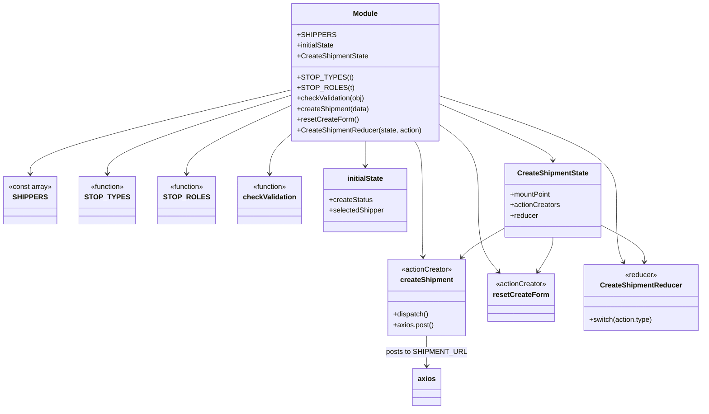
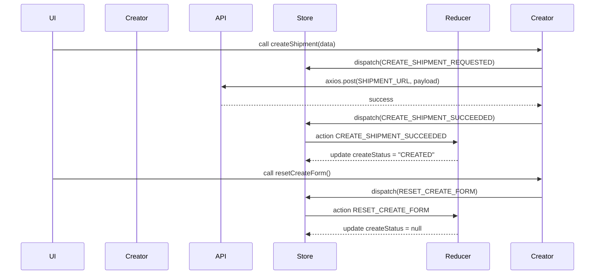
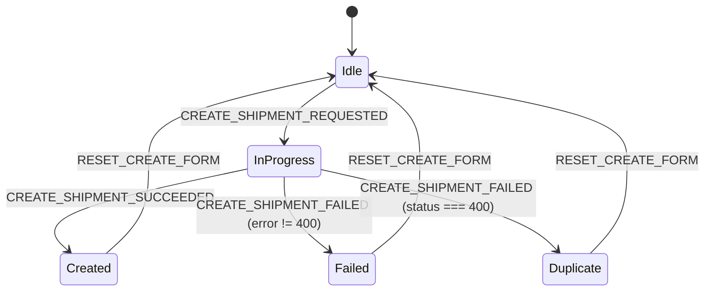
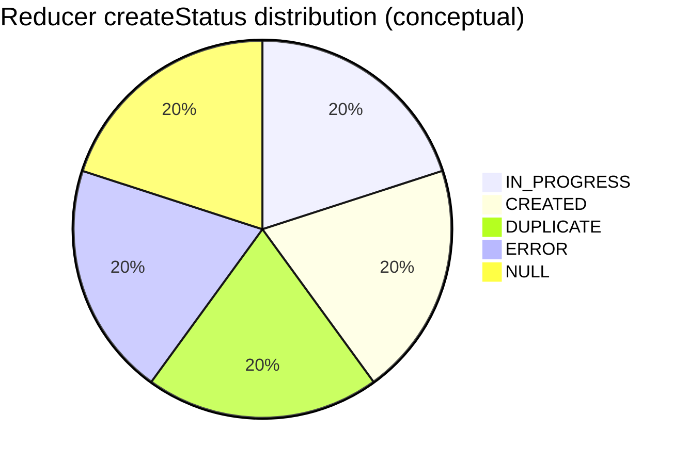

# Diagram: web/portal/src/pages/shipments/redux/CreateShipmentState.js


> Auto-generated by Obscura crawlers

## Diagram 1



### SVG

<svg id="container" width="1547.0234375" xmlns="http://www.w3.org/2000/svg" class="classDiagram" height="928" viewBox="0 0 1547.0234375 928" role="graphics-document document" aria-roledescription="class"><style>#container{font-family:"trebuchet ms",verdana,arial,sans-serif;font-size:16px;fill:#333;}@keyframes edge-animation-frame{from{stroke-dashoffset:0;}}@keyframes dash{to{stroke-dashoffset:0;}}#container .edge-animation-slow{stroke-dasharray:9,5!important;stroke-dashoffset:900;animation:dash 50s linear infinite;stroke-linecap:round;}#container .edge-animation-fast{stroke-dasharray:9,5!important;stroke-dashoffset:900;animation:dash 20s linear infinite;stroke-linecap:round;}#container .error-icon{fill:#552222;}#container .error-text{fill:#552222;stroke:#552222;}#container .edge-thickness-normal{stroke-width:1px;}#container .edge-thickness-thick{stroke-width:3.5px;}#container .edge-pattern-solid{stroke-dasharray:0;}#container .edge-thickness-invisible{stroke-width:0;fill:none;}#container .edge-pattern-dashed{stroke-dasharray:3;}#container .edge-pattern-dotted{stroke-dasharray:2;}#container .marker{fill:#333333;stroke:#333333;}#container .marker.cross{stroke:#333333;}#container svg{font-family:"trebuchet ms",verdana,arial,sans-serif;font-size:16px;}#container p{margin:0;}#container g.classGroup text{fill:#9370DB;stroke:none;font-family:"trebuchet ms",verdana,arial,sans-serif;font-size:10px;}#container g.classGroup text .title{font-weight:bolder;}#container .nodeLabel,#container .edgeLabel{color:#131300;}#container .edgeLabel .label rect{fill:#ECECFF;}#container .label text{fill:#131300;}#container .labelBkg{background:#ECECFF;}#container .edgeLabel .label span{background:#ECECFF;}#container .classTitle{font-weight:bolder;}#container .node rect,#container .node circle,#container .node ellipse,#container .node polygon,#container .node path{fill:#ECECFF;stroke:#9370DB;stroke-width:1px;}#container .divider{stroke:#9370DB;stroke-width:1;}#container g.clickable{cursor:pointer;}#container g.classGroup rect{fill:#ECECFF;stroke:#9370DB;}#container g.classGroup line{stroke:#9370DB;stroke-width:1;}#container .classLabel .box{stroke:none;stroke-width:0;fill:#ECECFF;opacity:0.5;}#container .classLabel .label{fill:#9370DB;font-size:10px;}#container .relation{stroke:#333333;stroke-width:1;fill:none;}#container .dashed-line{stroke-dasharray:3;}#container .dotted-line{stroke-dasharray:1 2;}#container #compositionStart,#container .composition{fill:#333333!important;stroke:#333333!important;stroke-width:1;}#container #compositionEnd,#container .composition{fill:#333333!important;stroke:#333333!important;stroke-width:1;}#container #dependencyStart,#container .dependency{fill:#333333!important;stroke:#333333!important;stroke-width:1;}#container #dependencyStart,#container .dependency{fill:#333333!important;stroke:#333333!important;stroke-width:1;}#container #extensionStart,#container .extension{fill:transparent!important;stroke:#333333!important;stroke-width:1;}#container #extensionEnd,#container .extension{fill:transparent!important;stroke:#333333!important;stroke-width:1;}#container #aggregationStart,#container .aggregation{fill:transparent!important;stroke:#333333!important;stroke-width:1;}#container #aggregationEnd,#container .aggregation{fill:transparent!important;stroke:#333333!important;stroke-width:1;}#container #lollipopStart,#container .lollipop{fill:#ECECFF!important;stroke:#333333!important;stroke-width:1;}#container #lollipopEnd,#container .lollipop{fill:#ECECFF!important;stroke:#333333!important;stroke-width:1;}#container .edgeTerminals{font-size:11px;line-height:initial;}#container .classTitleText{text-anchor:middle;font-size:18px;fill:#333;}#container .label-icon{display:inline-block;height:1em;overflow:visible;vertical-align:-0.125em;}#container .node .label-icon path{fill:currentColor;stroke:revert;stroke-width:revert;}#container :root{--mermaid-font-family:"trebuchet ms",verdana,arial,sans-serif;}</style><g><defs><marker id="container_class-aggregationStart" class="marker aggregation class" refX="18" refY="7" markerWidth="190" markerHeight="240" orient="auto"><path d="M 18,7 L9,13 L1,7 L9,1 Z"></path></marker></defs><defs><marker id="container_class-aggregationEnd" class="marker aggregation class" refX="1" refY="7" markerWidth="20" markerHeight="28" orient="auto"><path d="M 18,7 L9,13 L1,7 L9,1 Z"></path></marker></defs><defs><marker id="container_class-extensionStart" class="marker extension class" refX="18" refY="7" markerWidth="190" markerHeight="240" orient="auto"><path d="M 1,7 L18,13 V 1 Z"></path></marker></defs><defs><marker id="container_class-extensionEnd" class="marker extension class" refX="1" refY="7" markerWidth="20" markerHeight="28" orient="auto"><path d="M 1,1 V 13 L18,7 Z"></path></marker></defs><defs><marker id="container_class-compositionStart" class="marker composition class" refX="18" refY="7" markerWidth="190" markerHeight="240" orient="auto"><path d="M 18,7 L9,13 L1,7 L9,1 Z"></path></marker></defs><defs><marker id="container_class-compositionEnd" class="marker composition class" refX="1" refY="7" markerWidth="20" markerHeight="28" orient="auto"><path d="M 18,7 L9,13 L1,7 L9,1 Z"></path></marker></defs><defs><marker id="container_class-dependencyStart" class="marker dependency class" refX="6" refY="7" markerWidth="190" markerHeight="240" orient="auto"><path d="M 5,7 L9,13 L1,7 L9,1 Z"></path></marker></defs><defs><marker id="container_class-dependencyEnd" class="marker dependency class" refX="13" refY="7" markerWidth="20" markerHeight="28" orient="auto"><path d="M 18,7 L9,13 L14,7 L9,1 Z"></path></marker></defs><defs><marker id="container_class-lollipopStart" class="marker lollipop class" refX="13" refY="7" markerWidth="190" markerHeight="240" orient="auto"><circle stroke="black" fill="transparent" cx="7" cy="7" r="6"></circle></marker></defs><defs><marker id="container_class-lollipopEnd" class="marker lollipop class" refX="1" refY="7" markerWidth="190" markerHeight="240" orient="auto"><circle stroke="black" fill="transparent" cx="7" cy="7" r="6"></circle></marker></defs><g class="root"><g class="clusters"></g><g class="edgePaths"><path d="M625.891,205.738L533.102,228.949C440.313,252.159,254.734,298.579,161.945,329.956C69.156,361.333,69.156,377.667,69.156,385.833L69.156,394" id="id_Module_SHIPPERS_1" class="edge-thickness-normal edge-pattern-solid relation" style=";;;" data-edge="true" data-et="edge" data-id="id_Module_SHIPPERS_1" data-points="W3sieCI6NjI1Ljg5MDYyNSwieSI6MjA1LjczODI2Mzg3Mzg5MzM1fSx7IngiOjY5LjE1NjI1LCJ5IjozNDV9LHsieCI6NjkuMTU2MjUsInkiOjQwMH1d" marker-end="url(#container_class-dependencyEnd)"></path><path d="M625.891,218.307L561.013,239.423C496.135,260.538,366.38,302.769,301.503,332.051C236.625,361.333,236.625,377.667,236.625,385.833L236.625,394" id="id_Module_STOP_TYPES_2" class="edge-thickness-normal edge-pattern-solid relation" style=";;;" data-edge="true" data-et="edge" data-id="id_Module_STOP_TYPES_2" data-points="W3sieCI6NjI1Ljg5MDYyNSwieSI6MjE4LjMwNzExOTU3NzQzMzEzfSx7IngiOjIzNi42MjUsInkiOjM0NX0seyJ4IjoyMzYuNjI1LCJ5Ijo0MDB9XQ==" marker-end="url(#container_class-dependencyEnd)"></path><path d="M625.891,240.945L588.283,258.288C550.674,275.63,475.458,310.315,437.85,335.824C400.242,361.333,400.242,377.667,400.242,385.833L400.242,394" id="id_Module_STOP_ROLES_3" class="edge-thickness-normal edge-pattern-solid relation" style=";;;" data-edge="true" data-et="edge" data-id="id_Module_STOP_ROLES_3" data-points="W3sieCI6NjI1Ljg5MDYyNSwieSI6MjQwLjk0NTA4NDY5MTc4NTZ9LHsieCI6NDAwLjI0MjE4NzUsInkiOjM0NX0seyJ4Ijo0MDAuMjQyMTg3NSwieSI6NDAwfV0=" marker-end="url(#container_class-dependencyEnd)"></path><path d="M625.891,304.411L617.852,311.176C609.813,317.941,593.734,331.47,585.695,346.402C577.656,361.333,577.656,377.667,577.656,385.833L577.656,394" id="id_Module_checkValidation_4" class="edge-thickness-normal edge-pattern-solid relation" style=";;;" data-edge="true" data-et="edge" data-id="id_Module_checkValidation_4" data-points="W3sieCI6NjI1Ljg5MDYyNSwieSI6MzA0LjQxMTA4NTI4MjU4MDN9LHsieCI6NTc3LjY1NjI1LCJ5IjozNDV9LHsieCI6NTc3LjY1NjI1LCJ5Ijo0MDB9XQ==" marker-end="url(#container_class-dependencyEnd)"></path><path d="M904.781,320L907.773,324.167C910.765,328.333,916.75,336.667,919.742,359C922.734,381.333,922.734,417.667,922.734,454C922.734,490.333,922.734,526.667,923.017,548.004C923.301,569.341,923.867,575.683,924.15,578.853L924.433,582.024" id="id_Module_createShipment_5" class="edge-thickness-normal edge-pattern-solid relation" style=";;;" data-edge="true" data-et="edge" data-id="id_Module_createShipment_5" data-points="W3sieCI6OTA0Ljc4MDczMjA0NDE5ODksInkiOjMyMH0seyJ4Ijo5MjIuNzM0Mzc1LCJ5IjozNDV9LHsieCI6OTIyLjczNDM3NSwieSI6NDU0fSx7IngiOjkyMi43MzQzNzUsInkiOjU2M30seyJ4Ijo5MjQuOTY2NTE3ODU3MTQyOSwieSI6NTg4fV0=" marker-end="url(#container_class-dependencyEnd)"></path><path d="M959.609,282.566L974.253,292.972C988.897,303.378,1018.185,324.189,1032.829,352.761C1047.473,381.333,1047.473,417.667,1047.473,454C1047.473,490.333,1047.473,526.667,1055.004,553.737C1062.535,580.806,1077.597,598.613,1085.128,607.516L1092.659,616.419" id="id_Module_resetCreateForm_6" class="edge-thickness-normal edge-pattern-solid relation" style=";;;" data-edge="true" data-et="edge" data-id="id_Module_resetCreateForm_6" data-points="W3sieCI6OTU5LjYwOTM3NSwieSI6MjgyLjU2NjM5NDIwOTM4ODI1fSx7IngiOjEwNDcuNDcyNjU2MjUsInkiOjM0NX0seyJ4IjoxMDQ3LjQ3MjY1NjI1LCJ5Ijo0NTR9LHsieCI6MTA0Ny40NzI2NTYyNSwieSI6NTYzfSx7IngiOjEwOTYuNTMzNTUxODk3MzIxMywieSI6NjIxfV0=" marker-end="url(#container_class-dependencyEnd)"></path><path d="M792.75,320L792.75,324.167C792.75,328.333,792.75,336.667,792.75,346C792.75,355.333,792.75,365.667,792.75,370.833L792.75,376" id="id_Module_initialState_7" class="edge-thickness-normal edge-pattern-solid relation" style=";;;" data-edge="true" data-et="edge" data-id="id_Module_initialState_7" data-points="W3sieCI6NzkyLjc1LCJ5IjozMjB9LHsieCI6NzkyLjc1LCJ5IjozNDV9LHsieCI6NzkyLjc1LCJ5IjozODJ9XQ==" marker-end="url(#container_class-dependencyEnd)"></path><path d="M959.609,217.621L1025.674,238.85C1091.738,260.08,1223.867,302.54,1289.932,341.937C1355.996,381.333,1355.996,417.667,1355.996,454C1355.996,490.333,1355.996,526.667,1358.552,550.1C1361.108,573.534,1366.221,584.068,1368.777,589.335L1371.333,594.602" id="id_Module_CreateShipmentReducer_8" class="edge-thickness-normal edge-pattern-solid relation" style=";;;" data-edge="true" data-et="edge" data-id="id_Module_CreateShipmentReducer_8" data-points="W3sieCI6OTU5LjYwOTM3NSwieSI6MjE3LjYyMDUxNzIzMDYxNzc0fSx7IngiOjEzNTUuOTk2MDkzNzUsInkiOjM0NX0seyJ4IjoxMzU1Ljk5NjA5Mzc1LCJ5Ijo0NTR9LHsieCI6MTM1NS45OTYwOTM3NSwieSI6NTYzfSx7IngiOjEzNzMuOTUyODExMTA0OTEwOCwieSI6NjAwfV0=" marker-end="url(#container_class-dependencyEnd)"></path><path d="M959.609,235.785L1001.92,253.987C1044.23,272.19,1128.852,308.595,1171.162,329.964C1213.473,351.333,1213.473,357.667,1213.473,360.833L1213.473,364" id="id_Module_CreateShipmentState_9" class="edge-thickness-normal edge-pattern-solid relation" style=";;;" data-edge="true" data-et="edge" data-id="id_Module_CreateShipmentState_9" data-points="W3sieCI6OTU5LjYwOTM3NSwieSI6MjM1Ljc4NDkzMTA2MTY5NjI4fSx7IngiOjEyMTMuNDcyNjU2MjUsInkiOjM0NX0seyJ4IjoxMjEzLjQ3MjY1NjI1LCJ5IjozNzB9XQ==" marker-end="url(#container_class-dependencyEnd)"></path><path d="M932.734,762L932.734,768.167C932.734,774.333,932.734,786.667,932.734,798C932.734,809.333,932.734,819.667,932.734,824.833L932.734,830" id="id_createShipment_axios_10" class="edge-thickness-normal edge-pattern-solid relation" style=";;;" data-edge="true" data-et="edge" data-id="id_createShipment_axios_10" data-points="W3sieCI6OTMyLjczNDM3NSwieSI6NzYyfSx7IngiOjkzMi43MzQzNzUsInkiOjc5OX0seyJ4Ijo5MzIuNzM0Mzc1LCJ5Ijo4MzZ9XQ==" marker-end="url(#container_class-dependencyEnd)"></path><path d="M1320.996,510.652L1337.555,519.376C1354.115,528.101,1387.233,545.551,1403.331,559.446C1419.428,573.341,1418.505,583.683,1418.043,588.853L1417.582,594.024" id="id_CreateShipmentState_CreateShipmentReducer_11" class="edge-thickness-normal edge-pattern-solid relation" style=";;;" data-edge="true" data-et="edge" data-id="id_CreateShipmentState_CreateShipmentReducer_11" data-points="W3sieCI6MTMyMC45OTYwOTM3NSwieSI6NTEwLjY1MTc2MjYxNzc3NTR9LHsieCI6MTQyMC4zNTE1NjI1LCJ5Ijo1NjN9LHsieCI6MTQxNy4wNDc5OTEwNzE0Mjg3LCJ5Ijo2MDB9XQ==" marker-end="url(#container_class-dependencyEnd)"></path><path d="M1105.949,517.011L1092.87,524.676C1079.79,532.341,1053.632,547.67,1037.673,558.738C1021.715,569.806,1015.958,576.613,1013.079,580.016L1010.201,583.419" id="id_CreateShipmentState_createShipment_12" class="edge-thickness-normal edge-pattern-solid relation" style=";;;" data-edge="true" data-et="edge" data-id="id_CreateShipmentState_createShipment_12" data-points="W3sieCI6MTEwNS45NDkyMTg3NSwieSI6NTE3LjAxMTA0NjcwNjk4OTJ9LHsieCI6MTAyNy40NzI2NTYyNSwieSI6NTYzfSx7IngiOjEwMDYuMzI1NzE4NDcwOTgyMSwieSI6NTg4fV0=" marker-end="url(#container_class-dependencyEnd)"></path><path d="M1213.473,538L1213.473,542.167C1213.473,546.333,1213.473,554.667,1207.859,567.656C1202.245,580.646,1191.018,598.292,1185.404,607.115L1179.79,615.938" id="id_CreateShipmentState_resetCreateForm_13" class="edge-thickness-normal edge-pattern-solid relation" style=";;;" data-edge="true" data-et="edge" data-id="id_CreateShipmentState_resetCreateForm_13" data-points="W3sieCI6MTIxMy40NzI2NTYyNSwieSI6NTM4fSx7IngiOjEyMTMuNDcyNjU2MjUsInkiOjU2M30seyJ4IjoxMTc2LjU2OTI2NjE4MzAzNTgsInkiOjYyMX1d" marker-end="url(#container_class-dependencyEnd)"></path></g><g class="edgeLabels"><g class="edgeLabel"><g class="label" data-id="id_Module_SHIPPERS_1" transform="translate(0, 0)"><foreignObject width="0" height="0"><div xmlns="http://www.w3.org/1999/xhtml" class="labelBkg" style="display: table-cell; white-space: nowrap; line-height: 1.5; max-width: 200px; text-align: center;"><span class="edgeLabel"></span></div></foreignObject></g></g><g class="edgeLabel"><g class="label" data-id="id_Module_STOP_TYPES_2" transform="translate(0, 0)"><foreignObject width="0" height="0"><div xmlns="http://www.w3.org/1999/xhtml" class="labelBkg" style="display: table-cell; white-space: nowrap; line-height: 1.5; max-width: 200px; text-align: center;"><span class="edgeLabel"></span></div></foreignObject></g></g><g class="edgeLabel"><g class="label" data-id="id_Module_STOP_ROLES_3" transform="translate(0, 0)"><foreignObject width="0" height="0"><div xmlns="http://www.w3.org/1999/xhtml" class="labelBkg" style="display: table-cell; white-space: nowrap; line-height: 1.5; max-width: 200px; text-align: center;"><span class="edgeLabel"></span></div></foreignObject></g></g><g class="edgeLabel"><g class="label" data-id="id_Module_checkValidation_4" transform="translate(0, 0)"><foreignObject width="0" height="0"><div xmlns="http://www.w3.org/1999/xhtml" class="labelBkg" style="display: table-cell; white-space: nowrap; line-height: 1.5; max-width: 200px; text-align: center;"><span class="edgeLabel"></span></div></foreignObject></g></g><g class="edgeLabel"><g class="label" data-id="id_Module_createShipment_5" transform="translate(0, 0)"><foreignObject width="0" height="0"><div xmlns="http://www.w3.org/1999/xhtml" class="labelBkg" style="display: table-cell; white-space: nowrap; line-height: 1.5; max-width: 200px; text-align: center;"><span class="edgeLabel"></span></div></foreignObject></g></g><g class="edgeLabel"><g class="label" data-id="id_Module_resetCreateForm_6" transform="translate(0, 0)"><foreignObject width="0" height="0"><div xmlns="http://www.w3.org/1999/xhtml" class="labelBkg" style="display: table-cell; white-space: nowrap; line-height: 1.5; max-width: 200px; text-align: center;"><span class="edgeLabel"></span></div></foreignObject></g></g><g class="edgeLabel"><g class="label" data-id="id_Module_initialState_7" transform="translate(0, 0)"><foreignObject width="0" height="0"><div xmlns="http://www.w3.org/1999/xhtml" class="labelBkg" style="display: table-cell; white-space: nowrap; line-height: 1.5; max-width: 200px; text-align: center;"><span class="edgeLabel"></span></div></foreignObject></g></g><g class="edgeLabel"><g class="label" data-id="id_Module_CreateShipmentReducer_8" transform="translate(0, 0)"><foreignObject width="0" height="0"><div xmlns="http://www.w3.org/1999/xhtml" class="labelBkg" style="display: table-cell; white-space: nowrap; line-height: 1.5; max-width: 200px; text-align: center;"><span class="edgeLabel"></span></div></foreignObject></g></g><g class="edgeLabel"><g class="label" data-id="id_Module_CreateShipmentState_9" transform="translate(0, 0)"><foreignObject width="0" height="0"><div xmlns="http://www.w3.org/1999/xhtml" class="labelBkg" style="display: table-cell; white-space: nowrap; line-height: 1.5; max-width: 200px; text-align: center;"><span class="edgeLabel"></span></div></foreignObject></g></g><g class="edgeLabel" transform="translate(932.734375, 799)"><g class="label" data-id="id_createShipment_axios_10" transform="translate(-85.78125, -12)"><foreignObject width="171.5625" height="24"><div xmlns="http://www.w3.org/1999/xhtml" class="labelBkg" style="display: table-cell; white-space: nowrap; line-height: 1.5; max-width: 200px; text-align: center;"><span class="edgeLabel"><p>posts to SHIPMENT_URL</p></span></div></foreignObject></g></g><g class="edgeLabel"><g class="label" data-id="id_CreateShipmentState_CreateShipmentReducer_11" transform="translate(0, 0)"><foreignObject width="0" height="0"><div xmlns="http://www.w3.org/1999/xhtml" class="labelBkg" style="display: table-cell; white-space: nowrap; line-height: 1.5; max-width: 200px; text-align: center;"><span class="edgeLabel"></span></div></foreignObject></g></g><g class="edgeLabel"><g class="label" data-id="id_CreateShipmentState_createShipment_12" transform="translate(0, 0)"><foreignObject width="0" height="0"><div xmlns="http://www.w3.org/1999/xhtml" class="labelBkg" style="display: table-cell; white-space: nowrap; line-height: 1.5; max-width: 200px; text-align: center;"><span class="edgeLabel"></span></div></foreignObject></g></g><g class="edgeLabel"><g class="label" data-id="id_CreateShipmentState_resetCreateForm_13" transform="translate(0, 0)"><foreignObject width="0" height="0"><div xmlns="http://www.w3.org/1999/xhtml" class="labelBkg" style="display: table-cell; white-space: nowrap; line-height: 1.5; max-width: 200px; text-align: center;"><span class="edgeLabel"></span></div></foreignObject></g></g></g><g class="nodes"><g class="node default" id="classId-Module-0" transform="translate(792.75, 164)"><g class="basic label-container"><path d="M-166.859375 -156 L166.859375 -156 L166.859375 156 L-166.859375 156" stroke="none" stroke-width="0" fill="#ECECFF" style=""></path><path d="M-166.859375 -156 C-82.63737239622479 -156, 1.5846302075504184 -156, 166.859375 -156 M-166.859375 -156 C-95.90580720567823 -156, -24.95223941135646 -156, 166.859375 -156 M166.859375 -156 C166.859375 -56.875332905555226, 166.859375 42.24933418888955, 166.859375 156 M166.859375 -156 C166.859375 -37.079213914992636, 166.859375 81.84157217001473, 166.859375 156 M166.859375 156 C37.77807445125495 156, -91.3032260974901 156, -166.859375 156 M166.859375 156 C33.61705824078206 156, -99.62525851843588 156, -166.859375 156 M-166.859375 156 C-166.859375 62.158094706169535, -166.859375 -31.68381058766093, -166.859375 -156 M-166.859375 156 C-166.859375 41.470646201789265, -166.859375 -73.05870759642147, -166.859375 -156" stroke="#9370DB" stroke-width="1.3" fill="none" stroke-dasharray="0 0" style=""></path></g><g class="annotation-group text" transform="translate(0, -132)"></g><g class="label-group text" transform="translate(-27.09375, -132)"><g class="label" style="font-weight: bolder" transform="translate(0,-12)"><foreignObject width="54.1875" height="24"><div xmlns="http://www.w3.org/1999/xhtml" style="display: table-cell; white-space: nowrap; line-height: 1.5; max-width: 104px; text-align: center;"><span class="nodeLabel markdown-node-label" style=""><p>Module</p></span></div></foreignObject></g></g><g class="members-group text" transform="translate(-154.859375, -84)"><g class="label" style="" transform="translate(0,-12)"><foreignObject width="77.109375" height="24"><div xmlns="http://www.w3.org/1999/xhtml" style="display: table-cell; white-space: nowrap; line-height: 1.5; max-width: 135px; text-align: center;"><span class="nodeLabel markdown-node-label" style=""><p>+SHIPPERS</p></span></div></foreignObject></g><g class="label" style="" transform="translate(0,12)"><foreignObject width="87.25" height="24"><div xmlns="http://www.w3.org/1999/xhtml" style="display: table-cell; white-space: nowrap; line-height: 1.5; max-width: 145px; text-align: center;"><span class="nodeLabel markdown-node-label" style=""><p>+initialState</p></span></div></foreignObject></g><g class="label" style="" transform="translate(0,36)"><foreignObject width="160.96875" height="24"><div xmlns="http://www.w3.org/1999/xhtml" style="display: table-cell; white-space: nowrap; line-height: 1.5; max-width: 218px; text-align: center;"><span class="nodeLabel markdown-node-label" style=""><p>+CreateShipmentState</p></span></div></foreignObject></g></g><g class="methods-group text" transform="translate(-154.859375, 12)"><g class="label" style="" transform="translate(0,-12)"><foreignObject width="109.359375" height="24"><div xmlns="http://www.w3.org/1999/xhtml" style="display: table-cell; white-space: nowrap; line-height: 1.5; max-width: 167px; text-align: center;"><span class="nodeLabel markdown-node-label" style=""><p>+STOP_TYPES(t)</p></span></div></foreignObject></g><g class="label" style="" transform="translate(0,12)"><foreignObject width="112.359375" height="24"><div xmlns="http://www.w3.org/1999/xhtml" style="display: table-cell; white-space: nowrap; line-height: 1.5; max-width: 170px; text-align: center;"><span class="nodeLabel markdown-node-label" style=""><p>+STOP_ROLES(t)</p></span></div></foreignObject></g><g class="label" style="" transform="translate(0,36)"><foreignObject width="156.546875" height="24"><div xmlns="http://www.w3.org/1999/xhtml" style="display: table-cell; white-space: nowrap; line-height: 1.5; max-width: 214px; text-align: center;"><span class="nodeLabel markdown-node-label" style=""><p>+checkValidation(obj)</p></span></div></foreignObject></g><g class="label" style="" transform="translate(0,60)"><foreignObject width="165.5625" height="24"><div xmlns="http://www.w3.org/1999/xhtml" style="display: table-cell; white-space: nowrap; line-height: 1.5; max-width: 223px; text-align: center;"><span class="nodeLabel markdown-node-label" style=""><p>+createShipment(data)</p></span></div></foreignObject></g><g class="label" style="" transform="translate(0,84)"><foreignObject width="137.203125" height="24"><div xmlns="http://www.w3.org/1999/xhtml" style="display: table-cell; white-space: nowrap; line-height: 1.5; max-width: 195px; text-align: center;"><span class="nodeLabel markdown-node-label" style=""><p>+resetCreateForm()</p></span></div></foreignObject></g><g class="label" style="" transform="translate(0,108)"><foreignObject width="282.625" height="24"><div xmlns="http://www.w3.org/1999/xhtml" style="display: table-cell; white-space: nowrap; line-height: 1.5; max-width: 340px; text-align: center;"><span class="nodeLabel markdown-node-label" style=""><p>+CreateShipmentReducer(state, action)</p></span></div></foreignObject></g></g><g class="divider" style=""><path d="M-166.859375 -108 C-68.1167568231557 -108, 30.625861353688606 -108, 166.859375 -108 M-166.859375 -108 C-92.3675404820056 -108, -17.87570596401119 -108, 166.859375 -108" stroke="#9370DB" stroke-width="1.3" fill="none" stroke-dasharray="0 0" style=""></path></g><g class="divider" style=""><path d="M-166.859375 -12 C-79.77894527725752 -12, 7.3014844454849595 -12, 166.859375 -12 M-166.859375 -12 C-34.12917677659243 -12, 98.60102144681514 -12, 166.859375 -12" stroke="#9370DB" stroke-width="1.3" fill="none" stroke-dasharray="0 0" style=""></path></g></g><g class="node default" id="classId-SHIPPERS-1" transform="translate(69.15625, 454)"><g class="basic label-container"><path d="M-61.15625 -54 L61.15625 -54 L61.15625 54 L-61.15625 54" stroke="none" stroke-width="0" fill="#ECECFF" style=""></path><path d="M-61.15625 -54 C-20.656238899207366 -54, 19.843772201585267 -54, 61.15625 -54 M-61.15625 -54 C-24.771541759319227 -54, 11.613166481361546 -54, 61.15625 -54 M61.15625 -54 C61.15625 -31.402533973734805, 61.15625 -8.80506794746961, 61.15625 54 M61.15625 -54 C61.15625 -11.131026894213718, 61.15625 31.737946211572563, 61.15625 54 M61.15625 54 C34.368704525436286 54, 7.5811590508725715 54, -61.15625 54 M61.15625 54 C13.538574557337952 54, -34.079100885324095 54, -61.15625 54 M-61.15625 54 C-61.15625 12.818586720026005, -61.15625 -28.36282655994799, -61.15625 -54 M-61.15625 54 C-61.15625 18.232419971317903, -61.15625 -17.535160057364195, -61.15625 -54" stroke="#9370DB" stroke-width="1.3" fill="none" stroke-dasharray="0 0" style=""></path></g><g class="annotation-group text" transform="translate(-49.15625, -30)"><g class="label" style="" transform="translate(0,-12)"><foreignObject width="98.3125" height="24"><div xmlns="http://www.w3.org/1999/xhtml" style="display: table-cell; white-space: nowrap; line-height: 1.5; max-width: 148px; text-align: center;"><span class="nodeLabel markdown-node-label" style=""><p>«const array»</p></span></div></foreignObject></g></g><g class="label-group text" transform="translate(-35.5, -6)"><g class="label" style="font-weight: bolder" transform="translate(0,-12)"><foreignObject width="71" height="24"><div xmlns="http://www.w3.org/1999/xhtml" style="display: table-cell; white-space: nowrap; line-height: 1.5; max-width: 120px; text-align: center;"><span class="nodeLabel markdown-node-label" style=""><p>SHIPPERS</p></span></div></foreignObject></g></g><g class="members-group text" transform="translate(-49.15625, 42)"></g><g class="methods-group text" transform="translate(-49.15625, 72)"></g><g class="divider" style=""><path d="M-61.15625 18 C-28.57379644546625 18, 4.008657109067499 18, 61.15625 18 M-61.15625 18 C-35.70183064114407 18, -10.247411282288148 18, 61.15625 18" stroke="#9370DB" stroke-width="1.3" fill="none" stroke-dasharray="0 0" style=""></path></g><g class="divider" style=""><path d="M-61.15625 36 C-35.08675554655007 36, -9.017261093100146 36, 61.15625 36 M-61.15625 36 C-16.51944186232729 36, 28.117366275345418 36, 61.15625 36" stroke="#9370DB" stroke-width="1.3" fill="none" stroke-dasharray="0 0" style=""></path></g></g><g class="node default" id="classId-STOP_TYPES-2" transform="translate(236.625, 454)"><g class="basic label-container"><path d="M-56.3125 -54 L56.3125 -54 L56.3125 54 L-56.3125 54" stroke="none" stroke-width="0" fill="#ECECFF" style=""></path><path d="M-56.3125 -54 C-29.394043975236258 -54, -2.475587950472516 -54, 56.3125 -54 M-56.3125 -54 C-15.034288662046343 -54, 26.243922675907314 -54, 56.3125 -54 M56.3125 -54 C56.3125 -20.789370163643724, 56.3125 12.421259672712551, 56.3125 54 M56.3125 -54 C56.3125 -11.842595199142352, 56.3125 30.314809601715297, 56.3125 54 M56.3125 54 C16.97045295760973 54, -22.37159408478054 54, -56.3125 54 M56.3125 54 C33.71943641457929 54, 11.126372829158583 54, -56.3125 54 M-56.3125 54 C-56.3125 11.479152275266614, -56.3125 -31.041695449466772, -56.3125 -54 M-56.3125 54 C-56.3125 31.67993926353423, -56.3125 9.35987852706846, -56.3125 -54" stroke="#9370DB" stroke-width="1.3" fill="none" stroke-dasharray="0 0" style=""></path></g><g class="annotation-group text" transform="translate(-39.484375, -30)"><g class="label" style="" transform="translate(0,-12)"><foreignObject width="78.96875" height="24"><div xmlns="http://www.w3.org/1999/xhtml" style="display: table-cell; white-space: nowrap; line-height: 1.5; max-width: 129px; text-align: center;"><span class="nodeLabel markdown-node-label" style=""><p>«function»</p></span></div></foreignObject></g></g><g class="label-group text" transform="translate(-44.3125, -6)"><g class="label" style="font-weight: bolder" transform="translate(0,-12)"><foreignObject width="88.625" height="24"><div xmlns="http://www.w3.org/1999/xhtml" style="display: table-cell; white-space: nowrap; line-height: 1.5; max-width: 136px; text-align: center;"><span class="nodeLabel markdown-node-label" style=""><p>STOP_TYPES</p></span></div></foreignObject></g></g><g class="members-group text" transform="translate(-44.3125, 42)"></g><g class="methods-group text" transform="translate(-44.3125, 72)"></g><g class="divider" style=""><path d="M-56.3125 18 C-29.503789053820597 18, -2.6950781076411943 18, 56.3125 18 M-56.3125 18 C-31.81714732225585 18, -7.321794644511698 18, 56.3125 18" stroke="#9370DB" stroke-width="1.3" fill="none" stroke-dasharray="0 0" style=""></path></g><g class="divider" style=""><path d="M-56.3125 36 C-31.305245725594915 36, -6.29799145118983 36, 56.3125 36 M-56.3125 36 C-32.909123000267805 36, -9.50574600053561 36, 56.3125 36" stroke="#9370DB" stroke-width="1.3" fill="none" stroke-dasharray="0 0" style=""></path></g></g><g class="node default" id="classId-STOP_ROLES-3" transform="translate(400.2421875, 454)"><g class="basic label-container"><path d="M-57.3046875 -54 L57.3046875 -54 L57.3046875 54 L-57.3046875 54" stroke="none" stroke-width="0" fill="#ECECFF" style=""></path><path d="M-57.3046875 -54 C-29.971616277974867 -54, -2.6385450559497343 -54, 57.3046875 -54 M-57.3046875 -54 C-23.768471786532473 -54, 9.767743926935054 -54, 57.3046875 -54 M57.3046875 -54 C57.3046875 -17.447003356824922, 57.3046875 19.105993286350156, 57.3046875 54 M57.3046875 -54 C57.3046875 -17.26311820768469, 57.3046875 19.473763584630618, 57.3046875 54 M57.3046875 54 C12.231415457775348 54, -32.8418565844493 54, -57.3046875 54 M57.3046875 54 C23.51312522236981 54, -10.278437055260383 54, -57.3046875 54 M-57.3046875 54 C-57.3046875 13.664937973353183, -57.3046875 -26.670124053293634, -57.3046875 -54 M-57.3046875 54 C-57.3046875 28.994543477969632, -57.3046875 3.989086955939264, -57.3046875 -54" stroke="#9370DB" stroke-width="1.3" fill="none" stroke-dasharray="0 0" style=""></path></g><g class="annotation-group text" transform="translate(-39.484375, -30)"><g class="label" style="" transform="translate(0,-12)"><foreignObject width="78.96875" height="24"><div xmlns="http://www.w3.org/1999/xhtml" style="display: table-cell; white-space: nowrap; line-height: 1.5; max-width: 129px; text-align: center;"><span class="nodeLabel markdown-node-label" style=""><p>«function»</p></span></div></foreignObject></g></g><g class="label-group text" transform="translate(-45.3046875, -6)"><g class="label" style="font-weight: bolder" transform="translate(0,-12)"><foreignObject width="90.609375" height="24"><div xmlns="http://www.w3.org/1999/xhtml" style="display: table-cell; white-space: nowrap; line-height: 1.5; max-width: 139px; text-align: center;"><span class="nodeLabel markdown-node-label" style=""><p>STOP_ROLES</p></span></div></foreignObject></g></g><g class="members-group text" transform="translate(-45.3046875, 42)"></g><g class="methods-group text" transform="translate(-45.3046875, 72)"></g><g class="divider" style=""><path d="M-57.3046875 18 C-15.990856404722322 18, 25.322974690555355 18, 57.3046875 18 M-57.3046875 18 C-30.711948929567498 18, -4.119210359134996 18, 57.3046875 18" stroke="#9370DB" stroke-width="1.3" fill="none" stroke-dasharray="0 0" style=""></path></g><g class="divider" style=""><path d="M-57.3046875 36 C-27.954701236339638 36, 1.3952850273207247 36, 57.3046875 36 M-57.3046875 36 C-31.175207737421385 36, -5.0457279748427695 36, 57.3046875 36" stroke="#9370DB" stroke-width="1.3" fill="none" stroke-dasharray="0 0" style=""></path></g></g><g class="node default" id="classId-checkValidation-4" transform="translate(577.65625, 454)"><g class="basic label-container"><path d="M-70.109375 -54 L70.109375 -54 L70.109375 54 L-70.109375 54" stroke="none" stroke-width="0" fill="#ECECFF" style=""></path><path d="M-70.109375 -54 C-20.157065630288137 -54, 29.795243739423725 -54, 70.109375 -54 M-70.109375 -54 C-20.32605937633685 -54, 29.4572562473263 -54, 70.109375 -54 M70.109375 -54 C70.109375 -31.671439437594234, 70.109375 -9.342878875188468, 70.109375 54 M70.109375 -54 C70.109375 -32.38539197598854, 70.109375 -10.770783951977087, 70.109375 54 M70.109375 54 C40.95184506026328 54, 11.79431512052657 54, -70.109375 54 M70.109375 54 C36.14160520778872 54, 2.173835415577443 54, -70.109375 54 M-70.109375 54 C-70.109375 16.06573103010725, -70.109375 -21.868537939785497, -70.109375 -54 M-70.109375 54 C-70.109375 27.35632402329919, -70.109375 0.7126480465983818, -70.109375 -54" stroke="#9370DB" stroke-width="1.3" fill="none" stroke-dasharray="0 0" style=""></path></g><g class="annotation-group text" transform="translate(-39.484375, -30)"><g class="label" style="" transform="translate(0,-12)"><foreignObject width="78.96875" height="24"><div xmlns="http://www.w3.org/1999/xhtml" style="display: table-cell; white-space: nowrap; line-height: 1.5; max-width: 129px; text-align: center;"><span class="nodeLabel markdown-node-label" style=""><p>«function»</p></span></div></foreignObject></g></g><g class="label-group text" transform="translate(-58.109375, -6)"><g class="label" style="font-weight: bolder" transform="translate(0,-12)"><foreignObject width="116.21875" height="24"><div xmlns="http://www.w3.org/1999/xhtml" style="display: table-cell; white-space: nowrap; line-height: 1.5; max-width: 165px; text-align: center;"><span class="nodeLabel markdown-node-label" style=""><p>checkValidation</p></span></div></foreignObject></g></g><g class="members-group text" transform="translate(-58.109375, 42)"></g><g class="methods-group text" transform="translate(-58.109375, 72)"></g><g class="divider" style=""><path d="M-70.109375 18 C-30.524403958950202 18, 9.060567082099595 18, 70.109375 18 M-70.109375 18 C-31.08067148725241 18, 7.948032025495181 18, 70.109375 18" stroke="#9370DB" stroke-width="1.3" fill="none" stroke-dasharray="0 0" style=""></path></g><g class="divider" style=""><path d="M-70.109375 36 C-21.61049890515571 36, 26.888377189688583 36, 70.109375 36 M-70.109375 36 C-26.267800753443517 36, 17.573773493112967 36, 70.109375 36" stroke="#9370DB" stroke-width="1.3" fill="none" stroke-dasharray="0 0" style=""></path></g></g><g class="node default" id="classId-createShipment-5" transform="translate(932.734375, 675)"><g class="basic label-container"><path d="M-86.9140625 -87 L86.9140625 -87 L86.9140625 87 L-86.9140625 87" stroke="none" stroke-width="0" fill="#ECECFF" style=""></path><path d="M-86.9140625 -87 C-45.44989651451499 -87, -3.985730529029979 -87, 86.9140625 -87 M-86.9140625 -87 C-45.13096782355525 -87, -3.347873147110505 -87, 86.9140625 -87 M86.9140625 -87 C86.9140625 -25.90540415070671, 86.9140625 35.18919169858658, 86.9140625 87 M86.9140625 -87 C86.9140625 -44.0777962222676, 86.9140625 -1.155592444535202, 86.9140625 87 M86.9140625 87 C39.708844504652 87, -7.496373490696001 87, -86.9140625 87 M86.9140625 87 C37.68642493921454 87, -11.54121262157092 87, -86.9140625 87 M-86.9140625 87 C-86.9140625 39.595826190710554, -86.9140625 -7.8083476185788925, -86.9140625 -87 M-86.9140625 87 C-86.9140625 48.609662696540724, -86.9140625 10.219325393081448, -86.9140625 -87" stroke="#9370DB" stroke-width="1.3" fill="none" stroke-dasharray="0 0" style=""></path></g><g class="annotation-group text" transform="translate(-57.9765625, -63)"><g class="label" style="" transform="translate(0,-12)"><foreignObject width="115.953125" height="24"><div xmlns="http://www.w3.org/1999/xhtml" style="display: table-cell; white-space: nowrap; line-height: 1.5; max-width: 166px; text-align: center;"><span class="nodeLabel markdown-node-label" style=""><p>«actionCreator»</p></span></div></foreignObject></g></g><g class="label-group text" transform="translate(-57.984375, -39)"><g class="label" style="font-weight: bolder" transform="translate(0,-12)"><foreignObject width="115.96875" height="24"><div xmlns="http://www.w3.org/1999/xhtml" style="display: table-cell; white-space: nowrap; line-height: 1.5; max-width: 165px; text-align: center;"><span class="nodeLabel markdown-node-label" style=""><p>createShipment</p></span></div></foreignObject></g></g><g class="members-group text" transform="translate(-74.9140625, 9)"></g><g class="methods-group text" transform="translate(-74.9140625, 39)"><g class="label" style="" transform="translate(0,-12)"><foreignObject width="80.515625" height="24"><div xmlns="http://www.w3.org/1999/xhtml" style="display: table-cell; white-space: nowrap; line-height: 1.5; max-width: 138px; text-align: center;"><span class="nodeLabel markdown-node-label" style=""><p>+dispatch()</p></span></div></foreignObject></g><g class="label" style="" transform="translate(0,12)"><foreignObject width="91.84375" height="24"><div xmlns="http://www.w3.org/1999/xhtml" style="display: table-cell; white-space: nowrap; line-height: 1.5; max-width: 149px; text-align: center;"><span class="nodeLabel markdown-node-label" style=""><p>+axios.post()</p></span></div></foreignObject></g></g><g class="divider" style=""><path d="M-86.9140625 -15 C-22.328751832580267 -15, 42.25655883483947 -15, 86.9140625 -15 M-86.9140625 -15 C-27.71195986682065 -15, 31.4901427663587 -15, 86.9140625 -15" stroke="#9370DB" stroke-width="1.3" fill="none" stroke-dasharray="0 0" style=""></path></g><g class="divider" style=""><path d="M-86.9140625 9 C-34.95473779630617 9, 17.00458690738766 9, 86.9140625 9 M-86.9140625 9 C-28.59516533158868 9, 29.723731836822637 9, 86.9140625 9" stroke="#9370DB" stroke-width="1.3" fill="none" stroke-dasharray="0 0" style=""></path></g></g><g class="node default" id="classId-resetCreateForm-6" transform="translate(1142.2109375, 675)"><g class="basic label-container"><path d="M-72.5625 -54 L72.5625 -54 L72.5625 54 L-72.5625 54" stroke="none" stroke-width="0" fill="#ECECFF" style=""></path><path d="M-72.5625 -54 C-39.28234335314961 -54, -6.002186706299213 -54, 72.5625 -54 M-72.5625 -54 C-27.689083357932503 -54, 17.184333284134993 -54, 72.5625 -54 M72.5625 -54 C72.5625 -16.008475308822668, 72.5625 21.983049382354665, 72.5625 54 M72.5625 -54 C72.5625 -12.530533404424567, 72.5625 28.938933191150866, 72.5625 54 M72.5625 54 C33.35414788072931 54, -5.854204238541385 54, -72.5625 54 M72.5625 54 C32.646618951676246 54, -7.269262096647509 54, -72.5625 54 M-72.5625 54 C-72.5625 17.694067582191835, -72.5625 -18.61186483561633, -72.5625 -54 M-72.5625 54 C-72.5625 14.412598178637488, -72.5625 -25.174803642725024, -72.5625 -54" stroke="#9370DB" stroke-width="1.3" fill="none" stroke-dasharray="0 0" style=""></path></g><g class="annotation-group text" transform="translate(-57.9765625, -30)"><g class="label" style="" transform="translate(0,-12)"><foreignObject width="115.953125" height="24"><div xmlns="http://www.w3.org/1999/xhtml" style="display: table-cell; white-space: nowrap; line-height: 1.5; max-width: 166px; text-align: center;"><span class="nodeLabel markdown-node-label" style=""><p>«actionCreator»</p></span></div></foreignObject></g></g><g class="label-group text" transform="translate(-60.5625, -6)"><g class="label" style="font-weight: bolder" transform="translate(0,-12)"><foreignObject width="121.125" height="24"><div xmlns="http://www.w3.org/1999/xhtml" style="display: table-cell; white-space: nowrap; line-height: 1.5; max-width: 169px; text-align: center;"><span class="nodeLabel markdown-node-label" style=""><p>resetCreateForm</p></span></div></foreignObject></g></g><g class="members-group text" transform="translate(-60.5625, 42)"></g><g class="methods-group text" transform="translate(-60.5625, 72)"></g><g class="divider" style=""><path d="M-72.5625 18 C-19.983358301587835 18, 32.59578339682433 18, 72.5625 18 M-72.5625 18 C-21.17734310370696 18, 30.20781379258608 18, 72.5625 18" stroke="#9370DB" stroke-width="1.3" fill="none" stroke-dasharray="0 0" style=""></path></g><g class="divider" style=""><path d="M-72.5625 36 C-26.96617676237397 36, 18.63014647525206 36, 72.5625 36 M-72.5625 36 C-15.118884587076046 36, 42.32473082584791 36, 72.5625 36" stroke="#9370DB" stroke-width="1.3" fill="none" stroke-dasharray="0 0" style=""></path></g></g><g class="node default" id="classId-initialState-7" transform="translate(792.75, 454)"><g class="basic label-container"><path d="M-94.984375 -72 L94.984375 -72 L94.984375 72 L-94.984375 72" stroke="none" stroke-width="0" fill="#ECECFF" style=""></path><path d="M-94.984375 -72 C-28.45807106473991 -72, 38.06823287052018 -72, 94.984375 -72 M-94.984375 -72 C-55.990003264696114 -72, -16.995631529392227 -72, 94.984375 -72 M94.984375 -72 C94.984375 -15.049293922119432, 94.984375 41.901412155761136, 94.984375 72 M94.984375 -72 C94.984375 -28.3945970465535, 94.984375 15.210805906893, 94.984375 72 M94.984375 72 C54.45369001568566 72, 13.923005031371318 72, -94.984375 72 M94.984375 72 C53.55792744800971 72, 12.131479896019414 72, -94.984375 72 M-94.984375 72 C-94.984375 31.337847025237046, -94.984375 -9.324305949525908, -94.984375 -72 M-94.984375 72 C-94.984375 41.22681017629931, -94.984375 10.45362035259862, -94.984375 -72" stroke="#9370DB" stroke-width="1.3" fill="none" stroke-dasharray="0 0" style=""></path></g><g class="annotation-group text" transform="translate(0, -48)"></g><g class="label-group text" transform="translate(-40.46875, -48)"><g class="label" style="font-weight: bolder" transform="translate(0,-12)"><foreignObject width="80.9375" height="24"><div xmlns="http://www.w3.org/1999/xhtml" style="display: table-cell; white-space: nowrap; line-height: 1.5; max-width: 129px; text-align: center;"><span class="nodeLabel markdown-node-label" style=""><p>initialState</p></span></div></foreignObject></g></g><g class="members-group text" transform="translate(-82.984375, 0)"><g class="label" style="" transform="translate(0,-12)"><foreignObject width="98.5" height="24"><div xmlns="http://www.w3.org/1999/xhtml" style="display: table-cell; white-space: nowrap; line-height: 1.5; max-width: 156px; text-align: center;"><span class="nodeLabel markdown-node-label" style=""><p>+createStatus</p></span></div></foreignObject></g><g class="label" style="" transform="translate(0,12)"><foreignObject width="125.5" height="24"><div xmlns="http://www.w3.org/1999/xhtml" style="display: table-cell; white-space: nowrap; line-height: 1.5; max-width: 184px; text-align: center;"><span class="nodeLabel markdown-node-label" style=""><p>+selectedShipper</p></span></div></foreignObject></g></g><g class="methods-group text" transform="translate(-82.984375, 72)"></g><g class="divider" style=""><path d="M-94.984375 -24 C-39.23132599506767 -24, 16.521723009864658 -24, 94.984375 -24 M-94.984375 -24 C-45.78246294569428 -24, 3.4194491086114454 -24, 94.984375 -24" stroke="#9370DB" stroke-width="1.3" fill="none" stroke-dasharray="0 0" style=""></path></g><g class="divider" style=""><path d="M-94.984375 48 C-45.53445036758483 48, 3.915474264830337 48, 94.984375 48 M-94.984375 48 C-44.7076328377191 48, 5.5691093245617935 48, 94.984375 48" stroke="#9370DB" stroke-width="1.3" fill="none" stroke-dasharray="0 0" style=""></path></g></g><g class="node default" id="classId-CreateShipmentReducer-8" transform="translate(1410.3515625, 675)"><g class="basic label-container"><path d="M-128.671875 -75 L128.671875 -75 L128.671875 75 L-128.671875 75" stroke="none" stroke-width="0" fill="#ECECFF" style=""></path><path d="M-128.671875 -75 C-36.520626178687365 -75, 55.63062264262527 -75, 128.671875 -75 M-128.671875 -75 C-51.796717516592935 -75, 25.07843996681413 -75, 128.671875 -75 M128.671875 -75 C128.671875 -19.220378184067087, 128.671875 36.559243631865826, 128.671875 75 M128.671875 -75 C128.671875 -20.39832378301034, 128.671875 34.20335243397932, 128.671875 75 M128.671875 75 C35.456325241690195 75, -57.75922451661961 75, -128.671875 75 M128.671875 75 C76.32843569809569 75, 23.984996396191377 75, -128.671875 75 M-128.671875 75 C-128.671875 43.53363251339772, -128.671875 12.067265026795432, -128.671875 -75 M-128.671875 75 C-128.671875 28.12460102648877, -128.671875 -18.750797947022463, -128.671875 -75" stroke="#9370DB" stroke-width="1.3" fill="none" stroke-dasharray="0 0" style=""></path></g><g class="annotation-group text" transform="translate(-36.8125, -51)"><g class="label" style="" transform="translate(0,-12)"><foreignObject width="73.625" height="24"><div xmlns="http://www.w3.org/1999/xhtml" style="display: table-cell; white-space: nowrap; line-height: 1.5; max-width: 124px; text-align: center;"><span class="nodeLabel markdown-node-label" style=""><p>«reducer»</p></span></div></foreignObject></g></g><g class="label-group text" transform="translate(-88.5625, -27)"><g class="label" style="font-weight: bolder" transform="translate(0,-12)"><foreignObject width="177.125" height="24"><div xmlns="http://www.w3.org/1999/xhtml" style="display: table-cell; white-space: nowrap; line-height: 1.5; max-width: 226px; text-align: center;"><span class="nodeLabel markdown-node-label" style=""><p>CreateShipmentReducer</p></span></div></foreignObject></g></g><g class="members-group text" transform="translate(-116.671875, 21)"></g><g class="methods-group text" transform="translate(-116.671875, 51)"><g class="label" style="" transform="translate(0,-12)"><foreignObject width="144.78125" height="24"><div xmlns="http://www.w3.org/1999/xhtml" style="display: table-cell; white-space: nowrap; line-height: 1.5; max-width: 202px; text-align: center;"><span class="nodeLabel markdown-node-label" style=""><p>+switch(action.type)</p></span></div></foreignObject></g></g><g class="divider" style=""><path d="M-128.671875 -3 C-25.73458263053729 -3, 77.20270973892542 -3, 128.671875 -3 M-128.671875 -3 C-68.67919272710017 -3, -8.68651045420033 -3, 128.671875 -3" stroke="#9370DB" stroke-width="1.3" fill="none" stroke-dasharray="0 0" style=""></path></g><g class="divider" style=""><path d="M-128.671875 21 C-54.028793715227835 21, 20.61428756954433 21, 128.671875 21 M-128.671875 21 C-29.056693644368167 21, 70.55848771126367 21, 128.671875 21" stroke="#9370DB" stroke-width="1.3" fill="none" stroke-dasharray="0 0" style=""></path></g></g><g class="node default" id="classId-CreateShipmentState-9" transform="translate(1213.47265625, 454)"><g class="basic label-container"><path d="M-107.5234375 -84 L107.5234375 -84 L107.5234375 84 L-107.5234375 84" stroke="none" stroke-width="0" fill="#ECECFF" style=""></path><path d="M-107.5234375 -84 C-27.89624726523759 -84, 51.73094296952482 -84, 107.5234375 -84 M-107.5234375 -84 C-26.644799741691415 -84, 54.23383801661717 -84, 107.5234375 -84 M107.5234375 -84 C107.5234375 -35.17971543897248, 107.5234375 13.640569122055041, 107.5234375 84 M107.5234375 -84 C107.5234375 -33.65278062501032, 107.5234375 16.694438749979355, 107.5234375 84 M107.5234375 84 C35.244897898383414 84, -37.03364170323317 84, -107.5234375 84 M107.5234375 84 C59.80033374499014 84, 12.077229989980282 84, -107.5234375 84 M-107.5234375 84 C-107.5234375 35.04412367445329, -107.5234375 -13.911752651093423, -107.5234375 -84 M-107.5234375 84 C-107.5234375 18.852133374717397, -107.5234375 -46.295733250565206, -107.5234375 -84" stroke="#9370DB" stroke-width="1.3" fill="none" stroke-dasharray="0 0" style=""></path></g><g class="annotation-group text" transform="translate(0, -60)"></g><g class="label-group text" transform="translate(-77.96875, -60)"><g class="label" style="font-weight: bolder" transform="translate(0,-12)"><foreignObject width="155.9375" height="24"><div xmlns="http://www.w3.org/1999/xhtml" style="display: table-cell; white-space: nowrap; line-height: 1.5; max-width: 203px; text-align: center;"><span class="nodeLabel markdown-node-label" style=""><p>CreateShipmentState</p></span></div></foreignObject></g></g><g class="members-group text" transform="translate(-95.5234375, -12)"><g class="label" style="" transform="translate(0,-12)"><foreignObject width="93.34375" height="24"><div xmlns="http://www.w3.org/1999/xhtml" style="display: table-cell; white-space: nowrap; line-height: 1.5; max-width: 151px; text-align: center;"><span class="nodeLabel markdown-node-label" style=""><p>+mountPoint</p></span></div></foreignObject></g><g class="label" style="" transform="translate(0,12)"><foreignObject width="113.078125" height="24"><div xmlns="http://www.w3.org/1999/xhtml" style="display: table-cell; white-space: nowrap; line-height: 1.5; max-width: 170px; text-align: center;"><span class="nodeLabel markdown-node-label" style=""><p>+actionCreators</p></span></div></foreignObject></g><g class="label" style="" transform="translate(0,36)"><foreignObject width="63.515625" height="24"><div xmlns="http://www.w3.org/1999/xhtml" style="display: table-cell; white-space: nowrap; line-height: 1.5; max-width: 122px; text-align: center;"><span class="nodeLabel markdown-node-label" style=""><p>+reducer</p></span></div></foreignObject></g></g><g class="methods-group text" transform="translate(-95.5234375, 84)"></g><g class="divider" style=""><path d="M-107.5234375 -36 C-51.045803455597984 -36, 5.431830588804033 -36, 107.5234375 -36 M-107.5234375 -36 C-26.88996791876133 -36, 53.74350166247734 -36, 107.5234375 -36" stroke="#9370DB" stroke-width="1.3" fill="none" stroke-dasharray="0 0" style=""></path></g><g class="divider" style=""><path d="M-107.5234375 60 C-32.222404448355874 60, 43.07862860328825 60, 107.5234375 60 M-107.5234375 60 C-40.575759218217755 60, 26.37191906356449 60, 107.5234375 60" stroke="#9370DB" stroke-width="1.3" fill="none" stroke-dasharray="0 0" style=""></path></g></g><g class="node default" id="classId-axios-10" transform="translate(932.734375, 878)"><g class="basic label-container"><path d="M-31.2734375 -42 L31.2734375 -42 L31.2734375 42 L-31.2734375 42" stroke="none" stroke-width="0" fill="#ECECFF" style=""></path><path d="M-31.2734375 -42 C-18.216333582329113 -42, -5.159229664658223 -42, 31.2734375 -42 M-31.2734375 -42 C-14.178564271886646 -42, 2.9163089562267075 -42, 31.2734375 -42 M31.2734375 -42 C31.2734375 -23.29820462788539, 31.2734375 -4.59640925577078, 31.2734375 42 M31.2734375 -42 C31.2734375 -15.676055832653844, 31.2734375 10.647888334692311, 31.2734375 42 M31.2734375 42 C10.400986841666782 42, -10.471463816666436 42, -31.2734375 42 M31.2734375 42 C10.086187996432852 42, -11.101061507134297 42, -31.2734375 42 M-31.2734375 42 C-31.2734375 21.538698750932973, -31.2734375 1.0773975018659456, -31.2734375 -42 M-31.2734375 42 C-31.2734375 24.933424474948257, -31.2734375 7.866848949896514, -31.2734375 -42" stroke="#9370DB" stroke-width="1.3" fill="none" stroke-dasharray="0 0" style=""></path></g><g class="annotation-group text" transform="translate(0, -18)"></g><g class="label-group text" transform="translate(-19.2734375, -18)"><g class="label" style="font-weight: bolder" transform="translate(0,-12)"><foreignObject width="38.546875" height="24"><div xmlns="http://www.w3.org/1999/xhtml" style="display: table-cell; white-space: nowrap; line-height: 1.5; max-width: 88px; text-align: center;"><span class="nodeLabel markdown-node-label" style=""><p>axios</p></span></div></foreignObject></g></g><g class="members-group text" transform="translate(-19.2734375, 30)"></g><g class="methods-group text" transform="translate(-19.2734375, 60)"></g><g class="divider" style=""><path d="M-31.2734375 6 C-7.201618487283838 6, 16.870200525432324 6, 31.2734375 6 M-31.2734375 6 C-15.405017453823383 6, 0.46340259235323344 6, 31.2734375 6" stroke="#9370DB" stroke-width="1.3" fill="none" stroke-dasharray="0 0" style=""></path></g><g class="divider" style=""><path d="M-31.2734375 24 C-18.217498323020074 24, -5.161559146040151 24, 31.2734375 24 M-31.2734375 24 C-7.9101654283172 24, 15.4531066433656 24, 31.2734375 24" stroke="#9370DB" stroke-width="1.3" fill="none" stroke-dasharray="0 0" style=""></path></g></g></g></g></g></svg>

## Diagram 2

```mermaid
flowchart TD
    A[createShipment(data) called] --> B{dispatch CREATE_SHIPMENT_REQUESTED}
    B --> C[axios.post(SHIPMENT_URL, payload)]
    C -->|success| D[dispatch CREATE_SHIPMENT_SUCCEEDED]
    C -->|error| E[dispatch CREATE_SHIPMENT_FAILED with error]
    D --> R1[Reducer: CREATE_SHIPMENT_SUCCEEDED -> createStatus = "CREATED"]
    E --> R2[Reducer: CREATE_SHIPMENT_FAILED -> createStatus = DUPLICATE or ERROR]
    B --> R0[Reducer: CREATE_SHIPMENT_REQUESTED -> createStatus = "IN_PROGRESS"]
    subgraph Reducer_State_Transitions
        R0
        R1
        R2
        F[RESET_CREATE_FORM action] --> R3[Reducer: RESET_CREATE_FORM -> createStatus = null]
    end
    note right of C: Promise.all([axios.post(...)]) used
    G[resetCreateForm()] --> H[dispatch RESET_CREATE_FORM] --> R3
```

> SVG rendering failed for this diagram.

## Diagram 3



### SVG

<svg id="container" width="1394" xmlns="http://www.w3.org/2000/svg" height="699" viewBox="-50 -10 1394 699" role="graphics-document document" aria-roledescription="sequence"><g><rect x="1144" y="613" fill="#eaeaea" stroke="#666" width="150" height="65" name="Creator" rx="3" ry="3" class="actor actor-bottom"></rect><text x="1219" y="645.5" dominant-baseline="central" alignment-baseline="central" class="actor actor-box" style="text-anchor: middle; font-size: 16px; font-weight: 400;"><tspan x="1219" dy="0">Creator</tspan></text></g><g><rect x="944" y="613" fill="#eaeaea" stroke="#666" width="150" height="65" name="Reducer" rx="3" ry="3" class="actor actor-bottom"></rect><text x="1019" y="645.5" dominant-baseline="central" alignment-baseline="central" class="actor actor-box" style="text-anchor: middle; font-size: 16px; font-weight: 400;"><tspan x="1019" dy="0">Reducer</tspan></text></g><g><rect x="600" y="613" fill="#eaeaea" stroke="#666" width="150" height="65" name="Store" rx="3" ry="3" class="actor actor-bottom"></rect><text x="675" y="645.5" dominant-baseline="central" alignment-baseline="central" class="actor actor-box" style="text-anchor: middle; font-size: 16px; font-weight: 400;"><tspan x="675" dy="0">Store</tspan></text></g><g><rect x="400" y="613" fill="#eaeaea" stroke="#666" width="150" height="65" name="API" rx="3" ry="3" class="actor actor-bottom"></rect><text x="475" y="645.5" dominant-baseline="central" alignment-baseline="central" class="actor actor-box" style="text-anchor: middle; font-size: 16px; font-weight: 400;"><tspan x="475" dy="0">API</tspan></text></g><g><rect x="200" y="613" fill="#eaeaea" stroke="#666" width="150" height="65" name="ActionCreator" rx="3" ry="3" class="actor actor-bottom"></rect><text x="275" y="645.5" dominant-baseline="central" alignment-baseline="central" class="actor actor-box" style="text-anchor: middle; font-size: 16px; font-weight: 400;"><tspan x="275" dy="0">Creator</tspan></text></g><g><rect x="0" y="613" fill="#eaeaea" stroke="#666" width="150" height="65" name="UI" rx="3" ry="3" class="actor actor-bottom"></rect><text x="75" y="645.5" dominant-baseline="central" alignment-baseline="central" class="actor actor-box" style="text-anchor: middle; font-size: 16px; font-weight: 400;"><tspan x="75" dy="0">UI</tspan></text></g><g><line id="actor5" x1="1219" y1="65" x2="1219" y2="613" class="actor-line 200" stroke-width="0.5px" stroke="#999" name="Creator"></line><g id="root-5"><rect x="1144" y="0" fill="#eaeaea" stroke="#666" width="150" height="65" name="Creator" rx="3" ry="3" class="actor actor-top"></rect><text x="1219" y="32.5" dominant-baseline="central" alignment-baseline="central" class="actor actor-box" style="text-anchor: middle; font-size: 16px; font-weight: 400;"><tspan x="1219" dy="0">Creator</tspan></text></g></g><g><line id="actor4" x1="1019" y1="65" x2="1019" y2="613" class="actor-line 200" stroke-width="0.5px" stroke="#999" name="Reducer"></line><g id="root-4"><rect x="944" y="0" fill="#eaeaea" stroke="#666" width="150" height="65" name="Reducer" rx="3" ry="3" class="actor actor-top"></rect><text x="1019" y="32.5" dominant-baseline="central" alignment-baseline="central" class="actor actor-box" style="text-anchor: middle; font-size: 16px; font-weight: 400;"><tspan x="1019" dy="0">Reducer</tspan></text></g></g><g><line id="actor3" x1="675" y1="65" x2="675" y2="613" class="actor-line 200" stroke-width="0.5px" stroke="#999" name="Store"></line><g id="root-3"><rect x="600" y="0" fill="#eaeaea" stroke="#666" width="150" height="65" name="Store" rx="3" ry="3" class="actor actor-top"></rect><text x="675" y="32.5" dominant-baseline="central" alignment-baseline="central" class="actor actor-box" style="text-anchor: middle; font-size: 16px; font-weight: 400;"><tspan x="675" dy="0">Store</tspan></text></g></g><g><line id="actor2" x1="475" y1="65" x2="475" y2="613" class="actor-line 200" stroke-width="0.5px" stroke="#999" name="API"></line><g id="root-2"><rect x="400" y="0" fill="#eaeaea" stroke="#666" width="150" height="65" name="API" rx="3" ry="3" class="actor actor-top"></rect><text x="475" y="32.5" dominant-baseline="central" alignment-baseline="central" class="actor actor-box" style="text-anchor: middle; font-size: 16px; font-weight: 400;"><tspan x="475" dy="0">API</tspan></text></g></g><g><line id="actor1" x1="275" y1="65" x2="275" y2="613" class="actor-line 200" stroke-width="0.5px" stroke="#999" name="ActionCreator"></line><g id="root-1"><rect x="200" y="0" fill="#eaeaea" stroke="#666" width="150" height="65" name="ActionCreator" rx="3" ry="3" class="actor actor-top"></rect><text x="275" y="32.5" dominant-baseline="central" alignment-baseline="central" class="actor actor-box" style="text-anchor: middle; font-size: 16px; font-weight: 400;"><tspan x="275" dy="0">Creator</tspan></text></g></g><g><line id="actor0" x1="75" y1="65" x2="75" y2="613" class="actor-line 200" stroke-width="0.5px" stroke="#999" name="UI"></line><g id="root-0"><rect x="0" y="0" fill="#eaeaea" stroke="#666" width="150" height="65" name="UI" rx="3" ry="3" class="actor actor-top"></rect><text x="75" y="32.5" dominant-baseline="central" alignment-baseline="central" class="actor actor-box" style="text-anchor: middle; font-size: 16px; font-weight: 400;"><tspan x="75" dy="0">UI</tspan></text></g></g><style>#container{font-family:"trebuchet ms",verdana,arial,sans-serif;font-size:16px;fill:#333;}@keyframes edge-animation-frame{from{stroke-dashoffset:0;}}@keyframes dash{to{stroke-dashoffset:0;}}#container .edge-animation-slow{stroke-dasharray:9,5!important;stroke-dashoffset:900;animation:dash 50s linear infinite;stroke-linecap:round;}#container .edge-animation-fast{stroke-dasharray:9,5!important;stroke-dashoffset:900;animation:dash 20s linear infinite;stroke-linecap:round;}#container .error-icon{fill:#552222;}#container .error-text{fill:#552222;stroke:#552222;}#container .edge-thickness-normal{stroke-width:1px;}#container .edge-thickness-thick{stroke-width:3.5px;}#container .edge-pattern-solid{stroke-dasharray:0;}#container .edge-thickness-invisible{stroke-width:0;fill:none;}#container .edge-pattern-dashed{stroke-dasharray:3;}#container .edge-pattern-dotted{stroke-dasharray:2;}#container .marker{fill:#333333;stroke:#333333;}#container .marker.cross{stroke:#333333;}#container svg{font-family:"trebuchet ms",verdana,arial,sans-serif;font-size:16px;}#container p{margin:0;}#container .actor{stroke:hsl(259.6261682243, 59.7765363128%, 87.9019607843%);fill:#ECECFF;}#container text.actor&gt;tspan{fill:black;stroke:none;}#container .actor-line{stroke:hsl(259.6261682243, 59.7765363128%, 87.9019607843%);}#container .innerArc{stroke-width:1.5;stroke-dasharray:none;}#container .messageLine0{stroke-width:1.5;stroke-dasharray:none;stroke:#333;}#container .messageLine1{stroke-width:1.5;stroke-dasharray:2,2;stroke:#333;}#container #arrowhead path{fill:#333;stroke:#333;}#container .sequenceNumber{fill:white;}#container #sequencenumber{fill:#333;}#container #crosshead path{fill:#333;stroke:#333;}#container .messageText{fill:#333;stroke:none;}#container .labelBox{stroke:hsl(259.6261682243, 59.7765363128%, 87.9019607843%);fill:#ECECFF;}#container .labelText,#container .labelText&gt;tspan{fill:black;stroke:none;}#container .loopText,#container .loopText&gt;tspan{fill:black;stroke:none;}#container .loopLine{stroke-width:2px;stroke-dasharray:2,2;stroke:hsl(259.6261682243, 59.7765363128%, 87.9019607843%);fill:hsl(259.6261682243, 59.7765363128%, 87.9019607843%);}#container .note{stroke:#aaaa33;fill:#fff5ad;}#container .noteText,#container .noteText&gt;tspan{fill:black;stroke:none;}#container .activation0{fill:#f4f4f4;stroke:#666;}#container .activation1{fill:#f4f4f4;stroke:#666;}#container .activation2{fill:#f4f4f4;stroke:#666;}#container .actorPopupMenu{position:absolute;}#container .actorPopupMenuPanel{position:absolute;fill:#ECECFF;box-shadow:0px 8px 16px 0px rgba(0,0,0,0.2);filter:drop-shadow(3px 5px 2px rgb(0 0 0 / 0.4));}#container .actor-man line{stroke:hsl(259.6261682243, 59.7765363128%, 87.9019607843%);fill:#ECECFF;}#container .actor-man circle,#container line{stroke:hsl(259.6261682243, 59.7765363128%, 87.9019607843%);fill:#ECECFF;stroke-width:2px;}#container :root{--mermaid-font-family:"trebuchet ms",verdana,arial,sans-serif;}</style><g></g><defs><symbol id="computer" width="24" height="24"><path transform="scale(.5)" d="M2 2v13h20v-13h-20zm18 11h-16v-9h16v9zm-10.228 6l.466-1h3.524l.467 1h-4.457zm14.228 3h-24l2-6h2.104l-1.33 4h18.45l-1.297-4h2.073l2 6zm-5-10h-14v-7h14v7z"></path></symbol></defs><defs><symbol id="database" fill-rule="evenodd" clip-rule="evenodd"><path transform="scale(.5)" d="M12.258.001l.256.004.255.005.253.008.251.01.249.012.247.015.246.016.242.019.241.02.239.023.236.024.233.027.231.028.229.031.225.032.223.034.22.036.217.038.214.04.211.041.208.043.205.045.201.046.198.048.194.05.191.051.187.053.183.054.18.056.175.057.172.059.168.06.163.061.16.063.155.064.15.066.074.033.073.033.071.034.07.034.069.035.068.035.067.035.066.035.064.036.064.036.062.036.06.036.06.037.058.037.058.037.055.038.055.038.053.038.052.038.051.039.05.039.048.039.047.039.045.04.044.04.043.04.041.04.04.041.039.041.037.041.036.041.034.041.033.042.032.042.03.042.029.042.027.042.026.043.024.043.023.043.021.043.02.043.018.044.017.043.015.044.013.044.012.044.011.045.009.044.007.045.006.045.004.045.002.045.001.045v17l-.001.045-.002.045-.004.045-.006.045-.007.045-.009.044-.011.045-.012.044-.013.044-.015.044-.017.043-.018.044-.02.043-.021.043-.023.043-.024.043-.026.043-.027.042-.029.042-.03.042-.032.042-.033.042-.034.041-.036.041-.037.041-.039.041-.04.041-.041.04-.043.04-.044.04-.045.04-.047.039-.048.039-.05.039-.051.039-.052.038-.053.038-.055.038-.055.038-.058.037-.058.037-.06.037-.06.036-.062.036-.064.036-.064.036-.066.035-.067.035-.068.035-.069.035-.07.034-.071.034-.073.033-.074.033-.15.066-.155.064-.16.063-.163.061-.168.06-.172.059-.175.057-.18.056-.183.054-.187.053-.191.051-.194.05-.198.048-.201.046-.205.045-.208.043-.211.041-.214.04-.217.038-.22.036-.223.034-.225.032-.229.031-.231.028-.233.027-.236.024-.239.023-.241.02-.242.019-.246.016-.247.015-.249.012-.251.01-.253.008-.255.005-.256.004-.258.001-.258-.001-.256-.004-.255-.005-.253-.008-.251-.01-.249-.012-.247-.015-.245-.016-.243-.019-.241-.02-.238-.023-.236-.024-.234-.027-.231-.028-.228-.031-.226-.032-.223-.034-.22-.036-.217-.038-.214-.04-.211-.041-.208-.043-.204-.045-.201-.046-.198-.048-.195-.05-.19-.051-.187-.053-.184-.054-.179-.056-.176-.057-.172-.059-.167-.06-.164-.061-.159-.063-.155-.064-.151-.066-.074-.033-.072-.033-.072-.034-.07-.034-.069-.035-.068-.035-.067-.035-.066-.035-.064-.036-.063-.036-.062-.036-.061-.036-.06-.037-.058-.037-.057-.037-.056-.038-.055-.038-.053-.038-.052-.038-.051-.039-.049-.039-.049-.039-.046-.039-.046-.04-.044-.04-.043-.04-.041-.04-.04-.041-.039-.041-.037-.041-.036-.041-.034-.041-.033-.042-.032-.042-.03-.042-.029-.042-.027-.042-.026-.043-.024-.043-.023-.043-.021-.043-.02-.043-.018-.044-.017-.043-.015-.044-.013-.044-.012-.044-.011-.045-.009-.044-.007-.045-.006-.045-.004-.045-.002-.045-.001-.045v-17l.001-.045.002-.045.004-.045.006-.045.007-.045.009-.044.011-.045.012-.044.013-.044.015-.044.017-.043.018-.044.02-.043.021-.043.023-.043.024-.043.026-.043.027-.042.029-.042.03-.042.032-.042.033-.042.034-.041.036-.041.037-.041.039-.041.04-.041.041-.04.043-.04.044-.04.046-.04.046-.039.049-.039.049-.039.051-.039.052-.038.053-.038.055-.038.056-.038.057-.037.058-.037.06-.037.061-.036.062-.036.063-.036.064-.036.066-.035.067-.035.068-.035.069-.035.07-.034.072-.034.072-.033.074-.033.151-.066.155-.064.159-.063.164-.061.167-.06.172-.059.176-.057.179-.056.184-.054.187-.053.19-.051.195-.05.198-.048.201-.046.204-.045.208-.043.211-.041.214-.04.217-.038.22-.036.223-.034.226-.032.228-.031.231-.028.234-.027.236-.024.238-.023.241-.02.243-.019.245-.016.247-.015.249-.012.251-.01.253-.008.255-.005.256-.004.258-.001.258.001zm-9.258 20.499v.01l.001.021.003.021.004.022.005.021.006.022.007.022.009.023.01.022.011.023.012.023.013.023.015.023.016.024.017.023.018.024.019.024.021.024.022.025.023.024.024.025.052.049.056.05.061.051.066.051.07.051.075.051.079.052.084.052.088.052.092.052.097.052.102.051.105.052.11.052.114.051.119.051.123.051.127.05.131.05.135.05.139.048.144.049.147.047.152.047.155.047.16.045.163.045.167.043.171.043.176.041.178.041.183.039.187.039.19.037.194.035.197.035.202.033.204.031.209.03.212.029.216.027.219.025.222.024.226.021.23.02.233.018.236.016.24.015.243.012.246.01.249.008.253.005.256.004.259.001.26-.001.257-.004.254-.005.25-.008.247-.011.244-.012.241-.014.237-.016.233-.018.231-.021.226-.021.224-.024.22-.026.216-.027.212-.028.21-.031.205-.031.202-.034.198-.034.194-.036.191-.037.187-.039.183-.04.179-.04.175-.042.172-.043.168-.044.163-.045.16-.046.155-.046.152-.047.148-.048.143-.049.139-.049.136-.05.131-.05.126-.05.123-.051.118-.052.114-.051.11-.052.106-.052.101-.052.096-.052.092-.052.088-.053.083-.051.079-.052.074-.052.07-.051.065-.051.06-.051.056-.05.051-.05.023-.024.023-.025.021-.024.02-.024.019-.024.018-.024.017-.024.015-.023.014-.024.013-.023.012-.023.01-.023.01-.022.008-.022.006-.022.006-.022.004-.022.004-.021.001-.021.001-.021v-4.127l-.077.055-.08.053-.083.054-.085.053-.087.052-.09.052-.093.051-.095.05-.097.05-.1.049-.102.049-.105.048-.106.047-.109.047-.111.046-.114.045-.115.045-.118.044-.12.043-.122.042-.124.042-.126.041-.128.04-.13.04-.132.038-.134.038-.135.037-.138.037-.139.035-.142.035-.143.034-.144.033-.147.032-.148.031-.15.03-.151.03-.153.029-.154.027-.156.027-.158.026-.159.025-.161.024-.162.023-.163.022-.165.021-.166.02-.167.019-.169.018-.169.017-.171.016-.173.015-.173.014-.175.013-.175.012-.177.011-.178.01-.179.008-.179.008-.181.006-.182.005-.182.004-.184.003-.184.002h-.37l-.184-.002-.184-.003-.182-.004-.182-.005-.181-.006-.179-.008-.179-.008-.178-.01-.176-.011-.176-.012-.175-.013-.173-.014-.172-.015-.171-.016-.17-.017-.169-.018-.167-.019-.166-.02-.165-.021-.163-.022-.162-.023-.161-.024-.159-.025-.157-.026-.156-.027-.155-.027-.153-.029-.151-.03-.15-.03-.148-.031-.146-.032-.145-.033-.143-.034-.141-.035-.14-.035-.137-.037-.136-.037-.134-.038-.132-.038-.13-.04-.128-.04-.126-.041-.124-.042-.122-.042-.12-.044-.117-.043-.116-.045-.113-.045-.112-.046-.109-.047-.106-.047-.105-.048-.102-.049-.1-.049-.097-.05-.095-.05-.093-.052-.09-.051-.087-.052-.085-.053-.083-.054-.08-.054-.077-.054v4.127zm0-5.654v.011l.001.021.003.021.004.021.005.022.006.022.007.022.009.022.01.022.011.023.012.023.013.023.015.024.016.023.017.024.018.024.019.024.021.024.022.024.023.025.024.024.052.05.056.05.061.05.066.051.07.051.075.052.079.051.084.052.088.052.092.052.097.052.102.052.105.052.11.051.114.051.119.052.123.05.127.051.131.05.135.049.139.049.144.048.147.048.152.047.155.046.16.045.163.045.167.044.171.042.176.042.178.04.183.04.187.038.19.037.194.036.197.034.202.033.204.032.209.03.212.028.216.027.219.025.222.024.226.022.23.02.233.018.236.016.24.014.243.012.246.01.249.008.253.006.256.003.259.001.26-.001.257-.003.254-.006.25-.008.247-.01.244-.012.241-.015.237-.016.233-.018.231-.02.226-.022.224-.024.22-.025.216-.027.212-.029.21-.03.205-.032.202-.033.198-.035.194-.036.191-.037.187-.039.183-.039.179-.041.175-.042.172-.043.168-.044.163-.045.16-.045.155-.047.152-.047.148-.048.143-.048.139-.05.136-.049.131-.05.126-.051.123-.051.118-.051.114-.052.11-.052.106-.052.101-.052.096-.052.092-.052.088-.052.083-.052.079-.052.074-.051.07-.052.065-.051.06-.05.056-.051.051-.049.023-.025.023-.024.021-.025.02-.024.019-.024.018-.024.017-.024.015-.023.014-.023.013-.024.012-.022.01-.023.01-.023.008-.022.006-.022.006-.022.004-.021.004-.022.001-.021.001-.021v-4.139l-.077.054-.08.054-.083.054-.085.052-.087.053-.09.051-.093.051-.095.051-.097.05-.1.049-.102.049-.105.048-.106.047-.109.047-.111.046-.114.045-.115.044-.118.044-.12.044-.122.042-.124.042-.126.041-.128.04-.13.039-.132.039-.134.038-.135.037-.138.036-.139.036-.142.035-.143.033-.144.033-.147.033-.148.031-.15.03-.151.03-.153.028-.154.028-.156.027-.158.026-.159.025-.161.024-.162.023-.163.022-.165.021-.166.02-.167.019-.169.018-.169.017-.171.016-.173.015-.173.014-.175.013-.175.012-.177.011-.178.009-.179.009-.179.007-.181.007-.182.005-.182.004-.184.003-.184.002h-.37l-.184-.002-.184-.003-.182-.004-.182-.005-.181-.007-.179-.007-.179-.009-.178-.009-.176-.011-.176-.012-.175-.013-.173-.014-.172-.015-.171-.016-.17-.017-.169-.018-.167-.019-.166-.02-.165-.021-.163-.022-.162-.023-.161-.024-.159-.025-.157-.026-.156-.027-.155-.028-.153-.028-.151-.03-.15-.03-.148-.031-.146-.033-.145-.033-.143-.033-.141-.035-.14-.036-.137-.036-.136-.037-.134-.038-.132-.039-.13-.039-.128-.04-.126-.041-.124-.042-.122-.043-.12-.043-.117-.044-.116-.044-.113-.046-.112-.046-.109-.046-.106-.047-.105-.048-.102-.049-.1-.049-.097-.05-.095-.051-.093-.051-.09-.051-.087-.053-.085-.052-.083-.054-.08-.054-.077-.054v4.139zm0-5.666v.011l.001.02.003.022.004.021.005.022.006.021.007.022.009.023.01.022.011.023.012.023.013.023.015.023.016.024.017.024.018.023.019.024.021.025.022.024.023.024.024.025.052.05.056.05.061.05.066.051.07.051.075.052.079.051.084.052.088.052.092.052.097.052.102.052.105.051.11.052.114.051.119.051.123.051.127.05.131.05.135.05.139.049.144.048.147.048.152.047.155.046.16.045.163.045.167.043.171.043.176.042.178.04.183.04.187.038.19.037.194.036.197.034.202.033.204.032.209.03.212.028.216.027.219.025.222.024.226.021.23.02.233.018.236.017.24.014.243.012.246.01.249.008.253.006.256.003.259.001.26-.001.257-.003.254-.006.25-.008.247-.01.244-.013.241-.014.237-.016.233-.018.231-.02.226-.022.224-.024.22-.025.216-.027.212-.029.21-.03.205-.032.202-.033.198-.035.194-.036.191-.037.187-.039.183-.039.179-.041.175-.042.172-.043.168-.044.163-.045.16-.045.155-.047.152-.047.148-.048.143-.049.139-.049.136-.049.131-.051.126-.05.123-.051.118-.052.114-.051.11-.052.106-.052.101-.052.096-.052.092-.052.088-.052.083-.052.079-.052.074-.052.07-.051.065-.051.06-.051.056-.05.051-.049.023-.025.023-.025.021-.024.02-.024.019-.024.018-.024.017-.024.015-.023.014-.024.013-.023.012-.023.01-.022.01-.023.008-.022.006-.022.006-.022.004-.022.004-.021.001-.021.001-.021v-4.153l-.077.054-.08.054-.083.053-.085.053-.087.053-.09.051-.093.051-.095.051-.097.05-.1.049-.102.048-.105.048-.106.048-.109.046-.111.046-.114.046-.115.044-.118.044-.12.043-.122.043-.124.042-.126.041-.128.04-.13.039-.132.039-.134.038-.135.037-.138.036-.139.036-.142.034-.143.034-.144.033-.147.032-.148.032-.15.03-.151.03-.153.028-.154.028-.156.027-.158.026-.159.024-.161.024-.162.023-.163.023-.165.021-.166.02-.167.019-.169.018-.169.017-.171.016-.173.015-.173.014-.175.013-.175.012-.177.01-.178.01-.179.009-.179.007-.181.006-.182.006-.182.004-.184.003-.184.001-.185.001-.185-.001-.184-.001-.184-.003-.182-.004-.182-.006-.181-.006-.179-.007-.179-.009-.178-.01-.176-.01-.176-.012-.175-.013-.173-.014-.172-.015-.171-.016-.17-.017-.169-.018-.167-.019-.166-.02-.165-.021-.163-.023-.162-.023-.161-.024-.159-.024-.157-.026-.156-.027-.155-.028-.153-.028-.151-.03-.15-.03-.148-.032-.146-.032-.145-.033-.143-.034-.141-.034-.14-.036-.137-.036-.136-.037-.134-.038-.132-.039-.13-.039-.128-.041-.126-.041-.124-.041-.122-.043-.12-.043-.117-.044-.116-.044-.113-.046-.112-.046-.109-.046-.106-.048-.105-.048-.102-.048-.1-.05-.097-.049-.095-.051-.093-.051-.09-.052-.087-.052-.085-.053-.083-.053-.08-.054-.077-.054v4.153zm8.74-8.179l-.257.004-.254.005-.25.008-.247.011-.244.012-.241.014-.237.016-.233.018-.231.021-.226.022-.224.023-.22.026-.216.027-.212.028-.21.031-.205.032-.202.033-.198.034-.194.036-.191.038-.187.038-.183.04-.179.041-.175.042-.172.043-.168.043-.163.045-.16.046-.155.046-.152.048-.148.048-.143.048-.139.049-.136.05-.131.05-.126.051-.123.051-.118.051-.114.052-.11.052-.106.052-.101.052-.096.052-.092.052-.088.052-.083.052-.079.052-.074.051-.07.052-.065.051-.06.05-.056.05-.051.05-.023.025-.023.024-.021.024-.02.025-.019.024-.018.024-.017.023-.015.024-.014.023-.013.023-.012.023-.01.023-.01.022-.008.022-.006.023-.006.021-.004.022-.004.021-.001.021-.001.021.001.021.001.021.004.021.004.022.006.021.006.023.008.022.01.022.01.023.012.023.013.023.014.023.015.024.017.023.018.024.019.024.02.025.021.024.023.024.023.025.051.05.056.05.06.05.065.051.07.052.074.051.079.052.083.052.088.052.092.052.096.052.101.052.106.052.11.052.114.052.118.051.123.051.126.051.131.05.136.05.139.049.143.048.148.048.152.048.155.046.16.046.163.045.168.043.172.043.175.042.179.041.183.04.187.038.191.038.194.036.198.034.202.033.205.032.21.031.212.028.216.027.22.026.224.023.226.022.231.021.233.018.237.016.241.014.244.012.247.011.25.008.254.005.257.004.26.001.26-.001.257-.004.254-.005.25-.008.247-.011.244-.012.241-.014.237-.016.233-.018.231-.021.226-.022.224-.023.22-.026.216-.027.212-.028.21-.031.205-.032.202-.033.198-.034.194-.036.191-.038.187-.038.183-.04.179-.041.175-.042.172-.043.168-.043.163-.045.16-.046.155-.046.152-.048.148-.048.143-.048.139-.049.136-.05.131-.05.126-.051.123-.051.118-.051.114-.052.11-.052.106-.052.101-.052.096-.052.092-.052.088-.052.083-.052.079-.052.074-.051.07-.052.065-.051.06-.05.056-.05.051-.05.023-.025.023-.024.021-.024.02-.025.019-.024.018-.024.017-.023.015-.024.014-.023.013-.023.012-.023.01-.023.01-.022.008-.022.006-.023.006-.021.004-.022.004-.021.001-.021.001-.021-.001-.021-.001-.021-.004-.021-.004-.022-.006-.021-.006-.023-.008-.022-.01-.022-.01-.023-.012-.023-.013-.023-.014-.023-.015-.024-.017-.023-.018-.024-.019-.024-.02-.025-.021-.024-.023-.024-.023-.025-.051-.05-.056-.05-.06-.05-.065-.051-.07-.052-.074-.051-.079-.052-.083-.052-.088-.052-.092-.052-.096-.052-.101-.052-.106-.052-.11-.052-.114-.052-.118-.051-.123-.051-.126-.051-.131-.05-.136-.05-.139-.049-.143-.048-.148-.048-.152-.048-.155-.046-.16-.046-.163-.045-.168-.043-.172-.043-.175-.042-.179-.041-.183-.04-.187-.038-.191-.038-.194-.036-.198-.034-.202-.033-.205-.032-.21-.031-.212-.028-.216-.027-.22-.026-.224-.023-.226-.022-.231-.021-.233-.018-.237-.016-.241-.014-.244-.012-.247-.011-.25-.008-.254-.005-.257-.004-.26-.001-.26.001z"></path></symbol></defs><defs><symbol id="clock" width="24" height="24"><path transform="scale(.5)" d="M12 2c5.514 0 10 4.486 10 10s-4.486 10-10 10-10-4.486-10-10 4.486-10 10-10zm0-2c-6.627 0-12 5.373-12 12s5.373 12 12 12 12-5.373 12-12-5.373-12-12-12zm5.848 12.459c.202.038.202.333.001.372-1.907.361-6.045 1.111-6.547 1.111-.719 0-1.301-.582-1.301-1.301 0-.512.77-5.447 1.125-7.445.034-.192.312-.181.343.014l.985 6.238 5.394 1.011z"></path></symbol></defs><defs><marker id="arrowhead" refX="7.9" refY="5" markerUnits="userSpaceOnUse" markerWidth="12" markerHeight="12" orient="auto-start-reverse"><path d="M -1 0 L 10 5 L 0 10 z"></path></marker></defs><defs><marker id="crosshead" markerWidth="15" markerHeight="8" orient="auto" refX="4" refY="4.5"><path fill="none" stroke="#000000" stroke-width="1pt" d="M 1,2 L 6,7 M 6,2 L 1,7" style="stroke-dasharray: 0, 0;"></path></marker></defs><defs><marker id="filled-head" refX="15.5" refY="7" markerWidth="20" markerHeight="28" orient="auto"><path d="M 18,7 L9,13 L14,7 L9,1 Z"></path></marker></defs><defs><marker id="sequencenumber" refX="15" refY="15" markerWidth="60" markerHeight="40" orient="auto"><circle cx="15" cy="15" r="6"></circle></marker></defs><text x="646" y="80" text-anchor="middle" dominant-baseline="middle" alignment-baseline="middle" class="messageText" dy="1em" style="font-size: 16px; font-weight: 400;">call createShipment(data)</text><line x1="76" y1="113" x2="1215" y2="113" class="messageLine0" stroke-width="2" stroke="none" marker-end="url(#arrowhead)" style="fill: none;"></line><text x="949" y="128" text-anchor="middle" dominant-baseline="middle" alignment-baseline="middle" class="messageText" dy="1em" style="font-size: 16px; font-weight: 400;">dispatch(CREATE_SHIPMENT_REQUESTED)</text><line x1="1218" y1="161" x2="679" y2="161" class="messageLine0" stroke-width="2" stroke="none" marker-end="url(#arrowhead)" style="fill: none;"></line><text x="849" y="176" text-anchor="middle" dominant-baseline="middle" alignment-baseline="middle" class="messageText" dy="1em" style="font-size: 16px; font-weight: 400;">axios.post(SHIPMENT_URL, payload)</text><line x1="1218" y1="209" x2="479" y2="209" class="messageLine0" stroke-width="2" stroke="none" marker-end="url(#arrowhead)" style="fill: none;"></line><text x="846" y="224" text-anchor="middle" dominant-baseline="middle" alignment-baseline="middle" class="messageText" dy="1em" style="font-size: 16px; font-weight: 400;">success</text><line x1="476" y1="257" x2="1215" y2="257" class="messageLine1" stroke-width="2" stroke="none" marker-end="url(#arrowhead)" style="stroke-dasharray: 3, 3; fill: none;"></line><text x="949" y="272" text-anchor="middle" dominant-baseline="middle" alignment-baseline="middle" class="messageText" dy="1em" style="font-size: 16px; font-weight: 400;">dispatch(CREATE_SHIPMENT_SUCCEEDED)</text><line x1="1218" y1="305" x2="679" y2="305" class="messageLine0" stroke-width="2" stroke="none" marker-end="url(#arrowhead)" style="fill: none;"></line><text x="846" y="320" text-anchor="middle" dominant-baseline="middle" alignment-baseline="middle" class="messageText" dy="1em" style="font-size: 16px; font-weight: 400;">action CREATE_SHIPMENT_SUCCEEDED</text><line x1="676" y1="353" x2="1015" y2="353" class="messageLine0" stroke-width="2" stroke="none" marker-end="url(#arrowhead)" style="fill: none;"></line><text x="849" y="368" text-anchor="middle" dominant-baseline="middle" alignment-baseline="middle" class="messageText" dy="1em" style="font-size: 16px; font-weight: 400;">update createStatus = "CREATED"</text><line x1="1018" y1="401" x2="679" y2="401" class="messageLine1" stroke-width="2" stroke="none" marker-end="url(#arrowhead)" style="stroke-dasharray: 3, 3; fill: none;"></line><text x="646" y="416" text-anchor="middle" dominant-baseline="middle" alignment-baseline="middle" class="messageText" dy="1em" style="font-size: 16px; font-weight: 400;">call resetCreateForm()</text><line x1="76" y1="449" x2="1215" y2="449" class="messageLine0" stroke-width="2" stroke="none" marker-end="url(#arrowhead)" style="fill: none;"></line><text x="949" y="464" text-anchor="middle" dominant-baseline="middle" alignment-baseline="middle" class="messageText" dy="1em" style="font-size: 16px; font-weight: 400;">dispatch(RESET_CREATE_FORM)</text><line x1="1218" y1="497" x2="679" y2="497" class="messageLine0" stroke-width="2" stroke="none" marker-end="url(#arrowhead)" style="fill: none;"></line><text x="846" y="512" text-anchor="middle" dominant-baseline="middle" alignment-baseline="middle" class="messageText" dy="1em" style="font-size: 16px; font-weight: 400;">action RESET_CREATE_FORM</text><line x1="676" y1="545" x2="1015" y2="545" class="messageLine0" stroke-width="2" stroke="none" marker-end="url(#arrowhead)" style="fill: none;"></line><text x="849" y="560" text-anchor="middle" dominant-baseline="middle" alignment-baseline="middle" class="messageText" dy="1em" style="font-size: 16px; font-weight: 400;">update createStatus = null</text><line x1="1018" y1="593" x2="679" y2="593" class="messageLine1" stroke-width="2" stroke="none" marker-end="url(#arrowhead)" style="stroke-dasharray: 3, 3; fill: none;"></line></svg>

## Diagram 4



### SVG

<svg id="container" width="801.39501953125" xmlns="http://www.w3.org/2000/svg" class="statediagram" height="372" viewBox="88.44869995117188 0 801.39501953125 372" role="graphics-document document" aria-roledescription="stateDiagram"><style>#container{font-family:"trebuchet ms",verdana,arial,sans-serif;font-size:16px;fill:#333;}@keyframes edge-animation-frame{from{stroke-dashoffset:0;}}@keyframes dash{to{stroke-dashoffset:0;}}#container .edge-animation-slow{stroke-dasharray:9,5!important;stroke-dashoffset:900;animation:dash 50s linear infinite;stroke-linecap:round;}#container .edge-animation-fast{stroke-dasharray:9,5!important;stroke-dashoffset:900;animation:dash 20s linear infinite;stroke-linecap:round;}#container .error-icon{fill:#552222;}#container .error-text{fill:#552222;stroke:#552222;}#container .edge-thickness-normal{stroke-width:1px;}#container .edge-thickness-thick{stroke-width:3.5px;}#container .edge-pattern-solid{stroke-dasharray:0;}#container .edge-thickness-invisible{stroke-width:0;fill:none;}#container .edge-pattern-dashed{stroke-dasharray:3;}#container .edge-pattern-dotted{stroke-dasharray:2;}#container .marker{fill:#333333;stroke:#333333;}#container .marker.cross{stroke:#333333;}#container svg{font-family:"trebuchet ms",verdana,arial,sans-serif;font-size:16px;}#container p{margin:0;}#container defs #statediagram-barbEnd{fill:#333333;stroke:#333333;}#container g.stateGroup text{fill:#9370DB;stroke:none;font-size:10px;}#container g.stateGroup text{fill:#333;stroke:none;font-size:10px;}#container g.stateGroup .state-title{font-weight:bolder;fill:#131300;}#container g.stateGroup rect{fill:#ECECFF;stroke:#9370DB;}#container g.stateGroup line{stroke:#333333;stroke-width:1;}#container .transition{stroke:#333333;stroke-width:1;fill:none;}#container .stateGroup .composit{fill:white;border-bottom:1px;}#container .stateGroup .alt-composit{fill:#e0e0e0;border-bottom:1px;}#container .state-note{stroke:#aaaa33;fill:#fff5ad;}#container .state-note text{fill:black;stroke:none;font-size:10px;}#container .stateLabel .box{stroke:none;stroke-width:0;fill:#ECECFF;opacity:0.5;}#container .edgeLabel .label rect{fill:#ECECFF;opacity:0.5;}#container .edgeLabel{background-color:rgba(232,232,232, 0.8);text-align:center;}#container .edgeLabel p{background-color:rgba(232,232,232, 0.8);}#container .edgeLabel rect{opacity:0.5;background-color:rgba(232,232,232, 0.8);fill:rgba(232,232,232, 0.8);}#container .edgeLabel .label text{fill:#333;}#container .label div .edgeLabel{color:#333;}#container .stateLabel text{fill:#131300;font-size:10px;font-weight:bold;}#container .node circle.state-start{fill:#333333;stroke:#333333;}#container .node .fork-join{fill:#333333;stroke:#333333;}#container .node circle.state-end{fill:#9370DB;stroke:white;stroke-width:1.5;}#container .end-state-inner{fill:white;stroke-width:1.5;}#container .node rect{fill:#ECECFF;stroke:#9370DB;stroke-width:1px;}#container .node polygon{fill:#ECECFF;stroke:#9370DB;stroke-width:1px;}#container #statediagram-barbEnd{fill:#333333;}#container .statediagram-cluster rect{fill:#ECECFF;stroke:#9370DB;stroke-width:1px;}#container .cluster-label,#container .nodeLabel{color:#131300;}#container .statediagram-cluster rect.outer{rx:5px;ry:5px;}#container .statediagram-state .divider{stroke:#9370DB;}#container .statediagram-state .title-state{rx:5px;ry:5px;}#container .statediagram-cluster.statediagram-cluster .inner{fill:white;}#container .statediagram-cluster.statediagram-cluster-alt .inner{fill:#f0f0f0;}#container .statediagram-cluster .inner{rx:0;ry:0;}#container .statediagram-state rect.basic{rx:5px;ry:5px;}#container .statediagram-state rect.divider{stroke-dasharray:10,10;fill:#f0f0f0;}#container .note-edge{stroke-dasharray:5;}#container .statediagram-note rect{fill:#fff5ad;stroke:#aaaa33;stroke-width:1px;rx:0;ry:0;}#container .statediagram-note rect{fill:#fff5ad;stroke:#aaaa33;stroke-width:1px;rx:0;ry:0;}#container .statediagram-note text{fill:black;}#container .statediagram-note .nodeLabel{color:black;}#container .statediagram .edgeLabel{color:red;}#container #dependencyStart,#container #dependencyEnd{fill:#333333;stroke:#333333;stroke-width:1;}#container .statediagramTitleText{text-anchor:middle;font-size:18px;fill:#333;}#container :root{--mermaid-font-family:"trebuchet ms",verdana,arial,sans-serif;}</style><g><defs><marker id="container_stateDiagram-barbEnd" refX="19" refY="7" markerWidth="20" markerHeight="14" markerUnits="userSpaceOnUse" orient="auto"><path d="M 19,7 L9,13 L14,7 L9,1 Z"></path></marker></defs><g class="root"><g class="clusters"></g><g class="edgePaths"><path d="M487.41,22L487.41,26.167C487.41,30.333,487.41,38.667,487.493,47.083C487.577,55.5,487.743,64,487.827,68.25L487.91,72.5" id="edge0" class="edge-thickness-normal edge-pattern-solid transition" style="fill:none;;;fill:none" data-edge="true" data-et="edge" data-id="edge0" data-points="W3sieCI6NDg3LjQxMDE1NjI1LCJ5IjoyMn0seyJ4Ijo0ODcuNDEwMTU2MjUsInkiOjQ3fSx7IngiOjQ4Ny45MTAxNTYyNSwieSI6NzIuNX1d" marker-end="url(#container_stateDiagram-barbEnd)"></path><path d="M466.164,108.307L456.635,115.089C447.107,121.871,428.049,135.436,418.604,148.468C409.159,161.5,409.326,174,409.409,180.25L409.492,186.5" id="edge1" class="edge-thickness-normal edge-pattern-solid transition" style="fill:none;;;fill:none" data-edge="true" data-et="edge" data-id="edge1" data-points="W3sieCI6NDY2LjE2MzgzODQ4ODEyNDY3LCJ5IjoxMDguMzA2ODM3Nzk3MzI0MzJ9LHsieCI6NDA4Ljk5MjE4NzUsInkiOjE0OX0seyJ4Ijo0MDkuNDkyMTg3NSwieSI6MTg2LjV9XQ==" marker-end="url(#container_stateDiagram-barbEnd)"></path><path d="M363.672,217.443L323.073,227.036C282.474,236.629,201.276,255.814,168.577,273.657C135.877,291.5,151.676,308,159.576,316.25L167.475,324.5" id="edge2" class="edge-thickness-normal edge-pattern-solid transition" style="fill:none;;;fill:none" data-edge="true" data-et="edge" data-id="edge2" data-points="W3sieCI6MzYzLjY3MTg3NSwieSI6MjE3LjQ0MzA1MTgzNzQzMDAzfSx7IngiOjEyMC4wNzgxMjUsInkiOjI3NX0seyJ4IjoxNjcuNDc1NDMwMjUzNjIzMiwieSI6MzI0LjV9XQ==" marker-end="url(#container_stateDiagram-barbEnd)"></path><path d="M409.492,226.5L409.409,234.583C409.326,242.667,409.159,258.833,418.44,275.167C427.722,291.5,446.451,308,455.816,316.25L465.18,324.5" id="edge3" class="edge-thickness-normal edge-pattern-solid transition" style="fill:none;;;fill:none" data-edge="true" data-et="edge" data-id="edge3" data-points="W3sieCI6NDA5LjQ5MjE4NzUsInkiOjIyNi41fSx7IngiOjQwOC45OTIxODc1LCJ5IjoyNzV9LHsieCI6NDY1LjE4MDMxMDIzNTUwNzI1LCJ5IjozMjQuNX1d" marker-end="url(#container_stateDiagram-barbEnd)"></path><path d="M455.313,217.92L493.732,227.434C532.151,236.947,608.99,255.973,654.594,273.737C700.198,291.5,714.567,308,721.752,316.25L728.937,324.5" id="edge4" class="edge-thickness-normal edge-pattern-solid transition" style="fill:none;;;fill:none" data-edge="true" data-et="edge" data-id="edge4" data-points="W3sieCI6NDU1LjMxMjUsInkiOjIxNy45MjA0ODgyMTc4NjM3fSx7IngiOjY4NS44MjgxMjUsInkiOjI3NX0seyJ4Ijo3MjguOTM2ODIwNjUyMTczOSwieSI6MzI0LjV9XQ==" marker-end="url(#container_stateDiagram-barbEnd)"></path><path d="M763.719,324.5L770.738,316.25C777.756,308,791.792,291.5,798.81,271.75C805.828,252,805.828,229,805.828,208C805.828,187,805.828,168,756.477,149.734C707.126,131.468,608.424,113.936,559.074,105.171L509.723,96.405" id="edge5" class="edge-thickness-normal edge-pattern-solid transition" style="fill:none;;;fill:none" data-edge="true" data-et="edge" data-id="edge5" data-points="W3sieCI6NzYzLjcxOTQyOTM0NzgyNjEsInkiOjMyNC41fSx7IngiOjgwNS44MjgxMjUsInkiOjI3NX0seyJ4Ijo4MDUuODI4MTI1LCJ5IjoyMDZ9LHsieCI6ODA1LjgyODEyNSwieSI6MTQ5fSx7IngiOjUwOS43MjI2NTYyNSwieSI6OTYuNDA0NjU1NTg0ODYxNjl9XQ==" marker-end="url(#container_stateDiagram-barbEnd)"></path><path d="M510.64,324.5L519.838,316.25C529.036,308,547.432,291.5,556.63,271.75C565.828,252,565.828,229,565.828,208C565.828,187,565.828,168,556.466,151.718C547.104,135.436,528.38,121.871,519.018,115.089L509.656,108.307" id="edge6" class="edge-thickness-normal edge-pattern-solid transition" style="fill:none;;;fill:none" data-edge="true" data-et="edge" data-id="edge6" data-points="W3sieCI6NTEwLjY0MDAwMjI2NDQ5Mjc1LCJ5IjozMjQuNX0seyJ4Ijo1NjUuODI4MTI1LCJ5IjoyNzV9LHsieCI6NTY1LjgyODEyNSwieSI6MjA2fSx7IngiOjU2NS44MjgxMjUsInkiOjE0OX0seyJ4Ijo1MDkuNjU2NDc0MDExODc1NCwieSI6MTA4LjMwNjgzNzc5NzMyNDM2fV0=" marker-end="url(#container_stateDiagram-barbEnd)"></path><path d="M205.759,324.5L213.492,316.25C221.225,308,236.69,291.5,244.423,271.75C252.156,252,252.156,229,252.156,208C252.156,187,252.156,168,287.813,149.964C323.47,131.928,394.784,114.857,430.441,106.321L466.098,97.785" id="edge7" class="edge-thickness-normal edge-pattern-solid transition" style="fill:none;;;fill:none" data-edge="true" data-et="edge" data-id="edge7" data-points="W3sieCI6MjA1Ljc1ODk0NDc0NjM3NjgsInkiOjMyNC41fSx7IngiOjI1Mi4xNTYyNSwieSI6Mjc1fSx7IngiOjI1Mi4xNTYyNSwieSI6MjA2fSx7IngiOjI1Mi4xNTYyNSwieSI6MTQ5fSx7IngiOjQ2Ni4wOTc2NTYyNSwieSI6OTcuNzg0OTgxMzIwMDQ5ODF9XQ==" marker-end="url(#container_stateDiagram-barbEnd)"></path></g><g class="edgeLabels"><g class="edgeLabel"><g class="label" data-id="edge0" transform="translate(0, 0)"><foreignObject width="0" height="0"><div xmlns="http://www.w3.org/1999/xhtml" class="labelBkg" style="display: table-cell; white-space: nowrap; line-height: 1.5; max-width: 200px; text-align: center;"><span class="edgeLabel"></span></div></foreignObject></g></g><g class="edgeLabel" transform="translate(408.9921875, 149)"><g class="label" data-id="edge1" transform="translate(-112.4375, -12)"><foreignObject width="224.875" height="24"><div xmlns="http://www.w3.org/1999/xhtml" class="labelBkg" style="display: table; white-space: break-spaces; line-height: 1.5; max-width: 200px; text-align: center; width: 200px;"><span class="edgeLabel"><p>CREATE_SHIPMENT_REQUESTED</p></span></div></foreignObject></g></g><g class="edgeLabel" transform="translate(208.52683, 254.10112)"><g class="label" data-id="edge2" transform="translate(-112.078125, -12)"><foreignObject width="224.15625" height="24"><div xmlns="http://www.w3.org/1999/xhtml" class="labelBkg" style="display: table; white-space: break-spaces; line-height: 1.5; max-width: 200px; text-align: center; width: 200px;"><span class="edgeLabel"><p>CREATE_SHIPMENT_SUCCEEDED</p></span></div></foreignObject></g></g><g class="edgeLabel" transform="translate(408.9921875, 275)"><g class="label" data-id="edge3" transform="translate(-100, -24)"><foreignObject width="200" height="48"><div xmlns="http://www.w3.org/1999/xhtml" class="labelBkg" style="display: table; white-space: break-spaces; line-height: 1.5; max-width: 200px; text-align: center; width: 200px;"><span class="edgeLabel"><p>CREATE_SHIPMENT_FAILED (error != 400)</p></span></div></foreignObject></g></g><g class="edgeLabel" transform="translate(602.42817, 254.34878)"><g class="label" data-id="edge4" transform="translate(-100, -24)"><foreignObject width="200" height="48"><div xmlns="http://www.w3.org/1999/xhtml" class="labelBkg" style="display: table; white-space: break-spaces; line-height: 1.5; max-width: 200px; text-align: center; width: 200px;"><span class="edgeLabel"><p>CREATE_SHIPMENT_FAILED (status === 400)</p></span></div></foreignObject></g></g><g class="edgeLabel" transform="translate(805.828125, 206)"><g class="label" data-id="edge5" transform="translate(-76.015625, -12)"><foreignObject width="152.03125" height="24"><div xmlns="http://www.w3.org/1999/xhtml" class="labelBkg" style="display: table-cell; white-space: nowrap; line-height: 1.5; max-width: 200px; text-align: center;"><span class="edgeLabel"><p>RESET_CREATE_FORM</p></span></div></foreignObject></g></g><g class="edgeLabel" transform="translate(565.828125, 206)"><g class="label" data-id="edge6" transform="translate(-76.015625, -12)"><foreignObject width="152.03125" height="24"><div xmlns="http://www.w3.org/1999/xhtml" class="labelBkg" style="display: table-cell; white-space: nowrap; line-height: 1.5; max-width: 200px; text-align: center;"><span class="edgeLabel"><p>RESET_CREATE_FORM</p></span></div></foreignObject></g></g><g class="edgeLabel" transform="translate(252.15625, 206)"><g class="label" data-id="edge7" transform="translate(-76.015625, -12)"><foreignObject width="152.03125" height="24"><div xmlns="http://www.w3.org/1999/xhtml" class="labelBkg" style="display: table-cell; white-space: nowrap; line-height: 1.5; max-width: 200px; text-align: center;"><span class="edgeLabel"><p>RESET_CREATE_FORM</p></span></div></foreignObject></g></g></g><g class="nodes"><g class="node default" id="state-root_start-0" transform="translate(487.41015625, 15)"><circle class="state-start" r="7" width="14" height="14"></circle></g><g class="node  statediagram-state" id="state-Idle-7" transform="translate(487.41015625, 92)"><g class="basic label-container outer-path"><path d="M-16.8125 -20 C-8.502238555119858 -20, -0.19197711023971564 -20, 16.8125 -20 C16.8125 -20, 16.8125 -20, 16.8125 -20 C16.93771205167208 -19.994821191235058, 17.06292410334416 -19.989642382470116, 17.225396727361662 -19.982922465033347 C17.350100073281894 -19.96737820917497, 17.47480341920213 -19.951833953316594, 17.63547295140367 -19.931806517013612 C17.758491606305974 -19.90601221758702, 17.88151026120828 -19.88021791816043, 18.039927435703998 -19.847001329696653 C18.153711468944334 -19.81312635530489, 18.26749550218467 -19.77925138091313, 18.435997346023417 -19.729086208503173 C18.5226923768626 -19.695257702496054, 18.609387407701785 -19.661429196488935, 18.820977123264846 -19.578866633275286 C18.903129924919238 -19.538704575799066, 18.98528272657363 -19.498542518322846, 19.19223696518537 -19.397368756032446 C19.31696623315381 -19.3230462444694, 19.44169550112225 -19.248723732906356, 19.547240790612136 -19.185832391312644 C19.63182490465334 -19.12544049466444, 19.716409018694538 -19.065048598016233, 19.88356356344834 -18.94570254698197 C19.951168104019914 -18.888444421870773, 20.018772644591483 -18.831186296759576, 20.198907858128706 -18.678619553365657 C20.271782844252364 -18.605744567242, 20.34465783037602 -18.532869581118344, 20.491119553365657 -18.386407858128706 C20.57897950595646 -18.282671808126963, 20.666839458547262 -18.17893575812522, 20.75820254698197 -18.07106356344834 C20.828863227683243 -17.97209712247893, 20.899523908384513 -17.87313068150952, 20.998332391312644 -17.734740790612136 C21.06114046766121 -17.6293352382336, 21.123948544009778 -17.523929685855066, 21.209868756032446 -17.37973696518537 C21.254047494646624 -17.289367910939063, 21.2982262332608 -17.19899885669276, 21.391366633275286 -17.008477123264846 C21.42332823635813 -16.926566554576006, 21.455289839440976 -16.84465598588716, 21.541586208503173 -16.623497346023417 C21.5697798184476 -16.528796679567346, 21.59797342839203 -16.43409601311128, 21.659501329696653 -16.227427435703994 C21.684587187164215 -16.107787495432973, 21.709673044631774 -15.988147555161953, 21.744306517013612 -15.82297295140367 C21.760833513721227 -15.690385595261974, 21.77736051042884 -15.557798239120277, 21.795422465033347 -15.412896727361662 C21.800275518027618 -15.295560724070793, 21.80512857102189 -15.178224720779923, 21.8125 -15 C21.8125 -15, 21.8125 -15, 21.8125 -15 C21.8125 -5.184155955691436, 21.8125 4.631688088617128, 21.8125 15 C21.8125 15, 21.8125 15, 21.8125 15 C21.80786795836293 15.111992441337945, 21.803235916725857 15.223984882675891, 21.795422465033347 15.412896727361662 C21.777306591418288 15.558230802832936, 21.75919071780323 15.70356487830421, 21.744306517013612 15.822972951403669 C21.723777146240717 15.920882010173017, 21.70324777546782 16.018791068942367, 21.659501329696653 16.227427435703994 C21.634123675775967 16.312669472609432, 21.60874602185528 16.397911509514866, 21.541586208503173 16.623497346023417 C21.508758950555737 16.707626397998695, 21.4759316926083 16.79175544997397, 21.391366633275286 17.008477123264846 C21.348630120617734 17.095896057163717, 21.305893607960183 17.183314991062584, 21.209868756032446 17.379736965185366 C21.161687351960847 17.460595794268993, 21.113505947889248 17.54145462335262, 20.998332391312644 17.734740790612133 C20.917302868360146 17.84822969873574, 20.836273345407648 17.961718606859343, 20.75820254698197 18.07106356344834 C20.65643294146011 18.191222709632292, 20.554663335938248 18.311381855816244, 20.491119553365657 18.386407858128706 C20.375064891102102 18.50246252039226, 20.259010228838545 18.61851718265582, 20.198907858128706 18.678619553365657 C20.107943719946665 18.755662248436494, 20.016979581764627 18.832704943507327, 19.88356356344834 18.94570254698197 C19.78167137280338 19.018452172800504, 19.67977918215842 19.09120179861904, 19.547240790612136 19.185832391312644 C19.421486297810862 19.26076580427625, 19.295731805009588 19.335699217239856, 19.19223696518537 19.397368756032446 C19.112844183071157 19.436181522173786, 19.033451400956945 19.47499428831513, 18.820977123264846 19.578866633275286 C18.708770129683305 19.622649938035334, 18.59656313610176 19.666433242795385, 18.435997346023417 19.729086208503173 C18.32179108936271 19.763086884253422, 18.207584832701997 19.797087560003675, 18.039927435703998 19.847001329696653 C17.927600121508465 19.870553890716323, 17.815272807312933 19.894106451735997, 17.63547295140367 19.931806517013612 C17.4851153674018 19.950548570313988, 17.334757783399933 19.969290623614366, 17.225396727361662 19.982922465033347 C17.096621145136883 19.988248662512188, 16.967845562912103 19.993574859991025, 16.8125 20 C16.8125 20, 16.8125 20, 16.8125 20 C9.821764892322005 20, 2.831029784644011 20, -16.8125 20 C-16.8125 20, -16.8125 20, -16.8125 20 C-16.933032838659038 19.995014724916853, -17.053565677318076 19.990029449833703, -17.225396727361662 19.982922465033347 C-17.36408617134991 19.96563484386889, -17.50277561533816 19.948347222704435, -17.63547295140367 19.931806517013612 C-17.72475291880682 19.913086476432596, -17.814032886209976 19.894366435851577, -18.039927435703994 19.847001329696653 C-18.12094865459523 19.82288026774297, -18.20196987348647 19.79875920578929, -18.435997346023417 19.729086208503173 C-18.55384851587206 19.683100539329516, -18.671699685720696 19.63711487015586, -18.820977123264846 19.578866633275286 C-18.96141127020893 19.51021256223192, -19.101845417153015 19.441558491188555, -19.19223696518537 19.397368756032446 C-19.314480727397658 19.324527284431475, -19.436724489609947 19.251685812830505, -19.547240790612133 19.185832391312644 C-19.623228567509845 19.131578161414367, -19.69921634440756 19.07732393151609, -19.88356356344834 18.94570254698197 C-19.973886367642372 18.869203034091104, -20.064209171836403 18.792703521200238, -20.198907858128706 18.67861955336566 C-20.30002273159715 18.577504679897217, -20.401137605065593 18.47638980642877, -20.491119553365657 18.386407858128706 C-20.57840421483439 18.28335105307127, -20.665688876303125 18.180294248013833, -20.758202546981966 18.07106356344834 C-20.84177509039111 17.95401293356649, -20.92534763380025 17.836962303684636, -20.998332391312644 17.734740790612133 C-21.043236353534716 17.65938221863908, -21.08814031575679 17.584023646666033, -21.209868756032446 17.37973696518537 C-21.251641417467614 17.294289620474718, -21.293414078902785 17.20884227576407, -21.391366633275286 17.00847712326485 C-21.439118270340444 16.8861001655856, -21.4868699074056 16.76372320790635, -21.541586208503173 16.623497346023417 C-21.569270759595852 16.530506578108934, -21.596955310688532 16.437515810194448, -21.659501329696653 16.227427435703994 C-21.6880779849491 16.091139117396775, -21.71665464020155 15.954850799089556, -21.744306517013612 15.82297295140367 C-21.75756662122488 15.716594146431481, -21.770826725436148 15.610215341459293, -21.795422465033347 15.412896727361664 C-21.800162993881553 15.29828130709112, -21.80490352272976 15.183665886820576, -21.8125 15 C-21.8125 15, -21.8125 15, -21.8125 15 C-21.8125 3.475760049187487, -21.8125 -8.048479901625026, -21.8125 -15 C-21.8125 -15, -21.8125 -15, -21.8125 -15 C-21.807740918326473 -15.115063986229998, -21.80298183665295 -15.230127972459996, -21.795422465033347 -15.41289672736166 C-21.783571590391592 -15.507970028610227, -21.771720715749836 -15.603043329858796, -21.744306517013612 -15.822972951403669 C-21.71782435152718 -15.949272189974293, -21.691342186040746 -16.075571428544915, -21.659501329696653 -16.227427435703994 C-21.628443986680256 -16.3317472119868, -21.597386643663857 -16.43606698826961, -21.541586208503173 -16.623497346023417 C-21.50438525379444 -16.718835222163797, -21.467184299085705 -16.814173098304178, -21.39136663327529 -17.008477123264846 C-21.349363687363308 -17.094395522401896, -21.30736074145133 -17.180313921538946, -21.209868756032446 -17.379736965185366 C-21.125937409566916 -17.520591938787422, -21.042006063101386 -17.66144691238948, -20.998332391312644 -17.734740790612133 C-20.912287214163733 -17.85525455952148, -20.826242037014822 -17.97576832843083, -20.75820254698197 -18.07106356344834 C-20.679218828896992 -18.164319463172607, -20.60023511081202 -18.257575362896873, -20.49111955336566 -18.386407858128706 C-20.398593806587737 -18.47893360490663, -20.30606805980981 -18.571459351684553, -20.198907858128706 -18.678619553365657 C-20.117971012697165 -18.747169564690985, -20.03703416726562 -18.815719576016313, -19.88356356344834 -18.945702546981966 C-19.759301586848686 -19.034423892983803, -19.635039610249027 -19.12314523898564, -19.547240790612136 -19.185832391312644 C-19.451299777225238 -19.24300082654007, -19.35535876383834 -19.300169261767493, -19.192236965185366 -19.397368756032446 C-19.054435415843937 -19.464735828530415, -18.916633866502508 -19.532102901028384, -18.82097712326485 -19.578866633275286 C-18.667018307600685 -19.63894154956668, -18.51305949193652 -19.69901646585808, -18.43599734602342 -19.729086208503173 C-18.294643340399467 -19.771169119297607, -18.153289334775515 -19.81325203009204, -18.039927435703994 -19.847001329696653 C-17.897173907025334 -19.87693359700899, -17.754420378346673 -19.90686586432133, -17.635472951403674 -19.931806517013612 C-17.500576951132178 -19.948621285911898, -17.365680950860686 -19.965436054810183, -17.225396727361662 -19.982922465033347 C-17.079513108725465 -19.98895625613225, -16.933629490089267 -19.994990047231155, -16.8125 -20 C-16.8125 -20, -16.8125 -20, -16.8125 -20" stroke="none" stroke-width="0" fill="#ECECFF" style=""></path><path d="M-16.8125 -20 C-3.790991106840927 -20, 9.230517786318146 -20, 16.8125 -20 M-16.8125 -20 C-4.509604775546915 -20, 7.79329044890617 -20, 16.8125 -20 M16.8125 -20 C16.8125 -20, 16.8125 -20, 16.8125 -20 M16.8125 -20 C16.8125 -20, 16.8125 -20, 16.8125 -20 M16.8125 -20 C16.936842892418163 -19.994857139927714, 17.061185784836326 -19.989714279855427, 17.225396727361662 -19.982922465033347 M16.8125 -20 C16.905471509472918 -19.99615466992419, 16.998443018945835 -19.992309339848386, 17.225396727361662 -19.982922465033347 M17.225396727361662 -19.982922465033347 C17.342290453950092 -19.968351677209483, 17.45918418053852 -19.95378088938562, 17.63547295140367 -19.931806517013612 M17.225396727361662 -19.982922465033347 C17.36918053445227 -19.964999832170413, 17.51296434154288 -19.94707719930748, 17.63547295140367 -19.931806517013612 M17.63547295140367 -19.931806517013612 C17.72816368702375 -19.912371313543424, 17.820854422643823 -19.892936110073233, 18.039927435703998 -19.847001329696653 M17.63547295140367 -19.931806517013612 C17.738319284907416 -19.91024190859362, 17.84116561841116 -19.888677300173622, 18.039927435703998 -19.847001329696653 M18.039927435703998 -19.847001329696653 C18.17998195708183 -19.805305292124288, 18.320036478459663 -19.763609254551923, 18.435997346023417 -19.729086208503173 M18.039927435703998 -19.847001329696653 C18.139964940855638 -19.817218874032864, 18.240002446007274 -19.787436418369076, 18.435997346023417 -19.729086208503173 M18.435997346023417 -19.729086208503173 C18.585329875831 -19.670816474554698, 18.734662405638588 -19.612546740606223, 18.820977123264846 -19.578866633275286 M18.435997346023417 -19.729086208503173 C18.547063335686264 -19.68574812485377, 18.65812932534911 -19.642410041204368, 18.820977123264846 -19.578866633275286 M18.820977123264846 -19.578866633275286 C18.93108839441648 -19.525036512917666, 19.041199665568115 -19.47120639256005, 19.19223696518537 -19.397368756032446 M18.820977123264846 -19.578866633275286 C18.946052816337286 -19.51772085281626, 19.07112850940973 -19.456575072357236, 19.19223696518537 -19.397368756032446 M19.19223696518537 -19.397368756032446 C19.3234670063041 -19.319172624464244, 19.454697047422833 -19.240976492896042, 19.547240790612136 -19.185832391312644 M19.19223696518537 -19.397368756032446 C19.26791859151213 -19.352272295198535, 19.343600217838897 -19.307175834364628, 19.547240790612136 -19.185832391312644 M19.547240790612136 -19.185832391312644 C19.67878530726724 -19.09191141165205, 19.81032982392235 -18.997990431991454, 19.88356356344834 -18.94570254698197 M19.547240790612136 -19.185832391312644 C19.618961779584122 -19.134624589438722, 19.690682768556105 -19.083416787564797, 19.88356356344834 -18.94570254698197 M19.88356356344834 -18.94570254698197 C19.960144253433945 -18.880842011118176, 20.036724943419554 -18.815981475254382, 20.198907858128706 -18.678619553365657 M19.88356356344834 -18.94570254698197 C19.951517850018778 -18.888148202119982, 20.01947213658922 -18.830593857258, 20.198907858128706 -18.678619553365657 M20.198907858128706 -18.678619553365657 C20.287445872483367 -18.590081539010995, 20.375983886838032 -18.50154352465633, 20.491119553365657 -18.386407858128706 M20.198907858128706 -18.678619553365657 C20.290658299575174 -18.58686911191919, 20.382408741021642 -18.49511867047272, 20.491119553365657 -18.386407858128706 M20.491119553365657 -18.386407858128706 C20.566190096660794 -18.297772235148212, 20.64126063995593 -18.20913661216772, 20.75820254698197 -18.07106356344834 M20.491119553365657 -18.386407858128706 C20.551397942762698 -18.31523729825328, 20.611676332159735 -18.244066738377853, 20.75820254698197 -18.07106356344834 M20.75820254698197 -18.07106356344834 C20.80846218892419 -18.000670555087062, 20.858721830866408 -17.930277546725783, 20.998332391312644 -17.734740790612136 M20.75820254698197 -18.07106356344834 C20.830259850785314 -17.970141030117297, 20.902317154588655 -17.869218496786253, 20.998332391312644 -17.734740790612136 M20.998332391312644 -17.734740790612136 C21.071419764974532 -17.612084351494754, 21.144507138636424 -17.489427912377373, 21.209868756032446 -17.37973696518537 M20.998332391312644 -17.734740790612136 C21.05085890207794 -17.646589931620586, 21.103385412843235 -17.55843907262904, 21.209868756032446 -17.37973696518537 M21.209868756032446 -17.37973696518537 C21.27596121916894 -17.244542670965817, 21.342053682305433 -17.10934837674626, 21.391366633275286 -17.008477123264846 M21.209868756032446 -17.37973696518537 C21.277438345536055 -17.241521160687665, 21.345007935039664 -17.103305356189964, 21.391366633275286 -17.008477123264846 M21.391366633275286 -17.008477123264846 C21.445419716350337 -16.86995094350514, 21.499472799425387 -16.73142476374543, 21.541586208503173 -16.623497346023417 M21.391366633275286 -17.008477123264846 C21.440291026221114 -16.883094649846292, 21.489215419166943 -16.75771217642774, 21.541586208503173 -16.623497346023417 M21.541586208503173 -16.623497346023417 C21.587339019439206 -16.469816363119097, 21.63309183037524 -16.31613538021478, 21.659501329696653 -16.227427435703994 M21.541586208503173 -16.623497346023417 C21.579737469148732 -16.495349520456024, 21.61788872979429 -16.367201694888635, 21.659501329696653 -16.227427435703994 M21.659501329696653 -16.227427435703994 C21.691709987140513 -16.073817304665972, 21.723918644584373 -15.920207173627952, 21.744306517013612 -15.82297295140367 M21.659501329696653 -16.227427435703994 C21.678336424989894 -16.137598747217016, 21.697171520283135 -16.047770058730038, 21.744306517013612 -15.82297295140367 M21.744306517013612 -15.82297295140367 C21.75886115859901 -15.70620875754932, 21.77341580018441 -15.589444563694968, 21.795422465033347 -15.412896727361662 M21.744306517013612 -15.82297295140367 C21.758948083221423 -15.70551140726403, 21.773589649429233 -15.58804986312439, 21.795422465033347 -15.412896727361662 M21.795422465033347 -15.412896727361662 C21.8005945297252 -15.287847732343431, 21.80576659441705 -15.1627987373252, 21.8125 -15 M21.795422465033347 -15.412896727361662 C21.80034895351994 -15.293785217564045, 21.805275442006536 -15.174673707766429, 21.8125 -15 M21.8125 -15 C21.8125 -15, 21.8125 -15, 21.8125 -15 M21.8125 -15 C21.8125 -15, 21.8125 -15, 21.8125 -15 M21.8125 -15 C21.8125 -5.992457145029226, 21.8125 3.0150857099415482, 21.8125 15 M21.8125 -15 C21.8125 -8.74737911750768, 21.8125 -2.494758235015359, 21.8125 15 M21.8125 15 C21.8125 15, 21.8125 15, 21.8125 15 M21.8125 15 C21.8125 15, 21.8125 15, 21.8125 15 M21.8125 15 C21.80767684845659 15.116613052863437, 21.80285369691318 15.233226105726875, 21.795422465033347 15.412896727361662 M21.8125 15 C21.808202533838116 15.103903152161816, 21.803905067676233 15.207806304323633, 21.795422465033347 15.412896727361662 M21.795422465033347 15.412896727361662 C21.778532337993457 15.548397286158583, 21.761642210953564 15.683897844955501, 21.744306517013612 15.822972951403669 M21.795422465033347 15.412896727361662 C21.783114673685112 15.5116356297573, 21.770806882336878 15.610374532152939, 21.744306517013612 15.822972951403669 M21.744306517013612 15.822972951403669 C21.722676905511815 15.926129298820008, 21.701047294010017 16.029285646236346, 21.659501329696653 16.227427435703994 M21.744306517013612 15.822972951403669 C21.71707384647333 15.952851512703521, 21.689841175933044 16.082730074003376, 21.659501329696653 16.227427435703994 M21.659501329696653 16.227427435703994 C21.62141138230257 16.355369313690048, 21.58332143490848 16.4833111916761, 21.541586208503173 16.623497346023417 M21.659501329696653 16.227427435703994 C21.624218161147017 16.34594150974128, 21.58893499259738 16.46445558377857, 21.541586208503173 16.623497346023417 M21.541586208503173 16.623497346023417 C21.51028546308051 16.703714281679286, 21.478984717657845 16.78393121733516, 21.391366633275286 17.008477123264846 M21.541586208503173 16.623497346023417 C21.504021518149287 16.71976739673181, 21.4664568277954 16.81603744744021, 21.391366633275286 17.008477123264846 M21.391366633275286 17.008477123264846 C21.333195415946445 17.127468250202014, 21.275024198617604 17.246459377139185, 21.209868756032446 17.379736965185366 M21.391366633275286 17.008477123264846 C21.349537600185265 17.094039778038553, 21.307708567095244 17.17960243281226, 21.209868756032446 17.379736965185366 M21.209868756032446 17.379736965185366 C21.146828667878705 17.485531883612094, 21.083788579724967 17.59132680203882, 20.998332391312644 17.734740790612133 M21.209868756032446 17.379736965185366 C21.136713660983993 17.50250705545358, 21.063558565935537 17.625277145721792, 20.998332391312644 17.734740790612133 M20.998332391312644 17.734740790612133 C20.904080625302324 17.866748602376042, 20.809828859292004 17.99875641413995, 20.75820254698197 18.07106356344834 M20.998332391312644 17.734740790612133 C20.948915296318816 17.803953738549364, 20.899498201324988 17.8731666864866, 20.75820254698197 18.07106356344834 M20.75820254698197 18.07106356344834 C20.670167228574638 18.175006667478403, 20.58213191016731 18.27894977150847, 20.491119553365657 18.386407858128706 M20.75820254698197 18.07106356344834 C20.660729383874372 18.18614990965946, 20.563256220766775 18.30123625587058, 20.491119553365657 18.386407858128706 M20.491119553365657 18.386407858128706 C20.42554764366946 18.451979767824902, 20.35997573397327 18.517551677521094, 20.198907858128706 18.678619553365657 M20.491119553365657 18.386407858128706 C20.38123158799672 18.496295823497643, 20.271343622627786 18.606183788866577, 20.198907858128706 18.678619553365657 M20.198907858128706 18.678619553365657 C20.104578495731918 18.75851244795691, 20.010249133335133 18.838405342548167, 19.88356356344834 18.94570254698197 M20.198907858128706 18.678619553365657 C20.077690429238068 18.78128547861856, 19.95647300034743 18.883951403871468, 19.88356356344834 18.94570254698197 M19.88356356344834 18.94570254698197 C19.768653826866856 19.02774652195487, 19.653744090285375 19.109790496927772, 19.547240790612136 19.185832391312644 M19.88356356344834 18.94570254698197 C19.804923827684032 19.001850239117243, 19.726284091919723 19.057997931252515, 19.547240790612136 19.185832391312644 M19.547240790612136 19.185832391312644 C19.4757523464525 19.228430257909785, 19.404263902292858 19.271028124506927, 19.19223696518537 19.397368756032446 M19.547240790612136 19.185832391312644 C19.407478832734057 19.26911244177438, 19.26771687485598 19.352392492236117, 19.19223696518537 19.397368756032446 M19.19223696518537 19.397368756032446 C19.074122966861133 19.455111171311238, 18.956008968536896 19.51285358659003, 18.820977123264846 19.578866633275286 M19.19223696518537 19.397368756032446 C19.07323126459165 19.455547097987836, 18.954225563997934 19.51372543994323, 18.820977123264846 19.578866633275286 M18.820977123264846 19.578866633275286 C18.682453186174275 19.632918841258125, 18.543929249083703 19.68697104924096, 18.435997346023417 19.729086208503173 M18.820977123264846 19.578866633275286 C18.679529602986797 19.634059626957864, 18.538082082708748 19.689252620640442, 18.435997346023417 19.729086208503173 M18.435997346023417 19.729086208503173 C18.322682452755387 19.762821513873757, 18.209367559487355 19.796556819244344, 18.039927435703998 19.847001329696653 M18.435997346023417 19.729086208503173 C18.314786198363947 19.76517233065959, 18.193575050704478 19.801258452816004, 18.039927435703998 19.847001329696653 M18.039927435703998 19.847001329696653 C17.915910671357224 19.87300491066588, 17.79189390701045 19.89900849163511, 17.63547295140367 19.931806517013612 M18.039927435703998 19.847001329696653 C17.88295300619673 19.879915406348236, 17.72597857668946 19.912829482999815, 17.63547295140367 19.931806517013612 M17.63547295140367 19.931806517013612 C17.548436713470664 19.942655572757847, 17.46140047553766 19.95350462850208, 17.225396727361662 19.982922465033347 M17.63547295140367 19.931806517013612 C17.539825197097688 19.9437289971543, 17.44417744279171 19.955651477294985, 17.225396727361662 19.982922465033347 M17.225396727361662 19.982922465033347 C17.082279677534785 19.988841829999885, 16.939162627707905 19.994761194966422, 16.8125 20 M17.225396727361662 19.982922465033347 C17.11232223851456 19.98759926048644, 16.99924774966746 19.992276055939538, 16.8125 20 M16.8125 20 C16.8125 20, 16.8125 20, 16.8125 20 M16.8125 20 C16.8125 20, 16.8125 20, 16.8125 20 M16.8125 20 C4.114541345044822 20, -8.583417309910356 20, -16.8125 20 M16.8125 20 C8.116993578915913 20, -0.5785128421681733 20, -16.8125 20 M-16.8125 20 C-16.8125 20, -16.8125 20, -16.8125 20 M-16.8125 20 C-16.8125 20, -16.8125 20, -16.8125 20 M-16.8125 20 C-16.919971343707708 19.995554952344115, -17.027442687415416 19.99110990468823, -17.225396727361662 19.982922465033347 M-16.8125 20 C-16.934282406540113 19.994963042406994, -17.056064813080223 19.989926084813987, -17.225396727361662 19.982922465033347 M-17.225396727361662 19.982922465033347 C-17.388197076819242 19.96262942263639, -17.550997426276826 19.942336380239432, -17.63547295140367 19.931806517013612 M-17.225396727361662 19.982922465033347 C-17.378467231050838 19.96384224664661, -17.531537734740013 19.94476202825987, -17.63547295140367 19.931806517013612 M-17.63547295140367 19.931806517013612 C-17.78219960150317 19.90104117374488, -17.92892625160267 19.870275830476146, -18.039927435703994 19.847001329696653 M-17.63547295140367 19.931806517013612 C-17.73532514309887 19.910869714111378, -17.835177334794064 19.889932911209147, -18.039927435703994 19.847001329696653 M-18.039927435703994 19.847001329696653 C-18.126752327400766 19.8211524394874, -18.213577219097537 19.795303549278145, -18.435997346023417 19.729086208503173 M-18.039927435703994 19.847001329696653 C-18.130674658130093 19.81998471103528, -18.221421880556193 19.7929680923739, -18.435997346023417 19.729086208503173 M-18.435997346023417 19.729086208503173 C-18.577423858676344 19.673901412021355, -18.718850371329268 19.618716615539537, -18.820977123264846 19.578866633275286 M-18.435997346023417 19.729086208503173 C-18.529957468293244 19.692422855022965, -18.62391759056307 19.65575950154276, -18.820977123264846 19.578866633275286 M-18.820977123264846 19.578866633275286 C-18.961464013507246 19.510186777604545, -19.10195090374965 19.441506921933804, -19.19223696518537 19.397368756032446 M-18.820977123264846 19.578866633275286 C-18.92194690919237 19.529505512727717, -19.022916695119896 19.48014439218015, -19.19223696518537 19.397368756032446 M-19.19223696518537 19.397368756032446 C-19.297260408728206 19.33478836712903, -19.402283852271047 19.272207978225612, -19.547240790612133 19.185832391312644 M-19.19223696518537 19.397368756032446 C-19.307577959178108 19.328640441504955, -19.422918953170846 19.25991212697747, -19.547240790612133 19.185832391312644 M-19.547240790612133 19.185832391312644 C-19.61735389265444 19.13577259864092, -19.687466994696745 19.085712805969198, -19.88356356344834 18.94570254698197 M-19.547240790612133 19.185832391312644 C-19.630332671188306 19.126505928880032, -19.71342455176448 19.067179466447417, -19.88356356344834 18.94570254698197 M-19.88356356344834 18.94570254698197 C-19.986032418069872 18.85891585413093, -20.088501272691403 18.77212916127989, -20.198907858128706 18.67861955336566 M-19.88356356344834 18.94570254698197 C-19.96248741757999 18.878857452319377, -20.04141127171164 18.81201235765678, -20.198907858128706 18.67861955336566 M-20.198907858128706 18.67861955336566 C-20.301052976071304 18.576474435423062, -20.403198094013902 18.47432931748046, -20.491119553365657 18.386407858128706 M-20.198907858128706 18.67861955336566 C-20.278885255756993 18.598642155737373, -20.35886265338528 18.518664758109082, -20.491119553365657 18.386407858128706 M-20.491119553365657 18.386407858128706 C-20.58934313148319 18.270435498589585, -20.687566709600727 18.154463139050463, -20.758202546981966 18.07106356344834 M-20.491119553365657 18.386407858128706 C-20.558583981138348 18.306752758775744, -20.62604840891104 18.227097659422782, -20.758202546981966 18.07106356344834 M-20.758202546981966 18.07106356344834 C-20.84416999406375 17.950658662271707, -20.930137441145533 17.830253761095076, -20.998332391312644 17.734740790612133 M-20.758202546981966 18.07106356344834 C-20.82971512843477 17.97090396123846, -20.90122770988757 17.870744359028574, -20.998332391312644 17.734740790612133 M-20.998332391312644 17.734740790612133 C-21.056990827129795 17.636299233595576, -21.11564926294695 17.53785767657902, -21.209868756032446 17.37973696518537 M-20.998332391312644 17.734740790612133 C-21.040980172493363 17.663168578972908, -21.08362795367408 17.591596367333683, -21.209868756032446 17.37973696518537 M-21.209868756032446 17.37973696518537 C-21.26993931440503 17.25686067404482, -21.330009872777612 17.13398438290427, -21.391366633275286 17.00847712326485 M-21.209868756032446 17.37973696518537 C-21.25137077689822 17.29484322460793, -21.292872797763994 17.20994948403049, -21.391366633275286 17.00847712326485 M-21.391366633275286 17.00847712326485 C-21.44274966875765 16.876793689038788, -21.494132704240013 16.745110254812722, -21.541586208503173 16.623497346023417 M-21.391366633275286 17.00847712326485 C-21.437121145629906 16.89121835757236, -21.482875657984525 16.773959591879873, -21.541586208503173 16.623497346023417 M-21.541586208503173 16.623497346023417 C-21.585699826348126 16.475322315655202, -21.62981344419308 16.327147285286987, -21.659501329696653 16.227427435703994 M-21.541586208503173 16.623497346023417 C-21.579422525123157 16.49640739879006, -21.61725884174314 16.369317451556704, -21.659501329696653 16.227427435703994 M-21.659501329696653 16.227427435703994 C-21.68160974613351 16.12198756284285, -21.703718162570368 16.016547689981703, -21.744306517013612 15.82297295140367 M-21.659501329696653 16.227427435703994 C-21.685267632624647 16.104542302226037, -21.711033935552642 15.981657168748082, -21.744306517013612 15.82297295140367 M-21.744306517013612 15.82297295140367 C-21.762790499678474 15.674685731658922, -21.78127448234333 15.526398511914174, -21.795422465033347 15.412896727361664 M-21.744306517013612 15.82297295140367 C-21.75756732000179 15.716588540513802, -21.770828122989965 15.610204129623936, -21.795422465033347 15.412896727361664 M-21.795422465033347 15.412896727361664 C-21.80042056673666 15.29205376961934, -21.80541866843997 15.171210811877017, -21.8125 15 M-21.795422465033347 15.412896727361664 C-21.799282768593525 15.319563192414615, -21.803143072153702 15.226229657467565, -21.8125 15 M-21.8125 15 C-21.8125 15, -21.8125 15, -21.8125 15 M-21.8125 15 C-21.8125 15, -21.8125 15, -21.8125 15 M-21.8125 15 C-21.8125 7.646200037239631, -21.8125 0.29240007447926253, -21.8125 -15 M-21.8125 15 C-21.8125 4.885273153057581, -21.8125 -5.229453693884839, -21.8125 -15 M-21.8125 -15 C-21.8125 -15, -21.8125 -15, -21.8125 -15 M-21.8125 -15 C-21.8125 -15, -21.8125 -15, -21.8125 -15 M-21.8125 -15 C-21.808110220927365 -15.106135072565902, -21.803720441854725 -15.212270145131804, -21.795422465033347 -15.41289672736166 M-21.8125 -15 C-21.80651577279533 -15.144685274158213, -21.800531545590662 -15.289370548316427, -21.795422465033347 -15.41289672736166 M-21.795422465033347 -15.41289672736166 C-21.776366327336213 -15.565774044410523, -21.757310189639075 -15.718651361459383, -21.744306517013612 -15.822972951403669 M-21.795422465033347 -15.41289672736166 C-21.777977616131665 -15.55284752635346, -21.760532767229982 -15.692798325345262, -21.744306517013612 -15.822972951403669 M-21.744306517013612 -15.822972951403669 C-21.71842490074706 -15.94640803941101, -21.692543284480504 -16.06984312741835, -21.659501329696653 -16.227427435703994 M-21.744306517013612 -15.822972951403669 C-21.71923358131863 -15.942551264915416, -21.694160645623644 -16.06212957842716, -21.659501329696653 -16.227427435703994 M-21.659501329696653 -16.227427435703994 C-21.62691670382803 -16.336877264656813, -21.594332077959407 -16.446327093609636, -21.541586208503173 -16.623497346023417 M-21.659501329696653 -16.227427435703994 C-21.61743007760665 -16.36874228043007, -21.57535882551665 -16.510057125156145, -21.541586208503173 -16.623497346023417 M-21.541586208503173 -16.623497346023417 C-21.496320676520384 -16.739502962422037, -21.45105514453759 -16.855508578820658, -21.39136663327529 -17.008477123264846 M-21.541586208503173 -16.623497346023417 C-21.501457653450128 -16.72633801883125, -21.46132909839708 -16.82917869163908, -21.39136663327529 -17.008477123264846 M-21.39136663327529 -17.008477123264846 C-21.32784061796532 -17.13842166454597, -21.264314602655354 -17.268366205827093, -21.209868756032446 -17.379736965185366 M-21.39136663327529 -17.008477123264846 C-21.350898438659573 -17.09125613844714, -21.31043024404386 -17.17403515362943, -21.209868756032446 -17.379736965185366 M-21.209868756032446 -17.379736965185366 C-21.159031960676398 -17.46505211583447, -21.108195165320353 -17.55036726648358, -20.998332391312644 -17.734740790612133 M-21.209868756032446 -17.379736965185366 C-21.149868167988508 -17.48043094426394, -21.08986757994457 -17.58112492334251, -20.998332391312644 -17.734740790612133 M-20.998332391312644 -17.734740790612133 C-20.931087826590588 -17.828922663458982, -20.863843261868535 -17.923104536305832, -20.75820254698197 -18.07106356344834 M-20.998332391312644 -17.734740790612133 C-20.914462124882576 -17.852208407529538, -20.83059185845251 -17.969676024446944, -20.75820254698197 -18.07106356344834 M-20.75820254698197 -18.07106356344834 C-20.671700391892507 -18.1731964649696, -20.585198236803045 -18.275329366490862, -20.49111955336566 -18.386407858128706 M-20.75820254698197 -18.07106356344834 C-20.669710853468853 -18.1755455085476, -20.581219159955733 -18.28002745364686, -20.49111955336566 -18.386407858128706 M-20.49111955336566 -18.386407858128706 C-20.411771431989543 -18.465755979504824, -20.332423310613425 -18.54510410088094, -20.198907858128706 -18.678619553365657 M-20.49111955336566 -18.386407858128706 C-20.399125225206397 -18.478402186287965, -20.307130897047138 -18.57039651444723, -20.198907858128706 -18.678619553365657 M-20.198907858128706 -18.678619553365657 C-20.082940816455253 -18.776838627480718, -19.966973774781803 -18.875057701595782, -19.88356356344834 -18.945702546981966 M-20.198907858128706 -18.678619553365657 C-20.104709166099045 -18.758401775801374, -20.01051047406938 -18.83818399823709, -19.88356356344834 -18.945702546981966 M-19.88356356344834 -18.945702546981966 C-19.79314432402352 -19.01026064307662, -19.702725084598697 -19.074818739171278, -19.547240790612136 -19.185832391312644 M-19.88356356344834 -18.945702546981966 C-19.806024003030718 -19.001064729017795, -19.728484442613098 -19.056426911053624, -19.547240790612136 -19.185832391312644 M-19.547240790612136 -19.185832391312644 C-19.465159088659146 -19.234742469451312, -19.38307738670615 -19.283652547589984, -19.192236965185366 -19.397368756032446 M-19.547240790612136 -19.185832391312644 C-19.42753627898662 -19.2571607979837, -19.3078317673611 -19.328489204654755, -19.192236965185366 -19.397368756032446 M-19.192236965185366 -19.397368756032446 C-19.062000823857524 -19.46103732591877, -18.93176468252968 -19.524705895805095, -18.82097712326485 -19.578866633275286 M-19.192236965185366 -19.397368756032446 C-19.10925149201942 -19.437937881806185, -19.026266018853477 -19.478507007579925, -18.82097712326485 -19.578866633275286 M-18.82097712326485 -19.578866633275286 C-18.70685045770459 -19.623398996365843, -18.592723792144334 -19.6679313594564, -18.43599734602342 -19.729086208503173 M-18.82097712326485 -19.578866633275286 C-18.700195054670615 -19.625995942688316, -18.579412986076385 -19.673125252101347, -18.43599734602342 -19.729086208503173 M-18.43599734602342 -19.729086208503173 C-18.351864920970993 -19.754133516662375, -18.267732495918562 -19.77918082482158, -18.039927435703994 -19.847001329696653 M-18.43599734602342 -19.729086208503173 C-18.351364193634115 -19.754282589649428, -18.26673104124481 -19.779478970795683, -18.039927435703994 -19.847001329696653 M-18.039927435703994 -19.847001329696653 C-17.92368202540924 -19.87137542907606, -17.80743661511448 -19.89574952845547, -17.635472951403674 -19.931806517013612 M-18.039927435703994 -19.847001329696653 C-17.886780202418976 -19.879112927688396, -17.733632969133957 -19.91122452568014, -17.635472951403674 -19.931806517013612 M-17.635472951403674 -19.931806517013612 C-17.4955005586908 -19.94925405756982, -17.35552816597793 -19.966701598126026, -17.225396727361662 -19.982922465033347 M-17.635472951403674 -19.931806517013612 C-17.53380778367708 -19.94447906695496, -17.432142615950482 -19.9571516168963, -17.225396727361662 -19.982922465033347 M-17.225396727361662 -19.982922465033347 C-17.08630286638102 -19.988675429678338, -16.947209005400378 -19.99442839432333, -16.8125 -20 M-17.225396727361662 -19.982922465033347 C-17.086931106993326 -19.988649445454406, -16.948465486624993 -19.994376425875465, -16.8125 -20 M-16.8125 -20 C-16.8125 -20, -16.8125 -20, -16.8125 -20 M-16.8125 -20 C-16.8125 -20, -16.8125 -20, -16.8125 -20" stroke="#9370DB" stroke-width="1.3" fill="none" stroke-dasharray="0 0" style=""></path></g><g class="label" style="" transform="translate(-13.8125, -12)"><rect></rect><foreignObject width="27.625" height="24"><div xmlns="http://www.w3.org/1999/xhtml" style="display: table-cell; white-space: nowrap; line-height: 1.5; max-width: 200px; text-align: center;"><span class="nodeLabel"><p>Idle</p></span></div></foreignObject></g></g><g class="node  statediagram-state" id="state-InProgress-4" transform="translate(408.9921875, 206)"><g class="basic label-container outer-path"><path d="M-40.8203125 -20 C-24.002303705484167 -20, -7.184294910968333 -20, 40.8203125 -20 C40.8203125 -20, 40.8203125 -20, 40.8203125 -20 C40.97497253046168 -19.993603213822908, 41.129632560923355 -19.98720642764582, 41.23320922736166 -19.982922465033347 C41.3381428239051 -19.969842505864857, 41.443076420448534 -19.956762546696368, 41.64328545140367 -19.931806517013612 C41.74396392510156 -19.910696460994565, 41.84464239879946 -19.889586404975514, 42.047739935703994 -19.847001329696653 C42.15785382633971 -19.814219004099325, 42.26796771697542 -19.781436678501997, 42.44380984602342 -19.729086208503173 C42.59193996618535 -19.671285656254355, 42.740070086347274 -19.61348510400554, 42.828789623264846 -19.578866633275286 C42.93175562468016 -19.52852962244107, 43.03472162609547 -19.478192611606854, 43.200049465185366 -19.397368756032446 C43.27154480186176 -19.35476678238678, 43.34304013853814 -19.312164808741112, 43.555053290612136 -19.185832391312644 C43.66241532838551 -19.10917736970904, 43.76977736615888 -19.032522348105438, 43.89137606344834 -18.94570254698197 C44.00754954758816 -18.847308625016932, 44.12372303172798 -18.74891470305189, 44.206720358128706 -18.678619553365657 C44.31167942268321 -18.573660488811147, 44.41663848723773 -18.46870142425664, 44.49893205336566 -18.386407858128706 C44.565394886850726 -18.30793533891651, 44.63185772033579 -18.229462819704317, 44.76601504698197 -18.07106356344834 C44.836240975408536 -17.97270603092566, 44.90646690383511 -17.87434849840298, 45.006144891312644 -17.734740790612136 C45.07630844192302 -17.61699115969076, 45.14647199253339 -17.49924152876938, 45.21768125603245 -17.37973696518537 C45.263666830983325 -17.285671968138356, 45.3096524059342 -17.191606971091346, 45.39917913327529 -17.008477123264846 C45.45399884715154 -16.867986237143644, 45.50881856102778 -16.727495351022444, 45.549398708503176 -16.623497346023417 C45.5878844553933 -16.4942260009655, 45.626370202283425 -16.36495465590759, 45.66731382969665 -16.227427435703994 C45.69156951928857 -16.11174674758074, 45.71582520888049 -15.996066059457485, 45.75211901701361 -15.82297295140367 C45.76934731413664 -15.684759432832996, 45.78657561125966 -15.546545914262323, 45.80323496503335 -15.412896727361662 C45.80706979031347 -15.32017920043171, 45.8109046155936 -15.22746167350176, 45.8203125 -15 C45.8203125 -15, 45.8203125 -15, 45.8203125 -15 C45.8203125 -3.7337287573105336, 45.8203125 7.532542485378933, 45.8203125 15 C45.8203125 15, 45.8203125 15, 45.8203125 15 C45.813704966359296 15.159755434347243, 45.8070974327186 15.319510868694486, 45.80323496503335 15.412896727361662 C45.78722538198361 15.541333147302236, 45.77121579893387 15.66976956724281, 45.75211901701361 15.822972951403669 C45.72456463347631 15.954385832341465, 45.69701024993902 16.08579871327926, 45.66731382969665 16.227427435703994 C45.6202082109206 16.385652420043023, 45.573102592144544 16.54387740438205, 45.549398708503176 16.623497346023417 C45.51693569331337 16.706692923812785, 45.48447267812356 16.789888501602153, 45.39917913327529 17.008477123264846 C45.32910707050703 17.151811818643026, 45.25903500773877 17.29514651402121, 45.21768125603245 17.379736965185366 C45.152500854435914 17.48912379302592, 45.08732045283938 17.598510620866477, 45.006144891312644 17.734740790612133 C44.91465723699678 17.862877223072484, 44.82316958268092 17.991013655532832, 44.76601504698197 18.07106356344834 C44.67798838764594 18.174996443732244, 44.5899617283099 18.278929324016143, 44.49893205336566 18.386407858128706 C44.4251800749324 18.46015983656196, 44.35142809649915 18.533911814995214, 44.206720358128706 18.678619553365657 C44.10499057777335 18.764780282243848, 44.003260797417994 18.850941011122035, 43.89137606344834 18.94570254698197 C43.76032496829794 19.039271230459605, 43.62927387314753 19.13283991393724, 43.555053290612136 19.185832391312644 C43.42453792679559 19.263602667643173, 43.29402256297904 19.341372943973706, 43.200049465185366 19.397368756032446 C43.11888337691437 19.437048438728763, 43.03771728864338 19.476728121425076, 42.828789623264846 19.578866633275286 C42.688840193333895 19.633475070290483, 42.54889076340294 19.688083507305677, 42.44380984602342 19.729086208503173 C42.34424874634766 19.758726832111655, 42.244687646671906 19.788367455720135, 42.047739935703994 19.847001329696653 C41.93942810857033 19.869711931619147, 41.831116281436664 19.89242253354164, 41.64328545140367 19.931806517013612 C41.54461041836355 19.944106347054987, 41.445935385323416 19.95640617709636, 41.23320922736166 19.982922465033347 C41.097354897732615 19.988541441670524, 40.96150056810357 19.994160418307697, 40.8203125 20 C40.8203125 20, 40.8203125 20, 40.8203125 20 C8.432595622646389 20, -23.955121254707223 20, -40.8203125 20 C-40.8203125 20, -40.8203125 20, -40.8203125 20 C-40.974381912700544 19.993627641954205, -41.128451325401095 19.98725528390841, -41.23320922736166 19.982922465033347 C-41.38324899839585 19.964220027078078, -41.53328876943004 19.94551758912281, -41.64328545140367 19.931806517013612 C-41.786383066387955 19.901802102389937, -41.92948068137224 19.871797687766257, -42.047739935703994 19.847001329696653 C-42.16139050534144 19.813166089141017, -42.27504107497887 19.77933084858538, -42.44380984602342 19.729086208503173 C-42.54558282960472 19.689374267079117, -42.647355813186024 19.64966232565506, -42.828789623264846 19.578866633275286 C-42.93593119992707 19.52648830808921, -43.0430727765893 19.47410998290313, -43.200049465185366 19.397368756032446 C-43.29589696057962 19.34025604543327, -43.39174445597387 19.2831433348341, -43.555053290612136 19.185832391312644 C-43.660806025903206 19.110326389596384, -43.766558761194275 19.034820387880124, -43.89137606344834 18.94570254698197 C-44.011820608805145 18.843691220690946, -44.132265154161956 18.741679894399923, -44.206720358128706 18.67861955336566 C-44.32018898180326 18.565150929691104, -44.43365760547782 18.451682306016544, -44.49893205336566 18.386407858128706 C-44.567893419993986 18.30498532640868, -44.63685478662231 18.223562794688654, -44.76601504698197 18.07106356344834 C-44.82836153368877 17.983741875699476, -44.89070802039557 17.89642018795061, -45.006144891312644 17.734740790612133 C-45.069282110792756 17.62878286478724, -45.13241933027286 17.52282493896235, -45.21768125603244 17.37973696518537 C-45.269969345512344 17.272779968610365, -45.32225743499224 17.16582297203536, -45.39917913327528 17.00847712326485 C-45.43786845536 16.90932488844327, -45.476557777444704 16.810172653621688, -45.549398708503176 16.623497346023417 C-45.59483721100304 16.470872106545944, -45.6402757135029 16.318246867068474, -45.66731382969665 16.227427435703994 C-45.69015890031613 16.118474297947568, -45.7130039709356 16.009521160191145, -45.75211901701361 15.82297295140367 C-45.768170869024 15.69419742994099, -45.78422272103439 15.565421908478312, -45.80323496503335 15.412896727361664 C-45.80932133473771 15.265741875250361, -45.815407704442066 15.118587023139058, -45.8203125 15 C-45.8203125 15, -45.8203125 15, -45.8203125 15 C-45.8203125 7.130957237623161, -45.8203125 -0.7380855247536786, -45.8203125 -15 C-45.8203125 -15, -45.8203125 -15, -45.8203125 -15 C-45.81435757126963 -15.143976902359917, -45.80840264253926 -15.287953804719834, -45.80323496503335 -15.41289672736166 C-45.78551285719859 -15.55507182817629, -45.76779074936384 -15.697246928990921, -45.75211901701361 -15.822972951403669 C-45.72165047117913 -15.968284109632798, -45.69118192534465 -16.11359526786193, -45.66731382969665 -16.227427435703994 C-45.62307011281781 -16.376039461023883, -45.57882639593896 -16.52465148634377, -45.549398708503176 -16.623497346023417 C-45.49489752497602 -16.763171908821576, -45.44039634144886 -16.902846471619736, -45.39917913327529 -17.008477123264846 C-45.34652456852428 -17.11618375698871, -45.29387000377327 -17.223890390712572, -45.21768125603245 -17.379736965185366 C-45.14918574750163 -17.4946872603046, -45.08069023897082 -17.609637555423834, -45.006144891312644 -17.734740790612133 C-44.92864562448401 -17.84328526739398, -44.851146357655374 -17.95182974417583, -44.76601504698197 -18.07106356344834 C-44.6630887463114 -18.192588417013695, -44.560162445640835 -18.31411327057905, -44.49893205336566 -18.386407858128706 C-44.43307664976029 -18.452263261734075, -44.36722124615492 -18.518118665339443, -44.206720358128706 -18.678619553365657 C-44.12730951117816 -18.74587710990606, -44.04789866422761 -18.813134666446466, -43.89137606344834 -18.945702546981966 C-43.78948837674061 -19.01844895705113, -43.68760069003288 -19.091195367120292, -43.555053290612136 -19.185832391312644 C-43.416475552982526 -19.26840679967014, -43.27789781535291 -19.350981208027633, -43.200049465185366 -19.397368756032446 C-43.12492125724291 -19.43409669889876, -43.04979304930046 -19.470824641765073, -42.828789623264846 -19.578866633275286 C-42.67745749659736 -19.637916612339684, -42.52612536992988 -19.696966591404077, -42.44380984602342 -19.729086208503173 C-42.28682554753194 -19.77582245909885, -42.12984124904047 -19.822558709694526, -42.047739935703994 -19.847001329696653 C-41.89703397680235 -19.878601046279215, -41.746328017900694 -19.910200762861777, -41.64328545140367 -19.931806517013612 C-41.48819474527654 -19.95113855337163, -41.333104039149404 -19.970470589729647, -41.23320922736166 -19.982922465033347 C-41.1111875752141 -19.987969317897875, -40.98916592306654 -19.9930161707624, -40.8203125 -20 C-40.8203125 -20, -40.8203125 -20, -40.8203125 -20" stroke="none" stroke-width="0" fill="#ECECFF" style=""></path><path d="M-40.8203125 -20 C-20.00382325512879 -20, 0.8126659897424204 -20, 40.8203125 -20 M-40.8203125 -20 C-23.980421243120198 -20, -7.140529986240395 -20, 40.8203125 -20 M40.8203125 -20 C40.8203125 -20, 40.8203125 -20, 40.8203125 -20 M40.8203125 -20 C40.8203125 -20, 40.8203125 -20, 40.8203125 -20 M40.8203125 -20 C40.97660450462728 -19.993535714872127, 41.13289650925456 -19.987071429744258, 41.23320922736166 -19.982922465033347 M40.8203125 -20 C40.90905061650512 -19.99632976435252, 40.99778873301023 -19.992659528705037, 41.23320922736166 -19.982922465033347 M41.23320922736166 -19.982922465033347 C41.384777938060644 -19.964029444947613, 41.53634664875963 -19.94513642486188, 41.64328545140367 -19.931806517013612 M41.23320922736166 -19.982922465033347 C41.344018443866695 -19.969110110600433, 41.45482766037173 -19.95529775616752, 41.64328545140367 -19.931806517013612 M41.64328545140367 -19.931806517013612 C41.757769487864415 -19.907801738889688, 41.87225352432516 -19.883796960765768, 42.047739935703994 -19.847001329696653 M41.64328545140367 -19.931806517013612 C41.76981969951261 -19.90527507520885, 41.89635394762155 -19.87874363340409, 42.047739935703994 -19.847001329696653 M42.047739935703994 -19.847001329696653 C42.12735356603706 -19.823299325013174, 42.20696719637012 -19.799597320329696, 42.44380984602342 -19.729086208503173 M42.047739935703994 -19.847001329696653 C42.20185287283957 -19.801119920414216, 42.35596580997514 -19.755238511131775, 42.44380984602342 -19.729086208503173 M42.44380984602342 -19.729086208503173 C42.543876881771986 -19.690039929989076, 42.64394391752056 -19.65099365147498, 42.828789623264846 -19.578866633275286 M42.44380984602342 -19.729086208503173 C42.56772741144762 -19.680733424430507, 42.69164497687183 -19.63238064035784, 42.828789623264846 -19.578866633275286 M42.828789623264846 -19.578866633275286 C42.97431657444925 -19.507722841948546, 43.119843525633655 -19.436579050621805, 43.200049465185366 -19.397368756032446 M42.828789623264846 -19.578866633275286 C42.95982816188581 -19.514805795254997, 43.09086670050677 -19.450744957234708, 43.200049465185366 -19.397368756032446 M43.200049465185366 -19.397368756032446 C43.337556187830714 -19.31543253408339, 43.47506291047607 -19.233496312134335, 43.555053290612136 -19.185832391312644 M43.200049465185366 -19.397368756032446 C43.30295327290847 -19.33605139592963, 43.40585708063158 -19.27473403582681, 43.555053290612136 -19.185832391312644 M43.555053290612136 -19.185832391312644 C43.657450659443526 -19.112722075201734, 43.75984802827492 -19.039611759090825, 43.89137606344834 -18.94570254698197 M43.555053290612136 -19.185832391312644 C43.66933301570708 -19.104238235895263, 43.78361274080203 -19.022644080477885, 43.89137606344834 -18.94570254698197 M43.89137606344834 -18.94570254698197 C44.00359640204364 -18.850656768503406, 44.11581674063894 -18.755610990024845, 44.206720358128706 -18.678619553365657 M43.89137606344834 -18.94570254698197 C43.970813240363576 -18.87842269009902, 44.05025041727881 -18.81114283321607, 44.206720358128706 -18.678619553365657 M44.206720358128706 -18.678619553365657 C44.26775989702949 -18.61758001446487, 44.32879943593028 -18.556540475564084, 44.49893205336566 -18.386407858128706 M44.206720358128706 -18.678619553365657 C44.29137658225018 -18.59396332924418, 44.37603280637166 -18.509307105122705, 44.49893205336566 -18.386407858128706 M44.49893205336566 -18.386407858128706 C44.58349957506162 -18.286559173938834, 44.66806709675759 -18.18671048974896, 44.76601504698197 -18.07106356344834 M44.49893205336566 -18.386407858128706 C44.56208989705819 -18.311837532990864, 44.62524774075074 -18.237267207853023, 44.76601504698197 -18.07106356344834 M44.76601504698197 -18.07106356344834 C44.84950893215055 -17.954123101286985, 44.93300281731912 -17.837182639125633, 45.006144891312644 -17.734740790612136 M44.76601504698197 -18.07106356344834 C44.819520965053684 -17.996123862474537, 44.873026883125405 -17.921184161500737, 45.006144891312644 -17.734740790612136 M45.006144891312644 -17.734740790612136 C45.05335765808137 -17.65550754466845, 45.10057042485008 -17.576274298724762, 45.21768125603245 -17.37973696518537 M45.006144891312644 -17.734740790612136 C45.08729617348989 -17.598551366872304, 45.168447455667135 -17.46236194313247, 45.21768125603245 -17.37973696518537 M45.21768125603245 -17.37973696518537 C45.25618065496595 -17.300985185940245, 45.29468005389945 -17.222233406695125, 45.39917913327529 -17.008477123264846 M45.21768125603245 -17.37973696518537 C45.286610988544425 -17.238738943694567, 45.35554072105641 -17.09774092220377, 45.39917913327529 -17.008477123264846 M45.39917913327529 -17.008477123264846 C45.436843365764716 -16.91195196792638, 45.47450759825415 -16.81542681258792, 45.549398708503176 -16.623497346023417 M45.39917913327529 -17.008477123264846 C45.450737641882895 -16.876343989959516, 45.5022961504905 -16.744210856654185, 45.549398708503176 -16.623497346023417 M45.549398708503176 -16.623497346023417 C45.59138000505042 -16.48248465663919, 45.63336130159766 -16.34147196725496, 45.66731382969665 -16.227427435703994 M45.549398708503176 -16.623497346023417 C45.593833223218475 -16.47424444206804, 45.63826773793378 -16.324991538112666, 45.66731382969665 -16.227427435703994 M45.66731382969665 -16.227427435703994 C45.70019502584619 -16.070609820501566, 45.73307622199574 -15.913792205299142, 45.75211901701361 -15.82297295140367 M45.66731382969665 -16.227427435703994 C45.687570302641866 -16.13081988635469, 45.70782677558708 -16.034212337005386, 45.75211901701361 -15.82297295140367 M45.75211901701361 -15.82297295140367 C45.771577612212006 -15.66686693061658, 45.79103620741041 -15.510760909829491, 45.80323496503335 -15.412896727361662 M45.75211901701361 -15.82297295140367 C45.76363660804746 -15.730573408321785, 45.775154199081314 -15.6381738652399, 45.80323496503335 -15.412896727361662 M45.80323496503335 -15.412896727361662 C45.806910140341294 -15.324039180877579, 45.81058531564925 -15.235181634393495, 45.8203125 -15 M45.80323496503335 -15.412896727361662 C45.80792070487341 -15.299605983175933, 45.812606444713474 -15.186315238990202, 45.8203125 -15 M45.8203125 -15 C45.8203125 -15, 45.8203125 -15, 45.8203125 -15 M45.8203125 -15 C45.8203125 -15, 45.8203125 -15, 45.8203125 -15 M45.8203125 -15 C45.8203125 -6.379323857687227, 45.8203125 2.2413522846255454, 45.8203125 15 M45.8203125 -15 C45.8203125 -8.220730404543612, 45.8203125 -1.4414608090872232, 45.8203125 15 M45.8203125 15 C45.8203125 15, 45.8203125 15, 45.8203125 15 M45.8203125 15 C45.8203125 15, 45.8203125 15, 45.8203125 15 M45.8203125 15 C45.81523327574429 15.122804320226134, 45.81015405148858 15.24560864045227, 45.80323496503335 15.412896727361662 M45.8203125 15 C45.81393882878306 15.154101162251678, 45.80756515756612 15.308202324503355, 45.80323496503335 15.412896727361662 M45.80323496503335 15.412896727361662 C45.78924857959141 15.525102102635412, 45.77526219414946 15.63730747790916, 45.75211901701361 15.822972951403669 M45.80323496503335 15.412896727361662 C45.789126921881355 15.526078098118136, 45.77501887872936 15.63925946887461, 45.75211901701361 15.822972951403669 M45.75211901701361 15.822972951403669 C45.72427200106597 15.955781460301983, 45.69642498511832 16.088589969200296, 45.66731382969665 16.227427435703994 M45.75211901701361 15.822972951403669 C45.722639178178866 15.963568749731436, 45.69315933934412 16.104164548059202, 45.66731382969665 16.227427435703994 M45.66731382969665 16.227427435703994 C45.6259571034636 16.36634223038376, 45.58460037723054 16.505257025063532, 45.549398708503176 16.623497346023417 M45.66731382969665 16.227427435703994 C45.63714303898565 16.328769335285855, 45.60697224827465 16.43011123486772, 45.549398708503176 16.623497346023417 M45.549398708503176 16.623497346023417 C45.51166366944411 16.72020396304797, 45.47392863038505 16.81691058007253, 45.39917913327529 17.008477123264846 M45.549398708503176 16.623497346023417 C45.49277876153493 16.768601834158137, 45.43615881456668 16.913706322292853, 45.39917913327529 17.008477123264846 M45.39917913327529 17.008477123264846 C45.33648768739788 17.13671452548568, 45.273796241520465 17.264951927706512, 45.21768125603245 17.379736965185366 M45.39917913327529 17.008477123264846 C45.337952172305904 17.1337188737254, 45.27672521133652 17.25896062418595, 45.21768125603245 17.379736965185366 M45.21768125603245 17.379736965185366 C45.16578170295435 17.466835653418332, 45.11388214987625 17.553934341651303, 45.006144891312644 17.734740790612133 M45.21768125603245 17.379736965185366 C45.13526332375706 17.518052102066363, 45.05284539148166 17.65636723894736, 45.006144891312644 17.734740790612133 M45.006144891312644 17.734740790612133 C44.92475732846055 17.848731164816108, 44.843369765608465 17.962721539020084, 44.76601504698197 18.07106356344834 M45.006144891312644 17.734740790612133 C44.949089462239435 17.81465189106176, 44.89203403316622 17.89456299151139, 44.76601504698197 18.07106356344834 M44.76601504698197 18.07106356344834 C44.70390467752299 18.144397138095613, 44.64179430806401 18.21773071274289, 44.49893205336566 18.386407858128706 M44.76601504698197 18.07106356344834 C44.69690233204313 18.15266479178092, 44.62778961710429 18.2342660201135, 44.49893205336566 18.386407858128706 M44.49893205336566 18.386407858128706 C44.38868801674796 18.4966518947464, 44.27844398013027 18.606895931364093, 44.206720358128706 18.678619553365657 M44.49893205336566 18.386407858128706 C44.392675441615 18.49266446987937, 44.28641882986433 18.59892108163003, 44.206720358128706 18.678619553365657 M44.206720358128706 18.678619553365657 C44.131482471342586 18.742342792933286, 44.05624458455647 18.80606603250092, 43.89137606344834 18.94570254698197 M44.206720358128706 18.678619553365657 C44.10061658731907 18.768484863186917, 43.99451281650943 18.858350173008176, 43.89137606344834 18.94570254698197 M43.89137606344834 18.94570254698197 C43.8027008945512 19.009015400654345, 43.71402572565406 19.072328254326724, 43.555053290612136 19.185832391312644 M43.89137606344834 18.94570254698197 C43.79058066898627 19.017669075377633, 43.68978527452421 19.089635603773296, 43.555053290612136 19.185832391312644 M43.555053290612136 19.185832391312644 C43.41529322968848 19.26911131143489, 43.27553316876483 19.352390231557134, 43.200049465185366 19.397368756032446 M43.555053290612136 19.185832391312644 C43.4823732924585 19.22914026997784, 43.40969329430485 19.272448148643036, 43.200049465185366 19.397368756032446 M43.200049465185366 19.397368756032446 C43.064509079854936 19.463630412803326, 42.928968694524514 19.529892069574206, 42.828789623264846 19.578866633275286 M43.200049465185366 19.397368756032446 C43.11445828397833 19.439211734845948, 43.0288671027713 19.481054713659447, 42.828789623264846 19.578866633275286 M42.828789623264846 19.578866633275286 C42.71290789853774 19.62408382257784, 42.59702617381063 19.669301011880396, 42.44380984602342 19.729086208503173 M42.828789623264846 19.578866633275286 C42.683950976611285 19.635382848575695, 42.53911232995772 19.691899063876107, 42.44380984602342 19.729086208503173 M42.44380984602342 19.729086208503173 C42.35541038752426 19.755403867559778, 42.2670109290251 19.781721526616383, 42.047739935703994 19.847001329696653 M42.44380984602342 19.729086208503173 C42.36257563445845 19.753270681123208, 42.281341422893476 19.777455153743244, 42.047739935703994 19.847001329696653 M42.047739935703994 19.847001329696653 C41.93644801454233 19.870336791627075, 41.82515609338066 19.8936722535575, 41.64328545140367 19.931806517013612 M42.047739935703994 19.847001329696653 C41.88960947232211 19.88015780116171, 41.73147900894022 19.91331427262677, 41.64328545140367 19.931806517013612 M41.64328545140367 19.931806517013612 C41.51522226047526 19.9477695771155, 41.38715906954686 19.963732637217387, 41.23320922736166 19.982922465033347 M41.64328545140367 19.931806517013612 C41.48379273894561 19.951687262888548, 41.32430002648755 19.971568008763487, 41.23320922736166 19.982922465033347 M41.23320922736166 19.982922465033347 C41.12237585987868 19.987506567021168, 41.01154249239569 19.992090669008984, 40.8203125 20 M41.23320922736166 19.982922465033347 C41.0844933472407 19.989073399333773, 40.93577746711974 19.995224333634198, 40.8203125 20 M40.8203125 20 C40.8203125 20, 40.8203125 20, 40.8203125 20 M40.8203125 20 C40.8203125 20, 40.8203125 20, 40.8203125 20 M40.8203125 20 C12.649191114444086 20, -15.521930271111827 20, -40.8203125 20 M40.8203125 20 C18.383547136591165 20, -4.05321822681767 20, -40.8203125 20 M-40.8203125 20 C-40.8203125 20, -40.8203125 20, -40.8203125 20 M-40.8203125 20 C-40.8203125 20, -40.8203125 20, -40.8203125 20 M-40.8203125 20 C-40.9383832322496 19.99511655839121, -41.056453964499205 19.99023311678242, -41.23320922736166 19.982922465033347 M-40.8203125 20 C-40.9363327785435 19.995201365783817, -41.05235305708701 19.990402731567634, -41.23320922736166 19.982922465033347 M-41.23320922736166 19.982922465033347 C-41.3310429608921 19.970727502866495, -41.428876694422534 19.95853254069964, -41.64328545140367 19.931806517013612 M-41.23320922736166 19.982922465033347 C-41.3287413818886 19.971014394390092, -41.424273536415534 19.959106323746834, -41.64328545140367 19.931806517013612 M-41.64328545140367 19.931806517013612 C-41.74921118492359 19.90959622630962, -41.855136918443506 19.88738593560563, -42.047739935703994 19.847001329696653 M-41.64328545140367 19.931806517013612 C-41.7483191784163 19.909783260405856, -41.85335290542893 19.887760003798096, -42.047739935703994 19.847001329696653 M-42.047739935703994 19.847001329696653 C-42.17511163704796 19.809081131243605, -42.30248333839192 19.771160932790558, -42.44380984602342 19.729086208503173 M-42.047739935703994 19.847001329696653 C-42.19292488106485 19.80377789872739, -42.3381098264257 19.760554467758126, -42.44380984602342 19.729086208503173 M-42.44380984602342 19.729086208503173 C-42.58233376421162 19.675034007896063, -42.72085768239982 19.620981807288956, -42.828789623264846 19.578866633275286 M-42.44380984602342 19.729086208503173 C-42.58756297667219 19.67299356286222, -42.73131610732095 19.616900917221265, -42.828789623264846 19.578866633275286 M-42.828789623264846 19.578866633275286 C-42.965730091883565 19.511920517491887, -43.10267056050228 19.44497440170849, -43.200049465185366 19.397368756032446 M-42.828789623264846 19.578866633275286 C-42.94022146357925 19.524390925992467, -43.05165330389365 19.46991521870965, -43.200049465185366 19.397368756032446 M-43.200049465185366 19.397368756032446 C-43.29466156832242 19.340992179436274, -43.38927367145947 19.2846156028401, -43.555053290612136 19.185832391312644 M-43.200049465185366 19.397368756032446 C-43.316161409667615 19.328181054725864, -43.43227335414986 19.258993353419278, -43.555053290612136 19.185832391312644 M-43.555053290612136 19.185832391312644 C-43.63426852875037 19.129273798380208, -43.7134837668886 19.07271520544777, -43.89137606344834 18.94570254698197 M-43.555053290612136 19.185832391312644 C-43.65366712797421 19.11542346474811, -43.75228096533629 19.045014538183572, -43.89137606344834 18.94570254698197 M-43.89137606344834 18.94570254698197 C-43.95728416244331 18.88988123459394, -44.02319226143827 18.83405992220591, -44.206720358128706 18.67861955336566 M-43.89137606344834 18.94570254698197 C-44.00310199579185 18.851075509238587, -44.11482792813537 18.756448471495208, -44.206720358128706 18.67861955336566 M-44.206720358128706 18.67861955336566 C-44.28893380402665 18.596406107467722, -44.37114724992458 18.51419266156978, -44.49893205336566 18.386407858128706 M-44.206720358128706 18.67861955336566 C-44.27202789776929 18.613312013725075, -44.33733543740988 18.54800447408449, -44.49893205336566 18.386407858128706 M-44.49893205336566 18.386407858128706 C-44.58521511137131 18.284533644045478, -44.67149816937697 18.18265942996225, -44.76601504698197 18.07106356344834 M-44.49893205336566 18.386407858128706 C-44.58918124838959 18.279850834916743, -44.67943044341353 18.173293811704777, -44.76601504698197 18.07106356344834 M-44.76601504698197 18.07106356344834 C-44.83579244268228 17.973334240095667, -44.9055698383826 17.875604916742997, -45.006144891312644 17.734740790612133 M-44.76601504698197 18.07106356344834 C-44.84781285567797 17.956498604189544, -44.929610664373975 17.841933644930748, -45.006144891312644 17.734740790612133 M-45.006144891312644 17.734740790612133 C-45.07335595544132 17.621946071329287, -45.14056701957 17.509151352046437, -45.21768125603244 17.37973696518537 M-45.006144891312644 17.734740790612133 C-45.051811807015426 17.65810181749087, -45.097478722718215 17.581462844369607, -45.21768125603244 17.37973696518537 M-45.21768125603244 17.37973696518537 C-45.25846255809614 17.29631747848127, -45.299243860159834 17.212897991777172, -45.39917913327528 17.00847712326485 M-45.21768125603244 17.37973696518537 C-45.288486344954016 17.234902840844505, -45.35929143387559 17.09006871650364, -45.39917913327528 17.00847712326485 M-45.39917913327528 17.00847712326485 C-45.44487636209877 16.891365162680973, -45.49057359092225 16.7742532020971, -45.549398708503176 16.623497346023417 M-45.39917913327528 17.00847712326485 C-45.44388851178077 16.893896806075613, -45.48859789028625 16.779316488886373, -45.549398708503176 16.623497346023417 M-45.549398708503176 16.623497346023417 C-45.576099541209366 16.533810829923052, -45.60280037391556 16.444124313822684, -45.66731382969665 16.227427435703994 M-45.549398708503176 16.623497346023417 C-45.594903542778184 16.47064930204076, -45.640408377053184 16.317801258058097, -45.66731382969665 16.227427435703994 M-45.66731382969665 16.227427435703994 C-45.69796348695968 16.081252517465014, -45.7286131442227 15.935077599226032, -45.75211901701361 15.82297295140367 M-45.66731382969665 16.227427435703994 C-45.68933194415927 16.122418232706075, -45.71135005862189 16.017409029708155, -45.75211901701361 15.82297295140367 M-45.75211901701361 15.82297295140367 C-45.76801564336725 15.69544272331148, -45.78391226972088 15.56791249521929, -45.80323496503335 15.412896727361664 M-45.75211901701361 15.82297295140367 C-45.76261905140097 15.738736727276216, -45.77311908578832 15.654500503148762, -45.80323496503335 15.412896727361664 M-45.80323496503335 15.412896727361664 C-45.80928497357932 15.26662100700626, -45.81533498212529 15.120345286650853, -45.8203125 15 M-45.80323496503335 15.412896727361664 C-45.80786886741237 15.300859297431314, -45.81250276979138 15.188821867500966, -45.8203125 15 M-45.8203125 15 C-45.8203125 15, -45.8203125 15, -45.8203125 15 M-45.8203125 15 C-45.8203125 15, -45.8203125 15, -45.8203125 15 M-45.8203125 15 C-45.8203125 4.198807936157637, -45.8203125 -6.602384127684726, -45.8203125 -15 M-45.8203125 15 C-45.8203125 7.432343729365708, -45.8203125 -0.1353125412685845, -45.8203125 -15 M-45.8203125 -15 C-45.8203125 -15, -45.8203125 -15, -45.8203125 -15 M-45.8203125 -15 C-45.8203125 -15, -45.8203125 -15, -45.8203125 -15 M-45.8203125 -15 C-45.816582726610164 -15.090177606397502, -45.812852953220336 -15.180355212795003, -45.80323496503335 -15.41289672736166 M-45.8203125 -15 C-45.81500179542477 -15.128400998351312, -45.80969109084954 -15.256801996702622, -45.80323496503335 -15.41289672736166 M-45.80323496503335 -15.41289672736166 C-45.783665965438885 -15.569888464243451, -45.764096965844416 -15.72688020112524, -45.75211901701361 -15.822972951403669 M-45.80323496503335 -15.41289672736166 C-45.79247247624947 -15.499238484342937, -45.78170998746559 -15.585580241324212, -45.75211901701361 -15.822972951403669 M-45.75211901701361 -15.822972951403669 C-45.721500995071835 -15.968996993877301, -45.690882973130066 -16.115021036350935, -45.66731382969665 -16.227427435703994 M-45.75211901701361 -15.822972951403669 C-45.73107106800015 -15.923355223209782, -45.71002311898669 -16.023737495015897, -45.66731382969665 -16.227427435703994 M-45.66731382969665 -16.227427435703994 C-45.633202280500534 -16.342006109704545, -45.599090731304415 -16.4565847837051, -45.549398708503176 -16.623497346023417 M-45.66731382969665 -16.227427435703994 C-45.63436473612597 -16.338101490087865, -45.60141564255528 -16.448775544471733, -45.549398708503176 -16.623497346023417 M-45.549398708503176 -16.623497346023417 C-45.51011962700122 -16.724161004697283, -45.47084054549925 -16.824824663371153, -45.39917913327529 -17.008477123264846 M-45.549398708503176 -16.623497346023417 C-45.51161506419521 -16.7203285276253, -45.47383141988725 -16.817159709227184, -45.39917913327529 -17.008477123264846 M-45.39917913327529 -17.008477123264846 C-45.33403441346637 -17.14173277752165, -45.26888969365745 -17.274988431778457, -45.21768125603245 -17.379736965185366 M-45.39917913327529 -17.008477123264846 C-45.34851556415003 -17.11211111034123, -45.29785199502476 -17.21574509741761, -45.21768125603245 -17.379736965185366 M-45.21768125603245 -17.379736965185366 C-45.151527402296914 -17.490757456503466, -45.08537354856138 -17.601777947821567, -45.006144891312644 -17.734740790612133 M-45.21768125603245 -17.379736965185366 C-45.13662310835675 -17.51577008906454, -45.05556496068106 -17.651803212943715, -45.006144891312644 -17.734740790612133 M-45.006144891312644 -17.734740790612133 C-44.949989072053604 -17.813391909121503, -44.893833252794565 -17.892043027630873, -44.76601504698197 -18.07106356344834 M-45.006144891312644 -17.734740790612133 C-44.91751901652992 -17.858869051449684, -44.82889314174721 -17.982997312287235, -44.76601504698197 -18.07106356344834 M-44.76601504698197 -18.07106356344834 C-44.682354063345876 -18.169841900173473, -44.59869307970979 -18.268620236898606, -44.49893205336566 -18.386407858128706 M-44.76601504698197 -18.07106356344834 C-44.674847558508496 -18.178704813687393, -44.58368007003502 -18.286346063926445, -44.49893205336566 -18.386407858128706 M-44.49893205336566 -18.386407858128706 C-44.43486486947402 -18.450475042020347, -44.370797685582374 -18.51454222591199, -44.206720358128706 -18.678619553365657 M-44.49893205336566 -18.386407858128706 C-44.40283190751791 -18.482508003976452, -44.306731761670164 -18.5786081498242, -44.206720358128706 -18.678619553365657 M-44.206720358128706 -18.678619553365657 C-44.137031308496496 -18.73764316759312, -44.06734225886429 -18.796666781820587, -43.89137606344834 -18.945702546981966 M-44.206720358128706 -18.678619553365657 C-44.13234875365706 -18.741609089239354, -44.057977149185426 -18.804598625113048, -43.89137606344834 -18.945702546981966 M-43.89137606344834 -18.945702546981966 C-43.76184628780033 -19.03818502921249, -43.632316512152315 -19.13066751144301, -43.555053290612136 -19.185832391312644 M-43.89137606344834 -18.945702546981966 C-43.80483009684223 -19.007495179438333, -43.718284130236114 -19.0692878118947, -43.555053290612136 -19.185832391312644 M-43.555053290612136 -19.185832391312644 C-43.42512300564359 -19.263254036322277, -43.295192720675054 -19.34067568133191, -43.200049465185366 -19.397368756032446 M-43.555053290612136 -19.185832391312644 C-43.46105507350285 -19.24184317123463, -43.36705685639356 -19.297853951156615, -43.200049465185366 -19.397368756032446 M-43.200049465185366 -19.397368756032446 C-43.09447306265413 -19.44898191421091, -42.98889666012289 -19.500595072389373, -42.828789623264846 -19.578866633275286 M-43.200049465185366 -19.397368756032446 C-43.09415445188556 -19.449137673524557, -42.98825943858574 -19.50090659101667, -42.828789623264846 -19.578866633275286 M-42.828789623264846 -19.578866633275286 C-42.710403717328525 -19.625060957117835, -42.592017811392196 -19.671255280960388, -42.44380984602342 -19.729086208503173 M-42.828789623264846 -19.578866633275286 C-42.7095233212731 -19.625404488724676, -42.59025701928136 -19.67194234417407, -42.44380984602342 -19.729086208503173 M-42.44380984602342 -19.729086208503173 C-42.34999622163245 -19.757015734582897, -42.25618259724149 -19.78494526066262, -42.047739935703994 -19.847001329696653 M-42.44380984602342 -19.729086208503173 C-42.285442958390966 -19.776234073720087, -42.127076070758505 -19.823381938937, -42.047739935703994 -19.847001329696653 M-42.047739935703994 -19.847001329696653 C-41.90545039862288 -19.876836308201792, -41.76316086154178 -19.906671286706928, -41.64328545140367 -19.931806517013612 M-42.047739935703994 -19.847001329696653 C-41.931940299022216 -19.87128196017853, -41.816140662340445 -19.895562590660404, -41.64328545140367 -19.931806517013612 M-41.64328545140367 -19.931806517013612 C-41.5368566626966 -19.945072851690934, -41.43042787398953 -19.958339186368256, -41.23320922736166 -19.982922465033347 M-41.64328545140367 -19.931806517013612 C-41.55457700253128 -19.942864013634065, -41.46586855365889 -19.953921510254517, -41.23320922736166 -19.982922465033347 M-41.23320922736166 -19.982922465033347 C-41.141328840918945 -19.986722665926806, -41.04944845447622 -19.99052286682026, -40.8203125 -20 M-41.23320922736166 -19.982922465033347 C-41.08931255739489 -19.98887407532739, -40.94541588742812 -19.994825685621432, -40.8203125 -20 M-40.8203125 -20 C-40.8203125 -20, -40.8203125 -20, -40.8203125 -20 M-40.8203125 -20 C-40.8203125 -20, -40.8203125 -20, -40.8203125 -20" stroke="#9370DB" stroke-width="1.3" fill="none" stroke-dasharray="0 0" style=""></path></g><g class="label" style="" transform="translate(-37.8203125, -12)"><rect></rect><foreignObject width="75.640625" height="24"><div xmlns="http://www.w3.org/1999/xhtml" style="display: table-cell; white-space: nowrap; line-height: 1.5; max-width: 200px; text-align: center;"><span class="nodeLabel"><p>InProgress</p></span></div></foreignObject></g></g><g class="node  statediagram-state" id="state-Created-7" transform="translate(186.1171875, 344)"><g class="basic label-container outer-path"><path d="M-30.7578125 -20 C-14.311259801543592 -20, 2.1352928969128158 -20, 30.7578125 -20 C30.7578125 -20, 30.7578125 -20, 30.7578125 -20 C30.891637358113616 -19.994464962925605, 31.025462216227233 -19.988929925851213, 31.170709227361662 -19.982922465033347 C31.296871016457935 -19.967196414422666, 31.423032805554204 -19.951470363811985, 31.58078545140367 -19.931806517013612 C31.68252857531685 -19.91047322731948, 31.784271699230032 -19.889139937625348, 31.985239935703998 -19.847001329696653 C32.09730757502375 -19.813637347914753, 32.209375214343495 -19.780273366132857, 32.38130984602342 -19.729086208503173 C32.477414816464886 -19.691585932669327, 32.57351978690635 -19.654085656835484, 32.766289623264846 -19.578866633275286 C32.88921975386895 -19.518769754392796, 33.012149884473054 -19.458672875510306, 33.137549465185366 -19.397368756032446 C33.260013787089726 -19.324395859381596, 33.38247810899409 -19.251422962730743, 33.492553290612136 -19.185832391312644 C33.562416809577655 -19.13595079753263, 33.632280328543175 -19.086069203752615, 33.82887606344834 -18.94570254698197 C33.89864834852255 -18.886608435931194, 33.96842063359676 -18.82751432488042, 34.144220358128706 -18.678619553365657 C34.244259602616594 -18.57858030887777, 34.34429884710448 -18.478541064389876, 34.43643205336566 -18.386407858128706 C34.54047740641848 -18.263561741912312, 34.6445227594713 -18.140715625695922, 34.70351504698197 -18.07106356344834 C34.785036763017374 -17.956885296020506, 34.86655847905277 -17.84270702859267, 34.943644891312644 -17.734740790612136 C35.00332751693403 -17.6345804213292, 35.06301014255541 -17.534420052046265, 35.15518125603245 -17.37973696518537 C35.20739560520651 -17.27293080681688, 35.259609954380565 -17.166124648448392, 35.33667913327529 -17.008477123264846 C35.373499056730566 -16.914115746537778, 35.41031898018584 -16.81975436981071, 35.486898708503176 -16.623497346023417 C35.51126394073882 -16.541655973612404, 35.535629172974474 -16.45981460120139, 35.60481382969665 -16.227427435703994 C35.621857509241295 -16.146142400685527, 35.63890118878593 -16.06485736566706, 35.68961901701361 -15.82297295140367 C35.701675718814165 -15.726248407688603, 35.713732420614726 -15.629523863973533, 35.74073496503335 -15.412896727361662 C35.745941686883505 -15.28700979951107, 35.75114840873366 -15.161122871660478, 35.7578125 -15 C35.7578125 -15, 35.7578125 -15, 35.7578125 -15 C35.7578125 -4.6420305605711025, 35.7578125 5.715938878857795, 35.7578125 15 C35.7578125 15, 35.7578125 15, 35.7578125 15 C35.752842018353824 15.12017516632952, 35.747871536707656 15.240350332659041, 35.74073496503335 15.412896727361662 C35.72791190035632 15.515769395229858, 35.71508883567929 15.618642063098054, 35.68961901701361 15.822972951403669 C35.65800762567212 15.9737345897838, 35.62639623433063 16.124496228163935, 35.60481382969665 16.227427435703994 C35.560879791373104 16.37499926909275, 35.516945753049555 16.522571102481507, 35.486898708503176 16.623497346023417 C35.442366803730316 16.737622837016076, 35.39783489895746 16.851748328008735, 35.33667913327529 17.008477123264846 C35.29464503998539 17.094459235381787, 35.25261094669549 17.18044134749873, 35.15518125603245 17.379736965185366 C35.07967263307502 17.50645678491045, 35.0041640101176 17.63317660463554, 34.943644891312644 17.734740790612133 C34.86987963100284 17.83805546586847, 34.79611437069303 17.941370141124807, 34.70351504698197 18.07106356344834 C34.63728741619423 18.149258379360553, 34.5710597854065 18.22745319527277, 34.43643205336566 18.386407858128706 C34.320393031375254 18.502446880119113, 34.20435400938484 18.61848590210952, 34.144220358128706 18.678619553365657 C34.02234795256675 18.781840215561886, 33.90047554700478 18.885060877758114, 33.82887606344834 18.94570254698197 C33.69491629078627 19.041347986286144, 33.56095651812419 19.136993425590315, 33.492553290612136 19.185832391312644 C33.36737090290458 19.26042490363492, 33.24218851519702 19.335017415957196, 33.137549465185366 19.397368756032446 C33.028792915039645 19.450536593646103, 32.92003636489393 19.503704431259763, 32.766289623264846 19.578866633275286 C32.648496767419616 19.624829548254205, 32.53070391157438 19.670792463233123, 32.38130984602342 19.729086208503173 C32.23090226785009 19.77386448462726, 32.080494689676755 19.81864276075135, 31.985239935703998 19.847001329696653 C31.833827932253183 19.87874908825321, 31.68241592880237 19.91049684680976, 31.58078545140367 19.931806517013612 C31.451741933132624 19.947891774791323, 31.322698414861577 19.963977032569037, 31.170709227361662 19.982922465033347 C31.07766222286256 19.986770917606535, 30.98461521836346 19.990619370179722, 30.7578125 20 C30.7578125 20, 30.7578125 20, 30.7578125 20 C10.813963758492221 20, -9.129884983015558 20, -30.7578125 20 C-30.7578125 20, -30.7578125 20, -30.7578125 20 C-30.845304027193404 19.996381323667837, -30.93279555438681 19.992762647335674, -31.170709227361662 19.982922465033347 C-31.292005749643216 19.96780286929867, -31.41330227192477 19.95268327356399, -31.58078545140367 19.931806517013612 C-31.6762915436666 19.911780995332773, -31.771797635929527 19.891755473651934, -31.985239935703994 19.847001329696653 C-32.10544156108571 19.811215755344115, -32.22564318646743 19.775430180991577, -32.38130984602342 19.729086208503173 C-32.46357381166508 19.69698670950143, -32.54583777730674 19.664887210499693, -32.766289623264846 19.578866633275286 C-32.883751746761014 19.521442900181214, -33.00121387025719 19.464019167087145, -33.137549465185366 19.397368756032446 C-33.27306902570229 19.31661662569776, -33.40858858621922 19.23586449536307, -33.492553290612136 19.185832391312644 C-33.588972290504046 19.11699054858129, -33.685391290395955 19.04814870584993, -33.82887606344834 18.94570254698197 C-33.94400149172369 18.848196283054456, -34.05912691999904 18.75069001912694, -34.144220358128706 18.67861955336566 C-34.256992301454474 18.565847610039892, -34.36976424478024 18.45307566671412, -34.43643205336566 18.386407858128706 C-34.540311383531005 18.263757764765142, -34.64419071369636 18.141107671401574, -34.70351504698197 18.07106356344834 C-34.79184359030837 17.94735174122599, -34.880172133634765 17.82363991900364, -34.943644891312644 17.734740790612133 C-34.99893515286073 17.64195175935305, -35.054225414408826 17.54916272809396, -35.15518125603244 17.37973696518537 C-35.22333444848244 17.2403273817801, -35.29148764093244 17.10091779837483, -35.33667913327528 17.00847712326485 C-35.38713833600248 16.87916126948064, -35.437597538729676 16.74984541569643, -35.486898708503176 16.623497346023417 C-35.52350406433229 16.500542123201225, -35.56010942016142 16.37758690037903, -35.60481382969665 16.227427435703994 C-35.63532193560778 16.081927606818, -35.665830041518895 15.936427777932005, -35.68961901701361 15.82297295140367 C-35.70476921678875 15.701430909087062, -35.719919416563876 15.579888866770455, -35.74073496503335 15.412896727361664 C-35.74634824569153 15.277180113807509, -35.75196152634972 15.141463500253353, -35.7578125 15 C-35.7578125 15, -35.7578125 15, -35.7578125 15 C-35.7578125 6.769706406712361, -35.7578125 -1.4605871865752782, -35.7578125 -15 C-35.7578125 -15, -35.7578125 -15, -35.7578125 -15 C-35.75167046706336 -15.148500664986939, -35.745528434126726 -15.29700132997388, -35.74073496503335 -15.41289672736166 C-35.729132589984346 -15.505976447768637, -35.717530214935344 -15.599056168175611, -35.68961901701361 -15.822972951403669 C-35.668025992822166 -15.925954805935692, -35.64643296863072 -16.028936660467718, -35.60481382969665 -16.227427435703994 C-35.5614340899106 -16.373137413125395, -35.518054350124544 -16.518847390546792, -35.486898708503176 -16.623497346023417 C-35.4307543700179 -16.76738295407843, -35.37461003153262 -16.91126856213344, -35.33667913327529 -17.008477123264846 C-35.26577724815723 -17.153509247390353, -35.19487536303916 -17.29854137151586, -35.15518125603245 -17.379736965185366 C-35.11086692998188 -17.454105999984648, -35.066552603931314 -17.52847503478393, -34.943644891312644 -17.734740790612133 C-34.886937445404776 -17.814164510314082, -34.830229999496915 -17.893588230016032, -34.70351504698197 -18.07106356344834 C-34.618205228373924 -18.17178867594619, -34.53289540976587 -18.272513788444037, -34.43643205336566 -18.386407858128706 C-34.32888944299071 -18.49395046850366, -34.22134683261575 -18.60149307887861, -34.144220358128706 -18.678619553365657 C-34.03561476395496 -18.77060379948878, -33.927009169781215 -18.862588045611904, -33.82887606344834 -18.945702546981966 C-33.7384363686493 -19.010275247933095, -33.647996673850265 -19.074847948884226, -33.492553290612136 -19.185832391312644 C-33.40780323784928 -19.236332461416715, -33.32305318508643 -19.286832531520787, -33.137549465185366 -19.397368756032446 C-33.02899172286348 -19.450439402423324, -32.9204339805416 -19.503510048814203, -32.766289623264846 -19.578866633275286 C-32.64516594717438 -19.62612923834698, -32.52404227108391 -19.673391843418674, -32.38130984602342 -19.729086208503173 C-32.28339369836781 -19.75823710867708, -32.1854775507122 -19.787388008850986, -31.985239935703994 -19.847001329696653 C-31.874720512034976 -19.870174815936092, -31.76420108836596 -19.893348302175532, -31.580785451403674 -19.931806517013612 C-31.46558759662496 -19.946165914636847, -31.35038974184625 -19.96052531226008, -31.170709227361662 -19.982922465033347 C-31.055626461687154 -19.98768232343044, -30.940543696012643 -19.99244218182754, -30.7578125 -20 C-30.7578125 -20, -30.7578125 -20, -30.7578125 -20" stroke="none" stroke-width="0" fill="#ECECFF" style=""></path><path d="M-30.7578125 -20 C-6.776180541891488 -20, 17.205451416217024 -20, 30.7578125 -20 M-30.7578125 -20 C-8.533866497884102 -20, 13.690079504231797 -20, 30.7578125 -20 M30.7578125 -20 C30.7578125 -20, 30.7578125 -20, 30.7578125 -20 M30.7578125 -20 C30.7578125 -20, 30.7578125 -20, 30.7578125 -20 M30.7578125 -20 C30.900180060936098 -19.994111634123286, 31.0425476218722 -19.98822326824657, 31.170709227361662 -19.982922465033347 M30.7578125 -20 C30.880565471144873 -19.994922899558002, 31.003318442289743 -19.989845799116004, 31.170709227361662 -19.982922465033347 M31.170709227361662 -19.982922465033347 C31.315956744914423 -19.964817380851578, 31.461204262467184 -19.94671229666981, 31.58078545140367 -19.931806517013612 M31.170709227361662 -19.982922465033347 C31.256930313288816 -19.97217501788068, 31.34315139921597 -19.96142757072801, 31.58078545140367 -19.931806517013612 M31.58078545140367 -19.931806517013612 C31.723071131569473 -19.90197234721857, 31.86535681173527 -19.87213817742353, 31.985239935703998 -19.847001329696653 M31.58078545140367 -19.931806517013612 C31.699357219984954 -19.90694463159668, 31.817928988566237 -19.882082746179748, 31.985239935703998 -19.847001329696653 M31.985239935703998 -19.847001329696653 C32.08711444333968 -19.816671974697936, 32.188988950975364 -19.78634261969922, 32.38130984602342 -19.729086208503173 M31.985239935703998 -19.847001329696653 C32.06676957560067 -19.822728904251548, 32.14829921549734 -19.798456478806447, 32.38130984602342 -19.729086208503173 M32.38130984602342 -19.729086208503173 C32.495081890862 -19.684692218847605, 32.608853935700566 -19.640298229192037, 32.766289623264846 -19.578866633275286 M32.38130984602342 -19.729086208503173 C32.49299038656537 -19.685508326356622, 32.604670927107314 -19.64193044421007, 32.766289623264846 -19.578866633275286 M32.766289623264846 -19.578866633275286 C32.88676020262795 -19.519972155726865, 33.007230781991055 -19.461077678178444, 33.137549465185366 -19.397368756032446 M32.766289623264846 -19.578866633275286 C32.84864536160464 -19.53860536609886, 32.93100109994443 -19.498344098922438, 33.137549465185366 -19.397368756032446 M33.137549465185366 -19.397368756032446 C33.25650129534198 -19.326488850167074, 33.37545312549859 -19.2556089443017, 33.492553290612136 -19.185832391312644 M33.137549465185366 -19.397368756032446 C33.21626717845066 -19.350463180062448, 33.29498489171595 -19.30355760409245, 33.492553290612136 -19.185832391312644 M33.492553290612136 -19.185832391312644 C33.60082487019785 -19.10852796933699, 33.70909644978355 -19.031223547361332, 33.82887606344834 -18.94570254698197 M33.492553290612136 -19.185832391312644 C33.61543140721436 -19.098099102357786, 33.73830952381658 -19.010365813402927, 33.82887606344834 -18.94570254698197 M33.82887606344834 -18.94570254698197 C33.94646191388868 -18.84611241177956, 34.06404776432902 -18.746522276577153, 34.144220358128706 -18.678619553365657 M33.82887606344834 -18.94570254698197 C33.95467812507695 -18.839153635872194, 34.080480186705564 -18.732604724762414, 34.144220358128706 -18.678619553365657 M34.144220358128706 -18.678619553365657 C34.2140827051634 -18.608757206330964, 34.28394505219809 -18.538894859296267, 34.43643205336566 -18.386407858128706 M34.144220358128706 -18.678619553365657 C34.23552799053333 -18.58731192096104, 34.32683562293794 -18.496004288556417, 34.43643205336566 -18.386407858128706 M34.43643205336566 -18.386407858128706 C34.528354061910065 -18.277875747725293, 34.62027607045448 -18.16934363732188, 34.70351504698197 -18.07106356344834 M34.43643205336566 -18.386407858128706 C34.51684333583912 -18.291466436315957, 34.59725461831258 -18.19652501450321, 34.70351504698197 -18.07106356344834 M34.70351504698197 -18.07106356344834 C34.7926574668143 -17.94621183625506, 34.88179988664663 -17.82136010906178, 34.943644891312644 -17.734740790612136 M34.70351504698197 -18.07106356344834 C34.76235898943974 -17.98864749414561, 34.82120293189751 -17.90623142484288, 34.943644891312644 -17.734740790612136 M34.943644891312644 -17.734740790612136 C35.02783628154185 -17.59344940726556, 35.11202767177107 -17.452158023918983, 35.15518125603245 -17.37973696518537 M34.943644891312644 -17.734740790612136 C35.00017053134328 -17.639878526754327, 35.056696171373915 -17.545016262896514, 35.15518125603245 -17.37973696518537 M35.15518125603245 -17.37973696518537 C35.198213264034514 -17.29171358589816, 35.24124527203658 -17.203690206610954, 35.33667913327529 -17.008477123264846 M35.15518125603245 -17.37973696518537 C35.20314096262255 -17.281633817326664, 35.251100669212654 -17.18353066946796, 35.33667913327529 -17.008477123264846 M35.33667913327529 -17.008477123264846 C35.38051172839677 -16.89614380931305, 35.42434432351824 -16.78381049536125, 35.486898708503176 -16.623497346023417 M35.33667913327529 -17.008477123264846 C35.395342580772216 -16.858135592107406, 35.45400602826914 -16.70779406094997, 35.486898708503176 -16.623497346023417 M35.486898708503176 -16.623497346023417 C35.52181309150887 -16.50622200079239, 35.55672747451457 -16.388946655561366, 35.60481382969665 -16.227427435703994 M35.486898708503176 -16.623497346023417 C35.53334358709934 -16.46749174882614, 35.57978846569549 -16.311486151628863, 35.60481382969665 -16.227427435703994 M35.60481382969665 -16.227427435703994 C35.62357093156992 -16.13797071489318, 35.64232803344319 -16.048513994082366, 35.68961901701361 -15.82297295140367 M35.60481382969665 -16.227427435703994 C35.624824165524686 -16.13199376809408, 35.64483450135272 -16.036560100484163, 35.68961901701361 -15.82297295140367 M35.68961901701361 -15.82297295140367 C35.70694636292267 -15.683964816793445, 35.72427370883173 -15.54495668218322, 35.74073496503335 -15.412896727361662 M35.68961901701361 -15.82297295140367 C35.70680211090529 -15.685122074457398, 35.723985204796975 -15.547271197511126, 35.74073496503335 -15.412896727361662 M35.74073496503335 -15.412896727361662 C35.74602599478805 -15.28497142231287, 35.75131702454276 -15.157046117264077, 35.7578125 -15 M35.74073496503335 -15.412896727361662 C35.74417614099866 -15.329696763366298, 35.74761731696398 -15.246496799370934, 35.7578125 -15 M35.7578125 -15 C35.7578125 -15, 35.7578125 -15, 35.7578125 -15 M35.7578125 -15 C35.7578125 -15, 35.7578125 -15, 35.7578125 -15 M35.7578125 -15 C35.7578125 -8.940246012413123, 35.7578125 -2.8804920248262444, 35.7578125 15 M35.7578125 -15 C35.7578125 -8.996249622446264, 35.7578125 -2.9924992448925263, 35.7578125 15 M35.7578125 15 C35.7578125 15, 35.7578125 15, 35.7578125 15 M35.7578125 15 C35.7578125 15, 35.7578125 15, 35.7578125 15 M35.7578125 15 C35.75182170414763 15.144844089417127, 35.74583090829527 15.289688178834254, 35.74073496503335 15.412896727361662 M35.7578125 15 C35.75370852104466 15.099225062816773, 35.749604542089315 15.198450125633547, 35.74073496503335 15.412896727361662 M35.74073496503335 15.412896727361662 C35.72686127524118 15.524198005023703, 35.71298758544901 15.635499282685744, 35.68961901701361 15.822972951403669 M35.74073496503335 15.412896727361662 C35.728461908802295 15.511356968277918, 35.716188852571236 15.609817209194174, 35.68961901701361 15.822972951403669 M35.68961901701361 15.822972951403669 C35.66289721343913 15.950415076422463, 35.636175409864656 16.077857201441258, 35.60481382969665 16.227427435703994 M35.68961901701361 15.822972951403669 C35.664341831601675 15.943525376482796, 35.63906464618974 16.064077801561922, 35.60481382969665 16.227427435703994 M35.60481382969665 16.227427435703994 C35.57817475190303 16.316906520709566, 35.5515356741094 16.40638560571514, 35.486898708503176 16.623497346023417 M35.60481382969665 16.227427435703994 C35.57811710824319 16.31710014234987, 35.55142038678973 16.406772848995743, 35.486898708503176 16.623497346023417 M35.486898708503176 16.623497346023417 C35.44329478465249 16.735244625733305, 35.39969086080179 16.846991905443197, 35.33667913327529 17.008477123264846 M35.486898708503176 16.623497346023417 C35.436510509828395 16.752631232016544, 35.38612231115361 16.88176511800967, 35.33667913327529 17.008477123264846 M35.33667913327529 17.008477123264846 C35.300221111691016 17.083053198399885, 35.26376309010674 17.157629273534926, 35.15518125603245 17.379736965185366 M35.33667913327529 17.008477123264846 C35.298787278076155 17.085986151937853, 35.26089542287703 17.163495180610862, 35.15518125603245 17.379736965185366 M35.15518125603245 17.379736965185366 C35.09011836627986 17.48892658270613, 35.02505547652727 17.598116200226894, 34.943644891312644 17.734740790612133 M35.15518125603245 17.379736965185366 C35.07227438587171 17.518872645711074, 34.98936751571096 17.65800832623678, 34.943644891312644 17.734740790612133 M34.943644891312644 17.734740790612133 C34.88645471234984 17.814840620024764, 34.82926453338704 17.894940449437396, 34.70351504698197 18.07106356344834 M34.943644891312644 17.734740790612133 C34.84984764464551 17.866112008427322, 34.75605039797838 17.99748322624251, 34.70351504698197 18.07106356344834 M34.70351504698197 18.07106356344834 C34.629771758881255 18.158132099181987, 34.55602847078054 18.245200634915633, 34.43643205336566 18.386407858128706 M34.70351504698197 18.07106356344834 C34.627817755918024 18.16043918612115, 34.55212046485407 18.249814808793957, 34.43643205336566 18.386407858128706 M34.43643205336566 18.386407858128706 C34.32002378186692 18.50281612962744, 34.20361551036819 18.619224401126175, 34.144220358128706 18.678619553365657 M34.43643205336566 18.386407858128706 C34.37167984979666 18.451160061697706, 34.306927646227656 18.515912265266707, 34.144220358128706 18.678619553365657 M34.144220358128706 18.678619553365657 C34.058981190042466 18.750813446104107, 33.97374202195623 18.823007338842558, 33.82887606344834 18.94570254698197 M34.144220358128706 18.678619553365657 C34.04576721222121 18.762005114428593, 33.94731406631371 18.84539067549153, 33.82887606344834 18.94570254698197 M33.82887606344834 18.94570254698197 C33.70522066946546 19.033990801319767, 33.58156527548259 19.122279055657565, 33.492553290612136 19.185832391312644 M33.82887606344834 18.94570254698197 C33.76108802508627 18.99410227609366, 33.69329998672421 19.04250200520535, 33.492553290612136 19.185832391312644 M33.492553290612136 19.185832391312644 C33.370383111705245 19.25863001678066, 33.24821293279835 19.331427642248677, 33.137549465185366 19.397368756032446 M33.492553290612136 19.185832391312644 C33.41338232013386 19.233008049958517, 33.33421134965559 19.28018370860439, 33.137549465185366 19.397368756032446 M33.137549465185366 19.397368756032446 C33.02794858994989 19.450949359030858, 32.91834771471441 19.50452996202927, 32.766289623264846 19.578866633275286 M33.137549465185366 19.397368756032446 C33.027516859481565 19.45116041919599, 32.91748425377776 19.50495208235953, 32.766289623264846 19.578866633275286 M32.766289623264846 19.578866633275286 C32.67205025948407 19.61563894713118, 32.57781089570329 19.65241126098708, 32.38130984602342 19.729086208503173 M32.766289623264846 19.578866633275286 C32.68499889909824 19.610586372275023, 32.603708174931626 19.642306111274763, 32.38130984602342 19.729086208503173 M32.38130984602342 19.729086208503173 C32.25460456891225 19.766808003865936, 32.12789929180107 19.8045297992287, 31.985239935703998 19.847001329696653 M32.38130984602342 19.729086208503173 C32.232570872937664 19.773367719369414, 32.08383189985191 19.817649230235656, 31.985239935703998 19.847001329696653 M31.985239935703998 19.847001329696653 C31.838879509384768 19.877689883913735, 31.692519083065534 19.908378438130818, 31.58078545140367 19.931806517013612 M31.985239935703998 19.847001329696653 C31.88855262026412 19.867274527832254, 31.791865304824245 19.887547725967853, 31.58078545140367 19.931806517013612 M31.58078545140367 19.931806517013612 C31.423130152362585 19.951458229544976, 31.265474853321503 19.971109942076335, 31.170709227361662 19.982922465033347 M31.58078545140367 19.931806517013612 C31.461613427733713 19.946661294272527, 31.342441404063756 19.961516071531438, 31.170709227361662 19.982922465033347 M31.170709227361662 19.982922465033347 C31.06653439932337 19.987231167792597, 30.962359571285074 19.99153987055185, 30.7578125 20 M31.170709227361662 19.982922465033347 C31.04029031234414 19.988316631259263, 30.90987139732662 19.993710797485175, 30.7578125 20 M30.7578125 20 C30.7578125 20, 30.7578125 20, 30.7578125 20 M30.7578125 20 C30.7578125 20, 30.7578125 20, 30.7578125 20 M30.7578125 20 C11.121695008901973 20, -8.514422482196053 20, -30.7578125 20 M30.7578125 20 C16.80761336792611 20, 2.857414235852218 20, -30.7578125 20 M-30.7578125 20 C-30.7578125 20, -30.7578125 20, -30.7578125 20 M-30.7578125 20 C-30.7578125 20, -30.7578125 20, -30.7578125 20 M-30.7578125 20 C-30.91689050330374 19.993420485114513, -31.075968506607477 19.986840970229025, -31.170709227361662 19.982922465033347 M-30.7578125 20 C-30.883481024825493 19.994802311365778, -31.009149549650985 19.989604622731555, -31.170709227361662 19.982922465033347 M-31.170709227361662 19.982922465033347 C-31.274881236495933 19.969937437636407, -31.379053245630207 19.95695241023947, -31.58078545140367 19.931806517013612 M-31.170709227361662 19.982922465033347 C-31.261701478352112 19.97158029277576, -31.35269372934256 19.960238120518166, -31.58078545140367 19.931806517013612 M-31.58078545140367 19.931806517013612 C-31.714857424907034 19.90369458039712, -31.848929398410398 19.875582643780625, -31.985239935703994 19.847001329696653 M-31.58078545140367 19.931806517013612 C-31.7331391904712 19.899861297263083, -31.885492929538728 19.867916077512554, -31.985239935703994 19.847001329696653 M-31.985239935703994 19.847001329696653 C-32.08491753968714 19.817326021253077, -32.18459514367029 19.7876507128095, -32.38130984602342 19.729086208503173 M-31.985239935703994 19.847001329696653 C-32.098857143889944 19.813176021275453, -32.2124743520759 19.779350712854253, -32.38130984602342 19.729086208503173 M-32.38130984602342 19.729086208503173 C-32.526014250528824 19.67262237465152, -32.67071865503423 19.61615854079987, -32.766289623264846 19.578866633275286 M-32.38130984602342 19.729086208503173 C-32.50929701534401 19.679145460062504, -32.6372841846646 19.629204711621835, -32.766289623264846 19.578866633275286 M-32.766289623264846 19.578866633275286 C-32.844468397196344 19.540647359570343, -32.922647171127835 19.5024280858654, -33.137549465185366 19.397368756032446 M-32.766289623264846 19.578866633275286 C-32.85117913055229 19.537366681938884, -32.93606863783974 19.495866730602483, -33.137549465185366 19.397368756032446 M-33.137549465185366 19.397368756032446 C-33.233618408716545 19.340124090985167, -33.32968735224773 19.28287942593789, -33.492553290612136 19.185832391312644 M-33.137549465185366 19.397368756032446 C-33.228903308242465 19.34293368102938, -33.320257151299565 19.288498606026312, -33.492553290612136 19.185832391312644 M-33.492553290612136 19.185832391312644 C-33.58471365730372 19.120031154243616, -33.6768740239953 19.054229917174588, -33.82887606344834 18.94570254698197 M-33.492553290612136 19.185832391312644 C-33.604691341239295 19.10576736207432, -33.71682939186645 19.025702332835998, -33.82887606344834 18.94570254698197 M-33.82887606344834 18.94570254698197 C-33.931913941934745 18.858433915501205, -34.03495182042115 18.77116528402044, -34.144220358128706 18.67861955336566 M-33.82887606344834 18.94570254698197 C-33.92723485789122 18.862396897533255, -34.025593652334095 18.77909124808454, -34.144220358128706 18.67861955336566 M-34.144220358128706 18.67861955336566 C-34.252188418664616 18.570651492829747, -34.36015647920053 18.462683432293833, -34.43643205336566 18.386407858128706 M-34.144220358128706 18.67861955336566 C-34.20774871257996 18.615091198914403, -34.27127706703122 18.551562844463145, -34.43643205336566 18.386407858128706 M-34.43643205336566 18.386407858128706 C-34.52489397215985 18.281961067973647, -34.61335589095405 18.17751427781859, -34.70351504698197 18.07106356344834 M-34.43643205336566 18.386407858128706 C-34.53063363963749 18.27518425538843, -34.62483522590933 18.163960652648157, -34.70351504698197 18.07106356344834 M-34.70351504698197 18.07106356344834 C-34.75541505087457 17.99837308522802, -34.80731505476716 17.9256826070077, -34.943644891312644 17.734740790612133 M-34.70351504698197 18.07106356344834 C-34.787384605649876 17.95359693781352, -34.87125416431778 17.836130312178696, -34.943644891312644 17.734740790612133 M-34.943644891312644 17.734740790612133 C-34.995871644373594 17.64709298995707, -35.04809839743455 17.55944518930201, -35.15518125603244 17.37973696518537 M-34.943644891312644 17.734740790612133 C-35.01842231898509 17.609248074906, -35.09319974665753 17.48375535919987, -35.15518125603244 17.37973696518537 M-35.15518125603244 17.37973696518537 C-35.194762213396366 17.29877282280957, -35.2343431707603 17.217808680433777, -35.33667913327528 17.00847712326485 M-35.15518125603244 17.37973696518537 C-35.22107399901434 17.24495120507184, -35.28696674199623 17.110165444958312, -35.33667913327528 17.00847712326485 M-35.33667913327528 17.00847712326485 C-35.383722929486005 16.88791420622611, -35.43076672569673 16.767351289187367, -35.486898708503176 16.623497346023417 M-35.33667913327528 17.00847712326485 C-35.38361883600604 16.888180974952267, -35.430558538736804 16.767884826639687, -35.486898708503176 16.623497346023417 M-35.486898708503176 16.623497346023417 C-35.52740720224184 16.48743171406835, -35.56791569598051 16.351366082113284, -35.60481382969665 16.227427435703994 M-35.486898708503176 16.623497346023417 C-35.51734692476752 16.52122359043428, -35.54779514103186 16.41894983484514, -35.60481382969665 16.227427435703994 M-35.60481382969665 16.227427435703994 C-35.62915099687833 16.111358163136895, -35.65348816406001 15.995288890569796, -35.68961901701361 15.82297295140367 M-35.60481382969665 16.227427435703994 C-35.63198253007519 16.097853962095094, -35.65915123045373 15.968280488486197, -35.68961901701361 15.82297295140367 M-35.68961901701361 15.82297295140367 C-35.70341696774208 15.712279288203616, -35.717214918470546 15.601585625003562, -35.74073496503335 15.412896727361664 M-35.68961901701361 15.82297295140367 C-35.69984708608263 15.74091856122699, -35.71007515515164 15.658864171050313, -35.74073496503335 15.412896727361664 M-35.74073496503335 15.412896727361664 C-35.74592292058954 15.287463526666501, -35.75111087614574 15.162030325971338, -35.7578125 15 M-35.74073496503335 15.412896727361664 C-35.74540531949108 15.29997796742468, -35.75007567394881 15.187059207487694, -35.7578125 15 M-35.7578125 15 C-35.7578125 15, -35.7578125 15, -35.7578125 15 M-35.7578125 15 C-35.7578125 15, -35.7578125 15, -35.7578125 15 M-35.7578125 15 C-35.7578125 5.034005525184369, -35.7578125 -4.931988949631261, -35.7578125 -15 M-35.7578125 15 C-35.7578125 5.955369938105768, -35.7578125 -3.0892601237884634, -35.7578125 -15 M-35.7578125 -15 C-35.7578125 -15, -35.7578125 -15, -35.7578125 -15 M-35.7578125 -15 C-35.7578125 -15, -35.7578125 -15, -35.7578125 -15 M-35.7578125 -15 C-35.75103335859238 -15.163904527614497, -35.74425421718475 -15.327809055228993, -35.74073496503335 -15.41289672736166 M-35.7578125 -15 C-35.75338344376135 -15.10708470688595, -35.7489543875227 -15.214169413771897, -35.74073496503335 -15.41289672736166 M-35.74073496503335 -15.41289672736166 C-35.72714600057121 -15.521913804245811, -35.71355703610907 -15.630930881129961, -35.68961901701361 -15.822972951403669 M-35.74073496503335 -15.41289672736166 C-35.72902541313408 -15.506836270969867, -35.717315861234816 -15.600775814578071, -35.68961901701361 -15.822972951403669 M-35.68961901701361 -15.822972951403669 C-35.65610968558993 -15.982786281094928, -35.622600354166245 -16.14259961078619, -35.60481382969665 -16.227427435703994 M-35.68961901701361 -15.822972951403669 C-35.66102376512508 -15.95934996113527, -35.63242851323654 -16.09572697086687, -35.60481382969665 -16.227427435703994 M-35.60481382969665 -16.227427435703994 C-35.568685897894355 -16.348779019488425, -35.532557966092064 -16.470130603272857, -35.486898708503176 -16.623497346023417 M-35.60481382969665 -16.227427435703994 C-35.5661533374695 -16.357285740002283, -35.52749284524235 -16.487144044300575, -35.486898708503176 -16.623497346023417 M-35.486898708503176 -16.623497346023417 C-35.44807806558205 -16.72298612730555, -35.409257422660936 -16.822474908587683, -35.33667913327529 -17.008477123264846 M-35.486898708503176 -16.623497346023417 C-35.427617320594244 -16.77542252273305, -35.36833593268532 -16.927347699442677, -35.33667913327529 -17.008477123264846 M-35.33667913327529 -17.008477123264846 C-35.294045437351315 -17.095685742173625, -35.25141174142733 -17.182894361082404, -35.15518125603245 -17.379736965185366 M-35.33667913327529 -17.008477123264846 C-35.273709675532 -17.137283207846856, -35.210740217788704 -17.266089292428866, -35.15518125603245 -17.379736965185366 M-35.15518125603245 -17.379736965185366 C-35.082237114504686 -17.502153029766642, -35.009292972976915 -17.62456909434792, -34.943644891312644 -17.734740790612133 M-35.15518125603245 -17.379736965185366 C-35.090179570164935 -17.488823869334084, -35.02517788429741 -17.597910773482802, -34.943644891312644 -17.734740790612133 M-34.943644891312644 -17.734740790612133 C-34.89295991866234 -17.805729511695056, -34.84227494601205 -17.87671823277798, -34.70351504698197 -18.07106356344834 M-34.943644891312644 -17.734740790612133 C-34.872429946912604 -17.834483526192372, -34.801215002512556 -17.93422626177261, -34.70351504698197 -18.07106356344834 M-34.70351504698197 -18.07106356344834 C-34.60742485430865 -18.184517039553228, -34.51133466163532 -18.297970515658115, -34.43643205336566 -18.386407858128706 M-34.70351504698197 -18.07106356344834 C-34.608649234792985 -18.183071416247056, -34.51378342260399 -18.295079269045775, -34.43643205336566 -18.386407858128706 M-34.43643205336566 -18.386407858128706 C-34.33793087598917 -18.484909035505186, -34.239429698612696 -18.58341021288167, -34.144220358128706 -18.678619553365657 M-34.43643205336566 -18.386407858128706 C-34.3656763052486 -18.457163606245764, -34.29492055713154 -18.52791935436282, -34.144220358128706 -18.678619553365657 M-34.144220358128706 -18.678619553365657 C-34.06797537936393 -18.743195756329307, -33.99173040059915 -18.80777195929296, -33.82887606344834 -18.945702546981966 M-34.144220358128706 -18.678619553365657 C-34.044681016082365 -18.762925075630715, -33.94514167403602 -18.847230597895777, -33.82887606344834 -18.945702546981966 M-33.82887606344834 -18.945702546981966 C-33.73314996430926 -19.01404966808472, -33.637423865170184 -19.08239678918747, -33.492553290612136 -19.185832391312644 M-33.82887606344834 -18.945702546981966 C-33.725672153535 -19.019388722356947, -33.622468243621654 -19.093074897731928, -33.492553290612136 -19.185832391312644 M-33.492553290612136 -19.185832391312644 C-33.41340470656466 -19.23299471054116, -33.33425612251719 -19.28015702976968, -33.137549465185366 -19.397368756032446 M-33.492553290612136 -19.185832391312644 C-33.378463400162936 -19.253815209942534, -33.26437350971373 -19.32179802857242, -33.137549465185366 -19.397368756032446 M-33.137549465185366 -19.397368756032446 C-33.00796684352614 -19.460717839620504, -32.87838422186692 -19.524066923208558, -32.766289623264846 -19.578866633275286 M-33.137549465185366 -19.397368756032446 C-33.00390643607649 -19.462702851867018, -32.87026340696762 -19.528036947701594, -32.766289623264846 -19.578866633275286 M-32.766289623264846 -19.578866633275286 C-32.644118333289924 -19.626538018553184, -32.52194704331501 -19.67420940383108, -32.38130984602342 -19.729086208503173 M-32.766289623264846 -19.578866633275286 C-32.67598979917501 -19.61410173397363, -32.585689975085174 -19.649336834671978, -32.38130984602342 -19.729086208503173 M-32.38130984602342 -19.729086208503173 C-32.224631254417815 -19.775731446215623, -32.06795266281221 -19.822376683928074, -31.985239935703994 -19.847001329696653 M-32.38130984602342 -19.729086208503173 C-32.2796833798084 -19.75934171837148, -32.17805691359337 -19.789597228239792, -31.985239935703994 -19.847001329696653 M-31.985239935703994 -19.847001329696653 C-31.888765785505324 -19.867229831781373, -31.79229163530665 -19.88745833386609, -31.580785451403674 -19.931806517013612 M-31.985239935703994 -19.847001329696653 C-31.879362965400226 -19.869201395829425, -31.773485995096454 -19.891401461962197, -31.580785451403674 -19.931806517013612 M-31.580785451403674 -19.931806517013612 C-31.49038743087992 -19.943074618520775, -31.39998941035617 -19.954342720027935, -31.170709227361662 -19.982922465033347 M-31.580785451403674 -19.931806517013612 C-31.459579132041114 -19.946914868966164, -31.33837281267855 -19.962023220918717, -31.170709227361662 -19.982922465033347 M-31.170709227361662 -19.982922465033347 C-31.01332273315439 -19.9894320185851, -30.85593623894712 -19.99594157213685, -30.7578125 -20 M-31.170709227361662 -19.982922465033347 C-31.019383082515603 -19.989181360681396, -30.868056937669543 -19.995440256329445, -30.7578125 -20 M-30.7578125 -20 C-30.7578125 -20, -30.7578125 -20, -30.7578125 -20 M-30.7578125 -20 C-30.7578125 -20, -30.7578125 -20, -30.7578125 -20" stroke="#9370DB" stroke-width="1.3" fill="none" stroke-dasharray="0 0" style=""></path></g><g class="label" style="" transform="translate(-27.7578125, -12)"><rect></rect><foreignObject width="55.515625" height="24"><div xmlns="http://www.w3.org/1999/xhtml" style="display: table-cell; white-space: nowrap; line-height: 1.5; max-width: 200px; text-align: center;"><span class="nodeLabel"><p>Created</p></span></div></foreignObject></g></g><g class="node  statediagram-state" id="state-Failed-6" transform="translate(487.41015625, 344)"><g class="basic label-container outer-path"><path d="M-24.5078125 -20 C-11.96098646517721 -20, 0.5858395696455787 -20, 24.5078125 -20 C24.5078125 -20, 24.5078125 -20, 24.5078125 -20 C24.637186679154357 -19.994649044369016, 24.766560858308715 -19.989298088738032, 24.920709227361662 -19.982922465033347 C25.0195877653944 -19.9705972681211, 25.118466303427144 -19.95827207120885, 25.33078545140367 -19.931806517013612 C25.48742551525831 -19.898962549466773, 25.644065579112944 -19.866118581919938, 25.735239935703998 -19.847001329696653 C25.84185335615237 -19.815261139226536, 25.94846677660074 -19.783520948756415, 26.131309846023417 -19.729086208503173 C26.23875796288037 -19.687159823203288, 26.346206079737325 -19.645233437903403, 26.516289623264846 -19.578866633275286 C26.596643875439774 -19.539583833062526, 26.676998127614702 -19.500301032849762, 26.88754946518537 -19.397368756032446 C26.97968069614509 -19.342470458384668, 27.071811927104804 -19.287572160736886, 27.242553290612136 -19.185832391312644 C27.372377483632082 -19.093139699118954, 27.50220167665203 -19.00044700692526, 27.57887606344834 -18.94570254698197 C27.665389292082224 -18.87242958000354, 27.751902520716104 -18.799156613025115, 27.894220358128706 -18.678619553365657 C27.99349917063553 -18.579340740858832, 28.092777983142355 -18.480061928352008, 28.186432053365657 -18.386407858128706 C28.24078421927301 -18.322234377105698, 28.295136385180363 -18.25806089608269, 28.45351504698197 -18.07106356344834 C28.50661185932058 -17.996696850704826, 28.559708671659187 -17.92233013796131, 28.693644891312644 -17.734740790612136 C28.754603797418426 -17.63243854631457, 28.815562703524208 -17.530136302017006, 28.905181256032446 -17.37973696518537 C28.9622518001159 -17.262997301357824, 29.01932234419936 -17.146257637530276, 29.086679133275286 -17.008477123264846 C29.142096820553114 -16.86645376265363, 29.19751450783094 -16.724430402042415, 29.236898708503173 -16.623497346023417 C29.263522842642253 -16.534068455868642, 29.290146976781337 -16.44463956571387, 29.354813829696653 -16.227427435703994 C29.386226172757826 -16.077615102102424, 29.417638515819 -15.927802768500857, 29.439619017013612 -15.82297295140367 C29.449997591922255 -15.73971113245373, 29.4603761668309 -15.656449313503789, 29.490734965033347 -15.412896727361662 C29.494756972709485 -15.315653547350978, 29.498778980385623 -15.218410367340294, 29.5078125 -15 C29.5078125 -15, 29.5078125 -15, 29.5078125 -15 C29.5078125 -6.420552824067878, 29.5078125 2.1588943518642445, 29.5078125 15 C29.5078125 15, 29.5078125 15, 29.5078125 15 C29.501793730099052 15.145520439553868, 29.495774960198105 15.291040879107738, 29.490734965033347 15.412896727361662 C29.4786567272061 15.509794043231961, 29.466578489378858 15.60669135910226, 29.439619017013612 15.822972951403669 C29.413184011204244 15.949047275161051, 29.38674900539488 16.075121598918432, 29.354813829696653 16.227427435703994 C29.324197034813448 16.33026743689232, 29.293580239930243 16.433107438080647, 29.236898708503173 16.623497346023417 C29.200295533327118 16.7173032445172, 29.163692358151064 16.811109143010984, 29.086679133275286 17.008477123264846 C29.042956748556648 17.09791269069747, 28.999234363838006 17.187348258130093, 28.905181256032446 17.379736965185366 C28.85248011152284 17.468180897414516, 28.799778967013232 17.556624829643667, 28.693644891312644 17.734740790612133 C28.634088784849762 17.818154307664773, 28.574532678386884 17.90156782471741, 28.45351504698197 18.07106356344834 C28.364286024786292 18.176416070878062, 28.275057002590614 18.281768578307783, 28.186432053365657 18.386407858128706 C28.090300321770403 18.48253958972396, 27.994168590175153 18.57867132131921, 27.894220358128706 18.678619553365657 C27.807030026510347 18.752465997318716, 27.719839694891988 18.826312441271774, 27.57887606344834 18.94570254698197 C27.487008117040773 19.011294999981196, 27.39514017063321 19.07688745298042, 27.242553290612136 19.185832391312644 C27.10975253341913 19.264964466508946, 26.976951776226123 19.344096541705248, 26.88754946518537 19.397368756032446 C26.76425741256615 19.45764256780682, 26.640965359946932 19.51791637958119, 26.516289623264846 19.578866633275286 C26.40738528300351 19.62136123871081, 26.298480942742174 19.663855844146337, 26.131309846023417 19.729086208503173 C26.01388776702046 19.764044276045485, 25.896465688017503 19.799002343587798, 25.735239935703998 19.847001329696653 C25.625154053780587 19.87008391179144, 25.515068171857177 19.89316649388623, 25.33078545140367 19.931806517013612 C25.235539962320555 19.94367885484656, 25.140294473237436 19.95555119267951, 24.920709227361662 19.982922465033347 C24.762079318862487 19.989483446580625, 24.60344941036331 19.996044428127906, 24.5078125 20 C24.5078125 20, 24.5078125 20, 24.5078125 20 C5.574550334522936 20, -13.358711830954128 20, -24.5078125 20 C-24.5078125 20, -24.5078125 20, -24.5078125 20 C-24.59148663360701 19.996539212234477, -24.67516076721402 19.99307842446895, -24.920709227361662 19.982922465033347 C-25.04961792218156 19.966854012981294, -25.17852661700146 19.95078556092924, -25.33078545140367 19.931806517013612 C-25.464396248366228 19.90379127894899, -25.598007045328785 19.875776040884368, -25.735239935703994 19.847001329696653 C-25.88974063174584 19.80100447958613, -26.044241327787688 19.755007629475603, -26.131309846023417 19.729086208503173 C-26.23614076231639 19.68818105803236, -26.340971678609364 19.647275907561546, -26.516289623264846 19.578866633275286 C-26.613808099213742 19.53119275536508, -26.711326575162637 19.483518877454873, -26.88754946518537 19.397368756032446 C-26.985175835704446 19.339196065933773, -27.082802206223523 19.2810233758351, -27.242553290612133 19.185832391312644 C-27.31216855065281 19.136128050998025, -27.381783810693488 19.086423710683405, -27.57887606344834 18.94570254698197 C-27.692051042755836 18.849848229064, -27.80522602206333 18.753993911146033, -27.894220358128706 18.67861955336566 C-27.985105225817463 18.587734685676903, -28.075990093506217 18.496849817988146, -28.186432053365657 18.386407858128706 C-28.277165296276795 18.279279320656272, -28.36789853918793 18.172150783183838, -28.453515046981966 18.07106356344834 C-28.50719211130637 17.995884157233295, -28.560869175630778 17.92070475101825, -28.693644891312644 17.734740790612133 C-28.74244401095263 17.65284530104654, -28.79124313059262 17.570949811480947, -28.905181256032446 17.37973696518537 C-28.949183978944422 17.289727956812698, -28.9931867018564 17.199718948440026, -29.086679133275286 17.00847712326485 C-29.137227443894133 16.878932905525897, -29.18777575451298 16.74938868778694, -29.236898708503173 16.623497346023417 C-29.28007727210915 16.478463107479243, -29.323255835715123 16.33342886893507, -29.354813829696653 16.227427435703994 C-29.386624350251367 16.075716106558588, -29.418434870806077 15.924004777413177, -29.439619017013612 15.82297295140367 C-29.457076759682764 15.682918712532894, -29.47453450235191 15.542864473662119, -29.490734965033347 15.412896727361664 C-29.494658175143986 15.31804225225167, -29.49858138525462 15.223187777141677, -29.5078125 15 C-29.5078125 15, -29.5078125 15, -29.5078125 15 C-29.5078125 4.536474687163905, -29.5078125 -5.927050625672191, -29.5078125 -15 C-29.5078125 -15, -29.5078125 -15, -29.5078125 -15 C-29.5022487343378 -15.134519451326863, -29.496684968675602 -15.269038902653728, -29.490734965033347 -15.41289672736166 C-29.47453898869576 -15.542828482097535, -29.45834301235817 -15.672760236833408, -29.439619017013612 -15.822972951403669 C-29.41416056625403 -15.944389870566505, -29.388702115494446 -16.065806789729344, -29.354813829696653 -16.227427435703994 C-29.32366524733669 -16.332053679539534, -29.292516664976734 -16.436679923375074, -29.236898708503173 -16.623497346023417 C-29.19211258105809 -16.738274353887796, -29.147326453613005 -16.85305136175218, -29.08667913327529 -17.008477123264846 C-29.04772060363148 -17.088168069389052, -29.00876207398767 -17.167859015513255, -28.905181256032446 -17.379736965185366 C-28.856689821824293 -17.461116091971093, -28.80819838761614 -17.542495218756816, -28.693644891312644 -17.734740790612133 C-28.61230720818272 -17.848661303918504, -28.530969525052793 -17.962581817224873, -28.45351504698197 -18.07106356344834 C-28.358444565180164 -18.183313069202278, -28.26337408337836 -18.295562574956218, -28.18643205336566 -18.386407858128706 C-28.12140091978075 -18.451438991713616, -28.05636978619584 -18.516470125298525, -27.894220358128706 -18.678619553365657 C-27.798879613984173 -18.759369044602018, -27.70353886983964 -18.84011853583838, -27.57887606344834 -18.945702546981966 C-27.508495615141804 -18.995953221217466, -27.438115166835267 -19.046203895452965, -27.242553290612136 -19.185832391312644 C-27.12495163293388 -19.255907769008573, -27.00734997525562 -19.325983146704505, -26.887549465185366 -19.397368756032446 C-26.79857406276707 -19.440866179783452, -26.709598660348775 -19.484363603534458, -26.51628962326485 -19.578866633275286 C-26.42254072423051 -19.615447567193247, -26.328791825196173 -19.652028501111207, -26.13130984602342 -19.729086208503173 C-26.024269068141937 -19.760953628793597, -25.917228290260454 -19.79282104908402, -25.735239935703994 -19.847001329696653 C-25.648564130105814 -19.865175334967773, -25.561888324507635 -19.883349340238894, -25.330785451403674 -19.931806517013612 C-25.1912908455827 -19.949194501495853, -25.05179623976172 -19.966582485978094, -24.920709227361662 -19.982922465033347 C-24.83045368045576 -19.98665546206645, -24.740198133549857 -19.990388459099556, -24.5078125 -20 C-24.5078125 -20, -24.5078125 -20, -24.5078125 -20" stroke="none" stroke-width="0" fill="#ECECFF" style=""></path><path d="M-24.5078125 -20 C-10.107625323401992 -20, 4.292561853196016 -20, 24.5078125 -20 M-24.5078125 -20 C-6.951742018655587 -20, 10.604328462688827 -20, 24.5078125 -20 M24.5078125 -20 C24.5078125 -20, 24.5078125 -20, 24.5078125 -20 M24.5078125 -20 C24.5078125 -20, 24.5078125 -20, 24.5078125 -20 M24.5078125 -20 C24.649453405701024 -19.994141688806124, 24.79109431140205 -19.988283377612248, 24.920709227361662 -19.982922465033347 M24.5078125 -20 C24.65153953188695 -19.99405540598884, 24.7952665637739 -19.988110811977677, 24.920709227361662 -19.982922465033347 M24.920709227361662 -19.982922465033347 C25.07026361201761 -19.96428053042703, 25.21981799667356 -19.94563859582071, 25.33078545140367 -19.931806517013612 M24.920709227361662 -19.982922465033347 C25.068573988742873 -19.964491141748585, 25.21643875012408 -19.946059818463826, 25.33078545140367 -19.931806517013612 M25.33078545140367 -19.931806517013612 C25.430406903448297 -19.910918095128398, 25.530028355492927 -19.890029673243184, 25.735239935703998 -19.847001329696653 M25.33078545140367 -19.931806517013612 C25.464684113394156 -19.90373091999993, 25.598582775384642 -19.875655322986244, 25.735239935703998 -19.847001329696653 M25.735239935703998 -19.847001329696653 C25.878598025714517 -19.804321777129726, 26.021956115725036 -19.761642224562795, 26.131309846023417 -19.729086208503173 M25.735239935703998 -19.847001329696653 C25.868294580023516 -19.807389245815706, 26.001349224343034 -19.767777161934763, 26.131309846023417 -19.729086208503173 M26.131309846023417 -19.729086208503173 C26.228665716946374 -19.691097829786813, 26.326021587869327 -19.653109451070453, 26.516289623264846 -19.578866633275286 M26.131309846023417 -19.729086208503173 C26.27286080647936 -19.67385285233793, 26.41441176693531 -19.618619496172688, 26.516289623264846 -19.578866633275286 M26.516289623264846 -19.578866633275286 C26.59219533799324 -19.5417585905025, 26.668101052721635 -19.504650547729717, 26.88754946518537 -19.397368756032446 M26.516289623264846 -19.578866633275286 C26.647685815417276 -19.514630949097615, 26.779082007569706 -19.450395264919948, 26.88754946518537 -19.397368756032446 M26.88754946518537 -19.397368756032446 C26.961689489253985 -19.353190890757727, 27.035829513322597 -19.30901302548301, 27.242553290612136 -19.185832391312644 M26.88754946518537 -19.397368756032446 C27.004798989549034 -19.327503204248043, 27.122048513912695 -19.25763765246364, 27.242553290612136 -19.185832391312644 M27.242553290612136 -19.185832391312644 C27.33902130361509 -19.116955553892623, 27.43548931661805 -19.048078716472606, 27.57887606344834 -18.94570254698197 M27.242553290612136 -19.185832391312644 C27.33081453120183 -19.1228150767713, 27.41907577179153 -19.059797762229955, 27.57887606344834 -18.94570254698197 M27.57887606344834 -18.94570254698197 C27.65722291628245 -18.879346147489915, 27.73556976911656 -18.81298974799786, 27.894220358128706 -18.678619553365657 M27.57887606344834 -18.94570254698197 C27.69147196691241 -18.850338681285276, 27.804067870376482 -18.75497481558858, 27.894220358128706 -18.678619553365657 M27.894220358128706 -18.678619553365657 C28.003197546915384 -18.56964236457898, 28.112174735702062 -18.4606651757923, 28.186432053365657 -18.386407858128706 M27.894220358128706 -18.678619553365657 C27.990824422236322 -18.58201548925804, 28.08742848634394 -18.485411425150424, 28.186432053365657 -18.386407858128706 M28.186432053365657 -18.386407858128706 C28.244187111286635 -18.31821659009732, 28.301942169207617 -18.250025322065934, 28.45351504698197 -18.07106356344834 M28.186432053365657 -18.386407858128706 C28.272083898156165 -18.285278916080316, 28.35773574294667 -18.18414997403193, 28.45351504698197 -18.07106356344834 M28.45351504698197 -18.07106356344834 C28.54615739665632 -17.941309879513774, 28.63879974633067 -17.811556195579207, 28.693644891312644 -17.734740790612136 M28.45351504698197 -18.07106356344834 C28.507486506596617 -17.99547183097456, 28.561457966211265 -17.919880098500773, 28.693644891312644 -17.734740790612136 M28.693644891312644 -17.734740790612136 C28.772150924571374 -17.602990667351552, 28.850656957830104 -17.471240544090964, 28.905181256032446 -17.37973696518537 M28.693644891312644 -17.734740790612136 C28.77184484612122 -17.603504333268187, 28.850044800929794 -17.47226787592424, 28.905181256032446 -17.37973696518537 M28.905181256032446 -17.37973696518537 C28.95673537236319 -17.274281334683995, 29.008289488693936 -17.168825704182623, 29.086679133275286 -17.008477123264846 M28.905181256032446 -17.37973696518537 C28.95112655656958 -17.28575435076843, 28.997071857106715 -17.191771736351487, 29.086679133275286 -17.008477123264846 M29.086679133275286 -17.008477123264846 C29.13521122080354 -16.884100042465985, 29.1837433083318 -16.759722961667123, 29.236898708503173 -16.623497346023417 M29.086679133275286 -17.008477123264846 C29.145252912146663 -16.858365393099962, 29.20382669101804 -16.708253662935082, 29.236898708503173 -16.623497346023417 M29.236898708503173 -16.623497346023417 C29.263439161601376 -16.53434953553019, 29.28997961469958 -16.445201725036963, 29.354813829696653 -16.227427435703994 M29.236898708503173 -16.623497346023417 C29.265914314491376 -16.526035643526807, 29.294929920479575 -16.428573941030194, 29.354813829696653 -16.227427435703994 M29.354813829696653 -16.227427435703994 C29.387210968582785 -16.07291839544891, 29.419608107468914 -15.918409355193825, 29.439619017013612 -15.82297295140367 M29.354813829696653 -16.227427435703994 C29.380640601768896 -16.104253911653164, 29.40646737384114 -15.981080387602331, 29.439619017013612 -15.82297295140367 M29.439619017013612 -15.82297295140367 C29.450756392238294 -15.73362367872437, 29.461893767462975 -15.644274406045072, 29.490734965033347 -15.412896727361662 M29.439619017013612 -15.82297295140367 C29.450791947528007 -15.733338437434426, 29.461964878042398 -15.643703923465182, 29.490734965033347 -15.412896727361662 M29.490734965033347 -15.412896727361662 C29.494498753523857 -15.321896711654075, 29.498262542014363 -15.23089669594649, 29.5078125 -15 M29.490734965033347 -15.412896727361662 C29.495946983130292 -15.286881748069874, 29.501159001227233 -15.160866768778085, 29.5078125 -15 M29.5078125 -15 C29.5078125 -15, 29.5078125 -15, 29.5078125 -15 M29.5078125 -15 C29.5078125 -15, 29.5078125 -15, 29.5078125 -15 M29.5078125 -15 C29.5078125 -8.92214632986259, 29.5078125 -2.8442926597251805, 29.5078125 15 M29.5078125 -15 C29.5078125 -3.9957226323170634, 29.5078125 7.008554735365873, 29.5078125 15 M29.5078125 15 C29.5078125 15, 29.5078125 15, 29.5078125 15 M29.5078125 15 C29.5078125 15, 29.5078125 15, 29.5078125 15 M29.5078125 15 C29.503174059250615 15.112147157609227, 29.49853561850123 15.224294315218453, 29.490734965033347 15.412896727361662 M29.5078125 15 C29.50264551927871 15.124926075942916, 29.497478538557417 15.249852151885834, 29.490734965033347 15.412896727361662 M29.490734965033347 15.412896727361662 C29.478806460586576 15.508592811490082, 29.466877956139804 15.604288895618502, 29.439619017013612 15.822972951403669 M29.490734965033347 15.412896727361662 C29.47341736316033 15.551826690722772, 29.45609976128731 15.69075665408388, 29.439619017013612 15.822972951403669 M29.439619017013612 15.822972951403669 C29.419015290320704 15.921236629816404, 29.398411563627793 16.019500308229137, 29.354813829696653 16.227427435703994 M29.439619017013612 15.822972951403669 C29.409532410048943 15.96646255963673, 29.379445803084273 16.10995216786979, 29.354813829696653 16.227427435703994 M29.354813829696653 16.227427435703994 C29.314469606577557 16.362941292374398, 29.274125383458465 16.498455149044798, 29.236898708503173 16.623497346023417 M29.354813829696653 16.227427435703994 C29.32353000264447 16.332507958452847, 29.292246175592293 16.4375884812017, 29.236898708503173 16.623497346023417 M29.236898708503173 16.623497346023417 C29.179722506984756 16.77002739239506, 29.12254630546634 16.916557438766706, 29.086679133275286 17.008477123264846 M29.236898708503173 16.623497346023417 C29.178566027581372 16.772991195098026, 29.120233346659575 16.922485044172635, 29.086679133275286 17.008477123264846 M29.086679133275286 17.008477123264846 C29.03390866001764 17.11642085162863, 28.981138186759996 17.22436457999241, 28.905181256032446 17.379736965185366 M29.086679133275286 17.008477123264846 C29.015974197226917 17.153106381629097, 28.94526926117855 17.29773563999335, 28.905181256032446 17.379736965185366 M28.905181256032446 17.379736965185366 C28.8313995306182 17.503558676895967, 28.757617805203957 17.62738038860657, 28.693644891312644 17.734740790612133 M28.905181256032446 17.379736965185366 C28.85902523383683 17.457196764911195, 28.812869211641218 17.534656564637025, 28.693644891312644 17.734740790612133 M28.693644891312644 17.734740790612133 C28.628750044955943 17.825631678124683, 28.56385519859924 17.916522565637237, 28.45351504698197 18.07106356344834 M28.693644891312644 17.734740790612133 C28.6271671911186 17.82784860285994, 28.56068949092455 17.920956415107753, 28.45351504698197 18.07106356344834 M28.45351504698197 18.07106356344834 C28.377211448823715 18.16115505155468, 28.30090785066546 18.251246539661015, 28.186432053365657 18.386407858128706 M28.45351504698197 18.07106356344834 C28.359265977381256 18.18234322964908, 28.26501690778054 18.293622895849822, 28.186432053365657 18.386407858128706 M28.186432053365657 18.386407858128706 C28.08522888108607 18.487611030408292, 27.984025708806485 18.588814202687878, 27.894220358128706 18.678619553365657 M28.186432053365657 18.386407858128706 C28.07337943600592 18.499460475488444, 27.960326818646184 18.61251309284818, 27.894220358128706 18.678619553365657 M27.894220358128706 18.678619553365657 C27.81983773352128 18.741618422818256, 27.74545510891385 18.804617292270855, 27.57887606344834 18.94570254698197 M27.894220358128706 18.678619553365657 C27.822054541223956 18.73974088246794, 27.74988872431921 18.80086221157023, 27.57887606344834 18.94570254698197 M27.57887606344834 18.94570254698197 C27.49137776684489 19.00817512998728, 27.403879470241442 19.07064771299259, 27.242553290612136 19.185832391312644 M27.57887606344834 18.94570254698197 C27.46030786506394 19.030358613475812, 27.341739666679533 19.115014679969654, 27.242553290612136 19.185832391312644 M27.242553290612136 19.185832391312644 C27.13322991690227 19.25097498245427, 27.023906543192403 19.316117573595896, 26.88754946518537 19.397368756032446 M27.242553290612136 19.185832391312644 C27.155361133639314 19.237787639670703, 27.06816897666649 19.289742888028766, 26.88754946518537 19.397368756032446 M26.88754946518537 19.397368756032446 C26.76032997977993 19.45956257270157, 26.633110494374492 19.521756389370697, 26.516289623264846 19.578866633275286 M26.88754946518537 19.397368756032446 C26.788967313420258 19.445562633363323, 26.690385161655147 19.493756510694205, 26.516289623264846 19.578866633275286 M26.516289623264846 19.578866633275286 C26.436923187339836 19.60983551267315, 26.357556751414826 19.640804392071015, 26.131309846023417 19.729086208503173 M26.516289623264846 19.578866633275286 C26.36976662115447 19.636040086114427, 26.22324361904409 19.693213538953568, 26.131309846023417 19.729086208503173 M26.131309846023417 19.729086208503173 C25.98566649523583 19.772446112680928, 25.840023144448242 19.815806016858687, 25.735239935703998 19.847001329696653 M26.131309846023417 19.729086208503173 C25.99572620353144 19.769451207761513, 25.860142561039464 19.809816207019857, 25.735239935703998 19.847001329696653 M25.735239935703998 19.847001329696653 C25.653194542356303 19.864204439617367, 25.57114914900861 19.881407549538086, 25.33078545140367 19.931806517013612 M25.735239935703998 19.847001329696653 C25.578358412720885 19.879895925898666, 25.42147688973777 19.91279052210068, 25.33078545140367 19.931806517013612 M25.33078545140367 19.931806517013612 C25.186124874840885 19.94983843907728, 25.0414642982781 19.967870361140946, 24.920709227361662 19.982922465033347 M25.33078545140367 19.931806517013612 C25.19014579656374 19.94933723170722, 25.04950614172381 19.96686794640082, 24.920709227361662 19.982922465033347 M24.920709227361662 19.982922465033347 C24.813802829226788 19.987344146367498, 24.706896431091916 19.99176582770165, 24.5078125 20 M24.920709227361662 19.982922465033347 C24.758566917909686 19.989628720558628, 24.596424608457713 19.99633497608391, 24.5078125 20 M24.5078125 20 C24.5078125 20, 24.5078125 20, 24.5078125 20 M24.5078125 20 C24.5078125 20, 24.5078125 20, 24.5078125 20 M24.5078125 20 C13.382339576060703 20, 2.2568666521214062 20, -24.5078125 20 M24.5078125 20 C11.14799406227115 20, -2.2118243754576987 20, -24.5078125 20 M-24.5078125 20 C-24.5078125 20, -24.5078125 20, -24.5078125 20 M-24.5078125 20 C-24.5078125 20, -24.5078125 20, -24.5078125 20 M-24.5078125 20 C-24.598004094469577 19.996269648059226, -24.688195688939153 19.992539296118455, -24.920709227361662 19.982922465033347 M-24.5078125 20 C-24.592042915324004 19.99651620425247, -24.676273330648012 19.99303240850494, -24.920709227361662 19.982922465033347 M-24.920709227361662 19.982922465033347 C-25.07112344704891 19.96417335210215, -25.22153766673616 19.945424239170954, -25.33078545140367 19.931806517013612 M-24.920709227361662 19.982922465033347 C-25.069099041733995 19.964425693961495, -25.217488856106332 19.945928922889642, -25.33078545140367 19.931806517013612 M-25.33078545140367 19.931806517013612 C-25.444456448289927 19.9079722153613, -25.558127445176183 19.884137913708987, -25.735239935703994 19.847001329696653 M-25.33078545140367 19.931806517013612 C-25.48105950172508 19.900297362136936, -25.631333552046495 19.86878820726026, -25.735239935703994 19.847001329696653 M-25.735239935703994 19.847001329696653 C-25.850323771455823 19.812739387331117, -25.965407607207656 19.778477444965578, -26.131309846023417 19.729086208503173 M-25.735239935703994 19.847001329696653 C-25.816028128793647 19.822949642529895, -25.896816321883296 19.798897955363138, -26.131309846023417 19.729086208503173 M-26.131309846023417 19.729086208503173 C-26.27290952471675 19.673833842422713, -26.414509203410077 19.618581476342253, -26.516289623264846 19.578866633275286 M-26.131309846023417 19.729086208503173 C-26.26727519173903 19.676032365972883, -26.40324053745465 19.622978523442594, -26.516289623264846 19.578866633275286 M-26.516289623264846 19.578866633275286 C-26.627132792297584 19.52467870984613, -26.737975961330317 19.470490786416967, -26.88754946518537 19.397368756032446 M-26.516289623264846 19.578866633275286 C-26.651269598343482 19.512878944382425, -26.786249573422115 19.446891255489568, -26.88754946518537 19.397368756032446 M-26.88754946518537 19.397368756032446 C-26.984081156957654 19.339848352884076, -27.08061284872994 19.282327949735702, -27.242553290612133 19.185832391312644 M-26.88754946518537 19.397368756032446 C-26.97212651108348 19.34697177564352, -27.056703556981592 19.296574795254596, -27.242553290612133 19.185832391312644 M-27.242553290612133 19.185832391312644 C-27.326145744249022 19.12614852658422, -27.409738197885908 19.066464661855793, -27.57887606344834 18.94570254698197 M-27.242553290612133 19.185832391312644 C-27.35307578966768 19.106920843725675, -27.46359828872323 19.028009296138706, -27.57887606344834 18.94570254698197 M-27.57887606344834 18.94570254698197 C-27.671348169681213 18.867382668121582, -27.763820275914085 18.789062789261195, -27.894220358128706 18.67861955336566 M-27.57887606344834 18.94570254698197 C-27.67807167856543 18.86168814657578, -27.777267293682517 18.777673746169594, -27.894220358128706 18.67861955336566 M-27.894220358128706 18.67861955336566 C-28.007916761226948 18.564923150267415, -28.121613164325193 18.45122674716917, -28.186432053365657 18.386407858128706 M-27.894220358128706 18.67861955336566 C-28.006754517927636 18.566085393566727, -28.11928867772657 18.453551233767797, -28.186432053365657 18.386407858128706 M-28.186432053365657 18.386407858128706 C-28.29232215419072 18.261383652333397, -28.398212255015785 18.136359446538087, -28.453515046981966 18.07106356344834 M-28.186432053365657 18.386407858128706 C-28.267883171688215 18.290238704448882, -28.349334290010773 18.194069550769058, -28.453515046981966 18.07106356344834 M-28.453515046981966 18.07106356344834 C-28.527625281194258 17.967265722179203, -28.601735515406546 17.86346788091007, -28.693644891312644 17.734740790612133 M-28.453515046981966 18.07106356344834 C-28.530615068684032 17.963078264258034, -28.607715090386094 17.855092965067726, -28.693644891312644 17.734740790612133 M-28.693644891312644 17.734740790612133 C-28.767375471250038 17.61100491208657, -28.84110605118743 17.487269033561006, -28.905181256032446 17.37973696518537 M-28.693644891312644 17.734740790612133 C-28.758645139493026 17.625656299213738, -28.82364538767341 17.516571807815346, -28.905181256032446 17.37973696518537 M-28.905181256032446 17.37973696518537 C-28.963907110842925 17.259611309145797, -29.022632965653408 17.13948565310622, -29.086679133275286 17.00847712326485 M-28.905181256032446 17.37973696518537 C-28.969387517422113 17.248400958307766, -29.033593778811785 17.117064951430162, -29.086679133275286 17.00847712326485 M-29.086679133275286 17.00847712326485 C-29.11880423460682 16.9261475444752, -29.150929335938354 16.84381796568555, -29.236898708503173 16.623497346023417 M-29.086679133275286 17.00847712326485 C-29.13352928989036 16.888410461978953, -29.180379446505437 16.768343800693057, -29.236898708503173 16.623497346023417 M-29.236898708503173 16.623497346023417 C-29.272244688879532 16.50477229077926, -29.307590669255895 16.38604723553511, -29.354813829696653 16.227427435703994 M-29.236898708503173 16.623497346023417 C-29.260616080309738 16.543832098433796, -29.284333452116304 16.464166850844173, -29.354813829696653 16.227427435703994 M-29.354813829696653 16.227427435703994 C-29.38141539336413 16.10055876109687, -29.408016957031606 15.973690086489745, -29.439619017013612 15.82297295140367 M-29.354813829696653 16.227427435703994 C-29.384550221682257 16.085608079294353, -29.414286613667866 15.943788722884708, -29.439619017013612 15.82297295140367 M-29.439619017013612 15.82297295140367 C-29.45621645688658 15.689820466992291, -29.472813896759547 15.55666798258091, -29.490734965033347 15.412896727361664 M-29.439619017013612 15.82297295140367 C-29.45896448702993 15.667774474138877, -29.478309957046246 15.512575996874084, -29.490734965033347 15.412896727361664 M-29.490734965033347 15.412896727361664 C-29.497282216577883 15.25459877972282, -29.503829468122415 15.096300832083974, -29.5078125 15 M-29.490734965033347 15.412896727361664 C-29.4943476277956 15.325550594883566, -29.49796029055786 15.238204462405468, -29.5078125 15 M-29.5078125 15 C-29.5078125 15, -29.5078125 15, -29.5078125 15 M-29.5078125 15 C-29.5078125 15, -29.5078125 15, -29.5078125 15 M-29.5078125 15 C-29.5078125 4.100664070662477, -29.5078125 -6.798671858675046, -29.5078125 -15 M-29.5078125 15 C-29.5078125 7.96512692672541, -29.5078125 0.9302538534508198, -29.5078125 -15 M-29.5078125 -15 C-29.5078125 -15, -29.5078125 -15, -29.5078125 -15 M-29.5078125 -15 C-29.5078125 -15, -29.5078125 -15, -29.5078125 -15 M-29.5078125 -15 C-29.504340879216418 -15.083936051835405, -29.500869258432836 -15.16787210367081, -29.490734965033347 -15.41289672736166 M-29.5078125 -15 C-29.503640604695242 -15.100867128750957, -29.499468709390484 -15.201734257501915, -29.490734965033347 -15.41289672736166 M-29.490734965033347 -15.41289672736166 C-29.480193341635747 -15.497466598128646, -29.469651718238147 -15.582036468895634, -29.439619017013612 -15.822972951403669 M-29.490734965033347 -15.41289672736166 C-29.474973229555722 -15.539344797277488, -29.459211494078097 -15.665792867193316, -29.439619017013612 -15.822972951403669 M-29.439619017013612 -15.822972951403669 C-29.420857929012396 -15.912448682930382, -29.40209684101118 -16.001924414457097, -29.354813829696653 -16.227427435703994 M-29.439619017013612 -15.822972951403669 C-29.418713067252558 -15.922677997721339, -29.397807117491503 -16.022383044039007, -29.354813829696653 -16.227427435703994 M-29.354813829696653 -16.227427435703994 C-29.308328038562255 -16.38357045569477, -29.261842247427857 -16.53971347568554, -29.236898708503173 -16.623497346023417 M-29.354813829696653 -16.227427435703994 C-29.31217924279356 -16.370634488712103, -29.269544655890474 -16.51384154172021, -29.236898708503173 -16.623497346023417 M-29.236898708503173 -16.623497346023417 C-29.200061187584648 -16.717903821183704, -29.163223666666124 -16.81231029634399, -29.08667913327529 -17.008477123264846 M-29.236898708503173 -16.623497346023417 C-29.190186393133477 -16.743210750472713, -29.14347407776378 -16.862924154922013, -29.08667913327529 -17.008477123264846 M-29.08667913327529 -17.008477123264846 C-29.02355406225015 -17.1376015199026, -28.960428991225008 -17.266725916540356, -28.905181256032446 -17.379736965185366 M-29.08667913327529 -17.008477123264846 C-29.027809986877205 -17.12889588693174, -28.968940840479117 -17.249314650598635, -28.905181256032446 -17.379736965185366 M-28.905181256032446 -17.379736965185366 C-28.852377943848285 -17.46835235689549, -28.799574631664125 -17.55696774860561, -28.693644891312644 -17.734740790612133 M-28.905181256032446 -17.379736965185366 C-28.83959312433088 -17.489808052430778, -28.77400499262931 -17.599879139676194, -28.693644891312644 -17.734740790612133 M-28.693644891312644 -17.734740790612133 C-28.62701127166208 -17.82806698164622, -28.56037765201152 -17.921393172680308, -28.45351504698197 -18.07106356344834 M-28.693644891312644 -17.734740790612133 C-28.63096958077324 -17.822523024793554, -28.568294270233835 -17.910305258974972, -28.45351504698197 -18.07106356344834 M-28.45351504698197 -18.07106356344834 C-28.377664712674218 -18.160619883937656, -28.30181437836647 -18.250176204426968, -28.18643205336566 -18.386407858128706 M-28.45351504698197 -18.07106356344834 C-28.35723716394941 -18.184738645141625, -28.260959280916854 -18.29841372683491, -28.18643205336566 -18.386407858128706 M-28.18643205336566 -18.386407858128706 C-28.100729365827924 -18.472110545666443, -28.015026678290187 -18.557813233204175, -27.894220358128706 -18.678619553365657 M-28.18643205336566 -18.386407858128706 C-28.093443384071715 -18.479396527422647, -28.00045471477777 -18.572385196716592, -27.894220358128706 -18.678619553365657 M-27.894220358128706 -18.678619553365657 C-27.792943006191305 -18.76439709492033, -27.691665654253903 -18.850174636475, -27.57887606344834 -18.945702546981966 M-27.894220358128706 -18.678619553365657 C-27.8234457155812 -18.73856261789096, -27.7526710730337 -18.798505682416263, -27.57887606344834 -18.945702546981966 M-27.57887606344834 -18.945702546981966 C-27.479848535072815 -19.016406843252884, -27.380821006697285 -19.0871111395238, -27.242553290612136 -19.185832391312644 M-27.57887606344834 -18.945702546981966 C-27.5056022298859 -18.99801905858325, -27.432328396323456 -19.050335570184533, -27.242553290612136 -19.185832391312644 M-27.242553290612136 -19.185832391312644 C-27.156207920435442 -19.237283064261327, -27.069862550258744 -19.28873373721001, -26.887549465185366 -19.397368756032446 M-27.242553290612136 -19.185832391312644 C-27.139726790567835 -19.24710368603766, -27.03690029052353 -19.30837498076268, -26.887549465185366 -19.397368756032446 M-26.887549465185366 -19.397368756032446 C-26.751781727525902 -19.46374155858439, -26.61601398986644 -19.53011436113633, -26.51628962326485 -19.578866633275286 M-26.887549465185366 -19.397368756032446 C-26.764846116346362 -19.45735476806559, -26.642142767507355 -19.517340780098735, -26.51628962326485 -19.578866633275286 M-26.51628962326485 -19.578866633275286 C-26.436939717332436 -19.609829062650025, -26.357589811400018 -19.640791492024764, -26.13130984602342 -19.729086208503173 M-26.51628962326485 -19.578866633275286 C-26.394155575143532 -19.626523486736815, -26.272021527022215 -19.674180340198344, -26.13130984602342 -19.729086208503173 M-26.13130984602342 -19.729086208503173 C-26.001992578750933 -19.767585627028925, -25.872675311478442 -19.806085045554678, -25.735239935703994 -19.847001329696653 M-26.13130984602342 -19.729086208503173 C-26.029492859077504 -19.75939843885059, -25.927675872131587 -19.789710669198005, -25.735239935703994 -19.847001329696653 M-25.735239935703994 -19.847001329696653 C-25.585811396985328 -19.87833319943339, -25.43638285826666 -19.909665069170124, -25.330785451403674 -19.931806517013612 M-25.735239935703994 -19.847001329696653 C-25.58636376985177 -19.87821737902287, -25.43748760399954 -19.90943342834909, -25.330785451403674 -19.931806517013612 M-25.330785451403674 -19.931806517013612 C-25.225120434825353 -19.94497764759437, -25.11945541824703 -19.95814877817513, -24.920709227361662 -19.982922465033347 M-25.330785451403674 -19.931806517013612 C-25.20288403847361 -19.947749411509037, -25.07498262554354 -19.96369230600446, -24.920709227361662 -19.982922465033347 M-24.920709227361662 -19.982922465033347 C-24.80172734531163 -19.987843592076644, -24.682745463261597 -19.992764719119936, -24.5078125 -20 M-24.920709227361662 -19.982922465033347 C-24.765378990453303 -19.989346971154117, -24.610048753544945 -19.995771477274886, -24.5078125 -20 M-24.5078125 -20 C-24.5078125 -20, -24.5078125 -20, -24.5078125 -20 M-24.5078125 -20 C-24.5078125 -20, -24.5078125 -20, -24.5078125 -20" stroke="#9370DB" stroke-width="1.3" fill="none" stroke-dasharray="0 0" style=""></path></g><g class="label" style="" transform="translate(-21.5078125, -12)"><rect></rect><foreignObject width="43.015625" height="24"><div xmlns="http://www.w3.org/1999/xhtml" style="display: table-cell; white-space: nowrap; line-height: 1.5; max-width: 200px; text-align: center;"><span class="nodeLabel"><p>Failed</p></span></div></foreignObject></g></g><g class="node  statediagram-state" id="state-Duplicate-5" transform="translate(745.828125, 344)"><g class="basic label-container outer-path"><path d="M-37.390625 -20 C-9.607444662925325 -20, 18.17573567414935 -20, 37.390625 -20 C37.390625 -20, 37.390625 -20, 37.390625 -20 C37.502023004424984 -19.995392544455513, 37.61342100884997 -19.990785088911025, 37.80352172736166 -19.982922465033347 C37.888589747356626 -19.972318747399235, 37.97365776735159 -19.961715029765124, 38.21359795140367 -19.931806517013612 C38.30894227699069 -19.91181491423783, 38.404286602577706 -19.891823311462048, 38.618052435703994 -19.847001329696653 C38.7156055567832 -19.817958507217206, 38.81315867786241 -19.788915684737763, 39.01412234602342 -19.729086208503173 C39.16453760296398 -19.670393993116402, 39.31495285990454 -19.611701777729635, 39.399102123264846 -19.578866633275286 C39.54254918665971 -19.508739637131004, 39.68599625005458 -19.438612640986722, 39.770361965185366 -19.397368756032446 C39.86547775851677 -19.34069204522637, 39.96059355184816 -19.284015334420292, 40.125365790612136 -19.185832391312644 C40.204171313661114 -19.129566329331272, 40.28297683671009 -19.073300267349904, 40.46168856344834 -18.94570254698197 C40.52986982216257 -18.887955966520188, 40.59805108087679 -18.830209386058407, 40.777032858128706 -18.678619553365657 C40.869155173278166 -18.586497238216197, 40.961277488427626 -18.494374923066736, 41.06924455336566 -18.386407858128706 C41.17003160485214 -18.267408811302165, 41.27081865633863 -18.148409764475627, 41.33632754698197 -18.07106356344834 C41.41651456451958 -17.958754657577497, 41.496701582057185 -17.846445751706657, 41.576457391312644 -17.734740790612136 C41.623048482790985 -17.656550850421343, 41.669639574269326 -17.57836091023055, 41.78799375603245 -17.37973696518537 C41.84959906807467 -17.25372128523525, 41.91120438011689 -17.127705605285133, 41.96949163327529 -17.008477123264846 C42.01560675925287 -16.89029418406151, 42.06172188523045 -16.772111244858177, 42.119711208503176 -16.623497346023417 C42.16422077050906 -16.47399236266253, 42.208730332514946 -16.32448737930164, 42.23762632969665 -16.227427435703994 C42.25808784630419 -16.12984198828822, 42.278549362911725 -16.032256540872442, 42.32243151701361 -15.82297295140367 C42.3347584368339 -15.724080591390658, 42.3470853566542 -15.625188231377646, 42.37354746503335 -15.412896727361662 C42.37792691911092 -15.307011290160622, 42.38230637318849 -15.201125852959581, 42.390625 -15 C42.390625 -15, 42.390625 -15, 42.390625 -15 C42.390625 -6.808582612733304, 42.390625 1.3828347745333929, 42.390625 15 C42.390625 15, 42.390625 15, 42.390625 15 C42.38564440261024 15.120419742460145, 42.38066380522048 15.24083948492029, 42.37354746503335 15.412896727361662 C42.36180717784716 15.507082843925916, 42.350066890660976 15.601268960490172, 42.32243151701361 15.822972951403669 C42.30172437300461 15.921729849613124, 42.2810172289956 16.020486747822577, 42.23762632969665 16.227427435703994 C42.21049173510532 16.31857093229344, 42.18335714051399 16.409714428882886, 42.119711208503176 16.623497346023417 C42.08033128506748 16.724419440424636, 42.04095136163178 16.825341534825856, 41.96949163327529 17.008477123264846 C41.91264105137548 17.12476684725414, 41.85579046947567 17.24105657124343, 41.78799375603245 17.379736965185366 C41.72688030826356 17.48229856385759, 41.66576686049468 17.58486016252981, 41.576457391312644 17.734740790612133 C41.49188528247929 17.853191398976623, 41.40731317364594 17.971642007341114, 41.33632754698197 18.07106356344834 C41.281124545177555 18.13624162451673, 41.22592154337313 18.201419685585122, 41.06924455336566 18.386407858128706 C40.99479441486598 18.460857996628388, 40.92034427636629 18.535308135128066, 40.777032858128706 18.678619553365657 C40.70131542396176 18.742748948846724, 40.625597989794805 18.80687834432779, 40.46168856344834 18.94570254698197 C40.37020235997946 19.011022440761767, 40.27871615651057 19.076342334541565, 40.125365790612136 19.185832391312644 C40.0468998853082 19.232587922305836, 39.96843398000426 19.27934345329903, 39.770361965185366 19.397368756032446 C39.636433959458216 19.462842168446514, 39.50250595373107 19.528315580860585, 39.399102123264846 19.578866633275286 C39.275683935754536 19.627024559481285, 39.15226574824423 19.675182485687284, 39.01412234602342 19.729086208503173 C38.8614330592103 19.774543778721004, 38.70874377239717 19.820001348938835, 38.618052435703994 19.847001329696653 C38.53119188510652 19.86521407192058, 38.444331334509044 19.883426814144507, 38.21359795140367 19.931806517013612 C38.072634642208136 19.94937757518057, 37.9316713330126 19.966948633347528, 37.80352172736166 19.982922465033347 C37.67285995756956 19.988326675807038, 37.54219818777746 19.993730886580728, 37.390625 20 C37.390625 20, 37.390625 20, 37.390625 20 C20.816474155105897 20, 4.242323310211795 20, -37.390625 20 C-37.390625 20, -37.390625 20, -37.390625 20 C-37.50359562774799 19.99532750027374, -37.61656625549599 19.99065500054748, -37.80352172736166 19.982922465033347 C-37.944800738699456 19.965312054635397, -38.08607975003724 19.947701644237444, -38.21359795140367 19.931806517013612 C-38.32045177422289 19.90940162644751, -38.42730559704211 19.886996735881414, -38.618052435703994 19.847001329696653 C-38.76549551056629 19.80310562444728, -38.91293858542858 19.75920991919791, -39.01412234602342 19.729086208503173 C-39.16124708248197 19.67167795819277, -39.30837181894053 19.614269707882368, -39.399102123264846 19.578866633275286 C-39.5412003148837 19.509399060360707, -39.68329850650256 19.439931487446128, -39.770361965185366 19.397368756032446 C-39.88460764896318 19.329293104728592, -39.99885333274099 19.261217453424738, -40.125365790612136 19.185832391312644 C-40.19444595184503 19.13651010420343, -40.26352611307794 19.087187817094218, -40.46168856344834 18.94570254698197 C-40.531808167558246 18.886314271713356, -40.60192777166815 18.826925996444746, -40.777032858128706 18.67861955336566 C-40.89222393189339 18.563428479600976, -41.00741500565807 18.448237405836295, -41.06924455336566 18.386407858128706 C-41.13448449270525 18.309379207305703, -41.19972443204484 18.232350556482704, -41.33632754698197 18.07106356344834 C-41.410500427290536 17.967177980862147, -41.484673307599095 17.86329239827595, -41.576457391312644 17.734740790612133 C-41.62619717420511 17.651266664420582, -41.675936957097576 17.567792538229032, -41.78799375603244 17.37973696518537 C-41.84451484698257 17.264121225706266, -41.90103593793269 17.14850548622716, -41.96949163327528 17.00847712326485 C-42.023325432948944 16.87051291869973, -42.077159232622606 16.732548714134616, -42.119711208503176 16.623497346023417 C-42.1450126053074 16.538511452256973, -42.17031400211163 16.453525558490533, -42.23762632969665 16.227427435703994 C-42.25629651576006 16.138385235397973, -42.274966701823466 16.04934303509195, -42.32243151701361 15.82297295140367 C-42.33911417834879 15.689136780260778, -42.35579683968396 15.555300609117886, -42.37354746503335 15.412896727361664 C-42.37890839594363 15.283281368190014, -42.38426932685392 15.153666009018362, -42.390625 15 C-42.390625 15, -42.390625 15, -42.390625 15 C-42.390625 7.146281059120373, -42.390625 -0.7074378817592546, -42.390625 -15 C-42.390625 -15, -42.390625 -15, -42.390625 -15 C-42.38506386695672 -15.134455800469844, -42.37950273391344 -15.268911600939688, -42.37354746503335 -15.41289672736166 C-42.35468883341189 -15.564189557594226, -42.335830201790436 -15.715482387826789, -42.32243151701361 -15.822972951403669 C-42.29795739717539 -15.93969538113992, -42.273483277337164 -16.05641781087617, -42.23762632969665 -16.227427435703994 C-42.19903506318996 -16.35705321490612, -42.160443796683275 -16.486678994108242, -42.119711208503176 -16.623497346023417 C-42.08950898278408 -16.700899016956743, -42.05930675706498 -16.77830068789007, -41.96949163327529 -17.008477123264846 C-41.92335359003998 -17.10285399917257, -41.87721554680467 -17.197230875080297, -41.78799375603245 -17.379736965185366 C-41.70995057059157 -17.510710329583958, -41.631907385150704 -17.64168369398255, -41.576457391312644 -17.734740790612133 C-41.516888003196314 -17.81817290977784, -41.45731861507999 -17.901605028943546, -41.33632754698197 -18.07106356344834 C-41.23935062592627 -18.185563997775937, -41.14237370487058 -18.30006443210353, -41.06924455336566 -18.386407858128706 C-40.9572699314151 -18.498382480079265, -40.84529530946454 -18.61035710202982, -40.777032858128706 -18.678619553365657 C-40.67021180703585 -18.769092368597782, -40.56339075594299 -18.859565183829908, -40.46168856344834 -18.945702546981966 C-40.38132029703064 -19.003084386282534, -40.30095203061295 -19.0604662255831, -40.125365790612136 -19.185832391312644 C-40.052235301646775 -19.229408704236363, -39.97910481268141 -19.27298501716008, -39.770361965185366 -19.397368756032446 C-39.69332055617804 -19.435032005906965, -39.616279147170715 -19.472695255781485, -39.399102123264846 -19.578866633275286 C-39.30447050466779 -19.61579200543545, -39.20983888607074 -19.652717377595614, -39.01412234602342 -19.729086208503173 C-38.87501100425737 -19.770501449339072, -38.73589966249132 -19.811916690174968, -38.618052435703994 -19.847001329696653 C-38.507241269748015 -19.87023598786088, -38.396430103792035 -19.89347064602511, -38.21359795140367 -19.931806517013612 C-38.12787376267579 -19.942492025994984, -38.04214957394791 -19.95317753497636, -37.80352172736166 -19.982922465033347 C-37.6482859328092 -19.989343064989384, -37.49305013825675 -19.995763664945418, -37.390625 -20 C-37.390625 -20, -37.390625 -20, -37.390625 -20" stroke="none" stroke-width="0" fill="#ECECFF" style=""></path><path d="M-37.390625 -20 C-21.266428512454443 -20, -5.1422320249088855 -20, 37.390625 -20 M-37.390625 -20 C-18.876685506202747 -20, -0.36274601240549487 -20, 37.390625 -20 M37.390625 -20 C37.390625 -20, 37.390625 -20, 37.390625 -20 M37.390625 -20 C37.390625 -20, 37.390625 -20, 37.390625 -20 M37.390625 -20 C37.53717168640746 -19.993938784215214, 37.683718372814916 -19.98787756843043, 37.80352172736166 -19.982922465033347 M37.390625 -20 C37.49949064213872 -19.995497283734434, 37.608356284277434 -19.990994567468864, 37.80352172736166 -19.982922465033347 M37.80352172736166 -19.982922465033347 C37.901325921124915 -19.970731184994634, 37.99913011488816 -19.95853990495592, 38.21359795140367 -19.931806517013612 M37.80352172736166 -19.982922465033347 C37.96656803285521 -19.96259876424848, 38.12961433834876 -19.94227506346361, 38.21359795140367 -19.931806517013612 M38.21359795140367 -19.931806517013612 C38.34218732736603 -19.90484416021264, 38.47077670332838 -19.877881803411668, 38.618052435703994 -19.847001329696653 M38.21359795140367 -19.931806517013612 C38.352152880245924 -19.902754603509717, 38.49070780908818 -19.873702690005825, 38.618052435703994 -19.847001329696653 M38.618052435703994 -19.847001329696653 C38.70045930033592 -19.822467743132574, 38.78286616496784 -19.7979341565685, 39.01412234602342 -19.729086208503173 M38.618052435703994 -19.847001329696653 C38.759409847401905 -19.804917404870068, 38.90076725909981 -19.76283348004348, 39.01412234602342 -19.729086208503173 M39.01412234602342 -19.729086208503173 C39.09952545736689 -19.69576181104759, 39.184928568710355 -19.662437413592002, 39.399102123264846 -19.578866633275286 M39.01412234602342 -19.729086208503173 C39.16454204715685 -19.670392258986965, 39.31496174829027 -19.611698309470757, 39.399102123264846 -19.578866633275286 M39.399102123264846 -19.578866633275286 C39.50993061950753 -19.524685882936097, 39.620759115750204 -19.47050513259691, 39.770361965185366 -19.397368756032446 M39.399102123264846 -19.578866633275286 C39.50231480574201 -19.528409027418324, 39.60552748821917 -19.47795142156136, 39.770361965185366 -19.397368756032446 M39.770361965185366 -19.397368756032446 C39.857211602387494 -19.34561760515714, 39.944061239589615 -19.293866454281837, 40.125365790612136 -19.185832391312644 M39.770361965185366 -19.397368756032446 C39.86582755026524 -19.3404836145854, 39.9612931353451 -19.283598473138355, 40.125365790612136 -19.185832391312644 M40.125365790612136 -19.185832391312644 C40.23578226899812 -19.10699654102878, 40.34619874738411 -19.028160690744922, 40.46168856344834 -18.94570254698197 M40.125365790612136 -19.185832391312644 C40.2559584398833 -19.09259103190137, 40.38655108915447 -18.9993496724901, 40.46168856344834 -18.94570254698197 M40.46168856344834 -18.94570254698197 C40.546592311889995 -18.873792740191178, 40.63149606033165 -18.801882933400385, 40.777032858128706 -18.678619553365657 M40.46168856344834 -18.94570254698197 C40.55824492956891 -18.86392347645103, 40.65480129568948 -18.782144405920093, 40.777032858128706 -18.678619553365657 M40.777032858128706 -18.678619553365657 C40.87694842240261 -18.57870398909175, 40.97686398667652 -18.478788424817843, 41.06924455336566 -18.386407858128706 M40.777032858128706 -18.678619553365657 C40.85526870745786 -18.600383704036506, 40.93350455678701 -18.522147854707352, 41.06924455336566 -18.386407858128706 M41.06924455336566 -18.386407858128706 C41.15412685378742 -18.286187515399583, 41.23900915420918 -18.18596717267046, 41.33632754698197 -18.07106356344834 M41.06924455336566 -18.386407858128706 C41.16450142554188 -18.27393828167555, 41.25975829771809 -18.161468705222397, 41.33632754698197 -18.07106356344834 M41.33632754698197 -18.07106356344834 C41.40655293183721 -17.972706792244676, 41.476778316692446 -17.87435002104101, 41.576457391312644 -17.734740790612136 M41.33632754698197 -18.07106356344834 C41.40737732894193 -17.971552152258344, 41.478427110901876 -17.87204074106835, 41.576457391312644 -17.734740790612136 M41.576457391312644 -17.734740790612136 C41.648363151334244 -17.614067355046107, 41.720268911355845 -17.49339391948008, 41.78799375603245 -17.37973696518537 M41.576457391312644 -17.734740790612136 C41.64507598863186 -17.619583925852705, 41.713694585951075 -17.504427061093278, 41.78799375603245 -17.37973696518537 M41.78799375603245 -17.37973696518537 C41.851768911266134 -17.249282800044718, 41.91554406649982 -17.118828634904066, 41.96949163327529 -17.008477123264846 M41.78799375603245 -17.37973696518537 C41.85988102753626 -17.23268920099089, 41.93176829904008 -17.085641436796415, 41.96949163327529 -17.008477123264846 M41.96949163327529 -17.008477123264846 C42.007872571211195 -16.910115209283486, 42.0462535091471 -16.811753295302122, 42.119711208503176 -16.623497346023417 M41.96949163327529 -17.008477123264846 C42.01522732588003 -16.891266588457743, 42.06096301848478 -16.77405605365064, 42.119711208503176 -16.623497346023417 M42.119711208503176 -16.623497346023417 C42.164159698939855 -16.47419749844743, 42.20860818937654 -16.324897650871442, 42.23762632969665 -16.227427435703994 M42.119711208503176 -16.623497346023417 C42.16587025496635 -16.468451842036682, 42.212029301429524 -16.31340633804995, 42.23762632969665 -16.227427435703994 M42.23762632969665 -16.227427435703994 C42.26241284841755 -16.109215107378017, 42.287199367138435 -15.991002779052037, 42.32243151701361 -15.82297295140367 M42.23762632969665 -16.227427435703994 C42.26411226421384 -16.101110221801438, 42.29059819873103 -15.974793007898882, 42.32243151701361 -15.82297295140367 M42.32243151701361 -15.82297295140367 C42.34085954295966 -15.67513464282752, 42.359287568905714 -15.52729633425137, 42.37354746503335 -15.412896727361662 M42.32243151701361 -15.82297295140367 C42.3366327400513 -15.709044047691958, 42.35083396308899 -15.595115143980243, 42.37354746503335 -15.412896727361662 M42.37354746503335 -15.412896727361662 C42.37897994863015 -15.28155138373063, 42.38441243222695 -15.150206040099597, 42.390625 -15 M42.37354746503335 -15.412896727361662 C42.37970438419751 -15.264036146576675, 42.385861303361665 -15.11517556579169, 42.390625 -15 M42.390625 -15 C42.390625 -15, 42.390625 -15, 42.390625 -15 M42.390625 -15 C42.390625 -15, 42.390625 -15, 42.390625 -15 M42.390625 -15 C42.390625 -4.942622427111081, 42.390625 5.114755145777838, 42.390625 15 M42.390625 -15 C42.390625 -6.741393653111732, 42.390625 1.5172126937765356, 42.390625 15 M42.390625 15 C42.390625 15, 42.390625 15, 42.390625 15 M42.390625 15 C42.390625 15, 42.390625 15, 42.390625 15 M42.390625 15 C42.38650431126078 15.09962906814265, 42.38238362252155 15.1992581362853, 42.37354746503335 15.412896727361662 M42.390625 15 C42.386389335669506 15.102408921643537, 42.382153671339005 15.204817843287072, 42.37354746503335 15.412896727361662 M42.37354746503335 15.412896727361662 C42.3550521709719 15.561274692460442, 42.33655687691046 15.709652657559221, 42.32243151701361 15.822972951403669 M42.37354746503335 15.412896727361662 C42.36026624308638 15.51944494876166, 42.3469850211394 15.625993170161657, 42.32243151701361 15.822972951403669 M42.32243151701361 15.822972951403669 C42.29249735668009 15.96573550831436, 42.26256319634656 16.108498065225053, 42.23762632969665 16.227427435703994 M42.32243151701361 15.822972951403669 C42.300711235711866 15.926561722924461, 42.278990954410126 16.030150494445255, 42.23762632969665 16.227427435703994 M42.23762632969665 16.227427435703994 C42.200535313234155 16.352013963837667, 42.163444296771665 16.47660049197134, 42.119711208503176 16.623497346023417 M42.23762632969665 16.227427435703994 C42.20251813962371 16.345353767398564, 42.167409949550766 16.463280099093133, 42.119711208503176 16.623497346023417 M42.119711208503176 16.623497346023417 C42.08143508609636 16.721590640825283, 42.04315896368955 16.819683935627154, 41.96949163327529 17.008477123264846 M42.119711208503176 16.623497346023417 C42.060346022568694 16.775637278667226, 42.00098083663421 16.927777211311035, 41.96949163327529 17.008477123264846 M41.96949163327529 17.008477123264846 C41.918297644174366 17.11319610174337, 41.867103655073436 17.21791508022189, 41.78799375603245 17.379736965185366 M41.96949163327529 17.008477123264846 C41.91805907213836 17.113684108643046, 41.86662651100144 17.218891094021245, 41.78799375603245 17.379736965185366 M41.78799375603245 17.379736965185366 C41.71101597287793 17.508922353848554, 41.63403818972341 17.638107742511743, 41.576457391312644 17.734740790612133 M41.78799375603245 17.379736965185366 C41.730794709074644 17.475729351684414, 41.67359566211683 17.571721738183463, 41.576457391312644 17.734740790612133 M41.576457391312644 17.734740790612133 C41.50978872855134 17.82811606257661, 41.44312006579003 17.921491334541084, 41.33632754698197 18.07106356344834 M41.576457391312644 17.734740790612133 C41.50985174978968 17.82802779584039, 41.44324610826673 17.921314801068647, 41.33632754698197 18.07106356344834 M41.33632754698197 18.07106356344834 C41.23716116480457 18.18814908963748, 41.13799478262717 18.305234615826617, 41.06924455336566 18.386407858128706 M41.33632754698197 18.07106356344834 C41.28232013829323 18.13482999039251, 41.22831272960449 18.19859641733668, 41.06924455336566 18.386407858128706 M41.06924455336566 18.386407858128706 C40.97021288536366 18.48543952613071, 40.87118121736165 18.584471194132707, 40.777032858128706 18.678619553365657 M41.06924455336566 18.386407858128706 C41.008732437635615 18.44691997385875, 40.948220321905566 18.507432089588796, 40.777032858128706 18.678619553365657 M40.777032858128706 18.678619553365657 C40.69919172835789 18.744547627272112, 40.62135059858707 18.810475701178568, 40.46168856344834 18.94570254698197 M40.777032858128706 18.678619553365657 C40.711348852908316 18.73425106800826, 40.64566484768792 18.78988258265086, 40.46168856344834 18.94570254698197 M40.46168856344834 18.94570254698197 C40.34051041685199 19.032222080681915, 40.21933227025564 19.11874161438186, 40.125365790612136 19.185832391312644 M40.46168856344834 18.94570254698197 C40.362442203436956 19.016563086037785, 40.26319584342557 19.0874236250936, 40.125365790612136 19.185832391312644 M40.125365790612136 19.185832391312644 C40.02204056779426 19.24740086030726, 39.918715344976384 19.30896932930187, 39.770361965185366 19.397368756032446 M40.125365790612136 19.185832391312644 C40.00388318825987 19.258220310083395, 39.88240058590761 19.330608228854146, 39.770361965185366 19.397368756032446 M39.770361965185366 19.397368756032446 C39.68179716558114 19.440665448299114, 39.5932323659769 19.483962140565787, 39.399102123264846 19.578866633275286 M39.770361965185366 19.397368756032446 C39.64048905609767 19.460859752496898, 39.510616147009976 19.524350748961353, 39.399102123264846 19.578866633275286 M39.399102123264846 19.578866633275286 C39.28519470745722 19.62331344484689, 39.1712872916496 19.667760256418493, 39.01412234602342 19.729086208503173 M39.399102123264846 19.578866633275286 C39.319408795982014 19.609963066076784, 39.23971546869918 19.641059498878285, 39.01412234602342 19.729086208503173 M39.01412234602342 19.729086208503173 C38.91370568702111 19.758981543159, 38.813289028018794 19.788876877814825, 38.618052435703994 19.847001329696653 M39.01412234602342 19.729086208503173 C38.85644345644072 19.776029247826212, 38.698764566858024 19.82297228714925, 38.618052435703994 19.847001329696653 M38.618052435703994 19.847001329696653 C38.479260614206794 19.876102914366914, 38.34046879270959 19.905204499037172, 38.21359795140367 19.931806517013612 M38.618052435703994 19.847001329696653 C38.526795073199864 19.866135986429665, 38.43553771069573 19.885270643162677, 38.21359795140367 19.931806517013612 M38.21359795140367 19.931806517013612 C38.07044183342761 19.949650908510012, 37.92728571545154 19.967495300006416, 37.80352172736166 19.982922465033347 M38.21359795140367 19.931806517013612 C38.10672623360586 19.945128062744516, 37.99985451580806 19.958449608475423, 37.80352172736166 19.982922465033347 M37.80352172736166 19.982922465033347 C37.66041152740922 19.988841546686984, 37.51730132745677 19.994760628340618, 37.390625 20 M37.80352172736166 19.982922465033347 C37.63909452916064 19.989723224256338, 37.474667330959605 19.996523983479324, 37.390625 20 M37.390625 20 C37.390625 20, 37.390625 20, 37.390625 20 M37.390625 20 C37.390625 20, 37.390625 20, 37.390625 20 M37.390625 20 C14.753832351641531 20, -7.882960296716938 20, -37.390625 20 M37.390625 20 C19.27782271734566 20, 1.1650204346913213 20, -37.390625 20 M-37.390625 20 C-37.390625 20, -37.390625 20, -37.390625 20 M-37.390625 20 C-37.390625 20, -37.390625 20, -37.390625 20 M-37.390625 20 C-37.493124961684266 19.995760570225567, -37.59562492336853 19.99152114045113, -37.80352172736166 19.982922465033347 M-37.390625 20 C-37.49686653964418 19.995605817416433, -37.603108079288354 19.991211634832865, -37.80352172736166 19.982922465033347 M-37.80352172736166 19.982922465033347 C-37.94766774185758 19.964954683064427, -38.0918137563535 19.946986901095503, -38.21359795140367 19.931806517013612 M-37.80352172736166 19.982922465033347 C-37.91409297028962 19.969139773975883, -38.024664213217584 19.955357082918415, -38.21359795140367 19.931806517013612 M-38.21359795140367 19.931806517013612 C-38.34576644352642 19.90409369847172, -38.477934935649174 19.876380879929826, -38.618052435703994 19.847001329696653 M-38.21359795140367 19.931806517013612 C-38.334085232747476 19.90654299080658, -38.45457251409128 19.88127946459955, -38.618052435703994 19.847001329696653 M-38.618052435703994 19.847001329696653 C-38.77614507606109 19.799935111431118, -38.93423771641819 19.752868893165587, -39.01412234602342 19.729086208503173 M-38.618052435703994 19.847001329696653 C-38.73637460810851 19.81177529273842, -38.85469678051304 19.776549255780193, -39.01412234602342 19.729086208503173 M-39.01412234602342 19.729086208503173 C-39.16263160758087 19.671137714822745, -39.31114086913833 19.613189221142317, -39.399102123264846 19.578866633275286 M-39.01412234602342 19.729086208503173 C-39.16458913218405 19.67037388635234, -39.315055918344676 19.611661564201505, -39.399102123264846 19.578866633275286 M-39.399102123264846 19.578866633275286 C-39.532809232026835 19.513501210807174, -39.66651634078883 19.448135788339062, -39.770361965185366 19.397368756032446 M-39.399102123264846 19.578866633275286 C-39.52176274816572 19.51890150770279, -39.644423373066594 19.458936382130297, -39.770361965185366 19.397368756032446 M-39.770361965185366 19.397368756032446 C-39.90053768118256 19.31980086587312, -40.03071339717975 19.242232975713797, -40.125365790612136 19.185832391312644 M-39.770361965185366 19.397368756032446 C-39.86550317465825 19.340676900493296, -39.96064438413114 19.283985044954147, -40.125365790612136 19.185832391312644 M-40.125365790612136 19.185832391312644 C-40.23742145080968 19.105826187710395, -40.34947711100722 19.025819984108143, -40.46168856344834 18.94570254698197 M-40.125365790612136 19.185832391312644 C-40.2457076782989 19.099909934997875, -40.366049565985655 19.013987478683102, -40.46168856344834 18.94570254698197 M-40.46168856344834 18.94570254698197 C-40.54612426353176 18.874189156929276, -40.630559963615184 18.802675766876582, -40.777032858128706 18.67861955336566 M-40.46168856344834 18.94570254698197 C-40.546441356348815 18.873920593012752, -40.63119414924928 18.802138639043537, -40.777032858128706 18.67861955336566 M-40.777032858128706 18.67861955336566 C-40.87819450612525 18.57745790536912, -40.97935615412179 18.476296257372574, -41.06924455336566 18.386407858128706 M-40.777032858128706 18.67861955336566 C-40.879955846283956 18.57569656521041, -40.9828788344392 18.472773577055165, -41.06924455336566 18.386407858128706 M-41.06924455336566 18.386407858128706 C-41.13296890797611 18.31116865481402, -41.19669326258655 18.235929451499334, -41.33632754698197 18.07106356344834 M-41.06924455336566 18.386407858128706 C-41.14578501914877 18.296036700946168, -41.222325484931886 18.20566554376363, -41.33632754698197 18.07106356344834 M-41.33632754698197 18.07106356344834 C-41.424231915686775 17.94794583474776, -41.51213628439158 17.824828106047175, -41.576457391312644 17.734740790612133 M-41.33632754698197 18.07106356344834 C-41.41713196173382 17.957889938976546, -41.497936376485676 17.84471631450475, -41.576457391312644 17.734740790612133 M-41.576457391312644 17.734740790612133 C-41.66018838603429 17.59422205061985, -41.74391938075594 17.45370331062757, -41.78799375603244 17.37973696518537 M-41.576457391312644 17.734740790612133 C-41.65076139612978 17.610042580970717, -41.72506540094692 17.485344371329298, -41.78799375603244 17.37973696518537 M-41.78799375603244 17.37973696518537 C-41.85097711922737 17.25090243654741, -41.9139604824223 17.122067907909447, -41.96949163327528 17.00847712326485 M-41.78799375603244 17.37973696518537 C-41.85084168779291 17.251179465974488, -41.91368961955338 17.122621966763607, -41.96949163327528 17.00847712326485 M-41.96949163327528 17.00847712326485 C-42.02328676062431 16.870612027373827, -42.077081887973335 16.732746931482804, -42.119711208503176 16.623497346023417 M-41.96949163327528 17.00847712326485 C-42.00113935768484 16.927370956675663, -42.0327870820944 16.846264790086472, -42.119711208503176 16.623497346023417 M-42.119711208503176 16.623497346023417 C-42.14598064157188 16.535259875762144, -42.17225007464059 16.447022405500867, -42.23762632969665 16.227427435703994 M-42.119711208503176 16.623497346023417 C-42.16091715732416 16.48508900374326, -42.20212310614514 16.3466806614631, -42.23762632969665 16.227427435703994 M-42.23762632969665 16.227427435703994 C-42.26224158167862 16.110031915910117, -42.2868568336606 15.992636396116236, -42.32243151701361 15.82297295140367 M-42.23762632969665 16.227427435703994 C-42.265329476637575 16.09530506956134, -42.2930326235785 15.96318270341869, -42.32243151701361 15.82297295140367 M-42.32243151701361 15.82297295140367 C-42.33932686922716 15.687430473801244, -42.35622222144071 15.551887996198817, -42.37354746503335 15.412896727361664 M-42.32243151701361 15.82297295140367 C-42.33295338069267 15.738561602410813, -42.34347524437174 15.654150253417956, -42.37354746503335 15.412896727361664 M-42.37354746503335 15.412896727361664 C-42.37732790342858 15.321494154072774, -42.38110834182381 15.230091580783881, -42.390625 15 M-42.37354746503335 15.412896727361664 C-42.378001985299264 15.305196357059048, -42.38245650556519 15.197495986756433, -42.390625 15 M-42.390625 15 C-42.390625 15, -42.390625 15, -42.390625 15 M-42.390625 15 C-42.390625 15, -42.390625 15, -42.390625 15 M-42.390625 15 C-42.390625 8.171174166944947, -42.390625 1.342348333889893, -42.390625 -15 M-42.390625 15 C-42.390625 5.909658162979294, -42.390625 -3.1806836740414113, -42.390625 -15 M-42.390625 -15 C-42.390625 -15, -42.390625 -15, -42.390625 -15 M-42.390625 -15 C-42.390625 -15, -42.390625 -15, -42.390625 -15 M-42.390625 -15 C-42.386693244307125 -15.095061088239254, -42.38276148861425 -15.190122176478507, -42.37354746503335 -15.41289672736166 M-42.390625 -15 C-42.384784190416646 -15.141217755771997, -42.3789433808333 -15.282435511543996, -42.37354746503335 -15.41289672736166 M-42.37354746503335 -15.41289672736166 C-42.35692269934108 -15.546268432373134, -42.340297933648806 -15.679640137384608, -42.32243151701361 -15.822972951403669 M-42.37354746503335 -15.41289672736166 C-42.35405800083953 -15.569250393777414, -42.33456853664571 -15.725604060193168, -42.32243151701361 -15.822972951403669 M-42.32243151701361 -15.822972951403669 C-42.30098288302793 -15.92526617746782, -42.27953424904224 -16.02755940353197, -42.23762632969665 -16.227427435703994 M-42.32243151701361 -15.822972951403669 C-42.29645592717926 -15.946856219906858, -42.27048033734491 -16.070739488410045, -42.23762632969665 -16.227427435703994 M-42.23762632969665 -16.227427435703994 C-42.21339097277947 -16.30883256461022, -42.18915561586228 -16.390237693516447, -42.119711208503176 -16.623497346023417 M-42.23762632969665 -16.227427435703994 C-42.198655096021895 -16.358329502125766, -42.15968386234713 -16.48923156854754, -42.119711208503176 -16.623497346023417 M-42.119711208503176 -16.623497346023417 C-42.069521164938344 -16.75212340399233, -42.01933112137351 -16.880749461961237, -41.96949163327529 -17.008477123264846 M-42.119711208503176 -16.623497346023417 C-42.06035684207937 -16.77560955063775, -42.00100247565557 -16.927721755252083, -41.96949163327529 -17.008477123264846 M-41.96949163327529 -17.008477123264846 C-41.90427336067105 -17.14188323216927, -41.83905508806681 -17.27528934107369, -41.78799375603245 -17.379736965185366 M-41.96949163327529 -17.008477123264846 C-41.90309587862229 -17.144291810197448, -41.83670012396928 -17.28010649713005, -41.78799375603245 -17.379736965185366 M-41.78799375603245 -17.379736965185366 C-41.71521735224601 -17.501871529515288, -41.642440948459566 -17.624006093845214, -41.576457391312644 -17.734740790612133 M-41.78799375603245 -17.379736965185366 C-41.733393396526374 -17.471368191428702, -41.6787930370203 -17.562999417672035, -41.576457391312644 -17.734740790612133 M-41.576457391312644 -17.734740790612133 C-41.48502360188801 -17.862801780598318, -41.393589812463375 -17.990862770584503, -41.33632754698197 -18.07106356344834 M-41.576457391312644 -17.734740790612133 C-41.51537877072742 -17.820286721370927, -41.4543001501422 -17.90583265212972, -41.33632754698197 -18.07106356344834 M-41.33632754698197 -18.07106356344834 C-41.2378572027318 -18.187327279209708, -41.139386858481636 -18.30359099497107, -41.06924455336566 -18.386407858128706 M-41.33632754698197 -18.07106356344834 C-41.23560598763211 -18.189985283855282, -41.13488442828225 -18.30890700426222, -41.06924455336566 -18.386407858128706 M-41.06924455336566 -18.386407858128706 C-40.99485306129617 -18.460799350198194, -40.92046156922668 -18.53519084226768, -40.777032858128706 -18.678619553365657 M-41.06924455336566 -18.386407858128706 C-41.009085803512676 -18.446566607981687, -40.948927053659695 -18.506725357834668, -40.777032858128706 -18.678619553365657 M-40.777032858128706 -18.678619553365657 C-40.709629702645856 -18.73570711400725, -40.642226547163 -18.792794674648846, -40.46168856344834 -18.945702546981966 M-40.777032858128706 -18.678619553365657 C-40.70594857432493 -18.738824870657435, -40.63486429052116 -18.799030187949214, -40.46168856344834 -18.945702546981966 M-40.46168856344834 -18.945702546981966 C-40.35681471510661 -19.020581035477672, -40.251940866764876 -19.09545952397338, -40.125365790612136 -19.185832391312644 M-40.46168856344834 -18.945702546981966 C-40.34990717787822 -19.025512922264205, -40.2381257923081 -19.105323297546445, -40.125365790612136 -19.185832391312644 M-40.125365790612136 -19.185832391312644 C-39.98871104494519 -19.267260945174968, -39.85205629927824 -19.34868949903729, -39.770361965185366 -19.397368756032446 M-40.125365790612136 -19.185832391312644 C-40.04087541507085 -19.236177727378614, -39.95638503952956 -19.28652306344458, -39.770361965185366 -19.397368756032446 M-39.770361965185366 -19.397368756032446 C-39.66934260485889 -19.446754112026888, -39.56832324453242 -19.496139468021326, -39.399102123264846 -19.578866633275286 M-39.770361965185366 -19.397368756032446 C-39.69131127587778 -19.436014283191245, -39.61226058657019 -19.474659810350044, -39.399102123264846 -19.578866633275286 M-39.399102123264846 -19.578866633275286 C-39.2729332691673 -19.62809787291424, -39.14676441506975 -19.677329112553192, -39.01412234602342 -19.729086208503173 M-39.399102123264846 -19.578866633275286 C-39.24843661914976 -19.637656495412568, -39.09777111503467 -19.696446357549846, -39.01412234602342 -19.729086208503173 M-39.01412234602342 -19.729086208503173 C-38.90876137879813 -19.760453527493432, -38.803400411572845 -19.791820846483688, -38.618052435703994 -19.847001329696653 M-39.01412234602342 -19.729086208503173 C-38.86006528408558 -19.774950983018513, -38.70600822214773 -19.820815757533857, -38.618052435703994 -19.847001329696653 M-38.618052435703994 -19.847001329696653 C-38.508688888566454 -19.869932454114004, -38.39932534142892 -19.892863578531355, -38.21359795140367 -19.931806517013612 M-38.618052435703994 -19.847001329696653 C-38.49385426678908 -19.87304294720393, -38.36965609787416 -19.89908456471121, -38.21359795140367 -19.931806517013612 M-38.21359795140367 -19.931806517013612 C-38.1084035418944 -19.94491898648439, -38.00320913238512 -19.95803145595517, -37.80352172736166 -19.982922465033347 M-38.21359795140367 -19.931806517013612 C-38.10680485705167 -19.945118262342216, -38.00001176269968 -19.958430007670824, -37.80352172736166 -19.982922465033347 M-37.80352172736166 -19.982922465033347 C-37.694944828447845 -19.987413238790793, -37.58636792953403 -19.99190401254824, -37.390625 -20 M-37.80352172736166 -19.982922465033347 C-37.65628738088782 -19.989012122648862, -37.50905303441398 -19.995101780264378, -37.390625 -20 M-37.390625 -20 C-37.390625 -20, -37.390625 -20, -37.390625 -20 M-37.390625 -20 C-37.390625 -20, -37.390625 -20, -37.390625 -20" stroke="#9370DB" stroke-width="1.3" fill="none" stroke-dasharray="0 0" style=""></path></g><g class="label" style="" transform="translate(-34.390625, -12)"><rect></rect><foreignObject width="68.78125" height="24"><div xmlns="http://www.w3.org/1999/xhtml" style="display: table-cell; white-space: nowrap; line-height: 1.5; max-width: 200px; text-align: center;"><span class="nodeLabel"><p>Duplicate</p></span></div></foreignObject></g></g></g></g></g></svg>

## Diagram 5



### SVG

<svg id="container" width="100%" xmlns="http://www.w3.org/2000/svg" viewBox="0 0 617.515625 450" style="max-width: 617.515625px;" role="graphics-document document" aria-roledescription="pie"><style>#container{font-family:"trebuchet ms",verdana,arial,sans-serif;font-size:16px;fill:#333;}@keyframes edge-animation-frame{from{stroke-dashoffset:0;}}@keyframes dash{to{stroke-dashoffset:0;}}#container .edge-animation-slow{stroke-dasharray:9,5!important;stroke-dashoffset:900;animation:dash 50s linear infinite;stroke-linecap:round;}#container .edge-animation-fast{stroke-dasharray:9,5!important;stroke-dashoffset:900;animation:dash 20s linear infinite;stroke-linecap:round;}#container .error-icon{fill:#552222;}#container .error-text{fill:#552222;stroke:#552222;}#container .edge-thickness-normal{stroke-width:1px;}#container .edge-thickness-thick{stroke-width:3.5px;}#container .edge-pattern-solid{stroke-dasharray:0;}#container .edge-thickness-invisible{stroke-width:0;fill:none;}#container .edge-pattern-dashed{stroke-dasharray:3;}#container .edge-pattern-dotted{stroke-dasharray:2;}#container .marker{fill:#333333;stroke:#333333;}#container .marker.cross{stroke:#333333;}#container svg{font-family:"trebuchet ms",verdana,arial,sans-serif;font-size:16px;}#container p{margin:0;}#container .pieCircle{stroke:black;stroke-width:2px;opacity:0.7;}#container .pieOuterCircle{stroke:black;stroke-width:2px;fill:none;}#container .pieTitleText{text-anchor:middle;font-size:25px;fill:black;font-family:"trebuchet ms",verdana,arial,sans-serif;}#container .slice{font-family:"trebuchet ms",verdana,arial,sans-serif;fill:#333;font-size:17px;}#container .legend text{fill:black;font-family:"trebuchet ms",verdana,arial,sans-serif;font-size:17px;}#container :root{--mermaid-font-family:"trebuchet ms",verdana,arial,sans-serif;}</style><g></g><g transform="translate(225,225)"><circle cx="0" cy="0" r="186" class="pieOuterCircle"></circle><path d="M0,-185A185,185,0,0,1,175.945,-57.168L0,0Z" fill="#ECECFF" class="pieCircle"></path><path d="M175.945,-57.168A185,185,0,0,1,108.74,149.668L0,0Z" fill="#ffffde" class="pieCircle"></path><path d="M108.74,149.668A185,185,0,0,1,-108.74,149.668L0,0Z" fill="hsl(80, 100%, 56.2745098039%)" class="pieCircle"></path><path d="M-108.74,149.668A185,185,0,0,1,-175.945,-57.168L0,0Z" fill="hsl(240, 100%, 86.2745098039%)" class="pieCircle"></path><path d="M-175.945,-57.168A185,185,0,0,1,0,-185L0,0Z" fill="hsl(60, 100%, 63.5294117647%)" class="pieCircle"></path><text transform="translate(81.55520375558065,-112.25110796952396)" class="slice" style="text-anchor: middle;">20%</text><text transform="translate(131.95909163595255,42.87610796952395)" class="slice" style="text-anchor: middle;">20%</text><text transform="translate(8.495987169084764e-15,138.75)" class="slice" style="text-anchor: middle;">20%</text><text transform="translate(-131.95909163595255,42.876107969523964)" class="slice" style="text-anchor: middle;">20%</text><text transform="translate(-81.55520375558066,-112.25110796952394)" class="slice" style="text-anchor: middle;">20%</text><text x="0" y="-200" class="pieTitleText">Reducer createStatus distribution (conceptual)</text><g class="legend" transform="translate(216,-55)"><rect width="18" height="18" style="fill: rgb(236, 236, 255); stroke: rgb(236, 236, 255);"></rect><text x="22" y="14">IN_PROGRESS</text></g><g class="legend" transform="translate(216,-33)"><rect width="18" height="18" style="fill: rgb(255, 255, 222); stroke: rgb(255, 255, 222);"></rect><text x="22" y="14">CREATED</text></g><g class="legend" transform="translate(216,-11)"><rect width="18" height="18" style="fill: rgb(181, 255, 32); stroke: rgb(181, 255, 32);"></rect><text x="22" y="14">DUPLICATE</text></g><g class="legend" transform="translate(216,11)"><rect width="18" height="18" style="fill: rgb(185, 185, 255); stroke: rgb(185, 185, 255);"></rect><text x="22" y="14">ERROR</text></g><g class="legend" transform="translate(216,33)"><rect width="18" height="18" style="fill: rgb(255, 255, 69); stroke: rgb(255, 255, 69);"></rect><text x="22" y="14">NULL</text></g></g></svg>
