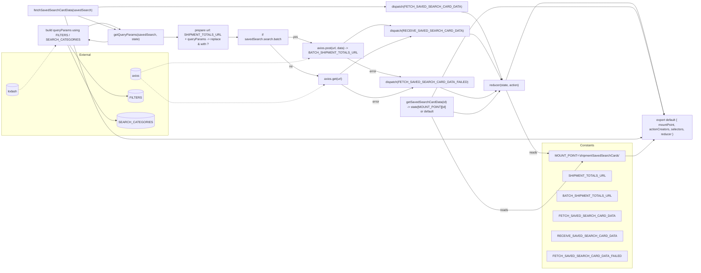

# Diagram: web/portal/src/pages/shipments/redux/ShipmentSavedSearchCardDataState.js

> Auto-generated by Obscura crawlers

## Mermaid

### SVG

<svg id="container" width="3461.46875" xmlns="http://www.w3.org/2000/svg" class="flowchart" height="1393.90576171875" viewBox="0 0 3461.46875 1393.90576171875" role="graphics-document document" aria-roledescription="flowchart-v2"><g><marker id="container_flowchart-v2-pointEnd" class="marker flowchart-v2" viewBox="0 0 10 10" refX="5" refY="5" markerUnits="userSpaceOnUse" markerWidth="8" markerHeight="8" orient="auto"><path d="M 0 0 L 10 5 L 0 10 z" class="arrowMarkerPath" style="stroke-width: 1; stroke-dasharray: 1, 0;"></path></marker><marker id="container_flowchart-v2-pointStart" class="marker flowchart-v2" viewBox="0 0 10 10" refX="4.5" refY="5" markerUnits="userSpaceOnUse" markerWidth="8" markerHeight="8" orient="auto"><path d="M 0 5 L 10 10 L 10 0 z" class="arrowMarkerPath" style="stroke-width: 1; stroke-dasharray: 1, 0;"></path></marker><marker id="container_flowchart-v2-circleEnd" class="marker flowchart-v2" viewBox="0 0 10 10" refX="11" refY="5" markerUnits="userSpaceOnUse" markerWidth="11" markerHeight="11" orient="auto"><circle cx="5" cy="5" r="5" class="arrowMarkerPath" style="stroke-width: 1; stroke-dasharray: 1, 0;"></circle></marker><marker id="container_flowchart-v2-circleStart" class="marker flowchart-v2" viewBox="0 0 10 10" refX="-1" refY="5" markerUnits="userSpaceOnUse" markerWidth="11" markerHeight="11" orient="auto"><circle cx="5" cy="5" r="5" class="arrowMarkerPath" style="stroke-width: 1; stroke-dasharray: 1, 0;"></circle></marker><marker id="container_flowchart-v2-crossEnd" class="marker cross flowchart-v2" viewBox="0 0 11 11" refX="12" refY="5.2" markerUnits="userSpaceOnUse" markerWidth="11" markerHeight="11" orient="auto"><path d="M 1,1 l 9,9 M 10,1 l -9,9" class="arrowMarkerPath" style="stroke-width: 2; stroke-dasharray: 1, 0;"></path></marker><marker id="container_flowchart-v2-crossStart" class="marker cross flowchart-v2" viewBox="0 0 11 11" refX="-1" refY="5.2" markerUnits="userSpaceOnUse" markerWidth="11" markerHeight="11" orient="auto"><path d="M 1,1 l 9,9 M 10,1 l -9,9" class="arrowMarkerPath" style="stroke-width: 2; stroke-dasharray: 1, 0;"></path></marker><g class="root"><g class="clusters"><g class="cluster" id="External" data-look="classic"><rect style="" x="8" y="273" width="851.5" height="423.9057788848877"></rect><g class="cluster-label" transform="translate(404.0625, 273)"><foreignObject width="59.375" height="24">

External

</foreignObject></g></g><g class="cluster" id="Constants" data-look="classic"><rect style="" x="2713.21875" y="736.9057788848877" width="430.25" height="649"></rect><g class="cluster-label" transform="translate(2892.4296875, 736.9057788848877)"><foreignObject width="71.828125" height="24">

Constants

</foreignObject></g></g></g><g class="edgePaths"><path d="M552.328,215.936L548.161,216.613C543.995,217.291,535.661,218.645,520.033,217.231C504.405,215.816,481.483,211.632,470.021,209.54L458.56,207.448" id="L_getQueryParams_buildQS_0" class="edge-thickness-normal edge-pattern-solid edge-thickness-normal edge-pattern-solid flowchart-link" style=";" data-edge="true" data-et="edge" data-id="L_getQueryParams_buildQS_0" data-points="W3sieCI6NTUyLjMyODEyNSwieSI6MjE1LjkzNTgzODkzODgwMjR9LHsieCI6NTI3LjMyODEyNSwieSI6MjIwfSx7IngiOjQ1NC42MjUsInkiOjIwNi43MjkyODM4OTczMjUyMn1d" marker-end="url(#container_flowchart-v2-pointEnd)"></path><path d="M357.513,234L385.816,277.889C414.118,321.778,470.723,409.556,520.261,453.445C569.799,497.334,612.271,497.334,633.507,497.334L654.742,497.334" id="L_buildQS_FILTERS_0" class="edge-thickness-normal edge-pattern-solid edge-thickness-normal edge-pattern-solid flowchart-link" style=";" data-edge="true" data-et="edge" data-id="L_buildQS_FILTERS_0" data-points="W3sieCI6MzU3LjUxMzE1MjcwODc5MTg0LCJ5IjoyMzR9LHsieCI6NTI3LjMyODEyNSwieSI6NDk3LjMzMzg0MTMyMzg1MjU0fSx7IngiOjY1OC43NDIxODc1LCJ5Ijo0OTcuMzMzODQxMzIzODUyNTR9XQ==" marker-end="url(#container_flowchart-v2-pointEnd)"></path><path d="M348.224,234L378.075,298.51C407.925,363.02,467.627,492.04,510.727,556.55C553.828,621.06,580.328,621.06,593.578,621.06L606.828,621.06" id="L_buildQS_SEARCH_CATS_0" class="edge-thickness-normal edge-pattern-solid edge-thickness-normal edge-pattern-solid flowchart-link" style=";" data-edge="true" data-et="edge" data-id="L_buildQS_SEARCH_CATS_0" data-points="W3sieCI6MzQ4LjIyNDE4NjEzMzQ2ODIsInkiOjIzNH0seyJ4Ijo1MjcuMzI4MTI1LCJ5Ijo2MjEuMDU5OTk1NjUxMjQ1MX0seyJ4Ijo2MTAuODI4MTI1LCJ5Ijo2MjEuMDU5OTk1NjUxMjQ1MX1d" marker-end="url(#container_flowchart-v2-pointEnd)"></path><path d="M454.625,135.541L466.742,131.118C478.859,126.694,503.094,117.847,529.445,120.623C555.797,123.398,584.265,137.796,598.499,144.996L612.733,152.195" id="L_buildQS_getQueryParams_0" class="edge-thickness-normal edge-pattern-solid edge-thickness-normal edge-pattern-solid flowchart-link" style=";" data-edge="true" data-et="edge" data-id="L_buildQS_getQueryParams_0" data-points="W3sieCI6NDU0LjYyNSwieSI6MTM1LjU0MTQzMjIwNTM0OTU3fSx7IngiOjUyNy4zMjgxMjUsInkiOjEwOX0seyJ4Ijo2MTYuMzAyNzM0Mzc1LCJ5IjoxNTR9XQ==" marker-end="url(#container_flowchart-v2-pointEnd)"></path><path d="M502.328,37.467L506.495,37.056C510.661,36.644,518.995,35.822,550.842,35.411C582.69,35,638.052,35,693.414,35C748.776,35,804.138,35,835.986,35C867.833,35,876.167,35,906.167,35C936.167,35,987.833,35,1039.5,35C1091.167,35,1142.833,35,1194.5,35C1246.167,35,1297.833,35,1351.501,35C1405.169,35,1460.839,35,1518.22,35C1575.602,35,1634.695,35,1694.798,35C1754.901,35,1816.013,35,1857.754,35C1899.495,35,1921.865,35,1933.049,35L1944.234,35" id="L_fetchSavedSearchCardData_dispatchFetch_0" class="edge-thickness-normal edge-pattern-solid edge-thickness-normal edge-pattern-solid flowchart-link" style=";" data-edge="true" data-et="edge" data-id="L_fetchSavedSearchCardData_dispatchFetch_0" data-points="W3sieCI6NTAyLjMyODEyNSwieSI6MzcuNDY2NjYxNTI3Nzg4NDl9LHsieCI6NTI3LjMyODEyNSwieSI6MzV9LHsieCI6NjkzLjQxNDA2MjUsInkiOjM1fSx7IngiOjg1OS41LCJ5IjozNX0seyJ4Ijo4ODQuNSwieSI6MzV9LHsieCI6MTAzOS41LCJ5IjozNX0seyJ4IjoxMTk0LjUsInkiOjM1fSx7IngiOjEzNDkuNSwieSI6MzV9LHsieCI6MTUxNi41MDc4MTI1LCJ5IjozNX0seyJ4IjoxNjkzLjc4OTA2MjUsInkiOjM1fSx7IngiOjE4NzcuMTI1LCJ5IjozNX0seyJ4IjoxOTQ4LjIzNDM3NSwieSI6MzV9XQ==" marker-end="url(#container_flowchart-v2-pointEnd)"></path><path d="M398.584,82L420.042,89.833C441.499,97.667,484.413,113.333,516.062,125.094C547.71,136.854,568.091,144.708,578.282,148.635L588.473,152.562" id="L_fetchSavedSearchCardData_getQueryParams_0" class="edge-thickness-normal edge-pattern-solid edge-thickness-normal edge-pattern-solid flowchart-link" style=";" data-edge="true" data-et="edge" data-id="L_fetchSavedSearchCardData_getQueryParams_0" data-points="W3sieCI6Mzk4LjU4NDI0ODMxMDgxMDg0LCJ5Ijo4Mn0seyJ4Ijo1MjcuMzI4MTI1LCJ5IjoxMjl9LHsieCI6NTkyLjIwNTQ0NDMzNTkzNzUsInkiOjE1NH1d" marker-end="url(#container_flowchart-v2-pointEnd)"></path><path d="M834.5,193L838.667,193C842.833,193,851.167,193,859.5,193C867.833,193,876.167,193,883.833,193C891.5,193,898.5,193,902,193L905.5,193" id="L_getQueryParams_urlPrep_0" class="edge-thickness-normal edge-pattern-solid edge-thickness-normal edge-pattern-solid flowchart-link" style=";" data-edge="true" data-et="edge" data-id="L_getQueryParams_urlPrep_0" data-points="W3sieCI6ODM0LjUsInkiOjE5M30seyJ4Ijo4NTkuNSwieSI6MTkzfSx7IngiOjg4NC41LCJ5IjoxOTN9LHsieCI6OTA5LjUsInkiOjE5M31d" marker-end="url(#container_flowchart-v2-pointEnd)"></path><path d="M1169.5,193L1173.667,193C1177.833,193,1186.167,193,1193.833,193C1201.5,193,1208.5,193,1212,193L1215.5,193" id="L_urlPrep_batchCheck_0" class="edge-thickness-normal edge-pattern-solid edge-thickness-normal edge-pattern-solid flowchart-link" style=";" data-edge="true" data-et="edge" data-id="L_urlPrep_batchCheck_0" data-points="W3sieCI6MTE2OS41LCJ5IjoxOTN9LHsieCI6MTE5NC41LCJ5IjoxOTN9LHsieCI6MTIxOS41LCJ5IjoxOTN9XQ==" marker-end="url(#container_flowchart-v2-pointEnd)"></path><path d="M1479.5,193L1485.668,193C1491.836,193,1504.172,193,1522.762,197.892C1541.351,202.784,1566.195,212.568,1578.617,217.46L1591.039,222.352" id="L_batchCheck_axiosPost_0" class="edge-thickness-normal edge-pattern-solid edge-thickness-normal edge-pattern-solid flowchart-link" style=";" data-edge="true" data-et="edge" data-id="L_batchCheck_axiosPost_0" data-points="W3sieCI6MTQ3OS41LCJ5IjoxOTN9LHsieCI6MTUxNi41MDc4MTI1LCJ5IjoxOTN9LHsieCI6MTU5NC43NjAzNTU4OTg4OTU2LCJ5IjoyMjMuODE3ODIzNDEwMDM0MTh9XQ==" marker-end="url(#container_flowchart-v2-pointEnd)"></path><path d="M1387.071,232L1408.643,254.394C1430.216,276.787,1473.362,321.575,1510.952,347.763C1548.541,373.951,1580.574,381.54,1596.591,385.334L1612.608,389.129" id="L_batchCheck_axiosGet_0" class="edge-thickness-normal edge-pattern-solid edge-thickness-normal edge-pattern-solid flowchart-link" style=";" data-edge="true" data-et="edge" data-id="L_batchCheck_axiosGet_0" data-points="W3sieCI6MTM4Ny4wNzA1ODczMTczMjgzLCJ5IjoyMzJ9LHsieCI6MTUxNi41MDc4MTI1LCJ5IjozNjYuMzYxODAxMTQ3NDYwOTR9LHsieCI6MTYxNi41LCJ5IjozOTAuMDUxMTE4OTY4NzE5NTV9XQ==" marker-end="url(#container_flowchart-v2-pointEnd)"></path><path d="M1743.505,223.818L1765.775,206.348C1788.045,188.879,1832.585,153.939,1869.788,138.864C1906.992,123.789,1936.858,128.578,1951.791,130.972L1966.725,133.367" id="L_axiosPost_dispatchReceive_0" class="edge-thickness-normal edge-pattern-solid edge-thickness-normal edge-pattern-solid flowchart-link" style=";" data-edge="true" data-et="edge" data-id="L_axiosPost_dispatchReceive_0" data-points="W3sieCI6MTc0My41MDU0NDI1MjEzNzMyLCJ5IjoyMjMuODE3ODIzNDEwMDM0MTh9LHsieCI6MTg3Ny4xMjUsInkiOjExOX0seyJ4IjoxOTcwLjY3NDEwNzE0Mjg1NywieSI6MTM0fV0=" marker-end="url(#container_flowchart-v2-pointEnd)"></path><path d="M1726.142,381.362L1751.306,360.362C1776.47,339.362,1826.797,297.362,1882.499,265.361C1938.2,233.36,1999.275,211.358,2029.813,200.357L2060.35,189.356" id="L_axiosGet_dispatchReceive_0" class="edge-thickness-normal edge-pattern-solid edge-thickness-normal edge-pattern-solid flowchart-link" style=";" data-edge="true" data-et="edge" data-id="L_axiosGet_dispatchReceive_0" data-points="W3sieCI6MTcyNi4xNDI0NjMyMzUyOTQxLCJ5IjozODEuMzYxODAxMTQ3NDYwOTR9LHsieCI6MTg3Ny4xMjUsInkiOjI1NS4zNjE4MDExNDc0NjA5NH0seyJ4IjoyMDY0LjExMzYwNzM5NzI4MywieSI6MTg4fV0=" marker-end="url(#container_flowchart-v2-pointEnd)"></path><path d="M1762.843,301.818L1781.89,312.575C1800.937,323.332,1839.031,344.847,1880.761,360.627C1922.49,376.407,1967.855,386.452,1990.538,391.474L2013.221,396.497" id="L_axiosPost_dispatchFailed_0" class="edge-thickness-normal edge-pattern-solid edge-thickness-normal edge-pattern-solid flowchart-link" style=";" data-edge="true" data-et="edge" data-id="L_axiosPost_dispatchFailed_0" data-points="W3sieCI6MTc2Mi44NDI4MjgwNDcxNTQsInkiOjMwMS44MTc4MjM0MTAwMzQyfSx7IngiOjE4NzcuMTI1LCJ5IjozNjYuMzYxODAxMTQ3NDYwOTR9LHsieCI6MjAxNy4xMjYwNzc1ODYyMDcsInkiOjM5Ny4zNjE4MDExNDc0NjA5NH1d" marker-end="url(#container_flowchart-v2-pointEnd)"></path><path d="M1733.075,435.362L1757.084,451.862C1781.092,468.362,1829.108,501.362,1885.443,504.287C1941.777,507.211,2006.429,480.061,2038.755,466.486L2071.081,452.911" id="L_axiosGet_dispatchFailed_0" class="edge-thickness-normal edge-pattern-solid edge-thickness-normal edge-pattern-solid flowchart-link" style=";" data-edge="true" data-et="edge" data-id="L_axiosGet_dispatchFailed_0" data-points="W3sieCI6MTczMy4wNzUzMzQ4MjE0Mjg3LCJ5Ijo0MzUuMzYxODAxMTQ3NDYwOTR9LHsieCI6MTg3Ny4xMjUsInkiOjUzNC4zNjE4MDExNDc0NjA5fSx7IngiOjIwNzQuNzY4NzUsInkiOjQ1MS4zNjE4MDExNDc0NjA5NH1d" marker-end="url(#container_flowchart-v2-pointEnd)"></path><path d="M2299.663,62L2313.542,64.333C2327.421,66.667,2355.179,71.333,2389.31,129.676C2423.441,188.019,2463.944,300.037,2484.196,356.047L2504.448,412.056" id="L_dispatchFetch_reducer_0" class="edge-thickness-normal edge-pattern-solid edge-thickness-normal edge-pattern-solid flowchart-link" style=";" data-edge="true" data-et="edge" data-id="L_dispatchFetch_reducer_0" data-points="W3sieCI6MjI5OS42NjMxMDk3NTYwOTc2LCJ5Ijo2Mn0seyJ4IjoyMzgyLjkzNzUsInkiOjc2fSx7IngiOjI1MDUuODA3NzM5MDY3MjAxLCJ5Ijo0MTUuODE3ODIzNDEwMDM0Mn1d" marker-end="url(#container_flowchart-v2-pointEnd)"></path><path d="M2336.781,176.404L2344.474,177.003C2352.167,177.603,2367.552,178.801,2394.779,218.108C2422.006,257.416,2461.074,334.831,2480.608,373.539L2500.142,412.247" id="L_dispatchReceive_reducer_0" class="edge-thickness-normal edge-pattern-solid edge-thickness-normal edge-pattern-solid flowchart-link" style=";" data-edge="true" data-et="edge" data-id="L_dispatchReceive_reducer_0" data-points="W3sieCI6MjMzNi43ODEyNSwieSI6MTc2LjQwNDAyMzU3NzY1MjQ4fSx7IngiOjIzODIuOTM3NSwieSI6MTgwfSx7IngiOjI1MDEuOTQ0NTc3Nzk1MTE3LCJ5Ijo0MTUuODE3ODIzNDEwMDM0Mn1d" marker-end="url(#container_flowchart-v2-pointEnd)"></path><path d="M2201.182,451.362L2231.474,464.528C2261.767,477.695,2322.352,504.028,2367.376,507.472C2412.4,510.915,2441.863,491.468,2456.594,481.745L2471.326,472.021" id="L_dispatchFailed_reducer_0" class="edge-thickness-normal edge-pattern-solid edge-thickness-normal edge-pattern-solid flowchart-link" style=";" data-edge="true" data-et="edge" data-id="L_dispatchFailed_reducer_0" data-points="W3sieCI6MjIwMS4xODE2MDM3NzM1ODUsInkiOjQ1MS4zNjE4MDExNDc0NjA5NH0seyJ4IjoyMzgyLjkzNzUsInkiOjUzMC4zNjE4MDExNDc0NjA5fSx7IngiOjI0NzQuNjY0MTc1NjA2ODI4LCJ5Ijo0NjkuODE3ODIzNDEwMDM0Mn1d" marker-end="url(#container_flowchart-v2-pointEnd)"></path><path d="M2527.513,469.818L2550.963,522.832C2574.412,575.847,2621.312,681.876,2652.263,734.891C2683.214,787.906,2698.216,787.906,2709.219,788.166C2720.222,788.427,2727.226,788.948,2730.728,789.208L2734.23,789.468" id="L_reducer_MOUNT_POINT_0" class="edge-thickness-normal edge-pattern-solid edge-thickness-normal edge-pattern-solid flowchart-link" style=";" data-edge="true" data-et="edge" data-id="L_reducer_MOUNT_POINT_0" data-points="W3sieCI6MjUyNy41MTMwNTU4MTk4MjY2LCJ5Ijo0NjkuODE3ODIzNDEwMDM0Mn0seyJ4IjoyNjY4LjIxMDkzNzUsInkiOjc4Ny45MDU3Nzg4ODQ4ODc3fSx7IngiOjI3MTMuMjE4NzUsInkiOjc4Ny45MDU3Nzg4ODQ4ODc3fSx7IngiOjI3MzguMjE4NzUsInkiOjc4OS43NjUxNjI5NjM5MTE1fV0=" marker-end="url(#container_flowchart-v2-pointEnd)"></path><path d="M2162.418,603.362L2199.171,683.619C2235.924,763.876,2309.431,924.391,2368.29,1004.648C2427.148,1084.906,2471.359,1084.906,2518.905,1084.906C2566.451,1084.906,2617.331,1084.906,2650.272,1084.906C2683.214,1084.906,2698.216,1084.906,2737.721,1043.102C2777.226,1001.298,2841.234,917.69,2873.238,875.886L2905.242,834.082" id="L_selector_MOUNT_POINT_0" class="edge-thickness-normal edge-pattern-solid edge-thickness-normal edge-pattern-solid flowchart-link" style=";" data-edge="true" data-et="edge" data-id="L_selector_MOUNT_POINT_0" data-points="W3sieCI6MjE2Mi40MTc2MTM0MTc3NTUsInkiOjYwMy4zNjE4MDExNDc0NjA5fSx7IngiOjIzODIuOTM3NSwieSI6MTA4NC45MDU3Nzg4ODQ4ODc3fSx7IngiOjI1MTUuNTcwMzEyNSwieSI6MTA4NC45MDU3Nzg4ODQ4ODc3fSx7IngiOjI2NjguMjEwOTM3NSwieSI6MTA4NC45MDU3Nzg4ODQ4ODc3fSx7IngiOjI3MTMuMjE4NzUsInkiOjEwODQuOTA1Nzc4ODg0ODg3N30seyJ4IjoyOTA3LjY3MzM3NjMzNDUxOTYsInkiOjgzMC45MDU3Nzg4ODQ4ODc3fV0=" marker-end="url(#container_flowchart-v2-pointEnd)"></path><path d="M2273.672,581.064L2291.883,584.947C2310.094,588.83,2346.516,596.596,2382.714,578.57C2418.913,560.544,2454.889,516.727,2472.876,494.818L2490.864,472.909" id="L_selector_reducer_0" class="edge-thickness-normal edge-pattern-solid edge-thickness-normal edge-pattern-solid flowchart-link" style=";" data-edge="true" data-et="edge" data-id="L_selector_reducer_0" data-points="W3sieCI6MjI3My42NzE4NzUsInkiOjU4MS4wNjM3NDg4NjY1NzkzfSx7IngiOjIzODIuOTM3NSwieSI6NjA0LjM2MTgwMTE0NzQ2MDl9LHsieCI6MjQ5My40MDI0NDIyNTQwMzcsInkiOjQ2OS44MTc4MjM0MTAwMzQyfV0=" marker-end="url(#container_flowchart-v2-pointEnd)"></path><path d="M719.813,374.599L743.094,366.469C766.375,358.339,812.938,342.078,840.385,333.948C867.833,325.818,876.167,325.818,906.167,325.818C936.167,325.818,987.833,325.818,1039.5,325.818C1091.167,325.818,1142.833,325.818,1194.5,325.818C1246.167,325.818,1297.833,325.818,1351.501,325.818C1405.169,325.818,1460.839,325.818,1499.301,322.041C1537.763,318.264,1559.019,310.711,1569.647,306.934L1580.274,303.157" id="L_AXIOS_axiosPost_0" class="edge-thickness-normal edge-pattern-dotted edge-thickness-normal edge-pattern-solid flowchart-link" style=";" data-edge="true" data-et="edge" data-id="L_AXIOS_axiosPost_0" data-points="W3sieCI6NzE5LjgxMjUsInkiOjM3NC41OTkwNDU0ODA2ODY2fSx7IngiOjg1OS41LCJ5IjozMjUuODE3ODIzNDEwMDM0Mn0seyJ4Ijo4ODQuNSwieSI6MzI1LjgxNzgyMzQxMDAzNDJ9LHsieCI6MTAzOS41LCJ5IjozMjUuODE3ODIzNDEwMDM0Mn0seyJ4IjoxMTk0LjUsInkiOjMyNS44MTc4MjM0MTAwMzQyfSx7IngiOjEzNDkuNSwieSI6MzI1LjgxNzgyMzQxMDAzNDJ9LHsieCI6MTUxNi41MDc4MTI1LCJ5IjozMjUuODE3ODIzNDEwMDM0Mn0seyJ4IjoxNTg0LjA0MzUyNjc4NTcxNDIsInkiOjMwMS44MTc4MjM0MTAwMzQyfV0=" marker-end="url(#container_flowchart-v2-pointEnd)"></path><path d="M719.813,399.686L743.094,421.466C766.375,443.245,812.938,486.803,840.385,508.583C867.833,530.362,876.167,530.362,906.167,530.362C936.167,530.362,987.833,530.362,1039.5,530.362C1091.167,530.362,1142.833,530.362,1194.5,530.362C1246.167,530.362,1297.833,530.362,1351.501,530.362C1405.169,530.362,1460.839,530.362,1511.132,514.906C1561.425,499.451,1606.342,468.54,1628.801,453.085L1651.26,437.629" id="L_AXIOS_axiosGet_0" class="edge-thickness-normal edge-pattern-dotted edge-thickness-normal edge-pattern-solid flowchart-link" style=";" data-edge="true" data-et="edge" data-id="L_AXIOS_axiosGet_0" data-points="W3sieCI6NzE5LjgxMjUsInkiOjM5OS42ODY0MTE4NDg4MjE2fSx7IngiOjg1OS41LCJ5Ijo1MzAuMzYxODAxMTQ3NDYwOX0seyJ4Ijo4ODQuNSwieSI6NTMwLjM2MTgwMTE0NzQ2MDl9LHsieCI6MTAzOS41LCJ5Ijo1MzAuMzYxODAxMTQ3NDYwOX0seyJ4IjoxMTk0LjUsInkiOjUzMC4zNjE4MDExNDc0NjA5fSx7IngiOjEzNDkuNSwieSI6NTMwLjM2MTgwMTE0NzQ2MDl9LHsieCI6MTUxNi41MDc4MTI1LCJ5Ijo1MzAuMzYxODAxMTQ3NDYwOX0seyJ4IjoxNjU0LjU1NDY4NzUsInkiOjQzNS4zNjE4MDExNDc0NjA5NH1d" marker-end="url(#container_flowchart-v2-pointEnd)"></path><path d="M96.922,462.362L101.089,462.362C105.255,462.362,113.589,462.362,144.98,424.841C176.371,387.32,230.821,312.279,258.046,274.758L285.271,237.238" id="L_LODASH_buildQS_0" class="edge-thickness-normal edge-pattern-dotted edge-thickness-normal edge-pattern-solid flowchart-link" style=";" data-edge="true" data-et="edge" data-id="L_LODASH_buildQS_0" data-points="W3sieCI6OTYuOTIxODc1LCJ5Ijo0NjIuMzYxODAxMTQ3NDYwOTR9LHsieCI6MTIxLjkyMTg3NSwieSI6NDYyLjM2MTgwMTE0NzQ2MDk0fSx7IngiOjI4Ny42MTk3MjgyMjUwNTQ3NiwieSI6MjM0fV0=" marker-end="url(#container_flowchart-v2-pointEnd)"></path><path d="M2525.204,415.818L2549.038,349.015C2572.873,282.212,2620.542,148.606,2651.878,81.803C2683.214,15,2698.216,15,2741.572,15C2784.927,15,2856.635,15,2928.344,15C3000.052,15,3071.76,15,3111.781,15C3151.802,15,3160.135,15,3187.435,110.503C3214.735,206.006,3261.001,397.012,3284.134,492.515L3307.267,588.018" id="L_reducer_exportObj_0" class="edge-thickness-normal edge-pattern-solid edge-thickness-normal edge-pattern-solid flowchart-link" style=";" data-edge="true" data-et="edge" data-id="L_reducer_exportObj_0" data-points="W3sieCI6MjUyNS4yMDM2MTExODM0MjEzLCJ5Ijo0MTUuODE3ODIzNDEwMDM0Mn0seyJ4IjoyNjY4LjIxMDkzNzUsInkiOjE1fSx7IngiOjI3MTMuMjE4NzUsInkiOjE1fSx7IngiOjI5MjguMzQzNzUsInkiOjE1fSx7IngiOjMxNDMuNDY4NzUsInkiOjE1fSx7IngiOjMxNjguNDY4NzUsInkiOjE1fSx7IngiOjMzMDguMjA4NjkwOTA2NTg3LCJ5Ijo1OTEuOTA1Nzc4ODg0ODg3N31d" marker-end="url(#container_flowchart-v2-pointEnd)"></path><path d="M2163.103,501.362L2199.742,423.635C2236.381,345.908,2309.659,190.454,2368.404,112.727C2427.148,35,2471.359,35,2518.905,35C2566.451,35,2617.331,35,2650.272,35C2683.214,35,2698.216,35,2741.572,35C2784.927,35,2856.635,35,2928.344,35C3000.052,35,3071.76,35,3111.781,35C3151.802,35,3160.135,35,3187.348,127.171C3214.561,219.342,3260.654,403.683,3283.7,495.854L3306.746,588.025" id="L_selector_exportObj_0" class="edge-thickness-normal edge-pattern-solid edge-thickness-normal edge-pattern-solid flowchart-link" style=";" data-edge="true" data-et="edge" data-id="L_selector_exportObj_0" data-points="W3sieCI6MjE2My4xMDI5NzgwMDI4NDkzLCJ5Ijo1MDEuMzYxODAxMTQ3NDYwOTR9LHsieCI6MjM4Mi45Mzc1LCJ5IjozNX0seyJ4IjoyNTE1LjU3MDMxMjUsInkiOjM1fSx7IngiOjI2NjguMjEwOTM3NSwieSI6MzV9LHsieCI6MjcxMy4yMTg3NSwieSI6MzV9LHsieCI6MjkyOC4zNDM3NSwieSI6MzV9LHsieCI6MzE0My40Njg3NSwieSI6MzV9LHsieCI6MzE2OC40Njg3NSwieSI6MzV9LHsieCI6MzMwNy43MTYzNTYxMTU5Mzk2LCJ5Ijo1OTEuOTA1Nzc4ODg0ODg3N31d" marker-end="url(#container_flowchart-v2-pointEnd)"></path><path d="M332.894,82L365.299,187.818C397.705,293.635,462.517,505.271,522.603,611.088C582.69,716.906,638.052,716.906,693.414,716.906C748.776,716.906,804.138,716.906,835.986,716.906C867.833,716.906,876.167,716.906,906.167,716.906C936.167,716.906,987.833,716.906,1039.5,716.906C1091.167,716.906,1142.833,716.906,1194.5,716.906C1246.167,716.906,1297.833,716.906,1351.501,716.906C1405.169,716.906,1460.839,716.906,1518.22,716.906C1575.602,716.906,1634.695,716.906,1694.798,716.906C1754.901,716.906,1816.013,716.906,1890.225,716.906C1964.438,716.906,2051.75,716.906,2136.052,716.906C2220.354,716.906,2301.646,716.906,2364.397,716.906C2427.148,716.906,2471.359,716.906,2518.905,716.906C2566.451,716.906,2617.331,716.906,2650.272,716.906C2683.214,716.906,2698.216,716.906,2741.572,716.906C2784.927,716.906,2856.635,716.906,2928.344,716.906C3000.052,716.906,3071.76,716.906,3111.781,716.906C3151.802,716.906,3160.135,716.906,3167.85,715.487C3175.564,714.068,3182.659,711.229,3186.207,709.81L3189.755,708.391" id="L_fetchSavedSearchCardData_exportObj_0" class="edge-thickness-normal edge-pattern-solid edge-thickness-normal edge-pattern-solid flowchart-link" style=";" data-edge="true" data-et="edge" data-id="L_fetchSavedSearchCardData_exportObj_0" data-points="W3sieCI6MzMyLjg5MzUyNDg0MDgzMjEsInkiOjgyfSx7IngiOjUyNy4zMjgxMjUsInkiOjcxNi45MDU3Nzg4ODQ4ODc3fSx7IngiOjY5My40MTQwNjI1LCJ5Ijo3MTYuOTA1Nzc4ODg0ODg3N30seyJ4Ijo4NTkuNSwieSI6NzE2LjkwNTc3ODg4NDg4Nzd9LHsieCI6ODg0LjUsInkiOjcxNi45MDU3Nzg4ODQ4ODc3fSx7IngiOjEwMzkuNSwieSI6NzE2LjkwNTc3ODg4NDg4Nzd9LHsieCI6MTE5NC41LCJ5Ijo3MTYuOTA1Nzc4ODg0ODg3N30seyJ4IjoxMzQ5LjUsInkiOjcxNi45MDU3Nzg4ODQ4ODc3fSx7IngiOjE1MTYuNTA3ODEyNSwieSI6NzE2LjkwNTc3ODg4NDg4Nzd9LHsieCI6MTY5My43ODkwNjI1LCJ5Ijo3MTYuOTA1Nzc4ODg0ODg3N30seyJ4IjoxODc3LjEyNSwieSI6NzE2LjkwNTc3ODg4NDg4Nzd9LHsieCI6MjEzOS4wNjI1LCJ5Ijo3MTYuOTA1Nzc4ODg0ODg3N30seyJ4IjoyMzgyLjkzNzUsInkiOjcxNi45MDU3Nzg4ODQ4ODc3fSx7IngiOjI1MTUuNTcwMzEyNSwieSI6NzE2LjkwNTc3ODg4NDg4Nzd9LHsieCI6MjY2OC4yMTA5Mzc1LCJ5Ijo3MTYuOTA1Nzc4ODg0ODg3N30seyJ4IjoyNzEzLjIxODc1LCJ5Ijo3MTYuOTA1Nzc4ODg0ODg3N30seyJ4IjoyOTI4LjM0Mzc1LCJ5Ijo3MTYuOTA1Nzc4ODg0ODg3N30seyJ4IjozMTQzLjQ2ODc1LCJ5Ijo3MTYuOTA1Nzc4ODg0ODg3N30seyJ4IjozMTY4LjQ2ODc1LCJ5Ijo3MTYuOTA1Nzc4ODg0ODg3N30seyJ4IjozMTkzLjQ2ODc1LCJ5Ijo3MDYuOTA1Nzc4ODg0ODg3N31d" marker-end="url(#container_flowchart-v2-pointEnd)"></path><path d="M3118.469,803.906L3122.635,803.906C3126.802,803.906,3135.135,803.906,3143.469,803.906C3151.802,803.906,3160.135,803.906,3178.732,790.034C3197.329,776.163,3226.188,748.42,3240.618,734.549L3255.048,720.678" id="L_MOUNT_POINT_exportObj_0" class="edge-thickness-normal edge-pattern-solid edge-thickness-normal edge-pattern-solid flowchart-link" style=";" data-edge="true" data-et="edge" data-id="L_MOUNT_POINT_exportObj_0" data-points="W3sieCI6MzExOC40Njg3NSwieSI6ODAzLjkwNTc3ODg4NDg4Nzd9LHsieCI6MzE0My40Njg3NSwieSI6ODAzLjkwNTc3ODg4NDg4Nzd9LHsieCI6MzE2OC40Njg3NSwieSI6ODAzLjkwNTc3ODg4NDg4Nzd9LHsieCI6MzI1Ny45MzE4MzcyNDgzMjIsInkiOjcxNy45MDU3Nzg4ODQ4ODc3fV0=" marker-end="url(#container_flowchart-v2-pointEnd)"></path></g><g class="edgeLabels"><g class="edgeLabel"><g class="label" data-id="L_getQueryParams_buildQS_0" transform="translate(0, 0)"><foreignObject width="0" height="0">

</foreignObject></g></g><g class="edgeLabel"><g class="label" data-id="L_buildQS_FILTERS_0" transform="translate(0, 0)"><foreignObject width="0" height="0">

</foreignObject></g></g><g class="edgeLabel"><g class="label" data-id="L_buildQS_SEARCH_CATS_0" transform="translate(0, 0)"><foreignObject width="0" height="0">

</foreignObject></g></g><g class="edgeLabel"><g class="label" data-id="L_buildQS_getQueryParams_0" transform="translate(0, 0)"><foreignObject width="0" height="0">

</foreignObject></g></g><g class="edgeLabel"><g class="label" data-id="L_fetchSavedSearchCardData_dispatchFetch_0" transform="translate(0, 0)"><foreignObject width="0" height="0">

</foreignObject></g></g><g class="edgeLabel"><g class="label" data-id="L_fetchSavedSearchCardData_getQueryParams_0" transform="translate(0, 0)"><foreignObject width="0" height="0">

</foreignObject></g></g><g class="edgeLabel"><g class="label" data-id="L_getQueryParams_urlPrep_0" transform="translate(0, 0)"><foreignObject width="0" height="0">

</foreignObject></g></g><g class="edgeLabel"><g class="label" data-id="L_urlPrep_batchCheck_0" transform="translate(0, 0)"><foreignObject width="0" height="0">

</foreignObject></g></g><g class="edgeLabel" transform="translate(1516.5078125, 193)"><g class="label" data-id="L_batchCheck_axiosPost_0" transform="translate(-12.0078125, -12)"><foreignObject width="24.015625" height="24">

yes

</foreignObject></g></g><g class="edgeLabel" transform="translate(1487.43592, 336.18383)"><g class="label" data-id="L_batchCheck_axiosGet_0" transform="translate(-9.3671875, -12)"><foreignObject width="18.734375" height="24">

no

</foreignObject></g></g><g class="edgeLabel"><g class="label" data-id="L_axiosPost_dispatchReceive_0" transform="translate(0, 0)"><foreignObject width="0" height="0">

</foreignObject></g></g><g class="edgeLabel"><g class="label" data-id="L_axiosGet_dispatchReceive_0" transform="translate(0, 0)"><foreignObject width="0" height="0">

</foreignObject></g></g><g class="edgeLabel" transform="translate(1883.0529, 367.6744)"><g class="label" data-id="L_axiosPost_dispatchFailed_0" transform="translate(-18.0625, -12)"><foreignObject width="36.125" height="24">

error

</foreignObject></g></g><g class="edgeLabel" transform="translate(1895.36905, 526.70026)"><g class="label" data-id="L_axiosGet_dispatchFailed_0" transform="translate(-18.0625, -12)"><foreignObject width="36.125" height="24">

error

</foreignObject></g></g><g class="edgeLabel"><g class="label" data-id="L_dispatchFetch_reducer_0" transform="translate(0, 0)"><foreignObject width="0" height="0">

</foreignObject></g></g><g class="edgeLabel"><g class="label" data-id="L_dispatchReceive_reducer_0" transform="translate(0, 0)"><foreignObject width="0" height="0">

</foreignObject></g></g><g class="edgeLabel"><g class="label" data-id="L_dispatchFailed_reducer_0" transform="translate(0, 0)"><foreignObject width="0" height="0">

</foreignObject></g></g><g class="edgeLabel" transform="translate(2668.2109375, 787.9057788848877)"><g class="label" data-id="L_reducer_MOUNT_POINT_0" transform="translate(-20.0078125, -12)"><foreignObject width="40.015625" height="24">

reads

</foreignObject></g></g><g class="edgeLabel" transform="translate(2515.5703125, 1084.9057788848877)"><g class="label" data-id="L_selector_MOUNT_POINT_0" transform="translate(-20.0078125, -12)"><foreignObject width="40.015625" height="24">

reads

</foreignObject></g></g><g class="edgeLabel"><g class="label" data-id="L_selector_reducer_0" transform="translate(0, 0)"><foreignObject width="0" height="0">

</foreignObject></g></g><g class="edgeLabel"><g class="label" data-id="L_AXIOS_axiosPost_0" transform="translate(0, 0)"><foreignObject width="0" height="0">

</foreignObject></g></g><g class="edgeLabel"><g class="label" data-id="L_AXIOS_axiosGet_0" transform="translate(0, 0)"><foreignObject width="0" height="0">

</foreignObject></g></g><g class="edgeLabel"><g class="label" data-id="L_LODASH_buildQS_0" transform="translate(0, 0)"><foreignObject width="0" height="0">

</foreignObject></g></g><g class="edgeLabel"><g class="label" data-id="L_reducer_exportObj_0" transform="translate(0, 0)"><foreignObject width="0" height="0">

</foreignObject></g></g><g class="edgeLabel"><g class="label" data-id="L_selector_exportObj_0" transform="translate(0, 0)"><foreignObject width="0" height="0">

</foreignObject></g></g><g class="edgeLabel"><g class="label" data-id="L_fetchSavedSearchCardData_exportObj_0" transform="translate(0, 0)"><foreignObject width="0" height="0">

</foreignObject></g></g><g class="edgeLabel"><g class="label" data-id="L_MOUNT_POINT_exportObj_0" transform="translate(0, 0)"><foreignObject width="0" height="0">

</foreignObject></g></g></g><g class="nodes"><g class="node default" id="flowchart-MOUNT_POINT-0" transform="translate(2928.34375, 803.9057788848877)"><rect class="basic label-container" style="" x="-190.125" y="-27" width="380.25" height="54"></rect><g class="label" style="" transform="translate(-160.125, -12)"><rect></rect><foreignObject width="320.25" height="24">

MOUNT_POINT='shipmentSavedSearchCards'

</foreignObject></g></g><g class="node default" id="flowchart-SHIP_TOTALS-1" transform="translate(2928.34375, 907.9057788848877)"><rect class="basic label-container" style="" x="-113.4921875" y="-27" width="226.984375" height="54"></rect><g class="label" style="" transform="translate(-83.4921875, -12)"><rect></rect><foreignObject width="166.984375" height="24">

SHIPMENT_TOTALS_URL

</foreignObject></g></g><g class="node default" id="flowchart-BATCH_TOTALS-2" transform="translate(2928.34375, 1011.9057788848877)"><rect class="basic label-container" style="" x="-140.2734375" y="-27" width="280.546875" height="54"></rect><g class="label" style="" transform="translate(-110.2734375, -12)"><rect></rect><foreignObject width="220.546875" height="24">

BATCH_SHIPMENT_TOTALS_URL

</foreignObject></g></g><g class="node default" id="flowchart-FETCH-3" transform="translate(2928.34375, 1115.9057788848877)"><rect class="basic label-container" style="" x="-154.5625" y="-27" width="309.125" height="54"></rect><g class="label" style="" transform="translate(-124.5625, -12)"><rect></rect><foreignObject width="249.125" height="24">

FETCH_SAVED_SEARCH_CARD_DATA

</foreignObject></g></g><g class="node default" id="flowchart-RECEIVE-4" transform="translate(2928.34375, 1219.9057788848877)"><rect class="basic label-container" style="" x="-161.453125" y="-27" width="322.90625" height="54"></rect><g class="label" style="" transform="translate(-131.453125, -12)"><rect></rect><foreignObject width="262.90625" height="24">

RECEIVE_SAVED_SEARCH_CARD_DATA

</foreignObject></g></g><g class="node default" id="flowchart-FAILED-5" transform="translate(2928.34375, 1323.9057788848877)"><rect class="basic label-container" style="" x="-182.609375" y="-27" width="365.21875" height="54"></rect><g class="label" style="" transform="translate(-152.609375, -12)"><rect></rect><foreignObject width="305.21875" height="24">

FETCH_SAVED_SEARCH_CARD_DATA_FAILED

</foreignObject></g></g><g class="node default" id="flowchart-AXIOS-6" transform="translate(693.4140625, 383.8178234100342)"><path d="M0,7.423763072326215 a26.3984375,7.423763072326215 0,0,0 52.796875,0 a26.3984375,7.423763072326215 0,0,0 -52.796875,0 l0,46.42376307232622 a26.3984375,7.423763072326215 0,0,0 52.796875,0 l0,-46.42376307232622" class="basic label-container" style="" transform="translate(-26.3984375, -30.635644608489322)"></path><g class="label" style="" transform="translate(-18.8984375, -2)"><rect></rect><foreignObject width="37.796875" height="24">

axios

</foreignObject></g></g><g class="node default" id="flowchart-LODASH-7" transform="translate(64.9609375, 462.36180114746094)"><path d="M0,8.45877098668431 a31.9609375,8.45877098668431 0,0,0 63.921875,0 a31.9609375,8.45877098668431 0,0,0 -63.921875,0 l0,47.458770986684314 a31.9609375,8.45877098668431 0,0,0 63.921875,0 l0,-47.458770986684314" class="basic label-container" style="" transform="translate(-31.9609375, -32.188156480026464)"></path><g class="label" style="" transform="translate(-24.4609375, -2)"><rect></rect><foreignObject width="48.921875" height="24">

lodash

</foreignObject></g></g><g class="node default" id="flowchart-FILTERS-8" transform="translate(693.4140625, 497.33384132385254)"><path d="M0,8.920244412284934 a34.671875,8.920244412284934 0,0,0 69.34375,0 a34.671875,8.920244412284934 0,0,0 -69.34375,0 l0,47.92024441228493 a34.671875,8.920244412284934 0,0,0 69.34375,0 l0,-47.92024441228493" class="basic label-container" style="" transform="translate(-34.671875, -32.8803666184274)"></path><g class="label" style="" transform="translate(-27.171875, -2)"><rect></rect><foreignObject width="54.34375" height="24">

FILTERS

</foreignObject></g></g><g class="node default" id="flowchart-SEARCH_CATS-9" transform="translate(693.4140625, 621.0599956512451)"><path d="M0,14.230520704323947 a82.5859375,14.230520704323947 0,0,0 165.171875,0 a82.5859375,14.230520704323947 0,0,0 -165.171875,0 l0,53.23052070432395 a82.5859375,14.230520704323947 0,0,0 165.171875,0 l0,-53.23052070432395" class="basic label-container" style="" transform="translate(-82.5859375, -40.84578105648592)"></path><g class="label" style="" transform="translate(-75.0859375, -2)"><rect></rect><foreignObject width="150.171875" height="24">

SEARCH_CATEGORIES

</foreignObject></g></g><g class="node default" id="flowchart-getQueryParams-10" transform="translate(693.4140625, 193)"><rect class="basic label-container" style="" x="-141.0859375" y="-39" width="282.171875" height="78"></rect><g class="label" style="" transform="translate(-111.0859375, -24)"><rect></rect><foreignObject width="222.171875" height="48">

getQueryParams(savedSearch, state)

</foreignObject></g></g><g class="node default" id="flowchart-fetchSavedSearchCardData-11" transform="translate(324.625, 55)"><rect class="basic label-container" style="" x="-177.703125" y="-27" width="355.40625" height="54"></rect><g class="label" style="" transform="translate(-147.703125, -12)"><rect></rect><foreignObject width="295.40625" height="24">

fetchSavedSearchCardData(savedSearch)

</foreignObject></g></g><g class="node default" id="flowchart-buildQS-12" transform="translate(324.625, 183)"><rect class="basic label-container" style="" x="-130" y="-51" width="260" height="102"></rect><g class="label" style="" transform="translate(-100, -36)"><rect></rect><foreignObject width="200" height="72">

build queryParams using FILTERS / SEARCH_CATEGORIES

</foreignObject></g></g><g class="node default" id="flowchart-urlPrep-13" transform="translate(1039.5, 193)"><rect class="basic label-container" style="" x="-130" y="-63" width="260" height="126"></rect><g class="label" style="" transform="translate(-100, -48)"><rect></rect><foreignObject width="200" height="96">

prepare url: SHIPMENT_TOTALS_URL + queryParams -&gt; replace &amp; with ?

</foreignObject></g></g><g class="node default" id="flowchart-batchCheck-14" transform="translate(1349.5, 193)"><rect class="basic label-container" style="" x="-130" y="-39" width="260" height="78"></rect><g class="label" style="" transform="translate(-100, -24)"><rect></rect><foreignObject width="200" height="48">

if savedSearch.search.batch

</foreignObject></g></g><g class="node default" id="flowchart-axiosPost-15" transform="translate(1693.7890625, 262.8178234100342)"><rect class="basic label-container" style="" x="-140.2734375" y="-39" width="280.546875" height="78"></rect><g class="label" style="" transform="translate(-110.2734375, -24)"><rect></rect><foreignObject width="220.546875" height="48">

axios.post(url, data) -&gt; BATCH_SHIPMENT_TOTALS_URL

</foreignObject></g></g><g class="node default" id="flowchart-axiosGet-16" transform="translate(1693.7890625, 408.36180114746094)"><rect class="basic label-container" style="" x="-77.2890625" y="-27" width="154.578125" height="54"></rect><g class="label" style="" transform="translate(-47.2890625, -12)"><rect></rect><foreignObject width="94.578125" height="24">

axios.get(url)

</foreignObject></g></g><g class="node default" id="flowchart-dispatchFetch-17" transform="translate(2139.0625, 35)"><rect class="basic label-container" style="" x="-190.828125" y="-27" width="381.65625" height="54"></rect><g class="label" style="" transform="translate(-160.828125, -12)"><rect></rect><foreignObject width="321.65625" height="24">

dispatch(FETCH_SAVED_SEARCH_CARD_DATA)

</foreignObject></g></g><g class="node default" id="flowchart-dispatchReceive-18" transform="translate(2139.0625, 161)"><rect class="basic label-container" style="" x="-197.71875" y="-27" width="395.4375" height="54"></rect><g class="label" style="" transform="translate(-167.71875, -12)"><rect></rect><foreignObject width="335.4375" height="24">

dispatch(RECEIVE_SAVED_SEARCH_CARD_DATA)

</foreignObject></g></g><g class="node default" id="flowchart-dispatchFailed-19" transform="translate(2139.0625, 424.36180114746094)"><rect class="basic label-container" style="" x="-218.875" y="-27" width="437.75" height="54"></rect><g class="label" style="" transform="translate(-188.875, -12)"><rect></rect><foreignObject width="377.75" height="24">

dispatch(FETCH_SAVED_SEARCH_CARD_DATA_FAILED)

</foreignObject></g></g><g class="node default" id="flowchart-reducer-20" transform="translate(2515.5703125, 442.8178234100342)"><rect class="basic label-container" style="" x="-107.6328125" y="-27" width="215.265625" height="54"></rect><g class="label" style="" transform="translate(-77.6328125, -12)"><rect></rect><foreignObject width="155.265625" height="24">

reducer(state, action)

</foreignObject></g></g><g class="node default" id="flowchart-selector-21" transform="translate(2139.0625, 552.3618011474609)"><rect class="basic label-container" style="" x="-134.609375" y="-51" width="269.21875" height="102"></rect><g class="label" style="" transform="translate(-104.609375, -36)"><rect></rect><foreignObject width="209.21875" height="72">

getSavedSearchCardData(id) -&gt; state[MOUNT_POINT][id] or default

</foreignObject></g></g><g class="node default" id="flowchart-exportObj-22" transform="translate(3323.46875, 654.9057788848877)"><rect class="basic label-container" style="" x="-130" y="-63" width="260" height="126"></rect><g class="label" style="" transform="translate(-100, -48)"><rect></rect><foreignObject width="200" height="96">

export default { mountPoint, actionCreators, selectors, reducer }

</foreignObject></g></g></g></g></g></svg>
