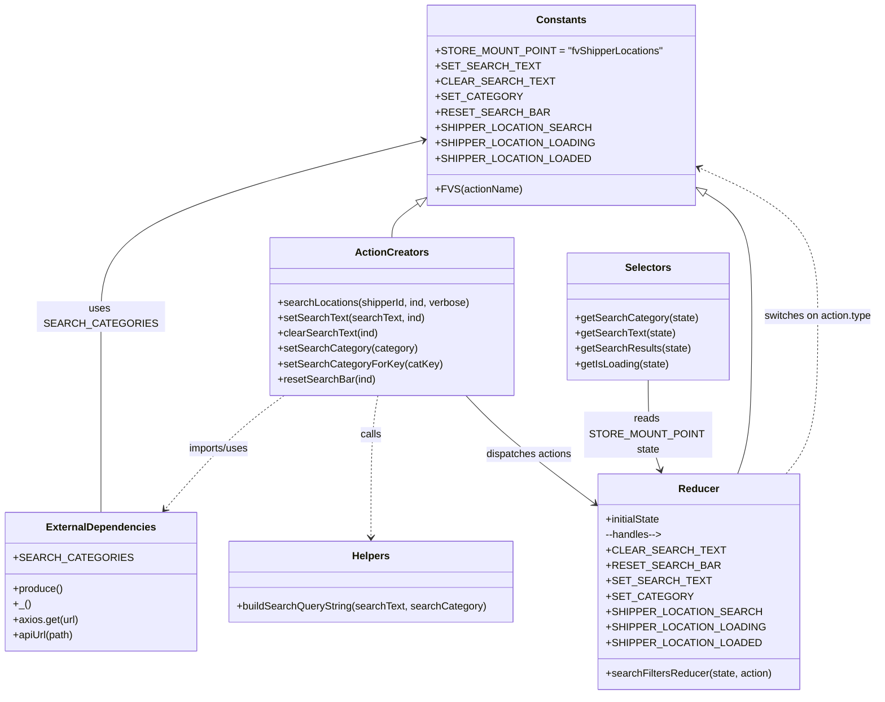

# Diagram: web/portal/src/pages/shipments/redux/ShipmentStopsSearchBarState.js

> Auto-generated by Obscura crawlers

## Mermaid

### SVG

<svg id="container" width="1329.36328125" xmlns="http://www.w3.org/2000/svg" class="classDiagram" height="1058" viewBox="0 0 1329.36328125 1058" role="graphics-document document" aria-roledescription="class"><g><defs><marker id="container_class-aggregationStart" class="marker aggregation class" refX="18" refY="7" markerWidth="190" markerHeight="240" orient="auto"><path d="M 18,7 L9,13 L1,7 L9,1 Z"></path></marker></defs><defs><marker id="container_class-aggregationEnd" class="marker aggregation class" refX="1" refY="7" markerWidth="20" markerHeight="28" orient="auto"><path d="M 18,7 L9,13 L1,7 L9,1 Z"></path></marker></defs><defs><marker id="container_class-extensionStart" class="marker extension class" refX="18" refY="7" markerWidth="190" markerHeight="240" orient="auto"><path d="M 1,7 L18,13 V 1 Z"></path></marker></defs><defs><marker id="container_class-extensionEnd" class="marker extension class" refX="1" refY="7" markerWidth="20" markerHeight="28" orient="auto"><path d="M 1,1 V 13 L18,7 Z"></path></marker></defs><defs><marker id="container_class-compositionStart" class="marker composition class" refX="18" refY="7" markerWidth="190" markerHeight="240" orient="auto"><path d="M 18,7 L9,13 L1,7 L9,1 Z"></path></marker></defs><defs><marker id="container_class-compositionEnd" class="marker composition class" refX="1" refY="7" markerWidth="20" markerHeight="28" orient="auto"><path d="M 18,7 L9,13 L1,7 L9,1 Z"></path></marker></defs><defs><marker id="container_class-dependencyStart" class="marker dependency class" refX="6" refY="7" markerWidth="190" markerHeight="240" orient="auto"><path d="M 5,7 L9,13 L1,7 L9,1 Z"></path></marker></defs><defs><marker id="container_class-dependencyEnd" class="marker dependency class" refX="13" refY="7" markerWidth="20" markerHeight="28" orient="auto"><path d="M 18,7 L9,13 L14,7 L9,1 Z"></path></marker></defs><defs><marker id="container_class-lollipopStart" class="marker lollipop class" refX="13" refY="7" markerWidth="190" markerHeight="240" orient="auto"><circle stroke="black" fill="transparent" cx="7" cy="7" r="6"></circle></marker></defs><defs><marker id="container_class-lollipopEnd" class="marker lollipop class" refX="1" refY="7" markerWidth="190" markerHeight="240" orient="auto"><circle stroke="black" fill="transparent" cx="7" cy="7" r="6"></circle></marker></defs><g class="root"><g class="clusters"></g><g class="edgePaths"><path d="M632.841,216.825L550.644,238.188C468.448,259.55,304.054,302.275,221.857,348.304C139.66,394.333,139.66,443.667,139.66,497C139.66,550.333,139.66,607.667,139.66,654.5C139.66,701.333,139.66,737.667,139.66,755.833L139.66,774" id="id_Constants_ExternalDependencies_1" class="edge-thickness-normal edge-pattern-solid relation" style=";;;" data-edge="true" data-et="edge" data-id="id_Constants_ExternalDependencies_1" data-points="W3sieCI6NjM4LjY0ODQzNzUsInkiOjIxNS4zMTU4ODc3NzcwNzk3OH0seyJ4IjoxMzkuNjYwMTU2MjUsInkiOjM0NX0seyJ4IjoxMzkuNjYwMTU2MjUsInkiOjQ5M30seyJ4IjoxMzkuNjYwMTU2MjUsInkiOjY2NX0seyJ4IjoxMzkuNjYwMTU2MjUsInkiOjc3NH1d" marker-start="url(#container_class-dependencyStart)"></path><path d="M401.169,616L389.629,624.167C378.089,632.333,355.009,648.667,328.036,674.252C301.063,699.836,270.197,734.673,254.764,752.091L239.331,769.509" id="id_ActionCreators_ExternalDependencies_2" class="edge-thickness-normal edge-pattern-dashed relation" style=";;;" data-edge="true" data-et="edge" data-id="id_ActionCreators_ExternalDependencies_2" data-points="W3sieCI6NDAxLjE2ODY3Mjc4MzQzMDIsInkiOjYxNn0seyJ4IjozMzEuOTI5Njg3NSwieSI6NjY1fSx7IngiOjIzNS4zNTE5MDQ1MjE4ODk0LCJ5Ijo3NzR9XQ==" marker-end="url(#container_class-dependencyEnd)"></path><path d="M551.48,616L549.92,624.167C548.36,632.333,545.241,648.667,543.681,681.5C542.121,714.333,542.121,763.667,542.121,788.333L542.121,813" id="id_ActionCreators_Helpers_3" class="edge-thickness-normal edge-pattern-dashed relation" style=";;;" data-edge="true" data-et="edge" data-id="id_ActionCreators_Helpers_3" data-points="W3sieCI6NTUxLjQ3OTk2OTExMzM3MjEsInkiOjYxNn0seyJ4Ijo1NDIuMTIxMDkzNzUsInkiOjY2NX0seyJ4Ijo1NDIuMTIxMDkzNzUsInkiOjgxOX1d" marker-end="url(#container_class-dependencyEnd)"></path><path d="M698.323,616L706.513,624.167C714.703,632.333,731.083,648.667,762.901,673.76C794.719,698.854,841.974,732.708,865.602,749.635L889.23,766.562" id="id_ActionCreators_Reducer_4" class="edge-thickness-normal edge-pattern-solid relation" style=";;;" data-edge="true" data-et="edge" data-id="id_ActionCreators_Reducer_4" data-points="W3sieCI6Njk4LjMyMzIzMDgzMjEyMjEsInkiOjYxNn0seyJ4Ijo3NDcuNDYyODkwNjI1LCJ5Ijo2NjV9LHsieCI6ODk0LjEwNzQyMTg3NSwieSI6NzcwLjA1NjUxMDU4MTIyNTl9XQ==" marker-end="url(#container_class-dependencyEnd)"></path><path d="M972.996,592L972.996,604.167C972.996,616.333,972.996,640.667,975.572,660.058C978.148,679.449,983.3,693.899,985.876,701.124L988.452,708.348" id="id_Selectors_Reducer_5" class="edge-thickness-normal edge-pattern-solid relation" style=";;;" data-edge="true" data-et="edge" data-id="id_Selectors_Reducer_5" data-points="W3sieCI6OTcyLjk5NjA5Mzc1LCJ5Ijo1OTJ9LHsieCI6OTcyLjk5NjA5Mzc1LCJ5Ijo2NjV9LHsieCI6OTkwLjQ2NjU0NDg1ODg3MSwieSI6NzE0fV0=" marker-end="url(#container_class-dependencyEnd)"></path><path d="M1194.436,714L1201.44,705.833C1208.443,697.667,1222.45,681.333,1229.454,644.5C1236.457,607.667,1236.457,550.333,1236.457,497C1236.457,443.667,1236.457,394.333,1203.55,354.79C1170.643,315.246,1104.828,285.492,1071.921,270.614L1039.014,255.737" id="id_Reducer_Constants_6" class="edge-thickness-normal edge-pattern-dashed relation" style=";;;" data-edge="true" data-et="edge" data-id="id_Reducer_Constants_6" data-points="W3sieCI6MTE5NC40MzYzMDI5MjMzODcsInkiOjcxNH0seyJ4IjoxMjM2LjQ1NzAzMTI1LCJ5Ijo2NjV9LHsieCI6MTIzNi40NTcwMzEyNSwieSI6NDkzfSx7IngiOjEyMzYuNDU3MDMxMjUsInkiOjM0NX0seyJ4IjoxMDMzLjU0Njg3NSwieSI6MjUzLjI2NTU3MTk0NzA3ODh9XQ==" marker-end="url(#container_class-dependencyEnd)"></path><path d="M624.471,310.69L616.221,316.408C607.972,322.127,591.472,333.563,583.222,343.448C574.973,353.333,574.973,361.667,574.973,365.833L574.973,370" id="id_Constants_ActionCreators_7" class="edge-thickness-normal edge-pattern-solid relation" style=";;;" data-edge="true" data-et="edge" data-id="id_Constants_ActionCreators_7" data-points="W3sieCI6NjM4LjY0ODQzNzUsInkiOjMwMC44NjI4MzgwODA0MjEzfSx7IngiOjU3NC45NzI2NTYyNSwieSI6MzQ1fSx7IngiOjU3NC45NzI2NTYyNSwieSI6MzcwfV0=" marker-start="url(#container_class-extensionStart)"></path><path d="M1048.256,293.972L1062.139,302.477C1076.021,310.981,1103.786,327.991,1117.668,361.162C1131.551,394.333,1131.551,443.667,1131.551,497C1131.551,550.333,1131.551,607.667,1128.495,644.5C1125.44,681.333,1119.329,697.667,1116.274,705.833L1113.219,714" id="id_Constants_Reducer_8" class="edge-thickness-normal edge-pattern-solid relation" style=";;;" data-edge="true" data-et="edge" data-id="id_Constants_Reducer_8" data-points="W3sieCI6MTAzMy41NDY4NzUsInkiOjI4NC45NjEwMTA2Mjk4NTg4fSx7IngiOjExMzEuNTUwNzgxMjUsInkiOjM0NX0seyJ4IjoxMTMxLjU1MDc4MTI1LCJ5Ijo0OTN9LHsieCI6MTEzMS41NTA3ODEyNSwieSI6NjY1fSx7IngiOjExMTMuMjE4NTYwOTg3OTAzMiwieSI6NzE0fV0=" marker-start="url(#container_class-extensionStart)"></path></g><g class="edgeLabels"><g class="edgeLabel" transform="translate(139.66015625, 493)"><g class="label" data-id="id_Constants_ExternalDependencies_1" transform="translate(-93.6953125, -12)"><foreignObject width="187.390625" height="24">

uses SEARCH_CATEGORIES

</foreignObject></g></g><g class="edgeLabel" transform="translate(311.767, 687.75609)"><g class="label" data-id="id_ActionCreators_ExternalDependencies_2" transform="translate(-48.65625, -12)"><foreignObject width="97.3125" height="24">

imports/uses

</foreignObject></g></g><g class="edgeLabel" transform="translate(542.12109375, 665)"><g class="label" data-id="id_ActionCreators_Helpers_3" transform="translate(-16.4453125, -12)"><foreignObject width="32.890625" height="24">

calls

</foreignObject></g></g><g class="edgeLabel" transform="translate(792.57879, 697.32114)"><g class="label" data-id="id_ActionCreators_Reducer_4" transform="translate(-67.71875, -12)"><foreignObject width="135.4375" height="24">

dispatches actions

</foreignObject></g></g><g class="edgeLabel" transform="translate(972.99609375, 665)"><g class="label" data-id="id_Selectors_Reducer_5" transform="translate(-100, -24)"><foreignObject width="200" height="48">

reads STORE_MOUNT_POINT state

</foreignObject></g></g><g class="edgeLabel" transform="translate(1236.45703125, 493)"><g class="label" data-id="id_Reducer_Constants_6" transform="translate(-84.90625, -12)"><foreignObject width="169.8125" height="24">

switches on action.type

</foreignObject></g></g><g class="edgeLabel"><g class="label" data-id="id_Constants_ActionCreators_7" transform="translate(0, 0)"><foreignObject width="0" height="0">

</foreignObject></g></g><g class="edgeLabel"><g class="label" data-id="id_Constants_Reducer_8" transform="translate(0, 0)"><foreignObject width="0" height="0">

</foreignObject></g></g></g><g class="nodes"><g class="node default" id="classId-ExternalDependencies-0" transform="translate(139.66015625, 882)"><g class="basic label-container"><path d="M-131.66015625 -108 L131.66015625 -108 L131.66015625 108 L-131.66015625 108" stroke="none" stroke-width="0" fill="#ECECFF" style=""></path><path d="M-131.66015625 -108 C-51.72204371936071 -108, 28.216068811278575 -108, 131.66015625 -108 M-131.66015625 -108 C-44.000877522647 -108, 43.658401204705996 -108, 131.66015625 -108 M131.66015625 -108 C131.66015625 -60.62862624235181, 131.66015625 -13.257252484703614, 131.66015625 108 M131.66015625 -108 C131.66015625 -54.31734694265207, 131.66015625 -0.6346938853041451, 131.66015625 108 M131.66015625 108 C67.82318941715903 108, 3.9862225843180568 108, -131.66015625 108 M131.66015625 108 C43.335904874854776 108, -44.98834650029045 108, -131.66015625 108 M-131.66015625 108 C-131.66015625 34.155257801352164, -131.66015625 -39.68948439729567, -131.66015625 -108 M-131.66015625 108 C-131.66015625 35.98973243971645, -131.66015625 -36.020535120567104, -131.66015625 -108" stroke="#9370DB" stroke-width="1.3" fill="none" stroke-dasharray="0 0" style=""></path></g><g class="annotation-group text" transform="translate(0, -84)"></g><g class="label-group text" transform="translate(-81.8046875, -84)"><g class="label" style="font-weight: bolder" transform="translate(0,-12)"><foreignObject width="163.609375" height="24">

ExternalDependencies

</foreignObject></g></g><g class="members-group text" transform="translate(-119.66015625, -36)"><g class="label" style="" transform="translate(0,-12)"><foreignObject width="157.515625" height="24">

+SEARCH_CATEGORIES

</foreignObject></g></g><g class="methods-group text" transform="translate(-119.66015625, 12)"><g class="label" style="" transform="translate(0,-12)"><foreignObject width="77.828125" height="24">

+produce()

</foreignObject></g><g class="label" style="" transform="translate(0,12)"><foreignObject width="25.40625" height="24">

+_()

</foreignObject></g><g class="label" style="" transform="translate(0,36)"><foreignObject width="102.328125" height="24">

+axios.get(url)

</foreignObject></g><g class="label" style="" transform="translate(0,60)"><foreignObject width="95.5" height="24">

+apiUrl(path)

</foreignObject></g></g><g class="divider" style=""><path d="M-131.66015625 -60 C-31.785741474830942 -60, 68.08867330033812 -60, 131.66015625 -60 M-131.66015625 -60 C-60.62404020754134 -60, 10.412075834917317 -60, 131.66015625 -60" stroke="#9370DB" stroke-width="1.3" fill="none" stroke-dasharray="0 0" style=""></path></g><g class="divider" style=""><path d="M-131.66015625 -12 C-76.50395143698715 -12, -21.347746623974302 -12, 131.66015625 -12 M-131.66015625 -12 C-48.688807219595574 -12, 34.28254181080885 -12, 131.66015625 -12" stroke="#9370DB" stroke-width="1.3" fill="none" stroke-dasharray="0 0" style=""></path></g></g><g class="node default" id="classId-Constants-1" transform="translate(836.09765625, 164)"><g class="basic label-container"><path d="M-197.44921875 -156 L197.44921875 -156 L197.44921875 156 L-197.44921875 156" stroke="none" stroke-width="0" fill="#ECECFF" style=""></path><path d="M-197.44921875 -156 C-64.58368201006346 -156, 68.28185472987309 -156, 197.44921875 -156 M-197.44921875 -156 C-57.15852920346222 -156, 83.13216034307555 -156, 197.44921875 -156 M197.44921875 -156 C197.44921875 -31.996713679715768, 197.44921875 92.00657264056846, 197.44921875 156 M197.44921875 -156 C197.44921875 -45.064105318466346, 197.44921875 65.87178936306731, 197.44921875 156 M197.44921875 156 C50.929782343387814 156, -95.58965406322437 156, -197.44921875 156 M197.44921875 156 C50.92963501321967 156, -95.58994872356067 156, -197.44921875 156 M-197.44921875 156 C-197.44921875 43.43291845350092, -197.44921875 -69.13416309299816, -197.44921875 -156 M-197.44921875 156 C-197.44921875 47.3172808507406, -197.44921875 -61.3654382985188, -197.44921875 -156" stroke="#9370DB" stroke-width="1.3" fill="none" stroke-dasharray="0 0" style=""></path></g><g class="annotation-group text" transform="translate(0, -132)"></g><g class="label-group text" transform="translate(-36.5390625, -132)"><g class="label" style="font-weight: bolder" transform="translate(0,-12)"><foreignObject width="73.078125" height="24">

Constants

</foreignObject></g></g><g class="members-group text" transform="translate(-185.44921875, -84)"><g class="label" style="" transform="translate(0,-12)"><foreignObject width="334.359375" height="24">

+STORE_MOUNT_POINT = "fvShipperLocations"

</foreignObject></g><g class="label" style="" transform="translate(0,12)"><foreignObject width="137.1875" height="24">

+SET_SEARCH_TEXT

</foreignObject></g><g class="label" style="" transform="translate(0,36)"><foreignObject width="157.421875" height="24">

+CLEAR_SEARCH_TEXT

</foreignObject></g><g class="label" style="" transform="translate(0,60)"><foreignObject width="112.984375" height="24">

+SET_CATEGORY

</foreignObject></g><g class="label" style="" transform="translate(0,84)"><foreignObject width="151.46875" height="24">

+RESET_SEARCH_BAR

</foreignObject></g><g class="label" style="" transform="translate(0,108)"><foreignObject width="211.28125" height="24">

+SHIPPER_LOCATION_SEARCH

</foreignObject></g><g class="label" style="" transform="translate(0,132)"><foreignObject width="219.15625" height="24">

+SHIPPER_LOCATION_LOADING

</foreignObject></g><g class="label" style="" transform="translate(0,156)"><foreignObject width="212.28125" height="24">

+SHIPPER_LOCATION_LOADED

</foreignObject></g></g><g class="methods-group text" transform="translate(-185.44921875, 132)"><g class="label" style="" transform="translate(0,-12)"><foreignObject width="131.015625" height="24">

+FVS(actionName)

</foreignObject></g></g><g class="divider" style=""><path d="M-197.44921875 -108 C-42.33385411953935 -108, 112.7815105109213 -108, 197.44921875 -108 M-197.44921875 -108 C-46.12874462792308 -108, 105.19172949415383 -108, 197.44921875 -108" stroke="#9370DB" stroke-width="1.3" fill="none" stroke-dasharray="0 0" style=""></path></g><g class="divider" style=""><path d="M-197.44921875 108 C-114.95360764589479 108, -32.45799654178958 108, 197.44921875 108 M-197.44921875 108 C-109.10151977534572 108, -20.753820800691443 108, 197.44921875 108" stroke="#9370DB" stroke-width="1.3" fill="none" stroke-dasharray="0 0" style=""></path></g></g><g class="node default" id="classId-Helpers-2" transform="translate(542.12109375, 882)"><g class="basic label-container"><path d="M-219.32421875 -63 L219.32421875 -63 L219.32421875 63 L-219.32421875 63" stroke="none" stroke-width="0" fill="#ECECFF" style=""></path><path d="M-219.32421875 -63 C-57.26569306168025 -63, 104.7928326266395 -63, 219.32421875 -63 M-219.32421875 -63 C-87.40850143226115 -63, 44.507215885477706 -63, 219.32421875 -63 M219.32421875 -63 C219.32421875 -26.241777141808647, 219.32421875 10.516445716382705, 219.32421875 63 M219.32421875 -63 C219.32421875 -14.89578610143267, 219.32421875 33.20842779713466, 219.32421875 63 M219.32421875 63 C74.4044430567975 63, -70.51533263640499 63, -219.32421875 63 M219.32421875 63 C65.11835148638227 63, -89.08751577723547 63, -219.32421875 63 M-219.32421875 63 C-219.32421875 35.062290456142094, -219.32421875 7.124580912284195, -219.32421875 -63 M-219.32421875 63 C-219.32421875 17.225718598009372, -219.32421875 -28.548562803981255, -219.32421875 -63" stroke="#9370DB" stroke-width="1.3" fill="none" stroke-dasharray="0 0" style=""></path></g><g class="annotation-group text" transform="translate(0, -39)"></g><g class="label-group text" transform="translate(-28.2890625, -39)"><g class="label" style="font-weight: bolder" transform="translate(0,-12)"><foreignObject width="56.578125" height="24">

Helpers

</foreignObject></g></g><g class="members-group text" transform="translate(-207.32421875, 9)"></g><g class="methods-group text" transform="translate(-207.32421875, 39)"><g class="label" style="" transform="translate(0,-12)"><foreignObject width="386.359375" height="24">

+buildSearchQueryString(searchText, searchCategory)

</foreignObject></g></g><g class="divider" style=""><path d="M-219.32421875 -15 C-128.35238179397373 -15, -37.38054483794747 -15, 219.32421875 -15 M-219.32421875 -15 C-51.86687528330842 -15, 115.59046818338317 -15, 219.32421875 -15" stroke="#9370DB" stroke-width="1.3" fill="none" stroke-dasharray="0 0" style=""></path></g><g class="divider" style=""><path d="M-219.32421875 9 C-43.94591325898935 9, 131.4323922320213 9, 219.32421875 9 M-219.32421875 9 C-64.3403610328696 9, 90.64349668426081 9, 219.32421875 9" stroke="#9370DB" stroke-width="1.3" fill="none" stroke-dasharray="0 0" style=""></path></g></g><g class="node default" id="classId-ActionCreators-3" transform="translate(574.97265625, 493)"><g class="basic label-container"><path d="M-190.140625 -123 L190.140625 -123 L190.140625 123 L-190.140625 123" stroke="none" stroke-width="0" fill="#ECECFF" style=""></path><path d="M-190.140625 -123 C-79.6866383871206 -123, 30.76734822575881 -123, 190.140625 -123 M-190.140625 -123 C-72.40258172187298 -123, 45.335461556254046 -123, 190.140625 -123 M190.140625 -123 C190.140625 -34.76617613868076, 190.140625 53.467647722638475, 190.140625 123 M190.140625 -123 C190.140625 -69.0944063077747, 190.140625 -15.188812615549423, 190.140625 123 M190.140625 123 C43.23794250860246 123, -103.66473998279508 123, -190.140625 123 M190.140625 123 C97.59796909215875 123, 5.055313184317498 123, -190.140625 123 M-190.140625 123 C-190.140625 57.11167304303302, -190.140625 -8.776653913933956, -190.140625 -123 M-190.140625 123 C-190.140625 33.422143148755666, -190.140625 -56.15571370248867, -190.140625 -123" stroke="#9370DB" stroke-width="1.3" fill="none" stroke-dasharray="0 0" style=""></path></g><g class="annotation-group text" transform="translate(0, -99)"></g><g class="label-group text" transform="translate(-53.96875, -99)"><g class="label" style="font-weight: bolder" transform="translate(0,-12)"><foreignObject width="107.9375" height="24">

ActionCreators

</foreignObject></g></g><g class="members-group text" transform="translate(-178.140625, -51)"></g><g class="methods-group text" transform="translate(-178.140625, -21)"><g class="label" style="" transform="translate(0,-12)"><foreignObject width="302.3125" height="24">

+searchLocations(shipperId, ind, verbose)

</foreignObject></g><g class="label" style="" transform="translate(0,12)"><foreignObject width="227.09375" height="24">

+setSearchText(searchText, ind)

</foreignObject></g><g class="label" style="" transform="translate(0,36)"><foreignObject width="155.71875" height="24">

+clearSearchText(ind)

</foreignObject></g><g class="label" style="" transform="translate(0,60)"><foreignObject width="214.15625" height="24">

+setSearchCategory(category)

</foreignObject></g><g class="label" style="" transform="translate(0,84)"><foreignObject width="248.484375" height="24">

+setSearchCategoryForKey(catKey)

</foreignObject></g><g class="label" style="" transform="translate(0,108)"><foreignObject width="151.515625" height="24">

+resetSearchBar(ind)

</foreignObject></g></g><g class="divider" style=""><path d="M-190.140625 -75 C-47.77330370758773 -75, 94.59401758482454 -75, 190.140625 -75 M-190.140625 -75 C-111.55394825618542 -75, -32.96727151237084 -75, 190.140625 -75" stroke="#9370DB" stroke-width="1.3" fill="none" stroke-dasharray="0 0" style=""></path></g><g class="divider" style=""><path d="M-190.140625 -51 C-48.788945149052665 -51, 92.56273470189467 -51, 190.140625 -51 M-190.140625 -51 C-94.17507222810796 -51, 1.7904805437840707 -51, 190.140625 -51" stroke="#9370DB" stroke-width="1.3" fill="none" stroke-dasharray="0 0" style=""></path></g></g><g class="node default" id="classId-Selectors-4" transform="translate(972.99609375, 493)"><g class="basic label-container"><path d="M-123.5546875 -99 L123.5546875 -99 L123.5546875 99 L-123.5546875 99" stroke="none" stroke-width="0" fill="#ECECFF" style=""></path><path d="M-123.5546875 -99 C-54.16698035520639 -99, 15.220726789587218 -99, 123.5546875 -99 M-123.5546875 -99 C-58.084037791843656 -99, 7.386611916312688 -99, 123.5546875 -99 M123.5546875 -99 C123.5546875 -42.02829693651919, 123.5546875 14.94340612696162, 123.5546875 99 M123.5546875 -99 C123.5546875 -48.230439744411065, 123.5546875 2.5391205111778703, 123.5546875 99 M123.5546875 99 C58.801438552563184 99, -5.9518103948736325 99, -123.5546875 99 M123.5546875 99 C72.36956079808762 99, 21.184434096175238 99, -123.5546875 99 M-123.5546875 99 C-123.5546875 57.59927943405651, -123.5546875 16.198558868113025, -123.5546875 -99 M-123.5546875 99 C-123.5546875 56.55345808538291, -123.5546875 14.106916170765814, -123.5546875 -99" stroke="#9370DB" stroke-width="1.3" fill="none" stroke-dasharray="0 0" style=""></path></g><g class="annotation-group text" transform="translate(0, -75)"></g><g class="label-group text" transform="translate(-34.171875, -75)"><g class="label" style="font-weight: bolder" transform="translate(0,-12)"><foreignObject width="68.34375" height="24">

Selectors

</foreignObject></g></g><g class="members-group text" transform="translate(-111.5546875, -27)"></g><g class="methods-group text" transform="translate(-111.5546875, 3)"><g class="label" style="" transform="translate(0,-12)"><foreignObject width="188.9375" height="24">

+getSearchCategory(state)

</foreignObject></g><g class="label" style="" transform="translate(0,12)"><foreignObject width="155.21875" height="24">

+getSearchText(state)

</foreignObject></g><g class="label" style="" transform="translate(0,36)"><foreignObject width="178.59375" height="24">

+getSearchResults(state)

</foreignObject></g><g class="label" style="" transform="translate(0,60)"><foreignObject width="146.4375" height="24">

+getIsLoading(state)

</foreignObject></g></g><g class="divider" style=""><path d="M-123.5546875 -51 C-38.78536283012505 -51, 45.983961839749895 -51, 123.5546875 -51 M-123.5546875 -51 C-64.66670687958447 -51, -5.778726259168934 -51, 123.5546875 -51" stroke="#9370DB" stroke-width="1.3" fill="none" stroke-dasharray="0 0" style=""></path></g><g class="divider" style=""><path d="M-123.5546875 -27 C-58.825792946969386 -27, 5.903101606061227 -27, 123.5546875 -27 M-123.5546875 -27 C-65.82722419462883 -27, -8.099760889257666 -27, 123.5546875 -27" stroke="#9370DB" stroke-width="1.3" fill="none" stroke-dasharray="0 0" style=""></path></g></g><g class="node default" id="classId-Reducer-5" transform="translate(1050.365234375, 882)"><g class="basic label-container"><path d="M-156.2578125 -168 L156.2578125 -168 L156.2578125 168 L-156.2578125 168" stroke="none" stroke-width="0" fill="#ECECFF" style=""></path><path d="M-156.2578125 -168 C-45.835491921136295 -168, 64.58682865772741 -168, 156.2578125 -168 M-156.2578125 -168 C-89.50522056064263 -168, -22.752628621285254 -168, 156.2578125 -168 M156.2578125 -168 C156.2578125 -76.93063947498841, 156.2578125 14.138721050023179, 156.2578125 168 M156.2578125 -168 C156.2578125 -38.238054076421975, 156.2578125 91.52389184715605, 156.2578125 168 M156.2578125 168 C32.05803802783443 168, -92.14173644433114 168, -156.2578125 168 M156.2578125 168 C64.1941578648959 168, -27.8694967702082 168, -156.2578125 168 M-156.2578125 168 C-156.2578125 83.54615860931204, -156.2578125 -0.907682781375911, -156.2578125 -168 M-156.2578125 168 C-156.2578125 62.25354552390738, -156.2578125 -43.492908952185246, -156.2578125 -168" stroke="#9370DB" stroke-width="1.3" fill="none" stroke-dasharray="0 0" style=""></path></g><g class="annotation-group text" transform="translate(0, -144)"></g><g class="label-group text" transform="translate(-29.90625, -144)"><g class="label" style="font-weight: bolder" transform="translate(0,-12)"><foreignObject width="59.8125" height="24">

Reducer

</foreignObject></g></g><g class="members-group text" transform="translate(-144.2578125, -96)"><g class="label" style="" transform="translate(0,-12)"><foreignObject width="87.25" height="24">

+initialState

</foreignObject></g><g class="label" style="" transform="translate(0,12)"><foreignObject width="91.46875" height="24">

--handles--&gt;

</foreignObject></g><g class="label" style="" transform="translate(0,36)"><foreignObject width="157.421875" height="24">

+CLEAR_SEARCH_TEXT

</foreignObject></g><g class="label" style="" transform="translate(0,60)"><foreignObject width="151.46875" height="24">

+RESET_SEARCH_BAR

</foreignObject></g><g class="label" style="" transform="translate(0,84)"><foreignObject width="137.1875" height="24">

+SET_SEARCH_TEXT

</foreignObject></g><g class="label" style="" transform="translate(0,108)"><foreignObject width="112.984375" height="24">

+SET_CATEGORY

</foreignObject></g><g class="label" style="" transform="translate(0,132)"><foreignObject width="211.28125" height="24">

+SHIPPER_LOCATION_SEARCH

</foreignObject></g><g class="label" style="" transform="translate(0,156)"><foreignObject width="219.15625" height="24">

+SHIPPER_LOCATION_LOADING

</foreignObject></g><g class="label" style="" transform="translate(0,180)"><foreignObject width="212.28125" height="24">

+SHIPPER_LOCATION_LOADED

</foreignObject></g></g><g class="methods-group text" transform="translate(-144.2578125, 144)"><g class="label" style="" transform="translate(0,-12)"><foreignObject width="258.609375" height="24">

+searchFiltersReducer(state, action)

</foreignObject></g></g><g class="divider" style=""><path d="M-156.2578125 -120 C-93.67511876965474 -120, -31.092425039309475 -120, 156.2578125 -120 M-156.2578125 -120 C-61.15281752094185 -120, 33.952177458116296 -120, 156.2578125 -120" stroke="#9370DB" stroke-width="1.3" fill="none" stroke-dasharray="0 0" style=""></path></g><g class="divider" style=""><path d="M-156.2578125 120 C-61.97949178711018 120, 32.298828925779645 120, 156.2578125 120 M-156.2578125 120 C-48.49227756584973 120, 59.273257368300534 120, 156.2578125 120" stroke="#9370DB" stroke-width="1.3" fill="none" stroke-dasharray="0 0" style=""></path></g></g></g></g></g></svg>
