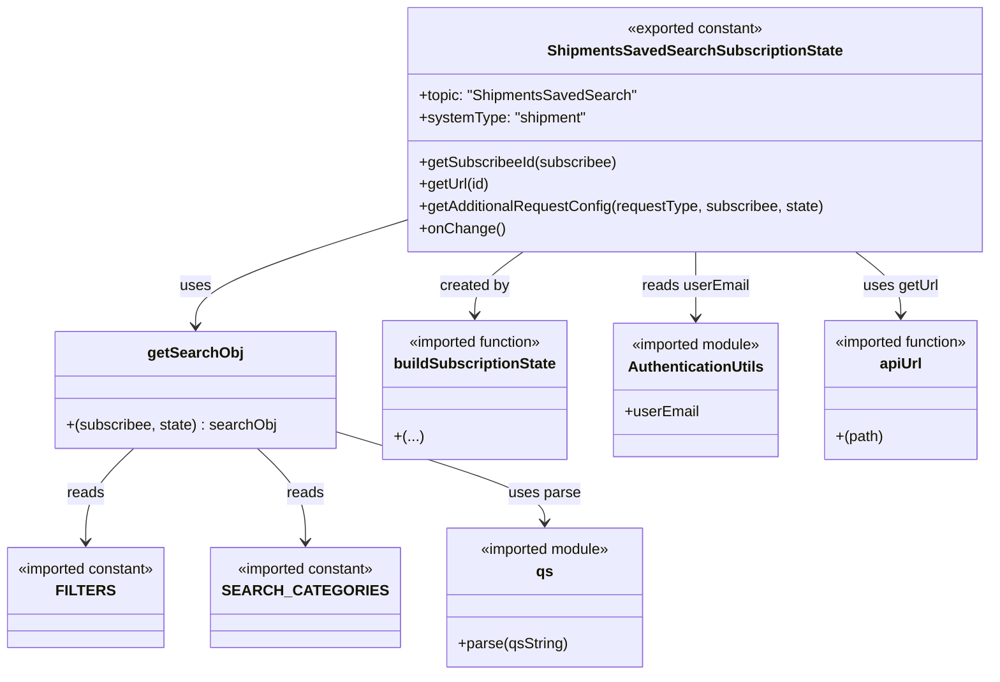

# Diagram: web/portal/src/pages/shipments/redux/ShipmentsSavedSearchSubscriptionState.js


> Auto-generated by Obscura crawlers

## Diagram 1



### SVG

<svg id="container" width="1060.57421875" xmlns="http://www.w3.org/2000/svg" class="classDiagram" height="728" viewBox="0 0 1060.57421875 728" role="graphics-document document" aria-roledescription="class"><style>#container{font-family:"trebuchet ms",verdana,arial,sans-serif;font-size:16px;fill:#333;}@keyframes edge-animation-frame{from{stroke-dashoffset:0;}}@keyframes dash{to{stroke-dashoffset:0;}}#container .edge-animation-slow{stroke-dasharray:9,5!important;stroke-dashoffset:900;animation:dash 50s linear infinite;stroke-linecap:round;}#container .edge-animation-fast{stroke-dasharray:9,5!important;stroke-dashoffset:900;animation:dash 20s linear infinite;stroke-linecap:round;}#container .error-icon{fill:#552222;}#container .error-text{fill:#552222;stroke:#552222;}#container .edge-thickness-normal{stroke-width:1px;}#container .edge-thickness-thick{stroke-width:3.5px;}#container .edge-pattern-solid{stroke-dasharray:0;}#container .edge-thickness-invisible{stroke-width:0;fill:none;}#container .edge-pattern-dashed{stroke-dasharray:3;}#container .edge-pattern-dotted{stroke-dasharray:2;}#container .marker{fill:#333333;stroke:#333333;}#container .marker.cross{stroke:#333333;}#container svg{font-family:"trebuchet ms",verdana,arial,sans-serif;font-size:16px;}#container p{margin:0;}#container g.classGroup text{fill:#9370DB;stroke:none;font-family:"trebuchet ms",verdana,arial,sans-serif;font-size:10px;}#container g.classGroup text .title{font-weight:bolder;}#container .nodeLabel,#container .edgeLabel{color:#131300;}#container .edgeLabel .label rect{fill:#ECECFF;}#container .label text{fill:#131300;}#container .labelBkg{background:#ECECFF;}#container .edgeLabel .label span{background:#ECECFF;}#container .classTitle{font-weight:bolder;}#container .node rect,#container .node circle,#container .node ellipse,#container .node polygon,#container .node path{fill:#ECECFF;stroke:#9370DB;stroke-width:1px;}#container .divider{stroke:#9370DB;stroke-width:1;}#container g.clickable{cursor:pointer;}#container g.classGroup rect{fill:#ECECFF;stroke:#9370DB;}#container g.classGroup line{stroke:#9370DB;stroke-width:1;}#container .classLabel .box{stroke:none;stroke-width:0;fill:#ECECFF;opacity:0.5;}#container .classLabel .label{fill:#9370DB;font-size:10px;}#container .relation{stroke:#333333;stroke-width:1;fill:none;}#container .dashed-line{stroke-dasharray:3;}#container .dotted-line{stroke-dasharray:1 2;}#container #compositionStart,#container .composition{fill:#333333!important;stroke:#333333!important;stroke-width:1;}#container #compositionEnd,#container .composition{fill:#333333!important;stroke:#333333!important;stroke-width:1;}#container #dependencyStart,#container .dependency{fill:#333333!important;stroke:#333333!important;stroke-width:1;}#container #dependencyStart,#container .dependency{fill:#333333!important;stroke:#333333!important;stroke-width:1;}#container #extensionStart,#container .extension{fill:transparent!important;stroke:#333333!important;stroke-width:1;}#container #extensionEnd,#container .extension{fill:transparent!important;stroke:#333333!important;stroke-width:1;}#container #aggregationStart,#container .aggregation{fill:transparent!important;stroke:#333333!important;stroke-width:1;}#container #aggregationEnd,#container .aggregation{fill:transparent!important;stroke:#333333!important;stroke-width:1;}#container #lollipopStart,#container .lollipop{fill:#ECECFF!important;stroke:#333333!important;stroke-width:1;}#container #lollipopEnd,#container .lollipop{fill:#ECECFF!important;stroke:#333333!important;stroke-width:1;}#container .edgeTerminals{font-size:11px;line-height:initial;}#container .classTitleText{text-anchor:middle;font-size:18px;fill:#333;}#container .label-icon{display:inline-block;height:1em;overflow:visible;vertical-align:-0.125em;}#container .node .label-icon path{fill:currentColor;stroke:revert;stroke-width:revert;}#container :root{--mermaid-font-family:"trebuchet ms",verdana,arial,sans-serif;}</style><g><defs><marker id="container_class-aggregationStart" class="marker aggregation class" refX="18" refY="7" markerWidth="190" markerHeight="240" orient="auto"><path d="M 18,7 L9,13 L1,7 L9,1 Z"></path></marker></defs><defs><marker id="container_class-aggregationEnd" class="marker aggregation class" refX="1" refY="7" markerWidth="20" markerHeight="28" orient="auto"><path d="M 18,7 L9,13 L1,7 L9,1 Z"></path></marker></defs><defs><marker id="container_class-extensionStart" class="marker extension class" refX="18" refY="7" markerWidth="190" markerHeight="240" orient="auto"><path d="M 1,7 L18,13 V 1 Z"></path></marker></defs><defs><marker id="container_class-extensionEnd" class="marker extension class" refX="1" refY="7" markerWidth="20" markerHeight="28" orient="auto"><path d="M 1,1 V 13 L18,7 Z"></path></marker></defs><defs><marker id="container_class-compositionStart" class="marker composition class" refX="18" refY="7" markerWidth="190" markerHeight="240" orient="auto"><path d="M 18,7 L9,13 L1,7 L9,1 Z"></path></marker></defs><defs><marker id="container_class-compositionEnd" class="marker composition class" refX="1" refY="7" markerWidth="20" markerHeight="28" orient="auto"><path d="M 18,7 L9,13 L1,7 L9,1 Z"></path></marker></defs><defs><marker id="container_class-dependencyStart" class="marker dependency class" refX="6" refY="7" markerWidth="190" markerHeight="240" orient="auto"><path d="M 5,7 L9,13 L1,7 L9,1 Z"></path></marker></defs><defs><marker id="container_class-dependencyEnd" class="marker dependency class" refX="13" refY="7" markerWidth="20" markerHeight="28" orient="auto"><path d="M 18,7 L9,13 L14,7 L9,1 Z"></path></marker></defs><defs><marker id="container_class-lollipopStart" class="marker lollipop class" refX="13" refY="7" markerWidth="190" markerHeight="240" orient="auto"><circle stroke="black" fill="transparent" cx="7" cy="7" r="6"></circle></marker></defs><defs><marker id="container_class-lollipopEnd" class="marker lollipop class" refX="1" refY="7" markerWidth="190" markerHeight="240" orient="auto"><circle stroke="black" fill="transparent" cx="7" cy="7" r="6"></circle></marker></defs><g class="root"><g class="clusters"></g><g class="edgePaths"><path d="M556.272,272L547.859,278.167C539.446,284.333,522.619,296.667,514.206,308C505.793,319.333,505.793,329.667,505.793,334.833L505.793,340" id="id_ShipmentsSavedSearchSubscriptionState_buildSubscriptionState_1" class="edge-thickness-normal edge-pattern-solid relation" style=";;;" data-edge="true" data-et="edge" data-id="id_ShipmentsSavedSearchSubscriptionState_buildSubscriptionState_1" data-points="W3sieCI6NTU2LjI3MjQzMjA0NTExODMsInkiOjI3Mn0seyJ4Ijo1MDUuNzkyOTY4NzUsInkiOjMwOX0seyJ4Ijo1MDUuNzkyOTY4NzUsInkiOjM0Nn1d" marker-end="url(#container_class-dependencyEnd)"></path><path d="M915.282,272L923.64,278.167C931.999,284.333,948.716,296.667,957.075,308C965.434,319.333,965.434,329.667,965.434,334.833L965.434,340" id="id_ShipmentsSavedSearchSubscriptionState_apiUrl_2" class="edge-thickness-normal edge-pattern-solid relation" style=";;;" data-edge="true" data-et="edge" data-id="id_ShipmentsSavedSearchSubscriptionState_apiUrl_2" data-points="W3sieCI6OTE1LjI4MTY3NzYwNzI0ODUsInkiOjI3Mn0seyJ4Ijo5NjUuNDMzNTkzNzUsInkiOjMwOX0seyJ4Ijo5NjUuNDMzNTkzNzUsInkiOjM0Nn1d" marker-end="url(#container_class-dependencyEnd)"></path><path d="M428.654,238.723L392.147,250.436C355.639,262.149,282.624,285.574,246.117,304.454C209.609,323.333,209.609,337.667,209.609,344.833L209.609,352" id="id_ShipmentsSavedSearchSubscriptionState_getSearchObj_3" class="edge-thickness-normal edge-pattern-solid relation" style=";;;" data-edge="true" data-et="edge" data-id="id_ShipmentsSavedSearchSubscriptionState_getSearchObj_3" data-points="W3sieCI6NDI4LjY1NDI5Njg3NSwieSI6MjM4LjcyMjkxNDk3NDk1MzM3fSx7IngiOjIwOS42MDkzNzUsInkiOjMwOX0seyJ4IjoyMDkuNjA5Mzc1LCJ5IjozNTh9XQ==" marker-end="url(#container_class-dependencyEnd)"></path><path d="M739.454,272L739.598,278.167C739.742,284.333,740.031,296.667,740.176,308.5C740.32,320.333,740.32,331.667,740.32,337.333L740.32,343" id="id_ShipmentsSavedSearchSubscriptionState_AuthenticationUtils_4" class="edge-thickness-normal edge-pattern-solid relation" style=";;;" data-edge="true" data-et="edge" data-id="id_ShipmentsSavedSearchSubscriptionState_AuthenticationUtils_4" data-points="W3sieCI6NzM5LjQ1MzU1MjYwNzI0ODUsInkiOjI3Mn0seyJ4Ijo3NDAuMzIwMzEyNSwieSI6MzA5fSx7IngiOjc0MC4zMjAzMTI1LCJ5IjozNDl9XQ==" marker-end="url(#container_class-dependencyEnd)"></path><path d="M145.875,484L137.614,492.167C129.352,500.333,112.828,516.667,104.566,533.5C96.305,550.333,96.305,567.667,96.305,576.333L96.305,585" id="id_getSearchObj_FILTERS_5" class="edge-thickness-normal edge-pattern-solid relation" style=";;;" data-edge="true" data-et="edge" data-id="id_getSearchObj_FILTERS_5" data-points="W3sieCI6MTQ1Ljg3NTQ4ODI4MTI1LCJ5Ijo0ODR9LHsieCI6OTYuMzA0Njg3NSwieSI6NTMzfSx7IngiOjk2LjMwNDY4NzUsInkiOjU5MX1d" marker-end="url(#container_class-dependencyEnd)"></path><path d="M273.343,484L281.605,492.167C289.867,500.333,306.39,516.667,314.652,533.5C322.914,550.333,322.914,567.667,322.914,576.333L322.914,585" id="id_getSearchObj_SEARCH_CATEGORIES_6" class="edge-thickness-normal edge-pattern-solid relation" style=";;;" data-edge="true" data-et="edge" data-id="id_getSearchObj_SEARCH_CATEGORIES_6" data-points="W3sieCI6MjczLjM0MzI2MTcxODc1LCJ5Ijo0ODR9LHsieCI6MzIyLjkxNDA2MjUsInkiOjUzM30seyJ4IjozMjIuOTE0MDYyNSwieSI6NTkxfV0=" marker-end="url(#container_class-dependencyEnd)"></path><path d="M359.238,467.685L394.128,478.571C429.017,489.457,498.796,511.228,533.685,527.281C568.574,543.333,568.574,553.667,568.574,558.833L568.574,564" id="id_getSearchObj_qs_7" class="edge-thickness-normal edge-pattern-solid relation" style=";;;" data-edge="true" data-et="edge" data-id="id_getSearchObj_qs_7" data-points="W3sieCI6MzU5LjIzODI4MTI1LCJ5Ijo0NjcuNjg1NDU2MjI3MjE1ODd9LHsieCI6NTY4LjU3NDIxODc1LCJ5Ijo1MzN9LHsieCI6NTY4LjU3NDIxODc1LCJ5Ijo1NzB9XQ==" marker-end="url(#container_class-dependencyEnd)"></path></g><g class="edgeLabels"><g class="edgeLabel" transform="translate(505.79296875, 309)"><g class="label" data-id="id_ShipmentsSavedSearchSubscriptionState_buildSubscriptionState_1" transform="translate(-37.9921875, -12)"><foreignObject width="75.984375" height="24"><div xmlns="http://www.w3.org/1999/xhtml" class="labelBkg" style="display: table-cell; white-space: nowrap; line-height: 1.5; max-width: 200px; text-align: center;"><span class="edgeLabel"><p>created by</p></span></div></foreignObject></g></g><g class="edgeLabel" transform="translate(965.43359375, 309)"><g class="label" data-id="id_ShipmentsSavedSearchSubscriptionState_apiUrl_2" transform="translate(-40.6171875, -12)"><foreignObject width="81.234375" height="24"><div xmlns="http://www.w3.org/1999/xhtml" class="labelBkg" style="display: table-cell; white-space: nowrap; line-height: 1.5; max-width: 200px; text-align: center;"><span class="edgeLabel"><p>uses getUrl</p></span></div></foreignObject></g></g><g class="edgeLabel" transform="translate(209.609375, 309)"><g class="label" data-id="id_ShipmentsSavedSearchSubscriptionState_getSearchObj_3" transform="translate(-16.4921875, -12)"><foreignObject width="32.984375" height="24"><div xmlns="http://www.w3.org/1999/xhtml" class="labelBkg" style="display: table-cell; white-space: nowrap; line-height: 1.5; max-width: 200px; text-align: center;"><span class="edgeLabel"><p>uses</p></span></div></foreignObject></g></g><g class="edgeLabel" transform="translate(740.3203125, 309)"><g class="label" data-id="id_ShipmentsSavedSearchSubscriptionState_AuthenticationUtils_4" transform="translate(-57.96875, -12)"><foreignObject width="115.9375" height="24"><div xmlns="http://www.w3.org/1999/xhtml" class="labelBkg" style="display: table-cell; white-space: nowrap; line-height: 1.5; max-width: 200px; text-align: center;"><span class="edgeLabel"><p>reads userEmail</p></span></div></foreignObject></g></g><g class="edgeLabel" transform="translate(96.3046875, 533)"><g class="label" data-id="id_getSearchObj_FILTERS_5" transform="translate(-20.0078125, -12)"><foreignObject width="40.015625" height="24"><div xmlns="http://www.w3.org/1999/xhtml" class="labelBkg" style="display: table-cell; white-space: nowrap; line-height: 1.5; max-width: 200px; text-align: center;"><span class="edgeLabel"><p>reads</p></span></div></foreignObject></g></g><g class="edgeLabel" transform="translate(322.9140625, 533)"><g class="label" data-id="id_getSearchObj_SEARCH_CATEGORIES_6" transform="translate(-20.0078125, -12)"><foreignObject width="40.015625" height="24"><div xmlns="http://www.w3.org/1999/xhtml" class="labelBkg" style="display: table-cell; white-space: nowrap; line-height: 1.5; max-width: 200px; text-align: center;"><span class="edgeLabel"><p>reads</p></span></div></foreignObject></g></g><g class="edgeLabel" transform="translate(568.57421875, 533)"><g class="label" data-id="id_getSearchObj_qs_7" transform="translate(-38.703125, -12)"><foreignObject width="77.40625" height="24"><div xmlns="http://www.w3.org/1999/xhtml" class="labelBkg" style="display: table-cell; white-space: nowrap; line-height: 1.5; max-width: 200px; text-align: center;"><span class="edgeLabel"><p>uses parse</p></span></div></foreignObject></g></g></g><g class="nodes"><g class="node default" id="classId-ShipmentsSavedSearchSubscriptionState-0" transform="translate(736.361328125, 140)"><g class="basic label-container"><path d="M-307.70703125 -132 L307.70703125 -132 L307.70703125 132 L-307.70703125 132" stroke="none" stroke-width="0" fill="#ECECFF" style=""></path><path d="M-307.70703125 -132 C-90.74185603415017 -132, 126.22331918169965 -132, 307.70703125 -132 M-307.70703125 -132 C-73.21062769211616 -132, 161.28577586576768 -132, 307.70703125 -132 M307.70703125 -132 C307.70703125 -43.586138306803065, 307.70703125 44.82772338639387, 307.70703125 132 M307.70703125 -132 C307.70703125 -72.80073607041797, 307.70703125 -13.601472140835938, 307.70703125 132 M307.70703125 132 C169.25760189988705 132, 30.8081725497741 132, -307.70703125 132 M307.70703125 132 C167.61147792586513 132, 27.515924601730262 132, -307.70703125 132 M-307.70703125 132 C-307.70703125 48.267765752957985, -307.70703125 -35.46446849408403, -307.70703125 -132 M-307.70703125 132 C-307.70703125 53.5153492470136, -307.70703125 -24.969301505972794, -307.70703125 -132" stroke="#9370DB" stroke-width="1.3" fill="none" stroke-dasharray="0 0" style=""></path></g><g class="annotation-group text" transform="translate(-75.203125, -108)"><g class="label" style="" transform="translate(0,-12)"><foreignObject width="150.40625" height="24"><div xmlns="http://www.w3.org/1999/xhtml" style="display: table-cell; white-space: nowrap; line-height: 1.5; max-width: 200px; text-align: center;"><span class="nodeLabel markdown-node-label" style=""><p>«exported constant»</p></span></div></foreignObject></g></g><g class="label-group text" transform="translate(-151.5859375, -84)"><g class="label" style="font-weight: bolder" transform="translate(0,-12)"><foreignObject width="303.171875" height="24"><div xmlns="http://www.w3.org/1999/xhtml" style="display: table-cell; white-space: nowrap; line-height: 1.5; max-width: 348px; text-align: center;"><span class="nodeLabel markdown-node-label" style=""><p>ShipmentsSavedSearchSubscriptionState</p></span></div></foreignObject></g></g><g class="members-group text" transform="translate(-295.70703125, -36)"><g class="label" style="" transform="translate(0,-12)"><foreignObject width="234.359375" height="24"><div xmlns="http://www.w3.org/1999/xhtml" style="display: table-cell; white-space: nowrap; line-height: 1.5; max-width: 292px; text-align: center;"><span class="nodeLabel markdown-node-label" style=""><p>+topic: "ShipmentsSavedSearch"</p></span></div></foreignObject></g><g class="label" style="" transform="translate(0,12)"><foreignObject width="181.015625" height="24"><div xmlns="http://www.w3.org/1999/xhtml" style="display: table-cell; white-space: nowrap; line-height: 1.5; max-width: 238px; text-align: center;"><span class="nodeLabel markdown-node-label" style=""><p>+systemType: "shipment"</p></span></div></foreignObject></g></g><g class="methods-group text" transform="translate(-295.70703125, 36)"><g class="label" style="" transform="translate(0,-12)"><foreignObject width="214.53125" height="24"><div xmlns="http://www.w3.org/1999/xhtml" style="display: table-cell; white-space: nowrap; line-height: 1.5; max-width: 272px; text-align: center;"><span class="nodeLabel markdown-node-label" style=""><p>+getSubscribeeId(subscribee)</p></span></div></foreignObject></g><g class="label" style="" transform="translate(0,12)"><foreignObject width="76.453125" height="24"><div xmlns="http://www.w3.org/1999/xhtml" style="display: table-cell; white-space: nowrap; line-height: 1.5; max-width: 134px; text-align: center;"><span class="nodeLabel markdown-node-label" style=""><p>+getUrl(id)</p></span></div></foreignObject></g><g class="label" style="" transform="translate(0,36)"><foreignObject width="439.828125" height="24"><div xmlns="http://www.w3.org/1999/xhtml" style="display: table-cell; white-space: nowrap; line-height: 1.5; max-width: 497px; text-align: center;"><span class="nodeLabel markdown-node-label" style=""><p>+getAdditionalRequestConfig(requestType, subscribee, state)</p></span></div></foreignObject></g><g class="label" style="" transform="translate(0,60)"><foreignObject width="90.125" height="24"><div xmlns="http://www.w3.org/1999/xhtml" style="display: table-cell; white-space: nowrap; line-height: 1.5; max-width: 147px; text-align: center;"><span class="nodeLabel markdown-node-label" style=""><p>+onChange()</p></span></div></foreignObject></g></g><g class="divider" style=""><path d="M-307.70703125 -60 C-127.52274672151981 -60, 52.66153780696038 -60, 307.70703125 -60 M-307.70703125 -60 C-77.61872769581046 -60, 152.46957585837907 -60, 307.70703125 -60" stroke="#9370DB" stroke-width="1.3" fill="none" stroke-dasharray="0 0" style=""></path></g><g class="divider" style=""><path d="M-307.70703125 12 C-180.22529628532138 12, -52.743561320642755 12, 307.70703125 12 M-307.70703125 12 C-171.31312011366526 12, -34.91920897733053 12, 307.70703125 12" stroke="#9370DB" stroke-width="1.3" fill="none" stroke-dasharray="0 0" style=""></path></g></g><g class="node default" id="classId-getSearchObj-1" transform="translate(209.609375, 421)"><g class="basic label-container"><path d="M-149.62890625 -63 L149.62890625 -63 L149.62890625 63 L-149.62890625 63" stroke="none" stroke-width="0" fill="#ECECFF" style=""></path><path d="M-149.62890625 -63 C-36.86769831702311 -63, 75.89350961595377 -63, 149.62890625 -63 M-149.62890625 -63 C-49.65666677090941 -63, 50.31557270818118 -63, 149.62890625 -63 M149.62890625 -63 C149.62890625 -22.95637621779983, 149.62890625 17.087247564400343, 149.62890625 63 M149.62890625 -63 C149.62890625 -33.83318471705834, 149.62890625 -4.666369434116675, 149.62890625 63 M149.62890625 63 C66.67633988526619 63, -16.276226479467624 63, -149.62890625 63 M149.62890625 63 C50.75925943351643 63, -48.11038738296713 63, -149.62890625 63 M-149.62890625 63 C-149.62890625 28.71275430022976, -149.62890625 -5.574491399540477, -149.62890625 -63 M-149.62890625 63 C-149.62890625 22.334243488579496, -149.62890625 -18.33151302284101, -149.62890625 -63" stroke="#9370DB" stroke-width="1.3" fill="none" stroke-dasharray="0 0" style=""></path></g><g class="annotation-group text" transform="translate(0, -39)"></g><g class="label-group text" transform="translate(-49.0078125, -39)"><g class="label" style="font-weight: bolder" transform="translate(0,-12)"><foreignObject width="98.015625" height="24"><div xmlns="http://www.w3.org/1999/xhtml" style="display: table-cell; white-space: nowrap; line-height: 1.5; max-width: 146px; text-align: center;"><span class="nodeLabel markdown-node-label" style=""><p>getSearchObj</p></span></div></foreignObject></g></g><g class="members-group text" transform="translate(-137.62890625, 9)"></g><g class="methods-group text" transform="translate(-137.62890625, 39)"><g class="label" style="" transform="translate(0,-12)"><foreignObject width="226.25" height="24"><div xmlns="http://www.w3.org/1999/xhtml" style="display: table-cell; white-space: nowrap; line-height: 1.5; max-width: 276px; text-align: center;"><span class="nodeLabel markdown-node-label" style=""><p>+(subscribee, state) : searchObj</p></span></div></foreignObject></g></g><g class="divider" style=""><path d="M-149.62890625 -15 C-71.63152749119135 -15, 6.365851267617302 -15, 149.62890625 -15 M-149.62890625 -15 C-36.65437408623649 -15, 76.32015807752703 -15, 149.62890625 -15" stroke="#9370DB" stroke-width="1.3" fill="none" stroke-dasharray="0 0" style=""></path></g><g class="divider" style=""><path d="M-149.62890625 9 C-86.18744828157412 9, -22.74599031314824 9, 149.62890625 9 M-149.62890625 9 C-59.58754366323727 9, 30.45381892352546 9, 149.62890625 9" stroke="#9370DB" stroke-width="1.3" fill="none" stroke-dasharray="0 0" style=""></path></g></g><g class="node default" id="classId-buildSubscriptionState-2" transform="translate(505.79296875, 421)"><g class="basic label-container"><path d="M-96.5546875 -75 L96.5546875 -75 L96.5546875 75 L-96.5546875 75" stroke="none" stroke-width="0" fill="#ECECFF" style=""></path><path d="M-96.5546875 -75 C-38.70473759828993 -75, 19.145212303420138 -75, 96.5546875 -75 M-96.5546875 -75 C-52.52980122357563 -75, -8.504914947151264 -75, 96.5546875 -75 M96.5546875 -75 C96.5546875 -17.720248423717784, 96.5546875 39.55950315256443, 96.5546875 75 M96.5546875 -75 C96.5546875 -26.912585197017016, 96.5546875 21.174829605965968, 96.5546875 75 M96.5546875 75 C21.502055015556067 75, -53.550577468887866 75, -96.5546875 75 M96.5546875 75 C46.41633809119714 75, -3.7220113176057197 75, -96.5546875 75 M-96.5546875 75 C-96.5546875 21.574851284524257, -96.5546875 -31.850297430951485, -96.5546875 -75 M-96.5546875 75 C-96.5546875 36.628906346562175, -96.5546875 -1.7421873068756497, -96.5546875 -75" stroke="#9370DB" stroke-width="1.3" fill="none" stroke-dasharray="0 0" style=""></path></g><g class="annotation-group text" transform="translate(-75.140625, -51)"><g class="label" style="" transform="translate(0,-12)"><foreignObject width="150.28125" height="24"><div xmlns="http://www.w3.org/1999/xhtml" style="display: table-cell; white-space: nowrap; line-height: 1.5; max-width: 200px; text-align: center;"><span class="nodeLabel markdown-node-label" style=""><p>«imported function»</p></span></div></foreignObject></g></g><g class="label-group text" transform="translate(-84.5546875, -27)"><g class="label" style="font-weight: bolder" transform="translate(0,-12)"><foreignObject width="169.109375" height="24"><div xmlns="http://www.w3.org/1999/xhtml" style="display: table-cell; white-space: nowrap; line-height: 1.5; max-width: 217px; text-align: center;"><span class="nodeLabel markdown-node-label" style=""><p>buildSubscriptionState</p></span></div></foreignObject></g></g><g class="members-group text" transform="translate(-84.5546875, 21)"></g><g class="methods-group text" transform="translate(-84.5546875, 51)"><g class="label" style="" transform="translate(0,-12)"><foreignObject width="29.875" height="24"><div xmlns="http://www.w3.org/1999/xhtml" style="display: table-cell; white-space: nowrap; line-height: 1.5; max-width: 80px; text-align: center;"><span class="nodeLabel markdown-node-label" style=""><p>+(...)</p></span></div></foreignObject></g></g><g class="divider" style=""><path d="M-96.5546875 -3 C-33.92317153453356 -3, 28.708344430932883 -3, 96.5546875 -3 M-96.5546875 -3 C-40.31533440940181 -3, 15.924018681196387 -3, 96.5546875 -3" stroke="#9370DB" stroke-width="1.3" fill="none" stroke-dasharray="0 0" style=""></path></g><g class="divider" style=""><path d="M-96.5546875 21 C-36.23164733835186 21, 24.091392823296275 21, 96.5546875 21 M-96.5546875 21 C-47.71292581642987 21, 1.1288358671402534 21, 96.5546875 21" stroke="#9370DB" stroke-width="1.3" fill="none" stroke-dasharray="0 0" style=""></path></g></g><g class="node default" id="classId-AuthenticationUtils-3" transform="translate(740.3203125, 421)"><g class="basic label-container"><path d="M-87.97265625 -72 L87.97265625 -72 L87.97265625 72 L-87.97265625 72" stroke="none" stroke-width="0" fill="#ECECFF" style=""></path><path d="M-87.97265625 -72 C-36.70175853157513 -72, 14.569139186849739 -72, 87.97265625 -72 M-87.97265625 -72 C-51.39221849063209 -72, -14.811780731264179 -72, 87.97265625 -72 M87.97265625 -72 C87.97265625 -31.689148929912555, 87.97265625 8.62170214017489, 87.97265625 72 M87.97265625 -72 C87.97265625 -15.42272726303677, 87.97265625 41.15454547392646, 87.97265625 72 M87.97265625 72 C34.68785768044999 72, -18.596940889100026 72, -87.97265625 72 M87.97265625 72 C19.259679656321097 72, -49.453296937357806 72, -87.97265625 72 M-87.97265625 72 C-87.97265625 28.300827190056346, -87.97265625 -15.398345619887309, -87.97265625 -72 M-87.97265625 72 C-87.97265625 33.112602427343504, -87.97265625 -5.774795145312993, -87.97265625 -72" stroke="#9370DB" stroke-width="1.3" fill="none" stroke-dasharray="0 0" style=""></path></g><g class="annotation-group text" transform="translate(-72.2578125, -48)"><g class="label" style="" transform="translate(0,-12)"><foreignObject width="144.515625" height="24"><div xmlns="http://www.w3.org/1999/xhtml" style="display: table-cell; white-space: nowrap; line-height: 1.5; max-width: 195px; text-align: center;"><span class="nodeLabel markdown-node-label" style=""><p>«imported module»</p></span></div></foreignObject></g></g><g class="label-group text" transform="translate(-70.9375, -24)"><g class="label" style="font-weight: bolder" transform="translate(0,-12)"><foreignObject width="141.875" height="24"><div xmlns="http://www.w3.org/1999/xhtml" style="display: table-cell; white-space: nowrap; line-height: 1.5; max-width: 190px; text-align: center;"><span class="nodeLabel markdown-node-label" style=""><p>AuthenticationUtils</p></span></div></foreignObject></g></g><g class="members-group text" transform="translate(-75.97265625, 24)"><g class="label" style="" transform="translate(0,-12)"><foreignObject width="79.6875" height="24"><div xmlns="http://www.w3.org/1999/xhtml" style="display: table-cell; white-space: nowrap; line-height: 1.5; max-width: 137px; text-align: center;"><span class="nodeLabel markdown-node-label" style=""><p>+userEmail</p></span></div></foreignObject></g></g><g class="methods-group text" transform="translate(-75.97265625, 72)"></g><g class="divider" style=""><path d="M-87.97265625 0 C-31.146959767418238 0, 25.678736715163524 0, 87.97265625 0 M-87.97265625 0 C-22.573139189749767 0, 42.826377870500465 0, 87.97265625 0" stroke="#9370DB" stroke-width="1.3" fill="none" stroke-dasharray="0 0" style=""></path></g><g class="divider" style=""><path d="M-87.97265625 48 C-19.78967096025437 48, 48.39331432949126 48, 87.97265625 48 M-87.97265625 48 C-26.877291255191373 48, 34.21807373961725 48, 87.97265625 48" stroke="#9370DB" stroke-width="1.3" fill="none" stroke-dasharray="0 0" style=""></path></g></g><g class="node default" id="classId-FILTERS-4" transform="translate(96.3046875, 645)"><g class="basic label-container"><path d="M-88.3046875 -54 L88.3046875 -54 L88.3046875 54 L-88.3046875 54" stroke="none" stroke-width="0" fill="#ECECFF" style=""></path><path d="M-88.3046875 -54 C-42.49794189989227 -54, 3.3088037002154636 -54, 88.3046875 -54 M-88.3046875 -54 C-41.26852659023987 -54, 5.767634319520255 -54, 88.3046875 -54 M88.3046875 -54 C88.3046875 -11.676326603920899, 88.3046875 30.647346792158203, 88.3046875 54 M88.3046875 -54 C88.3046875 -31.287128958029907, 88.3046875 -8.574257916059814, 88.3046875 54 M88.3046875 54 C47.44035815555222 54, 6.576028811104436 54, -88.3046875 54 M88.3046875 54 C43.053839741794775 54, -2.19700801641045 54, -88.3046875 54 M-88.3046875 54 C-88.3046875 25.306488375653014, -88.3046875 -3.3870232486939713, -88.3046875 -54 M-88.3046875 54 C-88.3046875 19.435163689595797, -88.3046875 -15.129672620808407, -88.3046875 -54" stroke="#9370DB" stroke-width="1.3" fill="none" stroke-dasharray="0 0" style=""></path></g><g class="annotation-group text" transform="translate(-76.3046875, -30)"><g class="label" style="" transform="translate(0,-12)"><foreignObject width="152.609375" height="24"><div xmlns="http://www.w3.org/1999/xhtml" style="display: table-cell; white-space: nowrap; line-height: 1.5; max-width: 203px; text-align: center;"><span class="nodeLabel markdown-node-label" style=""><p>«imported constant»</p></span></div></foreignObject></g></g><g class="label-group text" transform="translate(-27.5625, -6)"><g class="label" style="font-weight: bolder" transform="translate(0,-12)"><foreignObject width="55.125" height="24"><div xmlns="http://www.w3.org/1999/xhtml" style="display: table-cell; white-space: nowrap; line-height: 1.5; max-width: 105px; text-align: center;"><span class="nodeLabel markdown-node-label" style=""><p>FILTERS</p></span></div></foreignObject></g></g><g class="members-group text" transform="translate(-76.3046875, 42)"></g><g class="methods-group text" transform="translate(-76.3046875, 72)"></g><g class="divider" style=""><path d="M-88.3046875 18 C-24.888904978557782 18, 38.526877542884435 18, 88.3046875 18 M-88.3046875 18 C-25.71017656131439 18, 36.88433437737122 18, 88.3046875 18" stroke="#9370DB" stroke-width="1.3" fill="none" stroke-dasharray="0 0" style=""></path></g><g class="divider" style=""><path d="M-88.3046875 36 C-31.642511841025616 36, 25.019663817948768 36, 88.3046875 36 M-88.3046875 36 C-17.7586625302675 36, 52.787362439465 36, 88.3046875 36" stroke="#9370DB" stroke-width="1.3" fill="none" stroke-dasharray="0 0" style=""></path></g></g><g class="node default" id="classId-SEARCH_CATEGORIES-5" transform="translate(322.9140625, 645)"><g class="basic label-container"><path d="M-88.3046875 -54 L88.3046875 -54 L88.3046875 54 L-88.3046875 54" stroke="none" stroke-width="0" fill="#ECECFF" style=""></path><path d="M-88.3046875 -54 C-29.816463159653303 -54, 28.671761180693395 -54, 88.3046875 -54 M-88.3046875 -54 C-30.908363980921855 -54, 26.48795953815629 -54, 88.3046875 -54 M88.3046875 -54 C88.3046875 -22.529097043757684, 88.3046875 8.941805912484632, 88.3046875 54 M88.3046875 -54 C88.3046875 -16.527129816199633, 88.3046875 20.945740367600735, 88.3046875 54 M88.3046875 54 C36.43789817911092 54, -15.428891141778166 54, -88.3046875 54 M88.3046875 54 C24.030191596053967 54, -40.244304307892065 54, -88.3046875 54 M-88.3046875 54 C-88.3046875 17.47441315608627, -88.3046875 -19.051173687827458, -88.3046875 -54 M-88.3046875 54 C-88.3046875 21.69280597448845, -88.3046875 -10.614388051023099, -88.3046875 -54" stroke="#9370DB" stroke-width="1.3" fill="none" stroke-dasharray="0 0" style=""></path></g><g class="annotation-group text" transform="translate(-76.3046875, -30)"><g class="label" style="" transform="translate(0,-12)"><foreignObject width="152.609375" height="24"><div xmlns="http://www.w3.org/1999/xhtml" style="display: table-cell; white-space: nowrap; line-height: 1.5; max-width: 203px; text-align: center;"><span class="nodeLabel markdown-node-label" style=""><p>«imported constant»</p></span></div></foreignObject></g></g><g class="label-group text" transform="translate(-76.1171875, -6)"><g class="label" style="font-weight: bolder" transform="translate(0,-12)"><foreignObject width="152.234375" height="24"><div xmlns="http://www.w3.org/1999/xhtml" style="display: table-cell; white-space: nowrap; line-height: 1.5; max-width: 200px; text-align: center;"><span class="nodeLabel markdown-node-label" style=""><p>SEARCH_CATEGORIES</p></span></div></foreignObject></g></g><g class="members-group text" transform="translate(-76.3046875, 42)"></g><g class="methods-group text" transform="translate(-76.3046875, 72)"></g><g class="divider" style=""><path d="M-88.3046875 18 C-50.30302349088972 18, -12.301359481779443 18, 88.3046875 18 M-88.3046875 18 C-48.37827211621075 18, -8.451856732421504 18, 88.3046875 18" stroke="#9370DB" stroke-width="1.3" fill="none" stroke-dasharray="0 0" style=""></path></g><g class="divider" style=""><path d="M-88.3046875 36 C-50.64403084313634 36, -12.983374186272684 36, 88.3046875 36 M-88.3046875 36 C-18.80637218112294 36, 50.69194313775412 36, 88.3046875 36" stroke="#9370DB" stroke-width="1.3" fill="none" stroke-dasharray="0 0" style=""></path></g></g><g class="node default" id="classId-qs-6" transform="translate(568.57421875, 645)"><g class="basic label-container"><path d="M-107.35546875 -75 L107.35546875 -75 L107.35546875 75 L-107.35546875 75" stroke="none" stroke-width="0" fill="#ECECFF" style=""></path><path d="M-107.35546875 -75 C-25.53701331447553 -75, 56.28144212104894 -75, 107.35546875 -75 M-107.35546875 -75 C-61.03461407994602 -75, -14.713759409892035 -75, 107.35546875 -75 M107.35546875 -75 C107.35546875 -21.504153662120615, 107.35546875 31.99169267575877, 107.35546875 75 M107.35546875 -75 C107.35546875 -38.84396950621631, 107.35546875 -2.687939012432622, 107.35546875 75 M107.35546875 75 C22.165326114109902 75, -63.024816521780195 75, -107.35546875 75 M107.35546875 75 C63.243854756505506 75, 19.132240763011012 75, -107.35546875 75 M-107.35546875 75 C-107.35546875 20.263614470014943, -107.35546875 -34.472771059970114, -107.35546875 -75 M-107.35546875 75 C-107.35546875 41.65488979467281, -107.35546875 8.309779589345624, -107.35546875 -75" stroke="#9370DB" stroke-width="1.3" fill="none" stroke-dasharray="0 0" style=""></path></g><g class="annotation-group text" transform="translate(-72.2578125, -51)"><g class="label" style="" transform="translate(0,-12)"><foreignObject width="144.515625" height="24"><div xmlns="http://www.w3.org/1999/xhtml" style="display: table-cell; white-space: nowrap; line-height: 1.5; max-width: 195px; text-align: center;"><span class="nodeLabel markdown-node-label" style=""><p>«imported module»</p></span></div></foreignObject></g></g><g class="label-group text" transform="translate(-8.6640625, -27)"><g class="label" style="font-weight: bolder" transform="translate(0,-12)"><foreignObject width="17.328125" height="24"><div xmlns="http://www.w3.org/1999/xhtml" style="display: table-cell; white-space: nowrap; line-height: 1.5; max-width: 67px; text-align: center;"><span class="nodeLabel markdown-node-label" style=""><p>qs</p></span></div></foreignObject></g></g><g class="members-group text" transform="translate(-95.35546875, 21)"></g><g class="methods-group text" transform="translate(-95.35546875, 51)"><g class="label" style="" transform="translate(0,-12)"><foreignObject width="118.453125" height="24"><div xmlns="http://www.w3.org/1999/xhtml" style="display: table-cell; white-space: nowrap; line-height: 1.5; max-width: 176px; text-align: center;"><span class="nodeLabel markdown-node-label" style=""><p>+parse(qsString)</p></span></div></foreignObject></g></g><g class="divider" style=""><path d="M-107.35546875 -3 C-57.8899231061091 -3, -8.424377462218203 -3, 107.35546875 -3 M-107.35546875 -3 C-37.648829829781704 -3, 32.05780909043659 -3, 107.35546875 -3" stroke="#9370DB" stroke-width="1.3" fill="none" stroke-dasharray="0 0" style=""></path></g><g class="divider" style=""><path d="M-107.35546875 21 C-30.040224600753575 21, 47.27501954849285 21, 107.35546875 21 M-107.35546875 21 C-38.74913722282247 21, 29.857194304355062 21, 107.35546875 21" stroke="#9370DB" stroke-width="1.3" fill="none" stroke-dasharray="0 0" style=""></path></g></g><g class="node default" id="classId-apiUrl-7" transform="translate(965.43359375, 421)"><g class="basic label-container"><path d="M-87.140625 -75 L87.140625 -75 L87.140625 75 L-87.140625 75" stroke="none" stroke-width="0" fill="#ECECFF" style=""></path><path d="M-87.140625 -75 C-24.65071815363192 -75, 37.83918869273616 -75, 87.140625 -75 M-87.140625 -75 C-42.394550707238146 -75, 2.351523585523708 -75, 87.140625 -75 M87.140625 -75 C87.140625 -24.75918008106246, 87.140625 25.48163983787508, 87.140625 75 M87.140625 -75 C87.140625 -29.64878337257028, 87.140625 15.702433254859443, 87.140625 75 M87.140625 75 C21.259240712623225 75, -44.62214357475355 75, -87.140625 75 M87.140625 75 C51.75625000643888 75, 16.371875012877766 75, -87.140625 75 M-87.140625 75 C-87.140625 42.65722284176834, -87.140625 10.314445683536675, -87.140625 -75 M-87.140625 75 C-87.140625 28.300445402271443, -87.140625 -18.399109195457115, -87.140625 -75" stroke="#9370DB" stroke-width="1.3" fill="none" stroke-dasharray="0 0" style=""></path></g><g class="annotation-group text" transform="translate(-75.140625, -51)"><g class="label" style="" transform="translate(0,-12)"><foreignObject width="150.28125" height="24"><div xmlns="http://www.w3.org/1999/xhtml" style="display: table-cell; white-space: nowrap; line-height: 1.5; max-width: 200px; text-align: center;"><span class="nodeLabel markdown-node-label" style=""><p>«imported function»</p></span></div></foreignObject></g></g><g class="label-group text" transform="translate(-22.2109375, -27)"><g class="label" style="font-weight: bolder" transform="translate(0,-12)"><foreignObject width="44.421875" height="24"><div xmlns="http://www.w3.org/1999/xhtml" style="display: table-cell; white-space: nowrap; line-height: 1.5; max-width: 94px; text-align: center;"><span class="nodeLabel markdown-node-label" style=""><p>apiUrl</p></span></div></foreignObject></g></g><g class="members-group text" transform="translate(-75.140625, 21)"></g><g class="methods-group text" transform="translate(-75.140625, 51)"><g class="label" style="" transform="translate(0,-12)"><foreignObject width="51.5625" height="24"><div xmlns="http://www.w3.org/1999/xhtml" style="display: table-cell; white-space: nowrap; line-height: 1.5; max-width: 102px; text-align: center;"><span class="nodeLabel markdown-node-label" style=""><p>+(path)</p></span></div></foreignObject></g></g><g class="divider" style=""><path d="M-87.140625 -3 C-42.32535669768486 -3, 2.4899116046302794 -3, 87.140625 -3 M-87.140625 -3 C-29.186139124148397 -3, 28.768346751703206 -3, 87.140625 -3" stroke="#9370DB" stroke-width="1.3" fill="none" stroke-dasharray="0 0" style=""></path></g><g class="divider" style=""><path d="M-87.140625 21 C-32.184464665552746 21, 22.77169566889451 21, 87.140625 21 M-87.140625 21 C-49.98907981721316 21, -12.83753463442632 21, 87.140625 21" stroke="#9370DB" stroke-width="1.3" fill="none" stroke-dasharray="0 0" style=""></path></g></g></g></g></g></svg>

## Diagram 2

```mermaid
flowchart LR
    A[subscribee.search keys loop] --> B{is FILTERS match for key f?}
    B -- yes --> C[is value size > 0?]
    C -- yes --> D[call FILTERS.queryBuilder(f, value)]
    D --> E[qs.parse(result)]
    E --> F[merge into searchObj]
    C -- no --> G[skip filter]
    B -- no --> H{is SEARCH_CATEGORIES match for key f?}
    H -- yes --> I[is value size > 0?]
    I -- yes --> J[call SEARCH_CATEGORIES.queryBuilder(f, value, state)]
    J --> K[qs.parse(result)]
    K --> F
    I -- no --> L[skip category]
    H -- no --> L
    F --> M[after loop return searchObj]

    subgraph RequestConfigBuilding
        N[getAdditionalRequestConfig(requestType, subscribee, state)]
        N --> O{requestType in SUBSCRIBE/UPDATE_SUBSCRIPTION/UNSUBSCRIBE?}
        O -- no --> P[return {}]
        O -- yes --> Q[set config.data = {} ; config.data.subscribing_product = "Shipment View"]
        Q --> R{requestType == UPDATE_SUBSCRIPTION?}
        R -- yes --> S[set config.data.email = AuthenticationUtils.userEmail]
        R -- no --> T[skip email]
        Q --> U[call getSearchObj(subscribee, state)]
        U --> V{search has keys?}
        V -- yes --> W[set config.data.search = search]
        V -- no --> X[no search attached]
        Q --> Y{subscribee.search.batch exists?}
        Y -- yes --> Z[set batchType and batch_list on config.data]
        Y -- no --> AA[skip batch]
        S & W & Z --> AB[return config]
    end
```

> SVG rendering failed for this diagram.
