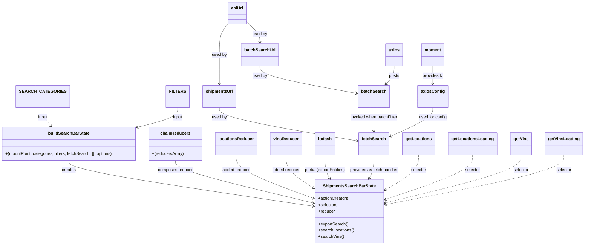

# Diagram: web/portal/src/pages/shipments/redux/ShipmentsSearchBarState.js


> Auto-generated by Obscura crawlers

## Diagram 1



### SVG

<svg id="container" width="2189.2265625" xmlns="http://www.w3.org/2000/svg" class="classDiagram" height="930" viewBox="0 0 2189.2265625 930" role="graphics-document document" aria-roledescription="class"><style>#container{font-family:"trebuchet ms",verdana,arial,sans-serif;font-size:16px;fill:#333;}@keyframes edge-animation-frame{from{stroke-dashoffset:0;}}@keyframes dash{to{stroke-dashoffset:0;}}#container .edge-animation-slow{stroke-dasharray:9,5!important;stroke-dashoffset:900;animation:dash 50s linear infinite;stroke-linecap:round;}#container .edge-animation-fast{stroke-dasharray:9,5!important;stroke-dashoffset:900;animation:dash 20s linear infinite;stroke-linecap:round;}#container .error-icon{fill:#552222;}#container .error-text{fill:#552222;stroke:#552222;}#container .edge-thickness-normal{stroke-width:1px;}#container .edge-thickness-thick{stroke-width:3.5px;}#container .edge-pattern-solid{stroke-dasharray:0;}#container .edge-thickness-invisible{stroke-width:0;fill:none;}#container .edge-pattern-dashed{stroke-dasharray:3;}#container .edge-pattern-dotted{stroke-dasharray:2;}#container .marker{fill:#333333;stroke:#333333;}#container .marker.cross{stroke:#333333;}#container svg{font-family:"trebuchet ms",verdana,arial,sans-serif;font-size:16px;}#container p{margin:0;}#container g.classGroup text{fill:#9370DB;stroke:none;font-family:"trebuchet ms",verdana,arial,sans-serif;font-size:10px;}#container g.classGroup text .title{font-weight:bolder;}#container .nodeLabel,#container .edgeLabel{color:#131300;}#container .edgeLabel .label rect{fill:#ECECFF;}#container .label text{fill:#131300;}#container .labelBkg{background:#ECECFF;}#container .edgeLabel .label span{background:#ECECFF;}#container .classTitle{font-weight:bolder;}#container .node rect,#container .node circle,#container .node ellipse,#container .node polygon,#container .node path{fill:#ECECFF;stroke:#9370DB;stroke-width:1px;}#container .divider{stroke:#9370DB;stroke-width:1;}#container g.clickable{cursor:pointer;}#container g.classGroup rect{fill:#ECECFF;stroke:#9370DB;}#container g.classGroup line{stroke:#9370DB;stroke-width:1;}#container .classLabel .box{stroke:none;stroke-width:0;fill:#ECECFF;opacity:0.5;}#container .classLabel .label{fill:#9370DB;font-size:10px;}#container .relation{stroke:#333333;stroke-width:1;fill:none;}#container .dashed-line{stroke-dasharray:3;}#container .dotted-line{stroke-dasharray:1 2;}#container #compositionStart,#container .composition{fill:#333333!important;stroke:#333333!important;stroke-width:1;}#container #compositionEnd,#container .composition{fill:#333333!important;stroke:#333333!important;stroke-width:1;}#container #dependencyStart,#container .dependency{fill:#333333!important;stroke:#333333!important;stroke-width:1;}#container #dependencyStart,#container .dependency{fill:#333333!important;stroke:#333333!important;stroke-width:1;}#container #extensionStart,#container .extension{fill:transparent!important;stroke:#333333!important;stroke-width:1;}#container #extensionEnd,#container .extension{fill:transparent!important;stroke:#333333!important;stroke-width:1;}#container #aggregationStart,#container .aggregation{fill:transparent!important;stroke:#333333!important;stroke-width:1;}#container #aggregationEnd,#container .aggregation{fill:transparent!important;stroke:#333333!important;stroke-width:1;}#container #lollipopStart,#container .lollipop{fill:#ECECFF!important;stroke:#333333!important;stroke-width:1;}#container #lollipopEnd,#container .lollipop{fill:#ECECFF!important;stroke:#333333!important;stroke-width:1;}#container .edgeTerminals{font-size:11px;line-height:initial;}#container .classTitleText{text-anchor:middle;font-size:18px;fill:#333;}#container .label-icon{display:inline-block;height:1em;overflow:visible;vertical-align:-0.125em;}#container .node .label-icon path{fill:currentColor;stroke:revert;stroke-width:revert;}#container :root{--mermaid-font-family:"trebuchet ms",verdana,arial,sans-serif;}</style><g><defs><marker id="container_class-aggregationStart" class="marker aggregation class" refX="18" refY="7" markerWidth="190" markerHeight="240" orient="auto"><path d="M 18,7 L9,13 L1,7 L9,1 Z"></path></marker></defs><defs><marker id="container_class-aggregationEnd" class="marker aggregation class" refX="1" refY="7" markerWidth="20" markerHeight="28" orient="auto"><path d="M 18,7 L9,13 L1,7 L9,1 Z"></path></marker></defs><defs><marker id="container_class-extensionStart" class="marker extension class" refX="18" refY="7" markerWidth="190" markerHeight="240" orient="auto"><path d="M 1,7 L18,13 V 1 Z"></path></marker></defs><defs><marker id="container_class-extensionEnd" class="marker extension class" refX="1" refY="7" markerWidth="20" markerHeight="28" orient="auto"><path d="M 1,1 V 13 L18,7 Z"></path></marker></defs><defs><marker id="container_class-compositionStart" class="marker composition class" refX="18" refY="7" markerWidth="190" markerHeight="240" orient="auto"><path d="M 18,7 L9,13 L1,7 L9,1 Z"></path></marker></defs><defs><marker id="container_class-compositionEnd" class="marker composition class" refX="1" refY="7" markerWidth="20" markerHeight="28" orient="auto"><path d="M 18,7 L9,13 L1,7 L9,1 Z"></path></marker></defs><defs><marker id="container_class-dependencyStart" class="marker dependency class" refX="6" refY="7" markerWidth="190" markerHeight="240" orient="auto"><path d="M 5,7 L9,13 L1,7 L9,1 Z"></path></marker></defs><defs><marker id="container_class-dependencyEnd" class="marker dependency class" refX="13" refY="7" markerWidth="20" markerHeight="28" orient="auto"><path d="M 18,7 L9,13 L14,7 L9,1 Z"></path></marker></defs><defs><marker id="container_class-lollipopStart" class="marker lollipop class" refX="13" refY="7" markerWidth="190" markerHeight="240" orient="auto"><circle stroke="black" fill="transparent" cx="7" cy="7" r="6"></circle></marker></defs><defs><marker id="container_class-lollipopEnd" class="marker lollipop class" refX="1" refY="7" markerWidth="190" markerHeight="240" orient="auto"><circle stroke="black" fill="transparent" cx="7" cy="7" r="6"></circle></marker></defs><g class="root"><g class="clusters"></g><g class="edgePaths"><path d="M263.281,608L263.281,614.167C263.281,620.333,263.281,632.667,417.435,661.702C571.589,690.737,879.897,736.474,1034.052,759.342L1188.206,782.21" id="id_buildSearchBarState_ShipmentsSearchBarState_1" class="edge-thickness-normal edge-pattern-solid relation" style=";;;" data-edge="true" data-et="edge" data-id="id_buildSearchBarState_ShipmentsSearchBarState_1" data-points="W3sieCI6MjYzLjI4MTI1LCJ5Ijo2MDh9LHsieCI6MjYzLjI4MTI1LCJ5Ijo2NDV9LHsieCI6MTE5NC4xNDA2MjUsInkiOjc4My4wOTA4NzkyMjc1NTI0fV0=" marker-end="url(#container_class-dependencyEnd)"></path><path d="M666.457,608L666.457,614.167C666.457,620.333,666.457,632.667,753.432,659.676C840.407,686.685,1014.356,728.371,1101.331,749.213L1188.306,770.056" id="id_chainReducers_ShipmentsSearchBarState_2" class="edge-thickness-normal edge-pattern-solid relation" style=";;;" data-edge="true" data-et="edge" data-id="id_chainReducers_ShipmentsSearchBarState_2" data-points="W3sieCI6NjY2LjQ1NzAzMTI1LCJ5Ijo2MDh9LHsieCI6NjY2LjQ1NzAzMTI1LCJ5Ijo2NDV9LHsieCI6MTE5NC4xNDA2MjUsInkiOjc3MS40NTQyODAzOTkyNDE2fV0=" marker-end="url(#container_class-dependencyEnd)"></path><path d="M889.898,587L889.898,596.667C889.898,606.333,889.898,625.667,939.666,653.432C989.433,681.198,1088.967,717.396,1138.735,735.495L1188.502,753.594" id="id_locationsReducer_ShipmentsSearchBarState_3" class="edge-thickness-normal edge-pattern-solid relation" style=";;;" data-edge="true" data-et="edge" data-id="id_locationsReducer_ShipmentsSearchBarState_3" data-points="W3sieCI6ODg5Ljg5ODQzNzUsInkiOjU4N30seyJ4Ijo4ODkuODk4NDM3NSwieSI6NjQ1fSx7IngiOjExOTQuMTQwNjI1LCJ5Ijo3NTUuNjQ0NTM0MzI1MDM1OX1d" marker-end="url(#container_class-dependencyEnd)"></path><path d="M1072.195,587L1072.195,596.667C1072.195,606.333,1072.195,625.667,1091.673,647.594C1111.151,669.522,1150.107,694.044,1169.585,706.305L1189.063,718.566" id="id_vinsReducer_ShipmentsSearchBarState_4" class="edge-thickness-normal edge-pattern-solid relation" style=";;;" data-edge="true" data-et="edge" data-id="id_vinsReducer_ShipmentsSearchBarState_4" data-points="W3sieCI6MTA3Mi4xOTUzMTI1LCJ5Ijo1ODd9LHsieCI6MTA3Mi4xOTUzMTI1LCJ5Ijo2NDV9LHsieCI6MTE5NC4xNDA2MjUsInkiOjcyMS43NjI3Njg0MDY3MDk2fV0=" marker-end="url(#container_class-dependencyEnd)"></path><path d="M174.441,408L174.441,414.167C174.441,420.333,174.441,432.667,179.256,444.252C184.07,455.838,193.699,466.676,198.513,472.095L203.327,477.514" id="id_SEARCH_CATEGORIES_buildSearchBarState_5" class="edge-thickness-normal edge-pattern-solid relation" style=";;;" data-edge="true" data-et="edge" data-id="id_SEARCH_CATEGORIES_buildSearchBarState_5" data-points="W3sieCI6MTc0LjQ0MTQwNjI1LCJ5Ijo0MDh9LHsieCI6MTc0LjQ0MTQwNjI1LCJ5Ijo0NDV9LHsieCI6MjA3LjMxMjE0ODQzNzUsInkiOjQ4Mn1d" marker-end="url(#container_class-dependencyEnd)"></path><path d="M681.297,408L681.297,414.167C681.297,420.333,681.297,432.667,655.147,445.089C628.997,457.511,576.698,470.023,550.548,476.279L524.398,482.534" id="id_FILTERS_buildSearchBarState_6" class="edge-thickness-normal edge-pattern-solid relation" style=";;;" data-edge="true" data-et="edge" data-id="id_FILTERS_buildSearchBarState_6" data-points="W3sieCI6NjgxLjI5Njg3NSwieSI6NDA4fSx7IngiOjY4MS4yOTY4NzUsInkiOjQ0NX0seyJ4Ijo1MTguNTYyNSwieSI6NDgzLjkzMDIxMzQzNDAwNzR9XQ==" marker-end="url(#container_class-dependencyEnd)"></path><path d="M863.348,91.171L858.109,97.476C852.87,103.781,842.392,116.39,837.153,135.862C831.914,155.333,831.914,181.667,831.914,208C831.914,234.333,831.914,260.667,831.914,279C831.914,297.333,831.914,307.667,831.914,312.833L831.914,318" id="id_apiUrl_shipmentsUrl_7" class="edge-thickness-normal edge-pattern-solid relation" style=";;;" data-edge="true" data-et="edge" data-id="id_apiUrl_shipmentsUrl_7" data-points="W3sieCI6ODYzLjM0NzY1NjI1LCJ5Ijo5MS4xNzExOTkwNDc5MDI0fSx7IngiOjgzMS45MTQwNjI1LCJ5IjoxMjl9LHsieCI6ODMxLjkxNDA2MjUsInkiOjIwOH0seyJ4Ijo4MzEuOTE0MDYyNSwieSI6Mjg3fSx7IngiOjgzMS45MTQwNjI1LCJ5IjozMjR9XQ==" marker-end="url(#container_class-dependencyEnd)"></path><path d="M931.77,82.128L940.088,89.94C948.406,97.752,965.043,113.376,973.361,126.355C981.68,139.333,981.68,149.667,981.68,154.833L981.68,160" id="id_apiUrl_batchSearchUrl_8" class="edge-thickness-normal edge-pattern-solid relation" style=";;;" data-edge="true" data-et="edge" data-id="id_apiUrl_batchSearchUrl_8" data-points="W3sieCI6OTMxLjc2OTUzMTI1LCJ5Ijo4Mi4xMjgyNTYzMjY5MDk2OH0seyJ4Ijo5ODEuNjc5Njg3NSwieSI6MTI5fSx7IngiOjk4MS42Nzk2ODc1LCJ5IjoxNjZ9XQ==" marker-end="url(#container_class-dependencyEnd)"></path><path d="M831.914,408L831.914,414.167C831.914,420.333,831.914,432.667,919.423,453.76C1006.932,474.853,1181.95,504.707,1269.459,519.634L1356.968,534.56" id="id_shipmentsUrl_fetchSearch_9" class="edge-thickness-normal edge-pattern-solid relation" style=";;;" data-edge="true" data-et="edge" data-id="id_shipmentsUrl_fetchSearch_9" data-points="W3sieCI6ODMxLjkxNDA2MjUsInkiOjQwOH0seyJ4Ijo4MzEuOTE0MDYyNSwieSI6NDQ1fSx7IngiOjEzNjIuODgyODEyNSwieSI6NTM1LjU2OTE1NTUyODMxMTJ9XQ==" marker-end="url(#container_class-dependencyEnd)"></path><path d="M981.68,250L981.68,256.167C981.68,262.333,981.68,274.667,1043.913,292.097C1106.147,309.527,1230.613,332.054,1292.847,343.318L1355.08,354.581" id="id_batchSearchUrl_batchSearch_10" class="edge-thickness-normal edge-pattern-solid relation" style=";;;" data-edge="true" data-et="edge" data-id="id_batchSearchUrl_batchSearch_10" data-points="W3sieCI6OTgxLjY3OTY4NzUsInkiOjI1MH0seyJ4Ijo5ODEuNjc5Njg3NSwieSI6Mjg3fSx7IngiOjEzNjAuOTg0Mzc1LCJ5IjozNTUuNjQ5NzI4ODM5NjQ4NX1d" marker-end="url(#container_class-dependencyEnd)"></path><path d="M1492.797,250L1492.797,256.167C1492.797,262.333,1492.797,274.667,1487.658,286.273C1482.52,297.879,1472.243,308.759,1467.105,314.199L1461.966,319.638" id="id_axios_batchSearch_11" class="edge-thickness-normal edge-pattern-solid relation" style=";;;" data-edge="true" data-et="edge" data-id="id_axios_batchSearch_11" data-points="W3sieCI6MTQ5Mi43OTY4NzUsInkiOjI1MH0seyJ4IjoxNDkyLjc5Njg3NSwieSI6Mjg3fSx7IngiOjE0NTcuODQ1OTI1NjMyOTExMywieSI6MzI0fV0=" marker-end="url(#container_class-dependencyEnd)"></path><path d="M1637.109,250L1637.109,256.167C1637.109,262.333,1637.109,274.667,1637.109,286C1637.109,297.333,1637.109,307.667,1637.109,312.833L1637.109,318" id="id_moment_axiosConfig_12" class="edge-thickness-normal edge-pattern-solid relation" style=";;;" data-edge="true" data-et="edge" data-id="id_moment_axiosConfig_12" data-points="W3sieCI6MTYzNy4xMDkzNzUsInkiOjI1MH0seyJ4IjoxNjM3LjEwOTM3NSwieSI6Mjg3fSx7IngiOjE2MzcuMTA5Mzc1LCJ5IjozMjR9XQ==" marker-end="url(#container_class-dependencyEnd)"></path><path d="M1225.039,587L1225.039,596.667C1225.039,606.333,1225.039,625.667,1228.308,640.648C1231.577,655.63,1238.115,666.26,1241.384,671.574L1244.653,676.889" id="id_lodash_ShipmentsSearchBarState_13" class="edge-thickness-normal edge-pattern-solid relation" style=";;;" data-edge="true" data-et="edge" data-id="id_lodash_ShipmentsSearchBarState_13" data-points="W3sieCI6MTIyNS4wMzkwNjI1LCJ5Ijo1ODd9LHsieCI6MTIyNS4wMzkwNjI1LCJ5Ijo2NDV9LHsieCI6MTI0Ny43OTY3NTA1OTcxMzM3LCJ5Ijo2ODJ9XQ==" marker-end="url(#container_class-dependencyEnd)"></path><path d="M1418.172,587L1418.172,596.667C1418.172,606.333,1418.172,625.667,1414.903,640.648C1411.634,655.63,1405.096,666.26,1401.827,671.574L1398.558,676.889" id="id_fetchSearch_ShipmentsSearchBarState_14" class="edge-thickness-normal edge-pattern-solid relation" style=";;;" data-edge="true" data-et="edge" data-id="id_fetchSearch_ShipmentsSearchBarState_14" data-points="W3sieCI6MTQxOC4xNzE4NzUsInkiOjU4N30seyJ4IjoxNDE4LjE3MTg3NSwieSI6NjQ1fSx7IngiOjEzOTUuNDE0MTg2OTAyODY2MywieSI6NjgyfV0=" marker-end="url(#container_class-dependencyEnd)"></path><path d="M1418.172,408L1418.172,414.167C1418.172,420.333,1418.172,432.667,1418.172,447.5C1418.172,462.333,1418.172,479.667,1418.172,488.333L1418.172,497" id="id_batchSearch_fetchSearch_15" class="edge-thickness-normal edge-pattern-solid relation" style=";;;" data-edge="true" data-et="edge" data-id="id_batchSearch_fetchSearch_15" data-points="W3sieCI6MTQxOC4xNzE4NzUsInkiOjQwOH0seyJ4IjoxNDE4LjE3MTg3NSwieSI6NDQ1fSx7IngiOjE0MTguMTcxODc1LCJ5Ijo1MDN9XQ==" marker-end="url(#container_class-dependencyEnd)"></path><path d="M1637.109,408L1637.109,414.167C1637.109,420.333,1637.109,432.667,1610.744,450.876C1584.379,469.085,1531.649,493.169,1505.284,505.212L1478.919,517.254" id="id_axiosConfig_fetchSearch_16" class="edge-thickness-normal edge-pattern-solid relation" style=";;;" data-edge="true" data-et="edge" data-id="id_axiosConfig_fetchSearch_16" data-points="W3sieCI6MTYzNy4xMDkzNzUsInkiOjQwOH0seyJ4IjoxNjM3LjEwOTM3NSwieSI6NDQ1fSx7IngiOjE0NzMuNDYwOTM3NSwieSI6NTE5Ljc0NjY0NTczMjIyOTV9XQ==" marker-end="url(#container_class-dependencyEnd)"></path><path d="M1582.406,587L1582.406,596.667C1582.406,606.333,1582.406,625.667,1561.04,648.195C1539.674,670.724,1496.943,696.448,1475.577,709.311L1454.211,722.173" id="id_getLocations_ShipmentsSearchBarState_17" class="edge-thickness-normal edge-pattern-dashed relation" style=";;;" data-edge="true" data-et="edge" data-id="id_getLocations_ShipmentsSearchBarState_17" data-points="W3sieCI6MTU4Mi40MDYyNSwieSI6NTg3fSx7IngiOjE1ODIuNDA2MjUsInkiOjY0NX0seyJ4IjoxNDQ5LjA3MDMxMjUsInkiOjcyNS4yNjcxNzU5MTU1MjQ2fV0=" marker-end="url(#container_class-dependencyEnd)"></path><path d="M1779.258,587L1779.258,596.667C1779.258,606.333,1779.258,625.667,1725.172,653.888C1671.087,682.109,1562.916,719.217,1508.831,737.771L1454.746,756.326" id="id_getLocationsLoading_ShipmentsSearchBarState_18" class="edge-thickness-normal edge-pattern-dashed relation" style=";;;" data-edge="true" data-et="edge" data-id="id_getLocationsLoading_ShipmentsSearchBarState_18" data-points="W3sieCI6MTc3OS4yNTc4MTI1LCJ5Ijo1ODd9LHsieCI6MTc3OS4yNTc4MTI1LCJ5Ijo2NDV9LHsieCI6MTQ0OS4wNzAzMTI1LCJ5Ijo3NTguMjcyNTI3MDc4NTg1NX1d" marker-end="url(#container_class-dependencyEnd)"></path><path d="M1956.203,587L1956.203,596.667C1956.203,606.333,1956.203,625.667,1872.652,656.004C1789.1,686.341,1621.998,727.683,1538.446,748.353L1454.895,769.024" id="id_getVins_ShipmentsSearchBarState_19" class="edge-thickness-normal edge-pattern-dashed relation" style=";;;" data-edge="true" data-et="edge" data-id="id_getVins_ShipmentsSearchBarState_19" data-points="W3sieCI6MTk1Ni4yMDMxMjUsInkiOjU4N30seyJ4IjoxOTU2LjIwMzEyNSwieSI6NjQ1fSx7IngiOjE0NDkuMDcwMzEyNSwieSI6NzcwLjQ2NTA4OTIyMzYxfV0=" marker-end="url(#container_class-dependencyEnd)"></path><path d="M2113.234,587L2113.234,596.667C2113.234,606.333,2113.234,625.667,2003.521,657.092C1893.808,688.518,1674.382,732.036,1564.669,753.794L1454.956,775.553" id="id_getVinsLoading_ShipmentsSearchBarState_20" class="edge-thickness-normal edge-pattern-dashed relation" style=";;;" data-edge="true" data-et="edge" data-id="id_getVinsLoading_ShipmentsSearchBarState_20" data-points="W3sieCI6MjExMy4yMzQzNzUsInkiOjU4N30seyJ4IjoyMTEzLjIzNDM3NSwieSI6NjQ1fSx7IngiOjE0NDkuMDcwMzEyNSwieSI6Nzc2LjcyMDUwMzExNjEwMjZ9XQ==" marker-end="url(#container_class-dependencyEnd)"></path></g><g class="edgeLabels"><g class="edgeLabel" transform="translate(263.28125, 645)"><g class="label" data-id="id_buildSearchBarState_ShipmentsSearchBarState_1" transform="translate(-26.171875, -12)"><foreignObject width="52.34375" height="24"><div xmlns="http://www.w3.org/1999/xhtml" class="labelBkg" style="display: table-cell; white-space: nowrap; line-height: 1.5; max-width: 200px; text-align: center;"><span class="edgeLabel"><p>creates</p></span></div></foreignObject></g></g><g class="edgeLabel" transform="translate(666.45703125, 645)"><g class="label" data-id="id_chainReducers_ShipmentsSearchBarState_2" transform="translate(-66.328125, -12)"><foreignObject width="132.65625" height="24"><div xmlns="http://www.w3.org/1999/xhtml" class="labelBkg" style="display: table-cell; white-space: nowrap; line-height: 1.5; max-width: 200px; text-align: center;"><span class="edgeLabel"><p>composes reducer</p></span></div></foreignObject></g></g><g class="edgeLabel" transform="translate(889.8984375, 645)"><g class="label" data-id="id_locationsReducer_ShipmentsSearchBarState_3" transform="translate(-52.9453125, -12)"><foreignObject width="105.890625" height="24"><div xmlns="http://www.w3.org/1999/xhtml" class="labelBkg" style="display: table-cell; white-space: nowrap; line-height: 1.5; max-width: 200px; text-align: center;"><span class="edgeLabel"><p>added reducer</p></span></div></foreignObject></g></g><g class="edgeLabel" transform="translate(1072.1953125, 645)"><g class="label" data-id="id_vinsReducer_ShipmentsSearchBarState_4" transform="translate(-52.9453125, -12)"><foreignObject width="105.890625" height="24"><div xmlns="http://www.w3.org/1999/xhtml" class="labelBkg" style="display: table-cell; white-space: nowrap; line-height: 1.5; max-width: 200px; text-align: center;"><span class="edgeLabel"><p>added reducer</p></span></div></foreignObject></g></g><g class="edgeLabel" transform="translate(174.44140625, 445)"><g class="label" data-id="id_SEARCH_CATEGORIES_buildSearchBarState_5" transform="translate(-19.2421875, -12)"><foreignObject width="38.484375" height="24"><div xmlns="http://www.w3.org/1999/xhtml" class="labelBkg" style="display: table-cell; white-space: nowrap; line-height: 1.5; max-width: 200px; text-align: center;"><span class="edgeLabel"><p>input</p></span></div></foreignObject></g></g><g class="edgeLabel" transform="translate(681.296875, 445)"><g class="label" data-id="id_FILTERS_buildSearchBarState_6" transform="translate(-19.2421875, -12)"><foreignObject width="38.484375" height="24"><div xmlns="http://www.w3.org/1999/xhtml" class="labelBkg" style="display: table-cell; white-space: nowrap; line-height: 1.5; max-width: 200px; text-align: center;"><span class="edgeLabel"><p>input</p></span></div></foreignObject></g></g><g class="edgeLabel" transform="translate(831.9140625, 208)"><g class="label" data-id="id_apiUrl_shipmentsUrl_7" transform="translate(-28.3125, -12)"><foreignObject width="56.625" height="24"><div xmlns="http://www.w3.org/1999/xhtml" class="labelBkg" style="display: table-cell; white-space: nowrap; line-height: 1.5; max-width: 200px; text-align: center;"><span class="edgeLabel"><p>used by</p></span></div></foreignObject></g></g><g class="edgeLabel" transform="translate(981.6796875, 129)"><g class="label" data-id="id_apiUrl_batchSearchUrl_8" transform="translate(-28.3125, -12)"><foreignObject width="56.625" height="24"><div xmlns="http://www.w3.org/1999/xhtml" class="labelBkg" style="display: table-cell; white-space: nowrap; line-height: 1.5; max-width: 200px; text-align: center;"><span class="edgeLabel"><p>used by</p></span></div></foreignObject></g></g><g class="edgeLabel" transform="translate(831.9140625, 445)"><g class="label" data-id="id_shipmentsUrl_fetchSearch_9" transform="translate(-28.3125, -12)"><foreignObject width="56.625" height="24"><div xmlns="http://www.w3.org/1999/xhtml" class="labelBkg" style="display: table-cell; white-space: nowrap; line-height: 1.5; max-width: 200px; text-align: center;"><span class="edgeLabel"><p>used by</p></span></div></foreignObject></g></g><g class="edgeLabel" transform="translate(981.6796875, 287)"><g class="label" data-id="id_batchSearchUrl_batchSearch_10" transform="translate(-28.3125, -12)"><foreignObject width="56.625" height="24"><div xmlns="http://www.w3.org/1999/xhtml" class="labelBkg" style="display: table-cell; white-space: nowrap; line-height: 1.5; max-width: 200px; text-align: center;"><span class="edgeLabel"><p>used by</p></span></div></foreignObject></g></g><g class="edgeLabel" transform="translate(1492.796875, 287)"><g class="label" data-id="id_axios_batchSearch_11" transform="translate(-19.7890625, -12)"><foreignObject width="39.578125" height="24"><div xmlns="http://www.w3.org/1999/xhtml" class="labelBkg" style="display: table-cell; white-space: nowrap; line-height: 1.5; max-width: 200px; text-align: center;"><span class="edgeLabel"><p>posts</p></span></div></foreignObject></g></g><g class="edgeLabel" transform="translate(1637.109375, 287)"><g class="label" data-id="id_moment_axiosConfig_12" transform="translate(-39.8203125, -12)"><foreignObject width="79.640625" height="24"><div xmlns="http://www.w3.org/1999/xhtml" class="labelBkg" style="display: table-cell; white-space: nowrap; line-height: 1.5; max-width: 200px; text-align: center;"><span class="edgeLabel"><p>provides tz</p></span></div></foreignObject></g></g><g class="edgeLabel" transform="translate(1225.0390625, 645)"><g class="label" data-id="id_lodash_ShipmentsSearchBarState_13" transform="translate(-79.8984375, -12)"><foreignObject width="159.796875" height="24"><div xmlns="http://www.w3.org/1999/xhtml" class="labelBkg" style="display: table-cell; white-space: nowrap; line-height: 1.5; max-width: 200px; text-align: center;"><span class="edgeLabel"><p>partial(exportEntities)</p></span></div></foreignObject></g></g><g class="edgeLabel" transform="translate(1418.171875, 645)"><g class="label" data-id="id_fetchSearch_ShipmentsSearchBarState_14" transform="translate(-93.234375, -12)"><foreignObject width="186.46875" height="24"><div xmlns="http://www.w3.org/1999/xhtml" class="labelBkg" style="display: table-cell; white-space: nowrap; line-height: 1.5; max-width: 200px; text-align: center;"><span class="edgeLabel"><p>provided as fetch handler</p></span></div></foreignObject></g></g><g class="edgeLabel" transform="translate(1418.171875, 445)"><g class="label" data-id="id_batchSearch_fetchSearch_15" transform="translate(-91.1171875, -12)"><foreignObject width="182.234375" height="24"><div xmlns="http://www.w3.org/1999/xhtml" class="labelBkg" style="display: table-cell; white-space: nowrap; line-height: 1.5; max-width: 200px; text-align: center;"><span class="edgeLabel"><p>invoked when batchFilter</p></span></div></foreignObject></g></g><g class="edgeLabel" transform="translate(1637.109375, 445)"><g class="label" data-id="id_axiosConfig_fetchSearch_16" transform="translate(-53.921875, -12)"><foreignObject width="107.84375" height="24"><div xmlns="http://www.w3.org/1999/xhtml" class="labelBkg" style="display: table-cell; white-space: nowrap; line-height: 1.5; max-width: 200px; text-align: center;"><span class="edgeLabel"><p>used for config</p></span></div></foreignObject></g></g><g class="edgeLabel" transform="translate(1582.40625, 645)"><g class="label" data-id="id_getLocations_ShipmentsSearchBarState_17" transform="translate(-29.1171875, -12)"><foreignObject width="58.234375" height="24"><div xmlns="http://www.w3.org/1999/xhtml" class="labelBkg" style="display: table-cell; white-space: nowrap; line-height: 1.5; max-width: 200px; text-align: center;"><span class="edgeLabel"><p>selector</p></span></div></foreignObject></g></g><g class="edgeLabel" transform="translate(1779.2578125, 645)"><g class="label" data-id="id_getLocationsLoading_ShipmentsSearchBarState_18" transform="translate(-29.1171875, -12)"><foreignObject width="58.234375" height="24"><div xmlns="http://www.w3.org/1999/xhtml" class="labelBkg" style="display: table-cell; white-space: nowrap; line-height: 1.5; max-width: 200px; text-align: center;"><span class="edgeLabel"><p>selector</p></span></div></foreignObject></g></g><g class="edgeLabel" transform="translate(1956.203125, 645)"><g class="label" data-id="id_getVins_ShipmentsSearchBarState_19" transform="translate(-29.1171875, -12)"><foreignObject width="58.234375" height="24"><div xmlns="http://www.w3.org/1999/xhtml" class="labelBkg" style="display: table-cell; white-space: nowrap; line-height: 1.5; max-width: 200px; text-align: center;"><span class="edgeLabel"><p>selector</p></span></div></foreignObject></g></g><g class="edgeLabel" transform="translate(2113.234375, 645)"><g class="label" data-id="id_getVinsLoading_ShipmentsSearchBarState_20" transform="translate(-29.1171875, -12)"><foreignObject width="58.234375" height="24"><div xmlns="http://www.w3.org/1999/xhtml" class="labelBkg" style="display: table-cell; white-space: nowrap; line-height: 1.5; max-width: 200px; text-align: center;"><span class="edgeLabel"><p>selector</p></span></div></foreignObject></g></g></g><g class="nodes"><g class="node default" id="classId-ShipmentsSearchBarState-0" transform="translate(1321.60546875, 802)"><g class="basic label-container"><path d="M-127.46484375 -120 L127.46484375 -120 L127.46484375 120 L-127.46484375 120" stroke="none" stroke-width="0" fill="#ECECFF" style=""></path><path d="M-127.46484375 -120 C-32.870319474716666 -120, 61.72420480056667 -120, 127.46484375 -120 M-127.46484375 -120 C-54.51845732874054 -120, 18.427929092518923 -120, 127.46484375 -120 M127.46484375 -120 C127.46484375 -61.75916848934255, 127.46484375 -3.518336978685099, 127.46484375 120 M127.46484375 -120 C127.46484375 -43.856109089455515, 127.46484375 32.28778182108897, 127.46484375 120 M127.46484375 120 C39.28453884855014 120, -48.89576605289972 120, -127.46484375 120 M127.46484375 120 C72.38139433500639 120, 17.29794492001278 120, -127.46484375 120 M-127.46484375 120 C-127.46484375 51.624476102514365, -127.46484375 -16.75104779497127, -127.46484375 -120 M-127.46484375 120 C-127.46484375 55.49601157509008, -127.46484375 -9.00797684981984, -127.46484375 -120" stroke="#9370DB" stroke-width="1.3" fill="none" stroke-dasharray="0 0" style=""></path></g><g class="annotation-group text" transform="translate(0, -96)"></g><g class="label-group text" transform="translate(-95.5234375, -96)"><g class="label" style="font-weight: bolder" transform="translate(0,-12)"><foreignObject width="191.046875" height="24"><div xmlns="http://www.w3.org/1999/xhtml" style="display: table-cell; white-space: nowrap; line-height: 1.5; max-width: 238px; text-align: center;"><span class="nodeLabel markdown-node-label" style=""><p>ShipmentsSearchBarState</p></span></div></foreignObject></g></g><g class="members-group text" transform="translate(-115.46484375, -48)"><g class="label" style="" transform="translate(0,-12)"><foreignObject width="113.078125" height="24"><div xmlns="http://www.w3.org/1999/xhtml" style="display: table-cell; white-space: nowrap; line-height: 1.5; max-width: 170px; text-align: center;"><span class="nodeLabel markdown-node-label" style=""><p>+actionCreators</p></span></div></foreignObject></g><g class="label" style="" transform="translate(0,12)"><foreignObject width="73.453125" height="24"><div xmlns="http://www.w3.org/1999/xhtml" style="display: table-cell; white-space: nowrap; line-height: 1.5; max-width: 131px; text-align: center;"><span class="nodeLabel markdown-node-label" style=""><p>+selectors</p></span></div></foreignObject></g><g class="label" style="" transform="translate(0,36)"><foreignObject width="63.515625" height="24"><div xmlns="http://www.w3.org/1999/xhtml" style="display: table-cell; white-space: nowrap; line-height: 1.5; max-width: 122px; text-align: center;"><span class="nodeLabel markdown-node-label" style=""><p>+reducer</p></span></div></foreignObject></g></g><g class="methods-group text" transform="translate(-115.46484375, 48)"><g class="label" style="" transform="translate(0,-12)"><foreignObject width="114.203125" height="24"><div xmlns="http://www.w3.org/1999/xhtml" style="display: table-cell; white-space: nowrap; line-height: 1.5; max-width: 172px; text-align: center;"><span class="nodeLabel markdown-node-label" style=""><p>+exportSearch()</p></span></div></foreignObject></g><g class="label" style="" transform="translate(0,12)"><foreignObject width="135.40625" height="24"><div xmlns="http://www.w3.org/1999/xhtml" style="display: table-cell; white-space: nowrap; line-height: 1.5; max-width: 193px; text-align: center;"><span class="nodeLabel markdown-node-label" style=""><p>+searchLocations()</p></span></div></foreignObject></g><g class="label" style="" transform="translate(0,36)"><foreignObject width="96.078125" height="24"><div xmlns="http://www.w3.org/1999/xhtml" style="display: table-cell; white-space: nowrap; line-height: 1.5; max-width: 153px; text-align: center;"><span class="nodeLabel markdown-node-label" style=""><p>+searchVins()</p></span></div></foreignObject></g></g><g class="divider" style=""><path d="M-127.46484375 -72 C-35.34769688425028 -72, 56.769449981499434 -72, 127.46484375 -72 M-127.46484375 -72 C-48.45910206803906 -72, 30.546639613921883 -72, 127.46484375 -72" stroke="#9370DB" stroke-width="1.3" fill="none" stroke-dasharray="0 0" style=""></path></g><g class="divider" style=""><path d="M-127.46484375 24 C-60.48667407056526 24, 6.491495608869485 24, 127.46484375 24 M-127.46484375 24 C-68.20752261590599 24, -8.950201481811987 24, 127.46484375 24" stroke="#9370DB" stroke-width="1.3" fill="none" stroke-dasharray="0 0" style=""></path></g></g><g class="node default" id="classId-buildSearchBarState-1" transform="translate(263.28125, 545)"><g class="basic label-container"><path d="M-255.28125 -63 L255.28125 -63 L255.28125 63 L-255.28125 63" stroke="none" stroke-width="0" fill="#ECECFF" style=""></path><path d="M-255.28125 -63 C-61.295738368290415 -63, 132.68977326341917 -63, 255.28125 -63 M-255.28125 -63 C-69.46707886235384 -63, 116.34709227529231 -63, 255.28125 -63 M255.28125 -63 C255.28125 -22.668859237403936, 255.28125 17.662281525192128, 255.28125 63 M255.28125 -63 C255.28125 -28.95495667085104, 255.28125 5.0900866582979205, 255.28125 63 M255.28125 63 C126.39560157681461 63, -2.490046846370774 63, -255.28125 63 M255.28125 63 C91.41635365089047 63, -72.44854269821906 63, -255.28125 63 M-255.28125 63 C-255.28125 34.430453673218494, -255.28125 5.860907346436981, -255.28125 -63 M-255.28125 63 C-255.28125 21.185911062580104, -255.28125 -20.628177874839793, -255.28125 -63" stroke="#9370DB" stroke-width="1.3" fill="none" stroke-dasharray="0 0" style=""></path></g><g class="annotation-group text" transform="translate(0, -39)"></g><g class="label-group text" transform="translate(-75.296875, -39)"><g class="label" style="font-weight: bolder" transform="translate(0,-12)"><foreignObject width="150.59375" height="24"><div xmlns="http://www.w3.org/1999/xhtml" style="display: table-cell; white-space: nowrap; line-height: 1.5; max-width: 198px; text-align: center;"><span class="nodeLabel markdown-node-label" style=""><p>buildSearchBarState</p></span></div></foreignObject></g></g><g class="members-group text" transform="translate(-243.28125, 9)"></g><g class="methods-group text" transform="translate(-243.28125, 39)"><g class="label" style="" transform="translate(0,-12)"><foreignObject width="411.265625" height="24"><div xmlns="http://www.w3.org/1999/xhtml" style="display: table-cell; white-space: nowrap; line-height: 1.5; max-width: 461px; text-align: center;"><span class="nodeLabel markdown-node-label" style=""><p>+(mountPoint, categories, filters, fetchSearch, [], options)</p></span></div></foreignObject></g></g><g class="divider" style=""><path d="M-255.28125 -15 C-151.45126015216545 -15, -47.62127030433089 -15, 255.28125 -15 M-255.28125 -15 C-53.8187541347869 -15, 147.6437417304262 -15, 255.28125 -15" stroke="#9370DB" stroke-width="1.3" fill="none" stroke-dasharray="0 0" style=""></path></g><g class="divider" style=""><path d="M-255.28125 9 C-113.51656074560441 9, 28.248128508791183 9, 255.28125 9 M-255.28125 9 C-118.33061701035976 9, 18.62001597928048 9, 255.28125 9" stroke="#9370DB" stroke-width="1.3" fill="none" stroke-dasharray="0 0" style=""></path></g></g><g class="node default" id="classId-chainReducers-2" transform="translate(666.45703125, 545)"><g class="basic label-container"><path d="M-97.89453125 -63 L97.89453125 -63 L97.89453125 63 L-97.89453125 63" stroke="none" stroke-width="0" fill="#ECECFF" style=""></path><path d="M-97.89453125 -63 C-35.73320669714323 -63, 26.428117855713538 -63, 97.89453125 -63 M-97.89453125 -63 C-27.05500688987911 -63, 43.78451747024178 -63, 97.89453125 -63 M97.89453125 -63 C97.89453125 -27.782616956330536, 97.89453125 7.434766087338929, 97.89453125 63 M97.89453125 -63 C97.89453125 -15.565810100830433, 97.89453125 31.868379798339134, 97.89453125 63 M97.89453125 63 C33.276106937035294 63, -31.34231737592941 63, -97.89453125 63 M97.89453125 63 C56.28713087110037 63, 14.679730492200747 63, -97.89453125 63 M-97.89453125 63 C-97.89453125 27.150721023664524, -97.89453125 -8.698557952670953, -97.89453125 -63 M-97.89453125 63 C-97.89453125 31.597964040249423, -97.89453125 0.19592808049884525, -97.89453125 -63" stroke="#9370DB" stroke-width="1.3" fill="none" stroke-dasharray="0 0" style=""></path></g><g class="annotation-group text" transform="translate(0, -39)"></g><g class="label-group text" transform="translate(-53.3828125, -39)"><g class="label" style="font-weight: bolder" transform="translate(0,-12)"><foreignObject width="106.765625" height="24"><div xmlns="http://www.w3.org/1999/xhtml" style="display: table-cell; white-space: nowrap; line-height: 1.5; max-width: 156px; text-align: center;"><span class="nodeLabel markdown-node-label" style=""><p>chainReducers</p></span></div></foreignObject></g></g><g class="members-group text" transform="translate(-85.89453125, 9)"></g><g class="methods-group text" transform="translate(-85.89453125, 39)"><g class="label" style="" transform="translate(0,-12)"><foreignObject width="118.40625" height="24"><div xmlns="http://www.w3.org/1999/xhtml" style="display: table-cell; white-space: nowrap; line-height: 1.5; max-width: 168px; text-align: center;"><span class="nodeLabel markdown-node-label" style=""><p>+(reducersArray)</p></span></div></foreignObject></g></g><g class="divider" style=""><path d="M-97.89453125 -15 C-46.79315836946244 -15, 4.308214511075121 -15, 97.89453125 -15 M-97.89453125 -15 C-45.784682977787554 -15, 6.325165294424892 -15, 97.89453125 -15" stroke="#9370DB" stroke-width="1.3" fill="none" stroke-dasharray="0 0" style=""></path></g><g class="divider" style=""><path d="M-97.89453125 9 C-21.49855160955714 9, 54.89742803088572 9, 97.89453125 9 M-97.89453125 9 C-50.843983966326284 9, -3.793436682652569 9, 97.89453125 9" stroke="#9370DB" stroke-width="1.3" fill="none" stroke-dasharray="0 0" style=""></path></g></g><g class="node default" id="classId-locationsReducer-3" transform="translate(889.8984375, 545)"><g class="basic label-container"><path d="M-75.546875 -42 L75.546875 -42 L75.546875 42 L-75.546875 42" stroke="none" stroke-width="0" fill="#ECECFF" style=""></path><path d="M-75.546875 -42 C-45.02807704773835 -42, -14.509279095476707 -42, 75.546875 -42 M-75.546875 -42 C-19.57045308043994 -42, 36.40596883912012 -42, 75.546875 -42 M75.546875 -42 C75.546875 -10.869011282460043, 75.546875 20.261977435079913, 75.546875 42 M75.546875 -42 C75.546875 -14.56280592641735, 75.546875 12.874388147165298, 75.546875 42 M75.546875 42 C31.853595064993556 42, -11.839684870012888 42, -75.546875 42 M75.546875 42 C24.122351903224896 42, -27.30217119355021 42, -75.546875 42 M-75.546875 42 C-75.546875 18.8066145343195, -75.546875 -4.386770931360999, -75.546875 -42 M-75.546875 42 C-75.546875 18.017309176945883, -75.546875 -5.965381646108234, -75.546875 -42" stroke="#9370DB" stroke-width="1.3" fill="none" stroke-dasharray="0 0" style=""></path></g><g class="annotation-group text" transform="translate(0, -18)"></g><g class="label-group text" transform="translate(-63.546875, -18)"><g class="label" style="font-weight: bolder" transform="translate(0,-12)"><foreignObject width="127.09375" height="24"><div xmlns="http://www.w3.org/1999/xhtml" style="display: table-cell; white-space: nowrap; line-height: 1.5; max-width: 177px; text-align: center;"><span class="nodeLabel markdown-node-label" style=""><p>locationsReducer</p></span></div></foreignObject></g></g><g class="members-group text" transform="translate(-63.546875, 30)"></g><g class="methods-group text" transform="translate(-63.546875, 60)"></g><g class="divider" style=""><path d="M-75.546875 6 C-22.699685453058912 6, 30.147504093882176 6, 75.546875 6 M-75.546875 6 C-20.65992433921096 6, 34.22702632157808 6, 75.546875 6" stroke="#9370DB" stroke-width="1.3" fill="none" stroke-dasharray="0 0" style=""></path></g><g class="divider" style=""><path d="M-75.546875 24 C-30.422212122109336 24, 14.702450755781328 24, 75.546875 24 M-75.546875 24 C-21.409371840119718 24, 32.728131319760564 24, 75.546875 24" stroke="#9370DB" stroke-width="1.3" fill="none" stroke-dasharray="0 0" style=""></path></g></g><g class="node default" id="classId-vinsReducer-4" transform="translate(1072.1953125, 545)"><g class="basic label-container"><path d="M-56.75 -42 L56.75 -42 L56.75 42 L-56.75 42" stroke="none" stroke-width="0" fill="#ECECFF" style=""></path><path d="M-56.75 -42 C-33.96510128130632 -42, -11.180202562612642 -42, 56.75 -42 M-56.75 -42 C-28.648588145126155 -42, -0.5471762902523096 -42, 56.75 -42 M56.75 -42 C56.75 -11.466636135818618, 56.75 19.066727728362764, 56.75 42 M56.75 -42 C56.75 -13.15326274242718, 56.75 15.693474515145638, 56.75 42 M56.75 42 C28.505968700199826 42, 0.26193740039965263 42, -56.75 42 M56.75 42 C25.251892346045558 42, -6.246215307908884 42, -56.75 42 M-56.75 42 C-56.75 22.51829242885184, -56.75 3.03658485770368, -56.75 -42 M-56.75 42 C-56.75 13.195122978526111, -56.75 -15.609754042947777, -56.75 -42" stroke="#9370DB" stroke-width="1.3" fill="none" stroke-dasharray="0 0" style=""></path></g><g class="annotation-group text" transform="translate(0, -18)"></g><g class="label-group text" transform="translate(-44.75, -18)"><g class="label" style="font-weight: bolder" transform="translate(0,-12)"><foreignObject width="89.5" height="24"><div xmlns="http://www.w3.org/1999/xhtml" style="display: table-cell; white-space: nowrap; line-height: 1.5; max-width: 139px; text-align: center;"><span class="nodeLabel markdown-node-label" style=""><p>vinsReducer</p></span></div></foreignObject></g></g><g class="members-group text" transform="translate(-44.75, 30)"></g><g class="methods-group text" transform="translate(-44.75, 60)"></g><g class="divider" style=""><path d="M-56.75 6 C-30.03482443293592 6, -3.319648865871841 6, 56.75 6 M-56.75 6 C-33.97263792889419 6, -11.195275857788374 6, 56.75 6" stroke="#9370DB" stroke-width="1.3" fill="none" stroke-dasharray="0 0" style=""></path></g><g class="divider" style=""><path d="M-56.75 24 C-30.228184831335554 24, -3.706369662671108 24, 56.75 24 M-56.75 24 C-32.62557580580666 24, -8.501151611613317 24, 56.75 24" stroke="#9370DB" stroke-width="1.3" fill="none" stroke-dasharray="0 0" style=""></path></g></g><g class="node default" id="classId-SEARCH_CATEGORIES-5" transform="translate(174.44140625, 366)"><g class="basic label-container"><path d="M-88.1171875 -42 L88.1171875 -42 L88.1171875 42 L-88.1171875 42" stroke="none" stroke-width="0" fill="#ECECFF" style=""></path><path d="M-88.1171875 -42 C-40.07606093663651 -42, 7.965065626726982 -42, 88.1171875 -42 M-88.1171875 -42 C-23.823460498042877 -42, 40.470266503914246 -42, 88.1171875 -42 M88.1171875 -42 C88.1171875 -12.461328438947454, 88.1171875 17.07734312210509, 88.1171875 42 M88.1171875 -42 C88.1171875 -13.052906439041493, 88.1171875 15.894187121917014, 88.1171875 42 M88.1171875 42 C51.02027931680776 42, 13.923371133615518 42, -88.1171875 42 M88.1171875 42 C47.00772568469854 42, 5.898263869397084 42, -88.1171875 42 M-88.1171875 42 C-88.1171875 18.63077453229424, -88.1171875 -4.738450935411521, -88.1171875 -42 M-88.1171875 42 C-88.1171875 18.953160414884504, -88.1171875 -4.093679170230992, -88.1171875 -42" stroke="#9370DB" stroke-width="1.3" fill="none" stroke-dasharray="0 0" style=""></path></g><g class="annotation-group text" transform="translate(0, -18)"></g><g class="label-group text" transform="translate(-76.1171875, -18)"><g class="label" style="font-weight: bolder" transform="translate(0,-12)"><foreignObject width="152.234375" height="24"><div xmlns="http://www.w3.org/1999/xhtml" style="display: table-cell; white-space: nowrap; line-height: 1.5; max-width: 200px; text-align: center;"><span class="nodeLabel markdown-node-label" style=""><p>SEARCH_CATEGORIES</p></span></div></foreignObject></g></g><g class="members-group text" transform="translate(-76.1171875, 30)"></g><g class="methods-group text" transform="translate(-76.1171875, 60)"></g><g class="divider" style=""><path d="M-88.1171875 6 C-25.620860698823407 6, 36.87546610235319 6, 88.1171875 6 M-88.1171875 6 C-47.533240084782115 6, -6.94929266956423 6, 88.1171875 6" stroke="#9370DB" stroke-width="1.3" fill="none" stroke-dasharray="0 0" style=""></path></g><g class="divider" style=""><path d="M-88.1171875 24 C-51.48255697086552 24, -14.847926441731033 24, 88.1171875 24 M-88.1171875 24 C-51.96796890016186 24, -15.818750300323714 24, 88.1171875 24" stroke="#9370DB" stroke-width="1.3" fill="none" stroke-dasharray="0 0" style=""></path></g></g><g class="node default" id="classId-FILTERS-6" transform="translate(681.296875, 366)"><g class="basic label-container"><path d="M-39.5625 -42 L39.5625 -42 L39.5625 42 L-39.5625 42" stroke="none" stroke-width="0" fill="#ECECFF" style=""></path><path d="M-39.5625 -42 C-11.762694468729482 -42, 16.037111062541037 -42, 39.5625 -42 M-39.5625 -42 C-10.373772222563403 -42, 18.814955554873194 -42, 39.5625 -42 M39.5625 -42 C39.5625 -11.69230339088718, 39.5625 18.61539321822564, 39.5625 42 M39.5625 -42 C39.5625 -16.79828901124494, 39.5625 8.40342197751012, 39.5625 42 M39.5625 42 C13.569832840042952 42, -12.422834319914095 42, -39.5625 42 M39.5625 42 C22.672739247436567 42, 5.782978494873134 42, -39.5625 42 M-39.5625 42 C-39.5625 14.103621894576214, -39.5625 -13.792756210847571, -39.5625 -42 M-39.5625 42 C-39.5625 10.642955196937017, -39.5625 -20.714089606125967, -39.5625 -42" stroke="#9370DB" stroke-width="1.3" fill="none" stroke-dasharray="0 0" style=""></path></g><g class="annotation-group text" transform="translate(0, -18)"></g><g class="label-group text" transform="translate(-27.5625, -18)"><g class="label" style="font-weight: bolder" transform="translate(0,-12)"><foreignObject width="55.125" height="24"><div xmlns="http://www.w3.org/1999/xhtml" style="display: table-cell; white-space: nowrap; line-height: 1.5; max-width: 105px; text-align: center;"><span class="nodeLabel markdown-node-label" style=""><p>FILTERS</p></span></div></foreignObject></g></g><g class="members-group text" transform="translate(-27.5625, 30)"></g><g class="methods-group text" transform="translate(-27.5625, 60)"></g><g class="divider" style=""><path d="M-39.5625 6 C-19.533670911184277 6, 0.49515817763144554 6, 39.5625 6 M-39.5625 6 C-20.500549746181406 6, -1.4385994923628118 6, 39.5625 6" stroke="#9370DB" stroke-width="1.3" fill="none" stroke-dasharray="0 0" style=""></path></g><g class="divider" style=""><path d="M-39.5625 24 C-21.06212363410201 24, -2.561747268204023 24, 39.5625 24 M-39.5625 24 C-11.490763849681649 24, 16.580972300636702 24, 39.5625 24" stroke="#9370DB" stroke-width="1.3" fill="none" stroke-dasharray="0 0" style=""></path></g></g><g class="node default" id="classId-apiUrl-7" transform="translate(897.55859375, 50)"><g class="basic label-container"><path d="M-34.2109375 -42 L34.2109375 -42 L34.2109375 42 L-34.2109375 42" stroke="none" stroke-width="0" fill="#ECECFF" style=""></path><path d="M-34.2109375 -42 C-7.14146329699015 -42, 19.9280109060197 -42, 34.2109375 -42 M-34.2109375 -42 C-10.032558729780057 -42, 14.145820040439887 -42, 34.2109375 -42 M34.2109375 -42 C34.2109375 -24.5607824900683, 34.2109375 -7.121564980136597, 34.2109375 42 M34.2109375 -42 C34.2109375 -16.89277158625903, 34.2109375 8.21445682748194, 34.2109375 42 M34.2109375 42 C20.377224819290603 42, 6.543512138581207 42, -34.2109375 42 M34.2109375 42 C14.2893379820174 42, -5.632261535965199 42, -34.2109375 42 M-34.2109375 42 C-34.2109375 13.830520683548595, -34.2109375 -14.33895863290281, -34.2109375 -42 M-34.2109375 42 C-34.2109375 19.320139042837177, -34.2109375 -3.3597219143256467, -34.2109375 -42" stroke="#9370DB" stroke-width="1.3" fill="none" stroke-dasharray="0 0" style=""></path></g><g class="annotation-group text" transform="translate(0, -18)"></g><g class="label-group text" transform="translate(-22.2109375, -18)"><g class="label" style="font-weight: bolder" transform="translate(0,-12)"><foreignObject width="44.421875" height="24"><div xmlns="http://www.w3.org/1999/xhtml" style="display: table-cell; white-space: nowrap; line-height: 1.5; max-width: 94px; text-align: center;"><span class="nodeLabel markdown-node-label" style=""><p>apiUrl</p></span></div></foreignObject></g></g><g class="members-group text" transform="translate(-22.2109375, 30)"></g><g class="methods-group text" transform="translate(-22.2109375, 60)"></g><g class="divider" style=""><path d="M-34.2109375 6 C-18.935922825641896 6, -3.6609081512837953 6, 34.2109375 6 M-34.2109375 6 C-16.76026016505405 6, 0.6904171698919015 6, 34.2109375 6" stroke="#9370DB" stroke-width="1.3" fill="none" stroke-dasharray="0 0" style=""></path></g><g class="divider" style=""><path d="M-34.2109375 24 C-12.797259124782634 24, 8.616419250434731 24, 34.2109375 24 M-34.2109375 24 C-9.77761068691073 24, 14.65571612617854 24, 34.2109375 24" stroke="#9370DB" stroke-width="1.3" fill="none" stroke-dasharray="0 0" style=""></path></g></g><g class="node default" id="classId-axios-8" transform="translate(1492.796875, 208)"><g class="basic label-container"><path d="M-31.2734375 -42 L31.2734375 -42 L31.2734375 42 L-31.2734375 42" stroke="none" stroke-width="0" fill="#ECECFF" style=""></path><path d="M-31.2734375 -42 C-13.871755017654067 -42, 3.529927464691866 -42, 31.2734375 -42 M-31.2734375 -42 C-16.61566885958856 -42, -1.957900219177123 -42, 31.2734375 -42 M31.2734375 -42 C31.2734375 -24.849412720117336, 31.2734375 -7.698825440234671, 31.2734375 42 M31.2734375 -42 C31.2734375 -14.351801782681697, 31.2734375 13.296396434636605, 31.2734375 42 M31.2734375 42 C14.238176630425546 42, -2.7970842391489086 42, -31.2734375 42 M31.2734375 42 C8.583786206609535 42, -14.10586508678093 42, -31.2734375 42 M-31.2734375 42 C-31.2734375 8.7463636000589, -31.2734375 -24.5072727998822, -31.2734375 -42 M-31.2734375 42 C-31.2734375 13.149075719265674, -31.2734375 -15.701848561468651, -31.2734375 -42" stroke="#9370DB" stroke-width="1.3" fill="none" stroke-dasharray="0 0" style=""></path></g><g class="annotation-group text" transform="translate(0, -18)"></g><g class="label-group text" transform="translate(-19.2734375, -18)"><g class="label" style="font-weight: bolder" transform="translate(0,-12)"><foreignObject width="38.546875" height="24"><div xmlns="http://www.w3.org/1999/xhtml" style="display: table-cell; white-space: nowrap; line-height: 1.5; max-width: 88px; text-align: center;"><span class="nodeLabel markdown-node-label" style=""><p>axios</p></span></div></foreignObject></g></g><g class="members-group text" transform="translate(-19.2734375, 30)"></g><g class="methods-group text" transform="translate(-19.2734375, 60)"></g><g class="divider" style=""><path d="M-31.2734375 6 C-16.761336543529172 6, -2.249235587058344 6, 31.2734375 6 M-31.2734375 6 C-9.38105030326168 6, 12.511336893476638 6, 31.2734375 6" stroke="#9370DB" stroke-width="1.3" fill="none" stroke-dasharray="0 0" style=""></path></g><g class="divider" style=""><path d="M-31.2734375 24 C-17.243475206177862 24, -3.2135129123557284 24, 31.2734375 24 M-31.2734375 24 C-13.130783322225994 24, 5.011870855548011 24, 31.2734375 24" stroke="#9370DB" stroke-width="1.3" fill="none" stroke-dasharray="0 0" style=""></path></g></g><g class="node default" id="classId-moment-9" transform="translate(1637.109375, 208)"><g class="basic label-container"><path d="M-42.3125 -42 L42.3125 -42 L42.3125 42 L-42.3125 42" stroke="none" stroke-width="0" fill="#ECECFF" style=""></path><path d="M-42.3125 -42 C-10.201756007886729 -42, 21.908987984226542 -42, 42.3125 -42 M-42.3125 -42 C-13.35587700377183 -42, 15.60074599245634 -42, 42.3125 -42 M42.3125 -42 C42.3125 -13.598564965909244, 42.3125 14.802870068181512, 42.3125 42 M42.3125 -42 C42.3125 -24.288167567603743, 42.3125 -6.576335135207486, 42.3125 42 M42.3125 42 C11.426283631724242 42, -19.459932736551515 42, -42.3125 42 M42.3125 42 C15.140150881770449 42, -12.032198236459102 42, -42.3125 42 M-42.3125 42 C-42.3125 18.2954118250634, -42.3125 -5.409176349873199, -42.3125 -42 M-42.3125 42 C-42.3125 12.214858019115276, -42.3125 -17.570283961769448, -42.3125 -42" stroke="#9370DB" stroke-width="1.3" fill="none" stroke-dasharray="0 0" style=""></path></g><g class="annotation-group text" transform="translate(0, -18)"></g><g class="label-group text" transform="translate(-30.3125, -18)"><g class="label" style="font-weight: bolder" transform="translate(0,-12)"><foreignObject width="60.625" height="24"><div xmlns="http://www.w3.org/1999/xhtml" style="display: table-cell; white-space: nowrap; line-height: 1.5; max-width: 111px; text-align: center;"><span class="nodeLabel markdown-node-label" style=""><p>moment</p></span></div></foreignObject></g></g><g class="members-group text" transform="translate(-30.3125, 30)"></g><g class="methods-group text" transform="translate(-30.3125, 60)"></g><g class="divider" style=""><path d="M-42.3125 6 C-22.609204264976096 6, -2.9059085299521925 6, 42.3125 6 M-42.3125 6 C-13.806509069022564 6, 14.699481861954872 6, 42.3125 6" stroke="#9370DB" stroke-width="1.3" fill="none" stroke-dasharray="0 0" style=""></path></g><g class="divider" style=""><path d="M-42.3125 24 C-15.43089051782571 24, 11.450718964348582 24, 42.3125 24 M-42.3125 24 C-13.001460731497211 24, 16.309578537005578 24, 42.3125 24" stroke="#9370DB" stroke-width="1.3" fill="none" stroke-dasharray="0 0" style=""></path></g></g><g class="node default" id="classId-lodash-10" transform="translate(1225.0390625, 545)"><g class="basic label-container"><path d="M-36.59375 -42 L36.59375 -42 L36.59375 42 L-36.59375 42" stroke="none" stroke-width="0" fill="#ECECFF" style=""></path><path d="M-36.59375 -42 C-18.475525182636044 -42, -0.3573003652720885 -42, 36.59375 -42 M-36.59375 -42 C-20.209786068244146 -42, -3.8258221364882914 -42, 36.59375 -42 M36.59375 -42 C36.59375 -21.625209340019634, 36.59375 -1.2504186800392674, 36.59375 42 M36.59375 -42 C36.59375 -11.923754100168132, 36.59375 18.152491799663736, 36.59375 42 M36.59375 42 C15.342770932417412 42, -5.908208135165175 42, -36.59375 42 M36.59375 42 C12.44263235230537 42, -11.70848529538926 42, -36.59375 42 M-36.59375 42 C-36.59375 17.746682833971015, -36.59375 -6.5066343320579705, -36.59375 -42 M-36.59375 42 C-36.59375 11.582592038453473, -36.59375 -18.834815923093053, -36.59375 -42" stroke="#9370DB" stroke-width="1.3" fill="none" stroke-dasharray="0 0" style=""></path></g><g class="annotation-group text" transform="translate(0, -18)"></g><g class="label-group text" transform="translate(-24.59375, -18)"><g class="label" style="font-weight: bolder" transform="translate(0,-12)"><foreignObject width="49.1875" height="24"><div xmlns="http://www.w3.org/1999/xhtml" style="display: table-cell; white-space: nowrap; line-height: 1.5; max-width: 99px; text-align: center;"><span class="nodeLabel markdown-node-label" style=""><p>lodash</p></span></div></foreignObject></g></g><g class="members-group text" transform="translate(-24.59375, 30)"></g><g class="methods-group text" transform="translate(-24.59375, 60)"></g><g class="divider" style=""><path d="M-36.59375 6 C-9.630756158906287 6, 17.332237682187426 6, 36.59375 6 M-36.59375 6 C-14.577100194866965 6, 7.43954961026607 6, 36.59375 6" stroke="#9370DB" stroke-width="1.3" fill="none" stroke-dasharray="0 0" style=""></path></g><g class="divider" style=""><path d="M-36.59375 24 C-12.163229152396383 24, 12.267291695207234 24, 36.59375 24 M-36.59375 24 C-18.503895406251708 24, -0.4140408125034156 24, 36.59375 24" stroke="#9370DB" stroke-width="1.3" fill="none" stroke-dasharray="0 0" style=""></path></g></g><g class="node default" id="classId-fetchSearch-11" transform="translate(1418.171875, 545)"><g class="basic label-container"><path d="M-55.2890625 -42 L55.2890625 -42 L55.2890625 42 L-55.2890625 42" stroke="none" stroke-width="0" fill="#ECECFF" style=""></path><path d="M-55.2890625 -42 C-24.34154549070714 -42, 6.605971518585719 -42, 55.2890625 -42 M-55.2890625 -42 C-20.78624078931903 -42, 13.716580921361938 -42, 55.2890625 -42 M55.2890625 -42 C55.2890625 -17.451959018927408, 55.2890625 7.096081962145185, 55.2890625 42 M55.2890625 -42 C55.2890625 -15.302147824920034, 55.2890625 11.395704350159932, 55.2890625 42 M55.2890625 42 C16.781219496258373 42, -21.726623507483254 42, -55.2890625 42 M55.2890625 42 C20.929211891163646 42, -13.430638717672707 42, -55.2890625 42 M-55.2890625 42 C-55.2890625 10.350867574184385, -55.2890625 -21.29826485163123, -55.2890625 -42 M-55.2890625 42 C-55.2890625 18.86424382263921, -55.2890625 -4.27151235472158, -55.2890625 -42" stroke="#9370DB" stroke-width="1.3" fill="none" stroke-dasharray="0 0" style=""></path></g><g class="annotation-group text" transform="translate(0, -18)"></g><g class="label-group text" transform="translate(-43.2890625, -18)"><g class="label" style="font-weight: bolder" transform="translate(0,-12)"><foreignObject width="86.578125" height="24"><div xmlns="http://www.w3.org/1999/xhtml" style="display: table-cell; white-space: nowrap; line-height: 1.5; max-width: 135px; text-align: center;"><span class="nodeLabel markdown-node-label" style=""><p>fetchSearch</p></span></div></foreignObject></g></g><g class="members-group text" transform="translate(-43.2890625, 30)"></g><g class="methods-group text" transform="translate(-43.2890625, 60)"></g><g class="divider" style=""><path d="M-55.2890625 6 C-19.94370274242086 6, 15.401657015158278 6, 55.2890625 6 M-55.2890625 6 C-15.589592324583016 6, 24.109877850833968 6, 55.2890625 6" stroke="#9370DB" stroke-width="1.3" fill="none" stroke-dasharray="0 0" style=""></path></g><g class="divider" style=""><path d="M-55.2890625 24 C-22.357282570068733 24, 10.574497359862534 24, 55.2890625 24 M-55.2890625 24 C-19.114860089722562 24, 17.059342320554876 24, 55.2890625 24" stroke="#9370DB" stroke-width="1.3" fill="none" stroke-dasharray="0 0" style=""></path></g></g><g class="node default" id="classId-batchSearch-12" transform="translate(1418.171875, 366)"><g class="basic label-container"><path d="M-57.1875 -42 L57.1875 -42 L57.1875 42 L-57.1875 42" stroke="none" stroke-width="0" fill="#ECECFF" style=""></path><path d="M-57.1875 -42 C-27.92705880656748 -42, 1.3333823868650398 -42, 57.1875 -42 M-57.1875 -42 C-17.475682801094464 -42, 22.23613439781107 -42, 57.1875 -42 M57.1875 -42 C57.1875 -16.289475601570754, 57.1875 9.421048796858493, 57.1875 42 M57.1875 -42 C57.1875 -14.775696404133068, 57.1875 12.448607191733863, 57.1875 42 M57.1875 42 C28.89767782701128 42, 0.6078556540225577 42, -57.1875 42 M57.1875 42 C27.54959047516993 42, -2.088319049660143 42, -57.1875 42 M-57.1875 42 C-57.1875 23.677382008378963, -57.1875 5.354764016757926, -57.1875 -42 M-57.1875 42 C-57.1875 10.269751149340347, -57.1875 -21.460497701319305, -57.1875 -42" stroke="#9370DB" stroke-width="1.3" fill="none" stroke-dasharray="0 0" style=""></path></g><g class="annotation-group text" transform="translate(0, -18)"></g><g class="label-group text" transform="translate(-45.1875, -18)"><g class="label" style="font-weight: bolder" transform="translate(0,-12)"><foreignObject width="90.375" height="24"><div xmlns="http://www.w3.org/1999/xhtml" style="display: table-cell; white-space: nowrap; line-height: 1.5; max-width: 139px; text-align: center;"><span class="nodeLabel markdown-node-label" style=""><p>batchSearch</p></span></div></foreignObject></g></g><g class="members-group text" transform="translate(-45.1875, 30)"></g><g class="methods-group text" transform="translate(-45.1875, 60)"></g><g class="divider" style=""><path d="M-57.1875 6 C-33.192198019625245 6, -9.19689603925049 6, 57.1875 6 M-57.1875 6 C-28.90355042181974 6, -0.619600843639482 6, 57.1875 6" stroke="#9370DB" stroke-width="1.3" fill="none" stroke-dasharray="0 0" style=""></path></g><g class="divider" style=""><path d="M-57.1875 24 C-23.890980107984078 24, 9.405539784031845 24, 57.1875 24 M-57.1875 24 C-28.47624507088115 24, 0.23500985823770293 24, 57.1875 24" stroke="#9370DB" stroke-width="1.3" fill="none" stroke-dasharray="0 0" style=""></path></g></g><g class="node default" id="classId-axiosConfig-13" transform="translate(1637.109375, 366)"><g class="basic label-container"><path d="M-54.203125 -42 L54.203125 -42 L54.203125 42 L-54.203125 42" stroke="none" stroke-width="0" fill="#ECECFF" style=""></path><path d="M-54.203125 -42 C-31.721913611493612 -42, -9.240702222987224 -42, 54.203125 -42 M-54.203125 -42 C-27.164034885147252 -42, -0.12494477029450479 -42, 54.203125 -42 M54.203125 -42 C54.203125 -21.970467134875463, 54.203125 -1.940934269750926, 54.203125 42 M54.203125 -42 C54.203125 -8.774184531757356, 54.203125 24.451630936485287, 54.203125 42 M54.203125 42 C15.820359276764492 42, -22.562406446471016 42, -54.203125 42 M54.203125 42 C14.021434667672473 42, -26.160255664655054 42, -54.203125 42 M-54.203125 42 C-54.203125 14.510735031349373, -54.203125 -12.978529937301253, -54.203125 -42 M-54.203125 42 C-54.203125 9.663027849365996, -54.203125 -22.67394430126801, -54.203125 -42" stroke="#9370DB" stroke-width="1.3" fill="none" stroke-dasharray="0 0" style=""></path></g><g class="annotation-group text" transform="translate(0, -18)"></g><g class="label-group text" transform="translate(-42.203125, -18)"><g class="label" style="font-weight: bolder" transform="translate(0,-12)"><foreignObject width="84.40625" height="24"><div xmlns="http://www.w3.org/1999/xhtml" style="display: table-cell; white-space: nowrap; line-height: 1.5; max-width: 133px; text-align: center;"><span class="nodeLabel markdown-node-label" style=""><p>axiosConfig</p></span></div></foreignObject></g></g><g class="members-group text" transform="translate(-42.203125, 30)"></g><g class="methods-group text" transform="translate(-42.203125, 60)"></g><g class="divider" style=""><path d="M-54.203125 6 C-21.016782834246456 6, 12.169559331507088 6, 54.203125 6 M-54.203125 6 C-29.02644537756477 6, -3.849765755129539 6, 54.203125 6" stroke="#9370DB" stroke-width="1.3" fill="none" stroke-dasharray="0 0" style=""></path></g><g class="divider" style=""><path d="M-54.203125 24 C-12.141546168583119 24, 29.920032662833762 24, 54.203125 24 M-54.203125 24 C-24.507306836029734 24, 5.188511327940532 24, 54.203125 24" stroke="#9370DB" stroke-width="1.3" fill="none" stroke-dasharray="0 0" style=""></path></g></g><g class="node default" id="classId-shipmentsUrl-14" transform="translate(831.9140625, 366)"><g class="basic label-container"><path d="M-61.0546875 -42 L61.0546875 -42 L61.0546875 42 L-61.0546875 42" stroke="none" stroke-width="0" fill="#ECECFF" style=""></path><path d="M-61.0546875 -42 C-16.5551924155952 -42, 27.9443026688096 -42, 61.0546875 -42 M-61.0546875 -42 C-18.70794949719177 -42, 23.63878850561646 -42, 61.0546875 -42 M61.0546875 -42 C61.0546875 -21.860769223735733, 61.0546875 -1.7215384474714668, 61.0546875 42 M61.0546875 -42 C61.0546875 -15.812649277512307, 61.0546875 10.374701444975386, 61.0546875 42 M61.0546875 42 C15.404536210719257 42, -30.245615078561485 42, -61.0546875 42 M61.0546875 42 C28.493489774898173 42, -4.067707950203655 42, -61.0546875 42 M-61.0546875 42 C-61.0546875 22.457938475856984, -61.0546875 2.915876951713969, -61.0546875 -42 M-61.0546875 42 C-61.0546875 23.458355542500104, -61.0546875 4.916711085000209, -61.0546875 -42" stroke="#9370DB" stroke-width="1.3" fill="none" stroke-dasharray="0 0" style=""></path></g><g class="annotation-group text" transform="translate(0, -18)"></g><g class="label-group text" transform="translate(-49.0546875, -18)"><g class="label" style="font-weight: bolder" transform="translate(0,-12)"><foreignObject width="98.109375" height="24"><div xmlns="http://www.w3.org/1999/xhtml" style="display: table-cell; white-space: nowrap; line-height: 1.5; max-width: 148px; text-align: center;"><span class="nodeLabel markdown-node-label" style=""><p>shipmentsUrl</p></span></div></foreignObject></g></g><g class="members-group text" transform="translate(-49.0546875, 30)"></g><g class="methods-group text" transform="translate(-49.0546875, 60)"></g><g class="divider" style=""><path d="M-61.0546875 6 C-28.259988163157487 6, 4.534711173685025 6, 61.0546875 6 M-61.0546875 6 C-32.19863635063486 6, -3.3425852012697206 6, 61.0546875 6" stroke="#9370DB" stroke-width="1.3" fill="none" stroke-dasharray="0 0" style=""></path></g><g class="divider" style=""><path d="M-61.0546875 24 C-13.527378687504722 24, 33.999930124990556 24, 61.0546875 24 M-61.0546875 24 C-21.02422471829297 24, 19.00623806341406 24, 61.0546875 24" stroke="#9370DB" stroke-width="1.3" fill="none" stroke-dasharray="0 0" style=""></path></g></g><g class="node default" id="classId-batchSearchUrl-15" transform="translate(981.6796875, 208)"><g class="basic label-container"><path d="M-67.9765625 -42 L67.9765625 -42 L67.9765625 42 L-67.9765625 42" stroke="none" stroke-width="0" fill="#ECECFF" style=""></path><path d="M-67.9765625 -42 C-20.032592010779958 -42, 27.911378478440085 -42, 67.9765625 -42 M-67.9765625 -42 C-29.373966156541236 -42, 9.228630186917528 -42, 67.9765625 -42 M67.9765625 -42 C67.9765625 -8.575054642889818, 67.9765625 24.849890714220365, 67.9765625 42 M67.9765625 -42 C67.9765625 -12.652784076951288, 67.9765625 16.694431846097423, 67.9765625 42 M67.9765625 42 C30.110954851167143 42, -7.754652797665713 42, -67.9765625 42 M67.9765625 42 C24.69012392569789 42, -18.59631464860422 42, -67.9765625 42 M-67.9765625 42 C-67.9765625 10.220988112294336, -67.9765625 -21.55802377541133, -67.9765625 -42 M-67.9765625 42 C-67.9765625 14.553263140635885, -67.9765625 -12.893473718728231, -67.9765625 -42" stroke="#9370DB" stroke-width="1.3" fill="none" stroke-dasharray="0 0" style=""></path></g><g class="annotation-group text" transform="translate(0, -18)"></g><g class="label-group text" transform="translate(-55.9765625, -18)"><g class="label" style="font-weight: bolder" transform="translate(0,-12)"><foreignObject width="111.953125" height="24"><div xmlns="http://www.w3.org/1999/xhtml" style="display: table-cell; white-space: nowrap; line-height: 1.5; max-width: 161px; text-align: center;"><span class="nodeLabel markdown-node-label" style=""><p>batchSearchUrl</p></span></div></foreignObject></g></g><g class="members-group text" transform="translate(-55.9765625, 30)"></g><g class="methods-group text" transform="translate(-55.9765625, 60)"></g><g class="divider" style=""><path d="M-67.9765625 6 C-15.714706857868421 6, 36.54714878426316 6, 67.9765625 6 M-67.9765625 6 C-37.27520579624516 6, -6.5738490924903275 6, 67.9765625 6" stroke="#9370DB" stroke-width="1.3" fill="none" stroke-dasharray="0 0" style=""></path></g><g class="divider" style=""><path d="M-67.9765625 24 C-39.81890502840639 24, -11.661247556812775 24, 67.9765625 24 M-67.9765625 24 C-31.389542879747623 24, 5.197476740504754 24, 67.9765625 24" stroke="#9370DB" stroke-width="1.3" fill="none" stroke-dasharray="0 0" style=""></path></g></g><g class="node default" id="classId-getLocations-16" transform="translate(1582.40625, 545)"><g class="basic label-container"><path d="M-58.9453125 -42 L58.9453125 -42 L58.9453125 42 L-58.9453125 42" stroke="none" stroke-width="0" fill="#ECECFF" style=""></path><path d="M-58.9453125 -42 C-23.11847370172176 -42, 12.708365096556477 -42, 58.9453125 -42 M-58.9453125 -42 C-19.649072627720287 -42, 19.647167244559427 -42, 58.9453125 -42 M58.9453125 -42 C58.9453125 -18.429879853618825, 58.9453125 5.14024029276235, 58.9453125 42 M58.9453125 -42 C58.9453125 -10.814890245024056, 58.9453125 20.370219509951887, 58.9453125 42 M58.9453125 42 C13.397448623598429 42, -32.15041525280314 42, -58.9453125 42 M58.9453125 42 C17.497999924761167 42, -23.949312650477665 42, -58.9453125 42 M-58.9453125 42 C-58.9453125 8.889022416034521, -58.9453125 -24.221955167930957, -58.9453125 -42 M-58.9453125 42 C-58.9453125 16.02948814675014, -58.9453125 -9.94102370649972, -58.9453125 -42" stroke="#9370DB" stroke-width="1.3" fill="none" stroke-dasharray="0 0" style=""></path></g><g class="annotation-group text" transform="translate(0, -18)"></g><g class="label-group text" transform="translate(-46.9453125, -18)"><g class="label" style="font-weight: bolder" transform="translate(0,-12)"><foreignObject width="93.890625" height="24"><div xmlns="http://www.w3.org/1999/xhtml" style="display: table-cell; white-space: nowrap; line-height: 1.5; max-width: 142px; text-align: center;"><span class="nodeLabel markdown-node-label" style=""><p>getLocations</p></span></div></foreignObject></g></g><g class="members-group text" transform="translate(-46.9453125, 30)"></g><g class="methods-group text" transform="translate(-46.9453125, 60)"></g><g class="divider" style=""><path d="M-58.9453125 6 C-25.981011110526907 6, 6.9832902789461855 6, 58.9453125 6 M-58.9453125 6 C-11.977621873255266 6, 34.99006875348947 6, 58.9453125 6" stroke="#9370DB" stroke-width="1.3" fill="none" stroke-dasharray="0 0" style=""></path></g><g class="divider" style=""><path d="M-58.9453125 24 C-23.665286667481773 24, 11.614739165036454 24, 58.9453125 24 M-58.9453125 24 C-23.64565673401699 24, 11.653999031966023 24, 58.9453125 24" stroke="#9370DB" stroke-width="1.3" fill="none" stroke-dasharray="0 0" style=""></path></g></g><g class="node default" id="classId-getLocationsLoading-17" transform="translate(1779.2578125, 545)"><g class="basic label-container"><path d="M-87.90625 -42 L87.90625 -42 L87.90625 42 L-87.90625 42" stroke="none" stroke-width="0" fill="#ECECFF" style=""></path><path d="M-87.90625 -42 C-38.14760134812426 -42, 11.611047303751477 -42, 87.90625 -42 M-87.90625 -42 C-23.379453006985216 -42, 41.14734398602957 -42, 87.90625 -42 M87.90625 -42 C87.90625 -18.06829936991098, 87.90625 5.863401260178037, 87.90625 42 M87.90625 -42 C87.90625 -19.7964862850426, 87.90625 2.4070274299147982, 87.90625 42 M87.90625 42 C44.92537439658017 42, 1.944498793160335 42, -87.90625 42 M87.90625 42 C44.64591359159699 42, 1.3855771831939734 42, -87.90625 42 M-87.90625 42 C-87.90625 18.435527887341106, -87.90625 -5.128944225317788, -87.90625 -42 M-87.90625 42 C-87.90625 20.759508156303728, -87.90625 -0.4809836873925448, -87.90625 -42" stroke="#9370DB" stroke-width="1.3" fill="none" stroke-dasharray="0 0" style=""></path></g><g class="annotation-group text" transform="translate(0, -18)"></g><g class="label-group text" transform="translate(-75.90625, -18)"><g class="label" style="font-weight: bolder" transform="translate(0,-12)"><foreignObject width="151.8125" height="24"><div xmlns="http://www.w3.org/1999/xhtml" style="display: table-cell; white-space: nowrap; line-height: 1.5; max-width: 200px; text-align: center;"><span class="nodeLabel markdown-node-label" style=""><p>getLocationsLoading</p></span></div></foreignObject></g></g><g class="members-group text" transform="translate(-75.90625, 30)"></g><g class="methods-group text" transform="translate(-75.90625, 60)"></g><g class="divider" style=""><path d="M-87.90625 6 C-41.19143138575709 6, 5.5233872284858165 6, 87.90625 6 M-87.90625 6 C-50.772509109327295 6, -13.63876821865459 6, 87.90625 6" stroke="#9370DB" stroke-width="1.3" fill="none" stroke-dasharray="0 0" style=""></path></g><g class="divider" style=""><path d="M-87.90625 24 C-22.072441094169548 24, 43.761367811660904 24, 87.90625 24 M-87.90625 24 C-30.678277928450456 24, 26.54969414309909 24, 87.90625 24" stroke="#9370DB" stroke-width="1.3" fill="none" stroke-dasharray="0 0" style=""></path></g></g><g class="node default" id="classId-getVins-18" transform="translate(1956.203125, 545)"><g class="basic label-container"><path d="M-39.0390625 -42 L39.0390625 -42 L39.0390625 42 L-39.0390625 42" stroke="none" stroke-width="0" fill="#ECECFF" style=""></path><path d="M-39.0390625 -42 C-22.14003503401322 -42, -5.24100756802644 -42, 39.0390625 -42 M-39.0390625 -42 C-9.94782717040981 -42, 19.14340815918038 -42, 39.0390625 -42 M39.0390625 -42 C39.0390625 -18.003545605886476, 39.0390625 5.992908788227048, 39.0390625 42 M39.0390625 -42 C39.0390625 -22.473568067709582, 39.0390625 -2.9471361354191643, 39.0390625 42 M39.0390625 42 C10.098291513750354 42, -18.842479472499292 42, -39.0390625 42 M39.0390625 42 C7.881511679643115 42, -23.27603914071377 42, -39.0390625 42 M-39.0390625 42 C-39.0390625 15.306474756625175, -39.0390625 -11.38705048674965, -39.0390625 -42 M-39.0390625 42 C-39.0390625 15.604112849734669, -39.0390625 -10.791774300530662, -39.0390625 -42" stroke="#9370DB" stroke-width="1.3" fill="none" stroke-dasharray="0 0" style=""></path></g><g class="annotation-group text" transform="translate(0, -18)"></g><g class="label-group text" transform="translate(-27.0390625, -18)"><g class="label" style="font-weight: bolder" transform="translate(0,-12)"><foreignObject width="54.078125" height="24"><div xmlns="http://www.w3.org/1999/xhtml" style="display: table-cell; white-space: nowrap; line-height: 1.5; max-width: 103px; text-align: center;"><span class="nodeLabel markdown-node-label" style=""><p>getVins</p></span></div></foreignObject></g></g><g class="members-group text" transform="translate(-27.0390625, 30)"></g><g class="methods-group text" transform="translate(-27.0390625, 60)"></g><g class="divider" style=""><path d="M-39.0390625 6 C-16.90081414214561 6, 5.237434215708781 6, 39.0390625 6 M-39.0390625 6 C-22.061154146938883 6, -5.083245793877765 6, 39.0390625 6" stroke="#9370DB" stroke-width="1.3" fill="none" stroke-dasharray="0 0" style=""></path></g><g class="divider" style=""><path d="M-39.0390625 24 C-12.766926228404426 24, 13.505210043191148 24, 39.0390625 24 M-39.0390625 24 C-8.743874134322645 24, 21.55131423135471 24, 39.0390625 24" stroke="#9370DB" stroke-width="1.3" fill="none" stroke-dasharray="0 0" style=""></path></g></g><g class="node default" id="classId-getVinsLoading-19" transform="translate(2113.234375, 545)"><g class="basic label-container"><path d="M-67.9921875 -42 L67.9921875 -42 L67.9921875 42 L-67.9921875 42" stroke="none" stroke-width="0" fill="#ECECFF" style=""></path><path d="M-67.9921875 -42 C-34.04904404112647 -42, -0.10590058225294285 -42, 67.9921875 -42 M-67.9921875 -42 C-17.79003574690732 -42, 32.41211600618536 -42, 67.9921875 -42 M67.9921875 -42 C67.9921875 -17.38112842159809, 67.9921875 7.237743156803823, 67.9921875 42 M67.9921875 -42 C67.9921875 -9.976912022887404, 67.9921875 22.04617595422519, 67.9921875 42 M67.9921875 42 C31.488172656419763 42, -5.015842187160473 42, -67.9921875 42 M67.9921875 42 C37.76472352073789 42, 7.537259541475777 42, -67.9921875 42 M-67.9921875 42 C-67.9921875 23.795056302908144, -67.9921875 5.590112605816287, -67.9921875 -42 M-67.9921875 42 C-67.9921875 19.439121378229636, -67.9921875 -3.1217572435407277, -67.9921875 -42" stroke="#9370DB" stroke-width="1.3" fill="none" stroke-dasharray="0 0" style=""></path></g><g class="annotation-group text" transform="translate(0, -18)"></g><g class="label-group text" transform="translate(-55.9921875, -18)"><g class="label" style="font-weight: bolder" transform="translate(0,-12)"><foreignObject width="111.984375" height="24"><div xmlns="http://www.w3.org/1999/xhtml" style="display: table-cell; white-space: nowrap; line-height: 1.5; max-width: 161px; text-align: center;"><span class="nodeLabel markdown-node-label" style=""><p>getVinsLoading</p></span></div></foreignObject></g></g><g class="members-group text" transform="translate(-55.9921875, 30)"></g><g class="methods-group text" transform="translate(-55.9921875, 60)"></g><g class="divider" style=""><path d="M-67.9921875 6 C-23.628938345512772 6, 20.734310808974456 6, 67.9921875 6 M-67.9921875 6 C-31.194782605411483 6, 5.6026222891770345 6, 67.9921875 6" stroke="#9370DB" stroke-width="1.3" fill="none" stroke-dasharray="0 0" style=""></path></g><g class="divider" style=""><path d="M-67.9921875 24 C-16.890478372086527 24, 34.211230755826946 24, 67.9921875 24 M-67.9921875 24 C-21.153240295264688 24, 25.685706909470625 24, 67.9921875 24" stroke="#9370DB" stroke-width="1.3" fill="none" stroke-dasharray="0 0" style=""></path></g></g></g></g></g></svg>

## Diagram 2

```mermaid
flowchart TD
    Start([Start Search]) --> FETCH_FETCH{Call fetchSearch(queryString)}
    FETCH_FETCH --> CHECK_BATCH{batchFilter in state?}
    CHECK_BATCH -- Yes --> BATCH_POST[Call batchSearch(queryString, dispatch, batchFilter)]
    BATCH_POST --> DISPATCH_REQ[dispatch(Search/REQUEST_SEARCH)]
    DISPATCH_REQ --> AXIOS_POST[axios.post(url, data, config)]
    AXIOS_POST --> AXIOS_SUCCESS{response?}
    AXIOS_SUCCESS -- Success --> DISPATCH_RECEIVE[dispatch(Search/RECEIVE_SEARCH payload)]
    DISPATCH_RECEIVE --> REDIRECT_CHECK1{preventRedirect?}
    REDIRECT_CHECK1 -- No --> DISPATCH_REDIRECT1[dispatch(SHIPMENT_SEARCH)]
    REDIRECT_CHECK1 --> EndBatch([End])
    AXIOS_POST --> AXIOS_ERROR[catch -> dispatch(Search/REQUEST_SEARCH_ERROR)]
    AXIOS_ERROR --> EndBatch

    CHECK_BATCH -- No --> NORMAL_GET[Normal search GET]
    NORMAL_GET --> BUILD_URL[const url = shipmentsUrl(null, queryString)]
    BUILD_URL --> BUILD_CONFIG[const config = axiosConfig()]
    BUILD_CONFIG --> DISPATCH_DUCK[dispatch(duck.fetch(url, config))]
    DISPATCH_DUCK --> REDIRECT_CHECK2{preventRedirect?}
    REDIRECT_CHECK2 -- No --> DISPATCH_REDIRECT2[dispatch(SHIPMENT_SEARCH)]
    REDIRECT_CHECK2 --> EndNormal([End])
```

> SVG rendering failed for this diagram.
