# Diagram: web/portal/src/pages/shipments/redux/ShipmentsSearchCategoryStates.js

> Auto-generated by Obscura crawlers

## Mermaid

```mermaid
classDiagram
    class AsyncCategoryOptionsBuilder {
        <<function>>
        +topic
        +url
        +getResponseData(data)
        +transformResult(item)
        +debounceWaitTimeInMs
    }

    class BILL_OF_LADING_NUMBERS_URL {
        <<const>>
        +value
    }
    class TRAILER_EQUIPMENT_NUMBERS_URL {
        <<const>>
        +value
    }
    class HOUSE_REFERENCE_NUMBERS_URL {
        <<const>>
        +value
    }
    class STCC_CODE_URL {
        <<const>>
        +value
    }

    class billOfLadingNumberCategoryLoaderState {
        <<exported const>>
        +topic: "BILL_OF_LADING_NUMBER"
        +getResponseData(data)
        +transformResult(bol)
        +debounceWaitTimeInMs: 500
    }

    class trailerAndEquipmentNumberLoaderState {
        <<exported const>>
        +topic: "TRAILER_AND_EQUIPMENT_NUMBER"
        +getResponseData(data)
        +transformResult(number)
        +debounceWaitTimeInMs: 500
    }

    class houseReferenceNumberLoaderState {
        <<exported const>>
        +topic: "HOUSE_REFERENCE_NUMBER"
        +getResponseData(data)
        +transformResult(number)
        +debounceWaitTimeInMs: 500
    }

    class stccCodeLoaderState {
        <<exported const>>
        +topic: "STCC_CODE"
        +getResponseData(data)
        +transformResult(code)
        +debounceWaitTimeInMs: 500
    }

    billOfLadingNumberCategoryLoaderState --> AsyncCategoryOptionsBuilder : buildAsyncCategoryOptionsState
    trailerAndEquipmentNumberLoaderState --> AsyncCategoryOptionsBuilder : buildAsyncCategoryOptionsState
    houseReferenceNumberLoaderState --> AsyncCategoryOptionsBuilder : buildAsyncCategoryOptionsState
    stccCodeLoaderState --> AsyncCategoryOptionsBuilder : buildAsyncCategoryOptionsState

    billOfLadingNumberCategoryLoaderState ..> BILL_OF_LADING_NUMBERS_URL : url
    trailerAndEquipmentNumberLoaderState ..> TRAILER_EQUIPMENT_NUMBERS_URL : url
    houseReferenceNumberLoaderState ..> HOUSE_REFERENCE_NUMBERS_URL : url
    stccCodeLoaderState ..> STCC_CODE_URL : url

    BILL_OF_LADING_NUMBERS_URL <|-- BILL_OF_LADING_NUMBERS_URL : constant
    TRAILER_EQUIPMENT_NUMBERS_URL <|-- TRAILER_EQUIPMENT_NUMBERS_URL : constant
    HOUSE_REFERENCE_NUMBERS_URL <|-- HOUSE_REFERENCE_NUMBERS_URL : constant
    STCC_CODE_URL <|-- STCC_CODE_URL : constant

    note for billOfLadingNumberCategoryLoaderState "getResponseData: data?.bill_of_lading_number ?? []\ntransformResult: bol => { label: bol, value: bol }"
    note for trailerAndEquipmentNumberLoaderState "getResponseData: data?.trailer_equipment_number ?? []\ntransformResult: number => { label: number, value: number }"
    note for houseReferenceNumberLoaderState "getResponseData: data?.house_reference_number ?? []\ntransformResult: number => { label: number, value: number }"
    note for stccCodeLoaderState "getResponseData: data?.stcc_code ?? []\ntransformResult: code => { label: code, value: code }"
```

### SVG

<svg id="container" width="3418.25" xmlns="http://www.w3.org/2000/svg" class="classDiagram" height="756.25" viewBox="0 0 3418.25 756.25" role="graphics-document document" aria-roledescription="class"><g><defs><marker id="container_class-aggregationStart" class="marker aggregation class" refX="18" refY="7" markerWidth="190" markerHeight="240" orient="auto"><path d="M 18,7 L9,13 L1,7 L9,1 Z"></path></marker></defs><defs><marker id="container_class-aggregationEnd" class="marker aggregation class" refX="1" refY="7" markerWidth="20" markerHeight="28" orient="auto"><path d="M 18,7 L9,13 L1,7 L9,1 Z"></path></marker></defs><defs><marker id="container_class-extensionStart" class="marker extension class" refX="18" refY="7" markerWidth="190" markerHeight="240" orient="auto"><path d="M 1,7 L18,13 V 1 Z"></path></marker></defs><defs><marker id="container_class-extensionEnd" class="marker extension class" refX="1" refY="7" markerWidth="20" markerHeight="28" orient="auto"><path d="M 1,1 V 13 L18,7 Z"></path></marker></defs><defs><marker id="container_class-compositionStart" class="marker composition class" refX="18" refY="7" markerWidth="190" markerHeight="240" orient="auto"><path d="M 18,7 L9,13 L1,7 L9,1 Z"></path></marker></defs><defs><marker id="container_class-compositionEnd" class="marker composition class" refX="1" refY="7" markerWidth="20" markerHeight="28" orient="auto"><path d="M 18,7 L9,13 L1,7 L9,1 Z"></path></marker></defs><defs><marker id="container_class-dependencyStart" class="marker dependency class" refX="6" refY="7" markerWidth="190" markerHeight="240" orient="auto"><path d="M 5,7 L9,13 L1,7 L9,1 Z"></path></marker></defs><defs><marker id="container_class-dependencyEnd" class="marker dependency class" refX="13" refY="7" markerWidth="20" markerHeight="28" orient="auto"><path d="M 18,7 L9,13 L14,7 L9,1 Z"></path></marker></defs><defs><marker id="container_class-lollipopStart" class="marker lollipop class" refX="13" refY="7" markerWidth="190" markerHeight="240" orient="auto"><circle stroke="black" fill="transparent" cx="7" cy="7" r="6"></circle></marker></defs><defs><marker id="container_class-lollipopEnd" class="marker lollipop class" refX="1" refY="7" markerWidth="190" markerHeight="240" orient="auto"><circle stroke="black" fill="transparent" cx="7" cy="7" r="6"></circle></marker></defs><g class="root"><g class="clusters"></g><g class="edgePaths"><path d="M378.336,44L378.336,48.167C378.336,52.333,378.336,60.667,378.336,69C378.336,77.333,378.336,85.667,378.336,89.833L378.336,94" id="edgeNote1" class="edge-thickness-normal edge-pattern-dotted relation" style="fill: none;;;fill: none" data-edge="true" data-et="edge" data-id="edgeNote1" data-points="W3sieCI6Mzc4LjMzNTkzNzUsInkiOjQ0fSx7IngiOjM3OC4zMzU5Mzc1LCJ5Ijo2OX0seyJ4IjozNzguMzM1OTM3NSwieSI6OTR9XQ=="></path><path d="M1233.539,44L1233.539,48.167C1233.539,52.333,1233.539,60.667,1233.539,69C1233.539,77.333,1233.539,85.667,1233.539,89.833L1233.539,94" id="edgeNote2" class="edge-thickness-normal edge-pattern-dotted relation" style="fill: none;;;fill: none" data-edge="true" data-et="edge" data-id="edgeNote2" data-points="W3sieCI6MTIzMy41MzkwNjI1LCJ5Ijo0NH0seyJ4IjoxMjMzLjUzOTA2MjUsInkiOjY5fSx7IngiOjEyMzMuNTM5MDYyNSwieSI6OTR9XQ=="></path><path d="M2148.539,44L2148.539,48.167C2148.539,52.333,2148.539,60.667,2148.539,69C2148.539,77.333,2148.539,85.667,2148.539,89.833L2148.539,94" id="edgeNote3" class="edge-thickness-normal edge-pattern-dotted relation" style="fill: none;;;fill: none" data-edge="true" data-et="edge" data-id="edgeNote3" data-points="W3sieCI6MjE0OC41MzkwNjI1LCJ5Ijo0NH0seyJ4IjoyMTQ4LjUzOTA2MjUsInkiOjY5fSx7IngiOjIxNDguNTM5MDYyNSwieSI6OTR9XQ=="></path><path d="M3069.414,44L3069.414,48.167C3069.414,52.333,3069.414,60.667,3069.414,69C3069.414,77.333,3069.414,85.667,3069.414,89.833L3069.414,94" id="edgeNote4" class="edge-thickness-normal edge-pattern-dotted relation" style="fill: none;;;fill: none" data-edge="true" data-et="edge" data-id="edgeNote4" data-points="W3sieCI6MzA2OS40MTQwNjI1LCJ5Ijo0NH0seyJ4IjozMDY5LjQxNDA2MjUsInkiOjY5fSx7IngiOjMwNjkuNDE0MDYyNSwieSI6OTR9XQ=="></path><path d="M323.111,310L319.958,316.167C316.804,322.333,310.498,334.667,391.794,360.64C473.089,386.614,641.987,426.228,726.436,446.035L810.885,465.841" id="id_billOfLadingNumberCategoryLoaderState_AsyncCategoryOptionsBuilder_1" class="edge-thickness-normal edge-pattern-solid relation" style=";;;" data-edge="true" data-et="edge" data-id="id_billOfLadingNumberCategoryLoaderState_AsyncCategoryOptionsBuilder_1" data-points="W3sieCI6MzIzLjExMTA0NTI1ODYyMDcsInkiOjMxMH0seyJ4IjozMDQuMTkxNDA2MjUsInkiOjM0N30seyJ4Ijo4MTYuNzI2NTYyNSwieSI6NDY3LjIxMTU1Njc1Mzc5MTd9XQ==" marker-end="url(#container_class-dependencyEnd)"></path><path d="M1039.913,310L1028.857,316.167C1017.801,322.333,995.69,334.667,984.634,346C973.578,357.333,973.578,367.667,973.578,372.833L973.578,378" id="id_trailerAndEquipmentNumberLoaderState_AsyncCategoryOptionsBuilder_2" class="edge-thickness-normal edge-pattern-solid relation" style=";;;" data-edge="true" data-et="edge" data-id="id_trailerAndEquipmentNumberLoaderState_AsyncCategoryOptionsBuilder_2" data-points="W3sieCI6MTAzOS45MTI5ODQ5MTM3OTMsInkiOjMxMH0seyJ4Ijo5NzMuNTc4MTI1LCJ5IjozNDd9LHsieCI6OTczLjU3ODEyNSwieSI6Mzg0fV0=" marker-end="url(#container_class-dependencyEnd)"></path><path d="M1932.887,283.568L1904.936,294.14C1876.986,304.712,1821.085,325.856,1688.323,357.215C1555.561,388.575,1345.938,430.149,1241.126,450.937L1136.315,471.724" id="id_houseReferenceNumberLoaderState_AsyncCategoryOptionsBuilder_3" class="edge-thickness-normal edge-pattern-solid relation" style=";;;" data-edge="true" data-et="edge" data-id="id_houseReferenceNumberLoaderState_AsyncCategoryOptionsBuilder_3" data-points="W3sieCI6MTkzMi44ODY3MTg3NSwieSI6MjgzLjU2ODEzMjk1NDI3OTF9LHsieCI6MTc2NS4xODM1OTM3NSwieSI6MzQ3fSx7IngiOjExMzAuNDI5Njg3NSwieSI6NDcyLjg5MTQ1Mzc4MDE0NDE2fV0=" marker-end="url(#container_class-dependencyEnd)"></path><path d="M2911.395,254.523L2865.023,269.936C2818.652,285.348,2725.91,316.174,2430.078,355.187C2134.246,394.199,1635.325,441.398,1385.864,464.997L1136.403,488.596" id="id_stccCodeLoaderState_AsyncCategoryOptionsBuilder_4" class="edge-thickness-normal edge-pattern-solid relation" style=";;;" data-edge="true" data-et="edge" data-id="id_stccCodeLoaderState_AsyncCategoryOptionsBuilder_4" data-points="W3sieCI6MjkxMS4zOTQ1MzEyNSwieSI6MjU0LjUyMjcyMTM3MTA3MjQ2fSx7IngiOjI2MzMuMTY3OTY4NzUsInkiOjM0N30seyJ4IjoxMTMwLjQyOTY4NzUsInkiOjQ4OS4xNjE1Nzc0NzkzNzUzfV0=" marker-end="url(#container_class-dependencyEnd)"></path><path d="M571.962,310L583.018,316.167C594.074,322.333,616.185,334.667,604.64,354.483C593.094,374.299,547.892,401.599,525.291,415.248L502.69,428.898" id="id_billOfLadingNumberCategoryLoaderState_BILL_OF_LADING_NUMBERS_URL_5" class="edge-thickness-normal edge-pattern-dashed relation" style=";;;" data-edge="true" data-et="edge" data-id="id_billOfLadingNumberCategoryLoaderState_BILL_OF_LADING_NUMBERS_URL_5" data-points="W3sieCI6NTcxLjk2MjAxNTA4NjIwNjksInkiOjMxMH0seyJ4Ijo2MzguMjk2ODc1LCJ5IjozNDd9LHsieCI6NDk3LjU1MzY5MjI3NzA3MDA3LCJ5Ijo0MzJ9XQ==" marker-end="url(#container_class-dependencyEnd)"></path><path d="M1482.008,295.981L1504.489,304.484C1526.97,312.987,1571.932,329.994,1644.543,355.944C1717.153,381.894,1817.411,416.789,1867.54,434.236L1917.669,451.683" id="id_trailerAndEquipmentNumberLoaderState_TRAILER_EQUIPMENT_NUMBERS_URL_6" class="edge-thickness-normal edge-pattern-dashed relation" style=";;;" data-edge="true" data-et="edge" data-id="id_trailerAndEquipmentNumberLoaderState_TRAILER_EQUIPMENT_NUMBERS_URL_6" data-points="W3sieCI6MTQ4Mi4wMDc4MTI1LCJ5IjoyOTUuOTgwNTc4NTY3MTM0NH0seyJ4IjoxNjE2Ljg5NDUzMTI1LCJ5IjozNDd9LHsieCI6MTkyMy4zMzU5Mzc1LCJ5Ijo0NTMuNjU1Njk0OTc0ODQzOX1d" marker-end="url(#container_class-dependencyEnd)"></path><path d="M2364.191,294.97L2384.306,303.642C2404.421,312.313,2444.65,329.657,2489.209,352.007C2533.768,374.357,2582.657,401.713,2607.102,415.392L2631.546,429.07" id="id_houseReferenceNumberLoaderState_HOUSE_REFERENCE_NUMBERS_URL_7" class="edge-thickness-normal edge-pattern-dashed relation" style=";;;" data-edge="true" data-et="edge" data-id="id_houseReferenceNumberLoaderState_HOUSE_REFERENCE_NUMBERS_URL_7" data-points="W3sieCI6MjM2NC4xOTE0MDYyNSwieSI6Mjk0Ljk3MDIyMTcxMTIwNjM2fSx7IngiOjI0ODQuODc4OTA2MjUsInkiOjM0N30seyJ4IjoyNjM2Ljc4MjE0NTcwMDYzNywieSI6NDMyfV0=" marker-end="url(#container_class-dependencyEnd)"></path><path d="M3069.414,310L3069.414,316.167C3069.414,322.333,3069.414,334.667,3069.414,354C3069.414,373.333,3069.414,399.667,3069.414,412.833L3069.414,426" id="id_stccCodeLoaderState_STCC_CODE_URL_8" class="edge-thickness-normal edge-pattern-dashed relation" style=";;;" data-edge="true" data-et="edge" data-id="id_stccCodeLoaderState_STCC_CODE_URL_8" data-points="W3sieCI6MzA2OS40MTQwNjI1LCJ5IjozMTB9LHsieCI6MzA2OS40MTQwNjI1LCJ5IjozNDd9LHsieCI6MzA2OS40MTQwNjI1LCJ5Ijo0MzJ9XQ==" marker-end="url(#container_class-dependencyEnd)"></path><path d="M362.526,592.984L360.868,602.32C359.209,611.656,355.892,630.328,354.233,643.831C352.574,657.333,352.574,665.667,352.574,669.833L352.574,674" id="BILL_OF_LADING_NUMBERS_URL-cyclic-special-1" class="edge-thickness-normal edge-pattern-solid relation" style=";;;" data-edge="true" data-et="edge" data-id="BILL_OF_LADING_NUMBERS_URL-cyclic-special-1" data-points="W3sieCI6MzY1LjU0MzkxMTYzNzkzMTA1LCJ5Ijo1NzZ9LHsieCI6MzUyLjU3NDIxODc1LCJ5Ijo2NDl9LHsieCI6MzUyLjU3NDIxODc1LCJ5Ijo2NzR9XQ==" marker-start="url(#container_class-extensionStart)"></path><path d="M352.574,674.1L352.574,680.267C352.574,686.433,352.574,698.767,356.862,711.1C361.15,723.433,369.726,735.767,374.013,741.933L378.301,748.1" id="BILL_OF_LADING_NUMBERS_URL-cyclic-special-mid" class="edge-thickness-normal edge-pattern-solid relation" style=";;;" data-edge="true" data-et="edge" data-id="BILL_OF_LADING_NUMBERS_URL-cyclic-special-mid" data-points="W3sieCI6MzUyLjU3NDIxODc1LCJ5Ijo2NzQuMTAwMDAwMDAxNDkwMX0seyJ4IjozNTIuNTc0MjE4NzUsInkiOjcxMS4xMDAwMDAwMDE0OTAxfSx7IngiOjM3OC4zMDExNzEzNDczMjM0LCJ5Ijo3NDguMTAwMDAwMDAxNDkwMX1d"></path><path d="M378.386,748.148L509.243,741.973C640.101,735.798,901.816,723.449,1032.674,711.1C1163.531,698.75,1163.531,686.4,1163.531,676.05C1163.531,665.7,1163.531,657.35,1054.07,632.961C944.609,608.572,725.688,568.145,616.227,547.931L506.766,527.717" id="BILL_OF_LADING_NUMBERS_URL-cyclic-special-2" class="edge-thickness-normal edge-pattern-solid relation" style=";;;" data-edge="true" data-et="edge" data-id="BILL_OF_LADING_NUMBERS_URL-cyclic-special-2" data-points="W3sieCI6Mzc4LjM4NTkzNzUwMDc0NTA2LCJ5Ijo3NDguMTQ3NjQwNzE2NTkyM30seyJ4IjoxMTYzLjUzMTI1LCJ5Ijo3MTEuMTAwMDAwMDAxNDkwMX0seyJ4IjoxMTYzLjUzMTI1LCJ5Ijo2NzQuMDUwMDAwMDAwNzQ1MX0seyJ4IjoxMTYzLjUzMTI1LCJ5Ijo2NDl9LHsieCI6NTA2Ljc2NTYyNSwieSI6NTI3LjcxNjc4MDI1OTY4ODZ9XQ=="></path><path d="M1906.33,531.482L1791.117,551.068C1675.905,570.654,1445.48,609.827,1330.267,633.58C1215.055,657.333,1215.055,665.667,1215.055,669.833L1215.055,674" id="TRAILER_EQUIPMENT_NUMBERS_URL-cyclic-special-1" class="edge-thickness-normal edge-pattern-solid relation" style=";;;" data-edge="true" data-et="edge" data-id="TRAILER_EQUIPMENT_NUMBERS_URL-cyclic-special-1" data-points="W3sieCI6MTkyMy4zMzU5Mzc1LCJ5Ijo1MjguNTkwNTY1NjA1Njc5fSx7IngiOjEyMTUuMDU0Njg3NSwieSI6NjQ5fSx7IngiOjEyMTUuMDU0Njg3NSwieSI6Njc0fV0=" marker-start="url(#container_class-extensionStart)"></path><path d="M1215.055,674.1L1215.055,680.267C1215.055,686.433,1215.055,698.767,1357.201,711.108C1499.348,723.449,1783.641,735.799,1925.788,741.973L2067.934,748.148" id="TRAILER_EQUIPMENT_NUMBERS_URL-cyclic-special-mid" class="edge-thickness-normal edge-pattern-solid relation" style=";;;" data-edge="true" data-et="edge" data-id="TRAILER_EQUIPMENT_NUMBERS_URL-cyclic-special-mid" data-points="W3sieCI6MTIxNS4wNTQ2ODc1LCJ5Ijo2NzQuMTAwMDAwMDAxNDkwMX0seyJ4IjoxMjE1LjA1NDY4NzUsInkiOjcxMS4xMDAwMDAwMDE0OTAxfSx7IngiOjIwNjcuOTM0Mzc0OTk5MjU1LCJ5Ijo3NDguMTQ3ODI4MDc2Mzk1Nn1d"></path><path d="M2068.034,748.146L2152.178,741.972C2236.322,735.798,2404.61,723.449,2488.754,711.099C2572.898,698.75,2572.898,686.4,2572.898,676.05C2572.898,665.7,2572.898,657.35,2512.854,635.932C2452.81,614.513,2332.721,580.027,2272.677,562.783L2212.633,545.54" id="TRAILER_EQUIPMENT_NUMBERS_URL-cyclic-special-2" class="edge-thickness-normal edge-pattern-solid relation" style=";;;" data-edge="true" data-et="edge" data-id="TRAILER_EQUIPMENT_NUMBERS_URL-cyclic-special-2" data-points="W3sieCI6MjA2OC4wMzQzNzUwMDA3NDUsInkiOjc0OC4xNDYzMzEwNjA5OTN9LHsieCI6MjU3Mi44OTg0Mzc1LCJ5Ijo3MTEuMTAwMDAwMDAxNDkwMX0seyJ4IjoyNTcyLjg5ODQzNzUsInkiOjY3NC4wNTAwMDAwMDA3NDUxfSx7IngiOjI1NzIuODk4NDM3NSwieSI6NjQ5fSx7IngiOjIyMTIuNjMyODEyNSwieSI6NTQ1LjUzOTc4ODYzOTc3NDh9XQ=="></path><path d="M2683.397,588.366L2673.567,598.471C2663.738,608.577,2644.08,628.789,2634.251,643.061C2624.422,657.333,2624.422,665.667,2624.422,669.833L2624.422,674" id="HOUSE_REFERENCE_NUMBERS_URL-cyclic-special-1" class="edge-thickness-normal edge-pattern-solid relation" style=";;;" data-edge="true" data-et="edge" data-id="HOUSE_REFERENCE_NUMBERS_URL-cyclic-special-1" data-points="W3sieCI6MjY5NS40MjM4MTQ2NTUxNzI1LCJ5Ijo1NzZ9LHsieCI6MjYyNC40MjE4NzUsInkiOjY0OX0seyJ4IjoyNjI0LjQyMTg3NSwieSI6Njc0fV0=" marker-start="url(#container_class-extensionStart)"></path><path d="M2624.422,674.1L2624.422,680.267C2624.422,686.433,2624.422,698.767,2647.919,711.106C2671.416,723.446,2718.409,735.791,2741.906,741.964L2765.403,748.137" id="HOUSE_REFERENCE_NUMBERS_URL-cyclic-special-mid" class="edge-thickness-normal edge-pattern-solid relation" style=";;;" data-edge="true" data-et="edge" data-id="HOUSE_REFERENCE_NUMBERS_URL-cyclic-special-mid" data-points="W3sieCI6MjYyNC40MjE4NzUsInkiOjY3NC4xMDAwMDAwMDE0OTAxfSx7IngiOjI2MjQuNDIxODc1LCJ5Ijo3MTEuMTAwMDAwMDAxNDkwMX0seyJ4IjoyNzY1LjQwMzEyNDk5OTI1NSwieSI6NzQ4LjEzNjg2NDYxNTM3ODR9XQ=="></path><path d="M2765.503,748.135L2785.916,741.962C2806.329,735.79,2847.155,723.445,2867.568,711.097C2887.98,698.75,2887.98,686.4,2887.98,676.05C2887.98,665.7,2887.98,657.35,2877.699,641.008C2867.418,624.667,2846.856,600.333,2836.575,588.167L2826.294,576" id="HOUSE_REFERENCE_NUMBERS_URL-cyclic-special-2" class="edge-thickness-normal edge-pattern-solid relation" style=";;;" data-edge="true" data-et="edge" data-id="HOUSE_REFERENCE_NUMBERS_URL-cyclic-special-2" data-points="W3sieCI6Mjc2NS41MDMxMjUwMDA3NDUsInkiOjc0OC4xMzQ4ODA5Mjc4MjM0fSx7IngiOjI4ODcuOTgwNDY4NzUsInkiOjcxMS4xMDAwMDAwMDE0OTAxfSx7IngiOjI4ODcuOTgwNDY4NzUsInkiOjY3NC4wNTAwMDAwMDA3NDUxfSx7IngiOjI4ODcuOTgwNDY4NzUsInkiOjY0OX0seyJ4IjoyODI2LjI5NDI4ODc5MzEwMzUsInkiOjU3Nn1d"></path><path d="M2993.396,588.848L2984.414,598.873C2975.432,608.899,2957.468,628.949,2948.486,643.141C2939.504,657.333,2939.504,665.667,2939.504,669.833L2939.504,674" id="STCC_CODE_URL-cyclic-special-1" class="edge-thickness-normal edge-pattern-solid relation" style=";;;" data-edge="true" data-et="edge" data-id="STCC_CODE_URL-cyclic-special-1" data-points="W3sieCI6MzAwNC45MDY5NTA0MzEwMzQ2LCJ5Ijo1NzZ9LHsieCI6MjkzOS41MDM5MDYyNSwieSI6NjQ5fSx7IngiOjI5MzkuNTAzOTA2MjUsInkiOjY3NH1d" marker-start="url(#container_class-extensionStart)"></path><path d="M2939.504,674.1L2939.504,680.267C2939.504,686.433,2939.504,698.767,2961.147,711.106C2982.791,723.445,3026.077,735.79,3047.721,741.963L3069.364,748.136" id="STCC_CODE_URL-cyclic-special-mid" class="edge-thickness-normal edge-pattern-solid relation" style=";;;" data-edge="true" data-et="edge" data-id="STCC_CODE_URL-cyclic-special-mid" data-points="W3sieCI6MjkzOS41MDM5MDYyNSwieSI6Njc0LjEwMDAwMDAwMTQ5MDF9LHsieCI6MjkzOS41MDM5MDYyNSwieSI6NzExLjEwMDAwMDAwMTQ5MDF9LHsieCI6MzA2OS4zNjQwNjI0OTkyNTUsInkiOjc0OC4xMzU3NDAxNDY5NTQzfV0="></path><path d="M3069.414,748.1L3069.414,741.933C3069.414,735.767,3069.414,723.433,3069.414,711.092C3069.414,698.75,3069.414,686.4,3069.414,676.05C3069.414,665.7,3069.414,657.35,3069.414,641.008C3069.414,624.667,3069.414,600.333,3069.414,588.167L3069.414,576" id="STCC_CODE_URL-cyclic-special-2" class="edge-thickness-normal edge-pattern-solid relation" style=";;;" data-edge="true" data-et="edge" data-id="STCC_CODE_URL-cyclic-special-2" data-points="W3sieCI6MzA2OS40MTQwNjI1LCJ5Ijo3NDguMTAwMDAwMDAxNDkwMX0seyJ4IjozMDY5LjQxNDA2MjUsInkiOjcxMS4xMDAwMDAwMDE0OTAxfSx7IngiOjMwNjkuNDE0MDYyNSwieSI6Njc0LjA1MDAwMDAwMDc0NTF9LHsieCI6MzA2OS40MTQwNjI1LCJ5Ijo2NDl9LHsieCI6MzA2OS40MTQwNjI1LCJ5Ijo1NzZ9XQ=="></path></g><g class="edgeLabels"><g class="edgeLabel"><g class="label" data-id="edgeNote1" transform="translate(0, 0)"><foreignObject width="0" height="0">

</foreignObject></g></g><g class="edgeLabel"><g class="label" data-id="edgeNote2" transform="translate(0, 0)"><foreignObject width="0" height="0">

</foreignObject></g></g><g class="edgeLabel"><g class="label" data-id="edgeNote3" transform="translate(0, 0)"><foreignObject width="0" height="0">

</foreignObject></g></g><g class="edgeLabel"><g class="label" data-id="edgeNote4" transform="translate(0, 0)"><foreignObject width="0" height="0">

</foreignObject></g></g><g class="edgeLabel" transform="translate(540.22964, 402.36113)"><g class="label" data-id="id_billOfLadingNumberCategoryLoaderState_AsyncCategoryOptionsBuilder_1" transform="translate(-118.1953125, -12)"><foreignObject width="236.390625" height="24">

buildAsyncCategoryOptionsState

</foreignObject></g></g><g class="edgeLabel" transform="translate(973.578125, 347)"><g class="label" data-id="id_trailerAndEquipmentNumberLoaderState_AsyncCategoryOptionsBuilder_2" transform="translate(-118.1953125, -12)"><foreignObject width="236.390625" height="24">

buildAsyncCategoryOptionsState

</foreignObject></g></g><g class="edgeLabel" transform="translate(1535.74305, 392.5052)"><g class="label" data-id="id_houseReferenceNumberLoaderState_AsyncCategoryOptionsBuilder_3" transform="translate(-118.1953125, -12)"><foreignObject width="236.390625" height="24">

buildAsyncCategoryOptionsState

</foreignObject></g></g><g class="edgeLabel" transform="translate(2027.74366, 404.27416)"><g class="label" data-id="id_stccCodeLoaderState_AsyncCategoryOptionsBuilder_4" transform="translate(-118.1953125, -12)"><foreignObject width="236.390625" height="24">

buildAsyncCategoryOptionsState

</foreignObject></g></g><g class="edgeLabel" transform="translate(600.43455, 369.86646)"><g class="label" data-id="id_billOfLadingNumberCategoryLoaderState_BILL_OF_LADING_NUMBERS_URL_5" transform="translate(-10.09375, -12)"><foreignObject width="20.1875" height="24">

url

</foreignObject></g></g><g class="edgeLabel" transform="translate(1702.01549, 376.62601)"><g class="label" data-id="id_trailerAndEquipmentNumberLoaderState_TRAILER_EQUIPMENT_NUMBERS_URL_6" transform="translate(-10.09375, -12)"><foreignObject width="20.1875" height="24">

url

</foreignObject></g></g><g class="edgeLabel" transform="translate(2503.48532, 357.41153)"><g class="label" data-id="id_houseReferenceNumberLoaderState_HOUSE_REFERENCE_NUMBERS_URL_7" transform="translate(-10.09375, -12)"><foreignObject width="20.1875" height="24">

url

</foreignObject></g></g><g class="edgeLabel" transform="translate(3069.4140625, 347)"><g class="label" data-id="id_stccCodeLoaderState_STCC_CODE_URL_8" transform="translate(-10.09375, -12)"><foreignObject width="20.1875" height="24">

url

</foreignObject></g></g><g class="edgeLabel"><g class="label" data-id="BILL_OF_LADING_NUMBERS_URL-cyclic-special-1" transform="translate(0, 0)"><foreignObject width="0" height="0">

</foreignObject></g></g><g class="edgeLabel" transform="translate(352.57421875, 711.1000000014901)"><g class="label" data-id="BILL_OF_LADING_NUMBERS_URL-cyclic-special-mid" transform="translate(-31.5234375, -12)"><foreignObject width="63.046875" height="24">

constant

</foreignObject></g></g><g class="edgeLabel"><g class="label" data-id="BILL_OF_LADING_NUMBERS_URL-cyclic-special-2" transform="translate(0, 0)"><foreignObject width="0" height="0">

</foreignObject></g></g><g class="edgeLabel"><g class="label" data-id="TRAILER_EQUIPMENT_NUMBERS_URL-cyclic-special-1" transform="translate(0, 0)"><foreignObject width="0" height="0">

</foreignObject></g></g><g class="edgeLabel" transform="translate(1215.0546875, 711.1000000014901)"><g class="label" data-id="TRAILER_EQUIPMENT_NUMBERS_URL-cyclic-special-mid" transform="translate(-31.5234375, -12)"><foreignObject width="63.046875" height="24">

constant

</foreignObject></g></g><g class="edgeLabel"><g class="label" data-id="TRAILER_EQUIPMENT_NUMBERS_URL-cyclic-special-2" transform="translate(0, 0)"><foreignObject width="0" height="0">

</foreignObject></g></g><g class="edgeLabel"><g class="label" data-id="HOUSE_REFERENCE_NUMBERS_URL-cyclic-special-1" transform="translate(0, 0)"><foreignObject width="0" height="0">

</foreignObject></g></g><g class="edgeLabel" transform="translate(2624.421875, 711.1000000014901)"><g class="label" data-id="HOUSE_REFERENCE_NUMBERS_URL-cyclic-special-mid" transform="translate(-31.5234375, -12)"><foreignObject width="63.046875" height="24">

constant

</foreignObject></g></g><g class="edgeLabel"><g class="label" data-id="HOUSE_REFERENCE_NUMBERS_URL-cyclic-special-2" transform="translate(0, 0)"><foreignObject width="0" height="0">

</foreignObject></g></g><g class="edgeLabel"><g class="label" data-id="STCC_CODE_URL-cyclic-special-1" transform="translate(0, 0)"><foreignObject width="0" height="0">

</foreignObject></g></g><g class="edgeLabel" transform="translate(2939.50390625, 711.1000000014901)"><g class="label" data-id="STCC_CODE_URL-cyclic-special-mid" transform="translate(-31.5234375, -12)"><foreignObject width="63.046875" height="24">

constant

</foreignObject></g></g><g class="edgeLabel"><g class="label" data-id="STCC_CODE_URL-cyclic-special-2" transform="translate(0, 0)"><foreignObject width="0" height="0">

</foreignObject></g></g></g><g class="nodes"><g class="node default" id="classId-AsyncCategoryOptionsBuilder-0" transform="translate(973.578125, 504)"><g class="basic label-container"><path d="M-156.8515625 -120 L156.8515625 -120 L156.8515625 120 L-156.8515625 120" stroke="none" stroke-width="0" fill="#ECECFF" style=""></path><path d="M-156.8515625 -120 C-43.458335404884195 -120, 69.93489169023161 -120, 156.8515625 -120 M-156.8515625 -120 C-46.46735974603112 -120, 63.91684300793776 -120, 156.8515625 -120 M156.8515625 -120 C156.8515625 -71.42585573845594, 156.8515625 -22.85171147691186, 156.8515625 120 M156.8515625 -120 C156.8515625 -38.28296274878305, 156.8515625 43.4340745024339, 156.8515625 120 M156.8515625 120 C36.172038776140255 120, -84.50748494771949 120, -156.8515625 120 M156.8515625 120 C69.5614751827014 120, -17.7286121345972 120, -156.8515625 120 M-156.8515625 120 C-156.8515625 71.87537442734225, -156.8515625 23.750748854684517, -156.8515625 -120 M-156.8515625 120 C-156.8515625 65.89124651302966, -156.8515625 11.782493026059313, -156.8515625 -120" stroke="#9370DB" stroke-width="1.3" fill="none" stroke-dasharray="0 0" style=""></path></g><g class="annotation-group text" transform="translate(-39.484375, -96)"><g class="label" style="" transform="translate(0,-12)"><foreignObject width="78.96875" height="24">

«function»

</foreignObject></g></g><g class="label-group text" transform="translate(-108.875, -72)"><g class="label" style="font-weight: bolder" transform="translate(0,-12)"><foreignObject width="217.75" height="24">

AsyncCategoryOptionsBuilder

</foreignObject></g></g><g class="members-group text" transform="translate(-144.8515625, -24)"><g class="label" style="" transform="translate(0,-12)"><foreignObject width="44.453125" height="24">

+topic

</foreignObject></g><g class="label" style="" transform="translate(0,12)"><foreignObject width="28.171875" height="24">

+url

</foreignObject></g><g class="label" style="" transform="translate(0,36)"><foreignObject width="180.828125" height="24">

+debounceWaitTimeInMs

</foreignObject></g></g><g class="methods-group text" transform="translate(-144.8515625, 72)"><g class="label" style="" transform="translate(0,-12)"><foreignObject width="176.828125" height="24">

+getResponseData(data)

</foreignObject></g><g class="label" style="" transform="translate(0,12)"><foreignObject width="167.546875" height="24">

+transformResult(item)

</foreignObject></g></g><g class="divider" style=""><path d="M-156.8515625 -48 C-34.709958952763586 -48, 87.43164459447283 -48, 156.8515625 -48 M-156.8515625 -48 C-90.26883561281268 -48, -23.68610872562536 -48, 156.8515625 -48" stroke="#9370DB" stroke-width="1.3" fill="none" stroke-dasharray="0 0" style=""></path></g><g class="divider" style=""><path d="M-156.8515625 48 C-64.20440905210533 48, 28.442744395789333 48, 156.8515625 48 M-156.8515625 48 C-46.86566828714527 48, 63.12022592570946 48, 156.8515625 48" stroke="#9370DB" stroke-width="1.3" fill="none" stroke-dasharray="0 0" style=""></path></g></g><g class="node default" id="classId-BILL_OF_LADING_NUMBERS_URL-1" transform="translate(378.3359375, 504)"><g class="basic label-container"><path d="M-128.4296875 -72 L128.4296875 -72 L128.4296875 72 L-128.4296875 72" stroke="none" stroke-width="0" fill="#ECECFF" style=""></path><path d="M-128.4296875 -72 C-30.367932760713344 -72, 67.69382197857331 -72, 128.4296875 -72 M-128.4296875 -72 C-25.834462819156897 -72, 76.7607618616862 -72, 128.4296875 -72 M128.4296875 -72 C128.4296875 -38.877122471994184, 128.4296875 -5.754244943988368, 128.4296875 72 M128.4296875 -72 C128.4296875 -22.34181408138579, 128.4296875 27.316371837228417, 128.4296875 72 M128.4296875 72 C42.191113434684894 72, -44.04746063063021 72, -128.4296875 72 M128.4296875 72 C75.81679630268712 72, 23.20390510537426 72, -128.4296875 72 M-128.4296875 72 C-128.4296875 23.568029605734182, -128.4296875 -24.863940788531636, -128.4296875 -72 M-128.4296875 72 C-128.4296875 20.411486528838402, -128.4296875 -31.177026942323195, -128.4296875 -72" stroke="#9370DB" stroke-width="1.3" fill="none" stroke-dasharray="0 0" style=""></path></g><g class="annotation-group text" transform="translate(-28.6171875, -48)"><g class="label" style="" transform="translate(0,-12)"><foreignObject width="57.234375" height="24">

«const»

</foreignObject></g></g><g class="label-group text" transform="translate(-116.4296875, -24)"><g class="label" style="font-weight: bolder" transform="translate(0,-12)"><foreignObject width="232.859375" height="24">

BILL_OF_LADING_NUMBERS_URL

</foreignObject></g></g><g class="members-group text" transform="translate(-116.4296875, 24)"><g class="label" style="" transform="translate(0,-12)"><foreignObject width="46.71875" height="24">

+value

</foreignObject></g></g><g class="methods-group text" transform="translate(-116.4296875, 72)"></g><g class="divider" style=""><path d="M-128.4296875 0 C-55.46430858018651 0, 17.501070339626978 0, 128.4296875 0 M-128.4296875 0 C-64.34261664318356 0, -0.2555457863671222 0, 128.4296875 0" stroke="#9370DB" stroke-width="1.3" fill="none" stroke-dasharray="0 0" style=""></path></g><g class="divider" style=""><path d="M-128.4296875 48 C-46.24664486410667 48, 35.93639777178666 48, 128.4296875 48 M-128.4296875 48 C-35.60887261225852 48, 57.211942275482954 48, 128.4296875 48" stroke="#9370DB" stroke-width="1.3" fill="none" stroke-dasharray="0 0" style=""></path></g></g><g class="node default" id="classId-TRAILER_EQUIPMENT_NUMBERS_URL-2" transform="translate(2067.984375, 504)"><g class="basic label-container"><path d="M-144.6484375 -72 L144.6484375 -72 L144.6484375 72 L-144.6484375 72" stroke="none" stroke-width="0" fill="#ECECFF" style=""></path><path d="M-144.6484375 -72 C-60.25209283172077 -72, 24.144251836558453 -72, 144.6484375 -72 M-144.6484375 -72 C-52.675095069247064 -72, 39.29824736150587 -72, 144.6484375 -72 M144.6484375 -72 C144.6484375 -32.38906395745225, 144.6484375 7.221872085095498, 144.6484375 72 M144.6484375 -72 C144.6484375 -14.55116506121766, 144.6484375 42.89766987756468, 144.6484375 72 M144.6484375 72 C41.82340237165339 72, -61.001632756693226 72, -144.6484375 72 M144.6484375 72 C48.887038181527984 72, -46.87436113694403 72, -144.6484375 72 M-144.6484375 72 C-144.6484375 18.42263995890091, -144.6484375 -35.15472008219818, -144.6484375 -72 M-144.6484375 72 C-144.6484375 30.20196418191164, -144.6484375 -11.596071636176717, -144.6484375 -72" stroke="#9370DB" stroke-width="1.3" fill="none" stroke-dasharray="0 0" style=""></path></g><g class="annotation-group text" transform="translate(-28.6171875, -48)"><g class="label" style="" transform="translate(0,-12)"><foreignObject width="57.234375" height="24">

«const»

</foreignObject></g></g><g class="label-group text" transform="translate(-132.6484375, -24)"><g class="label" style="font-weight: bolder" transform="translate(0,-12)"><foreignObject width="265.296875" height="24">

TRAILER_EQUIPMENT_NUMBERS_URL

</foreignObject></g></g><g class="members-group text" transform="translate(-132.6484375, 24)"><g class="label" style="" transform="translate(0,-12)"><foreignObject width="46.71875" height="24">

+value

</foreignObject></g></g><g class="methods-group text" transform="translate(-132.6484375, 72)"></g><g class="divider" style=""><path d="M-144.6484375 0 C-86.08874242488436 0, -27.529047349768717 0, 144.6484375 0 M-144.6484375 0 C-58.94343424313455 0, 26.761569013730906 0, 144.6484375 0" stroke="#9370DB" stroke-width="1.3" fill="none" stroke-dasharray="0 0" style=""></path></g><g class="divider" style=""><path d="M-144.6484375 48 C-77.8055226006665 48, -10.962607701333013 48, 144.6484375 48 M-144.6484375 48 C-31.79388060694386 48, 81.06067628611228 48, 144.6484375 48" stroke="#9370DB" stroke-width="1.3" fill="none" stroke-dasharray="0 0" style=""></path></g></g><g class="node default" id="classId-HOUSE_REFERENCE_NUMBERS_URL-3" transform="translate(2765.453125, 504)"><g class="basic label-container"><path d="M-138.9375 -72 L138.9375 -72 L138.9375 72 L-138.9375 72" stroke="none" stroke-width="0" fill="#ECECFF" style=""></path><path d="M-138.9375 -72 C-62.00464578946419 -72, 14.928208421071616 -72, 138.9375 -72 M-138.9375 -72 C-53.64333876773922 -72, 31.650822464521553 -72, 138.9375 -72 M138.9375 -72 C138.9375 -20.529833341061995, 138.9375 30.94033331787601, 138.9375 72 M138.9375 -72 C138.9375 -23.036281345527087, 138.9375 25.927437308945827, 138.9375 72 M138.9375 72 C52.7736500084562 72, -33.3901999830876 72, -138.9375 72 M138.9375 72 C55.97969260510013 72, -26.978114789799747 72, -138.9375 72 M-138.9375 72 C-138.9375 32.42062624238663, -138.9375 -7.158747515226736, -138.9375 -72 M-138.9375 72 C-138.9375 15.20705778306877, -138.9375 -41.58588443386246, -138.9375 -72" stroke="#9370DB" stroke-width="1.3" fill="none" stroke-dasharray="0 0" style=""></path></g><g class="annotation-group text" transform="translate(-28.6171875, -48)"><g class="label" style="" transform="translate(0,-12)"><foreignObject width="57.234375" height="24">

«const»

</foreignObject></g></g><g class="label-group text" transform="translate(-126.9375, -24)"><g class="label" style="font-weight: bolder" transform="translate(0,-12)"><foreignObject width="253.875" height="24">

HOUSE_REFERENCE_NUMBERS_URL

</foreignObject></g></g><g class="members-group text" transform="translate(-126.9375, 24)"><g class="label" style="" transform="translate(0,-12)"><foreignObject width="46.71875" height="24">

+value

</foreignObject></g></g><g class="methods-group text" transform="translate(-126.9375, 72)"></g><g class="divider" style=""><path d="M-138.9375 0 C-49.29688299363271 0, 40.343734012734586 0, 138.9375 0 M-138.9375 0 C-64.95144885721083 0, 9.03460228557833 0, 138.9375 0" stroke="#9370DB" stroke-width="1.3" fill="none" stroke-dasharray="0 0" style=""></path></g><g class="divider" style=""><path d="M-138.9375 48 C-46.51586786205827 48, 45.905764275883456 48, 138.9375 48 M-138.9375 48 C-37.177435576987776 48, 64.58262884602445 48, 138.9375 48" stroke="#9370DB" stroke-width="1.3" fill="none" stroke-dasharray="0 0" style=""></path></g></g><g class="node default" id="classId-STCC_CODE_URL-4" transform="translate(3069.4140625, 504)"><g class="basic label-container"><path d="M-70.8828125 -72 L70.8828125 -72 L70.8828125 72 L-70.8828125 72" stroke="none" stroke-width="0" fill="#ECECFF" style=""></path><path d="M-70.8828125 -72 C-29.47244506045623 -72, 11.937922379087539 -72, 70.8828125 -72 M-70.8828125 -72 C-36.64047161637035 -72, -2.3981307327406967 -72, 70.8828125 -72 M70.8828125 -72 C70.8828125 -18.14285287555004, 70.8828125 35.71429424889992, 70.8828125 72 M70.8828125 -72 C70.8828125 -17.735764408989056, 70.8828125 36.52847118202189, 70.8828125 72 M70.8828125 72 C15.415768069541201 72, -40.0512763609176 72, -70.8828125 72 M70.8828125 72 C24.9265156965375 72, -21.029781106925 72, -70.8828125 72 M-70.8828125 72 C-70.8828125 38.37591212008342, -70.8828125 4.75182424016684, -70.8828125 -72 M-70.8828125 72 C-70.8828125 21.20600570691027, -70.8828125 -29.587988586179463, -70.8828125 -72" stroke="#9370DB" stroke-width="1.3" fill="none" stroke-dasharray="0 0" style=""></path></g><g class="annotation-group text" transform="translate(-28.6171875, -48)"><g class="label" style="" transform="translate(0,-12)"><foreignObject width="57.234375" height="24">

«const»

</foreignObject></g></g><g class="label-group text" transform="translate(-58.8828125, -24)"><g class="label" style="font-weight: bolder" transform="translate(0,-12)"><foreignObject width="117.765625" height="24">

STCC_CODE_URL

</foreignObject></g></g><g class="members-group text" transform="translate(-58.8828125, 24)"><g class="label" style="" transform="translate(0,-12)"><foreignObject width="46.71875" height="24">

+value

</foreignObject></g></g><g class="methods-group text" transform="translate(-58.8828125, 72)"></g><g class="divider" style=""><path d="M-70.8828125 0 C-42.07926956474312 0, -13.275726629486243 0, 70.8828125 0 M-70.8828125 0 C-16.589111305179124 0, 37.70458988964175 0, 70.8828125 0" stroke="#9370DB" stroke-width="1.3" fill="none" stroke-dasharray="0 0" style=""></path></g><g class="divider" style=""><path d="M-70.8828125 48 C-25.026582713481353 48, 20.829647073037293 48, 70.8828125 48 M-70.8828125 48 C-28.129113804814608 48, 14.624584890370784 48, 70.8828125 48" stroke="#9370DB" stroke-width="1.3" fill="none" stroke-dasharray="0 0" style=""></path></g></g><g class="node default" id="classId-billOfLadingNumberCategoryLoaderState-5" transform="translate(378.3359375, 202)"><g class="basic label-container"><path d="M-213.671875 -108 L213.671875 -108 L213.671875 108 L-213.671875 108" stroke="none" stroke-width="0" fill="#ECECFF" style=""></path><path d="M-213.671875 -108 C-59.57257832810757 -108, 94.52671834378486 -108, 213.671875 -108 M-213.671875 -108 C-62.00944377948397 -108, 89.65298744103205 -108, 213.671875 -108 M213.671875 -108 C213.671875 -40.108253978348614, 213.671875 27.783492043302772, 213.671875 108 M213.671875 -108 C213.671875 -54.98096126372812, 213.671875 -1.9619225274562382, 213.671875 108 M213.671875 108 C119.78148216855925 108, 25.8910893371185 108, -213.671875 108 M213.671875 108 C84.85908508711398 108, -43.953704825772036 108, -213.671875 108 M-213.671875 108 C-213.671875 54.63420908142728, -213.671875 1.2684181628545588, -213.671875 -108 M-213.671875 108 C-213.671875 32.77172603016123, -213.671875 -42.456547939677534, -213.671875 -108" stroke="#9370DB" stroke-width="1.3" fill="none" stroke-dasharray="0 0" style=""></path></g><g class="annotation-group text" transform="translate(-63.328125, -84)"><g class="label" style="" transform="translate(0,-12)"><foreignObject width="126.65625" height="24">

«exported const»

</foreignObject></g></g><g class="label-group text" transform="translate(-150.828125, -60)"><g class="label" style="font-weight: bolder" transform="translate(0,-12)"><foreignObject width="301.65625" height="24">

billOfLadingNumberCategoryLoaderState

</foreignObject></g></g><g class="members-group text" transform="translate(-201.671875, -12)"><g class="label" style="" transform="translate(0,-12)"><foreignObject width="252.515625" height="24">

+topic: "BILL_OF_LADING_NUMBER"

</foreignObject></g><g class="label" style="" transform="translate(0,12)"><foreignObject width="214.78125" height="24">

+debounceWaitTimeInMs: 500

</foreignObject></g></g><g class="methods-group text" transform="translate(-201.671875, 60)"><g class="label" style="" transform="translate(0,-12)"><foreignObject width="176.828125" height="24">

+getResponseData(data)

</foreignObject></g><g class="label" style="" transform="translate(0,12)"><foreignObject width="158.59375" height="24">

+transformResult(bol)

</foreignObject></g></g><g class="divider" style=""><path d="M-213.671875 -36 C-125.3694246585254 -36, -37.06697431705081 -36, 213.671875 -36 M-213.671875 -36 C-109.83726633941143 -36, -6.002657678822857 -36, 213.671875 -36" stroke="#9370DB" stroke-width="1.3" fill="none" stroke-dasharray="0 0" style=""></path></g><g class="divider" style=""><path d="M-213.671875 36 C-45.86811209968013 36, 121.93565080063973 36, 213.671875 36 M-213.671875 36 C-73.98365766709708 36, 65.70455966580585 36, 213.671875 36" stroke="#9370DB" stroke-width="1.3" fill="none" stroke-dasharray="0 0" style=""></path></g></g><g class="node default" id="classId-trailerAndEquipmentNumberLoaderState-6" transform="translate(1233.5390625, 202)"><g class="basic label-container"><path d="M-248.46875 -108 L248.46875 -108 L248.46875 108 L-248.46875 108" stroke="none" stroke-width="0" fill="#ECECFF" style=""></path><path d="M-248.46875 -108 C-115.91865721456722 -108, 16.631435570865563 -108, 248.46875 -108 M-248.46875 -108 C-69.24683472080883 -108, 109.97508055838233 -108, 248.46875 -108 M248.46875 -108 C248.46875 -54.92018451390352, 248.46875 -1.8403690278070428, 248.46875 108 M248.46875 -108 C248.46875 -59.75077292559538, 248.46875 -11.501545851190755, 248.46875 108 M248.46875 108 C64.41091566096787 108, -119.64691867806425 108, -248.46875 108 M248.46875 108 C110.7751123801983 108, -26.91852523960341 108, -248.46875 108 M-248.46875 108 C-248.46875 45.57910902365672, -248.46875 -16.84178195268656, -248.46875 -108 M-248.46875 108 C-248.46875 48.96767943154937, -248.46875 -10.064641136901258, -248.46875 -108" stroke="#9370DB" stroke-width="1.3" fill="none" stroke-dasharray="0 0" style=""></path></g><g class="annotation-group text" transform="translate(-63.328125, -84)"><g class="label" style="" transform="translate(0,-12)"><foreignObject width="126.65625" height="24">

«exported const»

</foreignObject></g></g><g class="label-group text" transform="translate(-149.75, -60)"><g class="label" style="font-weight: bolder" transform="translate(0,-12)"><foreignObject width="299.5" height="24">

trailerAndEquipmentNumberLoaderState

</foreignObject></g></g><g class="members-group text" transform="translate(-236.46875, -12)"><g class="label" style="" transform="translate(0,-12)"><foreignObject width="323.1875" height="24">

+topic: "TRAILER_AND_EQUIPMENT_NUMBER"

</foreignObject></g><g class="label" style="" transform="translate(0,12)"><foreignObject width="214.78125" height="24">

+debounceWaitTimeInMs: 500

</foreignObject></g></g><g class="methods-group text" transform="translate(-236.46875, 60)"><g class="label" style="" transform="translate(0,-12)"><foreignObject width="176.828125" height="24">

+getResponseData(data)

</foreignObject></g><g class="label" style="" transform="translate(0,12)"><foreignObject width="191.859375" height="24">

+transformResult(number)

</foreignObject></g></g><g class="divider" style=""><path d="M-248.46875 -36 C-95.7021711389574 -36, 57.06440772208521 -36, 248.46875 -36 M-248.46875 -36 C-87.12801287552861 -36, 74.21272424894278 -36, 248.46875 -36" stroke="#9370DB" stroke-width="1.3" fill="none" stroke-dasharray="0 0" style=""></path></g><g class="divider" style=""><path d="M-248.46875 36 C-90.33023871831861 36, 67.80827256336278 36, 248.46875 36 M-248.46875 36 C-81.51962034923503 36, 85.42950930152995 36, 248.46875 36" stroke="#9370DB" stroke-width="1.3" fill="none" stroke-dasharray="0 0" style=""></path></g></g><g class="node default" id="classId-houseReferenceNumberLoaderState-7" transform="translate(2148.5390625, 202)"><g class="basic label-container"><path d="M-215.65234375 -108 L215.65234375 -108 L215.65234375 108 L-215.65234375 108" stroke="none" stroke-width="0" fill="#ECECFF" style=""></path><path d="M-215.65234375 -108 C-85.6519744704502 -108, 44.3483948090996 -108, 215.65234375 -108 M-215.65234375 -108 C-75.07971054946859 -108, 65.49292265106283 -108, 215.65234375 -108 M215.65234375 -108 C215.65234375 -51.040079736567755, 215.65234375 5.9198405268644905, 215.65234375 108 M215.65234375 -108 C215.65234375 -55.035322856530456, 215.65234375 -2.0706457130609124, 215.65234375 108 M215.65234375 108 C87.09475196927127 108, -41.46283981145746 108, -215.65234375 108 M215.65234375 108 C71.11558879063202 108, -73.42116616873597 108, -215.65234375 108 M-215.65234375 108 C-215.65234375 45.32925559128168, -215.65234375 -17.34148881743664, -215.65234375 -108 M-215.65234375 108 C-215.65234375 51.770178382462, -215.65234375 -4.459643235076001, -215.65234375 -108" stroke="#9370DB" stroke-width="1.3" fill="none" stroke-dasharray="0 0" style=""></path></g><g class="annotation-group text" transform="translate(-63.328125, -84)"><g class="label" style="" transform="translate(0,-12)"><foreignObject width="126.65625" height="24">

«exported const»

</foreignObject></g></g><g class="label-group text" transform="translate(-132.3046875, -60)"><g class="label" style="font-weight: bolder" transform="translate(0,-12)"><foreignObject width="264.609375" height="24">

houseReferenceNumberLoaderState

</foreignObject></g></g><g class="members-group text" transform="translate(-203.65234375, -12)"><g class="label" style="" transform="translate(0,-12)"><foreignObject width="275" height="24">

+topic: "HOUSE_REFERENCE_NUMBER"

</foreignObject></g><g class="label" style="" transform="translate(0,12)"><foreignObject width="214.78125" height="24">

+debounceWaitTimeInMs: 500

</foreignObject></g></g><g class="methods-group text" transform="translate(-203.65234375, 60)"><g class="label" style="" transform="translate(0,-12)"><foreignObject width="176.828125" height="24">

+getResponseData(data)

</foreignObject></g><g class="label" style="" transform="translate(0,12)"><foreignObject width="191.859375" height="24">

+transformResult(number)

</foreignObject></g></g><g class="divider" style=""><path d="M-215.65234375 -36 C-86.9379118761139 -36, 41.7765199977722 -36, 215.65234375 -36 M-215.65234375 -36 C-82.75437904923623 -36, 50.14358565152753 -36, 215.65234375 -36" stroke="#9370DB" stroke-width="1.3" fill="none" stroke-dasharray="0 0" style=""></path></g><g class="divider" style=""><path d="M-215.65234375 36 C-63.031266132630094 36, 89.58981148473981 36, 215.65234375 36 M-215.65234375 36 C-56.01217978733678 36, 103.62798417532645 36, 215.65234375 36" stroke="#9370DB" stroke-width="1.3" fill="none" stroke-dasharray="0 0" style=""></path></g></g><g class="node default" id="classId-stccCodeLoaderState-8" transform="translate(3069.4140625, 202)"><g class="basic label-container"><path d="M-158.01953125 -108 L158.01953125 -108 L158.01953125 108 L-158.01953125 108" stroke="none" stroke-width="0" fill="#ECECFF" style=""></path><path d="M-158.01953125 -108 C-65.74816450354623 -108, 26.52320224290753 -108, 158.01953125 -108 M-158.01953125 -108 C-89.23949732517377 -108, -20.459463400347545 -108, 158.01953125 -108 M158.01953125 -108 C158.01953125 -32.257699079697545, 158.01953125 43.48460184060491, 158.01953125 108 M158.01953125 -108 C158.01953125 -31.2259618962877, 158.01953125 45.5480762074246, 158.01953125 108 M158.01953125 108 C72.36587597051667 108, -13.287779308966662 108, -158.01953125 108 M158.01953125 108 C64.29559360282194 108, -29.428344044356123 108, -158.01953125 108 M-158.01953125 108 C-158.01953125 58.16842605520056, -158.01953125 8.336852110401125, -158.01953125 -108 M-158.01953125 108 C-158.01953125 51.773698412244705, -158.01953125 -4.452603175510589, -158.01953125 -108" stroke="#9370DB" stroke-width="1.3" fill="none" stroke-dasharray="0 0" style=""></path></g><g class="annotation-group text" transform="translate(-63.328125, -84)"><g class="label" style="" transform="translate(0,-12)"><foreignObject width="126.65625" height="24">

«exported const»

</foreignObject></g></g><g class="label-group text" transform="translate(-77.2578125, -60)"><g class="label" style="font-weight: bolder" transform="translate(0,-12)"><foreignObject width="154.515625" height="24">

stccCodeLoaderState

</foreignObject></g></g><g class="members-group text" transform="translate(-146.01953125, -12)"><g class="label" style="" transform="translate(0,-12)"><foreignObject width="145.296875" height="24">

+topic: "STCC_CODE"

</foreignObject></g><g class="label" style="" transform="translate(0,12)"><foreignObject width="214.78125" height="24">

+debounceWaitTimeInMs: 500

</foreignObject></g></g><g class="methods-group text" transform="translate(-146.01953125, 60)"><g class="label" style="" transform="translate(0,-12)"><foreignObject width="176.828125" height="24">

+getResponseData(data)

</foreignObject></g><g class="label" style="" transform="translate(0,12)"><foreignObject width="170.03125" height="24">

+transformResult(code)

</foreignObject></g></g><g class="divider" style=""><path d="M-158.01953125 -36 C-31.853350961986152 -36, 94.3128293260277 -36, 158.01953125 -36 M-158.01953125 -36 C-57.379717305262844 -36, 43.26009663947431 -36, 158.01953125 -36" stroke="#9370DB" stroke-width="1.3" fill="none" stroke-dasharray="0 0" style=""></path></g><g class="divider" style=""><path d="M-158.01953125 36 C-38.39287351039246 36, 81.23378422921508 36, 158.01953125 36 M-158.01953125 36 C-52.9999918574121 36, 52.0195475351758 36, 158.01953125 36" stroke="#9370DB" stroke-width="1.3" fill="none" stroke-dasharray="0 0" style=""></path></g></g><g class="node undefined" id="note0" transform="translate(378.3359375, 26)"><g class="basic label-container"><path d="M-370.3359375 -18 L370.3359375 -18 L370.3359375 18 L-370.3359375 18" stroke="none" stroke-width="0" fill="#fff5ad" style="fill:#fff5ad !important;stroke:#aaaa33 !important"></path><path d="M-370.3359375 -18 C-78.55712920938561 -18, 213.22167908122879 -18, 370.3359375 -18 M-370.3359375 -18 C-196.91243876471708 -18, -23.48894002943416 -18, 370.3359375 -18 M370.3359375 -18 C370.3359375 -7.201821686851499, 370.3359375 3.596356626297002, 370.3359375 18 M370.3359375 -18 C370.3359375 -5.217575303718933, 370.3359375 7.5648493925621345, 370.3359375 18 M370.3359375 18 C78.98997116764247 18, -212.35599516471507 18, -370.3359375 18 M370.3359375 18 C110.68144246978227 18, -148.97305256043546 18, -370.3359375 18 M-370.3359375 18 C-370.3359375 7.756089164328362, -370.3359375 -2.4878216713432764, -370.3359375 -18 M-370.3359375 18 C-370.3359375 9.005389728181612, -370.3359375 0.010779456363223971, -370.3359375 -18" stroke="#aaaa33" stroke-width="1.3" fill="none" stroke-dasharray="0 0" style="fill:#fff5ad !important;stroke:#aaaa33 !important"></path></g><g class="label" style="text-align:left !important;white-space:nowrap !important" transform="translate(-364.3359375, -12)"><rect></rect><foreignObject width="728.671875" height="24">

getResponseData: data?.bill_of_lading_number ?? []\ntransformResult: bol =&gt; { label: bol, value: bol }

</foreignObject></g></g><g class="node undefined" id="note1" transform="translate(1233.5390625, 26)"><g class="basic label-container"><path d="M-434.8671875 -18 L434.8671875 -18 L434.8671875 18 L-434.8671875 18" stroke="none" stroke-width="0" fill="#fff5ad" style="fill:#fff5ad !important;stroke:#aaaa33 !important"></path><path d="M-434.8671875 -18 C-94.13132207071772 -18, 246.60454335856457 -18, 434.8671875 -18 M-434.8671875 -18 C-221.6060364341725 -18, -8.34488536834499 -18, 434.8671875 -18 M434.8671875 -18 C434.8671875 -8.580641526280848, 434.8671875 0.8387169474383036, 434.8671875 18 M434.8671875 -18 C434.8671875 -3.999538505091767, 434.8671875 10.000922989816466, 434.8671875 18 M434.8671875 18 C144.3975916888984 18, -146.07200412220323 18, -434.8671875 18 M434.8671875 18 C164.98685052115138 18, -104.89348645769724 18, -434.8671875 18 M-434.8671875 18 C-434.8671875 9.578854872455649, -434.8671875 1.1577097449112976, -434.8671875 -18 M-434.8671875 18 C-434.8671875 10.671264912719733, -434.8671875 3.342529825439467, -434.8671875 -18" stroke="#aaaa33" stroke-width="1.3" fill="none" stroke-dasharray="0 0" style="fill:#fff5ad !important;stroke:#aaaa33 !important"></path></g><g class="label" style="text-align:left !important;white-space:nowrap !important" transform="translate(-428.8671875, -12)"><rect></rect><foreignObject width="857.734375" height="24">

getResponseData: data?.trailer_equipment_number ?? []\ntransformResult: number =&gt; { label: number, value: number }

</foreignObject></g></g><g class="node undefined" id="note2" transform="translate(2148.5390625, 26)"><g class="basic label-container"><path d="M-430.1328125 -18 L430.1328125 -18 L430.1328125 18 L-430.1328125 18" stroke="none" stroke-width="0" fill="#fff5ad" style="fill:#fff5ad !important;stroke:#aaaa33 !important"></path><path d="M-430.1328125 -18 C-105.10518140999932 -18, 219.92244968000136 -18, 430.1328125 -18 M-430.1328125 -18 C-113.35973925975276 -18, 203.41333398049449 -18, 430.1328125 -18 M430.1328125 -18 C430.1328125 -6.8514691871008075, 430.1328125 4.297061625798385, 430.1328125 18 M430.1328125 -18 C430.1328125 -3.8160093761658107, 430.1328125 10.367981247668379, 430.1328125 18 M430.1328125 18 C155.88089447704226 18, -118.37102354591548 18, -430.1328125 18 M430.1328125 18 C192.5805811828901 18, -44.97165013421977 18, -430.1328125 18 M-430.1328125 18 C-430.1328125 4.3623835299164515, -430.1328125 -9.275232940167097, -430.1328125 -18 M-430.1328125 18 C-430.1328125 4.1645420836910905, -430.1328125 -9.670915832617819, -430.1328125 -18" stroke="#aaaa33" stroke-width="1.3" fill="none" stroke-dasharray="0 0" style="fill:#fff5ad !important;stroke:#aaaa33 !important"></path></g><g class="label" style="text-align:left !important;white-space:nowrap !important" transform="translate(-424.1328125, -12)"><rect></rect><foreignObject width="848.265625" height="24">

getResponseData: data?.house_reference_number ?? []\ntransformResult: number =&gt; { label: number, value: number }

</foreignObject></g></g><g class="node undefined" id="note3" transform="translate(3069.4140625, 26)"><g class="basic label-container"><path d="M-340.8359375 -18 L340.8359375 -18 L340.8359375 18 L-340.8359375 18" stroke="none" stroke-width="0" fill="#fff5ad" style="fill:#fff5ad !important;stroke:#aaaa33 !important"></path><path d="M-340.8359375 -18 C-77.18155992282874 -18, 186.47281765434252 -18, 340.8359375 -18 M-340.8359375 -18 C-118.1002283250346 -18, 104.63548084993079 -18, 340.8359375 -18 M340.8359375 -18 C340.8359375 -4.089208856757077, 340.8359375 9.821582286485846, 340.8359375 18 M340.8359375 -18 C340.8359375 -4.4244825600561235, 340.8359375 9.151034879887753, 340.8359375 18 M340.8359375 18 C165.03934101139532 18, -10.757255477209355 18, -340.8359375 18 M340.8359375 18 C164.25758395331596 18, -12.320769593368084 18, -340.8359375 18 M-340.8359375 18 C-340.8359375 8.696530790326415, -340.8359375 -0.6069384193471699, -340.8359375 -18 M-340.8359375 18 C-340.8359375 6.587951304131293, -340.8359375 -4.824097391737414, -340.8359375 -18" stroke="#aaaa33" stroke-width="1.3" fill="none" stroke-dasharray="0 0" style="fill:#fff5ad !important;stroke:#aaaa33 !important"></path></g><g class="label" style="text-align:left !important;white-space:nowrap !important" transform="translate(-334.8359375, -12)"><rect></rect><foreignObject width="669.671875" height="24">

getResponseData: data?.stcc_code ?? []\ntransformResult: code =&gt; { label: code, value: code }

</foreignObject></g></g><g class="label edgeLabel" id="BILL_OF_LADING_NUMBERS_URL---BILL_OF_LADING_NUMBERS_URL---1" transform="translate(352.57421875, 674.0500000007451)"><rect width="0.1" height="0.1"></rect><g class="label" style="" transform="translate(0, 0)"><rect></rect><foreignObject width="0" height="0">

</foreignObject></g></g><g class="label edgeLabel" id="BILL_OF_LADING_NUMBERS_URL---BILL_OF_LADING_NUMBERS_URL---2" transform="translate(378.3359375, 748.1500000022352)"><rect width="0.1" height="0.1"></rect><g class="label" style="" transform="translate(0, 0)"><rect></rect><foreignObject width="0" height="0">

</foreignObject></g></g><g class="label edgeLabel" id="TRAILER_EQUIPMENT_NUMBERS_URL---TRAILER_EQUIPMENT_NUMBERS_URL---1" transform="translate(1215.0546875, 674.0500000007451)"><rect width="0.1" height="0.1"></rect><g class="label" style="" transform="translate(0, 0)"><rect></rect><foreignObject width="0" height="0">

</foreignObject></g></g><g class="label edgeLabel" id="TRAILER_EQUIPMENT_NUMBERS_URL---TRAILER_EQUIPMENT_NUMBERS_URL---2" transform="translate(2067.984375, 748.1500000022352)"><rect width="0.1" height="0.1"></rect><g class="label" style="" transform="translate(0, 0)"><rect></rect><foreignObject width="0" height="0">

</foreignObject></g></g><g class="label edgeLabel" id="HOUSE_REFERENCE_NUMBERS_URL---HOUSE_REFERENCE_NUMBERS_URL---1" transform="translate(2624.421875, 674.0500000007451)"><rect width="0.1" height="0.1"></rect><g class="label" style="" transform="translate(0, 0)"><rect></rect><foreignObject width="0" height="0">

</foreignObject></g></g><g class="label edgeLabel" id="HOUSE_REFERENCE_NUMBERS_URL---HOUSE_REFERENCE_NUMBERS_URL---2" transform="translate(2765.453125, 748.1500000022352)"><rect width="0.1" height="0.1"></rect><g class="label" style="" transform="translate(0, 0)"><rect></rect><foreignObject width="0" height="0">

</foreignObject></g></g><g class="label edgeLabel" id="STCC_CODE_URL---STCC_CODE_URL---1" transform="translate(2939.50390625, 674.0500000007451)"><rect width="0.1" height="0.1"></rect><g class="label" style="" transform="translate(0, 0)"><rect></rect><foreignObject width="0" height="0">

</foreignObject></g></g><g class="label edgeLabel" id="STCC_CODE_URL---STCC_CODE_URL---2" transform="translate(3069.4140625, 748.1500000022352)"><rect width="0.1" height="0.1"></rect><g class="label" style="" transform="translate(0, 0)"><rect></rect><foreignObject width="0" height="0">

</foreignObject></g></g></g></g></g></svg>
