# Diagram: web/portal/src/pages/shipments/redux/ShipmentsState.js


> Auto-generated by Obscura crawlers

## Diagram 1

```mermaid
classDiagram
    class APIUrls {
        +BASE_URL
        +SHIPMENTS_URL
        +SHIPMENT_TOTALS_URL
        +BATCH_SHIPMENT_TOTALS_URL
        +SHIPMENT_DETAILS_URL
        +CARRIERS_URL
        +MULTIMODAL_DETAILS_URL
        +TRIP_PLAN_URL
        +HEAT_MAP_URL
    }
    class Actions {
        +FETCH_INBOUND_SHIPMENT_TOTALS
        +RECEIVE_INBOUND_SHIPMENT_TOTALS
        +FETCH_SHIPMENT_DETAILS
        +RECEIVE_SHIPMENT_DETAILS
        +FETCH_MULTIMODAL_DETAILS
        +RECEIVE_MULTIMODAL_DETAILS
        +FETCH_CHILD_SHIPMENT_DETAILS
        +RECEIVE_CHILD_SHIPMENT_DETAILS
        +RECEIVE_ALL_CHILD_SHIPMENT_DETAILS
        +CLEAR_SHIPMENT_DETAILS
        +CLEAR_CHILD_SHIPMENT_DETAILS
        +FETCH_SHIPMENT_TRIP_PLAN
        +RECEIVE_SHIPMENT_TRIP_PLAN
        +SHIPMENT_TRIP_PLAN_ERROR
        +FETCH_ROUTE_HEATMAP
        +RECEIVE_ROUTE_HEATMAP
        +RECEIVE_ROUTE_HEATMAP_ERROR
        +FETCH_SHIPMENT_COMMENTS
        +RECEIVE_SHIPMENT_COMMENTS
        +SUBMIT_NEW_COMMENT
        +RECEIVE_NEW_COMMENT
        +SUBMIT_NEW_COMMENT_FAILED
        +CANCEL_NEW_COMMENT
        +SET_IS_UPDATING_COMMENT
        +SET_IS_UPDATING_COMMENT_FAILED
        +CANCEL_UPDATE_COMMENT
        +SUBMIT_BATCH_COMMENTS
        +SUBMIT_BATCH_COMMENTS_SUCCESS
        +SUBMIT_BATCH_COMMENTS_FAILED
        +SUBMIT_BATCH_COMMENTS_RESET
    }
    class Fetchers {
        +urlBuilder()
        +fetchShipmentDetails(shipmentID, detailUrl)
        +fetchShipmentDetailsFromCarrierInfo(scac, creatorShipmentId)
        +fetchShipmentDetailsFromVin(scac, creatorShipmentId, vin)
        +fetchShipmentTripPlan(shipmentId)
        +fetchRouteHeatmap(routeId)
        +fetchInboundShipmentTotals()
        +fetchChildShipmentDetails(parentShipment)
        +fetchLegShipmentDetails(activeLegs)
        +fetchComments(shipmentId, pageNumber, pageSize)
        +addComment(shipmentId, data)
        +addBatchComments(data, isCsvFormat)
        +updateComment(shipmentId, commentId, updatedData)
        +markCommentsRead(shipmentId, datetime)
    }
    class ReducerState {
        +exceptionTotals
        +shipmentExceptionTotals
        +exceptionTotalsIsLoading
        +data
        +parentShipmentDetails
        +routeHeatmap
        +isShipmentDetailsLoading
        +isParentShipmentDetailsLoading
        +isChildShipmentDetailsLoading
        +childShipmentDetails
        +isLoadingTripPlan
        +shipmentTripPlan
        +isFetchingComments
        +comments
        +isBatchCommentInProgress
        +isBatchCommentSuccessful
        +isBatchCommentFailed
        +ShipmentsReducer(action)
    }
    class Selectors {
        +getShipmentDetails(state)
        +getShipmentTripPlan(state)
        +getShipmentTripPlanIsLoading(state)
        +getRouteHeatmap(state)
        +getExceptionTotals(state)
        +getExceptionTotalsIsLoaded(state)
        +getChildShipmentDetails(state)
        +getAllShipmentsFlattened(state)
        +getIsLoaded(state)
        +getIsFetchingComments(state)
        +getComments(state)
        +getIsBatchCommentInProgress(state)
        +getIsBatchCommentSuccessful(state)
        +getIsBatchCommentFailed(state)
    }

    APIUrls --> Fetchers : used by
    Actions --> Fetchers : dispatched by
    Fetchers --> ReducerState : dispatches actions to
    ReducerState --> Selectors : read by
    Fetchers --> APIUrls : builds URLs from
    Actions <.. ReducerState : handled in
```



### SVG

<svg id="container" width="760.240234375" xmlns="http://www.w3.org/2000/svg" class="classDiagram" height="2458" viewBox="0 0 760.240234375 2458" role="graphics-document document" aria-roledescription="class"><style>#container{font-family:"trebuchet ms",verdana,arial,sans-serif;font-size:16px;fill:#333;}@keyframes edge-animation-frame{from{stroke-dashoffset:0;}}@keyframes dash{to{stroke-dashoffset:0;}}#container .edge-animation-slow{stroke-dasharray:9,5!important;stroke-dashoffset:900;animation:dash 50s linear infinite;stroke-linecap:round;}#container .edge-animation-fast{stroke-dasharray:9,5!important;stroke-dashoffset:900;animation:dash 20s linear infinite;stroke-linecap:round;}#container .error-icon{fill:#552222;}#container .error-text{fill:#552222;stroke:#552222;}#container .edge-thickness-normal{stroke-width:1px;}#container .edge-thickness-thick{stroke-width:3.5px;}#container .edge-pattern-solid{stroke-dasharray:0;}#container .edge-thickness-invisible{stroke-width:0;fill:none;}#container .edge-pattern-dashed{stroke-dasharray:3;}#container .edge-pattern-dotted{stroke-dasharray:2;}#container .marker{fill:#333333;stroke:#333333;}#container .marker.cross{stroke:#333333;}#container svg{font-family:"trebuchet ms",verdana,arial,sans-serif;font-size:16px;}#container p{margin:0;}#container g.classGroup text{fill:#9370DB;stroke:none;font-family:"trebuchet ms",verdana,arial,sans-serif;font-size:10px;}#container g.classGroup text .title{font-weight:bolder;}#container .nodeLabel,#container .edgeLabel{color:#131300;}#container .edgeLabel .label rect{fill:#ECECFF;}#container .label text{fill:#131300;}#container .labelBkg{background:#ECECFF;}#container .edgeLabel .label span{background:#ECECFF;}#container .classTitle{font-weight:bolder;}#container .node rect,#container .node circle,#container .node ellipse,#container .node polygon,#container .node path{fill:#ECECFF;stroke:#9370DB;stroke-width:1px;}#container .divider{stroke:#9370DB;stroke-width:1;}#container g.clickable{cursor:pointer;}#container g.classGroup rect{fill:#ECECFF;stroke:#9370DB;}#container g.classGroup line{stroke:#9370DB;stroke-width:1;}#container .classLabel .box{stroke:none;stroke-width:0;fill:#ECECFF;opacity:0.5;}#container .classLabel .label{fill:#9370DB;font-size:10px;}#container .relation{stroke:#333333;stroke-width:1;fill:none;}#container .dashed-line{stroke-dasharray:3;}#container .dotted-line{stroke-dasharray:1 2;}#container #compositionStart,#container .composition{fill:#333333!important;stroke:#333333!important;stroke-width:1;}#container #compositionEnd,#container .composition{fill:#333333!important;stroke:#333333!important;stroke-width:1;}#container #dependencyStart,#container .dependency{fill:#333333!important;stroke:#333333!important;stroke-width:1;}#container #dependencyStart,#container .dependency{fill:#333333!important;stroke:#333333!important;stroke-width:1;}#container #extensionStart,#container .extension{fill:transparent!important;stroke:#333333!important;stroke-width:1;}#container #extensionEnd,#container .extension{fill:transparent!important;stroke:#333333!important;stroke-width:1;}#container #aggregationStart,#container .aggregation{fill:transparent!important;stroke:#333333!important;stroke-width:1;}#container #aggregationEnd,#container .aggregation{fill:transparent!important;stroke:#333333!important;stroke-width:1;}#container #lollipopStart,#container .lollipop{fill:#ECECFF!important;stroke:#333333!important;stroke-width:1;}#container #lollipopEnd,#container .lollipop{fill:#ECECFF!important;stroke:#333333!important;stroke-width:1;}#container .edgeTerminals{font-size:11px;line-height:initial;}#container .classTitleText{text-anchor:middle;font-size:18px;fill:#333;}#container .label-icon{display:inline-block;height:1em;overflow:visible;vertical-align:-0.125em;}#container .node .label-icon path{fill:currentColor;stroke:revert;stroke-width:revert;}#container :root{--mermaid-font-family:"trebuchet ms",verdana,arial,sans-serif;}</style><g><defs><marker id="container_class-aggregationStart" class="marker aggregation class" refX="18" refY="7" markerWidth="190" markerHeight="240" orient="auto"><path d="M 18,7 L9,13 L1,7 L9,1 Z"></path></marker></defs><defs><marker id="container_class-aggregationEnd" class="marker aggregation class" refX="1" refY="7" markerWidth="20" markerHeight="28" orient="auto"><path d="M 18,7 L9,13 L1,7 L9,1 Z"></path></marker></defs><defs><marker id="container_class-extensionStart" class="marker extension class" refX="18" refY="7" markerWidth="190" markerHeight="240" orient="auto"><path d="M 1,7 L18,13 V 1 Z"></path></marker></defs><defs><marker id="container_class-extensionEnd" class="marker extension class" refX="1" refY="7" markerWidth="20" markerHeight="28" orient="auto"><path d="M 1,1 V 13 L18,7 Z"></path></marker></defs><defs><marker id="container_class-compositionStart" class="marker composition class" refX="18" refY="7" markerWidth="190" markerHeight="240" orient="auto"><path d="M 18,7 L9,13 L1,7 L9,1 Z"></path></marker></defs><defs><marker id="container_class-compositionEnd" class="marker composition class" refX="1" refY="7" markerWidth="20" markerHeight="28" orient="auto"><path d="M 18,7 L9,13 L1,7 L9,1 Z"></path></marker></defs><defs><marker id="container_class-dependencyStart" class="marker dependency class" refX="6" refY="7" markerWidth="190" markerHeight="240" orient="auto"><path d="M 5,7 L9,13 L1,7 L9,1 Z"></path></marker></defs><defs><marker id="container_class-dependencyEnd" class="marker dependency class" refX="13" refY="7" markerWidth="20" markerHeight="28" orient="auto"><path d="M 18,7 L9,13 L14,7 L9,1 Z"></path></marker></defs><defs><marker id="container_class-lollipopStart" class="marker lollipop class" refX="13" refY="7" markerWidth="190" markerHeight="240" orient="auto"><circle stroke="black" fill="transparent" cx="7" cy="7" r="6"></circle></marker></defs><defs><marker id="container_class-lollipopEnd" class="marker lollipop class" refX="1" refY="7" markerWidth="190" markerHeight="240" orient="auto"><circle stroke="black" fill="transparent" cx="7" cy="7" r="6"></circle></marker></defs><g class="root"><g class="clusters"></g><g class="edgePaths"><path d="M166.793,572L165.216,620.167C163.64,668.333,160.486,764.667,161.16,818.081C161.835,871.495,166.338,881.991,168.59,887.238L170.841,892.486" id="id_APIUrls_Fetchers_1" class="edge-thickness-normal edge-pattern-solid relation" style=";;;" data-edge="true" data-et="edge" data-id="id_APIUrls_Fetchers_1" data-points="W3sieCI6MTY2Ljc5MzI4MDM3MjE5MTAyLCJ5Ijo1NzJ9LHsieCI6MTU3LjMzMjAzMTI1LCJ5Ijo4NjF9LHsieCI6MTczLjIwNjc1NjU5MTc5Njg4LCJ5Ijo4OTh9XQ==" marker-end="url(#container_class-dependencyEnd)"></path><path d="M469.64,824L467.981,830.167C466.321,836.333,463.002,848.667,457.307,860.201C451.611,871.735,443.538,882.47,439.502,887.837L435.465,893.205" id="id_Actions_Fetchers_2" class="edge-thickness-normal edge-pattern-solid relation" style=";;;" data-edge="true" data-et="edge" data-id="id_Actions_Fetchers_2" data-points="W3sieCI6NDY5LjY0MDE3MjkyODM3MDgsInkiOjgyNH0seyJ4Ijo0NTkuNjgzNTkzNzUsInkiOjg2MX0seyJ4Ijo0MzEuODU5MDY5ODI0MjE4NzUsInkiOjg5OH1d" marker-end="url(#container_class-dependencyEnd)"></path><path d="M267.168,1336L267.168,1342.167C267.168,1348.333,267.168,1360.667,270.441,1372.271C273.713,1383.875,280.259,1394.75,283.532,1400.187L286.804,1405.625" id="id_Fetchers_ReducerState_3" class="edge-thickness-normal edge-pattern-solid relation" style=";;;" data-edge="true" data-et="edge" data-id="id_Fetchers_ReducerState_3" data-points="W3sieCI6MjY3LjE2Nzk2ODc1LCJ5IjoxMzM2fSx7IngiOjI2Ny4xNjc5Njg3NSwieSI6MTM3M30seyJ4IjoyODkuODk4NDM3NSwieSI6MTQxMC43NjUzNDYzODUyMTc1fV0=" marker-end="url(#container_class-dependencyEnd)"></path><path d="M448.336,1938L448.336,1944.167C448.336,1950.333,448.336,1962.667,448.336,1974C448.336,1985.333,448.336,1995.667,448.336,2000.833L448.336,2006" id="id_ReducerState_Selectors_4" class="edge-thickness-normal edge-pattern-solid relation" style=";;;" data-edge="true" data-et="edge" data-id="id_ReducerState_Selectors_4" data-points="W3sieCI6NDQ4LjMzNTkzNzUsInkiOjE5Mzh9LHsieCI6NDQ4LjMzNTkzNzUsInkiOjE5NzV9LHsieCI6NDQ4LjMzNTkzNzUsInkiOjIwMTJ9XQ==" marker-end="url(#container_class-dependencyEnd)"></path><path d="M267.168,898L267.168,891.833C267.168,885.667,267.168,873.333,257.066,819.978C246.963,766.622,226.758,672.245,216.656,625.056L206.554,577.867" id="id_Fetchers_APIUrls_5" class="edge-thickness-normal edge-pattern-solid relation" style=";;;" data-edge="true" data-et="edge" data-id="id_Fetchers_APIUrls_5" data-points="W3sieCI6MjY3LjE2Nzk2ODc1LCJ5Ijo4OTh9LHsieCI6MjY3LjE2Nzk2ODc1LCJ5Ijo4NjF9LHsieCI6MjA1LjI5NzU2NDA4MDA1NjIsInkiOjU3Mn1d" marker-end="url(#container_class-dependencyEnd)"></path><path d="M612.461,829.981L612.873,835.151C613.286,840.321,614.111,850.66,614.523,898.497C614.936,946.333,614.936,1031.667,614.936,1117C614.936,1202.333,614.936,1287.667,611.522,1336.5C608.109,1385.333,601.283,1397.667,597.87,1403.833L594.457,1410" id="id_Actions_ReducerState_6" class="edge-thickness-normal edge-pattern-dashed relation" style=";;;" data-edge="true" data-et="edge" data-id="id_Actions_ReducerState_6" data-points="W3sieCI6NjExLjk4MzUzNjY5MjQxNTgsInkiOjgyNH0seyJ4Ijo2MTQuOTM1NTQ2ODc1LCJ5Ijo4NjF9LHsieCI6NjE0LjkzNTU0Njg3NSwieSI6MTExN30seyJ4Ijo2MTQuOTM1NTQ2ODc1LCJ5IjoxMzczfSx7IngiOjU5NC40NTY1MjUxMjQ1ODQ3LCJ5IjoxNDEwfV0=" marker-start="url(#container_class-dependencyStart)"></path></g><g class="edgeLabels"><g class="edgeLabel" transform="translate(161.40397, 736.62009)"><g class="label" data-id="id_APIUrls_Fetchers_1" transform="translate(-28.3125, -12)"><foreignObject width="56.625" height="24"><div xmlns="http://www.w3.org/1999/xhtml" class="labelBkg" style="display: table-cell; white-space: nowrap; line-height: 1.5; max-width: 200px; text-align: center;"><span class="edgeLabel"><p>used by</p></span></div></foreignObject></g></g><g class="edgeLabel" transform="translate(457.28593, 864.18832)"><g class="label" data-id="id_Actions_Fetchers_2" transform="translate(-51.0078125, -12)"><foreignObject width="102.015625" height="24"><div xmlns="http://www.w3.org/1999/xhtml" class="labelBkg" style="display: table-cell; white-space: nowrap; line-height: 1.5; max-width: 200px; text-align: center;"><span class="edgeLabel"><p>dispatched by</p></span></div></foreignObject></g></g><g class="edgeLabel" transform="translate(267.16796875, 1373)"><g class="label" data-id="id_Fetchers_ReducerState_3" transform="translate(-77.2734375, -12)"><foreignObject width="154.546875" height="24"><div xmlns="http://www.w3.org/1999/xhtml" class="labelBkg" style="display: table-cell; white-space: nowrap; line-height: 1.5; max-width: 200px; text-align: center;"><span class="edgeLabel"><p>dispatches actions to</p></span></div></foreignObject></g></g><g class="edgeLabel" transform="translate(448.3359375, 1975)"><g class="label" data-id="id_ReducerState_Selectors_4" transform="translate(-27.046875, -12)"><foreignObject width="54.09375" height="24"><div xmlns="http://www.w3.org/1999/xhtml" class="labelBkg" style="display: table-cell; white-space: nowrap; line-height: 1.5; max-width: 200px; text-align: center;"><span class="edgeLabel"><p>read by</p></span></div></foreignObject></g></g><g class="edgeLabel" transform="translate(267.16796875, 861)"><g class="label" data-id="id_Fetchers_APIUrls_5" transform="translate(-61.5234375, -12)"><foreignObject width="123.046875" height="24"><div xmlns="http://www.w3.org/1999/xhtml" class="labelBkg" style="display: table-cell; white-space: nowrap; line-height: 1.5; max-width: 200px; text-align: center;"><span class="edgeLabel"><p>builds URLs from</p></span></div></foreignObject></g></g><g class="edgeLabel" transform="translate(614.935546875, 1117)"><g class="label" data-id="id_Actions_ReducerState_6" transform="translate(-39.03125, -12)"><foreignObject width="78.0625" height="24"><div xmlns="http://www.w3.org/1999/xhtml" class="labelBkg" style="display: table-cell; white-space: nowrap; line-height: 1.5; max-width: 200px; text-align: center;"><span class="edgeLabel"><p>handled in</p></span></div></foreignObject></g></g></g><g class="nodes"><g class="node default" id="classId-APIUrls-0" transform="translate(171.900390625, 416)"><g class="basic label-container"><path d="M-139.52734375 -156 L139.52734375 -156 L139.52734375 156 L-139.52734375 156" stroke="none" stroke-width="0" fill="#ECECFF" style=""></path><path d="M-139.52734375 -156 C-49.7008335153898 -156, 40.125676719220394 -156, 139.52734375 -156 M-139.52734375 -156 C-50.117415798259444 -156, 39.29251215348111 -156, 139.52734375 -156 M139.52734375 -156 C139.52734375 -92.39836168792432, 139.52734375 -28.796723375848643, 139.52734375 156 M139.52734375 -156 C139.52734375 -46.464560768692266, 139.52734375 63.07087846261547, 139.52734375 156 M139.52734375 156 C77.32339516251497 156, 15.119446575029926 156, -139.52734375 156 M139.52734375 156 C54.41055793643439 156, -30.706227877131226 156, -139.52734375 156 M-139.52734375 156 C-139.52734375 38.131620342599945, -139.52734375 -79.73675931480011, -139.52734375 -156 M-139.52734375 156 C-139.52734375 50.34368219262892, -139.52734375 -55.31263561474216, -139.52734375 -156" stroke="#9370DB" stroke-width="1.3" fill="none" stroke-dasharray="0 0" style=""></path></g><g class="annotation-group text" transform="translate(0, -132)"></g><g class="label-group text" transform="translate(-26.5234375, -132)"><g class="label" style="font-weight: bolder" transform="translate(0,-12)"><foreignObject width="53.046875" height="24"><div xmlns="http://www.w3.org/1999/xhtml" style="display: table-cell; white-space: nowrap; line-height: 1.5; max-width: 102px; text-align: center;"><span class="nodeLabel markdown-node-label" style=""><p>APIUrls</p></span></div></foreignObject></g></g><g class="members-group text" transform="translate(-127.52734375, -84)"><g class="label" style="" transform="translate(0,-12)"><foreignObject width="80.171875" height="24"><div xmlns="http://www.w3.org/1999/xhtml" style="display: table-cell; white-space: nowrap; line-height: 1.5; max-width: 138px; text-align: center;"><span class="nodeLabel markdown-node-label" style=""><p>+BASE_URL</p></span></div></foreignObject></g><g class="label" style="" transform="translate(0,12)"><foreignObject width="124.703125" height="24"><div xmlns="http://www.w3.org/1999/xhtml" style="display: table-cell; white-space: nowrap; line-height: 1.5; max-width: 182px; text-align: center;"><span class="nodeLabel markdown-node-label" style=""><p>+SHIPMENTS_URL</p></span></div></foreignObject></g><g class="label" style="" transform="translate(0,36)"><foreignObject width="174.328125" height="24"><div xmlns="http://www.w3.org/1999/xhtml" style="display: table-cell; white-space: nowrap; line-height: 1.5; max-width: 232px; text-align: center;"><span class="nodeLabel markdown-node-label" style=""><p>+SHIPMENT_TOTALS_URL</p></span></div></foreignObject></g><g class="label" style="" transform="translate(0,60)"><foreignObject width="228.53125" height="24"><div xmlns="http://www.w3.org/1999/xhtml" style="display: table-cell; white-space: nowrap; line-height: 1.5; max-width: 286px; text-align: center;"><span class="nodeLabel markdown-node-label" style=""><p>+BATCH_SHIPMENT_TOTALS_URL</p></span></div></foreignObject></g><g class="label" style="" transform="translate(0,84)"><foreignObject width="180.484375" height="24"><div xmlns="http://www.w3.org/1999/xhtml" style="display: table-cell; white-space: nowrap; line-height: 1.5; max-width: 238px; text-align: center;"><span class="nodeLabel markdown-node-label" style=""><p>+SHIPMENT_DETAILS_URL</p></span></div></foreignObject></g><g class="label" style="" transform="translate(0,108)"><foreignObject width="112.640625" height="24"><div xmlns="http://www.w3.org/1999/xhtml" style="display: table-cell; white-space: nowrap; line-height: 1.5; max-width: 170px; text-align: center;"><span class="nodeLabel markdown-node-label" style=""><p>+CARRIERS_URL</p></span></div></foreignObject></g><g class="label" style="" transform="translate(0,132)"><foreignObject width="201.890625" height="24"><div xmlns="http://www.w3.org/1999/xhtml" style="display: table-cell; white-space: nowrap; line-height: 1.5; max-width: 259px; text-align: center;"><span class="nodeLabel markdown-node-label" style=""><p>+MULTIMODAL_DETAILS_URL</p></span></div></foreignObject></g><g class="label" style="" transform="translate(0,156)"><foreignObject width="119.3125" height="24"><div xmlns="http://www.w3.org/1999/xhtml" style="display: table-cell; white-space: nowrap; line-height: 1.5; max-width: 177px; text-align: center;"><span class="nodeLabel markdown-node-label" style=""><p>+TRIP_PLAN_URL</p></span></div></foreignObject></g><g class="label" style="" transform="translate(0,180)"><foreignObject width="116.984375" height="24"><div xmlns="http://www.w3.org/1999/xhtml" style="display: table-cell; white-space: nowrap; line-height: 1.5; max-width: 174px; text-align: center;"><span class="nodeLabel markdown-node-label" style=""><p>+HEAT_MAP_URL</p></span></div></foreignObject></g></g><g class="methods-group text" transform="translate(-127.52734375, 156)"></g><g class="divider" style=""><path d="M-139.52734375 -108 C-47.50383541603489 -108, 44.51967291793022 -108, 139.52734375 -108 M-139.52734375 -108 C-29.268931006134764 -108, 80.98948173773047 -108, 139.52734375 -108" stroke="#9370DB" stroke-width="1.3" fill="none" stroke-dasharray="0 0" style=""></path></g><g class="divider" style=""><path d="M-139.52734375 132 C-71.56133708156065 132, -3.595330413121303 132, 139.52734375 132 M-139.52734375 132 C-35.500980208011086 132, 68.52538333397783 132, 139.52734375 132" stroke="#9370DB" stroke-width="1.3" fill="none" stroke-dasharray="0 0" style=""></path></g></g><g class="node default" id="classId-Actions-1" transform="translate(579.431640625, 416)"><g class="basic label-container"><path d="M-172.80859375 -408 L172.80859375 -408 L172.80859375 408 L-172.80859375 408" stroke="none" stroke-width="0" fill="#ECECFF" style=""></path><path d="M-172.80859375 -408 C-47.490549456394874 -408, 77.82749483721025 -408, 172.80859375 -408 M-172.80859375 -408 C-61.95441082980811 -408, 48.89977209038378 -408, 172.80859375 -408 M172.80859375 -408 C172.80859375 -234.54364035604016, 172.80859375 -61.087280712080315, 172.80859375 408 M172.80859375 -408 C172.80859375 -105.87907050922934, 172.80859375 196.24185898154133, 172.80859375 408 M172.80859375 408 C48.57317920205827 408, -75.66223534588346 408, -172.80859375 408 M172.80859375 408 C56.492251754696866 408, -59.82409024060627 408, -172.80859375 408 M-172.80859375 408 C-172.80859375 90.12593529652048, -172.80859375 -227.74812940695904, -172.80859375 -408 M-172.80859375 408 C-172.80859375 122.80875006565623, -172.80859375 -162.38249986868755, -172.80859375 -408" stroke="#9370DB" stroke-width="1.3" fill="none" stroke-dasharray="0 0" style=""></path></g><g class="annotation-group text" transform="translate(0, -384)"></g><g class="label-group text" transform="translate(-27.0546875, -384)"><g class="label" style="font-weight: bolder" transform="translate(0,-12)"><foreignObject width="54.109375" height="24"><div xmlns="http://www.w3.org/1999/xhtml" style="display: table-cell; white-space: nowrap; line-height: 1.5; max-width: 103px; text-align: center;"><span class="nodeLabel markdown-node-label" style=""><p>Actions</p></span></div></foreignObject></g></g><g class="members-group text" transform="translate(-160.80859375, -336)"><g class="label" style="" transform="translate(0,-12)"><foreignObject width="267.28125" height="24"><div xmlns="http://www.w3.org/1999/xhtml" style="display: table-cell; white-space: nowrap; line-height: 1.5; max-width: 325px; text-align: center;"><span class="nodeLabel markdown-node-label" style=""><p>+FETCH_INBOUND_SHIPMENT_TOTALS</p></span></div></foreignObject></g><g class="label" style="" transform="translate(0,12)"><foreignObject width="281.0625" height="24"><div xmlns="http://www.w3.org/1999/xhtml" style="display: table-cell; white-space: nowrap; line-height: 1.5; max-width: 339px; text-align: center;"><span class="nodeLabel markdown-node-label" style=""><p>+RECEIVE_INBOUND_SHIPMENT_TOTALS</p></span></div></foreignObject></g><g class="label" style="" transform="translate(0,36)"><foreignObject width="197.5" height="24"><div xmlns="http://www.w3.org/1999/xhtml" style="display: table-cell; white-space: nowrap; line-height: 1.5; max-width: 255px; text-align: center;"><span class="nodeLabel markdown-node-label" style=""><p>+FETCH_SHIPMENT_DETAILS</p></span></div></foreignObject></g><g class="label" style="" transform="translate(0,60)"><foreignObject width="211.265625" height="24"><div xmlns="http://www.w3.org/1999/xhtml" style="display: table-cell; white-space: nowrap; line-height: 1.5; max-width: 269px; text-align: center;"><span class="nodeLabel markdown-node-label" style=""><p>+RECEIVE_SHIPMENT_DETAILS</p></span></div></foreignObject></g><g class="label" style="" transform="translate(0,84)"><foreignObject width="218.578125" height="24"><div xmlns="http://www.w3.org/1999/xhtml" style="display: table-cell; white-space: nowrap; line-height: 1.5; max-width: 276px; text-align: center;"><span class="nodeLabel markdown-node-label" style=""><p>+FETCH_MULTIMODAL_DETAILS</p></span></div></foreignObject></g><g class="label" style="" transform="translate(0,108)"><foreignObject width="232.359375" height="24"><div xmlns="http://www.w3.org/1999/xhtml" style="display: table-cell; white-space: nowrap; line-height: 1.5; max-width: 290px; text-align: center;"><span class="nodeLabel markdown-node-label" style=""><p>+RECEIVE_MULTIMODAL_DETAILS</p></span></div></foreignObject></g><g class="label" style="" transform="translate(0,132)"><foreignObject width="247.375" height="24"><div xmlns="http://www.w3.org/1999/xhtml" style="display: table-cell; white-space: nowrap; line-height: 1.5; max-width: 305px; text-align: center;"><span class="nodeLabel markdown-node-label" style=""><p>+FETCH_CHILD_SHIPMENT_DETAILS</p></span></div></foreignObject></g><g class="label" style="" transform="translate(0,156)"><foreignObject width="261.140625" height="24"><div xmlns="http://www.w3.org/1999/xhtml" style="display: table-cell; white-space: nowrap; line-height: 1.5; max-width: 319px; text-align: center;"><span class="nodeLabel markdown-node-label" style=""><p>+RECEIVE_CHILD_SHIPMENT_DETAILS</p></span></div></foreignObject></g><g class="label" style="" transform="translate(0,180)"><foreignObject width="294.5625" height="24"><div xmlns="http://www.w3.org/1999/xhtml" style="display: table-cell; white-space: nowrap; line-height: 1.5; max-width: 352px; text-align: center;"><span class="nodeLabel markdown-node-label" style=""><p>+RECEIVE_ALL_CHILD_SHIPMENT_DETAILS</p></span></div></foreignObject></g><g class="label" style="" transform="translate(0,204)"><foreignObject width="197.859375" height="24"><div xmlns="http://www.w3.org/1999/xhtml" style="display: table-cell; white-space: nowrap; line-height: 1.5; max-width: 255px; text-align: center;"><span class="nodeLabel markdown-node-label" style=""><p>+CLEAR_SHIPMENT_DETAILS</p></span></div></foreignObject></g><g class="label" style="" transform="translate(0,228)"><foreignObject width="247.734375" height="24"><div xmlns="http://www.w3.org/1999/xhtml" style="display: table-cell; white-space: nowrap; line-height: 1.5; max-width: 305px; text-align: center;"><span class="nodeLabel markdown-node-label" style=""><p>+CLEAR_CHILD_SHIPMENT_DETAILS</p></span></div></foreignObject></g><g class="label" style="" transform="translate(0,252)"><foreignObject width="216.078125" height="24"><div xmlns="http://www.w3.org/1999/xhtml" style="display: table-cell; white-space: nowrap; line-height: 1.5; max-width: 273px; text-align: center;"><span class="nodeLabel markdown-node-label" style=""><p>+FETCH_SHIPMENT_TRIP_PLAN</p></span></div></foreignObject></g><g class="label" style="" transform="translate(0,276)"><foreignObject width="229.84375" height="24"><div xmlns="http://www.w3.org/1999/xhtml" style="display: table-cell; white-space: nowrap; line-height: 1.5; max-width: 287px; text-align: center;"><span class="nodeLabel markdown-node-label" style=""><p>+RECEIVE_SHIPMENT_TRIP_PLAN</p></span></div></foreignObject></g><g class="label" style="" transform="translate(0,300)"><foreignObject width="220.3125" height="24"><div xmlns="http://www.w3.org/1999/xhtml" style="display: table-cell; white-space: nowrap; line-height: 1.5; max-width: 278px; text-align: center;"><span class="nodeLabel markdown-node-label" style=""><p>+SHIPMENT_TRIP_PLAN_ERROR</p></span></div></foreignObject></g><g class="label" style="" transform="translate(0,324)"><foreignObject width="183.296875" height="24"><div xmlns="http://www.w3.org/1999/xhtml" style="display: table-cell; white-space: nowrap; line-height: 1.5; max-width: 241px; text-align: center;"><span class="nodeLabel markdown-node-label" style=""><p>+FETCH_ROUTE_HEATMAP</p></span></div></foreignObject></g><g class="label" style="" transform="translate(0,348)"><foreignObject width="197.078125" height="24"><div xmlns="http://www.w3.org/1999/xhtml" style="display: table-cell; white-space: nowrap; line-height: 1.5; max-width: 254px; text-align: center;"><span class="nodeLabel markdown-node-label" style=""><p>+RECEIVE_ROUTE_HEATMAP</p></span></div></foreignObject></g><g class="label" style="" transform="translate(0,372)"><foreignObject width="252.328125" height="24"><div xmlns="http://www.w3.org/1999/xhtml" style="display: table-cell; white-space: nowrap; line-height: 1.5; max-width: 310px; text-align: center;"><span class="nodeLabel markdown-node-label" style=""><p>+RECEIVE_ROUTE_HEATMAP_ERROR</p></span></div></foreignObject></g><g class="label" style="" transform="translate(0,396)"><foreignObject width="220.84375" height="24"><div xmlns="http://www.w3.org/1999/xhtml" style="display: table-cell; white-space: nowrap; line-height: 1.5; max-width: 278px; text-align: center;"><span class="nodeLabel markdown-node-label" style=""><p>+FETCH_SHIPMENT_COMMENTS</p></span></div></foreignObject></g><g class="label" style="" transform="translate(0,420)"><foreignObject width="234.609375" height="24"><div xmlns="http://www.w3.org/1999/xhtml" style="display: table-cell; white-space: nowrap; line-height: 1.5; max-width: 292px; text-align: center;"><span class="nodeLabel markdown-node-label" style=""><p>+RECEIVE_SHIPMENT_COMMENTS</p></span></div></foreignObject></g><g class="label" style="" transform="translate(0,444)"><foreignObject width="181.03125" height="24"><div xmlns="http://www.w3.org/1999/xhtml" style="display: table-cell; white-space: nowrap; line-height: 1.5; max-width: 239px; text-align: center;"><span class="nodeLabel markdown-node-label" style=""><p>+SUBMIT_NEW_COMMENT</p></span></div></foreignObject></g><g class="label" style="" transform="translate(0,468)"><foreignObject width="185.734375" height="24"><div xmlns="http://www.w3.org/1999/xhtml" style="display: table-cell; white-space: nowrap; line-height: 1.5; max-width: 244px; text-align: center;"><span class="nodeLabel markdown-node-label" style=""><p>+RECEIVE_NEW_COMMENT</p></span></div></foreignObject></g><g class="label" style="" transform="translate(0,492)"><foreignObject width="236.328125" height="24"><div xmlns="http://www.w3.org/1999/xhtml" style="display: table-cell; white-space: nowrap; line-height: 1.5; max-width: 294px; text-align: center;"><span class="nodeLabel markdown-node-label" style=""><p>+SUBMIT_NEW_COMMENT_FAILED</p></span></div></foreignObject></g><g class="label" style="" transform="translate(0,516)"><foreignObject width="182.53125" height="24"><div xmlns="http://www.w3.org/1999/xhtml" style="display: table-cell; white-space: nowrap; line-height: 1.5; max-width: 241px; text-align: center;"><span class="nodeLabel markdown-node-label" style=""><p>+CANCEL_NEW_COMMENT</p></span></div></foreignObject></g><g class="label" style="" transform="translate(0,540)"><foreignObject width="213.578125" height="24"><div xmlns="http://www.w3.org/1999/xhtml" style="display: table-cell; white-space: nowrap; line-height: 1.5; max-width: 272px; text-align: center;"><span class="nodeLabel markdown-node-label" style=""><p>+SET_IS_UPDATING_COMMENT</p></span></div></foreignObject></g><g class="label" style="" transform="translate(0,564)"><foreignObject width="268.875" height="24"><div xmlns="http://www.w3.org/1999/xhtml" style="display: table-cell; white-space: nowrap; line-height: 1.5; max-width: 326px; text-align: center;"><span class="nodeLabel markdown-node-label" style=""><p>+SET_IS_UPDATING_COMMENT_FAILED</p></span></div></foreignObject></g><g class="label" style="" transform="translate(0,588)"><foreignObject width="205.546875" height="24"><div xmlns="http://www.w3.org/1999/xhtml" style="display: table-cell; white-space: nowrap; line-height: 1.5; max-width: 264px; text-align: center;"><span class="nodeLabel markdown-node-label" style=""><p>+CANCEL_UPDATE_COMMENT</p></span></div></foreignObject></g><g class="label" style="" transform="translate(0,612)"><foreignObject width="203.25" height="24"><div xmlns="http://www.w3.org/1999/xhtml" style="display: table-cell; white-space: nowrap; line-height: 1.5; max-width: 261px; text-align: center;"><span class="nodeLabel markdown-node-label" style=""><p>+SUBMIT_BATCH_COMMENTS</p></span></div></foreignObject></g><g class="label" style="" transform="translate(0,636)"><foreignObject width="273.34375" height="24"><div xmlns="http://www.w3.org/1999/xhtml" style="display: table-cell; white-space: nowrap; line-height: 1.5; max-width: 331px; text-align: center;"><span class="nodeLabel markdown-node-label" style=""><p>+SUBMIT_BATCH_COMMENTS_SUCCESS</p></span></div></foreignObject></g><g class="label" style="" transform="translate(0,660)"><foreignObject width="258.875" height="24"><div xmlns="http://www.w3.org/1999/xhtml" style="display: table-cell; white-space: nowrap; line-height: 1.5; max-width: 316px; text-align: center;"><span class="nodeLabel markdown-node-label" style=""><p>+SUBMIT_BATCH_COMMENTS_FAILED</p></span></div></foreignObject></g><g class="label" style="" transform="translate(0,684)"><foreignObject width="254.734375" height="24"><div xmlns="http://www.w3.org/1999/xhtml" style="display: table-cell; white-space: nowrap; line-height: 1.5; max-width: 313px; text-align: center;"><span class="nodeLabel markdown-node-label" style=""><p>+SUBMIT_BATCH_COMMENTS_RESET</p></span></div></foreignObject></g></g><g class="methods-group text" transform="translate(-160.80859375, 408)"></g><g class="divider" style=""><path d="M-172.80859375 -360 C-61.48323727573863 -360, 49.84211919852274 -360, 172.80859375 -360 M-172.80859375 -360 C-71.04690390802513 -360, 30.71478593394974 -360, 172.80859375 -360" stroke="#9370DB" stroke-width="1.3" fill="none" stroke-dasharray="0 0" style=""></path></g><g class="divider" style=""><path d="M-172.80859375 384 C-54.146769529475236 384, 64.51505469104953 384, 172.80859375 384 M-172.80859375 384 C-98.41341419502065 384, -24.0182346400413 384, 172.80859375 384" stroke="#9370DB" stroke-width="1.3" fill="none" stroke-dasharray="0 0" style=""></path></g></g><g class="node default" id="classId-Fetchers-2" transform="translate(267.16796875, 1117)"><g class="basic label-container"><path d="M-259.16796875 -219 L259.16796875 -219 L259.16796875 219 L-259.16796875 219" stroke="none" stroke-width="0" fill="#ECECFF" style=""></path><path d="M-259.16796875 -219 C-127.27422332994576 -219, 4.6195220901084895 -219, 259.16796875 -219 M-259.16796875 -219 C-53.57390840330808 -219, 152.02015194338384 -219, 259.16796875 -219 M259.16796875 -219 C259.16796875 -45.28643886213382, 259.16796875 128.42712227573236, 259.16796875 219 M259.16796875 -219 C259.16796875 -97.26791397278225, 259.16796875 24.464172054435494, 259.16796875 219 M259.16796875 219 C61.83047846929085 219, -135.5070118114183 219, -259.16796875 219 M259.16796875 219 C145.92612853465386 219, 32.68428831930768 219, -259.16796875 219 M-259.16796875 219 C-259.16796875 75.36509441128212, -259.16796875 -68.26981117743577, -259.16796875 -219 M-259.16796875 219 C-259.16796875 90.10783178377727, -259.16796875 -38.78433643244546, -259.16796875 -219" stroke="#9370DB" stroke-width="1.3" fill="none" stroke-dasharray="0 0" style=""></path></g><g class="annotation-group text" transform="translate(0, -195)"></g><g class="label-group text" transform="translate(-30.8203125, -195)"><g class="label" style="font-weight: bolder" transform="translate(0,-12)"><foreignObject width="61.640625" height="24"><div xmlns="http://www.w3.org/1999/xhtml" style="display: table-cell; white-space: nowrap; line-height: 1.5; max-width: 111px; text-align: center;"><span class="nodeLabel markdown-node-label" style=""><p>Fetchers</p></span></div></foreignObject></g></g><g class="members-group text" transform="translate(-247.16796875, -147)"></g><g class="methods-group text" transform="translate(-247.16796875, -117)"><g class="label" style="" transform="translate(0,-12)"><foreignObject width="91.15625" height="24"><div xmlns="http://www.w3.org/1999/xhtml" style="display: table-cell; white-space: nowrap; line-height: 1.5; max-width: 149px; text-align: center;"><span class="nodeLabel markdown-node-label" style=""><p>+urlBuilder()</p></span></div></foreignObject></g><g class="label" style="" transform="translate(0,12)"><foreignObject width="328.90625" height="24"><div xmlns="http://www.w3.org/1999/xhtml" style="display: table-cell; white-space: nowrap; line-height: 1.5; max-width: 386px; text-align: center;"><span class="nodeLabel markdown-node-label" style=""><p>+fetchShipmentDetails(shipmentID, detailUrl)</p></span></div></foreignObject></g><g class="label" style="" transform="translate(0,36)"><foreignObject width="463.515625" height="24"><div xmlns="http://www.w3.org/1999/xhtml" style="display: table-cell; white-space: nowrap; line-height: 1.5; max-width: 521px; text-align: center;"><span class="nodeLabel markdown-node-label" style=""><p>+fetchShipmentDetailsFromCarrierInfo(scac, creatorShipmentId)</p></span></div></foreignObject></g><g class="label" style="" transform="translate(0,60)"><foreignObject width="438.234375" height="24"><div xmlns="http://www.w3.org/1999/xhtml" style="display: table-cell; white-space: nowrap; line-height: 1.5; max-width: 496px; text-align: center;"><span class="nodeLabel markdown-node-label" style=""><p>+fetchShipmentDetailsFromVin(scac, creatorShipmentId, vin)</p></span></div></foreignObject></g><g class="label" style="" transform="translate(0,84)"><foreignObject width="266.84375" height="24"><div xmlns="http://www.w3.org/1999/xhtml" style="display: table-cell; white-space: nowrap; line-height: 1.5; max-width: 324px; text-align: center;"><span class="nodeLabel markdown-node-label" style=""><p>+fetchShipmentTripPlan(shipmentId)</p></span></div></foreignObject></g><g class="label" style="" transform="translate(0,108)"><foreignObject width="215.6875" height="24"><div xmlns="http://www.w3.org/1999/xhtml" style="display: table-cell; white-space: nowrap; line-height: 1.5; max-width: 273px; text-align: center;"><span class="nodeLabel markdown-node-label" style=""><p>+fetchRouteHeatmap(routeId)</p></span></div></foreignObject></g><g class="label" style="" transform="translate(0,132)"><foreignObject width="228.59375" height="24"><div xmlns="http://www.w3.org/1999/xhtml" style="display: table-cell; white-space: nowrap; line-height: 1.5; max-width: 286px; text-align: center;"><span class="nodeLabel markdown-node-label" style=""><p>+fetchInboundShipmentTotals()</p></span></div></foreignObject></g><g class="label" style="" transform="translate(0,156)"><foreignObject width="328.53125" height="24"><div xmlns="http://www.w3.org/1999/xhtml" style="display: table-cell; white-space: nowrap; line-height: 1.5; max-width: 386px; text-align: center;"><span class="nodeLabel markdown-node-label" style=""><p>+fetchChildShipmentDetails(parentShipment)</p></span></div></foreignObject></g><g class="label" style="" transform="translate(0,180)"><foreignObject width="274.109375" height="24"><div xmlns="http://www.w3.org/1999/xhtml" style="display: table-cell; white-space: nowrap; line-height: 1.5; max-width: 331px; text-align: center;"><span class="nodeLabel markdown-node-label" style=""><p>+fetchLegShipmentDetails(activeLegs)</p></span></div></foreignObject></g><g class="label" style="" transform="translate(0,204)"><foreignObject width="385.5" height="24"><div xmlns="http://www.w3.org/1999/xhtml" style="display: table-cell; white-space: nowrap; line-height: 1.5; max-width: 443px; text-align: center;"><span class="nodeLabel markdown-node-label" style=""><p>+fetchComments(shipmentId, pageNumber, pageSize)</p></span></div></foreignObject></g><g class="label" style="" transform="translate(0,228)"><foreignObject width="238.703125" height="24"><div xmlns="http://www.w3.org/1999/xhtml" style="display: table-cell; white-space: nowrap; line-height: 1.5; max-width: 296px; text-align: center;"><span class="nodeLabel markdown-node-label" style=""><p>+addComment(shipmentId, data)</p></span></div></foreignObject></g><g class="label" style="" transform="translate(0,252)"><foreignObject width="291.234375" height="24"><div xmlns="http://www.w3.org/1999/xhtml" style="display: table-cell; white-space: nowrap; line-height: 1.5; max-width: 349px; text-align: center;"><span class="nodeLabel markdown-node-label" style=""><p>+addBatchComments(data, isCsvFormat)</p></span></div></foreignObject></g><g class="label" style="" transform="translate(0,276)"><foreignObject width="414.265625" height="24"><div xmlns="http://www.w3.org/1999/xhtml" style="display: table-cell; white-space: nowrap; line-height: 1.5; max-width: 472px; text-align: center;"><span class="nodeLabel markdown-node-label" style=""><p>+updateComment(shipmentId, commentId, updatedData)</p></span></div></foreignObject></g><g class="label" style="" transform="translate(0,300)"><foreignObject width="324.234375" height="24"><div xmlns="http://www.w3.org/1999/xhtml" style="display: table-cell; white-space: nowrap; line-height: 1.5; max-width: 382px; text-align: center;"><span class="nodeLabel markdown-node-label" style=""><p>+markCommentsRead(shipmentId, datetime)</p></span></div></foreignObject></g></g><g class="divider" style=""><path d="M-259.16796875 -171 C-73.17466631293314 -171, 112.81863612413372 -171, 259.16796875 -171 M-259.16796875 -171 C-108.41471587239349 -171, 42.33853700521303 -171, 259.16796875 -171" stroke="#9370DB" stroke-width="1.3" fill="none" stroke-dasharray="0 0" style=""></path></g><g class="divider" style=""><path d="M-259.16796875 -147 C-90.51706278463436 -147, 78.13384318073128 -147, 259.16796875 -147 M-259.16796875 -147 C-134.9761873564342 -147, -10.784405962868362 -147, 259.16796875 -147" stroke="#9370DB" stroke-width="1.3" fill="none" stroke-dasharray="0 0" style=""></path></g></g><g class="node default" id="classId-ReducerState-3" transform="translate(448.3359375, 1674)"><g class="basic label-container"><path d="M-158.4375 -264 L158.4375 -264 L158.4375 264 L-158.4375 264" stroke="none" stroke-width="0" fill="#ECECFF" style=""></path><path d="M-158.4375 -264 C-38.620819928015294 -264, 81.19586014396941 -264, 158.4375 -264 M-158.4375 -264 C-53.20328945439387 -264, 52.030921091212264 -264, 158.4375 -264 M158.4375 -264 C158.4375 -103.81703617675532, 158.4375 56.365927646489354, 158.4375 264 M158.4375 -264 C158.4375 -100.74607445721904, 158.4375 62.507851085561924, 158.4375 264 M158.4375 264 C82.26028800598861 264, 6.0830760119772265 264, -158.4375 264 M158.4375 264 C45.58449285326361 264, -67.26851429347278 264, -158.4375 264 M-158.4375 264 C-158.4375 66.32963398773799, -158.4375 -131.34073202452402, -158.4375 -264 M-158.4375 264 C-158.4375 92.68714357550272, -158.4375 -78.62571284899457, -158.4375 -264" stroke="#9370DB" stroke-width="1.3" fill="none" stroke-dasharray="0 0" style=""></path></g><g class="annotation-group text" transform="translate(0, -240)"></g><g class="label-group text" transform="translate(-49.21875, -240)"><g class="label" style="font-weight: bolder" transform="translate(0,-12)"><foreignObject width="98.4375" height="24"><div xmlns="http://www.w3.org/1999/xhtml" style="display: table-cell; white-space: nowrap; line-height: 1.5; max-width: 147px; text-align: center;"><span class="nodeLabel markdown-node-label" style=""><p>ReducerState</p></span></div></foreignObject></g></g><g class="members-group text" transform="translate(-146.4375, -192)"><g class="label" style="" transform="translate(0,-12)"><foreignObject width="121.84375" height="24"><div xmlns="http://www.w3.org/1999/xhtml" style="display: table-cell; white-space: nowrap; line-height: 1.5; max-width: 179px; text-align: center;"><span class="nodeLabel markdown-node-label" style=""><p>+exceptionTotals</p></span></div></foreignObject></g><g class="label" style="" transform="translate(0,12)"><foreignObject width="190.28125" height="24"><div xmlns="http://www.w3.org/1999/xhtml" style="display: table-cell; white-space: nowrap; line-height: 1.5; max-width: 248px; text-align: center;"><span class="nodeLabel markdown-node-label" style=""><p>+shipmentExceptionTotals</p></span></div></foreignObject></g><g class="label" style="" transform="translate(0,36)"><foreignObject width="191.265625" height="24"><div xmlns="http://www.w3.org/1999/xhtml" style="display: table-cell; white-space: nowrap; line-height: 1.5; max-width: 249px; text-align: center;"><span class="nodeLabel markdown-node-label" style=""><p>+exceptionTotalsIsLoading</p></span></div></foreignObject></g><g class="label" style="" transform="translate(0,60)"><foreignObject width="40.625" height="24"><div xmlns="http://www.w3.org/1999/xhtml" style="display: table-cell; white-space: nowrap; line-height: 1.5; max-width: 98px; text-align: center;"><span class="nodeLabel markdown-node-label" style=""><p>+data</p></span></div></foreignObject></g><g class="label" style="" transform="translate(0,84)"><foreignObject width="175.375" height="24"><div xmlns="http://www.w3.org/1999/xhtml" style="display: table-cell; white-space: nowrap; line-height: 1.5; max-width: 233px; text-align: center;"><span class="nodeLabel markdown-node-label" style=""><p>+parentShipmentDetails</p></span></div></foreignObject></g><g class="label" style="" transform="translate(0,108)"><foreignObject width="112.4375" height="24"><div xmlns="http://www.w3.org/1999/xhtml" style="display: table-cell; white-space: nowrap; line-height: 1.5; max-width: 170px; text-align: center;"><span class="nodeLabel markdown-node-label" style=""><p>+routeHeatmap</p></span></div></foreignObject></g><g class="label" style="" transform="translate(0,132)"><foreignObject width="196.96875" height="24"><div xmlns="http://www.w3.org/1999/xhtml" style="display: table-cell; white-space: nowrap; line-height: 1.5; max-width: 255px; text-align: center;"><span class="nodeLabel markdown-node-label" style=""><p>+isShipmentDetailsLoading</p></span></div></foreignObject></g><g class="label" style="" transform="translate(0,156)"><foreignObject width="243.65625" height="24"><div xmlns="http://www.w3.org/1999/xhtml" style="display: table-cell; white-space: nowrap; line-height: 1.5; max-width: 302px; text-align: center;"><span class="nodeLabel markdown-node-label" style=""><p>+isParentShipmentDetailsLoading</p></span></div></foreignObject></g><g class="label" style="" transform="translate(0,180)"><foreignObject width="233.828125" height="24"><div xmlns="http://www.w3.org/1999/xhtml" style="display: table-cell; white-space: nowrap; line-height: 1.5; max-width: 292px; text-align: center;"><span class="nodeLabel markdown-node-label" style=""><p>+isChildShipmentDetailsLoading</p></span></div></foreignObject></g><g class="label" style="" transform="translate(0,204)"><foreignObject width="163.46875" height="24"><div xmlns="http://www.w3.org/1999/xhtml" style="display: table-cell; white-space: nowrap; line-height: 1.5; max-width: 221px; text-align: center;"><span class="nodeLabel markdown-node-label" style=""><p>+childShipmentDetails</p></span></div></foreignObject></g><g class="label" style="" transform="translate(0,228)"><foreignObject width="137.015625" height="24"><div xmlns="http://www.w3.org/1999/xhtml" style="display: table-cell; white-space: nowrap; line-height: 1.5; max-width: 194px; text-align: center;"><span class="nodeLabel markdown-node-label" style=""><p>+isLoadingTripPlan</p></span></div></foreignObject></g><g class="label" style="" transform="translate(0,252)"><foreignObject width="136.25" height="24"><div xmlns="http://www.w3.org/1999/xhtml" style="display: table-cell; white-space: nowrap; line-height: 1.5; max-width: 194px; text-align: center;"><span class="nodeLabel markdown-node-label" style=""><p>+shipmentTripPlan</p></span></div></foreignObject></g><g class="label" style="" transform="translate(0,276)"><foreignObject width="157.515625" height="24"><div xmlns="http://www.w3.org/1999/xhtml" style="display: table-cell; white-space: nowrap; line-height: 1.5; max-width: 215px; text-align: center;"><span class="nodeLabel markdown-node-label" style=""><p>+isFetchingComments</p></span></div></foreignObject></g><g class="label" style="" transform="translate(0,300)"><foreignObject width="83.4375" height="24"><div xmlns="http://www.w3.org/1999/xhtml" style="display: table-cell; white-space: nowrap; line-height: 1.5; max-width: 141px; text-align: center;"><span class="nodeLabel markdown-node-label" style=""><p>+comments</p></span></div></foreignObject></g><g class="label" style="" transform="translate(0,324)"><foreignObject width="205.875" height="24"><div xmlns="http://www.w3.org/1999/xhtml" style="display: table-cell; white-space: nowrap; line-height: 1.5; max-width: 263px; text-align: center;"><span class="nodeLabel markdown-node-label" style=""><p>+isBatchCommentInProgress</p></span></div></foreignObject></g><g class="label" style="" transform="translate(0,348)"><foreignObject width="205.796875" height="24"><div xmlns="http://www.w3.org/1999/xhtml" style="display: table-cell; white-space: nowrap; line-height: 1.5; max-width: 263px; text-align: center;"><span class="nodeLabel markdown-node-label" style=""><p>+isBatchCommentSuccessful</p></span></div></foreignObject></g><g class="label" style="" transform="translate(0,372)"><foreignObject width="173.25" height="24"><div xmlns="http://www.w3.org/1999/xhtml" style="display: table-cell; white-space: nowrap; line-height: 1.5; max-width: 231px; text-align: center;"><span class="nodeLabel markdown-node-label" style=""><p>+isBatchCommentFailed</p></span></div></foreignObject></g></g><g class="methods-group text" transform="translate(-146.4375, 240)"><g class="label" style="" transform="translate(0,-12)"><foreignObject width="199.515625" height="24"><div xmlns="http://www.w3.org/1999/xhtml" style="display: table-cell; white-space: nowrap; line-height: 1.5; max-width: 257px; text-align: center;"><span class="nodeLabel markdown-node-label" style=""><p>+ShipmentsReducer(action)</p></span></div></foreignObject></g></g><g class="divider" style=""><path d="M-158.4375 -216 C-76.42366756067331 -216, 5.590164878653383 -216, 158.4375 -216 M-158.4375 -216 C-92.70084393806178 -216, -26.96418787612356 -216, 158.4375 -216" stroke="#9370DB" stroke-width="1.3" fill="none" stroke-dasharray="0 0" style=""></path></g><g class="divider" style=""><path d="M-158.4375 216 C-82.75712048780503 216, -7.0767409756100506 216, 158.4375 216 M-158.4375 216 C-35.469745431195136 216, 87.49800913760973 216, 158.4375 216" stroke="#9370DB" stroke-width="1.3" fill="none" stroke-dasharray="0 0" style=""></path></g></g><g class="node default" id="classId-Selectors-4" transform="translate(448.3359375, 2231)"><g class="basic label-container"><path d="M-167.0546875 -219 L167.0546875 -219 L167.0546875 219 L-167.0546875 219" stroke="none" stroke-width="0" fill="#ECECFF" style=""></path><path d="M-167.0546875 -219 C-45.0060991442232 -219, 77.0424892115536 -219, 167.0546875 -219 M-167.0546875 -219 C-62.560226507959996 -219, 41.93423448408001 -219, 167.0546875 -219 M167.0546875 -219 C167.0546875 -67.49499969554842, 167.0546875 84.01000060890317, 167.0546875 219 M167.0546875 -219 C167.0546875 -107.70955743244953, 167.0546875 3.5808851351009423, 167.0546875 219 M167.0546875 219 C41.8008238751799 219, -83.4530397496402 219, -167.0546875 219 M167.0546875 219 C77.90484921353027 219, -11.244989072939461 219, -167.0546875 219 M-167.0546875 219 C-167.0546875 116.8001863737145, -167.0546875 14.600372747428992, -167.0546875 -219 M-167.0546875 219 C-167.0546875 106.37885997843273, -167.0546875 -6.242280043134542, -167.0546875 -219" stroke="#9370DB" stroke-width="1.3" fill="none" stroke-dasharray="0 0" style=""></path></g><g class="annotation-group text" transform="translate(0, -195)"></g><g class="label-group text" transform="translate(-34.171875, -195)"><g class="label" style="font-weight: bolder" transform="translate(0,-12)"><foreignObject width="68.34375" height="24"><div xmlns="http://www.w3.org/1999/xhtml" style="display: table-cell; white-space: nowrap; line-height: 1.5; max-width: 117px; text-align: center;"><span class="nodeLabel markdown-node-label" style=""><p>Selectors</p></span></div></foreignObject></g></g><g class="members-group text" transform="translate(-155.0546875, -147)"></g><g class="methods-group text" transform="translate(-155.0546875, -117)"><g class="label" style="" transform="translate(0,-12)"><foreignObject width="196.78125" height="24"><div xmlns="http://www.w3.org/1999/xhtml" style="display: table-cell; white-space: nowrap; line-height: 1.5; max-width: 254px; text-align: center;"><span class="nodeLabel markdown-node-label" style=""><p>+getShipmentDetails(state)</p></span></div></foreignObject></g><g class="label" style="" transform="translate(0,12)"><foreignObject width="206.515625" height="24"><div xmlns="http://www.w3.org/1999/xhtml" style="display: table-cell; white-space: nowrap; line-height: 1.5; max-width: 264px; text-align: center;"><span class="nodeLabel markdown-node-label" style=""><p>+getShipmentTripPlan(state)</p></span></div></foreignObject></g><g class="label" style="" transform="translate(0,36)"><foreignObject width="275.9375" height="24"><div xmlns="http://www.w3.org/1999/xhtml" style="display: table-cell; white-space: nowrap; line-height: 1.5; max-width: 333px; text-align: center;"><span class="nodeLabel markdown-node-label" style=""><p>+getShipmentTripPlanIsLoading(state)</p></span></div></foreignObject></g><g class="label" style="" transform="translate(0,60)"><foreignObject width="185.203125" height="24"><div xmlns="http://www.w3.org/1999/xhtml" style="display: table-cell; white-space: nowrap; line-height: 1.5; max-width: 243px; text-align: center;"><span class="nodeLabel markdown-node-label" style=""><p>+getRouteHeatmap(state)</p></span></div></foreignObject></g><g class="label" style="" transform="translate(0,84)"><foreignObject width="190.859375" height="24"><div xmlns="http://www.w3.org/1999/xhtml" style="display: table-cell; white-space: nowrap; line-height: 1.5; max-width: 248px; text-align: center;"><span class="nodeLabel markdown-node-label" style=""><p>+getExceptionTotals(state)</p></span></div></foreignObject></g><g class="label" style="" transform="translate(0,108)"><foreignObject width="256.359375" height="24"><div xmlns="http://www.w3.org/1999/xhtml" style="display: table-cell; white-space: nowrap; line-height: 1.5; max-width: 314px; text-align: center;"><span class="nodeLabel markdown-node-label" style=""><p>+getExceptionTotalsIsLoaded(state)</p></span></div></foreignObject></g><g class="label" style="" transform="translate(0,132)"><foreignObject width="233.640625" height="24"><div xmlns="http://www.w3.org/1999/xhtml" style="display: table-cell; white-space: nowrap; line-height: 1.5; max-width: 291px; text-align: center;"><span class="nodeLabel markdown-node-label" style=""><p>+getChildShipmentDetails(state)</p></span></div></foreignObject></g><g class="label" style="" transform="translate(0,156)"><foreignObject width="241.4375" height="24"><div xmlns="http://www.w3.org/1999/xhtml" style="display: table-cell; white-space: nowrap; line-height: 1.5; max-width: 299px; text-align: center;"><span class="nodeLabel markdown-node-label" style=""><p>+getAllShipmentsFlattened(state)</p></span></div></foreignObject></g><g class="label" style="" transform="translate(0,180)"><foreignObject width="142.515625" height="24"><div xmlns="http://www.w3.org/1999/xhtml" style="display: table-cell; white-space: nowrap; line-height: 1.5; max-width: 200px; text-align: center;"><span class="nodeLabel markdown-node-label" style=""><p>+getIsLoaded(state)</p></span></div></foreignObject></g><g class="label" style="" transform="translate(0,204)"><foreignObject width="226.75" height="24"><div xmlns="http://www.w3.org/1999/xhtml" style="display: table-cell; white-space: nowrap; line-height: 1.5; max-width: 284px; text-align: center;"><span class="nodeLabel markdown-node-label" style=""><p>+getIsFetchingComments(state)</p></span></div></foreignObject></g><g class="label" style="" transform="translate(0,228)"><foreignObject width="153.765625" height="24"><div xmlns="http://www.w3.org/1999/xhtml" style="display: table-cell; white-space: nowrap; line-height: 1.5; max-width: 211px; text-align: center;"><span class="nodeLabel markdown-node-label" style=""><p>+getComments(state)</p></span></div></foreignObject></g><g class="label" style="" transform="translate(0,252)"><foreignObject width="275.109375" height="24"><div xmlns="http://www.w3.org/1999/xhtml" style="display: table-cell; white-space: nowrap; line-height: 1.5; max-width: 332px; text-align: center;"><span class="nodeLabel markdown-node-label" style=""><p>+getIsBatchCommentInProgress(state)</p></span></div></foreignObject></g><g class="label" style="" transform="translate(0,276)"><foreignObject width="275.03125" height="24"><div xmlns="http://www.w3.org/1999/xhtml" style="display: table-cell; white-space: nowrap; line-height: 1.5; max-width: 332px; text-align: center;"><span class="nodeLabel markdown-node-label" style=""><p>+getIsBatchCommentSuccessful(state)</p></span></div></foreignObject></g><g class="label" style="" transform="translate(0,300)"><foreignObject width="242.484375" height="24"><div xmlns="http://www.w3.org/1999/xhtml" style="display: table-cell; white-space: nowrap; line-height: 1.5; max-width: 300px; text-align: center;"><span class="nodeLabel markdown-node-label" style=""><p>+getIsBatchCommentFailed(state)</p></span></div></foreignObject></g></g><g class="divider" style=""><path d="M-167.0546875 -171 C-43.94802014252497 -171, 79.15864721495007 -171, 167.0546875 -171 M-167.0546875 -171 C-78.80951288465138 -171, 9.435661730697234 -171, 167.0546875 -171" stroke="#9370DB" stroke-width="1.3" fill="none" stroke-dasharray="0 0" style=""></path></g><g class="divider" style=""><path d="M-167.0546875 -147 C-90.56617728058131 -147, -14.077667061162629 -147, 167.0546875 -147 M-167.0546875 -147 C-85.86198686557174 -147, -4.669286231143474 -147, 167.0546875 -147" stroke="#9370DB" stroke-width="1.3" fill="none" stroke-dasharray="0 0" style=""></path></g></g></g></g></g></svg>

## Diagram 2

```mermaid
flowchart TD
    A[User / Component] -->|calls actionCreator| B(fetchShipmentDetails)
    B --> C{clearShipmentDetails?}
    C -->|true| D[dispatch CLEAR_SHIPMENT_DETAILS]
    C -->|any| E[dispatch FETCH_SHIPMENT_DETAILS]
    E --> F[build url via urlBuilder or use detailUrl]
    F --> G[axios.get(url) with timezone header]
    G -->|success| H[dispatch RECEIVE_SHIPMENT_DETAILS (data)]
    G -->|error| I[dispatch RECEIVE_SHIPMENT_DETAILS (initialState.data)]
    E --> J[dispatch FETCH_MULTIMODAL_DETAILS]
    J --> K[axios.get(MULTIMODAL_DETAILS_URL + shipmentID)]
    K -->|success| L[dispatch RECEIVE_MULTIMODAL_DETAILS (data)]
    L --> M[dispatch fetchChildShipmentDetails(data)]
    K -->|error| N[dispatch RECEIVE_MULTIMODAL_DETAILS (initialState.parentShipmentDetails)]
    M --> O[iterate parentShipment.child_shipments]
    O --> P[for each child -> axios.get(SHIPMENT_DETAILS_URL + child.shipment_id)]
    P -->|responses| Q[dispatch RECEIVE_CHILD_SHIPMENT_DETAILS per child]
    P -->|finally| R[dispatch RECEIVE_ALL_CHILD_SHIPMENT_DETAILS]
    style A fill:#f9f,stroke:#333,stroke-width:1px
    style R fill:#efe,stroke:#333,stroke-width:1px
```

> SVG rendering failed for this diagram.
