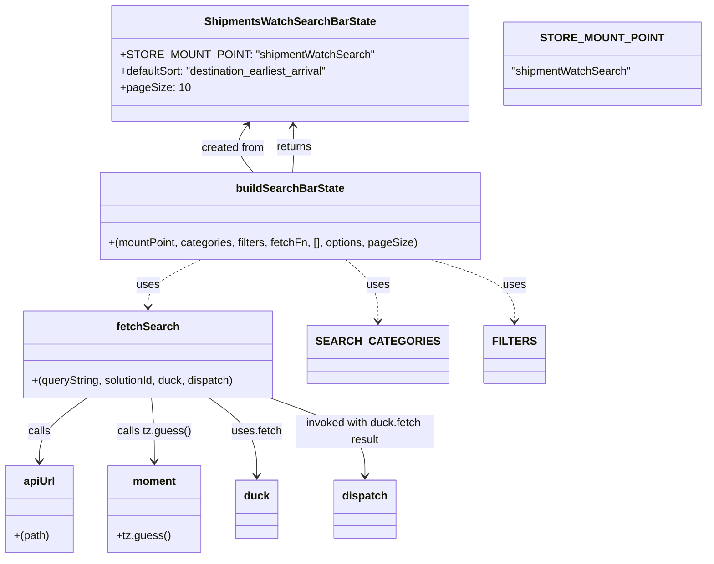

# Diagram: web/portal/src/pages/shipments/redux/ShipmentsWatchSearchBarState.js

> Auto-generated by Obscura crawlers

## Mermaid

### SVG

<svg id="container" width="984.20703125" xmlns="http://www.w3.org/2000/svg" class="classDiagram" height="808" viewBox="0 0 984.20703125 808" role="graphics-document document" aria-roledescription="class"><g><defs><marker id="container_class-aggregationStart" class="marker aggregation class" refX="18" refY="7" markerWidth="190" markerHeight="240" orient="auto"><path d="M 18,7 L9,13 L1,7 L9,1 Z"></path></marker></defs><defs><marker id="container_class-aggregationEnd" class="marker aggregation class" refX="1" refY="7" markerWidth="20" markerHeight="28" orient="auto"><path d="M 18,7 L9,13 L1,7 L9,1 Z"></path></marker></defs><defs><marker id="container_class-extensionStart" class="marker extension class" refX="18" refY="7" markerWidth="190" markerHeight="240" orient="auto"><path d="M 1,7 L18,13 V 1 Z"></path></marker></defs><defs><marker id="container_class-extensionEnd" class="marker extension class" refX="1" refY="7" markerWidth="20" markerHeight="28" orient="auto"><path d="M 1,1 V 13 L18,7 Z"></path></marker></defs><defs><marker id="container_class-compositionStart" class="marker composition class" refX="18" refY="7" markerWidth="190" markerHeight="240" orient="auto"><path d="M 18,7 L9,13 L1,7 L9,1 Z"></path></marker></defs><defs><marker id="container_class-compositionEnd" class="marker composition class" refX="1" refY="7" markerWidth="20" markerHeight="28" orient="auto"><path d="M 18,7 L9,13 L1,7 L9,1 Z"></path></marker></defs><defs><marker id="container_class-dependencyStart" class="marker dependency class" refX="6" refY="7" markerWidth="190" markerHeight="240" orient="auto"><path d="M 5,7 L9,13 L1,7 L9,1 Z"></path></marker></defs><defs><marker id="container_class-dependencyEnd" class="marker dependency class" refX="13" refY="7" markerWidth="20" markerHeight="28" orient="auto"><path d="M 18,7 L9,13 L14,7 L9,1 Z"></path></marker></defs><defs><marker id="container_class-lollipopStart" class="marker lollipop class" refX="13" refY="7" markerWidth="190" markerHeight="240" orient="auto"><circle stroke="black" fill="transparent" cx="7" cy="7" r="6"></circle></marker></defs><defs><marker id="container_class-lollipopEnd" class="marker lollipop class" refX="1" refY="7" markerWidth="190" markerHeight="240" orient="auto"><circle stroke="black" fill="transparent" cx="7" cy="7" r="6"></circle></marker></defs><g class="root"><g class="clusters"></g><g class="edgePaths"><path d="M412.853,250L413.696,243.833C414.539,237.667,416.224,225.333,416.483,213.994C416.741,202.654,415.573,192.308,414.988,187.135L414.404,181.962" id="id_buildSearchBarState_ShipmentsWatchSearchBarState_1" class="edge-thickness-normal edge-pattern-solid relation" style=";;;" data-edge="true" data-et="edge" data-id="id_buildSearchBarState_ShipmentsWatchSearchBarState_1" data-points="W3sieCI6NDEyLjg1MzAwNzgxMjUsInkiOjI1MH0seyJ4Ijo0MTcuOTEwMTU2MjUsInkiOjIxM30seyJ4Ijo0MTMuNzMwNjk0NzMxNDA1LCJ5IjoxNzZ9XQ==" marker-end="url(#container_class-dependencyEnd)"></path><path d="M484.733,376L492.612,382.167C500.491,388.333,516.248,400.667,524.127,415.5C532.006,430.333,532.006,447.667,532.006,456.333L532.006,465" id="id_buildSearchBarState_SEARCH_CATEGORIES_2" class="edge-thickness-normal edge-pattern-dashed relation" style=";;;" data-edge="true" data-et="edge" data-id="id_buildSearchBarState_SEARCH_CATEGORIES_2" data-points="W3sieCI6NDg0LjczMzMwMDc4MTI1LCJ5IjozNzZ9LHsieCI6NTMyLjAwNTg1OTM3NSwieSI6NDEzfSx7IngiOjUzMi4wMDU4NTkzNzUsInkiOjQ3MX1d" marker-end="url(#container_class-dependencyEnd)"></path><path d="M596.672,376L615.507,382.167C634.343,388.333,672.014,400.667,690.85,415.5C709.686,430.333,709.686,447.667,709.686,456.333L709.686,465" id="id_buildSearchBarState_FILTERS_3" class="edge-thickness-normal edge-pattern-dashed relation" style=";;;" data-edge="true" data-et="edge" data-id="id_buildSearchBarState_FILTERS_3" data-points="W3sieCI6NTk2LjY3MTUwMzkwNjI1LCJ5IjozNzZ9LHsieCI6NzA5LjY4NTU0Njg3NSwieSI6NDEzfSx7IngiOjcwOS42ODU1NDY4NzUsInkiOjQ3MX1d" marker-end="url(#container_class-dependencyEnd)"></path><path d="M282.594,376L270.687,382.167C258.78,388.333,234.965,400.667,223.058,412C211.15,423.333,211.15,433.667,211.15,438.833L211.15,444" id="id_buildSearchBarState_fetchSearch_4" class="edge-thickness-normal edge-pattern-dashed relation" style=";;;" data-edge="true" data-et="edge" data-id="id_buildSearchBarState_fetchSearch_4" data-points="W3sieCI6MjgyLjU5NDM1NTQ2ODc1LCJ5IjozNzZ9LHsieCI6MjExLjE1MDM5MDYyNSwieSI6NDEzfSx7IngiOjIxMS4xNTAzOTA2MjUsInkiOjQ1MH1d" marker-end="url(#container_class-dependencyEnd)"></path><path d="M124.377,576L113.129,584.167C101.88,592.333,79.384,608.667,68.135,624C56.887,639.333,56.887,653.667,56.887,660.833L56.887,668" id="id_fetchSearch_apiUrl_5" class="edge-thickness-normal edge-pattern-solid relation" style=";;;" data-edge="true" data-et="edge" data-id="id_fetchSearch_apiUrl_5" data-points="W3sieCI6MTI0LjM3NzA3NTE5NTMxMjUsInkiOjU3Nn0seyJ4Ijo1Ni44ODY3MTg3NSwieSI6NjI1fSx7IngiOjU2Ljg4NjcxODc1LCJ5Ijo2NzR9XQ==" marker-end="url(#container_class-dependencyEnd)"></path><path d="M216.568,576L217.27,584.167C217.972,592.333,219.377,608.667,220.079,624C220.781,639.333,220.781,653.667,220.781,660.833L220.781,668" id="id_fetchSearch_moment_6" class="edge-thickness-normal edge-pattern-solid relation" style=";;;" data-edge="true" data-et="edge" data-id="id_fetchSearch_moment_6" data-points="W3sieCI6MjE2LjU2Nzc0OTAyMzQzNzUsInkiOjU3Nn0seyJ4IjoyMjAuNzgxMjUsInkiOjYyNX0seyJ4IjoyMjAuNzgxMjUsInkiOjY3NH1d" marker-end="url(#container_class-dependencyEnd)"></path><path d="M297.924,576L309.172,584.167C320.42,592.333,342.917,608.667,354.166,627.5C365.414,646.333,365.414,667.667,365.414,678.333L365.414,689" id="id_fetchSearch_duck_7" class="edge-thickness-normal edge-pattern-solid relation" style=";;;" data-edge="true" data-et="edge" data-id="id_fetchSearch_duck_7" data-points="W3sieCI6Mjk3LjkyMzcwNjA1NDY4NzUsInkiOjU3Nn0seyJ4IjozNjUuNDE0MDYyNSwieSI6NjI1fSx7IngiOjM2NS40MTQwNjI1LCJ5Ijo2OTV9XQ==" marker-end="url(#container_class-dependencyEnd)"></path><path d="M385.977,576L408.64,584.167C431.302,592.333,476.628,608.667,499.29,627.5C521.953,646.333,521.953,667.667,521.953,678.333L521.953,689" id="id_fetchSearch_dispatch_8" class="edge-thickness-normal edge-pattern-solid relation" style=";;;" data-edge="true" data-et="edge" data-id="id_fetchSearch_dispatch_8" data-points="W3sieCI6Mzg1Ljk3NjkyODcxMDkzNzUsInkiOjU3Nn0seyJ4Ijo1MjEuOTUzMTI1LCJ5Ijo2MjV9LHsieCI6NTIxLjk1MzEyNSwieSI6Njk1fV0=" marker-end="url(#container_class-dependencyEnd)"></path><path d="M346.122,181.024L342.643,186.353C339.163,191.683,332.205,202.341,333.597,213.837C334.989,225.333,344.732,237.667,349.603,243.833L354.475,250" id="id_ShipmentsWatchSearchBarState_buildSearchBarState_9" class="edge-thickness-normal edge-pattern-solid relation" style=";;;" data-edge="true" data-et="edge" data-id="id_ShipmentsWatchSearchBarState_buildSearchBarState_9" data-points="W3sieCI6MzQ5LjQwMTkyNDA3MDI0Nzk2LCJ5IjoxNzZ9LHsieCI6MzI1LjI0NjA5Mzc1LCJ5IjoyMTN9LHsieCI6MzU0LjQ3NDY0ODQzNzUsInkiOjI1MH1d" marker-start="url(#container_class-dependencyStart)"></path></g><g class="edgeLabels"><g class="edgeLabel" transform="translate(417.9028, 213.05385)"><g class="label" data-id="id_buildSearchBarState_ShipmentsWatchSearchBarState_1" transform="translate(-26.265625, -12)"><foreignObject width="52.53125" height="24">

returns

</foreignObject></g></g><g class="edgeLabel" transform="translate(532.005859375, 413)"><g class="label" data-id="id_buildSearchBarState_SEARCH_CATEGORIES_2" transform="translate(-16.4921875, -12)"><foreignObject width="32.984375" height="24">

uses

</foreignObject></g></g><g class="edgeLabel" transform="translate(709.685546875, 413)"><g class="label" data-id="id_buildSearchBarState_FILTERS_3" transform="translate(-16.4921875, -12)"><foreignObject width="32.984375" height="24">

uses

</foreignObject></g></g><g class="edgeLabel" transform="translate(211.150390625, 413)"><g class="label" data-id="id_buildSearchBarState_fetchSearch_4" transform="translate(-16.4921875, -12)"><foreignObject width="32.984375" height="24">

uses

</foreignObject></g></g><g class="edgeLabel" transform="translate(56.88671875, 625)"><g class="label" data-id="id_fetchSearch_apiUrl_5" transform="translate(-16.4453125, -12)"><foreignObject width="32.890625" height="24">

calls

</foreignObject></g></g><g class="edgeLabel" transform="translate(220.78125, 625)"><g class="label" data-id="id_fetchSearch_moment_6" transform="translate(-52.4609375, -12)"><foreignObject width="104.921875" height="24">

calls tz.guess()

</foreignObject></g></g><g class="edgeLabel" transform="translate(365.4140625, 625)"><g class="label" data-id="id_fetchSearch_duck_7" transform="translate(-36.5390625, -12)"><foreignObject width="73.078125" height="24">

uses.fetch

</foreignObject></g></g><g class="edgeLabel" transform="translate(521.953125, 625)"><g class="label" data-id="id_fetchSearch_dispatch_8" transform="translate(-100, -24)"><foreignObject width="200" height="48">

invoked with duck.fetch result

</foreignObject></g></g><g class="edgeLabel" transform="translate(326.16501, 214.16324)"><g class="label" data-id="id_ShipmentsWatchSearchBarState_buildSearchBarState_9" transform="translate(-46.3984375, -12)"><foreignObject width="92.796875" height="24">

created from

</foreignObject></g></g></g><g class="nodes"><g class="node default" id="classId-ShipmentsWatchSearchBarState-0" transform="translate(404.2421875, 92)"><g class="basic label-container"><path d="M-244.44921875 -84 L244.44921875 -84 L244.44921875 84 L-244.44921875 84" stroke="none" stroke-width="0" fill="#ECECFF" style=""></path><path d="M-244.44921875 -84 C-76.48338657817888 -84, 91.48244559364224 -84, 244.44921875 -84 M-244.44921875 -84 C-109.73467039405412 -84, 24.97987796189176 -84, 244.44921875 -84 M244.44921875 -84 C244.44921875 -18.298321375125383, 244.44921875 47.403357249749234, 244.44921875 84 M244.44921875 -84 C244.44921875 -43.185177734614065, 244.44921875 -2.37035546922813, 244.44921875 84 M244.44921875 84 C146.10212343480322 84, 47.75502811960641 84, -244.44921875 84 M244.44921875 84 C77.78273319505814 84, -88.88375235988372 84, -244.44921875 84 M-244.44921875 84 C-244.44921875 27.03974112372888, -244.44921875 -29.92051775254224, -244.44921875 -84 M-244.44921875 84 C-244.44921875 33.72339291557056, -244.44921875 -16.553214168858887, -244.44921875 -84" stroke="#9370DB" stroke-width="1.3" fill="none" stroke-dasharray="0 0" style=""></path></g><g class="annotation-group text" transform="translate(0, -60)"></g><g class="label-group text" transform="translate(-117.8359375, -60)"><g class="label" style="font-weight: bolder" transform="translate(0,-12)"><foreignObject width="235.671875" height="24">

ShipmentsWatchSearchBarState

</foreignObject></g></g><g class="members-group text" transform="translate(-232.44921875, -12)"><g class="label" style="" transform="translate(0,-12)"><foreignObject width="347.0625" height="24">

+STORE_MOUNT_POINT: "shipmentWatchSearch"

</foreignObject></g><g class="label" style="" transform="translate(0,12)"><foreignObject width="310.453125" height="24">

+defaultSort: "destination_earliest_arrival"

</foreignObject></g><g class="label" style="" transform="translate(0,36)"><foreignObject width="95.4375" height="24">

+pageSize: 10

</foreignObject></g></g><g class="methods-group text" transform="translate(-232.44921875, 84)"></g><g class="divider" style=""><path d="M-244.44921875 -36 C-69.06188402345532 -36, 106.32545070308936 -36, 244.44921875 -36 M-244.44921875 -36 C-51.98609948299833 -36, 140.47701978400335 -36, 244.44921875 -36" stroke="#9370DB" stroke-width="1.3" fill="none" stroke-dasharray="0 0" style=""></path></g><g class="divider" style=""><path d="M-244.44921875 60 C-55.59303452626176 60, 133.26314969747648 60, 244.44921875 60 M-244.44921875 60 C-79.81197411058616 60, 84.82527052882767 60, 244.44921875 60" stroke="#9370DB" stroke-width="1.3" fill="none" stroke-dasharray="0 0" style=""></path></g></g><g class="node default" id="classId-buildSearchBarState-1" transform="translate(404.2421875, 313)"><g class="basic label-container"><path d="M-275.0625 -63 L275.0625 -63 L275.0625 63 L-275.0625 63" stroke="none" stroke-width="0" fill="#ECECFF" style=""></path><path d="M-275.0625 -63 C-158.7074582503018 -63, -42.352416500603624 -63, 275.0625 -63 M-275.0625 -63 C-101.53171378585182 -63, 71.99907242829636 -63, 275.0625 -63 M275.0625 -63 C275.0625 -25.339190962257824, 275.0625 12.321618075484352, 275.0625 63 M275.0625 -63 C275.0625 -14.918201347965734, 275.0625 33.16359730406853, 275.0625 63 M275.0625 63 C71.39988564500294 63, -132.26272870999412 63, -275.0625 63 M275.0625 63 C132.61525131747862 63, -9.831997365042753 63, -275.0625 63 M-275.0625 63 C-275.0625 37.20247522416192, -275.0625 11.404950448323845, -275.0625 -63 M-275.0625 63 C-275.0625 29.42708292992249, -275.0625 -4.145834140155017, -275.0625 -63" stroke="#9370DB" stroke-width="1.3" fill="none" stroke-dasharray="0 0" style=""></path></g><g class="annotation-group text" transform="translate(0, -39)"></g><g class="label-group text" transform="translate(-75.296875, -39)"><g class="label" style="font-weight: bolder" transform="translate(0,-12)"><foreignObject width="150.59375" height="24">

buildSearchBarState

</foreignObject></g></g><g class="members-group text" transform="translate(-263.0625, 9)"></g><g class="methods-group text" transform="translate(-263.0625, 39)"><g class="label" style="" transform="translate(0,-12)"><foreignObject width="450.828125" height="24">

+(mountPoint, categories, filters, fetchFn, [], options, pageSize)

</foreignObject></g></g><g class="divider" style=""><path d="M-275.0625 -15 C-110.36109201027551 -15, 54.340315979448974 -15, 275.0625 -15 M-275.0625 -15 C-60.358353441719004 -15, 154.345793116562 -15, 275.0625 -15" stroke="#9370DB" stroke-width="1.3" fill="none" stroke-dasharray="0 0" style=""></path></g><g class="divider" style=""><path d="M-275.0625 9 C-63.02584924210575 9, 149.0108015157885 9, 275.0625 9 M-275.0625 9 C-117.23922353967333 9, 40.584052920653335 9, 275.0625 9" stroke="#9370DB" stroke-width="1.3" fill="none" stroke-dasharray="0 0" style=""></path></g></g><g class="node default" id="classId-fetchSearch-2" transform="translate(211.150390625, 513)"><g class="basic label-container"><path d="M-182.73828125 -63 L182.73828125 -63 L182.73828125 63 L-182.73828125 63" stroke="none" stroke-width="0" fill="#ECECFF" style=""></path><path d="M-182.73828125 -63 C-79.62325973013382 -63, 23.49176178973235 -63, 182.73828125 -63 M-182.73828125 -63 C-56.970106437842276 -63, 68.79806837431545 -63, 182.73828125 -63 M182.73828125 -63 C182.73828125 -28.536855820698904, 182.73828125 5.926288358602193, 182.73828125 63 M182.73828125 -63 C182.73828125 -33.91670654382594, 182.73828125 -4.833413087651884, 182.73828125 63 M182.73828125 63 C70.73281476995439 63, -41.272651710091225 63, -182.73828125 63 M182.73828125 63 C76.65019455922311 63, -29.43789213155378 63, -182.73828125 63 M-182.73828125 63 C-182.73828125 31.730870671086883, -182.73828125 0.4617413421737666, -182.73828125 -63 M-182.73828125 63 C-182.73828125 16.423039634021265, -182.73828125 -30.15392073195747, -182.73828125 -63" stroke="#9370DB" stroke-width="1.3" fill="none" stroke-dasharray="0 0" style=""></path></g><g class="annotation-group text" transform="translate(0, -39)"></g><g class="label-group text" transform="translate(-43.2890625, -39)"><g class="label" style="font-weight: bolder" transform="translate(0,-12)"><foreignObject width="86.578125" height="24">

fetchSearch

</foreignObject></g></g><g class="members-group text" transform="translate(-170.73828125, 9)"></g><g class="methods-group text" transform="translate(-170.73828125, 39)"><g class="label" style="" transform="translate(0,-12)"><foreignObject width="298.1875" height="24">

+(queryString, solutionId, duck, dispatch)

</foreignObject></g></g><g class="divider" style=""><path d="M-182.73828125 -15 C-76.12722492947628 -15, 30.48383139104743 -15, 182.73828125 -15 M-182.73828125 -15 C-47.70013640847415 -15, 87.3380084330517 -15, 182.73828125 -15" stroke="#9370DB" stroke-width="1.3" fill="none" stroke-dasharray="0 0" style=""></path></g><g class="divider" style=""><path d="M-182.73828125 9 C-72.03485106365292 9, 38.668579122694155 9, 182.73828125 9 M-182.73828125 9 C-70.66175459931509 9, 41.41477205136982 9, 182.73828125 9" stroke="#9370DB" stroke-width="1.3" fill="none" stroke-dasharray="0 0" style=""></path></g></g><g class="node default" id="classId-apiUrl-3" transform="translate(56.88671875, 737)"><g class="basic label-container"><path d="M-48.88671875 -63 L48.88671875 -63 L48.88671875 63 L-48.88671875 63" stroke="none" stroke-width="0" fill="#ECECFF" style=""></path><path d="M-48.88671875 -63 C-25.98668955264178 -63, -3.0866603552835628 -63, 48.88671875 -63 M-48.88671875 -63 C-27.744845151354006 -63, -6.602971552708013 -63, 48.88671875 -63 M48.88671875 -63 C48.88671875 -19.53600347333804, 48.88671875 23.927993053323917, 48.88671875 63 M48.88671875 -63 C48.88671875 -35.83541168144329, 48.88671875 -8.67082336288658, 48.88671875 63 M48.88671875 63 C25.25839604874035 63, 1.6300733474807032 63, -48.88671875 63 M48.88671875 63 C23.037232377438112 63, -2.8122539951237755 63, -48.88671875 63 M-48.88671875 63 C-48.88671875 27.966220337349007, -48.88671875 -7.0675593253019855, -48.88671875 -63 M-48.88671875 63 C-48.88671875 26.42428891631215, -48.88671875 -10.1514221673757, -48.88671875 -63" stroke="#9370DB" stroke-width="1.3" fill="none" stroke-dasharray="0 0" style=""></path></g><g class="annotation-group text" transform="translate(0, -39)"></g><g class="label-group text" transform="translate(-22.2109375, -39)"><g class="label" style="font-weight: bolder" transform="translate(0,-12)"><foreignObject width="44.421875" height="24">

apiUrl

</foreignObject></g></g><g class="members-group text" transform="translate(-36.88671875, 9)"></g><g class="methods-group text" transform="translate(-36.88671875, 39)"><g class="label" style="" transform="translate(0,-12)"><foreignObject width="51.5625" height="24">

+(path)

</foreignObject></g></g><g class="divider" style=""><path d="M-48.88671875 -15 C-28.053841815107962 -15, -7.220964880215924 -15, 48.88671875 -15 M-48.88671875 -15 C-14.641231019304406 -15, 19.604256711391187 -15, 48.88671875 -15" stroke="#9370DB" stroke-width="1.3" fill="none" stroke-dasharray="0 0" style=""></path></g><g class="divider" style=""><path d="M-48.88671875 9 C-22.624391711154942 9, 3.6379353276901156 9, 48.88671875 9 M-48.88671875 9 C-14.150281593385742 9, 20.586155563228516 9, 48.88671875 9" stroke="#9370DB" stroke-width="1.3" fill="none" stroke-dasharray="0 0" style=""></path></g></g><g class="node default" id="classId-moment-4" transform="translate(220.78125, 737)"><g class="basic label-container"><path d="M-65.0078125 -63 L65.0078125 -63 L65.0078125 63 L-65.0078125 63" stroke="none" stroke-width="0" fill="#ECECFF" style=""></path><path d="M-65.0078125 -63 C-29.716217881570074 -63, 5.575376736859852 -63, 65.0078125 -63 M-65.0078125 -63 C-23.7960022992997 -63, 17.415807901400598 -63, 65.0078125 -63 M65.0078125 -63 C65.0078125 -29.10231456803563, 65.0078125 4.7953708639287385, 65.0078125 63 M65.0078125 -63 C65.0078125 -35.23000649914654, 65.0078125 -7.460012998293081, 65.0078125 63 M65.0078125 63 C13.438197201953272 63, -38.131418096093455 63, -65.0078125 63 M65.0078125 63 C29.425173364229714 63, -6.157465771540572 63, -65.0078125 63 M-65.0078125 63 C-65.0078125 28.679696067641878, -65.0078125 -5.6406078647162445, -65.0078125 -63 M-65.0078125 63 C-65.0078125 14.921331153115268, -65.0078125 -33.15733769376946, -65.0078125 -63" stroke="#9370DB" stroke-width="1.3" fill="none" stroke-dasharray="0 0" style=""></path></g><g class="annotation-group text" transform="translate(0, -39)"></g><g class="label-group text" transform="translate(-30.3125, -39)"><g class="label" style="font-weight: bolder" transform="translate(0,-12)"><foreignObject width="60.625" height="24">

moment

</foreignObject></g></g><g class="members-group text" transform="translate(-53.0078125, 9)"></g><g class="methods-group text" transform="translate(-53.0078125, 39)"><g class="label" style="" transform="translate(0,-12)"><foreignObject width="75.703125" height="24">

+tz.guess()

</foreignObject></g></g><g class="divider" style=""><path d="M-65.0078125 -15 C-28.913687146428956 -15, 7.180438207142089 -15, 65.0078125 -15 M-65.0078125 -15 C-21.21927737000985 -15, 22.569257759980303 -15, 65.0078125 -15" stroke="#9370DB" stroke-width="1.3" fill="none" stroke-dasharray="0 0" style=""></path></g><g class="divider" style=""><path d="M-65.0078125 9 C-15.10351704354241 9, 34.80077841291518 9, 65.0078125 9 M-65.0078125 9 C-21.99140215345369 9, 21.025008193092617 9, 65.0078125 9" stroke="#9370DB" stroke-width="1.3" fill="none" stroke-dasharray="0 0" style=""></path></g></g><g class="node default" id="classId-SEARCH_CATEGORIES-5" transform="translate(532.005859375, 513)"><g class="basic label-container"><path d="M-88.1171875 -42 L88.1171875 -42 L88.1171875 42 L-88.1171875 42" stroke="none" stroke-width="0" fill="#ECECFF" style=""></path><path d="M-88.1171875 -42 C-21.034266196977725 -42, 46.04865510604455 -42, 88.1171875 -42 M-88.1171875 -42 C-31.96586686735533 -42, 24.18545376528934 -42, 88.1171875 -42 M88.1171875 -42 C88.1171875 -12.254023893267387, 88.1171875 17.491952213465225, 88.1171875 42 M88.1171875 -42 C88.1171875 -12.935004000657432, 88.1171875 16.129991998685135, 88.1171875 42 M88.1171875 42 C29.871883642078295 42, -28.37342021584341 42, -88.1171875 42 M88.1171875 42 C32.796747176828404 42, -22.52369314634319 42, -88.1171875 42 M-88.1171875 42 C-88.1171875 24.1797383457313, -88.1171875 6.3594766914626035, -88.1171875 -42 M-88.1171875 42 C-88.1171875 9.562341203458693, -88.1171875 -22.875317593082613, -88.1171875 -42" stroke="#9370DB" stroke-width="1.3" fill="none" stroke-dasharray="0 0" style=""></path></g><g class="annotation-group text" transform="translate(0, -18)"></g><g class="label-group text" transform="translate(-76.1171875, -18)"><g class="label" style="font-weight: bolder" transform="translate(0,-12)"><foreignObject width="152.234375" height="24">

SEARCH_CATEGORIES

</foreignObject></g></g><g class="members-group text" transform="translate(-76.1171875, 30)"></g><g class="methods-group text" transform="translate(-76.1171875, 60)"></g><g class="divider" style=""><path d="M-88.1171875 6 C-49.313406841922934 6, -10.509626183845867 6, 88.1171875 6 M-88.1171875 6 C-45.62540053387933 6, -3.1336135677586583 6, 88.1171875 6" stroke="#9370DB" stroke-width="1.3" fill="none" stroke-dasharray="0 0" style=""></path></g><g class="divider" style=""><path d="M-88.1171875 24 C-28.194670804697054 24, 31.72784589060589 24, 88.1171875 24 M-88.1171875 24 C-28.796342251737286 24, 30.524502996525428 24, 88.1171875 24" stroke="#9370DB" stroke-width="1.3" fill="none" stroke-dasharray="0 0" style=""></path></g></g><g class="node default" id="classId-FILTERS-6" transform="translate(709.685546875, 513)"><g class="basic label-container"><path d="M-39.5625 -42 L39.5625 -42 L39.5625 42 L-39.5625 42" stroke="none" stroke-width="0" fill="#ECECFF" style=""></path><path d="M-39.5625 -42 C-17.654046756453408 -42, 4.254406487093185 -42, 39.5625 -42 M-39.5625 -42 C-16.75538883549938 -42, 6.051722329001237 -42, 39.5625 -42 M39.5625 -42 C39.5625 -17.914549777759596, 39.5625 6.170900444480807, 39.5625 42 M39.5625 -42 C39.5625 -9.21268134000605, 39.5625 23.5746373199879, 39.5625 42 M39.5625 42 C13.375411467150862 42, -12.811677065698277 42, -39.5625 42 M39.5625 42 C9.79468113503005 42, -19.9731377299399 42, -39.5625 42 M-39.5625 42 C-39.5625 24.99663198387025, -39.5625 7.9932639677405035, -39.5625 -42 M-39.5625 42 C-39.5625 12.675991354002072, -39.5625 -16.648017291995856, -39.5625 -42" stroke="#9370DB" stroke-width="1.3" fill="none" stroke-dasharray="0 0" style=""></path></g><g class="annotation-group text" transform="translate(0, -18)"></g><g class="label-group text" transform="translate(-27.5625, -18)"><g class="label" style="font-weight: bolder" transform="translate(0,-12)"><foreignObject width="55.125" height="24">

FILTERS

</foreignObject></g></g><g class="members-group text" transform="translate(-27.5625, 30)"></g><g class="methods-group text" transform="translate(-27.5625, 60)"></g><g class="divider" style=""><path d="M-39.5625 6 C-14.616424710374254 6, 10.329650579251492 6, 39.5625 6 M-39.5625 6 C-7.992119960715716 6, 23.57826007856857 6, 39.5625 6" stroke="#9370DB" stroke-width="1.3" fill="none" stroke-dasharray="0 0" style=""></path></g><g class="divider" style=""><path d="M-39.5625 24 C-14.633176134934171 24, 10.296147730131658 24, 39.5625 24 M-39.5625 24 C-9.376272705459826 24, 20.80995458908035 24, 39.5625 24" stroke="#9370DB" stroke-width="1.3" fill="none" stroke-dasharray="0 0" style=""></path></g></g><g class="node default" id="classId-duck-7" transform="translate(365.4140625, 737)"><g class="basic label-container"><path d="M-29.625 -42 L29.625 -42 L29.625 42 L-29.625 42" stroke="none" stroke-width="0" fill="#ECECFF" style=""></path><path d="M-29.625 -42 C-11.80112206502018 -42, 6.022755869959639 -42, 29.625 -42 M-29.625 -42 C-11.411269734645945 -42, 6.80246053070811 -42, 29.625 -42 M29.625 -42 C29.625 -21.156803413173982, 29.625 -0.31360682634796433, 29.625 42 M29.625 -42 C29.625 -15.278412156782693, 29.625 11.443175686434614, 29.625 42 M29.625 42 C7.8102974675491055 42, -14.004405064901789 42, -29.625 42 M29.625 42 C8.553733316525136 42, -12.517533366949728 42, -29.625 42 M-29.625 42 C-29.625 20.74361094954614, -29.625 -0.5127781009077168, -29.625 -42 M-29.625 42 C-29.625 13.167462078569827, -29.625 -15.665075842860347, -29.625 -42" stroke="#9370DB" stroke-width="1.3" fill="none" stroke-dasharray="0 0" style=""></path></g><g class="annotation-group text" transform="translate(0, -18)"></g><g class="label-group text" transform="translate(-17.625, -18)"><g class="label" style="font-weight: bolder" transform="translate(0,-12)"><foreignObject width="35.25" height="24">

duck

</foreignObject></g></g><g class="members-group text" transform="translate(-17.625, 30)"></g><g class="methods-group text" transform="translate(-17.625, 60)"></g><g class="divider" style=""><path d="M-29.625 6 C-16.522763825342977 6, -3.4205276506859583 6, 29.625 6 M-29.625 6 C-6.111164791089866 6, 17.402670417820268 6, 29.625 6" stroke="#9370DB" stroke-width="1.3" fill="none" stroke-dasharray="0 0" style=""></path></g><g class="divider" style=""><path d="M-29.625 24 C-15.768739194922647 24, -1.912478389845294 24, 29.625 24 M-29.625 24 C-15.286323786039725 24, -0.9476475720794504 24, 29.625 24" stroke="#9370DB" stroke-width="1.3" fill="none" stroke-dasharray="0 0" style=""></path></g></g><g class="node default" id="classId-dispatch-8" transform="translate(521.953125, 737)"><g class="basic label-container"><path d="M-43.3984375 -42 L43.3984375 -42 L43.3984375 42 L-43.3984375 42" stroke="none" stroke-width="0" fill="#ECECFF" style=""></path><path d="M-43.3984375 -42 C-12.981683938854435 -42, 17.43506962229113 -42, 43.3984375 -42 M-43.3984375 -42 C-20.60861829903971 -42, 2.181200901920583 -42, 43.3984375 -42 M43.3984375 -42 C43.3984375 -8.426777468305772, 43.3984375 25.146445063388455, 43.3984375 42 M43.3984375 -42 C43.3984375 -14.458541120380193, 43.3984375 13.082917759239614, 43.3984375 42 M43.3984375 42 C10.785186688290587 42, -21.828064123418827 42, -43.3984375 42 M43.3984375 42 C19.10568936717111 42, -5.187058765657781 42, -43.3984375 42 M-43.3984375 42 C-43.3984375 16.872017183700173, -43.3984375 -8.255965632599654, -43.3984375 -42 M-43.3984375 42 C-43.3984375 19.771386677672847, -43.3984375 -2.4572266446543054, -43.3984375 -42" stroke="#9370DB" stroke-width="1.3" fill="none" stroke-dasharray="0 0" style=""></path></g><g class="annotation-group text" transform="translate(0, -18)"></g><g class="label-group text" transform="translate(-31.3984375, -18)"><g class="label" style="font-weight: bolder" transform="translate(0,-12)"><foreignObject width="62.796875" height="24">

dispatch

</foreignObject></g></g><g class="members-group text" transform="translate(-31.3984375, 30)"></g><g class="methods-group text" transform="translate(-31.3984375, 60)"></g><g class="divider" style=""><path d="M-43.3984375 6 C-22.90162833936619 6, -2.4048191787323816 6, 43.3984375 6 M-43.3984375 6 C-10.662372025193427 6, 22.073693449613145 6, 43.3984375 6" stroke="#9370DB" stroke-width="1.3" fill="none" stroke-dasharray="0 0" style=""></path></g><g class="divider" style=""><path d="M-43.3984375 24 C-10.59989568468417 24, 22.19864613063166 24, 43.3984375 24 M-43.3984375 24 C-25.074101634745702 24, -6.749765769491404 24, 43.3984375 24" stroke="#9370DB" stroke-width="1.3" fill="none" stroke-dasharray="0 0" style=""></path></g></g><g class="node default" id="classId-STORE_MOUNT_POINT-9" transform="translate(837.44921875, 92)"><g class="basic label-container"><path d="M-138.7578125 -60 L138.7578125 -60 L138.7578125 60 L-138.7578125 60" stroke="none" stroke-width="0" fill="#ECECFF" style=""></path><path d="M-138.7578125 -60 C-61.258039540017776 -60, 16.241733419964447 -60, 138.7578125 -60 M-138.7578125 -60 C-41.51001377081927 -60, 55.73778495836146 -60, 138.7578125 -60 M138.7578125 -60 C138.7578125 -27.06003873200079, 138.7578125 5.879922535998418, 138.7578125 60 M138.7578125 -60 C138.7578125 -29.33182946259441, 138.7578125 1.3363410748111804, 138.7578125 60 M138.7578125 60 C51.202564360733476 60, -36.35268377853305 60, -138.7578125 60 M138.7578125 60 C60.449017262828846 60, -17.859777974342308 60, -138.7578125 60 M-138.7578125 60 C-138.7578125 20.840362780862776, -138.7578125 -18.319274438274448, -138.7578125 -60 M-138.7578125 60 C-138.7578125 19.570613989878012, -138.7578125 -20.858772020243975, -138.7578125 -60" stroke="#9370DB" stroke-width="1.3" fill="none" stroke-dasharray="0 0" style=""></path></g><g class="annotation-group text" transform="translate(0, -36)"></g><g class="label-group text" transform="translate(-79.90625, -36)"><g class="label" style="font-weight: bolder" transform="translate(0,-12)"><foreignObject width="159.8125" height="24">

STORE_MOUNT_POINT

</foreignObject></g></g><g class="members-group text" transform="translate(-126.7578125, 12)"><g class="label" style="" transform="translate(0,-12)"><foreignObject width="173.609375" height="24">

"shipmentWatchSearch"

</foreignObject></g></g><g class="methods-group text" transform="translate(-126.7578125, 60)"></g><g class="divider" style=""><path d="M-138.7578125 -12 C-62.441396929986226 -12, 13.875018640027548 -12, 138.7578125 -12 M-138.7578125 -12 C-73.4708280764508 -12, -8.1838436529016 -12, 138.7578125 -12" stroke="#9370DB" stroke-width="1.3" fill="none" stroke-dasharray="0 0" style=""></path></g><g class="divider" style=""><path d="M-138.7578125 36 C-66.33627082236708 36, 6.085270855265833 36, 138.7578125 36 M-138.7578125 36 C-76.8098332366286 36, -14.861853973257226 36, 138.7578125 36" stroke="#9370DB" stroke-width="1.3" fill="none" stroke-dasharray="0 0" style=""></path></g></g></g></g></g></svg>
