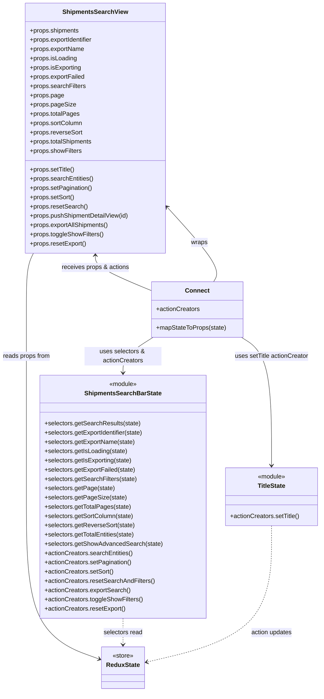

# Diagram: web/portal/src/pages/shipments/search/Shipments.Search.page.container.js

> Auto-generated by Obscura crawlers

## Mermaid

### SVG

<svg id="container" width="828.046875" xmlns="http://www.w3.org/2000/svg" class="classDiagram" height="1792" viewBox="0 0 828.046875 1792" role="graphics-document document" aria-roledescription="class"><g><defs><marker id="container_class-aggregationStart" class="marker aggregation class" refX="18" refY="7" markerWidth="190" markerHeight="240" orient="auto"><path d="M 18,7 L9,13 L1,7 L9,1 Z"></path></marker></defs><defs><marker id="container_class-aggregationEnd" class="marker aggregation class" refX="1" refY="7" markerWidth="20" markerHeight="28" orient="auto"><path d="M 18,7 L9,13 L1,7 L9,1 Z"></path></marker></defs><defs><marker id="container_class-extensionStart" class="marker extension class" refX="18" refY="7" markerWidth="190" markerHeight="240" orient="auto"><path d="M 1,7 L18,13 V 1 Z"></path></marker></defs><defs><marker id="container_class-extensionEnd" class="marker extension class" refX="1" refY="7" markerWidth="20" markerHeight="28" orient="auto"><path d="M 1,1 V 13 L18,7 Z"></path></marker></defs><defs><marker id="container_class-compositionStart" class="marker composition class" refX="18" refY="7" markerWidth="190" markerHeight="240" orient="auto"><path d="M 18,7 L9,13 L1,7 L9,1 Z"></path></marker></defs><defs><marker id="container_class-compositionEnd" class="marker composition class" refX="1" refY="7" markerWidth="20" markerHeight="28" orient="auto"><path d="M 18,7 L9,13 L1,7 L9,1 Z"></path></marker></defs><defs><marker id="container_class-dependencyStart" class="marker dependency class" refX="6" refY="7" markerWidth="190" markerHeight="240" orient="auto"><path d="M 5,7 L9,13 L1,7 L9,1 Z"></path></marker></defs><defs><marker id="container_class-dependencyEnd" class="marker dependency class" refX="13" refY="7" markerWidth="20" markerHeight="28" orient="auto"><path d="M 18,7 L9,13 L14,7 L9,1 Z"></path></marker></defs><defs><marker id="container_class-lollipopStart" class="marker lollipop class" refX="13" refY="7" markerWidth="190" markerHeight="240" orient="auto"><circle stroke="black" fill="transparent" cx="7" cy="7" r="6"></circle></marker></defs><defs><marker id="container_class-lollipopEnd" class="marker lollipop class" refX="1" refY="7" markerWidth="190" markerHeight="240" orient="auto"><circle stroke="black" fill="transparent" cx="7" cy="7" r="6"></circle></marker></defs><g class="root"><g class="clusters"></g><g class="edgePaths"><path d="M550.995,730L554.679,723.833C558.364,717.667,565.733,705.333,546.229,673.432C526.726,641.531,480.351,590.062,457.163,564.328L433.975,538.594" id="id_Connect_ShipmentsSearchView_1" class="edge-thickness-normal edge-pattern-solid relation" style=";;;" data-edge="true" data-et="edge" data-id="id_Connect_ShipmentsSearchView_1" data-points="W3sieCI6NTUwLjk5NDkxMTEyMzg1MzIsInkiOjczMH0seyJ4Ijo1NzMuMTAxNTYyNSwieSI6NjkzfSx7IngiOjQyOS45NTg5ODQzNzUsInkiOjUzNC4xMzYyNDI3MjcwMTYyfV0=" marker-end="url(#container_class-dependencyEnd)"></path><path d="M88.282,656L85.245,662.167C82.209,668.333,76.136,680.667,73.099,705C70.063,729.333,70.063,765.667,70.063,804C70.063,842.333,70.063,882.667,70.063,963.5C70.063,1044.333,70.063,1165.667,70.063,1285C70.063,1404.333,70.063,1521.667,101.232,1591.832C132.401,1661.998,194.739,1684.995,225.909,1696.494L257.078,1707.993" id="id_ShipmentsSearchView_ReduxState_2" class="edge-thickness-normal edge-pattern-solid relation" style=";;;" data-edge="true" data-et="edge" data-id="id_ShipmentsSearchView_ReduxState_2" data-points="W3sieCI6ODguMjgyMDQ1MzE2ODI4MjYsInkiOjY1Nn0seyJ4Ijo3MC4wNjI1LCJ5Ijo2OTN9LHsieCI6NzAuMDYyNSwieSI6ODAyfSx7IngiOjcwLjA2MjUsInkiOjkyM30seyJ4Ijo3MC4wNjI1LCJ5IjoxMjg3fSx7IngiOjcwLjA2MjUsInkiOjE2Mzl9LHsieCI6MjYyLjcwNzAzMTI1LCJ5IjoxNzEwLjA2OTgzNzA0Njg5MDZ9XQ==" marker-end="url(#container_class-dependencyEnd)"></path><path d="M394.177,874L381.269,882.167C368.362,890.333,342.546,906.667,329.638,922C316.73,937.333,316.73,951.667,316.73,958.833L316.73,966" id="id_Connect_ShipmentsSearchBarState_3" class="edge-thickness-normal edge-pattern-solid relation" style=";;;" data-edge="true" data-et="edge" data-id="id_Connect_ShipmentsSearchBarState_3" data-points="W3sieCI6Mzk0LjE3NzIzMzk4NzYwMzMsInkiOjg3NH0seyJ4IjozMTYuNzMwNDY4NzUsInkiOjkyM30seyJ4IjozMTYuNzMwNDY4NzUsInkiOjk3Mn1d" marker-end="url(#container_class-dependencyEnd)"></path><path d="M621.776,874L634.684,882.167C647.591,890.333,673.407,906.667,686.315,962C699.223,1017.333,699.223,1111.667,699.223,1158.833L699.223,1206" id="id_Connect_TitleState_4" class="edge-thickness-normal edge-pattern-solid relation" style=";;;" data-edge="true" data-et="edge" data-id="id_Connect_TitleState_4" data-points="W3sieCI6NjIxLjc3NTg5MTAxMjM5NjYsInkiOjg3NH0seyJ4Ijo2OTkuMjIyNjU2MjUsInkiOjkyM30seyJ4Ijo2OTkuMjIyNjU2MjUsInkiOjEyMTJ9XQ==" marker-end="url(#container_class-dependencyEnd)"></path><path d="M316.73,1602L316.73,1608.167C316.73,1614.333,316.73,1626.667,316.73,1638C316.73,1649.333,316.73,1659.667,316.73,1664.833L316.73,1670" id="id_ShipmentsSearchBarState_ReduxState_5" class="edge-thickness-normal edge-pattern-dashed relation" style=";;;" data-edge="true" data-et="edge" data-id="id_ShipmentsSearchBarState_ReduxState_5" data-points="W3sieCI6MzE2LjczMDQ2ODc1LCJ5IjoxNjAyfSx7IngiOjMxNi43MzA0Njg3NSwieSI6MTYzOX0seyJ4IjozMTYuNzMwNDY4NzUsInkiOjE2NzZ9XQ==" marker-end="url(#container_class-dependencyEnd)"></path><path d="M699.223,1362L699.223,1408.167C699.223,1454.333,699.223,1546.667,645.451,1605.626C591.679,1664.586,484.135,1690.172,430.363,1702.965L376.591,1715.758" id="id_TitleState_ReduxState_6" class="edge-thickness-normal edge-pattern-dashed relation" style=";;;" data-edge="true" data-et="edge" data-id="id_TitleState_ReduxState_6" data-points="W3sieCI6Njk5LjIyMjY1NjI1LCJ5IjoxMzYyfSx7IngiOjY5OS4yMjI2NTYyNSwieSI6MTYzOX0seyJ4IjozNzAuNzUzOTA2MjUsInkiOjE3MTcuMTQ3MTAyNjc3NzUwOH1d" marker-end="url(#container_class-dependencyEnd)"></path><path d="M247.826,662L247.826,667.167C247.826,672.333,247.826,682.667,271.59,697.79C295.353,712.913,342.88,732.826,366.643,742.783L390.406,752.739" id="id_ShipmentsSearchView_Connect_7" class="edge-thickness-normal edge-pattern-solid relation" style=";;;" data-edge="true" data-et="edge" data-id="id_ShipmentsSearchView_Connect_7" data-points="W3sieCI6MjQ3LjgyNjE3MTg3NSwieSI6NjU2fSx7IngiOjI0Ny44MjYxNzE4NzUsInkiOjY5M30seyJ4IjozOTAuNDA2MjUsInkiOjc1Mi43Mzk0MDEwMzc1NjA5fV0=" marker-start="url(#container_class-dependencyStart)"></path></g><g class="edgeLabels"><g class="edgeLabel" transform="translate(515.95602, 629.57823)"><g class="label" data-id="id_Connect_ShipmentsSearchView_1" transform="translate(-21.390625, -12)"><foreignObject width="42.78125" height="24">

wraps

</foreignObject></g></g><g class="edgeLabel" transform="translate(70.0625, 923)"><g class="label" data-id="id_ShipmentsSearchView_ReduxState_2" transform="translate(-62.0625, -12)"><foreignObject width="124.125" height="24">

reads props from

</foreignObject></g></g><g class="edgeLabel" transform="translate(316.73046875, 923)"><g class="label" data-id="id_Connect_ShipmentsSearchBarState_3" transform="translate(-100, -24)"><foreignObject width="200" height="48">

uses selectors &amp; actionCreators

</foreignObject></g></g><g class="edgeLabel" transform="translate(699.22265625, 923)"><g class="label" data-id="id_Connect_TitleState_4" transform="translate(-96.625, -12)"><foreignObject width="193.25" height="24">

uses setTitle actionCreator

</foreignObject></g></g><g class="edgeLabel" transform="translate(316.73046875, 1639)"><g class="label" data-id="id_ShipmentsSearchBarState_ReduxState_5" transform="translate(-51.1171875, -12)"><foreignObject width="102.234375" height="24">

selectors read

</foreignObject></g></g><g class="edgeLabel" transform="translate(699.22265625, 1639)"><g class="label" data-id="id_TitleState_ReduxState_6" transform="translate(-54.2109375, -12)"><foreignObject width="108.421875" height="24">

action updates

</foreignObject></g></g><g class="edgeLabel" transform="translate(247.826171875, 693)"><g class="label" data-id="id_ShipmentsSearchView_Connect_7" transform="translate(-88.859375, -12)"><foreignObject width="177.71875" height="24">

receives props &amp; actions

</foreignObject></g></g></g><g class="nodes"><g class="node default" id="classId-ShipmentsSearchView-0" transform="translate(247.826171875, 332)"><g class="basic label-container"><path d="M-182.1328125 -324 L182.1328125 -324 L182.1328125 324 L-182.1328125 324" stroke="none" stroke-width="0" fill="#ECECFF" style=""></path><path d="M-182.1328125 -324 C-42.629321411897905 -324, 96.87416967620419 -324, 182.1328125 -324 M-182.1328125 -324 C-40.125702211071314 -324, 101.88140807785737 -324, 182.1328125 -324 M182.1328125 -324 C182.1328125 -157.42476917364024, 182.1328125 9.150461652719514, 182.1328125 324 M182.1328125 -324 C182.1328125 -67.95426494462941, 182.1328125 188.09147011074117, 182.1328125 324 M182.1328125 324 C89.39481614022979 324, -3.3431802195404146 324, -182.1328125 324 M182.1328125 324 C92.71324458512132 324, 3.2936766702426326 324, -182.1328125 324 M-182.1328125 324 C-182.1328125 189.4512991180277, -182.1328125 54.90259823605538, -182.1328125 -324 M-182.1328125 324 C-182.1328125 129.5920893100382, -182.1328125 -64.81582137992359, -182.1328125 -324" stroke="#9370DB" stroke-width="1.3" fill="none" stroke-dasharray="0 0" style=""></path></g><g class="annotation-group text" transform="translate(0, -300)"></g><g class="label-group text" transform="translate(-80.90625, -300)"><g class="label" style="font-weight: bolder" transform="translate(0,-12)"><foreignObject width="161.8125" height="24">

ShipmentsSearchView

</foreignObject></g></g><g class="members-group text" transform="translate(-170.1328125, -252)"><g class="label" style="" transform="translate(0,-12)"><foreignObject width="129.34375" height="24">

+props.shipments

</foreignObject></g><g class="label" style="" transform="translate(0,12)"><foreignObject width="167.09375" height="24">

+props.exportIdentifier

</foreignObject></g><g class="label" style="" transform="translate(0,36)"><foreignObject width="142.390625" height="24">

+props.exportName

</foreignObject></g><g class="label" style="" transform="translate(0,60)"><foreignObject width="122.5625" height="24">

+props.isLoading

</foreignObject></g><g class="label" style="" transform="translate(0,84)"><foreignObject width="134.671875" height="24">

+props.isExporting

</foreignObject></g><g class="label" style="" transform="translate(0,108)"><foreignObject width="143.34375" height="24">

+props.exportFailed

</foreignObject></g><g class="label" style="" transform="translate(0,132)"><foreignObject width="145.03125" height="24">

+props.searchFilters

</foreignObject></g><g class="label" style="" transform="translate(0,156)"><foreignObject width="88.03125" height="24">

+props.page

</foreignObject></g><g class="label" style="" transform="translate(0,180)"><foreignObject width="116.859375" height="24">

+props.pageSize

</foreignObject></g><g class="label" style="" transform="translate(0,204)"><foreignObject width="127.859375" height="24">

+props.totalPages

</foreignObject></g><g class="label" style="" transform="translate(0,228)"><foreignObject width="137.25" height="24">

+props.sortColumn

</foreignObject></g><g class="label" style="" transform="translate(0,252)"><foreignObject width="136.375" height="24">

+props.reverseSort

</foreignObject></g><g class="label" style="" transform="translate(0,276)"><foreignObject width="163.8125" height="24">

+props.totalShipments

</foreignObject></g><g class="label" style="" transform="translate(0,300)"><foreignObject width="135.234375" height="24">

+props.showFilters

</foreignObject></g></g><g class="methods-group text" transform="translate(-170.1328125, 108)"><g class="label" style="" transform="translate(0,-12)"><foreignObject width="117.484375" height="24">

+props.setTitle()

</foreignObject></g><g class="label" style="" transform="translate(0,12)"><foreignObject width="165.78125" height="24">

+props.searchEntities()

</foreignObject></g><g class="label" style="" transform="translate(0,36)"><foreignObject width="162.625" height="24">

+props.setPagination()

</foreignObject></g><g class="label" style="" transform="translate(0,60)"><foreignObject width="115.765625" height="24">

+props.setSort()

</foreignObject></g><g class="label" style="" transform="translate(0,84)"><foreignObject width="148.8125" height="24">

+props.resetSearch()

</foreignObject></g><g class="label" style="" transform="translate(0,108)"><foreignObject width="259.359375" height="24">

+props.pushShipmentDetailView(id)

</foreignObject></g><g class="label" style="" transform="translate(0,132)"><foreignObject width="206.40625" height="24">

+props.exportAllShipments()

</foreignObject></g><g class="label" style="" transform="translate(0,156)"><foreignObject width="191.15625" height="24">

+props.toggleShowFilters()

</foreignObject></g><g class="label" style="" transform="translate(0,180)"><foreignObject width="147.21875" height="24">

+props.resetExport()

</foreignObject></g></g><g class="divider" style=""><path d="M-182.1328125 -276 C-43.976933629919785 -276, 94.17894524016043 -276, 182.1328125 -276 M-182.1328125 -276 C-80.32637156660935 -276, 21.480069366781294 -276, 182.1328125 -276" stroke="#9370DB" stroke-width="1.3" fill="none" stroke-dasharray="0 0" style=""></path></g><g class="divider" style=""><path d="M-182.1328125 84 C-84.90456604409663 84, 12.323680411806748 84, 182.1328125 84 M-182.1328125 84 C-79.49591217831801 84, 23.140988143363984 84, 182.1328125 84" stroke="#9370DB" stroke-width="1.3" fill="none" stroke-dasharray="0 0" style=""></path></g></g><g class="node default" id="classId-Connect-1" transform="translate(507.9765625, 802)"><g class="basic label-container"><path d="M-117.5703125 -72 L117.5703125 -72 L117.5703125 72 L-117.5703125 72" stroke="none" stroke-width="0" fill="#ECECFF" style=""></path><path d="M-117.5703125 -72 C-63.36243653389838 -72, -9.154560567796764 -72, 117.5703125 -72 M-117.5703125 -72 C-65.02247180466722 -72, -12.474631109334425 -72, 117.5703125 -72 M117.5703125 -72 C117.5703125 -20.821506241233934, 117.5703125 30.356987517532133, 117.5703125 72 M117.5703125 -72 C117.5703125 -42.97766801806814, 117.5703125 -13.955336036136273, 117.5703125 72 M117.5703125 72 C70.15060420756532 72, 22.73089591513063 72, -117.5703125 72 M117.5703125 72 C38.46860642571107 72, -40.633099648577854 72, -117.5703125 72 M-117.5703125 72 C-117.5703125 28.54684542280389, -117.5703125 -14.906309154392218, -117.5703125 -72 M-117.5703125 72 C-117.5703125 22.6709483074928, -117.5703125 -26.6581033850144, -117.5703125 -72" stroke="#9370DB" stroke-width="1.3" fill="none" stroke-dasharray="0 0" style=""></path></g><g class="annotation-group text" transform="translate(0, -48)"></g><g class="label-group text" transform="translate(-29.6875, -48)"><g class="label" style="font-weight: bolder" transform="translate(0,-12)"><foreignObject width="59.375" height="24">

Connect

</foreignObject></g></g><g class="members-group text" transform="translate(-105.5703125, 0)"><g class="label" style="" transform="translate(0,-12)"><foreignObject width="113.078125" height="24">

+actionCreators

</foreignObject></g></g><g class="methods-group text" transform="translate(-105.5703125, 48)"><g class="label" style="" transform="translate(0,-12)"><foreignObject width="181.453125" height="24">

+mapStateToProps(state)

</foreignObject></g></g><g class="divider" style=""><path d="M-117.5703125 -24 C-56.77092866481272 -24, 4.028455170374556 -24, 117.5703125 -24 M-117.5703125 -24 C-40.23194031986269 -24, 37.106431860274625 -24, 117.5703125 -24" stroke="#9370DB" stroke-width="1.3" fill="none" stroke-dasharray="0 0" style=""></path></g><g class="divider" style=""><path d="M-117.5703125 24 C-61.39767497333597 24, -5.225037446671934 24, 117.5703125 24 M-117.5703125 24 C-33.14719549865687 24, 51.27592150268626 24, 117.5703125 24" stroke="#9370DB" stroke-width="1.3" fill="none" stroke-dasharray="0 0" style=""></path></g></g><g class="node default" id="classId-ShipmentsSearchBarState-2" transform="translate(316.73046875, 1287)"><g class="basic label-container"><path d="M-211.66796875 -315 L211.66796875 -315 L211.66796875 315 L-211.66796875 315" stroke="none" stroke-width="0" fill="#ECECFF" style=""></path><path d="M-211.66796875 -315 C-62.76741297766023 -315, 86.13314279467954 -315, 211.66796875 -315 M-211.66796875 -315 C-86.58678708126806 -315, 38.49439458746389 -315, 211.66796875 -315 M211.66796875 -315 C211.66796875 -72.6493548115034, 211.66796875 169.7012903769932, 211.66796875 315 M211.66796875 -315 C211.66796875 -173.02282609459556, 211.66796875 -31.045652189191117, 211.66796875 315 M211.66796875 315 C81.17472361358674 315, -49.31852152282653 315, -211.66796875 315 M211.66796875 315 C84.5210731550112 315, -42.62582243997761 315, -211.66796875 315 M-211.66796875 315 C-211.66796875 90.47849114188449, -211.66796875 -134.04301771623102, -211.66796875 -315 M-211.66796875 315 C-211.66796875 134.74056634428837, -211.66796875 -45.518867311423264, -211.66796875 -315" stroke="#9370DB" stroke-width="1.3" fill="none" stroke-dasharray="0 0" style=""></path></g><g class="annotation-group text" transform="translate(-36.6015625, -291)"><g class="label" style="" transform="translate(0,-12)"><foreignObject width="73.203125" height="24">

«module»

</foreignObject></g></g><g class="label-group text" transform="translate(-95.5234375, -267)"><g class="label" style="font-weight: bolder" transform="translate(0,-12)"><foreignObject width="191.046875" height="24">

ShipmentsSearchBarState

</foreignObject></g></g><g class="members-group text" transform="translate(-199.66796875, -219)"></g><g class="methods-group text" transform="translate(-199.66796875, -189)"><g class="label" style="" transform="translate(0,-12)"><foreignObject width="247.734375" height="24">

+selectors.getSearchResults(state)

</foreignObject></g><g class="label" style="" transform="translate(0,12)"><foreignObject width="260.046875" height="24">

+selectors.getExportIdentifier(state)

</foreignObject></g><g class="label" style="" transform="translate(0,36)"><foreignObject width="235.34375" height="24">

+selectors.getExportName(state)

</foreignObject></g><g class="label" style="" transform="translate(0,60)"><foreignObject width="215.578125" height="24">

+selectors.getIsLoading(state)

</foreignObject></g><g class="label" style="" transform="translate(0,84)"><foreignObject width="227.671875" height="24">

+selectors.getIsExporting(state)

</foreignObject></g><g class="label" style="" transform="translate(0,108)"><foreignObject width="236.28125" height="24">

+selectors.getExportFailed(state)

</foreignObject></g><g class="label" style="" transform="translate(0,132)"><foreignObject width="239.015625" height="24">

+selectors.getSearchFilters(state)

</foreignObject></g><g class="label" style="" transform="translate(0,156)"><foreignObject width="179.890625" height="24">

+selectors.getPage(state)

</foreignObject></g><g class="label" style="" transform="translate(0,180)"><foreignObject width="208.734375" height="24">

+selectors.getPageSize(state)

</foreignObject></g><g class="label" style="" transform="translate(0,204)"><foreignObject width="223" height="24">

+selectors.getTotalPages(state)

</foreignObject></g><g class="label" style="" transform="translate(0,228)"><foreignObject width="231.234375" height="24">

+selectors.getSortColumn(state)

</foreignObject></g><g class="label" style="" transform="translate(0,252)"><foreignObject width="232.921875" height="24">

+selectors.getReverseSort(state)

</foreignObject></g><g class="label" style="" transform="translate(0,276)"><foreignObject width="236.328125" height="24">

+selectors.getTotalEntities(state)

</foreignObject></g><g class="label" style="" transform="translate(0,300)"><foreignObject width="303.8125" height="24">

+selectors.getShowAdvancedSearch(state)

</foreignObject></g><g class="label" style="" transform="translate(0,324)"><foreignObject width="229.359375" height="24">

+actionCreators.searchEntities()

</foreignObject></g><g class="label" style="" transform="translate(0,348)"><foreignObject width="226.203125" height="24">

+actionCreators.setPagination()

</foreignObject></g><g class="label" style="" transform="translate(0,372)"><foreignObject width="179.34375" height="24">

+actionCreators.setSort()

</foreignObject></g><g class="label" style="" transform="translate(0,396)"><foreignObject width="284.640625" height="24">

+actionCreators.resetSearchAndFilters()

</foreignObject></g><g class="label" style="" transform="translate(0,420)"><foreignObject width="222.96875" height="24">

+actionCreators.exportSearch()

</foreignObject></g><g class="label" style="" transform="translate(0,444)"><foreignObject width="254.734375" height="24">

+actionCreators.toggleShowFilters()

</foreignObject></g><g class="label" style="" transform="translate(0,468)"><foreignObject width="210.796875" height="24">

+actionCreators.resetExport()

</foreignObject></g></g><g class="divider" style=""><path d="M-211.66796875 -243 C-117.4337954214894 -243, -23.199622092978814 -243, 211.66796875 -243 M-211.66796875 -243 C-79.81689360044908 -243, 52.034181549101845 -243, 211.66796875 -243" stroke="#9370DB" stroke-width="1.3" fill="none" stroke-dasharray="0 0" style=""></path></g><g class="divider" style=""><path d="M-211.66796875 -219 C-59.912854039989355 -219, 91.84226067002129 -219, 211.66796875 -219 M-211.66796875 -219 C-73.49881490378544 -219, 64.67033894242911 -219, 211.66796875 -219" stroke="#9370DB" stroke-width="1.3" fill="none" stroke-dasharray="0 0" style=""></path></g></g><g class="node default" id="classId-TitleState-3" transform="translate(699.22265625, 1287)"><g class="basic label-container"><path d="M-120.82421875 -75 L120.82421875 -75 L120.82421875 75 L-120.82421875 75" stroke="none" stroke-width="0" fill="#ECECFF" style=""></path><path d="M-120.82421875 -75 C-45.56147508993416 -75, 29.701268570131674 -75, 120.82421875 -75 M-120.82421875 -75 C-61.88036506815423 -75, -2.936511386308453 -75, 120.82421875 -75 M120.82421875 -75 C120.82421875 -39.85449930874199, 120.82421875 -4.708998617483985, 120.82421875 75 M120.82421875 -75 C120.82421875 -31.119695788772276, 120.82421875 12.760608422455448, 120.82421875 75 M120.82421875 75 C45.16942133837205 75, -30.485376073255907 75, -120.82421875 75 M120.82421875 75 C63.885934993707906 75, 6.947651237415812 75, -120.82421875 75 M-120.82421875 75 C-120.82421875 23.656873588434927, -120.82421875 -27.686252823130147, -120.82421875 -75 M-120.82421875 75 C-120.82421875 41.825522474150915, -120.82421875 8.65104494830183, -120.82421875 -75" stroke="#9370DB" stroke-width="1.3" fill="none" stroke-dasharray="0 0" style=""></path></g><g class="annotation-group text" transform="translate(-36.6015625, -51)"><g class="label" style="" transform="translate(0,-12)"><foreignObject width="73.203125" height="24">

«module»

</foreignObject></g></g><g class="label-group text" transform="translate(-35.6484375, -27)"><g class="label" style="font-weight: bolder" transform="translate(0,-12)"><foreignObject width="71.296875" height="24">

TitleState

</foreignObject></g></g><g class="members-group text" transform="translate(-108.82421875, 21)"></g><g class="methods-group text" transform="translate(-108.82421875, 51)"><g class="label" style="" transform="translate(0,-12)"><foreignObject width="181.046875" height="24">

+actionCreators.setTitle()

</foreignObject></g></g><g class="divider" style=""><path d="M-120.82421875 -3 C-69.5752545302582 -3, -18.326290310516413 -3, 120.82421875 -3 M-120.82421875 -3 C-50.853066319842995 -3, 19.11808611031401 -3, 120.82421875 -3" stroke="#9370DB" stroke-width="1.3" fill="none" stroke-dasharray="0 0" style=""></path></g><g class="divider" style=""><path d="M-120.82421875 21 C-53.47156063049836 21, 13.881097489003281 21, 120.82421875 21 M-120.82421875 21 C-32.93201686813727 21, 54.960185013725464 21, 120.82421875 21" stroke="#9370DB" stroke-width="1.3" fill="none" stroke-dasharray="0 0" style=""></path></g></g><g class="node default" id="classId-ReduxState-4" transform="translate(316.73046875, 1730)"><g class="basic label-container"><path d="M-54.0234375 -54 L54.0234375 -54 L54.0234375 54 L-54.0234375 54" stroke="none" stroke-width="0" fill="#ECECFF" style=""></path><path d="M-54.0234375 -54 C-26.690607966099062 -54, 0.6422215678018759 -54, 54.0234375 -54 M-54.0234375 -54 C-26.60722859329728 -54, 0.8089803134054421 -54, 54.0234375 -54 M54.0234375 -54 C54.0234375 -15.426194700006143, 54.0234375 23.147610599987715, 54.0234375 54 M54.0234375 -54 C54.0234375 -28.220258011166248, 54.0234375 -2.4405160223324955, 54.0234375 54 M54.0234375 54 C22.14575483837793 54, -9.731927823244142 54, -54.0234375 54 M54.0234375 54 C29.17338687772429 54, 4.323336255448581 54, -54.0234375 54 M-54.0234375 54 C-54.0234375 24.8643051472769, -54.0234375 -4.271389705446197, -54.0234375 -54 M-54.0234375 54 C-54.0234375 26.482063917144306, -54.0234375 -1.035872165711389, -54.0234375 -54" stroke="#9370DB" stroke-width="1.3" fill="none" stroke-dasharray="0 0" style=""></path></g><g class="annotation-group text" transform="translate(-27.359375, -30)"><g class="label" style="" transform="translate(0,-12)"><foreignObject width="54.71875" height="24">

«store»

</foreignObject></g></g><g class="label-group text" transform="translate(-42.0234375, -6)"><g class="label" style="font-weight: bolder" transform="translate(0,-12)"><foreignObject width="84.046875" height="24">

ReduxState

</foreignObject></g></g><g class="members-group text" transform="translate(-42.0234375, 42)"></g><g class="methods-group text" transform="translate(-42.0234375, 72)"></g><g class="divider" style=""><path d="M-54.0234375 18 C-17.222879190617576 18, 19.57767911876485 18, 54.0234375 18 M-54.0234375 18 C-18.40237598984143 18, 17.218685520317138 18, 54.0234375 18" stroke="#9370DB" stroke-width="1.3" fill="none" stroke-dasharray="0 0" style=""></path></g><g class="divider" style=""><path d="M-54.0234375 36 C-30.459718583790142 36, -6.895999667580284 36, 54.0234375 36 M-54.0234375 36 C-18.257844159119742 36, 17.507749181760516 36, 54.0234375 36" stroke="#9370DB" stroke-width="1.3" fill="none" stroke-dasharray="0 0" style=""></path></g></g></g></g></g></svg>
