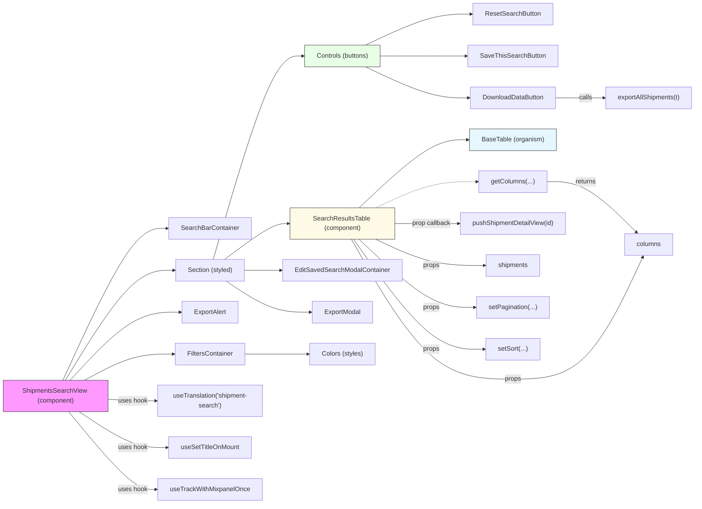

# Diagram: web/portal/src/pages/shipments/search/Shipments.Search.page.js

> Auto-generated by Obscura crawlers

## Mermaid

### SVG

<svg id="container" width="1739.8125" xmlns="http://www.w3.org/2000/svg" class="flowchart" height="1250" viewBox="0 0 1739.8125 1250" role="graphics-document document" aria-roledescription="flowchart-v2"><g><marker id="container_flowchart-v2-pointEnd" class="marker flowchart-v2" viewBox="0 0 10 10" refX="5" refY="5" markerUnits="userSpaceOnUse" markerWidth="8" markerHeight="8" orient="auto"><path d="M 0 0 L 10 5 L 0 10 z" class="arrowMarkerPath" style="stroke-width: 1; stroke-dasharray: 1, 0;"></path></marker><marker id="container_flowchart-v2-pointStart" class="marker flowchart-v2" viewBox="0 0 10 10" refX="4.5" refY="5" markerUnits="userSpaceOnUse" markerWidth="8" markerHeight="8" orient="auto"><path d="M 0 5 L 10 10 L 10 0 z" class="arrowMarkerPath" style="stroke-width: 1; stroke-dasharray: 1, 0;"></path></marker><marker id="container_flowchart-v2-circleEnd" class="marker flowchart-v2" viewBox="0 0 10 10" refX="11" refY="5" markerUnits="userSpaceOnUse" markerWidth="11" markerHeight="11" orient="auto"><circle cx="5" cy="5" r="5" class="arrowMarkerPath" style="stroke-width: 1; stroke-dasharray: 1, 0;"></circle></marker><marker id="container_flowchart-v2-circleStart" class="marker flowchart-v2" viewBox="0 0 10 10" refX="-1" refY="5" markerUnits="userSpaceOnUse" markerWidth="11" markerHeight="11" orient="auto"><circle cx="5" cy="5" r="5" class="arrowMarkerPath" style="stroke-width: 1; stroke-dasharray: 1, 0;"></circle></marker><marker id="container_flowchart-v2-crossEnd" class="marker cross flowchart-v2" viewBox="0 0 11 11" refX="12" refY="5.2" markerUnits="userSpaceOnUse" markerWidth="11" markerHeight="11" orient="auto"><path d="M 1,1 l 9,9 M 10,1 l -9,9" class="arrowMarkerPath" style="stroke-width: 2; stroke-dasharray: 1, 0;"></path></marker><marker id="container_flowchart-v2-crossStart" class="marker cross flowchart-v2" viewBox="0 0 11 11" refX="-1" refY="5.2" markerUnits="userSpaceOnUse" markerWidth="11" markerHeight="11" orient="auto"><path d="M 1,1 l 9,9 M 10,1 l -9,9" class="arrowMarkerPath" style="stroke-width: 2; stroke-dasharray: 1, 0;"></path></marker><g class="root"><g class="clusters"></g><g class="edgePaths"><path d="M155.976,944L184.937,881.167C213.898,818.333,271.82,692.667,315.086,629.833C358.352,567,386.961,567,401.266,567L415.57,567" id="L_ShipmentsSearchView_SearchBarContainer_0" class="edge-thickness-normal edge-pattern-solid edge-thickness-normal edge-pattern-solid flowchart-link" style=";" data-edge="true" data-et="edge" data-id="L_ShipmentsSearchView_SearchBarContainer_0" data-points="W3sieCI6MTU1Ljk3NTgzMDA3ODEyNSwieSI6OTQ0fSx7IngiOjMyOS43NDIxODc1LCJ5Ijo1Njd9LHsieCI6NDE5LjU3MDMxMjUsInkiOjU2N31d" marker-end="url(#container_flowchart-v2-pointEnd)"></path><path d="M209.903,944L229.876,933.167C249.85,922.333,289.796,900.667,326.502,889.833C363.208,879,396.674,879,413.408,879L430.141,879" id="L_ShipmentsSearchView_FiltersContainer_0" class="edge-thickness-normal edge-pattern-solid edge-thickness-normal edge-pattern-solid flowchart-link" style=";" data-edge="true" data-et="edge" data-id="L_ShipmentsSearchView_FiltersContainer_0" data-points="W3sieCI6MjA5LjkwMzMyMDMxMjUsInkiOjk0NH0seyJ4IjozMjkuNzQyMTg3NSwieSI6ODc5fSx7IngiOjQzNC4xNDA2MjUsInkiOjg3OX1d" marker-end="url(#container_flowchart-v2-pointEnd)"></path><path d="M173.952,944L199.917,915.833C225.882,887.667,277.812,831.333,323.269,803.167C368.727,775,407.711,775,427.203,775L446.695,775" id="L_ShipmentsSearchView_ExportAlert_0" class="edge-thickness-normal edge-pattern-solid edge-thickness-normal edge-pattern-solid flowchart-link" style=";" data-edge="true" data-et="edge" data-id="L_ShipmentsSearchView_ExportAlert_0" data-points="W3sieCI6MTczLjk1MTY2MDE1NjI1LCJ5Ijo5NDR9LHsieCI6MzI5Ljc0MjE4NzUsInkiOjc3NX0seyJ4Ijo0NTAuNjk1MzEyNSwieSI6Nzc1fV0=" marker-end="url(#container_flowchart-v2-pointEnd)"></path><path d="M161.968,944L189.93,898.5C217.893,853,273.817,762,318.683,716.5C363.549,671,397.357,671,414.26,671L431.164,671" id="L_ShipmentsSearchView_Section_0" class="edge-thickness-normal edge-pattern-solid edge-thickness-normal edge-pattern-solid flowchart-link" style=";" data-edge="true" data-et="edge" data-id="L_ShipmentsSearchView_Section_0" data-points="W3sieCI6MTYxLjk2Nzc3MzQzNzUsInkiOjk0NH0seyJ4IjozMjkuNzQyMTg3NSwieSI6NjcxfSx7IngiOjQzNS4xNjQwNjI1LCJ5Ijo2NzF9XQ==" marker-end="url(#container_flowchart-v2-pointEnd)"></path><path d="M529.351,644L553.873,559.833C578.395,475.667,627.44,307.333,664.122,223.167C700.805,139,725.125,139,737.285,139L749.445,139" id="L_Section_Controls_0" class="edge-thickness-normal edge-pattern-solid edge-thickness-normal edge-pattern-solid flowchart-link" style=";" data-edge="true" data-et="edge" data-id="L_Section_Controls_0" data-points="W3sieCI6NTI5LjM1MDkxNjM1MzM4MzUsInkiOjY0NH0seyJ4Ijo2NzYuNDg0Mzc1LCJ5IjoxMzl9LHsieCI6NzUzLjQ0NTMxMjUsInkiOjEzOX1d" marker-end="url(#container_flowchart-v2-pointEnd)"></path><path d="M906.555,112L933.874,99.167C961.193,86.333,1015.831,60.667,1060.458,47.833C1105.086,35,1139.703,35,1157.012,35L1174.32,35" id="L_Controls_ResetSearchButton_0" class="edge-thickness-normal edge-pattern-solid edge-thickness-normal edge-pattern-solid flowchart-link" style=";" data-edge="true" data-et="edge" data-id="L_Controls_ResetSearchButton_0" data-points="W3sieCI6OTA2LjU1NDUzNzI1OTYxNTQsInkiOjExMn0seyJ4IjoxMDcwLjQ2ODc1LCJ5IjozNX0seyJ4IjoxMTc4LjMyMDMxMjUsInkiOjM1fV0=" marker-end="url(#container_flowchart-v2-pointEnd)"></path><path d="M944.711,139L965.671,139C986.63,139,1028.549,139,1064.883,139C1101.216,139,1131.964,139,1147.337,139L1162.711,139" id="L_Controls_SaveThisSearchButton_0" class="edge-thickness-normal edge-pattern-solid edge-thickness-normal edge-pattern-solid flowchart-link" style=";" data-edge="true" data-et="edge" data-id="L_Controls_SaveThisSearchButton_0" data-points="W3sieCI6OTQ0LjcxMDkzNzUsInkiOjEzOX0seyJ4IjoxMDcwLjQ2ODc1LCJ5IjoxMzl9LHsieCI6MTE2Ni43MTA5Mzc1LCJ5IjoxMzl9XQ==" marker-end="url(#container_flowchart-v2-pointEnd)"></path><path d="M906.555,166L933.874,178.833C961.193,191.667,1015.831,217.333,1059.046,230.167C1102.26,243,1134.052,243,1149.948,243L1165.844,243" id="L_Controls_DownloadDataButton_0" class="edge-thickness-normal edge-pattern-solid edge-thickness-normal edge-pattern-solid flowchart-link" style=";" data-edge="true" data-et="edge" data-id="L_Controls_DownloadDataButton_0" data-points="W3sieCI6OTA2LjU1NDUzNzI1OTYxNTQsInkiOjE2Nn0seyJ4IjoxMDcwLjQ2ODc1LCJ5IjoyNDN9LHsieCI6MTE2OS44NDM3NSwieSI6MjQzfV0=" marker-end="url(#container_flowchart-v2-pointEnd)"></path><path d="M557.562,644L577.382,629.167C597.203,614.333,636.844,584.667,663.096,569.833C689.349,555,702.214,555,708.646,555L715.078,555" id="L_Section_SearchResultsTable_0" class="edge-thickness-normal edge-pattern-solid edge-thickness-normal edge-pattern-solid flowchart-link" style=";" data-edge="true" data-et="edge" data-id="L_Section_SearchResultsTable_0" data-points="W3sieCI6NTU3LjU2MTk2MTIwNjg5NjUsInkiOjY0NH0seyJ4Ijo2NzYuNDg0Mzc1LCJ5Ijo1NTV9LHsieCI6NzE5LjA3ODEyNSwieSI6NTU1fV0=" marker-end="url(#container_flowchart-v2-pointEnd)"></path><path d="M607.805,671L619.251,671C630.698,671,653.591,671,668.538,671C683.484,671,690.484,671,693.984,671L697.484,671" id="L_Section_EditSavedSearchModal_0" class="edge-thickness-normal edge-pattern-solid edge-thickness-normal edge-pattern-solid flowchart-link" style=";" data-edge="true" data-et="edge" data-id="L_Section_EditSavedSearchModal_0" data-points="W3sieCI6NjA3LjgwNDY4NzUsInkiOjY3MX0seyJ4Ijo2NzYuNDg0Mzc1LCJ5Ijo2NzF9LHsieCI6NzAxLjQ4NDM3NSwieSI6NjcxfV0=" marker-end="url(#container_flowchart-v2-pointEnd)"></path><path d="M561.725,698L580.851,710.833C599.978,723.667,638.231,749.333,672.814,762.167C707.396,775,738.307,775,753.763,775L769.219,775" id="L_Section_ExportModal_0" class="edge-thickness-normal edge-pattern-solid edge-thickness-normal edge-pattern-solid flowchart-link" style=";" data-edge="true" data-et="edge" data-id="L_Section_ExportModal_0" data-points="W3sieCI6NTYxLjcyNDc1OTYxNTM4NDYsInkiOjY5OH0seyJ4Ijo2NzYuNDg0Mzc1LCJ5Ijo3NzV9LHsieCI6NzczLjIxODc1LCJ5Ijo3NzV9XQ==" marker-end="url(#container_flowchart-v2-pointEnd)"></path><path d="M890.589,516L920.569,487.833C950.549,459.667,1010.509,403.333,1056.36,375.167C1102.211,347,1133.953,347,1149.824,347L1165.695,347" id="L_SearchResultsTable_BaseTable_0" class="edge-thickness-normal edge-pattern-solid edge-thickness-normal edge-pattern-solid flowchart-link" style=";" data-edge="true" data-et="edge" data-id="L_SearchResultsTable_BaseTable_0" data-points="W3sieCI6ODkwLjU4ODg2NzE4NzUsInkiOjUxNn0seyJ4IjoxMDcwLjQ2ODc1LCJ5IjozNDd9LHsieCI6MTE2OS42OTUzMTI1LCJ5IjozNDd9XQ==" marker-end="url(#container_flowchart-v2-pointEnd)"></path><path d="M932.1,516L955.161,505.167C978.223,494.333,1024.346,472.667,1067.291,461.833C1110.237,451,1150.005,451,1169.889,451L1189.773,451" id="L_SearchResultsTable_getColumns_0" class="edge-thickness-normal edge-pattern-dotted edge-thickness-normal edge-pattern-solid flowchart-link" style=";" data-edge="true" data-et="edge" data-id="L_SearchResultsTable_getColumns_0" data-points="W3sieCI6OTMyLjA5OTYwOTM3NSwieSI6NTE2fSx7IngiOjEwNzAuNDY4NzUsInkiOjQ1MX0seyJ4IjoxMTkzLjc3MzQzNzUsInkiOjQ1MX1d" marker-end="url(#container_flowchart-v2-pointEnd)"></path><path d="M268,991.136L278.29,991.78C288.581,992.424,309.161,993.712,329.076,994.356C348.99,995,368.237,995,377.861,995L387.484,995" id="L_ShipmentsSearchView_useTranslation_0" class="edge-thickness-normal edge-pattern-solid edge-thickness-normal edge-pattern-solid flowchart-link" style=";" data-edge="true" data-et="edge" data-id="L_ShipmentsSearchView_useTranslation_0" data-points="W3sieCI6MjY4LCJ5Ijo5OTEuMTM1OTI0NzAzNTgxNX0seyJ4IjozMjkuNzQyMTg3NSwieSI6OTk1fSx7IngiOjM5MS40ODQzNzUsInkiOjk5NX1d" marker-end="url(#container_flowchart-v2-pointEnd)"></path><path d="M196.421,1022L218.642,1036.833C240.862,1051.667,285.302,1081.333,321.549,1096.167C357.797,1111,385.852,1111,399.879,1111L413.906,1111" id="L_ShipmentsSearchView_useSetTitleOnMount_0" class="edge-thickness-normal edge-pattern-solid edge-thickness-normal edge-pattern-solid flowchart-link" style=";" data-edge="true" data-et="edge" data-id="L_ShipmentsSearchView_useSetTitleOnMount_0" data-points="W3sieCI6MTk2LjQyMTQ0Nzc1MzkwNjI1LCJ5IjoxMDIyfSx7IngiOjMyOS43NDIxODc1LCJ5IjoxMTExfSx7IngiOjQxNy45MDYyNSwieSI6MTExMX1d" marker-end="url(#container_flowchart-v2-pointEnd)"></path><path d="M170.233,1022L196.817,1054.167C223.402,1086.333,276.572,1150.667,312.915,1182.833C349.258,1215,368.773,1215,378.531,1215L388.289,1215" id="L_ShipmentsSearchView_useTrackWithMixpanelOnce_0" class="edge-thickness-normal edge-pattern-solid edge-thickness-normal edge-pattern-solid flowchart-link" style=";" data-edge="true" data-et="edge" data-id="L_ShipmentsSearchView_useTrackWithMixpanelOnce_0" data-points="W3sieCI6MTcwLjIzMjUyMjg5ODcwNjksInkiOjEwMjJ9LHsieCI6MzI5Ljc0MjE4NzUsInkiOjEyMTV9LHsieCI6MzkyLjI4OTA2MjUsInkiOjEyMTV9XQ==" marker-end="url(#container_flowchart-v2-pointEnd)"></path><path d="M979.078,555L994.31,555C1009.542,555,1040.005,555,1066.87,555C1093.734,555,1117,555,1128.633,555L1140.266,555" id="L_SearchResultsTable_pushShipmentDetailView_0" class="edge-thickness-normal edge-pattern-solid edge-thickness-normal edge-pattern-solid flowchart-link" style=";" data-edge="true" data-et="edge" data-id="L_SearchResultsTable_pushShipmentDetailView_0" data-points="W3sieCI6OTc5LjA3ODEyNSwieSI6NTU1fSx7IngiOjEwNzAuNDY4NzUsInkiOjU1NX0seyJ4IjoxMTQ0LjI2NTYyNSwieSI6NTU1fV0=" marker-end="url(#container_flowchart-v2-pointEnd)"></path><path d="M1384.703,243L1397.51,243C1410.318,243,1435.932,243,1456.617,243C1477.302,243,1493.057,243,1500.935,243L1508.813,243" id="L_DownloadDataButton_exportAllShipments_0" class="edge-thickness-normal edge-pattern-solid edge-thickness-normal edge-pattern-solid flowchart-link" style=";" data-edge="true" data-et="edge" data-id="L_DownloadDataButton_exportAllShipments_0" data-points="W3sieCI6MTM4NC43MDMxMjUsInkiOjI0M30seyJ4IjoxNDYxLjU0Njg3NSwieSI6MjQzfSx7IngiOjE1MTIuODEyNSwieSI6MjQzfV0=" marker-end="url(#container_flowchart-v2-pointEnd)"></path><path d="M1360.773,451L1377.569,451C1394.365,451,1427.956,451,1466.43,472.036C1504.904,493.071,1548.26,535.143,1569.939,556.179L1591.617,577.214" id="L_getColumns_columns_0" class="edge-thickness-normal edge-pattern-solid edge-thickness-normal edge-pattern-solid flowchart-link" style=";" data-edge="true" data-et="edge" data-id="L_getColumns_columns_0" data-points="W3sieCI6MTM2MC43NzM0Mzc1LCJ5Ijo0NTF9LHsieCI6MTQ2MS41NDY4NzUsInkiOjQ1MX0seyJ4IjoxNTk0LjQ4NzY4MDI4ODQ2MTQsInkiOjU4MH1d" marker-end="url(#container_flowchart-v2-pointEnd)"></path><path d="M871.447,594L904.617,651.833C937.787,709.667,1004.128,825.333,1071.766,883.167C1139.404,941,1208.339,941,1273.518,941C1338.698,941,1400.122,941,1455.174,890.434C1510.225,839.868,1558.903,738.736,1583.243,688.17L1607.582,637.604" id="L_SearchResultsTable_columns_0" class="edge-thickness-normal edge-pattern-solid edge-thickness-normal edge-pattern-solid flowchart-link" style=";" data-edge="true" data-et="edge" data-id="L_SearchResultsTable_columns_0" data-points="W3sieCI6ODcxLjQ0NjYwNzgzNjc4NzUsInkiOjU5NH0seyJ4IjoxMDcwLjQ2ODc1LCJ5Ijo5NDF9LHsieCI6MTI3Ny4yNzM0Mzc1LCJ5Ijo5NDF9LHsieCI6MTQ2MS41NDY4NzUsInkiOjk0MX0seyJ4IjoxNjA5LjMxNjQ3NjQyMjE1NTYsInkiOjYzNH1d" marker-end="url(#container_flowchart-v2-pointEnd)"></path><path d="M932.1,594L955.161,604.833C978.223,615.667,1024.346,637.333,1069.881,648.167C1115.417,659,1160.365,659,1182.839,659L1205.313,659" id="L_SearchResultsTable_shipments_0" class="edge-thickness-normal edge-pattern-solid edge-thickness-normal edge-pattern-solid flowchart-link" style=";" data-edge="true" data-et="edge" data-id="L_SearchResultsTable_shipments_0" data-points="W3sieCI6OTMyLjA5OTYwOTM3NSwieSI6NTk0fSx7IngiOjEwNzAuNDY4NzUsInkiOjY1OX0seyJ4IjoxMjA5LjMxMjUsInkiOjY1OX1d" marker-end="url(#container_flowchart-v2-pointEnd)"></path><path d="M890.589,594L920.569,622.167C950.549,650.333,1010.509,706.667,1059.227,734.833C1107.945,763,1145.422,763,1164.16,763L1182.898,763" id="L_SearchResultsTable_pagination_0" class="edge-thickness-normal edge-pattern-solid edge-thickness-normal edge-pattern-solid flowchart-link" style=";" data-edge="true" data-et="edge" data-id="L_SearchResultsTable_pagination_0" data-points="W3sieCI6ODkwLjU4ODg2NzE4NzUsInkiOjU5NH0seyJ4IjoxMDcwLjQ2ODc1LCJ5Ijo3NjN9LHsieCI6MTE4Ni44OTg0Mzc1LCJ5Ijo3NjN9XQ==" marker-end="url(#container_flowchart-v2-pointEnd)"></path><path d="M876.752,594L909.038,639.5C941.324,685,1005.896,776,1060.827,821.5C1115.758,867,1161.047,867,1183.691,867L1206.336,867" id="L_SearchResultsTable_sort_0" class="edge-thickness-normal edge-pattern-solid edge-thickness-normal edge-pattern-solid flowchart-link" style=";" data-edge="true" data-et="edge" data-id="L_SearchResultsTable_sort_0" data-points="W3sieCI6ODc2Ljc1MTk1MzEyNSwieSI6NTk0fSx7IngiOjEwNzAuNDY4NzUsInkiOjg2N30seyJ4IjoxMjEwLjMzNTkzNzUsInkiOjg2N31d" marker-end="url(#container_flowchart-v2-pointEnd)"></path><path d="M608.828,879L620.104,879C631.38,879,653.932,879,679.824,879C705.716,879,734.948,879,749.564,879L764.18,879" id="L_FiltersContainer_Colors_0" class="edge-thickness-normal edge-pattern-solid edge-thickness-normal edge-pattern-solid flowchart-link" style=";" data-edge="true" data-et="edge" data-id="L_FiltersContainer_Colors_0" data-points="W3sieCI6NjA4LjgyODEyNSwieSI6ODc5fSx7IngiOjY3Ni40ODQzNzUsInkiOjg3OX0seyJ4Ijo3NjguMTc5Njg3NSwieSI6ODc5fV0=" marker-end="url(#container_flowchart-v2-pointEnd)"></path></g><g class="edgeLabels"><g class="edgeLabel"><g class="label" data-id="L_ShipmentsSearchView_SearchBarContainer_0" transform="translate(0, 0)"><foreignObject width="0" height="0">

</foreignObject></g></g><g class="edgeLabel"><g class="label" data-id="L_ShipmentsSearchView_FiltersContainer_0" transform="translate(0, 0)"><foreignObject width="0" height="0">

</foreignObject></g></g><g class="edgeLabel"><g class="label" data-id="L_ShipmentsSearchView_ExportAlert_0" transform="translate(0, 0)"><foreignObject width="0" height="0">

</foreignObject></g></g><g class="edgeLabel"><g class="label" data-id="L_ShipmentsSearchView_Section_0" transform="translate(0, 0)"><foreignObject width="0" height="0">

</foreignObject></g></g><g class="edgeLabel"><g class="label" data-id="L_Section_Controls_0" transform="translate(0, 0)"><foreignObject width="0" height="0">

</foreignObject></g></g><g class="edgeLabel"><g class="label" data-id="L_Controls_ResetSearchButton_0" transform="translate(0, 0)"><foreignObject width="0" height="0">

</foreignObject></g></g><g class="edgeLabel"><g class="label" data-id="L_Controls_SaveThisSearchButton_0" transform="translate(0, 0)"><foreignObject width="0" height="0">

</foreignObject></g></g><g class="edgeLabel"><g class="label" data-id="L_Controls_DownloadDataButton_0" transform="translate(0, 0)"><foreignObject width="0" height="0">

</foreignObject></g></g><g class="edgeLabel"><g class="label" data-id="L_Section_SearchResultsTable_0" transform="translate(0, 0)"><foreignObject width="0" height="0">

</foreignObject></g></g><g class="edgeLabel"><g class="label" data-id="L_Section_EditSavedSearchModal_0" transform="translate(0, 0)"><foreignObject width="0" height="0">

</foreignObject></g></g><g class="edgeLabel"><g class="label" data-id="L_Section_ExportModal_0" transform="translate(0, 0)"><foreignObject width="0" height="0">

</foreignObject></g></g><g class="edgeLabel"><g class="label" data-id="L_SearchResultsTable_BaseTable_0" transform="translate(0, 0)"><foreignObject width="0" height="0">

</foreignObject></g></g><g class="edgeLabel"><g class="label" data-id="L_SearchResultsTable_getColumns_0" transform="translate(0, 0)"><foreignObject width="0" height="0">

</foreignObject></g></g><g class="edgeLabel" transform="translate(329.7421875, 995)"><g class="label" data-id="L_ShipmentsSearchView_useTranslation_0" transform="translate(-36.7421875, -12)"><foreignObject width="73.484375" height="24">

uses hook

</foreignObject></g></g><g class="edgeLabel" transform="translate(329.7421875, 1111)"><g class="label" data-id="L_ShipmentsSearchView_useSetTitleOnMount_0" transform="translate(-36.7421875, -12)"><foreignObject width="73.484375" height="24">

uses hook

</foreignObject></g></g><g class="edgeLabel" transform="translate(329.7421875, 1215)"><g class="label" data-id="L_ShipmentsSearchView_useTrackWithMixpanelOnce_0" transform="translate(-36.7421875, -12)"><foreignObject width="73.484375" height="24">

uses hook

</foreignObject></g></g><g class="edgeLabel" transform="translate(1070.46875, 555)"><g class="label" data-id="L_SearchResultsTable_pushShipmentDetailView_0" transform="translate(-48.796875, -12)"><foreignObject width="97.59375" height="24">

prop callback

</foreignObject></g></g><g class="edgeLabel" transform="translate(1461.546875, 243)"><g class="label" data-id="L_DownloadDataButton_exportAllShipments_0" transform="translate(-16.4453125, -12)"><foreignObject width="32.890625" height="24">

calls

</foreignObject></g></g><g class="edgeLabel" transform="translate(1461.546875, 451)"><g class="label" data-id="L_getColumns_columns_0" transform="translate(-26.265625, -12)"><foreignObject width="52.53125" height="24">

returns

</foreignObject></g></g><g class="edgeLabel" transform="translate(1277.2734375, 941)"><g class="label" data-id="L_SearchResultsTable_columns_0" transform="translate(-20.765625, -12)"><foreignObject width="41.53125" height="24">

props

</foreignObject></g></g><g class="edgeLabel" transform="translate(1070.46875, 659)"><g class="label" data-id="L_SearchResultsTable_shipments_0" transform="translate(-20.765625, -12)"><foreignObject width="41.53125" height="24">

props

</foreignObject></g></g><g class="edgeLabel" transform="translate(1070.46875, 763)"><g class="label" data-id="L_SearchResultsTable_pagination_0" transform="translate(-20.765625, -12)"><foreignObject width="41.53125" height="24">

props

</foreignObject></g></g><g class="edgeLabel" transform="translate(1070.46875, 867)"><g class="label" data-id="L_SearchResultsTable_sort_0" transform="translate(-20.765625, -12)"><foreignObject width="41.53125" height="24">

props

</foreignObject></g></g><g class="edgeLabel"><g class="label" data-id="L_FiltersContainer_Colors_0" transform="translate(0, 0)"><foreignObject width="0" height="0">

</foreignObject></g></g></g><g class="nodes"><g class="node default" id="flowchart-ShipmentsSearchView-0" transform="translate(138, 983)"><rect class="basic label-container" style="fill:#f9f !important;stroke:#333 !important;stroke-width:1px !important" x="-130" y="-39" width="260" height="78"></rect><g class="label" style="" transform="translate(-100, -24)"><rect></rect><foreignObject width="200" height="48">

ShipmentsSearchView (component)

</foreignObject></g></g><g class="node default" id="flowchart-SearchBarContainer-1" transform="translate(521.484375, 567)"><rect class="basic label-container" style="" x="-101.9140625" y="-27" width="203.828125" height="54"></rect><g class="label" style="" transform="translate(-71.9140625, -12)"><rect></rect><foreignObject width="143.828125" height="24">

SearchBarContainer

</foreignObject></g></g><g class="node default" id="flowchart-FiltersContainer-3" transform="translate(521.484375, 879)"><rect class="basic label-container" style="" x="-87.34375" y="-27" width="174.6875" height="54"></rect><g class="label" style="" transform="translate(-57.34375, -12)"><rect></rect><foreignObject width="114.6875" height="24">

FiltersContainer

</foreignObject></g></g><g class="node default" id="flowchart-ExportAlert-5" transform="translate(521.484375, 775)"><rect class="basic label-container" style="" x="-70.7890625" y="-27" width="141.578125" height="54"></rect><g class="label" style="" transform="translate(-40.7890625, -12)"><rect></rect><foreignObject width="81.578125" height="24">

ExportAlert

</foreignObject></g></g><g class="node default" id="flowchart-Section-7" transform="translate(521.484375, 671)"><rect class="basic label-container" style="" x="-86.3203125" y="-27" width="172.640625" height="54"></rect><g class="label" style="" transform="translate(-56.3203125, -12)"><rect></rect><foreignObject width="112.640625" height="24">

Section (styled)

</foreignObject></g></g><g class="node default" id="flowchart-Controls-9" transform="translate(849.078125, 139)"><rect class="basic label-container" style="fill:#e8ffe6 !important;stroke:#333 !important" x="-95.6328125" y="-27" width="191.265625" height="54"></rect><g class="label" style="" transform="translate(-65.6328125, -12)"><rect></rect><foreignObject width="131.265625" height="24">

Controls (buttons)

</foreignObject></g></g><g class="node default" id="flowchart-ResetSearchButton-11" transform="translate(1277.2734375, 35)"><rect class="basic label-container" style="" x="-98.953125" y="-27" width="197.90625" height="54"></rect><g class="label" style="" transform="translate(-68.953125, -12)"><rect></rect><foreignObject width="137.90625" height="24">

ResetSearchButton

</foreignObject></g></g><g class="node default" id="flowchart-SaveThisSearchButton-13" transform="translate(1277.2734375, 139)"><rect class="basic label-container" style="" x="-110.5625" y="-27" width="221.125" height="54"></rect><g class="label" style="" transform="translate(-80.5625, -12)"><rect></rect><foreignObject width="161.125" height="24">

SaveThisSearchButton

</foreignObject></g></g><g class="node default" id="flowchart-DownloadDataButton-15" transform="translate(1277.2734375, 243)"><rect class="basic label-container" style="" x="-107.4296875" y="-27" width="214.859375" height="54"></rect><g class="label" style="" transform="translate(-77.4296875, -12)"><rect></rect><foreignObject width="154.859375" height="24">

DownloadDataButton

</foreignObject></g></g><g class="node default" id="flowchart-SearchResultsTable-17" transform="translate(849.078125, 555)"><rect class="basic label-container" style="fill:#fffae6 !important;stroke:#333 !important" x="-130" y="-39" width="260" height="78"></rect><g class="label" style="" transform="translate(-100, -24)"><rect></rect><foreignObject width="200" height="48">

SearchResultsTable (component)

</foreignObject></g></g><g class="node default" id="flowchart-EditSavedSearchModal-19" transform="translate(849.078125, 671)"><rect class="basic label-container" style="" x="-147.59375" y="-27" width="295.1875" height="54"></rect><g class="label" style="" transform="translate(-117.59375, -12)"><rect></rect><foreignObject width="235.1875" height="24">

EditSavedSearchModalContainer

</foreignObject></g></g><g class="node default" id="flowchart-ExportModal-21" transform="translate(849.078125, 775)"><rect class="basic label-container" style="" x="-75.859375" y="-27" width="151.71875" height="54"></rect><g class="label" style="" transform="translate(-45.859375, -12)"><rect></rect><foreignObject width="91.71875" height="24">

ExportModal

</foreignObject></g></g><g class="node default" id="flowchart-BaseTable-23" transform="translate(1277.2734375, 347)"><rect class="basic label-container" style="fill:#e6f7ff !important;stroke:#333 !important" x="-107.578125" y="-27" width="215.15625" height="54"></rect><g class="label" style="" transform="translate(-77.578125, -12)"><rect></rect><foreignObject width="155.15625" height="24">

BaseTable (organism)

</foreignObject></g></g><g class="node default" id="flowchart-getColumns-25" transform="translate(1277.2734375, 451)"><rect class="basic label-container" style="" x="-83.5" y="-27" width="167" height="54"></rect><g class="label" style="" transform="translate(-53.5, -12)"><rect></rect><foreignObject width="107" height="24">

getColumns(...)

</foreignObject></g></g><g class="node default" id="flowchart-useTranslation-27" transform="translate(521.484375, 995)"><rect class="basic label-container" style="" x="-130" y="-39" width="260" height="78"></rect><g class="label" style="" transform="translate(-100, -24)"><rect></rect><foreignObject width="200" height="48">

useTranslation('shipment-search')

</foreignObject></g></g><g class="node default" id="flowchart-useSetTitleOnMount-29" transform="translate(521.484375, 1111)"><rect class="basic label-container" style="" x="-103.578125" y="-27" width="207.15625" height="54"></rect><g class="label" style="" transform="translate(-73.578125, -12)"><rect></rect><foreignObject width="147.15625" height="24">

useSetTitleOnMount

</foreignObject></g></g><g class="node default" id="flowchart-useTrackWithMixpanelOnce-31" transform="translate(521.484375, 1215)"><rect class="basic label-container" style="" x="-129.1953125" y="-27" width="258.390625" height="54"></rect><g class="label" style="" transform="translate(-99.1953125, -12)"><rect></rect><foreignObject width="198.390625" height="24">

useTrackWithMixpanelOnce

</foreignObject></g></g><g class="node default" id="flowchart-pushShipmentDetailView-33" transform="translate(1277.2734375, 555)"><rect class="basic label-container" style="" x="-133.0078125" y="-27" width="266.015625" height="54"></rect><g class="label" style="" transform="translate(-103.0078125, -12)"><rect></rect><foreignObject width="206.015625" height="24">

pushShipmentDetailView(id)

</foreignObject></g></g><g class="node default" id="flowchart-exportAllShipments-35" transform="translate(1622.3125, 243)"><rect class="basic label-container" style="" x="-109.5" y="-27" width="219" height="54"></rect><g class="label" style="" transform="translate(-79.5, -12)"><rect></rect><foreignObject width="159" height="24">

exportAllShipments(t)

</foreignObject></g></g><g class="node default" id="flowchart-columns-37" transform="translate(1622.3125, 607)"><rect class="basic label-container" style="" x="-60.6171875" y="-27" width="121.234375" height="54"></rect><g class="label" style="" transform="translate(-30.6171875, -12)"><rect></rect><foreignObject width="61.234375" height="24">

columns

</foreignObject></g></g><g class="node default" id="flowchart-shipments-41" transform="translate(1277.2734375, 659)"><rect class="basic label-container" style="" x="-67.9609375" y="-27" width="135.921875" height="54"></rect><g class="label" style="" transform="translate(-37.9609375, -12)"><rect></rect><foreignObject width="75.921875" height="24">

shipments

</foreignObject></g></g><g class="node default" id="flowchart-pagination-43" transform="translate(1277.2734375, 763)"><rect class="basic label-container" style="" x="-90.375" y="-27" width="180.75" height="54"></rect><g class="label" style="" transform="translate(-60.375, -12)"><rect></rect><foreignObject width="120.75" height="24">

setPagination(...)

</foreignObject></g></g><g class="node default" id="flowchart-sort-45" transform="translate(1277.2734375, 867)"><rect class="basic label-container" style="" x="-66.9375" y="-27" width="133.875" height="54"></rect><g class="label" style="" transform="translate(-36.9375, -12)"><rect></rect><foreignObject width="73.875" height="24">

setSort(...)

</foreignObject></g></g><g class="node default" id="flowchart-Colors-47" transform="translate(849.078125, 879)"><rect class="basic label-container" style="" x="-80.8984375" y="-27" width="161.796875" height="54"></rect><g class="label" style="" transform="translate(-50.8984375, -12)"><rect></rect><foreignObject width="101.796875" height="24">

Colors (styles)

</foreignObject></g></g></g></g></g></svg>
