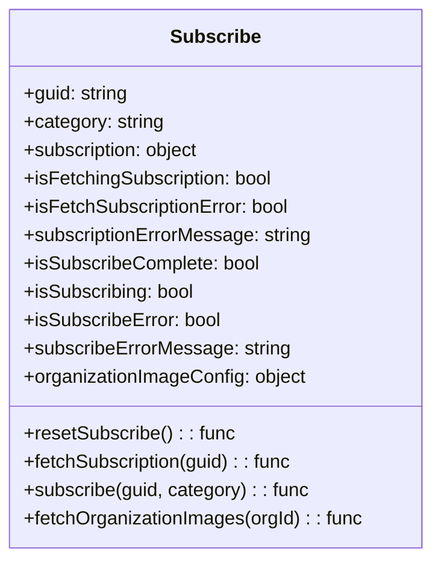

# Diagram: web/portal/src/pages/subscribe/subscribe.page.js


> Auto-generated by Obscura crawlers

## Diagram 1

```mermaid
flowchart TD
  Mount[Component Mount] --> Reset[resetSubscribe()]
  Mount --> CheckGuid{guid exists?}
  CheckGuid -- yes --> FetchSub(fetchSubscription(guid))
  CheckGuid -- no --> NoGuid[setHasData(false)]
  Mount --> CheckCategory{category exists?}
  CheckCategory -- no --> NoCategory[setHasData(false)]
  FetchSub --> WaitSub[waiting for subscription]
  WaitSub -->|subscription received| OnSub[process subscription]
  OnSub --> FetchOrg(fetchOrganizationImages)
  OnSub --> CheckEmail{category === "email" ? recipient_email present}
  OnSub --> CheckPhone{category === "phone" ? mobile_number present}
  OnSub --> CheckRef{reference_id present?}
  CheckEmail -- no --> NoData[setHasData(false)]
  CheckPhone -- no --> NoData
  CheckRef -- no --> NoData
  Render{Render UI}
  Render --> IsFetching{isFetchingSubscription?}
  IsFetching -- yes --> Loading[Show spinner + "Retrieving..."]
  IsFetching -- no --> DataCheck{hasData?}
  DataCheck -- no --> ErrorAlert[Alert: "Something Went Wrong" (Danger)]
  DataCheck -- yes --> SubCheck{subscription && !isFetchingSubscription}
  SubCheck -- no --> Idle[Show form unavailable]
  SubCheck -- yes --> CompleteCheck{isSubscribeComplete?}
  CompleteCheck -- no --> Form[Show details, disabled TextInput, Submit Button]
  Form --> ClickStart[startSubscribe() -> subscribe(guid,category)]
  ClickStart --> Subscribing{isSubscribing?}
  Subscribing -- yes --> ButtonSpinner[Show spinner in button]
  Subscribing -- no --> ButtonText["Submit"]
  CompleteCheck -- yes --> SuccessAlert[Alert: "Successfully Subscribed" (Success)]
  ErrorSubscribe{isSubscribeError || isFetchSubscriptionError?} -->|yes| SubscribeError[Alert: "We could not subscribe you..."]
  Render --> ErrorSubscribe
```

> SVG rendering failed for this diagram.

## Diagram 2



### SVG

<svg id="container" width="364.171875" xmlns="http://www.w3.org/2000/svg" class="classDiagram" height="472" viewBox="0 0 364.171875 472" role="graphics-document document" aria-roledescription="class"><style>#container{font-family:"trebuchet ms",verdana,arial,sans-serif;font-size:16px;fill:#333;}@keyframes edge-animation-frame{from{stroke-dashoffset:0;}}@keyframes dash{to{stroke-dashoffset:0;}}#container .edge-animation-slow{stroke-dasharray:9,5!important;stroke-dashoffset:900;animation:dash 50s linear infinite;stroke-linecap:round;}#container .edge-animation-fast{stroke-dasharray:9,5!important;stroke-dashoffset:900;animation:dash 20s linear infinite;stroke-linecap:round;}#container .error-icon{fill:#552222;}#container .error-text{fill:#552222;stroke:#552222;}#container .edge-thickness-normal{stroke-width:1px;}#container .edge-thickness-thick{stroke-width:3.5px;}#container .edge-pattern-solid{stroke-dasharray:0;}#container .edge-thickness-invisible{stroke-width:0;fill:none;}#container .edge-pattern-dashed{stroke-dasharray:3;}#container .edge-pattern-dotted{stroke-dasharray:2;}#container .marker{fill:#333333;stroke:#333333;}#container .marker.cross{stroke:#333333;}#container svg{font-family:"trebuchet ms",verdana,arial,sans-serif;font-size:16px;}#container p{margin:0;}#container g.classGroup text{fill:#9370DB;stroke:none;font-family:"trebuchet ms",verdana,arial,sans-serif;font-size:10px;}#container g.classGroup text .title{font-weight:bolder;}#container .nodeLabel,#container .edgeLabel{color:#131300;}#container .edgeLabel .label rect{fill:#ECECFF;}#container .label text{fill:#131300;}#container .labelBkg{background:#ECECFF;}#container .edgeLabel .label span{background:#ECECFF;}#container .classTitle{font-weight:bolder;}#container .node rect,#container .node circle,#container .node ellipse,#container .node polygon,#container .node path{fill:#ECECFF;stroke:#9370DB;stroke-width:1px;}#container .divider{stroke:#9370DB;stroke-width:1;}#container g.clickable{cursor:pointer;}#container g.classGroup rect{fill:#ECECFF;stroke:#9370DB;}#container g.classGroup line{stroke:#9370DB;stroke-width:1;}#container .classLabel .box{stroke:none;stroke-width:0;fill:#ECECFF;opacity:0.5;}#container .classLabel .label{fill:#9370DB;font-size:10px;}#container .relation{stroke:#333333;stroke-width:1;fill:none;}#container .dashed-line{stroke-dasharray:3;}#container .dotted-line{stroke-dasharray:1 2;}#container #compositionStart,#container .composition{fill:#333333!important;stroke:#333333!important;stroke-width:1;}#container #compositionEnd,#container .composition{fill:#333333!important;stroke:#333333!important;stroke-width:1;}#container #dependencyStart,#container .dependency{fill:#333333!important;stroke:#333333!important;stroke-width:1;}#container #dependencyStart,#container .dependency{fill:#333333!important;stroke:#333333!important;stroke-width:1;}#container #extensionStart,#container .extension{fill:transparent!important;stroke:#333333!important;stroke-width:1;}#container #extensionEnd,#container .extension{fill:transparent!important;stroke:#333333!important;stroke-width:1;}#container #aggregationStart,#container .aggregation{fill:transparent!important;stroke:#333333!important;stroke-width:1;}#container #aggregationEnd,#container .aggregation{fill:transparent!important;stroke:#333333!important;stroke-width:1;}#container #lollipopStart,#container .lollipop{fill:#ECECFF!important;stroke:#333333!important;stroke-width:1;}#container #lollipopEnd,#container .lollipop{fill:#ECECFF!important;stroke:#333333!important;stroke-width:1;}#container .edgeTerminals{font-size:11px;line-height:initial;}#container .classTitleText{text-anchor:middle;font-size:18px;fill:#333;}#container .label-icon{display:inline-block;height:1em;overflow:visible;vertical-align:-0.125em;}#container .node .label-icon path{fill:currentColor;stroke:revert;stroke-width:revert;}#container :root{--mermaid-font-family:"trebuchet ms",verdana,arial,sans-serif;}</style><g><defs><marker id="container_class-aggregationStart" class="marker aggregation class" refX="18" refY="7" markerWidth="190" markerHeight="240" orient="auto"><path d="M 18,7 L9,13 L1,7 L9,1 Z"></path></marker></defs><defs><marker id="container_class-aggregationEnd" class="marker aggregation class" refX="1" refY="7" markerWidth="20" markerHeight="28" orient="auto"><path d="M 18,7 L9,13 L1,7 L9,1 Z"></path></marker></defs><defs><marker id="container_class-extensionStart" class="marker extension class" refX="18" refY="7" markerWidth="190" markerHeight="240" orient="auto"><path d="M 1,7 L18,13 V 1 Z"></path></marker></defs><defs><marker id="container_class-extensionEnd" class="marker extension class" refX="1" refY="7" markerWidth="20" markerHeight="28" orient="auto"><path d="M 1,1 V 13 L18,7 Z"></path></marker></defs><defs><marker id="container_class-compositionStart" class="marker composition class" refX="18" refY="7" markerWidth="190" markerHeight="240" orient="auto"><path d="M 18,7 L9,13 L1,7 L9,1 Z"></path></marker></defs><defs><marker id="container_class-compositionEnd" class="marker composition class" refX="1" refY="7" markerWidth="20" markerHeight="28" orient="auto"><path d="M 18,7 L9,13 L1,7 L9,1 Z"></path></marker></defs><defs><marker id="container_class-dependencyStart" class="marker dependency class" refX="6" refY="7" markerWidth="190" markerHeight="240" orient="auto"><path d="M 5,7 L9,13 L1,7 L9,1 Z"></path></marker></defs><defs><marker id="container_class-dependencyEnd" class="marker dependency class" refX="13" refY="7" markerWidth="20" markerHeight="28" orient="auto"><path d="M 18,7 L9,13 L14,7 L9,1 Z"></path></marker></defs><defs><marker id="container_class-lollipopStart" class="marker lollipop class" refX="13" refY="7" markerWidth="190" markerHeight="240" orient="auto"><circle stroke="black" fill="transparent" cx="7" cy="7" r="6"></circle></marker></defs><defs><marker id="container_class-lollipopEnd" class="marker lollipop class" refX="1" refY="7" markerWidth="190" markerHeight="240" orient="auto"><circle stroke="black" fill="transparent" cx="7" cy="7" r="6"></circle></marker></defs><g class="root"><g class="clusters"></g><g class="edgePaths"></g><g class="edgeLabels"></g><g class="nodes"><g class="node default" id="classId-Subscribe-0" transform="translate(182.0859375, 236)"><g class="basic label-container"><path d="M-174.0859375 -228 L174.0859375 -228 L174.0859375 228 L-174.0859375 228" stroke="none" stroke-width="0" fill="#ECECFF" style=""></path><path d="M-174.0859375 -228 C-54.552651683146976 -228, 64.98063413370605 -228, 174.0859375 -228 M-174.0859375 -228 C-45.57082278585892 -228, 82.94429192828215 -228, 174.0859375 -228 M174.0859375 -228 C174.0859375 -93.5620124342075, 174.0859375 40.875975131584994, 174.0859375 228 M174.0859375 -228 C174.0859375 -85.5117723848681, 174.0859375 56.97645523026381, 174.0859375 228 M174.0859375 228 C37.9771196438011 228, -98.1316982123978 228, -174.0859375 228 M174.0859375 228 C89.24672637245446 228, 4.407515244908922 228, -174.0859375 228 M-174.0859375 228 C-174.0859375 134.28433435898597, -174.0859375 40.568668717971946, -174.0859375 -228 M-174.0859375 228 C-174.0859375 50.44395637427343, -174.0859375 -127.11208725145315, -174.0859375 -228" stroke="#9370DB" stroke-width="1.3" fill="none" stroke-dasharray="0 0" style=""></path></g><g class="annotation-group text" transform="translate(0, -204)"></g><g class="label-group text" transform="translate(-36.28125, -204)"><g class="label" style="font-weight: bolder" transform="translate(0,-12)"><foreignObject width="72.5625" height="24"><div xmlns="http://www.w3.org/1999/xhtml" style="display: table-cell; white-space: nowrap; line-height: 1.5; max-width: 122px; text-align: center;"><span class="nodeLabel markdown-node-label" style=""><p>Subscribe</p></span></div></foreignObject></g></g><g class="members-group text" transform="translate(-162.0859375, -156)"><g class="label" style="" transform="translate(0,-12)"><foreignObject width="89.25" height="24"><div xmlns="http://www.w3.org/1999/xhtml" style="display: table-cell; white-space: nowrap; line-height: 1.5; max-width: 147px; text-align: center;"><span class="nodeLabel markdown-node-label" style=""><p>+guid: string</p></span></div></foreignObject></g><g class="label" style="" transform="translate(0,12)"><foreignObject width="119.671875" height="24"><div xmlns="http://www.w3.org/1999/xhtml" style="display: table-cell; white-space: nowrap; line-height: 1.5; max-width: 178px; text-align: center;"><span class="nodeLabel markdown-node-label" style=""><p>+category: string</p></span></div></foreignObject></g><g class="label" style="" transform="translate(0,36)"><foreignObject width="152.15625" height="24"><div xmlns="http://www.w3.org/1999/xhtml" style="display: table-cell; white-space: nowrap; line-height: 1.5; max-width: 210px; text-align: center;"><span class="nodeLabel markdown-node-label" style=""><p>+subscription: object</p></span></div></foreignObject></g><g class="label" style="" transform="translate(0,60)"><foreignObject width="213.578125" height="24"><div xmlns="http://www.w3.org/1999/xhtml" style="display: table-cell; white-space: nowrap; line-height: 1.5; max-width: 271px; text-align: center;"><span class="nodeLabel markdown-node-label" style=""><p>+isFetchingSubscription: bool</p></span></div></foreignObject></g><g class="label" style="" transform="translate(0,84)"><foreignObject width="227.3125" height="24"><div xmlns="http://www.w3.org/1999/xhtml" style="display: table-cell; white-space: nowrap; line-height: 1.5; max-width: 285px; text-align: center;"><span class="nodeLabel markdown-node-label" style=""><p>+isFetchSubscriptionError: bool</p></span></div></foreignObject></g><g class="label" style="" transform="translate(0,108)"><foreignObject width="245.21875" height="24"><div xmlns="http://www.w3.org/1999/xhtml" style="display: table-cell; white-space: nowrap; line-height: 1.5; max-width: 303px; text-align: center;"><span class="nodeLabel markdown-node-label" style=""><p>+subscriptionErrorMessage: string</p></span></div></foreignObject></g><g class="label" style="" transform="translate(0,132)"><foreignObject width="201.28125" height="24"><div xmlns="http://www.w3.org/1999/xhtml" style="display: table-cell; white-space: nowrap; line-height: 1.5; max-width: 259px; text-align: center;"><span class="nodeLabel markdown-node-label" style=""><p>+isSubscribeComplete: bool</p></span></div></foreignObject></g><g class="label" style="" transform="translate(0,156)"><foreignObject width="145.984375" height="24"><div xmlns="http://www.w3.org/1999/xhtml" style="display: table-cell; white-space: nowrap; line-height: 1.5; max-width: 204px; text-align: center;"><span class="nodeLabel markdown-node-label" style=""><p>+isSubscribing: bool</p></span></div></foreignObject></g><g class="label" style="" transform="translate(0,180)"><foreignObject width="168.453125" height="24"><div xmlns="http://www.w3.org/1999/xhtml" style="display: table-cell; white-space: nowrap; line-height: 1.5; max-width: 226px; text-align: center;"><span class="nodeLabel markdown-node-label" style=""><p>+isSubscribeError: bool</p></span></div></foreignObject></g><g class="label" style="" transform="translate(0,204)"><foreignObject width="224.9375" height="24"><div xmlns="http://www.w3.org/1999/xhtml" style="display: table-cell; white-space: nowrap; line-height: 1.5; max-width: 283px; text-align: center;"><span class="nodeLabel markdown-node-label" style=""><p>+subscribeErrorMessage: string</p></span></div></foreignObject></g><g class="label" style="" transform="translate(0,228)"><foreignObject width="240.53125" height="24"><div xmlns="http://www.w3.org/1999/xhtml" style="display: table-cell; white-space: nowrap; line-height: 1.5; max-width: 298px; text-align: center;"><span class="nodeLabel markdown-node-label" style=""><p>+organizationImageConfig: object</p></span></div></foreignObject></g></g><g class="methods-group text" transform="translate(-162.0859375, 132)"><g class="label" style="" transform="translate(0,-12)"><foreignObject width="178.40625" height="24"><div xmlns="http://www.w3.org/1999/xhtml" style="display: table-cell; white-space: nowrap; line-height: 1.5; max-width: 236px; text-align: center;"><span class="nodeLabel markdown-node-label" style=""><p>+resetSubscribe() : : func</p></span></div></foreignObject></g><g class="label" style="" transform="translate(0,12)"><foreignObject width="230.109375" height="24"><div xmlns="http://www.w3.org/1999/xhtml" style="display: table-cell; white-space: nowrap; line-height: 1.5; max-width: 288px; text-align: center;"><span class="nodeLabel markdown-node-label" style=""><p>+fetchSubscription(guid) : : func</p></span></div></foreignObject></g><g class="label" style="" transform="translate(0,36)"><foreignObject width="242.3125" height="24"><div xmlns="http://www.w3.org/1999/xhtml" style="display: table-cell; white-space: nowrap; line-height: 1.5; max-width: 300px; text-align: center;"><span class="nodeLabel markdown-node-label" style=""><p>+subscribe(guid, category) : : func</p></span></div></foreignObject></g><g class="label" style="" transform="translate(0,60)"><foreignObject width="287.890625" height="24"><div xmlns="http://www.w3.org/1999/xhtml" style="display: table-cell; white-space: nowrap; line-height: 1.5; max-width: 346px; text-align: center;"><span class="nodeLabel markdown-node-label" style=""><p>+fetchOrganizationImages(orgId) : : func</p></span></div></foreignObject></g></g><g class="divider" style=""><path d="M-174.0859375 -180 C-54.01739079382065 -180, 66.0511559123587 -180, 174.0859375 -180 M-174.0859375 -180 C-82.02820996016378 -180, 10.029517579672444 -180, 174.0859375 -180" stroke="#9370DB" stroke-width="1.3" fill="none" stroke-dasharray="0 0" style=""></path></g><g class="divider" style=""><path d="M-174.0859375 108 C-53.109250763751604 108, 67.86743597249679 108, 174.0859375 108 M-174.0859375 108 C-94.98032750656665 108, -15.874717513133305 108, 174.0859375 108" stroke="#9370DB" stroke-width="1.3" fill="none" stroke-dasharray="0 0" style=""></path></g></g></g></g></g></svg>
