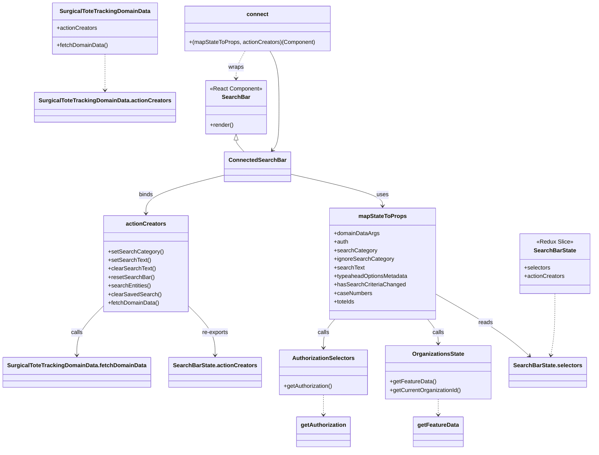

# Diagram: web/portal/src/pages/surgicaltotetracking/components/search/SurgicalToteTrackingSearchBarContainer.js

> Auto-generated by Obscura crawlers

## Mermaid

### SVG

<svg id="container" width="1622.8515625" xmlns="http://www.w3.org/2000/svg" class="classDiagram" height="1262" viewBox="0 0 1622.8515625 1262" role="graphics-document document" aria-roledescription="class"><g><defs><marker id="container_class-aggregationStart" class="marker aggregation class" refX="18" refY="7" markerWidth="190" markerHeight="240" orient="auto"><path d="M 18,7 L9,13 L1,7 L9,1 Z"></path></marker></defs><defs><marker id="container_class-aggregationEnd" class="marker aggregation class" refX="1" refY="7" markerWidth="20" markerHeight="28" orient="auto"><path d="M 18,7 L9,13 L1,7 L9,1 Z"></path></marker></defs><defs><marker id="container_class-extensionStart" class="marker extension class" refX="18" refY="7" markerWidth="190" markerHeight="240" orient="auto"><path d="M 1,7 L18,13 V 1 Z"></path></marker></defs><defs><marker id="container_class-extensionEnd" class="marker extension class" refX="1" refY="7" markerWidth="20" markerHeight="28" orient="auto"><path d="M 1,1 V 13 L18,7 Z"></path></marker></defs><defs><marker id="container_class-compositionStart" class="marker composition class" refX="18" refY="7" markerWidth="190" markerHeight="240" orient="auto"><path d="M 18,7 L9,13 L1,7 L9,1 Z"></path></marker></defs><defs><marker id="container_class-compositionEnd" class="marker composition class" refX="1" refY="7" markerWidth="20" markerHeight="28" orient="auto"><path d="M 18,7 L9,13 L1,7 L9,1 Z"></path></marker></defs><defs><marker id="container_class-dependencyStart" class="marker dependency class" refX="6" refY="7" markerWidth="190" markerHeight="240" orient="auto"><path d="M 5,7 L9,13 L1,7 L9,1 Z"></path></marker></defs><defs><marker id="container_class-dependencyEnd" class="marker dependency class" refX="13" refY="7" markerWidth="20" markerHeight="28" orient="auto"><path d="M 18,7 L9,13 L14,7 L9,1 Z"></path></marker></defs><defs><marker id="container_class-lollipopStart" class="marker lollipop class" refX="13" refY="7" markerWidth="190" markerHeight="240" orient="auto"><circle stroke="black" fill="transparent" cx="7" cy="7" r="6"></circle></marker></defs><defs><marker id="container_class-lollipopEnd" class="marker lollipop class" refX="1" refY="7" markerWidth="190" markerHeight="240" orient="auto"><circle stroke="black" fill="transparent" cx="7" cy="7" r="6"></circle></marker></defs><g class="root"><g class="clusters"></g><g class="edgePaths"><path d="M641.287,393.25L641.287,394.542C641.287,395.833,641.287,398.417,645.025,403.875C648.763,409.333,656.239,417.667,659.977,421.833L663.715,426" id="id_SearchBar_ConnectedSearchBar_1" class="edge-thickness-normal edge-pattern-solid relation" style=";;;" data-edge="true" data-et="edge" data-id="id_SearchBar_ConnectedSearchBar_1" data-points="W3sieCI6NjQxLjI4NzEwOTM3NSwieSI6Mzc2fSx7IngiOjY0MS4yODcxMDkzNzUsInkiOjQwMX0seyJ4Ijo2NjMuNzE0NTIzMDg3Njg2NSwieSI6NDI2fV0=" marker-start="url(#container_class-extensionStart)"></path><path d="M736.132,143L740.36,150.667C744.588,158.333,753.043,173.667,757.27,200C761.498,226.333,761.498,263.667,761.498,299C761.498,334.333,761.498,367.667,758.428,387.756C755.358,407.845,749.218,414.689,746.147,418.111L743.077,421.534" id="id_connect_ConnectedSearchBar_2" class="edge-thickness-normal edge-pattern-solid relation" style=";;;" data-edge="true" data-et="edge" data-id="id_connect_ConnectedSearchBar_2" data-points="W3sieCI6NzM2LjEzMjQzNjIwOTg2MjQsInkiOjE0M30seyJ4Ijo3NjEuNDk4MDQ2ODc1LCJ5IjoxODl9LHsieCI6NzYxLjQ5ODA0Njg3NSwieSI6MzAxfSx7IngiOjc2MS40OTgwNDY4NzUsInkiOjQwMX0seyJ4Ijo3MzkuMDcwNjMzMTYyMzEzNSwieSI6NDI2fV0=" marker-end="url(#container_class-dependencyEnd)"></path><path d="M666.653,143L662.425,150.667C658.198,158.333,649.742,173.667,645.515,186.5C641.287,199.333,641.287,209.667,641.287,214.833L641.287,220" id="id_connect_SearchBar_3" class="edge-thickness-normal edge-pattern-dashed relation" style=";;;" data-edge="true" data-et="edge" data-id="id_connect_SearchBar_3" data-points="W3sieCI6NjY2LjY1MjcyMDA0MDEzNzYsInkiOjE0M30seyJ4Ijo2NDEuMjg3MTA5Mzc1LCJ5IjoxODl9LHsieCI6NjQxLjI4NzEwOTM3NSwieSI6MjI2fV0=" marker-end="url(#container_class-dependencyEnd)"></path><path d="M789.385,488.597L830.968,498.331C872.552,508.065,955.719,527.532,997.303,542.433C1038.887,557.333,1038.887,567.667,1038.887,572.833L1038.887,578" id="id_ConnectedSearchBar_mapStateToProps_4" class="edge-thickness-normal edge-pattern-solid relation" style=";;;" data-edge="true" data-et="edge" data-id="id_ConnectedSearchBar_mapStateToProps_4" data-points="W3sieCI6Nzg5LjM4NDc2NTYyNSwieSI6NDg4LjU5NzA0NzQwMjQ0MzN9LHsieCI6MTAzOC44ODY3MTg3NSwieSI6NTQ3fSx7IngiOjEwMzguODg2NzE4NzUsInkiOjU4NH1d" marker-end="url(#container_class-dependencyEnd)"></path><path d="M613.4,490.482L576.532,499.901C539.664,509.321,465.928,528.161,429.06,546.247C392.191,564.333,392.191,581.667,392.191,590.333L392.191,599" id="id_ConnectedSearchBar_actionCreators_5" class="edge-thickness-normal edge-pattern-solid relation" style=";;;" data-edge="true" data-et="edge" data-id="id_ConnectedSearchBar_actionCreators_5" data-points="W3sieCI6NjEzLjQwMDM5MDYyNSwieSI6NDkwLjQ4MTc0Nzk1MTgxNjR9LHsieCI6MzkyLjE5MTQwNjI1LCJ5Ijo1NDd9LHsieCI6MzkyLjE5MTQwNjI1LCJ5Ijo2MDV9XQ==" marker-end="url(#container_class-dependencyEnd)"></path><path d="M1188.086,825.525L1219.334,843.438C1250.583,861.35,1313.079,897.175,1356.346,926.079C1399.612,954.984,1423.647,976.967,1435.665,987.959L1447.683,998.951" id="id_mapStateToProps_SearchBarState.selectors_6" class="edge-thickness-normal edge-pattern-solid relation" style=";;;" data-edge="true" data-et="edge" data-id="id_mapStateToProps_SearchBarState.selectors_6" data-points="W3sieCI6MTE4OC4wODU5Mzc1LCJ5Ijo4MjUuNTI1MjQ4NzE2NTM1N30seyJ4IjoxMzc1LjU3NjE3MTg3NSwieSI6OTMzfSx7IngiOjE0NTIuMTEwNTk1NzAzMTI1LCJ5IjoxMDAzfV0=" marker-end="url(#container_class-dependencyEnd)"></path><path d="M1166.42,896L1171.461,902.167C1176.502,908.333,1186.585,920.667,1191.627,932C1196.668,943.333,1196.668,953.667,1196.668,958.833L1196.668,964" id="id_mapStateToProps_OrganizationsState_7" class="edge-thickness-normal edge-pattern-solid relation" style=";;;" data-edge="true" data-et="edge" data-id="id_mapStateToProps_OrganizationsState_7" data-points="W3sieCI6MTE2Ni40MTk3NDk4MzgwODMsInkiOjg5Nn0seyJ4IjoxMTk2LjY2Nzk2ODc1LCJ5Ijo5MzN9LHsieCI6MTE5Ni42Njc5Njg3NSwieSI6OTcwfV0=" marker-end="url(#container_class-dependencyEnd)"></path><path d="M907.031,896L901.819,902.167C896.607,908.333,886.182,920.667,880.97,934C875.758,947.333,875.758,961.667,875.758,968.833L875.758,976" id="id_mapStateToProps_AuthorizationSelectors_8" class="edge-thickness-normal edge-pattern-solid relation" style=";;;" data-edge="true" data-et="edge" data-id="id_mapStateToProps_AuthorizationSelectors_8" data-points="W3sieCI6OTA3LjAzMTIyOTc2MDM2MjcsInkiOjg5Nn0seyJ4Ijo4NzUuNzU3ODEyNSwieSI6OTMzfSx7IngiOjg3NS43NTc4MTI1LCJ5Ijo5ODJ9XQ==" marker-end="url(#container_class-dependencyEnd)"></path><path d="M507.133,859.22L518.988,871.516C530.844,883.813,554.555,908.407,566.41,931.37C578.266,954.333,578.266,975.667,578.266,986.333L578.266,997" id="id_actionCreators_SearchBarState.actionCreators_9" class="edge-thickness-normal edge-pattern-solid relation" style=";;;" data-edge="true" data-et="edge" data-id="id_actionCreators_SearchBarState.actionCreators_9" data-points="W3sieCI6NTA3LjEzMjgxMjUsInkiOjg1OS4yMTk1ODY0Mzg1NDN9LHsieCI6NTc4LjI2NTYyNSwieSI6OTMzfSx7IngiOjU3OC4yNjU2MjUsInkiOjEwMDN9XQ==" marker-end="url(#container_class-dependencyEnd)"></path><path d="M277.25,859.22L265.395,871.516C253.539,883.813,229.828,908.407,217.973,931.37C206.117,954.333,206.117,975.667,206.117,986.333L206.117,997" id="id_actionCreators_SurgicalToteTrackingDomainData.fetchDomainData_10" class="edge-thickness-normal edge-pattern-solid relation" style=";;;" data-edge="true" data-et="edge" data-id="id_actionCreators_SurgicalToteTrackingDomainData.fetchDomainData_10" data-points="W3sieCI6Mjc3LjI1LCJ5Ijo4NTkuMjE5NTg2NDM4NTQzfSx7IngiOjIwNi4xMTcxODc1LCJ5Ijo5MzN9LHsieCI6MjA2LjExNzE4NzUsInkiOjEwMDN9XQ==" marker-end="url(#container_class-dependencyEnd)"></path><path d="M280.771,152L280.771,158.167C280.771,164.333,280.771,176.667,280.771,193.5C280.771,210.333,280.771,231.667,280.771,242.333L280.771,253" id="id_SurgicalToteTrackingDomainData_SurgicalToteTrackingDomainData.actionCreators_11" class="edge-thickness-normal edge-pattern-dashed relation" style=";;;" data-edge="true" data-et="edge" data-id="id_SurgicalToteTrackingDomainData_SurgicalToteTrackingDomainData.actionCreators_11" data-points="W3sieCI6MjgwLjc3MTQ4NDM3NSwieSI6MTUyfSx7IngiOjI4MC43NzE0ODQzNzUsInkiOjE4OX0seyJ4IjoyODAuNzcxNDg0Mzc1LCJ5IjoyNTl9XQ==" marker-end="url(#container_class-dependencyEnd)"></path><path d="M1518.035,824L1518.035,842.167C1518.035,860.333,1518.035,896.667,1516.127,925.516C1514.219,954.364,1510.403,975.729,1508.496,986.411L1506.588,997.093" id="id_SearchBarState_SearchBarState.selectors_12" class="edge-thickness-normal edge-pattern-dashed relation" style=";;;" data-edge="true" data-et="edge" data-id="id_SearchBarState_SearchBarState.selectors_12" data-points="W3sieCI6MTUxOC4wMzUxNTYyNSwieSI6ODI0fSx7IngiOjE1MTguMDM1MTU2MjUsInkiOjkzM30seyJ4IjoxNTA1LjUzMjcxNDg0Mzc1LCJ5IjoxMDAzfV0=" marker-end="url(#container_class-dependencyEnd)"></path><path d="M1196.668,1120L1196.668,1124.167C1196.668,1128.333,1196.668,1136.667,1196.668,1144C1196.668,1151.333,1196.668,1157.667,1196.668,1160.833L1196.668,1164" id="id_OrganizationsState_getFeatureData_13" class="edge-thickness-normal edge-pattern-dashed relation" style=";;;" data-edge="true" data-et="edge" data-id="id_OrganizationsState_getFeatureData_13" data-points="W3sieCI6MTE5Ni42Njc5Njg3NSwieSI6MTEyMH0seyJ4IjoxMTk2LjY2Nzk2ODc1LCJ5IjoxMTQ1fSx7IngiOjExOTYuNjY3OTY4NzUsInkiOjExNzB9XQ==" marker-end="url(#container_class-dependencyEnd)"></path><path d="M875.758,1108L875.758,1114.167C875.758,1120.333,875.758,1132.667,875.758,1142C875.758,1151.333,875.758,1157.667,875.758,1160.833L875.758,1164" id="id_AuthorizationSelectors_getAuthorization_14" class="edge-thickness-normal edge-pattern-dashed relation" style=";;;" data-edge="true" data-et="edge" data-id="id_AuthorizationSelectors_getAuthorization_14" data-points="W3sieCI6ODc1Ljc1NzgxMjUsInkiOjExMDh9LHsieCI6ODc1Ljc1NzgxMjUsInkiOjExNDV9LHsieCI6ODc1Ljc1NzgxMjUsInkiOjExNzB9XQ==" marker-end="url(#container_class-dependencyEnd)"></path></g><g class="edgeLabels"><g class="edgeLabel"><g class="label" data-id="id_SearchBar_ConnectedSearchBar_1" transform="translate(0, 0)"><foreignObject width="0" height="0">

</foreignObject></g></g><g class="edgeLabel"><g class="label" data-id="id_connect_ConnectedSearchBar_2" transform="translate(0, 0)"><foreignObject width="0" height="0">

</foreignObject></g></g><g class="edgeLabel" transform="translate(641.287109375, 189)"><g class="label" data-id="id_connect_SearchBar_3" transform="translate(-21.390625, -12)"><foreignObject width="42.78125" height="24">

wraps

</foreignObject></g></g><g class="edgeLabel" transform="translate(1038.88671875, 547)"><g class="label" data-id="id_ConnectedSearchBar_mapStateToProps_4" transform="translate(-16.4921875, -12)"><foreignObject width="32.984375" height="24">

uses

</foreignObject></g></g><g class="edgeLabel" transform="translate(392.19140625, 547)"><g class="label" data-id="id_ConnectedSearchBar_actionCreators_5" transform="translate(-20.21875, -12)"><foreignObject width="40.4375" height="24">

binds

</foreignObject></g></g><g class="edgeLabel" transform="translate(1326.82255, 905.05303)"><g class="label" data-id="id_mapStateToProps_SearchBarState.selectors_6" transform="translate(-20.0078125, -12)"><foreignObject width="40.015625" height="24">

reads

</foreignObject></g></g><g class="edgeLabel" transform="translate(1196.66796875, 933)"><g class="label" data-id="id_mapStateToProps_OrganizationsState_7" transform="translate(-16.4453125, -12)"><foreignObject width="32.890625" height="24">

calls

</foreignObject></g></g><g class="edgeLabel" transform="translate(875.7578125, 933)"><g class="label" data-id="id_mapStateToProps_AuthorizationSelectors_8" transform="translate(-16.4453125, -12)"><foreignObject width="32.890625" height="24">

calls

</foreignObject></g></g><g class="edgeLabel" transform="translate(578.265625, 933)"><g class="label" data-id="id_actionCreators_SearchBarState.actionCreators_9" transform="translate(-37.7421875, -12)"><foreignObject width="75.484375" height="24">

re-exports

</foreignObject></g></g><g class="edgeLabel" transform="translate(206.1171875, 933)"><g class="label" data-id="id_actionCreators_SurgicalToteTrackingDomainData.fetchDomainData_10" transform="translate(-16.4453125, -12)"><foreignObject width="32.890625" height="24">

calls

</foreignObject></g></g><g class="edgeLabel"><g class="label" data-id="id_SurgicalToteTrackingDomainData_SurgicalToteTrackingDomainData.actionCreators_11" transform="translate(0, 0)"><foreignObject width="0" height="0">

</foreignObject></g></g><g class="edgeLabel"><g class="label" data-id="id_SearchBarState_SearchBarState.selectors_12" transform="translate(0, 0)"><foreignObject width="0" height="0">

</foreignObject></g></g><g class="edgeLabel"><g class="label" data-id="id_OrganizationsState_getFeatureData_13" transform="translate(0, 0)"><foreignObject width="0" height="0">

</foreignObject></g></g><g class="edgeLabel"><g class="label" data-id="id_AuthorizationSelectors_getAuthorization_14" transform="translate(0, 0)"><foreignObject width="0" height="0">

</foreignObject></g></g></g><g class="nodes"><g class="node default" id="classId-SearchBar-0" transform="translate(641.287109375, 301)"><g class="basic label-container"><path d="M-85.2109375 -75 L85.2109375 -75 L85.2109375 75 L-85.2109375 75" stroke="none" stroke-width="0" fill="#ECECFF" style=""></path><path d="M-85.2109375 -75 C-40.101784737678145 -75, 5.007368024643711 -75, 85.2109375 -75 M-85.2109375 -75 C-40.84740001594697 -75, 3.5161374681060664 -75, 85.2109375 -75 M85.2109375 -75 C85.2109375 -21.17755936705815, 85.2109375 32.6448812658837, 85.2109375 75 M85.2109375 -75 C85.2109375 -23.674348233398185, 85.2109375 27.65130353320363, 85.2109375 75 M85.2109375 75 C18.421589182854888 75, -48.367759134290225 75, -85.2109375 75 M85.2109375 75 C27.114757266107333 75, -30.981422967785335 75, -85.2109375 75 M-85.2109375 75 C-85.2109375 30.750262462730653, -85.2109375 -13.499475074538694, -85.2109375 -75 M-85.2109375 75 C-85.2109375 36.87634836688611, -85.2109375 -1.2473032662277745, -85.2109375 -75" stroke="#9370DB" stroke-width="1.3" fill="none" stroke-dasharray="0 0" style=""></path></g><g class="annotation-group text" transform="translate(-73.2109375, -51)"><g class="label" style="" transform="translate(0,-12)"><foreignObject width="146.421875" height="24">

«React Component»

</foreignObject></g></g><g class="label-group text" transform="translate(-37.2421875, -27)"><g class="label" style="font-weight: bolder" transform="translate(0,-12)"><foreignObject width="74.484375" height="24">

SearchBar

</foreignObject></g></g><g class="members-group text" transform="translate(-73.2109375, 21)"></g><g class="methods-group text" transform="translate(-73.2109375, 51)"><g class="label" style="" transform="translate(0,-12)"><foreignObject width="66.609375" height="24">

+render()

</foreignObject></g></g><g class="divider" style=""><path d="M-85.2109375 -3 C-46.61478517975943 -3, -8.01863285951886 -3, 85.2109375 -3 M-85.2109375 -3 C-36.44179538005896 -3, 12.327346739882074 -3, 85.2109375 -3" stroke="#9370DB" stroke-width="1.3" fill="none" stroke-dasharray="0 0" style=""></path></g><g class="divider" style=""><path d="M-85.2109375 21 C-51.11672808579477 21, -17.022518671589538 21, 85.2109375 21 M-85.2109375 21 C-29.842183279640054 21, 25.526570940719893 21, 85.2109375 21" stroke="#9370DB" stroke-width="1.3" fill="none" stroke-dasharray="0 0" style=""></path></g></g><g class="node default" id="classId-connect-1" transform="translate(701.392578125, 80)"><g class="basic label-container"><path d="M-202.91796875 -63 L202.91796875 -63 L202.91796875 63 L-202.91796875 63" stroke="none" stroke-width="0" fill="#ECECFF" style=""></path><path d="M-202.91796875 -63 C-76.30368363153681 -63, 50.31060148692637 -63, 202.91796875 -63 M-202.91796875 -63 C-51.65627031116483 -63, 99.60542812767034 -63, 202.91796875 -63 M202.91796875 -63 C202.91796875 -33.79347493399757, 202.91796875 -4.586949867995145, 202.91796875 63 M202.91796875 -63 C202.91796875 -22.765040187503253, 202.91796875 17.469919624993494, 202.91796875 63 M202.91796875 63 C70.5671080665806 63, -61.7837526168388 63, -202.91796875 63 M202.91796875 63 C59.15009819558719 63, -84.61777235882562 63, -202.91796875 63 M-202.91796875 63 C-202.91796875 36.22877813008344, -202.91796875 9.45755626016689, -202.91796875 -63 M-202.91796875 63 C-202.91796875 27.161386525042204, -202.91796875 -8.677226949915593, -202.91796875 -63" stroke="#9370DB" stroke-width="1.3" fill="none" stroke-dasharray="0 0" style=""></path></g><g class="annotation-group text" transform="translate(0, -39)"></g><g class="label-group text" transform="translate(-28.9140625, -39)"><g class="label" style="font-weight: bolder" transform="translate(0,-12)"><foreignObject width="57.828125" height="24">

connect

</foreignObject></g></g><g class="members-group text" transform="translate(-190.91796875, 9)"></g><g class="methods-group text" transform="translate(-190.91796875, 39)"><g class="label" style="" transform="translate(0,-12)"><foreignObject width="352.921875" height="24">

+(mapStateToProps, actionCreators)(Component)

</foreignObject></g></g><g class="divider" style=""><path d="M-202.91796875 -15 C-112.66359564912308 -15, -22.409222548246163 -15, 202.91796875 -15 M-202.91796875 -15 C-59.98632300285797 -15, 82.94532274428406 -15, 202.91796875 -15" stroke="#9370DB" stroke-width="1.3" fill="none" stroke-dasharray="0 0" style=""></path></g><g class="divider" style=""><path d="M-202.91796875 9 C-63.35236866283617 9, 76.21323142432766 9, 202.91796875 9 M-202.91796875 9 C-91.27420448661488 9, 20.369559776770245 9, 202.91796875 9" stroke="#9370DB" stroke-width="1.3" fill="none" stroke-dasharray="0 0" style=""></path></g></g><g class="node default" id="classId-mapStateToProps-2" transform="translate(1038.88671875, 740)"><g class="basic label-container"><path d="M-149.19921875 -156 L149.19921875 -156 L149.19921875 156 L-149.19921875 156" stroke="none" stroke-width="0" fill="#ECECFF" style=""></path><path d="M-149.19921875 -156 C-65.97839984209313 -156, 17.24241906581375 -156, 149.19921875 -156 M-149.19921875 -156 C-53.9816033471962 -156, 41.2360120556076 -156, 149.19921875 -156 M149.19921875 -156 C149.19921875 -53.81440677756552, 149.19921875 48.371186444868954, 149.19921875 156 M149.19921875 -156 C149.19921875 -59.264675052545186, 149.19921875 37.47064989490963, 149.19921875 156 M149.19921875 156 C86.56136206217445 156, 23.923505374348892 156, -149.19921875 156 M149.19921875 156 C30.283802012857976 156, -88.63161472428405 156, -149.19921875 156 M-149.19921875 156 C-149.19921875 50.570656923797515, -149.19921875 -54.85868615240497, -149.19921875 -156 M-149.19921875 156 C-149.19921875 61.59029748905718, -149.19921875 -32.81940502188564, -149.19921875 -156" stroke="#9370DB" stroke-width="1.3" fill="none" stroke-dasharray="0 0" style=""></path></g><g class="annotation-group text" transform="translate(0, -132)"></g><g class="label-group text" transform="translate(-64.7109375, -132)"><g class="label" style="font-weight: bolder" transform="translate(0,-12)"><foreignObject width="129.421875" height="24">

mapStateToProps

</foreignObject></g></g><g class="members-group text" transform="translate(-137.19921875, -84)"><g class="label" style="" transform="translate(0,-12)"><foreignObject width="127.203125" height="24">

+domainDataArgs

</foreignObject></g><g class="label" style="" transform="translate(0,12)"><foreignObject width="40.921875" height="24">

+auth

</foreignObject></g><g class="label" style="" transform="translate(0,36)"><foreignObject width="118.65625" height="24">

+searchCategory

</foreignObject></g><g class="label" style="" transform="translate(0,60)"><foreignObject width="165.875" height="24">

+ignoreSearchCategory

</foreignObject></g><g class="label" style="" transform="translate(0,84)"><foreignObject width="84.953125" height="24">

+searchText

</foreignObject></g><g class="label" style="" transform="translate(0,108)"><foreignObject width="209.6875" height="24">

+typeaheadOptionsMetadata

</foreignObject></g><g class="label" style="" transform="translate(0,132)"><foreignObject width="197.75" height="24">

+hasSearchCriteriaChanged

</foreignObject></g><g class="label" style="" transform="translate(0,156)"><foreignObject width="105.796875" height="24">

+caseNumbers

</foreignObject></g><g class="label" style="" transform="translate(0,180)"><foreignObject width="58.8125" height="24">

+toteIds

</foreignObject></g></g><g class="methods-group text" transform="translate(-137.19921875, 156)"></g><g class="divider" style=""><path d="M-149.19921875 -108 C-51.145088170219125 -108, 46.90904240956175 -108, 149.19921875 -108 M-149.19921875 -108 C-63.58958498943609 -108, 22.02004877112782 -108, 149.19921875 -108" stroke="#9370DB" stroke-width="1.3" fill="none" stroke-dasharray="0 0" style=""></path></g><g class="divider" style=""><path d="M-149.19921875 132 C-63.8983564830496 132, 21.402505783900807 132, 149.19921875 132 M-149.19921875 132 C-30.930565834983412 132, 87.33808708003318 132, 149.19921875 132" stroke="#9370DB" stroke-width="1.3" fill="none" stroke-dasharray="0 0" style=""></path></g></g><g class="node default" id="classId-actionCreators-3" transform="translate(392.19140625, 740)"><g class="basic label-container"><path d="M-114.94140625 -135 L114.94140625 -135 L114.94140625 135 L-114.94140625 135" stroke="none" stroke-width="0" fill="#ECECFF" style=""></path><path d="M-114.94140625 -135 C-65.02004273827376 -135, -15.098679226547503 -135, 114.94140625 -135 M-114.94140625 -135 C-45.21690510675097 -135, 24.507596036498057 -135, 114.94140625 -135 M114.94140625 -135 C114.94140625 -78.84604957132203, 114.94140625 -22.69209914264404, 114.94140625 135 M114.94140625 -135 C114.94140625 -37.82073322486977, 114.94140625 59.35853355026046, 114.94140625 135 M114.94140625 135 C48.06062733315656 135, -18.82015158368688 135, -114.94140625 135 M114.94140625 135 C61.35705070674779 135, 7.772695163495584 135, -114.94140625 135 M-114.94140625 135 C-114.94140625 57.85132610050462, -114.94140625 -19.297347798990756, -114.94140625 -135 M-114.94140625 135 C-114.94140625 75.29892450433213, -114.94140625 15.59784900866427, -114.94140625 -135" stroke="#9370DB" stroke-width="1.3" fill="none" stroke-dasharray="0 0" style=""></path></g><g class="annotation-group text" transform="translate(0, -111)"></g><g class="label-group text" transform="translate(-53.6328125, -111)"><g class="label" style="font-weight: bolder" transform="translate(0,-12)"><foreignObject width="107.265625" height="24">

actionCreators

</foreignObject></g></g><g class="members-group text" transform="translate(-102.94140625, -63)"></g><g class="methods-group text" transform="translate(-102.94140625, -33)"><g class="label" style="" transform="translate(0,-12)"><foreignObject width="152.25" height="24">

+setSearchCategory()

</foreignObject></g><g class="label" style="" transform="translate(0,12)"><foreignObject width="118.53125" height="24">

+setSearchText()

</foreignObject></g><g class="label" style="" transform="translate(0,36)"><foreignObject width="132.265625" height="24">

+clearSearchText()

</foreignObject></g><g class="label" style="" transform="translate(0,60)"><foreignObject width="128.0625" height="24">

+resetSearchBar()

</foreignObject></g><g class="label" style="" transform="translate(0,84)"><foreignObject width="120.359375" height="24">

+searchEntities()

</foreignObject></g><g class="label" style="" transform="translate(0,108)"><foreignObject width="146.046875" height="24">

+clearSavedSearch()

</foreignObject></g><g class="label" style="" transform="translate(0,132)"><foreignObject width="143.765625" height="24">

+fetchDomainData()

</foreignObject></g></g><g class="divider" style=""><path d="M-114.94140625 -87 C-40.243360293581034 -87, 34.45468566283793 -87, 114.94140625 -87 M-114.94140625 -87 C-54.919581032689 -87, 5.102244184621995 -87, 114.94140625 -87" stroke="#9370DB" stroke-width="1.3" fill="none" stroke-dasharray="0 0" style=""></path></g><g class="divider" style=""><path d="M-114.94140625 -63 C-54.24861818195606 -63, 6.444169886087877 -63, 114.94140625 -63 M-114.94140625 -63 C-57.93823035489452 -63, -0.9350544597890433 -63, 114.94140625 -63" stroke="#9370DB" stroke-width="1.3" fill="none" stroke-dasharray="0 0" style=""></path></g></g><g class="node default" id="classId-SearchBarState-4" transform="translate(1518.03515625, 740)"><g class="basic label-container"><path d="M-96.81640625 -84 L96.81640625 -84 L96.81640625 84 L-96.81640625 84" stroke="none" stroke-width="0" fill="#ECECFF" style=""></path><path d="M-96.81640625 -84 C-29.03915130633726 -84, 38.73810363732548 -84, 96.81640625 -84 M-96.81640625 -84 C-32.86158661848888 -84, 31.093233013022243 -84, 96.81640625 -84 M96.81640625 -84 C96.81640625 -24.7001198415891, 96.81640625 34.5997603168218, 96.81640625 84 M96.81640625 -84 C96.81640625 -37.84928356809228, 96.81640625 8.301432863815435, 96.81640625 84 M96.81640625 84 C36.93835069508317 84, -22.939704859833654 84, -96.81640625 84 M96.81640625 84 C27.573906821991173 84, -41.668592606017654 84, -96.81640625 84 M-96.81640625 84 C-96.81640625 33.497367051216266, -96.81640625 -17.00526589756747, -96.81640625 -84 M-96.81640625 84 C-96.81640625 39.09437655832471, -96.81640625 -5.811246883350577, -96.81640625 -84" stroke="#9370DB" stroke-width="1.3" fill="none" stroke-dasharray="0 0" style=""></path></g><g class="annotation-group text" transform="translate(-50.4765625, -60)"><g class="label" style="" transform="translate(0,-12)"><foreignObject width="100.953125" height="24">

«Redux Slice»

</foreignObject></g></g><g class="label-group text" transform="translate(-56.5546875, -36)"><g class="label" style="font-weight: bolder" transform="translate(0,-12)"><foreignObject width="113.109375" height="24">

SearchBarState

</foreignObject></g></g><g class="members-group text" transform="translate(-84.81640625, 12)"><g class="label" style="" transform="translate(0,-12)"><foreignObject width="73.453125" height="24">

+selectors

</foreignObject></g><g class="label" style="" transform="translate(0,12)"><foreignObject width="113.078125" height="24">

+actionCreators

</foreignObject></g></g><g class="methods-group text" transform="translate(-84.81640625, 84)"></g><g class="divider" style=""><path d="M-96.81640625 -12 C-37.388249651413474 -12, 22.03990694717305 -12, 96.81640625 -12 M-96.81640625 -12 C-56.53637569125709 -12, -16.256345132514184 -12, 96.81640625 -12" stroke="#9370DB" stroke-width="1.3" fill="none" stroke-dasharray="0 0" style=""></path></g><g class="divider" style=""><path d="M-96.81640625 60 C-21.513140930257023 60, 53.79012438948595 60, 96.81640625 60 M-96.81640625 60 C-55.3458152126891 60, -13.875224175378193 60, 96.81640625 60" stroke="#9370DB" stroke-width="1.3" fill="none" stroke-dasharray="0 0" style=""></path></g></g><g class="node default" id="classId-SurgicalToteTrackingDomainData-5" transform="translate(280.771484375, 80)"><g class="basic label-container"><path d="M-144.37109375 -72 L144.37109375 -72 L144.37109375 72 L-144.37109375 72" stroke="none" stroke-width="0" fill="#ECECFF" style=""></path><path d="M-144.37109375 -72 C-55.7522367582593 -72, 32.8666202334814 -72, 144.37109375 -72 M-144.37109375 -72 C-73.86095952856606 -72, -3.350825307132112 -72, 144.37109375 -72 M144.37109375 -72 C144.37109375 -21.14921015520703, 144.37109375 29.70157968958594, 144.37109375 72 M144.37109375 -72 C144.37109375 -20.890384844527624, 144.37109375 30.219230310944752, 144.37109375 72 M144.37109375 72 C30.617777994166914 72, -83.13553776166617 72, -144.37109375 72 M144.37109375 72 C68.28287956470768 72, -7.805334620584631 72, -144.37109375 72 M-144.37109375 72 C-144.37109375 18.74263074394679, -144.37109375 -34.51473851210642, -144.37109375 -72 M-144.37109375 72 C-144.37109375 22.751444213837203, -144.37109375 -26.497111572325593, -144.37109375 -72" stroke="#9370DB" stroke-width="1.3" fill="none" stroke-dasharray="0 0" style=""></path></g><g class="annotation-group text" transform="translate(0, -48)"></g><g class="label-group text" transform="translate(-120.9765625, -48)"><g class="label" style="font-weight: bolder" transform="translate(0,-12)"><foreignObject width="241.953125" height="24">

SurgicalToteTrackingDomainData

</foreignObject></g></g><g class="members-group text" transform="translate(-132.37109375, 0)"><g class="label" style="" transform="translate(0,-12)"><foreignObject width="113.078125" height="24">

+actionCreators

</foreignObject></g></g><g class="methods-group text" transform="translate(-132.37109375, 48)"><g class="label" style="" transform="translate(0,-12)"><foreignObject width="143.765625" height="24">

+fetchDomainData()

</foreignObject></g></g><g class="divider" style=""><path d="M-144.37109375 -24 C-62.74875776395966 -24, 18.87357822208068 -24, 144.37109375 -24 M-144.37109375 -24 C-41.66883865220386 -24, 61.03341644559228 -24, 144.37109375 -24" stroke="#9370DB" stroke-width="1.3" fill="none" stroke-dasharray="0 0" style=""></path></g><g class="divider" style=""><path d="M-144.37109375 24 C-50.58478554399839 24, 43.201522662003214 24, 144.37109375 24 M-144.37109375 24 C-47.119081269022786 24, 50.13293121195443 24, 144.37109375 24" stroke="#9370DB" stroke-width="1.3" fill="none" stroke-dasharray="0 0" style=""></path></g></g><g class="node default" id="classId-OrganizationsState-6" transform="translate(1196.66796875, 1045)"><g class="basic label-container"><path d="M-147.44921875 -75 L147.44921875 -75 L147.44921875 75 L-147.44921875 75" stroke="none" stroke-width="0" fill="#ECECFF" style=""></path><path d="M-147.44921875 -75 C-46.41419663874652 -75, 54.620825472506965 -75, 147.44921875 -75 M-147.44921875 -75 C-41.66753239095355 -75, 64.1141539680929 -75, 147.44921875 -75 M147.44921875 -75 C147.44921875 -25.625003547304424, 147.44921875 23.749992905391153, 147.44921875 75 M147.44921875 -75 C147.44921875 -18.858298677081443, 147.44921875 37.283402645837114, 147.44921875 75 M147.44921875 75 C64.85275883425396 75, -17.743701081492077 75, -147.44921875 75 M147.44921875 75 C52.84921140920004 75, -41.750795931599924 75, -147.44921875 75 M-147.44921875 75 C-147.44921875 39.610892992120334, -147.44921875 4.221785984240668, -147.44921875 -75 M-147.44921875 75 C-147.44921875 41.82630740950313, -147.44921875 8.65261481900626, -147.44921875 -75" stroke="#9370DB" stroke-width="1.3" fill="none" stroke-dasharray="0 0" style=""></path></g><g class="annotation-group text" transform="translate(0, -51)"></g><g class="label-group text" transform="translate(-69.8671875, -51)"><g class="label" style="font-weight: bolder" transform="translate(0,-12)"><foreignObject width="139.734375" height="24">

OrganizationsState

</foreignObject></g></g><g class="members-group text" transform="translate(-135.44921875, -3)"></g><g class="methods-group text" transform="translate(-135.44921875, 27)"><g class="label" style="" transform="translate(0,-12)"><foreignObject width="128.203125" height="24">

+getFeatureData()

</foreignObject></g><g class="label" style="" transform="translate(0,12)"><foreignObject width="201.03125" height="24">

+getCurrentOrganizationId()

</foreignObject></g></g><g class="divider" style=""><path d="M-147.44921875 -27 C-84.16137418261444 -27, -20.873529615228875 -27, 147.44921875 -27 M-147.44921875 -27 C-40.56307313203038 -27, 66.32307248593924 -27, 147.44921875 -27" stroke="#9370DB" stroke-width="1.3" fill="none" stroke-dasharray="0 0" style=""></path></g><g class="divider" style=""><path d="M-147.44921875 -3 C-84.2668706248354 -3, -21.084522499670825 -3, 147.44921875 -3 M-147.44921875 -3 C-56.68834877117921 -3, 34.072521207641586 -3, 147.44921875 -3" stroke="#9370DB" stroke-width="1.3" fill="none" stroke-dasharray="0 0" style=""></path></g></g><g class="node default" id="classId-AuthorizationSelectors-7" transform="translate(875.7578125, 1045)"><g class="basic label-container"><path d="M-123.4609375 -63 L123.4609375 -63 L123.4609375 63 L-123.4609375 63" stroke="none" stroke-width="0" fill="#ECECFF" style=""></path><path d="M-123.4609375 -63 C-72.41565461447468 -63, -21.370371728949337 -63, 123.4609375 -63 M-123.4609375 -63 C-54.61233645634543 -63, 14.236264587309137 -63, 123.4609375 -63 M123.4609375 -63 C123.4609375 -24.802082315780908, 123.4609375 13.395835368438185, 123.4609375 63 M123.4609375 -63 C123.4609375 -22.35775663691701, 123.4609375 18.28448672616598, 123.4609375 63 M123.4609375 63 C44.0411458585812 63, -35.378645782837594 63, -123.4609375 63 M123.4609375 63 C34.03235084257149 63, -55.39623581485702 63, -123.4609375 63 M-123.4609375 63 C-123.4609375 29.5551260408915, -123.4609375 -3.8897479182169974, -123.4609375 -63 M-123.4609375 63 C-123.4609375 32.592498890555675, -123.4609375 2.184997781111342, -123.4609375 -63" stroke="#9370DB" stroke-width="1.3" fill="none" stroke-dasharray="0 0" style=""></path></g><g class="annotation-group text" transform="translate(0, -39)"></g><g class="label-group text" transform="translate(-83.875, -39)"><g class="label" style="font-weight: bolder" transform="translate(0,-12)"><foreignObject width="167.75" height="24">

AuthorizationSelectors

</foreignObject></g></g><g class="members-group text" transform="translate(-111.4609375, 9)"></g><g class="methods-group text" transform="translate(-111.4609375, 39)"><g class="label" style="" transform="translate(0,-12)"><foreignObject width="139.046875" height="24">

+getAuthorization()

</foreignObject></g></g><g class="divider" style=""><path d="M-123.4609375 -15 C-29.035551024317996 -15, 65.38983545136401 -15, 123.4609375 -15 M-123.4609375 -15 C-73.32843597036042 -15, -23.195934440720833 -15, 123.4609375 -15" stroke="#9370DB" stroke-width="1.3" fill="none" stroke-dasharray="0 0" style=""></path></g><g class="divider" style=""><path d="M-123.4609375 9 C-66.44489718510849 9, -9.428856870216975 9, 123.4609375 9 M-123.4609375 9 C-53.532887617764445 9, 16.39516226447111 9, 123.4609375 9" stroke="#9370DB" stroke-width="1.3" fill="none" stroke-dasharray="0 0" style=""></path></g></g><g class="node default" id="classId-ConnectedSearchBar-8" transform="translate(701.392578125, 468)"><g class="basic label-container"><path d="M-87.9921875 -42 L87.9921875 -42 L87.9921875 42 L-87.9921875 42" stroke="none" stroke-width="0" fill="#ECECFF" style=""></path><path d="M-87.9921875 -42 C-36.18247494033309 -42, 15.627237619333826 -42, 87.9921875 -42 M-87.9921875 -42 C-35.95743840935503 -42, 16.077310681289944 -42, 87.9921875 -42 M87.9921875 -42 C87.9921875 -24.59129004912525, 87.9921875 -7.182580098250497, 87.9921875 42 M87.9921875 -42 C87.9921875 -23.964655172778716, 87.9921875 -5.9293103455574325, 87.9921875 42 M87.9921875 42 C45.84863610458181 42, 3.7050847091636143 42, -87.9921875 42 M87.9921875 42 C41.28230458035869 42, -5.4275783392826185 42, -87.9921875 42 M-87.9921875 42 C-87.9921875 10.690917894309905, -87.9921875 -20.61816421138019, -87.9921875 -42 M-87.9921875 42 C-87.9921875 15.06315650442744, -87.9921875 -11.87368699114512, -87.9921875 -42" stroke="#9370DB" stroke-width="1.3" fill="none" stroke-dasharray="0 0" style=""></path></g><g class="annotation-group text" transform="translate(0, -18)"></g><g class="label-group text" transform="translate(-75.9921875, -18)"><g class="label" style="font-weight: bolder" transform="translate(0,-12)"><foreignObject width="151.984375" height="24">

ConnectedSearchBar

</foreignObject></g></g><g class="members-group text" transform="translate(-75.9921875, 30)"></g><g class="methods-group text" transform="translate(-75.9921875, 60)"></g><g class="divider" style=""><path d="M-87.9921875 6 C-40.76926041348655 6, 6.453666673026902 6, 87.9921875 6 M-87.9921875 6 C-36.20746886789611 6, 15.577249764207778 6, 87.9921875 6" stroke="#9370DB" stroke-width="1.3" fill="none" stroke-dasharray="0 0" style=""></path></g><g class="divider" style=""><path d="M-87.9921875 24 C-35.24999995852783 24, 17.49218758294434 24, 87.9921875 24 M-87.9921875 24 C-43.815202510518525 24, 0.3617824789629509 24, 87.9921875 24" stroke="#9370DB" stroke-width="1.3" fill="none" stroke-dasharray="0 0" style=""></path></g></g><g class="node default" id="classId-SearchBarState.selectors-9" transform="translate(1498.03125, 1045)"><g class="basic label-container"><path d="M-103.9140625 -42 L103.9140625 -42 L103.9140625 42 L-103.9140625 42" stroke="none" stroke-width="0" fill="#ECECFF" style=""></path><path d="M-103.9140625 -42 C-28.317267562574187 -42, 47.279527374851625 -42, 103.9140625 -42 M-103.9140625 -42 C-43.143046946707585 -42, 17.62796860658483 -42, 103.9140625 -42 M103.9140625 -42 C103.9140625 -17.168484853693084, 103.9140625 7.663030292613833, 103.9140625 42 M103.9140625 -42 C103.9140625 -12.616512506147235, 103.9140625 16.76697498770553, 103.9140625 42 M103.9140625 42 C36.341675182426016 42, -31.230712135147968 42, -103.9140625 42 M103.9140625 42 C51.675343887515105 42, -0.5633747249697905 42, -103.9140625 42 M-103.9140625 42 C-103.9140625 23.028883272295506, -103.9140625 4.057766544591011, -103.9140625 -42 M-103.9140625 42 C-103.9140625 19.117966331398005, -103.9140625 -3.76406733720399, -103.9140625 -42" stroke="#9370DB" stroke-width="1.3" fill="none" stroke-dasharray="0 0" style=""></path></g><g class="annotation-group text" transform="translate(0, -18)"></g><g class="label-group text" transform="translate(-91.9140625, -18)"><g class="label" style="font-weight: bolder" transform="translate(0,-12)"><foreignObject width="183.828125" height="24">

SearchBarState.selectors

</foreignObject></g></g><g class="members-group text" transform="translate(-91.9140625, 30)"></g><g class="methods-group text" transform="translate(-91.9140625, 60)"></g><g class="divider" style=""><path d="M-103.9140625 6 C-61.70823065256043 6, -19.502398805120862 6, 103.9140625 6 M-103.9140625 6 C-46.954226640420615 6, 10.00560921915877 6, 103.9140625 6" stroke="#9370DB" stroke-width="1.3" fill="none" stroke-dasharray="0 0" style=""></path></g><g class="divider" style=""><path d="M-103.9140625 24 C-24.726613257871776 24, 54.46083598425645 24, 103.9140625 24 M-103.9140625 24 C-54.66314549873597 24, -5.4122284974719435 24, 103.9140625 24" stroke="#9370DB" stroke-width="1.3" fill="none" stroke-dasharray="0 0" style=""></path></g></g><g class="node default" id="classId-SearchBarState.actionCreators-10" transform="translate(578.265625, 1045)"><g class="basic label-container"><path d="M-124.03125 -42 L124.03125 -42 L124.03125 42 L-124.03125 42" stroke="none" stroke-width="0" fill="#ECECFF" style=""></path><path d="M-124.03125 -42 C-41.38570694095475 -42, 41.259836118090504 -42, 124.03125 -42 M-124.03125 -42 C-58.582596507222945 -42, 6.86605698555411 -42, 124.03125 -42 M124.03125 -42 C124.03125 -21.413043317006842, 124.03125 -0.8260866340136843, 124.03125 42 M124.03125 -42 C124.03125 -12.939109724447885, 124.03125 16.12178055110423, 124.03125 42 M124.03125 42 C61.02190746487637 42, -1.9874350702472583 42, -124.03125 42 M124.03125 42 C63.53884808256591 42, 3.046446165131826 42, -124.03125 42 M-124.03125 42 C-124.03125 11.083475826598686, -124.03125 -19.833048346802627, -124.03125 -42 M-124.03125 42 C-124.03125 19.80572090852107, -124.03125 -2.3885581829578584, -124.03125 -42" stroke="#9370DB" stroke-width="1.3" fill="none" stroke-dasharray="0 0" style=""></path></g><g class="annotation-group text" transform="translate(0, -18)"></g><g class="label-group text" transform="translate(-112.03125, -18)"><g class="label" style="font-weight: bolder" transform="translate(0,-12)"><foreignObject width="224.0625" height="24">

SearchBarState.actionCreators

</foreignObject></g></g><g class="members-group text" transform="translate(-112.03125, 30)"></g><g class="methods-group text" transform="translate(-112.03125, 60)"></g><g class="divider" style=""><path d="M-124.03125 6 C-69.1758268312755 6, -14.320403662551001 6, 124.03125 6 M-124.03125 6 C-32.744046863100834 6, 58.54315627379833 6, 124.03125 6" stroke="#9370DB" stroke-width="1.3" fill="none" stroke-dasharray="0 0" style=""></path></g><g class="divider" style=""><path d="M-124.03125 24 C-44.9634766076137 24, 34.1042967847726 24, 124.03125 24 M-124.03125 24 C-53.687871090318836 24, 16.655507819362327 24, 124.03125 24" stroke="#9370DB" stroke-width="1.3" fill="none" stroke-dasharray="0 0" style=""></path></g></g><g class="node default" id="classId-SurgicalToteTrackingDomainData.fetchDomainData-11" transform="translate(206.1171875, 1045)"><g class="basic label-container"><path d="M-198.1171875 -42 L198.1171875 -42 L198.1171875 42 L-198.1171875 42" stroke="none" stroke-width="0" fill="#ECECFF" style=""></path><path d="M-198.1171875 -42 C-93.2831787721433 -42, 11.550829955713397 -42, 198.1171875 -42 M-198.1171875 -42 C-41.61784034668375 -42, 114.8815068066325 -42, 198.1171875 -42 M198.1171875 -42 C198.1171875 -16.930926397984706, 198.1171875 8.138147204030588, 198.1171875 42 M198.1171875 -42 C198.1171875 -17.539142755974222, 198.1171875 6.921714488051556, 198.1171875 42 M198.1171875 42 C83.088530323757 42, -31.940126852486003 42, -198.1171875 42 M198.1171875 42 C114.63125129341346 42, 31.145315086826912 42, -198.1171875 42 M-198.1171875 42 C-198.1171875 21.049859125156104, -198.1171875 0.0997182503122076, -198.1171875 -42 M-198.1171875 42 C-198.1171875 14.295753760408974, -198.1171875 -13.408492479182051, -198.1171875 -42" stroke="#9370DB" stroke-width="1.3" fill="none" stroke-dasharray="0 0" style=""></path></g><g class="annotation-group text" transform="translate(0, -18)"></g><g class="label-group text" transform="translate(-186.1171875, -18)"><g class="label" style="font-weight: bolder" transform="translate(0,-12)"><foreignObject width="372.234375" height="24">

SurgicalToteTrackingDomainData.fetchDomainData

</foreignObject></g></g><g class="members-group text" transform="translate(-186.1171875, 30)"></g><g class="methods-group text" transform="translate(-186.1171875, 60)"></g><g class="divider" style=""><path d="M-198.1171875 6 C-115.2833362686374 6, -32.4494850372748 6, 198.1171875 6 M-198.1171875 6 C-44.69898184796142 6, 108.71922380407716 6, 198.1171875 6" stroke="#9370DB" stroke-width="1.3" fill="none" stroke-dasharray="0 0" style=""></path></g><g class="divider" style=""><path d="M-198.1171875 24 C-78.62268035959241 24, 40.871826780815184 24, 198.1171875 24 M-198.1171875 24 C-79.81166848967439 24, 38.49385052065122 24, 198.1171875 24" stroke="#9370DB" stroke-width="1.3" fill="none" stroke-dasharray="0 0" style=""></path></g></g><g class="node default" id="classId-SurgicalToteTrackingDomainData.actionCreators-12" transform="translate(280.771484375, 301)"><g class="basic label-container"><path d="M-188.53125 -42 L188.53125 -42 L188.53125 42 L-188.53125 42" stroke="none" stroke-width="0" fill="#ECECFF" style=""></path><path d="M-188.53125 -42 C-104.56337760989003 -42, -20.59550521978005 -42, 188.53125 -42 M-188.53125 -42 C-82.90037351740395 -42, 22.730502965192102 -42, 188.53125 -42 M188.53125 -42 C188.53125 -12.382845658618546, 188.53125 17.234308682762908, 188.53125 42 M188.53125 -42 C188.53125 -11.368698436515857, 188.53125 19.262603126968287, 188.53125 42 M188.53125 42 C45.08514774460272 42, -98.36095451079456 42, -188.53125 42 M188.53125 42 C62.10966014023401 42, -64.31192971953197 42, -188.53125 42 M-188.53125 42 C-188.53125 23.792264470900548, -188.53125 5.584528941801096, -188.53125 -42 M-188.53125 42 C-188.53125 15.151377451457893, -188.53125 -11.697245097084213, -188.53125 -42" stroke="#9370DB" stroke-width="1.3" fill="none" stroke-dasharray="0 0" style=""></path></g><g class="annotation-group text" transform="translate(0, -18)"></g><g class="label-group text" transform="translate(-176.53125, -18)"><g class="label" style="font-weight: bolder" transform="translate(0,-12)"><foreignObject width="353.0625" height="24">

SurgicalToteTrackingDomainData.actionCreators

</foreignObject></g></g><g class="members-group text" transform="translate(-176.53125, 30)"></g><g class="methods-group text" transform="translate(-176.53125, 60)"></g><g class="divider" style=""><path d="M-188.53125 6 C-63.304943975171156 6, 61.92136204965769 6, 188.53125 6 M-188.53125 6 C-71.69111202212807 6, 45.149025955743866 6, 188.53125 6" stroke="#9370DB" stroke-width="1.3" fill="none" stroke-dasharray="0 0" style=""></path></g><g class="divider" style=""><path d="M-188.53125 24 C-93.99209498505762 24, 0.5470600298847614 24, 188.53125 24 M-188.53125 24 C-95.9596431253532 24, -3.388036250706392 24, 188.53125 24" stroke="#9370DB" stroke-width="1.3" fill="none" stroke-dasharray="0 0" style=""></path></g></g><g class="node default" id="classId-getFeatureData-13" transform="translate(1196.66796875, 1212)"><g class="basic label-container"><path d="M-68.015625 -42 L68.015625 -42 L68.015625 42 L-68.015625 42" stroke="none" stroke-width="0" fill="#ECECFF" style=""></path><path d="M-68.015625 -42 C-15.24863183089164 -42, 37.51836133821672 -42, 68.015625 -42 M-68.015625 -42 C-38.499024149568605 -42, -8.98242329913721 -42, 68.015625 -42 M68.015625 -42 C68.015625 -17.061000831745158, 68.015625 7.877998336509684, 68.015625 42 M68.015625 -42 C68.015625 -22.07926653214158, 68.015625 -2.158533064283162, 68.015625 42 M68.015625 42 C18.953778420728938 42, -30.108068158542125 42, -68.015625 42 M68.015625 42 C39.06221817967935 42, 10.108811359358704 42, -68.015625 42 M-68.015625 42 C-68.015625 17.914435266921096, -68.015625 -6.171129466157808, -68.015625 -42 M-68.015625 42 C-68.015625 10.593176192723568, -68.015625 -20.813647614552863, -68.015625 -42" stroke="#9370DB" stroke-width="1.3" fill="none" stroke-dasharray="0 0" style=""></path></g><g class="annotation-group text" transform="translate(0, -18)"></g><g class="label-group text" transform="translate(-56.015625, -18)"><g class="label" style="font-weight: bolder" transform="translate(0,-12)"><foreignObject width="112.03125" height="24">

getFeatureData

</foreignObject></g></g><g class="members-group text" transform="translate(-56.015625, 30)"></g><g class="methods-group text" transform="translate(-56.015625, 60)"></g><g class="divider" style=""><path d="M-68.015625 6 C-39.90703130704081 6, -11.798437614081614 6, 68.015625 6 M-68.015625 6 C-38.02587492479245 6, -8.036124849584894 6, 68.015625 6" stroke="#9370DB" stroke-width="1.3" fill="none" stroke-dasharray="0 0" style=""></path></g><g class="divider" style=""><path d="M-68.015625 24 C-30.033051144672676 24, 7.949522710654648 24, 68.015625 24 M-68.015625 24 C-34.99773756935405 24, -1.9798501387081018 24, 68.015625 24" stroke="#9370DB" stroke-width="1.3" fill="none" stroke-dasharray="0 0" style=""></path></g></g><g class="node default" id="classId-getAuthorization-14" transform="translate(875.7578125, 1212)"><g class="basic label-container"><path d="M-73.4453125 -42 L73.4453125 -42 L73.4453125 42 L-73.4453125 42" stroke="none" stroke-width="0" fill="#ECECFF" style=""></path><path d="M-73.4453125 -42 C-38.77963595540675 -42, -4.113959410813493 -42, 73.4453125 -42 M-73.4453125 -42 C-40.75496889561553 -42, -8.064625291231053 -42, 73.4453125 -42 M73.4453125 -42 C73.4453125 -9.84739852138997, 73.4453125 22.30520295722006, 73.4453125 42 M73.4453125 -42 C73.4453125 -12.519061746315579, 73.4453125 16.961876507368842, 73.4453125 42 M73.4453125 42 C26.41589732052607 42, -20.61351785894786 42, -73.4453125 42 M73.4453125 42 C22.422827203863747 42, -28.599658092272506 42, -73.4453125 42 M-73.4453125 42 C-73.4453125 23.668535092345294, -73.4453125 5.337070184690589, -73.4453125 -42 M-73.4453125 42 C-73.4453125 11.90176157442605, -73.4453125 -18.1964768511479, -73.4453125 -42" stroke="#9370DB" stroke-width="1.3" fill="none" stroke-dasharray="0 0" style=""></path></g><g class="annotation-group text" transform="translate(0, -18)"></g><g class="label-group text" transform="translate(-61.4453125, -18)"><g class="label" style="font-weight: bolder" transform="translate(0,-12)"><foreignObject width="122.890625" height="24">

getAuthorization

</foreignObject></g></g><g class="members-group text" transform="translate(-61.4453125, 30)"></g><g class="methods-group text" transform="translate(-61.4453125, 60)"></g><g class="divider" style=""><path d="M-73.4453125 6 C-39.93650246420383 6, -6.427692428407667 6, 73.4453125 6 M-73.4453125 6 C-36.5918011496296 6, 0.26171020074079365 6, 73.4453125 6" stroke="#9370DB" stroke-width="1.3" fill="none" stroke-dasharray="0 0" style=""></path></g><g class="divider" style=""><path d="M-73.4453125 24 C-19.553741981572855 24, 34.33782853685429 24, 73.4453125 24 M-73.4453125 24 C-35.54661576848943 24, 2.3520809630211374 24, 73.4453125 24" stroke="#9370DB" stroke-width="1.3" fill="none" stroke-dasharray="0 0" style=""></path></g></g></g></g></g></svg>
