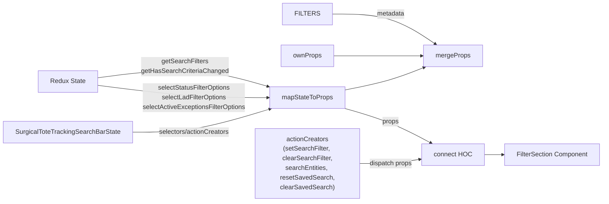
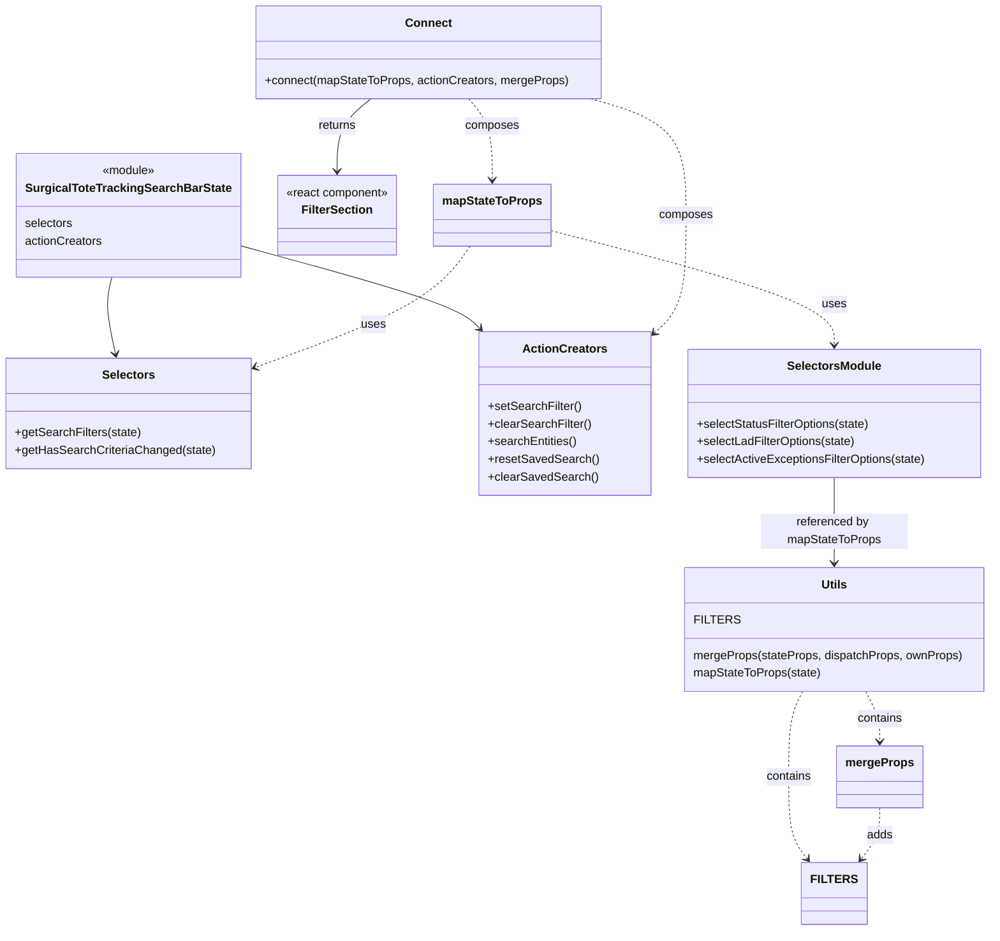

# Diagram: web/portal/src/pages/surgicaltotetracking/components/search/SurgicalToteTrackingSearchFiltersContainer.js

> Auto-generated by Obscura crawlers

## Diagram 1

### SVG

<svg id="container" width="1584.359375" xmlns="http://www.w3.org/2000/svg" class="flowchart" height="430" viewBox="0 0 1584.359375 430" role="graphics-document document" aria-roledescription="flowchart-v2"><g><marker id="container_flowchart-v2-pointEnd" class="marker flowchart-v2" viewBox="0 0 10 10" refX="5" refY="5" markerUnits="userSpaceOnUse" markerWidth="8" markerHeight="8" orient="auto"><path d="M 0 0 L 10 5 L 0 10 z" class="arrowMarkerPath" style="stroke-width: 1; stroke-dasharray: 1, 0;"></path></marker><marker id="container_flowchart-v2-pointStart" class="marker flowchart-v2" viewBox="0 0 10 10" refX="4.5" refY="5" markerUnits="userSpaceOnUse" markerWidth="8" markerHeight="8" orient="auto"><path d="M 0 5 L 10 10 L 10 0 z" class="arrowMarkerPath" style="stroke-width: 1; stroke-dasharray: 1, 0;"></path></marker><marker id="container_flowchart-v2-circleEnd" class="marker flowchart-v2" viewBox="0 0 10 10" refX="11" refY="5" markerUnits="userSpaceOnUse" markerWidth="11" markerHeight="11" orient="auto"><circle cx="5" cy="5" r="5" class="arrowMarkerPath" style="stroke-width: 1; stroke-dasharray: 1, 0;"></circle></marker><marker id="container_flowchart-v2-circleStart" class="marker flowchart-v2" viewBox="0 0 10 10" refX="-1" refY="5" markerUnits="userSpaceOnUse" markerWidth="11" markerHeight="11" orient="auto"><circle cx="5" cy="5" r="5" class="arrowMarkerPath" style="stroke-width: 1; stroke-dasharray: 1, 0;"></circle></marker><marker id="container_flowchart-v2-crossEnd" class="marker cross flowchart-v2" viewBox="0 0 11 11" refX="12" refY="5.2" markerUnits="userSpaceOnUse" markerWidth="11" markerHeight="11" orient="auto"><path d="M 1,1 l 9,9 M 10,1 l -9,9" class="arrowMarkerPath" style="stroke-width: 2; stroke-dasharray: 1, 0;"></path></marker><marker id="container_flowchart-v2-crossStart" class="marker cross flowchart-v2" viewBox="0 0 11 11" refX="-1" refY="5.2" markerUnits="userSpaceOnUse" markerWidth="11" markerHeight="11" orient="auto"><path d="M 1,1 l 9,9 M 10,1 l -9,9" class="arrowMarkerPath" style="stroke-width: 2; stroke-dasharray: 1, 0;"></path></marker><g class="root"><g class="clusters"></g><g class="edgePaths"><path d="M240.867,193.678L281.012,188.565C321.156,183.452,401.445,173.226,479.467,177.447C557.489,181.668,633.244,200.335,671.122,209.669L708.999,219.003" id="L_State_mapStateToProps_0" class="edge-thickness-normal edge-pattern-solid edge-thickness-normal edge-pattern-solid flowchart-link" style=";" data-edge="true" data-et="edge" data-id="L_State_mapStateToProps_0" data-points="W3sieCI6MjQwLjg2NzE4NzUsInkiOjE5My42Nzc2MTE5NDAyOTg1fSx7IngiOjQ4MS43MzQzNzUsInkiOjE2M30seyJ4Ijo3MTIuODgyODEyNSwieSI6MjE5Ljk1OTY5MTk3NDQ5MTY1fV0=" marker-end="url(#container_flowchart-v2-pointEnd)"></path><path d="M240.867,212.322L281.012,217.435C321.156,222.548,401.445,232.774,479.448,237.887C557.451,243,633.167,243,671.025,243L708.883,243" id="L_State_mapStateToProps_2" class="edge-thickness-normal edge-pattern-solid edge-thickness-normal edge-pattern-solid flowchart-link" style=";" data-edge="true" data-et="edge" data-id="L_State_mapStateToProps_2" data-points="W3sieCI6MjQwLjg2NzE4NzUsInkiOjIxMi4zMjIzODgwNTk3MDE1fSx7IngiOjQ4MS43MzQzNzUsInkiOjI0M30seyJ4Ijo3MTIuODgyODEyNSwieSI6MjQzfV0=" marker-end="url(#container_flowchart-v2-pointEnd)"></path><path d="M327.344,329L353.076,329C378.807,329,430.271,329,493.883,318.965C557.495,308.931,633.256,288.862,671.136,278.827L709.016,268.793" id="L_SurgicalToteTrackingSearchBarState_mapStateToProps_0" class="edge-thickness-normal edge-pattern-solid edge-thickness-normal edge-pattern-solid flowchart-link" style=";" data-edge="true" data-et="edge" data-id="L_SurgicalToteTrackingSearchBarState_mapStateToProps_0" data-points="W3sieCI6MzI3LjM0Mzc1LCJ5IjozMjl9LHsieCI6NDgxLjczNDM3NSwieSI6MzI5fSx7IngiOjcxMi44ODI4MTI1LCJ5IjoyNjcuNzY4MzMxMTI3NDIxNX1d" marker-end="url(#container_flowchart-v2-pointEnd)"></path><path d="M863.555,35L895.563,35C927.57,35,991.586,35,1042.207,47.462C1092.828,59.925,1130.054,84.85,1148.667,97.312L1167.28,109.775" id="L_FILTERS_mergeProps_0" class="edge-thickness-normal edge-pattern-solid edge-thickness-normal edge-pattern-solid flowchart-link" style=";" data-edge="true" data-et="edge" data-id="L_FILTERS_mergeProps_0" data-points="W3sieCI6ODYzLjU1NDY4NzUsInkiOjM1fSx7IngiOjEwNTUuNjAxNTYyNSwieSI6MzV9LHsieCI6MTE3MC42MDQxMTY1ODY1Mzg2LCJ5IjoxMTJ9XQ==" marker-end="url(#container_flowchart-v2-pointEnd)"></path><path d="M899.883,258.757L925.836,263.131C951.789,267.505,1003.695,276.252,1043.999,286.539C1084.302,296.825,1113.002,308.651,1127.352,314.563L1141.702,320.476" id="L_mapStateToProps_connect_0" class="edge-thickness-normal edge-pattern-solid edge-thickness-normal edge-pattern-solid flowchart-link" style=";" data-edge="true" data-et="edge" data-id="L_mapStateToProps_connect_0" data-points="W3sieCI6ODk5Ljg4MjgxMjUsInkiOjI1OC43NTcyNDEzNzkzMTAzNn0seyJ4IjoxMDU1LjYwMTU2MjUsInkiOjI4NX0seyJ4IjoxMTQ1LjQwMDYzNDc2NTYyNSwieSI6MzIyfV0=" marker-end="url(#container_flowchart-v2-pointEnd)"></path><path d="M976.641,371L989.801,371C1002.961,371,1029.281,371,1054.941,369.23C1080.602,367.459,1105.602,363.918,1118.102,362.148L1130.602,360.377" id="L_ActionCreators_connect_0" class="edge-thickness-normal edge-pattern-solid edge-thickness-normal edge-pattern-solid flowchart-link" style=";" data-edge="true" data-et="edge" data-id="L_ActionCreators_connect_0" data-points="W3sieCI6OTc2LjY0MDYyNSwieSI6MzcxfSx7IngiOjEwNTUuNjAxNTYyNSwieSI6MzcxfSx7IngiOjExMzQuNTYyNSwieSI6MzU5LjgxNjMxNjI2NTk2OTJ9XQ==" marker-end="url(#container_flowchart-v2-pointEnd)"></path><path d="M871.977,139L902.581,139C933.185,139,994.393,139,1038.039,139C1081.685,139,1107.768,139,1120.81,139L1133.852,139" id="L_OwnProps_mergeProps_0" class="edge-thickness-normal edge-pattern-solid edge-thickness-normal edge-pattern-solid flowchart-link" style=";" data-edge="true" data-et="edge" data-id="L_OwnProps_mergeProps_0" data-points="W3sieCI6ODcxLjk3NjU2MjUsInkiOjEzOX0seyJ4IjoxMDU1LjYwMTU2MjUsInkiOjEzOX0seyJ4IjoxMTM3Ljg1MTU2MjUsInkiOjEzOX1d" marker-end="url(#container_flowchart-v2-pointEnd)"></path><path d="M899.883,227.243L925.836,222.869C951.789,218.495,1003.695,209.748,1043.643,199.788C1083.592,189.828,1111.582,178.655,1125.577,173.069L1139.572,167.483" id="L_mapStateToProps_mergeProps_0" class="edge-thickness-normal edge-pattern-solid edge-thickness-normal edge-pattern-solid flowchart-link" style=";" data-edge="true" data-et="edge" data-id="L_mapStateToProps_mergeProps_0" data-points="W3sieCI6ODk5Ljg4MjgxMjUsInkiOjIyNy4yNDI3NTg2MjA2ODk2NH0seyJ4IjoxMDU1LjYwMTU2MjUsInkiOjIwMX0seyJ4IjoxMTQzLjI4Njc5NDM1NDgzODgsInkiOjE2Nn1d" marker-end="url(#container_flowchart-v2-pointEnd)"></path><path d="M1287.297,349L1291.464,349C1295.63,349,1303.964,349,1311.63,349C1319.297,349,1326.297,349,1329.797,349L1333.297,349" id="L_connect_FilterSection_0" class="edge-thickness-normal edge-pattern-solid edge-thickness-normal edge-pattern-solid flowchart-link" style=";" data-edge="true" data-et="edge" data-id="L_connect_FilterSection_0" data-points="W3sieCI6MTI4Ny4yOTY4NzUsInkiOjM0OX0seyJ4IjoxMzEyLjI5Njg3NSwieSI6MzQ5fSx7IngiOjEzMzcuMjk2ODc1LCJ5IjozNDl9XQ==" marker-end="url(#container_flowchart-v2-pointEnd)"></path></g><g class="edgeLabels"><g class="edgeLabel" transform="translate(479.37846, 163.30006)"><g class="label" data-id="L_State_mapStateToProps_0" transform="translate(-106.9140625, -24)"><foreignObject width="213.828125" height="48">

getSearchFilters getHasSearchCriteriaChanged

</foreignObject></g></g><g class="edgeLabel" transform="translate(481.734375, 243)"><g class="label" data-id="L_State_mapStateToProps_2" transform="translate(-129.390625, -36)"><foreignObject width="258.78125" height="72">

selectStatusFilterOptions selectLadFilterOptions selectActiveExceptionsFilterOptions

</foreignObject></g></g><g class="edgeLabel" transform="translate(481.734375, 329)"><g class="label" data-id="L_SurgicalToteTrackingSearchBarState_mapStateToProps_0" transform="translate(-89.15625, -12)"><foreignObject width="178.3125" height="24">

selectors/actionCreators

</foreignObject></g></g><g class="edgeLabel" transform="translate(1055.6015625, 35)"><g class="label" data-id="L_FILTERS_mergeProps_0" transform="translate(-34.7265625, -12)"><foreignObject width="69.453125" height="24">

metadata

</foreignObject></g></g><g class="edgeLabel" transform="translate(1025.62842, 279.94873)"><g class="label" data-id="L_mapStateToProps_connect_0" transform="translate(-20.765625, -12)"><foreignObject width="41.53125" height="24">

props

</foreignObject></g></g><g class="edgeLabel" transform="translate(1055.6015625, 371)"><g class="label" data-id="L_ActionCreators_connect_0" transform="translate(-53.9609375, -12)"><foreignObject width="107.921875" height="24">

dispatch props

</foreignObject></g></g><g class="edgeLabel"><g class="label" data-id="L_OwnProps_mergeProps_0" transform="translate(0, 0)"><foreignObject width="0" height="0">

</foreignObject></g></g><g class="edgeLabel"><g class="label" data-id="L_mapStateToProps_mergeProps_0" transform="translate(0, 0)"><foreignObject width="0" height="0">

</foreignObject></g></g><g class="edgeLabel"><g class="label" data-id="L_connect_FilterSection_0" transform="translate(0, 0)"><foreignObject width="0" height="0">

</foreignObject></g></g></g><g class="nodes"><g class="node default" id="flowchart-State-0" transform="translate(167.671875, 203)"><rect class="basic label-container" style="" x="-73.1953125" y="-27" width="146.390625" height="54"></rect><g class="label" style="" transform="translate(-43.1953125, -12)"><rect></rect><foreignObject width="86.390625" height="24">

Redux State

</foreignObject></g></g><g class="node default" id="flowchart-mapStateToProps-1" transform="translate(806.3828125, 243)"><rect class="basic label-container" style="" x="-93.5" y="-27" width="187" height="54"></rect><g class="label" style="" transform="translate(-63.5, -12)"><rect></rect><foreignObject width="127" height="24">

mapStateToProps

</foreignObject></g></g><g class="node default" id="flowchart-SurgicalToteTrackingSearchBarState-4" transform="translate(167.671875, 329)"><rect class="basic label-container" style="" x="-159.671875" y="-27" width="319.34375" height="54"></rect><g class="label" style="" transform="translate(-129.671875, -12)"><rect></rect><foreignObject width="259.34375" height="24">

SurgicalToteTrackingSearchBarState

</foreignObject></g></g><g class="node default" id="flowchart-FILTERS-6" transform="translate(806.3828125, 35)"><rect class="basic label-container" style="" x="-57.171875" y="-27" width="114.34375" height="54"></rect><g class="label" style="" transform="translate(-27.171875, -12)"><rect></rect><foreignObject width="54.34375" height="24">

FILTERS

</foreignObject></g></g><g class="node default" id="flowchart-mergeProps-7" transform="translate(1210.9296875, 139)"><rect class="basic label-container" style="" x="-73.078125" y="-27" width="146.15625" height="54"></rect><g class="label" style="" transform="translate(-43.078125, -12)"><rect></rect><foreignObject width="86.15625" height="24">

mergeProps

</foreignObject></g></g><g class="node default" id="flowchart-connect-9" transform="translate(1210.9296875, 349)"><rect class="basic label-container" style="" x="-76.3671875" y="-27" width="152.734375" height="54"></rect><g class="label" style="" transform="translate(-46.3671875, -12)"><rect></rect><foreignObject width="92.734375" height="24">

connect HOC

</foreignObject></g></g><g class="node default" id="flowchart-ActionCreators-10" transform="translate(806.3828125, 371)"><rect class="basic label-container" style="" x="-170.2578125" y="-51" width="340.515625" height="102"></rect><g class="label" style="" transform="translate(-140.2578125, -36)"><rect></rect><foreignObject width="280.515625" height="72">

actionCreators\n(setSearchFilter, clearSearchFilter,\nsearchEntities, resetSavedSearch,\nclearSavedSearch)

</foreignObject></g></g><g class="node default" id="flowchart-OwnProps-12" transform="translate(806.3828125, 139)"><rect class="basic label-container" style="" x="-65.59375" y="-27" width="131.1875" height="54"></rect><g class="label" style="" transform="translate(-35.59375, -12)"><rect></rect><foreignObject width="71.1875" height="24">

ownProps

</foreignObject></g></g><g class="node default" id="flowchart-FilterSection-17" transform="translate(1456.828125, 349)"><rect class="basic label-container" style="" x="-119.53125" y="-27" width="239.0625" height="54"></rect><g class="label" style="" transform="translate(-89.53125, -12)"><rect></rect><foreignObject width="179.0625" height="24">

FilterSection Component

</foreignObject></g></g></g></g></g></svg>

## Diagram 2

### SVG

<svg id="container" width="1327.47265625" xmlns="http://www.w3.org/2000/svg" class="classDiagram" height="1262" viewBox="0 0 1327.47265625 1262" role="graphics-document document" aria-roledescription="class"><g><defs><marker id="container_class-aggregationStart" class="marker aggregation class" refX="18" refY="7" markerWidth="190" markerHeight="240" orient="auto"><path d="M 18,7 L9,13 L1,7 L9,1 Z"></path></marker></defs><defs><marker id="container_class-aggregationEnd" class="marker aggregation class" refX="1" refY="7" markerWidth="20" markerHeight="28" orient="auto"><path d="M 18,7 L9,13 L1,7 L9,1 Z"></path></marker></defs><defs><marker id="container_class-extensionStart" class="marker extension class" refX="18" refY="7" markerWidth="190" markerHeight="240" orient="auto"><path d="M 1,7 L18,13 V 1 Z"></path></marker></defs><defs><marker id="container_class-extensionEnd" class="marker extension class" refX="1" refY="7" markerWidth="20" markerHeight="28" orient="auto"><path d="M 1,1 V 13 L18,7 Z"></path></marker></defs><defs><marker id="container_class-compositionStart" class="marker composition class" refX="18" refY="7" markerWidth="190" markerHeight="240" orient="auto"><path d="M 18,7 L9,13 L1,7 L9,1 Z"></path></marker></defs><defs><marker id="container_class-compositionEnd" class="marker composition class" refX="1" refY="7" markerWidth="20" markerHeight="28" orient="auto"><path d="M 18,7 L9,13 L1,7 L9,1 Z"></path></marker></defs><defs><marker id="container_class-dependencyStart" class="marker dependency class" refX="6" refY="7" markerWidth="190" markerHeight="240" orient="auto"><path d="M 5,7 L9,13 L1,7 L9,1 Z"></path></marker></defs><defs><marker id="container_class-dependencyEnd" class="marker dependency class" refX="13" refY="7" markerWidth="20" markerHeight="28" orient="auto"><path d="M 18,7 L9,13 L14,7 L9,1 Z"></path></marker></defs><defs><marker id="container_class-lollipopStart" class="marker lollipop class" refX="13" refY="7" markerWidth="190" markerHeight="240" orient="auto"><circle stroke="black" fill="transparent" cx="7" cy="7" r="6"></circle></marker></defs><defs><marker id="container_class-lollipopEnd" class="marker lollipop class" refX="1" refY="7" markerWidth="190" markerHeight="240" orient="auto"><circle stroke="black" fill="transparent" cx="7" cy="7" r="6"></circle></marker></defs><g class="root"><g class="clusters"></g><g class="edgePaths"><path d="M149.391,376L147.788,382.167C146.185,388.333,142.979,400.667,143.754,418.022C144.529,435.377,149.285,457.754,151.662,468.943L154.04,480.131" id="id_SurgicalToteTrackingSearchBarState_Selectors_1" class="edge-thickness-normal edge-pattern-solid relation" style=";;;" data-edge="true" data-et="edge" data-id="id_SurgicalToteTrackingSearchBarState_Selectors_1" data-points="W3sieCI6MTQ5LjM5MTMzNTIyNzI3MjcyLCJ5IjozNzZ9LHsieCI6MTM5Ljc3MzQzNzUsInkiOjQxM30seyJ4IjoxNTUuMjg3NDc4ODg1MTM1MTMsInkiOjQ4Nn1d" marker-end="url(#container_class-dependencyEnd)"></path><path d="M315.977,331.837L365.128,345.364C414.28,358.891,512.583,385.946,567.059,404.924C621.535,423.903,632.182,434.805,637.506,440.256L642.83,445.708" id="id_SurgicalToteTrackingSearchBarState_ActionCreators_2" class="edge-thickness-normal edge-pattern-solid relation" style=";;;" data-edge="true" data-et="edge" data-id="id_SurgicalToteTrackingSearchBarState_ActionCreators_2" data-points="W3sieCI6MzE1Ljk3NjU2MjUsInkiOjMzMS44MzcwMTkwMDQzODAyfSx7IngiOjYxMC44ODY3MTg3NSwieSI6NDEzfSx7IngiOjY0Ny4wMjI0NjA5Mzc1LCJ5Ijo0NTB9XQ==" marker-end="url(#container_class-dependencyEnd)"></path><path d="M629.021,334L619.916,347.167C610.812,360.333,592.603,386.667,544.447,414.169C496.292,441.671,418.189,470.342,379.137,484.678L340.086,499.013" id="id_mapStateToProps_Selectors_3" class="edge-thickness-normal edge-pattern-dashed relation" style=";;;" data-edge="true" data-et="edge" data-id="id_mapStateToProps_Selectors_3" data-points="W3sieCI6NjI5LjAyMDcyNTcyMzE0MDUsInkiOjMzNH0seyJ4Ijo1NzQuMzk0NTMxMjUsInkiOjQxM30seyJ4IjozMzQuNDUzMTI1LCJ5Ijo1MDEuMDgwNzI3ODI5Mzk4MDN9XQ==" marker-end="url(#container_class-dependencyEnd)"></path><path d="M734.773,312.224L798.481,329.02C862.189,345.816,989.604,379.408,1053.312,405.371C1117.02,431.333,1117.02,449.667,1117.02,458.833L1117.02,468" id="id_mapStateToProps_SelectorsModule_4" class="edge-thickness-normal edge-pattern-dashed relation" style=";;;" data-edge="true" data-et="edge" data-id="id_mapStateToProps_SelectorsModule_4" data-points="W3sieCI6NzM0Ljc3MzQzNzUsInkiOjMxMi4yMjQxNjY1NDYwOTIxfSx7IngiOjExMTcuMDE5NTMxMjUsInkiOjQxM30seyJ4IjoxMTE3LjAxOTUzMTI1LCJ5Ijo0NzR9XQ==" marker-end="url(#container_class-dependencyEnd)"></path><path d="M627.105,134L632.265,140.167C637.424,146.333,647.743,158.667,652.903,177C658.063,195.333,658.063,219.667,658.063,231.833L658.063,244" id="id_Connect_mapStateToProps_5" class="edge-thickness-normal edge-pattern-dashed relation" style=";;;" data-edge="true" data-et="edge" data-id="id_Connect_mapStateToProps_5" data-points="W3sieCI6NjI3LjEwNTM1MTU2MjUsInkiOjEzNH0seyJ4Ijo2NTguMDYyNSwieSI6MTcxfSx7IngiOjY1OC4wNjI1LCJ5IjoyNTB9XQ==" marker-end="url(#container_class-dependencyEnd)"></path><path d="M790.852,134L812.04,140.167C833.228,146.333,875.603,158.667,896.791,185C917.979,211.333,917.979,251.667,917.979,292C917.979,332.333,917.979,372.667,910.352,399.777C902.725,426.888,887.471,440.777,879.845,447.721L872.218,454.665" id="id_Connect_ActionCreators_6" class="edge-thickness-normal edge-pattern-dashed relation" style=";;;" data-edge="true" data-et="edge" data-id="id_Connect_ActionCreators_6" data-points="W3sieCI6NzkwLjg1MjQ0MTQwNjI1LCJ5IjoxMzR9LHsieCI6OTE3Ljk3ODUxNTYyNSwieSI6MTcxfSx7IngiOjkxNy45Nzg1MTU2MjUsInkiOjI5Mn0seyJ4Ijo5MTcuOTc4NTE1NjI1LCJ5Ijo0MTN9LHsieCI6ODY3Ljc4MTI1LCJ5Ijo0NTguNzA0MzkxNzA5MjIyfV0=" marker-end="url(#container_class-dependencyEnd)"></path><path d="M495.184,134L487.431,140.167C479.678,146.333,464.171,158.667,456.417,175C448.664,191.333,448.664,211.667,448.664,221.833L448.664,232" id="id_Connect_FilterSection_7" class="edge-thickness-normal edge-pattern-solid relation" style=";;;" data-edge="true" data-et="edge" data-id="id_Connect_FilterSection_7" data-points="W3sieCI6NDk1LjE4NDMzNTkzNzUsInkiOjEzNH0seyJ4Ijo0NDguNjY0MDYyNSwieSI6MTcxfSx7IngiOjQ0OC42NjQwNjI1LCJ5IjoyMzh9XQ==" marker-end="url(#container_class-dependencyEnd)"></path><path d="M1074.759,938L1071.657,944.167C1068.554,950.333,1062.349,962.667,1059.247,982C1056.145,1001.333,1056.145,1027.667,1056.145,1054C1056.145,1080.333,1056.145,1106.667,1060.286,1125.208C1064.427,1143.749,1072.71,1154.498,1076.852,1159.873L1080.993,1165.247" id="id_Utils_FILTERS_8" class="edge-thickness-normal edge-pattern-dashed relation" style=";;;" data-edge="true" data-et="edge" data-id="id_Utils_FILTERS_8" data-points="W3sieCI6MTA3NC43NTkyMDA2NzE0ODc2LCJ5Ijo5Mzh9LHsieCI6MTA1Ni4xNDQ1MzEyNSwieSI6OTc1fSx7IngiOjEwNTYuMTQ0NTMxMjUsInkiOjEwNTR9LHsieCI6MTA1Ni4xNDQ1MzEyNSwieSI6MTEzM30seyJ4IjoxMDg0LjY1NTYwNzE5OTM2NywieSI6MTE3MH1d" marker-end="url(#container_class-dependencyEnd)"></path><path d="M1159.28,938L1162.382,944.167C1165.485,950.333,1171.69,962.667,1174.792,974C1177.895,985.333,1177.895,995.667,1177.895,1000.833L1177.895,1006" id="id_Utils_mergeProps_9" class="edge-thickness-normal edge-pattern-dashed relation" style=";;;" data-edge="true" data-et="edge" data-id="id_Utils_mergeProps_9" data-points="W3sieCI6MTE1OS4yNzk4NjE4Mjg1MTI0LCJ5Ijo5Mzh9LHsieCI6MTE3Ny44OTQ1MzEyNSwieSI6OTc1fSx7IngiOjExNzcuODk0NTMxMjUsInkiOjEwMTJ9XQ==" marker-end="url(#container_class-dependencyEnd)"></path><path d="M1177.895,1096L1177.895,1102.167C1177.895,1108.333,1177.895,1120.667,1173.753,1132.208C1169.612,1143.749,1161.329,1154.498,1157.187,1159.873L1153.046,1165.247" id="id_mergeProps_FILTERS_10" class="edge-thickness-normal edge-pattern-dashed relation" style=";;;" data-edge="true" data-et="edge" data-id="id_mergeProps_FILTERS_10" data-points="W3sieCI6MTE3Ny44OTQ1MzEyNSwieSI6MTA5Nn0seyJ4IjoxMTc3Ljg5NDUzMTI1LCJ5IjoxMTMzfSx7IngiOjExNDkuMzgzNDU1MzAwNjMzLCJ5IjoxMTcwfV0=" marker-end="url(#container_class-dependencyEnd)"></path><path d="M1117.02,648L1117.02,660.167C1117.02,672.333,1117.02,696.667,1117.02,716C1117.02,735.333,1117.02,749.667,1117.02,756.833L1117.02,764" id="id_SelectorsModule_Utils_11" class="edge-thickness-normal edge-pattern-solid relation" style=";;;" data-edge="true" data-et="edge" data-id="id_SelectorsModule_Utils_11" data-points="W3sieCI6MTExNy4wMTk1MzEyNSwieSI6NjQ4fSx7IngiOjExMTcuMDE5NTMxMjUsInkiOjcyMX0seyJ4IjoxMTE3LjAxOTUzMTI1LCJ5Ijo3NzB9XQ==" marker-end="url(#container_class-dependencyEnd)"></path></g><g class="edgeLabels"><g class="edgeLabel"><g class="label" data-id="id_SurgicalToteTrackingSearchBarState_Selectors_1" transform="translate(0, 0)"><foreignObject width="0" height="0">

</foreignObject></g></g><g class="edgeLabel"><g class="label" data-id="id_SurgicalToteTrackingSearchBarState_ActionCreators_2" transform="translate(0, 0)"><foreignObject width="0" height="0">

</foreignObject></g></g><g class="edgeLabel" transform="translate(499.50573, 440.49113)"><g class="label" data-id="id_mapStateToProps_Selectors_3" transform="translate(-16.4921875, -12)"><foreignObject width="32.984375" height="24">

uses

</foreignObject></g></g><g class="edgeLabel" transform="translate(1117.01953125, 413)"><g class="label" data-id="id_mapStateToProps_SelectorsModule_4" transform="translate(-16.4921875, -12)"><foreignObject width="32.984375" height="24">

uses

</foreignObject></g></g><g class="edgeLabel" transform="translate(658.0625, 171)"><g class="label" data-id="id_Connect_mapStateToProps_5" transform="translate(-36.453125, -12)"><foreignObject width="72.90625" height="24">

composes

</foreignObject></g></g><g class="edgeLabel" transform="translate(917.978515625, 292)"><g class="label" data-id="id_Connect_ActionCreators_6" transform="translate(-36.453125, -12)"><foreignObject width="72.90625" height="24">

composes

</foreignObject></g></g><g class="edgeLabel" transform="translate(448.6640625, 171)"><g class="label" data-id="id_Connect_FilterSection_7" transform="translate(-26.265625, -12)"><foreignObject width="52.53125" height="24">

returns

</foreignObject></g></g><g class="edgeLabel" transform="translate(1056.14453125, 1054)"><g class="label" data-id="id_Utils_FILTERS_8" transform="translate(-30.890625, -12)"><foreignObject width="61.78125" height="24">

contains

</foreignObject></g></g><g class="edgeLabel" transform="translate(1177.89453125, 975)"><g class="label" data-id="id_Utils_mergeProps_9" transform="translate(-30.890625, -12)"><foreignObject width="61.78125" height="24">

contains

</foreignObject></g></g><g class="edgeLabel" transform="translate(1177.89453125, 1133)"><g class="label" data-id="id_mergeProps_FILTERS_10" transform="translate(-17.65625, -12)"><foreignObject width="35.3125" height="24">

adds

</foreignObject></g></g><g class="edgeLabel" transform="translate(1117.01953125, 721)"><g class="label" data-id="id_SelectorsModule_Utils_11" transform="translate(-100, -24)"><foreignObject width="200" height="48">

referenced by mapStateToProps

</foreignObject></g></g></g><g class="nodes"><g class="node default" id="classId-SurgicalToteTrackingSearchBarState-0" transform="translate(171.2265625, 292)"><g class="basic label-container"><path d="M-144.75 -84 L144.75 -84 L144.75 84 L-144.75 84" stroke="none" stroke-width="0" fill="#ECECFF" style=""></path><path d="M-144.75 -84 C-86.47313361354517 -84, -28.19626722709036 -84, 144.75 -84 M-144.75 -84 C-32.46124169195271 -84, 79.82751661609458 -84, 144.75 -84 M144.75 -84 C144.75 -18.866196973481962, 144.75 46.267606053036076, 144.75 84 M144.75 -84 C144.75 -28.339839580573923, 144.75 27.320320838852155, 144.75 84 M144.75 84 C50.89289580508449 84, -42.964208389831015 84, -144.75 84 M144.75 84 C49.01468171297702 84, -46.720636574045955 84, -144.75 84 M-144.75 84 C-144.75 29.839073060901917, -144.75 -24.321853878196166, -144.75 -84 M-144.75 84 C-144.75 44.224672691250206, -144.75 4.449345382500411, -144.75 -84" stroke="#9370DB" stroke-width="1.3" fill="none" stroke-dasharray="0 0" style=""></path></g><g class="annotation-group text" transform="translate(-36.6015625, -60)"><g class="label" style="" transform="translate(0,-12)"><foreignObject width="73.203125" height="24">

«module»

</foreignObject></g></g><g class="label-group text" transform="translate(-132.75, -36)"><g class="label" style="font-weight: bolder" transform="translate(0,-12)"><foreignObject width="265.5" height="24">

SurgicalToteTrackingSearchBarState

</foreignObject></g></g><g class="members-group text" transform="translate(-132.75, 12)"><g class="label" style="" transform="translate(0,-12)"><foreignObject width="65.46875" height="24">

selectors

</foreignObject></g><g class="label" style="" transform="translate(0,12)"><foreignObject width="105.34375" height="24">

actionCreators

</foreignObject></g></g><g class="methods-group text" transform="translate(-132.75, 84)"></g><g class="divider" style=""><path d="M-144.75 -12 C-42.54786184398725 -12, 59.6542763120255 -12, 144.75 -12 M-144.75 -12 C-67.72537859707738 -12, 9.299242805845239 -12, 144.75 -12" stroke="#9370DB" stroke-width="1.3" fill="none" stroke-dasharray="0 0" style=""></path></g><g class="divider" style=""><path d="M-144.75 60 C-35.28603617101683 60, 74.17792765796634 60, 144.75 60 M-144.75 60 C-44.11997556328173 60, 56.510048873436546 60, 144.75 60" stroke="#9370DB" stroke-width="1.3" fill="none" stroke-dasharray="0 0" style=""></path></g></g><g class="node default" id="classId-Selectors-1" transform="translate(171.2265625, 561)"><g class="basic label-container"><path d="M-163.2265625 -75 L163.2265625 -75 L163.2265625 75 L-163.2265625 75" stroke="none" stroke-width="0" fill="#ECECFF" style=""></path><path d="M-163.2265625 -75 C-96.26416925772763 -75, -29.30177601545526 -75, 163.2265625 -75 M-163.2265625 -75 C-54.3497608750078 -75, 54.527040749984394 -75, 163.2265625 -75 M163.2265625 -75 C163.2265625 -32.54958700098341, 163.2265625 9.900825998033184, 163.2265625 75 M163.2265625 -75 C163.2265625 -41.31367608631511, 163.2265625 -7.627352172630225, 163.2265625 75 M163.2265625 75 C60.88305125936766 75, -41.46045998126468 75, -163.2265625 75 M163.2265625 75 C92.29518402329292 75, 21.363805546585837 75, -163.2265625 75 M-163.2265625 75 C-163.2265625 22.501239756313076, -163.2265625 -29.997520487373848, -163.2265625 -75 M-163.2265625 75 C-163.2265625 19.723422401477855, -163.2265625 -35.55315519704429, -163.2265625 -75" stroke="#9370DB" stroke-width="1.3" fill="none" stroke-dasharray="0 0" style=""></path></g><g class="annotation-group text" transform="translate(0, -51)"></g><g class="label-group text" transform="translate(-34.171875, -51)"><g class="label" style="font-weight: bolder" transform="translate(0,-12)"><foreignObject width="68.34375" height="24">

Selectors

</foreignObject></g></g><g class="members-group text" transform="translate(-151.2265625, -3)"></g><g class="methods-group text" transform="translate(-151.2265625, 27)"><g class="label" style="" transform="translate(0,-12)"><foreignObject width="169.875" height="24">

+getSearchFilters(state)

</foreignObject></g><g class="label" style="" transform="translate(0,12)"><foreignObject width="268.28125" height="24">

+getHasSearchCriteriaChanged(state)

</foreignObject></g></g><g class="divider" style=""><path d="M-163.2265625 -27 C-59.76027398290201 -27, 43.70601453419599 -27, 163.2265625 -27 M-163.2265625 -27 C-57.793730542942455 -27, 47.63910141411509 -27, 163.2265625 -27" stroke="#9370DB" stroke-width="1.3" fill="none" stroke-dasharray="0 0" style=""></path></g><g class="divider" style=""><path d="M-163.2265625 -3 C-80.94775637197401 -3, 1.331049756051982 -3, 163.2265625 -3 M-163.2265625 -3 C-95.02378331728627 -3, -26.821004134572547 -3, 163.2265625 -3" stroke="#9370DB" stroke-width="1.3" fill="none" stroke-dasharray="0 0" style=""></path></g></g><g class="node default" id="classId-ActionCreators-2" transform="translate(755.4296875, 561)"><g class="basic label-container"><path d="M-112.3515625 -111 L112.3515625 -111 L112.3515625 111 L-112.3515625 111" stroke="none" stroke-width="0" fill="#ECECFF" style=""></path><path d="M-112.3515625 -111 C-23.75969444303135 -111, 64.8321736139373 -111, 112.3515625 -111 M-112.3515625 -111 C-33.87634030378909 -111, 44.598881892421815 -111, 112.3515625 -111 M112.3515625 -111 C112.3515625 -45.88485324243855, 112.3515625 19.230293515122895, 112.3515625 111 M112.3515625 -111 C112.3515625 -36.11576338890539, 112.3515625 38.768473222189215, 112.3515625 111 M112.3515625 111 C26.963396787756068 111, -58.424768924487864 111, -112.3515625 111 M112.3515625 111 C30.64528168717422 111, -51.06099912565156 111, -112.3515625 111 M-112.3515625 111 C-112.3515625 51.62284686436438, -112.3515625 -7.754306271271247, -112.3515625 -111 M-112.3515625 111 C-112.3515625 64.16140554179788, -112.3515625 17.322811083595766, -112.3515625 -111" stroke="#9370DB" stroke-width="1.3" fill="none" stroke-dasharray="0 0" style=""></path></g><g class="annotation-group text" transform="translate(0, -87)"></g><g class="label-group text" transform="translate(-53.96875, -87)"><g class="label" style="font-weight: bolder" transform="translate(0,-12)"><foreignObject width="107.9375" height="24">

ActionCreators

</foreignObject></g></g><g class="members-group text" transform="translate(-100.3515625, -39)"></g><g class="methods-group text" transform="translate(-100.3515625, -9)"><g class="label" style="" transform="translate(0,-12)"><foreignObject width="125.953125" height="24">

+setSearchFilter()

</foreignObject></g><g class="label" style="" transform="translate(0,12)"><foreignObject width="139.6875" height="24">

+clearSearchFilter()

</foreignObject></g><g class="label" style="" transform="translate(0,36)"><foreignObject width="120.359375" height="24">

+searchEntities()

</foreignObject></g><g class="label" style="" transform="translate(0,60)"><foreignObject width="146.734375" height="24">

+resetSavedSearch()

</foreignObject></g><g class="label" style="" transform="translate(0,84)"><foreignObject width="146.046875" height="24">

+clearSavedSearch()

</foreignObject></g></g><g class="divider" style=""><path d="M-112.3515625 -63 C-38.95053418092132 -63, 34.45049413815735 -63, 112.3515625 -63 M-112.3515625 -63 C-44.38650454891355 -63, 23.5785534021729 -63, 112.3515625 -63" stroke="#9370DB" stroke-width="1.3" fill="none" stroke-dasharray="0 0" style=""></path></g><g class="divider" style=""><path d="M-112.3515625 -39 C-38.58263199147437 -39, 35.186298517051256 -39, 112.3515625 -39 M-112.3515625 -39 C-40.41840672152789 -39, 31.514749056944225 -39, 112.3515625 -39" stroke="#9370DB" stroke-width="1.3" fill="none" stroke-dasharray="0 0" style=""></path></g></g><g class="node default" id="classId-SelectorsModule-3" transform="translate(1117.01953125, 561)"><g class="basic label-container"><path d="M-199.23828125 -87 L199.23828125 -87 L199.23828125 87 L-199.23828125 87" stroke="none" stroke-width="0" fill="#ECECFF" style=""></path><path d="M-199.23828125 -87 C-60.94679112456694 -87, 77.34469900086611 -87, 199.23828125 -87 M-199.23828125 -87 C-100.30417690550671 -87, -1.3700725610134157 -87, 199.23828125 -87 M199.23828125 -87 C199.23828125 -42.398793105793615, 199.23828125 2.2024137884127697, 199.23828125 87 M199.23828125 -87 C199.23828125 -40.23257686326627, 199.23828125 6.5348462734674655, 199.23828125 87 M199.23828125 87 C79.63997603691098 87, -39.95832917617804 87, -199.23828125 87 M199.23828125 87 C70.15482872716436 87, -58.928623795671285 87, -199.23828125 87 M-199.23828125 87 C-199.23828125 19.02464439645489, -199.23828125 -48.95071120709022, -199.23828125 -87 M-199.23828125 87 C-199.23828125 45.03740370315162, -199.23828125 3.0748074063032362, -199.23828125 -87" stroke="#9370DB" stroke-width="1.3" fill="none" stroke-dasharray="0 0" style=""></path></g><g class="annotation-group text" transform="translate(0, -63)"></g><g class="label-group text" transform="translate(-61.2578125, -63)"><g class="label" style="font-weight: bolder" transform="translate(0,-12)"><foreignObject width="122.515625" height="24">

SelectorsModule

</foreignObject></g></g><g class="members-group text" transform="translate(-187.23828125, -15)"></g><g class="methods-group text" transform="translate(-187.23828125, 15)"><g class="label" style="" transform="translate(0,-12)"><foreignObject width="237.03125" height="24">

+selectStatusFilterOptions(state)

</foreignObject></g><g class="label" style="" transform="translate(0,12)"><foreignObject width="217.46875" height="24">

+selectLadFilterOptions(state)

</foreignObject></g><g class="label" style="" transform="translate(0,36)"><foreignObject width="313.21875" height="24">

+selectActiveExceptionsFilterOptions(state)

</foreignObject></g></g><g class="divider" style=""><path d="M-199.23828125 -39 C-87.24076904345988 -39, 24.756743163080245 -39, 199.23828125 -39 M-199.23828125 -39 C-82.58654032540667 -39, 34.06520059918665 -39, 199.23828125 -39" stroke="#9370DB" stroke-width="1.3" fill="none" stroke-dasharray="0 0" style=""></path></g><g class="divider" style=""><path d="M-199.23828125 -15 C-117.77517413245162 -15, -36.31206701490325 -15, 199.23828125 -15 M-199.23828125 -15 C-98.67802280326208 -15, 1.8822356434758376 -15, 199.23828125 -15" stroke="#9370DB" stroke-width="1.3" fill="none" stroke-dasharray="0 0" style=""></path></g></g><g class="node default" id="classId-FilterSection-4" transform="translate(448.6640625, 292)"><g class="basic label-container"><path d="M-82.6875 -54 L82.6875 -54 L82.6875 54 L-82.6875 54" stroke="none" stroke-width="0" fill="#ECECFF" style=""></path><path d="M-82.6875 -54 C-37.98912217635933 -54, 6.7092556472813385 -54, 82.6875 -54 M-82.6875 -54 C-23.88546623609171 -54, 34.91656752781658 -54, 82.6875 -54 M82.6875 -54 C82.6875 -30.12471660521712, 82.6875 -6.2494332104342405, 82.6875 54 M82.6875 -54 C82.6875 -14.251148809501366, 82.6875 25.497702380997268, 82.6875 54 M82.6875 54 C40.05131584651158 54, -2.584868306976844 54, -82.6875 54 M82.6875 54 C18.65715908704884 54, -45.37318182590232 54, -82.6875 54 M-82.6875 54 C-82.6875 24.43417760071015, -82.6875 -5.1316447985797, -82.6875 -54 M-82.6875 54 C-82.6875 28.186593428260576, -82.6875 2.3731868565211514, -82.6875 -54" stroke="#9370DB" stroke-width="1.3" fill="none" stroke-dasharray="0 0" style=""></path></g><g class="annotation-group text" transform="translate(-70.6875, -30)"><g class="label" style="" transform="translate(0,-12)"><foreignObject width="141.375" height="24">

«react component»

</foreignObject></g></g><g class="label-group text" transform="translate(-46.3203125, -6)"><g class="label" style="font-weight: bolder" transform="translate(0,-12)"><foreignObject width="92.640625" height="24">

FilterSection

</foreignObject></g></g><g class="members-group text" transform="translate(-70.6875, 42)"></g><g class="methods-group text" transform="translate(-70.6875, 72)"></g><g class="divider" style=""><path d="M-82.6875 18 C-20.83435157905791 18, 41.01879684188418 18, 82.6875 18 M-82.6875 18 C-21.546726945254257 18, 39.59404610949149 18, 82.6875 18" stroke="#9370DB" stroke-width="1.3" fill="none" stroke-dasharray="0 0" style=""></path></g><g class="divider" style=""><path d="M-82.6875 36 C-36.90311525212908 36, 8.881269495741833 36, 82.6875 36 M-82.6875 36 C-36.9681701226607 36, 8.751159754678596 36, 82.6875 36" stroke="#9370DB" stroke-width="1.3" fill="none" stroke-dasharray="0 0" style=""></path></g></g><g class="node default" id="classId-Connect-5" transform="translate(574.39453125, 71)"><g class="basic label-container"><path d="M-232.1171875 -63 L232.1171875 -63 L232.1171875 63 L-232.1171875 63" stroke="none" stroke-width="0" fill="#ECECFF" style=""></path><path d="M-232.1171875 -63 C-71.11312467365624 -63, 89.89093815268751 -63, 232.1171875 -63 M-232.1171875 -63 C-127.57974565157353 -63, -23.042303803147064 -63, 232.1171875 -63 M232.1171875 -63 C232.1171875 -16.959519368696917, 232.1171875 29.080961262606166, 232.1171875 63 M232.1171875 -63 C232.1171875 -37.16512837155665, 232.1171875 -11.330256743113296, 232.1171875 63 M232.1171875 63 C132.58876900526639 63, 33.06035051053274 63, -232.1171875 63 M232.1171875 63 C89.40506782962149 63, -53.307051840757026 63, -232.1171875 63 M-232.1171875 63 C-232.1171875 29.21711596516092, -232.1171875 -4.565768069678157, -232.1171875 -63 M-232.1171875 63 C-232.1171875 32.48056123224993, -232.1171875 1.9611224644998657, -232.1171875 -63" stroke="#9370DB" stroke-width="1.3" fill="none" stroke-dasharray="0 0" style=""></path></g><g class="annotation-group text" transform="translate(0, -39)"></g><g class="label-group text" transform="translate(-29.6875, -39)"><g class="label" style="font-weight: bolder" transform="translate(0,-12)"><foreignObject width="59.375" height="24">

Connect

</foreignObject></g></g><g class="members-group text" transform="translate(-220.1171875, 9)"></g><g class="methods-group text" transform="translate(-220.1171875, 39)"><g class="label" style="" transform="translate(0,-12)"><foreignObject width="410.546875" height="24">

+connect(mapStateToProps, actionCreators, mergeProps)

</foreignObject></g></g><g class="divider" style=""><path d="M-232.1171875 -15 C-98.70789556618237 -15, 34.701396367635255 -15, 232.1171875 -15 M-232.1171875 -15 C-55.06069037886266 -15, 121.99580674227468 -15, 232.1171875 -15" stroke="#9370DB" stroke-width="1.3" fill="none" stroke-dasharray="0 0" style=""></path></g><g class="divider" style=""><path d="M-232.1171875 9 C-123.05961904415122 9, -14.002050588302438 9, 232.1171875 9 M-232.1171875 9 C-84.61859692268638 9, 62.87999365462724 9, 232.1171875 9" stroke="#9370DB" stroke-width="1.3" fill="none" stroke-dasharray="0 0" style=""></path></g></g><g class="node default" id="classId-Utils-6" transform="translate(1117.01953125, 854)"><g class="basic label-container"><path d="M-202.453125 -84 L202.453125 -84 L202.453125 84 L-202.453125 84" stroke="none" stroke-width="0" fill="#ECECFF" style=""></path><path d="M-202.453125 -84 C-110.08610437854801 -84, -17.71908375709603 -84, 202.453125 -84 M-202.453125 -84 C-106.88400384362882 -84, -11.314882687257636 -84, 202.453125 -84 M202.453125 -84 C202.453125 -20.58078705864598, 202.453125 42.83842588270804, 202.453125 84 M202.453125 -84 C202.453125 -34.649002474984535, 202.453125 14.70199505003093, 202.453125 84 M202.453125 84 C78.14272463103825 84, -46.1676757379235 84, -202.453125 84 M202.453125 84 C78.16645165576513 84, -46.12022168846974 84, -202.453125 84 M-202.453125 84 C-202.453125 35.03662251366737, -202.453125 -13.926754972665265, -202.453125 -84 M-202.453125 84 C-202.453125 20.552878499215346, -202.453125 -42.89424300156931, -202.453125 -84" stroke="#9370DB" stroke-width="1.3" fill="none" stroke-dasharray="0 0" style=""></path></g><g class="annotation-group text" transform="translate(0, -60)"></g><g class="label-group text" transform="translate(-16.796875, -60)"><g class="label" style="font-weight: bolder" transform="translate(0,-12)"><foreignObject width="33.59375" height="24">

Utils

</foreignObject></g></g><g class="members-group text" transform="translate(-190.453125, -12)"><g class="label" style="" transform="translate(0,-12)"><foreignObject width="54.34375" height="24">

FILTERS

</foreignObject></g></g><g class="methods-group text" transform="translate(-190.453125, 36)"><g class="label" style="" transform="translate(0,-12)"><foreignObject width="364.109375" height="24">

mergeProps(stateProps, dispatchProps, ownProps)

</foreignObject></g><g class="label" style="" transform="translate(0,12)"><foreignObject width="173.46875" height="24">

mapStateToProps(state)

</foreignObject></g></g><g class="divider" style=""><path d="M-202.453125 -36 C-70.26471823251788 -36, 61.92368853496424 -36, 202.453125 -36 M-202.453125 -36 C-110.86251590477836 -36, -19.271906809556725 -36, 202.453125 -36" stroke="#9370DB" stroke-width="1.3" fill="none" stroke-dasharray="0 0" style=""></path></g><g class="divider" style=""><path d="M-202.453125 12 C-90.94586357234017 12, 20.561397855319655 12, 202.453125 12 M-202.453125 12 C-47.76105192101625 12, 106.9310211579675 12, 202.453125 12" stroke="#9370DB" stroke-width="1.3" fill="none" stroke-dasharray="0 0" style=""></path></g></g><g class="node default" id="classId-mapStateToProps-7" transform="translate(658.0625, 292)"><g class="basic label-container"><path d="M-76.7109375 -42 L76.7109375 -42 L76.7109375 42 L-76.7109375 42" stroke="none" stroke-width="0" fill="#ECECFF" style=""></path><path d="M-76.7109375 -42 C-44.86638454490419 -42, -13.021831589808379 -42, 76.7109375 -42 M-76.7109375 -42 C-19.220413757485403 -42, 38.270109985029194 -42, 76.7109375 -42 M76.7109375 -42 C76.7109375 -16.47659068156762, 76.7109375 9.046818636864757, 76.7109375 42 M76.7109375 -42 C76.7109375 -21.786516155327988, 76.7109375 -1.5730323106559752, 76.7109375 42 M76.7109375 42 C42.12875975370536 42, 7.54658200741072 42, -76.7109375 42 M76.7109375 42 C18.599022283731202 42, -39.512892932537596 42, -76.7109375 42 M-76.7109375 42 C-76.7109375 9.540705211681654, -76.7109375 -22.91858957663669, -76.7109375 -42 M-76.7109375 42 C-76.7109375 12.799512443092368, -76.7109375 -16.400975113815264, -76.7109375 -42" stroke="#9370DB" stroke-width="1.3" fill="none" stroke-dasharray="0 0" style=""></path></g><g class="annotation-group text" transform="translate(0, -18)"></g><g class="label-group text" transform="translate(-64.7109375, -18)"><g class="label" style="font-weight: bolder" transform="translate(0,-12)"><foreignObject width="129.421875" height="24">

mapStateToProps

</foreignObject></g></g><g class="members-group text" transform="translate(-64.7109375, 30)"></g><g class="methods-group text" transform="translate(-64.7109375, 60)"></g><g class="divider" style=""><path d="M-76.7109375 6 C-41.62399173918109 6, -6.537045978362187 6, 76.7109375 6 M-76.7109375 6 C-38.551028759057274 6, -0.3911200181145489 6, 76.7109375 6" stroke="#9370DB" stroke-width="1.3" fill="none" stroke-dasharray="0 0" style=""></path></g><g class="divider" style=""><path d="M-76.7109375 24 C-21.340233876643637 24, 34.030469746712726 24, 76.7109375 24 M-76.7109375 24 C-29.482207489115105 24, 17.74652252176979 24, 76.7109375 24" stroke="#9370DB" stroke-width="1.3" fill="none" stroke-dasharray="0 0" style=""></path></g></g><g class="node default" id="classId-FILTERS-8" transform="translate(1117.01953125, 1212)"><g class="basic label-container"><path d="M-39.5625 -42 L39.5625 -42 L39.5625 42 L-39.5625 42" stroke="none" stroke-width="0" fill="#ECECFF" style=""></path><path d="M-39.5625 -42 C-13.89852682977424 -42, 11.765446340451518 -42, 39.5625 -42 M-39.5625 -42 C-11.246689151790445 -42, 17.06912169641911 -42, 39.5625 -42 M39.5625 -42 C39.5625 -19.290078230509042, 39.5625 3.4198435389819153, 39.5625 42 M39.5625 -42 C39.5625 -17.621676671110443, 39.5625 6.756646657779115, 39.5625 42 M39.5625 42 C20.931842785528485 42, 2.301185571056969 42, -39.5625 42 M39.5625 42 C15.318213418637498 42, -8.926073162725004 42, -39.5625 42 M-39.5625 42 C-39.5625 13.555535695286778, -39.5625 -14.888928609426443, -39.5625 -42 M-39.5625 42 C-39.5625 24.808762796074173, -39.5625 7.617525592148347, -39.5625 -42" stroke="#9370DB" stroke-width="1.3" fill="none" stroke-dasharray="0 0" style=""></path></g><g class="annotation-group text" transform="translate(0, -18)"></g><g class="label-group text" transform="translate(-27.5625, -18)"><g class="label" style="font-weight: bolder" transform="translate(0,-12)"><foreignObject width="55.125" height="24">

FILTERS

</foreignObject></g></g><g class="members-group text" transform="translate(-27.5625, 30)"></g><g class="methods-group text" transform="translate(-27.5625, 60)"></g><g class="divider" style=""><path d="M-39.5625 6 C-13.34663055070219 6, 12.869238898595619 6, 39.5625 6 M-39.5625 6 C-15.74324745729761 6, 8.07600508540478 6, 39.5625 6" stroke="#9370DB" stroke-width="1.3" fill="none" stroke-dasharray="0 0" style=""></path></g><g class="divider" style=""><path d="M-39.5625 24 C-10.86021878411269 24, 17.84206243177462 24, 39.5625 24 M-39.5625 24 C-17.417274163341045 24, 4.727951673317911 24, 39.5625 24" stroke="#9370DB" stroke-width="1.3" fill="none" stroke-dasharray="0 0" style=""></path></g></g><g class="node default" id="classId-mergeProps-9" transform="translate(1177.89453125, 1054)"><g class="basic label-container"><path d="M-55.859375 -42 L55.859375 -42 L55.859375 42 L-55.859375 42" stroke="none" stroke-width="0" fill="#ECECFF" style=""></path><path d="M-55.859375 -42 C-25.811727085169686 -42, 4.235920829660628 -42, 55.859375 -42 M-55.859375 -42 C-22.423614507842764 -42, 11.012145984314472 -42, 55.859375 -42 M55.859375 -42 C55.859375 -21.90631335063096, 55.859375 -1.8126267012619195, 55.859375 42 M55.859375 -42 C55.859375 -23.947513904556367, 55.859375 -5.895027809112733, 55.859375 42 M55.859375 42 C28.815010128596914 42, 1.7706452571938271 42, -55.859375 42 M55.859375 42 C31.41116077327331 42, 6.962946546546618 42, -55.859375 42 M-55.859375 42 C-55.859375 19.423134241689418, -55.859375 -3.153731516621164, -55.859375 -42 M-55.859375 42 C-55.859375 24.50577250941053, -55.859375 7.01154501882106, -55.859375 -42" stroke="#9370DB" stroke-width="1.3" fill="none" stroke-dasharray="0 0" style=""></path></g><g class="annotation-group text" transform="translate(0, -18)"></g><g class="label-group text" transform="translate(-43.859375, -18)"><g class="label" style="font-weight: bolder" transform="translate(0,-12)"><foreignObject width="87.71875" height="24">

mergeProps

</foreignObject></g></g><g class="members-group text" transform="translate(-43.859375, 30)"></g><g class="methods-group text" transform="translate(-43.859375, 60)"></g><g class="divider" style=""><path d="M-55.859375 6 C-25.336066029832367 6, 5.187242940335267 6, 55.859375 6 M-55.859375 6 C-32.15222718459479 6, -8.445079369189592 6, 55.859375 6" stroke="#9370DB" stroke-width="1.3" fill="none" stroke-dasharray="0 0" style=""></path></g><g class="divider" style=""><path d="M-55.859375 24 C-29.28605341057839 24, -2.7127318211567797 24, 55.859375 24 M-55.859375 24 C-23.992232871408778 24, 7.874909257182445 24, 55.859375 24" stroke="#9370DB" stroke-width="1.3" fill="none" stroke-dasharray="0 0" style=""></path></g></g></g></g></g></svg>
