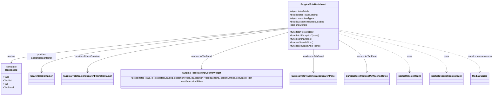

# Diagram: web/portal/src/pages/surgicaltotetracking/dashboard/SurgicalToteTracking.Dashboard.page.js


> Auto-generated by Obscura crawlers

## Diagram 1



### SVG

<svg id="container" width="3379.5234375" xmlns="http://www.w3.org/2000/svg" class="classDiagram" height="666" viewBox="0 0 3379.5234375 666" role="graphics-document document" aria-roledescription="class"><style>#container{font-family:"trebuchet ms",verdana,arial,sans-serif;font-size:16px;fill:#333;}@keyframes edge-animation-frame{from{stroke-dashoffset:0;}}@keyframes dash{to{stroke-dashoffset:0;}}#container .edge-animation-slow{stroke-dasharray:9,5!important;stroke-dashoffset:900;animation:dash 50s linear infinite;stroke-linecap:round;}#container .edge-animation-fast{stroke-dasharray:9,5!important;stroke-dashoffset:900;animation:dash 20s linear infinite;stroke-linecap:round;}#container .error-icon{fill:#552222;}#container .error-text{fill:#552222;stroke:#552222;}#container .edge-thickness-normal{stroke-width:1px;}#container .edge-thickness-thick{stroke-width:3.5px;}#container .edge-pattern-solid{stroke-dasharray:0;}#container .edge-thickness-invisible{stroke-width:0;fill:none;}#container .edge-pattern-dashed{stroke-dasharray:3;}#container .edge-pattern-dotted{stroke-dasharray:2;}#container .marker{fill:#333333;stroke:#333333;}#container .marker.cross{stroke:#333333;}#container svg{font-family:"trebuchet ms",verdana,arial,sans-serif;font-size:16px;}#container p{margin:0;}#container g.classGroup text{fill:#9370DB;stroke:none;font-family:"trebuchet ms",verdana,arial,sans-serif;font-size:10px;}#container g.classGroup text .title{font-weight:bolder;}#container .nodeLabel,#container .edgeLabel{color:#131300;}#container .edgeLabel .label rect{fill:#ECECFF;}#container .label text{fill:#131300;}#container .labelBkg{background:#ECECFF;}#container .edgeLabel .label span{background:#ECECFF;}#container .classTitle{font-weight:bolder;}#container .node rect,#container .node circle,#container .node ellipse,#container .node polygon,#container .node path{fill:#ECECFF;stroke:#9370DB;stroke-width:1px;}#container .divider{stroke:#9370DB;stroke-width:1;}#container g.clickable{cursor:pointer;}#container g.classGroup rect{fill:#ECECFF;stroke:#9370DB;}#container g.classGroup line{stroke:#9370DB;stroke-width:1;}#container .classLabel .box{stroke:none;stroke-width:0;fill:#ECECFF;opacity:0.5;}#container .classLabel .label{fill:#9370DB;font-size:10px;}#container .relation{stroke:#333333;stroke-width:1;fill:none;}#container .dashed-line{stroke-dasharray:3;}#container .dotted-line{stroke-dasharray:1 2;}#container #compositionStart,#container .composition{fill:#333333!important;stroke:#333333!important;stroke-width:1;}#container #compositionEnd,#container .composition{fill:#333333!important;stroke:#333333!important;stroke-width:1;}#container #dependencyStart,#container .dependency{fill:#333333!important;stroke:#333333!important;stroke-width:1;}#container #dependencyStart,#container .dependency{fill:#333333!important;stroke:#333333!important;stroke-width:1;}#container #extensionStart,#container .extension{fill:transparent!important;stroke:#333333!important;stroke-width:1;}#container #extensionEnd,#container .extension{fill:transparent!important;stroke:#333333!important;stroke-width:1;}#container #aggregationStart,#container .aggregation{fill:transparent!important;stroke:#333333!important;stroke-width:1;}#container #aggregationEnd,#container .aggregation{fill:transparent!important;stroke:#333333!important;stroke-width:1;}#container #lollipopStart,#container .lollipop{fill:#ECECFF!important;stroke:#333333!important;stroke-width:1;}#container #lollipopEnd,#container .lollipop{fill:#ECECFF!important;stroke:#333333!important;stroke-width:1;}#container .edgeTerminals{font-size:11px;line-height:initial;}#container .classTitleText{text-anchor:middle;font-size:18px;fill:#333;}#container .label-icon{display:inline-block;height:1em;overflow:visible;vertical-align:-0.125em;}#container .node .label-icon path{fill:currentColor;stroke:revert;stroke-width:revert;}#container :root{--mermaid-font-family:"trebuchet ms",verdana,arial,sans-serif;}</style><g><defs><marker id="container_class-aggregationStart" class="marker aggregation class" refX="18" refY="7" markerWidth="190" markerHeight="240" orient="auto"><path d="M 18,7 L9,13 L1,7 L9,1 Z"></path></marker></defs><defs><marker id="container_class-aggregationEnd" class="marker aggregation class" refX="1" refY="7" markerWidth="20" markerHeight="28" orient="auto"><path d="M 18,7 L9,13 L1,7 L9,1 Z"></path></marker></defs><defs><marker id="container_class-extensionStart" class="marker extension class" refX="18" refY="7" markerWidth="190" markerHeight="240" orient="auto"><path d="M 1,7 L18,13 V 1 Z"></path></marker></defs><defs><marker id="container_class-extensionEnd" class="marker extension class" refX="1" refY="7" markerWidth="20" markerHeight="28" orient="auto"><path d="M 1,1 V 13 L18,7 Z"></path></marker></defs><defs><marker id="container_class-compositionStart" class="marker composition class" refX="18" refY="7" markerWidth="190" markerHeight="240" orient="auto"><path d="M 18,7 L9,13 L1,7 L9,1 Z"></path></marker></defs><defs><marker id="container_class-compositionEnd" class="marker composition class" refX="1" refY="7" markerWidth="20" markerHeight="28" orient="auto"><path d="M 18,7 L9,13 L1,7 L9,1 Z"></path></marker></defs><defs><marker id="container_class-dependencyStart" class="marker dependency class" refX="6" refY="7" markerWidth="190" markerHeight="240" orient="auto"><path d="M 5,7 L9,13 L1,7 L9,1 Z"></path></marker></defs><defs><marker id="container_class-dependencyEnd" class="marker dependency class" refX="13" refY="7" markerWidth="20" markerHeight="28" orient="auto"><path d="M 18,7 L9,13 L14,7 L9,1 Z"></path></marker></defs><defs><marker id="container_class-lollipopStart" class="marker lollipop class" refX="13" refY="7" markerWidth="190" markerHeight="240" orient="auto"><circle stroke="black" fill="transparent" cx="7" cy="7" r="6"></circle></marker></defs><defs><marker id="container_class-lollipopEnd" class="marker lollipop class" refX="1" refY="7" markerWidth="190" markerHeight="240" orient="auto"><circle stroke="black" fill="transparent" cx="7" cy="7" r="6"></circle></marker></defs><g class="root"><g class="clusters"></g><g class="edgePaths"><path d="M1998.41,193.981L1678.198,227.151C1357.986,260.321,717.561,326.66,397.349,366.997C77.137,407.333,77.137,421.667,77.137,428.833L77.137,436" id="id_SurgicalToteDashboard_Dashboard_1" class="edge-thickness-normal edge-pattern-solid relation" style=";;;" data-edge="true" data-et="edge" data-id="id_SurgicalToteDashboard_Dashboard_1" data-points="W3sieCI6MTk5OC40MTAxNTYyNSwieSI6MTkzLjk4MDg1ODk4Njc2NjMyfSx7IngiOjc3LjEzNjcxODc1LCJ5IjozOTN9LHsieCI6NzcuMTM2NzE4NzUsInkiOjQ0Mn1d" marker-end="url(#container_class-dependencyEnd)"></path><path d="M1998.41,195.921L1712.195,228.767C1425.979,261.614,853.548,327.307,567.333,378.32C281.117,429.333,281.117,465.667,281.117,483.833L281.117,502" id="id_SurgicalToteDashboard_SearchBarContainer_2" class="edge-thickness-normal edge-pattern-solid relation" style=";;;" data-edge="true" data-et="edge" data-id="id_SurgicalToteDashboard_SearchBarContainer_2" data-points="W3sieCI6MTk5OC40MTAxNTYyNSwieSI6MTk1LjkyMDU2NjI4ODc1NTJ9LHsieCI6MjgxLjExNzE4NzUsInkiOjM5M30seyJ4IjoyODEuMTE3MTg3NSwieSI6NTA4fV0=" marker-end="url(#container_class-dependencyEnd)"></path><path d="M1998.41,199.766L1763.192,231.972C1527.974,264.178,1057.538,328.589,822.32,378.961C587.102,429.333,587.102,465.667,587.102,483.833L587.102,502" id="id_SurgicalToteDashboard_SurgicalToteTrackingSearchFiltersContainer_3" class="edge-thickness-normal edge-pattern-solid relation" style=";;;" data-edge="true" data-et="edge" data-id="id_SurgicalToteDashboard_SurgicalToteTrackingSearchFiltersContainer_3" data-points="W3sieCI6MTk5OC40MTAxNTYyNSwieSI6MTk5Ljc2NjQ5ODU3NTQxNDMyfSx7IngiOjU4Ny4xMDE1NjI1LCJ5IjozOTN9LHsieCI6NTg3LjEwMTU2MjUsInkiOjUwOH1d" marker-end="url(#container_class-dependencyEnd)"></path><path d="M1998.41,224.017L1896.596,252.18C1794.783,280.344,1591.155,336.672,1489.341,380.003C1387.527,423.333,1387.527,453.667,1387.527,468.833L1387.527,484" id="id_SurgicalToteDashboard_SurgicalToteTrackingCountsWidget_4" class="edge-thickness-normal edge-pattern-solid relation" style=";;;" data-edge="true" data-et="edge" data-id="id_SurgicalToteDashboard_SurgicalToteTrackingCountsWidget_4" data-points="W3sieCI6MTk5OC40MTAxNTYyNSwieSI6MjI0LjAxNjU1Njg2ODQ4NjJ9LHsieCI6MTM4Ny41MjczNDM3NSwieSI6MzkzfSx7IngiOjEzODcuNTI3MzQzNzUsInkiOjQ5MH1d" marker-end="url(#container_class-dependencyEnd)"></path><path d="M2171.992,344L2171.992,352.167C2171.992,360.333,2171.992,376.667,2171.992,403C2171.992,429.333,2171.992,465.667,2171.992,483.833L2171.992,502" id="id_SurgicalToteDashboard_SurgicalToteTrackingSavedSearchPanel_5" class="edge-thickness-normal edge-pattern-solid relation" style=";;;" data-edge="true" data-et="edge" data-id="id_SurgicalToteDashboard_SurgicalToteTrackingSavedSearchPanel_5" data-points="W3sieCI6MjE3MS45OTIxODc1LCJ5IjozNDR9LHsieCI6MjE3MS45OTIxODc1LCJ5IjozOTN9LHsieCI6MjE3MS45OTIxODc1LCJ5Ijo1MDh9XQ==" marker-end="url(#container_class-dependencyEnd)"></path><path d="M2345.574,282.072L2375.829,300.56C2406.083,319.048,2466.592,356.024,2496.847,392.679C2527.102,429.333,2527.102,465.667,2527.102,483.833L2527.102,502" id="id_SurgicalToteDashboard_SurgicalToteTrackingMyWatchedTotes_6" class="edge-thickness-normal edge-pattern-solid relation" style=";;;" data-edge="true" data-et="edge" data-id="id_SurgicalToteDashboard_SurgicalToteTrackingMyWatchedTotes_6" data-points="W3sieCI6MjM0NS41NzQyMTg3NSwieSI6MjgyLjA3MjM5MTg2ODcwMjR9LHsieCI6MjUyNy4xMDE1NjI1LCJ5IjozOTN9LHsieCI6MjUyNy4xMDE1NjI1LCJ5Ijo1MDh9XQ==" marker-end="url(#container_class-dependencyEnd)"></path><path d="M2345.574,234.7L2423.593,261.083C2501.612,287.466,2657.65,340.233,2735.669,384.783C2813.688,429.333,2813.688,465.667,2813.688,483.833L2813.688,502" id="id_SurgicalToteDashboard_useSetTitleOnMount_7" class="edge-thickness-normal edge-pattern-dashed relation" style=";;;" data-edge="true" data-et="edge" data-id="id_SurgicalToteDashboard_useSetTitleOnMount_7" data-points="W3sieCI6MjM0NS41NzQyMTg3NSwieSI6MjM0LjY5OTY2NjQxMDk5NjI2fSx7IngiOjI4MTMuNjg3NSwieSI6MzkzfSx7IngiOjI4MTMuNjg3NSwieSI6NTA4fV0=" marker-end="url(#container_class-dependencyEnd)"></path><path d="M2345.574,218.282L2465.122,247.401C2584.669,276.521,2823.764,334.761,2943.312,382.047C3062.859,429.333,3062.859,465.667,3062.859,483.833L3062.859,502" id="id_SurgicalToteDashboard_useSetDescriptionOnMount_8" class="edge-thickness-normal edge-pattern-dashed relation" style=";;;" data-edge="true" data-et="edge" data-id="id_SurgicalToteDashboard_useSetDescriptionOnMount_8" data-points="W3sieCI6MjM0NS41NzQyMTg3NSwieSI6MjE4LjI4MTYxMjAxNzc4NDY1fSx7IngiOjMwNjIuODU5Mzc1LCJ5IjozOTN9LHsieCI6MzA2Mi44NTkzNzUsInkiOjUwOH1d" marker-end="url(#container_class-dependencyEnd)"></path><path d="M2345.574,209.758L2502.609,240.299C2659.643,270.839,2973.712,331.919,3130.747,380.626C3287.781,429.333,3287.781,465.667,3287.781,483.833L3287.781,502" id="id_SurgicalToteDashboard_MediaQueries_9" class="edge-thickness-normal edge-pattern-dashed relation" style=";;;" data-edge="true" data-et="edge" data-id="id_SurgicalToteDashboard_MediaQueries_9" data-points="W3sieCI6MjM0NS41NzQyMTg3NSwieSI6MjA5Ljc1ODQ0MjM4NTkyMzY0fSx7IngiOjMyODcuNzgxMjUsInkiOjM5M30seyJ4IjozMjg3Ljc4MTI1LCJ5Ijo1MDh9XQ==" marker-end="url(#container_class-dependencyEnd)"></path></g><g class="edgeLabels"><g class="edgeLabel" transform="translate(77.13671875, 393)"><g class="label" data-id="id_SurgicalToteDashboard_Dashboard_1" transform="translate(-27.75, -12)"><foreignObject width="55.5" height="24"><div xmlns="http://www.w3.org/1999/xhtml" class="labelBkg" style="display: table-cell; white-space: nowrap; line-height: 1.5; max-width: 200px; text-align: center;"><span class="edgeLabel"><p>renders</p></span></div></foreignObject></g></g><g class="edgeLabel" transform="translate(281.1171875, 393)"><g class="label" data-id="id_SurgicalToteDashboard_SearchBarContainer_2" transform="translate(-100, -24)"><foreignObject width="200" height="48"><div xmlns="http://www.w3.org/1999/xhtml" class="labelBkg" style="display: table; white-space: break-spaces; line-height: 1.5; max-width: 200px; text-align: center; width: 200px;"><span class="edgeLabel"><p>provides SearchBarContainer</p></span></div></foreignObject></g></g><g class="edgeLabel" transform="translate(587.1015625, 393)"><g class="label" data-id="id_SurgicalToteDashboard_SurgicalToteTrackingSearchFiltersContainer_3" transform="translate(-90.7734375, -12)"><foreignObject width="181.546875" height="24"><div xmlns="http://www.w3.org/1999/xhtml" class="labelBkg" style="display: table-cell; white-space: nowrap; line-height: 1.5; max-width: 200px; text-align: center;"><span class="edgeLabel"><p>provides FiltersContainer</p></span></div></foreignObject></g></g><g class="edgeLabel" transform="translate(1387.52734375, 393)"><g class="label" data-id="id_SurgicalToteDashboard_SurgicalToteTrackingCountsWidget_4" transform="translate(-71.7265625, -12)"><foreignObject width="143.453125" height="24"><div xmlns="http://www.w3.org/1999/xhtml" class="labelBkg" style="display: table-cell; white-space: nowrap; line-height: 1.5; max-width: 200px; text-align: center;"><span class="edgeLabel"><p>renders in TabPanel</p></span></div></foreignObject></g></g><g class="edgeLabel" transform="translate(2171.9921875, 393)"><g class="label" data-id="id_SurgicalToteDashboard_SurgicalToteTrackingSavedSearchPanel_5" transform="translate(-71.7265625, -12)"><foreignObject width="143.453125" height="24"><div xmlns="http://www.w3.org/1999/xhtml" class="labelBkg" style="display: table-cell; white-space: nowrap; line-height: 1.5; max-width: 200px; text-align: center;"><span class="edgeLabel"><p>renders in TabPanel</p></span></div></foreignObject></g></g><g class="edgeLabel" transform="translate(2527.1015625, 393)"><g class="label" data-id="id_SurgicalToteDashboard_SurgicalToteTrackingMyWatchedTotes_6" transform="translate(-71.7265625, -12)"><foreignObject width="143.453125" height="24"><div xmlns="http://www.w3.org/1999/xhtml" class="labelBkg" style="display: table-cell; white-space: nowrap; line-height: 1.5; max-width: 200px; text-align: center;"><span class="edgeLabel"><p>renders in TabPanel</p></span></div></foreignObject></g></g><g class="edgeLabel" transform="translate(2813.6875, 393)"><g class="label" data-id="id_SurgicalToteDashboard_useSetTitleOnMount_7" transform="translate(-16.4921875, -12)"><foreignObject width="32.984375" height="24"><div xmlns="http://www.w3.org/1999/xhtml" class="labelBkg" style="display: table-cell; white-space: nowrap; line-height: 1.5; max-width: 200px; text-align: center;"><span class="edgeLabel"><p>uses</p></span></div></foreignObject></g></g><g class="edgeLabel" transform="translate(3062.859375, 393)"><g class="label" data-id="id_SurgicalToteDashboard_useSetDescriptionOnMount_8" transform="translate(-16.4921875, -12)"><foreignObject width="32.984375" height="24"><div xmlns="http://www.w3.org/1999/xhtml" class="labelBkg" style="display: table-cell; white-space: nowrap; line-height: 1.5; max-width: 200px; text-align: center;"><span class="edgeLabel"><p>uses</p></span></div></foreignObject></g></g><g class="edgeLabel" transform="translate(3287.78125, 393)"><g class="label" data-id="id_SurgicalToteDashboard_MediaQueries_9" transform="translate(-83.7421875, -12)"><foreignObject width="167.484375" height="24"><div xmlns="http://www.w3.org/1999/xhtml" class="labelBkg" style="display: table-cell; white-space: nowrap; line-height: 1.5; max-width: 200px; text-align: center;"><span class="edgeLabel"><p>uses for responsive css</p></span></div></foreignObject></g></g></g><g class="nodes"><g class="node default" id="classId-SurgicalToteDashboard-0" transform="translate(2171.9921875, 176)"><g class="basic label-container"><path d="M-173.58203125 -168 L173.58203125 -168 L173.58203125 168 L-173.58203125 168" stroke="none" stroke-width="0" fill="#ECECFF" style=""></path><path d="M-173.58203125 -168 C-50.98955998026865 -168, 71.6029112894627 -168, 173.58203125 -168 M-173.58203125 -168 C-95.41038049784012 -168, -17.238729745680246 -168, 173.58203125 -168 M173.58203125 -168 C173.58203125 -40.877746139381344, 173.58203125 86.24450772123731, 173.58203125 168 M173.58203125 -168 C173.58203125 -38.11894891549977, 173.58203125 91.76210216900046, 173.58203125 168 M173.58203125 168 C66.98037862400773 168, -39.621274001984546 168, -173.58203125 168 M173.58203125 168 C52.654454247239414 168, -68.27312275552117 168, -173.58203125 168 M-173.58203125 168 C-173.58203125 86.78680259377963, -173.58203125 5.573605187559252, -173.58203125 -168 M-173.58203125 168 C-173.58203125 81.085599277401, -173.58203125 -5.828801445197996, -173.58203125 -168" stroke="#9370DB" stroke-width="1.3" fill="none" stroke-dasharray="0 0" style=""></path></g><g class="annotation-group text" transform="translate(0, -144)"></g><g class="label-group text" transform="translate(-84.7109375, -144)"><g class="label" style="font-weight: bolder" transform="translate(0,-12)"><foreignObject width="169.421875" height="24"><div xmlns="http://www.w3.org/1999/xhtml" style="display: table-cell; white-space: nowrap; line-height: 1.5; max-width: 217px; text-align: center;"><span class="nodeLabel markdown-node-label" style=""><p>SurgicalToteDashboard</p></span></div></foreignObject></g></g><g class="members-group text" transform="translate(-161.58203125, -96)"><g class="label" style="" transform="translate(0,-12)"><foreignObject width="137.421875" height="24"><div xmlns="http://www.w3.org/1999/xhtml" style="display: table-cell; white-space: nowrap; line-height: 1.5; max-width: 195px; text-align: center;"><span class="nodeLabel markdown-node-label" style=""><p>+object totesTotals</p></span></div></foreignObject></g><g class="label" style="" transform="translate(0,12)"><foreignObject width="195.890625" height="24"><div xmlns="http://www.w3.org/1999/xhtml" style="display: table-cell; white-space: nowrap; line-height: 1.5; max-width: 254px; text-align: center;"><span class="nodeLabel markdown-node-label" style=""><p>+bool isTotesTotalsLoading</p></span></div></foreignObject></g><g class="label" style="" transform="translate(0,36)"><foreignObject width="169.65625" height="24"><div xmlns="http://www.w3.org/1999/xhtml" style="display: table-cell; white-space: nowrap; line-height: 1.5; max-width: 227px; text-align: center;"><span class="nodeLabel markdown-node-label" style=""><p>+object exceptionTypes</p></span></div></foreignObject></g><g class="label" style="" transform="translate(0,60)"><foreignObject width="238.453125" height="24"><div xmlns="http://www.w3.org/1999/xhtml" style="display: table-cell; white-space: nowrap; line-height: 1.5; max-width: 296px; text-align: center;"><span class="nodeLabel markdown-node-label" style=""><p>+bool isExceptionTypesIsLoading</p></span></div></foreignObject></g><g class="label" style="" transform="translate(0,84)"><foreignObject width="125.40625" height="24"><div xmlns="http://www.w3.org/1999/xhtml" style="display: table-cell; white-space: nowrap; line-height: 1.5; max-width: 183px; text-align: center;"><span class="nodeLabel markdown-node-label" style=""><p>-bool showFilters</p></span></div></foreignObject></g></g><g class="methods-group text" transform="translate(-161.58203125, 48)"><g class="label" style="" transform="translate(0,-12)"><foreignObject width="172.109375" height="24"><div xmlns="http://www.w3.org/1999/xhtml" style="display: table-cell; white-space: nowrap; line-height: 1.5; max-width: 229px; text-align: center;"><span class="nodeLabel markdown-node-label" style=""><p>+func fetchTotesTotals()</p></span></div></foreignObject></g><g class="label" style="" transform="translate(0,12)"><foreignObject width="202.46875" height="24"><div xmlns="http://www.w3.org/1999/xhtml" style="display: table-cell; white-space: nowrap; line-height: 1.5; max-width: 260px; text-align: center;"><span class="nodeLabel markdown-node-label" style=""><p>+func fetchExceptionTypes()</p></span></div></foreignObject></g><g class="label" style="" transform="translate(0,36)"><foreignObject width="156.0625" height="24"><div xmlns="http://www.w3.org/1999/xhtml" style="display: table-cell; white-space: nowrap; line-height: 1.5; max-width: 213px; text-align: center;"><span class="nodeLabel markdown-node-label" style=""><p>+func searchEntities()</p></span></div></foreignObject></g><g class="label" style="" transform="translate(0,60)"><foreignObject width="161.65625" height="24"><div xmlns="http://www.w3.org/1999/xhtml" style="display: table-cell; white-space: nowrap; line-height: 1.5; max-width: 219px; text-align: center;"><span class="nodeLabel markdown-node-label" style=""><p>+func setSearchFilter()</p></span></div></foreignObject></g><g class="label" style="" transform="translate(0,84)"><foreignObject width="211.421875" height="24"><div xmlns="http://www.w3.org/1999/xhtml" style="display: table-cell; white-space: nowrap; line-height: 1.5; max-width: 269px; text-align: center;"><span class="nodeLabel markdown-node-label" style=""><p>+func resetSearchAndFilters()</p></span></div></foreignObject></g></g><g class="divider" style=""><path d="M-173.58203125 -120 C-49.65399570017553 -120, 74.27403984964894 -120, 173.58203125 -120 M-173.58203125 -120 C-49.47474693314554 -120, 74.63253738370892 -120, 173.58203125 -120" stroke="#9370DB" stroke-width="1.3" fill="none" stroke-dasharray="0 0" style=""></path></g><g class="divider" style=""><path d="M-173.58203125 24 C-99.38694339196394 24, -25.19185553392788 24, 173.58203125 24 M-173.58203125 24 C-54.94460516179424 24, 63.692820926411514 24, 173.58203125 24" stroke="#9370DB" stroke-width="1.3" fill="none" stroke-dasharray="0 0" style=""></path></g></g><g class="node default" id="classId-Dashboard-1" transform="translate(77.13671875, 550)"><g class="basic label-container"><path d="M-69.13671875 -108 L69.13671875 -108 L69.13671875 108 L-69.13671875 108" stroke="none" stroke-width="0" fill="#ECECFF" style=""></path><path d="M-69.13671875 -108 C-21.602955925679318 -108, 25.930806898641364 -108, 69.13671875 -108 M-69.13671875 -108 C-20.486120782436693 -108, 28.164477185126614 -108, 69.13671875 -108 M69.13671875 -108 C69.13671875 -58.35250434212523, 69.13671875 -8.705008684250458, 69.13671875 108 M69.13671875 -108 C69.13671875 -26.204790674815385, 69.13671875 55.59041865036923, 69.13671875 108 M69.13671875 108 C38.90637754932895 108, 8.67603634865791 108, -69.13671875 108 M69.13671875 108 C17.56628781236985 108, -34.0041431252603 108, -69.13671875 108 M-69.13671875 108 C-69.13671875 31.803050633357785, -69.13671875 -44.39389873328443, -69.13671875 -108 M-69.13671875 108 C-69.13671875 44.000282155231446, -69.13671875 -19.99943568953711, -69.13671875 -108" stroke="#9370DB" stroke-width="1.3" fill="none" stroke-dasharray="0 0" style=""></path></g><g class="annotation-group text" transform="translate(-41.4921875, -84)"><g class="label" style="" transform="translate(0,-12)"><foreignObject width="82.984375" height="24"><div xmlns="http://www.w3.org/1999/xhtml" style="display: table-cell; white-space: nowrap; line-height: 1.5; max-width: 133px; text-align: center;"><span class="nodeLabel markdown-node-label" style=""><p>«template»</p></span></div></foreignObject></g></g><g class="label-group text" transform="translate(-39.4375, -60)"><g class="label" style="font-weight: bolder" transform="translate(0,-12)"><foreignObject width="78.875" height="24"><div xmlns="http://www.w3.org/1999/xhtml" style="display: table-cell; white-space: nowrap; line-height: 1.5; max-width: 128px; text-align: center;"><span class="nodeLabel markdown-node-label" style=""><p>Dashboard</p></span></div></foreignObject></g></g><g class="members-group text" transform="translate(-57.13671875, -12)"><g class="label" style="" transform="translate(0,-12)"><foreignObject width="40.34375" height="24"><div xmlns="http://www.w3.org/1999/xhtml" style="display: table-cell; white-space: nowrap; line-height: 1.5; max-width: 98px; text-align: center;"><span class="nodeLabel markdown-node-label" style=""><p>+Tabs</p></span></div></foreignObject></g><g class="label" style="" transform="translate(0,12)"><foreignObject width="58.59375" height="24"><div xmlns="http://www.w3.org/1999/xhtml" style="display: table-cell; white-space: nowrap; line-height: 1.5; max-width: 116px; text-align: center;"><span class="nodeLabel markdown-node-label" style=""><p>+TabList</p></span></div></foreignObject></g><g class="label" style="" transform="translate(0,36)"><foreignObject width="32.875" height="24"><div xmlns="http://www.w3.org/1999/xhtml" style="display: table-cell; white-space: nowrap; line-height: 1.5; max-width: 90px; text-align: center;"><span class="nodeLabel markdown-node-label" style=""><p>+Tab</p></span></div></foreignObject></g><g class="label" style="" transform="translate(0,60)"><foreignObject width="72.78125" height="24"><div xmlns="http://www.w3.org/1999/xhtml" style="display: table-cell; white-space: nowrap; line-height: 1.5; max-width: 130px; text-align: center;"><span class="nodeLabel markdown-node-label" style=""><p>+TabPanel</p></span></div></foreignObject></g></g><g class="methods-group text" transform="translate(-57.13671875, 108)"></g><g class="divider" style=""><path d="M-69.13671875 -36 C-31.559985752062374 -36, 6.016747245875251 -36, 69.13671875 -36 M-69.13671875 -36 C-31.10537714076696 -36, 6.925964468466077 -36, 69.13671875 -36" stroke="#9370DB" stroke-width="1.3" fill="none" stroke-dasharray="0 0" style=""></path></g><g class="divider" style=""><path d="M-69.13671875 84 C-17.835603801547578 84, 33.465511146904845 84, 69.13671875 84 M-69.13671875 84 C-21.337852897049643 84, 26.461012955900713 84, 69.13671875 84" stroke="#9370DB" stroke-width="1.3" fill="none" stroke-dasharray="0 0" style=""></path></g></g><g class="node default" id="classId-SearchBarContainer-2" transform="translate(281.1171875, 550)"><g class="basic label-container"><path d="M-84.84375 -42 L84.84375 -42 L84.84375 42 L-84.84375 42" stroke="none" stroke-width="0" fill="#ECECFF" style=""></path><path d="M-84.84375 -42 C-36.94152512416561 -42, 10.960699751668784 -42, 84.84375 -42 M-84.84375 -42 C-36.596383664054635 -42, 11.65098267189073 -42, 84.84375 -42 M84.84375 -42 C84.84375 -8.753873193949147, 84.84375 24.492253612101706, 84.84375 42 M84.84375 -42 C84.84375 -25.04097008839051, 84.84375 -8.081940176781018, 84.84375 42 M84.84375 42 C23.33770719989343 42, -38.16833560021314 42, -84.84375 42 M84.84375 42 C28.777735201745188 42, -27.288279596509625 42, -84.84375 42 M-84.84375 42 C-84.84375 21.191863628947754, -84.84375 0.383727257895508, -84.84375 -42 M-84.84375 42 C-84.84375 18.822153572143897, -84.84375 -4.355692855712206, -84.84375 -42" stroke="#9370DB" stroke-width="1.3" fill="none" stroke-dasharray="0 0" style=""></path></g><g class="annotation-group text" transform="translate(0, -18)"></g><g class="label-group text" transform="translate(-72.84375, -18)"><g class="label" style="font-weight: bolder" transform="translate(0,-12)"><foreignObject width="145.6875" height="24"><div xmlns="http://www.w3.org/1999/xhtml" style="display: table-cell; white-space: nowrap; line-height: 1.5; max-width: 195px; text-align: center;"><span class="nodeLabel markdown-node-label" style=""><p>SearchBarContainer</p></span></div></foreignObject></g></g><g class="members-group text" transform="translate(-72.84375, 30)"></g><g class="methods-group text" transform="translate(-72.84375, 60)"></g><g class="divider" style=""><path d="M-84.84375 6 C-31.546706958040176 6, 21.75033608391965 6, 84.84375 6 M-84.84375 6 C-40.03168791960082 6, 4.78037416079836 6, 84.84375 6" stroke="#9370DB" stroke-width="1.3" fill="none" stroke-dasharray="0 0" style=""></path></g><g class="divider" style=""><path d="M-84.84375 24 C-32.54693889588039 24, 19.749872208239225 24, 84.84375 24 M-84.84375 24 C-50.74853010634847 24, -16.653310212696937 24, 84.84375 24" stroke="#9370DB" stroke-width="1.3" fill="none" stroke-dasharray="0 0" style=""></path></g></g><g class="node default" id="classId-SurgicalToteTrackingSearchFiltersContainer-3" transform="translate(587.1015625, 550)"><g class="basic label-container"><path d="M-171.140625 -42 L171.140625 -42 L171.140625 42 L-171.140625 42" stroke="none" stroke-width="0" fill="#ECECFF" style=""></path><path d="M-171.140625 -42 C-65.16409872084868 -42, 40.81242755830263 -42, 171.140625 -42 M-171.140625 -42 C-81.48053931124427 -42, 8.179546377511457 -42, 171.140625 -42 M171.140625 -42 C171.140625 -15.365933571911345, 171.140625 11.26813285617731, 171.140625 42 M171.140625 -42 C171.140625 -10.830498463776994, 171.140625 20.339003072446012, 171.140625 42 M171.140625 42 C42.83680000460828 42, -85.46702499078344 42, -171.140625 42 M171.140625 42 C98.44795831989624 42, 25.75529163979249 42, -171.140625 42 M-171.140625 42 C-171.140625 18.08866575461879, -171.140625 -5.8226684907624175, -171.140625 -42 M-171.140625 42 C-171.140625 23.111235701029084, -171.140625 4.222471402058169, -171.140625 -42" stroke="#9370DB" stroke-width="1.3" fill="none" stroke-dasharray="0 0" style=""></path></g><g class="annotation-group text" transform="translate(0, -18)"></g><g class="label-group text" transform="translate(-159.140625, -18)"><g class="label" style="font-weight: bolder" transform="translate(0,-12)"><foreignObject width="318.28125" height="24"><div xmlns="http://www.w3.org/1999/xhtml" style="display: table-cell; white-space: nowrap; line-height: 1.5; max-width: 363px; text-align: center;"><span class="nodeLabel markdown-node-label" style=""><p>SurgicalToteTrackingSearchFiltersContainer</p></span></div></foreignObject></g></g><g class="members-group text" transform="translate(-159.140625, 30)"></g><g class="methods-group text" transform="translate(-159.140625, 60)"></g><g class="divider" style=""><path d="M-171.140625 6 C-86.1747446445895 6, -1.2088642891789902 6, 171.140625 6 M-171.140625 6 C-40.59730840839953 6, 89.94600818320095 6, 171.140625 6" stroke="#9370DB" stroke-width="1.3" fill="none" stroke-dasharray="0 0" style=""></path></g><g class="divider" style=""><path d="M-171.140625 24 C-47.248323665404754 24, 76.64397766919049 24, 171.140625 24 M-171.140625 24 C-74.08252715301904 24, 22.975570693961913 24, 171.140625 24" stroke="#9370DB" stroke-width="1.3" fill="none" stroke-dasharray="0 0" style=""></path></g></g><g class="node default" id="classId-SurgicalToteTrackingCountsWidget-4" transform="translate(1387.52734375, 550)"><g class="basic label-container"><path d="M-579.28515625 -60 L579.28515625 -60 L579.28515625 60 L-579.28515625 60" stroke="none" stroke-width="0" fill="#ECECFF" style=""></path><path d="M-579.28515625 -60 C-251.0006649971221 -60, 77.2838262557558 -60, 579.28515625 -60 M-579.28515625 -60 C-208.72278961171872 -60, 161.83957702656255 -60, 579.28515625 -60 M579.28515625 -60 C579.28515625 -13.245830179685143, 579.28515625 33.508339640629714, 579.28515625 60 M579.28515625 -60 C579.28515625 -31.812894996728218, 579.28515625 -3.6257899934564364, 579.28515625 60 M579.28515625 60 C119.8889189131965 60, -339.507318423607 60, -579.28515625 60 M579.28515625 60 C144.93795628600026 60, -289.4092436779995 60, -579.28515625 60 M-579.28515625 60 C-579.28515625 16.540616738809497, -579.28515625 -26.918766522381006, -579.28515625 -60 M-579.28515625 60 C-579.28515625 26.069807110511412, -579.28515625 -7.860385778977175, -579.28515625 -60" stroke="#9370DB" stroke-width="1.3" fill="none" stroke-dasharray="0 0" style=""></path></g><g class="annotation-group text" transform="translate(0, -36)"></g><g class="label-group text" transform="translate(-127.0234375, -36)"><g class="label" style="font-weight: bolder" transform="translate(0,-12)"><foreignObject width="254.046875" height="24"><div xmlns="http://www.w3.org/1999/xhtml" style="display: table-cell; white-space: nowrap; line-height: 1.5; max-width: 299px; text-align: center;"><span class="nodeLabel markdown-node-label" style=""><p>SurgicalToteTrackingCountsWidget</p></span></div></foreignObject></g></g><g class="members-group text" transform="translate(-567.28515625, 12)"><g class="label" style="" transform="translate(0,-12)"><foreignObject width="1007.546875" height="24"><div xmlns="http://www.w3.org/1999/xhtml" style="display: table-cell; white-space: nowrap; line-height: 1.5; max-width: 1065px; text-align: center;"><span class="nodeLabel markdown-node-label" style=""><p>+props: totesTotals, isTotesTotalsLoading, exceptionTypes, isExceptionTypesIsLoading, searchEntities, setSearchFilter, resetSearchAndFilters</p></span></div></foreignObject></g></g><g class="methods-group text" transform="translate(-567.28515625, 60)"></g><g class="divider" style=""><path d="M-579.28515625 -12 C-131.15026927641702 -12, 316.98461769716596 -12, 579.28515625 -12 M-579.28515625 -12 C-300.98153070601074 -12, -22.67790516202149 -12, 579.28515625 -12" stroke="#9370DB" stroke-width="1.3" fill="none" stroke-dasharray="0 0" style=""></path></g><g class="divider" style=""><path d="M-579.28515625 36 C-208.0387655003579 36, 163.2076252492842 36, 579.28515625 36 M-579.28515625 36 C-270.1511292327219 36, 38.982897784556144 36, 579.28515625 36" stroke="#9370DB" stroke-width="1.3" fill="none" stroke-dasharray="0 0" style=""></path></g></g><g class="node default" id="classId-SurgicalToteTrackingSavedSearchPanel-5" transform="translate(2171.9921875, 550)"><g class="basic label-container"><path d="M-155.1796875 -42 L155.1796875 -42 L155.1796875 42 L-155.1796875 42" stroke="none" stroke-width="0" fill="#ECECFF" style=""></path><path d="M-155.1796875 -42 C-68.04294303412853 -42, 19.093801431742946 -42, 155.1796875 -42 M-155.1796875 -42 C-31.263132233104102 -42, 92.6534230337918 -42, 155.1796875 -42 M155.1796875 -42 C155.1796875 -23.812691847565397, 155.1796875 -5.625383695130793, 155.1796875 42 M155.1796875 -42 C155.1796875 -21.824691200438334, 155.1796875 -1.649382400876668, 155.1796875 42 M155.1796875 42 C81.05367898684834 42, 6.927670473696679 42, -155.1796875 42 M155.1796875 42 C44.378576599208316 42, -66.42253430158337 42, -155.1796875 42 M-155.1796875 42 C-155.1796875 9.748184726246869, -155.1796875 -22.503630547506262, -155.1796875 -42 M-155.1796875 42 C-155.1796875 10.136249851754826, -155.1796875 -21.727500296490348, -155.1796875 -42" stroke="#9370DB" stroke-width="1.3" fill="none" stroke-dasharray="0 0" style=""></path></g><g class="annotation-group text" transform="translate(0, -18)"></g><g class="label-group text" transform="translate(-143.1796875, -18)"><g class="label" style="font-weight: bolder" transform="translate(0,-12)"><foreignObject width="286.359375" height="24"><div xmlns="http://www.w3.org/1999/xhtml" style="display: table-cell; white-space: nowrap; line-height: 1.5; max-width: 331px; text-align: center;"><span class="nodeLabel markdown-node-label" style=""><p>SurgicalToteTrackingSavedSearchPanel</p></span></div></foreignObject></g></g><g class="members-group text" transform="translate(-143.1796875, 30)"></g><g class="methods-group text" transform="translate(-143.1796875, 60)"></g><g class="divider" style=""><path d="M-155.1796875 6 C-65.73892427058273 6, 23.701838958834543 6, 155.1796875 6 M-155.1796875 6 C-66.94086647380557 6, 21.29795455238886 6, 155.1796875 6" stroke="#9370DB" stroke-width="1.3" fill="none" stroke-dasharray="0 0" style=""></path></g><g class="divider" style=""><path d="M-155.1796875 24 C-40.155223334369154 24, 74.86924083126169 24, 155.1796875 24 M-155.1796875 24 C-64.7723425536489 24, 25.635002392702205 24, 155.1796875 24" stroke="#9370DB" stroke-width="1.3" fill="none" stroke-dasharray="0 0" style=""></path></g></g><g class="node default" id="classId-SurgicalToteTrackingMyWatchedTotes-6" transform="translate(2527.1015625, 550)"><g class="basic label-container"><path d="M-149.9296875 -42 L149.9296875 -42 L149.9296875 42 L-149.9296875 42" stroke="none" stroke-width="0" fill="#ECECFF" style=""></path><path d="M-149.9296875 -42 C-62.639211823455696 -42, 24.651263853088608 -42, 149.9296875 -42 M-149.9296875 -42 C-69.84396307364595 -42, 10.241761352708096 -42, 149.9296875 -42 M149.9296875 -42 C149.9296875 -22.01055372577055, 149.9296875 -2.0211074515410985, 149.9296875 42 M149.9296875 -42 C149.9296875 -12.907371134471369, 149.9296875 16.185257731057263, 149.9296875 42 M149.9296875 42 C41.86941910050733 42, -66.19084929898534 42, -149.9296875 42 M149.9296875 42 C80.0112884062884 42, 10.092889312576801 42, -149.9296875 42 M-149.9296875 42 C-149.9296875 10.751418379342024, -149.9296875 -20.497163241315953, -149.9296875 -42 M-149.9296875 42 C-149.9296875 16.261560789513492, -149.9296875 -9.476878420973016, -149.9296875 -42" stroke="#9370DB" stroke-width="1.3" fill="none" stroke-dasharray="0 0" style=""></path></g><g class="annotation-group text" transform="translate(0, -18)"></g><g class="label-group text" transform="translate(-137.9296875, -18)"><g class="label" style="font-weight: bolder" transform="translate(0,-12)"><foreignObject width="275.859375" height="24"><div xmlns="http://www.w3.org/1999/xhtml" style="display: table-cell; white-space: nowrap; line-height: 1.5; max-width: 320px; text-align: center;"><span class="nodeLabel markdown-node-label" style=""><p>SurgicalToteTrackingMyWatchedTotes</p></span></div></foreignObject></g></g><g class="members-group text" transform="translate(-137.9296875, 30)"></g><g class="methods-group text" transform="translate(-137.9296875, 60)"></g><g class="divider" style=""><path d="M-149.9296875 6 C-46.79272154029802 6, 56.344244419403964 6, 149.9296875 6 M-149.9296875 6 C-61.304413782985264 6, 27.32085993402947 6, 149.9296875 6" stroke="#9370DB" stroke-width="1.3" fill="none" stroke-dasharray="0 0" style=""></path></g><g class="divider" style=""><path d="M-149.9296875 24 C-72.9037333148187 24, 4.122220870362611 24, 149.9296875 24 M-149.9296875 24 C-87.85645632891689 24, -25.783225157833783 24, 149.9296875 24" stroke="#9370DB" stroke-width="1.3" fill="none" stroke-dasharray="0 0" style=""></path></g></g><g class="node default" id="classId-useSetTitleOnMount-7" transform="translate(2813.6875, 550)"><g class="basic label-container"><path d="M-86.65625 -42 L86.65625 -42 L86.65625 42 L-86.65625 42" stroke="none" stroke-width="0" fill="#ECECFF" style=""></path><path d="M-86.65625 -42 C-23.23595519650062 -42, 40.18433960699876 -42, 86.65625 -42 M-86.65625 -42 C-38.82123828929616 -42, 9.013773421407677 -42, 86.65625 -42 M86.65625 -42 C86.65625 -10.455115874563326, 86.65625 21.089768250873348, 86.65625 42 M86.65625 -42 C86.65625 -9.126514442805885, 86.65625 23.74697111438823, 86.65625 42 M86.65625 42 C32.64065730343487 42, -21.374935393130258 42, -86.65625 42 M86.65625 42 C40.1526063603513 42, -6.351037279297401 42, -86.65625 42 M-86.65625 42 C-86.65625 10.568300888573177, -86.65625 -20.863398222853647, -86.65625 -42 M-86.65625 42 C-86.65625 18.110502332850853, -86.65625 -5.778995334298294, -86.65625 -42" stroke="#9370DB" stroke-width="1.3" fill="none" stroke-dasharray="0 0" style=""></path></g><g class="annotation-group text" transform="translate(0, -18)"></g><g class="label-group text" transform="translate(-74.65625, -18)"><g class="label" style="font-weight: bolder" transform="translate(0,-12)"><foreignObject width="149.3125" height="24"><div xmlns="http://www.w3.org/1999/xhtml" style="display: table-cell; white-space: nowrap; line-height: 1.5; max-width: 197px; text-align: center;"><span class="nodeLabel markdown-node-label" style=""><p>useSetTitleOnMount</p></span></div></foreignObject></g></g><g class="members-group text" transform="translate(-74.65625, 30)"></g><g class="methods-group text" transform="translate(-74.65625, 60)"></g><g class="divider" style=""><path d="M-86.65625 6 C-44.86503907755726 6, -3.0738281551145263 6, 86.65625 6 M-86.65625 6 C-51.529264469303506 6, -16.40227893860701 6, 86.65625 6" stroke="#9370DB" stroke-width="1.3" fill="none" stroke-dasharray="0 0" style=""></path></g><g class="divider" style=""><path d="M-86.65625 24 C-31.26853938145109 24, 24.119171237097817 24, 86.65625 24 M-86.65625 24 C-22.402328756321964 24, 41.85159248735607 24, 86.65625 24" stroke="#9370DB" stroke-width="1.3" fill="none" stroke-dasharray="0 0" style=""></path></g></g><g class="node default" id="classId-useSetDescriptionOnMount-8" transform="translate(3062.859375, 550)"><g class="basic label-container"><path d="M-112.515625 -42 L112.515625 -42 L112.515625 42 L-112.515625 42" stroke="none" stroke-width="0" fill="#ECECFF" style=""></path><path d="M-112.515625 -42 C-50.18188123104864 -42, 12.151862537902716 -42, 112.515625 -42 M-112.515625 -42 C-47.827592241791976 -42, 16.86044051641605 -42, 112.515625 -42 M112.515625 -42 C112.515625 -20.42656377302229, 112.515625 1.1468724539554174, 112.515625 42 M112.515625 -42 C112.515625 -8.912711781389284, 112.515625 24.174576437221432, 112.515625 42 M112.515625 42 C59.8840872017523 42, 7.252549403504602 42, -112.515625 42 M112.515625 42 C42.84881742844681 42, -26.817990143106385 42, -112.515625 42 M-112.515625 42 C-112.515625 12.17439068871008, -112.515625 -17.65121862257984, -112.515625 -42 M-112.515625 42 C-112.515625 24.414198268058918, -112.515625 6.828396536117836, -112.515625 -42" stroke="#9370DB" stroke-width="1.3" fill="none" stroke-dasharray="0 0" style=""></path></g><g class="annotation-group text" transform="translate(0, -18)"></g><g class="label-group text" transform="translate(-100.515625, -18)"><g class="label" style="font-weight: bolder" transform="translate(0,-12)"><foreignObject width="201.03125" height="24"><div xmlns="http://www.w3.org/1999/xhtml" style="display: table-cell; white-space: nowrap; line-height: 1.5; max-width: 249px; text-align: center;"><span class="nodeLabel markdown-node-label" style=""><p>useSetDescriptionOnMount</p></span></div></foreignObject></g></g><g class="members-group text" transform="translate(-100.515625, 30)"></g><g class="methods-group text" transform="translate(-100.515625, 60)"></g><g class="divider" style=""><path d="M-112.515625 6 C-64.99031261915377 6, -17.46500023830754 6, 112.515625 6 M-112.515625 6 C-62.64397798191234 6, -12.772330963824686 6, 112.515625 6" stroke="#9370DB" stroke-width="1.3" fill="none" stroke-dasharray="0 0" style=""></path></g><g class="divider" style=""><path d="M-112.515625 24 C-41.71657772881166 24, 29.082469542376685 24, 112.515625 24 M-112.515625 24 C-44.60995868982211 24, 23.295707620355785 24, 112.515625 24" stroke="#9370DB" stroke-width="1.3" fill="none" stroke-dasharray="0 0" style=""></path></g></g><g class="node default" id="classId-MediaQueries-9" transform="translate(3287.78125, 550)"><g class="basic label-container"><path d="M-62.40625 -42 L62.40625 -42 L62.40625 42 L-62.40625 42" stroke="none" stroke-width="0" fill="#ECECFF" style=""></path><path d="M-62.40625 -42 C-36.097311797365364 -42, -9.788373594730729 -42, 62.40625 -42 M-62.40625 -42 C-33.75455007748503 -42, -5.1028501549700565 -42, 62.40625 -42 M62.40625 -42 C62.40625 -18.31028859426003, 62.40625 5.379422811479941, 62.40625 42 M62.40625 -42 C62.40625 -10.786815715125744, 62.40625 20.42636856974851, 62.40625 42 M62.40625 42 C27.017336568286282 42, -8.371576863427435 42, -62.40625 42 M62.40625 42 C19.006282851998137 42, -24.393684296003727 42, -62.40625 42 M-62.40625 42 C-62.40625 16.307717472561123, -62.40625 -9.384565054877754, -62.40625 -42 M-62.40625 42 C-62.40625 20.40238520448245, -62.40625 -1.1952295910351012, -62.40625 -42" stroke="#9370DB" stroke-width="1.3" fill="none" stroke-dasharray="0 0" style=""></path></g><g class="annotation-group text" transform="translate(0, -18)"></g><g class="label-group text" transform="translate(-50.40625, -18)"><g class="label" style="font-weight: bolder" transform="translate(0,-12)"><foreignObject width="100.8125" height="24"><div xmlns="http://www.w3.org/1999/xhtml" style="display: table-cell; white-space: nowrap; line-height: 1.5; max-width: 150px; text-align: center;"><span class="nodeLabel markdown-node-label" style=""><p>MediaQueries</p></span></div></foreignObject></g></g><g class="members-group text" transform="translate(-50.40625, 30)"></g><g class="methods-group text" transform="translate(-50.40625, 60)"></g><g class="divider" style=""><path d="M-62.40625 6 C-26.157166350424887 6, 10.091917299150225 6, 62.40625 6 M-62.40625 6 C-30.701691661487992 6, 1.0028666770240164 6, 62.40625 6" stroke="#9370DB" stroke-width="1.3" fill="none" stroke-dasharray="0 0" style=""></path></g><g class="divider" style=""><path d="M-62.40625 24 C-19.1307455948103 24, 24.1447588103794 24, 62.40625 24 M-62.40625 24 C-19.774299801134305 24, 22.85765039773139 24, 62.40625 24" stroke="#9370DB" stroke-width="1.3" fill="none" stroke-dasharray="0 0" style=""></path></g></g></g></g></g></svg>

## Diagram 2

```mermaid
flowchart LR
    A[Component Mount: SurgicalToteDashboard] --> B[Hooks: useSetTitleOnMount & useSetDescriptionOnMount]
    B --> C[useEffect on mount]
    C --> D[fetchTotesTotals()]
    C --> E[fetchExceptionTypes()]
    C --> F[resetSearchAndFilters(true)]
    A --> G[Render Dashboard template]
    G --> H[Tabs]
    H --> I[TabPanel: Summary View]
    I --> J[SurgicalToteTrackingCountsWidget]
    H --> K[TabPanel: My Saved Searches]
    K --> L[SurgicalToteTrackingSavedSearchPanel]
    K --> M[SurgicalToteTrackingMyWatchedTotes]
    J --> N[Calls setSearchFilter / searchEntities / resetSearchAndFilters as needed]
```

> SVG rendering failed for this diagram.
