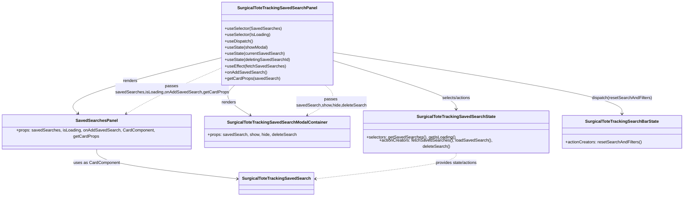

# Diagram: web/portal/src/pages/surgicaltotetracking/dashboard/components/SurgicalToteTracking.SavedSearchesPanel.js

> Auto-generated by Obscura crawlers

## Mermaid

### SVG

<svg id="container" width="2568.15625" xmlns="http://www.w3.org/2000/svg" class="classDiagram" height="740" viewBox="0 0 2568.15625 740" role="graphics-document document" aria-roledescription="class"><g><defs><marker id="container_class-aggregationStart" class="marker aggregation class" refX="18" refY="7" markerWidth="190" markerHeight="240" orient="auto"><path d="M 18,7 L9,13 L1,7 L9,1 Z"></path></marker></defs><defs><marker id="container_class-aggregationEnd" class="marker aggregation class" refX="1" refY="7" markerWidth="20" markerHeight="28" orient="auto"><path d="M 18,7 L9,13 L1,7 L9,1 Z"></path></marker></defs><defs><marker id="container_class-extensionStart" class="marker extension class" refX="18" refY="7" markerWidth="190" markerHeight="240" orient="auto"><path d="M 1,7 L18,13 V 1 Z"></path></marker></defs><defs><marker id="container_class-extensionEnd" class="marker extension class" refX="1" refY="7" markerWidth="20" markerHeight="28" orient="auto"><path d="M 1,1 V 13 L18,7 Z"></path></marker></defs><defs><marker id="container_class-compositionStart" class="marker composition class" refX="18" refY="7" markerWidth="190" markerHeight="240" orient="auto"><path d="M 18,7 L9,13 L1,7 L9,1 Z"></path></marker></defs><defs><marker id="container_class-compositionEnd" class="marker composition class" refX="1" refY="7" markerWidth="20" markerHeight="28" orient="auto"><path d="M 18,7 L9,13 L1,7 L9,1 Z"></path></marker></defs><defs><marker id="container_class-dependencyStart" class="marker dependency class" refX="6" refY="7" markerWidth="190" markerHeight="240" orient="auto"><path d="M 5,7 L9,13 L1,7 L9,1 Z"></path></marker></defs><defs><marker id="container_class-dependencyEnd" class="marker dependency class" refX="13" refY="7" markerWidth="20" markerHeight="28" orient="auto"><path d="M 18,7 L9,13 L14,7 L9,1 Z"></path></marker></defs><defs><marker id="container_class-lollipopStart" class="marker lollipop class" refX="13" refY="7" markerWidth="190" markerHeight="240" orient="auto"><circle stroke="black" fill="transparent" cx="7" cy="7" r="6"></circle></marker></defs><defs><marker id="container_class-lollipopEnd" class="marker lollipop class" refX="1" refY="7" markerWidth="190" markerHeight="240" orient="auto"><circle stroke="black" fill="transparent" cx="7" cy="7" r="6"></circle></marker></defs><g class="root"><g class="clusters"></g><g class="edgePaths"><path d="M838.676,220.271L738.405,246.059C638.134,271.847,437.592,323.424,347.739,359.187C257.886,394.95,278.722,414.9,289.14,424.875L299.558,434.85" id="id_SurgicalToteTrackingSavedSearchPanel_SavedSearchesPanel_1" class="edge-thickness-normal edge-pattern-solid relation" style=";;;" data-edge="true" data-et="edge" data-id="id_SurgicalToteTrackingSavedSearchPanel_SavedSearchesPanel_1" data-points="W3sieCI6ODM4LjY3NTc4MTI1LCJ5IjoyMjAuMjcwNjA4MjM3MDE1ODZ9LHsieCI6MjM3LjA1MDc4MTI1LCJ5IjozNzV9LHsieCI6MzAzLjg5MTUwNzA1NjQ1MTYsInkiOjQzOX1d" marker-end="url(#container_class-dependencyEnd)"></path><path d="M885.183,326L876.933,334.167C868.683,342.333,852.183,358.667,861.147,376.992C870.111,395.317,904.538,415.634,921.752,425.792L938.966,435.951" id="id_SurgicalToteTrackingSavedSearchPanel_SurgicalToteTrackingSavedSearchModalContainer_2" class="edge-thickness-normal edge-pattern-solid relation" style=";;;" data-edge="true" data-et="edge" data-id="id_SurgicalToteTrackingSavedSearchPanel_SurgicalToteTrackingSavedSearchModalContainer_2" data-points="W3sieCI6ODg1LjE4MzI3NDQ4OTE4MjYsInkiOjMyNn0seyJ4Ijo4MzUuNjgzNTkzNzUsInkiOjM3NX0seyJ4Ijo5NDQuMTMzMTkwNTI0MTkzNSwieSI6NDM5fV0=" marker-end="url(#container_class-dependencyEnd)"></path><path d="M366.555,559L366.555,567.667C366.555,576.333,366.555,593.667,455.473,612.748C544.391,631.83,722.228,652.659,811.146,663.074L900.064,673.489" id="id_SavedSearchesPanel_SurgicalToteTrackingSavedSearch_3" class="edge-thickness-normal edge-pattern-solid relation" style=";;;" data-edge="true" data-et="edge" data-id="id_SavedSearchesPanel_SurgicalToteTrackingSavedSearch_3" data-points="W3sieCI6MzY2LjU1NDY4NzUsInkiOjU1OX0seyJ4IjozNjYuNTU0Njg3NSwieSI6NjExfSx7IngiOjkwNi4wMjM0Mzc1LCJ5Ijo2NzQuMTg2ODIzMTE1MTQ3MX1d" marker-end="url(#container_class-dependencyEnd)"></path><path d="M1252.934,231.331L1330.029,255.276C1407.125,279.221,1561.316,327.11,1638.412,358.222C1715.508,389.333,1715.508,403.667,1715.508,410.833L1715.508,418" id="id_SurgicalToteTrackingSavedSearchPanel_SurgicalToteTrackingSavedSearchState_4" class="edge-thickness-normal edge-pattern-solid relation" style=";;;" data-edge="true" data-et="edge" data-id="id_SurgicalToteTrackingSavedSearchPanel_SurgicalToteTrackingSavedSearchState_4" data-points="W3sieCI6MTI1Mi45MzM1OTM3NSwieSI6MjMxLjMzMTIxMDE5MTA4Mjh9LHsieCI6MTcxNS41MDc4MTI1LCJ5IjozNzV9LHsieCI6MTcxNS41MDc4MTI1LCJ5Ijo0MjR9XQ==" marker-end="url(#container_class-dependencyEnd)"></path><path d="M1252.934,200.358L1433.667,229.465C1614.401,258.572,1975.868,316.786,2156.602,355.06C2337.336,393.333,2337.336,411.667,2337.336,420.833L2337.336,430" id="id_SurgicalToteTrackingSavedSearchPanel_SurgicalToteTrackingSearchBarState_5" class="edge-thickness-normal edge-pattern-solid relation" style=";;;" data-edge="true" data-et="edge" data-id="id_SurgicalToteTrackingSavedSearchPanel_SurgicalToteTrackingSearchBarState_5" data-points="W3sieCI6MTI1Mi45MzM1OTM3NSwieSI6MjAwLjM1NzkzMjY4NjQ5MTMyfSx7IngiOjIzMzcuMzM1OTM3NSwieSI6Mzc1fSx7IngiOjIzMzcuMzM1OTM3NSwieSI6NDM2fV0=" marker-end="url(#container_class-dependencyEnd)"></path><path d="M1715.508,574L1715.508,580.167C1715.508,586.333,1715.508,598.667,1626.59,615.248C1537.671,631.83,1359.835,652.659,1270.917,663.074L1181.998,673.489" id="id_SurgicalToteTrackingSavedSearchState_SurgicalToteTrackingSavedSearch_6" class="edge-thickness-normal edge-pattern-dashed relation" style=";;;" data-edge="true" data-et="edge" data-id="id_SurgicalToteTrackingSavedSearchState_SurgicalToteTrackingSavedSearch_6" data-points="W3sieCI6MTcxNS41MDc4MTI1LCJ5Ijo1NzR9LHsieCI6MTcxNS41MDc4MTI1LCJ5Ijo2MTF9LHsieCI6MTE3Ni4wMzkwNjI1LCJ5Ijo2NzQuMTg2ODIzMTE1MTQ3MX1d" marker-end="url(#container_class-dependencyEnd)"></path><path d="M1222.136,326L1231.192,334.167C1240.249,342.333,1258.363,358.667,1248.458,377.027C1238.553,395.386,1200.629,415.773,1181.667,425.966L1162.705,436.159" id="id_SurgicalToteTrackingSavedSearchPanel_SurgicalToteTrackingSavedSearchModalContainer_7" class="edge-thickness-normal edge-pattern-dashed relation" style=";;;" data-edge="true" data-et="edge" data-id="id_SurgicalToteTrackingSavedSearchPanel_SurgicalToteTrackingSavedSearchModalContainer_7" data-points="W3sieCI6MTIyMi4xMzU1OTE5NDcxMTU1LCJ5IjozMjZ9LHsieCI6MTI3Ni40NzY1NjI1LCJ5IjozNzV9LHsieCI6MTE1Ny40MjAxMTA4ODcwOTY4LCJ5Ijo0Mzl9XQ==" marker-end="url(#container_class-dependencyEnd)"></path><path d="M838.676,258.836L795.009,278.196C751.342,297.557,664.009,336.279,603.129,365.798C542.248,395.317,507.821,415.634,490.607,425.792L473.393,435.951" id="id_SurgicalToteTrackingSavedSearchPanel_SavedSearchesPanel_8" class="edge-thickness-normal edge-pattern-dashed relation" style=";;;" data-edge="true" data-et="edge" data-id="id_SurgicalToteTrackingSavedSearchPanel_SavedSearchesPanel_8" data-points="W3sieCI6ODM4LjY3NTc4MTI1LCJ5IjoyNTguODM1NzY2MDg5MDc4fSx7IngiOjU3Ni42NzU3ODEyNSwieSI6Mzc1fSx7IngiOjQ2OC4yMjYxODQ0NzU4MDY0NiwieSI6NDM5fV0=" marker-end="url(#container_class-dependencyEnd)"></path></g><g class="edgeLabels"><g class="edgeLabel" transform="translate(493.0515, 309.16026)"><g class="label" data-id="id_SurgicalToteTrackingSavedSearchPanel_SavedSearchesPanel_1" transform="translate(-27.75, -12)"><foreignObject width="55.5" height="24">

renders

</foreignObject></g></g><g class="edgeLabel" transform="translate(859.91618, 389.30052)"><g class="label" data-id="id_SurgicalToteTrackingSavedSearchPanel_SurgicalToteTrackingSavedSearchModalContainer_2" transform="translate(-27.75, -12)"><foreignObject width="55.5" height="24">

renders

</foreignObject></g></g><g class="edgeLabel" transform="translate(366.5546875, 611)"><g class="label" data-id="id_SavedSearchesPanel_SurgicalToteTrackingSavedSearch_3" transform="translate(-87.0234375, -12)"><foreignObject width="174.046875" height="24">

uses as CardComponent

</foreignObject></g></g><g class="edgeLabel" transform="translate(1715.5078125, 375)"><g class="label" data-id="id_SurgicalToteTrackingSavedSearchPanel_SurgicalToteTrackingSavedSearchState_4" transform="translate(-55.390625, -12)"><foreignObject width="110.78125" height="24">

selects/actions

</foreignObject></g></g><g class="edgeLabel" transform="translate(2337.3359375, 375)"><g class="label" data-id="id_SurgicalToteTrackingSavedSearchPanel_SurgicalToteTrackingSearchBarState_5" transform="translate(-114.9453125, -12)"><foreignObject width="229.890625" height="24">

dispatch(resetSearchAndFilters)

</foreignObject></g></g><g class="edgeLabel" transform="translate(1715.5078125, 611)"><g class="label" data-id="id_SurgicalToteTrackingSavedSearchState_SurgicalToteTrackingSavedSearch_6" transform="translate(-81.65625, -12)"><foreignObject width="163.3125" height="24">

provides state/actions

</foreignObject></g></g><g class="edgeLabel" transform="translate(1249.17277, 389.67743)"><g class="label" data-id="id_SurgicalToteTrackingSavedSearchPanel_SurgicalToteTrackingSavedSearchModalContainer_7" transform="translate(-132.96875, -24)"><foreignObject width="265.9375" height="48">

passes savedSearch,show,hide,deleteSearch

</foreignObject></g></g><g class="edgeLabel" transform="translate(650.11672, 342.43813)"><g class="label" data-id="id_SurgicalToteTrackingSavedSearchPanel_SavedSearchesPanel_8" transform="translate(-211.2578125, -24)"><foreignObject width="422.515625" height="48">

passes savedSearches,isLoading,onAddSavedSearch,getCardProps

</foreignObject></g></g></g><g class="nodes"><g class="node default" id="classId-SurgicalToteTrackingSavedSearchPanel-0" transform="translate(1045.8046875, 167)"><g class="basic label-container"><path d="M-207.12890625 -159 L207.12890625 -159 L207.12890625 159 L-207.12890625 159" stroke="none" stroke-width="0" fill="#ECECFF" style=""></path><path d="M-207.12890625 -159 C-115.67912720272597 -159, -24.22934815545193 -159, 207.12890625 -159 M-207.12890625 -159 C-110.92268086433138 -159, -14.716455478662766 -159, 207.12890625 -159 M207.12890625 -159 C207.12890625 -86.57131502195342, 207.12890625 -14.142630043906848, 207.12890625 159 M207.12890625 -159 C207.12890625 -82.24024523631363, 207.12890625 -5.4804904726272525, 207.12890625 159 M207.12890625 159 C92.75441067029736 159, -21.62008490940528 159, -207.12890625 159 M207.12890625 159 C81.17442920993697 159, -44.78004783012605 159, -207.12890625 159 M-207.12890625 159 C-207.12890625 43.728606655434675, -207.12890625 -71.54278668913065, -207.12890625 -159 M-207.12890625 159 C-207.12890625 41.33855439921405, -207.12890625 -76.3228912015719, -207.12890625 -159" stroke="#9370DB" stroke-width="1.3" fill="none" stroke-dasharray="0 0" style=""></path></g><g class="annotation-group text" transform="translate(0, -135)"></g><g class="label-group text" transform="translate(-143.1796875, -135)"><g class="label" style="font-weight: bolder" transform="translate(0,-12)"><foreignObject width="286.359375" height="24">

SurgicalToteTrackingSavedSearchPanel

</foreignObject></g></g><g class="members-group text" transform="translate(-195.12890625, -87)"></g><g class="methods-group text" transform="translate(-195.12890625, -57)"><g class="label" style="" transform="translate(0,-12)"><foreignObject width="211.515625" height="24">

+useSelector(SavedSearches)

</foreignObject></g><g class="label" style="" transform="translate(0,12)"><foreignObject width="172.765625" height="24">

+useSelector(IsLoading)

</foreignObject></g><g class="label" style="" transform="translate(0,36)"><foreignObject width="106.765625" height="24">

+useDispatch()

</foreignObject></g><g class="label" style="" transform="translate(0,60)"><foreignObject width="163.46875" height="24">

+useState(showModal)

</foreignObject></g><g class="label" style="" transform="translate(0,84)"><foreignObject width="225.734375" height="24">

+useState(currentSavedSearch)

</foreignObject></g><g class="label" style="" transform="translate(0,108)"><foreignObject width="247.078125" height="24">

+useState(deletingSavedSearchId)

</foreignObject></g><g class="label" style="" transform="translate(0,132)"><foreignObject width="229.46875" height="24">

+useEffect(fetchSavedSearches)

</foreignObject></g><g class="label" style="" transform="translate(0,156)"><foreignObject width="157.375" height="24">

+onAddSavedSearch()

</foreignObject></g><g class="label" style="" transform="translate(0,180)"><foreignObject width="205.25" height="24">

+getCardProps(savedSearch)

</foreignObject></g></g><g class="divider" style=""><path d="M-207.12890625 -111 C-66.3089982435452 -111, 74.51090976290959 -111, 207.12890625 -111 M-207.12890625 -111 C-88.8168641841105 -111, 29.495177881779 -111, 207.12890625 -111" stroke="#9370DB" stroke-width="1.3" fill="none" stroke-dasharray="0 0" style=""></path></g><g class="divider" style=""><path d="M-207.12890625 -87 C-48.10214219311027 -87, 110.92462186377946 -87, 207.12890625 -87 M-207.12890625 -87 C-57.893394813782464 -87, 91.34211662243507 -87, 207.12890625 -87" stroke="#9370DB" stroke-width="1.3" fill="none" stroke-dasharray="0 0" style=""></path></g></g><g class="node default" id="classId-SavedSearchesPanel-1" transform="translate(366.5546875, 499)"><g class="basic label-container"><path d="M-358.5546875 -60 L358.5546875 -60 L358.5546875 60 L-358.5546875 60" stroke="none" stroke-width="0" fill="#ECECFF" style=""></path><path d="M-358.5546875 -60 C-121.96716889055179 -60, 114.62034971889642 -60, 358.5546875 -60 M-358.5546875 -60 C-119.92086079265815 -60, 118.7129659146837 -60, 358.5546875 -60 M358.5546875 -60 C358.5546875 -15.069445495364533, 358.5546875 29.861109009270933, 358.5546875 60 M358.5546875 -60 C358.5546875 -25.811116809807558, 358.5546875 8.377766380384884, 358.5546875 60 M358.5546875 60 C131.80915568372535 60, -94.9363761325493 60, -358.5546875 60 M358.5546875 60 C130.25788537421002 60, -98.03891675157996 60, -358.5546875 60 M-358.5546875 60 C-358.5546875 34.70675217254656, -358.5546875 9.413504345093124, -358.5546875 -60 M-358.5546875 60 C-358.5546875 12.69881454781003, -358.5546875 -34.60237090437994, -358.5546875 -60" stroke="#9370DB" stroke-width="1.3" fill="none" stroke-dasharray="0 0" style=""></path></g><g class="annotation-group text" transform="translate(0, -36)"></g><g class="label-group text" transform="translate(-75.265625, -36)"><g class="label" style="font-weight: bolder" transform="translate(0,-12)"><foreignObject width="150.53125" height="24">

SavedSearchesPanel

</foreignObject></g></g><g class="members-group text" transform="translate(-346.5546875, 12)"><g class="label" style="" transform="translate(0,-12)"><foreignObject width="617.84375" height="24">

+props: savedSearches, isLoading, onAddSavedSearch, CardComponent, getCardProps

</foreignObject></g></g><g class="methods-group text" transform="translate(-346.5546875, 60)"></g><g class="divider" style=""><path d="M-358.5546875 -12 C-91.64602219634446 -12, 175.26264310731108 -12, 358.5546875 -12 M-358.5546875 -12 C-101.25222851520937 -12, 156.05023046958127 -12, 358.5546875 -12" stroke="#9370DB" stroke-width="1.3" fill="none" stroke-dasharray="0 0" style=""></path></g><g class="divider" style=""><path d="M-358.5546875 36 C-99.38799124890966 36, 159.7787050021807 36, 358.5546875 36 M-358.5546875 36 C-187.6137337955262 36, -16.672780091052402 36, 358.5546875 36" stroke="#9370DB" stroke-width="1.3" fill="none" stroke-dasharray="0 0" style=""></path></g></g><g class="node default" id="classId-SurgicalToteTrackingSavedSearch-2" transform="translate(1041.03125, 690)"><g class="basic label-container"><path d="M-135.0078125 -42 L135.0078125 -42 L135.0078125 42 L-135.0078125 42" stroke="none" stroke-width="0" fill="#ECECFF" style=""></path><path d="M-135.0078125 -42 C-55.999952444722396 -42, 23.007907610555208 -42, 135.0078125 -42 M-135.0078125 -42 C-42.219315777357565 -42, 50.56918094528487 -42, 135.0078125 -42 M135.0078125 -42 C135.0078125 -19.753330158359667, 135.0078125 2.4933396832806665, 135.0078125 42 M135.0078125 -42 C135.0078125 -21.475774458025008, 135.0078125 -0.9515489160500152, 135.0078125 42 M135.0078125 42 C30.79479520002188 42, -73.41822209995624 42, -135.0078125 42 M135.0078125 42 C64.79700992087322 42, -5.413792658253556 42, -135.0078125 42 M-135.0078125 42 C-135.0078125 16.17604498553267, -135.0078125 -9.64791002893466, -135.0078125 -42 M-135.0078125 42 C-135.0078125 21.48676971435947, -135.0078125 0.9735394287189365, -135.0078125 -42" stroke="#9370DB" stroke-width="1.3" fill="none" stroke-dasharray="0 0" style=""></path></g><g class="annotation-group text" transform="translate(0, -18)"></g><g class="label-group text" transform="translate(-123.0078125, -18)"><g class="label" style="font-weight: bolder" transform="translate(0,-12)"><foreignObject width="246.015625" height="24">

SurgicalToteTrackingSavedSearch

</foreignObject></g></g><g class="members-group text" transform="translate(-123.0078125, 30)"></g><g class="methods-group text" transform="translate(-123.0078125, 60)"></g><g class="divider" style=""><path d="M-135.0078125 6 C-37.36929688419137 6, 60.26921873161726 6, 135.0078125 6 M-135.0078125 6 C-55.21639698033516 6, 24.575018539329676 6, 135.0078125 6" stroke="#9370DB" stroke-width="1.3" fill="none" stroke-dasharray="0 0" style=""></path></g><g class="divider" style=""><path d="M-135.0078125 24 C-72.90541819783364 24, -10.80302389566728 24, 135.0078125 24 M-135.0078125 24 C-54.754923324233346 24, 25.49796585153331 24, 135.0078125 24" stroke="#9370DB" stroke-width="1.3" fill="none" stroke-dasharray="0 0" style=""></path></g></g><g class="node default" id="classId-SurgicalToteTrackingSavedSearchModalContainer-3" transform="translate(1045.8046875, 499)"><g class="basic label-container"><path d="M-270.6953125 -60 L270.6953125 -60 L270.6953125 60 L-270.6953125 60" stroke="none" stroke-width="0" fill="#ECECFF" style=""></path><path d="M-270.6953125 -60 C-112.3348296255661 -60, 46.0256532488678 -60, 270.6953125 -60 M-270.6953125 -60 C-79.57972718586703 -60, 111.53585812826594 -60, 270.6953125 -60 M270.6953125 -60 C270.6953125 -32.22214405389046, 270.6953125 -4.4442881077809275, 270.6953125 60 M270.6953125 -60 C270.6953125 -17.15410103185644, 270.6953125 25.691797936287116, 270.6953125 60 M270.6953125 60 C102.83616754018834 60, -65.02297741962332 60, -270.6953125 60 M270.6953125 60 C100.59962829655254 60, -69.49605590689492 60, -270.6953125 60 M-270.6953125 60 C-270.6953125 17.40533083559483, -270.6953125 -25.189338328810337, -270.6953125 -60 M-270.6953125 60 C-270.6953125 35.070633472873034, -270.6953125 10.141266945746068, -270.6953125 -60" stroke="#9370DB" stroke-width="1.3" fill="none" stroke-dasharray="0 0" style=""></path></g><g class="annotation-group text" transform="translate(0, -36)"></g><g class="label-group text" transform="translate(-181.046875, -36)"><g class="label" style="font-weight: bolder" transform="translate(0,-12)"><foreignObject width="362.09375" height="24">

SurgicalToteTrackingSavedSearchModalContainer

</foreignObject></g></g><g class="members-group text" transform="translate(-258.6953125, 12)"><g class="label" style="" transform="translate(0,-12)"><foreignObject width="336.34375" height="24">

+props: savedSearch, show, hide, deleteSearch

</foreignObject></g></g><g class="methods-group text" transform="translate(-258.6953125, 60)"></g><g class="divider" style=""><path d="M-270.6953125 -12 C-107.73033193111044 -12, 55.23464863777912 -12, 270.6953125 -12 M-270.6953125 -12 C-148.66290621404747 -12, -26.630499928094935 -12, 270.6953125 -12" stroke="#9370DB" stroke-width="1.3" fill="none" stroke-dasharray="0 0" style=""></path></g><g class="divider" style=""><path d="M-270.6953125 36 C-103.37625385010867 36, 63.942804799782664 36, 270.6953125 36 M-270.6953125 36 C-71.47684972238528 36, 127.74161305522944 36, 270.6953125 36" stroke="#9370DB" stroke-width="1.3" fill="none" stroke-dasharray="0 0" style=""></path></g></g><g class="node default" id="classId-SurgicalToteTrackingSavedSearchState-4" transform="translate(1715.5078125, 499)"><g class="basic label-container"><path d="M-349.0078125 -75 L349.0078125 -75 L349.0078125 75 L-349.0078125 75" stroke="none" stroke-width="0" fill="#ECECFF" style=""></path><path d="M-349.0078125 -75 C-97.16971306103025 -75, 154.6683863779395 -75, 349.0078125 -75 M-349.0078125 -75 C-123.91145599527005 -75, 101.18490050945991 -75, 349.0078125 -75 M349.0078125 -75 C349.0078125 -44.886423963055215, 349.0078125 -14.77284792611043, 349.0078125 75 M349.0078125 -75 C349.0078125 -29.794439618568042, 349.0078125 15.411120762863916, 349.0078125 75 M349.0078125 75 C71.50830796139502 75, -205.99119657720996 75, -349.0078125 75 M349.0078125 75 C112.22987326136871 75, -124.54806597726258 75, -349.0078125 75 M-349.0078125 75 C-349.0078125 31.36997344276068, -349.0078125 -12.260053114478637, -349.0078125 -75 M-349.0078125 75 C-349.0078125 41.8040214175811, -349.0078125 8.608042835162195, -349.0078125 -75" stroke="#9370DB" stroke-width="1.3" fill="none" stroke-dasharray="0 0" style=""></path></g><g class="annotation-group text" transform="translate(0, -51)"></g><g class="label-group text" transform="translate(-142.3125, -51)"><g class="label" style="font-weight: bolder" transform="translate(0,-12)"><foreignObject width="284.625" height="24">

SurgicalToteTrackingSavedSearchState

</foreignObject></g></g><g class="members-group text" transform="translate(-337.0078125, -3)"></g><g class="methods-group text" transform="translate(-337.0078125, 27)"><g class="label" style="" transform="translate(0,-12)"><foreignObject width="333.0625" height="24">

+selectors: getSavedSearches(), getIsLoading()

</foreignObject></g><g class="label" style="" transform="translate(0,12)"><foreignObject width="531.703125" height="24">

+actionCreators: fetchSavedSearches(), loadSavedSearch(), deleteSearch()

</foreignObject></g></g><g class="divider" style=""><path d="M-349.0078125 -27 C-205.35007200071271 -27, -61.69233150142543 -27, 349.0078125 -27 M-349.0078125 -27 C-96.32572020962957 -27, 156.35637208074087 -27, 349.0078125 -27" stroke="#9370DB" stroke-width="1.3" fill="none" stroke-dasharray="0 0" style=""></path></g><g class="divider" style=""><path d="M-349.0078125 -3 C-165.3043517435733 -3, 18.399109012853387 -3, 349.0078125 -3 M-349.0078125 -3 C-95.81831367162673 -3, 157.37118515674655 -3, 349.0078125 -3" stroke="#9370DB" stroke-width="1.3" fill="none" stroke-dasharray="0 0" style=""></path></g></g><g class="node default" id="classId-SurgicalToteTrackingSearchBarState-5" transform="translate(2337.3359375, 499)"><g class="basic label-container"><path d="M-222.8203125 -63 L222.8203125 -63 L222.8203125 63 L-222.8203125 63" stroke="none" stroke-width="0" fill="#ECECFF" style=""></path><path d="M-222.8203125 -63 C-57.47391906092764 -63, 107.87247437814472 -63, 222.8203125 -63 M-222.8203125 -63 C-116.93116299039957 -63, -11.042013480799142 -63, 222.8203125 -63 M222.8203125 -63 C222.8203125 -35.64961795622487, 222.8203125 -8.299235912449753, 222.8203125 63 M222.8203125 -63 C222.8203125 -21.091641575868337, 222.8203125 20.816716848263326, 222.8203125 63 M222.8203125 63 C45.81406658295052 63, -131.19217933409897 63, -222.8203125 63 M222.8203125 63 C130.63107570982862 63, 38.441838919657215 63, -222.8203125 63 M-222.8203125 63 C-222.8203125 32.0168424074852, -222.8203125 1.0336848149703997, -222.8203125 -63 M-222.8203125 63 C-222.8203125 24.25660162607479, -222.8203125 -14.48679674785042, -222.8203125 -63" stroke="#9370DB" stroke-width="1.3" fill="none" stroke-dasharray="0 0" style=""></path></g><g class="annotation-group text" transform="translate(0, -39)"></g><g class="label-group text" transform="translate(-132.75, -39)"><g class="label" style="font-weight: bolder" transform="translate(0,-12)"><foreignObject width="265.5" height="24">

SurgicalToteTrackingSearchBarState

</foreignObject></g></g><g class="members-group text" transform="translate(-210.8203125, 9)"></g><g class="methods-group text" transform="translate(-210.8203125, 39)"><g class="label" style="" transform="translate(0,-12)"><foreignObject width="288.890625" height="24">

+actionCreators: resetSearchAndFilters()

</foreignObject></g></g><g class="divider" style=""><path d="M-222.8203125 -15 C-59.27238739698009 -15, 104.27553770603981 -15, 222.8203125 -15 M-222.8203125 -15 C-61.68251398728688 -15, 99.45528452542624 -15, 222.8203125 -15" stroke="#9370DB" stroke-width="1.3" fill="none" stroke-dasharray="0 0" style=""></path></g><g class="divider" style=""><path d="M-222.8203125 9 C-107.72630703546771 9, 7.367698429064575 9, 222.8203125 9 M-222.8203125 9 C-127.91756904784071 9, -33.01482559568143 9, 222.8203125 9" stroke="#9370DB" stroke-width="1.3" fill="none" stroke-dasharray="0 0" style=""></path></g></g></g></g></g></svg>
