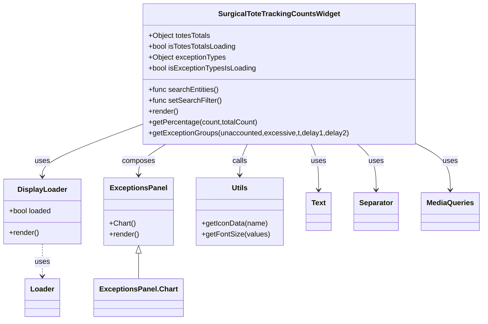

# Diagram: web/portal/src/pages/surgicaltotetracking/dashboard/components/SurgicalToteTrackingCountsWidget.js


> Auto-generated by Obscura crawlers

## Diagram 1



### SVG

<svg id="container" width="1052.6640625" xmlns="http://www.w3.org/2000/svg" class="classDiagram" height="710" viewBox="0 0 1052.6640625 710" role="graphics-document document" aria-roledescription="class"><style>#container{font-family:"trebuchet ms",verdana,arial,sans-serif;font-size:16px;fill:#333;}@keyframes edge-animation-frame{from{stroke-dashoffset:0;}}@keyframes dash{to{stroke-dashoffset:0;}}#container .edge-animation-slow{stroke-dasharray:9,5!important;stroke-dashoffset:900;animation:dash 50s linear infinite;stroke-linecap:round;}#container .edge-animation-fast{stroke-dasharray:9,5!important;stroke-dashoffset:900;animation:dash 20s linear infinite;stroke-linecap:round;}#container .error-icon{fill:#552222;}#container .error-text{fill:#552222;stroke:#552222;}#container .edge-thickness-normal{stroke-width:1px;}#container .edge-thickness-thick{stroke-width:3.5px;}#container .edge-pattern-solid{stroke-dasharray:0;}#container .edge-thickness-invisible{stroke-width:0;fill:none;}#container .edge-pattern-dashed{stroke-dasharray:3;}#container .edge-pattern-dotted{stroke-dasharray:2;}#container .marker{fill:#333333;stroke:#333333;}#container .marker.cross{stroke:#333333;}#container svg{font-family:"trebuchet ms",verdana,arial,sans-serif;font-size:16px;}#container p{margin:0;}#container g.classGroup text{fill:#9370DB;stroke:none;font-family:"trebuchet ms",verdana,arial,sans-serif;font-size:10px;}#container g.classGroup text .title{font-weight:bolder;}#container .nodeLabel,#container .edgeLabel{color:#131300;}#container .edgeLabel .label rect{fill:#ECECFF;}#container .label text{fill:#131300;}#container .labelBkg{background:#ECECFF;}#container .edgeLabel .label span{background:#ECECFF;}#container .classTitle{font-weight:bolder;}#container .node rect,#container .node circle,#container .node ellipse,#container .node polygon,#container .node path{fill:#ECECFF;stroke:#9370DB;stroke-width:1px;}#container .divider{stroke:#9370DB;stroke-width:1;}#container g.clickable{cursor:pointer;}#container g.classGroup rect{fill:#ECECFF;stroke:#9370DB;}#container g.classGroup line{stroke:#9370DB;stroke-width:1;}#container .classLabel .box{stroke:none;stroke-width:0;fill:#ECECFF;opacity:0.5;}#container .classLabel .label{fill:#9370DB;font-size:10px;}#container .relation{stroke:#333333;stroke-width:1;fill:none;}#container .dashed-line{stroke-dasharray:3;}#container .dotted-line{stroke-dasharray:1 2;}#container #compositionStart,#container .composition{fill:#333333!important;stroke:#333333!important;stroke-width:1;}#container #compositionEnd,#container .composition{fill:#333333!important;stroke:#333333!important;stroke-width:1;}#container #dependencyStart,#container .dependency{fill:#333333!important;stroke:#333333!important;stroke-width:1;}#container #dependencyStart,#container .dependency{fill:#333333!important;stroke:#333333!important;stroke-width:1;}#container #extensionStart,#container .extension{fill:transparent!important;stroke:#333333!important;stroke-width:1;}#container #extensionEnd,#container .extension{fill:transparent!important;stroke:#333333!important;stroke-width:1;}#container #aggregationStart,#container .aggregation{fill:transparent!important;stroke:#333333!important;stroke-width:1;}#container #aggregationEnd,#container .aggregation{fill:transparent!important;stroke:#333333!important;stroke-width:1;}#container #lollipopStart,#container .lollipop{fill:#ECECFF!important;stroke:#333333!important;stroke-width:1;}#container #lollipopEnd,#container .lollipop{fill:#ECECFF!important;stroke:#333333!important;stroke-width:1;}#container .edgeTerminals{font-size:11px;line-height:initial;}#container .classTitleText{text-anchor:middle;font-size:18px;fill:#333;}#container .label-icon{display:inline-block;height:1em;overflow:visible;vertical-align:-0.125em;}#container .node .label-icon path{fill:currentColor;stroke:revert;stroke-width:revert;}#container :root{--mermaid-font-family:"trebuchet ms",verdana,arial,sans-serif;}</style><g><defs><marker id="container_class-aggregationStart" class="marker aggregation class" refX="18" refY="7" markerWidth="190" markerHeight="240" orient="auto"><path d="M 18,7 L9,13 L1,7 L9,1 Z"></path></marker></defs><defs><marker id="container_class-aggregationEnd" class="marker aggregation class" refX="1" refY="7" markerWidth="20" markerHeight="28" orient="auto"><path d="M 18,7 L9,13 L1,7 L9,1 Z"></path></marker></defs><defs><marker id="container_class-extensionStart" class="marker extension class" refX="18" refY="7" markerWidth="190" markerHeight="240" orient="auto"><path d="M 1,7 L18,13 V 1 Z"></path></marker></defs><defs><marker id="container_class-extensionEnd" class="marker extension class" refX="1" refY="7" markerWidth="20" markerHeight="28" orient="auto"><path d="M 1,1 V 13 L18,7 Z"></path></marker></defs><defs><marker id="container_class-compositionStart" class="marker composition class" refX="18" refY="7" markerWidth="190" markerHeight="240" orient="auto"><path d="M 18,7 L9,13 L1,7 L9,1 Z"></path></marker></defs><defs><marker id="container_class-compositionEnd" class="marker composition class" refX="1" refY="7" markerWidth="20" markerHeight="28" orient="auto"><path d="M 18,7 L9,13 L1,7 L9,1 Z"></path></marker></defs><defs><marker id="container_class-dependencyStart" class="marker dependency class" refX="6" refY="7" markerWidth="190" markerHeight="240" orient="auto"><path d="M 5,7 L9,13 L1,7 L9,1 Z"></path></marker></defs><defs><marker id="container_class-dependencyEnd" class="marker dependency class" refX="13" refY="7" markerWidth="20" markerHeight="28" orient="auto"><path d="M 18,7 L9,13 L14,7 L9,1 Z"></path></marker></defs><defs><marker id="container_class-lollipopStart" class="marker lollipop class" refX="13" refY="7" markerWidth="190" markerHeight="240" orient="auto"><circle stroke="black" fill="transparent" cx="7" cy="7" r="6"></circle></marker></defs><defs><marker id="container_class-lollipopEnd" class="marker lollipop class" refX="1" refY="7" markerWidth="190" markerHeight="240" orient="auto"><circle stroke="black" fill="transparent" cx="7" cy="7" r="6"></circle></marker></defs><g class="root"><g class="clusters"></g><g class="edgePaths"><path d="M315.531,274.13L278.578,287.942C241.625,301.753,167.719,329.377,130.766,348.855C93.813,368.333,93.813,379.667,93.813,385.333L93.813,391" id="id_SurgicalToteTrackingCountsWidget_DisplayLoader_1" class="edge-thickness-normal edge-pattern-solid relation" style=";;;" data-edge="true" data-et="edge" data-id="id_SurgicalToteTrackingCountsWidget_DisplayLoader_1" data-points="W3sieCI6MzE1LjUzMTI1LCJ5IjoyNzQuMTI5OTEwNTA4Mjc5N30seyJ4Ijo5My44MTI1LCJ5IjozNTd9LHsieCI6OTMuODEyNSwieSI6Mzk3fV0=" marker-end="url(#container_class-dependencyEnd)"></path><path d="M363.346,320L353.588,326.167C343.831,332.333,324.316,344.667,314.558,356C304.801,367.333,304.801,377.667,304.801,382.833L304.801,388" id="id_SurgicalToteTrackingCountsWidget_ExceptionsPanel_2" class="edge-thickness-normal edge-pattern-solid relation" style=";;;" data-edge="true" data-et="edge" data-id="id_SurgicalToteTrackingCountsWidget_ExceptionsPanel_2" data-points="W3sieCI6MzYzLjM0NTY3Mjc2NTU0NCwieSI6MzIwfSx7IngiOjMwNC44MDA3ODEyNSwieSI6MzU3fSx7IngiOjMwNC44MDA3ODEyNSwieSI6Mzk0fV0=" marker-end="url(#container_class-dependencyEnd)"></path><path d="M540.781,320L538.038,326.167C535.294,332.333,529.807,344.667,527.064,356C524.32,367.333,524.32,377.667,524.32,382.833L524.32,388" id="id_SurgicalToteTrackingCountsWidget_Utils_3" class="edge-thickness-normal edge-pattern-solid relation" style=";;;" data-edge="true" data-et="edge" data-id="id_SurgicalToteTrackingCountsWidget_Utils_3" data-points="W3sieCI6NTQwLjc4MTE0ODgwMTgxMzUsInkiOjMyMH0seyJ4Ijo1MjQuMzIwMzEyNSwieSI6MzU3fSx7IngiOjUyNC4zMjAzMTI1LCJ5IjozOTR9XQ==" marker-end="url(#container_class-dependencyEnd)"></path><path d="M93.813,541L93.813,547.667C93.813,554.333,93.813,567.667,93.813,579.5C93.813,591.333,93.813,601.667,93.813,606.833L93.813,612" id="id_DisplayLoader_Loader_4" class="edge-thickness-normal edge-pattern-dashed relation" style=";;;" data-edge="true" data-et="edge" data-id="id_DisplayLoader_Loader_4" data-points="W3sieCI6OTMuODEyNSwieSI6NTQxfSx7IngiOjkzLjgxMjUsInkiOjU4MX0seyJ4Ijo5My44MTI1LCJ5Ijo2MTh9XQ==" marker-end="url(#container_class-dependencyEnd)"></path><path d="M304.801,561.25L304.801,564.542C304.801,567.833,304.801,574.417,304.801,583.875C304.801,593.333,304.801,605.667,304.801,611.833L304.801,618" id="id_ExceptionsPanel_ExceptionsPanel.Chart_5" class="edge-thickness-normal edge-pattern-solid relation" style=";;;" data-edge="true" data-et="edge" data-id="id_ExceptionsPanel_ExceptionsPanel.Chart_5" data-points="W3sieCI6MzA0LjgwMDc4MTI1LCJ5Ijo1NDR9LHsieCI6MzA0LjgwMDc4MTI1LCJ5Ijo1ODF9LHsieCI6MzA0LjgwMDc4MTI1LCJ5Ijo2MTh9XQ==" marker-start="url(#container_class-extensionStart)"></path><path d="M679.586,320L682.33,326.167C685.073,332.333,690.56,344.667,693.303,361.5C696.047,378.333,696.047,399.667,696.047,410.333L696.047,421" id="id_SurgicalToteTrackingCountsWidget_Text_6" class="edge-thickness-normal edge-pattern-solid relation" style=";;;" data-edge="true" data-et="edge" data-id="id_SurgicalToteTrackingCountsWidget_Text_6" data-points="W3sieCI6Njc5LjU4NjAzODY5ODE4NjUsInkiOjMyMH0seyJ4Ijo2OTYuMDQ2ODc1LCJ5IjozNTd9LHsieCI6Njk2LjA0Njg3NSwieSI6NDI3fV0=" marker-end="url(#container_class-dependencyEnd)"></path><path d="M781.102,320L787.859,326.167C794.615,332.333,808.128,344.667,814.884,361.5C821.641,378.333,821.641,399.667,821.641,410.333L821.641,421" id="id_SurgicalToteTrackingCountsWidget_Separator_7" class="edge-thickness-normal edge-pattern-solid relation" style=";;;" data-edge="true" data-et="edge" data-id="id_SurgicalToteTrackingCountsWidget_Separator_7" data-points="W3sieCI6NzgxLjEwMjIzMDQwODAzMTEsInkiOjMyMH0seyJ4Ijo4MjEuNjQwNjI1LCJ5IjozNTd9LHsieCI6ODIxLjY0MDYyNSwieSI6NDI3fV0=" marker-end="url(#container_class-dependencyEnd)"></path><path d="M904.836,316.84L917.74,323.534C930.643,330.227,956.451,343.613,969.354,360.973C982.258,378.333,982.258,399.667,982.258,410.333L982.258,421" id="id_SurgicalToteTrackingCountsWidget_MediaQueries_8" class="edge-thickness-normal edge-pattern-solid relation" style=";;;" data-edge="true" data-et="edge" data-id="id_SurgicalToteTrackingCountsWidget_MediaQueries_8" data-points="W3sieCI6OTA0LjgzNTkzNzUsInkiOjMxNi44NDAyMTE2NTEzMjEzfSx7IngiOjk4Mi4yNTc4MTI1LCJ5IjozNTd9LHsieCI6OTgyLjI1NzgxMjUsInkiOjQyN31d" marker-end="url(#container_class-dependencyEnd)"></path></g><g class="edgeLabels"><g class="edgeLabel" transform="translate(93.8125, 357)"><g class="label" data-id="id_SurgicalToteTrackingCountsWidget_DisplayLoader_1" transform="translate(-16.4921875, -12)"><foreignObject width="32.984375" height="24"><div xmlns="http://www.w3.org/1999/xhtml" class="labelBkg" style="display: table-cell; white-space: nowrap; line-height: 1.5; max-width: 200px; text-align: center;"><span class="edgeLabel"><p>uses</p></span></div></foreignObject></g></g><g class="edgeLabel" transform="translate(304.80078125, 357)"><g class="label" data-id="id_SurgicalToteTrackingCountsWidget_ExceptionsPanel_2" transform="translate(-36.453125, -12)"><foreignObject width="72.90625" height="24"><div xmlns="http://www.w3.org/1999/xhtml" class="labelBkg" style="display: table-cell; white-space: nowrap; line-height: 1.5; max-width: 200px; text-align: center;"><span class="edgeLabel"><p>composes</p></span></div></foreignObject></g></g><g class="edgeLabel" transform="translate(524.3203125, 357)"><g class="label" data-id="id_SurgicalToteTrackingCountsWidget_Utils_3" transform="translate(-16.4453125, -12)"><foreignObject width="32.890625" height="24"><div xmlns="http://www.w3.org/1999/xhtml" class="labelBkg" style="display: table-cell; white-space: nowrap; line-height: 1.5; max-width: 200px; text-align: center;"><span class="edgeLabel"><p>calls</p></span></div></foreignObject></g></g><g class="edgeLabel" transform="translate(93.8125, 581)"><g class="label" data-id="id_DisplayLoader_Loader_4" transform="translate(-16.4921875, -12)"><foreignObject width="32.984375" height="24"><div xmlns="http://www.w3.org/1999/xhtml" class="labelBkg" style="display: table-cell; white-space: nowrap; line-height: 1.5; max-width: 200px; text-align: center;"><span class="edgeLabel"><p>uses</p></span></div></foreignObject></g></g><g class="edgeLabel"><g class="label" data-id="id_ExceptionsPanel_ExceptionsPanel.Chart_5" transform="translate(0, 0)"><foreignObject width="0" height="0"><div xmlns="http://www.w3.org/1999/xhtml" class="labelBkg" style="display: table-cell; white-space: nowrap; line-height: 1.5; max-width: 200px; text-align: center;"><span class="edgeLabel"></span></div></foreignObject></g></g><g class="edgeLabel" transform="translate(696.046875, 357)"><g class="label" data-id="id_SurgicalToteTrackingCountsWidget_Text_6" transform="translate(-16.4921875, -12)"><foreignObject width="32.984375" height="24"><div xmlns="http://www.w3.org/1999/xhtml" class="labelBkg" style="display: table-cell; white-space: nowrap; line-height: 1.5; max-width: 200px; text-align: center;"><span class="edgeLabel"><p>uses</p></span></div></foreignObject></g></g><g class="edgeLabel" transform="translate(821.640625, 357)"><g class="label" data-id="id_SurgicalToteTrackingCountsWidget_Separator_7" transform="translate(-16.4921875, -12)"><foreignObject width="32.984375" height="24"><div xmlns="http://www.w3.org/1999/xhtml" class="labelBkg" style="display: table-cell; white-space: nowrap; line-height: 1.5; max-width: 200px; text-align: center;"><span class="edgeLabel"><p>uses</p></span></div></foreignObject></g></g><g class="edgeLabel" transform="translate(982.2578125, 357)"><g class="label" data-id="id_SurgicalToteTrackingCountsWidget_MediaQueries_8" transform="translate(-16.4921875, -12)"><foreignObject width="32.984375" height="24"><div xmlns="http://www.w3.org/1999/xhtml" class="labelBkg" style="display: table-cell; white-space: nowrap; line-height: 1.5; max-width: 200px; text-align: center;"><span class="edgeLabel"><p>uses</p></span></div></foreignObject></g></g></g><g class="nodes"><g class="node default" id="classId-SurgicalToteTrackingCountsWidget-0" transform="translate(610.18359375, 164)"><g class="basic label-container"><path d="M-294.65234375 -156 L294.65234375 -156 L294.65234375 156 L-294.65234375 156" stroke="none" stroke-width="0" fill="#ECECFF" style=""></path><path d="M-294.65234375 -156 C-88.16858039589522 -156, 118.31518295820956 -156, 294.65234375 -156 M-294.65234375 -156 C-173.06000393199577 -156, -51.46766411399156 -156, 294.65234375 -156 M294.65234375 -156 C294.65234375 -64.43201115912554, 294.65234375 27.135977681748926, 294.65234375 156 M294.65234375 -156 C294.65234375 -32.32904505878483, 294.65234375 91.34190988243034, 294.65234375 156 M294.65234375 156 C121.01284099383494 156, -52.626661762330116 156, -294.65234375 156 M294.65234375 156 C171.25979000194476 156, 47.86723625388953 156, -294.65234375 156 M-294.65234375 156 C-294.65234375 77.98221561957243, -294.65234375 -0.035568760855142045, -294.65234375 -156 M-294.65234375 156 C-294.65234375 50.56809080198853, -294.65234375 -54.863818396022936, -294.65234375 -156" stroke="#9370DB" stroke-width="1.3" fill="none" stroke-dasharray="0 0" style=""></path></g><g class="annotation-group text" transform="translate(0, -132)"></g><g class="label-group text" transform="translate(-127.0234375, -132)"><g class="label" style="font-weight: bolder" transform="translate(0,-12)"><foreignObject width="254.046875" height="24"><div xmlns="http://www.w3.org/1999/xhtml" style="display: table-cell; white-space: nowrap; line-height: 1.5; max-width: 299px; text-align: center;"><span class="nodeLabel markdown-node-label" style=""><p>SurgicalToteTrackingCountsWidget</p></span></div></foreignObject></g></g><g class="members-group text" transform="translate(-282.65234375, -84)"><g class="label" style="" transform="translate(0,-12)"><foreignObject width="139.140625" height="24"><div xmlns="http://www.w3.org/1999/xhtml" style="display: table-cell; white-space: nowrap; line-height: 1.5; max-width: 197px; text-align: center;"><span class="nodeLabel markdown-node-label" style=""><p>+Object totesTotals</p></span></div></foreignObject></g><g class="label" style="" transform="translate(0,12)"><foreignObject width="195.890625" height="24"><div xmlns="http://www.w3.org/1999/xhtml" style="display: table-cell; white-space: nowrap; line-height: 1.5; max-width: 254px; text-align: center;"><span class="nodeLabel markdown-node-label" style=""><p>+bool isTotesTotalsLoading</p></span></div></foreignObject></g><g class="label" style="" transform="translate(0,36)"><foreignObject width="171.390625" height="24"><div xmlns="http://www.w3.org/1999/xhtml" style="display: table-cell; white-space: nowrap; line-height: 1.5; max-width: 229px; text-align: center;"><span class="nodeLabel markdown-node-label" style=""><p>+Object exceptionTypes</p></span></div></foreignObject></g><g class="label" style="" transform="translate(0,60)"><foreignObject width="238.453125" height="24"><div xmlns="http://www.w3.org/1999/xhtml" style="display: table-cell; white-space: nowrap; line-height: 1.5; max-width: 296px; text-align: center;"><span class="nodeLabel markdown-node-label" style=""><p>+bool isExceptionTypesIsLoading</p></span></div></foreignObject></g></g><g class="methods-group text" transform="translate(-282.65234375, 36)"><g class="label" style="" transform="translate(0,-12)"><foreignObject width="156.0625" height="24"><div xmlns="http://www.w3.org/1999/xhtml" style="display: table-cell; white-space: nowrap; line-height: 1.5; max-width: 213px; text-align: center;"><span class="nodeLabel markdown-node-label" style=""><p>+func searchEntities()</p></span></div></foreignObject></g><g class="label" style="" transform="translate(0,12)"><foreignObject width="161.65625" height="24"><div xmlns="http://www.w3.org/1999/xhtml" style="display: table-cell; white-space: nowrap; line-height: 1.5; max-width: 219px; text-align: center;"><span class="nodeLabel markdown-node-label" style=""><p>+func setSearchFilter()</p></span></div></foreignObject></g><g class="label" style="" transform="translate(0,36)"><foreignObject width="66.609375" height="24"><div xmlns="http://www.w3.org/1999/xhtml" style="display: table-cell; white-space: nowrap; line-height: 1.5; max-width: 124px; text-align: center;"><span class="nodeLabel markdown-node-label" style=""><p>+render()</p></span></div></foreignObject></g><g class="label" style="" transform="translate(0,60)"><foreignObject width="241.359375" height="24"><div xmlns="http://www.w3.org/1999/xhtml" style="display: table-cell; white-space: nowrap; line-height: 1.5; max-width: 299px; text-align: center;"><span class="nodeLabel markdown-node-label" style=""><p>+getPercentage(count,totalCount)</p></span></div></foreignObject></g><g class="label" style="" transform="translate(0,84)"><foreignObject width="438.28125" height="24"><div xmlns="http://www.w3.org/1999/xhtml" style="display: table-cell; white-space: nowrap; line-height: 1.5; max-width: 496px; text-align: center;"><span class="nodeLabel markdown-node-label" style=""><p>+getExceptionGroups(unaccounted,excessive,t,delay1,delay2)</p></span></div></foreignObject></g></g><g class="divider" style=""><path d="M-294.65234375 -108 C-128.25750240788912 -108, 38.13733893422176 -108, 294.65234375 -108 M-294.65234375 -108 C-120.11296704117348 -108, 54.42640966765305 -108, 294.65234375 -108" stroke="#9370DB" stroke-width="1.3" fill="none" stroke-dasharray="0 0" style=""></path></g><g class="divider" style=""><path d="M-294.65234375 12 C-115.74043322956805 12, 63.17147729086389 12, 294.65234375 12 M-294.65234375 12 C-106.31604832021665 12, 82.0202471095667 12, 294.65234375 12" stroke="#9370DB" stroke-width="1.3" fill="none" stroke-dasharray="0 0" style=""></path></g></g><g class="node default" id="classId-DisplayLoader-1" transform="translate(93.8125, 469)"><g class="basic label-container"><path d="M-85.8125 -72 L85.8125 -72 L85.8125 72 L-85.8125 72" stroke="none" stroke-width="0" fill="#ECECFF" style=""></path><path d="M-85.8125 -72 C-47.860431444090146 -72, -9.908362888180292 -72, 85.8125 -72 M-85.8125 -72 C-26.271996367967404 -72, 33.26850726406519 -72, 85.8125 -72 M85.8125 -72 C85.8125 -29.098643158915266, 85.8125 13.802713682169468, 85.8125 72 M85.8125 -72 C85.8125 -23.57636388746544, 85.8125 24.84727222506912, 85.8125 72 M85.8125 72 C51.16548406708025 72, 16.5184681341605 72, -85.8125 72 M85.8125 72 C33.600843582762884 72, -18.61081283447423 72, -85.8125 72 M-85.8125 72 C-85.8125 15.446078705127348, -85.8125 -41.1078425897453, -85.8125 -72 M-85.8125 72 C-85.8125 22.09257732645365, -85.8125 -27.8148453470927, -85.8125 -72" stroke="#9370DB" stroke-width="1.3" fill="none" stroke-dasharray="0 0" style=""></path></g><g class="annotation-group text" transform="translate(0, -48)"></g><g class="label-group text" transform="translate(-52.15625, -48)"><g class="label" style="font-weight: bolder" transform="translate(0,-12)"><foreignObject width="104.3125" height="24"><div xmlns="http://www.w3.org/1999/xhtml" style="display: table-cell; white-space: nowrap; line-height: 1.5; max-width: 153px; text-align: center;"><span class="nodeLabel markdown-node-label" style=""><p>DisplayLoader</p></span></div></foreignObject></g></g><g class="members-group text" transform="translate(-73.8125, 0)"><g class="label" style="" transform="translate(0,-12)"><foreignObject width="95.46875" height="24"><div xmlns="http://www.w3.org/1999/xhtml" style="display: table-cell; white-space: nowrap; line-height: 1.5; max-width: 153px; text-align: center;"><span class="nodeLabel markdown-node-label" style=""><p>+bool loaded</p></span></div></foreignObject></g></g><g class="methods-group text" transform="translate(-73.8125, 48)"><g class="label" style="" transform="translate(0,-12)"><foreignObject width="66.609375" height="24"><div xmlns="http://www.w3.org/1999/xhtml" style="display: table-cell; white-space: nowrap; line-height: 1.5; max-width: 124px; text-align: center;"><span class="nodeLabel markdown-node-label" style=""><p>+render()</p></span></div></foreignObject></g></g><g class="divider" style=""><path d="M-85.8125 -24 C-50.45833875905731 -24, -15.104177518114625 -24, 85.8125 -24 M-85.8125 -24 C-44.826513927331995 -24, -3.840527854663989 -24, 85.8125 -24" stroke="#9370DB" stroke-width="1.3" fill="none" stroke-dasharray="0 0" style=""></path></g><g class="divider" style=""><path d="M-85.8125 24 C-47.99173823954817 24, -10.170976479096339 24, 85.8125 24 M-85.8125 24 C-27.26967647655988 24, 31.27314704688024 24, 85.8125 24" stroke="#9370DB" stroke-width="1.3" fill="none" stroke-dasharray="0 0" style=""></path></g></g><g class="node default" id="classId-ExceptionsPanel-2" transform="translate(304.80078125, 469)"><g class="basic label-container"><path d="M-75.17578125 -75 L75.17578125 -75 L75.17578125 75 L-75.17578125 75" stroke="none" stroke-width="0" fill="#ECECFF" style=""></path><path d="M-75.17578125 -75 C-22.754599812697634 -75, 29.66658162460473 -75, 75.17578125 -75 M-75.17578125 -75 C-29.429682650578386 -75, 16.31641594884323 -75, 75.17578125 -75 M75.17578125 -75 C75.17578125 -27.104765800641957, 75.17578125 20.790468398716087, 75.17578125 75 M75.17578125 -75 C75.17578125 -40.73631006750906, 75.17578125 -6.4726201350181185, 75.17578125 75 M75.17578125 75 C23.73110209753216 75, -27.713577054935683 75, -75.17578125 75 M75.17578125 75 C36.902064791528986 75, -1.3716516669420287 75, -75.17578125 75 M-75.17578125 75 C-75.17578125 32.37007697285537, -75.17578125 -10.259846054289255, -75.17578125 -75 M-75.17578125 75 C-75.17578125 29.436629016275084, -75.17578125 -16.12674196744983, -75.17578125 -75" stroke="#9370DB" stroke-width="1.3" fill="none" stroke-dasharray="0 0" style=""></path></g><g class="annotation-group text" transform="translate(0, -51)"></g><g class="label-group text" transform="translate(-59.7421875, -51)"><g class="label" style="font-weight: bolder" transform="translate(0,-12)"><foreignObject width="119.484375" height="24"><div xmlns="http://www.w3.org/1999/xhtml" style="display: table-cell; white-space: nowrap; line-height: 1.5; max-width: 168px; text-align: center;"><span class="nodeLabel markdown-node-label" style=""><p>ExceptionsPanel</p></span></div></foreignObject></g></g><g class="members-group text" transform="translate(-63.17578125, -3)"></g><g class="methods-group text" transform="translate(-63.17578125, 27)"><g class="label" style="" transform="translate(0,-12)"><foreignObject width="57.1875" height="24"><div xmlns="http://www.w3.org/1999/xhtml" style="display: table-cell; white-space: nowrap; line-height: 1.5; max-width: 115px; text-align: center;"><span class="nodeLabel markdown-node-label" style=""><p>+Chart()</p></span></div></foreignObject></g><g class="label" style="" transform="translate(0,12)"><foreignObject width="66.609375" height="24"><div xmlns="http://www.w3.org/1999/xhtml" style="display: table-cell; white-space: nowrap; line-height: 1.5; max-width: 124px; text-align: center;"><span class="nodeLabel markdown-node-label" style=""><p>+render()</p></span></div></foreignObject></g></g><g class="divider" style=""><path d="M-75.17578125 -27 C-24.238144260393135 -27, 26.69949272921373 -27, 75.17578125 -27 M-75.17578125 -27 C-20.89161578375964 -27, 33.39254968248072 -27, 75.17578125 -27" stroke="#9370DB" stroke-width="1.3" fill="none" stroke-dasharray="0 0" style=""></path></g><g class="divider" style=""><path d="M-75.17578125 -3 C-33.69790953741021 -3, 7.779962175179577 -3, 75.17578125 -3 M-75.17578125 -3 C-29.576447690693136 -3, 16.022885868613727 -3, 75.17578125 -3" stroke="#9370DB" stroke-width="1.3" fill="none" stroke-dasharray="0 0" style=""></path></g></g><g class="node default" id="classId-Utils-3" transform="translate(524.3203125, 469)"><g class="basic label-container"><path d="M-94.34375 -75 L94.34375 -75 L94.34375 75 L-94.34375 75" stroke="none" stroke-width="0" fill="#ECECFF" style=""></path><path d="M-94.34375 -75 C-44.32995337639563 -75, 5.683843247208742 -75, 94.34375 -75 M-94.34375 -75 C-46.39792427452456 -75, 1.5479014509508744 -75, 94.34375 -75 M94.34375 -75 C94.34375 -41.7479151912408, 94.34375 -8.4958303824816, 94.34375 75 M94.34375 -75 C94.34375 -28.577889193979175, 94.34375 17.84422161204165, 94.34375 75 M94.34375 75 C37.42977254701259 75, -19.48420490597482 75, -94.34375 75 M94.34375 75 C51.9872631928897 75, 9.630776385779399 75, -94.34375 75 M-94.34375 75 C-94.34375 40.443813565457596, -94.34375 5.887627130915192, -94.34375 -75 M-94.34375 75 C-94.34375 36.144868807785684, -94.34375 -2.7102623844286313, -94.34375 -75" stroke="#9370DB" stroke-width="1.3" fill="none" stroke-dasharray="0 0" style=""></path></g><g class="annotation-group text" transform="translate(0, -51)"></g><g class="label-group text" transform="translate(-16.796875, -51)"><g class="label" style="font-weight: bolder" transform="translate(0,-12)"><foreignObject width="33.59375" height="24"><div xmlns="http://www.w3.org/1999/xhtml" style="display: table-cell; white-space: nowrap; line-height: 1.5; max-width: 83px; text-align: center;"><span class="nodeLabel markdown-node-label" style=""><p>Utils</p></span></div></foreignObject></g></g><g class="members-group text" transform="translate(-82.34375, -3)"></g><g class="methods-group text" transform="translate(-82.34375, 27)"><g class="label" style="" transform="translate(0,-12)"><foreignObject width="145.421875" height="24"><div xmlns="http://www.w3.org/1999/xhtml" style="display: table-cell; white-space: nowrap; line-height: 1.5; max-width: 203px; text-align: center;"><span class="nodeLabel markdown-node-label" style=""><p>+getIconData(name)</p></span></div></foreignObject></g><g class="label" style="" transform="translate(0,12)"><foreignObject width="147.890625" height="24"><div xmlns="http://www.w3.org/1999/xhtml" style="display: table-cell; white-space: nowrap; line-height: 1.5; max-width: 205px; text-align: center;"><span class="nodeLabel markdown-node-label" style=""><p>+getFontSize(values)</p></span></div></foreignObject></g></g><g class="divider" style=""><path d="M-94.34375 -27 C-35.62082976748089 -27, 23.102090465038216 -27, 94.34375 -27 M-94.34375 -27 C-53.90228663811179 -27, -13.460823276223579 -27, 94.34375 -27" stroke="#9370DB" stroke-width="1.3" fill="none" stroke-dasharray="0 0" style=""></path></g><g class="divider" style=""><path d="M-94.34375 -3 C-33.14281725751597 -3, 28.058115484968056 -3, 94.34375 -3 M-94.34375 -3 C-47.95727275718312 -3, -1.5707955143662389 -3, 94.34375 -3" stroke="#9370DB" stroke-width="1.3" fill="none" stroke-dasharray="0 0" style=""></path></g></g><g class="node default" id="classId-Loader-4" transform="translate(93.8125, 660)"><g class="basic label-container"><path d="M-37.3046875 -42 L37.3046875 -42 L37.3046875 42 L-37.3046875 42" stroke="none" stroke-width="0" fill="#ECECFF" style=""></path><path d="M-37.3046875 -42 C-12.961985676740145 -42, 11.38071614651971 -42, 37.3046875 -42 M-37.3046875 -42 C-10.350248280813936 -42, 16.604190938372128 -42, 37.3046875 -42 M37.3046875 -42 C37.3046875 -16.518282931027013, 37.3046875 8.963434137945974, 37.3046875 42 M37.3046875 -42 C37.3046875 -23.01851012319442, 37.3046875 -4.037020246388842, 37.3046875 42 M37.3046875 42 C11.022351896509715 42, -15.25998370698057 42, -37.3046875 42 M37.3046875 42 C11.734954760494144 42, -13.834777979011712 42, -37.3046875 42 M-37.3046875 42 C-37.3046875 21.061773115293068, -37.3046875 0.12354623058613612, -37.3046875 -42 M-37.3046875 42 C-37.3046875 18.60691220874012, -37.3046875 -4.7861755825197605, -37.3046875 -42" stroke="#9370DB" stroke-width="1.3" fill="none" stroke-dasharray="0 0" style=""></path></g><g class="annotation-group text" transform="translate(0, -18)"></g><g class="label-group text" transform="translate(-25.3046875, -18)"><g class="label" style="font-weight: bolder" transform="translate(0,-12)"><foreignObject width="50.609375" height="24"><div xmlns="http://www.w3.org/1999/xhtml" style="display: table-cell; white-space: nowrap; line-height: 1.5; max-width: 101px; text-align: center;"><span class="nodeLabel markdown-node-label" style=""><p>Loader</p></span></div></foreignObject></g></g><g class="members-group text" transform="translate(-25.3046875, 30)"></g><g class="methods-group text" transform="translate(-25.3046875, 60)"></g><g class="divider" style=""><path d="M-37.3046875 6 C-9.761726503347653 6, 17.781234493304694 6, 37.3046875 6 M-37.3046875 6 C-20.81720337509474 6, -4.329719250189477 6, 37.3046875 6" stroke="#9370DB" stroke-width="1.3" fill="none" stroke-dasharray="0 0" style=""></path></g><g class="divider" style=""><path d="M-37.3046875 24 C-10.514607432253303 24, 16.275472635493394 24, 37.3046875 24 M-37.3046875 24 C-16.660036497877552 24, 3.9846145042448953 24, 37.3046875 24" stroke="#9370DB" stroke-width="1.3" fill="none" stroke-dasharray="0 0" style=""></path></g></g><g class="node default" id="classId-ExceptionsPanel.Chart-5" transform="translate(304.80078125, 660)"><g class="basic label-container"><path d="M-93.3828125 -42 L93.3828125 -42 L93.3828125 42 L-93.3828125 42" stroke="none" stroke-width="0" fill="#ECECFF" style=""></path><path d="M-93.3828125 -42 C-22.920897237224338 -42, 47.541018025551324 -42, 93.3828125 -42 M-93.3828125 -42 C-39.57275485292739 -42, 14.237302794145222 -42, 93.3828125 -42 M93.3828125 -42 C93.3828125 -24.742628695298425, 93.3828125 -7.48525739059685, 93.3828125 42 M93.3828125 -42 C93.3828125 -15.384759867985675, 93.3828125 11.23048026402865, 93.3828125 42 M93.3828125 42 C49.655586486161134 42, 5.928360472322268 42, -93.3828125 42 M93.3828125 42 C32.14668730147023 42, -29.08943789705954 42, -93.3828125 42 M-93.3828125 42 C-93.3828125 10.592525183039434, -93.3828125 -20.81494963392113, -93.3828125 -42 M-93.3828125 42 C-93.3828125 9.599609308871521, -93.3828125 -22.800781382256957, -93.3828125 -42" stroke="#9370DB" stroke-width="1.3" fill="none" stroke-dasharray="0 0" style=""></path></g><g class="annotation-group text" transform="translate(0, -18)"></g><g class="label-group text" transform="translate(-81.3828125, -18)"><g class="label" style="font-weight: bolder" transform="translate(0,-12)"><foreignObject width="162.765625" height="24"><div xmlns="http://www.w3.org/1999/xhtml" style="display: table-cell; white-space: nowrap; line-height: 1.5; max-width: 211px; text-align: center;"><span class="nodeLabel markdown-node-label" style=""><p>ExceptionsPanel.Chart</p></span></div></foreignObject></g></g><g class="members-group text" transform="translate(-81.3828125, 30)"></g><g class="methods-group text" transform="translate(-81.3828125, 60)"></g><g class="divider" style=""><path d="M-93.3828125 6 C-32.263009985499664 6, 28.85679252900067 6, 93.3828125 6 M-93.3828125 6 C-28.919464301347276 6, 35.54388389730545 6, 93.3828125 6" stroke="#9370DB" stroke-width="1.3" fill="none" stroke-dasharray="0 0" style=""></path></g><g class="divider" style=""><path d="M-93.3828125 24 C-22.69880749441218 24, 47.98519751117564 24, 93.3828125 24 M-93.3828125 24 C-38.96728424483059 24, 15.448244010338826 24, 93.3828125 24" stroke="#9370DB" stroke-width="1.3" fill="none" stroke-dasharray="0 0" style=""></path></g></g><g class="node default" id="classId-Text-6" transform="translate(696.046875, 469)"><g class="basic label-container"><path d="M-27.3828125 -42 L27.3828125 -42 L27.3828125 42 L-27.3828125 42" stroke="none" stroke-width="0" fill="#ECECFF" style=""></path><path d="M-27.3828125 -42 C-10.536623037757412 -42, 6.309566424485176 -42, 27.3828125 -42 M-27.3828125 -42 C-12.394580060491547 -42, 2.5936523790169055 -42, 27.3828125 -42 M27.3828125 -42 C27.3828125 -22.571046690802067, 27.3828125 -3.142093381604134, 27.3828125 42 M27.3828125 -42 C27.3828125 -18.100182569603554, 27.3828125 5.799634860792892, 27.3828125 42 M27.3828125 42 C6.816226091404609 42, -13.750360317190783 42, -27.3828125 42 M27.3828125 42 C11.80363636884182 42, -3.7755397623163596 42, -27.3828125 42 M-27.3828125 42 C-27.3828125 9.014074538059333, -27.3828125 -23.971850923881334, -27.3828125 -42 M-27.3828125 42 C-27.3828125 15.311507871727873, -27.3828125 -11.376984256544254, -27.3828125 -42" stroke="#9370DB" stroke-width="1.3" fill="none" stroke-dasharray="0 0" style=""></path></g><g class="annotation-group text" transform="translate(0, -18)"></g><g class="label-group text" transform="translate(-15.3828125, -18)"><g class="label" style="font-weight: bolder" transform="translate(0,-12)"><foreignObject width="30.765625" height="24"><div xmlns="http://www.w3.org/1999/xhtml" style="display: table-cell; white-space: nowrap; line-height: 1.5; max-width: 80px; text-align: center;"><span class="nodeLabel markdown-node-label" style=""><p>Text</p></span></div></foreignObject></g></g><g class="members-group text" transform="translate(-15.3828125, 30)"></g><g class="methods-group text" transform="translate(-15.3828125, 60)"></g><g class="divider" style=""><path d="M-27.3828125 6 C-12.695600643128294 6, 1.9916112137434112 6, 27.3828125 6 M-27.3828125 6 C-7.085598383255661 6, 13.211615733488678 6, 27.3828125 6" stroke="#9370DB" stroke-width="1.3" fill="none" stroke-dasharray="0 0" style=""></path></g><g class="divider" style=""><path d="M-27.3828125 24 C-14.399833080307717 24, -1.416853660615434 24, 27.3828125 24 M-27.3828125 24 C-15.355835631322071 24, -3.328858762644142 24, 27.3828125 24" stroke="#9370DB" stroke-width="1.3" fill="none" stroke-dasharray="0 0" style=""></path></g></g><g class="node default" id="classId-Separator-7" transform="translate(821.640625, 469)"><g class="basic label-container"><path d="M-48.2109375 -42 L48.2109375 -42 L48.2109375 42 L-48.2109375 42" stroke="none" stroke-width="0" fill="#ECECFF" style=""></path><path d="M-48.2109375 -42 C-22.377996592928806 -42, 3.454944314142388 -42, 48.2109375 -42 M-48.2109375 -42 C-28.36719810473729 -42, -8.523458709474582 -42, 48.2109375 -42 M48.2109375 -42 C48.2109375 -11.604674110601508, 48.2109375 18.790651778796985, 48.2109375 42 M48.2109375 -42 C48.2109375 -22.31476010123835, 48.2109375 -2.629520202476698, 48.2109375 42 M48.2109375 42 C14.426526094447503 42, -19.357885311104994 42, -48.2109375 42 M48.2109375 42 C19.906192169826284 42, -8.398553160347433 42, -48.2109375 42 M-48.2109375 42 C-48.2109375 23.997106565951114, -48.2109375 5.994213131902228, -48.2109375 -42 M-48.2109375 42 C-48.2109375 17.0488635450035, -48.2109375 -7.902272909993002, -48.2109375 -42" stroke="#9370DB" stroke-width="1.3" fill="none" stroke-dasharray="0 0" style=""></path></g><g class="annotation-group text" transform="translate(0, -18)"></g><g class="label-group text" transform="translate(-36.2109375, -18)"><g class="label" style="font-weight: bolder" transform="translate(0,-12)"><foreignObject width="72.421875" height="24"><div xmlns="http://www.w3.org/1999/xhtml" style="display: table-cell; white-space: nowrap; line-height: 1.5; max-width: 122px; text-align: center;"><span class="nodeLabel markdown-node-label" style=""><p>Separator</p></span></div></foreignObject></g></g><g class="members-group text" transform="translate(-36.2109375, 30)"></g><g class="methods-group text" transform="translate(-36.2109375, 60)"></g><g class="divider" style=""><path d="M-48.2109375 6 C-26.49546875319171 6, -4.780000006383418 6, 48.2109375 6 M-48.2109375 6 C-15.214147862708323 6, 17.782641774583354 6, 48.2109375 6" stroke="#9370DB" stroke-width="1.3" fill="none" stroke-dasharray="0 0" style=""></path></g><g class="divider" style=""><path d="M-48.2109375 24 C-18.15323943532168 24, 11.90445862935664 24, 48.2109375 24 M-48.2109375 24 C-16.18877628970727 24, 15.833384920585459 24, 48.2109375 24" stroke="#9370DB" stroke-width="1.3" fill="none" stroke-dasharray="0 0" style=""></path></g></g><g class="node default" id="classId-MediaQueries-8" transform="translate(982.2578125, 469)"><g class="basic label-container"><path d="M-62.40625 -42 L62.40625 -42 L62.40625 42 L-62.40625 42" stroke="none" stroke-width="0" fill="#ECECFF" style=""></path><path d="M-62.40625 -42 C-33.19122982286014 -42, -3.9762096457202816 -42, 62.40625 -42 M-62.40625 -42 C-18.21143613789294 -42, 25.983377724214122 -42, 62.40625 -42 M62.40625 -42 C62.40625 -23.463748505159103, 62.40625 -4.927497010318206, 62.40625 42 M62.40625 -42 C62.40625 -20.278206413390443, 62.40625 1.4435871732191146, 62.40625 42 M62.40625 42 C36.72754810359761 42, 11.048846207195233 42, -62.40625 42 M62.40625 42 C34.86480899289715 42, 7.323367985794313 42, -62.40625 42 M-62.40625 42 C-62.40625 19.262023195552672, -62.40625 -3.475953608894656, -62.40625 -42 M-62.40625 42 C-62.40625 19.67743573403531, -62.40625 -2.6451285319293802, -62.40625 -42" stroke="#9370DB" stroke-width="1.3" fill="none" stroke-dasharray="0 0" style=""></path></g><g class="annotation-group text" transform="translate(0, -18)"></g><g class="label-group text" transform="translate(-50.40625, -18)"><g class="label" style="font-weight: bolder" transform="translate(0,-12)"><foreignObject width="100.8125" height="24"><div xmlns="http://www.w3.org/1999/xhtml" style="display: table-cell; white-space: nowrap; line-height: 1.5; max-width: 150px; text-align: center;"><span class="nodeLabel markdown-node-label" style=""><p>MediaQueries</p></span></div></foreignObject></g></g><g class="members-group text" transform="translate(-50.40625, 30)"></g><g class="methods-group text" transform="translate(-50.40625, 60)"></g><g class="divider" style=""><path d="M-62.40625 6 C-34.86338152758363 6, -7.320513055167261 6, 62.40625 6 M-62.40625 6 C-21.27695481486151 6, 19.852340370276977 6, 62.40625 6" stroke="#9370DB" stroke-width="1.3" fill="none" stroke-dasharray="0 0" style=""></path></g><g class="divider" style=""><path d="M-62.40625 24 C-23.035459505688863 24, 16.335330988622275 24, 62.40625 24 M-62.40625 24 C-28.661111801506095 24, 5.0840263969878094 24, 62.40625 24" stroke="#9370DB" stroke-width="1.3" fill="none" stroke-dasharray="0 0" style=""></path></g></g></g></g></g></svg>

## Diagram 2

```mermaid
flowchart LR
    Props[Props: totesTotals, exceptionTypes, loading flags, callbacks]
    subgraph Compute
        A[getFontSize(...counts)]
        B[getPercentage(count, total)]
        C[getExceptionGroups(unaccounted, excessive, t, delay1, delay2)]
        D[activationDelayHours lookup from exceptionTypes]
    end
    subgraph BuildCharts
        E[totalTotesChart object]
        F[onsiteTotesCharts array]
    end
    subgraph Render
        G[ExceptionsPanel with exceptionGroups]
        H[ExceptionsPanel.Chart components]
        I[TotalTotesChart wrapper]
    end
    Props --> Compute
    Compute --> BuildCharts
    BuildCharts --> Render
    E --> I
    F --> H
    I --> G
    H --> G
    G -->|handleClickException| Props
    style Compute fill:#f9f,stroke:#333,stroke-width:1px
    style BuildCharts fill:#ff9,stroke:#333,stroke-width:1px
    style Render fill:#9f9,stroke:#333,stroke-width:1px
```

> SVG rendering failed for this diagram.
